# Agent Skills 아키텍처 및 시스템 설계 분석

> **분석 대상**: https://github.com/agentskills/agentskills
> **분석 일자**: 2026-02-04
> **작성자**: Claude (Opus 4.5)

---

## 목차

1. [개요](#1-개요)
2. [핵심 개념 및 설계 철학](#2-핵심-개념-및-설계-철학)
3. [스킬의 구조](#3-스킬의-구조)
4. [레퍼런스 라이브러리 아키텍처](#4-레퍼런스-라이브러리-아키텍처)
5. [동작 원리: Progressive Disclosure](#5-동작-원리-progressive-disclosure)
6. [데이터 흐름 및 처리 파이프라인](#6-데이터-흐름-및-처리-파이프라인)
7. [검증(Validation) 시스템](#7-검증validation-시스템)
8. [프롬프트 생성 시스템](#8-프롬프트-생성-시스템)
9. [스킬 개발 가이드](#9-스킬-개발-가이드)
10. [에이전트 통합 가이드](#10-에이전트-통합-가이드)
11. [핵심 프롬프트 및 원문](#11-핵심-프롬프트-및-원문)

---

## 1. 개요

### 1.1 Agent Skills란?

**Agent Skills**는 AI 에이전트에게 새로운 능력과 전문 지식을 부여하기 위한 **경량화된 오픈 포맷**입니다. Anthropic에서 개발하여 오픈 표준으로 공개했습니다.

스킬은 본질적으로 `SKILL.md` 파일을 포함하는 폴더로, 에이전트가 특정 작업을 수행하는 방법을 알려주는 메타데이터와 지침을 담고 있습니다.

```
핵심 아이디어: Write once, use everywhere
- 한 번 작성한 스킬을 여러 에이전트 제품에서 재사용
- 조직의 지식을 버전 관리 가능한 패키지로 캡슐화
- 에이전트가 필요할 때만 컨텍스트를 로드하여 효율성 극대화
```

### 1.2 왜 Agent Skills인가?

| 대상 | 이점 |
|------|------|
| **스킬 작성자** | 한 번 작성하면 여러 에이전트 제품에서 사용 가능 |
| **에이전트 개발자** | 스킬 지원으로 사용자가 에이전트에 새 기능을 즉시 추가 가능 |
| **기업/팀** | 조직의 지식을 포터블하고 버전 관리되는 패키지로 캡처 |

### 1.3 레포지토리 구조

```
agentskills/
├── README.md              # 프로젝트 소개
├── docs/                  # Mintlify 기반 문서 사이트
│   ├── docs.json          # 문서 설정
│   ├── home.mdx           # 홈페이지
│   ├── what-are-skills.mdx
│   ├── specification.mdx
│   └── integrate-skills.mdx
└── skills-ref/            # 레퍼런스 Python 라이브러리
    ├── pyproject.toml     # 프로젝트 설정
    ├── src/skills_ref/    # 소스 코드
    │   ├── __init__.py    # 퍼블릭 API
    │   ├── models.py      # 데이터 모델
    │   ├── parser.py      # YAML 파싱
    │   ├── validator.py   # 검증 로직
    │   ├── prompt.py      # 프롬프트 생성
    │   ├── errors.py      # 에러 정의
    │   └── cli.py         # CLI 도구
    └── tests/             # 테스트 코드
```

---

## 2. 핵심 개념 및 설계 철학

### 2.1 Progressive Disclosure (점진적 노출)

Agent Skills의 핵심 설계 원칙은 **Progressive Disclosure**입니다. 컨텍스트를 효율적으로 관리하기 위해 정보를 단계적으로 노출합니다.

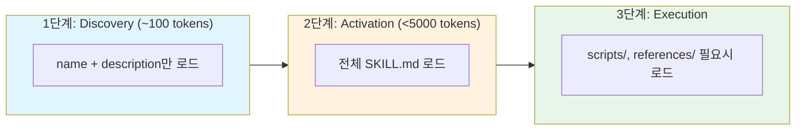

### 2.2 설계 원칙

1. **Self-documenting**: 스킬 작성자나 사용자가 `SKILL.md`를 읽으면 무엇을 하는지 이해 가능
2. **Extensible**: 단순한 텍스트 지침부터 실행 가능한 코드, 에셋, 템플릿까지 확장 가능
3. **Portable**: 스킬은 단순한 파일이므로 편집, 버전 관리, 공유가 용이

### 2.3 두 가지 통합 방식


---

## 3. 스킬의 구조

### 3.1 디렉토리 구조

```
my-skill/
├── SKILL.md          # 필수: 지침 + 메타데이터
├── scripts/          # 선택: 실행 가능한 코드
│   └── extract.py
├── references/       # 선택: 추가 문서
│   └── REFERENCE.md
└── assets/           # 선택: 템플릿, 리소스
    └── template.json
```

### 3.2 SKILL.md 파일 포맷

```yaml
---
# 필수 필드
name: pdf-processing
description: PDF 파일에서 텍스트와 테이블 추출, 폼 작성, 문서 병합

# 선택 필드
license: Apache-2.0
compatibility: Requires Python 3.11+
allowed-tools: Bash(jq:*) Bash(git:*)  # 실험적
metadata:
  author: example-org
  version: "1.0"
---

# PDF Processing

## When to use this skill
Use this skill when the user needs to work with PDF files...

## How to extract text
1. Use pdfplumber for text extraction...

## How to fill forms
...
```

### 3.3 Frontmatter 필드 상세

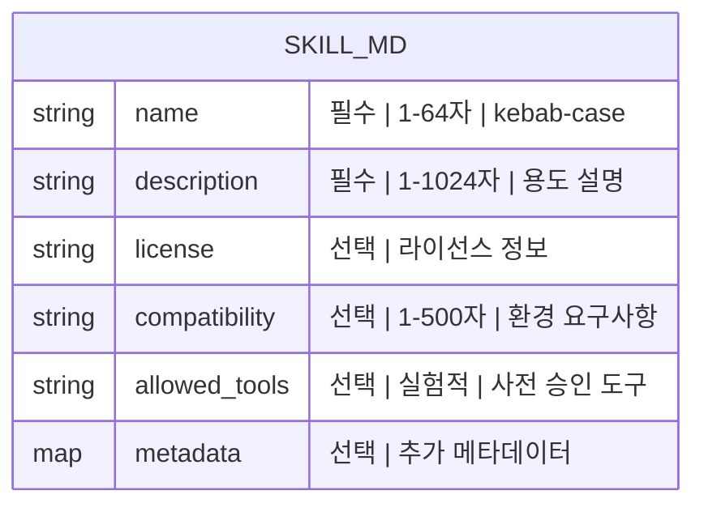

| 필드 | 필수 | 제약조건 |
|------|------|----------|
| `name` | O | 최대 64자, 소문자, 숫자, 하이픈만 허용, 하이픈으로 시작/끝 불가, 연속 하이픈 불가, 디렉토리명과 일치 필요 |
| `description` | O | 최대 1024자, 비어있으면 안됨, 스킬의 용도와 사용 시점 설명 |
| `license` | X | 라이선스명 또는 번들된 라이선스 파일 참조 |
| `compatibility` | X | 최대 500자, 환경 요구사항 (제품, 시스템 패키지, 네트워크 등) |
| `allowed-tools` | X | 공백으로 구분된 사전 승인 도구 목록 (실험적) |
| `metadata` | X | 문자열-문자열 맵, 클라이언트별 추가 속성 |

### 3.4 이름 규칙 시각화

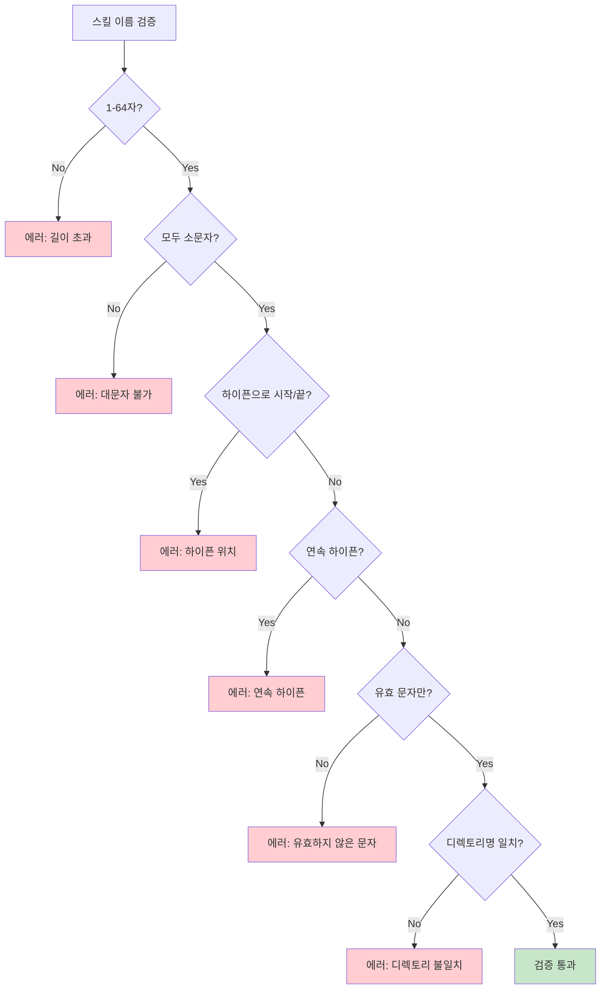

---

## 4. 레퍼런스 라이브러리 아키텍처

### 4.1 모듈 구조

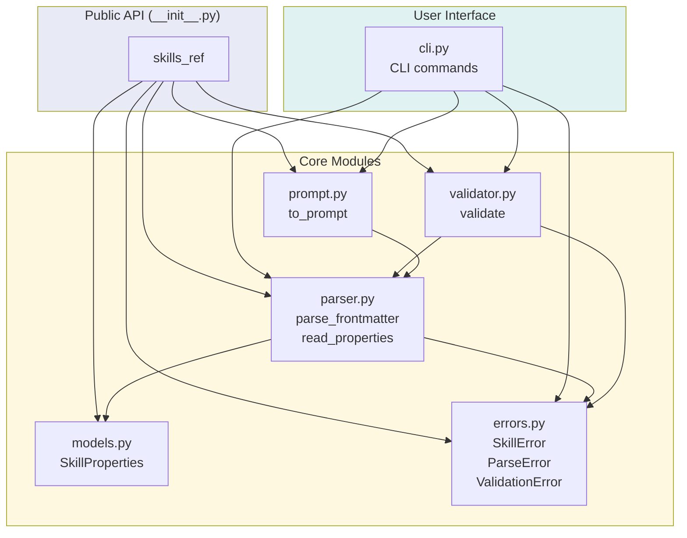

### 4.2 핵심 클래스: SkillProperties

```python
@dataclass
class SkillProperties:
    """SKILL.md frontmatter에서 파싱된 속성"""

    # 필수 필드
    name: str           # kebab-case 이름
    description: str    # 용도 설명

    # 선택 필드
    license: Optional[str] = None
    compatibility: Optional[str] = None
    allowed_tools: Optional[str] = None
    metadata: dict[str, str] = field(default_factory=dict)

    def to_dict(self) -> dict:
        """None 값 제외하고 딕셔너리로 변환"""
```

### 4.3 에러 계층 구조

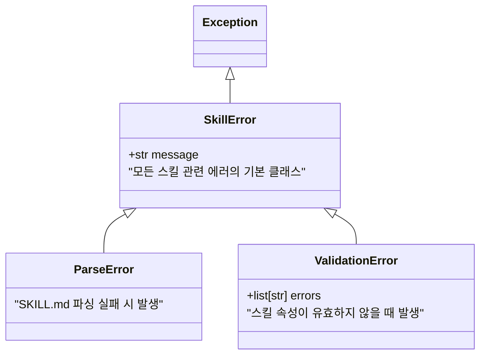

### 4.4 의존성

```toml
[project]
requires-python = ">=3.11"
dependencies = [
    "click>=8.0",       # CLI 프레임워크
    "strictyaml>=1.7.3" # YAML 파싱 (타입 안전)
]
```

---

## 5. 동작 원리: Progressive Disclosure

### 5.1 3단계 로딩 메커니즘

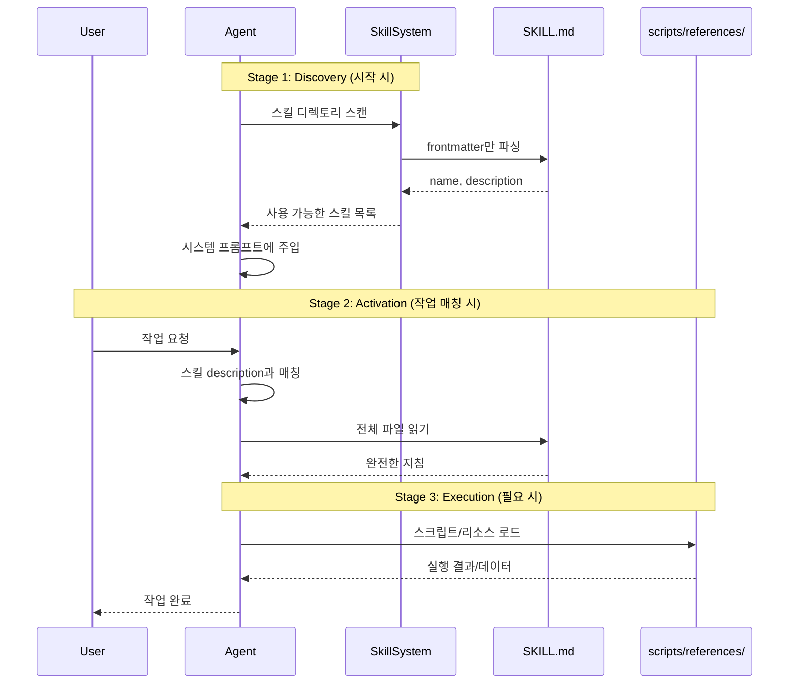

### 5.2 토큰 예산 관리

| 단계 | 토큰 사용량 | 로드 시점 |
|------|-------------|-----------|
| Metadata | ~100 tokens/skill | 시작 시 모든 스킬 |
| Instructions | <5000 tokens 권장 | 스킬 활성화 시 |
| Resources | 필요한 만큼 | 실행 중 필요 시 |

**권장사항**: SKILL.md는 500줄 미만으로 유지하고, 상세한 참고 자료는 별도 파일로 분리

---

## 6. 데이터 흐름 및 처리 파이프라인

### 6.1 파싱 파이프라인

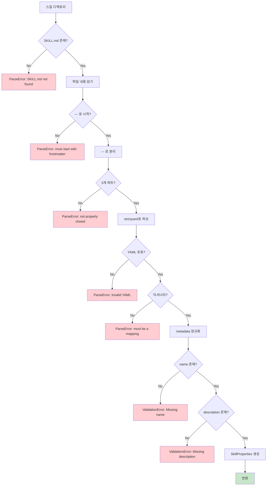

### 6.2 핵심 함수: parse_frontmatter

```python
def parse_frontmatter(content: str) -> tuple[dict, str]:
    """SKILL.md 내용에서 YAML frontmatter 파싱

    Args:
        content: SKILL.md 파일의 원시 내용

    Returns:
        (메타데이터 딕셔너리, 마크다운 본문) 튜플

    Raises:
        ParseError: frontmatter가 없거나 유효하지 않을 때
    """
    # 1. --- 로 시작하는지 확인
    if not content.startswith("---"):
        raise ParseError("SKILL.md must start with YAML frontmatter (---)")

    # 2. --- 로 분리
    parts = content.split("---", 2)
    if len(parts) < 3:
        raise ParseError("SKILL.md frontmatter not properly closed with ---")

    frontmatter_str = parts[1]
    body = parts[2].strip()

    # 3. strictyaml로 파싱 (타입 안전)
    try:
        parsed = strictyaml.load(frontmatter_str)
        metadata = parsed.data
    except strictyaml.YAMLError as e:
        raise ParseError(f"Invalid YAML in frontmatter: {e}")

    # 4. 딕셔너리인지 확인
    if not isinstance(metadata, dict):
        raise ParseError("SKILL.md frontmatter must be a YAML mapping")

    # 5. metadata 필드 문자열로 정규화
    if "metadata" in metadata and isinstance(metadata["metadata"], dict):
        metadata["metadata"] = {str(k): str(v) for k, v in metadata["metadata"].items()}

    return metadata, body
```

### 6.3 핵심 함수: read_properties

```python
def read_properties(skill_dir: Path) -> SkillProperties:
    """SKILL.md frontmatter에서 스킬 속성 읽기

    전체 검증을 수행하지 않음. 검증은 validate() 사용.
    """
    skill_dir = Path(skill_dir)
    skill_md = find_skill_md(skill_dir)  # SKILL.md 또는 skill.md

    if skill_md is None:
        raise ParseError(f"SKILL.md not found in {skill_dir}")

    content = skill_md.read_text()
    metadata, _ = parse_frontmatter(content)

    # 필수 필드 확인
    if "name" not in metadata:
        raise ValidationError("Missing required field in frontmatter: name")
    if "description" not in metadata:
        raise ValidationError("Missing required field in frontmatter: description")

    # SkillProperties 생성 및 반환
    return SkillProperties(
        name=metadata["name"].strip(),
        description=metadata["description"].strip(),
        license=metadata.get("license"),
        compatibility=metadata.get("compatibility"),
        allowed_tools=metadata.get("allowed-tools"),
        metadata=metadata.get("metadata"),
    )
```

---

## 7. 검증(Validation) 시스템

### 7.1 검증 흐름

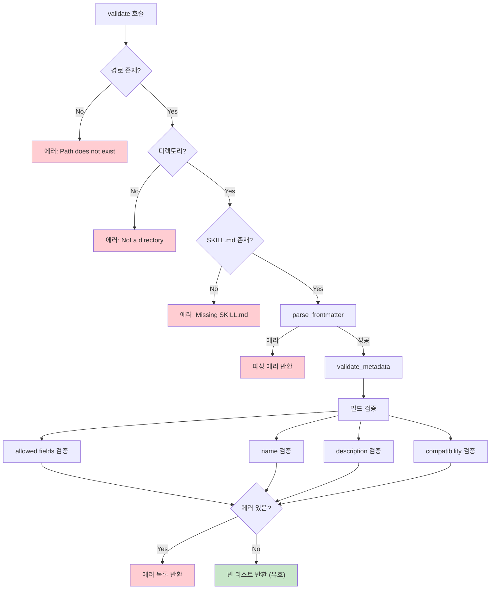

### 7.2 검증 상수

```python
MAX_SKILL_NAME_LENGTH = 64
MAX_DESCRIPTION_LENGTH = 1024
MAX_COMPATIBILITY_LENGTH = 500

ALLOWED_FIELDS = {
    "name",
    "description",
    "license",
    "allowed-tools",
    "metadata",
    "compatibility",
}
```

### 7.3 이름 검증 로직

```python
def _validate_name(name: str, skill_dir: Path) -> list[str]:
    """스킬 이름 형식 및 디렉토리 매칭 검증

    스킬 이름은 i18n 문자(유니코드 문자) + 하이픈 지원
    소문자여야 하며 하이픈으로 시작/끝 불가
    """
    errors = []

    # NFKC 정규화 (유니코드 정규화)
    name = unicodedata.normalize("NFKC", name.strip())

    # 길이 검사
    if len(name) > MAX_SKILL_NAME_LENGTH:
        errors.append(f"Skill name exceeds {MAX_SKILL_NAME_LENGTH} char limit")

    # 소문자 검사
    if name != name.lower():
        errors.append(f"Skill name must be lowercase")

    # 하이픈 위치 검사
    if name.startswith("-") or name.endswith("-"):
        errors.append("Skill name cannot start or end with a hyphen")

    # 연속 하이픈 검사
    if "--" in name:
        errors.append("Skill name cannot contain consecutive hyphens")

    # 유효 문자 검사 (알파벳, 숫자, 하이픈만)
    if not all(c.isalnum() or c == "-" for c in name):
        errors.append("Only letters, digits, and hyphens are allowed")

    # 디렉토리 이름 매칭 검사
    if skill_dir:
        dir_name = unicodedata.normalize("NFKC", skill_dir.name)
        if dir_name != name:
            errors.append(f"Directory name must match skill name")

    return errors
```

### 7.4 i18n (국제화) 지원

스킬 이름은 유니코드 문자를 지원합니다:

```yaml
# 중국어 예시
name: 技能
description: A skill with Chinese name

# 러시아어 예시
name: мой-навык
description: A skill with Russian name

# 프랑스어 (악센트 포함)
name: café
description: A skill with French accented name
```

**NFKC 정규화**: `café` (분해형, 5자)와 `café` (합성형, 4자)를 동일하게 처리

---

## 8. 프롬프트 생성 시스템

### 8.1 XML 프롬프트 형식

에이전트 시스템 프롬프트에 주입할 `<available_skills>` XML 블록을 생성합니다.

```xml
<available_skills>
<skill>
<name>
pdf-processing
</name>
<description>
Extract text and tables from PDF files, fill forms, merge documents.
</description>
<location>
/path/to/pdf-processing/SKILL.md
</location>
</skill>
<skill>
<name>
data-analysis
</name>
<description>
Analyze datasets, generate charts, and create summary reports.
</description>
<location>
/path/to/data-analysis/SKILL.md
</location>
</skill>
</available_skills>
```

### 8.2 프롬프트 생성 로직

```python
def to_prompt(skill_dirs: list[Path]) -> str:
    """에이전트 프롬프트용 <available_skills> XML 블록 생성

    이 XML 형식은 Anthropic이 Claude 모델에 권장하는 형식.
    스킬 클라이언트는 자신의 모델에 맞게 다르게 포맷할 수 있음.
    """
    if not skill_dirs:
        return "<available_skills>\n</available_skills>"

    lines = ["<available_skills>"]

    for skill_dir in skill_dirs:
        skill_dir = Path(skill_dir).resolve()
        props = read_properties(skill_dir)

        lines.append("<skill>")
        lines.append("<name>")
        lines.append(html.escape(props.name))    # XML 특수문자 이스케이프
        lines.append("</name>")
        lines.append("<description>")
        lines.append(html.escape(props.description))
        lines.append("</description>")

        skill_md_path = find_skill_md(skill_dir)
        lines.append("<location>")
        lines.append(str(skill_md_path))  # 절대 경로
        lines.append("</location>")

        lines.append("</skill>")

    lines.append("</available_skills>")

    return "\n".join(lines)
```

### 8.3 보안: XML 이스케이프

description에 XML 특수문자가 포함되면 자동 이스케이프:

```python
# 입력
description: Use <foo> & <bar> tags

# 출력
<description>
Use &lt;foo&gt; &amp; &lt;bar&gt; tags
</description>
```

---

## 9. 스킬 개발 가이드

### 9.1 빠른 시작 예제

**1단계: 디렉토리 생성**

```bash
mkdir my-awesome-skill
cd my-awesome-skill
```

**2단계: SKILL.md 작성**

```markdown
---
name: my-awesome-skill
description: 사용자가 특정 작업을 수행해야 할 때 사용. 예를 들어...
license: MIT
metadata:
  author: your-name
  version: "1.0"
---

# My Awesome Skill

## When to use this skill
이 스킬은 사용자가 다음을 원할 때 사용합니다:
- 조건 1
- 조건 2

## Instructions

### Step 1: 첫 번째 단계
상세한 지침...

### Step 2: 두 번째 단계
상세한 지침...

## Examples

### Example 1
입력: ...
출력: ...

## Edge Cases
- 에지 케이스 1: 처리 방법...
- 에지 케이스 2: 처리 방법...
```

**3단계: 검증**

```bash
# 스킬 검증
skills-ref validate ./my-awesome-skill

# 속성 읽기
skills-ref read-properties ./my-awesome-skill

# 프롬프트 생성 테스트
skills-ref to-prompt ./my-awesome-skill
```

### 9.2 완전한 스킬 예제: PDF 처리

```
pdf-processing/
├── SKILL.md
├── scripts/
│   ├── extract_text.py
│   └── merge_pdfs.py
├── references/
│   └── PDFLIB_GUIDE.md
└── assets/
    └── form_template.json
```

**SKILL.md**:

```markdown
---
name: pdf-processing
description: PDF 파일에서 텍스트와 테이블 추출, 폼 작성, 문서 병합. PDF 문서 작업이나 사용자가 PDF, 폼, 문서 추출을 언급할 때 사용.
license: Apache-2.0
compatibility: Requires Python 3.11+ and pdfplumber package
allowed-tools: Bash(python:*) Read
metadata:
  author: example-org
  version: "2.1"
---

# PDF Processing

## When to use this skill
Use this skill when the user needs to:
- Extract text from PDF files
- Extract tables from PDF documents
- Fill PDF forms
- Merge multiple PDF files

## Prerequisites
Ensure pdfplumber is installed:
```bash
pip install pdfplumber
```

## Text Extraction

### Basic Usage
To extract text from a PDF file:

```python
import pdfplumber

with pdfplumber.open("document.pdf") as pdf:
    for page in pdf.pages:
        text = page.extract_text()
        print(text)
```

### For complex layouts
See [references/PDFLIB_GUIDE.md](references/PDFLIB_GUIDE.md) for advanced extraction techniques.

## Table Extraction

```python
with pdfplumber.open("document.pdf") as pdf:
    page = pdf.pages[0]
    tables = page.extract_tables()
    for table in tables:
        for row in table:
            print(row)
```

## Merging PDFs

Run the merge script:
```bash
python scripts/merge_pdfs.py input1.pdf input2.pdf -o output.pdf
```

## Common Issues

1. **Empty text extraction**: The PDF may be image-based. Use OCR.
2. **Garbled characters**: Check encoding, may need font mapping.
```

### 9.3 스킬 작성 모범 사례

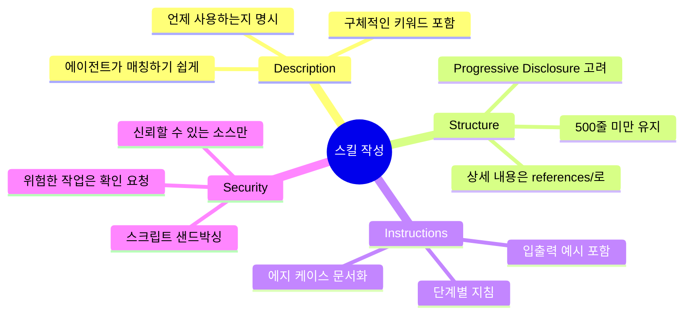

### 9.4 Python API 사용법

```python
from pathlib import Path
from skills_ref import validate, read_properties, to_prompt

# 스킬 검증
problems = validate(Path("my-skill"))
if problems:
    print("Validation errors:", problems)
else:
    print("Skill is valid!")

# 속성 읽기
props = read_properties(Path("my-skill"))
print(f"Name: {props.name}")
print(f"Description: {props.description}")
print(f"License: {props.license}")
print(f"Metadata: {props.metadata}")

# 여러 스킬의 프롬프트 생성
prompt = to_prompt([
    Path("skill-a"),
    Path("skill-b"),
    Path("skill-c")
])
print(prompt)
```

### 9.5 CLI 사용법

```bash
# 스킬 검증
skills-ref validate path/to/skill

# 속성 읽기 (JSON 출력)
skills-ref read-properties path/to/skill

# 프롬프트 생성 (여러 스킬)
skills-ref to-prompt path/to/skill-a path/to/skill-b

# 버전 확인
skills-ref --version
```

---

## 10. 에이전트 통합 가이드

### 10.1 통합 체크리스트

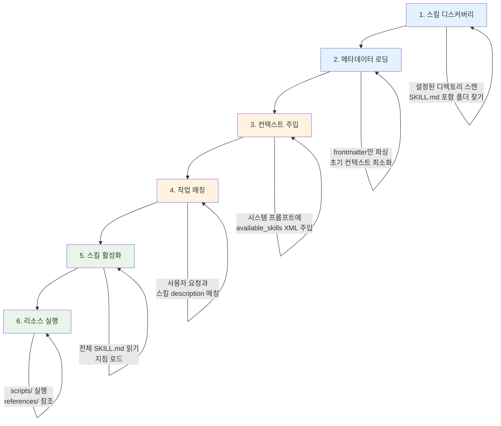

### 10.2 Filesystem-based Agent 구현

```python
# 1. 스킬 디스커버리
def discover_skills(skill_dirs: list[Path]) -> list[dict]:
    skills = []
    for dir in skill_dirs:
        for skill_path in dir.iterdir():
            if (skill_path / "SKILL.md").exists():
                skills.append(parse_metadata(skill_path))
    return skills

# 2. 시스템 프롬프트에 주입
def build_system_prompt(skills: list[dict]) -> str:
    xml = to_prompt([s["path"] for s in skills])
    return f"""You are a helpful assistant.

{xml}

When a task matches a skill's description, read the full SKILL.md file
using: cat <location>

Then follow the instructions in the skill.
"""

# 3. 에이전트는 자연스럽게 스킬 활성화
# 예: cat /path/to/pdf-processing/SKILL.md
```

### 10.3 Tool-based Agent 구현

```python
# 스킬 관련 도구 정의
tools = [
    {
        "name": "activate_skill",
        "description": "Activate a skill by name and get its full instructions",
        "parameters": {
            "skill_name": {"type": "string", "description": "Name of the skill"}
        }
    },
    {
        "name": "read_skill_resource",
        "description": "Read a resource file from an active skill",
        "parameters": {
            "skill_name": {"type": "string"},
            "resource_path": {"type": "string"}
        }
    },
    {
        "name": "run_skill_script",
        "description": "Execute a script from an active skill",
        "parameters": {
            "skill_name": {"type": "string"},
            "script_name": {"type": "string"},
            "args": {"type": "array", "items": {"type": "string"}}
        }
    }
]

# 도구 구현
def activate_skill(skill_name: str) -> str:
    skill_path = skills_map[skill_name]
    return (skill_path / "SKILL.md").read_text()

def read_skill_resource(skill_name: str, resource_path: str) -> str:
    skill_path = skills_map[skill_name]
    return (skill_path / resource_path).read_text()

def run_skill_script(skill_name: str, script_name: str, args: list) -> str:
    skill_path = skills_map[skill_name]
    script = skill_path / "scripts" / script_name
    # 샌드박스에서 실행
    return sandbox_execute(script, args)
```

### 10.4 보안 고려사항

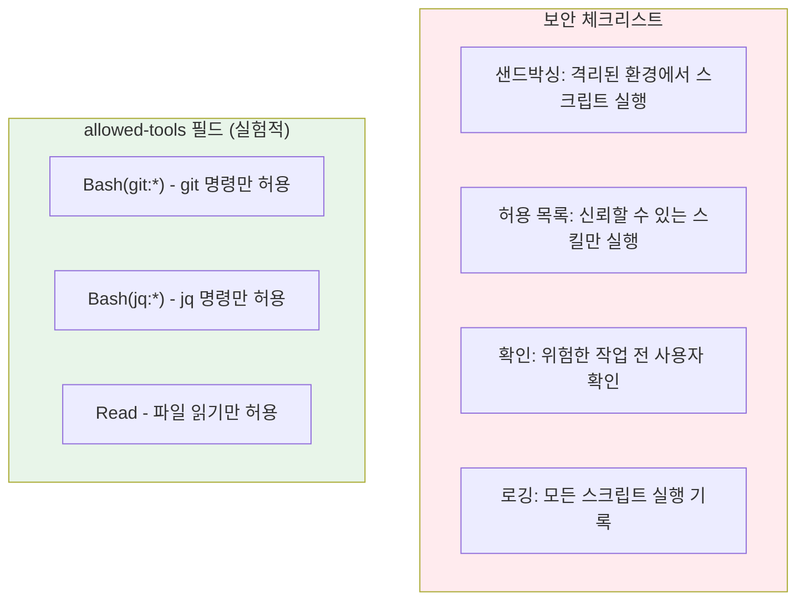

---

## 11. 핵심 프롬프트 및 원문

### 11.1 Progressive Disclosure 설명 (원문)

> **파일**: `docs/what-are-skills.mdx:16-26`

```markdown
## How skills work

Skills use **progressive disclosure** to manage context efficiently:

1. **Discovery**: At startup, agents load only the name and description of each
   available skill, just enough to know when it might be relevant.

2. **Activation**: When a task matches a skill's description, the agent reads
   the full `SKILL.md` instructions into context.

3. **Execution**: The agent follows the instructions, optionally loading
   referenced files or executing bundled code as needed.

This approach keeps agents fast while giving them access to more context on demand.
```

### 11.2 스킬 통합 핵심 (원문)

> **파일**: `docs/integrate-skills.mdx:17-26`

```markdown
## Overview

A skills-compatible agent needs to:

1. **Discover** skills in configured directories
2. **Load metadata** (name and description) at startup
3. **Match** user tasks to relevant skills
4. **Activate** skills by loading full instructions
5. **Execute** scripts and access resources as needed
```

### 11.3 토큰 예산 권장사항 (원문)

> **파일**: `docs/specification.mdx:197-205`

```markdown
## Progressive disclosure

Skills should be structured for efficient use of context:

1. **Metadata** (~100 tokens): The `name` and `description` fields are loaded
   at startup for all skills
2. **Instructions** (< 5000 tokens recommended): The full `SKILL.md` body is
   loaded when the skill is activated
3. **Resources** (as needed): Files (e.g. those in `scripts/`, `references/`,
   or `assets/`) are loaded only when required

Keep your main `SKILL.md` under 500 lines. Move detailed reference material
to separate files.
```

### 11.4 XML 프롬프트 형식 (원문)

> **파일**: `docs/integrate-skills.mdx:52-68`

```xml
<available_skills>
  <skill>
    <name>pdf-processing</name>
    <description>Extracts text and tables from PDF files, fills forms,
    merges documents.</description>
    <location>/path/to/skills/pdf-processing/SKILL.md</location>
  </skill>
  <skill>
    <name>data-analysis</name>
    <description>Analyzes datasets, generates charts, and creates
    summary reports.</description>
    <location>/path/to/skills/data-analysis/SKILL.md</location>
  </skill>
</available_skills>
```

---

## 요약

Agent Skills는 AI 에이전트에 전문 지식과 능력을 부여하기 위한 경량 오픈 포맷입니다.

**핵심 설계 원리**:
- **Progressive Disclosure**: 필요한 정보만 단계적으로 로드하여 컨텍스트 효율성 극대화
- **단순성**: `SKILL.md` 파일 하나로 시작 가능
- **확장성**: 스크립트, 참조 문서, 에셋 추가 가능
- **이식성**: 버전 관리 가능한 파일 기반 포맷

**레퍼런스 라이브러리**:
- Python 기반 파싱/검증/프롬프트 생성 도구
- CLI와 Python API 모두 제공
- strictyaml로 타입 안전한 YAML 파싱
- i18n 지원 (유니코드 문자)

**에이전트 통합**:
- Filesystem-based: shell 명령으로 스킬 활성화
- Tool-based: 전용 도구로 스킬 트리거
- 보안 고려: 샌드박싱, 허용 목록, 확인, 로깅

---

*이 문서는 https://github.com/agentskills/agentskills 레포지토리 분석을 바탕으로 작성되었습니다.*
