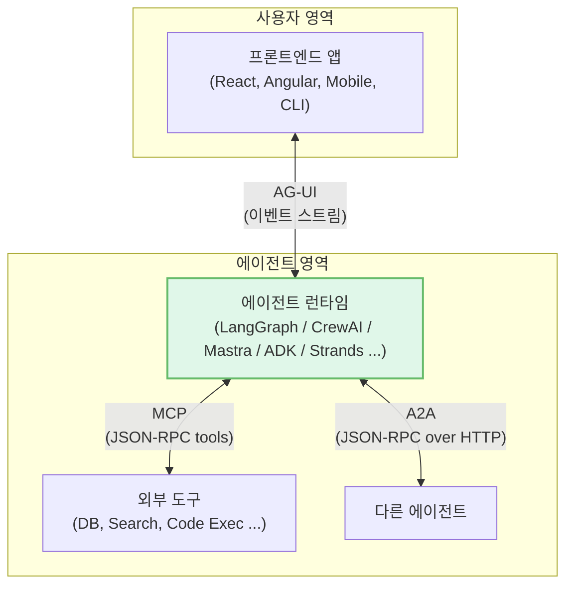
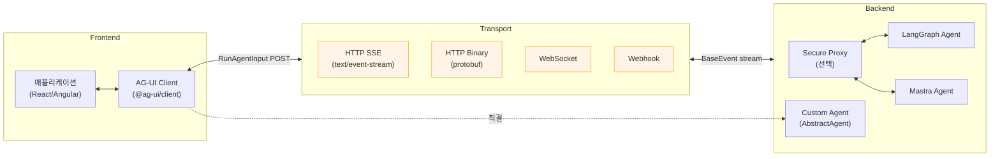
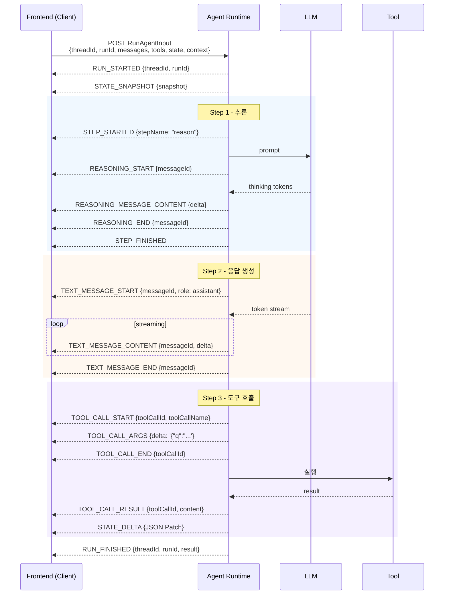
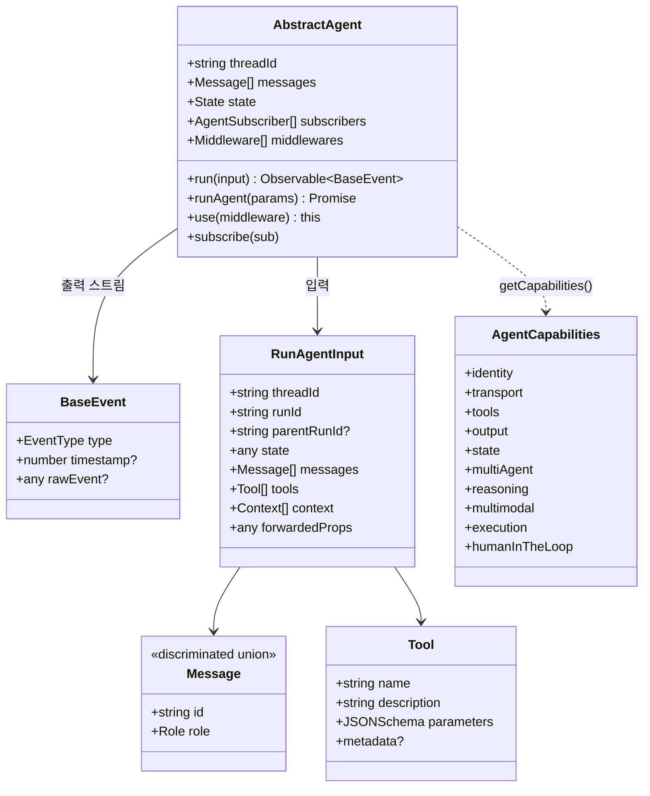
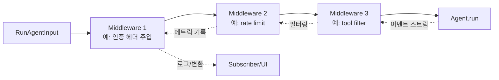
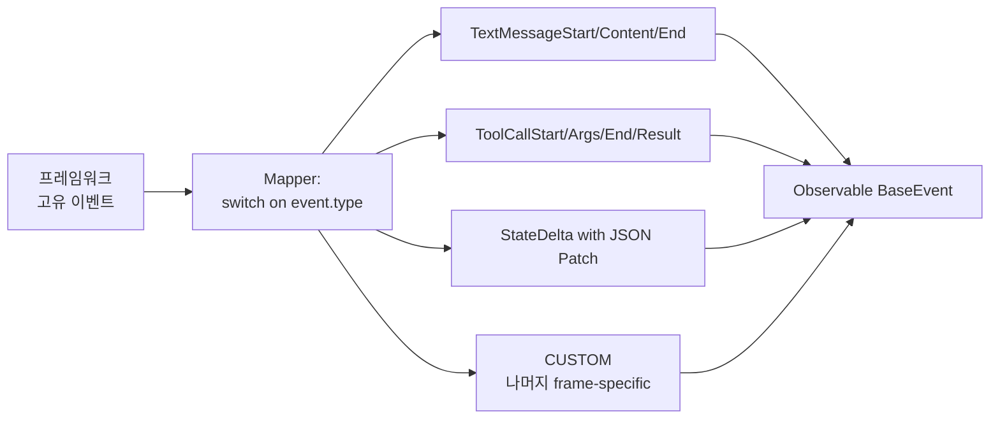
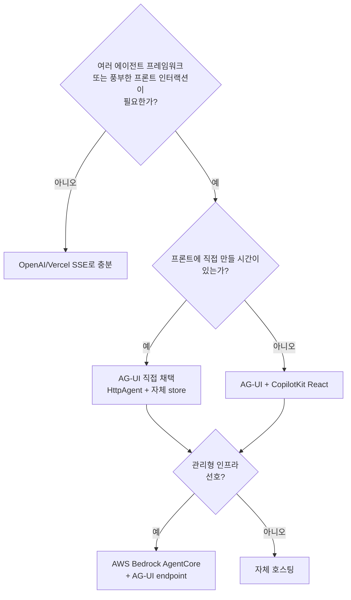

# AG-UI Protocol 심층 분석 (Agent–User Interaction Protocol)

> 대상 독자: 이 프로토콜로 실제 제품(에이전트 기반 챗봇, 코파일럿, 생성형 UI 앱)을 만들 소프트웨어 엔지니어
> 분석 시점: 2026-04 / 분석 버전: `@ag-ui/core` 0.0.4x 계열 / 저장소: https://github.com/ag-ui-protocol/ag-ui

---

## 0. 한 줄 요약 — "MCP가 도구, A2A가 에이전트끼리, AG-UI는 에이전트↔사용자"

AG-UI는 **에이전트 백엔드(LangGraph, CrewAI, Mastra, Pydantic AI, ADK 등)** 와 **사용자 프론트엔드(React/Angular 코파일럿, 모바일, CLI)** 사이를 흐르는 **약 32종의 표준 이벤트 스트림**을 정의한 오픈 프로토콜이다. SSE/WebSocket/Webhook/Protobuf 등 어떤 트랜스포트든 위에 얹을 수 있고, 이벤트 포맷이 100% 일치하지 않아도 미들웨어가 흡수해 주는 "느슨한 매칭(loose matching)"을 지향한다. CopilotKit이 만들었고, 2026년 현재 LangChain, AWS, Microsoft, Google, Oracle 등이 1st-party로 채택했다.

---

## 1. 프로젝트 개요

### 1.1 무엇을 푸는가 (Problem Statement)

LLM 백엔드 → 사용자 UI로 결과를 흘려보내는 작업은 매번 새로 짜야 했다.

- **OpenAI 스트리밍 포맷, Anthropic 포맷, LangGraph events, Mastra streamParts, Vercel AI SDK Data Stream Protocol** 등이 모두 다르다.
- 메시지/툴콜뿐 아니라 **에이전트 내부 상태(state), 추론 과정(reasoning), 활동(activity), human-in-the-loop 인터럽트** 같은 "에이전트 특유의" 정보를 표준화한 채널이 없었다.
- 결과적으로 프론트엔드는 에이전트마다 streaming 파서·상태 동기화 코드를 새로 구현했다.

AG-UI는 **"에이전트가 어떤 프레임워크로 만들어졌든 한 가지 이벤트 스키마로 UI에 도달하게 하자"** 는 인터페이스 계약이다. MCP가 LLM↔도구 사이의 "USB-C"였다면, AG-UI는 에이전트↔UI 사이의 USB-C를 노린다.

### 1.2 탄생 배경

CopilotKit(인앱 코파일럿 SDK)이 LangGraph·CrewAI를 React UI에 붙이면서 만든 내부 규약을 2025년에 외부 표준으로 공개한 것이 시작이다. 이후 1년 사이에 다음 흐름이 생겼다.

- **AWS** Bedrock AgentCore가 AG-UI 엔드포인트를 1st-party 지원
- **Microsoft** Agent Framework, **Google ADK**, **Oracle Agent Spec** 채택
- **A2UI**(Google이 만든 generative UI 위젯 스펙)와 페어링 — A2UI가 "UI를 어떻게 그리느냐"라면 AG-UI는 "어떤 트랜스포트로 보내느냐"

### 1.3 프로토콜 스택에서의 위치



세 프로토콜은 **경쟁이 아니라 보완**이다. TCP·HTTP·HTML이 같이 일하듯이, 한 에이전트 시스템에서 MCP로 도구를 부르고 A2A로 다른 에이전트를 호출하면서 AG-UI로 사용자에게 결과를 흘린다.

---

## 2. 핵심 특징 및 차별점

### 2.1 6가지 핵심 기능 (README의 Features)

| 기능 | 의미 | 구현 위치 |
|---|---|---|
| 💬 **실시간 스트리밍 채팅** | 토큰 단위로 메시지를 UI에 흘림 | `TEXT_MESSAGE_*` 이벤트 |
| 🔄 **양방향 상태 동기화** | 에이전트 내부 state를 UI와 공유, JSON Patch로 증분 갱신 | `STATE_SNAPSHOT` / `STATE_DELTA` |
| 🧩 **Generative UI / 구조화 메시지** | 에이전트가 UI 위젯·컴포넌트를 동적으로 그림 | `ToolCall` + 프론트 정의 도구, A2UI 스펙 |
| 🧠 **실시간 컨텍스트 보강** | 사용자 화면 정보를 에이전트로 역방향 주입 | `RunAgentInput.context`, `forwardedProps` |
| 🛠️ **프론트엔드 도구 통합** | 도구를 백엔드가 아닌 프론트가 정의해서 넘김 | `RunAgentInput.tools`, `clientProvided` capability |
| 🧑‍💻 **Human-in-the-Loop** | 승인·개입·피드백을 에이전트 흐름 안에 통합 | `humanInTheLoop` capability, suspend/resume 패턴 |

### 2.2 다른 스트리밍 포맷과의 본질적 차이

대부분의 스트리밍 프로토콜(OpenAI delta, Vercel AI SDK Data Stream)은 **"어떤 텍스트가 추가됐다"** 만 다룬다. AG-UI가 다른 점은 **에이전트 런타임의 1급 개념을 그대로 이벤트화**한 것이다.

- **Run / Step / ToolCall / Reasoning**이 별도 lifecycle 이벤트로 존재 → UI가 "지금 3단계 중 2단계, 도구 2개 호출 중" 같은 진행상황을 정확히 표현 가능
- **state가 1급 시민** → 에이전트가 단순 텍스트 생성기가 아니라 "공유 상태를 가진 협업자"로 모델링됨
- **rawEvent 필드**로 원본 이벤트를 유지 → 프레임워크 종속 디버깅 가능

### 2.3 "느슨한 매칭(Loose Matching)" 철학

가장 실용적인 차별점. 이벤트가 **반드시 AG-UI 포맷이어야 하는 게 아니라 AG-UI 호환이면 된다**. 미들웨어 체인이 자동으로 정규화한다.

```
원본 LangGraph event 
   → langgraph integration이 AGUIEvent로 변환 
   → middleware가 chunk 정규화 (TEXT_MESSAGE_CHUNK → START/CONTENT/END) 
   → 구버전 호환 미들웨어가 deprecated THINKING_* 변환 
   → 최종 클라이언트 구독자에 전달
```

→ 새 프레임워크를 통합할 때 **이미 가진 이벤트 스트림을 살짝 매핑만** 하면 된다.

---

## 3. 아키텍처 분석

### 3.1 전체 시스템 구조



핵심 추상화는 단 하나의 메서드:

```typescript
abstract class AbstractAgent {
  abstract run(input: RunAgentInput): Observable<BaseEvent>
}
```

이걸 구현하면 어떤 에이전트든 AG-UI 호환이 된다. `HttpAgent`는 이걸 SSE/binary 위에 표준 구현한 것이고, 나머지 19개 통합(`langgraph`, `mastra`, `crewai`, `pydantic-ai`, `claude-agent-sdk`, `vercel-ai-sdk` 등)은 각각 프레임워크 이벤트를 RxJS Observable로 매핑한 어댑터다.

### 3.2 데이터 흐름 — 한 번의 Run 생명주기



### 3.3 핵심 개념 모델



### 3.4 이벤트 카테고리 (총 32개 EventType)

`sdks/typescript/packages/core/src/events.ts`에 정의된 enum 기준.

```mermaid
flowchart TD
    Root[EventType]
    Root --> LC[Lifecycle]
    Root --> Msg[Text Message]
    Root --> TC[Tool Call]
    Root --> R[Reasoning]
    Root --> S[State]
    Root --> Act[Activity]
    Root --> Spec[Special]

    LC --> RUN_STARTED
    LC --> RUN_FINISHED
    LC --> RUN_ERROR
    LC --> STEP_STARTED
    LC --> STEP_FINISHED

    Msg --> TEXT_MESSAGE_START
    Msg --> TEXT_MESSAGE_CONTENT
    Msg --> TEXT_MESSAGE_END
    Msg --> TEXT_MESSAGE_CHUNK

    TC --> TOOL_CALL_START
    TC --> TOOL_CALL_ARGS
    TC --> TOOL_CALL_END
    TC --> TOOL_CALL_CHUNK
    TC --> TOOL_CALL_RESULT

    R --> REASONING_START
    R --> REASONING_MESSAGE_START
    R --> REASONING_MESSAGE_CONTENT
    R --> REASONING_MESSAGE_END
    R --> REASONING_MESSAGE_CHUNK
    R --> REASONING_END
    R --> REASONING_ENCRYPTED_VALUE

    S --> STATE_SNAPSHOT
    S --> STATE_DELTA
    S --> MESSAGES_SNAPSHOT

    Act --> ACTIVITY_SNAPSHOT
    Act --> ACTIVITY_DELTA

    Spec --> RAW
    Spec --> CUSTOM
```



각 카테고리는 **"명시적 종료 보장"** 패턴을 따른다. `RUN_STARTED`는 반드시 `RUN_FINISHED`/`RUN_ERROR` 중 하나로 닫히고, `TEXT_MESSAGE_START`는 같은 `messageId`의 `TEXT_MESSAGE_END`로 닫힌다. 클라이언트의 `verifyEvents` 모듈이 이 invariant를 검증한다.

### 3.5 미들웨어 체인 (양방향)



`agent.use(...)`로 등록하면 입력은 정방향, 이벤트는 역방향으로 흐른다. 빌트인 미들웨어:

- `FilterToolCallsMiddleware` — allow/deny 리스트로 TOOL_CALL_* 이벤트 제거
- `BackwardCompatibility_0_0_39 / 45 / 47` — 구버전 이벤트 자동 변환 (자동 삽입됨)

---

## 4. 기술 스택

| 레이어 | TypeScript SDK | Python SDK |
|---|---|---|
| 언어 | TypeScript 5+ | Python 3.10+ |
| 스키마 | Zod (런타임 검증 + 타입 추론) | Pydantic v2 |
| 스트리밍 | RxJS `Observable` | Iterator / async generator |
| 직렬화 | JSON over SSE 기본, Protobuf 옵션 | 동일 |
| 빌드 | Nx 모노레포, pnpm workspaces, tsdown | uv / poetry |
| 트랜스포트 | `fetch` + `EventSource` 파싱 | `httpx`, `sse-starlette` |
| 테스트 | vitest | unittest |

### 패키지 구성 (TypeScript)

```
@ag-ui/core      → 이벤트·타입·capabilities 정의 (의존성: zod만)
@ag-ui/client    → AbstractAgent, HttpAgent, 미들웨어, RxJS 변환 파이프라인
@ag-ui/encoder   → SSE/Protobuf 인코딩 (서버에서 사용)
@ag-ui/proto     → .proto 스키마와 protobuf 직렬화
@ag-ui/cli       → create-ag-ui-app 스캐폴더
```

핵심 통찰: **`core`는 의존성이 사실상 zod 하나뿐**이다. 즉 어떤 환경에서도 가볍게 가져와 이벤트 타입만 쓸 수 있다.

---

## 5. 핵심 코드 분석

### 5.1 `AbstractAgent.runAgent()` 흐름

`sdks/typescript/packages/client/src/agent/agent.ts`. 핵심 로직 요약:

1. `prepareRunAgentInput()`로 `threadId/runId/messages/state/tools/context` 조립
2. `subscribers` 배열을 합치고 `onInitialize` 훅 호출
3. **미들웨어 체인을 `reduceRight`로 감싸서** 가장 바깥 미들웨어부터 next agent를 호출하는 함수형 체인을 만든다
4. 결과 Observable에 `transformChunks` (chunk → 표준 이벤트), `verifyEvents` (invariant 검사), `convertToLegacyEvents` (구버전 호환) 등을 RxJS pipe로 연결
5. 각 이벤트마다 `defaultApplyEvents`가 `agent.messages`/`agent.state`를 변경(상태 mutation), 변경분을 subscriber에게 통보

이 구조 덕분에 **클라이언트는 "스트림을 구독"만 하면 messages/state가 자동으로 동기화**된다. React 같은 UI는 `agent.messages`를 그대로 렌더링하면 된다.

### 5.2 `HttpAgent` — 표준 HTTP 클라이언트

```typescript
// http.ts 핵심
export class HttpAgent extends AbstractAgent {
  url: string
  headers: Record<string, string>
  abortController = new AbortController()

  protected requestInit(input: RunAgentInput): RequestInit {
    return {
      method: "POST",
      headers: {
        ...this.headers,
        "Content-Type": "application/json",
        Accept: "text/event-stream",
      },
      body: JSON.stringify(input),
      signal: this.abortController.signal,
    }
  }

  run(input: RunAgentInput): Observable<BaseEvent> {
    const httpEvents = runHttpRequest(this.url, this.requestInit(input))
    return transformHttpEventStream(httpEvents, this.debugLogger)
  }
}
```

핵심 패턴: **"백엔드 = POST 받고 SSE 응답하는 단일 엔드포인트"**. 서버 starter는 진짜 한 줄이다.

```typescript
// integrations/server-starter/typescript/src/index.ts
import { HttpAgent } from "@ag-ui/client";
export class ServerStarterAgent extends HttpAgent {}
```

### 5.3 통합 어댑터 패턴

LangGraph 통합(`integrations/langgraph/typescript/src/agent.ts`)은 `LangGraphAgent extends AbstractAgent`를 만들고, 내부에서 LangGraph SDK의 `client.runs.stream()`이 뱉는 LangGraph 이벤트를 약 23종의 AG-UI 이벤트로 매핑한다. `interrupts`, `predict_state`, sub-graph 스트리밍 같은 LangGraph 고유 개념도 `STATE_DELTA` + `CUSTOM` 이벤트로 정직하게 변환한다.

Mastra(`integrations/mastra/typescript/src/mastra.ts`)도 동일 패턴이지만 Mastra의 `streamParts` (textPart/reasoningPart/toolCallPart 등)를 더 얇은 매핑으로 처리한다. 통합 코드 길이로 그 프레임워크와 AG-UI의 의미적 거리가 가늠된다 — 짧을수록 "원래 비슷한 모델".

### 5.4 Encoder — 서버 사이드

```typescript
// encoder.ts
encodeSSE(event: BaseEvent): string {
  return `data: ${JSON.stringify(event)}\n\n`
}

encodeProtobuf(event: BaseEvent): Uint8Array {
  // [4 byte big-endian length] + protobuf bytes
}
```

SSE는 "한 줄 JSON"으로 끝나는 매우 단순한 와이어 포맷이다. Protobuf 모드는 길이 prefix 프레이밍이라 WebSocket/HTTP/2 binary 어디든 얹을 수 있다.

### 5.5 Capabilities — 런타임 디스커버리

`AgentCapabilities`는 에이전트가 자신의 지원 기능을 카탈로그화한 객체다. 중요한 카테고리:

- `transport` — streaming/websocket/httpBinary/pushNotifications/resumable
- `tools` — supported/parallelCalls/clientProvided + 자체 제공 도구 목록
- `state` — snapshots/deltas/memory/persistentState
- `multiAgent` — delegation/handoffs/subAgents
- `reasoning` — supported/streaming/encrypted (ZDR 모드)
- `multimodal.input/output` — image/audio/video/pdf/file
- `humanInTheLoop` — approvals/interventions/feedback

이 객체로 클라이언트가 **"이 에이전트는 음성 입력 받나? 도구 병렬 호출 되나?"** 를 동적으로 체크해 UI를 켜고 끈다.

---

## 6. API 및 인터페이스

### 6.1 서버에 무엇을 보내는가 — `RunAgentInput`

```typescript
{
  threadId: string,        // 대화 스레드 ID (대화 단위)
  runId: string,           // 이번 한 번의 실행 ID
  parentRunId?: string,    // 분기/타임트래블용 lineage
  state: any,              // 현재 공유 state (양방향)
  messages: Message[],     // 누적 대화 히스토리
  tools: Tool[],           // 프론트가 정의한 도구들 (JSON Schema)
  context: Context[],      // {description, value} — 화면 컨텍스트 등
  forwardedProps: any      // 통과용 메타 (auth header 등)
}
```

`tools`가 프론트에서 들어가는 것이 핵심. **프론트가 정의한 도구를 백엔드 LLM이 호출** → 결과는 다시 프론트에서 실행 → tool result를 다음 run의 messages에 포함. 이게 human-in-the-loop의 골격이다.

### 6.2 메시지 모델 — 7가지 role

```
developer | system | assistant | user | tool | activity | reasoning
```

`activity`는 "도구 진행상황" 같은 비대화 정보, `reasoning`은 chain-of-thought를 분리해 담는다. `user` 메시지의 `content`는 `string` 또는 multimodal `InputContentPart[]` (text/image/audio/video/document)이다.

### 6.3 표준 엔드포인트 컨벤션

AG-UI는 라우팅을 강제하지 않지만 사실상 컨벤션:

```
POST /agent
Content-Type: application/json
Accept: text/event-stream      (또는 application/vnd.ag-ui+protobuf)

Body: RunAgentInput JSON

Response: text/event-stream of "data: {BaseEvent}\n\n"
```

### 6.4 클라이언트 Subscriber 인터페이스

```typescript
agent.subscribe({
  onTextMessageContent: ({ event }) => updateUI(event.delta),
  onToolCall: ({ event }) => maybeRenderWidget(event),
  onStateSnapshot: ({ event }) => store.replace(event.snapshot),
  onStateDelta:    ({ event }) => store.applyJsonPatch(event.delta),
  onRunFinished:   ({ result }) => showDone(result),
  // ... 32 종 이벤트별 콜백
})
```

타입별 hook을 그대로 받기 때문에 React에서는 store(Zustand/Redux/jotai)에 직접 dispatch하면 끝.

---

## 7. 확장성 및 플러그인

### 7.1 새 에이전트 프레임워크 통합하기



체크리스트:
1. `class MyAgent extends AbstractAgent { run(input) { return new Observable(...) } }`
2. 프레임워크 이벤트 → AG-UI 이벤트 매퍼 작성 (대부분 50~300줄)
3. 표현 못 하는 의미는 `CustomEvent` + `name`/`value`로 떨어뜨림
4. 선택: `getCapabilities()` 구현해서 UI가 기능 가시화

저장소의 19개 통합(`integrations/`)이 살아있는 레퍼런스다 — 가장 간단한 건 `server-starter` (1줄), 가장 풍부한 건 `langgraph` (~1500줄).

### 7.2 미들웨어 확장 포인트

함수 또는 클래스로 작성 가능. RxJS 연산자를 그대로 쓸 수 있어서 `tap`/`map`/`filter`/`catchError` 등으로 메트릭·로깅·인증·필터·재시도·rate limit을 구현한다.

```typescript
const authMw: MiddlewareFunction = (input, next) =>
  next.run({ ...input, forwardedProps: { ...input.forwardedProps, token } })
    .pipe(catchError(err => /* 토큰 갱신 후 재시도 */));
```

### 7.3 트랜스포트 교체

`HttpAgent`의 `requestInit()`만 오버라이드하거나, 아예 새 Agent 클래스를 만들어 WebSocket/Webhook/메시지 큐 위에 같은 Observable 인터페이스를 구현하면 된다.

---

## 8. 성능 특성

### 8.1 측정 가능한 강점

- **State delta**: 전체 state 대신 JSON Patch만 보내 대역폭 절감 (예: 100KB state에서 한 필드 갱신 시 50바이트 patch)
- **Protobuf 모드**: SSE 텍스트 대비 2~5배 압축, 파싱 비용 낮음 — 모바일·고빈도 스트리밍에 유리
- **Chunk normalization**: `*_CHUNK` 통합 이벤트로 LLM 토큰을 효율적으로 묶고, 클라이언트에서 정규 START/CONTENT/END로 분해

### 8.2 알려진 제약

- **이벤트 다양성의 비용**: 32종 이벤트는 풍부하지만 클라이언트 분기 로직이 늘어남. CopilotKit이 이걸 추상화해 주지만 직접 구현 시 boilerplate 발생
- **순서 보장은 동일 stream 내**: 멀티 트랜스포트로 분리 송출 시 순서·결합은 별도 책임
- **`resumable` capability는 선언적**: 끊긴 스트림을 sequence number로 이어붙이는 구현은 에이전트 책임
- **Java/Kotlin/Go SDK는 community 단계**: production 안정성은 TS/Python보다 떨어질 수 있음

### 8.3 스케일링 전략

표준 HTTP 1엔드포인트 모델이라 일반 웹 스케일링 패턴(로드밸런서, sticky session 불필요, 수평 확장)이 그대로 적용된다. `threadId`는 메모리/DB 어디에 두든 무방 — 프로토콜이 강제하지 않는다.

---

## 9. 배포 및 운영

### 9.1 시작하기 — 가장 빠른 경로

```bash
npx create-ag-ui-app my-agent-app
```

이 한 줄이 CopilotKit 프론트 + 선택한 백엔드 통합(LangGraph/Mastra/etc.) 보일러플레이트를 만든다.

### 9.2 직접 통합하기 (3가지 시나리오)

**시나리오 A — 프론트만 AG-UI**: 이미 LangGraph 백엔드가 있다면 `LangGraphAgent` 어댑터만 React 앱에 import. 백엔드 변경 0줄.

```typescript
import { LangGraphAgent } from "@ag-ui/langgraph"
const agent = new LangGraphAgent({ deploymentUrl, graphId })
```

**시나리오 B — 백엔드만 AG-UI**: FastAPI/Express에서 SSE 엔드포인트 한 개를 열고 `EventEncoder`로 표준 이벤트를 흘림. 프론트는 어떤 AG-UI 클라이언트(CopilotKit/CLI/모바일)든 붙는다.

**시나리오 C — 양쪽 다**: `HttpAgent` 직결. 가장 간단.

### 9.3 인프라 요구사항

- 일반 HTTP 서버면 충분. 관리형 옵션으로 **AWS Bedrock AgentCore**가 1st-party AG-UI 엔드포인트를 제공 — 호스팅·스케일·인증을 위임 가능
- LLM 키만 있으면 single-process로도 동작 (server-starter가 그 형태)

### 9.4 보안 고려사항

- `forwardedProps`로 인증 토큰 통과 — TLS 필수
- `REASONING_ENCRYPTED_VALUE`로 민감 reasoning을 클라이언트에 노출 없이 round-trip (ZDR 모드)
- 프론트 정의 도구는 **프론트에서 실행** → 권한 경계가 명확. 다만 LLM이 오용한 도구 호출을 `FilterToolCallsMiddleware`로 차단 가능

---

## 10. 경쟁·비교 분석

### 10.1 직접 비교 — "에이전트 ↔ UI 표준" 후보들

| 항목 | **AG-UI** | **Vercel AI SDK Data Stream** | **OpenAI Streaming** | **CopilotKit 자체 protocol (이전)** |
|---|---|---|---|---|
| 범위 | 에이전트 lifecycle 전체 + state + tool + reasoning | LLM 응답 스트리밍 + tool call | LLM 응답 스트리밍 | AG-UI의 전신 (지금은 AG-UI로 통합) |
| 이벤트 종류 | ~32 | ~10 | ~5 | — |
| State 동기화 | ✅ JSON Patch delta | ❌ | ❌ | ✅ |
| Reasoning 채널 | ✅ 분리됨 | ✅ start/delta/end | 부분적 (o1 reasoning summary) | ✅ |
| 트랜스포트 | SSE/Binary/WebSocket/Webhook | SSE | SSE | SSE |
| 에이전트 프레임워크 | 19개 1st/community | 일부 (자체 SDK 위주) | OpenAI Assistants API | LangGraph/CrewAI |
| 표준성 | 오픈, 다 벤더 채택 | Vercel 중심 | OpenAI 종속 | (단일 회사) |
| 베스트 핏 | **멀티 프레임워크 에이전트 + 풍부한 UI** | Next.js 챗봇 | OpenAI 직접 사용 | (deprecated) |

### 10.2 보완 관계 프로토콜

| 프로토콜 | 다루는 것 | AG-UI와의 관계 |
|---|---|---|
| **MCP** (Model Context Protocol, Anthropic) | LLM ↔ 외부 도구·데이터 | **상호보완**. AG-UI 백엔드가 MCP로 도구 호출 가능 |
| **A2A** (Agent-to-Agent, Google) | 에이전트 ↔ 에이전트 | **상호보완**. AG-UI 통합 중 1st-party A2A 지원 |
| **A2UI** (Google) | UI 위젯 spec (어떤 카드·폼인지) | **상호보완**. A2UI = 무엇을, AG-UI = 어떻게 전달 |
| **MCP-UI** | MCP 위에 UI 자원 노출 | 부분 경쟁/보완. AG-UI는 풀 양방향 런타임, MCP-UI는 MCP에 얹은 정적 UI 자원 모델에 가까움 |

### 10.3 "왜 안 쓸 수도 있는가"

- **단일 공급자 LLM(OpenAI Assistants 등)만 쓰고 프론트도 단순 챗**이면 OpenAI/Vercel 표준이 더 가벼움
- **에이전트가 단순 RAG 응답만** 한다면 32개 이벤트는 과한 추상화
- **멀티 프레임워크 운영이 없다면** 표준의 효익이 적음

반대로 **여러 프레임워크 혼용·고정된 프론트 UI 컴포넌트 라이브러리·human-in-the-loop·복잡한 state 동기화** 중 하나라도 있으면 AG-UI의 ROI가 가파르게 올라간다.

---

## 11. 종합 평가 — 엔지니어 관점 인사이트

### 11.1 강점

1. **얇은 핵심**: `@ag-ui/core`는 zod에만 의존. 어디든 이벤트 타입만 들고 가서 쓸 수 있다.
2. **이벤트 모델이 에이전트의 1급 개념을 그대로 담음**: Run/Step/Tool/Reasoning/State가 분리돼 UI 표현력이 매우 높다.
3. **느슨한 매칭 + 미들웨어 정규화**: 새 프레임워크 통합 비용이 낮다. `server-starter`가 1줄, 풍부한 LangGraph도 ~1500줄로 끝난다.
4. **벤더 중립성과 채택 모멘텀**: AWS·MS·Google·Oracle·LangChain이 모두 1st-party로 붙은 것은 프로토콜 표준화 게임에서 결정적이다.
5. **양방향 state + JSON Patch**: Web 앱에서 그동안 어색했던 "에이전트 내부 state 노출"을 자연스럽게 해결.
6. **CopilotKit이라는 레퍼런스 프론트**: 직접 32개 이벤트를 구현하고 싶지 않은 팀은 즉시 React 코파일럿을 얹을 수 있다.

### 11.2 약점·리스크

1. **명세 vs 구현의 모호한 경계**: 같은 의미가 `CUSTOM`/`RAW`/`ACTIVITY`로 흩어질 수 있어 통합마다 컨벤션이 다를 수 있다.
2. **Activity / Reasoning 진화 중**: deprecated 이벤트(THINKING_*) 자동 변환이 들어 있는 것에서 보이듯 1.0 이전이라 호환성 단절 가능.
3. **Java/Kotlin/Go/Rust SDK는 community 등급**: JVM·Go 백엔드 운영팀이라면 직접 유지보수 부담 가능성.
4. **Spec 권위 = CopilotKit**: 표준화 기구가 아닌 한 회사가 키를 쥐고 있다. AWS/MS의 채택이 무게추가 되지만 거버넌스 형태는 더 지켜봐야 한다.
5. **WebSocket/Webhook은 capability 선언만**: 실제 표준 구현은 SSE/Binary 위주. 양방향 push가 필요한 시나리오는 자체 구현 필요.

### 11.3 적합한 사용처

- **사내 코파일럿 / 인앱 AI 어시스턴트**: 화면 컨텍스트 주입 + 프론트 도구 + state 공유가 모두 필요
- **에이전트 팀이 LangGraph/Mastra/Pydantic AI 등 여러 프레임워크 혼용**: 프론트는 한 번만 만들면 됨
- **Generative UI 제품**: A2UI/MCP Apps와 자연스럽게 결합
- **Human-in-the-loop이 필수인 워크플로우**: 승인·개입을 이벤트로 표준화

### 11.4 부적합한 경우

- **단일 LLM 호출 + 텍스트 응답만**의 단순 챗봇: 오버엔지니어링
- **풀 음성 전화 같은 저지연 양방향 미디어**: WebRTC 등 전용 스택이 더 적합
- **백엔드만 있고 UI는 외부 시스템**: AG-UI의 클라이언트 측 가치가 낮음

### 11.5 도입 결정 가이드



### 11.6 학습 순서 추천 (제품 만들 엔지니어용)

1. **Dojo 둘러보기** — `https://dojo.ag-ui.com/` 에서 16개 빌딩 블록(예: shared_state, tool_based_generative_ui)을 직접 클릭해 본다. 각 데모는 50~200줄.
2. **`server-starter` 클론** — 백엔드 한 엔드포인트가 어떻게 생겼는지 본다.
3. **`@ag-ui/client` Subscriber로 console.log** — 32개 이벤트가 실제로 어떤 순서로 오는지 감을 잡는다.
4. **CopilotKit 옵션 평가** — 직접 렌더링 vs 코파일럿 사용 결정.
5. **하나의 통합(LangGraph/Mastra) 따라 만들기** — `integrations/langgraph/typescript/src/agent.ts`가 가장 실전적인 레퍼런스.

---

## 12. 핵심 한 페이지 요약

| 항목 | 내용 |
|---|---|
| **무엇** | 에이전트 백엔드 ↔ 사용자 UI 사이의 표준 이벤트 프로토콜 |
| **왜** | 프레임워크마다 다른 스트리밍/state/tool 포맷을 통일 |
| **누가** | CopilotKit 발의, AWS/MS/Google/Oracle/LangChain 채택 |
| **어떻게** | 32개 EventType의 SSE 또는 Protobuf 스트림, RxJS Observable 클라이언트 |
| **언제 쓰지 말까** | 단순 OpenAI 챗봇, 음성 RTC 등 |
| **언제 쓸까** | 코파일럿, 멀티 프레임워크 에이전트, generative UI, HITL |
| **시작점** | `npx create-ag-ui-app` / `https://dojo.ag-ui.com/` |
| **핵심 인터페이스** | `class MyAgent extends AbstractAgent { run(input): Observable<BaseEvent> }` |
| **레이어 위치** | MCP(도구) + A2A(에이전트끼리) + **AG-UI(사용자)** |

---

## 참고 자료

- 공식 저장소: https://github.com/ag-ui-protocol/ag-ui
- 공식 문서: https://docs.ag-ui.com/
- Dojo (라이브 데모): https://dojo.ag-ui.com/
- CopilotKit AG-UI 페이지: https://www.copilotkit.ai/ag-ui
- Microsoft Agent Framework 통합: https://learn.microsoft.com/en-us/agent-framework/integrations/ag-ui/
- AWS Bedrock AgentCore + AG-UI: https://docs.aws.amazon.com/bedrock-agentcore/latest/devguide/runtime-agui.html
- "Agent Protocol Stack": https://medium.com/codetodeploy/the-agent-protocol-stack-mcp-vs-a2a-vs-ag-ui-when-to-use-what-f735a5934293
- Google Developers — AI Agent Protocols 가이드: https://developers.googleblog.com/developers-guide-to-ai-agent-protocols/
