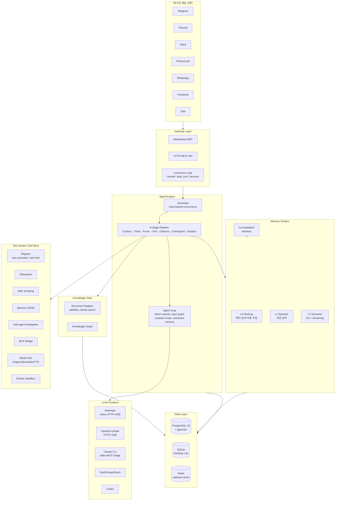
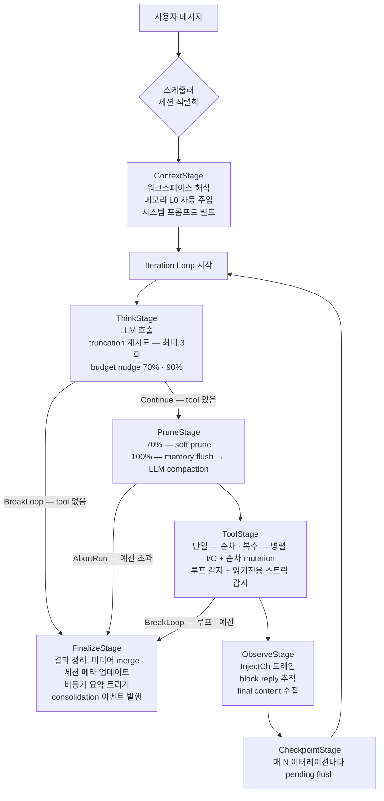
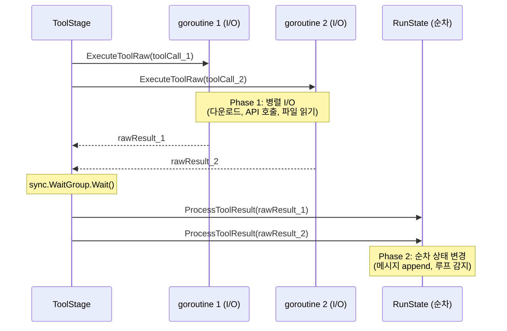
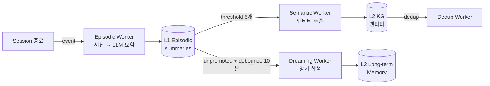

# GoClaw 심층 분석 — 에이전트 시스템 벤치마킹 관점

> **대상**: https://github.com/nextlevelbuilder/goclaw
> **언어/런타임**: Go 1.26, 단일 바이너리 (~25MB)
> **규모**: ~250K+ LOC (internal ~194K, http ~29K, cmd+pkg ~27K)
> **DB**: PostgreSQL 18 + pgvector (프로덕션) / SQLite (Desktop Lite 에디션)

---

## 1. 프로젝트 개요

### 1.1 핵심 정의

GoClaw 는 **멀티테넌트 AI 에이전트 플랫폼**이다. 20+ LLM 프로바이더(Anthropic native HTTP+SSE, OpenAI-compatible, Claude CLI, DashScope/Qwen, Codex)와 7개 메시징 채널(Telegram, Discord, Slack, Zalo, Feishu, WhatsApp, Facebook)을 지원하며, 에이전트를 *서버 기반* 으로 운용한다.

### 1.2 해결하려는 문제

"다양한 LLM + 다양한 채널 + 다양한 사용자" 를 **하나의 에이전트 엔진** 으로 커버하는 것. CLI 코딩 도구(Claude Code, OpenCode)와 달리, GoClaw 는 **챗봇/비서 형태의 에이전트가 메신저에서 동작** 하는 시나리오를 목표로 한다.

### 1.3 탄생 배경과 위치

- **CLI 코딩 에이전트**(Claude Code, OpenCode, OpenHarness): 로컬 파일시스템 + 터미널에서 개발 작업을 돕는 데 특화.
- **GoClaw**: 원격 서버에서 다수 사용자를 동시에 서빙하고, 메시징 채널 통합, 팀 협업, 지식 관리까지 포괄하는 **플랫폼형** 접근.

이 차이 때문에 같은 "에이전트 루프" 를 쓰더라도 아키텍처 결정이 상당히 다르다.

---

## 2. 핵심 특징 및 차별점

### 2.1 8-stage 명시적 파이프라인 (v3)

CLI 에이전트들이 사용하는 암묵적 ReAct 루프(`while: LLM → tool? → result → LLM → ...`) 대신, **8개 명시적 스테이지** 를 거치는 파이프라인을 설계했다.

| Phase | Stage | 책임 |
|-------|-------|------|
| Setup | **ContextStage** | 테넌트/에이전트/유저 컨텍스트 로드, 워크스페이스 해석, L0 메모리 자동 주입, 시스템 프롬프트 빌드 |
| Iteration (반복) | **ThinkStage** | LLM 호출 + truncation 재시도 + iteration budget nudge (70%/90%) |
| | **PruneStage** | 2-phase 히스토리 트리밍: 소프트(70%) → 하드(100% compaction). 메모리 flush 선행 |
| | **ToolStage** | 도구 실행 — 단일: 순차, 복수: 병렬 I/O + 순차 상태 변경. 루프/읽기전용 스트릭 감지 |
| | **ObserveStage** | InjectCh 드레인(side-effect 메시지), block reply 추적, final content 수집 |
| | **CheckpointStage** | 매 N 이터레이션마다 pending 메시지 세션 스토어에 flush |
| Finalize | **FinalizeStage** | 결과 정리, 미디어 merge, 세션 메타 업데이트, 비동기 요약 트리거, consolidation 이벤트 발행 |

**플로우 제어**: `Continue` / `BreakLoop` / `AbortRun` 세 가지 토큰으로 명시적 분기. 예외나 조기 리턴이 아니라 *토큰 기반* 의 결정적 흐름.

### 2.2 RunState — 단일 진실 소스

모든 스테이지는 `RunState` 구조체를 읽고 쓴다. 각 스테이지가 소유하는 서브스테이트(`ContextState`, `ThinkState`, `PruneState`, `ToolState`, `ObserveState`, `CompactState`, `EvolutionState`)로 분리되어 있어, 스테이지 간 결합도가 낮다.

```go
type RunState struct {
    Input     *RunInput
    Workspace *workspace.WorkspaceContext
    Model     string
    Provider  providers.Provider
    Messages  *MessageBuffer

    Context   ContextState
    Think     ThinkState
    Prune     PruneState
    Tool      ToolState
    Observe   ObserveState
    Compact   CompactState
    Evolution EvolutionState

    Iteration int
    RunID     string
    ExitCode  StageResult
}
```

### 2.3 MessageBuffer — 3구간 분리

```go
type MessageBuffer struct {
    system  providers.Message   // ContextStage 가 재빌드
    history []providers.Message // 영속화된 이전 대화
    pending []providers.Message // 이번 이터레이션에서 추가된 메시지 (아직 미영속)
}
```

`All()` → system + history + pending. `FlushPending()` → pending 을 history 로 이동 + 반환 (CheckpointStage 가 호출). **pending 은 write-ahead 버퍼** — 크래시 시에도 history 는 안전하고 pending 만 유실.

### 2.4 3-Tier 메모리 시스템

| 계층 | 저장소 | 주입 시점 | 내용 |
|------|--------|-----------|------|
| **L0** (Working) | pgvector | ContextStage (매 run) | 최근 대화 기반 벡터 검색 → 시스템 프롬프트에 자동 주입 |
| **L1** (Episodic) | DB (episodic_summaries) | Consolidation worker (비동기) | 세션 종료 후 LLM 요약 |
| **L2** (Semantic) | Knowledge Graph + pgvector | Consolidation worker (비동기) | L1 → 엔티티 추출 → KG, Dreaming(미프로모트 L1 → long-term 합성) |

L0 자동 주입 파라미터: `MaxEntries=5, MaxTokens=200, Threshold=0.3, VectorWeight=0.3, TextWeight=0.7` (FTS 70% + 벡터 30% 하이브리드).

### 2.5 Lane-Based Concurrency (스케줄러)

```go
LaneMain     = "main"      // 기본 에이전트 실행 (동시 30)
LaneSubagent = "subagent"  // 위임 에이전트 (동시 50)
LaneTeam     = "team"      // 팀 태스크 에이전트 (동시 100)
LaneCron     = "cron"      // 스케줄 실행 (동시 30)
```

- 채널형 세마포어(`chan struct{}`)로 goroutine 동시성 제한
- **세션 직렬화**: 동일 세션 키에 대해 한 번에 하나의 agent run 만 실행 (race 방지)

### 2.6 Knowledge Vault + Hybrid Search

- 문서 레지스트리 (PostgreSQL + pgvector)
- `[[wikilinks]]` 기반 문서 간 링크
- Fan-Out 통합 검색: Vault(40%) + Episodic(30%) + KG(30%) 동시 검색 → 정규화 후 병합
- 파일 쓰기 후 자동 등록 (`VaultInterceptor.AfterWrite`): 요약, 임베딩, 위키링크 추출 이벤트 발행

### 2.7 도구 권한 3-Layer 오버레이

```
Global defaults (builtin_tools.settings)
  ↓ 오버라이드
Tenant override (builtin_tool_tenant_configs.settings)
  ↓ 오버라이드
Per-agent override (미래 예약)
```

`BuiltinToolSettingsFromCtx()` 에서 3-tier merge: tenant 이 global 을 tool-name 단위로 덮어쓴다. 단일 tier 이면 fast-path (복사 없음).

### 2.8 5-Tier 스킬 로딩

```
1. <workspace>/skills/              (최고 우선)
2. <workspace>/.agents/skills/
3. ~/.agents/skills/
4. ~/.goclaw/skills/
5. 바이너리 내장 bundled             (최저 우선)
```

- DB 관리 스킬은 `<dir>/<slug>/<version>/SKILL.md` 구조
- BM25 스킬 검색 지원
- Hot-reload (`version atomic.Int64` bump)

### 2.9 4-Mode 프롬프트 시스템

| Mode | 포함 파일 | 용도 |
|------|-----------|------|
| `full` | 모든 bootstrap 파일 | 전체 대화 |
| `task` | AGENTS_TASK, TOOLS, CAPABILITIES, SOUL, IDENTITY | 태스크 실행 |
| `minimal` | AGENTS_CORE, CAPABILITIES | 서브에이전트/크론/하트비트 |
| `none` | TOOLS 만 | 경량 실행 |

Bootstrap 파일: `SOUL.md`(페르소나), `IDENTITY.md`(이름/이모지), `USER.md`(사용자 프로필), `AGENTS.md`(행동 지침), `CAPABILITIES.md`(도메인 전문성, 진화 가능), `TOOLS.md`(로컬 도구 노트), `BOOTSTRAP.md`(첫 실행 의식, 후 삭제), `HEARTBEAT.md`(에이전트 체크리스트).

---

## 3. 아키텍처 분석

### 3.1 전체 시스템 구조



### 3.2 파이프라인 실행 흐름 (단일 사용자 턴)



### 3.3 병렬 도구 실행의 2-Phase 모델



**이것이 opencode/openharness 의 `asyncio.gather` 보다 나은 점**: I/O 와 상태 변경이 명시적으로 분리되어 있어 lock 없이 결정적 순서가 보장된다.

### 3.4 메모리 Consolidation 파이프라인



---

## 4. 기술 스택

| 영역 | 기술 |
|------|------|
| 언어 | Go 1.26 |
| LLM 통신 | 직접 HTTP+SSE (Anthropic/OpenAI 네이티브) — SDK 미사용 |
| 토큰 카운팅 | `tiktoken-go` (BPE) |
| DB (프로덕션) | PostgreSQL 18 + pgvector + `pgx/v5` |
| DB (데스크탑) | SQLite + `modernc.org/sqlite` |
| 마이그레이션 | `golang-migrate/migrate/v4` (49 pairs) |
| WebSocket | `gorilla/websocket` |
| 메시징 | telego(Telegram), discordgo, slack-go, whatsmeow v3, 등 |
| 브라우저 자동화 | `go-rod/rod` (Chrome DevTools Protocol) |
| 캐시 | `go-redis/v9` (옵션) |
| Observability | OpenTelemetry (빌드 태그 게이트) |
| 데스크탑 | Wails v2 (React 프론트엔드) |
| VPN | Tailscale (옵션) |

### 핵심 의존성 특징

- **Anthropic SDK 미사용**: 직접 HTTP+SSE 구현. `forward_compat_anthropic.go`, `forward_compat_openai.go` 로 모델 진화 시 호환성을 유지하는 resolver 패턴.
- **tiktoken-go**: 정확한 BPE 토큰 카운팅 (opencode 의 `chars/4` 휴리스틱 대비 정확).
- **pgvector**: L0 메모리 자동 주입과 Vault 하이브리드 검색에 사용.

---

## 5. 핵심 코드 분석

### 5.1 파이프라인 실행 엔진

`internal/pipeline/pipeline.go` 의 `Run()`:

```go
// Setup (1회)
for _, stage := range p.setup {
    if err := stage.Execute(ctx, state); err != nil {
        return nil, fmt.Errorf("setup %s: %w", stage.Name(), err)
    }
}

// Iteration loop
for state.Iteration = 0; state.Iteration < maxIter; state.Iteration++ {
    for _, stage := range p.iteration {
        if err := stage.Execute(ctx, state); err != nil {
            return nil, fmt.Errorf("iter %d %s: %w", state.Iteration, stage.Name(), err)
        }
        if swr, ok := stage.(StageWithResult); ok && swr.Result() == AbortRun {
            state.ExitCode = AbortRun
            break
        }
    }
    if state.ExitCode == BreakLoop || state.ExitCode == AbortRun {
        break
    }
}

// Finalize (1회, 에러 non-fatal)
for _, stage := range p.finalize {
    if err := stage.Execute(context.WithoutCancel(ctx), state); err != nil {
        slog.Warn("finalize stage error", "stage", stage.Name(), "err", err)
    }
}
```

**설계 포인트**:
- `context.WithoutCancel(ctx)` — Finalize 는 유저가 취소해도 반드시 실행 (세션 상태 정합성).
- Finalize 에러는 **경고만** — non-fatal. 주 실행 결과는 이미 확보.
- 스테이지가 `StageWithResult` 인터페이스를 구현하면 흐름 제어 가능.

### 5.2 ThinkStage — LLM 호출 + Truncation 재시도

`internal/pipeline/think_stage.go`:

```go
func (s *ThinkStage) Execute(ctx context.Context, state *RunState) error {
    s.maybeInjectNudge(state)  // 70%/90% budget 경고 주입

    toolDefs, err := s.deps.BuildFilteredTools(state)
    req := providers.ChatRequest{
        Messages: state.Messages.All(),
        Tools:    toolDefs,
        Model:    state.Model,
    }

    resp, err := s.deps.CallLLM(ctx, state, req)
    state.Think.LastResponse = resp
    state.Think.TotalUsage.ThinkingTokens += resp.Usage.ThinkingTokens

    // Truncation 감지: finish_reason="length" + tool_calls 있음
    truncated := resp.FinishReason == "length" && len(resp.ToolCalls) > 0
    parseErr := toolCallsHaveParseErrors(resp.ToolCalls)
    if truncated || parseErr {
        state.Think.TruncRetries++
        if state.Think.TruncRetries >= 3 {
            s.result = AbortRun
            return nil
        }
        state.Messages.AppendPending(providers.Message{
            Role: "user",
            Content: "[System] Output truncated. Please retry with shorter content.",
        })
        return nil // Continue → 다음 iteration 에서 재시도
    }
    state.Think.TruncRetries = 0

    // Tool call ID 유일성 보장 (OpenAI 는 iteration 간 중복 불가)
    if len(resp.ToolCalls) > 0 && s.deps.UniqueToolCallIDs != nil {
        resp.ToolCalls = s.deps.UniqueToolCallIDs(resp.ToolCalls, state.RunID, state.Iteration)
    }

    if len(resp.ToolCalls) == 0 {
        s.result = BreakLoop  // 최종 답변 → FinalizeStage 가 처리
        return nil
    }

    // Tool call 이 있는 경우: assistant 메시지를 pending 에 추가
    assistantMsg := providers.Message{
        Role:      "assistant",
        Content:   resp.Content,
        Thinking:  resp.Thinking,     // reasoning 블록 보존
        ToolCalls: resp.ToolCalls,
        RawAssistantContent: resp.RawAssistantContent,  // Anthropic signed thinking passback
    }
    state.Messages.AppendPending(assistantMsg)
    return nil
}
```

**핵심 패턴**:
- **Truncation 재시도**: finish_reason="length" + 파싱 에러 → 최대 3회 재시도. opencode/openharness 에는 없는 명시적 패턴.
- **ThinkingTokens 별도 집계**: `resp.Usage.ThinkingTokens`. reasoning 모델 대응.
- **RawAssistantContent**: Anthropic signed thinking block passback (Claude extended thinking 연속 tool use 대응).
- **Budget nudge**: 70% 도달 시 "남은 예산 경고", 90% 도달 시 "거의 끝, 요약하라" 주입 — 프롬프트 레벨로 모델을 유도.

### 5.3 ToolStage — 2-Phase 병렬 실행

`internal/pipeline/tool_stage.go`:

```go
func (s *ToolStage) Execute(ctx context.Context, state *RunState) error {
    toolCalls := state.Think.LastResponse.ToolCalls

    if len(toolCalls) > 1 && s.deps.ExecuteToolRaw != nil {
        // Phase 1: 병렬 I/O (상태 변경 없음)
        results := make([]rawResult, len(toolCalls))
        var wg sync.WaitGroup
        for i, tc := range toolCalls {
            wg.Add(1)
            go func(idx int, tc providers.ToolCall) {
                defer wg.Done()
                msg, rawData, err := s.deps.ExecuteToolRaw(ctx, tc)
                results[idx] = rawResult{tc: tc, msg: msg, rawData: rawData, err: err}
            }(i, tc)
        }
        wg.Wait()

        // Phase 2: 순차 상태 변경 (결정적 순서 보장)
        for _, r := range results {
            processed := s.deps.ProcessToolResult(ctx, state, r.tc, r.msg, r.rawData)
            for _, msg := range processed {
                state.Messages.AppendPending(msg)
            }
            state.Tool.TotalToolCalls++
            if state.Tool.LoopKilled {
                s.result = BreakLoop
                return nil
            }
        }
    } else {
        // 순차 실행
        for _, tc := range toolCalls {
            msgs, err := s.deps.ExecuteToolCall(ctx, state, tc)
            for _, msg := range msgs {
                state.Messages.AppendPending(msg)
            }
            state.Tool.TotalToolCalls++
        }
    }

    s.checkExitConditions(state)
    return nil
}
```

### 5.4 루프 감지 — Stuck vs Exploration 구분

`internal/agent/toolloop.go`:

```go
const (
    toolLoopWarningThreshold      = 3
    toolLoopCriticalThreshold     = 5
    readOnlyStreakWarning         = 8
    readOnlyStreakCritical        = 12
    readOnlyExplorationWarning   = 24   // 탐색 모드: 3배
    readOnlyExplorationCritical  = 36
    readOnlyUniquenessThreshold  = 0.6
)
```

- **동일 도구+입력+결과** 3회 → 경고, 5회 → 중단
- **읽기전용 연속 호출**: 유일 비율(`unique args / total calls`)로 모드 분류
  - `uniqueness > 0.6` → **탐색 모드** (다양한 파일 읽기): 임계값 24/36
  - `uniqueness ≤ 0.6` → **정체 모드** (같은 파일 반복): 임계값 8/12

이 "이중 임계값" 은 **opencode/openharness 의 단순 doom-loop detector 보다 정교**하다. 에이전트가 코드베이스를 탐색하면서 많은 파일을 읽는 것은 정상이지만, 같은 파일을 반복 읽는 것은 비정상 — 이 구분을 숫자로 표현한 것.

### 5.5 Prompt Injection Guard

`internal/agent/input_guard.go`:

```go
func defaultGuardPatterns() []guardPattern {
    return []guardPattern{
        {name: "ignore_instructions",
         pattern: regexp.MustCompile(`(?i)ignore\s+(all\s+)?(previous|prior|above)\s+(instructions?|rules?)`)},
        {name: "role_override",
         pattern: regexp.MustCompile(`(?i)(you are now|pretend you are|act as if you are)\s+`)},
        {name: "system_tags",
         pattern: regexp.MustCompile(`(?i)</?system>|\[SYSTEM\]|\[INST\]|<<SYS>>|<\|im_start\|>system`)},
        {name: "instruction_injection",
         pattern: regexp.MustCompile(`(?i)(new instructions?:|override:|system prompt:)`)},
        {name: "null_bytes",
         pattern: regexp.MustCompile(`\x00`)},
        {name: "delimiter_escape",
         pattern: regexp.MustCompile(`(?i)(end of system|begin user input|</?(instructions?|prompt)>)`)},
    }
}
```

- 6개 regex 패턴으로 빠른 스캐닝
- 설정 가능한 액션: `log` / `warn` / `block` / `off`
- opencode/openharness/claude code 에는 해당 기능 없음 — **보안 관점에서 GoClaw 의 명확한 차별점**

### 5.6 Intent Classification — Fast-path + LLM Fallback

```go
func quickClassify(msg string) (IntentType, bool) {
    lower := strings.ToLower(strings.TrimSpace(msg))
    if utf8.RuneCountInString(lower) > 15 {
        return "", false  // 15 rune 초과 → LLM 에 위임
    }
    if lower == "?" { return IntentStatusQuery, true }
    for _, kw := range cancelKeywords {
        if containsWholeWord(lower, kw) { return IntentCancel, true }
    }
    return "", false
}
```

- ≤15 rune: 키워드 매칭 (비용 0)
- >15 rune: LLM 호출 (10초 타임아웃, temperature 0)
- 4가지 인텐트: `status_query`, `cancel`, `steer`, `new_task`

### 5.7 Provider Retry — Exponential Backoff + `retry-after` 존중

`internal/providers/retry.go`:

```go
func RetryDo[T any](ctx context.Context, cfg RetryConfig, fn func() (T, error)) (T, error) {
    for attempt := 1; attempt <= cfg.Attempts; attempt++ {
        result, err := fn()
        if err == nil { return result, nil }
        if !IsRetryableError(err) || attempt == cfg.Attempts {
            return zero, err
        }
        delay := computeDelay(cfg, attempt, err)
        if hook := retryHookFromContext(ctx); hook != nil {
            hook(attempt, cfg.Attempts, err)  // UI placeholder 업데이트 등
        }
        select {
        case <-ctx.Done(): return zero, ctx.Err()
        case <-time.After(delay):
        }
    }
    return zero, lastErr
}
```

기본값: 3 attempts, 300ms min, 30s max, ±10% jitter. `Retry-After` 헤더가 있으면 그 값 사용. **제네릭 `[T any]` 로 모든 provider 호출에 재사용 가능**.

### 5.8 Context Injection over Mutability

도구에 컨텍스트를 전달할 때 `SetXxx()` 뮤터블 세터 대신 `context.WithValue` 를 사용:

```go
ctx = WithToolWorkspace(ctx, workspace)
ctx = WithToolAgentKey(ctx, agentKey)
ctx = WithToolSessionKey(ctx, sessionKey)
ctx = WithToolTeamID(ctx, teamID)
ctx = WithDelegationID(ctx, delegID)
```

도구는 실행 시 `ToolWorkspaceFromCtx(ctx)` 로 읽음 → **goroutine-safe**, 병렬 도구 실행에서 race 없음. 이것은 Thronicle 이 `ToolContext` 공유 인스턴스로 겪은 race condition (§2.4) 을 원천 차단하는 패턴이다.

---

## 6. API 및 인터페이스

### 6.1 Provider Interface

```go
type Provider interface {
    Chat(ctx context.Context, req ChatRequest) (*ChatResponse, error)
    ChatStream(ctx context.Context, req ChatRequest, onChunk func(StreamChunk)) (*ChatResponse, error)
    DefaultModel() string
    Name() string
}

// 선택적 capability 인터페이스
type ThinkingCapable interface { SupportsThinking() bool }
type CapabilitiesAware interface { Capabilities() ProviderCapabilities }
```

### 6.2 Tool Interface

```go
type Tool interface {
    Name() string
    Description() string
    Parameters() map[string]any
    Execute(ctx context.Context, args map[string]any) *Result
}

// 선택적 traits (20+ 가지)
type AsyncTool interface { SetCallback(cb AsyncCallback) }
type ContextualTool interface { SetContext(channel, chatID string) }
type InterceptorAware interface { SetContextFileInterceptor(...); SetMemoryInterceptor(...) }
type PathAllowable interface { AllowPaths(...string) }
type PathDenyable interface { DenyPaths(...string) }
type SandboxAware interface { SetSandboxKey(key string) }
type ApprovalAware interface { SetApprovalManager(...) }
// ...
```

### 6.3 Store Interface (Dual-DB)

```go
type Stores struct {
    Sessions           SessionStore
    Memory             MemoryStore
    Episodic           EpisodicStore
    KnowledgeGraph     KnowledgeGraphStore
    Vault              VaultStore
    Agents             AgentStore
    Teams              TeamStore
    BuiltinTools       BuiltinToolStore
    Skills             SkillStore
    // ... 20+ 전문 스토어
}
```

인터페이스 기반 설계 → PostgreSQL (`store/pg/`, 102 파일) 과 SQLite (`store/sqlitestore/`, 77 파일)가 동일 인터페이스를 구현. Desktop Lite 에디션은 `//go:build sqliteonly` 태그로 SQLite 만 포함.

### 6.4 WebSocket + HTTP Dual Gateway

- **WebSocket**: Frame(req/res/event), `gateway/methods/` 40개 RPC 핸들러
- **HTTP REST**: `/v1/chat/completions`, `/v1/agents`, `/v1/skills`, `/v1/sessions`, `/v1/teams/tasks`, `/v1/vault`, `/v1/files`
- Dual marshaling: camelCase(WS) / snake_case(HTTP)

---

## 7. 확장성 및 플러그인

| 확장 축 | 매커니즘 |
|---------|----------|
| **LLM Provider** | `Provider` interface 구현 + `providerresolve` 어댑터 등록 |
| **Tool** | `Tool` interface + `ToolRegistry.Register()` + capability metadata |
| **Skill** | 5-tier 디렉토리 로더 + DB 관리 + BM25 검색 |
| **Channel** | `channels.Manager` interface + 채널별 formatter/handler |
| **Memory Backend** | `MemoryStore` / `EpisodicStore` / `KnowledgeGraphStore` 인터페이스 |
| **Observability** | OpenTelemetry OTLP 빌드 태그 |
| **Desktop** | Wails v2 + `edition.Current()` 기능 게이트 |
| **Hooks** | `internal/hooks` 패키지 (lifecycle 콜백) |
| **MCP** | `internal/mcp/` — MCP bridge + lazy activation |
| **Sandbox** | Docker 기반 untrusted code execution |

---

## 8. 성능 특성

### 8.1 동시성

| Lane | 기본 동시성 | 대상 |
|------|------------|------|
| main | 30 | 일반 에이전트 |
| subagent | 50 | 위임 에이전트 |
| team | 100 | 팀 태스크 |
| cron | 30 | 스케줄 실행 |

### 8.2 컨텍스트 효율

- **2-Phase Pruning**: 70% soft + 100% hard compaction
- **Memory flush before compaction**: 요약 전 중요 기억을 L1 으로 추출 → compaction 후에도 유실 없음
- **Budget nudge**: 70%/90% 도달 시 프롬프트로 모델을 유도 (hard limit 전에 자발적 종료 유도)
- **Checkpoint**: 매 N 이터레이션마다 pending flush → 크래시 시 최대 N 이터레이션만 유실

### 8.3 벤치마킹 메트릭

| 메트릭 | 측정 위치 |
|--------|-----------|
| **첫 토큰 지연** | ThinkStage LLM 호출 시작 → 첫 StreamChunk |
| **도구 실행 효율** | Phase 1 (병렬 I/O) vs Phase 2 (순차) 비율 |
| **컨텍스트 사용률** | `Prune.HistoryTokens` / 모델 context window |
| **Compaction 빈도** | `Compact.CompactionCount` |
| **메모리 주입 효과** | L0 auto-inject hit rate (`InjectResult.MatchCount / Injected`) |
| **루프 감지 트리거** | `toolLoopState` warning/critical 횟수 |
| **Truncation 재시도** | `ThinkState.TruncRetries` |
| **재시도 횟수** | `RetryDo` attempt count per run |

### 8.4 알려진 제약사항

- **단일 바이너리**: 전체 기능이 하나의 Go 바이너리에 패키징 — 마이크로서비스 분리 시 재설계 필요
- **pgvector 의존**: L0 메모리와 Vault 하이브리드 검색이 pgvector 에 묶여 있음
- **Docker 필요**: Sandbox(untrusted code execution) 에 Docker 필수
- **Lite 에디션 제한**: 5 에이전트, 1 팀, 채널/RBAC 없음

---

## 9. 배포 및 운영

- **Docker Compose**: `docker-compose.yml` + 옵셔널 오버레이 (browser, claude-cli, otel, postgres, redis, sandbox, selfservice, tailscale)
- **Kubernetes**: `k8s/` 디렉토리 (매니페스트)
- **Desktop**: Wails v2 빌드 → macOS/Windows/Linux
- **스키마 마이그레이션**: `migrations/` (49 pairs, `golang-migrate`)
- **보안**: AES-256-GCM API 키 암호화, SSRF/path traversal 방지, RBAC (Admin/Operator/Viewer)

---

## 10. 경쟁/비교 분석

### 10.1 vs CLI 코딩 에이전트 (OpenCode, OpenHarness, Claude Code)

| 축 | GoClaw | CLI 에이전트들 |
|---|---|---|
| **루프 아키텍처** | 명시적 8-stage pipeline + flow control 토큰 | 암묵적 while-loop ReAct |
| **상태 관리** | RunState + per-stage 서브스테이트 (명시적) | 루프 변수 + 암묵적 분산 |
| **메시지 버퍼** | system/history/pending 3구간 | 단일 리스트 (messages) |
| **도구 병렬 실행** | 2-Phase: 병렬 I/O + 순차 mutation (goroutine) | asyncio.gather (openharness), ai-sdk 위임 (opencode) |
| **루프 감지** | stuck vs exploration 이중 임계값 | 단순 doom-loop (3회 동일) |
| **Truncation 처리** | 명시적 재시도 (최대 3회) + system 메시지 주입 | 묵시적 or 없음 |
| **Budget 경고** | 70%/90% nudge 주입 | max-steps reminder 주입 (opencode) |
| **메모리** | L0/L1/L2 3-tier + consolidation workers | 단일 (없거나 auto-compact) |
| **Prompt injection** | InputGuard 6 regex | 없음 |
| **Intent routing** | keyword + LLM hybrid | 없음 |
| **멀티테넌트** | RBAC + workspace 격리 | 없음 (단일 사용자) |
| **채널 통합** | 7개 메시징 채널 | 터미널 / CLI |
| **컨텍스트 전달** | `context.WithValue()` (goroutine-safe) | ToolContext 공유 인스턴스 (race 가능) |
| **Provider Retry** | 제네릭 `RetryDo[T]` + `Retry-After` 존중 | opencode: retry.ts, openharness: 없음 |
| **Observability** | OpenTelemetry + Langfuse-like tracing | opencode: 없음, openharness: 없음, thronicle: Langfuse |

### 10.2 vs 에이전트 프레임워크 (LangChain, CrewAI, AutoGen)

| 축 | GoClaw | Python 프레임워크 |
|---|---|---|
| **언어** | Go (단일 바이너리, 낮은 메모리) | Python (높은 유연성, 높은 오버헤드) |
| **동시성** | goroutine + channel (네이티브) | asyncio + thread (제한적) |
| **배포** | 단일 바이너리 25MB | pip install + 의존성 트리 |
| **DB** | 내장 (PG/SQLite 듀얼) | 외부 (사용자 책임) |
| **메시징 채널** | 7개 내장 | 별도 통합 필요 |
| **메모리** | 3-tier 내장 | 외부 (Mem0 등) |
| **지식 관리** | Vault + KG 내장 | 외부 (RAG 파이프라인) |

---

## 11. 종합 평가

### 강점

1. **명시적 파이프라인**: 8-stage 는 ReAct loop 보다 가독성, 테스트성, 관찰 가능성이 훨씬 높다. 각 스테이지를 독립적으로 mock/stub 할 수 있어 단위 테스트가 용이하다.

2. **2-Phase 도구 실행**: I/O 와 상태 변경을 분리한 것은 lock 없는 병렬 안전성의 교과서적 해법. opencode/openharness 가 asyncio.gather 로 병렬 실행하면서도 공유 상태 문제를 안고 있는 것과 대조적.

3. **Stuck vs Exploration 이중 루프 감지**: 코딩/리서치 에이전트에서 가장 흔한 비효율(같은 파일 반복 읽기 vs 코드베이스 탐색)을 uniqueness ratio 로 분류한 것은 실전에서 매우 유용하다.

4. **3-Tier 메모리 + Consolidation**: L0 자동 주입 + L1 episodic + L2 semantic/dreaming 은 *세션 간 컨텍스트 연속성* 의 가장 체계적인 구현. 다른 3개 프로젝트 중 어느 것도 이 수준의 메모리 시스템을 갖추지 못했다.

5. **프롬프트 인젝션 방어**: 멀티테넌트 환경에서 필수. 6 regex + 설정 가능 액션은 가볍고 효과적.

6. **Budget Nudge (70%/90%)**: 하드 리밋 전에 프롬프트로 유도하는 것은 "max-steps reminder" 의 상위 호환.

7. **`context.WithValue` 기반 도구 컨텍스트**: goroutine-safe 한 컨텍스트 전달은 Go 의 관용적 패턴이면서, 다른 언어 구현에서 발생하는 race condition 을 원천 차단.

8. **Forward Compatibility Resolver**: 모델 진화 시 (`forward_compat_anthropic.go`, `forward_compat_openai.go`) 기존 설정이 깨지지 않도록 자동 매핑. SDK 미사용이기에 가능한 유연성.

### 약점/리스크

1. **Go 의 LLM 생태계**: Python 대비 LLM 관련 라이브러리(embedding, tokenizer, eval)가 적다. tiktoken-go 는 있지만 MTEB, LlamaIndex 같은 도구는 Go 에 없다.

2. **단일 바이너리의 양면성**: 배포는 간단하지만, 마이크로서비스 분리가 어렵다. Consolidation worker, Gateway, Agent Engine 을 별도 프로세스로 분리하려면 큰 리팩토링 필요.

3. **pgvector 종속**: L0 메모리와 Vault 검색이 pgvector 에 묶여 있어 다른 벡터 DB(Milvus, Qdrant) 로 전환이 어렵다. `VaultStore` 인터페이스가 pgvector 특화 메서드를 포함하기 때문.

4. **250K+ LOC의 복잡도**: 한 프로젝트에 에이전트 엔진 + 7개 채널 + 지식 관리 + 팀 협업 + 데스크탑 에디션이 모두 들어 있다. 진입 장벽이 높다.

5. **SDK 미사용의 유지보수 비용**: Anthropic/OpenAI API 변경 시 직접 HTTP 파서를 업데이트해야 한다. forward_compat 이 있지만 모든 변경을 즉시 따라잡기는 어렵다.

### 적합 사례

- 멀티테넌트 SaaS 에이전트 플랫폼
- 메시징 채널 통합이 필요한 비즈니스 에이전트
- 지식 관리 + 에이전트를 결합한 엔터프라이즈 시스템
- Go 생태계 내에서 에이전트 엔진이 필요한 팀

### 부적합 사례

- CLI 코딩 에이전트 (터미널 기능 필요)
- 빠른 프로토타이핑 (Python 프레임워크가 유리)
- LLM 리서치/실험 (Python 도구 생태계 필요)
- 마이크로서비스 아키텍처가 필수인 환경

---

## 12. 엔지니어 관점 인사이트 — 에이전트 시스템 벤치마킹을 위한 핵심 교훈

### 12.1 "ReAct loop 는 commodity, pipeline 은 다음 단계"

3개 프로젝트(opencode/openharness/claude code)가 모두 암묵적 ReAct while-loop 를 쓴다는 것은 "이 방식이 쉽기 때문" 이지 "최적이기 때문" 이 아니다. GoClaw 의 8-stage 명시적 파이프라인은:
- 각 스테이지를 **독립 테스트** 가능
- 흐름 제어가 **토큰 기반** 이라 디버깅 시 "왜 멈췄는지" 가 명확
- 새 스테이지를 **삽입/제거** 할 수 있어 확장성이 높다
- **Observability** 가 자연스러움 (스테이지별 타이밍/상태 수집)

**결론**: 에이전트 엔진을 새로 설계한다면, while-loop 보다 stage-based pipeline 이 장기적으로 유리하다.

### 12.2 "병렬 도구 실행은 I/O 와 mutation 을 분리하라"

openharness (`asyncio.gather`) 나 opencode (`ai-sdk 위임`) 는 I/O 와 상태 변경이 뒤섞여 있다. GoClaw 의 **Phase 1 (병렬 I/O) + Phase 2 (순차 mutation)** 은:
- Lock 이 필요 없다 (Phase 2 가 순차이므로)
- 결과 순서가 결정적이다 (Phase 2 는 원래 tool call 순서대로)
- 에러 처리가 명확하다 (Phase 1 에서 에러가 나도 Phase 2 에서 순서대로 처리)

**결론**: 병렬 도구 실행을 구현할 때, "gather 후 results 순회" 가 아니라 "I/O 분리 + 순차 처리" 패턴을 채택하라.

### 12.3 "루프 감지는 uniqueness ratio 로 탐색과 정체를 구분하라"

단순 doom-loop (3회 동일) 은 false positive 가 많다. GoClaw 의 이중 임계값:
- `uniqueness > 0.6` → 탐색 모드 (24/36)
- `uniqueness ≤ 0.6` → 정체 모드 (8/12)

**결론**: 에이전트가 코드 분석이나 리서치를 할 때 "많이 읽는 것" 자체는 정상이다. "같은 것을 반복 읽는 것" 만 비정상. 이 구분이 UX 를 크게 개선한다.

### 12.4 "메모리는 3-tier 로, 주입은 자동으로"

opencode/openharness 의 compaction-only 접근은 "기억을 지우는 것" 에 집중한다. GoClaw 는 "기억을 *보존* 하면서 지우는 것" 에 집중한다:
- Compaction **전에** L1 으로 flush (중요 기억 추출)
- L1 은 비동기로 L2 (KG) 로 promote
- L0 은 매 run 시작에 자동 주입 (최근 대화 기반 벡터 검색)

**결론**: 에이전트의 "장기 기억" 이 중요한 도메인(투자 상담, 의료 상담, 교육)에서는 compaction-only 는 부족하다. Flush → Consolidation → Auto-inject 파이프라인이 필요하다.

### 12.5 "컨텍스트 전달은 immutable context.Value 로"

GoClaw 의 `context.WithValue` 패턴은 Go 특화이지만, 핵심 원리는 범용적이다: **도구에 전달하는 컨텍스트는 immutable 해야 한다**. Python 에서는 `dataclass(frozen=True)` 나 per-call 복사로 같은 효과를 달성할 수 있다. Thronicle 이 `ToolContext` 공유로 race 를 겪은 것이 반례.

### 12.6 "Budget nudge 는 max-steps 보다 부드럽다"

opencode 는 `max-steps.txt` 로 "더 이상 도구 금지" 를 선언한다. GoClaw 는 70%/90% 에서 **프롬프트로 유도** 한다. 차이:
- max-steps: 갑작스러운 중단, 사용자 혼란
- budget nudge: 점진적 유도, 모델이 자발적으로 마무리

**결론**: Hard limit 전에 soft nudge 를 두는 것이 UX 와 결과 품질 모두에 유리하다.

---

## 부록 A — 분석한 핵심 파일

| 영역 | 파일/패키지 | LOC |
|------|-------------|-----|
| Pipeline | `internal/pipeline/*.go` (17 files) | 3,747 |
| Agent Loop | `internal/agent/*.go` (94 files) | 19,219 |
| Providers | `internal/providers/*.go` (92 files) | 17,702 |
| Tools | `internal/tools/*.go` (164 files) | 34,818 |
| Memory | `internal/memory/*.go` | 671 |
| Consolidation | `internal/consolidation/*.go` (14 files) | 2,368 |
| Vault | `internal/vault/*.go` (24 files) | 4,167 |
| Sessions | `internal/sessions/*.go` | 1,760 |
| Scheduler | `internal/scheduler/*.go` | 1,742 |
| Store | `internal/store/*.go` + `pg/` + `sqlitestore/` | 5,279+ |
| Gateway | `internal/gateway/*.go` + `methods/` | 2,859+ |
| Config | `internal/config/*.go` | 2,762 |
| HTTP | `internal/http/*.go` (133 files) | 29,001 |

## 부록 B — 타 프로젝트와의 기능 매핑

| GoClaw 기능 | opencode 대응 | openharness 대응 | Claude Code 대응 |
|---|---|---|---|
| 8-stage pipeline | `runLoop()` while | `run_query()` while | ReAct 의사코드 |
| ThinkStage | `handle.process()` | `api_client.stream_message()` | `queryEngine.ask()` |
| ToolStage | `resolveTools()` + ai-sdk | `_execute_tool_call()` | `executeTool()` |
| PruneStage | `compaction.isOverflow()` | `_stream_compaction()` | `compactService.compress()` |
| CheckpointStage | (없음) | (없음) | (없음) — 고유 기능 |
| ContextStage | `session/instruction.ts` | `prompts/system_prompt.py` | `buildSystemPrompt()` |
| FinalizeStage | (루프 후 처리) | (루프 후 처리) | (루프 후 처리) |
| L0/L1/L2 메모리 | (없음) | (없음) | MEMORY.md 파일 |
| Consolidation | (없음) | (없음) | (없음) — 고유 기능 |
| InputGuard | (없음) | (없음) | (없음) — 고유 기능 |
| IntentClassify | (없음) | (없음) | (없음) — 고유 기능 |
| Budget Nudge | max-steps reminder | max_turns | (미상) |
| Stuck vs Explore | doom-loop (3회) | max_turns | (미상) |
| 2-Phase tool exec | ai-sdk 위임 | asyncio.gather | (미상) |
| Lane scheduler | (없음) | (없음) | (없음) — 고유 기능 |
| 7채널 통합 | (없음) | (없음) | (없음) |
| Vault + KG | (없음) | (없음) | (없음) |
| Prompt modes | provider별 정적 파일 | 단일 Python 빌더 | 동적 빌더 |
| Retry | retry.ts | (없음) | (미상) |
| context.WithValue | ToolContext 공유 | ToolContext 공유 | (미상) |
