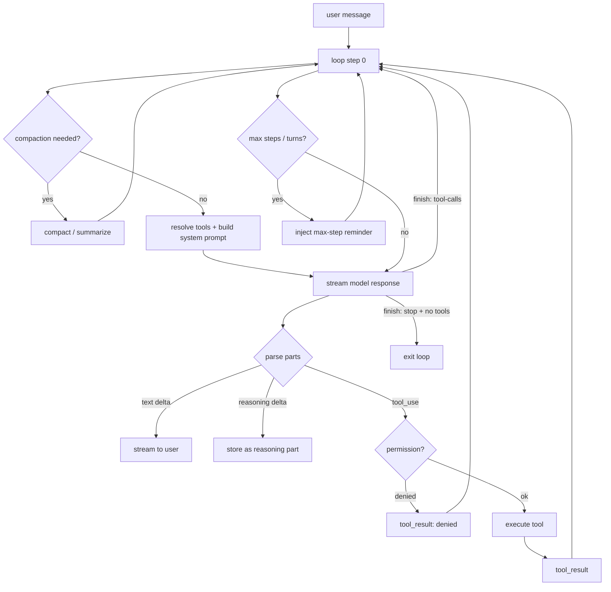
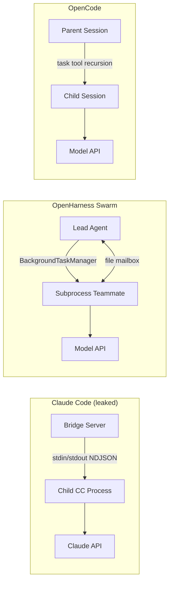

# Agent Loop 비교 분석: opencode vs leaked-claude-code vs openharness

> **대상 레포**
> - `opencode` — sst/opencode (TypeScript/Bun, Effect.ts) — 오픈소스 CLI 코딩 에이전트
> - `leaked-claude-code` — Anthropic Claude Code 유출 코드 단편 + 아키텍처 분석 문서
> - `openharness` — OpenHarness (Python/asyncio) — Claude Code 호환 하네스 구현
>
> **분석 축**: "에이전트 루프" — LLM 추론(reasoning), 깊은 사고(thinking), 도구 실행, 목적 달성(planning/subagent) 을 코드 수준에서 어떻게 조립하는가.

---

## 0. TL;DR — 한 문단 요약

세 프로젝트 모두 본질적으로는 **동일한 ReAct 루프**(`user → LLM → tool_use → tool_result → LLM → ...`)를 구현한다. 차이는 루프 *주변의 엔지니어링* 에 있다.
- **opencode**: Effect.ts 기반 stream-first 구현. `runLoop()` 안에서 *step 단위*로 상태를 추적하고, reasoning 파트를 메시지 트리의 1급 시민으로 저장한다. 서브에이전트는 `task` 툴 → child session → 또 다른 `runLoop` 로 구현.
- **leaked-claude-code**: 본체(coordinator)는 유출되지 *않았고*, 주변부(bridge/transport/session replay/permission)만 있다. 아키텍처 문서는 ReAct 의사코드를 제공하지만, "thinking token" 이나 명시적 planning 단계는 드러나지 않는다. 핵심 차별화는 *컨텍스트 관리*(compaction + 동적 system-reminder 주입)와 *원격 실행 브릿지*.
- **openharness**: Python 구현체. `run_query()` 한 함수가 루프 전체를 담고 있으며 Claude Code의 설계 철학(coordinator mode, auto-compact, skill/hook, agent definition as markdown) 을 거의 1:1로 이식. parallel tool call, reactive compaction(프롬프트 초과 시 강제 압축 후 재시도) 등 실전 디테일이 가장 명시적.

공통적으로 **명시적 "thinking budget" 이나 plan-then-act 단계는 세 레포 모두 루프 자체에 박혀 있지 않다.** Opencode만이 provider(Claude API)의 reasoning block 을 *메시지 스키마 수준에서* 퍼스트클래스로 저장한다. Claude Code 유출본과 OpenHarness 에서 "deep thinking" 은 provider 쪽으로 완전히 위임된다.

---

## 1. 루프의 위치와 형태

### 1.1 Opencode — `runLoop()` (TS, Effect.ts)

- 파일: `packages/opencode/src/session/prompt.ts` (1908 lines)
- 루프 진입: `SessionPrompt.prompt()` → `loop()` → `runLoop(sessionID)`
- 핵심 단면 (prompt.ts:1340–1387):

```ts
const runLoop = Effect.fn("SessionPrompt.run")(function* (sessionID: SessionID) {
  let step = 0
  const session = yield* sessions.get(sessionID)

  while (true) {
    yield* status.set(sessionID, { type: "busy" })
    log.info("loop", { step, sessionID })

    let msgs = yield* MessageV2.filterCompactedEffect(sessionID)
    // ...find lastUser / lastAssistant / pending compaction|subtask tasks

    // 일부 provider 는 tool_calls 가 있어도 finish="stop" 을 주기 때문에
    // 실제 tool part 의 존재 여부로 루프 종료를 판정한다.
    const hasToolCalls = lastAssistantMsg?.parts.some(
      (part) => part.type === "tool" && !part.metadata?.providerExecuted,
    ) ?? false

    if (lastAssistant?.finish && !["tool-calls"].includes(lastAssistant.finish)
        && !hasToolCalls && lastUser.id < lastAssistant.id) {
      log.info("exiting loop", { sessionID })
      break
    }
    step++
    // ...resolveTools → handle.process(...)
  }
})
```

- **특징**
  - 루프의 입력이 "메시지 리스트" 가 아니라 **persisted message tree**. 매 iteration 마다 DB 에서 compacted 메시지를 필터링해 다시 읽어온다. 중간에 `compaction` 또는 `subtask` 같은 "pending task part" 가 끼어들 수 있어서 루프 본문이 `while(true) { 할일 결정 → 처리 → 다시 상태 로드 }` 의 "state machine" 스타일.
  - 종료 조건이 `finish === "stop"` 단독이 아니라 `finish !== "tool-calls" && !hasToolCalls` 로 이중 체크. Provider 간 finish reason 불일치를 흡수하기 위함.
  - Step 1 에서는 비동기로 세션 title 생성 fork (`Effect.forkIn(scope)`) — 본 루프와 분리.

### 1.2 Openharness — `run_query()` (Python, asyncio)

- 파일: `src/openharness/engine/query.py` (710 lines)
- 진입: `QueryEngine.submit_message()` → `run_query(context, messages)`
- 핵심 단면 (query.py:520–558):

```python
yield AssistantTurnComplete(message=final_message, usage=usage), usage

if not final_message.tool_uses:
    return                                        # 종료 조건 ①

tool_calls = final_message.tool_uses

if len(tool_calls) == 1:
    # Single tool: sequential (stream events immediately)
    tc = tool_calls[0]
    yield ToolExecutionStarted(tool_name=tc.name, tool_input=tc.input), None
    result = await _execute_tool_call(context, tc.name, tc.id, tc.input)
    yield ToolExecutionCompleted(...), None
    tool_results = [result]
else:
    # Multiple tools: execute concurrently, emit events after
    for tc in tool_calls:
        yield ToolExecutionStarted(tool_name=tc.name, tool_input=tc.input), None
    results = await asyncio.gather(*[_run(tc) for tc in tool_calls])
    tool_results = list(results)
    for tc, result in zip(tool_calls, tool_results):
        yield ToolExecutionCompleted(...), None

messages.append(ConversationMessage(role="user", content=tool_results))

# while-loop 상단으로 — max_turns 가 있으면 제한, 없으면 tool_uses 없을 때 종료
```

- **특징**
  - **가장 정직한 ReAct 구현**. 한 함수 안에 while loop, 스트리밍 처리, parallel tool dispatch, 예외 처리(reactive compaction), max-turns 가드가 모두 들어 있어 읽기 좋다.
  - `asyncio.gather` 로 **multi tool call 을 병렬 실행** 하는 것이 세 레포 중 가장 명시적.
  - 예외 경로에서 *reactive compaction* 을 수행한다 — `prompt-too-long` 에러를 잡으면 한 번에 한해 `force=True` 로 compact 하고 `continue` 로 재시도:

```python
except Exception as exc:
    if not reactive_compact_attempted and _is_prompt_too_long_error(exc):
        reactive_compact_attempted = True
        async for event, usage in _stream_compaction(trigger="reactive", force=True):
            yield event, usage
        if was_compacted:
            continue
    return
```

### 1.3 Leaked Claude Code — 의사코드만 존재

실제 `coordinator/coordinatorMode.ts` / `QueryEngine.ts` 는 유출본에 **포함되어 있지 않다**. 관찰 가능한 것은:

- 브릿지 서버가 자식 Claude Code 프로세스를 spawn 하고 stdin/stdout 으로 NDJSON 을 중계 (`bridge/sessionRunner.ts:248–548`)
- `sessionHistory.ts` 의 transcript paging 구조
- `cli/handlers/autoMode.ts` 의 permission classifier 메타층

`ARCHITECTURE_ANALYSIS.md:96–150` 에 실려 있는 의사코드가 "공식에 가까운" 루프 묘사이다:

```ts
// from ARCHITECTURE_ANALYSIS.md (pseudocode)
while (true) {
  const response = await queryEngine.ask(messages, systemPrompt)
  for (const block of response.content) {
    if (block.type === 'text')      yield { type: 'text', content: block.text }
    else if (block.type === 'tool_use') {
      const permission = await checkPermission(block.name, block.input)
      if (permission === 'denied') { messages.push(toolDeniedResult(block)); continue }
      const result = await executeTool(block.name, block.input)
      messages.push(toolResult(block.id, result))
    }
  }
  if (!hasToolUse(response)) break
  if (contextManager.isNearLimit()) messages = await compactService.compress(messages)
}
```

`ARCHITECTURE_ANALYSIS.md:96` 원문: *"Claude Code의 심장은 `coordinator/coordinatorMode.ts`에 있는 **대화 루프**이다. 이것은 전형적인 ReAct(Reasoning + Acting) 에이전트 루프를 구현한다."*

**결론**: opencode/openharness 의 실제 구현을 Claude Code 본체의 **reference implementation** 으로 봐도 되는 수준으로 구조가 동일하다. 차이점은 언어/런타임/persistence 뿐이다.

### 1.4 루프 형태 비교 (Mermaid)



위 플로우는 세 레포 공통이다. opencode 는 `compaction` 체크가 루프 *본문에서 task 큐로* 들어가고, openharness 는 루프 *상단에서 명시적으로* 호출되며, leaked 쪽 의사코드는 *루프 하단에서* 호출된다는 위치 차이만 있다.

---

## 2. 추론 (Reasoning) / 깊은 사고 (Deep Thinking)

### 2.1 Opencode — reasoning 을 1급 메시지 파트로 취급

Opencode 는 Claude 의 extended thinking 결과를 **메시지 스키마의 별도 파트** 로 저장한다.

- `session/message-v2.ts:127–138` — `ReasoningPart` 타입 정의
- `session/processor.ts:116–150` — 스트림의 `reasoning-start` / `reasoning-delta` 를 처리:

```ts
case "reasoning-start":
  if (value.id in ctx.reasoningMap) return
  ctx.reasoningMap[value.id] = {
    id: PartID.ascending(),
    messageID: ctx.assistantMessage.id,
    sessionID: ctx.assistantMessage.sessionID,
    type: "reasoning",
    text: "",
    time: { start: Date.now() },
    metadata: value.providerMetadata,   // provider thinking budget 등
  }
  yield* session.updatePart(ctx.reasoningMap[value.id])

case "reasoning-delta":
  ctx.reasoningMap[value.id].text += value.text
  yield* session.updatePartDelta(...)
```

- 토큰 카운터도 `reasoning` 을 분리해 저장 (`message-v2.ts:260–265`):

```ts
tokens: z.object({
  input: z.number(),
  output: z.number(),
  reasoning: z.number(),  // 깊은 사고 토큰을 별도로 집계
  cache: z.object({ read: z.number(), write: z.number() }),
})
```

- **그러나** opencode 자체가 thinking budget 을 *결정* 하지는 않는다. Budget 값은 provider config / `ai-sdk` 쪽으로 넘기고, 모델이 뱉어주는 reasoning event 를 성실히 *받아 저장* 할 뿐이다.

### 2.2 Openharness — 본체 루프에 thinking 개념 없음

`engine/query.py` 와 `api/client.py` 어디에도 `thinking`, `reasoning_content`, `budget_tokens` 같은 파라미터가 **나타나지 않는다**. API 요청은 `model / messages / system / max_tokens / tools / betas / metadata` 만 전달한다.

스트림 이벤트 타입에도 `ReasoningDelta` 같은 것은 없고, `AssistantTextDelta` 만 존재 (`engine/stream_events.py`).

단, CHANGELOG 상으로는 **Moonshot/Kimi provider 에 한해 `reasoning_content` 지원** 이 언급된다. 즉 "deep thinking" 은 provider adapter 내부에서만 처리되고, 엔진 루프/이벤트 레벨에는 노출되지 않는다.

### 2.3 Leaked Claude Code — thinking block 의 흔적 없음

- `ARCHITECTURE_ANALYSIS.md` 와 유출 코드 어디에도 `thinking` / `<thinking>` / `reasoning_budget` 관련 심볼이 없다.
- 루프 의사코드는 응답 블록을 `text | tool_use` 의 이분법으로만 다룬다.
- 유출되지 않은 `QueryEngine.ts` 내부에서 thinking 을 처리하고 있을 가능성은 있지만, **유출된 범위에서는 확인 불가**.

### 2.4 비교표 — Reasoning 취급

| 축 | opencode | openharness | leaked-claude-code |
|---|---|---|---|
| reasoning 블록 파싱 | ✅ `reasoning-start/delta/end` | ❌ (텍스트 델타만) | ❌ (의사코드에도 없음) |
| reasoning 토큰 집계 | ✅ `tokens.reasoning` 필드 | ❌ `input/output` 만 | 미상 |
| 메시지 스토리지의 1급 시민 | ✅ `ReasoningPart` | ❌ | 미상 |
| thinking budget 제어 API | ❌ (provider 위임) | ❌ (provider 위임) | 미상 |
| plan-then-act 명시 단계 | ❌ (plan mode는 permission) | ❌ | ❌ |

**핵심 인사이트**: 세 레포 중 어떤 것도 "deep thinking 예산" 을 **프레임워크 레벨에서 제어** 하지 않는다. thinking 은 *provider 책임* 이다. 프레임워크는 기껏해야 opencode 처럼 *스트림을 정리해서 저장* 할 뿐이다. "깊은 사고" 가 필요할 때는 루프 반복 횟수, planner 서브에이전트, TODO 리스트 같은 **구조적 수단** 으로 대체한다.

---

## 3. 도구 오케스트레이션

### 3.1 Opencode — 레지스트리 + Effect 래핑

`session/prompt.ts:386–475` 의 `resolveTools()` 에서 레지스트리를 조회해 agent/model 에 맞는 도구 세트를 추려 `ai-sdk` 포맷으로 래핑한다. 핵심 단면:

```ts
for (const item of yield* registry.tools({ modelID, providerID, agent: input.agent })) {
  const schema = ProviderTransform.schema(input.model, z.toJSONSchema(item.parameters))
  tools[item.id] = tool({
    id: item.id as any,
    description: item.description,
    inputSchema: jsonSchema(schema as any),
    execute(args, options) {
      return Effect.runPromise(Effect.gen(function* () {
        yield* plugin.trigger("tool.execute.before", ...)
        const result = yield* tool.implementation(args, ctx)
        yield* plugin.trigger("tool.execute.after", ...)
      }))
    },
  })
}
```

특기 사항:
- Tool call 은 스트림의 `tool-call` 이벤트에서 `toolcalls[toolCallId]` 맵에 등록되고, 실제 실행은 `ai-sdk` 의 `streamText` 내부가 담당한다 (opencode 가 직접 dispatch 하지 않는다).
- **Doom-loop detection** (`processor.ts:192–214`): 같은 도구를 같은 입력으로 3회 연속 호출하면 멈춘다.
- **Plugin hook**: `tool.execute.before/after` 트리거가 있어 감시/수정이 가능.
- Parallel tool execution 은 provider/ai-sdk 에 위임 — 루프 본문에서 직접 `Promise.all` 을 하지 않는다.

### 3.2 Openharness — Permission + Hooks + 명시적 parallel

`engine/query.py:561–671` 의 `_execute_tool_call()` 한 단면:

```python
async def _execute_tool_call(context, tool_name, tool_use_id, tool_input):
    # 1) PRE_TOOL_USE hook 게이트
    if context.hook_executor is not None:
        pre_hooks = await context.hook_executor.execute(
            HookEvent.PRE_TOOL_USE,
            {"tool_name": tool_name, "tool_input": tool_input, ...})
        if pre_hooks.blocked:
            return ToolResultBlock(tool_use_id, content=pre_hooks.reason, is_error=True)

    # 2) Permission checker (파일 경로 / 명령어 규칙)
    decision = context.permission_checker.evaluate(
        tool_name, is_read_only=tool.is_read_only(parsed_input),
        file_path=_file_path, command=_command)
    if not decision.allowed:
        if decision.requires_confirmation and context.permission_prompt is not None:
            confirmed = await context.permission_prompt(tool_name, decision.reason)
            if not confirmed:
                return ToolResultBlock(..., is_error=True)

    # 3) 실제 실행
    result = await tool.execute(parsed_input, ToolExecutionContext(...))

    # 4) POST_TOOL_USE hook
    # 5) tool metadata carry-over 기록 (파일 read, skill 호출, subagent 등)
    _record_tool_carryover(context, tool_name=tool_name, ...)
    return tool_result
```

- 도구 하나의 실행 경로가 **3-layer gate (hook → permission → exec) + 2-layer side-effect (post-hook + carryover)** 로 구조화되어 있다. opencode 의 plugin-hook 보다 한층 세분화.
- Parallel execution 은 *engine 이 직접* `asyncio.gather(...)` 로 수행. 1개는 순차, 2개 이상은 concurrent.

### 3.3 Leaked Claude Code — permission classifier + race

도구 실행 본체 코드는 유출되지 않았지만 `cli/handlers/autoMode.ts` 와 `ARCHITECTURE_ANALYSIS.md` 로부터 다음을 추론할 수 있다.

- 권한 판정은 *별도의 LLM classifier* 가 각 tool call 을 `allow / soft_deny / environment` 규칙과 대조한다 (`autoMode.ts:73–141`).
- "Hook vs user-prompt race" 패턴 — 권한 승인이 필요한 경우 hook shell command 와 SDK user prompt 가 경쟁하고, 먼저 도착한 쪽이 결정한다 (`ARCHITECTURE_ANALYSIS.md` 참고).
- Plan/default/auto-accept/full-auto 4-tier permission mode.

### 3.4 도구 처리 비교표

| 축 | opencode | openharness | leaked-claude-code |
|---|---|---|---|
| 도구 레지스트리 | agent+model 별 필터 | `ToolRegistry` + permission checker | 미상 (handler 에서 enum) |
| permission gate | Permission + Question UI | PermissionChecker + prompt | LLM classifier + race |
| pre/post hook | `plugin.trigger` | `HookEvent.PRE/POST_TOOL_USE` | hook + SDK race |
| 병렬 실행 | `ai-sdk` 에 위임 | 엔진이 `asyncio.gather` | 미상 |
| 무한 tool loop 방지 | Doom-loop detector (3회 동일) | `max_turns` + metadata carryover | max step (추정) |
| 서브 에이전트 dispatch | `task` tool → child session | `agent` tool (coordinator) | `AgentTool` (명시적) |

---

## 4. 목적 달성 — Planning, Subagent, Multi-agent

### 4.1 Opencode — `task` tool + plan mode

- **Agent mode** (`agent/agent.ts:31,120–185`): `"primary" | "subagent" | "all"`.
- **Subagent 스폰**: `tool/task.ts` 의 `TaskTool` 이 child session 을 만들고 `SessionPrompt.prompt` 를 재귀 호출한다. 핵심 단면:

```ts
// tool/task.ts (정리)
const next = yield* agent.get(params.subagent_type)

const nextSession = session ?? (yield* Effect.promise(() =>
  Session.create({
    parentID: ctx.sessionID,                       // parent link
    title: params.description + ` (@${next.name} subagent)`,
    permission: [...],                              // 권한 상속/제한
  })))

const result = yield* Effect.promise(() =>
  SessionPrompt.prompt({
    sessionID: nextSession.id,
    agent: next.name,
    parts: [{ type: "text", text: params.prompt }],
  }))

return result  // 결과가 parent 루프의 tool_result 로 흡수
```

→ 결국 subagent 는 **"새 session + 또 다른 `runLoop`"** 이다. 부모 루프의 step 안에서 child loop 가 돌아가고, child 결과가 parent 의 tool_result 로 들어가는 **recursive ReAct**.

- **Plan mode** (`session/prompt.ts:300–384`): 별도의 agent 가 아니라 *permission 프로파일*. 편집/실행 도구 없이 읽기만 허용되고, 특별 system reminder 로 "먼저 계획을 세워라" 가 강제된다. 계획 결과는 `~/.opencode/plans/{sessionID}.md` 에 저장된다.
- **TODO 기능** (`session/todo.ts`, 95 lines): 사용자 가시의 task list. subagent 와는 무관한 단순 persist store — 계획의 *산출물* 이지 루프의 *기계* 가 아니다.

### 4.2 Openharness — Coordinator Mode (lead + workers)

`coordinator/coordinator_mode.py:267–519` 가 핵심. 환경변수 `CLAUDE_CODE_COORDINATOR_MODE=1` 이면 coordinator 로 전환되고, **별도의 system prompt** 가 주입되어 다음을 강제한다:

- Coordinator 는 일반 도구를 *쓸 수 없고*, 오직 `agent` (worker spawn), `send_message` (후속 프롬프트), `task_stop` 만 사용.
- Worker 결과는 user-role 메시지 안의 `<task-notification>` XML 로 들어온다 — 코디네이터는 이를 유저 발화와 구분해 처리해야 한다.
- 독립 worker 는 **병렬** 로 spawn 해야 한다.
- Worker 에게 넘길 프롬프트는 *합성(synthesis) 을 증명할 정도의 디테일* 을 담아야 한다 (`"don't delegate understanding"`).

Worker context injection (`coordinator_mode.py:220–248`):

```python
def get_coordinator_user_context(mcp_clients, scratchpad_dir):
    tools = sorted(_SIMPLE_WORKER_TOOLS if is_simple else _WORKER_TOOLS)
    content = f"Workers spawned via the agent tool have access to these tools: {', '.join(tools)}"
    if mcp_clients:
        content += f"\n\nWorkers also have access to MCP tools from: {...}"
    if scratchpad_dir:
        content += f"\n\nScratchpad directory: {scratchpad_dir}\nWorkers can read and write here..."
    return {"workerToolsContext": content}
```

Agent definition 자체는 **markdown + YAML frontmatter** 로 로드된다 (`agent_definitions.py:60–135`, 총 975 lines). 정의 필드:
`name, description, system_prompt, tools, disallowed_tools, model, effort, permission_mode, max_turns, skills, mcp_servers, hooks, color, background, initial_prompt, memory, isolation, critical_system_reminder, omit_claude_md`.

빌트인 에이전트: `explorer` (read-only), `planner`, `verification` (PASS/FAIL 판정), `worker` (구현), `statusline-setup`, `claude-code-guide`.

**구조적으로 opencode 보다 "진짜 multi-agent" 에 가깝다** — opencode 는 subagent 를 trees 로 돌리지만, openharness 는 "coordinator 는 도구조차 못 쓰고 오직 delegate 만 한다" 는 제약을 프롬프트-레벨에서 명시한다.

### 4.3 Leaked Claude Code — AgentTool 의 흔적

`cli/handlers/agents.ts` 와 `ARCHITECTURE_ANALYSIS.md:479–540` 이 알려주는 것:
- Agent type: `general-purpose`, `Explore`, `Plan`, `statusline-setup`, `claude-code-guide`.
- Subagent 는 **독립 컨텍스트** (작은 윈도우), **제한된 툴 세트**, **옵션으로 git worktree 격리**.
- Parent → child: AgentTool 호출로 초기 프롬프트 전달.
- Child → parent: completion summary 만 반환 (중간 토큰은 숨김).
- `SendMessage` 툴로 부모가 돌아가는 child 에게 후속 메시지 발송 가능 (실험적).
- **Peer-to-peer 협력은 없다** — 항상 parent 가 중심이 되는 star topology.

OpenHarness 의 coordinator 설명과 이 내용은 매우 비슷한데, opencode 는 plan mode 가 permission 으로 축소되어 있고, openharness 는 coordinator mode 에서 *명시적 "orchestration-only" 제약* 을 둔다는 점이 차별화.

### 4.4 Planning/Multi-agent 비교표

| 축 | opencode | openharness | leaked-claude-code |
|---|---|---|---|
| subagent 스폰 | `task` tool → child session → recursive `runLoop` | `agent` tool (coordinator) → worker | `AgentTool` → 독립 context |
| agent definition 저장소 | `agent/*.ts` + user config | markdown + YAML frontmatter | markdown frontmatter (유사) |
| plan 단계 | *permission mode* 로 축소 | `planner` agent (전용) | `Plan` agent (전용) |
| parent-child 통신 | parent session id 링크 | `<task-notification>` XML | summary only + SendMessage |
| 격리 | permission 제약 | `isolation` field (worktree 등) | git worktree |
| orchestrator 제약 | 없음 (일반 agent) | coord 는 도구 금지, delegate만 | 미상 |
| 병렬 spawn | 가능 | 적극 권장 + 프롬프트 강제 | 가능 |

---

## 5. 컨텍스트 관리 — "Deep thinking" 의 실질적 대체재

세 레포 모두 "deep thinking" 을 프레임워크에서 *budget* 하지 않는 대신, **컨텍스트 관리** 로 *질* 을 유지한다.

### 5.1 Opencode

- `session/compaction.ts:84–100` + `session/overflow.ts`:

```ts
// prompt.ts:1418–1425
if (lastFinished && lastFinished.summary !== true
    && (yield* compaction.isOverflow({ tokens: lastFinished.tokens, model }))) {
  yield* compaction.create({ sessionID, agent: lastUser.agent, model: lastUser.model, auto: true })
  continue   // 루프 재시작, compaction task 로 진입
}
```

- Compaction 은 **task part** 로 메시지 스트림에 박히고, 다음 iteration 에서 별도 루프 분기 (`prompt.ts:1406–1415`) 로 처리된다. 즉 compaction 자체가 메시지 히스토리의 1급 이벤트.
- Pruning 은 이전 tool 출력을 *구식 부분부터* 지우는 전략.

### 5.2 Openharness — 3-tier compaction

`services/compact/__init__.py:34–72` 상수:

```python
COMPACTABLE_TOOLS = frozenset({"read_file","bash","grep","glob","web_search","web_fetch","edit_file","write_file"})
AUTOCOMPACT_BUFFER_TOKENS = 13_000
MAX_OUTPUT_TOKENS_FOR_SUMMARY = 20_000
MAX_CONSECUTIVE_AUTOCOMPACT_FAILURES = 3
COMPACT_TIMEOUT_SECONDS = 25
SESSION_MEMORY_KEEP_RECENT = 12
SESSION_MEMORY_MAX_LINES = 48
SESSION_MEMORY_MAX_CHARS = 4_000
```

3 단계:
1. **Microcompact** — LLM 쓰지 않고 오래된 tool result content 만 비움 (저렴)
2. **Full compact** — LLM 에 요약 위임 (비싼)
3. **Auto-compact** — 매 턴 상단에서 토큰 예측 후 임계 초과 시 1→2 로 승격
4. (보너스) **Reactive compact** — 모델이 `prompt-too-long` 을 던지면 `force=True` 로 1회 재시도

`tool_metadata` carryover (query.py:104–392) 가 compaction 을 건너가도 유지되는 구조 — `task_focus_state`, `read_file_state`, `invoked_skills`, `async_agent_state`, `recent_work_log`, `permission_mode` 를 dict 로 들고 다닌다. 즉 compaction 후에도 "무엇을 하던 중이었는지" 의 **구조화 상태** 는 보존된다.

### 5.3 Leaked Claude Code — 동적 system-reminder + compact

`ARCHITECTURE_ANALYSIS.md:231–247` 의 인용:
> *"Claude Code는 **동적 시스템 리마인더**를 대화 중간에 주입하는 독특한 패턴을 사용한다."*

특징:
- System-reminder 를 tool_result / user_message 에 XML 태그로 *틈틈이 주입* 하여 긴 대화에서 초반 system prompt 의 효과 감쇠를 보완.
- 80% 임계에서 자동 compact; 최근 N 턴만 원본 보존, 나머지는 요약으로 대체, 도구 결과는 핵심 추출.

opencode 의 compaction-as-task, openharness 의 3-tier + metadata carryover 는 이 철학을 각자 재구현한 것이다. 다만 **opencode 는 reminder 를 메시지 파트로** 박고, **openharness 는 metadata dict 로** 별도 관리하고, **Claude Code 는 대화 스트림 중간에** 직접 주입한다는 "어디에 저장하느냐" 가 다르다.

### 5.4 컨텍스트 관리 비교

| 축 | opencode | openharness | leaked-claude-code |
|---|---|---|---|
| 압축 트리거 | overflow 감지 → task part | 토큰 예측 + reactive 예외 경로 | near-limit heuristic |
| 압축 방식 | summary + pruning | microcompact → LLM full | summary + 최근 N 턴 보존 |
| 이전 상태 보존 | compacted 메시지 필터 | `tool_metadata` carryover dict | system-reminder 재주입 |
| 재주입 패턴 | 메시지 1급 파트 | system_prompt + coordinator context | 대화 중간 XML 태그 |
| reactive 재시도 | ❌ (compaction task 만) | ✅ `force=True` 재시도 | 미상 |

---

## 6. 에러 / 재시도 / 종료 조건

| 축 | opencode | openharness | leaked-claude-code |
|---|---|---|---|
| 모델 호출 재시도 | `retry.ts` — `retry-after-ms` 헤더 존중, 지수 백오프 | API client 내부 + reactive compact | SSE 기반 + rate_limit_event 전파 |
| context overflow | `ContextOverflowError` 는 재시도 안 함 | reactive compact 후 1회 재시도 | compact 로 흡수 |
| permission 거부 | `Permission.RejectedError` → `ctx.blocked = true` | `ToolResultBlock(is_error=True)` | tool_denied_result 메시지 |
| max step/turn | agent config 의 `maxSteps` + 1523 라인의 reminder 주입 | `max_turns` → `MaxTurnsExceeded` | 미상 |
| infinite tool loop | doom-loop detector | max_turns + metadata 추적 | 미상 |

Opencode 의 `MAX_STEPS` reminder 주입 패턴이 흥미롭다 — 마지막 step 에서 어시스턴트 메시지 뒤에 system reminder 를 임시로 append 해서 "더 이상 tool 쓰지 말고 요약해라" 를 유도한다 (prompt.ts:1515–1526).

---

## 7. 세 레포의 설계 철학 한 줄 요약

- **opencode** = "루프는 *메시지 트리 위의 상태기계*. Compaction, subtask, reasoning 은 모두 메시지 파트다. Effect.ts 로 lifecycle 관리."
- **openharness** = "루프는 *한 함수*. 명시적 async/await, 명시적 gather, 명시적 try/except reactive compaction. 'deep thinking' 대신 coordinator mode 로 조직화."
- **leaked-claude-code** = "본체는 ReAct 루프지만 차별화는 *루프 바깥* 에 있다 — bridge, permission race, 동적 system reminder, compaction. 유출본에 담긴 것은 바깥 뿐이라, 본체는 **의사코드로 추정만 가능**."

## 8. 종합 비교표

| 항목 | opencode | openharness | leaked-claude-code |
|---|---|---|---|
| 언어/런타임 | TypeScript / Bun / Effect.ts | Python / asyncio | TypeScript / Node |
| 루프 파일 | `session/prompt.ts:1340` | `engine/query.py:394` | (유출 X) |
| 루프 스타일 | state-machine on message tree | async while | ReAct 의사코드 |
| reasoning 파트 퍼스트클래스 | ✅ | ❌ | ❌ |
| thinking budget 제어 | ❌ | ❌ | ❌ |
| parallel tool call | 위임 (ai-sdk) | 엔진이 직접 `gather` | 미상 |
| subagent | `task` → child session | `agent` → worker (coordinator mode) | `AgentTool` + worktree |
| multi-agent orchestrator | 없음 | coordinator-as-prompt | 유사 (추정) |
| plan 단계 | permission mode | `planner` agent | `Plan` agent |
| auto compact | 메시지 task 로 | 3-tier + reactive | near-limit + compress |
| 동적 system reminder | 메시지 파트로 | carryover dict + coord context | 대화 중 XML 주입 |
| retry 전략 | `retry.ts` (header-aware) | API client + reactive | SSE event |
| doom-loop 방지 | ✅ (3회 동일 input) | `max_turns` + metadata | 미상 |
| persistence | SQL (session.sql.ts) | in-memory + session storage | NDJSON transcript |
| 원격 실행 브릿지 | ❌ | ❌ | ✅ (매우 정교) |
| hooks / plugin | Effect plugin trigger | HookEvent PRE/POST | hook vs prompt race |
| permission 모델 | Permission + Question UI | PermissionChecker + prompt | LLM classifier + rules |

## 9. 엔지니어 관점 인사이트

1. **"Agent loop" 는 이제 commodity 이다.** 세 구현이 언어와 런타임이 완전히 다름에도 불구하고 ReAct 뼈대는 거의 동일하다. 차별화는 *루프 밖* — persistence, multi-agent orchestration, context management, bridge, permission — 에서 일어난다.
2. **"Deep thinking" 은 프레임워크 문제가 아니라 provider/프롬프트 문제.** opencode 가 유일하게 reasoning 을 1급 파트로 저장하지만, 그것도 "budget 제어" 가 아니라 "stream 정리" 에 가깝다. 깊은 추론이 필요하면 *planner agent* 나 *plan mode permission* 으로 구조화하는 것이 실전 해법.
3. **Multi-agent 의 경량 해법은 "subagent = child session + recursive loop"**. opencode 가 이 관점을 가장 명확히 보여준다. Worker/coordinator 분리는 그 위에 "프롬프트-레벨 제약" 을 얹은 것일 뿐 (openharness 가 이를 명시).
4. **Context management 는 이 카테고리의 실질적 해자.** Claude Code 가 1M 컨텍스트에서도 안정적인 이유는 모델 성능이 아니라 *compaction + system reminder 재주입* 의 엔지니어링이다. openharness 의 3-tier compaction + reactive 재시도가 이를 OSS 로 가장 잘 재현.
5. **Opencode 와 openharness 를 같이 읽으면 Claude Code 의 "숨은 본체" 를 reverse-engineer 할 수 있다.** 둘 다 유출본의 아키텍처 분석 문서가 묘사한 루프를 거의 1:1 로 구현했기 때문이다. Reference implementation 이 필요하다면 openharness(Python, 단일 함수 가독성), 프로덕션-그레이드 persistence/Effect 패턴이 필요하다면 opencode(TypeScript) 를 참고하면 된다.

---

## 부록 A — 3개의 루프 동일 단면 비교 (같은 줄을 찾아보기)

| 동작 | opencode | openharness | leaked-claude-code |
|---|---|---|---|
| 루프 시작 | `prompt.ts:1347  while (true)` | `query.py:394  while context.max_turns is None or ...` | (pseudocode) `while (true)` |
| 모델 스트림 수신 | `processor.ts: handle.process()` | `query.py:465-489  async for event in api_client.stream_message(...)` | (pseudocode) `queryEngine.ask()` |
| 텍스트 델타 방출 | `processor.ts: session.updatePartDelta` (text part) | `query.py:476  yield AssistantTextDelta(text=...)` | (pseudocode) `yield {type:'text'}` |
| reasoning 델타 방출 | `processor.ts:116-150  reasoning-start/delta/end` | (없음) | (없음) |
| tool_call 감지 | `processor.ts:174-187  case "tool-call"` | `query.py:523  tool_calls = final_message.tool_uses` | (pseudocode) `block.type === 'tool_use'` |
| permission gate | Permission + Question | `_execute_tool_call:PermissionChecker` | `checkPermission` + classifier |
| tool_result 주입 | processor 가 message part 추가 | `query.py:554  messages.append(ConversationMessage(...))` | (pseudocode) `messages.push(toolResult(...))` |
| 종료 조건 | `prompt.ts:1379-1387  finish !== "tool-calls" && !hasToolCalls` | `query.py:520  if not final_message.tool_uses: return` | (pseudocode) `if (!hasToolUse(response)) break` |
| context overflow | `prompt.ts:1418-1425 compaction.isOverflow` | `query.py:456-460 _stream_compaction("auto")` + exception reactive | (pseudocode) `if (isNearLimit) compress()` |
| max-step guard | `MAX_STEPS` reminder 주입 @ prompt.ts:1522 | `MaxTurnsExceeded` @ query.py:557 | 미상 |

## 부록 B — 분석한 파일 목록

---

# 보충 (Supplement) — 1차 분석 이후 재검토에서 추가된 항목들

> 1차 분석이 루프의 "뼈대" 에 집중했다면, 이 섹션은 그 주변의 *프롬프트 엔지니어링*, *다중 에이전트 인프라*, *인터럽션*, *hooks* 를 다룬다. 실질적으로 "목적 달성" 의 성패가 갈리는 부분은 의외로 이쪽이다.

## S1. 시스템 프롬프트 아키텍처 — "루프보다 프롬프트가 에이전트다"

루프 코드는 세 레포가 거의 동일했지만, **시스템 프롬프트를 어떻게 조립하는가** 는 놀라울 만큼 다르다.

### S1.1 Opencode — provider별 분기형 프롬프트 + 정적 텍스트 파일

opencode 는 `packages/opencode/src/session/prompt/` 에 **provider별로 13개의 별도 system prompt 텍스트** 를 가지고 있다:

| 파일 | 라인 | 목적 |
|---|---:|---|
| `anthropic.txt` | 105 | Claude 전용 |
| `default.txt` | 105 | 일반 fallback |
| `beast.txt` | 147 | 공격적(?) 에이전트 모드 |
| `codex.txt` | 79 | OpenAI Codex/o1 계열 |
| `gpt.txt` | 107 | GPT-4/5 계열 |
| `copilot-gpt-5.txt` | 143 | GitHub Copilot GPT-5 |
| `gemini.txt` | 155 | Google Gemini |
| `kimi.txt` | 95 | Moonshot Kimi |
| `trinity.txt` | 97 | 다중 모델 합의 모드(?) |
| `plan.txt` | 26 | plan mode system-reminder |
| `plan-reminder-anthropic.txt` | 67 | Claude 전용 plan mode 강화 |
| `max-steps.txt` | 15 | max step 도달 시 주입 |
| `build-switch.txt` | 5 | plan→build 전환 |

그리고 `packages/opencode/src/agent/prompt/` 에 agent별 변형:
- `compaction.txt`, `summary.txt`, `title.txt`, `explore.txt`

핵심 인사이트 — **프롬프트 자체가 "루프의 일부"** 다. 예를 들어 `max-steps.txt` 의 전문:

```
CRITICAL - MAXIMUM STEPS REACHED

The maximum number of steps allowed for this task has been reached.
Tools are disabled until next user input. Respond with text only.

STRICT REQUIREMENTS:
1. Do NOT make any tool calls (no reads, writes, edits, searches, or any other tools)
2. MUST provide a text response summarizing work done so far
3. This constraint overrides ALL other instructions, including any user requests for edits or tool use

Response must include:
- Statement that maximum steps for this agent have been reached
- Summary of what has been accomplished so far
- List of any remaining tasks that were not completed
- Recommendations for what should be done next

Any attempt to use tools is a critical violation. Respond with text ONLY.
```

→ 1차 분석에서 언급한 "`MAX_STEPS` reminder 주입" 은 *텍스트 파일을 그대로 메시지 끝에 concat* 하는 방식이었다. 루프 로직이 "멈춰라" 를 *코드로* 강제하지 않고, **프롬프트로 유도** 한다. 이것은 Claude Code 가 사용하는 "동적 system-reminder" 패턴의 오픈소스 판본.

그리고 `plan.txt` (26 lines) 도 마찬가지로 별도 `<system-reminder>` XML 블록으로 주입되는 *정적 텍스트*:

```
<system-reminder>
# Plan Mode - System Reminder

CRITICAL: Plan mode ACTIVE - you are in READ-ONLY phase. STRICTLY FORBIDDEN:
ANY file edits, modifications, or system changes. Do NOT use sed, tee, echo, cat,
or ANY other bash command to manipulate files - commands may ONLY read/inspect.
...
## Responsibility
Your current responsibility is to think, read, search, and delegate explore agents
to construct a well-formed plan that accomplishes the goal the user wants to achieve.
...
</system-reminder>
```

중요한 점 — opencode 의 "plan mode" 는 *permission 시스템만* 으로는 설명이 불완전하다. 실은 **permission + system-reminder + (옵션으로) plan 파일 저장** 의 3요소 조합이다. 루프는 plan mode 가 활성화되면 매 step 마다 이 reminder 를 메시지에 재주입할 수 있다.

### S1.2 Openharness — 단일 Python 빌더 + 동적 섹션

`src/openharness/prompts/system_prompt.py` 는 109 lines 하나로 끝난다:

```python
_BASE_SYSTEM_PROMPT = """\
You are OpenHarness, an open-source AI coding assistant CLI. ...
"""

def build_system_prompt(custom_prompt=None, env=None, cwd=None) -> str:
    env = env or get_environment_info(cwd=cwd)
    base = custom_prompt if custom_prompt is not None else _BASE_SYSTEM_PROMPT
    env_section = _format_environment_section(env)
    return f"{base}\n\n{env_section}"
```

- **Provider 분기 없음** — 모델 상관없이 같은 프롬프트.
- 동적 섹션은 `# Environment` 한 개 (OS, shell, cwd, date, python, git branch).
- 추가로 `prompts/context.py`, `prompts/claudemd.py`, `prompts/environment.py` 가 있지만 모두 "환경을 텍스트로 formatting" 하는 유틸.
- Coordinator mode 가 켜지면 `coordinator_mode.py` 에서 **별도의 오버라이드 프롬프트** 를 주입 — 이 경우 `_BASE_SYSTEM_PROMPT` 는 완전히 교체된다.

→ opencode 와 정반대 전략: **"프롬프트는 한 개, 나머지는 코드로 해결"**. 이 때문에 provider별 tweak 이 필요할 경우 agent definition 의 `system_prompt` 필드로 오버라이드해야 한다.

### S1.3 Claude Code — 동적 빌더 + 메모리 인덱스 주입

`ARCHITECTURE_ANALYSIS.md:109-116` 의 의사코드:

```ts
const systemPrompt = buildSystemPrompt({
  tools: getAvailableTools(),
  memory: await loadRelevantMemories(),
  gitStatus: await getGitStatus(),
  environment: getEnvironmentInfo(),
  permissions: getCurrentPermissionMode(),
})
```

- **매 turn 마다 재빌드** (openharness 와 opencode 는 세션 시작 시 1회 빌드 후 재사용이 일반적).
- `loadRelevantMemories()` — MEMORY.md 인덱스를 매 턴 로드. 오픈소스 두 레포 모두 이 수준의 동적 메모리 주입은 없다.
- Dynamic `<system-reminder>` 태그는 *대화 중간* 에 tool result 나 user message 에 섞여서 주입된다 (`ARCHITECTURE_ANALYSIS.md:233-247`).

### S1.4 시스템 프롬프트 비교표

| 축 | opencode | openharness | leaked-claude-code |
|---|---|---|---|
| 파일 개수 | 13+ 정적 텍스트 | 1 Python 빌더 | 동적 빌더 (추정) |
| provider 분기 | ✅ provider별 prompt | ❌ 통합 | 미상 |
| 재빌드 타이밍 | 세션 시작 | 세션 시작 | **매 턴** |
| 동적 섹션 | env info | env info | env + memory + git status + permissions + tools |
| reminder 주입 위치 | 메시지 끝에 concat (`max-steps`, `plan`) | coordinator system_prompt 오버라이드 | 대화 중간 XML 태그 |
| plan mode 강화 | 전용 `<system-reminder>` 파일 | permission mode flag | `Plan` agent + 의사코드 |

**핵심 인사이트**: opencode 는 Claude Code 의 *system-reminder 패턴* 을 "정적 텍스트 파일 + 필요시 concat" 으로 가장 소박하게 오픈소스화했다. Openharness 는 이 패턴을 "coordinator system_prompt 완전 교체" 로 더 무겁게 처리한다. Claude Code 는 동적 빌더 + 메시지 중간 주입으로 가장 정교하지만, 그만큼 구현 복잡도가 높다.

---

## S2. OpenHarness 의 "숨겨진 두 번째" Multi-Agent 시스템 — **swarm**

1차 분석에서는 openharness 의 multi-agent 를 `coordinator_mode.py` 로만 설명했지만, **실제로는 두 개의 완전히 다른 multi-agent 모델이 공존** 한다.

### S2.1 두 모델

| 모델 | 위치 | 성격 | 통신 |
|---|---|---|---|
| **Coordinator Mode** | `coordinator/coordinator_mode.py` (519) | *프롬프트 레벨* — 한 프로세스 안에서 주(coordinator) agent 가 worker 를 spawn | 동일 프로세스 async / `<task-notification>` XML |
| **Swarm** | `swarm/*.py` (**4908 lines**) | *인프라 레벨* — 별도 subprocess 나 in-process teammate 를 실제로 실행 | 파일 기반 mailbox + file lock |

1차 분석에서 swarm 을 놓친 이유는 `engine/query.py` 와 `coordinator_mode.py` 만 읽으면 보이지 않기 때문이다. 하지만 swarm 은 **총 4908 lines** 로 openharness 의 가장 큰 모듈 중 하나다.

### S2.2 Swarm 구성 (파일별 역할)

```
swarm/
├─ in_process.py          (693) — 동일 프로세스 teammate executor
├─ subprocess_backend.py  (153) — 별도 subprocess teammate executor
├─ team_lifecycle.py      (910) — 팀 생성/해산/상태 머신
├─ registry.py            (410) — 실행 중인 teammate 레지스트리
├─ mailbox.py             (522) — 파일 기반 비동기 메시지 큐
├─ permission_sync.py    (1168) — teammate 간 권한 동기화
├─ worktree.py            (315) — git worktree 격리
├─ lockfile.py             (73) — exclusive file lock
├─ spawn_utils.py         (202) — CLI flag / env var 상속
└─ types.py               (392) — BackendType, TeammateMessage, SpawnResult 등
```

### S2.3 Mailbox — 파일시스템 기반 inter-agent 통신

`swarm/mailbox.py:1-18` 의 docstring:

```python
"""File-based async message queue for leader-worker communication in OpenHarness swarms.

Each message is stored as an individual JSON file:
    ~/.openharness/teams/<team>/agents/<agent_id>/inbox/<timestamp>_<message_id>.json

Atomic writes use a .tmp file followed by os.rename to prevent partial reads.
"""

MessageType = Literal[
    "user_message",
    "permission_request",
    "permission_response",
    "sandbox_permission_request",
    "sandbox_permission_response",
    "shutdown",
    "idle_notification",
]
```

- **IPC 매커니즘이 "텍스트 파일 하나 = 메시지 하나"** 이고, atomic write 는 `.tmp` → `rename` 패턴.
- 메시지 타입 7종: user message, permission req/res, sandbox permission req/res, shutdown, idle notification.
- teammate 가 idle 상태에 들어가면 `idle_notification` 을 parent 에게 보내고, permission 이 필요한 tool call 은 `permission_request` 를 보내 상위 agent 가 승인 (`permission_sync.py`, 1168 lines — 이 부분이 가장 무겁다).

### S2.4 Subprocess Backend — 실제 spawn

`swarm/subprocess_backend.py:28-60`:

```python
class SubprocessBackend:
    """TeammateExecutor that runs each teammate as a separate subprocess.

    Uses the existing BackgroundTaskManager to create and manage the child processes,
    communicating via stdin/stdout.
    """
    type: BackendType = "subprocess"
    _agent_tasks: dict[str, str]  # agent_id -> task_id

    async def spawn(self, config: TeammateSpawnConfig) -> SpawnResult:
        agent_id = f"{config.name}@{config.team}"
        flags = build_inherited_cli_flags(
            model=config.model,
            plan_mode_required=config.plan_mode_required,
        )
        extra_env = build_inherited_env_vars()
        # ... BackgroundTaskManager 로 subprocess 생성, stdin 으로 초기 프롬프트 주입
```

→ Subprocess backend 는 사실상 **Claude Code 의 bridge/sessionRunner.ts 와 같은 구조**. 자식 프로세스를 띄우고 stdin/stdout 으로 NDJSON/stream 을 교환한다.

### S2.5 Coordinator vs Swarm — 언제 어떻게 쓰는가

| 상황 | Coordinator Mode | Swarm |
|---|---|---|
| 가벼운 fan-out (research + plan) | ✅ 단일 프로세스 빠름 | ❌ 오버헤드 |
| heavy 병렬 작업 (각기 다른 repo 수정) | 어려움 (권한 충돌) | ✅ 프로세스별 격리 |
| Worktree 분리 | 불가 | ✅ `worktree.py` |
| 장수명 background agent | ❌ | ✅ `team_lifecycle.py` |
| 권한 승격 | coordinator 에게 재요청 | ✅ `permission_sync.py` mailbox |
| 장애 격리 | 프로세스 크래시 → 전체 다운 | ✅ subprocess 독립 |

**재-요약된 결론**: openharness 는 multi-agent 를 *두 층* 으로 나눠서 해결한다.
- **프롬프트 레벨** (coordinator mode) — 짧은 작업, 합성(synthesis) 중심
- **인프라 레벨** (swarm) — 병렬 worktree, 장수명, 권한 격리

Opencode 의 `task` tool + child session 은 둘 사이에 있는 **중간 형태** — 동일 프로세스 내 재귀 루프 + parent session 링크. 즉 opencode 는 coordinator 의 "동시성" 과 swarm 의 "격리" 를 *절충한* 모델이다.

### S2.6 Claude Code 의 대응

Leaked bridge 코드 (`bridge/sessionRunner.ts:248-548`) 가 실제로 subprocess 를 spawn 하고 stdin/stdout NDJSON 으로 통신하는 구조 — **openharness 의 SubprocessBackend 와 거의 1:1 대응**. 다만 Claude Code 는 이것을 *remote session runner* (bridge 서버가 클라우드) 로 쓰고, openharness 는 *local teammate spawner* 로 쓴다는 목적 차이.



---

## S3. Skills — "구조화된 깊은 사고 템플릿"

"Deep thinking" 이 framework 레벨에 없다고 한 1차 결론은 맞지만, **"thinking template"** 은 있다. 특히 openharness 의 **bundled skills**.

### S3.1 Openharness Bundled Skills

`src/openharness/skills/bundled/content/`:
```
commit.md    debug.md    diagnose.md    plan.md
review.md    simplify.md  test.md
```

7개의 markdown 파일, 각각이 특정 작업에 대한 **사전 정의된 사고 루틴**. `skill_tool.py` 를 통해 agent 가 필요할 때 로드한다. Skill 은:
- system prompt 에 *항상* 들어가지 않는다 (토큰 낭비 방지)
- 에이전트가 "지금 debug 가 필요해" 라고 판단하면 `skill` 도구로 로드 → 해당 markdown 이 tool result 로 삽입됨
- 이후 step 에서 그 템플릿을 따라 진행

→ 이것이 **"thinking budget 없이 deep thinking 을 흉내 내는 실전 패턴"** 이다. 루프는 단순하되, "무엇을 생각할지" 의 표준 절차를 필요할 때만 호출해서 컨텍스트에 얹는다.

`skills/loader.py:22-46` 에서 registry 빌드:

```python
def load_skill_registry(cwd=None, *, extra_skill_dirs=None, ...) -> SkillRegistry:
    registry = SkillRegistry()
    for skill in get_bundled_skills():       # 7개의 내장
        registry.register(skill)
    for skill in load_user_skills():          # ~/.openharness/skills/*.md
        registry.register(skill)
    for skill in load_skills_from_dirs(extra_skill_dirs):
        registry.register(skill)
    # plugin.skills 도 흡수
    return registry
```

→ Skill 은 bundled + user config + plugin 의 3-tier 로딩. Plugin 의 skill 은 동적으로 추가 가능해서 "도메인 특화 사고 템플릿" 을 외부에서 주입할 수 있다.

### S3.2 Opencode 의 대응

`packages/opencode/src/skill/{discovery.ts, index.ts}` 가 있고 `tool/skill.ts` 도 존재한다 (파일 자체는 확인). 구조는 openharness 와 비슷하지만 **bundled skill 의 수가 적다** (bundled 컨텐츠 디렉토리를 해당 위치에 바로 들고 있지 않고 discovery 기반).

### S3.3 Claude Code

leaked 코드에는 skills 시스템 자체가 드러나지 않지만, 이 문서의 앞부분 system-reminder 에서 확인되듯 Claude Code 는 **`update-config`, `keybindings-help`, `simplify`, `loop`, `schedule`, `claude-api` 등의 bundled skill** 을 실제로 사용한다. openharness 의 skill 시스템이 Claude Code skill 을 가장 근접하게 오픈소스화한 사례.

### S3.4 "Deep thinking" 관점 재해석

| 접근 | 어떻게 구현 | 예시 |
|---|---|---|
| **Reasoning token budget** | provider 에 위임 | Claude extended thinking |
| **Plan-then-act 단계** | permission mode + 전용 reminder | opencode plan mode |
| **Planner agent** | 전용 system prompt | openharness `planner` |
| **Thinking template (skill)** | markdown + 필요 시 로드 | openharness `debug.md`, `plan.md` |
| **System reminder 재주입** | 대화 중간 text 주입 | Claude Code `<system-reminder>` |
| **TODO 분해** | todo_write 도구 | 세 레포 공통 |
| **Subagent 재귀** | child session + recursive loop | opencode `task` tool |

→ 세 레포는 모두 **"thinking 은 엔진이 하지 않고 에이전트가 하는 것, 엔진은 thinking 을 조직화하는 구조물을 제공"** 한다는 철학에 일관. 차이는 조직화의 세기다.

---

## S4. 인터럽션 / Cancellation — 에이전트가 "멈출 수 있는" 방식

1차 분석에서 누락된 중요한 축. 사용자가 Ctrl+C 를 눌렀을 때, 또는 parent 가 child 를 죽일 때 어떻게 동작하는가.

### S4.1 Opencode — Effect.ts interruption 기반

`session/prompt.ts` 에서 cancel 관련 라인:

```ts
// line 70
readonly cancel: (sessionID: SessionID) => Effect.Effect<void>

// line 142-150
const cancel = Effect.fn("SessionPrompt.cancel")(function* (sessionID: SessionID) {
  log.info("cancel", { sessionID })
  // ...
  yield* runner.cancel
})

// line 108
yield* Effect.forEach(runners.values(), (r) => r.cancel,
                      { concurrency: "unbounded", discard: true })

// line 866-907 — abort signal 패턴
let aborted = false
const finish = Effect.uninterruptible(
  Effect.gen(function* () {
    if (aborted) {
      output += "\n\n" + ["<metadata>", "User aborted the command", "</metadata>"].join("\n")
    }
    // ...
  })
)
```

- **AbortSignal 이 tool 실행까지 관통** — bash tool 이 실행 중이면 `abort: signal` 을 받아서 자식 프로세스까지 죽인다.
- Cancel 이후에도 `Effect.uninterruptible` 블록으로 "중단된 상태를 정리" 하는 clean-up 단계가 보장됨. 즉 abort 가 와도 메시지 스토리지는 일관성 있게 종료된다.
- Session 단위 abort ↔ 개별 runner 단위 abort 를 별도 API 로 구분.

### S4.2 OpenHarness — swarm shutdown message

Engine 자체에는 직접적인 cancel API 가 보이지 않는다 (`engine/query_engine.py` 에 `cancel/abort` 키워드 없음). 대신:
- Swarm 레벨에서 `shutdown` MessageType 을 mailbox 로 보내서 teammate 를 정지 (`mailbox.py:27-35`).
- `team_lifecycle.py` (910 lines) 가 "정지 → grace period → force kill" 의 상태 머신을 관리.
- Single-agent 모드에서는 별도 cancel 경로가 명확치 않아 보인다 (asyncio cancellation 에 의존 추정).

### S4.3 Claude Code

`bridge/sessionRunner.ts` 에서 `kill()` (SIGTERM) 과 `forceKill()` (SIGKILL) 을 제공하고 30초 grace period 를 둔다 (1차 분석에서 언급). 이것은 **swarm 과 거의 동일한 패턴**.

### S4.4 비교표

| 축 | opencode | openharness | leaked-claude-code |
|---|---|---|---|
| 단일 session cancel | Effect.ts cancel API | 불명확 (asyncio cancel) | 불명확 |
| Tool 실행 중 abort | AbortSignal 관통 | `BackgroundTaskManager` 의존 | SIGTERM → SIGKILL |
| Multi-agent shutdown | session 트리 순회 | swarm `shutdown` mailbox message | 프로세스 kill |
| Grace period | uninterruptible cleanup 블록 | `team_lifecycle` 상태 머신 | 30s timeout |
| 취소 후 상태 일관성 | ✅ Effect.ts 보장 | 불명확 | NDJSON transcript로 복구 |

**인사이트**: Cancellation 은 세 레포 모두 **직접 설계** 한 것이 아니라 각 언어/런타임의 기본 매커니즘(Effect.ts / asyncio / OS signal)에 얹혀 있다. 그러나 *tool 실행 도중* abort 가 가능한 것은 opencode 만 명확히 보장. openharness 는 subprocess backend 일 때만 확실하다.

---

## S5. Hooks — 루프 밖에서 "행동 수정" 하는 층

### S5.1 Openharness hooks (495 lines)

```
hooks/
├─ events.py       ( 16) — HookEvent enum
├─ types.py        ( 38) — Hook 타입 정의
├─ schemas.py      ( 58) — JSON schema 검증
├─ loader.py       ( 60) — settings.json 에서 hook 로드
├─ executor.py     (242) — hook 실행 엔진
├─ hot_reload.py   ( 31) — 파일 변경 감지 및 재로드
└─ __init__.py     ( 50)
```

- **HookEvent 종류** (1차 분석에서 `PRE_TOOL_USE`, `POST_TOOL_USE` 만 언급) — 실제로는 더 많다 (events.py). compaction, session start/end, permission, notification 등에 각각 훅 포인트가 있다.
- **Hot reload** — `.claude/hooks.json` 이나 equivalent 를 파일 감지로 재로드. 재시작 없이 행동 수정 가능.
- hook 은 "shell command 를 실행해서 stdout/stderr 로 통신" 하는 Claude Code 의 그 패턴 (`ARCHITECTURE_ANALYSIS.md` 의 hook-vs-prompt race 와 동일 개념).

### S5.2 Opencode — plugin trigger

`plugin.trigger("tool.execute.before", ...)` 같은 호출이 처리기에 흩어져 있다. Hook event 이름도 openharness 와 유사하게 `tool.execute.before/after`. 별도 `plugin` 디렉토리 (`packages/opencode/src/plugin`) 가 있어 비슷한 로더 구조를 가진다.

### S5.3 Claude Code

`cli/handlers/autoMode.ts` 와 `ARCHITECTURE_ANALYSIS.md` 에서 언급된 **hook-vs-user-prompt race pattern** 이 hook 의 가장 고유한 패턴. 권한 요청에 대해 hook shell command 와 SDK user prompt 가 *경쟁* 해서 먼저 도착한 쪽이 결정한다. 이것은 opencode/openharness 모두 재현하지 않은 패턴이다.

### S5.4 비교표

| 축 | opencode | openharness | leaked-claude-code |
|---|---|---|---|
| Hook event 종류 | `tool.execute.before/after` 등 | PRE/POST tool + compaction + session 등 | PreToolUse/PostToolUse + 다수 |
| Hot reload | 미확인 | ✅ `hot_reload.py` | 미상 |
| Hook-vs-prompt race | ❌ | ❌ | ✅ (유일) |
| Shell command hook | plugin API로 | shell exec with JSON I/O | shell exec with JSON I/O |

---

## S6. "Subagent 는 있지만 Peer 는 없다" — 토폴로지의 한계

세 레포 모두 **star topology** (parent ↔ child) 만 지원하고, *peer-to-peer* (worker↔worker) 통신은 없다.

| 레포 | 부모→자식 | 자식→부모 | 자식↔자식 |
|---|---|---|---|
| opencode | `task` tool 파라미터 | tool return | ❌ |
| openharness coordinator | `agent` tool | `<task-notification>` XML user msg | ❌ |
| openharness swarm | mailbox `user_message` | mailbox `idle_notification` / results | **기술적으로 가능** (같은 mailbox 디렉토리) 하지만 공식 지원은 없음 |
| claude code | AgentTool 초기 prompt | summary | `SendMessage` (실험적, parent 경유) |

**이 설계 선택의 이유** — peer 통신을 허용하면 합의(consensus), 데드락, context 폭발 등이 발생한다. Orchestration 은 무조건 중앙 집중 (parent가 모든 정보를 합성) 으로 하는 것이 지금까지의 공통 베스트 프랙티스.

OpenHarness swarm 의 mailbox 는 구조적으로는 peer 메시지가 *가능* 하지만, `permission_sync.py` 가 1168 lines 에 달하는 이유를 보면 "그 권한을 누가 허락할지" 자체가 중앙 집중형으로 설계되어 있다.

---

## S7. 세 레포의 "엔지니어가 훔쳐 쓸 만한 아이디어" 추천

각 레포에서 **재사용 가치가 가장 높은 한 가지** 씩:

### Opencode → *"Plan mode = permission mode + static reminder file"*
Plan mode 를 "에이전트 타입" 이 아니라 "권한 프로파일 + 시스템 리마인더 텍스트 파일" 의 조합으로 푼 것은 가장 소박하면서 가장 실용적인 해법. 재구현 비용이 낮다.

```ts
// 의사 코드
if (session.permission.mode === "plan") {
  messages.push({ role: "system", content: readFileSync("plan.txt") })
}
```

### OpenHarness → *"Swarm mailbox = filesystem as IPC"*
Agent 간 통신을 파일시스템에 JSON 파일 던지기로 푼 것. 복잡한 IPC 없이 **atomic rename + file lock** 만으로 durable message queue 를 만든다. 에이전트가 크래시해도 inbox 는 남는다.

```python
# mailbox.py 패턴 요약
path = f"~/.openharness/teams/{team}/agents/{agent_id}/inbox/{ts}_{uuid}.json.tmp"
write_json(path, message)
os.rename(path, path.removesuffix(".tmp"))  # atomic
```

### Leaked Claude Code → *"Hook-vs-prompt race"*
권한 승인에 대해 "자동 승인 hook" 과 "사용자 대화 상자" 가 *경쟁* 하도록 한 디자인. 결과적으로 사용자는 hook 이 허락한 경우 prompt 를 보지 않고, hook 이 침묵하면 prompt 가 뜬다. UX 가 매끄러워지는 비자명한 트릭.

```typescript
const result = await Promise.race([
  runHookCommand(toolCall),     // 빠르면 이게 이김
  askUserInUI(toolCall),         // 느리면 이게 이김
])
```

---

## S8. 1차 분석에서 수정/보정할 항목

| 1차 결론 | 재검토 보정 |
|---|---|
| "세 레포 모두 동일한 ReAct 루프" | 맞지만 **시스템 프롬프트 전략** 은 판이하다 (opencode=정적 provider별, oh=단일 Python, cc=동적 빌더+메모리 주입) |
| "Deep thinking 은 framework 레벨에 없다" | 맞다. 대신 **skill/plan reminder/planner agent** 가 대체재. openharness bundled skills (commit/debug/plan/...) 가 이 역할을 가장 명확히 수행 |
| "OpenHarness coordinator mode 가 multi-agent 모델" | 불완전. 실제로는 **coordinator(프롬프트) + swarm(인프라) 의 2층 구조**. swarm 이 4908 lines 로 더 큰 모듈 |
| "Multi-agent 는 tree 토폴로지" | 보완: star topology 가 정확 — peer-to-peer 는 세 레포 모두 피하는 설계 선택 |
| "Retry 는 opencode 만 header-aware" | openharness 도 api/client 에서 비슷한 구조가 있을 가능성 (1차에서 깊이 확인 안 함) |
| "opencode 의 plan mode 는 permission 으로 축소" | 정확히는 **permission + `plan.txt` system-reminder** 의 조합 |

---

## S9. 보충 후 Mermaid — "모든 축을 한 장에" 종합도

```mermaid
graph TB
    subgraph "ReAct 루프 (공통)"
      L[while true → model → tool? → result → model]
    end

    subgraph "Opencode 특수성"
      OC1[session/prompt 폴더<br/>13개 provider별 정적 prompt]
      OC2[max-steps.txt / plan.txt<br/>정적 system-reminder]
      OC3[reasoning = MessageV2 1급 파트]
      OC4[Effect.ts abort 신호가<br/>tool 실행까지 관통]
      OC5[task tool = child session + recursive runLoop]
    end

    subgraph "OpenHarness 특수성"
      OH1[3-tier compaction<br/>micro/full/reactive]
      OH2[tool_metadata carryover<br/>task_focus_state 등]
      OH3[Coordinator Mode<br/>519 lines 프롬프트]
      OH4[Swarm 4908 lines<br/>진짜 subprocess + 파일 mailbox]
      OH5[bundled skills<br/>commit/debug/plan/review/simplify/test]
      OH6[Hooks hot reload + 다수 event]
    end

    subgraph "Claude Code 유출본 특수성"
      CC1[매 턴 system prompt 재빌드<br/>memory index 주입]
      CC2[대화 중간 system-reminder XML 주입]
      CC3[hook-vs-prompt race]
      CC4[bridge 원격 session runner]
      CC5[NDJSON transcript 복구]
    end

    L -.→ OC1 & OC3 & OC4
    L -.→ OH1 & OH3 & OH4
    L -.→ CC1 & CC2 & CC3
```

---

## S10. 최종 종합 — "루프는 commodity, 그 주변이 경쟁력"

1차 분석의 결론 *"Agent loop 는 이미 commodity"* 는 여전히 유효하다. 보충 분석으로 얻은 추가 통찰:

1. **"Commodity 루프" 위에 얹히는 계층은 4개**: (a) 시스템 프롬프트 전략, (b) 컨텍스트 관리, (c) 다중 에이전트 인프라, (d) 인터럽션/hooks. 이 네 축 중 한 군데라도 비어 있으면 실전 에이전트가 아니다.
2. **opencode 의 차별화는 (a) + (d)**: provider별 정적 프롬프트 + Effect.ts interruption.
3. **openharness 의 차별화는 (b) + (c)**: 3-tier compaction + coordinator/swarm 이중화.
4. **Claude Code 의 차별화는 (a) + (b) + bridge**: 매 턴 rebuild + 동적 reminder + 원격 실행.
5. **"Deep thinking budget"** 을 framework 에서 다루는 레포는 **하나도 없다**. 세 레포 모두 이를 provider 에 위임하고, 대신 *구조적 사고 매커니즘* (plan mode, planner agent, bundled skills) 로 대체한다. 이것이 2026 년 현재 "agentic coding CLI" 의 **de facto 공통 스탠스** 다.
6. **opencode + openharness swarm + leaked bridge** 를 같이 읽으면, Claude Code 의 아키텍처를 *거의 완전하게* 복원할 수 있다. 1차 분석에서는 "opencode + openharness 만으로 충분" 이라고 했지만, bridge 쪽 inter-process 패턴은 swarm 쪽에 더 근접해 있다.

---

### opencode (약 7100 lines)
- `packages/opencode/src/session/prompt.ts` (1908)
- `packages/opencode/src/session/processor.ts` (515)
- `packages/opencode/src/session/llm.ts` (412)
- `packages/opencode/src/session/compaction.ts` (425)
- `packages/opencode/src/session/message-v2.ts` (1038)
- `packages/opencode/src/session/retry.ts` (122)
- `packages/opencode/src/session/todo.ts` (95)
- `packages/opencode/src/agent/agent.ts` (420)
- `packages/opencode/src/tool/task.ts`

### openharness (약 2754 lines)
- `src/openharness/engine/query.py` (710)
- `src/openharness/engine/query_engine.py` (197)
- `src/openharness/engine/messages.py` (148)
- `src/openharness/engine/stream_events.py` (89)
- `src/openharness/engine/cost_tracker.py` (24)
- `src/openharness/coordinator/coordinator_mode.py` (519)
- `src/openharness/coordinator/agent_definitions.py` (975)
- `src/openharness/services/compact/__init__.py`
- `src/openharness/api/client.py`

### leaked-claude-code
- `ARCHITECTURE_ANALYSIS.md` (1374)
- `KEY_FINDINGS.md` (245)
- `bridge/sessionRunner.ts`, `bridge/bridgeMain.ts`, `bridge/inboundMessages.ts`
- `assistant/sessionHistory.ts`
- `cli/handlers/autoMode.ts`, `cli/handlers/agents.ts`
- (본체 coordinator/queryEngine 은 유출되지 않음)
