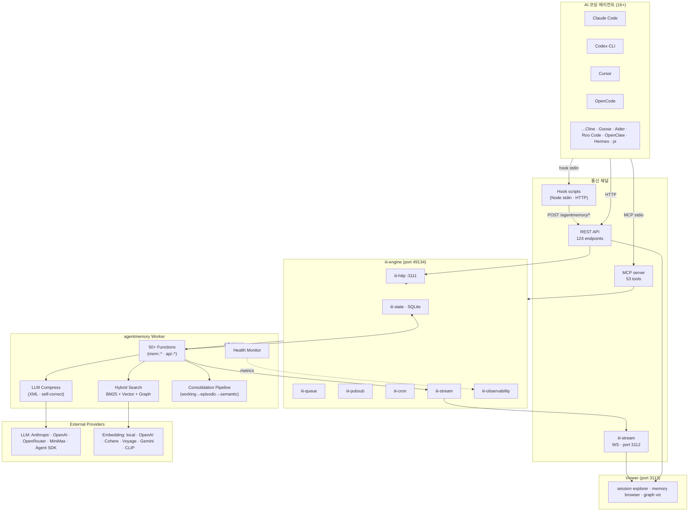
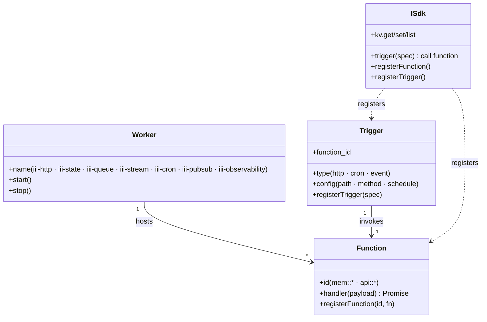
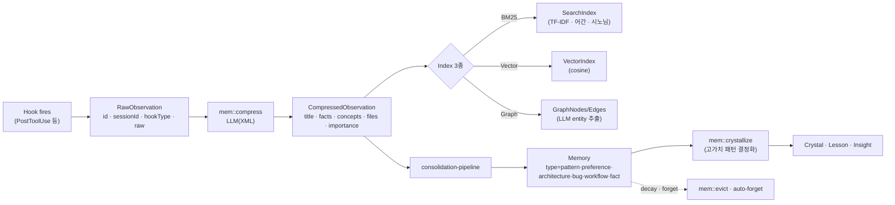
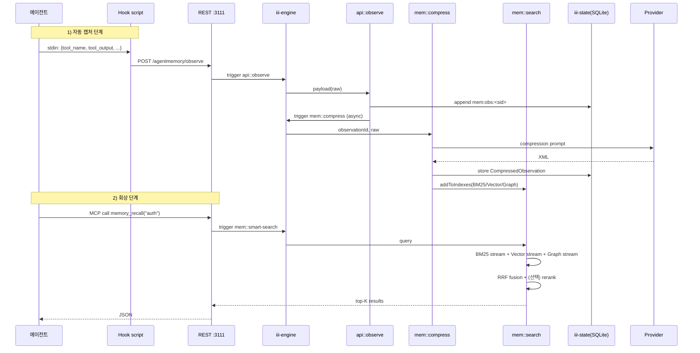
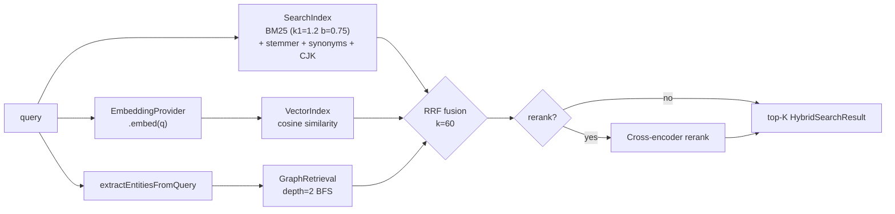
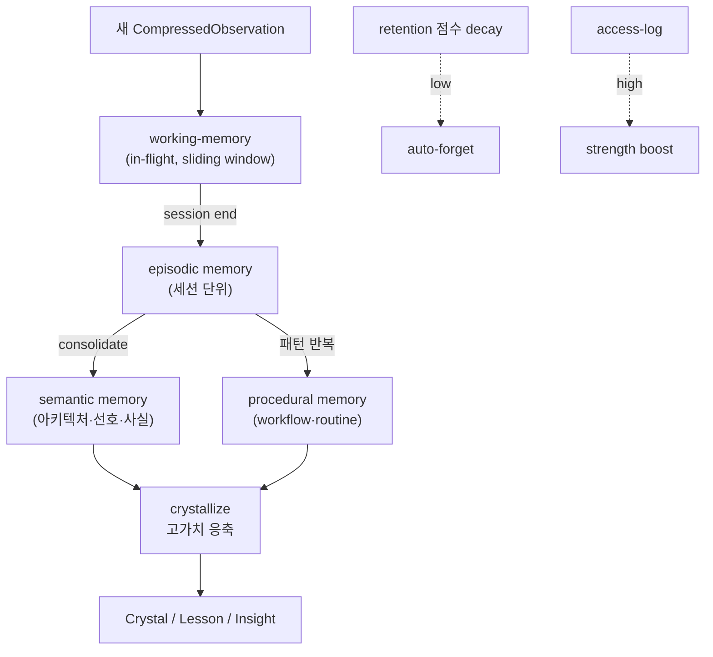
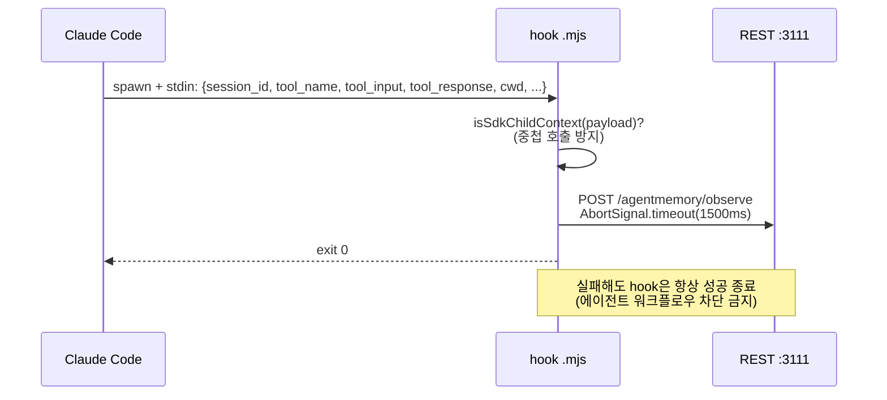
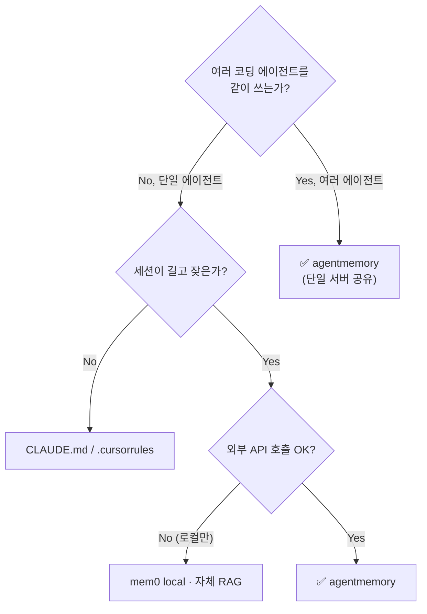

# agentmemory — AI 코딩 에이전트를 위한 영속 메모리 엔진

> **분석 대상**: [github.com/rohitg00/agentmemory](https://github.com/rohitg00/agentmemory) v0.9.21
> **저자**: Rohit Ghumare (`rohitg00`, ghumare64@gmail.com)
> **라이선스**: Apache-2.0
> **언어**: TypeScript ESM (Node ≥ 20)
> **배포**: npm `@agentmemory/agentmemory`, CLI 단일 명령
> **위치**: iii-engine 기반(`iii-sdk@0.11.2`) 영속 메모리 워커
> **참고**: 코드 클론(`.repos/agentmemory/`), Karpathy LLM Wiki 패턴 확장 디자인 노트

---

## 1. 프로젝트 개요

**agentmemory** 는 Claude Code·Codex·Cursor·Gemini CLI·OpenCode 등 **16+개 AI 코딩 에이전트** 에 **단일 영속 메모리 서버**를 제공한다. 한 줄로 정리하면:

> *"에이전트가 매 세션 같은 아키텍처·선호도·버그를 다시 설명받지 않도록, 작업을 자동으로 관찰·압축·검색 가능한 메모리로 만든다."*

기존 *built-in 메모리*(CLAUDE.md, `.cursorrules`)가 *정적 파일 ~200줄*에서 한계를 만나는 문제와, 에이전트별 메모리 도구가 *프레임워크 락인*과 *수동 add() 호출*에 의존하는 문제를 동시에 푼다.

### 해결하는 문제 (Problem Statement)

1. **세션 간 컨텍스트 단절** — 매번 같은 코드베이스 구조·결정 사항을 재설명
2. **CLAUDE.md/.cursorrules의 스케일 한계** — 정적 파일은 ~200줄에서 stale 시작
3. **에이전트 락인** — mem0/Letta 같은 메모리 라이브러리는 *그 프레임워크* 안에서만 동작
4. **수동 캡처 부담** — 개발자가 `add("...")`를 일일이 호출해야 메모리가 쌓이는 구조
5. **검색 품질** — 단순 grep 또는 단일 벡터로는 코딩 도메인의 *코드 심볼·파일 경로·시간성*을 동시에 못 다룸

### 핵심 가설

- **Hook 기반 자동 캡처**: Claude Code의 12개 hook(SessionStart, UserPromptSubmit, PreToolUse, PostToolUse, …)과 OpenCode의 22개 hook 등 *에이전트가 이미 노출한 lifecycle*을 도청하면 *수동 add 없이* 모든 활동이 기록된다.
- **LLM 압축**: 원본(raw) observation을 한 번 더 LLM으로 *fact/concept/files/importance*를 추출한 XML로 압축 → 검색·재주입 효율 ↑
- **3-stream Hybrid Search + RRF**: BM25 + 벡터 + 그래프를 동시에 돌리고 Reciprocal Rank Fusion으로 합치면 *단일 stream 대비 정밀도 2배 이상*
- **단일 메모리 서버**: 모든 에이전트가 *같은* 서버(`localhost:3111`)에 붙어 *교차-에이전트 메모리 공유* 가능

### 한 줄 정의

> "*iii-engine 위에 올린, Hook 자동 캡처 + LLM 압축 + Hybrid Search + 16+ 에이전트 어댑터를 가진 영속 메모리 워커.*"

---

## 2. 핵심 특징 (Key Features)

| 카테고리 | 기능 | 비고 |
|---|---|---|
| **자동 캡처** | Claude Code 12 hooks, OpenCode 22 hooks, Codex 6 hooks | session/prompt/tool/error/notification/compact |
| **검색** | BM25 + Vector + Graph **3-stream** Hybrid + RRF(k=60) | rerank, query expansion 선택 |
| **임베딩** | local(all-MiniLM-L6-v2), openai, cohere, voyage, gemini, openrouter, clip(이미지) | API 키 없이도 동작 |
| **LLM 압축** | XML 출력(fact/concept/files/importance/narrative) + self-correct 재시도 | anthropic/openai/openrouter/minimax/agent-sdk |
| **메모리 라이프사이클** | working → episodic → semantic → procedural | sliding window, consolidation pipeline |
| **그래프** | 엔티티(File/Function/Module/...) + 관계 edge + temporal | LLM XML 추출 |
| **MCP 서버** | 53 tools, 6 resources, 3 prompts | 어떤 MCP client든 OK |
| **REST API** | 124 endpoints | 비-MCP 클라이언트용 |
| **Viewer** | 실시간 stream, session explorer, graph viz, health | port 3113 |
| **Stream** | iii-stream WebSocket으로 live observation push | port 3112 |
| **Multi-agent** | 동일 서버 + lease/signal/checkpoint/mesh | 다중 에이전트 협업 |
| **거버넌스** | privacy, audit, retention, auto-forget, eviction | 컴플라이언스 친화 |
| **Skills** | 8개 (recap, handoff, recall, remember, forget, ...) | Claude Code Skill 형식 |
| **벤치마크** | LongMemEval-S R@5 **95.2%**, 토큰 92% 절감 | 공개 재현 가능 |

### 차별점

- **Hook 자동 캡처가 1급 시민** — mem0/Letta는 *manual add* 또는 *agent self-edit*가 기본. agentmemory는 lifecycle event를 도청
- **iii-engine 의존** — Workers/Functions/Triggers의 추상 위에 올라가서 *외부 DB 0개*(SQLite 단일 파일)로 시작
- **모든 에이전트가 같은 메모리** — 단일 서버에 다중 에이전트가 동시에 붙음 (MCP / REST / Stream 다중 채널)
- **압축이 라이프사이클** — raw → compressed → memory(pattern/preference/architecture/...) → crystal로 evolve

---

## 3. 아키텍처 분석

### 3.1 전체 시스템 구조



### 3.2 iii-engine 3-Primitive 모델

agentmemory가 *왜 외부 DB 없이도 50+ 함수와 124 REST endpoint를 운영하는지*는 iii-engine의 추상 덕분이다.



- **Worker**: 장기 실행 프로세스. agentmemory는 *단일 Worker*가 50+ Function을 등록
- **Function**: 입력 → 비동기 출력 핸들러. `mem::compress`, `mem::search`, `api::observe` 등
- **Trigger**: Function 호출 진입점. HTTP path, cron schedule, pubsub event 등을 매핑
- **State**: iii-state가 SQLite 파일 기반 KV (`./data/state_store.db`)를 제공 → *agentmemory는 자체 DB 안 가짐*

### 3.3 데이터 모델 — Observation → Memory 라이프사이클



### 3.4 KV 스키마 (40+ 네임스페이스)

`src/state/schema.ts`의 `KV` 객체가 *유일한 진실의 원천*:

```
mem:sessions           세션 메타
mem:obs:<sessionId>    원본/압축 observation
mem:memories           장기 메모리
mem:summaries          세션 요약
mem:emb:<obsId>        벡터 임베딩
mem:index:bm25         BM25 직렬화 인덱스
mem:graph:nodes/edges  지식 그래프
mem:relations          observation 간 관계
mem:profiles           유저/팀 프로필
mem:semantic           semantic memory
mem:procedural         procedural memory
mem:team:<id>:*        팀 공유/유저별
mem:audit              감사 로그
mem:actions/edges      "Action" 추적
mem:leases             리소스 락
mem:routines/-runs     반복 작업 패턴
mem:signals            multi-agent 시그널
mem:checkpoints        세션 체크포인트
mem:mesh               에이전트 mesh
mem:sketches           초기 가설
mem:facets             다차원 필터
mem:sentinels          watchdog
mem:crystals           결정화된 패턴
mem:lessons/insights   학습된 교훈
mem:retention/access   접근 통계
mem:image-refs/embeddings  비전 메모리
mem:slots / slots:global   대화 슬롯
mem:commits            git commit 연결
mem:state              내부 상태
```

### 3.5 명령 실행 흐름 — `agent` → `memory_recall("auth")`



### 3.6 3-Stream Hybrid Search 상세

`src/state/hybrid-search.ts`의 `tripleStreamSearch`가 핵심:



3개 stream이 *완전 독립*으로 돌고(`Promise.all`), 각자 *순위 기반* RRF 점수로 합쳐진다. 한 stream이 실패해도 나머지가 결과를 만들어 *graceful degradation*이 자동.

### 3.7 Consolidation Pipeline — Working → Long-term



Karpathy의 LLM Wiki 패턴(아키텍처 노트가 *살아 있는* 위키)을 *시간성 + 빈도 + 그래프*로 확장한 것이 핵심 디자인.

---

## 4. 주요 컴포넌트

| 컴포넌트 | 위치 | 책임 |
|---|---|---|
| **Worker entry** | `src/index.ts` | 50+ 함수·트리거 등록, 인덱스 부트, 헬스 등록 |
| **iii-config.yaml** | repo root | iii-engine 워커 7종 정의 (http·state·queue·pubsub·cron·stream·observability) |
| **REST trigger** | `src/triggers/api.ts` | 124 HTTP endpoint → `mem::*` 함수 매핑 |
| **Event trigger** | `src/triggers/events.ts` | pubsub 이벤트 → 함수 |
| **MCP server** | `src/mcp/server.ts` + `tools-registry.ts` | 53 tools, 6 resources, 3 prompts |
| **MCP standalone** | `src/mcp/standalone.ts` + `rest-proxy.ts` | 별도 프로세스로 띄울 때 REST로 프록시 |
| **State KV** | `src/state/kv.ts` + `schema.ts` | iii-state 위의 lightweight wrapper, 40+ 네임스페이스 |
| **SearchIndex (BM25)** | `src/state/search-index.ts` | TF-IDF, stemmer(`stemmer.ts`), 동의어(`synonyms.ts`), CJK 세그먼터(`cjk-segmenter.ts`) |
| **VectorIndex** | `src/state/vector-index.ts` | in-memory cosine + dimension guard |
| **HybridSearch** | `src/state/hybrid-search.ts` | 3-stream RRF + 옵션 rerank |
| **Reranker** | `src/state/reranker.ts` | cross-encoder 후처리 |
| **IndexPersistence** | `src/state/index-persistence.ts` | 인덱스 직렬화·복원 + dim mismatch 방어 |
| **Hooks (Node)** | `src/hooks/*.ts` | 14개 standalone hook (SDK 미사용, stdin → REST) |
| **Functions (mem::*)** | `src/functions/*.ts` (60+ 파일, ~16K LoC) | 압축·검색·그래프·라이프사이클 |
| **Providers (LLM)** | `src/providers/{anthropic,openai,openrouter,minimax,agent-sdk}.ts` | + circuit-breaker, fallback-chain, resilient |
| **Providers (embedding)** | `src/providers/embedding/{local,openai,cohere,voyage,gemini,openrouter,clip}.ts` | local은 `@xenova/transformers` + ONNX |
| **Eval** | `src/eval/` + `eval/` | metrics-store, schemas, self-correct, validator, longmemeval/coding-life runner |
| **Viewer** | `src/viewer/` | 단일 HTML SPA + 작은 server |
| **CLI** | `src/cli/` + `src/cli.ts` | `agentmemory`, `agentmemory demo`, `agentmemory connect <agent>` |
| **Plugin (Claude Code)** | `plugin/` + `.claude-plugin/` | hook 스크립트 + 8 skills (recap·handoff·recall·remember·forget·session-history·commit-history·commit-context) |
| **Integrations** | `integrations/{hermes,openclaw,pi,filesystem-watcher}` | 비-Claude 에이전트 어댑터 |
| **Benchmark/Eval** | `benchmark/`, `eval/`, `docs/benchmarks/` | LongMemEval-S, coding-agent-life-v1 |
| **Health monitor** | `src/health/monitor.ts` | OOM 회피·throttle |
| **Telemetry** | `src/telemetry/setup.ts` | OpenTelemetry (iii-observability 경유) |
| **Auth** | `src/auth.ts` | Bearer secret, REST 전 경로 가드 |

### 4.1 Function 카테고리별 60+ 파일 (`src/functions/`)

| 분류 | 파일 |
|---|---|
| **수집/관찰** | `observe.ts`, `claude-bridge.ts`, `image-refs.ts`, `vision-search.ts` |
| **압축** | `compress.ts`, `compress-file.ts`, `compress-synthetic.ts`, `enrich.ts`, `flow-compress.ts` |
| **검색** | `search.ts`, `smart-search.ts`, `query-expansion.ts`, `graph-retrieval.ts`, `facets.ts` |
| **그래프** | `graph.ts`, `temporal-graph.ts`, `relations.ts`, `mesh.ts` |
| **메모리** | `remember.ts`, `lessons.ts`, `crystallize.ts`, `patterns.ts`, `working-memory.ts`, `sketches.ts` |
| **라이프사이클** | `evict.ts`, `retention.ts`, `auto-forget.ts`, `sliding-window.ts`, `dedup.ts`, `consolidate.ts`, `consolidation-pipeline.ts` |
| **시간/타임라인** | `timeline.ts`, `temporal-graph.ts`, `checkpoints.ts`, `branch-aware.ts` |
| **거버넌스** | `privacy.ts`, `audit.ts`, `governance.ts`, `disk-size-manager.ts`, `image-quota-cleanup.ts` |
| **멀티 에이전트** | `team.ts`, `leases.ts`, `signals.ts`, `sentinels.ts`, `actions.ts`, `routines.ts` |
| **운영** | `diagnostics.ts`, `verify.ts`, `migrate.ts`, `migrate-vector-index.ts`, `snapshot.ts`, `export-import.ts`, `replay.ts` |
| **출력** | `obsidian-export.ts`, `frontier.ts`, `reflect.ts`, `skill-extract.ts`, `slots.ts`, `profile.ts`, `summarize.ts` |

> ~16,000 LoC, 단일 메인테이너. 모듈 분리는 *함수 단위*로 깔끔.

---

## 5. 기술 스택

### 5.1 런타임/언어

- **Node ≥ 20**, ESM only (`"type": "module"`)
- **TypeScript 6** → **tsdown** 으로 ESM 번들링, `dist/{index,cli,standalone,hooks/*}.mjs`
- **vitest 4** (950+ 테스트, integration 별도)

### 5.2 핵심 의존성

| 패키지 | 용도 |
|---|---|
| **`iii-sdk@0.11.2`** | Worker/Function/Trigger 엔진. WebSocket 49134 |
| `@anthropic-ai/sdk` + `@anthropic-ai/claude-agent-sdk` | Anthropic 직결 + Agent SDK 통합 |
| `@clack/prompts` | CLI 인터랙티브 prompt |
| `dotenv` | 환경변수 |
| `zod` v4 | 입력 스키마 검증 |

### 5.3 Optional (필요할 때만 깔림)

| 패키지 | 용도 |
|---|---|
| `@xenova/transformers` + `onnxruntime-node`/`-web` | 로컬 임베딩 (`all-MiniLM-L6-v2`, API 키 0) |
| `@node-rs/jieba`, `tiny-segmenter` | 중국어/일본어 토크나이저 (BM25 인덱스) |

### 5.4 외부 프로바이더 (선택)

- **LLM 압축/그래프 추출**: Anthropic, OpenAI, OpenRouter, MiniMax, Claude Agent SDK
- **Embedding**: local(MiniLM), OpenAI(`text-embedding-3-*`), Cohere, Voyage, Gemini, OpenRouter, CLIP(이미지)
- **이미지**: vision-search.ts에서 LLM describeImage 호출

### 5.5 포트 매트릭스

| 포트 | 워커 | 용도 |
|---|---|---|
| **3111** | iii-http | REST API + MCP HTTP |
| **3112** | iii-stream | 라이브 observation WS |
| **3113** | viewer | Web UI |
| **49134** | iii-engine | SDK WebSocket (내부) |

---

## 6. 통신 채널 / API

### 6.1 MCP 서버 (53 tools)

기본 노출 8 tools(나머지는 `AGENTMEMORY_TOOLS=all`로 노출):
- `memory_recall`, `memory_remember`, `memory_search`, `memory_forget`
- `memory_recap`, `memory_handoff`, `memory_session_history`, `memory_commit_history`

추가 카테고리(45+):
- 그래프(`memory_graph_*`), 액션/리스(`memory_action_*`, `memory_lease_*`), 루틴/시그널(`memory_routine_*`, `memory_signal_*`), 거버넌스(`memory_privacy_*`, `memory_audit_*`), 진단(`memory_diagnostics_*`)

`src/mcp/tools-registry.ts`가 *유일한 정의*이고 `src/mcp/server.ts` switch가 그것을 호출하는 *동기화 제약*이 AGENTS.md에 명시되어 있음.

### 6.2 REST 엔드포인트 (124개)

`src/triggers/api.ts`가 `sdk.registerTrigger({type:"http", config:{api_path, http_method}})`로 매핑. 모든 엔드포인트는 `Bearer <AGENTMEMORY_SECRET>` 인증 + 필드 화이트리스트(*raw body 그대로 trigger에 안 보냄*) 강제.

대표:
```
POST /agentmemory/session/start
POST /agentmemory/observe                # 모든 hook이 여기로 들어감
POST /agentmemory/recall
POST /agentmemory/remember
POST /agentmemory/search
POST /agentmemory/forget
GET  /agentmemory/health
POST /agentmemory/skills/*
```

### 6.3 Hook 인터페이스 (Claude Code 12 + OpenCode 22 + Codex 6)



12 Claude Code hooks: `SessionStart, UserPromptSubmit, PreToolUse, PostToolUse, PostToolUseFailure, PreCompact, SubagentStart, SubagentStop, Notification, TaskCompleted, Stop, SessionEnd` (+ git post-commit으로 commit-context 자동 캡처).

### 6.4 Stream (port 3112)

Viewer 또는 외부 모니터가 *real-time observation*을 받기 위한 iii-stream WebSocket. consumer group(`STREAM.group(sessionId)`)으로 세션별 격리.

### 6.5 Skills (Claude Code Skill 형식, 8개)

`plugin/skills/`:
- **recall**: 메모리에서 관련 컨텍스트 검색
- **remember**: 명시적 메모리 기록
- **forget**: 명시적 제거
- **recap**: 세션 요약 보기
- **handoff**: 다른 에이전트/사람에게 인계
- **session-history**, **commit-history**, **commit-context**: git/세션 시간축 조회

각 skill은 *MCP tool들의 LLM-friendly 묶음 + 시스템 prompt*다.

---

## 7. 코드 레벨 디자인 패턴

### 7.1 Function/Trigger 등록 패턴

```ts
sdk.registerFunction("mem::your-function", async (data: {...}) => {
  // 1) 입력 검증
  // 2) kv.get/set/list로 상태 액세스
  // 3) recordAudit() 로 변경 기록
  return { success: true, ... };
});

sdk.registerTrigger({
  type: "http",
  function_id: "api::your-endpoint",
  config: { api_path: "/agentmemory/your-path", http_method: "POST" },
});
```

REST 핸들러는 *raw body 절대 금지*. 필드를 명시 화이트리스트로 추출해 `sdk.trigger()`에 넘긴다.

### 7.2 Hook은 SDK 미사용

`src/hooks/*.ts`는 *iii-sdk import 0*. 단순 Node 스크립트로 빌드되어:
1. stdin JSON 읽기
2. `isSdkChildContext`로 *중첩 자기 호출* 가드 (SDK 내부에서 트리거된 호출 무시)
3. `fetch()` + `AbortSignal.timeout(800~1500ms)` 로 best-effort 호출
4. 실패해도 `try/catch + exit 0` — *호스트 워크플로우를 절대 막지 않음*

### 7.3 Resilient Provider

`src/providers/{circuit-breaker,fallback-chain,resilient}.ts`:
- **Circuit breaker**: 연속 실패 N회 → 일정 시간 *open*, 그동안 다른 프로바이더로 fallback
- **Fallback chain**: 순서대로 시도, 모두 실패해야 에러
- **Resilient wrapper**: 단일 프로바이더를 retry+timeout으로 감쌈

### 7.4 LLM 출력 = XML

`src/prompts/{compression,graph-extraction,vision}.ts`가 *XML 응답을 강제*. 이유는 *Claude/GPT 둘 다 JSON보다 XML 일관성이 높다*는 경험적 디자인 + `getXmlTag`/`getXmlChildren` 파서가 partial response에도 강건.

### 7.5 self-correct + validate

`src/eval/{schemas,validator,quality,self-correct}.ts`: 압축 결과를 Zod로 검증 → 실패 시 *피드백 prompt로 재시도* → 품질 점수(`scoreCompression`) 로깅. 잘못된 LLM 출력에 대한 *내장 retry 루프*.

### 7.6 Index dimension guard

`VectorIndex.validateDimensions(expected)` 가 *프로바이더 교체 시 mismatch*를 거부. 디스크에서 복원할 때도 같은 가드로 *서로 다른 dim의 벡터 혼합*을 방지. (legacy 호환 위해 명시적 mismatch 리포트)

### 7.7 unhandledRejection은 throttle 로그

`process.on("unhandledRejection", ...)`가 60초 1회만 warn. 이유는 *Claude Code 다중 프로젝트 hook 폭주* 시 SDK 30s 타임아웃이 흩어져 발생하는데, 매번 죽으면 메모리 서비스가 셧다운된다는 경험.

---

## 8. 장점

1. **자동 캡처 = 0 학습 곡선** — `npm i -g`만 하고 hook을 wire 하면 *코드 1줄도 안 쓰고* 메모리 축적
2. **에이전트 락인 없음** — MCP 또는 HTTP만 쓰면 어떤 도구든 OK (16+ 검증)
3. **단일 서버 다중 에이전트 공유** — Claude로 짠 메모리를 Cursor에서 회상 가능
4. **외부 DB 0개** — SQLite 단일 파일, iii-engine 단일 프로세스
5. **로컬 임베딩 무료 옵션** — `all-MiniLM-L6-v2` ONNX, API 키 없이도 동작
6. **3-stream Hybrid Search** — 단일 stream 대비 정밀도 ×2 (자체 벤치 2.2×)
7. **벤치마크 재현 가능** — `eval/`에 adapter-pluggable 하니스, LongMemEval-S 95.2% 공개
8. **풍부한 라이프사이클** — working/episodic/semantic/procedural + decay + crystallize
9. **거버넌스 기본 탑재** — audit·privacy·retention·auto-forget·governance 함수 분리
10. **Viewer 내장** — 실시간 stream, 그래프 시각화, health dashboard
11. **Skills로 LLM-친화 패키징** — recall/handoff/recap/remember/forget 즉시 사용
12. **압축이 self-correct** — 잘못된 LLM 출력 자동 재시도 + 품질 점수
13. **multi-agent 협업 primitive** — lease, signal, checkpoint, mesh, sentinel
14. **거의 모든 LLM·임베딩 프로바이더 커버** — 5 LLM + 7 임베딩 (이미지 포함)
15. **CLI UX 깔끔** — `agentmemory connect <agent>` 한 줄로 wiring
16. **commit 연결** — `mem:commits` + post-commit hook으로 코드↔메모리 연결

---

## 9. 단점 / 리스크

1. **iii-engine 의존** — 외부 메인테이너의 작은 SDK(`iii-sdk@0.11.2`) 안정성에 묶임. 운영 중단 시 *대체 어려움*
2. **알파 (0.9.x)** — 활발히 변하고 *AGENTS.md*에 "버전 올릴 때 6곳 동기화" 같은 *유지보수 무거움* 신호
3. **LLM 비용 누적 가능성** — 모든 observation을 압축하면 토큰 사용량이 hook 빈도에 비례. local LLM 미지원
4. **단일 메인테이너** — Rohit 1인 프로젝트. 16+ 에이전트 호환을 *혼자* 유지
5. **거대한 표면적** — 53 MCP tools + 124 REST + 12+ hooks. *학습/감사 코스트* 적지 않음
6. **Hook stdin 인터페이스 다양성** — Claude Code/OpenCode/Codex 모두 다름, 깨지면 *조용히* 메모리만 안 쌓임
7. **그래프 추출이 LLM에 의존** — XML 파싱 실패 케이스가 있고, 정밀도가 모델 품질에 직결
8. **CJK 토큰화 optional dependency** — jieba/segmenter가 깔려야 한국어/일본어 BM25가 의미 있음
9. **DESIGN.md가 *디자인 시스템 문서*** — 코드 아키텍처 문서가 아닌 *웹사이트 디자인* 문서. 신규 진입자에 혼란
10. **dependency 무거움** — onnxruntime(local emb)은 OS별 바이너리, M-시리즈 Mac에서 빌드 이슈 보고
11. **observability는 자체 iii-observability** — 외부 OTLP 수출 설정이 별도 작업
12. **mem0/Letta처럼 *agent runtime*은 아님** — 메모리만 제공. 에이전트 로직은 사용자 도구가 전담
13. **벤치마크 일부가 in-house** — `coding-agent-life-v1`이 자체 코퍼스. 외부 비교에는 LongMemEval-S만 표준
14. **Hook 폭주 시 백프레셔** — 위에서 본 `unhandledRejection` throttle은 *증상 완화*고 *근본 해결 아님*
15. **multi-agent semantics 미성숙** — lease·signal·mesh API는 있으나 사례·문서는 얕음
16. **MCP/REST 일관성 부담** — AGENTS.md "tool 추가/제거 시 7곳 동시 수정" 규칙이 자동화 안 됨 → 휴먼 에러 위험

---

## 10. 예상 Use Cases

### 10.1 단일 개발자 — 세션 간 컨텍스트 보존
```bash
npx @agentmemory/agentmemory
agentmemory connect claude-code
# 끝. 이후 모든 Claude Code 세션이 자동으로 메모리에 적재되고
# 새 세션 시작 시 recall로 이전 결정·파일·선호도 참조 가능
```
- 효과: "auth는 jose 미들웨어 썼다는 사실"을 *재설명 안 함*
- 토큰 절감 ~92% (벤치 기준)

### 10.2 멀티-에이전트 워크플로우 — Claude + Cursor + Codex 동일 메모리
```bash
agentmemory connect claude-code
agentmemory connect cursor
agentmemory connect codex
```
- Claude로 작성한 아키텍처 메모를 Cursor·Codex가 *그대로* 회상
- MCP 클라이언트면 다 됨 → 미래 에이전트도 zero-config 통합

### 10.3 팀 공유 메모리 (`mem:team:*`)
- 작은 팀 서버 한 대 띄우고 모두가 같은 서버에 wiring
- 팀 단위 *공유 패턴/아키텍처 결정*이 자동 누적
- `mem::team::*` 함수와 KV 네임스페이스 분리
- 개인 메모리(`mem:profiles`)와 팀 메모리(`mem:team:<id>:shared`)는 *교차 검색* 가능

### 10.4 코드베이스 온보딩
- 신규 입사자가 *기존 세션 history*에 접근 → "이 함수는 왜 이렇게 짰는지" 즉답
- `commit-context` skill로 PR 검토 시 *그 PR이 만들어진 세션*을 회상

### 10.5 디버깅·회고
- `memory_recap` skill로 *지난 N시간 작업 narrative 자동 요약*
- `memory_handoff`로 *AI 간 또는 AI→사람* 인계 문서 자동 생성

### 10.6 정적 규칙 파일의 동적 대체 — CLAUDE.md 대체
- `.cursorrules`/`CLAUDE.md`가 stale 되는 문제를 *접근 기반 retention*으로 해결
- 자주 안 쓰이는 패턴은 decay → forget, 자주 회상되는 건 strength↑

### 10.7 비전 메모리 — UI/스크린샷 작업
- `image-refs`, `vision-search`, `clip` 임베딩
- Cursor/Claude로 *디자인 mock* 작업 시 스크린샷을 메모리에 적재
- "지난주 다뤘던 그 모달 디자인" 식 회상

### 10.8 코딩 에이전트 평가 하니스
- `eval/runner/longmemeval.ts`, `coding-life.ts`를 *재현 가능 적합도 측정*에 활용
- adapter-pluggable이라 *우리 메모리 시스템*도 같은 코퍼스로 비교 가능

### 10.9 거버넌스가 필요한 환경
- audit 로그 + retention 정책 + privacy 함수 + auto-forget으로 *민감 컨텍스트* 제거
- `mem::governance` 가 forget·redact·export 작업 일관 처리

### 10.10 안티 패턴
- **로컬 LLM only 환경** — LLM 압축이 핵심이라 OpenAI/Anthropic 등 API 키 없으면 *기본 가치의 절반 상실*
- **무관한 에이전트 사용 X** — 단일 세션 / 단일 프로젝트로만 쓴다면 *CLAUDE.md*로 충분
- **엔터프라이즈 컴플라이언스 헤비** — *alpha SaaS 아닌 OSS*임을 감안. SOC2 등은 사용자 책임

---

## 11. 경쟁·비교

| 도구 | 카테고리 | 특징 | agentmemory와의 차이 |
|---|---|---|---|
| **mem0** (53K⭐) | Memory layer SaaS/SDK | manual `add()` API | agentmemory는 hook 자동 캡처 |
| **Letta / MemGPT** (22K⭐) | Full agent runtime | 자체 agent loop | agentmemory는 *어떤* 에이전트에도 붙음 |
| **Khoj** | Personal AI assistant | obsidian 통합 | agentmemory는 코딩 특화 + MCP 1급 |
| **claude-mem** | Claude 전용 memory | 단일 에이전트 | agentmemory는 16+ |
| **Hippo** | RAG memory | 일반 RAG | agentmemory는 hook+압축 라이프사이클 |
| **CLAUDE.md / .cursorrules** | Static file | manual editing | agentmemory는 dynamic retention |
| **iii-engine 자체** | runtime primitive | worker/fn/trigger | agentmemory는 그 위의 application |
| **lat.md** (별도 도구) | Markdown KG | 사람이 쓰는 그래프 | agentmemory는 자동 생성 그래프 |

### 결정 매트릭스



---

## 12. 종합 평가

### 12.1 강점 요약
- ***에이전트가 이미 노출한 lifecycle*을 도청한다**는 발상이 영리하다. 사용자가 도구를 새로 익힐 게 없다
- 단일 서버에서 *모든 에이전트 메모리*가 공유되는 *통합 메모리 인프라*로 자리 잡을 수 있는 포지셔닝
- BM25+Vector+Graph 3-stream RRF 는 *코딩 도메인*에 합리적이고 벤치마크로 검증됨
- iii-engine 위에 올린 *Worker/Function/Trigger* 모델 덕에 60+ 함수가 *깔끔하게* 모듈화

### 12.2 약점 요약
- 알파 단계의 *유지 부담*이 코드 곳곳에 보임 (AGENTS.md의 "7곳 동시 수정" 규칙)
- iii-engine 단일 의존이 *공급망 리스크*
- LLM 압축 비용·정밀도가 *제품 가치*와 직결 — provider 안 좋으면 가치 하락
- 단일 메인테이너 + 16+ 에이전트 호환 = *지속성 의문*
- DESIGN.md가 *코드 아키텍처가 아닌 웹사이트 디자인* 문서라 *진입 친화성*이 낮음

### 12.3 적합/부적합

**적합**:
- 매일 코딩 에이전트를 쓰는 개인/소규모 팀
- *다중 에이전트 도구를 병행*하는 개발자
- 코드베이스 온보딩·핸드오프가 잦은 환경
- *재현 가능한 평가 하니스*가 필요한 메모리 시스템 연구

**부적합**:
- 100% 오프라인/로컬 LLM 환경 (압축 가치 ↓)
- 단일 에이전트 단일 프로젝트 (정적 파일로 충분)
- 엔터프라이즈 SLA·SOC2가 필수인 환경 (alpha)

### 12.4 엔지니어 관점 인사이트
1. **"메모리 = workspace lifecycle event 스트림"** 으로 본 모델링이 단순하면서 강력하다. 이 추상은 *다른 도메인*(브라우저 자동화, 셸 워크플로우 등)에도 일반화 가능
2. **RRF(k=60) 3-stream**은 알고리즘은 단순하지만 *각 stream의 graceful degradation* 패턴이 잘 짜여 있다 (한 개 실패해도 나머지가 결과 만듦)
3. **Hook 스크립트가 SDK 미사용 단일 .mjs**라는 결정은 *production hardening* 측면에서 모범 — "메모리 시스템이 죽어도 에이전트는 죽지 않는다"
4. **XML 출력 + self-correct + validator** 콤보는 *LLM 출력 신뢰성*을 끌어올리는 작은 인프라. 다른 LLM 도구에도 빌려쓸 수 있는 패턴
5. **iii-engine을 그대로 노출**하는 것은 *장점이자 약점*. KV·HTTP·stream을 한 번에 얻지만, 그 생태계 안에 갇힘
6. **DESIGN.md가 진짜 문서 아닌 점**은 *주의*. 실제 아키텍처는 AGENTS.md + 코드를 읽어야 한다
7. **벤치 재현 가능 하니스**(`eval/`)를 OSS로 공개한 건 *메모리 시스템 비교 문화*에 기여. 이게 다른 도구로도 퍼지면 분야 전반에 좋다

---

## 부록 A — 빠른 시작

```bash
# 1) 설치 + 데모
npx -y @agentmemory/agentmemory@latest
# (또는) npm i -g @agentmemory/agentmemory
agentmemory          # :3111 메모리 서버
agentmemory demo     # 샘플 세션 시드

# 2) 에이전트 wiring
agentmemory connect claude-code
agentmemory connect cursor
agentmemory connect gemini-cli
agentmemory connect codex
agentmemory connect opencode

# 3) 환경 설정 (선택)
export AGENTMEMORY_SECRET="..."         # Bearer auth
export AGENTMEMORY_TOOLS=all            # 53 MCP tools 전체 노출
export AGENTMEMORY_URL=http://localhost:3111
# 로컬 임베딩 강제
export AGENTMEMORY_EMBEDDING_PROVIDER=local
# LLM 압축 프로바이더
export AGENTMEMORY_LLM_PROVIDER=anthropic
export ANTHROPIC_API_KEY=sk-ant-...

# 4) 뷰어
open http://localhost:3113
```

## 부록 B — 핵심 파일 인덱스

| 파일 | LoC | 역할 |
|---|---|---|
| `src/index.ts` | ~300 | Worker entry, 50+ 함수 등록 |
| `iii-config.yaml` | ~50 | iii-engine 7 워커 정의 |
| `src/state/schema.ts` | ~80 | KV 네임스페이스 + `generateId/fingerprintId` |
| `src/state/hybrid-search.ts` | ~250 | 3-stream RRF 검색 |
| `src/state/search-index.ts` | ~250 | BM25 + stemmer + synonyms + CJK |
| `src/state/vector-index.ts` | ~150 | cosine + dim guard |
| `src/triggers/api.ts` | (큼) | 124 REST endpoint 등록 |
| `src/mcp/server.ts` + `tools-registry.ts` | — | 53 MCP tool dispatch |
| `src/hooks/*.ts` | 14 파일 | SDK-less standalone hook |
| `src/functions/compress.ts` | 266 | LLM XML 압축 + self-correct |
| `src/functions/graph.ts` | 278 | LLM 엔티티/관계 추출 |
| `src/functions/consolidation-pipeline.ts` | 270 | working→episodic→semantic |
| `src/functions/diagnostics.ts` | 1031 | 내부 진단 (가장 큰 파일) |
| `src/providers/embedding/local.ts` | — | `all-MiniLM-L6-v2` ONNX |
| `src/providers/{circuit-breaker,fallback-chain,resilient}.ts` | — | resilience primitives |
| `src/viewer/server.ts` + `index.html` | — | 뷰어 |
| `plugin/skills/{recall,remember,handoff,recap,forget,session-history,commit-history,commit-context}/` | 8 skills | Claude Code Skill |
| `integrations/{hermes,openclaw,pi,filesystem-watcher}/` | — | 비-Claude 어댑터 |
| `eval/runner/{longmemeval,coding-life}.ts` | — | 재현 가능 평가 |

---

**참고 자료**:
- [GitHub: rohitg00/agentmemory](https://github.com/rohitg00/agentmemory)
- [AGENTS.md (실제 아키텍처 문서)](https://github.com/rohitg00/agentmemory/blob/main/AGENTS.md)
- [iii-engine](https://github.com/iii-hq/iii) — 기반 런타임
- [agent-memory.dev](https://agent-memory.dev) — 랜딩
- [AgentSkill.work 소개](https://agentskill.work/en/skills/rohitg00/agentmemory)
- [Alpha Signal 분석 기사](https://alphasignalai.substack.com/p/how-agentmemory-works-and-how-to)
