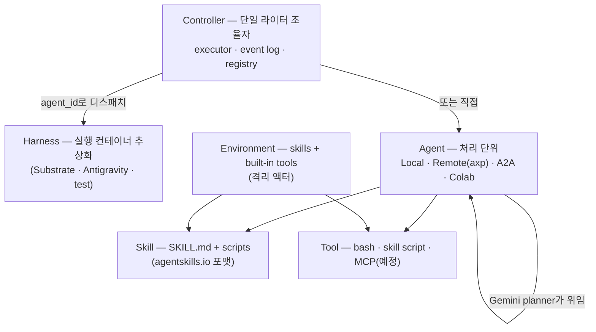
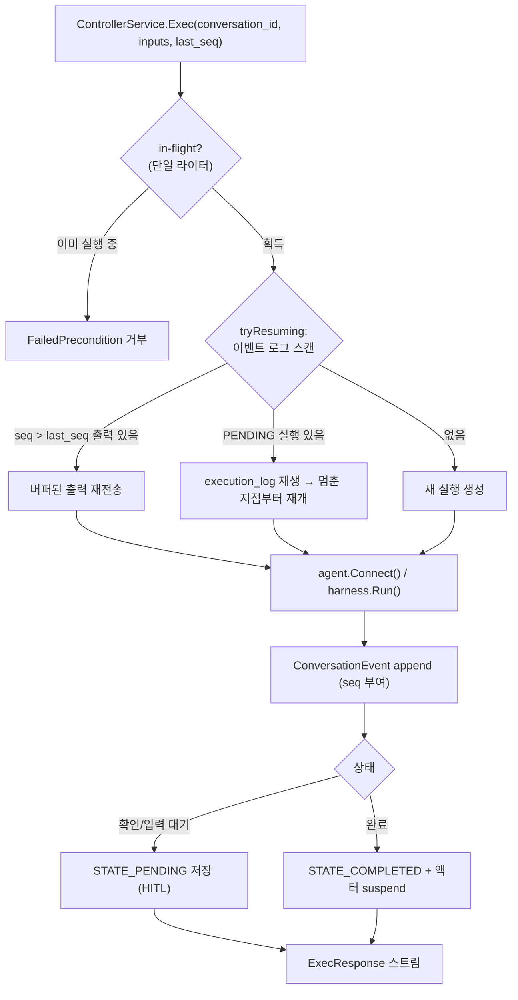
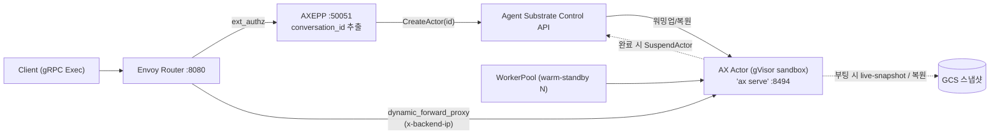

# Google AX (Agent eXecutor) 심층 분석 — 분산 에이전트 런타임

> **대상**: https://github.com/google/ax
> **분석 시점**: 2026-06 (commit 기준, **active early development** — 핵심 아키텍처 안정화 전이라 breaking change 예고, 외부 PR 일시 중단)
> **핵심 정의**: 에이전트 루프를 조율하고, 실행을 **이벤트 로그로 영속화**하며, 로컬·원격 액터와 통신하는 **분산 에이전트 런타임**. 장애·중단으로부터의 **복구(recovery)와 재개(resumption)** 를 1급으로 지원
> **라이선스**: Apache-2.0 (Google)
> **주요 언어**: Go 1.26 + gRPC/Protobuf (+ Python 바인딩)
> **위치**: Google의 "K8s 위 에이전트" 스택 — **AX(런타임) + Agent Substrate(컴퓨트 레이어) + Agent Sandbox(격리 프리미티브)** 의 런타임/컨트롤 플레인

> ⚠️ 초기 개발 단계. resumption 프로토콜·런타임 스펙이 안정화 전이며, controller v1/v2가 공존하는 과도기다.

---

## 1. 프로젝트 개요

### 1.1 해결하려는 문제

에이전트가 **단순 어시스턴트 → 자율적 장시간(long-running) 워커** 로, 그리고 **모놀리식 → 도구·스킬·에이전트가 격리된 액터로 분산 배포** 되는 방향으로 진화하면서, 다음이 인프라 차원에서 필요해졌다:

- **상태 관리**: 장시간 실행의 중간 상태를 안전하게 보존
- **신뢰성**: 장애·중단에서 복구하고 *정확히 멈춘 지점부터* 재개
- **감사/정책**: 모든 사용자·에이전트 호출을 한 곳에서 조율·감사
- **분산 격리**: 동적으로 스폰되는 격리 워커들의 조율

AX는 이 공백을 메우는 **기반 레이어(foundational layer)** 다. 개발자가 인프라가 아니라 애플리케이션에 집중하게 하는 것이 목표이며, "정교한 에이전트 애플리케이션이라면 모두 AX가 제공하는 능력이 필요할 것"이라는 가정 위에 서 있다.

### 1.2 전체 모델 (README의 개념도)

```
Client → Router → AX Controller (executor · event log · registry)
                       ├──(resumable stream)── Agent (격리 액터)
                       ├──────────────────────  Tool (MCP server)
                       └──────────────────────  Environment (skills + built-in tools, 격리 액터)
```

핵심: 컨트롤러가 **단일 조율 지점**이고, 에이전트·툴·환경은 **격리된 액터**로 따로 실행되며, 클라이언트↔컨트롤러·컨트롤러↔에이전트는 **재개 가능한 스트림(resumable stream)** 으로 연결된다.

---

## 2. 핵심 특징 및 차별점

| 특징 | 내용 |
|------|------|
| **단일 라이터(Single-Writer)** | 한 대화(conversation)에 대해 컨트롤러 하나만 이벤트 로그에 쓴다 → 일관된 상태. 서버의 in-flight 세마포어로 동시 실행 차단 |
| **이벤트 로그(Event Log)** | append-only, SQLite 영속화. 실행 상태의 단일 진실 원천 → **재생(replay)으로 자동 복구** |
| **재개(Resumption)** | `seq` 체크포인트 기반 재개. 끊긴 스트림을 마지막 seq부터 이어받고, PENDING 실행을 재생. **컴퓨트 레이어 액터 재개**(중단된 액터를 종료가 아니라 suspend) 지원 |
| **분산 격리** | 컨트롤러·스킬·툴·에이전트가 각각 격리 액터로 실행 |
| **감사 & 정책** | 모든 호출이 공통 컨트롤러를 거침 → 전체 실행·스킬/툴/에이전트 호출을 제어·감사 용이 |
| **하니스/모델 비종속** | "harness·model agnostic" — 실행 컨테이너(harness)와 모델을 추상화. 내장 Gemini 에이전트 + 외부 하니스(ADK·Antigravity·A2A) |
| **이식성** | 어디서나 실행, 소·대규모 모두. K8s(Agent Substrate)에서 최상 |

### 차별점 한 줄

LangGraph/Temporal 류의 "워크플로우 durable execution"을 **에이전트 분산 런타임 + K8s 컴퓨트 레이어(suspend/resume actor)** 와 결합해, *장시간 자율 에이전트를 K8s 위에서 고밀도로 돌리는 컨트롤 플레인* 을 지향한다.

---

## 3. 아키텍처 분석

### 3.1 개념 모델 — 6개 1급 개념



- **Controller**: 대화별 단일 라이터. 실행 조율 + 이벤트 로그 + 레지스트리.
- **Harness**: "어디서 실행되는가"의 추상화. AX는 하니스 비종속 — Substrate(K8s 액터)·Antigravity(Python 서버)·test 등.
- **Agent**: 목표를 처리하는 단위. `Connect()` 한 번이 한 실행 경계. 다른 에이전트로 **위임(delegate)** 가능.
- **Skill / Tool / Environment**: 스킬은 지시문+스크립트, 툴은 호출 가능 함수(bash 등), 환경은 스킬·툴을 묶은 격리 액터.

### 3.2 실행 + 재개 흐름 (가장 중요한 차별점)



**핵심 메커니즘**:
- **단일 라이터**: `server.go`의 `markInFlight()`가 conversation_id를 잠가 동시 쓰기 차단.
- **이벤트 로그**: 모든 입력/출력/상태를 append → 상태는 *로그 밖에 없음*(no state outside the log). 그래서 어느 컨트롤러가 받아도 로그 재생으로 동일 상태 복원.
- **재개**: 클라이언트가 `last_seq`를 보내면 그 이후 출력만 재전송. 중단된 PENDING 실행은 `execution_log`를 재생해 *멈춘 지점부터* 이어감. 멱등(idempotent).
- **HITL**: 마지막 출력이 미응답 confirmation이면 `STATE_PENDING`으로 저장하고, 다음 입력(승인/거절)으로 재개.

### 3.3 컴퓨트 레이어 재개 (Agent Substrate)



완료된 액터는 **종료가 아니라 suspend** 되어 풀로 돌아가고, 다음 요청 때 GCS 스냅샷에서 **즉시 복원**된다 → 고밀도·저지연. (Substrate는 "ready compute 위로 에이전트를 실시간 이동", Google 발표 기준 초당 300 샌드박스·sub-second.)

---

## 4. 기술 스택

| 영역 | 기술 |
|------|------|
| **언어/런타임** | Go 1.26, gRPC, Protocol Buffers |
| **이벤트 로그** | `modernc.org/sqlite` (순수 Go SQLite) — append-only 로그 |
| **모델** | `google.golang.org/genai` (Gemini), 기본 `gemini-3.5-flash` |
| **프로토콜** | AXP(자체 gRPC `AgentService`), **A2A**(`a2aproject/a2a-go`), MCP(README 명시, 코드 미구현), Colab, ATE |
| **라우팅/게이트웨이** | Envoy(`go-control-plane`) + ext_authz 플러그인(AXEPP), dynamic_forward_proxy |
| **CLI/TUI** | `spf13/cobra` + Charm(`huh`·`lipgloss`·`bubbletea`) |
| **컴퓨트 레이어** | **Agent Substrate**(`agent-substrate/substrate`) on Kubernetes, gVisor(runsc) 격리, GCS 스냅샷 |
| **Python** | ADK 래퍼, Antigravity 하니스 서버, 생성된 proto stub |
| **빌드/배포** | `ko`(컨테이너 이미지), K8s 매니페스트, gVisor ActorTemplate/WorkerPool |

---

## 5. 핵심 코드 분석

### 5.1 컨트롤러 — v1 / v2 (`internal/controller`, `internal/controller2`)

- **v1 `controller/`**: 에이전트·**planner 기반**. `Controller{ registry, eventLog, plannerBuilder }`. `Exec()`이 `tryResuming()` → 레지스트리에서 planner(기본 Gemini) 해석 → `DefaultExecutor`로 상태머신 실행(PENDING→COMPLETED 로깅).
- **v2 `controller2/`**: **harness 우선** 설계로 리팩터링 중. planner 로직을 제거하고 하니스에 위임. `Exec()`이 레지스트리에서 harness 조회 → `harness.Start()` → `Queue(inputs)` → `Run()` → `Close()`(액터 suspend).
- 과도기: v1이 현재 동작 경로, v2가 지향 아키텍처.

### 5.2 이벤트 로그 (`internal/controller/executor/`)

```go
type EventLog interface {
    Append(ctx, *ConversationEvent) (int32, error)   // seq 자동 증가
    AppendExec(ctx, *ExecutionEvent) error
    Events(ctx, conversationID) ([]*ConversationEvent, error)
    ExecEvents(ctx, execID) ([]*ExecutionEvent, error)
    DeleteEvents(ctx, conversationID) error
}
```

`sqlite.go`의 `SQLiteEventLog`가 구현. 테이블 `conversation_log(conversation_id, seq, payload PK)` + `execution_log(exec_id, payload, timestamp)`. `seq = COALESCE(MAX(seq),0)+1`로 순서 부여, payload는 protojson. `history()`가 exec 이벤트를 순서대로 재생해 메시지 히스토리·최종 상태·agent_id를 복원 → **재개의 토대**.

### 5.3 에이전트 추상화 (`internal/agent/`)

```go
type Agent interface {
    Connect(ctx, conversationID, execID string, start *AgentStart, e Executor, o OutputHandler) error
    Close() error
}
type Executor interface {  // 에이전트가 다른 에이전트를 호출(위임)
    Exec(ctx, conversationID, execID string, start *AgentStart, o OutputHandler) (State, error)
}
```

- **LocalAgent**(in-process), **RemoteAgent**(gRPC `AgentService.Connect` 스트림), **A2AAgent**(A2A 브리지, HITL·task 상태 영속), **Colab**(Python 노트북 실행).
- 에이전트는 무상태 처리기 — 상태는 컨트롤러 이벤트 로그가 보관. `Executor` 인자로 **계층적 위임**(planner → sub-agent → skill).

### 5.4 내장 Gemini Planner (`internal/gemini/`)

`NewGeminiPlannerAgent()` — 기본 계획 에이전트. ① 레지스트리의 에이전트들을 발견 → ② Gemini 함수 선언(tool)으로 변환 → ③ 에이전틱 루프(생성 → 툴콜 → 위임). 툴: **bash**(실행 전 승인 confirmation), **activate_skill / run_skill_script**, **`<agent_id>(prompt)` 위임**. (이전에 본 표준 네이티브 툴콜 루프 패턴.)

### 5.5 스킬 (`internal/skills/`)

agentskills.io 포맷: `SKILL.md`(YAML frontmatter `name/description` + 마크다운 지시문) + `scripts/`. `Discover(dir)`로 스캔, `BuildTool()`이 `activate_skill`(SKILL.md 본문 반환) + `run_skill_script`(스크립트 실행, stdout/stderr) 두 함수를 Gemini 툴로 생성. `skills_dir` → `SKILL_DIR` env → `~/.agents/skills` 폴백.

### 5.6 하니스 (`internal/harness/`)

```go
type Harness interface { Start(ctx, conversationID) (Execution, error) }
type Execution interface { Run(ctx, Handler) error; Queue(ctx, ...*Message) error; Close(ctx) error }
```

- **SubstrateHarness**: ATE 클라이언트로 K8s 액터 생성/재개, 액터 gRPC `HarnessService`에 연결, 완료 시 suspend.
- **AntigravityHarness**: Python Antigravity 에이전트 서버에 gRPC 연결.
- AX는 이 인터페이스를 구현하는 무엇과도 통신 → **하니스 비종속**.

### 5.7 proto 계약 (`proto/ax.proto`, `proto/content.proto`)

```proto
service ControllerService { rpc Exec(ExecRequest) returns (stream ExecResponse); }
service ConversationService { rpc ForkConversation(...); rpc DeleteConversation(...); }
service AgentService { rpc Connect(AgentRequest) returns (stream AgentResponse); rpc HealthCheck(...); }
service HarnessService { rpc Connect(stream HarnessMessage) returns (stream HarnessMessage); }

message ExecRequest  { string conversation_id; repeated Message inputs; int32 last_seq; string agent_id; bytes agent_config; }
message ExecResponse { repeated Message outputs; int32 seq; }
enum State { STATE_UNSPECIFIED; STATE_PENDING; STATE_FAILED; STATE_COMPLETED; }
```

`Message{role, Content, internal_only}`, `Content` oneof: text·tool_call·tool_result·**thought**·**confirmation**·image·audio·video·document. `internal_only`는 재개용으로 로그에만 남고 클라이언트엔 안 보냄. `Fork`로 임의 체크포인트에서 대화 분기.

---

## 6. API 및 인터페이스 — CLI

`ax` CLI (Cobra + Charm TUI):

| 명령 | 역할 |
|------|------|
| `ax exec --input "..." [--server host:8494] [--agent id] [--resume] [--last-seq N]` | 실행/재개. 내장 에이전트·툴로 바로 실행하거나 원격 서버에 연결 |
| `ax serve [--config ax.yaml]` | 컨트롤러 gRPC 서버(:8494) 기동 — `ControllerService`·`ConversationService` |
| `ax fork --src-conversation ID --src-seq N --dest-conversation ID2` | 체크포인트에서 대화 분기 |
| `ax trace --conversation ID` | 이벤트 로그를 파싱해 로컬 웹 UI로 실행 트레이스 시각화 |

보조: `cmd/axepp`(Envoy ext_authz 플러그인 — conversation_id 추출 후 액터 프로비저닝), `cmd/e2e`(harness/A2A 데모).

---

## 7. 확장성 및 플러그인

| 확장 포인트 | 방식 |
|-------------|------|
| **에이전트 프로토콜** | AXP(네이티브 gRPC) · **A2A** · Colab · ATE — 레지스트리에 `protocol` 지정 |
| **하니스** | `Harness` 인터페이스 구현 (Substrate·Antigravity·커스텀) |
| **스킬** | `SKILL.md` + `scripts/` 추가 (agentskills.io 표준) |
| **모델/planner** | planner 추상화 (현재 Gemini, 비종속 설계) |
| **Python 통합** | ADK 에이전트 래퍼, Antigravity 하니스 서버, proto stub |
| **인증** | bearer / api_key (env 소스) + literal/env 헤더 번들 |
| **MCP** | README에 "Tool(MCP server)" 명시 — *예정*(현재 Go 코드 미구현) |

### 설정 (`ax.yaml`)
```yaml
server: { address: ":8494" }
eventlog: { sqlite: { filename: "eventlog/log.sqlite" } }
planner:
  type: "gemini"
  gemini: { model: "gemini-3.5-flash", skills_dir: "./examples/skills", timeout: "60s" }
registry:
  remote_agents:   [ { id, name, address, protocol: "axp"|"a2a", auth, a2a } ]
  colab_agents:    [ { id, local_file|drive_file, accelerator } ]
  substrate_agents:[ { id, namespace, template, port } ]
ate: { endpoint: "api.ate-system.svc:443" }
```

---

## 8. 배포 및 운영 (Kubernetes / Agent Substrate)

프로덕션 권장 경로는 **Agent Substrate on Kubernetes**다.

- **Router**: Envoy(:8080) + **AXEPP**(ext_authz, :50051). AXEPP가 gRPC에서 conversation_id를 추출해 ATE Control API `CreateActor`로 워밍업/복원 후, Envoy `dynamic_forward_proxy`가 액터 IP로 라우팅.
- **AX Actor**: `ActorTemplate`이 **gVisor(runsc) 샌드박스**에서 `ax serve`(:8494) 실행. 부팅 시 live-snapshot, 대화 시작 시 **GCS에서 즉시 복원**, 완료 시 **자동 suspend**.
- **WorkerPool**: warm-standby 워커 N개(예: 5)로 즉시 가용 컴퓨트 제공.
- 설치: `export GEMINI_API_KEY=... BUCKET_NAME=... && ./hack/install-ax.sh --deploy-ax-server` (`ko`로 이미지 빌드 → 네임스페이스·WorkerPool·ActorTemplate·Router 배포).

**생태계 위치**: AX(런타임/컨트롤 플레인) + **Agent Substrate**(컴퓨트를 실시간 이동시키는 오픈소스 레이어) + **Agent Sandbox**(gVisor/Kata 기반 K8s 격리 프리미티브, KubeCon NA'25 SIG Apps 서브프로젝트, GKE Agent Sandbox는 Cloud Next'26 발표).

---

## 9. 성능·운영 특성

- **고밀도·저지연 재개**: suspend/restore-from-snapshot 모델로 액터를 종료하지 않음 → 콜드스타트 회피(Substrate 발표 기준 초당 300 샌드박스, sub-second).
- **신뢰성**: 이벤트 로그 재생 + 단일 라이터로 정확히 한 번/멱등 보장에 근접. 끊긴 스트림 재개.
- **격리**: gVisor 샌드박스로 에이전트 코드/computer-use 격리(zero-trust 지향).
- **알려진 제약**:
  - **초기 개발 단계** — 안정 릴리스 전, breaking change 예고, 외부 PR 일시 중단.
  - **Gemini/GCP 결합** — 기본 planner가 Gemini, 최상 경험은 Agent Substrate/GKE. 다른 클라우드/모델은 가능하나 1급은 아님.
  - **controller v1/v2 공존** — 과도기 복잡도.
  - **MCP 미구현**(명시만), 일부 경로(Colab·Antigravity) 실험적.

---

## 10. 경쟁·비교 분석

| 항목 | **AX** | Temporal | LangGraph | Ray Serve / KubeRay |
|------|--------|----------|-----------|---------------------|
| 본질 | **분산 에이전트 런타임 + K8s 컴퓨트** | 범용 durable 워크플로우 | 에이전트 그래프 런타임(라이브러리) | 분산 서빙/컴퓨트 |
| 상태/복구 | 이벤트 로그 + 단일 라이터 + 액터 suspend/resume | 이벤트 소싱 + 결정론 재생 | 체크포인트(시맨틱 메모리 아님) | 직접 구현 |
| 격리 단위 | **격리 액터(gVisor) per 대화** | 워커 프로세스 | 인프로세스 | 액터/레플리카 |
| 에이전트 1급 | ✅ (agent/skill/tool/harness 모델, A2A) | ❌(범용) | ✅(코드형) | ❌ |
| 컴퓨트 통합 | **Agent Substrate/Sandbox(K8s) 네이티브** | 인프라 비종속 | 없음 | K8s |
| 성숙도 | 초기(2026) | 매우 성숙 | 성숙 | 성숙 |

**요지**: AX는 "에이전트용 Temporal" 에 **K8s 컴퓨트 레이어(고밀도 suspend/resume)** 와 **에이전트 1급 모델(A2A·skill·harness)** 을 결합한 포지션. LangGraph가 "그래프 런타임 라이브러리", Temporal이 "범용 durable 엔진"이라면, AX는 **분산 에이전트 전용 런타임 + 컴퓨트 컨트롤 플레인**이다. (본 레포 인접: [Mastra](../mastra/analysis.md) 분산/scale-out 비교, [DeerFlow](../deer-flow/deer-flow-analysis.md).)

---

## 11. 종합 평가

### 강점
- **재개·복구를 인프라로 격상**: 이벤트 로그 + 단일 라이터 + 컴퓨트 레이어 suspend/resume를 묶어, 장시간 자율 에이전트의 신뢰성을 런타임이 보장. 앱이 상태/복구를 직접 안 짜도 됨.
- **에이전트 1급 분산 모델**: controller/harness/agent/skill/tool/environment의 깔끔한 분리 + A2A·MCP(예정)·ADK·Antigravity 등 다중 프로토콜 → 이질적 에이전트를 한 컨트롤 플레인에서 조율·감사.
- **K8s 고밀도 컴퓨트**: gVisor 격리 + GCS 스냅샷 복원으로 콜드스타트 없이 고밀도. Google의 Agent Sandbox/Substrate와 수직 통합.
- **감사/정책 중앙화**: 모든 호출이 컨트롤러를 거쳐 제어·감사 용이.

### 약점 / 리스크
- **초기 단계**: 안정 릴리스 전, breaking change·PR 중단·v1/v2 과도기. 프로덕션 채택은 시기상조.
- **Google/GCP 중력**: Gemini 기본, 최상 경험은 Agent Substrate/GKE. 비종속 설계라지만 1급 경로는 Google 스택.
- **MCP 미구현·실험 경로**: 일부 기능이 명시만 되었거나 실험적.
- **운영 복잡도**: Envoy + AXEPP + ATE + WorkerPool + ActorTemplate + GCS 스냅샷 — 풀스택 K8s 운영 부담.

### 적합 / 부적합
- **적합**: K8s(특히 GKE) 위에서 **장시간·자율·다수 격리 에이전트**를 고밀도로 돌리며 복구·감사가 중요한 플랫폼 팀. 이질적 에이전트(A2A/ADK 등)를 한 런타임에서 조율하려는 경우.
- **부적합**: 단순 단발 에이전트/챗봇, 비-K8s·서버리스 위주, 지금 당장 안정 프로덕션이 필요한 팀(→ 성숙한 Temporal/LangGraph + 자체 인프라).

### 엔지니어 관점 인사이트
AX의 베팅은 **"에이전트는 곧 장시간·분산 워크로드이고, 그 신뢰성·밀도는 애플리케이션이 아니라 런타임+컴퓨트 레이어가 책임져야 한다"** 는 것이다. *상태를 이벤트 로그 밖에 두지 않는다* 는 단일 라이터 설계는 분산 시스템의 정석(이벤트 소싱)을 에이전트 루프에 적용한 것이고, 여기에 **"액터를 종료가 아니라 suspend"** 하는 컴퓨트 레이어를 더해 콜드스타트 비용을 없앤 게 핵심 혁신이다. Google이 AX(런타임) + Substrate(컴퓨트) + Sandbox(격리)를 함께 오픈소스화한 것은, *Kubernetes를 에이전트 운영체제로* 만들려는 전략으로 읽힌다. 다만 초기 단계라 *설계 검증을 공개적으로* 하는 중이며, 채택보다 **아키텍처 학습 대상**으로서 지금 가장 가치가 크다.
