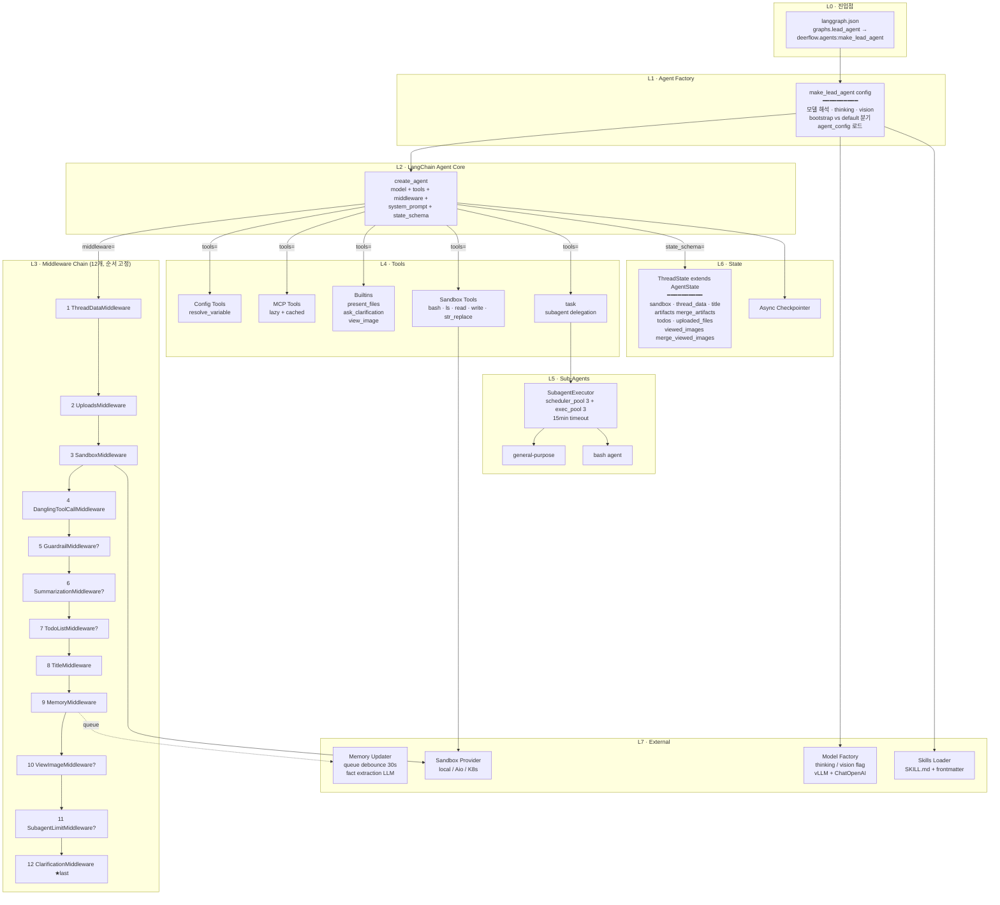
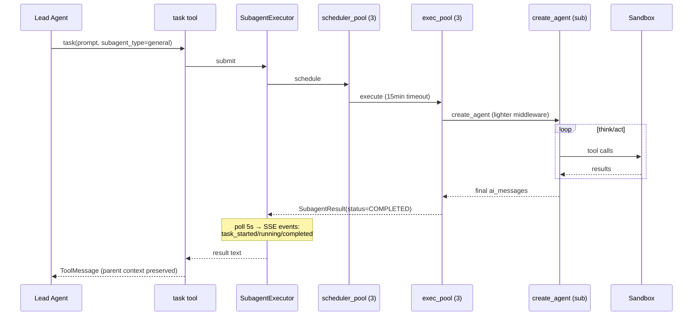
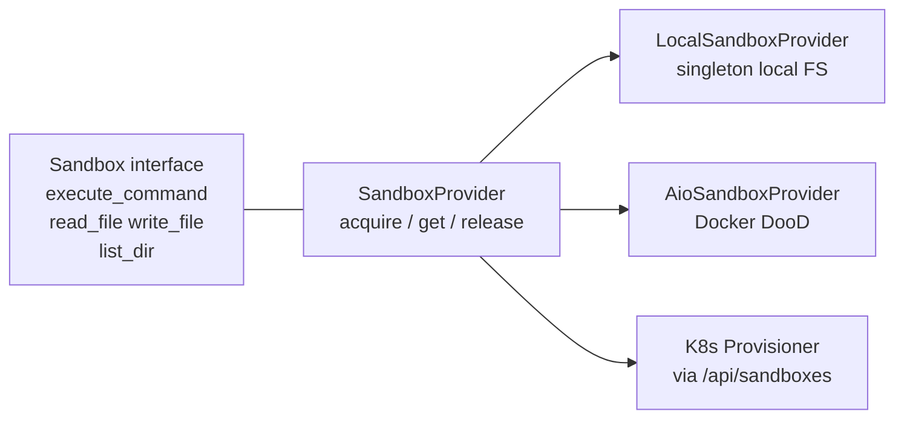
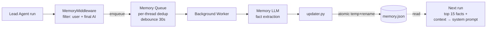
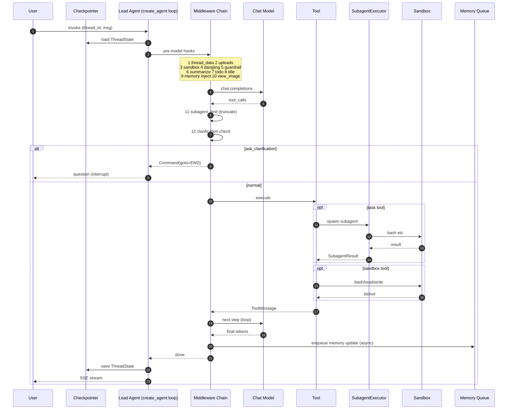

# DeerFlow 에이전트 구조 — 심층 분석

> Repo: [bytedance/deer-flow](https://github.com/bytedance/deer-flow) (DeerFlow 2.0)
> 분석 시점: 2026-04-09
> 대상: `backend/packages/harness/deerflow/` (harness 패키지)

DeerFlow 의 에이전트는 "그래프를 직접 그리는" LangGraph 코드가 아니라, **`langchain.agents.create_agent` 한 줄 위에 미들웨어·툴·서브에이전트·샌드박스·메모리·스킬을 레이어로 얹은 구조**입니다. 모든 동작 변경은 새 노드 추가가 아니라 **미들웨어 삽입**으로 이뤄집니다.



---

## 1. 진입점 — `langgraph.json`

```json
{
  "graphs": { "lead_agent": "deerflow.agents:make_lead_agent" },
  "checkpointer": { "path": ".../checkpointer/async_provider.py:make_checkpointer" }
}
```

DeerFlow 는 LangGraph 표준 진입점만 노출합니다. 그래프는 단 **1개 (`lead_agent`)** — 그래서 LangGraph Studio/SDK 와 그대로 호환되고, **모든 기능 분기는 그래프 추가가 아닌 미들웨어/툴 토글로 처리**됩니다.

## 2. Agent Factory — `make_lead_agent(config)`

`agents/lead_agent/agent.py` 의 진입 함수. 한 번 호출에서:

| 단계 | 처리 |
|---|---|
| 1 | `RunnableConfig.configurable` 에서 `model_name`, `thinking_enabled`, `reasoning_effort`, `is_plan_mode`, `subagent_enabled`, `max_concurrent_subagents`, `is_bootstrap`, `agent_name` 추출 |
| 2 | `load_agent_config(agent_name)` 로 커스텀 에이전트별 설정(model, tool_groups, skills 화이트리스트) 로드 |
| 3 | 모델 해석: 요청 → 에이전트 → 글로벌 default 순. `model_config.supports_thinking/vision` 으로 능력 가드 |
| 4 | LangSmith 트레이스 메타 주입 (`config["metadata"]`) |
| 5 | **bootstrap 분기**: 처음 사용자가 자기 에이전트를 만드는 cold-start 시 `setup_agent` 툴만 노출하는 별도 에이전트 |
| 6 | **default 분기**: `create_agent(model, tools=get_available_tools(...), middleware=_build_middlewares(...), system_prompt=apply_prompt_template(...), state_schema=ThreadState)` |

핵심 설계: **그래프 자체는 LangChain 의 표준 ReAct 루프**, 모든 DeerFlow 고유 동작은 외부 인자(미들웨어·툴·프롬프트)로 주입.

## 3. ThreadState — 에이전트 메모리 모델

```python
class ThreadState(AgentState):
    sandbox:         SandboxState | None       # sandbox_id
    thread_data:     ThreadDataState | None    # workspace/uploads/outputs path
    title:           str | None                # 자동 생성된 스레드 제목
    artifacts:       Annotated[list[str], merge_artifacts]   # 생성 산출물 (dedup)
    todos:           list | None               # plan_mode todo
    uploaded_files:  list[dict] | None         # 업로드 메타
    viewed_images:   Annotated[dict, merge_viewed_images]    # path → {base64, mime}
```

- LangChain `AgentState` (messages 등) 를 상속.
- **Custom Reducer 2개**: `artifacts` 는 dedup 머지, `viewed_images` 는 머지하되 빈 dict 가 들어오면 clear (미들웨어가 처리 후 비울 수 있음).
- LangGraph 체크포인터가 이 전체 구조를 thread 단위로 영속화 → 장기 실행 / 재개 / 휴먼-인-더-루프 가능.

## 4. Middleware Chain — "에이전트의 정책 OS"

DeerFlow 의 가장 차별적인 부분. **순서가 곧 의미**입니다 (CLAUDE.md 에 명시된 12 단계):

| # | 미들웨어 | 위치 의도 | 핵심 책임 |
|---|---|---|---|
| 1 | **ThreadDataMiddleware** | 가장 먼저 — 이후 미들웨어가 thread_id 사용 | `backend/.deer-flow/threads/{thread_id}/user-data/{workspace,uploads,outputs}` 디렉토리 생성, 경로 주입 |
| 2 | **UploadsMiddleware** | thread_data 직후 | 새로 업로드된 파일 목록을 대화에 주입 |
| 3 | **SandboxMiddleware** | thread 경로 확보 후 | 샌드박스 acquire, `sandbox_id` 를 state 에 저장 |
| 4 | **DanglingToolCallMiddleware** | 모델이 보기 전 | 인터럽트로 잘린 `AIMessage.tool_calls` 에 placeholder ToolMessage 채움 → 히스토리 정합성 복구 |
| 5 | **GuardrailMiddleware** *(opt)* | 툴 콜 직전 | `GuardrailProvider` 프로토콜로 툴 콜 인가. Allowlist / OAP / 커스텀. deny 시 에러 ToolMessage 반환 |
| 6 | **SummarizationMiddleware** *(opt)* | 본격 처리 전 | 토큰 임계 도달 시 과거 메시지 요약 → 컨텍스트 압축 |
| 7 | **TodoListMiddleware** *(opt, plan_mode)* | 요약 후 | `write_todos` 툴 + Todo 시스템 프롬프트 주입 |
| 8 | **TitleMiddleware** | 첫 교환 후 | 스레드 제목 자동 생성 (구조화 메시지 정규화) |
| 9 | **MemoryMiddleware** | TitleMiddleware 다음 | 사용자/최종 AI 메시지를 메모리 큐에 enqueue (write-async). 다음 턴에 메모리 read-inject |
| 10 | **ViewImageMiddleware** *(opt, vision)* | 모델 호출 직전 | base64 이미지 데이터를 메시지에 주입 |
| 11 | **SubagentLimitMiddleware** *(opt)* | 모델 출력 후 | `task` 툴 콜이 `MAX_CONCURRENT_SUBAGENTS=3` 초과 시 잘라냄 |
| 12 | **ClarificationMiddleware** | **항상 마지막** | `ask_clarification` 툴콜 가로채 `Command(goto=END)` 로 인터럽트 → 사용자 응답 대기 |

> 추가로 코드 본체에는 `LoopDetectionMiddleware`, `TokenUsageMiddleware`, `DeferredToolFilterMiddleware`, `ToolErrorHandlingMiddleware`, `LLMErrorHandlingMiddleware`, `SandboxAuditMiddleware` 도 존재하며, 설정 플래그(`token_usage.enabled`, `tool_search.enabled` 등)에 따라 체인에 합류합니다.

**왜 미들웨어 패턴인가**
- 그래프 노드를 추가하면 그래프 구조가 바뀌고 LangGraph SDK 호환이 깨진다. 미들웨어는 **표준 그래프를 유지하면서 정책만 바꾸는 hook layer**.
- 순서 의존성이 강해서 코드 주석에 의도가 박제됨 → 신규 미들웨어 추가 시 위치 결정이 강제로 명시화.
- on/off 가 config 한 줄 — 같은 코드베이스로 plan_mode·vision·subagent·summarization 을 조합 가능.

## 5. Tool 시스템

`get_available_tools(groups, include_mcp, model_name, subagent_enabled)` 가 4종을 합쳐 반환:

```mermaid
flowchart LR
    CONF[config.yaml<br/>tools[].use<br/>tool_groups[]] --> RES[resolve_variable]
    EXT[extensions_config.json<br/>mcpServers] --> MCP[get_cached_mcp_tools<br/>mtime invalidate]
    BLT[Builtins<br/>present_files<br/>ask_clarification<br/>view_image*]
    SUB[task tool<br/>if subagent_enabled]
    SBT[Sandbox Tools<br/>bash · ls · read · write · str_replace]

    RES & MCP & BLT & SUB & SBT --> AGG[get_available_tools]
    AGG --> CA[create_agent tools]
```

특이사항:
- **MCP tools 는 lazy + 캐시 + mtime 무효화** — `extensions_config.json` 변경이 재시작 없이 반영.
- **`view_image` 는 모델이 vision 지원할 때만** 추가. ViewImageMiddleware 와 한 쌍.
- **`ask_clarification`** 은 ClarificationMiddleware 와 한 쌍 — 툴 콜 자체가 그래프 인터럽트 신호.
- **`present_files`** 는 `/mnt/user-data/outputs` 만 사용자에게 노출 (출력물 화이트리스트).
- **`task`** 가 서브에이전트 위임의 유일한 진입점 — `description, prompt, subagent_type, max_turns` 4개 인자.
- **ACP 어댑터**: `invoke_acp_agent` 로 외부 ACP 호환 에이전트(예: codex-acp) 를 thread 별 워크스페이스에 마운트해 호출.

## 6. Sub-Agent 시스템



핵심 구조 (`subagents/executor.py`):
- **이중 풀**: `_scheduler_pool` (3 worker) + `_execution_pool` (3 worker) + `_isolated_loop_pool` (3) — 스케줄링과 실행을 분리해 스케줄러가 블록되지 않게.
- **상태 머신**: `PENDING → RUNNING → COMPLETED | FAILED | CANCELLED | TIMED_OUT`.
- **trace_id** 로 부모-자식 로그를 LangSmith 에서 묶음.
- **15분 타임아웃** + `SubagentLimitMiddleware` 의 동시성 3 제한 = 비용/시간 가드.
- **빌트인 2종**: `general-purpose` (`task` 제외 모든 툴) / `bash` (쉘 전문).
- 부모는 결과 ToolMessage 만 받으므로 **부모 컨텍스트 오염 없음** — 컨텍스트 격리가 위임의 진짜 가치.

## 7. 샌드박스 시스템

**3계층 추상화**



**가상 경로 시스템** — 에이전트는 항상 동일한 경로를 본다:

| Agent 시점 | 물리 경로 |
|---|---|
| `/mnt/user-data/workspace` | `backend/.deer-flow/threads/{thread_id}/user-data/workspace` |
| `/mnt/user-data/uploads` | 동일 thread 의 uploads/ |
| `/mnt/user-data/outputs` | 동일 thread 의 outputs/ |
| `/mnt/skills` | `deer-flow/skills/` |
| `/mnt/acp-workspace` | thread 의 acp-workspace/ (RO) |

`replace_virtual_path()` / `replace_virtual_paths_in_command()` 가 bash 명령 안의 가상 경로까지 치환. → **로컬/Docker/K8s 모드를 바꿔도 프롬프트와 모델 출력이 그대로 동작**.

`SandboxMiddleware` 가 thread 마다 sandbox 를 acquire / release 해 lifecycle 관리.

## 8. 메모리 시스템 (장기 기억)



`memory.json` 구조:
- **User Context**: `workContext`, `personalContext`, `topOfMind` (1–3 문장 요약)
- **History**: `recentMonths`, `earlierContext`, `longTermBackground`
- **Facts**: `{id, content, category(preference|knowledge|context|behavior|goal), confidence 0–1, createdAt, source}`

특징
- **read-sync / write-async 분리** → 메인 루프 latency 보호.
- **debounce 30s + per-thread dedup** → 메모리 LLM 호출 폭주 방지.
- **fact dedup**: whitespace 정규화 후 content 비교, 중복은 append skip.
- **atomic write**: temp file + rename, 캐시 무효화.
- 다음 turn 에서는 `<memory>` 태그로 상위 15 fact + context 를 system prompt 에 주입 (`max_injection_tokens=2000` 한도).

## 9. Skills 시스템

```
skills/
├── public/   (committed)
│   ├── deep-research/SKILL.md
│   ├── ppt-generation/SKILL.md
│   ├── ...
└── custom/   (gitignored, runtime install)
```

- **SKILL.md** = YAML frontmatter (`name, description, license, allowed-tools`) + 본문(에이전트가 따를 절차).
- `load_skills()` 가 `public/` + `custom/` 재귀 스캔, `extensions_config.json` 의 enabled 상태 적용.
- 활성화된 스킬은 `apply_prompt_template(available_skills=...)` 로 system prompt 의 카탈로그 섹션에 주입 → 모델이 "이 작업엔 deep-research 스킬을 따른다" 처럼 디스패치.
- **POST /api/skills/install** 로 `.skill` ZIP 을 custom/ 에 설치, agent cache invalidate.
- `agent_config.skills` 화이트리스트로 에이전트별 사용 가능 스킬 제한.
- `claude-to-deerflow` 스킬은 Claude Code SKILL.md 를 DeerFlow 형식으로 변환 → 생태계 흡수 도구.

## 10. 모델 팩토리

`models/factory.py` 의 `create_chat_model(name, thinking_enabled, reasoning_effort)`:
- `config.yaml` 의 `models[].use` (`module:Class`) 를 reflection 으로 import.
- `supports_thinking` / `supports_vision` 플래그 기반 능력 가드.
- `when_thinking_enabled` 오버라이드로 thinking 모드일 때만 다른 파라미터 적용.
- **vLLM 지원**: `VllmChatModel` 이 `langchain_openai.ChatOpenAI` 상속 + Qwen reasoning 모델용 `extra_body.chat_template_kwargs.enable_thinking` 처리. 응답·스트림·후속 tool call 모두에서 vLLM 의 비표준 `reasoning` 필드 보존.
- 환경변수 `$VAR` 자동 해석.
- 누락 provider 모듈은 actionable install hint (예: `uv add langchain-google-genai`).

## 11. 두 가지 Runtime Mode

| 모드 | 명령 | 프로세스 수 | 에이전트 위치 |
|---|---|---|---|
| **Standard** | `make dev` | 4 (LangGraph + Gateway + Frontend + Nginx) | LangGraph Server (port 2024) |
| **Gateway (실험)** | `make dev-pro` | 3 (Gateway + Frontend + Nginx) | Gateway 안에 임베드 (`runtime/run_manager.py` + `run_agent()` + `StreamBridge`) |

Gateway 모드에서는 LangGraph 서버 없이 **Gateway 가 자체 async task 로 동시성 관리**. nginx 의 `LANGGRAPH_REWRITE` 환경변수가 `/api/langgraph/*` 의 라우팅을 두 모드 사이에서 스위칭.

## 12. Harness / App 분리 (의존성 방화벽)

```
backend/packages/harness/deerflow/   ← deerflow.* (publishable framework)
backend/app/                          ← app.*    (FastAPI, channels)

규칙: app → deerflow OK,  deerflow → app FORBIDDEN
강제: tests/test_harness_boundary.py 가 CI 에서 import 검사
```

- **harness 는 자체로 publishable 한 에이전트 프레임워크** — `DeerFlowClient` 로 in-process 사용 가능 (Gateway/LangGraph 없이).
- 이 분리 덕분에 같은 코드가 (a) LangGraph Server, (b) Gateway 임베드, (c) Embedded Python Client **세 가지 호스팅 환경**에서 동일하게 동작.

## 13. 단일 턴 종합 시퀀스



---

## 14. 핵심 설계 결정 요약

| 결정 | 이유 |
|---|---|
| **단일 그래프 + 미들웨어 정책** | LangGraph SDK/Studio 호환 유지, 기능 토글이 config 한 줄 |
| **순서 고정 미들웨어 12단** | 의존성 명시화 — thread_data → sandbox → uploads → 모델 호출 → clarification 의 인과관계가 코드에 박제 |
| **read-sync / write-async 메모리** | 메인 LLM 루프 latency 보호 + 폭주 debounce |
| **Sub-agent = 컨텍스트 격리 위임** | 부모 컨텍스트 오염 없이 fan-out 가능, `MAX_CONCURRENT=3` 가드 |
| **가상 경로 시스템** | 로컬/Docker/K8s 샌드박스를 바꿔도 모델 프롬프트 불변 |
| **Skill = SKILL.md + frontmatter** | Claude Code 생태계 호환, 런타임 설치 가능 |
| **Harness/App 분리 + CI 강제** | 같은 framework 가 LangGraph 서버 / Gateway 임베드 / 임베디드 클라이언트 3가지 환경에서 동작 |
| **bootstrap vs default 분기** | 첫 에이전트 생성 cold-start 를 별도 경로로 격리 |
| **Deferred Tool Search** | 수십~수백 개 툴 스키마를 system prompt 에 안 넣고 ToolSearch 메타 툴로 lazy 로드 |
| **ClarificationMiddleware 가 항상 마지막** | LangGraph interrupt 를 활용한 깔끔한 휴먼-인-더-루프 |

---

## 15. 한 줄 요약

> DeerFlow 의 에이전트는 **"표준 LangChain `create_agent` ReAct 루프"** 위에 **(a) 12단 순서고정 미들웨어 = 정책 OS, (b) ThreadState 의 커스텀 reducer = 상태 모델, (c) `task` 툴 + 이중 스레드풀 = 컨텍스트 격리 위임, (d) 가상 경로 샌드박스 = 환경 추상화, (e) read-sync/write-async 메모리, (f) SKILL.md 스킬 카탈로그**를 얹은 구조다. 그래프 자체는 단순하고, 모든 차별점은 **"create_agent 의 인자로 무엇을 주입하느냐"** 에 응축돼 있다.
