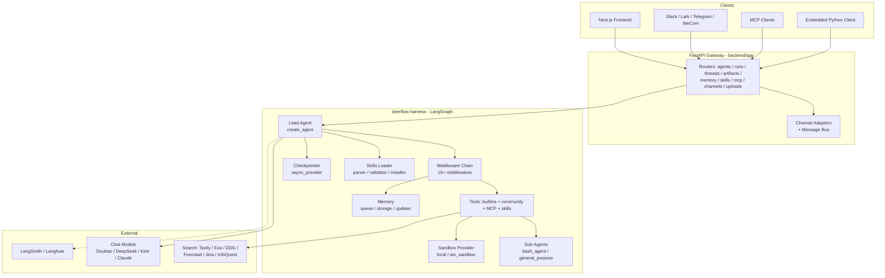
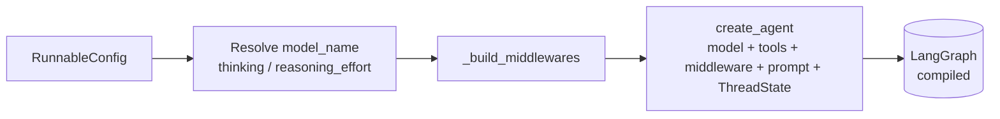
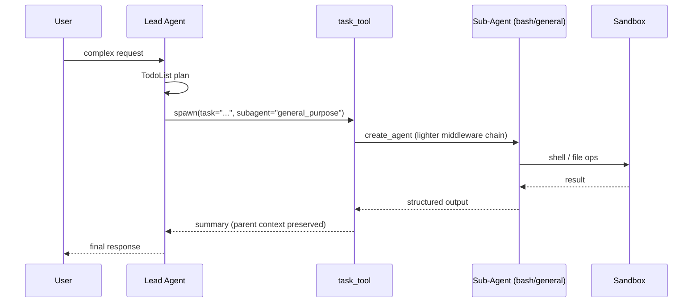
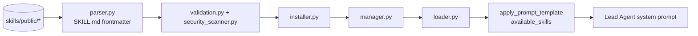
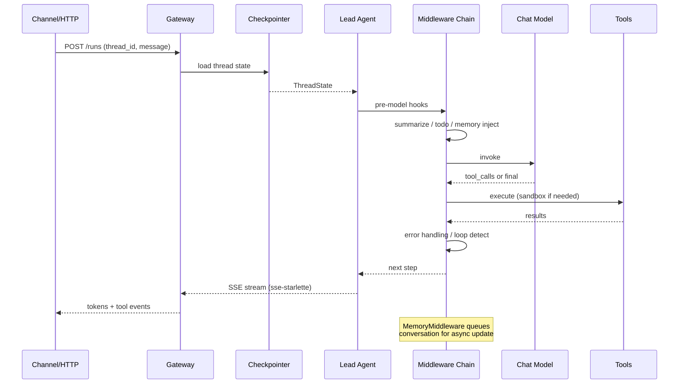

# DeerFlow 2.0 분석 보고서

> Repo: [bytedance/deer-flow](https://github.com/bytedance/deer-flow) · License: MIT · 분석 시점: 2026-04-09
> 분석 대상 커밋: `main` 브랜치 (DeerFlow 2.0, 2026년 2월 28일 출시 — GitHub Trending #1)

> ⚠️ DeerFlow 2.0은 1.x(Deep Research 프레임워크)와 **코드를 전혀 공유하지 않는 풀 리라이트**다. 1.x는 `main-1.x` 브랜치에서 별도 유지보수 중. 본 보고서는 2.0만을 대상으로 한다.

---

## 1. 프로젝트 개요

**DeerFlow** (Deep Exploration and Efficient Research Flow) 는 ByteDance가 오픈소스로 공개한 **"Super Agent Harness"** 다. 1.x 시절에는 LangGraph 기반의 Deep Research 워크플로우(Planner → Researcher → Reporter) 로 알려졌으나, 2.0에서는 **단일 Lead Agent + 서브에이전트 + 샌드박스 + 스킬 + 장기 메모리** 를 오케스트레이션하는 범용 에이전트 하네스로 그 정체성을 전환했다.

**해결하려는 문제**
- 단일 LLM 호출로는 풀 수 없는 장기·복합 작업(연구, 코드 작성, 자료 제작 등)을 자동화하기 위한 **재사용 가능한 하네스 인프라**가 필요하다.
- Anthropic Claude Code, OpenAI Codex 같은 폐쇄형 코딩 에이전트와 동등한 수준의 **툴 루프 + 컨텍스트 엔지니어링 + 샌드박스 + 메모리** 를 오픈소스로 제공.
- LangGraph 위에서 직접 미들웨어 체인을 조립함으로써 "에이전트 동작 방식"을 코드 단에서 제어 가능하게 한다.

**탄생 배경**
- 1.x는 Deep Research 단일 유스케이스에 묶여 있었음. ByteDance Volcengine의 코딩 플랜·InfoQuest 등 사내 도구와의 결합을 위해 범용 하네스로 재설계된 것이 2.0.
- Claude Code 의 Skill / Sub-Agent / Sandbox 모델을 명시적으로 차용 (`skills/public/claude-to-deerflow` 라는 변환 스킬까지 존재).

---

## 2. 핵심 특징 및 차별점

| 특징 | 설명 |
|---|---|
| **LangGraph 기반 단일 그래프** | `langgraph.json` 의 `lead_agent` 그래프 하나로 모든 작업을 처리. 멀티 그래프가 아니라 **미들웨어 체인** 으로 동작을 조합. |
| **Skills 시스템** | `skills/public/*` 에 마크다운 + 템플릿으로 정의된 20+ 빌트인 스킬 (deep-research, ppt-generation, podcast-generation, vercel-deploy 등). 런타임에 동적 로드/검증/설치. |
| **Sub-Agent 위임** | Lead 가 `Task` 툴로 서브에이전트(`bash_agent`, `general_purpose`)에 작업 위임. `SubagentLimitMiddleware` 가 동시 실행 수 제한. |
| **Sandbox 실행** | `sandbox/local` (로컬) + `community/aio_sandbox` 로 격리 환경에서 코드/쉘 실행. `SandboxAuditMiddleware` + `security.py` 로 감사·차단. |
| **Long-Term Memory** | `agents/memory` 의 queue/storage/updater 로 대화 종료 후 비동기 업데이트. `MemoryMiddleware` 가 매 턴 컨텍스트에 주입. |
| **Context Engineering Middlewares** | Summarization, LoopDetection, DanglingToolCall, ToolErrorHandling, Clarification, ViewImage, TodoList, Title 등 15+ 개 미들웨어로 컨텍스트 위생 관리. |
| **Deferred Tool Search** | 모든 툴 스키마를 모델에 바인딩하지 않고 `ToolSearch` 로 지연 로딩 — 컨텍스트 절약. (`DeferredToolFilterMiddleware`) |
| **Multi-Channel Gateway** | FastAPI 게이트웨이 + Slack, Feishu(Lark), Telegram, WeCom 채널 어댑터 내장. |
| **Claude Code 호환** | `claude-to-deerflow` 스킬로 Claude Code 의 SKILL.md 에코시스템을 그대로 흡수. |
| **LangSmith / Langfuse** | 양쪽 트레이싱 동시 지원. |

---

## 3. 아키텍처 분석

### 3.1 전체 구조



### 3.2 Lead Agent 조립 (`agents/lead_agent/agent.py`)

LangGraph 의 `langchain.agents.create_agent` 를 호출해 단일 ReAct 스타일 에이전트를 만들고, **모든 동작 변경은 미들웨어 주입**으로 처리한다.



### 3.3 미들웨어 체인 — 핵심 설계 결정

`agents/middlewares/` 의 미들웨어들은 **순서가 곧 정책**이다. 코드 주석에서 명시한 우선순위:

```
ThreadDataMiddleware → SandboxMiddleware (thread_id 확보 후 샌드박스 마운트)
   → UploadsMiddleware → DanglingToolCallMiddleware (히스토리 정합성 패치)
   → SummarizationMiddleware (컨텍스트 압축을 가장 앞단)
   → TodoMiddleware (Plan 모드일 때)
   → TokenUsageMiddleware → TitleMiddleware → MemoryMiddleware
   → ViewImageMiddleware (모델이 vision 지원 시)
   → DeferredToolFilterMiddleware (tool_search 활성 시)
   → SubagentLimitMiddleware (동시 서브에이전트 수 제한)
   → LoopDetectionMiddleware (반복 툴콜 차단)
   → (custom)
   → ClarificationMiddleware  ← 항상 마지막
```

설계 의도:
- **SummarizationMiddleware 를 가장 앞단**에 둬서 다른 미들웨어가 다루는 토큰량 자체를 줄임.
- **ClarificationMiddleware 는 항상 마지막** — 모델 호출 결과를 가로채 사용자에게 추가 질문이 필요한지 결정.
- **DanglingToolCallMiddleware** 는 LangGraph 체크포인트 복원 시 잘린 ToolMessage 를 패치 — 장기 실행 안정성의 핵심.
- **LoopDetectionMiddleware** + **SubagentLimitMiddleware** 가 토큰/비용 폭주 가드.

### 3.4 Sub-Agent / Task 위임



`tools/builtins/task_tool.py` 가 위임의 진입점. `subagents/builtins/{bash_agent,general_purpose}.py` 가 미리 정의된 서브에이전트 템플릿. `SubagentLimitMiddleware` 가 동시 호출 수를 자르는 식으로 fan-out 폭주를 막는다.

### 3.5 Skills 시스템



- 스킬은 **마크다운 + 템플릿/레퍼런스 디렉토리** 로 구성 (Claude Code 의 SKILL.md 와 동일 컨벤션).
- `security_scanner.py` 가 설치 전에 위험 패턴을 스캔.
- 에이전트별 `agent_config.skills` 화이트리스트로 사용 가능한 스킬을 제한.

### 3.6 데이터 흐름 (단일 턴)



---

## 4. 기술 스택

| 영역 | 기술 |
|---|---|
| **언어 (백엔드)** | Python 3.12+ |
| **에이전트 런타임** | LangGraph + LangChain `create_agent`, langgraph-sdk |
| **웹 서버** | FastAPI, uvicorn[standard], sse-starlette, python-multipart |
| **패키지 관리** | uv (workspace: `backend/`, `backend/packages/harness`) |
| **프론트엔드** | Next.js, TypeScript, Tailwind, pnpm |
| **채널 SDK** | slack-sdk, lark-oapi, python-telegram-bot, wecom-aibot-python-sdk, markdown-to-mrkdwn |
| **검색/크롤링** | Tavily, Exa, DuckDuckGo, Firecrawl, Jina AI, InfoQuest, image_search |
| **LLM (권장)** | Doubao-Seed-2.0-Code, DeepSeek v3.2, Kimi 2.5 (Claude/OpenAI 도 가능) |
| **샌드박스** | local subprocess + community/aio_sandbox |
| **트레이싱** | LangSmith, Langfuse 동시 지원 |
| **컨테이너** | Docker / docker-compose (`docker/`) |
| **린트** | ruff |

---

## 5. 핵심 코드 분석

### 5.1 디렉토리 구조

```
deer-flow/
├── backend/
│   ├── app/                          # FastAPI 게이트웨이
│   │   ├── gateway/
│   │   │   ├── app.py / config.py / deps.py / services.py
│   │   │   └── routers/              # agents, runs, threads, artifacts,
│   │   │                             # memory, skills, mcp, channels, uploads ...
│   │   └── channels/                 # slack/feishu/telegram/wecom + bus + manager
│   ├── packages/harness/deerflow/    # ★ 에이전트 하네스 본체
│   │   ├── agents/
│   │   │   ├── lead_agent/           # 메인 에이전트 조립
│   │   │   ├── middlewares/          # 15+ 미들웨어
│   │   │   ├── memory/               # 장기 메모리 (queue/storage/updater)
│   │   │   └── checkpointer/         # 비동기 체크포인터
│   │   ├── subagents/builtins/       # bash_agent, general_purpose
│   │   ├── tools/
│   │   │   └── builtins/             # task, tool_search, clarification,
│   │   │                             # present_file, view_image, setup_agent,
│   │   │                             # invoke_acp_agent ...
│   │   ├── skills/                   # SKILL.md 파서/로더/매니저/스캐너
│   │   ├── sandbox/                  # 격리 실행 + 감사
│   │   ├── community/                # 외부 통합 (검색/크롤러/샌드박스)
│   │   ├── runtime/                  # runs / store / stream_bridge
│   │   ├── reflection/               # self-reflection
│   │   ├── guardrails/, mcp/, models/, tracing/, uploads/, utils/
│   │   └── config/                   # app/agent/summarization config
│   ├── langgraph.json                # LangGraph 진입점 정의
│   └── pyproject.toml                # uv workspace
├── frontend/                         # Next.js UI
├── skills/public/                    # 빌트인 스킬 카탈로그
│   ├── deep-research/
│   ├── ppt-generation/
│   ├── podcast-generation/
│   ├── chart-visualization/
│   ├── academic-paper-review/
│   ├── code-documentation/
│   ├── consulting-analysis/
│   ├── data-analysis/
│   ├── frontend-design/
│   ├── github-deep-research/
│   ├── image-generation/
│   ├── video-generation/
│   ├── newsletter-generation/
│   ├── vercel-deploy-claimable/
│   ├── claude-to-deerflow/           # Claude Code SKILL → DeerFlow 변환
│   ├── skill-creator/
│   ├── bootstrap/
│   └── ...
├── docker/                           # 배포 컨테이너 정의
└── docs/                             # plans, PR evidence, change summary
```

### 5.2 주목할 코드 패턴

**(a) "에이전트는 코드, 동작은 미들웨어"**
`make_lead_agent` 는 `create_agent(model, tools, middleware=..., system_prompt=...)` 한 줄에 모든 정책을 주입한다. 그래프 구조 자체가 아니라 미들웨어 체인을 바꾸면 동작이 바뀐다 → **확장 표면이 잘 정의됨**.

**(b) Bootstrap vs Default 분기**
`is_bootstrap` 일 때는 `setup_agent` 툴 + `bootstrap` 스킬만 노출하는 별도 경로 → 사용자가 처음 자기 에이전트를 만들 때의 cold-start 를 깔끔히 분리.

**(c) 모델별 capability 가드**
`model_config.supports_thinking`, `supports_vision` 으로 기능을 켜고 끔. 잘못된 조합이면 경고 후 자동 폴백 — 멀티 LLM 환경에서의 안정성 확보.

**(d) Deferred Tool Search**
모든 툴 스키마를 system prompt 에 넣지 않고, `ToolSearch` 라는 메타 툴로 필요할 때 로드. `DeferredToolFilterMiddleware` 가 모델 바인딩 시점에 스키마를 필터링. — 수십~수백 개 툴을 다루는 하네스의 필수 패턴.

**(e) Memory 비동기 분리**
`MemoryMiddleware` 는 매 턴 메모리를 **읽어 주입**만 하고, **쓰기는 큐에 적재** (`memory/queue.py`). 별도 워커가 `updater.py` 로 후처리 — 메인 루프 latency 보호.

**(f) ClarificationMiddleware 가 항상 마지막**
모델 출력을 가로채 "사용자 확인이 필요한가?" 를 판단. 사용자에게 질문을 던질 때 그래프 전체를 일시정지 (deferred). LangGraph 의 interrupt 메커니즘을 활용한 휴먼-인-더-루프.

---

## 6. API 및 인터페이스

### 6.1 HTTP API (`backend/app/gateway/routers`)

| Router | 역할 |
|---|---|
| `agents.py` | 커스텀 에이전트 CRUD |
| `runs.py`, `thread_runs.py` | 실행 트리거, SSE 스트리밍 |
| `threads.py` | 대화 스레드 관리 |
| `artifacts.py` | 생성된 파일/산출물 |
| `memory.py` | 장기 메모리 조회/편집 |
| `skills.py` | 스킬 설치/검증/조회 |
| `mcp.py` | MCP 서버 관리 |
| `channels.py` | IM 채널 등록/관리 |
| `models.py` | 모델 카탈로그 |
| `uploads.py` | 파일 업로드 |
| `suggestions.py` | UX 제안 |
| `assistants_compat.py` | OpenAI Assistants API 호환 (추정) |

### 6.2 LangGraph 진입점

`langgraph.json` 의 `graphs.lead_agent = "deerflow.agents:make_lead_agent"`. → `langgraph dev`, `langgraph-sdk` 클라이언트가 표준 방식으로 호출 가능. **DeerFlow 자체가 LangGraph 앱이라 LangGraph Studio/SDK 와 그대로 호환**된다.

### 6.3 채널 인터페이스 (`backend/app/channels`)

- `base.py` 의 추상 인터페이스 + `manager.py` 의 라우팅 + `message_bus.py` 의 pub/sub.
- 슬랙·라크·텔레그램·위컴 4종이 동일 추상 위에 구현.
- `commands.py` 가 채널 슬래시 명령 파싱.

### 6.4 MCP

`harness/deerflow/mcp/` + `gateway/routers/mcp.py` — 외부 MCP 서버를 툴 소스로 등록. 에이전트가 MCP 클라이언트인 동시에, 게이트웨이를 통해 MCP 서버 노출도 가능 (README 의 "MCP Server" 섹션).

### 6.5 Embedded Python Client

README 에 명시된 임베디드 클라이언트 — 다른 파이썬 앱이 게이트웨이를 거치지 않고 직접 하네스를 import 해서 사용.

---

## 7. 확장성 및 플러그인

| 확장 포인트 | 추가 방법 |
|---|---|
| **새 툴** | `tools/builtins/` 또는 `community/<provider>/` 추가 후 `get_available_tools` 등록 |
| **새 미들웨어** | `AgentMiddleware` 상속 → `_build_middlewares` 에 삽입 또는 `custom_middlewares` 인자 |
| **새 서브에이전트** | `subagents/builtins/` 에 정의, `task_tool` 의 subagent 카탈로그 등록 |
| **새 스킬** | `skills/public/<name>/SKILL.md` (frontmatter+본문). `skill-creator` 스킬이 보일러플레이트 생성 |
| **새 채널** | `app/channels/base.py` 구현 후 `manager.py` 등록 |
| **새 LLM 프로바이더** | `models/` + `config.yaml` 의 모델 엔트리 |
| **새 샌드박스** | `sandbox/sandbox_provider.py` 인터페이스 구현 (local / aio_sandbox 가 reference) |
| **새 검색 백엔드** | `community/<engine>/` 에 추가 (Tavily/Exa/DDG 등이 reference) |
| **MCP 서버** | 설정에서 등록만 하면 자동으로 툴 노출 |
| **agent_config.yaml** | 모델, 사용 가능한 툴 그룹, 사용 가능한 스킬을 에이전트별로 화이트리스트 |

---

## 8. 성능 / 운영 특성

### 8.1 컨텍스트·비용 관리 메커니즘

| 메커니즘 | 위치 | 효과 |
|---|---|---|
| Summarization 미들웨어 | trigger 토큰 도달 시 자동 요약 + 최근 N 보존 | 장기 대화 토큰 폭주 방지 |
| Deferred Tool Search | 미사용 툴 스키마 미바인딩 | system prompt 토큰 절감 |
| LoopDetectionMiddleware | 반복 툴콜 자동 차단 | 무한 루프·청구서 사고 방지 |
| SubagentLimitMiddleware | `max_concurrent_subagents` | fan-out 폭주 차단 |
| TokenUsageMiddleware | 토큰 카운트 누적 | 모니터링·과금 |
| MemoryMiddleware (async write) | 메모리 쓰기 큐 분리 | 메인 루프 latency 보호 |
| Checkpointer | LangGraph 체크포인트 | 장시간 실행 중단·재개 |

### 8.2 알려진 제약

- **Python 3.12+ 강제**, uv workspace 라 일반 `pip install` 로는 부드럽게 안 됨.
- **Default checkpointer 가 비동기 file/db** — 단일 노드 가정. 멀티 워커 분산 시 별도 백엔드 필요.
- README 의 "Improper Deployment May Introduce Security Risks" 경고 — **샌드박스 없이 노출 시 RCE 위험**.
- 권장 모델이 ByteDance 자사 Doubao + 중국 모델 위주 — 글로벌 사용자는 Claude/OpenAI 직접 설정 필요.

### 8.3 배포 사이징

README 가 "Deployment Sizing" 섹션을 별도로 둠 → 사용자 수/동시 세션 수에 따른 리소스 가이드. Docker 권장.

---

## 9. 배포 및 운영

- **Option 1: Docker** (권장) — `docker/` 디렉토리, `docker-compose` 로 백/프론트/(옵션) 샌드박스 컨테이너 구동.
- **Option 2: Local Dev** — `Makefile` + `uv sync` + `pnpm install`.
- **설정 파일**: `backend/config.example.yaml` (모델, 검색 API 키, 트레이싱), `extensions_config.example.json` (확장).
- **트레이싱**: LangSmith / Langfuse 환경변수만 세팅하면 자동 후킹. 양쪽 동시 활성도 가능.
- **One-Line Setup**: README 가 코딩 에이전트(Claude Code/Cursor 등)에게 던지는 자연어 부트스트랩 명령을 제공 — Install.md 를 fetch 시켜 자동 설치.

---

## 10. 경쟁·비교 분석

| 항목 | DeerFlow 2.0 | LangGraph (raw) | OpenAI Swarm/Agents SDK | Anthropic Claude Code | CrewAI | AutoGen | Manus / OWL |
|---|---|---|---|---|---|---|---|
| 포지션 | Super Agent Harness (오픈소스) | 그래프 런타임 | 멀티에이전트 SDK | 폐쇄형 코딩 에이전트 | 멀티에이전트 협업 | 멀티에이전트 채팅 | 범용 에이전트 |
| 그래프 모델 | 단일 LeadAgent + 미들웨어 | 사용자 정의 DAG | 핸드오프 | 단일 루프 + 서브에이전트 | Crew + Task | 다대다 채팅 | 자체 |
| 컨텍스트 엔지니어링 | ★★★★★ (15+ 미들웨어 내장) | 사용자가 직접 | ★★ | ★★★★★ | ★★ | ★★ | ★★★ |
| 스킬 시스템 | ★★★★ (Claude Code 호환) | ✗ | ✗ | ★★★★★ (원조) | ✗ | ✗ | △ |
| 샌드박스 | ★★★★ (local + aio) | ✗ | ✗ | ★★★★ | ✗ | ✗ | ★★★ |
| 장기 메모리 | ★★★★ (비동기) | △ | △ | ★★★ | ★★ | △ | ★★★ |
| 채널/게이트웨이 | ★★★★ (Slack/Lark/TG/WeCom + FastAPI) | ✗ | ✗ | ✗ (CLI) | ✗ | ✗ | △ |
| 트레이싱 | LangSmith + Langfuse | LangSmith | OpenAI | 자체 | ✗ | ✗ | △ |
| MCP | ✓ (client + server) | △ | ✓ | ✓ | △ | △ | △ |
| 언어 | Python | Python | Python/JS | TS | Python | Python | Python |
| 라이선스 | MIT | MIT | MIT/Apache | 폐쇄 | MIT | MIT | 다양 |

**핵심 차별점**: DeerFlow 2.0 은 *"LangGraph 위에 Claude Code 의 UX(스킬·서브에이전트·샌드박스)를 얹고, 거기에 IM 채널 게이트웨이까지 묶은 실전 배포용 하네스"* 라는 포지션이며, raw LangGraph 보다는 추상화 수준이 높고 CrewAI/AutoGen 보다는 컨텍스트·운영 도구가 두텁다.

---

## 11. 종합 평가

### 강점
1. **컨텍스트 엔지니어링이 1급 시민** — 15+ 미들웨어가 토큰·루프·에러·메모리·이미지·툴 스키마를 모두 다룬다. 다른 OSS 하네스에서는 보기 드문 깊이.
2. **Claude Code 호환 스킬 시스템** — 폐쇄형 생태계의 자산을 흡수할 수 있는 변환 스킬까지 갖춤. 사실상 Claude Code 의 오픈소스 대안 중 가장 유사한 모델.
3. **운영성** — FastAPI 게이트웨이, IM 채널 4종, LangSmith/Langfuse, 체크포인터, 토큰 모니터링이 박스에 기본 포함.
4. **확장 표면이 잘 정렬됨** — 툴/미들웨어/서브에이전트/스킬/샌드박스/채널 모두 명확한 인터페이스로 분리.
5. **LangGraph 표준** — `langgraph.json` 만 있어서 LangGraph Studio/SDK 와 그대로 호환.

### 약점·리스크
1. **2.0 = 풀 리라이트, 1.x 와 단절** — Deep Research 프레임워크로서의 1.x 사용자 자산이 그대로 안 옮겨감. (변환 스킬은 있으나 1:1 호환 아님)
2. **ByteDance 색채** — 권장 모델, InfoQuest, Volcengine 등 자사 도구 종속이 강함. 중립적인 OSS 라기보다는 ByteDance 생태계 진입점 성격이 짙다.
3. **샌드박스 없는 노출 = RCE** — README 가 직접 경고. 운영 시 격리·인증 설계 필수.
4. **Python 3.12 + uv workspace** — 입문 난이도 상승. 도입 시 빌드/배포 파이프라인 정비 필요.
5. **단일 LeadAgent 모델** — 진정한 멀티에이전트 협업(Crew 식)이 필요하면 직접 구성해야 함. Sub-agent 는 위임이지 동등 협업이 아님.
6. **빠른 변화** — 2.0 출시 후 약 5주, 인터페이스 안정화 전. 프로덕션 도입 시 버전 고정 필수.

### 적합 사례
- 사내 슬랙/라크에 "범용 비서/리서처/PPT 생성기" 를 빠르게 띄우고 싶을 때.
- Claude Code 같은 코딩 에이전트를 **자체 호스팅** 해야 하는 보안/규제 환경.
- LangGraph 를 쓰고 싶은데 컨텍스트 엔지니어링 보일러플레이트를 직접 작성하기 싫을 때.
- 여러 LLM 프로바이더(중국/미국) 를 동시에 운영해야 할 때.

### 부적합 사례
- 단순 RAG 챗봇 — 오버킬.
- 1.x Deep Research 그대로 쓰던 사용자 — 1.x 브랜치를 유지하는 편이 낫다.
- 다수 에이전트의 동등 협업이 본질인 멀티에이전트 시뮬레이션 — CrewAI/AutoGen 이 더 적합.

### 엔지니어 관점 인사이트
- **"미들웨어가 곧 정책" 패턴** 은 OSS 에이전트 하네스의 미래 표준이 될 가능성이 높다. 이 코드베이스는 그 좋은 reference 다 — 특히 `_build_middlewares` 의 주석에 명시된 순서 의존성은 그대로 학습 가치가 있다.
- **Deferred Tool Search + DeferredToolFilterMiddleware** 는 툴 카탈로그가 큰 시스템에 거의 모든 곳에 적용 가능한 범용 패턴.
- **SKILL.md 를 마크다운 + frontmatter 로 패키징하는 컨벤션** 이 Claude Code 발 표준으로 굳어지는 흐름이 명확하다 (DeerFlow, 다른 오픈소스도 동일 방식 채택). 새 에이전트 만들 때 이 컨벤션을 따르는 것이 안전.
- **MemoryMiddleware 의 read-sync / write-async 분리** 는 메모리 시스템 설계 시 일반화 가능한 좋은 패턴.
- **ClarificationMiddleware 마지막 배치** = 휴먼-인-더-루프 를 미들웨어로 풀어낸 깔끔한 예. LangGraph interrupt 활용 reference 로 좋다.

---

## 부록 A. 빌트인 스킬 카탈로그 (`skills/public/`)

| 카테고리 | 스킬 |
|---|---|
| 리서치 | `deep-research`, `github-deep-research`, `academic-paper-review`, `consulting-analysis`, `data-analysis` |
| 콘텐츠 생성 | `ppt-generation`, `podcast-generation`, `newsletter-generation`, `video-generation`, `image-generation` |
| 시각화 | `chart-visualization`, `frontend-design`, `web-design-guidelines` |
| 코드/문서 | `code-documentation` |
| 배포 | `vercel-deploy-claimable` |
| 메타 | `bootstrap`, `find-skills`, `skill-creator`, `claude-to-deerflow`, `surprise-me` |

## 부록 B. 미들웨어 인덱스 (`agents/middlewares/`)

| 미들웨어 | 역할 |
|---|---|
| `clarification_middleware` | 사용자 확인 필요 여부 판정 (항상 마지막) |
| `dangling_tool_call_middleware` | 잘린 ToolMessage 패치 |
| `deferred_tool_filter_middleware` | 모델 바인딩에서 deferred 툴 스키마 제거 |
| `llm_error_handling_middleware` | LLM 에러 → 정상 흐름 복구 |
| `loop_detection_middleware` | 반복 툴콜 차단 |
| `memory_middleware` | 메모리 read/queue write |
| `sandbox_audit_middleware` | 샌드박스 호출 감사 |
| `subagent_limit_middleware` | 동시 서브에이전트 제한 |
| `thread_data_middleware` | thread_id/context 주입 (가장 앞) |
| `title_middleware` | 첫 교환 후 스레드 제목 자동 생성 |
| `todo_middleware` | Plan 모드 todo 리스트 |
| `token_usage_middleware` | 토큰 사용량 집계 |
| `tool_error_handling_middleware` | 툴 예외 → ToolMessage 변환 |
| `uploads_middleware` | 업로드 파일 컨텍스트 주입 |
| `view_image_middleware` | vision 모델용 이미지 인젝션 |

---

*분석 기반: README.md, langgraph.json, pyproject.toml, `backend/packages/harness/deerflow/agents/lead_agent/agent.py`, 미들웨어/서브에이전트/툴/스킬 디렉토리 구조 및 주요 모듈 인터페이스.*
