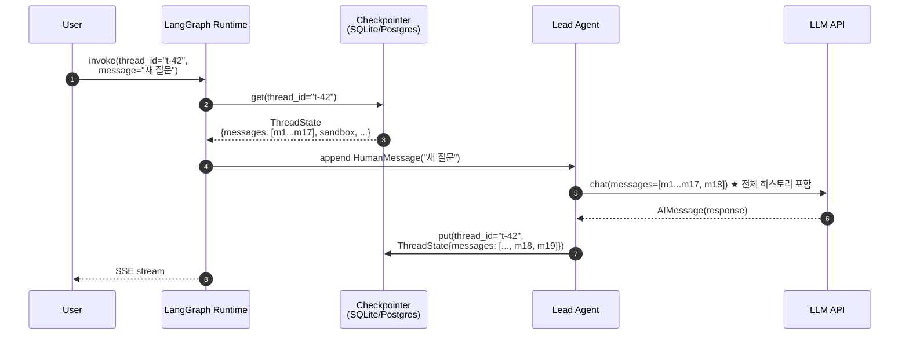
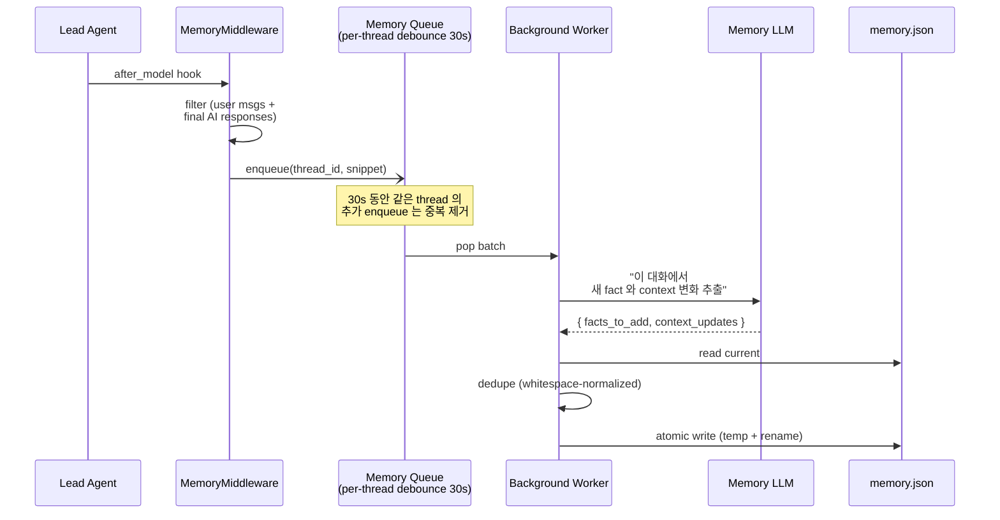
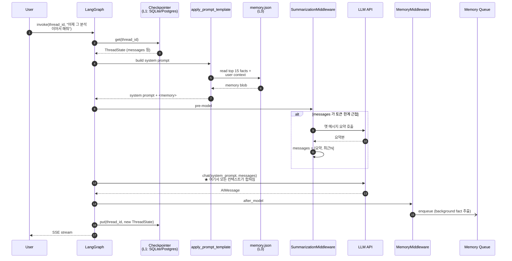

# DeerFlow 의 대화 내역 저장과 활용

> Repo: [bytedance/deer-flow](https://github.com/bytedance/deer-flow) (DeerFlow 2.0)
> 분석 시점: 2026-04-09
> 질문: "LLM API 는 stateless 한데 DeerFlow 는 멀티턴 대화를 어떻게 구현했는가?"

LLM 이 stateless 라는 문제는 사실 **DeerFlow 가 직접 푸는 게 아니라 LangGraph 의 Checkpointer 추상화에 위임**합니다. 그 위에 DeerFlow 는 **메모리 시스템(장기 기억) + 컨텍스트 압축 미들웨어** 를 얹어서 "토큰 한계 안에서 멀티턴 + 장기 인격" 을 구현합니다. 3개 레이어로 분리해서 보면 명확합니다.

---

## 1. 세 가지 "기억" 의 분리

DeerFlow 는 "대화 기억" 을 한 덩어리로 다루지 않고 **목적이 다른 3개 저장소** 로 나눕니다. 이 분리가 핵심입니다.

| 레이어 | 저장 대상 | 저장 위치 | 수명 | 용도 |
|---|---|---|---|---|
| **L1. Checkpointer** | `ThreadState` 전체 (messages, sandbox, artifacts, todos, …) | `InMemorySaver` / SQLite / Postgres (config) | thread 단위 영속 | 멀티턴 대화 복원, 재개, 휴먼-인-더-루프 |
| **L2. Per-thread FS** | 업로드 파일·산출물·acp-workspace | `backend/.deer-flow/threads/{thread_id}/user-data/` | thread 단위 영속 | 코드/파일 컨텍스트 |
| **L3. Memory (장기)** | 사용자 컨텍스트·facts | `backend/.deer-flow/memory.json` | **thread 를 넘어서** 영속 | "이 사용자가 누구인지" 장기 인격 |

> 일반 챗봇은 L1 만 가집니다. DeerFlow 는 L1+L2+L3 을 모두 가지고, **각 레이어를 다른 미들웨어가 담당**합니다.

---

## 2. L1 — Checkpointer: "이 thread 의 모든 상태"

### 어디에 저장되나
`langgraph.json` 에 등록된 팩토리:
```json
"checkpointer": {
  "path": ".../checkpointer/async_provider.py:make_checkpointer"
}
```

`async_provider.py` 의 실제 코드를 보면 **백엔드는 config 로 갈아끼움**:
```python
async def make_checkpointer():
    config = get_app_config()
    if config.checkpointer is None:
        yield InMemorySaver()                          # 기본값 (휘발성)
    elif config.type == "sqlite":
        async with AsyncSqliteSaver.from_conn_string(...) as saver:
            await saver.setup(); yield saver           # 파일 영속
    elif config.type == "postgres":
        async with AsyncPostgresSaver.from_conn_string(...) as saver:
            await saver.setup(); yield saver           # 운영용
```

→ **DeerFlow 는 직접 저장 코드를 짜지 않고**, LangGraph 가 제공하는 표준 saver 3종(`InMemorySaver`, `AsyncSqliteSaver`, `AsyncPostgresSaver`) 을 lifespan 컨텍스트로 감싸서 LangGraph 그래프에 주입합니다.

### 무엇이 저장되나
`ThreadState` 전체 — 즉:
- `messages: list[BaseMessage]` ← **이게 진짜 "대화 내역"**
- `sandbox.sandbox_id`, `thread_data.workspace_path` 등
- `title`, `artifacts`, `todos`, `uploaded_files`, `viewed_images`

저장 키는 **`thread_id`**. 한 thread 의 모든 step (모델 호출, 툴 호출, 미들웨어 hook) 마다 LangGraph 가 자동으로 ThreadState 의 새 스냅샷을 checkpoint 로 떨어뜨립니다.

### 어떻게 가져다 쓰나 — 매 턴마다



핵심: **클라이언트는 `thread_id` 만 보낸다.** 메시지 자체를 다시 보낼 필요가 없다. LangGraph 가 checkpointer 에서 ThreadState 를 통째로 꺼내서 LLM 에 보낼 messages 배열을 복원한다.

이게 **stateless LLM 위에 stateful 대화** 를 만드는 메커니즘의 전부입니다. "어디에 저장하느냐" 의 답은 **checkpointer 백엔드(SQLite/Postgres)의 `messages` 컬럼**, "어떻게 가져다 쓰느냐" 의 답은 **`thread_id` 로 매 턴 자동 로드 → LLM 호출 인자에 통째로 전달**.

---

## 3. 그런데 그대로 계속 쌓으면 토큰이 폭발한다 — 미들웨어들의 역할

대화가 길어지면 messages 배열이 LLM 컨텍스트 한계를 넘습니다. DeerFlow 는 미들웨어 4개로 이걸 다룹니다.

### 3.1 SummarizationMiddleware — "오래된 메시지를 요약본으로 교체"
```python
SummarizationMiddleware(
    model=create_chat_model(...),       # 보통 더 싸고 빠른 모델
    trigger=토큰/메시지/비율 임계,
    keep=("최근 N개", ...),
)
```
- **trigger 도달 시**: 옛 메시지들을 요약 모델에 보내 단일 요약 메시지로 압축, 최근 N 개만 원본 유지.
- 압축 결과는 ThreadState.messages 자체를 갱신 → checkpointer 에도 압축본이 저장됨.
- 효과: **stateful 대화를 유지하면서도 LLM 호출 토큰은 한정**.

### 3.2 DanglingToolCallMiddleware — "복원 시 깨진 히스토리 패치"
사용자가 LLM 응답 중에 끊어버리면, checkpointer 에는 `tool_calls` 만 있고 그에 대응하는 `ToolMessage` 가 없는 상태가 저장됩니다. 다음 턴에 그대로 LLM 에 보내면 일부 프로바이더가 400 을 뱉습니다.
→ 이 미들웨어가 **빠진 ToolMessage 자리에 placeholder 를 끼워넣어** 히스토리를 정합 상태로 복원합니다.

### 3.3 UploadsMiddleware / ViewImageMiddleware — "재주입"
이미지·업로드 파일은 매번 base64 로 메시지에 직접 박지 않고, **메타만 ThreadState 에 저장하다가 모델 호출 직전에 주입** 합니다. checkpointer 가 base64 덩어리를 들고 다니지 않게 하려는 절약.

### 3.4 MemoryMiddleware — L1 와 L3 의 다리 (다음 섹션)

---

## 4. L3 — 장기 메모리: thread 를 초월한 사용자 모델

Checkpointer 만으로는 "어제 다른 thread 에서 한 얘기" 를 기억할 수 없습니다. DeerFlow 는 별도 시스템으로 이걸 풉니다.

### 저장 위치
`backend/.deer-flow/memory.json` (atomic write, temp + rename)

### 데이터 구조
```json
{
  "userContext": { "workContext": "...", "personalContext": "...", "topOfMind": "..." },
  "history":     { "recentMonths": "...", "earlierContext": "...", "longTermBackground": "..." },
  "facts": [
    { "id": "f-1", "content": "사용자는 Python 3.12 를 선호한다",
      "category": "preference", "confidence": 0.9,
      "createdAt": "...", "source": "thread:t-42" }
  ]
}
```

### 어떻게 채워지나 — Write (비동기)



핵심:
- **read-sync / write-async**: 메인 LLM 루프는 큐에 넣고 즉시 리턴. 실제 LLM 기반 fact 추출은 백그라운드 워커가 30초 debounce 후 처리. → 메인 응답 latency 0 영향.
- **전용 메모리 LLM**: `memory.model_name` 으로 저렴한 모델 지정 가능.
- **dedup + cap**: `max_facts=100`, `confidence_threshold=0.7`, `max_injection_tokens=2000`. 무한 성장 방지.

### 어떻게 가져다 쓰나 — Read (동기, 매 턴)

`apply_prompt_template()` 이 system prompt 를 만들 때, 활성 메모리에서 **상위 15 facts + userContext + history** 를 뽑아 `<memory>` XML 태그로 시스템 프롬프트에 박아 넣습니다.

```
You are DeerFlow ...

<memory>
  <user_context>
    workContext: ...
    topOfMind: ...
  </user_context>
  <facts>
    - 사용자는 Python 3.12 를 선호한다 (preference, 0.9)
    - 사용자는 ByteDance 사내 도구 InfoQuest 를 쓴다 (context, 0.85)
    ...
  </facts>
</memory>

<skills>...</skills>
```

→ 매 턴 새로 만들어지므로, **memory.json 이 갱신되면 다음 턴부터 즉시 반영**. (별도 cache invalidation 도 있음)

---

## 5. 세 레이어가 함께 작동하는 단일 턴



이 시퀀스가 답입니다:
- **단기 대화 맥락** = checkpointer 에서 thread_id 로 통째 로드된 messages
- **장기 사용자 인격** = memory.json 에서 매 턴 system prompt 에 인젝션
- **토큰 폭발 방지** = SummarizationMiddleware 가 messages 자체를 요약본으로 갈아치움
- **stateless LLM** = 매 호출 시 위 셋을 합쳐 통째로 전달

---

## 6. "그래서 stateless LLM 위에 어떻게 stateful 대화를 만들었나" — 한 줄 답

> **상태는 LLM 이 가지지 않는다. LangGraph 의 Checkpointer 가 thread_id 단위로 `ThreadState`(messages 포함) 를 SQLite/Postgres 에 영속화하고, 매 턴마다 그걸 통째로 꺼내서 LLM 호출 인자에 다시 넣어준다.** DeerFlow 는 그 위에 (a) `SummarizationMiddleware` 로 messages 가 무한히 자라지 않게 하고, (b) `MemoryMiddleware` + `memory.json` 으로 thread 를 넘어선 장기 사용자 모델을 비동기로 학습해서 매 턴 system prompt 에 재주입한다. 클라이언트가 보내는 건 `thread_id` 와 새 메시지 한 줄뿐이고, "이전 대화 맥락 + 사용자 인격" 의 복원은 모두 서버 사이드에서 일어난다.

### 보너스: 어디서 직접 확인할 수 있나
- `backend/packages/harness/deerflow/agents/checkpointer/async_provider.py` — checkpointer 백엔드 선택 로직
- `backend/packages/harness/deerflow/agents/thread_state.py` — 무엇이 영속되는지의 정의
- `backend/packages/harness/deerflow/agents/memory/{updater,queue,prompt}.py` — 장기 메모리 파이프라인
- `agents/middlewares/memory_middleware.py` — read/write 다리
- `agents/middlewares/summarization` (LangChain 제공) — 토큰 압축
