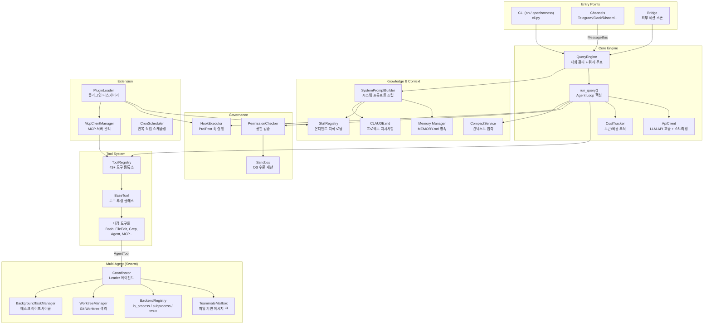
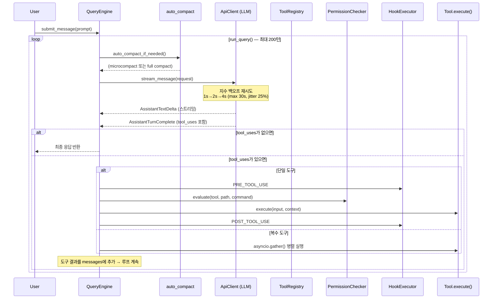
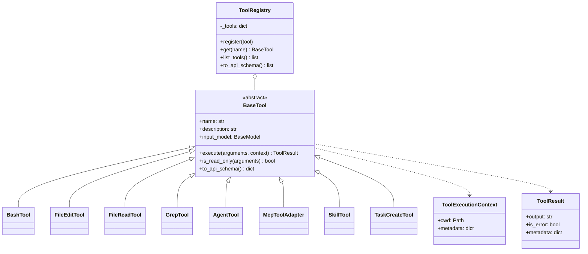
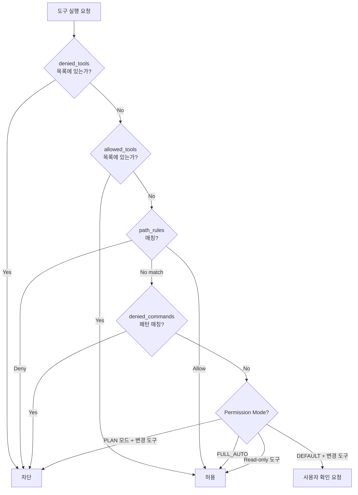
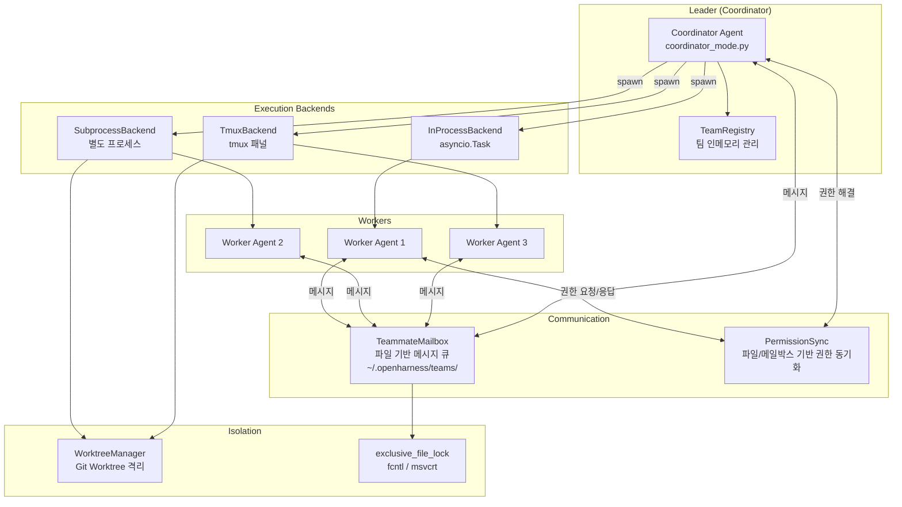
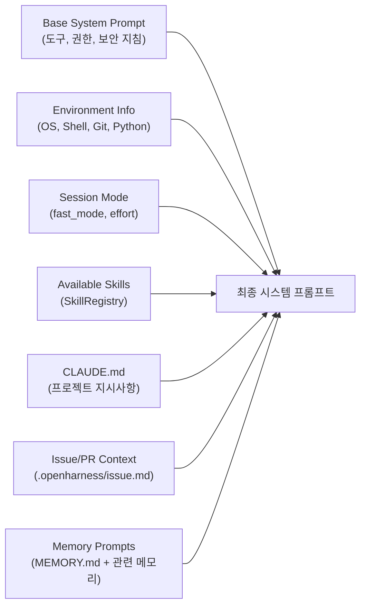
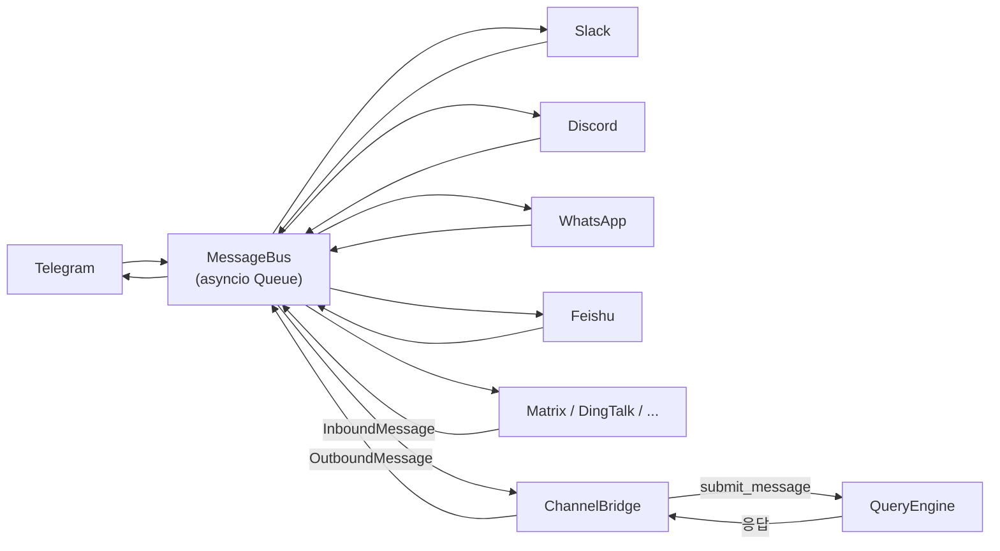

# OpenHarness 아키텍처 분석

> **Open Agent Harness** — LLM을 기능적 에이전트로 만드는 경량 인프라스트럭처
> - GitHub: https://github.com/HKUDS/OpenHarness
> - 개발: HKU Data Intelligence Lab (HKUDS)
> - 라이선스: MIT / Python 3.10+ / v0.1.0 (2026-04-01)

---

## 1. 프로젝트 개요

### 해결하려는 문제

Claude Code와 같은 상용 코딩 에이전트는 강력하지만 **소스가 비공개**이다. 연구자나 개발자가 에이전트 내부 동작을 이해하거나, 커스텀 에이전트를 구축하거나, 다른 LLM 백엔드로 교체하기 어렵다. OpenHarness는 Claude Code의 핵심 "하네스(Harness)" 아키텍처를 **약 11,700줄의 Python 코드**로 오픈소스 재구현하여, 에이전트가 작동하는 인프라 자체를 투명하게 만든다.

### 핵심 정의

**Agent Harness = Tools + Knowledge + Observation + Action + Permissions**

LLM이 "지능"을 제공하면, Harness가 **손(Tool 실행), 눈(파일/웹 탐색), 기억(Memory), 안전 경계(Permission)**를 제공한다. OpenHarness는 이 하네스를 모듈화하여, 어떤 LLM이든 꽂으면 에이전트가 되는 프레임워크를 지향한다.

---

## 2. 핵심 특징 및 차별점

| 특징 | 설명 |
|------|------|
| **경량** | ~11,700 LoC Python으로 Claude Code 기능의 ~80% 구현 |
| **43+ 내장 도구** | 파일 I/O, Shell, 검색, 웹, MCP, 태스크 관리 등 |
| **멀티 에이전트 Swarm** | In-process / Subprocess / Tmux 백엔드로 에이전트 팀 구성 |
| **MCP 프로토콜 네이티브** | stdio / HTTP / WebSocket MCP 서버 통합 |
| **채널 시스템** | Telegram, Slack, Discord 등 10+ 메시징 채널 어댑터 |
| **플러그인/스킬 호환** | Anthropic 공식 skills/plugins 생태계 호환 |
| **Hook 기반 거버넌스** | Pre/Post Tool Use 훅으로 실행 전후 검증·차단 |
| **컨텍스트 자동 압축** | Microcompact + LLM 기반 Full Compact 이중 전략 |
| **영속 메모리** | MEMORY.md 기반 세션 간 정보 유지 |

---

## 3. 전체 아키텍처

### 3.1 시스템 구조도



### 3.2 Agent Loop 데이터 흐름



---

## 4. 핵심 컴포넌트 상세

### 4.1 Engine — Agent Loop 핵심

| 파일 | 클래스/함수 | 역할 |
|------|------------|------|
| `engine/query_engine.py` | `QueryEngine` | 대화 히스토리 소유, 쿼리 제출 진입점 |
| `engine/query.py` | `run_query()` | **핵심 루프** — LLM 호출 → 도구 실행 → 반복 |
| `engine/query.py` | `_execute_tool_call()` | 단일 도구 실행 (훅 → 권한 → 실행 → 훅) |
| `engine/query.py` | `QueryContext` | 루프 전체 공유 컨텍스트 (api_client, tools, hooks 등) |
| `engine/stream_events.py` | `StreamEvent` 계열 | 스트리밍 이벤트 타입들 |
| `engine/cost_tracker.py` | `CostTracker` | input/output 토큰 누적 집계 |
| `engine/messages.py` | `ConversationMessage` | 대화 메시지 모델 |

**설계 포인트:**
- `run_query()`는 `AsyncIterator[StreamEvent]`를 yield하는 비동기 제너레이터. UI가 실시간 스트리밍 가능
- 복수 도구 호출 시 `asyncio.gather()`로 **병렬 실행**, 단일 도구는 즉시 이벤트 스트리밍
- 최대 턴 수 제한(기본 200)으로 무한루프 방지

### 4.2 API Client — LLM 통신 계층

| 파일 | 클래스/함수 | 역할 |
|------|------------|------|
| `api/client.py` | `ApiClient` | Anthropic/OpenAI API 호출, 스트리밍, 재시도 |
| `api/errors.py` | `OpenHarnessApiError` 계열 | API 에러 분류 (Auth/RateLimit/Request) |
| `api/usage.py` | `UsageSnapshot` | 토큰 사용량 스냅샷 |

**재시도 전략:**
- 최대 3회 재시도, 지수 백오프: `min(1.0 * 2^attempt, 30.0)` + 0~25% jitter
- 재시도 대상: HTTP 429, 500, 502, 503, 529 + 네트워크 에러
- `Retry-After` 헤더 존재 시 해당 값 사용
- 인증 에러(`AuthenticationFailure`)는 재시도하지 않음

### 4.3 Tool System — 43+ 도구



**도구 카테고리:**

| 카테고리 | 도구 | 수량 |
|---------|------|------|
| 파일 I/O | read_file, edit_file, write_file, notebook_edit, glob | 5 |
| 실행 | bash, sleep | 2 |
| 검색 | grep, web_fetch, web_search | 3 |
| 태스크 | task_create, task_get, task_list, task_stop, task_update, task_output | 6 |
| 에이전트 | agent, send_message, team_create, team_delete | 4 |
| Cron | cron_create, cron_list, cron_delete, cron_toggle | 4 |
| MCP | mcp_auth, list_mcp_resources, read_mcp_resource, tool_search + 동적 MCP 도구 | 4+ |
| 모드 | enter_plan_mode, exit_plan_mode, enter_worktree, exit_worktree | 4 |
| 기타 | skill, config, brief, todo_write, ask_user_question, remote_trigger, lsp | 7 |

**MCP 도구 통합 (`McpToolAdapter`):**
- MCP 서버의 JSON Schema → Pydantic 모델 자동 생성
- 네이밍: `mcp__{server_name}__{tool_name}` (예: `mcp__github__list_repos`)
- 시작 시 `create_default_tool_registry(mcp_manager)`가 모든 MCP 도구를 자동 등록

### 4.4 Permission & Governance — 권한 제어



**3가지 Permission Mode:**

| 모드 | 읽기 도구 | 변경 도구 |
|------|----------|----------|
| `DEFAULT` | 자동 허용 | 사용자 확인 필요 |
| `PLAN` | 자동 허용 | 차단 (dry-run) |
| `FULL_AUTO` | 자동 허용 | 자동 허용 |

**Hook 시스템 (4가지 타입):**

| 훅 타입 | 실행 방식 | 용도 |
|---------|----------|------|
| `CommandHook` | Shell 명령 실행 | 린터, 포매터 검증 |
| `PromptHook` | LLM에게 판단 위임 | 시맨틱 검증 |
| `HttpHook` | HTTP POST 전송 | 외부 서비스 알림/검증 |
| `AgentHook` | 별도 LLM 에이전트 | 심층 코드 리뷰 |

### 4.5 Swarm — 멀티 에이전트 조정



**핵심 개념:**

1. **TeammateMailbox** — 파일 시스템 기반 비동기 메시지 큐
   - 경로: `~/.openharness/teams/<team>/agents/<agent_id>/inbox/<timestamp>_<id>.json`
   - 원자적 쓰기 (`.tmp` → rename)
   - `exclusive_file_lock`으로 동시 접근 보호

2. **3가지 실행 백엔드**
   - `InProcessBackend`: asyncio.Task로 같은 프로세스 내 실행 (가장 가벼움)
   - `SubprocessBackend`: `BackgroundTaskManager`를 통해 별도 프로세스 스폰
   - `TmuxBackend`: tmux 패널에서 시각적으로 실행

3. **WorktreeManager** — Git Worktree로 에이전트 간 파일시스템 격리
   - `~/.openharness/worktrees/<slug>/`에 워크트리 생성
   - `node_modules`, `.venv` 등 공통 디렉토리는 심볼릭 링크로 공간 절약
   - 비활성 에이전트 워크트리 자동 정리

4. **PermissionSync** — Worker-Leader 간 권한 동기화 프로토콜
   - Worker가 변경 도구 실행 시 Leader에게 권한 요청
   - Leader가 승인/거부 결정 후 응답
   - 파일 기반(`pending/` → `resolved/`) + 메일박스 기반 이중 채널

### 4.6 Context & Memory — 컨텍스트 관리

**컨텍스트 자동 압축 (2단계 전략):**

| 단계 | 방식 | LLM 호출 | 설명 |
|------|------|----------|------|
| Microcompact | 오래된 도구 결과 제거 | 없음 | 최근 5개 결과만 유지, 나머지 `[Old tool result content cleared]`로 대체 |
| Full Compact | LLM 기반 요약 | 있음 | 최근 6개 메시지 보존 + 나머지를 구조화된 요약으로 압축 |

- 자동 발동 임계값: `context_window - 20,000 - 13,000` 토큰
- Microcompact 먼저 시도 → 부족하면 Full Compact
- 연속 실패 3회 시 포기

**영속 메모리 시스템:**
- `~/.data/memory/{project_name}-{sha1_digest}/MEMORY.md`에 인덱스 저장
- YAML 프론트매터가 있는 개별 `.md` 파일로 메모리 항목 관리
- 세션 간 정보 유지, 시스템 프롬프트에 자동 주입

### 4.7 System Prompt Builder — 프롬프트 조립



`build_runtime_system_prompt()`가 설정, 스킬 레지스트리, 커스텀 지시사항, 메모리 등 7개 이상의 소스를 조합하여 시스템 프롬프트를 동적으로 조립한다.

### 4.8 Channels — 메시징 채널 통합



- `MessageBus`: 채널과 에이전트 코어를 분리하는 비동기 큐
- `InboundMessage` / `OutboundMessage`: 채널-에이전트 간 메시지 모델
- `BaseChannel`: 채널 구현 추상 클래스 (`start()`, `stop()`, `send()`, `is_allowed()`)
- `ChannelManager`: 활성화된 채널 초기화/라우팅

### 4.9 Plugin & Skill — 확장 시스템

**플러그인 디스커버리 경로:**
1. `~/.openharness/plugins/` (사용자 전역)
2. `.openharness/plugins/` (프로젝트 로컬)

**플러그인이 기여하는 아티팩트:**

| 아티팩트 | 소스 | 등록 대상 |
|---------|------|----------|
| Skills | `skills/` 디렉토리 내 `.md` 파일 | SkillRegistry |
| Hooks | `hooks.json` | HookRegistry |
| MCP 서버 | `mcp.json` | McpClientManager |
| Commands | `commands/` 디렉토리 | CLI 명령 |

**스킬 형식:** YAML 프론트매터 + Markdown 본문. `name`, `description` 필드로 메타데이터 정의.

### 4.10 Services — 보조 서비스

| 서비스 | 파일 | 역할 |
|--------|------|------|
| **Compact** | `services/compact/` | 대화 컨텍스트 압축 (micro + full) |
| **LSP** | `services/lsp/` | Python 심볼 검색, 정의 이동, 참조 찾기 |
| **OAuth** | `services/oauth/` | OAuth 인증 처리 |
| **Cron** | `services/cron.py` + `cron_scheduler.py` | 반복 작업 레지스트리 및 스케줄러 |
| **Session** | `services/session_storage.py` | 세션 영속화 및 복원 |
| **Token** | `services/token_estimation.py` | 토큰 추정: `(len(text) + 3) // 4` |

---

## 5. 기술 스택

| 구분 | 기술 |
|------|------|
| 언어 | Python 3.10+, TypeScript (React Ink TUI) |
| LLM SDK | `anthropic>=0.40.0`, `openai>=1.0.0` |
| TUI | `textual>=0.80.0`, `rich>=13.0.0`, `prompt-toolkit>=3.0.0` |
| CLI | `typer>=0.12.0` |
| 데이터 모델 | `pydantic>=2.0.0` |
| HTTP | `httpx>=0.27.0` |
| MCP | `mcp>=1.0.0` |
| WebSocket | `websockets>=12.0` |
| Cron | `croniter>=2.0.0` |
| 파일 감시 | `watchfiles>=0.20.0` |
| 빌드 | `hatchling` (PEP 517) |

---

## 6. 디렉토리 구조 및 모듈 맵

```
src/openharness/
├── api/            # LLM API 클라이언트, 에러, 사용량 모델
├── auth/           # 인증 관리
├── bridge/         # 외부 세션 스폰/관리
├── channels/       # 메시징 채널 (Telegram, Slack 등)
│   ├── bus/        #   비동기 메시지 버스
│   └── impl/       #   채널별 구현체
├── commands/       # CLI 서브커맨드
├── config/         # 설정 모델, 경로 해석
├── coordinator/    # 멀티에이전트 코디네이터
├── engine/         # ★ Agent Loop 핵심 (query, stream, cost)
├── hooks/          # 라이프사이클 훅 (Pre/Post Tool Use)
├── keybindings/    # 키바인딩 관리
├── mcp/            # MCP 클라이언트 매니저
├── memory/         # 영속 메모리 (MEMORY.md)
├── output_styles/  # 출력 형식 (text, json, stream-json)
├── permissions/    # 권한 모드, 체커, 경로 규칙
├── plugins/        # 플러그인 로더, 스키마
├── prompts/        # 시스템 프롬프트 빌더
├── sandbox/        # OS 수준 샌드박스
├── services/       # 보조 서비스 (compact, LSP, OAuth, cron)
├── skills/         # 스킬 레지스트리, 번들 스킬
├── state/          # 세션 상태 관리
├── swarm/          # ★ 멀티에이전트 (mailbox, worktree, backends)
├── tasks/          # 백그라운드 태스크 매니저
├── themes/         # 테마 설정
├── tools/          # ★ 43+ 도구 구현체
├── types/          # 공통 타입
├── ui/             # TUI (Textual + React Ink)
├── utils/          # 유틸리티
├── vim/            # Vim 모드
├── voice/          # 음성 입력
└── cli.py          # CLI 진입점 (oh 명령)
```

---

## 7. 확장 포인트

### 에이전트 플랫폼 개발자 관점에서의 확장성

| 확장 포인트 | 방법 | 난이도 |
|------------|------|--------|
| **커스텀 도구 추가** | `BaseTool` 상속 → `ToolRegistry.register()` | 낮음 |
| **새 LLM 백엔드** | `api_format` 옵션 (anthropic/openai/copilot) 또는 ApiClient 교체 | 중간 |
| **MCP 서버 통합** | `mcp.json` 또는 `settings.json`에 서버 설정 추가 → 자동 등록 | 낮음 |
| **새 채널** | `BaseChannel` 구현 → `ChannelManager`에 등록 | 중간 |
| **플러그인 작성** | `plugin.json` + skills/hooks/mcp 디렉토리 구성 | 낮음 |
| **커스텀 훅** | `hooks.json`에 Command/Prompt/HTTP/Agent 훅 정의 | 낮음 |
| **Swarm 백엔드** | `TeammateExecutor` 프로토콜 구현 | 높음 |
| **에이전트 정의** | YAML로 `AgentDefinition` 작성 (model, tools, prompt) | 낮음 |

---

## 8. 경쟁·비교 분석

| 항목 | OpenHarness | Claude Code | OpenCode | Aider |
|------|-------------|-------------|----------|-------|
| 소스 공개 | MIT | 비공개 | MIT | Apache 2.0 |
| 언어 | Python | TypeScript | TypeScript (Bun) | Python |
| 코드 규모 | ~11.7K LoC | ~300K+ LoC 추정 | 대규모 모노레포 | ~30K LoC |
| LLM 백엔드 | Anthropic + OpenAI | Anthropic 전용 | Anthropic + OpenAI | 다중 |
| 멀티에이전트 | Swarm (3 백엔드) | 서브에이전트 | 없음 | 없음 |
| MCP 지원 | 네이티브 | 네이티브 | 없음 | 없음 |
| 채널 통합 | 10+ 채널 | 없음 | 없음 | 없음 |
| 플러그인 | 호환 생태계 | 자체 생태계 | 없음 | 없음 |
| 메모리 영속 | MEMORY.md | MEMORY.md | 없음 | 일부 |
| 컨텍스트 관리 | Micro + Full Compact | 자체 Compact | 자체 | 파일 단위 |

---

## 9. 종합 평가

### 강점

1. **투명한 아키텍처** — Claude Code와 동등한 에이전트 인프라를 소스 레벨에서 학습·수정 가능
2. **모듈화 설계** — Engine, Tools, Permissions, Swarm 등 각 레이어가 명확히 분리되어 독립적 확장 용이
3. **Swarm 시스템** — In-process/Subprocess/Tmux 3가지 백엔드 + 파일 기반 메일박스 + Git Worktree 격리는 프로덕션 수준의 멀티에이전트 패턴
4. **채널 시스템** — MessageBus 패턴으로 에이전트를 Telegram, Slack 등으로 즉시 배포 가능. 에이전트 플랫폼 개발자에게 매우 유용
5. **거버넌스 레이어** — Permission Mode + Path Rule + Hook 조합으로 세밀한 에이전트 행동 제어 가능

### 약점 / 리스크

1. **토큰 추정 정확도** — `(len(text) + 3) // 4` 휴리스틱은 실제 토큰 수와 상당한 오차 발생 가능. 컨텍스트 관리에 영향
2. **파일 기반 메시지 큐** — Swarm의 파일 시스템 기반 메일박스는 고빈도 메시지 교환 시 I/O 병목 가능. 대규모 에이전트 팀에서 스케일링 한계
3. **에코시스템 초기 단계** — v0.1.0 출시 직후로, 프로덕션 검증이 부족하고 플러그인 생태계가 미성숙
4. **Anthropic API 의존성** — OpenAI 포맷도 지원하나, 시스템 프롬프트와 도구 스키마가 Anthropic 규격에 최적화

### 에이전트 플랫폼 엔지니어 인사이트

- **레퍼런스 아키텍처로서의 가치**: Claude Code의 내부 구조를 이해하고 싶은 엔지니어에게 최적. 특히 Agent Loop, Permission, Compact, Swarm 패턴은 실전에서 바로 참고 가능
- **채널 + Swarm 조합**: 챗봇/에이전트 플랫폼을 구축한다면, MessageBus 기반 채널 아키텍처 + Swarm 멀티에이전트는 좋은 출발점
- **Hook 기반 거버넌스**: 에이전트의 도구 사용을 외부에서 검증·차단하는 패턴은 프로덕션 에이전트의 안전성 확보에 필수. 4가지 Hook 타입(Command/Prompt/HTTP/Agent)의 설계를 참고할 가치가 있음
- **확장 시 고려사항**: 파일 기반 메일박스를 Redis/NATS 등으로 교체하면 Swarm 스케일링이 가능하고, 토큰 추정을 `tiktoken` 등으로 교체하면 컨텍스트 관리 정확도를 높일 수 있음

---

## Sources

- [HKUDS/OpenHarness - GitHub](https://github.com/HKUDS/OpenHarness)
- [Show HN: OpenHarness - Hacker News](https://news.ycombinator.com/item?id=47600371)
- [The Open Source Agent Framework That Is 44 Times Lighter Than Claude Code](https://pythonlibraries.substack.com/p/the-open-source-agent-framework-that)
- [Chao Huang on X - OpenHarness 소개](https://x.com/huang_chao4969/status/2039399788215705888)
