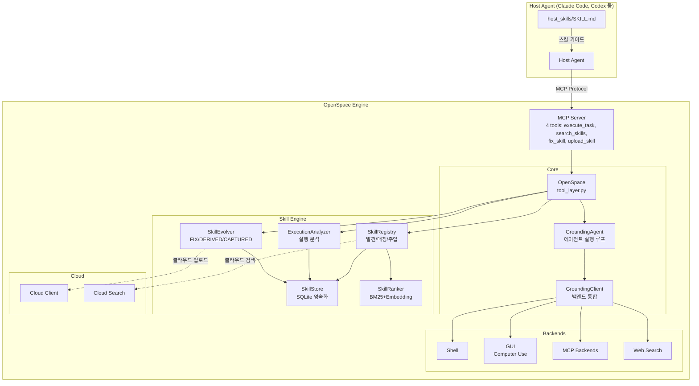
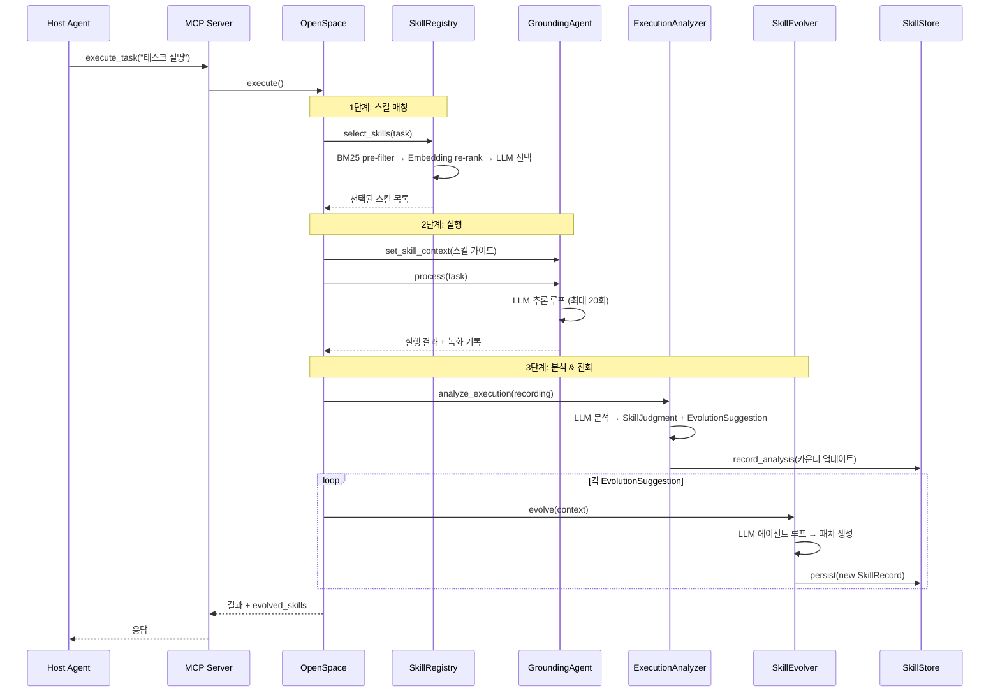
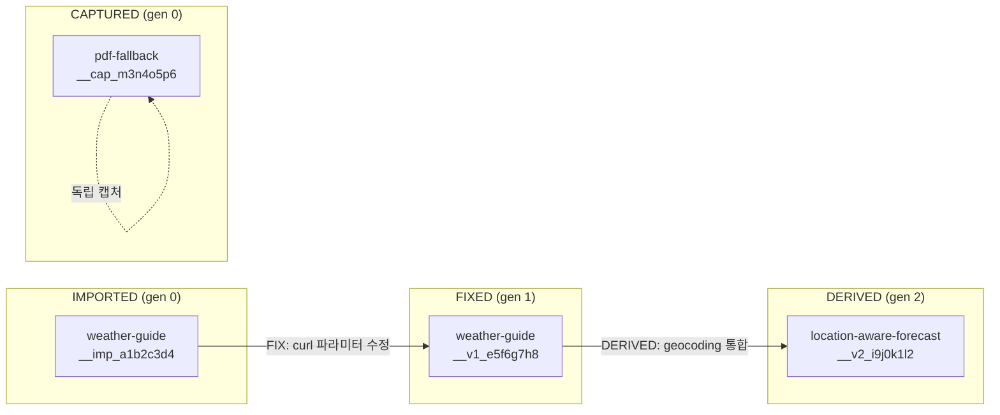
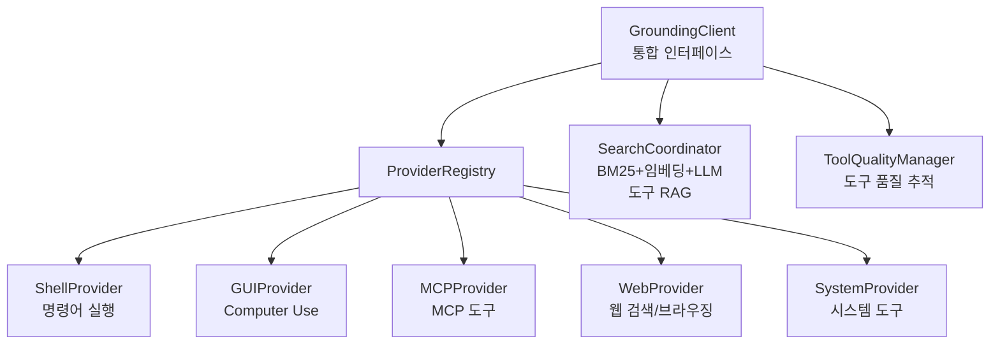

# OpenSpace 분석 보고서

> **HKUDS/OpenSpace** - Self-Evolving Skill Engine for AI Agents
> https://github.com/HKUDS/OpenSpace

---

## 1. 프로젝트 개요

### 핵심 정의
OpenSpace는 홍콩대학교 데이터 사이언스 랩(HKUDS)에서 개발한 **자기 진화형 스킬 엔진(Self-Evolving Skill Engine)**이다. AI 에이전트(Claude Code, Codex, Cursor 등)에 플러그인 형태로 연결되어, 에이전트가 태스크를 수행할 때마다 **스킬을 자동으로 학습·수리·개선·공유**할 수 있게 해준다.

### 해결하려는 문제
| 문제 | OpenSpace의 해결 방식 |
|------|----------------------|
| 매번 처음부터 추론 → 토큰 낭비 | 성공 패턴을 스킬로 캡처하여 재사용 |
| 동일한 실패 반복 | 실패 분석 후 스킬 자동 수리(FIX) |
| 에이전트 간 지식 단절 | 클라우드 스킬 커뮤니티를 통한 공유 |
| 스킬 품질 저하(도구/API 변경) | 다층 모니터링 + 자동 진화 트리거 |

### 탄생 배경
2026년 3월 25일 오픈소스 공개. HKU Data Science Lab의 에이전트 도구 생태계(AnyTool, ClawWork, nanobot) 위에 구축되었으며, "에이전트가 경험으로부터 학습하는" 메타 레이어를 목표로 한다.

---

## 2. 핵심 특징 및 차별점

### 세 가지 초능력

**1. 자기 진화 (Self-Evolution)**
- **FIX** - 깨진 스킬을 자동 수리 (in-place, 같은 디렉토리)
- **DERIVED** - 기존 스킬에서 강화/특화 버전 파생 (새 디렉토리)
- **CAPTURED** - 성공적인 실행에서 새로운 패턴 추출 (완전 새 스킬)

**2. 집단 지능 (Collective Intelligence)**
- 클라우드 레지스트리로 에이전트 간 스킬 공유
- 한 에이전트의 학습이 모든 에이전트에 전파

**3. 토큰 효율성**
- GDPVal 벤치마크에서 46% 토큰 절감, 4.2배 수익 증가
- 스킬이 진화할수록 동일 작업의 비용이 점진적 감소

### 기존 대안 대비 차별화
- 일반적인 프롬프트 캐싱/RAG와 달리 **스킬 단위의 버전 DAG** 관리
- 단순 재사용이 아닌 **실행 결과 기반 자동 진화** (3가지 트리거)
- MCP 프로토콜 기반으로 **어떤 에이전트에든 플러그인** 가능

---

## 3. 아키텍처 분석

### 전체 시스템 구조



### 핵심 데이터 흐름: 태스크 실행 → 스킬 진화



### 스킬 버전 DAG 모델



---

## 4. 기술 스택

| 계층 | 기술 | 비고 |
|------|------|------|
| **언어** | Python 3.12+ | 타입 힌트 적극 활용, dataclass 기반 |
| **LLM 통합** | LiteLLM (<1.82.7) | 다중 LLM 프로바이더 추상화 |
| **에이전트 프로토콜** | MCP (Model Context Protocol) | stdio/SSE/WebSocket 전송 지원 |
| **데이터 저장** | SQLite | `.openspace/openspace.db` |
| **스킬 검색** | BM25 + OpenAI Embedding (text-embedding-3-small) | 하이브리드 랭킹 |
| **웹 프레임워크** | Flask | 대시보드 API 서버 |
| **프론트엔드** | React + TypeScript + Tailwind + Vite | 스킬 브라우징/리니지 시각화 |
| **GUI 자동화** | PyAutoGUI + 플랫폼별(pyobjc/pywinauto/xlib) | Computer Use 백엔드 |
| **샌드박싱** | E2B (선택) | 코드 실행 격리 |
| **패키지** | setuptools + pyproject.toml | `pip install -e .` |

---

## 5. 핵심 코드 분석

### 5.1 모듈 구조 및 역할

```
openspace/
├── tool_layer.py          # OpenSpace 메인 클래스 (진입점, 오케스트레이션)
├── mcp_server.py          # MCP 서버 (4개 도구 노출)
├── __main__.py            # CLI 진입점
├── agents/
│   ├── base.py            # BaseAgent 추상 클래스
│   └── grounding_agent.py # 실행 에이전트 (도구 호출, 반복, 스킬 주입)
├── skill_engine/          # ★ 핵심: 자기 진화 스킬 시스템
│   ├── registry.py        # 스킬 발견, BM25+임베딩 사전필터, LLM 선택
│   ├── analyzer.py        # 실행 후 분석 (에이전트 루프 + 도구 접근)
│   ├── evolver.py         # FIX/DERIVED/CAPTURED 진화 (3가지 트리거)
│   ├── patch.py           # 멀티파일 FULL/DIFF/PATCH 적용
│   ├── store.py           # SQLite 영속화, 버전 DAG, 품질 메트릭
│   ├── skill_ranker.py    # BM25+임베딩 하이브리드 랭킹
│   └── types.py           # SkillRecord, SkillLineage, EvolutionSuggestion
├── grounding/             # 통합 백엔드 시스템
│   ├── core/              # 통합 인터페이스, 도구 추상화, 보안, 품질
│   └── backends/          # Shell, GUI, MCP, Web 백엔드
└── cloud/                 # 클라우드 스킬 커뮤니티
```

### 5.2 스킬 진화 엔진 (`skill_engine/`) - 핵심 설계 결정

**스킬 아이덴티티 시스템** (`registry.py`)
- 각 스킬 디렉토리에 `.skill_id` 사이드카 파일로 고유 ID 영속화
- 네이밍 규칙: `{name}__imp_{uuid8}` (imported), `{name}__v{gen}_{uuid8}` (evolved)
- 디렉토리 이동이나 머신 변경에도 ID가 유지됨

**3단계 스킬 매칭** (`registry.py` + `skill_ranker.py`)
1. **BM25 Pre-filter**: 스킬 10개 초과 시 활성화, 빠른 렉시컬 필터링
2. **Embedding Re-rank**: `text-embedding-3-small`로 시멘틱 재정렬
3. **LLM Selection**: 최종 후보를 LLM이 태스크에 맞게 선택

**진화 트리거 3종** (`evolver.py`)
```python
class EvolutionTrigger(str, Enum):
    ANALYSIS         = "analysis"          # 실행 후 분석에서 제안
    TOOL_DEGRADATION = "tool_degradation"  # 도구 품질 저하 감지
    METRIC_MONITOR   = "metric_monitor"    # 주기적 스킬 건강 체크
```

**안티루프 가드**:
- Trigger 2 (도구 저하): `_addressed_degradations` Dict로 이미 처리된 스킬 추적. 도구가 복구되면 자동 리셋
- Trigger 3 (메트릭): 새 스킬은 `total_selections=0`이므로 `min_selections` 임계값 이하면 재평가 대상에서 제외

**패치 시스템** (`patch.py`)
- 3가지 LLM 출력 포맷 지원: `FULL` (전체 덮어쓰기), `DIFF` (SEARCH/REPLACE), `PATCH` (멀티파일)
- 자동 감지(`PatchType.AUTO`)로 LLM 출력을 파싱하여 적절한 적용 방식 선택
- 최대 3회 재시도 (`_MAX_EVOLUTION_ATTEMPTS`)

### 5.3 SkillRecord - 스킬 전체 프로파일 (`types.py`)

```python
@dataclass
class SkillRecord:
    skill_id: str
    name: str
    description: str
    category: SkillCategory      # tool_guide | workflow | reference
    lineage: SkillLineage        # origin, generation, parent_ids, diff, snapshot
    
    # 실행 통계 (SQL 원자적 업데이트)
    total_selections: int = 0    # LLM에 의해 선택된 횟수
    total_applied: int = 0       # 실제 적용된 횟수
    total_completions: int = 0   # 적용 후 태스크 완료 횟수
    total_fallbacks: int = 0     # 적용 실패 횟수
    
    # 파생 메트릭
    @property
    def effective_rate(self) -> float:  # 선택→적용→완료 종합 효율
        return self.total_completions / self.total_selections
```

### 5.4 실행 분석기 (`analyzer.py`)

- 실행 후 전체 대화 로그(최대 80,000자)를 LLM에 전달
- LLM이 `ExecutionAnalysis`를 생성: 태스크 완료 여부, 스킬별 판단, 진화 제안
- LLM이 할루시네이션한 skill_id를 edit distance ≤ 3으로 자동 보정하는 `_correct_skill_ids` 함수 포함

### 5.5 Grounding 시스템 (`grounding/`)



- **Provider 패턴**: 각 백엔드(Shell, GUI, MCP, Web, System)가 `Provider` 인터페이스 구현
- **지연 초기화**: import 시점이 아닌 첫 사용 시점에 Provider 초기화
- **SearchCoordinator**: 도구가 많을 때 BM25+임베딩+LLM으로 관련 도구만 필터링 (Smart Tool RAG)
- **ToolQualityManager**: 도구별 성공률/지연시간 추적, 저하 시 진화 트리거 발동

---

## 6. API 및 인터페이스

### MCP Server (4개 도구)
| 도구 | 설명 |
|------|------|
| `execute_task` | 태스크 위임 (스킬 자동 등록/검색/진화) |
| `search_skills` | 로컬+클라우드 스킬 검색 |
| `fix_skill` | 특정 스킬 수동 수리 |
| `upload_skill` | 스킬을 클라우드에 업로드 |

### Python API
```python
async with OpenSpace() as cs:
    result = await cs.execute("태스크 설명")
    for skill in result.get("evolved_skills", []):
        print(f"Evolved: {skill['name']} ({skill['origin']})")
```

### CLI
```bash
openspace                              # 대화형 모드
openspace --model "..." --query "..."  # 단일 태스크
openspace-mcp                          # MCP 서버 실행
openspace-dashboard --port 7788        # 대시보드 API
openspace-download-skill <id>          # 클라우드 스킬 다운로드
openspace-upload-skill <path>          # 클라우드 스킬 업로드
```

### Host Agent 통합
`host_skills/` 디렉토리에 `SKILL.md` 파일 2개만 복사하면 호스트 에이전트가 OpenSpace 사용법을 학습:
- `delegate-task/SKILL.md` — 실행, 수리, 업로드 방법
- `skill-discovery/SKILL.md` — 스킬 검색 방법

---

## 7. 확장성 및 플러그인

### 확장 포인트

| 확장 포인트 | 방법 | 위치 |
|-------------|------|------|
| **커스텀 스킬 추가** | `SKILL.md` 파일이 있는 디렉토리 생성 | `openspace/skills/` 또는 `OPENSPACE_HOST_SKILL_DIRS` |
| **백엔드 추가** | `Provider` 인터페이스 구현 + config 등록 | `grounding/backends/` |
| **MCP 서버 연결** | config에 MCP 서버 endpoint 추가 | `openspace/config/` |
| **보안 정책** | `SecurityPolicy` 커스터마이징 | `grounding/core/security/` |
| **LLM 교체** | `llm_model` 설정 변경 (LiteLLM 지원 모델) | `OpenSpaceConfig` |

### 스킬 형식 (SKILL.md)
```yaml
---
name: my-custom-skill
description: 이 스킬이 하는 일
---

## 사용 조건
...

## 실행 단계
1. ...
2. ...
```

YAML 프론트매터 + Markdown 본문의 단순한 형식으로, 에이전트가 읽고 따를 수 있는 가이드 문서.

---

## 8. 성능 특성

### GDPVal 벤치마크 결과 (50개 실전 태스크)

| 지표 | 결과 |
|------|------|
| 수익 대비 | 기존 대비 4.2배 (Qwen 3.5-Plus 동일 모델) |
| 토큰 절감 | Phase 2에서 Phase 1 대비 45.9% 절감 |
| 품질 점수 | 평균 70.8% (기존 40.8% 대비 +30pp) |
| 가치 포착률 | $15,764 중 $11,484 획득 (72.8%) |

### 진화된 스킬 분류 (165개)

| 목적 | 수량 | 핵심 인사이트 |
|------|------|---------------|
| 파일 포맷 I/O | 44 | 32/44가 실제 실패에서 캡처됨 |
| 실행 복구 | 29 | 28/29가 실제 크래시에서 캡처됨 |
| 문서 생성 | 26 | `document-gen-fallback`이 13개 버전으로 진화 |
| 품질 보증 | 23 | 사후 검증 패턴 (행 수 확인, PDF 페이지 검증 등) |
| 태스크 오케스트레이션 | 17 | 멀티파일 추적, ZIP 패키징 |
| 도메인 워크플로 | 13 | SOAP 노트, 오디오 프로덕션 (4세대 진화) |
| 웹/리서치 | 11 | SSL/프록시 디버깅, 검색 폴백 |

**핵심 발견**: 대부분의 스킬이 도메인 지식이 아닌 **도구 신뢰성과 에러 복구 패턴**에 집중

### 알려진 제약사항
- 첫 실행(Cold Start)은 스킬 축적 전이므로 효과 제한적
- 스킬 수가 많아지면 매칭 비용 증가 (BM25 pre-filter로 완화)
- LLM 비용이 진화 자체에도 소모됨 (진화 에이전트 루프 최대 5회)

---

## 9. 배포 및 운영

### 설치
```bash
git clone https://github.com/HKUDS/OpenSpace.git && cd OpenSpace
pip install -e .
```

### 핵심 환경변수
| 변수 | 설명 |
|------|------|
| `OPENSPACE_HOST_SKILL_DIRS` | 에이전트의 스킬 디렉토리 경로 |
| `OPENSPACE_WORKSPACE` | OpenSpace 프로젝트 경로 |
| `OPENSPACE_API_KEY` | 클라우드 커뮤니티 API 키 (선택) |
| `OPENSPACE_MODEL` | LLM 모델 지정 |
| `OPENSPACE_LLM_*` | LLM 관련 세부 설정 |

### 데이터 저장
- 스킬 DB: `.openspace/openspace.db` (SQLite)
- 임베딩 캐시: `.openspace/` 내 pickle 파일
- 실행 로그: `logs/recordings/`

---

## 10. 경쟁/비교 분석

| 특성 | OpenSpace | 일반 프롬프트 캐싱 | RAG 기반 도구 | LangChain Memory |
|------|-----------|-------------------|---------------|-----------------|
| **스킬 자동 진화** | FIX/DERIVED/CAPTURED | X | X | X |
| **버전 DAG 관리** | O (세대/리니지 추적) | X | X | X |
| **멀티 에이전트 공유** | 클라우드 레지스트리 | X | X | 제한적 |
| **품질 모니터링** | 3계층 (스킬/도구/코드) | X | X | X |
| **에이전트 무관** | MCP 기반 플러그인 | 에이전트 종속 | 프레임워크 종속 | LangChain 종속 |
| **토큰 효율** | 사용할수록 개선 | 고정 | 고정 | 고정 |

---

## 11. 종합 평가

### 강점
1. **스킬을 "살아있는 엔티티"로 취급** - 정적 프롬프트가 아닌, 실행 결과 기반으로 진화하는 동적 자산
2. **견고한 진화 안전장치** - 안티루프 가드, 확인 게이트, 안전성 검사(프롬프트 인젝션, 자격 증명 탈취 감지)
3. **에이전트 무관(Agnostic) 설계** - MCP 프로토콜 기반으로 어떤 에이전트에든 연결 가능
4. **실전 벤치마크로 검증** - 220개 실제 직업 태스크(GDPVal)에서 경제적 가치 입증
5. **하이브리드 스킬 랭킹** - BM25 + Embedding + LLM 3단계 파이프라인으로 정확한 스킬 매칭

### 약점/리스크
1. **Cold Start 문제** - 스킬이 축적되기 전까지는 순수 LLM 대비 이점 없음
2. **진화 비용** - 각 진화가 별도 LLM 에이전트 루프를 실행하므로 초기 비용 증가
3. **SQLite 단일 DB** - 대규모 멀티에이전트 환경에서 동시성 병목 가능
4. **LiteLLM 의존** - 공급망 보안 이슈 경험 (PYSEC-2026-2로 버전 고정)
5. **초기 프로젝트** - v0.1.0, API 안정성 미확인

### 적합 사례
- 반복적인 전문 작업을 수행하는 AI 에이전트 시스템
- 여러 에이전트가 지식을 공유해야 하는 팀/조직 환경
- 도구/API가 자주 변경되어 스킬 유지보수가 필요한 환경

### 부적합 사례
- 일회성 간단한 태스크 (진화 오버헤드가 이점보다 큼)
- 오프라인/폐쇄망 환경에서 클라우드 공유가 불필요한 경우

---

## 12. 배울 점 및 프로젝트 적용 가능성

### 아키텍처 패턴

**1. 스킬(지식) 버전 DAG 패턴**
- 지식/노하우를 버전 관리하는 DAG 구조는 어떤 "학습 가능한 시스템"에든 적용 가능
- `SkillLineage` 데이터 모델 (origin, generation, parent_ids, diff, snapshot)이 참고할 만함

**2. 3단계 하이브리드 검색 파이프라인**
```
BM25 (빠른 렉시컬) → Embedding (시멘틱 재정렬) → LLM (최종 선택)
```
- 스킬/문서가 10개 이상일 때만 BM25 활성화하는 `PREFILTER_THRESHOLD` 전략
- 비용과 정확도의 균형을 맞추는 실용적 접근

**3. 실행 분석 → 자동 개선 루프**
```
실행 → 녹화 → LLM 분석 → 진화 제안 → 자동 적용 → 검증
```
- "실패에서 배우는" 자동화 패턴. CI/CD 파이프라인이나 자동 복구 시스템에 응용 가능

**4. MCP 기반 플러그인 아키텍처**
- `mcp_server.py` 하나로 4개 도구를 노출하여 어떤 에이전트에든 연결
- 기능을 MCP 도구로 래핑하면 에이전트 프레임워크에 독립적인 확장 가능

**5. 안티루프/안전장치 설계**
- `_addressed_degradations`: 이미 처리된 문제를 추적하여 무한 루프 방지
- 세마포어 기반 동시성 제한 (`max_concurrent`)
- LLM 할루시네이션 보정 (`_correct_skill_ids`의 edit distance 기반)

### 코드 레벨에서 참고할 점

| 패턴 | 위치 | 설명 |
|------|------|------|
| `.skill_id` 사이드카 파일 | `registry.py` | 이동해도 유지되는 영속 ID 전략 |
| `_db_retry` 데코레이터 | `store.py` | SQLite locked 상황에 대한 지수 백오프 |
| `_MCPSafeStdout` | `mcp_server.py` | MCP stdio 환경에서 stdout/stderr 분리 |
| `PatchType.AUTO` 감지 | `patch.py` | LLM 출력 형식을 자동 감지하여 적용 |
| `EvolutionContext` | `evolver.py` | 3종 트리거를 하나의 통합 컨텍스트로 처리 |

---

## 참고 자료

- GitHub: https://github.com/HKUDS/OpenSpace
- 커뮤니티: https://open-space.cloud
- 관련 프로젝트: [AnyTool](https://github.com/HKUDS/AnyTool), [ClawWork](https://github.com/HKUDS/ClawWork), [nanobot](https://github.com/HKUDS/nanobot)
- GDPVal 벤치마크: https://huggingface.co/datasets/openai/gdpval
- MarkTechPost 튜토리얼: https://www.marktechpost.com/2026/03/24/a-coding-implementation-to-design-self-evolving-skill-engine-with-openspace/
