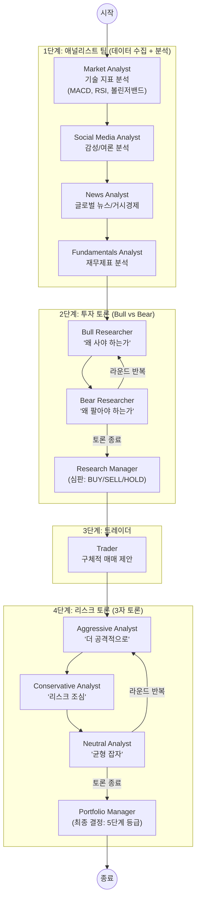
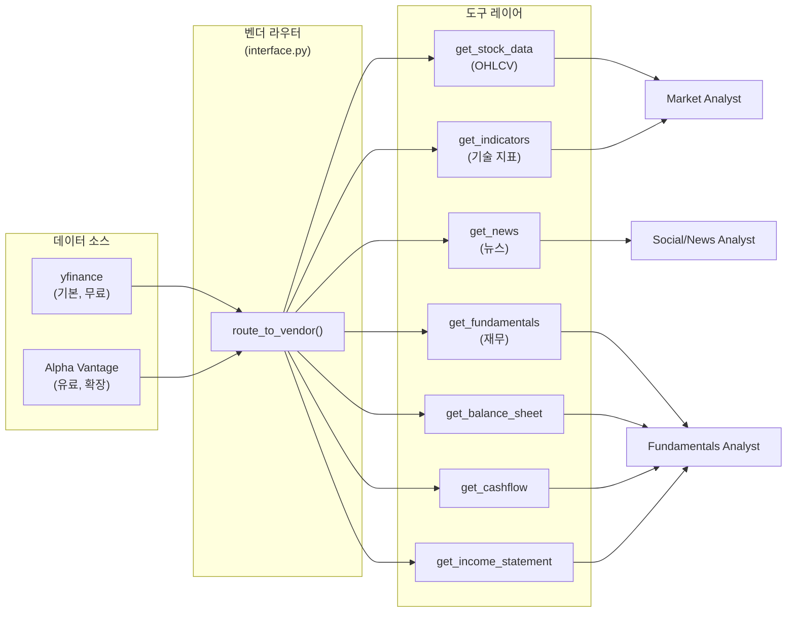
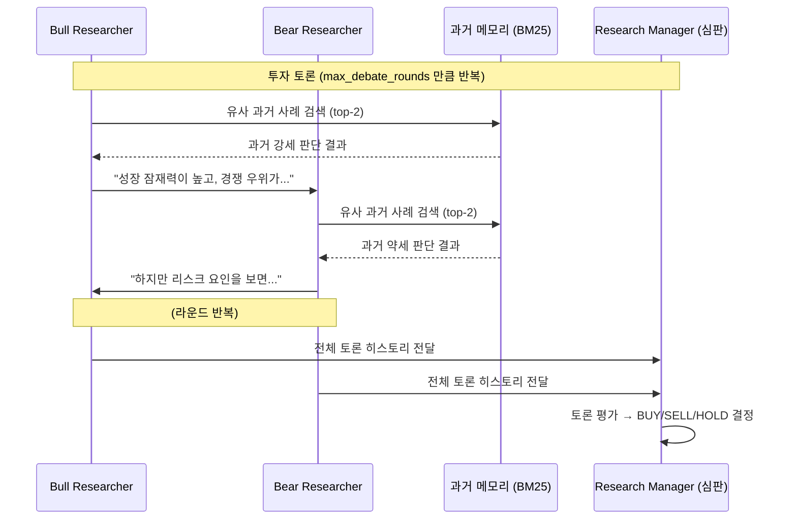
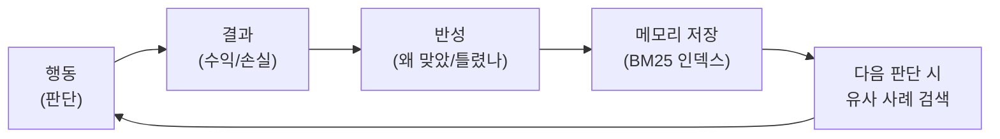

# TradingAgents 분석 보고서

> "Multi-Agents LLM Financial Trading Framework" - 실제 트레이딩 회사의 조직 구조를 LLM 에이전트로 재현한 프레임워크

## 1. 프로젝트 개요

### 핵심 정의

TradingAgents는 **실제 트레이딩 회사(Trading Firm)의 조직 구조를 LLM 멀티 에이전트로 시뮬레이션**하는 프레임워크다. 애널리스트 팀, 리서처 팀, 트레이더, 리스크 관리 팀이 각자 역할을 수행하고, **토론(Debate)** 을 거쳐 최종 투자 결정(BUY/SELL/HOLD)을 내린다.

- **버전**: 0.2.2 (2026년 4월 기준)
- **언어**: Python 3.10+
- **핵심 프레임워크**: LangGraph (상태 기반 에이전트 워크플로우)
- **논문**: [arXiv:2412.20138](https://arxiv.org/abs/2412.20138)
- **라이선스**: MIT

### 해결하려는 문제

기존 LLM 기반 트레이딩 시스템의 한계:
1. **단일 에이전트 편향**: 하나의 LLM이 모든 판단을 하면 확증 편향(Confirmation Bias)에 빠지기 쉬움
2. **리스크 관리 부재**: 대부분의 LLM 트레이딩 시스템은 매수/매도 신호만 생성하고 리스크를 고려하지 않음
3. **학습 부재**: 과거 결정의 성패를 반영하지 못함

TradingAgents는 이를 **역할 분리 + 토론 메커니즘 + 메모리 기반 학습**으로 해결한다.

---

## 2. 핵심 특징 및 차별점

### 실제 트레이딩 회사 구조의 재현

```
실제 트레이딩 회사          TradingAgents
─────────────────       ─────────────────
기술 분석팀          →   Market Analyst (MACD, RSI, 볼린저밴드 등)
감성 분석팀          →   Social Media Analyst (뉴스 감성 분석)
매크로 분석팀        →   News Analyst (글로벌 뉴스, 거시경제)
펀더멘탈 분석팀      →   Fundamentals Analyst (재무제표 분석)
리서치 토론          →   Bull vs Bear Researcher (강세/약세 토론)
포트폴리오 매니저    →   Research Manager → Trader → Portfolio Manager
리스크 관리 위원회   →   Aggressive/Conservative/Neutral 3자 토론
```

### 이중 토론(Debate) 메커니즘

다른 LLM 트레이딩 시스템에 없는 핵심 차별점:

1. **투자 토론**: Bull Researcher vs Bear Researcher가 강세/약세 논거를 교대로 제시
2. **리스크 토론**: 공격적/보수적/중립 3인이 리스크 관점에서 토론
3. 각 토론의 라운드 수를 설정 가능 (`max_debate_rounds`, `max_risk_discuss_rounds`)

### 메모리 기반 학습 (Reflection)

거래 결과를 피드백으로 받아 각 에이전트가 "비슷한 상황에서 뭘 틀렸는지" 학습하고, 다음 판단에 BM25로 유사 과거 사례를 검색하여 참고한다.

### 5단계 투자 등급

단순 BUY/SELL이 아닌 실제 투자은행 스타일의 5단계 등급:
- **Buy** - 강한 확신, 진입/추가 매수
- **Overweight** - 긍정적, 점진적 비중 확대
- **Hold** - 유지, 관망
- **Underweight** - 비중 축소
- **Sell** - 청산 또는 진입 회피

---

## 3. 아키텍처 분석

### 전체 워크플로우



### 상태 관리 (LangGraph State)

모든 에이전트가 공유하는 단일 상태 객체:

```python
# agents/utils/agent_states.py
class AgentState(MessagesState):
    company_of_interest: str        # 분석 대상 종목
    trade_date: str                  # 거래일
    market_report: str               # 기술 분석 리포트
    sentiment_report: str            # 감성 분석 리포트
    news_report: str                 # 뉴스 분석 리포트
    fundamentals_report: str         # 펀더멘탈 리포트
    investment_debate_state: dict    # 투자 토론 상태 (Bull/Bear 히스토리)
    risk_debate_state: dict          # 리스크 토론 상태 (3자 히스토리)
    investment_plan: str             # 리서치 매니저 결정
    trader_investment_plan: str      # 트레이더 매매 제안
    final_trade_decision: str        # 최종 투자 결정
```

### 데이터 흐름



### 토론 메커니즘 상세



---

## 4. 기술 스택

| 구분 | 기술 |
|------|------|
| **언어** | Python 3.10+ |
| **에이전트 프레임워크** | LangGraph ≥0.4.8 |
| **LLM 추상화** | LangChain Core ≥0.3.81 |
| **LLM 프로바이더** | OpenAI, Anthropic, Google, xAI, OpenRouter, Ollama |
| **시장 데이터** | yfinance, Alpha Vantage |
| **기술 지표** | stockstats (MACD, RSI, 볼린저밴드 등) |
| **백테스팅** | backtrader |
| **메모리 검색** | rank-bm25 (BM25 알고리즘) |
| **캐싱** | Redis |
| **CLI** | Typer + questionary + Rich |
| **패키지 관리** | uv |

---

## 5. 핵심 코드 분석

### 프로젝트 구조

```
tradingagents/
├── graph/                    # LangGraph 워크플로우 핵심
│   ├── trading_graph.py      # TradingAgentsGraph (메인 클래스, 289줄)
│   ├── setup.py              # GraphSetup - 노드/엣지 연결 (201줄)
│   ├── conditional_logic.py  # 토론 라우팅 로직 (67줄)
│   ├── propagation.py        # 초기 상태 생성 (69줄)
│   ├── reflection.py         # 거래 후 학습/반성 (120줄)
│   └── signal_processing.py  # 최종 시그널 추출 (33줄)
│
├── agents/                   # 에이전트 구현
│   ├── analysts/             # 4명의 애널리스트
│   │   ├── market_analyst.py
│   │   ├── social_media_analyst.py
│   │   ├── news_analyst.py
│   │   └── fundamentals_analyst.py
│   ├── researchers/          # Bull/Bear 리서처
│   │   ├── bull_researcher.py
│   │   └── bear_researcher.py
│   ├── risk_mgmt/            # 리스크 3인 토론
│   │   ├── aggressive_debator.py
│   │   ├── conservative_debator.py
│   │   └── neutral_debator.py
│   ├── managers/             # 의사결정자
│   │   ├── research_manager.py
│   │   └── portfolio_manager.py
│   ├── trader/
│   │   └── trader.py
│   └── utils/
│       ├── agent_states.py   # LangGraph 상태 정의
│       ├── memory.py         # BM25 기반 메모리
│       └── *_tools.py        # 도구 정의
│
├── dataflows/                # 데이터 수집 레이어
│   ├── interface.py          # 벤더 라우팅 (162줄)
│   ├── y_finance.py          # yfinance 구현
│   ├── alpha_vantage_*.py    # Alpha Vantage 구현
│   └── config.py             # 동적 설정 관리
│
├── llm_clients/              # LLM 프로바이더 통합
│   ├── factory.py            # 팩토리 패턴
│   ├── base_client.py        # 기본 클래스 + 응답 정규화
│   ├── openai_client.py
│   ├── anthropic_client.py
│   ├── google_client.py
│   └── model_catalog.py      # 모델 카탈로그
│
└── default_config.py         # 기본 설정
```

### 핵심 설계 패턴

#### 1. 에이전트 팩토리 패턴

모든 에이전트는 `create_*()` 함수가 클로저로 LangGraph 노드 함수를 반환:

```python
# agents/analysts/market_analyst.py
def create_market_analyst(llm):
    tools = [get_stock_data, get_indicators]
    
    def market_analyst_node(state):
        # 시스템 프롬프트에 역할/도구/컨텍스트 주입
        prompt = ChatPromptTemplate.from_messages([...])
        chain = prompt | llm.bind_tools(tools)
        result = chain.invoke(state["messages"])
        return {"messages": [result], "market_report": result.content}
    
    return market_analyst_node
```

#### 2. 조건부 라우팅 (토론 제어)

```python
# graph/conditional_logic.py
def should_continue_debate(state):
    count = state["investment_debate_state"]["count"]
    if count >= 2 * max_debate_rounds:   # 라운드 소진 → 심판으로
        return "Research Manager"
    if current_response.startswith("Bull"):
        return "Bear Researcher"          # Bull 발언 후 → Bear 차례
    return "Bull Researcher"              # Bear 발언 후 → Bull 차례
```

#### 3. 메모리 + BM25 검색

```python
# agents/utils/memory.py
class FinancialSituationMemory:
    def add_situations(self, texts):
        self.corpus.extend(texts)
        self.bm25 = BM25Okapi(tokenized_corpus)
    
    def get_top_situations(self, query, n=2):
        # BM25로 현재 상황과 유사한 과거 사례 top-n 검색
        scores = self.bm25.get_scores(tokenized_query)
        top_n = sorted(range(len(scores)), key=lambda i: scores[i], reverse=True)[:n]
        return [self.corpus[i] for i in top_n]
```

#### 4. 반성(Reflection) 메커니즘

거래 후 결과(수익/손실)를 받아 각 에이전트가 판단을 복기:

```python
# graph/reflection.py - 반성 프롬프트 핵심
"""
1. 판단이 맞았는가? (수익 > 0이면 correct, 아니면 incorrect)
2. 어떤 요인이 기여했는가? (시장 데이터, 지표, 뉴스, 감성, 펀더멘탈)
3. 틀렸다면 어떻게 수정할 것인가?
4. 핵심 교훈 요약
"""

# trading_graph.py
def reflect_and_remember(self, returns_losses):
    # 5개 에이전트 각각 반성 → 메모리에 저장
    reflector.reflect_bull_researcher(state, returns, bull_memory)
    reflector.reflect_bear_researcher(state, returns, bear_memory)
    reflector.reflect_trader(state, returns, trader_memory)
    reflector.reflect_invest_judge(state, returns, invest_judge_memory)
    reflector.reflect_portfolio_manager(state, returns, portfolio_manager_memory)
```

---

## 6. API 및 인터페이스

### Python API

```python
from tradingagents.graph.trading_graph import TradingAgentsGraph
from tradingagents.default_config import DEFAULT_CONFIG

config = DEFAULT_CONFIG.copy()
config["llm_provider"] = "anthropic"
config["deep_think_llm"] = "claude-opus-4-6"
config["max_debate_rounds"] = 2

ta = TradingAgentsGraph(debug=True, config=config)

# 분석 실행
final_state, decision = ta.propagate("NVDA", "2024-05-10")
# decision = "BUY" | "OVERWEIGHT" | "HOLD" | "UNDERWEIGHT" | "SELL"

# 결과 피드백 → 메모리 학습
ta.reflect_and_remember(returns_in_basis_points=1000)
```

### CLI

```bash
tradingagents    # 대화형 CLI (종목, 날짜, 모델 선택)
```

### 설정 옵션

```python
{
    "llm_provider": "openai",           # openai/anthropic/google/xai/openrouter/ollama
    "deep_think_llm": "gpt-5.4",        # 심층 분석용 모델
    "quick_think_llm": "gpt-5.4-mini",  # 데이터 수집용 모델
    "max_debate_rounds": 1,             # 투자 토론 라운드 수
    "max_risk_discuss_rounds": 1,       # 리스크 토론 라운드 수
    "output_language": "English",       # 출력 언어
    "data_vendors": {                   # 데이터 소스 선택
        "core_stock_apis": "yfinance",
        "technical_indicators": "yfinance",
        "fundamental_data": "yfinance",
        "news_data": "yfinance",
    },
}
```

---

## 7. 확장성 및 플러그인

### 확장 포인트

| 확장 대상 | 방법 | 위치 |
|-----------|------|------|
| 새 애널리스트 추가 | `create_*_analyst()` 함수 작성 → `setup.py`에 노드 등록 | `agents/analysts/` |
| 새 데이터 소스 추가 | 벤더 구현 → `interface.py`에 라우팅 추가 | `dataflows/` |
| 새 LLM 프로바이더 | `BaseLLMClient` 상속 → `factory.py`에 등록 | `llm_clients/` |
| 토론 구조 변경 | `conditional_logic.py` 라우팅 수정 + `setup.py` 그래프 수정 | `graph/` |
| 메모리 알고리즘 변경 | `FinancialSituationMemory` 교체 (BM25 → 벡터 DB 등) | `agents/utils/memory.py` |

---

## 8. 성능 특성

### 논문 기반 실험 결과

[arXiv 논문](https://arxiv.org/abs/2412.20138)에 따르면, TradingAgents는 단일 LLM 에이전트 대비:
- **누적 수익률** 개선
- **샤프 비율** (위험 대비 수익) 개선
- **최대 낙폭(MDD)** 감소

### 알려진 제약

- **LLM API 비용**: 에이전트 10+개가 각각 LLM을 호출하므로 1회 분석에 상당한 토큰 소비
- **레이턴시**: 순차적 파이프라인이라 전체 분석에 수 분 소요
- **실시간 트레이딩 불가**: 배치 분석용, 실시간 HFT(고빈도 매매)에는 부적합
- **과거 데이터 한계**: yfinance 무료 데이터의 정확성/지연 이슈

---

## 9. 경쟁/비교 분석

| 기준 | TradingAgents | FinGPT | AutoGPT Trading | CrewAI Trading |
|------|--------------|--------|-----------------|---------------|
| **접근법** | 멀티 에이전트 + 토론 | 파인튜닝 LLM | 단일 에이전트 | 역할 기반 팀 |
| **토론 메커니즘** | O (2단계) | X | X | 가능 (수동 구현) |
| **메모리/학습** | BM25 반성 학습 | 파인튜닝 | 없음 | 가능 |
| **데이터 소스** | yfinance + Alpha Vantage | 다양 | API 의존 | 커스텀 |
| **프레임워크** | LangGraph | Hugging Face | AutoGPT | CrewAI |
| **리스크 관리** | 3자 토론 | 없음 | 없음 | 수동 구현 |
| **GPU 필요** | X (API만) | O (파인튜닝) | X | X |

---

## 10. 종합 평가

### 강점

1. **현실 모방 구조**: 실제 트레이딩 회사의 조직 구조를 충실히 재현하여, 역할 분리와 견제가 자연스러움
2. **이중 토론 시스템**: 투자 토론(Bull vs Bear) + 리스크 토론(공격/보수/중립)으로 편향을 줄이는 구조적 장치
3. **반성 학습**: 거래 결과를 피드백으로 받아 BM25 메모리에 축적, 시간이 지날수록 판단 개선
4. **LLM 프로바이더 유연성**: OpenAI/Anthropic/Google/xAI/Ollama 등 자유롭게 교체
5. **코드 구조 깔끔**: 에이전트, 그래프, 데이터, LLM 클라이언트가 명확히 분리

### 약점/리스크

1. **API 비용**: 1회 분석에 10+개 에이전트가 LLM 호출 → 프로덕션 비용이 높음
2. **순차 실행**: 4명의 애널리스트가 직렬로 실행되어 레이턴시가 큼 (병렬화 여지 있음)
3. **메모리 한계**: BM25 텍스트 검색은 의미적 유사도를 놓칠 수 있음 (벡터 DB 대비)
4. **백테스팅 미성숙**: backtrader 의존성은 있지만, 자동화된 백테스팅 파이프라인은 미비
5. **시장 데이터 제한**: yfinance 무료 데이터의 한계 (지연, 정확성, 종목 범위)

---

## 11. 배울 점 / 벤치마킹 포인트

### 아키텍처 패턴

#### 1. "토론(Debate)을 통한 편향 제거" 패턴

**핵심 아이디어**: 하나의 LLM이 판단하면 편향이 생긴다. 의도적으로 반대 입장의 에이전트를 만들어 토론시키고, 별도의 심판이 결론을 내린다.

```
단일 에이전트:  데이터 → LLM → 판단 (편향 위험)

TradingAgents:  데이터 → Bull(찬성) ⟷ Bear(반대) → 심판 → 판단 (편향 감소)
```

**벤치마킹 포인트**: 금융뿐 아니라 **의사결정이 필요한 모든 멀티 에이전트 시스템**에 적용 가능.
- 코드 리뷰: "이 PR을 머지해야 한다" vs "머지하면 안 된다" 토론
- 기술 선택: "이 기술을 도입해야 한다" vs "도입하면 안 된다" 토론
- 장애 분석: "이것이 원인이다" vs "아니다, 다른 원인이다" 토론

#### 2. "반성(Reflection) + 메모리" 학습 루프

**핵심 아이디어**: 에이전트가 행동한 뒤, 결과를 보고 "왜 맞았/틀렸는지" 분석하여 메모리에 저장. 다음 판단 시 유사 과거 사례를 BM25로 검색하여 참고.



**벤치마킹 포인트**: 단순 RAG보다 효과적인 에이전트 학습 패턴.
- 반성 프롬프트 구조: (1) 맞았나/틀렸나 → (2) 기여 요인 분석 → (3) 개선안 → (4) 교훈 요약
- BM25를 벡터 DB로 교체하면 의미적 유사도까지 잡을 수 있어 개선 여지 큼

#### 3. LangGraph 상태 기반 워크플로우 설계

**핵심 아이디어**: 모든 에이전트가 공유 상태(AgentState)를 읽고 쓰며, 조건부 라우팅으로 토론 흐름을 제어.

```python
# 상태 정의 → 노드 추가 → 조건부 엣지로 흐름 제어
graph.add_node("Bull", bull_node)
graph.add_node("Bear", bear_node)
graph.add_conditional_edges("Bull", should_continue_debate,
    {"Bear Researcher": "Bear", "Research Manager": "Manager"})
```

**벤치마킹 포인트**: LangGraph의 `add_conditional_edges`를 활용한 **동적 워크플로우 패턴**.
- 라운드 카운터 기반 반복 (고정 횟수 토론)
- 발언자 추적 기반 라우팅 (누가 마지막에 말했는지로 다음 발언자 결정)

#### 4. 벤더 추상화 + 라우팅 패턴

**핵심 아이디어**: 데이터 소스와 LLM 프로바이더를 모두 추상화하여, 설정만으로 교체 가능.

```python
# 데이터 벤더: 카테고리별 + 도구별 오버라이드
config["data_vendors"]["core_stock_apis"] = "yfinance"      # 카테고리 기본값
config["tool_vendors"]["get_stock_data"] = "alpha_vantage"   # 도구별 오버라이드

# LLM: 사고 깊이별 모델 분리
config["deep_think_llm"] = "claude-opus-4-6"      # 심층 분석용
config["quick_think_llm"] = "claude-haiku-4-5"     # 데이터 수집용
```

**벤치마킹 포인트**: "빠른 모델(데이터 수집)" vs "깊은 모델(판단)"을 분리하여 **비용 최적화**.

#### 5. 에이전트 팩토리 클로저 패턴

```python
def create_market_analyst(llm):          # 팩토리
    tools = [get_stock_data, get_indicators]
    def market_analyst_node(state):       # 클로저로 LangGraph 노드 반환
        chain = prompt | llm.bind_tools(tools)
        result = chain.invoke(state)
        return {"messages": [result], "market_report": result.content}
    return market_analyst_node
```

**벤치마킹 포인트**: 에이전트를 함수형으로 깔끔하게 정의. LLM과 도구를 클로저로 바인딩하여 LangGraph 노드와 자연스럽게 통합.

### 개선 가능 영역 (우리가 더 잘할 수 있는 부분)

1. **애널리스트 병렬 실행**: 4명의 애널리스트는 서로 의존성이 없으므로 병렬로 실행 가능 → LangGraph의 `fan-out` 패턴
2. **벡터 기반 메모리**: BM25 → 벡터 DB (Chroma, Qdrant 등)로 교체하면 의미적 유사도 검색 가능
3. **동적 토론 종료**: 고정 라운드가 아니라 "합의에 도달했는지" LLM이 판단하여 토론 종료
4. **실시간 스트리밍**: WebSocket 기반으로 분석 과정을 실시간 스트리밍
5. **다중 종목 포트폴리오**: 현재 단일 종목 분석만 지원 → 포트폴리오 전체 최적화

---

## 참고 자료

- [TradingAgents GitHub](https://github.com/TauricResearch/TradingAgents)
- [TradingAgents 논문 (arXiv:2412.20138)](https://arxiv.org/abs/2412.20138)
- [Tauric Research 공식 사이트](https://tauric.ai/)
- [TradingAgents 프로젝트 페이지](https://tauricresearch.github.io/TradingAgents/)
- [LangGraph 공식 문서](https://langchain-ai.github.io/langgraph/)
