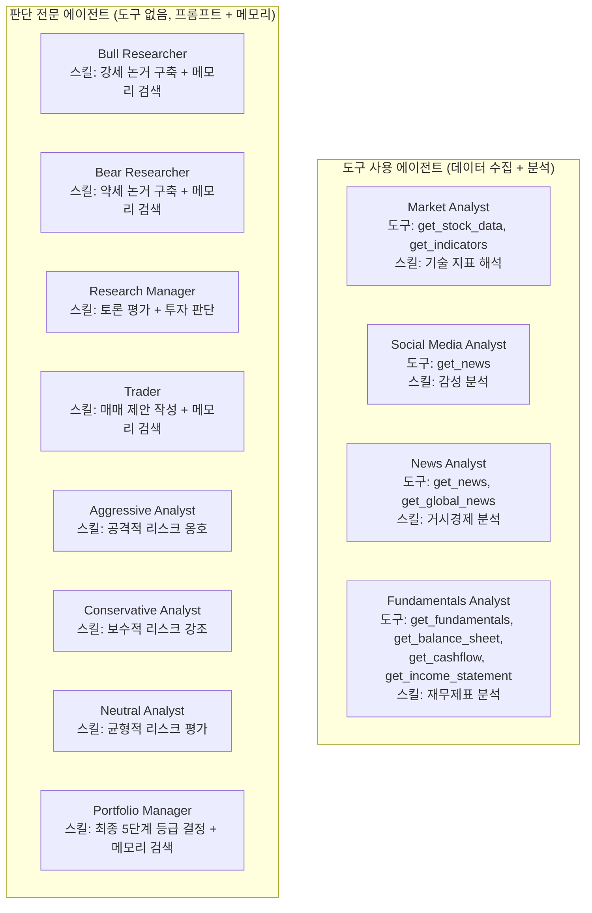
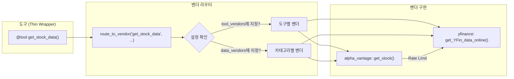
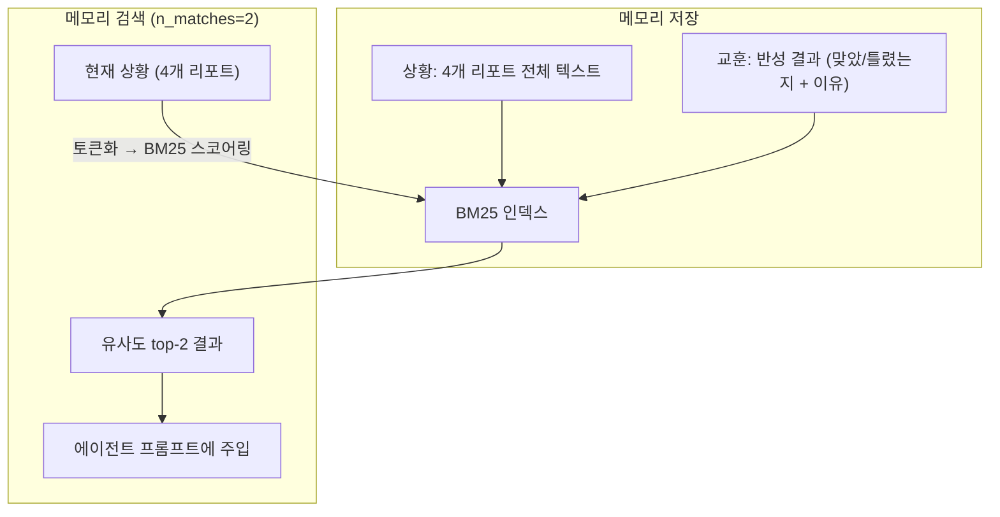

# TradingAgents - 에이전트별 도구와 스킬 상세 분석

## 전체 에이전트 맵

TradingAgents에는 **10개의 에이전트**가 있고, 크게 **"도구 사용 에이전트"** 와 **"판단 전문 에이전트"** 로 나뉜다.



핵심 포인트: **도구(외부 API 호출)가 있는 에이전트는 4개뿐**이고, 나머지 6개는 순수하게 **프롬프트 엔지니어링 + 메모리 검색**으로만 동작한다.

---

## 도구(Tool) 상세 분석

### 도구 목록 전체

총 **9개 도구**, 4개 카테고리:

| 카테고리 | 도구 | 입력 | 출력 | 사용 에이전트 |
|---------|------|------|------|-------------|
| **주가 데이터** | `get_stock_data` | symbol, start_date, end_date | OHLCV CSV | Market Analyst |
| **기술 지표** | `get_indicators` | symbol, indicator, curr_date, look_back_days | 지표 데이터 | Market Analyst |
| **뉴스** | `get_news` | ticker, start_date, end_date | 뉴스 목록 | Social/News Analyst |
| **글로벌 뉴스** | `get_global_news` | curr_date, look_back_days, limit | 글로벌 뉴스 | News Analyst |
| **내부자 거래** | `get_insider_transactions` | ticker | 내부자 매매 내역 | (도구 정의만 있고 에이전트에 미바인딩) |
| **펀더멘탈** | `get_fundamentals` | ticker, curr_date | 기업 개요 | Fundamentals Analyst |
| **재무상태표** | `get_balance_sheet` | ticker, freq, curr_date | 재무상태표 | Fundamentals Analyst |
| **현금흐름표** | `get_cashflow` | ticker, freq, curr_date | 현금흐름표 | Fundamentals Analyst |
| **손익계산서** | `get_income_statement` | ticker, freq, curr_date | 손익계산서 | Fundamentals Analyst |

### 도구 구현 방식: 벤더 라우팅 패턴

모든 도구는 **Thin Wrapper** → **벤더 라우터** → **실제 구현** 3단 구조다:



**코드** (`interface.py:134-162`):
```python
def route_to_vendor(method, *args, **kwargs):
    category = get_category_for_method(method)
    vendor_config = get_vendor(category, method)     # 설정에서 벤더 결정
    primary_vendors = [v.strip() for v in vendor_config.split(',')]

    # 폴백 체인: 프라이머리 → 나머지 가용 벤더
    for vendor in fallback_vendors:
        try:
            return impl_func(*args, **kwargs)
        except AlphaVantageRateLimitError:
            continue  # Rate limit만 폴백 트리거
```

**마이그레이션 포인트**: 이 벤더 라우팅 패턴은 도메인 독립적이다. 금융이 아닌 다른 도메인에서도 "여러 데이터 소스를 설정으로 교체 + 폴백"하는 패턴으로 재사용 가능.

---

## 에이전트별 스킬 상세

### 1. Market Analyst - 기술 지표 전문가

**도구**: `get_stock_data`, `get_indicators`
**스킬**: LLM이 13개 기술 지표 중 최적 8개를 선택하여 분석

```
지원 지표:
├── 이동평균: close_50_sma, close_200_sma, close_10_ema
├── MACD: macd, macds, macdh
├── 모멘텀: rsi
├── 변동성: boll, boll_ub, boll_lb, atr
└── 거래량: vwma
```

**동작 흐름**:
1. LLM이 시장 상황에 맞는 지표 8개를 자체 판단하여 선택
2. `get_stock_data` 호출로 OHLCV 데이터 수집
3. `get_indicators`를 선택한 지표별로 호출
4. 수집된 데이터를 바탕으로 **상세 기술 분석 리포트** + **마크다운 요약 테이블** 작성

**프롬프트 핵심** (`market_analyst.py:22-47`):
```
"Select up to 8 indicators that provide complementary insights 
without redundancy... Write a very detailed and nuanced report 
of the trends you observe. Provide specific, actionable insights 
with supporting evidence."
```

**마이그레이션 가치**: ★★★★☆
- LLM이 "어떤 도구를 어떤 순서로 호출할지" 자체 판단하는 패턴이 좋다
- 지표 목록을 프롬프트에 상세히 설명하여 LLM이 적절히 선택하게 하는 방식은 범용적

---

### 2. Social Media Analyst - 감성 분석가

**도구**: `get_news`
**스킬**: 뉴스/SNS 데이터에서 기업별 감성 추출

**프롬프트 핵심** (`social_media_analyst.py:15-17`):
```
"analyzing social media posts, recent company news, and public 
sentiment... analyzing sentiment data of what people feel each 
day about the company"
```

**마이그레이션 가치**: ★★★☆☆
- 실제로는 `get_news` 하나만 쓰고, LLM이 뉴스 텍스트에서 감성을 추론
- 진짜 SNS API (Twitter/Reddit)가 연결되어 있지는 않음 - 이름과 달리 뉴스 기반

---

### 3. News Analyst - 거시경제 분석가

**도구**: `get_news`, `get_global_news`
**스킬**: 기업 뉴스 + 글로벌 뉴스를 종합하여 거시경제 영향 분석

**프롬프트 핵심** (`news_analyst.py:21-22`):
```
"analyzing recent news and trends... comprehensive report of the 
current state of the world that is relevant for trading and 
macroeconomics"
```

**마이그레이션 가치**: ★★★☆☆
- Social Analyst와 도구가 겹침 (`get_news`)
- 차별점은 `get_global_news`로 거시경제 뉴스를 추가 수집하는 것

---

### 4. Fundamentals Analyst - 재무제표 분석가

**도구**: `get_fundamentals`, `get_balance_sheet`, `get_cashflow`, `get_income_statement`
**스킬**: 4대 재무제표를 종합 분석

**마이그레이션 가치**: ★★★★☆
- 재무 데이터를 체계적으로 수집하는 도구 세트가 잘 구성됨
- `freq` 파라미터로 연간/분기별 전환 지원

---

### 5-6. Bull/Bear Researcher - 토론 에이전트 쌍

**도구**: 없음 (순수 프롬프트 + 메모리)
**스킬**: 
- 4명의 애널리스트 리포트를 전부 읽고 강세/약세 논거 구축
- BM25 메모리에서 유사 과거 사례 top-2 검색하여 참고
- 상대방 주장에 직접 반박

**프롬프트 설계 핵심** (`bull_researcher.py:22-39`):
```
Key points to focus on:
- Growth Potential: 성장 잠재력
- Competitive Advantages: 경쟁 우위
- Positive Indicators: 긍정 지표
- Bear Counterpoints: ★ 반대 주장 반박 (핵심)
- Engagement: 토론식으로 (리스트 나열 금지)

Resources: [4개 애널리스트 리포트 전체]
Last bear argument: [상대방 마지막 주장]
Reflections from similar situations: [BM25 검색 결과]
```

**마이그레이션 가치**: ★★★★★
- **"반대 입장 에이전트" 패턴**은 금융 외 모든 의사결정에 적용 가능
- 프롬프트에서 "Engagement: 토론식으로" 강제하는 것이 효과적
- 메모리 주입 방식이 깔끔: 현재 상황 → BM25 → 과거 교훈 → 프롬프트에 삽입

---

### 7. Research Manager - 투자 심판

**도구**: 없음 (프롬프트 + 메모리)
**스킬**: Bull/Bear 토론 전체를 평가하고 BUY/SELL/HOLD 결정

**프롬프트 핵심** (`research_manager.py:23-41`):
```
"Avoid defaulting to Hold simply because both sides have valid 
points; commit to a stance grounded in the debate's strongest 
arguments."
```

**마이그레이션 가치**: ★★★★☆
- "Hold에 안주하지 말라"는 프롬프트 지시가 중요 - LLM은 기본적으로 안전한 답변을 선호하므로 명시적으로 결단을 강제
- 투자 계획까지 구체적으로 출력하게 함 (Recommendation + Rationale + Strategic Actions)

---

### 8. Trader - 매매 실행자

**도구**: 없음 (프롬프트 + 메모리)
**스킬**: Research Manager의 투자 계획 + 4개 리포트를 종합하여 구체적 매매 제안

**프롬프트 핵심** (`trader.py:33-34`):
```
"End with a firm decision and always conclude your response with 
'FINAL TRANSACTION PROPOSAL: **BUY/HOLD/SELL**'"
```

**마이그레이션 가치**: ★★★☆☆
- 구조화된 출력 강제 패턴 ("반드시 FINAL TRANSACTION PROPOSAL로 끝내라")
- 역할 자체는 Research Manager와 중복감이 있음

---

### 9-11. Risk Debate 팀 (Aggressive/Conservative/Neutral)

**도구**: 없음 (순수 프롬프트)
**스킬**: 트레이더의 매매 제안에 대해 3가지 리스크 관점으로 토론

**각 에이전트 프롬프트 핵심**:

| 에이전트 | 역할 | 핵심 지시 |
|---------|------|----------|
| Aggressive | 고위험 고수익 옹호 | "champion high-reward, challenge conservative caution" |
| Conservative | 자본 보호 강조 | "emphasize capital preservation, question aggressive optimism" |
| Neutral | 균형적 평가 | "balanced perspective, critique both extremes" |

**마이그레이션 가치**: ★★★★★
- **3자 토론 패턴**: 2자(찬/반)보다 풍부한 관점. 중립 에이전트가 양극단을 견제
- 다른 도메인 예시:
  - 아키텍처 결정: 성능 옹호 vs 유지보수성 옹호 vs 균형론
  - 우선순위 결정: 비즈니스 임팩트 vs 기술 부채 vs 실용주의

---

### 12. Portfolio Manager - 최종 결정자

**도구**: 없음 (프롬프트 + 메모리)
**스킬**: 리스크 토론 + 투자 계획 + 매매 제안을 종합하여 5단계 등급 최종 결정

**프롬프트 핵심** (`portfolio_manager.py:31-55`):
```
Rating Scale (use exactly one):
- Buy: Strong conviction to enter or add to position
- Overweight: Favorable outlook, gradually increase exposure
- Hold: Maintain current position, no action needed
- Underweight: Reduce exposure, take partial profits
- Sell: Exit position or avoid entry

Required Output Structure:
1. Rating: 5단계 중 하나
2. Executive Summary: 진입 전략, 포지션 사이징, 리스크 수준, 시간 지평
3. Investment Thesis: 분석가 토론에 근거한 상세 근거
```

**마이그레이션 가치**: ★★★★☆
- **구조화된 최종 출력 템플릿**: Rating + Summary + Thesis 3단 구조
- 5단계 등급은 이진(BUY/SELL)보다 미묘한 판단 표현에 유리

---

## 메모리 시스템 상세

### FinancialSituationMemory

**구현**: BM25Okapi (rank_bm25 라이브러리)
**저장 단위**: (상황 설명, 교훈/추천) 튜플



**코드** (`memory.py:57-92`):
```python
def get_memories(self, current_situation, n_matches=2):
    query_tokens = self._tokenize(current_situation)
    scores = self.bm25.get_scores(query_tokens)
    top_indices = sorted(range(len(scores)), 
                         key=lambda i: scores[i], reverse=True)[:n_matches]
    return [{"matched_situation": ..., "recommendation": ..., "similarity_score": ...}]
```

**5개의 독립 메모리 인스턴스**:
| 메모리 | 소유 에이전트 | 저장 내용 |
|--------|-------------|----------|
| `bull_memory` | Bull Researcher | 강세 판단의 성패 교훈 |
| `bear_memory` | Bear Researcher | 약세 판단의 성패 교훈 |
| `trader_memory` | Trader | 매매 결정의 성패 교훈 |
| `invest_judge_memory` | Research Manager | 투자 판단의 성패 교훈 |
| `portfolio_manager_memory` | Portfolio Manager | 최종 결정의 성패 교훈 |

**마이그레이션 가치**: ★★★★★

BM25 선택 이유가 코드 주석에 명시되어 있다 (`memory.py:1-5`):
```python
"""Uses BM25 algorithm for retrieval - no API calls,
no token limits, works offline with any LLM provider."""
```

- API 비용 제로 (벡터 임베딩 불필요)
- 오프라인 동작
- LLM 프로바이더 독립

---

## 반성(Reflection) 시스템 상세

**Reflector 클래스** (`reflection.py:6-120`)

거래 결과를 받으면 5개 에이전트 각각에 대해 반성을 실행:

```python
# 반성 프롬프트 구조 (reflection.py:14-46)
1. Reasoning:
   - 판단이 맞았는가? (수익 > 0 = correct)
   - 기여 요인 분석: [시장 데이터, 기술 지표, 가격 움직임, 
                      뉴스, 감성, 펀더멘탈] 각각의 가중치

2. Improvement:
   - 틀렸으면 어떻게 수정할 것인가?
   - 구체적 개선 액션 (예: "이 날 HOLD를 BUY로 바꿨어야 했다")

3. Summary:
   - 핵심 교훈 요약
   - 유사 상황에 적용할 수 있는 연결점

4. Query:
   - 교훈을 1000토큰 이내로 압축 (메모리 저장용)
```

**반성 흐름** (`trading_graph.py:269-285`):
```python
def reflect_and_remember(returns_losses):
    # quick_thinking_llm으로 반성 (비용 절약)
    reflector.reflect_bull_researcher(state, returns, bull_memory)
    reflector.reflect_bear_researcher(state, returns, bear_memory)
    reflector.reflect_trader(state, returns, trader_memory)
    reflector.reflect_invest_judge(state, returns, invest_judge_memory)
    reflector.reflect_portfolio_manager(state, returns, portfolio_manager_memory)
```

**마이그레이션 포인트**:
- 반성에 `quick_thinking_llm`(저렴한 모델)을 사용하여 비용 절약
- "수익 > 0이면 correct, 아니면 incorrect"이라는 **명확한 피드백 기준**이 중요
- 반성 결과를 1000토큰 이내로 압축하라는 지시 → 메모리 효율

---

## 마이그레이션 가치 종합 평가

### 바로 가져갈 수 있는 패턴 (프레임워크 독립적)

| 패턴 | 설명 | 구현 난이도 | 활용 범위 |
|------|------|-----------|----------|
| **찬/반 토론** | 의도적 반대 입장 에이전트로 편향 제거 | 낮음 | 모든 의사결정 |
| **3자 토론** | 공격/보수/중립 3관점으로 리스크 평가 | 낮음 | 리스크가 있는 결정 |
| **반성+메모리 루프** | 행동→결과→반성→메모리→다음행동 | 중간 | 반복적 판단 에이전트 |
| **벤더 라우팅** | 데이터 소스 교체+폴백을 설정으로 관리 | 낮음 | 외부 API 사용 시스템 |
| **quick/deep 모델 분리** | 데이터 수집은 저렴한 모델, 판단은 비싼 모델 | 낮음 | 모든 멀티에이전트 |
| **구조화된 최종 출력** | Rating + Summary + Thesis 템플릿 | 낮음 | 보고서 생성 에이전트 |
| **"Hold에 안주하지 말라" 지시** | LLM의 안전 편향을 명시적으로 견제 | 낮음 | 결단이 필요한 에이전트 |

### 개선하면서 가져갈 패턴

| 원본 | 개선 방향 | 효과 |
|------|----------|------|
| BM25 메모리 | 벡터 DB (Chroma, Qdrant) | 의미적 유사도 검색 가능 |
| 애널리스트 직렬 실행 | LangGraph fan-out 병렬 실행 | 레이턴시 50%+ 감소 |
| 고정 토론 라운드 | LLM 기반 "합의 도달" 판단으로 동적 종료 | 불필요한 라운드 절약 |
| 뉴스만 감성 분석 | 실제 SNS API (Reddit, Twitter) 연결 | 감성 데이터 품질 향상 |
| 인메모리 BM25 | Redis/DB에 영구 저장 | 세션 간 학습 유지 |

### 가져갈 필요 없는 부분

| 항목 | 이유 |
|------|------|
| LangChain `@tool` 데코레이터 | 프레임워크 종속적, 자체 도구 래퍼가 낫다 |
| `ChatPromptTemplate` 보일러플레이트 | 프레임워크 종속적, 직접 프롬프트가 더 유연 |
| `get_insider_transactions` | 정의만 되어 있고 어떤 에이전트에도 바인딩 안 됨 |
| Trader 에이전트 | Research Manager와 역할 중복, 하나로 합쳐도 됨 |
