# GenericAgent 심층 분석 — 3K 라인 자기진화 에이전트의 코드 레벨 해부

> **분석 대상**: [lsdefine/GenericAgent](https://github.com/lsdefine/GenericAgent)
> **커밋 시점**: 2026-04-26 (main, MIT)
> **관점**: 자체 에이전트를 개발·운영하는 SWE 입장에서 "어떻게 만들었나, 우리 시스템에 무엇을 옮겨올 수 있나"

---

## TL;DR — 핵심 한 문장

GenericAgent는 **9개의 원자 도구 + 100여 줄짜리 ReAct 루프 + 5계층 파일 메모리(L0~L4)** 만으로 LLM에게 OS/브라우저/모바일 풀 컨트롤을 주고, **태스크 수행 흔적을 마크다운 SOP로 결정화(crystallize)** 해 다음 호출에 재사용하는 — Scrapy/Cookbook 식의 "프레임워크 위에 사용자가 키워가는 도구"다. 코드량은 압도적으로 작지만(약 3K core), 그 미니멀리즘이 곧 컨텍스트 효율성과 모델 비종속성으로 직결된다.

---

## 목차

1. [프로젝트 개요](#1-프로젝트-개요)
2. [핵심 특징 및 차별점](#2-핵심-특징-및-차별점)
3. [아키텍처 분석](#3-아키텍처-분석)
4. [기술 스택](#4-기술-스택)
5. [핵심 코드 분석](#5-핵심-코드-분석)
6. [도구 시스템 (9 atomic tools)](#6-도구-시스템-9-atomic-tools)
7. [메모리 시스템 (L0~L4) — 진짜 차별점](#7-메모리-시스템-l0l4--진짜-차별점)
8. [LLM 라우팅·프롬프트 캐싱·페일오버](#8-llm-라우팅프롬프트-캐싱페일오버)
9. [브라우저 컨트롤 (TMWebDriver)](#9-브라우저-컨트롤-tmwebdriver)
10. [Subagent·Plan 모드·자율 운영](#10-subagent플랜-모드자율-운영)
11. [Reflect/Scheduler — 자율 실행 인프라](#11-reflectscheduler--자율-실행-인프라)
12. [확장성 및 프론트엔드](#12-확장성-및-프론트엔드)
13. [성능·토큰 효율](#13-성능토큰-효율)
14. [경쟁·비교 분석](#14-경쟁비교-분석)
15. [엔지니어 관점 종합 평가](#15-엔지니어-관점-종합-평가)
16. [우리 에이전트로 옮겨올 만한 것들](#16-우리-에이전트로-옮겨올-만한-것들)
17. [논문 보충 — 이론적 토대 (Context Information Density)](#17-논문-보충--이론적-토대-context-information-density)
18. [논문 보충 — 정량 벤치마크 결과](#18-논문-보충--정량-벤치마크-결과)
19. [논문 보충 — 형식화된 메커니즘](#19-논문-보충--형식화된-메커니즘)
20. [논문 보충 — Discussion의 4가지 발견](#20-논문-보충--discussion의-4가지-발견)
21. [논문 보충 — Case Studies (실전 워크플로 5종)](#21-논문-보충--case-studies-실전-워크플로-5종)

---

## 1. 프로젝트 개요

### 1.1 한 줄 정의
**"3K 라인 시드 코드에서 시작해 사용자별 스킬 트리를 키워가는 자율 에이전트 프레임워크"**.
저자 그룹은 **A3 Lab (Advantage AI Agent Lab)** — *Shenzhen Aquaintelling Technology + Fudan University 합작 랩*. Lead: **Jiaqing Liang**(푸단대 조교수, Aquaintelling AI 수석과학자), 총괄 감독: **Yanghua Xiao**(푸단대 정교수). 2026-01-16 v1.0 공개, 4월 시점 7K+ 스타. 2026-04-21 arXiv 2604.17091 기술리포트 공개. GenericAgent 자체가 본인의 코드를 자율적으로 작성·커밋하는 부트스트랩(self-bootstrap)을 시연했다고 보고됨.

### 1.2 해결하려는 문제 (Problem Statement)
기존 에이전트 프레임워크의 두 가지 모순:

| 진영 | 문제 |
|---|---|
| **헤비형** (LangGraph, AutoGPT, OpenManus 류) | 컨텍스트 200K~1M 토큰 소모. 수백~수천 모듈로 학습 곡선 가파름. 모델/벤더 종속. |
| **라이트형** (단순 ReAct 루프) | 매 세션마다 "컴퓨터 사용법"을 처음부터 학습. 누적이 안 됨. 태스크가 길어지면 컨텍스트 폭주. |

GenericAgent의 가설: **"적게 주입하고 많이 진화시켜라"** — 지식은 코드가 아니라 *사용자 디렉터리의 마크다운 SOP*에 누적되며, 도구는 9개로 충분하고, 새 도구는 LLM이 `code_run`으로 자기가 만든다.

### 1.3 탄생 배경
2026-04-21 arXiv 기술리포트(*"GenericAgent: A Token-Efficient Self-Evolving LLM Agent via Contextual Information Density Maximization"*)에 따르면 핵심 아이디어는 **"Contextual Information Density Maximization"** — 매 턴 모델이 보는 컨텍스트의 '비트당 의사결정 정보량'을 최대화한다는 정보이론적 관점.

---

## 2. 핵심 특징 및 차별점

### 2.1 Headline Numbers
- **Core LoC**: ≈3,300 (`agent_loop.py` 123 + `agentmain.py` 270 + `ga.py` 562 + `llmcore.py` 1008 + `simphtml.py` 870 + `TMWebDriver.py` 284 + 보조 ≈200)
- **Agent Loop**: 80여 라인의 단일 함수 `agent_runner_loop()` (`agent_loop.py:42`)
- **컨텍스트 윈도우**: 기본 28K (Native Claude) / 24K (그 외) — 200K~1M에 비해 자릿수 차이
- **도구 개수**: 9개 (대부분의 코딩 에이전트가 20~50개)
- **의존성**: `requests`, `beautifulsoup4`, `bottle`, `simple-websocket-server` — UI/봇은 옵셔널 extras

### 2.2 7가지 차별점

1. **Skill Crystallization** — 작업 끝나면 모델이 직접 `start_long_term_update` 호출 → SOP를 마크다운으로 누적. 다음 호출 때 같은 패턴이면 모델이 "그 SOP 읽고 한 줄 실행"으로 끝.
2. **5-Layer Memory (L0~L4)** — 단순 vector memory가 아니라, *역할별로 분리된 마크다운 파일 계층*. L1 인덱스(≤30라인)만 시스템 프롬프트에 항상 주입.
3. **9 Atomic Tools** — `code_run` 하나로 어떤 새 도구든 정의 가능 (Python 실행). 도구 폭증을 회피.
4. **Browser Injection (not headless)** — Selenium/Playwright 대신 Chrome 확장 프로그램으로 *사용자가 로그인된 실제 브라우저*에 WebSocket 주입.
5. **Provider-Agnostic LLM Router** — Claude/OpenAI/GLM/Kimi/MiniMax/Gemini 어떤 SSE든 받아 통일된 `MockResponse`로 변환. 페일오버 + 프롬프트 캐시 자동.
6. **Plan Mode + Subagent Verifier** — Claude Code식 plan 모드를 마크다운 체크리스트로 구현, "verify subagent"가 독립 검증 후에야 완료 선언 가능.
7. **Reflect/Scheduler** — `agentmain.py --reflect <script.py>` 모드로 cron/이벤트 기반 자율 실행. `INTERVAL` 변수만 두면 watchdog처럼 동작.

---

## 3. 아키텍처 분석

### 3.1 전체 시스템 구조

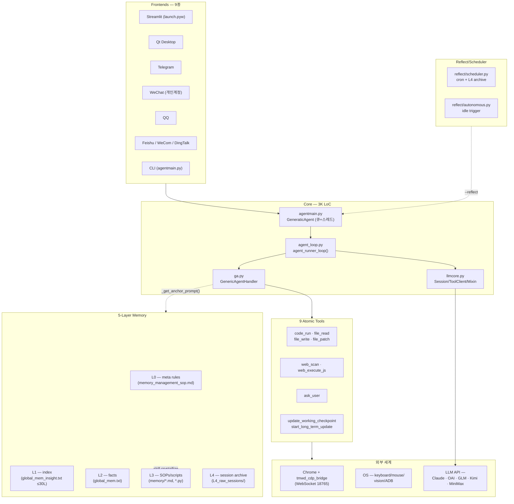

### 3.2 한 턴(turn) 데이터 흐름

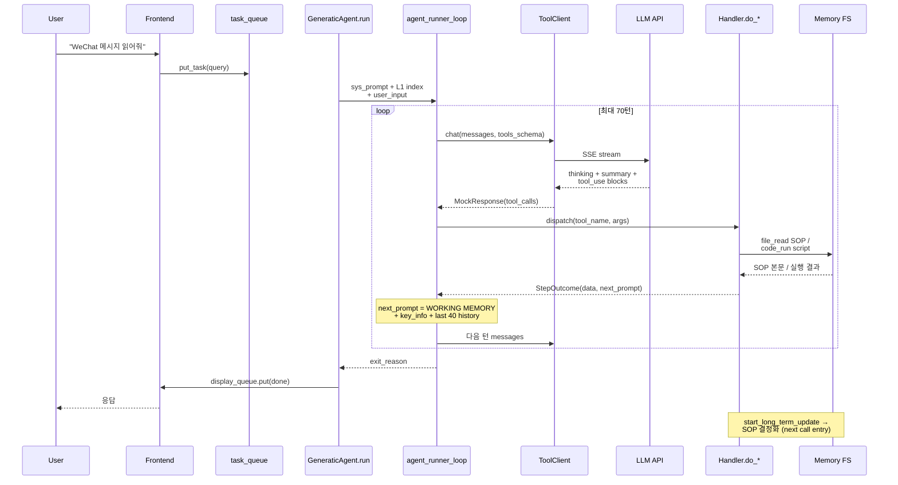

### 3.3 핵심 클래스 모델

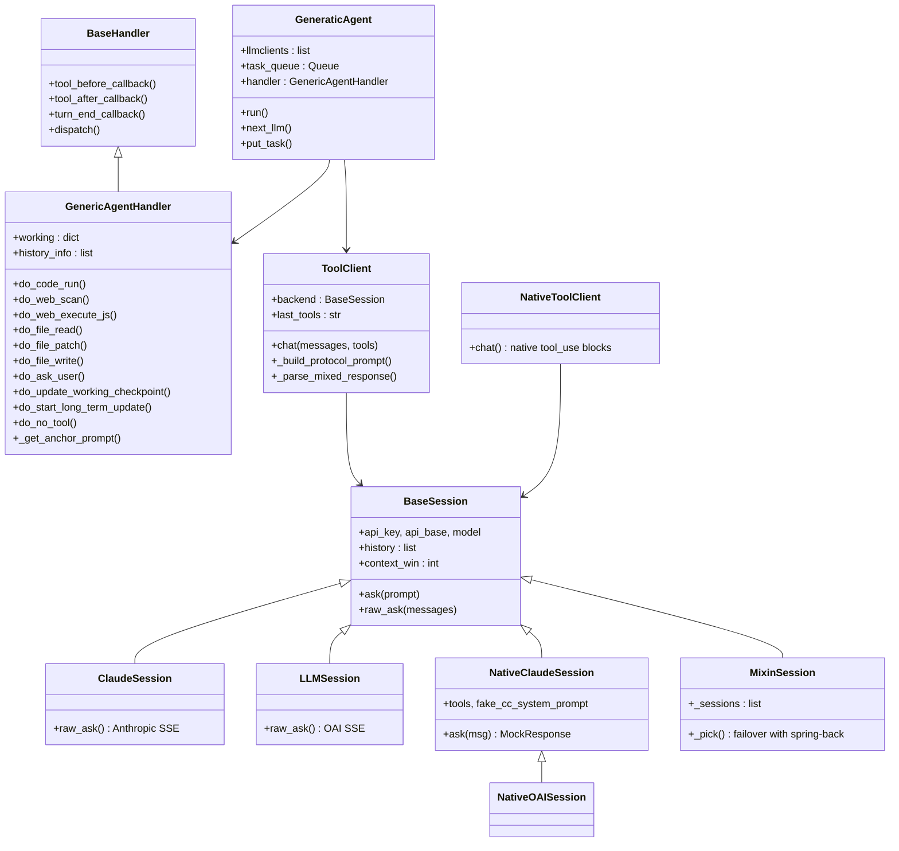

---

## 4. 기술 스택

### 4.1 언어·런타임
- **Python 3.10~3.13** (단일 언어, 빌드 단계 없음)
- `pyproject.toml` 명시적 가이드: *"AI install hint: choose deps by OS/env + needed ui/bot. do NOT install all"* — 에이전트 자기 자신이 필요한 패키지를 `pip install`로 설치하는 자기부트스트랩 철학.

### 4.2 의존성 매트릭스

| 카테고리 | 패키지 | 용도 |
|---|---|---|
| **Core (≈4개)** | `requests`, `beautifulsoup4`, `bottle`, `simple-websocket-server` | HTTP/HTML/HTTP server/WS server |
| **UI (옵셔널)** | `streamlit`, `pywebview` | 웹 UI 데스크톱 래핑 |
| **봇 (옵셔널)** | `python-telegram-bot`, `qq-botpy`, `lark-oapi`, `wecom-aibot-sdk`, `dingtalk-stream`, `pycryptodome`, `qrcode` | 6대 메신저 어댑터 |
| **OS 제어 (Windows)** | `pywin32`, `Pillow`, `opencv-python`, `numpy` | 키보드·마우스·스크린샷·OCR |
| **모바일** | `adb` 바이너리 (Python 의존 없음) | `memory/adb_ui.py`에서 subprocess로 호출 |

### 4.3 빌드/패키지
- **빌드 단계 없음** — `setuptools` 기반 `pyproject.toml`이지만 `py-modules = []`. 즉 *소스 트리에서 직접 실행하는 것을 의도*.
- 설치 진입점도 따로 없고 `python launch.pyw` / `python agentmain.py`가 표준.

---

## 5. 핵심 코드 분석

### 5.1 `agent_loop.py` — 에이전트 루프의 모든 것 (123 라인)

루프의 본체는 `agent_runner_loop` 함수 단 하나. 핵심 로직을 발췌·해설하면:

```python
# agent_loop.py:42
def agent_runner_loop(client, system_prompt, user_input, handler,
                     tools_schema, max_turns=40, verbose=True, ...):
    messages = [{"role": "system", "content": system_prompt},
                {"role": "user", "content": user_input}]
    turn = 0
    while turn < handler.max_turns:
        turn += 1
        if turn % 10 == 0: client.last_tools = ''   # ★ 10턴마다 도구 스키마 재주입
        response_gen = client.chat(messages=messages, tools=tools_schema)
        response = yield from response_gen   # SSE 스트림 그대로 yield

        if not response.tool_calls:
            tool_calls = [{'tool_name': 'no_tool', 'args': {}}]   # ★ no-tool도 처리
        else:
            tool_calls = [...]

        for tc in tool_calls:
            gen = handler.dispatch(tool_name, args, response, index=ii)
            outcome = (yield from proxy()) if verbose else exhaust(proxy())
            if outcome.should_exit: ...; break
            if not outcome.next_prompt: ...; break    # ★ task done 신호
            ...
        next_prompt = handler.turn_end_callback(...)
        messages = [{"role": "user", "content": next_prompt,
                     "tool_results": tool_results}]   # ★ 매 턴 messages를 갈아끼운다
```

**SWE 관점 포인트**:

1. **Generator-based streaming** (`yield from`) — 모든 도구 결과·LLM 출력이 generator로 흘러나와 프론트엔드에 실시간 푸시.
2. **History는 LLM session 안에**: `messages = [{...new...}]` — 즉, *루프는 매 턴 새 messages를 만들고, 진짜 history는 `client.backend.history`가 보관*. 이중 관리.
3. **`no_tool` 가상 도구** — 모델이 도구를 안 부른 경우조차 `do_no_tool`로 분기해 "왜 안 불렀는지(끝났나? 빈 응답인가? 코드만 출력했나?)" 후처리.
4. **10턴 트릭** — `if turn % 10 == 0: client.last_tools = ''` — 도구 스키마(긴 JSON)는 매번 보내면 토큰 낭비라 *내부적으로 prefix 캐시 후 같은 내용이면 한 줄 요약으로 대체*. 10턴마다 한 번씩 다시 풀로 보내 모델이 잊지 않게 한다.

### 5.2 `agentmain.py` — 진입점 + 큐 + LLM 풀

```python
# agentmain.py:42
class GeneraticAgent:
    def __init__(self):
        self.task_queue = queue.Queue()
        self.is_running = False; self.stop_sig = False
        self.handler = None; self.verbose = True
        self.load_llm_sessions()        # ← 멀티 모델 로드

    def load_llm_sessions(self):
        for k, cfg in mykeys.items():
            if 'native' in k and 'claude' in k:
                llm_sessions += [NativeToolClient(NativeClaudeSession(cfg=cfg))]
            elif 'native' in k and 'oai' in k:
                llm_sessions += [NativeToolClient(NativeOAISession(cfg=cfg))]
            elif 'claude' in k:
                llm_sessions += [ToolClient(ClaudeSession(cfg=cfg))]
            elif 'oai' in k:
                llm_sessions += [ToolClient(LLMSession(cfg=cfg))]
            elif 'mixin' in k:
                llm_sessions += [{'mixin_cfg': cfg}]
        # mixin은 두 번째 패스에서 처리
```

`mykey.py`의 변수명 substring으로 모델 클래스를 dispatch하는 단순 라우팅. `mykey_template.py`(425줄)는 사실상 사용자 매뉴얼이며 **운영 변수의 단일 진실원**. 운영 중에 `/session.reasoning_effort=high` 같은 **slash command로 즉시 setattr** 가능 (`agentmain.py:115` 부근).

3가지 실행 모드:

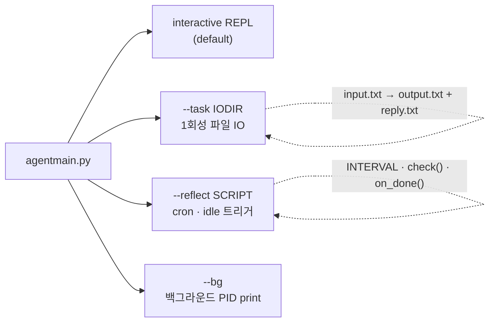

`--task` 모드는 **subagent의 IPC 표준** — 부모 에이전트가 자식을 띄우고 input/output 파일로 대화. (§10에서 자세히)

### 5.3 `ga.py` — Handler + Tool 구현 본체 (562 라인)

`GenericAgentHandler`가 `do_*` 메서드 컨벤션으로 도구 디스패치:

| 도구명 | 구현 라인 | 핵심 트릭 |
|---|---|---|
| `do_code_run` | `ga.py:280` | `inline_eval=True`면 현재 프로세스 `eval/exec` (handler/parent 직접 접근). 그 외엔 `subprocess.Popen` + `code_run_header.py` 자동 prepend |
| `do_web_scan` | `ga.py:312` | `simphtml.get_html(maxchars=35000, cutlist=True)` — 리스트형 페이지 자동 잘라내기 |
| `do_web_execute_js` | `ga.py:326` | `script` 인자가 파일 경로면 파일에서 읽음. `save_to_file`로 긴 결과 디스크 저장 |
| `do_file_patch` | `ga.py:354` | `old_content`가 *unique*하지 않으면 거부. 1회 매치 강제로 안전성↑ |
| `do_file_write` | `ga.py:368` | `<file_content>` XML 태그 또는 `\`\`\`...\`\`\``에서 추출. `{{file:path:start:end}}` 자동 expand |
| `do_no_tool` | `ga.py:442` | "큰 코드블록만 있고 도구콜 없음" 패턴 감지해 *재요청 프롬프트* 자동 생성 (재미있는 휴리스틱) |

#### 5.3.1 `_get_anchor_prompt` — 매 턴 워킹 메모리 주입

```python
# ga.py:509
def _get_anchor_prompt(self, skip=False):
    if skip: return "\n"
    h_str = "\n".join(self.history_info[-40:])
    prompt = f"\n### [WORKING MEMORY]\n<history>\n{h_str}\n</history>"
    prompt += f"\nCurrent turn: {self.current_turn}\n"
    if self.working.get('key_info'): prompt += f"\n<key_info>{...}</key_info>"
    if self.working.get('related_sop'): prompt += f"\n... 다시 read {related_sop}"
    return prompt
```

**핵심**: 매 도구 호출 후 *이전 40개 요약(history_info)* + *update_working_checkpoint로 적은 key_info* + *현재 턴 카운터*를 next_prompt 앞에 붙인다. 이게 GenericAgent의 **"비휘발성 워킹 메모리"** 정체.

#### 5.3.2 `turn_end_callback` — 진행 가드

```python
# ga.py:521
if turn % 65 == 0: next_prompt += "[DANGER] 65턴 도달 — ask_user 강제..."
elif turn % 7 == 0: next_prompt += "[DANGER] 7턴 — 무효 재시도 금지, 전략 전환..."
elif turn % 10 == 0: next_prompt += get_global_memory()   # L1 인덱스 재주입

if injkeyinfo := consume_file(self.parent.task_dir, '_keyinfo'):
    self.working['key_info'] += f"\n[MASTER] {injkeyinfo}"   # ★ 외부 IPC 주입
```

루프 길이별 가드(7/10/65턴)와 **부모 에이전트가 `_keyinfo`/`_intervene` 파일을 떨어뜨리면 다음 턴에 즉시 합류**하는 IPC가 같은 콜백 안에 공존.

### 5.4 `llmcore.py` — 1008 라인의 LLM 호환층 (§8에서 별도 분석)

### 5.5 `simphtml.py` — HTML 토큰 다이어트 (870 라인)

JS 측 `optHTML`(브라우저에서 실행)와 Python 측 `optimize_html_for_tokens` + `smart_truncate`의 2단 압축. 핵심 로직:

1. **JS 단계**: 가시성 검사(`getBoundingClientRect`, `computedStyle`) → `display:none`/`visibility:hidden`/`opacity:0`/뷰포트 밖 요소 제거. iframe 동일 출처 자동 펼침. Shadow DOM 평탄화.
2. **Python 단계**: `findMainList`로 *반복되는 동일 구조 리스트 5개 이상 찾으면 상위 3개만 남기고 [FAKE ELEMENT] 힌트 삽입* — 페이지네이션·검색결과 토큰 폭탄 방지.
3. **smart_truncate**: 단일 자식 노드는 재귀 침투, 분기점에서 top-3가 over를 감당 가능하면 비율로 분배, 아니면 꼬리부터 제거.

이 모듈만 떼서 일반 RAG 전처리에 써도 좋을 정도로 잘 다듬어져 있다.

---

## 6. 도구 시스템 (9 atomic tools)

### 6.1 도구 목록과 설계 의도

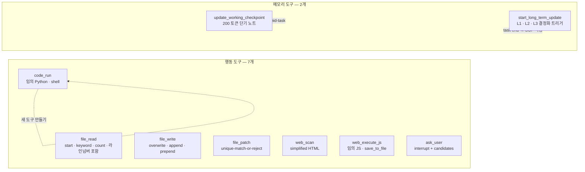

### 6.2 설계의 두 가지 결정적 선택

#### 6.2.1 "Code is the universal tool"
`code_run`은 Python을 임의로 실행한다. 즉 *별도 도구가 필요 없다* — `requests` 호출, OS 명령, OCR, Vision API 호출, ADB 셸... 모두 `code_run` 안에서 한다. SOP가 누적되면서 자주 쓰는 패턴은 `memory/*.py`에 함수로 결정화된다.

```python
# assets/code_run_header.py가 모든 code_run 앞에 prepend됨
sys.path.append(os.path.join(..., '..', 'memory'))   # ★ memory/*.py 자동 import 가능
subprocess.run = _run                                # encoding fix wrapper
sys.excepthook = ...                                 # ImportError에 "pip부터 깔아라" 힌트
```

이 헤더가 SOP에서 정의한 도구를 import 한 줄로 부를 수 있게 한다. 즉 `memory/skill_search/`처럼 디렉터리 단위 모듈도 `import skill_search` 하나면 끝.

#### 6.2.2 "Web JS는 1급 시민"
`web_execute_js`는 단순 도구가 아니라 **권장 우선순위 #1**. `web_scan`은 HTML 페이로드가 크기 때문에 가능하면 JS 한 줄로 끝내라는 가이드가 도구 설명·SOP에 박혀 있다:

> *"act accurately to reduce web_scan calls"*
> *"应当多用 execute_js, 少全量观察 html"*

이것이 30K 컨텍스트로 OS-제어 에이전트가 동작하는 비결의 절반.

### 6.3 도구 스키마의 미시 디테일

`assets/tools_schema.json`(73줄)에서 눈여겨볼 점:

- `code_run`의 `script` 필드는 **"reply code block과 상호 배타"**. 즉 모델이 답변 본문에 \`\`\`python ... \`\`\` 블록을 적으면 그게 자동 코드로 인식되고, `script` 인자에 다시 적으면 **이중 정의** → 거부. 이는 모델이 코드 블록을 자연스럽게 답변에 쓰도록 유도하면서 토큰을 아끼는 트릭.
- `file_write`는 `<file_content>...</file_content>`를 **답변 본문에 먼저 두고** 호출해야 한다. 도구 인자에 큰 텍스트를 넣으면 JSON 이스케이프 비용이 크기 때문.
- `update_working_checkpoint`의 description에 *"<200 tokens"*, *"prefer over-updating over losing key info"* 같은 운영 가이드가 박혀 있어 **스키마가 곧 사용 매뉴얼** 역할.

---

## 7. 메모리 시스템 (L0~L4) — 진짜 차별점

### 7.1 5계층 구조

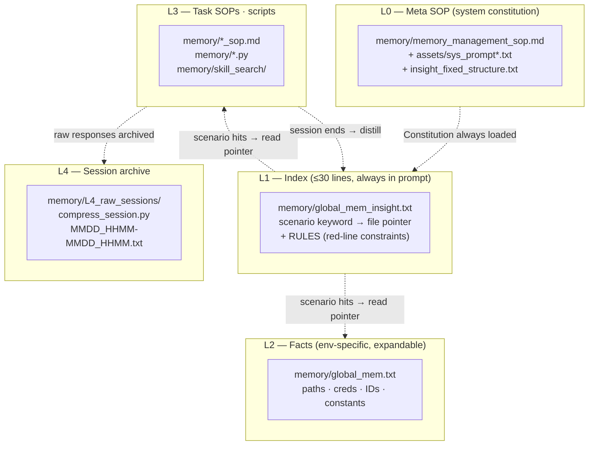

### 7.2 각 계층의 역할과 운영 규칙

| 계층 | 파일 | 크기 제약 | 항상 주입? | 작성 규칙 |
|---|---|---|---|---|
| **L0** | `memory_management_sop.md` 외 | — | 시스템 프롬프트로 1회 | "행동 검증된 정보만", "신성불가침", "휘발성 상태 금지" — 4가지 공리 |
| **L1** | `global_mem_insight.txt` | **≤30 라인 hard cap** | 매 턴 (10턴마다 재주입) | *키워드 → 파일 포인터*만. how-to 금지 |
| **L2** | `global_mem.txt` | 무제한 (확장 OK) | L1이 가리킬 때만 read | `## [SECTION]`으로 조직된 사실들 |
| **L3** | `memory/*.md`, `*.py` | 태스크별 | 필요시 read | *유틸 스크립트 + 핵심 함정 + 전제조건*. 튜토리얼 금지 |
| **L4** | `L4_raw_sessions/*.txt` | 자동 압축 | retrieve 필요시 | scheduler가 12시간마다 자동 archive |

### 7.3 SOP의 실제 모습

이 레포에서 가장 흥미로운 부분은 **L3 SOP들이 '저자가 GenericAgent에게 가르친 비결'을 그대로 마크다운으로 박제해 놓았다는 점**:

- `tmwebdriver_sop.md` — Chrome 확장 사용법, `isTrusted` 우회, CDP 브리지, 파일 업로드, 배경 탭 throttling 등 — **즉 저자가 해당 작업을 하다 GenericAgent가 막혔던 지점들의 증류물**
- `plan_sop.md` — Claude Code 스타일 plan 모드, plan_xxx/ 디렉터리 사용법, verify subagent
- `verify_sop.md` — 검증의 두 가지 실패 모드 ("verification avoidance"와 "前80% 미혹") + 산출물별 검증 액션 매트릭스
- `subagent.md` — 부모/자식 에이전트 IPC, map-reduce 패턴, plan_mode 중첩
- `autonomous_operation_sop.md` — "사용자 부재 시 자율 모드" — TODO 큐, 권한 경계, 회수 절차

**SWE 관점**: 이 SOP들은 단순 prompt가 아니라 *프로젝트의 운영 지식 베이스* 그 자체다. 코드 3K 라인 + SOP의 단순 합산이 GenericAgent의 진짜 "능력"이고, 그 SOP는 대부분 모델이 직접 작성/갱신했다는 점에서 자기진화의 본체.

### 7.4 메모리 결정화 흐름

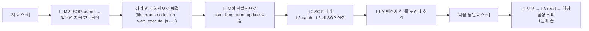

`do_start_long_term_update`(`ga.py:492`)는 모델에게 *"환경 사실 → L2 file_patch", "복잡한 경험 → L3 SOP"*만 권하고, 임시값/과정/검증 안 된 정보는 명시적으로 거부 시킨다.

---

## 8. LLM 라우팅·프롬프트 캐싱·페일오버

### 8.1 모델 호환층의 본질

`llmcore.py`의 1000줄은 본질적으로 **"5개 LLM API의 SSE를 하나의 추상으로 정규화"**. 의외로 이게 GenericAgent의 핵심 자산이라고 생각한다.

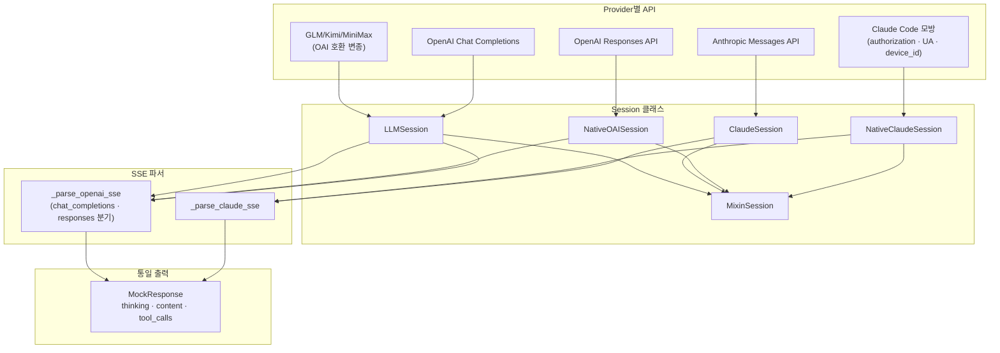

### 8.2 Native vs 비-Native 두 갈래

`mykey_template.py`의 풀 매뉴얼이 가장 깔끔히 설명한다:

- **Native***Session*: 도구를 **API의 정식 `tools` 필드**로 보냄 (function calling). Claude Code/Codex가 쓰는 방식. *Anthropic Opus/Sonnet은 해당 필드에 overfit되어 있어* 텍스트 도구 프로토콜은 효과 떨어짐.
- **비-Native***Session*: 도구 설명을 **system 본문에 텍스트로** 박음. 호환성 더 큼.

코드에서:
```python
# llmcore.py:790
def _build_protocol_prompt(self, messages, tools):
    tool_instruction = self._prepare_tool_instruction(tools)
    system = system_content + tool_instruction
    user = ""
    for m in history_msgs:
        user += f"=== {role} ===\n"
        for tr in m.get('tool_results', []):
            user += f'<tool_result>{tr["content"]}</tool_result>\n'
        user += str(m['content']) + "\n"
    user += "=== ASSISTANT ===\n"
    return system + user
```

비-Native는 사실상 **싱글-턴 텍스트 프롬프트**로 만들어 버린다. 저장된 history는 `=== USER === ... === ASSISTANT === ...` 식 마커로 직렬화. 이는 prefix cache에 매우 친화적인 구조.

### 8.3 프롬프트 캐싱 전략

#### Anthropic 측
`ClaudeSession.make_messages` (`llmcore.py:578`):
```python
user_idxs = [i for i, m in enumerate(msgs) if m['role'] == 'user']
for idx in user_idxs[-2:]:
    msgs[idx]["content"][-1] = dict(..., cache_control={"type": "ephemeral"})
```
**최근 2개 user 메시지의 마지막 블록에만 cache_control 부착** — Anthropic 캐시 ttl이 5분이니, 가장 최근 prefix를 절단점으로 잡아 그 이전을 모두 캐시 hit 시키는 패턴.

`NativeClaudeSession`은 `prompt-caching-scope-2026-01-05` beta까지 활성화하고, system 프롬프트는 `cache_control: ephemeral`로 항상 캐시.

#### OpenAI 측
Chat Completions: `prompt_cache_key` 자동 부여 (`_RESP_CACHE_KEY = uuid.uuid4()` 한 번 생성, 프로세스 생존 동안 유지) — 같은 base prompt면 캐시 hit.

#### claude2oai 변환기
`_msgs_claude2oai` (`llmcore.py:452`)와 `_to_responses_input` (`llmcore.py:416`)는 같은 history를 두 형식 사이에 양방향 변환. **Mixin에서 Claude→OpenAI 페일오버 시에도 history가 유지**되는 게 이 덕분.

### 8.4 MixinSession — 실전 페일오버

```python
# llmcore.py:899
class MixinSession:
    def _pick(self):
        if self._cur_idx and time.time() - self._switched_at > self._spring_sec:
            self._cur_idx = 0   # ★ spring-back
        return self._cur_idx

    def _raw_ask(self, *args, **kwargs):
        for attempt in range(self._retries + 1):
            idx = (base + attempt) % n
            gen = self._orig_raw_asks[idx](*args, **kwargs)
            ... # !!!Error 감지하면 다음 세션으로
            if not is_err:
                if attempt > 0: self._cur_idx = idx; self._switched_at = time.time()
                return return_val
```

핵심:
1. **Spring-back**: 한번 secondary로 떨어졌어도 5분(`_spring_sec`) 후엔 자동으로 primary 복귀.
2. **Stream-aware**: SSE 첫 청크 yield 후 에러가 나면 이미 표시된 부분을 보존하고 다음 시도.
3. **Cross-provider**: Native끼리 또는 비-Native끼리만 mix 가능 (assertion). 즉 **Claude Code 모방 모델 + 일반 Anthropic + Kimi**를 같은 풀에 넣고 자동 fallback 가능.

운영 측면에서 보면, 이 MixinSession은 가장 즉시 차용할 만한 컴포넌트. 흔한 LiteLLM/Portkey가 하는 일을 200줄로 한다.

### 8.5 Compaction (컨텍스트 다이어트)

`compress_history_tags` (`llmcore.py:33`):
- 5번 호출마다 1번 실행 (`_cd % 5`)
- 오래된 메시지 안의 `<thinking>`, `<tool_use>`, `<tool_result>`, `<history>`, `<key_info>` 태그 내용을 800자 cap으로 잘라냄 (앞 절반 + `[Truncated]` + 뒷 절반)
- `trim_messages_history`는 컨텍스트가 `context_win * 3` 초과시 force compaction → 그래도 넘으면 가장 오래된 user/assistant 쌍부터 pop

**관전포인트**: *"오래된 thinking을 잘라낸다"*는 결정. 모델은 자기 thinking을 다시 보지 않아도 결론(content)으로 충분하다는 가정. 이게 30K 컨텍스트로도 70턴 루프가 굴러가는 이유.

---

## 9. 브라우저 컨트롤 (TMWebDriver)

### 9.1 설계 철학 — "사용자 브라우저 그대로"

Selenium/Playwright는 *별도 인스턴스*를 띄운다 → 로그인 안 됨, 쿠키 따로, 봇 디텍션. GenericAgent는 정반대로 **사용자가 평소 쓰는 Chrome에 확장으로 침투**:

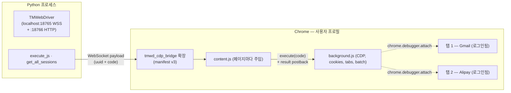

### 9.2 세 가지 통신 모드

`TMWebDriver` (`TMWebDriver.py`)는 동일 `Session` 추상으로 3종 클라이언트를 받는다:

| 타입 | 용도 | 메커니즘 |
|---|---|---|
| `ws` | 일반 페이지 (UserScript) | WebSocket 양방향 |
| `ext_ws` | 확장 background.js | WebSocket + tabs 전체 동기화 |
| `http` | long-poll (확장 못 쓰는 환경) | 5초 long-poll |

`execute_js`는 세션 타입에 따라 분기 실행하고 ack/timeout/세션 점프 감지까지 처리한다. 코드를 보면 *세션이 페이지 새로고침으로 "reload"되면 자동 감지해 `Session reloaded` 신호를 반환*하는 등 실전 디테일이 풍부.

### 9.3 CDP 브리지 — JS의 한계 돌파

`assets/tmwd_cdp_bridge/` 확장(393라인 background.js)은 Chrome DevTools Protocol을 노출해, 다음 같은 *순수 JS로는 불가능*한 작업을 가능케:
- `<input type=file>`에 파일 강제 주입 (`DOM.setFileInputFiles`)
- `isTrusted=true` 이벤트 (popup 막히는 사이트 우회)
- HttpOnly 쿠키 읽기
- 크로스오리진 iframe 접근

호출 방식이 깔끔하다 — `web_execute_js`의 `script` 인자에 *JSON 문자열*을 넘기면 자동 라우팅:
```js
web_execute_js(script='{"cmd": "cdp", "method": "DOM.setFileInputFiles", "params": {...}}')
```
Batch 명령(`{cmd:"batch", commands:[...]}`)으로 한 라운드트립에 여러 CDP 호출 묶기 + `$N.path`로 결과 참조까지 지원.

### 9.4 simphtml — JS 측 + Python 측 2단 다이어트

JS 측 `optHTML` (`simphtml.py:4` 부근)은:
- `ignoreTags = [SCRIPT, STYLE, NOSCRIPT, META, LINK, ...]` 제거
- `getBoundingClientRect` + `getComputedStyle`로 가시성 검증
- z-index 큰 floating div, 박스 영역 0인 노드 제외
- `INPUT`/`TEXTAREA`의 현재 `value` 속성으로 박제 (스크래핑 후에도 사용자 입력 보존)

Python 측 `findMainList`는 *반복 동일 구조 5개 이상이면 상위 3개만* 표시 + `[FAKE ELEMENT] N more items hidden` 힌트. 이게 검색 결과/타임라인 등에서 토큰 폭탄을 방지.

---

## 10. Subagent·Plan 모드·자율 운영

### 10.1 Subagent IPC 표준

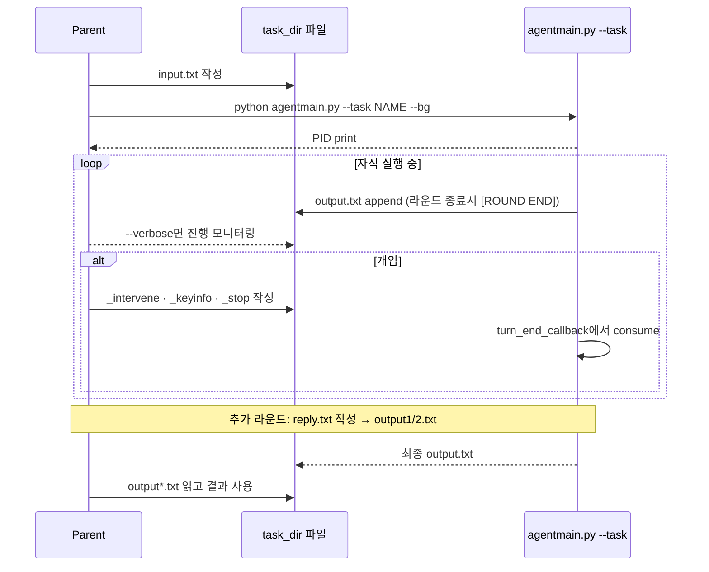

세 가지 개입 파일이 핵심:
- `_stop` — 다음 턴 종료시 자식 종료
- `_keyinfo` — 자식의 working memory에 `[MASTER]` prefix로 합류
- `_intervene` — 다음 턴 prompt 앞에 `[MASTER] {msg}` 주입

이 IPC가 **plan_sop의 "verify subagent"와 "explore subagent" 패턴**의 기반.

### 10.2 Plan Mode

`enter_plan_mode()`(`ga.py:422`)는 단순히 `working['in_plan_mode'] = plan_path` 플래그 + `max_turns=100`. 그러나 `do_no_tool`과 `turn_end_callback`이 다음 같은 가드를 추가:

- **완료 가로채기** (`ga.py:456`):
  ```python
  if self._in_plan_mode() and any(kw in content for kw in ['任务完成', '🏁']):
      if 'VERDICT' not in content and '[VERIFY]' not in content:
          return StepOutcome({}, next_prompt="⛔ [验证拦截] ... 必须先按plan_sop §四启动验证subagent")
  ```
  즉 **plan 모드에서는 verify subagent의 VERDICT 없이 완료 선언 못함**. 시스템 레벨 강제.
- **체크리스트 카운팅**: plan.md 안의 `[ ]` 갯수가 0이면 자동 plan 모드 종료 (`ga.py:485`).
- **히트(Hint) 주입**: 10턴마다 `📌 当前步骤:...` 시작하라는 reminder.

이는 본질적으로 **Claude Code의 ExitPlanMode 패턴을 마크다운으로 구현한 셈**.

### 10.3 자율 모드 (autonomous_operation_sop)

`reflect/autonomous.py`(5줄!):
```python
INTERVAL = 1800
def check():
    return "[AUTO]🤖 사용자가 30분 이상 부재. 자율 에이전트로서 자동화 sop 읽고 자동 태스크 실행."
```

이게 `agentmain.py --reflect autonomous.py`로 가동되면 **30분 user idle마다 trigger** → 모델이 `autonomous_operation_sop.md` 읽고 TODO 큐에서 1개 골라 실행 → 보고서 파일 작성 → 다음 사이클.

권한 경계가 SOP에 박혀있다:
- 자동 OK: 읽기 전용 탐색, cwd 내 쓰기/스크립트 실험
- 보고서 대기: global_mem 수정, 패키지 설치, 외부 API 호출
- 절대 금지: 키 파일 읽기, 코어 코드 수정, 비가역 위험 작업

---

## 11. Reflect/Scheduler — 자율 실행 인프라

### 11.1 Scheduler

`reflect/scheduler.py`(131줄)는 **Cron-on-Python**을 한 페이지로 구현:

```python
TASKS = './sche_tasks'        # 활성 작업 (.json)
DONE  = './sche_tasks/done'   # 완료 보고서 (.md)
INTERVAL = 120                # 2분마다 폴링

def check():
    if _time.time() - _l4_t > 43200:        # 12시간마다 L4 archive
        from compress_session import batch_process
        batch_process(raw_dir, dry_run=False)

    for f in os.listdir(TASKS):
        task = json.load(...)
        if not task['enabled']: continue
        # 'daily', 'weekday', 'weekly', 'monthly', 'every_3h', 'every_30m' 지원
        ...
        return f"[정时 작업] {tid}\n[보고서 경로] {rpt}\n\n{prompt}"
```

작업 스펙은 단순 JSON:
```json
{ "enabled": true, "schedule": "09:00", "repeat": "weekday",
  "max_delay_hours": 6, "prompt": "오늘 시황 정리해줘" }
```

`max_delay_hours`로 **컴퓨터를 늦게 켜서 9시 작업이 16시에 트리거되는 사고**를 막는다 — 운영 디테일.

### 11.2 L4 자동 아카이브

12시간마다 `temp/model_responses/*.txt`(LLM 입출력 raw 로그)를 `compress_session`이 처리:
1. timestamp 파싱 → `MMDD_HHMM-MMDD_HHMM.txt` 파일명
2. system prompt + assistant echo 제거 → 정수만 남김
3. 4500B 미만이면 파기

이 archive는 모델이 *옛날에 비슷한 일 했었는지 grep해 회고할 때* 사용. (`memory/L4_raw_sessions/SKILL.md` 참고 — 검색 API까지 있다)

---

## 12. 확장성 및 프론트엔드

### 12.1 프론트엔드 9종

| 프론트엔드 | 파일 | 메커니즘 |
|---|---|---|
| **Streamlit (default)** | `frontends/stapp.py`, `stapp2.py` | `pywebview`로 데스크톱 래핑 |
| **Qt** | `frontends/qtapp.py` (2022 라인) | PyQt 직접 |
| **Telegram** | `frontends/tgapp.py` | `python-telegram-bot` long-poll |
| **WeChat (개인)** | `frontends/wechatapp.py` | `pycryptodome` + 위챗 프로토콜 직접 |
| **QQ** | `frontends/qqapp.py` | `qq-botpy` WebSocket |
| **Feishu** | `frontends/fsapp.py` | `lark-oapi`, vision multimodal 지원 |
| **WeCom** | `frontends/wecomapp.py` | `wecom-aibot-sdk` |
| **DingTalk** | `frontends/dingtalkapp.py` | `dingtalk-stream` |
| **CLI** | `agentmain.py` REPL | readline + display_queue |

모두 공통 인터페이스:
```python
display_queue = agent.put_task(query, source='telegram', images=[])
while item := display_queue.get():
    if 'next' in item: stream_to_user(item['next'])
    if 'done' in item: final = item['done']; break
```
즉 **Frontend는 메시지 어댑터에 불과**, 핵심 로직은 모두 `GeneraticAgent.run`에서 처리. 새 프론트는 200줄 이내로 추가 가능.

### 12.2 Plugin 메커니즘 (Langfuse)

`plugins/langfuse_tracing.py`는 의외로 잘 다듬어진 example — **monkey-patch only**:
```python
_orig_log = llmcore._write_llm_log
def _patched_log(label, content):
    if label == 'Prompt':
        _tls.gen = _lf.start_observation(name='llm.chat', as_type='generation', ...)
    elif label == 'Response':
        _tls.gen.update(output=content[:20000], usage_details=_tls.usage)
        _tls.gen.end()
    return _orig_log(label, content)
llmcore._write_llm_log = _patched_log
```
`mykey.py`에 `langfuse_config`가 있으면 `reload_mykeys()`가 자동 import. **코어 코드 수정 0** — 플러그인 작성의 모범.

### 12.3 신규 Skill 추가 흐름

```mermaid
flowchart LR
    Need["[새 능력 필요]"]
    A1["사용자: 'XXX 해줘'"]
    A2["에이전트: code_run으로<br/>패키지 install · 시도 · 디버그"]
    A3["성공"]
    A4["start_long_term_update"]
    A5["L3에 SOP 작성<br/>(memory/xxx_sop.md)"]
    A6["복잡 로직은<br/>memory/xxx.py 함수로"]
    A7["L1 인덱스에 1줄 추가"]
    A8["[다음 호출]"]
    A9["L1 보고 → SOP read → 한 줄 실행"]

    Need --> A1 --> A2 --> A3 --> A4 --> A5 --> A6 --> A7 --> A8 --> A9
```

여기서 `memory/skill_search/`는 별도 흥미로운 사례 — **저자가 105K개 외부 skill 라이브러리에 검색 가능한 API 클라이언트**를 SOP로 박아 놓았다 (http://www.fudankw.cn:58787). 즉 *L3가 외부 RAG의 진입점* 역할도 가능.

---

## 13. 성능·토큰 효율

### 13.1 컨텍스트 윈도우 비교

| 에이전트 | 일반 컨텍스트 | 비고 |
|---|---|---|
| **GenericAgent** | **24~28K** (default) | 최대 1M까지 옵션 (NativeClaude `[1m]` 모델명 suffix) |
| Claude Code | 200K | 항상 풀로 사용 |
| OpenManus / AutoGPT | 200K~1M | history 무삭제 |
| Aider | 8K~128K | 코드 베이스 의존 |

저자의 arXiv 리포트 주장 — *"6x less token consumption"* — 의 메커니즘은:
1. **L1 ≤30 라인 인덱스만 매 턴 주입**, L2/L3는 필요시 `file_read`
2. **`<thinking>` 압축**: 5턴 후 800자 cap
3. **HTML cutlist + smart_truncate**: 35K 상한
4. **Tool schema 캐시**: 같은 schema면 한 줄 요약으로 대체 (10턴 cycle)
5. **`history_info[-40:]`만** working memory에 내재

### 13.2 알려진 제약

- **Single-process**: `task_queue`가 직렬화 (한 번에 한 태스크). subagent로 병렬은 가능하지만 main이 여러 이용자 동시처리는 전제 안 함.
- **Windows-first**: `ljqCtrl.py`는 `win32api` 의존. macOS/Linux는 키마우스/스크린 일부 기능 제한.
- **Chrome 강결합**: 다른 브라우저 미지원 (Edge는 Chromium이라 가능).
- **모델 품질에 민감**: 9개 도구 + SOP recall이 모델 능력에 의존. GPT-3.5/Llama 8B는 어렵다.
- **Skill discovery**: skill 수가 많아지면 L1이 30라인 cap에 부딪힘 → `skill_search` 외부 RAG 의존.

---

## 14. 경쟁·비교 분석

### 14.1 포지셔닝 매트릭스

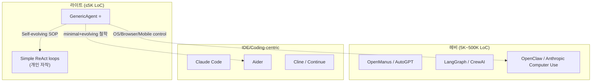

### 14.2 기능 비교표

| 항목 | GenericAgent | Claude Code | OpenManus | OpenClaw | Aider |
|---|---|---|---|---|---|
| **코드 규모** | 3K LoC | 비공개(추정 50K+) | 50K+ | 530K | 30K |
| **컨텍스트** | 28K | 200K | 200K~1M | 1M | 8K~128K |
| **OS 제어** | ✅ 키마우스+ADB+Vision | 부분(파일+터미널) | ✅ | ✅ 멀티에이전트 | ❌ |
| **브라우저** | ✅ 사용자 Chrome 주입 | MCP 플러그인 | ✅ headless | ✅ sandbox | ❌ |
| **스킬 진화** | ✅ 마크다운 자동 결정화 | 세션간 무상태 | 부분(memory) | 플러그인 생태 | ❌ |
| **모델 호환** | Claude/OAI/Kimi/MiniMax/Gemini | Claude only | OpenAI | 멀티 | 멀티 |
| **페일오버** | ✅ MixinSession | ❌ | ❌ | ❌ | ❌ |
| **Plan 모드** | ✅ + verify subagent | ✅ | ✅ | ✅ | ❌ |
| **자율/Cron** | ✅ Reflect+Scheduler | ❌ | 부분 | ❌ | ❌ |
| **프론트엔드** | 9종 (메신저 4개 포함) | CLI/web | web | web | CLI |
| **라이선스** | MIT | proprietary | MIT | Apache 2.0 | Apache 2.0 |

### 14.3 차별 포인트 요약

- **vs Claude Code**: GenericAgent는 *모델 비종속*이고 *세션간 메모리 누적*이라는 점에서 우위. 반대로 Claude Code의 native tool quality와 hook 인프라는 우위.
- **vs OpenManus/AutoGPT**: 코드 규모가 자릿수 차이 → 학습/유지비용 차이. 그러나 OpenManus는 더 풍부한 빌트인 도구.
- **vs OpenClaw**: GenericAgent가 단일 프로세스라 단순한 반면 OpenClaw는 멀티 에이전트 sandbox로 격리 우위.
- **vs Aider**: Aider는 IDE 보조에 특화. GenericAgent는 OS-제어 일반 에이전트.

---

## 15. 엔지니어 관점 종합 평가

### 15.1 강점 (Strengths)

1. **압도적 단순성** — 코드 3K, 의존성 4개. 1주일이면 전체 흐름 파악 가능.
2. **재사용 가능한 컴포넌트** — `simphtml`(HTML 다이어트), `MixinSession`(LLM 페일오버), `plugins/langfuse_tracing`(monkey-patch 트레이싱), `tmwd_cdp_bridge`(브라우저 주입) 모두 떼어 쓰기 좋음.
3. **메모리 모델** — L0~L4의 명확한 분리 + 작성 규칙(L0 SOP)이 박혀있다는 점에서 *프롬프트 엔지니어링이 시스템 설계로 승화*.
4. **Skill crystallization 자동화** — `start_long_term_update` + L0 SOP가 모델 스스로 좋은 메모리 작성을 강제.
5. **Provider-agnostic** — Claude/OAI/GLM/Kimi/MiniMax 어떤 SSE도 통일 응답. 페일오버까지.
6. **사용자 브라우저 침투** — 로그인 상태 보존이라는 실용적 결정.

### 15.2 약점·리스크 (Weaknesses)

1. **테스트 부족** — `tests/`에 minimax 통합 테스트 2개뿐. 핵심 로직(agent_loop, memory, tools)은 사실상 미검증. 코드를 신뢰하기 위해 직접 읽고 검증 필요.
2. **단일 프로세스·단일 사용자** — multi-tenant 설계 아님. 서비스용으로는 reverse proxy + per-user instance 별도 구성 필요.
3. **Windows-centric**: `ljqCtrl`/`procmem_scanner` 등 macOS/Linux 부분 기능 부재.
4. **보안 모델 약함**:
   - `code_run`이 *임의 Python 실행* — sandbox 없음. Container/VM 격리는 운영자 몫.
   - `mykey.py`에 평문 API key. .gitignore돼있긴 하지만 secret manager 통합 없음.
   - 자율 모드에서 SOP가 권한 경계를 정하지만 *모델 의존* 강제력.
5. **에러 핸들링 거친 곳들** — `try: ... except: pass`가 곳곳. 디버깅 어려움.
6. **언어**: 코드 주석 + SOP 대부분 중국어. 기여 진입장벽.
7. **모델 의존 강함**: 9개 도구 ReAct + SOP recall이 모델 능력에 직결. SLM(작은 로컬 모델)로 운영 어려움.

### 15.3 적합·부적합 사례

| 상황 | 적합도 |
|---|---|
| 개인 비서/자동화 ("내 환경" 한정) | ⭐⭐⭐⭐⭐ |
| 코딩 보조 (Claude Code 대안) | ⭐⭐⭐ (Aider/CC가 더 적합) |
| 데이터 추출·웹 자동화 | ⭐⭐⭐⭐ (TMWebDriver 강점) |
| 멀티유저 SaaS | ⭐ (재설계 필요) |
| 보안 민감 작업 (금융/의료) | ⭐ (`code_run` 위험) |
| 자율 운영 봇 (Cron+Reflect) | ⭐⭐⭐⭐ |

### 15.4 코드 품질 평론

- **+** 모듈 경계가 명확. handler/loop/llmcore/web/memory가 깔끔히 분리.
- **+** 댓글이 *사용자 기억을 안 잊게 하는 경고문* 형태로 박혀있음 (예: `# 10턴마다 도구 schema 재주입`). 운영 가이드가 곧 코드 주석.
- **−** 한 줄 다중 statement (`if x: y; z`) 남발 — 가독성↓.
- **−** 모킹/테스트가 빈약해서 회귀 발견이 늦을 수 있음.
- **−** `mykey_template.py`(425줄)이 사실상 매뉴얼 — README보다 더 자세함. 이를 README/docs로 분리하면 좋을 것.

---

## 16. 우리 에이전트로 옮겨올 만한 것들

이 레포에서 SWE 입장으로 *지금 자체 에이전트에 도입할 만한* 것들을 우선순위별로 정리.

### 16.1 즉시 차용 가치 (적용 비용 작음)

1. **`MixinSession` 페일오버 패턴** — 200줄로 LiteLLM/Portkey급 페일오버 구현. spring-back + stream-aware는 그대로 가져갈 만하다.
2. **L1 ≤30라인 인덱스 + 매 턴 주입** — 시스템 프롬프트에 "어떤 SOP가 있는지 키워드 → 파일포인터" 인덱스만 두는 패턴. 우리 에이전트에서 시스템 프롬프트 비대화 막는데 즉시 효과.
3. **`turn % N`별 가드 프롬프트** — 7턴마다 "전략 전환 강제", 65턴마다 ask_user 강제. 무한루프 가드 표준 패턴.
4. **`update_working_checkpoint` 도구** — 200토큰 워킹 노트 + 매 턴 주입. 긴 task에서 키 정보 유실 방지.
5. **`simphtml` HTML 다이어트** — JS측 가시성 검사 + Python측 cutlist + smart_truncate. 그대로 떼어 RAG 전처리에 사용 가능.
6. **monkey-patch only 플러그인 패턴** — `plugins/langfuse_tracing.py`는 코어 수정 0인 트레이싱 모범. 우리 시스템에 옵저버빌리티 붙일 때 그대로 차용.

### 16.2 설계 철학으로 차용 (구현은 우리 식)

1. **"9 atomic tools + code_run is universal tool"** — 우리 에이전트가 도구 30개를 두고 있다면, `code_run`(샌드박스 격리 필수) 하나로 대체 가능한지 재검토할 만하다.
2. **L0~L4 메모리 계층** — Vector DB만 쓰고 있다면 *마크다운 SOP 파일 계층*도 병행 가치. 모델이 직접 read/write할 수 있다는 점에서 디버깅/감사가 쉬움.
3. **Skill crystallization 트리거** — task end에 모델이 자발적으로 "이거 기억할까?" 호출하게 하는 도구 + 결정화 SOP. agent memory 정책의 베스트 프랙티스.
4. **Plan mode + Verify subagent** — 완료 선언을 *별도 subagent의 VERDICT*가 검증해야만 가능. 환각/허위 완료 방지.
5. **`<summary>` 강제** — 매 응답 첫머리에 "30자 이하 물리적 스냅샷" 강제. history compaction의 1급 입력 단위.

### 16.3 주의해서 차용

1. **임의 코드 실행 (`code_run`)** — 반드시 컨테이너/VM 격리. GenericAgent는 개인 사용 전제.
2. **Reflect/Autonomous 모드** — *사용자 부재 시 자율 행동*은 강력하지만 권한 경계가 SOP 의존이라 위험. 우리 환경에선 화이트리스트 룰 엔진 필요.
3. **사용자 브라우저 직접 주입** — TMWebDriver 패턴은 사용자 동의 + 명확한 indicator(이 레포는 우상단 배지로 시각적 표시) 전제. 엔터프라이즈 환경에선 정책 검토.

### 16.4 차용하지 않는 것이 좋은 것

1. **`mykey.py` 평문 키** — secret manager(Vault/SSM/1Password Connect)으로 대체.
2. **Streamlit 메인 UI** — 단일 사용자 가정. 멀티 유저는 적절한 web stack 필요.
3. **5분 spring-back 하드코딩** — 우리 운영에선 환경별 동적 조정 필요.

---

## 17. 논문 보충 — 이론적 토대 (Context Information Density)

기존 분석은 *코드 레벨에서 무엇을 어떻게 했나*에 집중했지만, arXiv 기술리포트(2604.17091)는 그 모든 결정을 단 하나의 *원리*로 환원해 설명한다. SWE 입장에서 "왜 이런 설계가 정답인지"를 이해하는 데 필수적인 부분이라 별도로 정리한다.

### 17.1 단일 설계 원리

> *"Context information density is all a self-evolving LLM agent needs."*

논문이 명시적으로 내세우는 단일 슬로건. **에이전트 성능은 컨텍스트 길이가 아니라, 한정된 컨텍스트 예산 내에 얼마나 많은 *결정 관련 정보*가 유지되는가로 결정된다**는 주장이다.

### 17.2 LLM의 3가지 구조적 한계 (이론적 기반)

논문은 다음 3가지를 *모델 종속이 아닌 현재 LLM 아키텍처의 본질적 속성*으로 인용한다:

1. **Positional Bias (Lost in the Middle)** — 컨텍스트 가운데 위치한 정보는 양 끝에 비해 retrieval이 현저히 어려움. (Liu et al., 2023)
2. **Attention Dilution** — 무관한 정보가 단순히 *무시되는 게 아니라* 결정 핵심 증거에서 attention을 적극적으로 빼앗아 성능을 *떨어뜨림*. (Shi et al., 2023)
3. **Effective vs Nominal Context Window 격차** — 명목 1M 컨텍스트라도 실효는 그 1/10 수준. 즉 큰 윈도우의 상당 부분은 functionally inaccessible. (An et al., 2024)

이 셋이 **상호 강화**해, 컨텍스트가 길어질수록 (a) 중간 증거가 묻히고 (b) 무관 정보가 attention을 분산시키고 (c) 실효 윈도우 비율이 떨어진다 → 결과적으로 **"많은 컨텍스트 = 더 나쁜 결정"**이라는 역직관적 결론.

### 17.3 Completeness vs Conciseness — 핵심 트레이드오프

논문은 컨텍스트 품질을 3차원이 아니라 *2개 축 + 1개 제약*으로 정의:

| 차원 | 정의 | 우선순위 |
|---|---|---|
| **Completeness** | 현재 결정에 필요한 모든 정보가 명시적으로 컨텍스트에 존재 | 1급 |
| **Conciseness** | 무관·중복 정보가 제거되어 attention이 핵심 신호에 집중 | 1급 |
| **Naturalness** | 모델이 잘 해석하는 자연스러운 표현 (과도한 압축 회피) | 2급 보조 제약 |

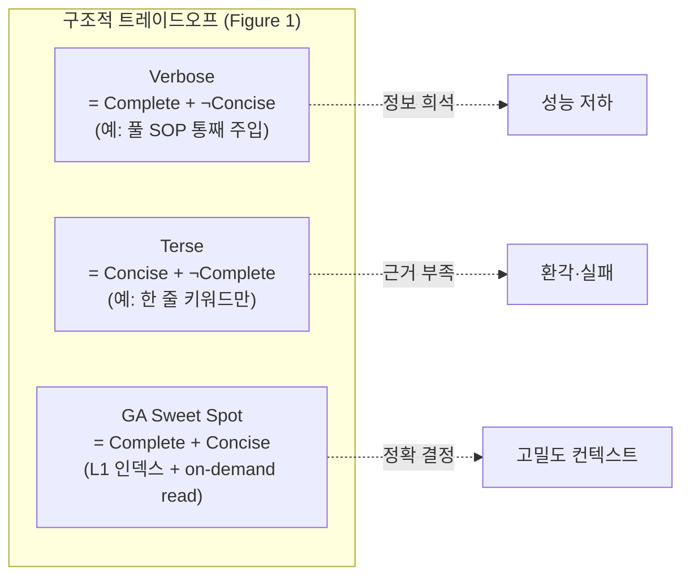

논문이 강조하는 점: **이는 컨텍스트 윈도우 크기 문제가 아니라 *구조적 긴장*이다.** 무한 컨텍스트라도 다음 3가지 이유로 트레이드오프는 남는다:
1. 더 많은 잠재 관련 정보 = completeness↑ but conciseness↓
2. 요약/압축 = conciseness↑ but 디테일 손실로 completeness↓
3. naturalness가 압축 표현을 제약 (하지만 부수적)

### 17.4 4-층 메커니즘이 이 원리를 어떻게 구현하는가

논문은 GA의 4가지 메커니즘이 *컨텍스트 정보 밀도*를 일관되게 최적화한다고 정리:

| 메커니즘 | 정보 밀도 기여 |
|---|---|
| **Tool minimality (9개 atomic tools)** | task 시작 *전*에 도구 스키마가 차지하는 컨텍스트 점유 최소화 |
| **Hierarchical memory (L0~L4)** | 항상-on 레이어를 최소화, on-demand로 깊은 메모리 접근 |
| **Self-evolution (SOP crystallization)** | 검증된 trajectories만 reusable한 압축 표현으로 변환 |
| **Context truncation/compression** | 실행 중 활성 컨텍스트를 능동 관리, 노후 정보 정리 |

### 17.5 Tool Minimality의 두 조건 (논문 형식화)

논문이 명시한 atomic tool 설계 조건:

1. **Atomicity** — 각 도구가 *환원 불가능한 원시 능력*만 가짐 (단일 책임).
2. **Compositional Generalization** — 복잡한 행동이 이런 원시들의 *시퀀스 조합*으로 표현 가능해야 함.

이론적 결론: **모든 작업은 `code_run` 하나로 가능하다 (Python 무제한 실행이므로)**. 나머지 8개는 *capability*가 아니라 *shortcuts to reduce decision cost* — 즉, 모델이 매번 `code_run`으로 grep/read/click 하기엔 inference 비용이 너무 크기 때문에 둔 *효율 도구*. 이 framing이 본문(§6.2.1)에서 내가 "code is universal tool"이라 부른 것의 정확한 학술적 표현.

### 17.6 Always-on이 ≤30라인일 수 있는 이유 (Kolmogorov 한계)

논문이 명시적으로 지적한 압축의 이론적 정당화:

> *"Each L1 entry records only the existence of a knowledge category rather than its substantive content. ... the overall description length of L1 approaches the **Kolmogorov complexity** of the categorical structure of the knowledge set."*

즉 L1은 *내용*이 아니라 *카테고리 존재성*만 인코딩 → 압축 한계는 카테고리 수의 코로모고로프 복잡도. **LLM 자체가 디코더 역할**을 하므로(키워드 보면 SOP까지 follow 가능), 존재성 신호만으로 정확 라우팅이 충분하다.

### 17.7 자기진화의 3단계 표현 변환

기존 분석에서 누락한 핵심: **GA의 자기진화는 단순한 "메모리 누적"이 아니라 *표현 형식 자체의 단계적 변환***이다.

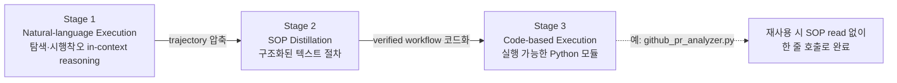

논문 §4.4.2 표 8 (LangChain GitHub PR research 9 라운드):

| 라운드 | 단계 | 시간 | LLM Calls | 입력+출력 | 캐시 | Total |
|---|---|---|---|---|---|---|
| #1 | Initial run | 7m30s | 32 | 15.6k+7.6k | 199k | **222k** |
| #2 | SOP optimization | 4m19s | 12 | 5k+4.9k | 56k | 66k |
| #5 | SOP optimization | 2m50s | 7 | 2.5k+3.3k | 30k | 36k |
| #6 | **Codified SOP** | 2m24s | 6 | 1.9k+1k | 23k | 26k |
| #9 | Codified SOP | 1m38s | 5 | 1.3k+1k | 21k | **23k** |

→ **89.6% 토큰 감소, 84.4% LLM 호출 감소, 78.2% 시간 단축.** Stage 1→2 (R1→R5)에서 절차가 안정화되고, **Stage 2→3 (R5→R6) 전환 시 추가로 절반이 감소**한다. 코드화 시 모델은 *해석 오버헤드* 자체를 제거함.

### 17.8 "최소 능력 집합" 논제 (Discussion §5)

논문의 핵심 주장: **에이전트 프레임워크가 구현해야 할 능력은 정확히 3개뿐**.

1. **Tool interfacing** — 환경과의 유일한 채널
2. **Context management** — LLM 입력 단계의 정보 필터링
3. **Memory formation** — 태스크 간 검증된 지식 누적

> *"Any additional complexity that does not serve one of these three capabilities is, in our view, actively degrading information density."*

이 framing이 LangGraph/CrewAI/AutoGPT 등 *추가 복잡도(role/agent 매니저, ev bus 등)를 더하는* 프레임워크들에 대한 직접적인 반박이다.

---

## 18. 논문 보충 — 정량 벤치마크 결과

기존 분석은 정성 비교 매트릭스만 제공했다. 논문 §4의 정량 결과를 보충해 수치적 차별을 제시.

### 18.1 Task Completion + Token Efficiency (§4.1, Table 2)

3개 벤치마크 결과. **Efficiency = Accuracy / Total Tokens (M)**.

| Benchmark | Agent | Model | Accuracy | Input Tok | Output Tok | Total | Efficiency |
|---|---|---|---|---|---|---|---|
| **SOP-Bench** | **GA** | Sonnet 4.6 | **100%** | 2.02M | 53k | 2.08M | 0.48 |
|  | OpenClaw | Sonnet 4.6 | 100% | 2.60M | 40k | 2.64M | 0.38 |
|  | Claude Code | Sonnet 4.6 | 85% | 1.23M | 23k | 1.25M | 0.68 |
|  | **GA** | MiniMax M2.7 | 90% | 893k | 32k | 924k | **0.97** |
|  | OpenClaw | MiniMax M2.7 | 95% | 2.91M | 46k | 2.96M | 0.32 |
| **Lifelong AgentBench** | **GA** | Sonnet 4.6 | **100%** | 222k | 20k | 241k | **4.15** |
|  | OpenClaw | Sonnet 4.6 | 70% | 1.43M | 21k | 1.45M | 0.48 |
|  | Claude Code | Sonnet 4.6 | 75% | 800k | 14k | 814k | 0.92 |
| **RealFin-Benchmark** | **GA** | Sonnet 4.6 | **65%** | 102k | 12k | 114k | **5.70** |
|  | Claude Code | Opus 4.6 | 60% | 290k | 17k | 307k | 1.95 |
|  | Codex | GPT-5.4 | 60% | 838k | 54k | 892k | 0.67 |
|  | OpenClaw | Sonnet 4.6 | 35% | 249k | 2k | 251k | 1.39 |

**핵심 관찰**:
- Lifelong AgentBench (cross-task 의존성 평가)에서 GA는 *Claude Code의 27.7% 토큰만 쓰고 100% 정확도*. 이게 메모리 시스템의 직접 효과.
- RealFin (금융 도메인)에서 가장 적은 토큰으로 가장 높은 정확도. 도메인 특화 없이 일반 시스템 설계로 달성.

### 18.2 Long-Horizon 5 Tasks (§4.2, Table 4)

PDF/PPT 생성, SQL Copilot, 실험 분석, 조달 결정, 논문 재현 — 5개 long-horizon 태스크 평균:

| Agent | Success | Total Tokens | Time(s) | Requests | Tool Calls |
|---|---|---|---|---|---|
| Claude Code | 100% | 537,413 | 320.8 | 32.6 | 22.6 |
| **GA** | **100%** | **188,829** | 220.8 | **11.0** | **12.8** |
| OpenClaw | 80% | 633,101 | 183.1 | 15.0 | 16.6 |

GA가 Claude Code 대비 **토큰 35.1%, 요청 33.7%, tool call 56.6%**. 즉 *적은 호출 × 적은 토큰 × 같은 성공률*.

### 18.3 도구 사용 분포 (§4.2.3, Figure 3)

도구 인벤토리 vs 실제 사용 분포 — 인벤토리가 클수록 long-tail이 됨:

| 시스템 | 인벤토리 | 실제 사용 분포 (상위 4개) |
|---|---|---|
| **Claude Code** | 53개 | AgentTool 50.4% · WebFetchTool 22.1% · FileReadTool 10.6% · FileWriteTool 8.9% · 그 외 47개 = 0.9% |
| **OpenClaw** | 18개 | browser 32.5% · web_fetch 20.5% · exec 15.7% · read 14.5% · 그 외 = 7.2% |
| **GA** | **9개** | file_read 34.4% · code_run 32.5% · file_write 17.2% · web_execute_js 10.9% |

**관찰**: Claude Code의 53개 중 47개가 **실제 사용 0.9%**. 즉 90%의 도구가 *prompt 비용만 차지하고 사용되지 않음* — 논문이 tool minimality 정당성으로 직접 인용하는 데이터.

### 18.4 Long-term Fact Retention (§4.3.3, Table 6)

LoCoMo 벤치마크. **Vector DB 없이** 마크다운 메모리만으로 측정:

| System | Multi-Hop F1 | Temporal F1 | Open-Domain F1 | Single-Hop F1 |
|---|---|---|---|---|
| Mem0 (vector) | 39.32 | 50.03 | 18.32 | 40.32 |
| A-MEM (vector) | 29.03 | 46.83 | 13.11 | 44.68 |
| OpenClaw | 21.43 | 22.56 | 9.56 | 23.44 |
| **GA** (no vector) | **43.33** | **52.23** | **20.41** | **45.69** |

**4개 카테고리 모두 1위.** 임베딩/벡터 DB 없이 *계층 마크다운 + LLM as decoder*만으로 전용 vector retrieval 시스템들을 능가. SWE 관점에서 **운영 단순성 큰 이점** — Qdrant/Pinecone 클러스터 없이도 long-term memory 가능.

### 18.5 Context Explosion Prevention (§4.3.4, Table 7)

**가장 강렬한 비교 데이터** — 같은 20개 skill을 4개 시스템에 설치하고 강도 높게 사용한 뒤, 단순 "Hello"를 보냈을 때의 풀 프롬프트 길이:

| System | Full Prompt (tokens) |
|---|---|
| Claude Code | 22,821 |
| Codex | 23,932 |
| OpenClaw | 43,321 |
| **GA** | **2,298** |

**약 10배 차이.** GA만이 *skill 누적이 idle prompt를 부풀리지 않음* — 메모리는 on-demand만 진입하고, L1 ≤30라인 인덱스만 항상 주입되기 때문.

### 18.6 Web Browsing (§4.5, Table 9)

| Benchmark | Tasks | Score (GA) | Score (OC) | Tokens (GA) | Tokens (OC) |
|---|---|---|---|---|---|
| WebCanvas | 12 | 0.834 | 0.722 | 0.18M | 0.71M |
| **BrowseComp-ZH** | 10 | **0.60** | **0.20** | 0.47M | 1.31M |
| Custom Tasks | 22 | 0.577 | 0.500 | 0.26M | 0.76M |

**BrowseComp-ZH (다단계 reasoning)에서 3배 정확도, 1/3 토큰.** 이는 `simphtml` 의 DOM 다이어트가 multi-hop web reasoning에서 직접적으로 효과를 발휘함을 시사 — 원시 HTML이 적게 들어오니 모델이 hop 사이에 길을 잃지 않음.

---

## 19. 논문 보충 — 형식화된 메커니즘

기존 분석에서 누락한 *수식·정량 임계값* 등 형식화된 부분.

### 19.1 4-Stage Context Truncation (§2.3.4)

코드를 읽어서는 정확히 알기 어려운 *각 도구별 truncation 임계값*:

| Tool / mode | L (chars) | 비고 |
|---|---|---|
| `code_run` | 10,000 | 표준 head-tail truncation |
| `web_execute_js` | 8,000 | `save_to_file` 사용 시 디스크에 풀, 미리보기만 history |
| `web_scan (text_only)` | 10,000 | |
| `web_scan (HTML)` | **35,000** | **DOM-level subtree pruning** (단순 head-tail 아님) |
| `file_read` | ~1,280/line, 20,000 total | 라인 단위 cap + 총량 cap |

추가로:
- **Stage 2 압축 주기**: ~5턴마다 1회 → 변하지 않은 구간이 *prompt cache hit ~80%*에 기여
- **최근 10개 메시지는 압축 면제** (recency 보호)
- **Stage 3 eviction 임계값**: 컨텍스트가 budget 초과 시 *60% 수준까지* 노후 메시지 FIFO 제거
- **Working memory anchor**: *최근 20개 한 줄 요약* (논문) ↔ *최근 40개* (`ga.py:511` 코드) — **불일치**. 코드가 paper 작성 후 늘어났을 가능성. 운영자는 자기 사용 패턴에 맞춰 조정 가능.

### 19.2 컨텍스트 예산 휴리스틱 (식 1)

```
CH = Σ len(m)         # 모든 메시지의 JSON 직렬화 후 문자 길이
B  = α · W_tokens     # α ≈ 3 chars/token (보수적)
trigger compression/eviction when CH > B
```

**α=3 보수 설정의 함의**:
- **ASCII 위주**: 실제 4 chars/token에 비해 *약간 일찍 evict* — 안전한 실패 방향
- **CJK 콘텐츠**: 1~2 tokens/char 이라 *α=3은 토큰을 과소평가* → eviction 지연 위험. *중국어/한국어 사용자는 α를 낮춰야 안전*. 운영 팁.

### 19.3 자율 탐색 Curriculum Planner (§3.3, 식 2~4)

기존 분석에서 완전히 누락한 부분: **자율 모드의 태스크 우선순위는 수식으로 결정**된다.

```
S(t) = wb·B(t) + wd·D(t) + wu·U(t) + wi·I(t)
```

| 차원 | 의미 | 계산 |
|---|---|---|
| **B** (Breadth) | 빈약한 카테고리 보강 | `B(t) = 10 · max(0, 1 - |Sc|/(S̄+1))` |
| **D** (Depth) | 자주 쓰이는 스킬 강화 | `D(t) = 10 · u(t)/(u_max+1)` |
| **U** (Utility) | 실무 가치 추정 | LLM이 1~10 평가 |
| **I** (Innovation) | 신규 기법·도메인 | LLM이 1~10 평가 |

- 초기 가중치: `(wb, wd, wu, wi) = (0.3, 0.2, 0.3, 0.2)` — breadth & utility 우선
- **태스크 리스트는 최소 4개 카테고리에 분산**되어야 함 (집중 방지)
- 기본 트리거: 6분마다, plan 모드 진입 후 SOP 따라 실행

### 19.4 Reflection-based 가중치 자동 조정

논문이 제시한 자기교정 메커니즘:

- 예측 점수 `S(t) > 8.0`인데 *30일 내 실제 사용 `u(t) < 3`* → 그 차원 가중치 **−10%**
- 예측 `S(t) < 5.0`인데 실제 `u(t) > 5` → 그 차원 가중치 **+10%**
- 모든 가중치는 합 1로 재정규화

→ **플래너 자체가 사용자 워크플로에 맞춰 자가 조정.** 단, 논문이 *"unverified adaptation"*이라며 long-term 데이터로 효과 입증은 미완으로 명시 (한계점).

### 19.5 Skill Tree 자료구조

논문이 형식화한 self-evolution의 코어 자료구조:

```
SkillTree = Map<Category, List<Skill>>
Skill = {
    name: string,
    tool_scripts: list<path>,
    usage_counter: int (단조증가)
}
```

- **2-level**: categories(`web_automation`, `data_processing` 등) → skills
- **이중 역할**: (a) 현재 capability의 글로벌 인덱스, (b) 자율 탐색 결정의 데이터셋

기존 분석에서 `skill_search/SKILL.md`로 외부 105K skill 검색 API를 언급했지만, *내부 personal skill tree*가 별도로 존재한다는 점은 누락. 자동 누적되는 부분이 이쪽.

### 19.6 자율 모드 권한 경계 (Hard-coded Security)

논문이 강조하는 부분:
- 모든 생성 파일은 *temporary directory* 안에 한정
- **시스템 시크릿·코어 소스 코드 접근은 무조건 금지**
- 별도 lightweight log 유지 — (a) 관찰된 에러+수정, (b) 명시적 사용자 선호, (c) 검증된 성공 패턴 → 자동 시스템 프롬프트 주입

운영 함의: *권한 경계가 모델 의존이 아닌 코드/디렉터리 강제*라는 점이 §15.2의 보안 약점 평가를 부분적으로 보완.

### 19.7 Tool Schema Elision (auxiliary)

기존 분석 §5.1에서 "10턴마다 도구 schema 재주입"이라 적었지만, 논문이 이걸 **"tool-schema elision" 메커니즘**으로 명시화:

- 도구 정의가 이전 턴과 동일하면 *full schema 제거*, 짧은 자연어 reminder로 대체
- 주기적 재전송: 일정 턴 수 또는 활성 prompt가 너무 길어진 경우
- **Native API path에는 적용 불가** (API가 매 호출마다 full tool definition 요구)

이는 *비-Native 경로(텍스트 프로토콜)에만 가능한* 토큰 절약. 즉 *MiniMax/Kimi 같은 호환 모델에서 GA가 더 큰 토큰 절감*을 보이는 이유 중 하나.

---

## 20. 논문 보충 — Discussion의 4가지 발견

논문 §5는 SWE에게 가장 인사이트풀한 부분. 4가지 거시적 결론을 별도 정리.

### 20.1 "Context information density는 모든 LLM 에이전트의 구조적 제약"

> *"As long as an agent uses an LLM as its reasoning engine, the quality of each decision step is ultimately determined within a single forward pass, and no amount of tooling, memory capacity, or workflow complexity can circumvent this constraint."*

함의: *어떤 워크플로 마법도 forward pass 한 번의 의사결정 품질 너머로 갈 수 없다*. 결국 각 step에서 모델이 보는 컨텍스트의 정보 밀도가 천장.

### 20.2 "최소 완전 능력 집합" 논제

논문 형식화한 가장 강한 주장. 3가지 능력 외의 모든 추가 복잡도는 *정보 밀도를 적극적으로 저하*시킨다 — *"actively degrading"*.

| 능력 | 대응 단계 |
|---|---|
| Tool interfacing | 외부와의 유일 채널 |
| Context management | LLM 입력 |
| Memory formation | 태스크 간 누적 |

**SWE 차용 방법**: 우리 시스템의 모든 컴포넌트가 이 3가지 중 하나에 명백히 속하지 않으면 **재검토 후보**.

### 20.3 "토큰 소비량 ↓ = 성능 ↑" — 역직관적 발견

> *"On Lifelong AgentBench, GA consumes only 27.7% of Claude Code's input tokens and 15.5% of OpenClaw's, while achieving a higher task completion rate of 100%. ... An agent that consumes more tokens is more likely suffering from systematic failures in context management."*

기존 통념: "긴 reasoning chain = 신중한 deliberation = 좋은 결과". 논문은 정반대를 데이터로 입증.

**SWE 관점 inversion**:
- 토큰 사용량은 *덜 쓸수록 좋은 KPI*가 될 수 있다 (cost뿐 아니라 *성능 신호*).
- *많이 쓰는 에이전트 = 컨텍스트 관리 실패의 증거*.
- 운영 모니터링에서 *세션당 토큰 증가 = retro alert* 트리거 후보.

### 20.4 "권한이 능력 천장을 결정" — Permissions as Capability Ceiling

> *"Locking down the action boundary during the agent's exploration phase is equivalent to preemptively capping its capability ceiling. ... the endpoint of which is a system that is safe, but useless."*

엔터프라이즈에서 가장 흔한 함정의 정확한 진단: *"안전을 위해 도구 권한을 좁힌다"*가 사실은 *"에이전트가 그 영역에서 진화하지 못하게 막는다"*는 직접적 결과. 보안 vs 유용성의 트레이드오프가 학습 capacity와 직결됨.

운영 결론: 권한을 *고정 화이트리스트*로 묶기보다 *자율 모드 sandbox + 결과 검토 게이트*가 capability 손실 없이 안전성 확보 가능 (논문의 자율 모드 정책이 정확히 이 패턴).

### 20.5 "Minimal architecture는 *self-update*의 전제 조건"

논문이 미래 연구로 남긴 가설:

> *"A system with hundreds of thousands of lines of code is opaque to the agent — it can neither understand nor modify it. A core codebase of a few thousand lines, by contrast, is readable, understandable, and modifiable."*

**진화의 3 progressive 차원**:
1. **Skill consolidation** (현재 검증됨 — §4.4)
2. **Autonomous exploration** (현재 부분 검증 — §3.3)
3. **Architectural self-update** (미래 — 미검증)

(3)에 도달하려면 코어 코드베이스가 *모델이 읽고 수정 가능한 크기*여야 한다. 530K 라인 OpenClaw는 구조적으로 이 단계 진입 불가, 3K 라인 GA는 가능. 이게 *자기진화 아키텍처가 본질적으로 minimal해야 하는 이유*에 대한 논문의 답.

---

## 21. 논문 보충 — Case Studies (실전 워크플로 5종)

논문 Appendix 4는 *벤치마크 외* 실전 사례를 제시. 기존 분석에서 누락한 GA의 *실제 적용 모습*을 보여주는 정성적 증거. 5종 사례를 SWE 관점 takeaway 위주로 압축 요약.

### 21.1 Case B1 — Cross-Device (Mobile + PC, ADB + ffmpeg)

**사용자 명령**: *"메이투안에서 밀크티 2잔 주문해줘. 결제 직전까지만."*  
**자동 실행**: ADB 연결 → 앱 실행 → 팝업 닫기 → "디저트·음료" 카테고리 → 후상아이 (밀크티 체인) → "필수 밀크티 2종 선택 콤보" 23.9위안 → 진한 토란 페이스트 + 흑설탕 보바 → 장바구니 → 체크아웃 정지.

**후속**: *"화면 녹화 가져와서 1:10 이전 자르고 3:40 이후 위쪽 검은색 마스킹, 4배속 GIF로."*  
→ `adb pull` + ffmpeg `-ss 00:01:10` + `drawbox` 필터 + `palettegen/paletteuse`.

**SWE takeaway**: *별도 모바일 자동화 프레임워크(Appium, UIAutomator) 없이 `code_run`(ADB shell) + `code_run`(ffmpeg) 조합만으로 PC↔모바일 boundary를 한 세션 안에 횡단*. atomic tool composition의 위력 증명.

### 21.2 Case B2 — Cross-Platform (WeChat 로컬 DB → Weibo 웹 발행)

**사용자 명령**: *"위챗에서 샤오 교수님의 최근 메시지를 웨이보에 전달."*  
**Phase 1 — WeChat**: 로컬 `EnMicroMsg.db` 위치 → SQLCipher 키 derive → 복호화 → contact 테이블 query → message 테이블 query → 메시지 추출.  
**Phase 2 — Weibo**: 브라우저 `web_scan` → JS injection으로 textarea 채우기 → `web_execute_js`로 submit → 타임라인 검증.

**SWE takeaway**: *암호화된 로컬 DB → 브라우저 웹 발행*이라는 이질적 stack 횡단. SQLCipher 키 derive처럼 비공개 spec이 필요한 작업도 SOP에 한 번 학습되면 재사용 가능. **단, 이런 능력은 정확히 §20.4의 "권한 = 천장" 논제를 시연** — 권한을 좁히면 이 워크플로 자체가 불가능.

### 21.3 Case B3 — Autonomous Operation (사용자 부재 30분+ 야간 세션)

**트리거**: `[AUTO] User has been away for more than 30 minutes` (`reflect/autonomous.py`)  
**보안 정책**: inspection / reporting / tool creation / reversible local maintenance만 허용. 외부 publication·결제·destructive 시스템 변경은 *코드로* 제외.

**15+ 라운드 자율 활동 (Round 125~140+)**:

| 카테고리 | 활동 |
|---|---|
| **시스템 보안 감사** | 모든 listening 포트 스캔 / 새벽 3시 주식 거래 앱이 939 UDP 포트 + 509MB 점유 발견 / startup 항목 감사 (registry 11 + 스케줄 작업 267 + auto-start 86) |
| **도구 생성** | `port_monitor.py` (실시간 포트 모니터) / `process_watchdog.py` (프로세스 알림) / `startup_auditor.py` |
| **웹 순찰** | 기술 커뮤니티 사이트 (Guohe, V2EX) + GitHub Trending 방문 → 요약 보고서 생성 |
| **환경 위생** | Python 환경 감사 (294 패키지, 1.9GB) / `filelock` 패키지 2건 CVE 발견 → `pip_audit.py` 작성 / 자체 history 파일명 .md/.txt 불일치 발견 후 자가 수정 |

**SWE takeaway**: GA가 *지시 없이도 자가 가치 발견*. 특히 마지막 *"자체 파일명 불일치 자가 수정"*은 §20.5 architectural self-update의 초기 형태. 운영 sandbox + 권한 정책만 잘 짜면 야간 운영 boost 가능.

### 21.4 Case B4 — Remote Infrastructure (SSH 파일 서버 배포)

**사용자 명령**: *"SSH로 서버 접속해서 파일 서버 띄우고 zip 업로드."* → 후속 *"공개 접근 가능하게."*

**Phase 1**: paramiko 설치 → SSH 연결 → 19MB zip SFTP 업로드  
**Phase 2**: `python3 -m http.server` 배포 → 중국어 파일명 인코딩 이슈 → UTF-8 locale 설정 fix  
**Phase 3** (요구사항 변경): 인증 제거 → 디렉터리 격리(타깃 폴더만 노출)  
**Phase 4**: 다운로드 검증 → 19.01MB == 원본 일치 확인

**SWE takeaway**: *Infrastructure-as-Code 도구 없이* SSH `code_run` + `update_working_checkpoint`(phase 추적)만으로 "connect → configure → deploy → troubleshoot → verify" DevOps 워크플로 완주. 중간에 요구사항 변경(공개 접근)을 자연스럽게 흡수.

### 21.5 Case B5 — Long-Horizon Academic (NSFC 연구비 신청)

**다중 세션, 며칠에 걸친** 학술 워크플로. 5개 단계가 사용자 상호작용에서 *유기적으로 출현*:

1. NSFC 신청서 전체 읽기·분석
2. *"그림이 0개"*라는 구조적 약점 진단 → 그림 계획 설계
3. matplotlib + networkx로 vector 다이어그램 + Gemini API로 도메인 일러스트 생성 → LaTeX 통합
4. `.bib` 파일 파싱 → arXiv API + OpenAlex API 교차 검증 → *상당수의 arXiv preprint metadata 오류 발견* (LLM 자동생성 .bib의 환각이 원인)
5. 일괄 수정 → before/after 변경 로그 → PDF 재생성

**SWE takeaway**: 메모리 시스템이 다중 세션·다중 일에 걸친 컨텍스트를 유지. *"LLM이 만든 .bib의 환각"*을 외부 API로 교차 검증하는 패턴은 LLM-assisted writing이 만연한 지금 그 자체로 가치 있는 SOP.

### 21.6 5개 사례의 공통 패턴

| 패턴 | Case |
|---|---|
| **Atomic tool composition으로 stack 횡단** | B1 (PC↔모바일), B2 (로컬DB↔웹), B4 (로컬↔원격) |
| **요구사항 변경을 워크플로 중간에 자연스럽게 흡수** | B4 (공개접근), B5 (단계 유기적 출현) |
| **권한 정책 + sandbox로 자율 운영** | B3 |
| **다중 세션 메모리로 long-horizon 워크 지원** | B5 |
| **LLM 환각의 외부 검증 패턴** | B5 (.bib arXiv 교차) |

**최종 결론**: 정량 벤치마크(§18) + 이론적 토대(§17) + 형식화된 메커니즘(§19) + Discussion 발견(§20) + 실전 사례(§21)를 합치면, GenericAgent는 단순 *"작은 코드베이스의 우연한 성공"*이 아니라 **명시적 설계 원리(context information density maximization)에서 도출된 일관된 시스템**임이 확인된다. 따라서 §16의 차용 우선순위 — 즉 *MixinSession, L1 인덱스, simphtml, 4-stage compaction, 3-stage skill crystallization* — 도 그 이론적 정당화를 갖춘다.

---

## 부록 A. 디렉터리 맵

```
GenericAgent/
├── agent_loop.py           # 123L, 단일 루프 함수
├── agentmain.py            # 270L, 진입점 + 큐 + LLM 풀
├── ga.py                   # 562L, GenericAgentHandler + 도구 구현
├── llmcore.py              # 1008L, LLM 호환층 (5개 provider)
├── simphtml.py             # 870L, HTML 다이어트
├── TMWebDriver.py          # 284L, 브라우저 WebSocket 드라이버
├── launch.pyw              # Streamlit 부트스트랩
├── hub.pyw                 # multi-user hub (서비스용)
├── mykey_template.py       # 425L, 운영 매뉴얼 = 설정 템플릿
├── pyproject.toml          # 4개 core deps + 옵셔널 extras
├── reflect/
│   ├── autonomous.py       # 5L, idle 트리거
│   └── scheduler.py        # 131L, cron + L4 archive
├── plugins/
│   └── langfuse_tracing.py # 122L, monkey-patch tracing
├── frontends/              # 9종 (Streamlit/Qt/메신저 5종/CLI)
├── memory/
│   ├── memory_management_sop.md   # L0 헌법
│   ├── plan_sop.md                # L3 plan 모드 SOP
│   ├── verify_sop.md              # L3 검증 SOP
│   ├── subagent.md                # L3 subagent IPC SOP
│   ├── tmwebdriver_sop.md         # L3 브라우저 함정 모음
│   ├── autonomous_operation_sop.md # L3 자율 모드
│   ├── ljqCtrl.py                 # L3 키마우스 라이브러리
│   ├── ljqCtrl_sop.md
│   ├── adb_ui.py                  # L3 모바일 ADB
│   ├── ocr_utils.py               # L3 OCR
│   ├── ui_detect.py               # L3 OmniParser CV
│   ├── procmem_scanner.py         # L3 프로세스 메모리 스캔
│   ├── keychain.py                # L3 macOS keychain
│   ├── skill_search/              # L3 외부 105K skill 검색
│   └── L4_raw_sessions/           # L4 자동 archive
└── assets/
    ├── sys_prompt.txt / sys_prompt_en.txt
    ├── global_mem_insight_template.txt
    ├── insight_fixed_structure.txt
    ├── tools_schema.json (9개 도구)
    ├── tools_schema_cn.json (GLM/Kimi용)
    ├── code_run_header.py         # ★ 모든 code_run 앞에 prepend
    ├── tool_usable_history.json
    └── tmwd_cdp_bridge/           # Chrome 확장 (manifest v3)
```

## 부록 B. 핵심 코드 위치 인덱스

| 주제 | 파일:라인 | 메모 |
|---|---|---|
| 메인 루프 | `agent_loop.py:42` | `agent_runner_loop` |
| Handler dispatch | `agent_loop.py:18` | `BaseHandler.dispatch` (do_* 컨벤션) |
| 도구별 구현 | `ga.py:280~507` | `GenericAgentHandler.do_*` |
| 워킹 메모리 주입 | `ga.py:509` | `_get_anchor_prompt` |
| 턴 가드/메모리 인젝션 | `ga.py:521` | `turn_end_callback` |
| LLM 라우팅 | `agentmain.py:55` | `load_llm_sessions` |
| Claude SSE 파서 | `llmcore.py:110` | `_parse_claude_sse` |
| OpenAI SSE 파서 | `llmcore.py:194` | `_parse_openai_sse` |
| claude→oai 변환 | `llmcore.py:452` | `_msgs_claude2oai` |
| Anthropic cache marker | `llmcore.py:578` | `ClaudeSession.make_messages` |
| MixinSession 페일오버 | `llmcore.py:899` | `MixinSession._raw_ask` |
| 컨텍스트 압축 | `llmcore.py:33` | `compress_history_tags` |
| WS 서버 | `TMWebDriver.py:121` | `start_ws_server` |
| HTTP long-poll | `TMWebDriver.py:50` | `start_http_server` |
| HTML 다이어트 (Python) | `simphtml.py:702` | `get_html` |
| Smart truncate | `simphtml.py:741` | `smart_truncate` |
| Cron scheduler | `reflect/scheduler.py:62` | `check()` |
| L4 자동 archive | `reflect/scheduler.py:65~74` | 12시간 cron |

---

**결론**: GenericAgent는 *작은 코드량 × 강력한 외부 도구(Chrome/Win32) × 잘 설계된 메모리 계층*으로 "에이전트 프레임워크의 본질이 무엇인가"를 다시 묻는 레포다. 카피하기보다 — *조각조각 떼어 우리 시스템에 옮겨심을* 가치가 있는 라이브러리에 가깝다. 특히 메모리 계층 설계, MixinSession, simphtml은 즉시 적용 후보.
