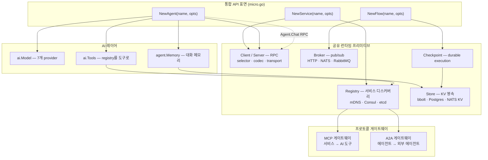
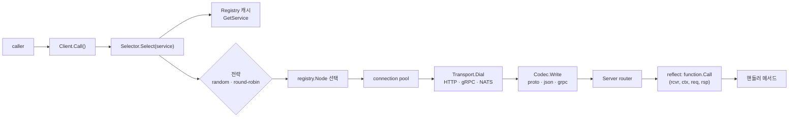
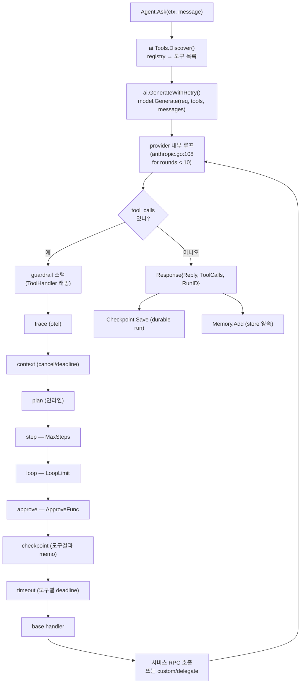
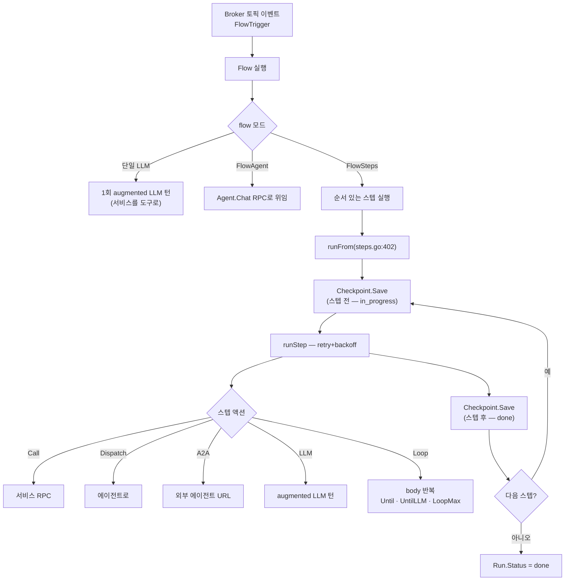
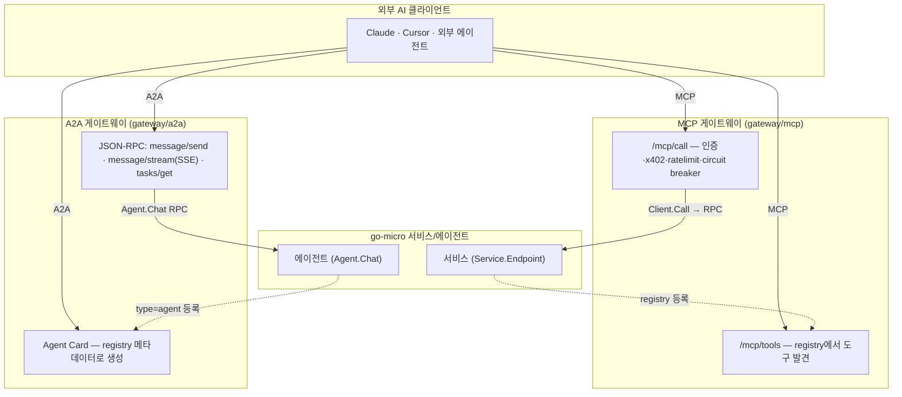
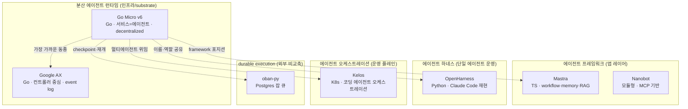

# Go Micro v6 — 코드 레벨 분석: 마이크로서비스 프레임워크에서 "에이전트 하네스"로

> **대상**: https://github.com/micro/go-micro · 문서 https://go-micro.dev/docs/
> **모듈 경로**: `go-micro.dev/v6` (Go 1.24)
> **분석 시점**: 2026-06 (commit `136c24a`, v6.0.0 "AI-native major release", 2026-06)
> **라이선스**: Apache-2.0 · 메인테이너 Asim Aslam · 스폰서 **Anthropic · OpenAI · Atlas Cloud**
> **한 줄 정의**: 10년 된 Go 마이크로서비스 프레임워크가 v6에서 **"에이전트 하네스(agent harness)"** 로 재정의 — *"에이전트는 분산 시스템이고, 에이전트를 만드는 것은 서비스를 만드는 것"* 이라는 테제 위에 **서비스 · 에이전트 · 플로우를 하나의 런타임으로 통합**.

---

## 0. TL;DR — 엔지니어를 위한 3문장 요약

1. **무엇인가**: go-micro는 2015년부터 이어진 Go의 대표 마이크로서비스 프레임워크(서비스 디스커버리·RPC·pub/sub·플러그형 추상화)인데, v6(2026-06)에서 **AI 에이전트 하네스로 피벗**했다. 새로운 엔진을 만든 게 아니라 **기존 분산 시스템 프리미티브를 그대로 에이전트의 런타임으로 재사용**한다.
2. **핵심 설계**: `micro.NewService` / `micro.NewAgent` / `micro.NewFlow` 가 **대칭적 1급 생성자**다. 에이전트는 `Agent.Chat` RPC를 가진 서비스이고, 서비스 엔드포인트는 자동으로 LLM 도구가 되며(MCP), 에이전트는 A2A로 외부에 노출되고, 결정적 경로는 durable flow로 체크포인트된다. **세 가지가 같은 registry·broker·store·Checkpoint를 공유한다.**
3. **이 레포 맥락에서의 위치**: 가장 가까운 동종은 **Google AX**(Go 기반 분산 에이전트 런타임). 단, AX가 *컨트롤러 중심 top-down 런타임*이라면 go-micro는 *서비스 메시 위에 에이전트가 서비스로 emergent 하는 decentralized 방식*이다. 이름은 [OpenHarness](../openharness/README.md)와 같은 "하네스"지만, OpenHarness가 *단일 코딩 에이전트의 하네스*라면 go-micro는 *에이전트들의 시스템(system of agents)을 위한 분산 인프라 하네스*다.

---

## 1. 프로젝트 개요

### 1.1 역사적 맥락 — 클래식 go-micro의 10년

`micro/go-micro`는 Asim Aslam이 2015년에 시작한 **Go 마이크로서비스 프레임워크의 사실상 표준** 중 하나였다. 핵심 철학은 *"sane defaults + 완전한 플러그형(pluggable) 아키텍처"* — mDNS/Consul/etcd 서비스 디스커버리, {proto,json}-RPC, HTTP/NATS broker, 클라이언트 사이드 로드밸런싱을 기본 제공하되 모든 것을 인터페이스로 교체 가능하게 했다. `micro/go-plugins` 생태계에 수십 개의 구현이 쌓였고, micro는 한때 플랫폼/회사로도 발전했다.

### 1.2 v6 피벗 — "AI-native major release"

2026년 6월, **Anthropic이 go-micro를 스폰서**하기 시작하면서 프로젝트는 공개적으로 **에이전트 개발 프레임워크로의 전환**을 선언했다(`go-micro.dev/blog/25`). CHANGELOG의 표현 그대로:

> *"## [6.0.0] - June 2026 — The AI-native major release."*

핵심은 **재작성(rewrite)이 아니라 확장(extension)** 이라는 점이다. 메인테이너의 논거:

> *"an agent is a model, a prompt, and a set of tools, and once it has more than one of anything it is a distributed system again: it has to discover services, call them, persist state, and recover from failure."*

즉 에이전트가 단일 어시스턴트를 넘어 도구·메모리·다른 에이전트를 갖는 순간 **다시 분산 시스템 문제**가 되고, 그 문제는 go-micro가 10년간 풀어온 것과 동일하다는 것. README의 선언:

> *"Agents, services, and flows share one runtime because **an agent is a distributed system, and building one is building a service.**"*

### 1.3 해결하려는 문제 (Problem Statement)

README의 "Why an Agent Harness" 절이 명확하다. 1세대 에이전트 프레임워크는 *"모델을 루프에 넣는 것"* 을 도왔다. 다음 문제는 **그 루프를 운영(operate)하는 것**이다:

- 실제 도구에 연결하기 / 에이전트가 건드릴 수 있는 범위를 한정(scoping)하기
- 상태 보존(persist state) / 장애에서 복구(recover)
- 전문 에이전트에게 작업 라우팅(delegation)
- 무슨 일이 일어났는지 관측(observe)
- 다른 에이전트가 호출할 수 있게(interop) 하기

이것이 **하네스 작업(harness work)** 이고, go-micro의 답은 *"하네스를 곧 당신이 이미 배포하는 것(서비스)과 동일하게 만든다"* 는 것이다.

---

## 2. 핵심 테제 — "에이전트는 분산 시스템이다"

v6 전체 설계를 관통하는 단 하나의 매핑:

| 에이전트가 필요로 하는 것 | go-micro의 기존 프리미티브 | 코드 위치 |
|---|---|---|
| 도구를 찾고 호출 | **Registry**(서비스 디스커버리) + **RPC** | `registry/`, `client/`, `server/` |
| 도구 실행 = 서비스 호출 | 엔드포인트 메타데이터 → 도구 스키마, RPC가 실행 | `ai/tools.go` |
| 상태 보존(메모리·플랜·플로우) | **Store**(pluggable: file/bbolt·Postgres·NATS KV) | `store/`, `agent/memory.go` |
| 이벤트로 에이전트 트리거 | **Broker**(pub/sub) | `broker/`, `flow/flow.go` |
| 장애 복구·재개 | **Checkpoint**(durable execution) | `flow/steps.go` |
| 다른 에이전트가 호출 | **A2A 게이트웨이**(registry 메타데이터로 Agent Card 생성) | `gateway/a2a/` |
| 도구를 외부 AI에 노출 | **MCP 게이트웨이**(엔드포인트 → 도구) | `gateway/mcp/` |

> 설계 철학 인용: *"Go Micro is the **substrate, not the brain**. ... There is no graph to learn and no engine to run beside your services. The infrastructure for a system of agents is, for the most part, the infrastructure for a system of services, and that is the decade of work already in the framework."*

이 "graph도 engine도 없다"는 점이 LangGraph/AutoGen 류와의 핵심 차별선이다. 에이전트 오케스트레이션을 위한 **별도 런타임이 없고**, RPC + registry + store가 곧 오케스트레이션 레이어다.

---

## 3. 핵심 특징 및 차별점 (Key Features)

| 특징 | 내용 | 차별 포인트 |
|------|------|------------|
| **대칭적 1급 생성자** | `NewService` · `NewAgent` · `NewFlow` 가 같은 옵션 시스템·런타임 공유 | 에이전트/플로우가 framework의 add-on이 아니라 **동급 시민** |
| **서비스 = 도구 (zero-code)** | 핸들러의 doc comment + `@example` 태그가 자동으로 도구 description/schema로 변환 | 기존 마이크로서비스가 **코드 변경 0으로** AI 도구가 됨 |
| **에이전트 = 서비스** | 에이전트는 proto 정의된 `Agent.Chat` RPC를 갖고 registry에 등록 | 에이전트가 디스커버리·로드밸런싱·스트리밍을 그냥 상속 |
| **plan & delegate 내장** | 모든 에이전트에 두 개의 빌트인 도구 — 멀티스텝 플랜 기록, 서브태스크 위임 | 별도 graph runtime 없이 **분산 멀티에이전트** |
| **실행 지점 guardrail** | `MaxSteps`·`LoopLimit`(기본 on)·`ApproveTool` 가 모든 도구 호출이 지나는 한 지점에서 강제 | 안전이 prompt가 아니라 **execution layer**에 |
| **Durable flows** | 스텝 단위 체크포인트 → 크래시 후 멈춘 지점에서 재개 | store-backed 기본, Temporal/Restate로 교체 가능 |
| **MCP + A2A 양방향** | 서비스→MCP 도구, 에이전트→A2A 에이전트, 둘 다 registry에서 자동 생성 | per-agent 코드 0 |
| **x402 paid tools** | HTTP 402 결제 표준 — 도구 호출에 스테이블코인 과금, 에이전트가 자율 정산 | facilitator 플러그형(Base/Solana), 프레임워크에 crypto 없음 |
| **7개 LLM provider** | Anthropic·OpenAI·Gemini·Groq·Mistral·Together·Atlas Cloud | `ai.New("provider")` 한 줄로 교체 |
| **모든 것 swappable** | registry·broker·transport·store·codec·selector·memory·model 전부 Go 인터페이스 | 10년 검증된 플러그 아키텍처 |
| **CLI-first DX** | `micro run --prompt "..."` → AI가 서비스 설계·핸들러 생성·컴파일·기동 | hot reload·SSH+systemd 배포(Docker 불필요) |

---

## 4. 아키텍처 분석

### 4.1 통합 런타임 — Service · Agent · Flow가 한 substrate 위에



핵심: **세 생성자가 모두 같은 `Registry`·`Client`·`Store`를 쓴다.** 서비스 상태는 `service/{name}`, 에이전트는 `agent/{name}`, 플로우는 `flow/{name}` 으로 **동일한 store를 네임스페이스 스코핑**(`store.Scope(s, database, table)`, `service/service.go`)해 격리한다.

### 4.2 클래식 코어 — RPC 요청 흐름

go-micro의 10년 자산. 요청 한 번이 selector → registry → transport → codec를 거친다.



- **Registry 인터페이스**(`registry/registry.go:18`): `Register`/`Deregister`/`GetService`/`ListServices`/`Watch`. 데이터 모델은 `Service{Name, Version, Metadata, Endpoints, Nodes}` → `Node{Id, Address, Metadata}` → `Endpoint{Name, Request, Response, Metadata}`.
- **Client 인터페이스**(`client/client.go:20`): `Call`/`Stream`/`Publish`/`NewRequest`. `Call()`(`rpc_client.go:427`)은 retry(기본 5회·exponential backoff)·deadline·CallWrapper 미들웨어를 관리하고, `Selector.Mark(service, node, err)` 로 노드 상태를 갱신한다.
- **Server 인터페이스**(`server/server.go:19`): `Handle`/`NewHandler`/`Subscribe`/`Start`/`Stop`. 핸들러는 **리플렉션으로 등록**(`rpc_handler.go:16`)되며, `func(Receiver, Context, Req, Rsp) error` 시그니처를 검증하고 doc comment를 메타데이터로 추출(`extractor.go:74`)한다 — **이 메타데이터가 나중에 도구 스키마가 된다.**
- **플러그형 매트릭스**:

  | 서브시스템 | 인터페이스 | 인-레포 구현 | 기본값 |
  |---|---|---|---|
  | Registry | `Registry` | Memory, mDNS, (Consul/etcd contrib) | **mDNS** |
  | Transport | `Transport`/`Socket` | HTTP, Memory, gRPC, NATS | **HTTP** |
  | Broker | `Broker` | Memory, HTTP, NATS, RabbitMQ | **HTTP** |
  | Selector | `Selector`/`Strategy` | Random, RoundRobin | **Random** |
  | Codec | `Codec` | json, proto, grpc, jsonrpc, protorpc, bytes, text | **json** |
  | Store | `Store` | file(bbolt), Postgres, NATS KV | file |

### 4.3 에이전트 하네스 내부 — Ask 루프와 guardrail 스택

가장 중요한 설계 디테일: **에이전트의 도구 루프는 provider 어댑터 안에서 돌고**, 에이전트는 그 provider가 호출하는 `ToolHandler`를 **guardrail 미들웨어로 감싼다.**



코드 레벨 사실:

- **Agent 인터페이스**(`agent/agent.go:40`): `Ask`/`Stream`/`Run`/`Stop`. `Ask()`는 mutex로 직렬화 후 `askLocked()`(`agent.go:247`)로 위임.
- **provider 도구 루프**(`ai/anthropic/anthropic.go:108`): `for rounds := 0; rounds < 10; rounds++` — 최대 10라운드 동안 tool_calls를 실행하고 결과를 모델에 되먹임. **에이전트의 `MaxSteps`/`LoopLimit`은 이 루프가 호출하는 `ToolHandler` 래퍼에서 강제**된다(즉 두 겹의 종료 조건: provider의 하드 10라운드 + 에이전트의 정책).
- **guardrail = 미들웨어 스택**(`agent/builtin.go:114`): `func(next ToolHandler) ToolHandler` 형태로 합성. `stepWrap`(`builtin.go:202`)은 `a.steps++ > MaxSteps`면 `refused(RefusedMaxSteps)`, `loopWrap`(`builtin.go:219`)은 동일 인자 호출 fingerprint가 `LoopLimit`(기본 3) 초과 시 `RefusedLoop`, `approveWrap`은 `ApproveFunc`가 false면 `a.pause` 설정 후 run을 "paused"로 저장.
- **서비스 → 도구 변환**(`ai/tools.go:75` `Discover()`, `:126` `Handler()`): registry의 엔드포인트를 LLM-safe 이름(`greeter.Greeter.Hello` → `greeter_Greeter_Hello`)으로 바꾸고, request 필드에서 JSON schema를 만들고, 호출 시 이름을 되돌려 `client.NewRequest(service, endpoint, Frame{Data})` 로 RPC.
- **plan & delegate**(`agent/builtin.go`): `plan`은 순서 있는 플랜을 store에 저장하고 매 Ask마다 system prompt에 주입. `delegate`(`handleDelegate`)는 3단계 — ① `to`가 HTTP URL이면 외부 A2A 호출, ② registry에 `type=agent`로 등록된 에이전트면 `Agent.Chat` RPC, ③ 아니면 `newEphemeral()`로 격리 컨텍스트의 **단명 서브에이전트** 생성(히스토리·빌트인 도구 없음).
- **Memory**(`agent/memory.go:18`): `Add`/`Messages`/`Clear`. 기본은 store-backed(재시작 후 이어감). `NewCompactingMemory`는 오래된 턴을 결정적 요약으로 압축하고 최근 턴은 verbatim 유지, `MemoryRecall`(키워드 매칭)로 관련 아카이브 턴만 회상.
- **durable agent run**(`micro.go` `AgentWithCheckpoint`/`AgentResume`/`AgentPending`): 에이전트 Ask도 flow와 **동일한 `Checkpoint` 인터페이스**로 영속화 → "paused"(승인 대기)·"input-required"(휴먼 입력 대기) run을 재개. (단 ROADMAP상 "durable agent loop"는 아직 진행 중 항목.)

### 4.4 Flow — durable execution(체크포인트 워크플로우)

Anthropic의 *"workflow vs agent"* 구분에 매핑된다: 경로를 알면 flow(결정적), 모르면 agent(reasoning).



- **State**(`flow/steps.go:25`): `{Stage string, Data []byte}` — `Stage`가 재개 지점, `Data`가 스텝 간 전달 페이로드.
- **Run**(`steps.go:76`): `{ID, ParentID, Flow, State, Steps[], Status(running|done|failed), Started, Updated}` — 감사용으로 기본 보존(`DeleteOnSuccess` 시 성공분만 삭제, 실패분은 항상 유지).
- **Checkpoint**(`steps.go:91`): `Save`/`Load`/`Delete`/`List`. 기본 `StoreCheckpoint`는 store를 flow 이름으로 스코핑. **인터페이스만 구현하면 Temporal/Restate로 교체** 가능.
- **재개**: `Resume(runID)`(`steps.go:333`)는 영속 Run을 로드해 `State.Stage`로 현재 스텝을 찾아 **완료 스텝은 건너뛰고** 미완료부터 재실행. `ResumePending()`은 기동 시 모든 non-terminal run을 oldest-first로 드레인.
- **FlowLoop**(`flow/loop.go`): body 스텝을 상태를 이어가며 반복. `FlowUntil`(코드 술어)·`FlowUntilLLM`(모델이 목표 달성 판단 — 감독형 "Ralph" 루프)으로 종료하고, **`FlowLoopMax`가 하드 상한(기본 10)으로 종료를 보장**하는 budget guardrail.

### 4.5 게이트웨이 — MCP(도구) + A2A(에이전트)



- **MCP**(`gateway/mcp/mcp.go`): `discoverServices()`가 `registry.ListServices()`로 도구를 만들고, `/mcp/call` 파이프라인은 **인증(Bearer+scope) → x402 결제 → rate limit → circuit breaker → RPC → audit → otel span** 순. stdio/HTTP-SSE/WebSocket 트랜스포트 지원. 한 줄(`WithMCP(address)`)로 서비스 init에 붙는다.
- **A2A**(`gateway/a2a/a2a.go`): `type=agent` 서비스를 찾아 registry 메타데이터로 **Agent Card**(protocol 0.3.0)를 생성하고, 들어온 A2A task를 내부 `Agent.Chat` RPC로 번역(`callAgent`). `message/send`·`message/stream`(SSE)·`tasks/get`·멀티턴(`contextId`)·push notification·`input-required` 핸드오프 지원. 게이트웨이 없이 에이전트가 직접 A2A를 서빙하는 `AgentA2A(addr)` 도 있다. 아웃바운드 `a2a.Client`는 `flow.A2A(url)`(워크플로우 스텝)과 `delegate`(에이전트 내부)에 배선 — **양방향**.

---

## 5. 기술 스택

| 레이어 | 기술 |
|---|---|
| 언어/런타임 | **Go 1.24** (toolchain go1.24.1), 모듈 `go-micro.dev/v6` |
| RPC/직렬화 | 자체 RPC + gRPC 트랜스포트, protobuf/json/grpc/jsonrpc codec, `protoc-gen-micro` 코드젠 |
| 디스커버리 | mDNS(기본)·Consul·etcd |
| 메시징 | HTTP broker(기본)·NATS·RabbitMQ; events는 NATS JetStream(durable·ordered) |
| 저장소 | file/bbolt(기본)·Postgres·NATS KV; 타입드 model 레이어는 SQLite/Postgres |
| AI provider | Anthropic·OpenAI·Gemini·Groq·Mistral·Together·Atlas Cloud (`init()` 등록 기반) |
| 관측 | OpenTelemetry(`go.opentelemetry.io/otel`) — agent run·model call·tool call·flow step span |
| 프로토콜 interop | MCP(modelcontextprotocol.io), A2A(a2a-protocol.org), x402(x402.org) |
| 배포 | 단일 바이너리, SSH + systemd(`micro deploy`), Docker/Helm(MCP 게이트웨이) 옵션 |
| CLI | `cmd/micro` — run·new·chat·agent·flow·mcp·a2a·call·build·deploy·inspect |

규모: 비테스트 Go **약 77,600 LOC / 422 파일**. 큰 덩어리는 `cmd`(16.5k, CLI)·`server`(6.6k)·`registry`(4.2k)·`gateway`(3.9k)·`client`(3.7k)·`store`(3.5k)·`ai`(3.3k)·`config`(3.1k)·`transport`(3.0k)·`broker`(3.0k)·`agent`(2.8k)·`flow`(1.3k).

---

## 6. 핵심 코드 분석 (요약 인덱스)

| 영역 | 핵심 파일 | 핵심 타입/함수 |
|---|---|---|
| 통합 API | `micro.go` | `NewService`/`NewAgent`/`NewFlow`, 모든 `Agent*`/`Flow*` 옵션 |
| Service | `service/service.go:17` | `Service` 인터페이스, `store.Scope`로 상태 격리 |
| Registry | `registry/registry.go:18` | `Registry` + `Service`/`Node`/`Endpoint` 모델 |
| Client | `client/rpc_client.go:427` | `Call()` retry·selector·codec·transport 흐름 |
| Server | `server/rpc_handler.go:16`, `extractor.go:74` | 리플렉션 핸들러 등록 + doc→메타데이터 추출 |
| Agent | `agent/agent.go:247` (`askLocked`), `agent/builtin.go:114` | Ask 루프, guardrail 스택, plan/delegate |
| AI provider | `ai/model.go:12` (`Model`), `ai/anthropic/anthropic.go:108` | `Generate`/`Stream`, provider 내부 tool 루프 |
| Tools | `ai/tools.go:75/126` | `Discover()`(registry→도구), `Handler()`(도구→RPC) |
| Memory | `agent/memory.go:18` | `Memory`/`MemoryRecall`, compacting memory |
| Flow | `flow/steps.go:402` (`runFrom`), `flow/loop.go` | 체크포인트 스텝 실행, Loop 콤비네이터 |
| Gateway | `gateway/mcp/mcp.go`, `gateway/a2a/a2a.go` | MCP `/mcp/call`, A2A Agent Card·JSON-RPC |

### 6.1 ai.Model 추상화 (provider 교체의 핵심)

```go
// ai/model.go:12
type Model interface {
    Init(...Option) error
    Options() Options
    Generate(ctx, *Request, ...GenerateOption) (*Response, error)
    Stream(ctx, *Request, ...GenerateOption) (Stream, error)
    String() string
}

// 등록은 init() 기반 (model.go:172)
var providers = make(map[string]NewFunc)
func Register(name string, fn NewFunc) { providers[name] = fn }
func New(provider string, opts ...Option) Model { /* providers[provider](opts...) */ }
```

`Request{Prompt, SystemPrompt, Tools, Messages}` → `Response{Reply, ToolCalls, Answer, Usage}`. 도구는 `Tool{Name(LLM-safe), OriginalName(dotted), Description, Properties(JSON schema)}`. 도구 실행은 `ToolHandler func(ctx, ToolCall) ToolResult`, 미들웨어는 `ToolWrapper func(ToolHandler) ToolHandler` — **client/server의 wrapper 패턴이 도구 실행에도 동일 적용**. `RunInfo{RunID, ParentID, Agent, Flow, Step, Attempt}` 가 context에 실려 위임 lineage와 관측을 잇는다.

### 6.2 events vs broker (헷갈리기 쉬운 두 pub/sub)

- **broker/**: 서비스 RPC 하부의 ephemeral pub/sub(기본 HTTP, fire-and-forget). 프레임워크 메시징.
- **events/**(`events/events.go:24`): `Stream{Publish, Consume}` + `Store{Read, Write}`. **durable·ordered**(NATS JetStream), consumer group·manual ack·offset replay·retry 지원. 도메인 이벤트(예: `user.created`) + 감사 로그용. flow 트리거가 이 위에 설 수 있다.

---

## 7. API 및 인터페이스 — `micro.go` 통합 표면

전체 공개 API가 단일 파일에 모여 있고 **세 도메인(Service/Agent/Flow)이 대칭**이다.

```go
// 서비스: 핸들러의 doc comment가 곧 도구 description
svc := micro.NewService("greeter")
svc.Handle(new(Say))   // func (h *Say) Hello(ctx, *Request, *Response) error
svc.Run()

// 에이전트: 서비스를 도구로 삼는 LLM 서비스
ag := micro.NewAgent("task-mgr",
    micro.AgentServices("task", "project"),     // 이 서비스들의 엔드포인트가 도구
    micro.AgentPrompt("You manage tasks."),
    micro.AgentProvider("anthropic"),
    micro.AgentMaxSteps(8),                       // guardrail
    micro.AgentCompactMemory(40, 12),             // durable·summarized 메모리
    micro.AgentApproveTool(myPolicy),             // human-in-the-loop
    micro.AgentA2A(":4000"),                       // 외부 에이전트가 도달 가능
)
resp, _ := ag.Ask(ctx, "What tasks are overdue?")

// 플로우: 이벤트 트리거 durable 오케스트레이션
f := micro.NewFlow("onboard",
    micro.FlowTrigger("events.user.created"),
    micro.FlowSteps(
        micro.FlowStep{Name: "welcome", Run: micro.FlowCall("mail", "Mail.Send")},
        micro.FlowStep{Name: "reason",  Run: micro.FlowDispatch("task-mgr")},
    ),
    micro.FlowWithCheckpoint(cp),                  // 크래시 후 재개
)
```

세 도메인이 같은 `Checkpoint`(durable execution), 같은 `store.Store`, 같은 `Registry`를 공유한다는 점이 API의 일관성을 만든다. CLI도 대칭: `micro agent list` / `micro flow list` / `micro flow runs <name>` / `micro agent history <name>`.

---

## 8. 확장성 및 플러그인

- **모든 핵심 추상화가 Go 인터페이스**(§4.2 매트릭스) — `init()` 등록 + functional options(`WithRegistry`/`WithTransport`/`WithBroker`/`WithCodecs`/`AgentMemory`/`AgentProvider`...)로 교체.
- **AI provider 플러그인**: provider는 `init()`에서 `ai.Register`. 스트리밍/이미지/비디오는 `RegisterStream`/`RegisterImage`/`RegisterVideo`로 capability를 별도 선언 → `CapabilityMatrix`가 **마케팅이 아니라 빌드가 실제로 쓸 수 있는 것**을 보고.
- **도구 미들웨어**(`AgentWrapTool`): guardrail 바깥에서 모든 도구 호출/결과(refusal 포함)를 보는 로깅·메트릭·retry·정책 래퍼.
- **durability 백엔드**(`Checkpoint`): store-backed 기본, Temporal/Restate 등으로 교체.
- **결제 facilitator**(x402): Coinbase/Alchemy/self-hosted — Base·Solana는 그냥 다른 facilitator.
- **contrib/**: `langchain-go-micro`, `go-micro-llamaindex` 등 외부 생태계 브리지.

---

## 9. 성능·운영 특성

- **클라이언트 사이드 로드밸런싱 + connection pool**: selector(random 기본)가 registry 캐시에서 노드를 고르고 pool이 소켓 재사용. 중앙 LB 불필요.
- **기본 타임아웃/리트라이**: request 30s·connection 5s·retry 5회·exponential backoff(`client/options.go`). flow는 스텝별 retry override.
- **circuit breaker**(MCP 게이트웨이): per-tool 최대 실패·open timeout·half-open probing으로 downstream cascading failure 차단.
- **secure by default**(v6 breaking): TLS 검증 ON(`MICRO_TLS_INSECURE=true`로만 해제), JWT auth in-module(`golang-jwt/jwt/v5`).
- **관측**: agent run/model/tool/flow step의 OTel span, `RunInfo`로 위임 lineage 추적.
- **알려진 제약**: provider 도구 루프가 **하드 10라운드**로 고정(`anthropic.go:108`) — 매우 긴 도구 체인은 에이전트 레벨 재호출 필요. **durable agent loop(긴 Ask 자체의 재개)는 ROADMAP "Next" 항목**으로 아직 미완(flow는 이미 durable). 스트리밍 커버리지도 provider별 편차(일부는 `ErrStreamingUnsupported`).

---

## 10. 배포 및 운영

- **개발 루프**: `micro run`(hot reload·게이트웨이·대화형 콘솔), `micro run --prompt "..."`(AI가 서비스 설계→핸들러 생성→컴파일→기동), `micro new --template crud/pubsub/api`(스캐폴드).
- **프로덕션**: `micro build`(바이너리), `micro deploy user@server`(**SSH + systemd, Docker 불필요**). MCP 게이트웨이는 공식 Helm 차트(`deploy/helm/mcp-gateway/`: Deployment·HPA·Ingress, Consul/etcd/mDNS·JWT·rate limit·audit·per-tool scope·TLS).
- **멀티서비스**: `micro.NewGroup(...)`로 한 바이너리에 여러 서비스, 또는 `micro.mu` 설정 파일(`service users / path ./users / depends ...`).
- **지속 모델**: 호스팅 서비스·엔터프라이즈 에디션·VC 없이 **운영자 스폰서십으로 유지**(ROADMAP 원칙 1). "프레임워크가 곧 제품".

---

## 11. 경쟁·비교 분석 — 이 레포의 다른 프로젝트와 어떻게 닮았나

> 사용자 질문의 핵심: *"어떤 프로젝트와 비슷한지, 어떤 역할을 하는지, 장점/차별성은?"*

### 11.1 한눈에 — 포지셔닝 맵



### 11.2 가장 가까운 동종 — **Google AX** ([분석](../ax/analysis.md))

둘 다 **Go**, 둘 다 *"에이전트는 분산 시스템"*, 둘 다 **재개(resumption)** 를 1급으로. 그러나 방향이 정반대다:

| 축 | **Go Micro v6** | **Google AX** |
|---|---|---|
| 출발점 | 10년 된 서비스 프레임워크를 위로 확장 | 에이전트 런타임을 바닥부터 설계 |
| 조율 구조 | **decentralized** — 에이전트가 서비스로 registry에 등록, RPC peer-to-peer, 중앙 컨트롤러 없음 | **단일 라이터 컨트롤러** — 한 대화에 컨트롤러 하나가 event log에 씀 |
| durability | `Checkpoint`(flow는 durable, agent loop은 진행중), store-backed | append-only **event log**(SQLite), replay 자동 복구, **액터 suspend/resume** |
| 격리 | 서비스/에이전트가 별도 프로세스(원하면), pluggable | 컨트롤러·스킬·툴·에이전트가 각각 격리 액터, **K8s Agent Substrate** |
| 도구 | **서비스 엔드포인트가 자동 도구**(MCP) | MCP server · skill script · bash |
| 강점 | **기존 마이크로서비스 자산 재사용**, MCP/A2A/x402 내장, CLI DX | K8s 위 고밀도 장시간 에이전트, 단일 감사 지점, harness-agnostic |

**역할 한 줄**: AX는 *"K8s 위에서 장시간 자율 에이전트를 컨트롤러로 조율"*, Go Micro는 *"서비스 메시 위에 에이전트가 서비스로 emergent 하는 탈중앙 substrate"*.

### 11.3 같은 이름, 다른 스케일 — **OpenHarness** ([분석](../openharness/README.md))

둘 다 자신을 **"하네스(harness)"** 라 부르지만 대상이 다르다.

- **OpenHarness**(HKUDS, ~11.7k LOC Python): *Claude Code의 단일 코딩 에이전트 하네스*를 재현 — `Tools + Knowledge + Observation + Action + Permissions`. 43+ 도구·hook 거버넌스·컨텍스트 압축·MEMORY.md. **하나의 에이전트를 잘 운영**하는 데 집중.
- **Go Micro**: *에이전트들의 시스템(system of agents)을 위한 분산 인프라 하네스*. plan/delegate로 에이전트를 **여러 개로 분산**시키고, registry·RPC·A2A로 잇는다. README 정의 그대로 *"the tools it can call, the memory it keeps, the guardrails, the workflows, **the services it depends on, and the protocols other agents use to reach it**"* — 마지막 두 개(서비스 의존성·에이전트 간 프로토콜)가 OpenHarness엔 거의 없는 분산 차원.

### 11.4 프레임워크 동종 — **Mastra** ([분석](../mastra/analysis.md)) · **Nanobot** ([분석](../nanobot/nanobot-analysis.md))

- **Mastra**(TS 풀스택): agent·workflow·memory·tools·RAG를 앱 레이어에서 제공. Go Micro와 **기능 표면이 가장 닮았다**(workflow=flow, memory, tools, provider 교체). 차이: Mastra는 **TypeScript·애플리케이션 프레임워크**로 분산 시스템 substrate(registry/broker/transport/load balancing)가 없다. Go Micro는 그 substrate가 본체.
- **Nanobot**: MCP 중심 모듈형. Go Micro도 MCP 네이티브지만 *서비스를 자동으로 MCP 도구화*하는 게이트웨이가 차별.

### 11.5 오케스트레이션 vs 프레임워크 — **Kelos** ([분석](../../ai-coding-tools/kelos/kelos-analysis.md))

- **Kelos**: Kubernetes 위에서 **코딩 에이전트들을 오케스트레이션**하는 운영 플레인(워크로드·스케줄링·라이프사이클). *어떻게 돌릴 것인가*.
- **Go Micro**: 에이전트/서비스를 **어떻게 만들고 잇는가**의 프레임워크. 둘은 레이어가 다르다 — Kelos가 Go Micro로 만든 에이전트들을 K8s에 올려 돌리는 상보 관계가 가능. (Go Micro의 멀티에이전트 delegation은 *프레임워크 내부* 조율이고, Kelos는 *클러스터 레벨* 조율.)

### 11.6 durable execution 비교축 — **oban-py** ([분석](../../libraries/oban-py/oban-py-analysis.md)) · 외부 LangGraph/Temporal

- **oban-py**(Postgres 잡 큐): durable 백그라운드 잡. Go Micro의 flow checkpoint와 *"크래시 후 재개"* 라는 목표가 겹치지만, oban은 잡 큐, flow는 **LLM 스텝·에이전트 dispatch를 포함한 워크플로우**.
- **외부**: LangGraph(graph 런타임)·Temporal(durable workflow 엔진)과 정면 비교되지만, Go Micro의 차별은 *"**graph도 engine도 없다** — RPC+registry+store가 곧 오케스트레이션"* 이고, Temporal/Restate는 오히려 **`Checkpoint` 구현으로 끼워넣을 수 있는 백엔드**로 취급한다.

### 11.7 비교 종합표

| 프로젝트 | 언어 | 레이어 | 핵심 정체성 | Go Micro와의 관계 |
|---|---|---|---|---|
| **Go Micro v6** | Go | 분산 substrate + AI | 서비스=에이전트 프레임워크/하네스 | — |
| Google AX | Go | 분산 에이전트 런타임 | 컨트롤러+event log+K8s | **가장 가까운 동종**(방향 반대) |
| OpenHarness | Python | 단일 에이전트 하네스 | Claude Code 재현 | 같은 "하네스" 다른 스케일 |
| Mastra | TS | 앱 프레임워크 | 풀스택 agent/workflow | 기능 표면 최유사(substrate 없음) |
| Nanobot | — | 모듈형 프레임워크 | MCP 중심 | MCP 동종 |
| Kelos | — | 오케스트레이션 | K8s 코딩 에이전트 운영 | 상보(레이어 다름) |
| oban-py | Python | 잡 큐 | Postgres durable 잡 | checkpoint 목표 겹침 |

---

## 12. 종합 평가 (엔지니어 관점)

### 강점

- **"에이전트는 분산 시스템" 테제의 일관성**: 별도 graph/engine 없이 서비스·에이전트·플로우를 한 substrate로 통합한 설계가 깔끔하고, **10년 검증된 분산 프리미티브**(디스커버리·RPC·로드밸런싱·pluggable)를 그대로 상속한다. 이미 마이크로서비스를 운영하는 조직엔 **코드 변경 0으로 AI 플랫폼화**(서비스→MCP 도구)가 가장 큰 실전 가치.
- **실행 지점의 안전장치**: guardrail(`MaxSteps`/`LoopLimit`/`ApproveTool`)이 prompt가 아니라 **모든 도구 호출이 지나는 한 지점**에 있고, 도구 미들웨어로 관측·정책을 주입한다 — 프로덕션 운영 관점에서 견고.
- **프로토콜 interop 내장**: MCP·A2A 양방향 + x402가 registry 메타데이터에서 **per-agent 코드 없이** 자동 생성. 이종 프레임워크 에이전트와의 연결성이 1급.
- **DX와 지속가능성**: CLI-first, `--prompt` 코드 생성, SSH+systemd 배포(Docker 불필요), 스폰서십 기반(VC·호스팅 없음)으로 **substrate에 집중하겠다는 규율**이 ROADMAP에 명시.

### 약점·리스크

- **AI 레이어의 성숙도 격차**: 코어(registry/RPC/broker)는 10년 검증이지만 **agent/flow/ai는 v6 신규**다. provider 도구 루프가 하드 10라운드 고정, **durable agent loop 미완**(flow만 durable), 스트리밍 provider별 편차 등 "Now/Next" 하드닝 항목이 ROADMAP에 남아 있다.
- **Go 종속**: 에이전트 로직을 Go로 써야 한다. Python 생태계(LangChain/LlamaIndex)의 풍부한 도구·RAG·평가 자산과는 거리가 있고(contrib 브리지는 있으나 얇음), 데이터/ML 팀엔 진입장벽.
- **메모리/RAG의 단순함**: 기본 메모리는 store-backed 버퍼 + 키워드 recall 수준. 이 레포의 [LightRAG](../../ai-infrastructure/lightrag/README.md)·[Graphiti](../../ai-infrastructure/graphiti/README.md) 같은 정교한 메모리/지식 그래프와 비교하면 retrieval은 의도적으로 얇다(ROADMAP "Later"의 summarization/RAG 항목).
- **"graph 없음"의 양면성**: 결정적 오케스트레이션을 flow 스텝/loop로 코드로 짜는 방식은 명시적이지만, LangGraph류의 시각적 그래프·복잡한 분기 워크플로우를 선호하는 팀엔 표현력이 낮게 느껴질 수 있다.

### 적합 / 부적합

- **적합**: 이미 Go 마이크로서비스를 운영하며 그 위에 에이전트 레이어를 얹고 싶은 팀, 멀티에이전트를 **분산 서비스로** 배포·디스커버리·로드밸런싱하려는 경우, MCP/A2A interop과 실행 지점 guardrail·감사가 중요한 프로덕션, Docker 없는 경량 배포.
- **부적합**: Python ML 생태계·고급 RAG가 핵심인 경우, 단일 코딩 에이전트만 필요한 경우(→ [OpenHarness](../openharness/README.md) 류), K8s 위 장시간 자율 에이전트의 액터 suspend/resume이 핵심인 경우(→ AX), 시각적 워크플로우 빌더를 원하는 경우.

### 인사이트 한 줄

> Go Micro v6는 *"새 AI 프레임워크"* 가 아니라 **"마이크로서비스 인프라를 에이전트 인프라로 재해석한 사례"** 다. 이 레포에 쌓인 에이전트 프로젝트 대부분이 *모델을 똑똑하게 루프 도는 법*(reasoning·memory·RAG)에 집중했다면, Go Micro는 **그 루프를 운영(discover·route·persist·recover·interop)하는 분산 시스템 문제**를 정면으로 다룬다 — AX와 함께 이 레포에서 가장 "인프라 엔지니어"적인 시선의 에이전트 프로젝트다.

---

> 분석 기준 commit `136c24a` (v6.0.0, 2026-06). 소스는 `.repos/go-micro`(gitignored)에 클론하여 코드 레벨로 검토.
