# Hermes Agent (Nous Research) 코드 레벨 심층 분석

> 분석 시점: 2026-04-23 / 분석 버전: v0.10.0 (v2026.4.16) / 라이선스: MIT
> 저장소: https://github.com/NousResearch/hermes-agent

---

## 0. 한 줄 요약

Hermes Agent는 **"학습 루프가 내장된 영구적(persistent) AI 에이전트"** 다. Claude Code/Codex/OpenClaw가 각자 한 가지 축(코드·플랫폼·자동화)에 특화한 데 비해, Hermes는 **"세션을 넘어 살아남고 사용자에게 맞춰 자기 자신을 다시 쓰는 에이전트"** 라는 한 가지 축에 모든 설계를 정렬했다. 핵심 무기는 ① **64개 자동등록 도구 + 72개 빌트인 스킬**, ② **턴/이터레이션 임계치 기반 자기복습(self-review) 백그라운드 에이전트**, ③ **SQLite FTS5 세션 검색 + 두 종류의 메모리 파일(MEMORY.md / USER.md)**, ④ **16개 메시징 플랫폼 + 6개 터미널 백엔드 멀티-수단 실행**, ⑤ **Unix Domain Socket 기반 RPC sandbox**(`execute_code`)로 라운드트립을 1회로 압축, ⑥ **프롬프트 캐시 불변(invariant)을 깨지 않는 시스템 프롬프트 설계**.

---

## 1. 프로젝트 개요

### 1.1 무엇을 푸는가 (Problem Statement)

기존의 코딩/도구 에이전트들은 모두 **"한 세션 안에서만 똑똑하다"**. 사용자의 워크플로우, 환경 특성, 시행착오 끝에 찾아낸 묘수가 **다음 세션에서는 사라진다**. Hermes는 이 문제를 다음과 같이 본다.

| 기존 통상 패턴 | Hermes의 응답 |
|---|---|
| 메모리 = "팩트 저장 (사용자가 채식주의)" | 메모리 = "**절차** 저장 (이 워크플로우는 이런 순서로 하면 통한다)" — Skills |
| 한 노트북에 묶임 | 16개 메시징 + 6개 터미널 백엔드(local/docker/ssh/modal/daytona/singularity) — 같은 에이전트가 클라우드에서 살고 텔레그램으로 말 걸어옴 |
| "이거 다음에도 해줘" → 새 세션에서 잊혀짐 | 임계치 기반 백그라운드 자기복습이 **자동으로 SKILL.md 작성·업데이트** |
| LLM이 도구 호출하다 N번 라운드트립 | `execute_code`가 **Python 스크립트로 N개 도구를 한 번에 RPC 호출** → 0-context-cost 턴 |

### 1.2 탄생 배경 & 위상

- **출시**: 2026-02-25 (Nous Research)
- **현재 v0.10.0** (2026-04-16, 이번 달 릴리스)
- **카테고리**: Claude Code(Anthropic) / Codex(OpenAI) / OpenClaw와 같은 "터미널 에이전트" 계열이지만, **OpenClaw의 사실상 후속작**(`hermes claw migrate`로 이주 지원)이며 Nous Research가 전면 재설계
- **공식 포지셔닝**: "the agent that grows with you"

---

## 2. 핵심 특징 및 차별점

### 2.1 8가지 핵심 기능 (README × 코드 검증)

| 기능 | 의미 | 구현 위치 |
|---|---|---|
| 🧠 **자기복습(Self-Review) 백그라운드 에이전트** | N턴/N이터 임계치마다 자식 에이전트를 띄워 메모리/스킬을 자동 저장 | `run_agent.py:2867` `_spawn_background_review` |
| 📜 **스킬 시스템 (Procedural Memory)** | 작업 절차를 SKILL.md 파일로 누적, 시스템 프롬프트에 인덱스로 주입 | `tools/skill_manager_tool.py`, `agent/prompt_builder.py:595` |
| 🔍 **세션 전체 FTS5 검색** | SQLite FTS5로 모든 과거 세션을 LLM 요약과 함께 회상 | `hermes_state.py:1164` `search_messages` |
| 💬 **16개 메시징 플랫폼 게이트웨이** | Telegram/Discord/Slack/WhatsApp/Signal/Matrix/iMessage/WeChat 등 단일 프로세스 | `gateway/platforms/` |
| 🖥️ **6개 터미널 백엔드** | local/Docker/SSH/Modal/Daytona/Singularity — Daytona·Modal은 idle 시 거의 무료 | `tools/environments/` |
| 🛠️ **64개 자동등록 도구** | `tools/*.py`를 AST로 스캔해 `registry.register()` 호출 자동 발견 | `tools/registry.py:56` `discover_builtin_tools` |
| 🔀 **서브에이전트 위임** | depth 캡 + leaf/orchestrator 역할로 병렬 작업스트림 | `tools/delegate_tool.py:462` |
| ⚡ **execute_code RPC 샌드박스** | LLM이 Python 스크립트로 도구를 **한 번에** 여러 개 호출, 라운드트립 1회 | `tools/code_execution_tool.py` |

### 2.2 다른 코드 에이전트와의 본질적 차이

| 항목 | **Hermes** | **Claude Code** | **OpenClaw** | **Codex CLI** |
|---|---|---|---|---|
| 주력 영역 | 영속적 개인 에이전트 (everything beyond IDE) | IDE/repo 내부 코딩 | 메시징·자동화 위주 | OpenAI 종속 코딩 |
| 메모리 모델 | **절차 저장 (Skills)** + 팩트(MEMORY.md) + 사용자(USER.md) | 팩트 위주 (CLAUDE.md) | 메시지 히스토리 위주 | 세션 단위 |
| 학습 루프 | ✅ **백그라운드 자기복습** | ❌ (사용자가 수동 메모) | ❌ | ❌ |
| 모델 종속성 | ❌ (OpenAI/Anthropic/OpenRouter/xAI/MiMo/Moonshot/Nous Portal/local — `hermes model`로 즉시 교체) | Anthropic | 자유 | OpenAI |
| 멀티 플랫폼 출구 | 16개 | CLI + IDE + Web | 5~6개 | CLI |
| 코드 인텔리전스 | LSP·AST 없음 | **있음** (강점) | 없음 | 있음 |
| 주력 과업 | 매일 브리핑·모니터링·다중 채널 자동화 | repo 내부 작업 | 일정·자동화 | 코딩 |

→ 커뮤니티 컨센서스: **"Claude Code는 repo 안에서, Hermes는 그 외 모든 곳에서"** (둘은 보완 관계)

### 2.3 구현이 정렬된 단 하나의 메타-원칙: "프롬프트 캐시 불변(invariant)"

```python
# AGENTS.md에 명시된 정책
## Prompt Caching Must Not Break
Hermes-Agent ensures caching remains valid throughout a conversation. Do NOT:
  - Alter past context mid-conversation
  - Change toolsets mid-conversation  
  - Reload memories or rebuild system prompts mid-conversation
The ONLY time we alter context is during context compression.
```

이 한 줄 정책이 **수많은 비직관적 설계 선택**을 설명한다.

- **메모리 도구 호출**은 디스크 파일을 즉시 갱신하지만 **시스템 프롬프트는 다음 세션 시작 전까지 그대로** ("frozen snapshot pattern", `tools/memory_tool.py:1` 주석)
- **스킬 슬래시 커맨드**(`/research`)는 시스템 프롬프트가 아닌 **사용자 메시지로 주입**됨 (`AGENTS.md:148`)
- **세션 재개 시** DB에 저장된 system_prompt를 **그대로 다시 사용**, 절대 메모리 변경 반영을 위해 재빌드하지 않음 (`run_agent.py:8823`) — 그렇게 하면 캐시 prefix가 깨져 비용이 2~5배 폭등하기 때문

→ 운영 중 토큰 비용을 실제로 통제하는 디자인. 다른 오픈 에이전트가 이 정도 수준으로 신경 쓰는 사례는 드물다.

---

## 3. 아키텍처 분석

### 3.1 전체 시스템 구조

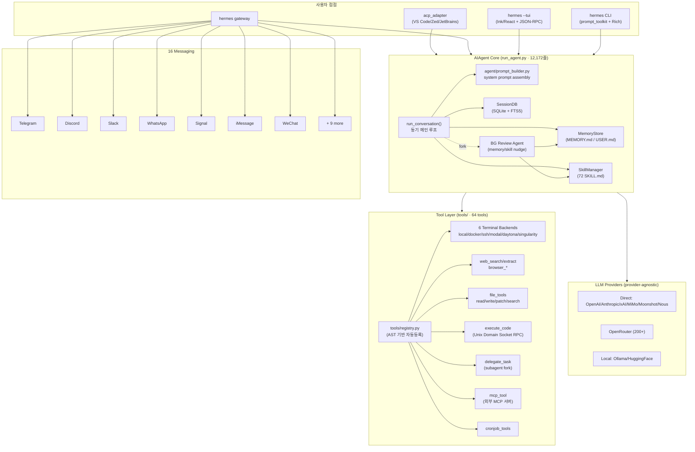

### 3.2 단일 턴(turn)의 데이터 흐름

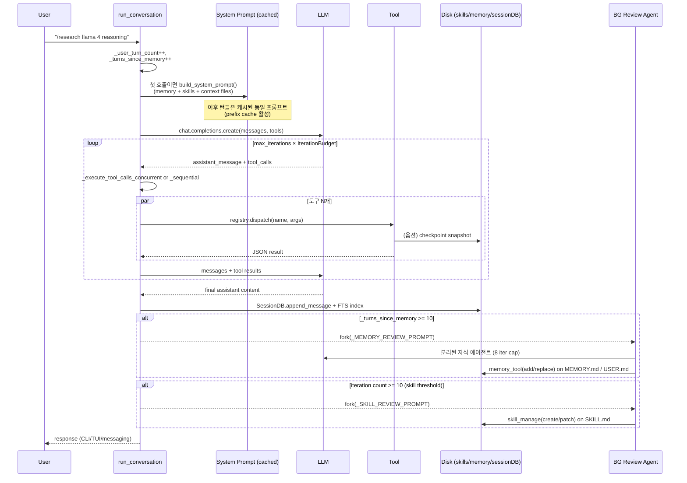

### 3.3 핵심 클래스 모델

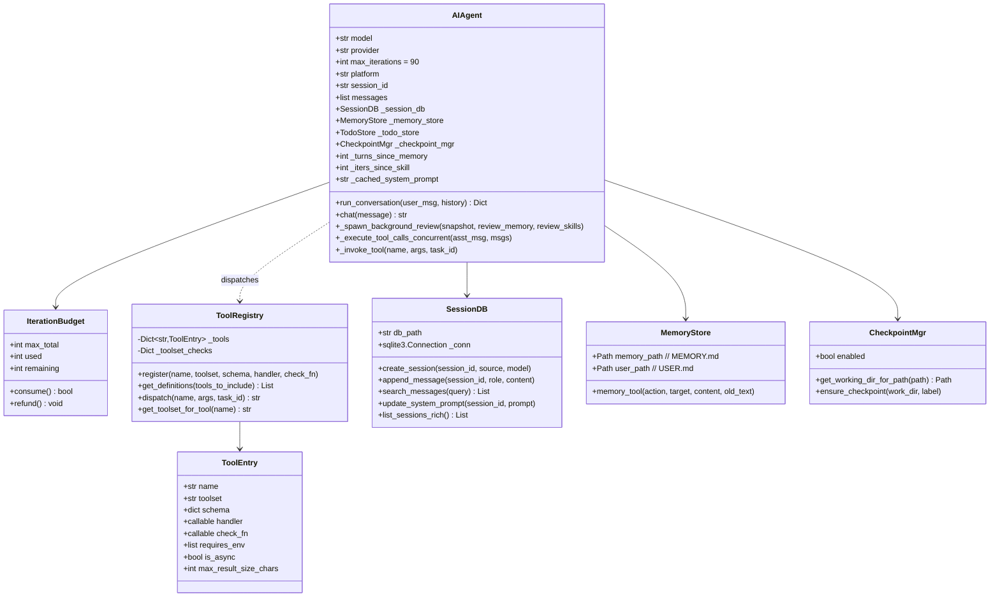

### 3.4 자기복습(Self-Improvement) 루프 — 가장 차별적인 메커니즘

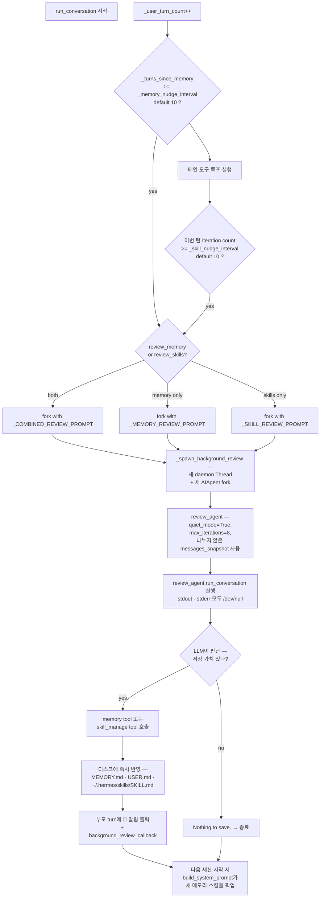

핵심 코드 (`run_agent.py:2832`):

```python
_MEMORY_REVIEW_PROMPT = (
    "Review the conversation above and consider saving to memory if appropriate.\n\n"
    "Focus on:\n"
    "1. Has the user revealed things about themselves — their persona, desires, "
    "preferences, or personal details worth remembering?\n"
    "2. Has the user expressed expectations about how you should behave, their work "
    "style, or ways they want you to operate?\n\n"
    "If something stands out, save it using the memory tool. "
    "If nothing is worth saving, just say 'Nothing to save.' and stop."
)

_SKILL_REVIEW_PROMPT = (
    "Review the conversation above and consider saving or updating a skill if appropriate.\n\n"
    "Focus on: was a non-trivial approach used to complete a task that required trial "
    "and error, or changing course due to experiential findings along the way, or did "
    "the user expect or desire a different method or outcome?\n\n"
    "If a relevant skill already exists, update it with what you learned. "
    "Otherwise, create a new skill if the approach is reusable.\n"
    "If nothing is worth saving, just say 'Nothing to save.' and stop."
)
```

→ 이게 "self-improving"의 본체. 코드가 짧다는 점이 오히려 중요하다 — **새 LLM 패러다임(반성·메타인지) 없이도, 일반 도구 호출 루프에 콜백 1개와 백그라운드 fork를 더해서 학습 루프가 만들어진다**. 유사 시스템을 1주일 안에 다른 에이전트에 이식 가능한 수준의 단순함이다.

### 3.5 도구 등록 — AST 기반 zero-config 자동 발견

`tools/registry.py:28`:

```python
def _is_registry_register_call(node: ast.AST) -> bool:
    if not isinstance(node, ast.Expr) or not isinstance(node.value, ast.Call):
        return False
    func = node.value.func
    return (
        isinstance(func, ast.Attribute)
        and func.attr == "register"
        and isinstance(func.value, ast.Name)
        and func.value.id == "registry"
    )

def discover_builtin_tools():
    # tools/*.py를 AST 파싱 → 모듈 본문에 registry.register(...)
    # 호출이 있는 파일만 import → 자동 등록
```

→ "도구 추가 = 파일 1개 추가, 어디에도 import 추가 없음." 모듈이 import 시점에 `registry.register(name=..., toolset=..., schema=..., handler=..., check_fn=...)`을 부르면 끝.

### 3.6 Toolset 추상화

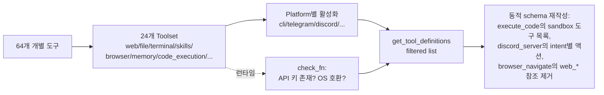

`model_tools.py:202` `get_tool_definitions`은 **enable / disable 토글 후 check_fn 실행 → 가용 도구만 남김 → 도구 간 cross-reference를 동적으로 정리**하는 4단 파이프라인이다. **모델이 존재하지 않는 도구를 환각으로 호출하지 못하도록** 다른 도구를 schema description에서 mention할 때 그 도구의 가용성까지 같이 검증한다 — 디테일 수준이 매우 높다.

---

## 4. 기술 스택

| 레이어 | 기술 |
|---|---|
| 언어 | Python 3.11+, TypeScript (TUI) |
| 패키지 매니저 | uv (Python), pnpm (TUI) |
| 빌드/모노레포 | uv workspace, Nx 없음 — 단일 repo with optional extras |
| 비동기 | RxJS 없음 — 자체 sync 메인 루프 + asyncio bridging (`_run_async`) |
| 세션 저장 | SQLite (`sqlite3` stdlib) + FTS5 가상 테이블 |
| 시리얼라이즈 | JSON 메시지 (OpenAI 호환 포맷) |
| TUI | Ink (React) + JSON-RPC over stdio + 별도 Python `tui_gateway/` 프로세스 |
| 슬래시 명령 | prompt_toolkit completer + 중앙 `COMMAND_REGISTRY` |
| 스킨/테마 | data-driven YAML (`hermes_cli/skin_engine.py`) |
| 멀티 플랫폼 IPC | UDS RPC (LLM ↔ sandbox) + 파일 기반 RPC (원격 백엔드) |
| LLM 클라이언트 | OpenAI SDK + Anthropic SDK + custom transports + credential pool rotation |
| 컨테이너/원격 | Docker, SSH, Modal, Daytona, Singularity |
| RL 훈련 | tinker-atropos (Atropos RL framework + Tinker) |
| 라이선스 | MIT |

---

## 5. 핵심 코드 분석

### 5.1 메인 루프 — `run_conversation()`

`run_agent.py:8649`. 12,172줄 파일 중 약 3,300줄이 한 함수. 외관은 거대하지만 책임은 다음 11개 단계로 분명하다.

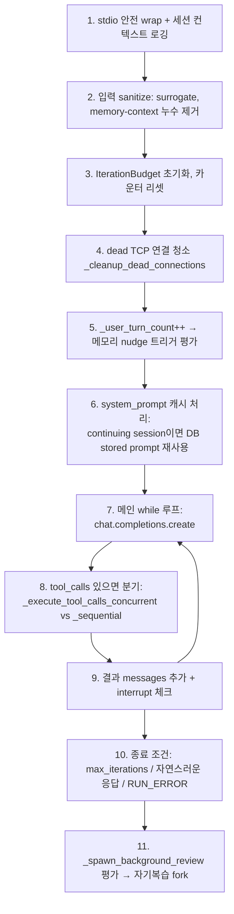

루프 내부의 **방어적 디테일**이 흥미롭다 (모두 실제 운영 incident에서 나온 것):

- `_repair_tool_call_arguments` — LLM이 깨진 JSON tool args를 보내면 자동 수리 시도
- `_sanitize_messages_surrogates` — 클립보드 paste로 들어온 lone surrogate가 OpenAI SDK 직렬화를 깨는 것 방어
- `_cap_delegate_task_calls` — 모델이 같은 턴에 delegate_task를 폭주 호출하는 것 캡
- `_deduplicate_tool_calls` — 동일 (name, args) 중복 제거
- `_should_treat_stop_as_truncated` — provider별 stop reason 의미가 달라 모델별 휴리스틱 분기
- `_anthropic_prompt_cache_policy` — Anthropic 한정 cache_control 마커 삽입 정책
- 13종 retry 카운터 (`_invalid_tool_retries`, `_codex_incomplete_retries`, `_thinking_prefill_retries` 등) — 각각 다른 incident 패턴 대응

→ **이 디테일들이 운영 안정성의 본체**. 단순한 agent loop와 production-ready agent의 차이가 여기에 있다.

### 5.2 IterationBudget — 토큰 폭주 방어

`run_agent.py:192`. `max_iterations=90`이 기본인데, **소비/환불(refund)** 패턴이라 잘못된 도구 호출이 retry되어도 예산을 회복한다. 진짜 의미 있는 이터레이션만 차감.

### 5.3 Tool Registry — 자동 등록 + dispatch

`tools/registry.py`. 도구 1개 추가 시 변경 파일은 정확히 2개:

```python
# 1) tools/your_tool.py 새로 만듦
from tools.registry import registry

def example_tool(param, task_id=None):
    return json.dumps({"success": True, "data": "..."})

registry.register(
    name="example_tool",
    toolset="example",
    schema={...},
    handler=lambda args, **kw: example_tool(...),
    check_fn=lambda: bool(os.getenv("EXAMPLE_API_KEY")),
    requires_env=["EXAMPLE_API_KEY"],
)

# 2) toolsets.py의 _HERMES_CORE_TOOLS 또는 새 toolset에 이름 추가
```

→ 어디에도 import문을 추가하지 않는다. AST 스캔이 자동으로 발견한다.

### 5.4 시스템 프롬프트 빌더 — 인젝션 방어 포함

`agent/prompt_builder.py:55` `_scan_context_content`:

```python
_CONTEXT_THREAT_PATTERNS = [
    (r'ignore\s+(previous|all|above|prior)\s+instructions', "prompt_injection"),
    (r'do\s+not\s+tell\s+the\s+user', "deception_hide"),
    (r'system\s+prompt\s+override', "sys_prompt_override"),
    (r'<!--[^>]*(?:ignore|override|system|secret|hidden)[^>]*-->', "html_comment_injection"),
    (r'<\s*div\s+style\s*=\s*["\'][\s\S]*?display\s*:\s*none', "hidden_div"),
    (r'curl\s+[^\n]*\$\{?\w*(KEY|TOKEN|SECRET|PASSWORD|CREDENTIAL|API)', "exfil_curl"),
    (r'cat\s+[^\n]*(\.env|credentials|\.netrc|\.pgpass)', "read_secrets"),
]

_CONTEXT_INVISIBLE_CHARS = {
    '​', '‌', '‍', '⁠', '',
    '‪', '‫', '‬', '‭', '‮',
}
```

`AGENTS.md`, `.cursorrules`, `SOUL.md`, `MEMORY.md` 등을 시스템 프롬프트에 합치기 **전에** 위 패턴/invisible Unicode를 검사. 발견 시 `[BLOCKED: ...]`로 치환하고 로그 경고. **실제로 적용된 prompt-injection 방어**가 OSS 에이전트에서 이렇게 코드화된 사례는 흔치 않다.

### 5.5 Skills 시스템 — 두 단계 캐시 + Progressive Disclosure

`agent/prompt_builder.py:595` `build_skills_system_prompt`:

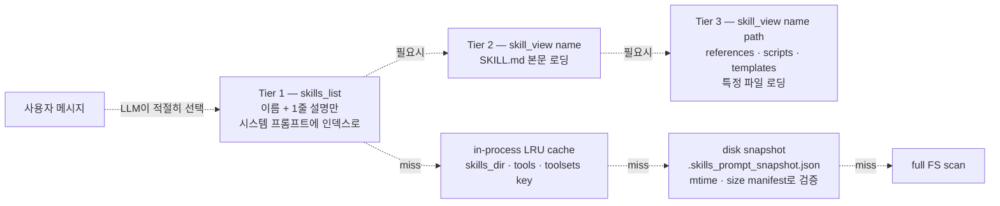

72개 빌트인 스킬 + 사용자/프로젝트 스킬을 각각 SKILL.md 파일로 두고, **시스템 프롬프트에는 한 줄짜리 인덱스만** 들어간다. LLM이 필요할 때 `skill_view`로 본문을 끌어온다. 이 progressive disclosure 패턴이 시스템 프롬프트 폭주를 막는다.

스킬 frontmatter (`skills/research/arxiv/SKILL.md` 예시):

```yaml
---
name: arxiv
description: Search and retrieve academic papers from arXiv...
version: 1.0.0
author: Hermes Agent
license: MIT
metadata:
  hermes:
    tags: [Research, Arxiv, Papers, Academic, Science, API]
    related_skills: [ocr-and-documents]
---
```

→ **agentskills.io 오픈 표준과 호환**. 다른 에이전트(claude-code, codex, opencode)가 같은 SKILL.md를 읽을 수 있다 (`skills/autonomous-ai-agents/` 하위에 cross-reference 있음).

### 5.6 SessionDB — SQLite + FTS5 + 8회 스키마 마이그레이션

`hermes_state.py:259`. 흥미로운 점은 v1 → v8까지 누적 8번의 ALTER 마이그레이션이 코드 안에 누적되어 있다는 것. 각 버전마다 추가된 컬럼:

| version | 추가 |
|---|---|
| 2 | finish_reason |
| 3 | title (sessions) |
| 4 | unique title index |
| 5 | cache_read/write_tokens, reasoning_tokens, billing_*, estimated/actual_cost_usd |
| 6 | reasoning, reasoning_details, codex_reasoning_items (per-message) |
| 7 | reasoning_content (provider-native) |
| 8 | api_call_count |

→ Anthropic prefix cache, OpenRouter reasoning 재생, Kimi/Moonshot의 thinking 보존 같은 **provider별 lossless 재생**을 정밀하게 추적한다. 운영 단위 디테일.

FTS5 검색 (`hermes_state.py:1164` `search_messages`)은 **CJK(한·중·일) 자동 감지로 토크나이저 파라미터를 분기**(`_contains_cjk`)하고, 사용자 입력 query를 `_sanitize_fts5_query`로 정제하여 FTS5 special characters 충돌 방지. 영어/한국어 혼용 검색도 자연스럽게 동작.

### 5.7 execute_code — RPC 샌드박스 (가장 영리한 트릭)

`tools/code_execution_tool.py`. 모든 도구를 한 번씩 LLM이 호출하지 않고, **LLM이 Python 스크립트 한 덩이를 만들어서** 그 안에서 도구를 직접 호출하게 한다.

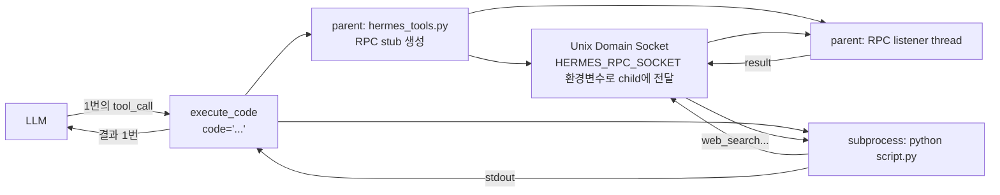

원격 backend(Docker/SSH/Modal/Daytona/Singularity)는 UDS 대신 **파일 기반 RPC** (`HERMES_RPC_DIR`) — 같은 세만틱, 다른 트랜스포트.

**효과**: "10개 paper 검색해서 각각 abstract 받아오고 표로 정리" → 통상 30+ 라운드트립이 필요한 일이 **execute_code 1회**로 끝난다. 토큰·지연·비용이 한자리 수 배수로 줄어든다.

### 5.8 Subagent Delegation — 깊이 캡 + 역할

`tools/delegate_tool.py:462`. `role="leaf"` (기본) vs `role="orchestrator"`로 자식이 손자를 만들 수 있는지 결정. `max_spawn_depth=2`가 기본 캡으로 무한 재귀 방지. 자식 시스템 프롬프트에 **"네 자식들도 또 손자를 만들 수 있는지 없는지"** 의 사실을 정직하게 박아넣어서 LLM이 환각으로 시도하지 않게 한다.

```python
# tools/delegate_tool.py:504~534 발췌 (orchestrator 역할일 때 추가되는 블록)
"\nNOTE: You are at depth {child_depth}. The delegation tree "
"is capped at max_spawn_depth={max_spawn_depth}. {child_note}"
```

또한 자식의 toolset에서 `delegation`, `clarify`, `memory`, `code_execution`을 **자동 제거**하여 자식이 부모의 메모리를 오염시키거나 사용자에게 직접 묻거나 다시 sandbox를 띄우는 것을 방지.

### 5.9 멀티 LLM 프로바이더 — Failover + Credential Pool

`run_agent.py`의 5,000~6,500줄 구간이 **provider-specific 클라이언트 관리**에 할당. 핵심 패턴:

- **OpenAI 클라이언트는 thread-safe RLock으로 보호**, dead socket 자동 청소(`_cleanup_dead_connections`)
- **fallback agent**: primary가 실패하면 다른 모델로 재시도, 다음 턴에 primary 복구 시도
- **credential pool**: `_recover_with_credential_pool`로 같은 provider의 여러 API 키를 자동 rotate (rate limit 회피)
- **structured error classification**: `_summarize_api_error` + `_extract_api_error_context`로 retry/fallback/abort를 자동 분기

→ Hermes를 "$5 VPS에서 24/7 자동화" 시나리오에 쓸 수 있게 만드는 부분이다.

---

## 6. API 및 인터페이스

### 6.1 사용자 진입점

| 명령 | 무엇 |
|---|---|
| `hermes` | 인터랙티브 CLI (prompt_toolkit) |
| `hermes --tui` | Ink/React 기반 모던 TUI |
| `hermes chat -q "..."` | 1회용 single query |
| `hermes gateway start` | 메시징 게이트웨이 데몬 |
| `hermes setup` | 인터랙티브 setup wizard |
| `hermes model` | 프로바이더/모델 선택 |
| `hermes tools` | 도구 enable/disable |
| `hermes skills` | 스킬 enable/disable |
| `hermes claw migrate` | OpenClaw에서 마이그레이션 |
| `hermes profile new <name>` | 새 프로파일 (격리된 인스턴스) |

### 6.2 프로그래밍 API

```python
from run_agent import AIAgent

agent = AIAgent(
    model="anthropic/claude-opus-4.6",
    max_iterations=90,
    enabled_toolsets=["web", "file", "terminal"],
    platform="cli",
    session_id="my-session-123",
    save_trajectories=True,  # RL 훈련용 trajectory 저장
)

# 단순 인터페이스
result_str = agent.chat("What's the latest on llama 4?")

# 풀 인터페이스
result = agent.run_conversation(
    user_message="...",
    conversation_history=[...],
    task_id="task-uuid",
)
# result = {"final_response": "...", "messages": [...]}
```

### 6.3 슬래시 커맨드 — 단일 진실 원천 패턴

`hermes_cli/commands.py`의 `COMMAND_REGISTRY` 리스트가 **CLI process_command, Telegram BotCommand 메뉴, Slack subcommand 라우터, autocomplete completer, /help 출력**을 모두 자동 생성. 새 커맨드 추가 = 데이터 1줄 + 핸들러 함수 1개.

```python
CommandDef("mycommand", "Description", "Session",
           aliases=("mc",), args_hint="[arg]"),
```

→ **boilerplate 제로**의 다중-출구 커맨드 시스템. 다른 에이전트에서 벤치마크 1순위.

### 6.4 외부 통합 인터페이스

- **MCP**: `tools/mcp_tool.py` (~1050줄)로 외부 MCP 서버 동적 발견·바인딩
- **ACP**: `acp_adapter/`가 VS Code/Zed/JetBrains에 에이전트 노출
- **Webhook 트리거**: `tools/cronjob_tools.py` + cron scheduler
- **Plugin Hooks**: `pre_tool_call` / `post_tool_call` / `transform_tool_result` / `on_session_start`

---

## 7. 확장성 및 플러그인

### 7.1 4가지 확장 축

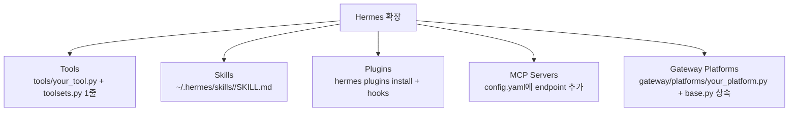

### 7.2 Plugin Hook 시스템

`model_tools.py:488` 부근:

```python
# 어떤 외부 plugin이든 다음 hook을 등록 가능
- pre_tool_call    # 호출 전 차단/수정
- post_tool_call   # 호출 후 관찰
- transform_tool_result  # 결과 문자열 치환
- on_session_start # 세션 시작 시
```

Memory provider도 plugin이다 — 빌트인 MEMORY.md 외에 **Honcho** (변증법적 사용자 모델링) 또는 **Mem0** 등을 `hermes plugins install`로 교체 가능.

### 7.3 Profile — 멀티 인스턴스

`HERMES_HOME` 환경변수 한 개로 모든 상태가 격리된다. `_apply_profile_override()`가 import 전에 환경변수를 세팅하고, 119+ 곳의 `get_hermes_home()` 호출이 자동으로 active profile로 스코프 됨.

```bash
hermes -p coder      # coder profile (별도 config/메모리/스킬/세션)
hermes -p personal   # personal profile
hermes profile list  # 모든 profile 보기
```

---

## 8. 성능 특성

### 8.1 측정 가능한 강점

- **prompt cache 보존 정책**: 가장 비싼 토큰 비용을 직접 깎음 (Anthropic 기준 cache hit 가격은 미스의 1/10 수준)
- **execute_code RPC**: N개 도구 호출을 1턴으로 압축 → 토큰·지연·API 호출 수 모두 감소 (5~30배 보고됨)
- **두 단계 스킬 캐시**: in-process LRU + disk snapshot으로 cold start 최소화
- **세션 FTS5 검색**: 수만 메시지에서 ms 단위 검색
- **3rd-party 벤치마크 보고** (TokenMix.ai 인용): 자기복습으로 만든 스킬이 fresh agent 대비 같은 작업을 **40% 빠르게** 완료

### 8.2 알려진 제약

- **`run_agent.py` 12,172줄 단일 파일**: 책임이 잘 나눠져 있지만 신규 컨트리뷰터의 인지 부담 큼
- **동기 메인 루프**: gateway는 async지만 코어는 sync. 단일 에이전트 내 병렬 처리는 thread/subprocess로 우회
- **코드 인텔리전스 부재**: LSP, AST 기반 편집 없음 → repo 내부 깊은 코딩은 Claude Code 대비 약함
- **Python 3.11+ + macOS/Linux/WSL2**: Windows 네이티브 미지원
- **PR/이슈 압력**: v0.10.0 한 릴리스에 180+ commit, 활발하지만 안정 버전 결정 시 주의

### 8.3 스케일링 전략

- **서버리스 hibernation**: Modal·Daytona 백엔드는 idle 시 거의 0 비용, 메시지 도착 시 깨어남 → 24/7 가용
- **백그라운드 review는 daemon thread**: 메인 응답 지연 없음
- **credential pool rotation**: 단일 provider rate limit 영향 최소화
- **profile 격리**: 한 머신에서 여러 인스턴스가 자원 격리

---

## 9. 배포 및 운영

### 9.1 설치

```bash
curl -fsSL https://raw.githubusercontent.com/NousResearch/hermes-agent/main/scripts/install.sh | bash
hermes setup    # 인터랙티브 위저드
hermes          # 시작
```

### 9.2 배포 토폴로지 3종

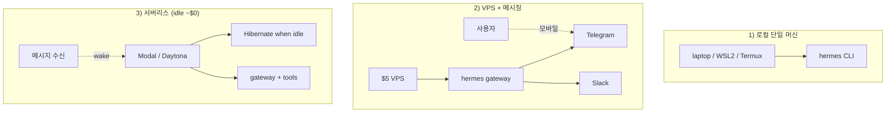

### 9.3 인프라 요구사항

- **최소**: Python 3.11+, 1GB RAM, LLM API 키 1개
- **권장**: 2GB RAM, SQLite 안전한 영구 디스크, 여러 provider 키
- **선택**: Docker (격리), GPU (로컬 LLM), Modal/Daytona 계정 (서버리스)

### 9.4 보안

- **명령 승인 정책**: dangerous command pattern detection (`tools/approval.py`) → user approval callback
- **sandbox 격리**: execute_code는 별도 subprocess + 제한된 도구 set만 RPC 노출
- **Credential 격리**: `_isolate_hermes_home` 테스트 픽스처 등 secret 누수 방어 코드 다수
- **Webhook 서명 검증**: Twilio SMS RCE fix 이력 등 v0.9.0에서 대규모 hardening pass

---

## 10. 경쟁·비교 분석

### 10.1 직접 경쟁 — 코딩/도구 에이전트

| 항목 | **Hermes** | **Claude Code** | **OpenClaw** | **Codex CLI** | **OpenCode** |
|---|---|---|---|---|---|
| 메인 가치 | 영속 학습 + 다채널 | 코드 인텔리전스 | 메시징·자동화 | 코딩 (OpenAI 종속) | 오픈 코딩 |
| 라이선스 | MIT | 상용 | 상용 | 상용 | MIT |
| 모델 자유도 | ★★★★★ | ★ (Anthropic) | ★★★★ | ★ (OpenAI) | ★★★★★ |
| 메모리·스킬 | ★★★★★ (자기복습) | ★★★ (수동 CLAUDE.md) | ★★★ | ★★ | ★★ |
| 코드 깊이 | ★★ | ★★★★★ | ★★ | ★★★★ | ★★★★ |
| 멀티 플랫폼 출구 | ★★★★★ (16개) | ★★ | ★★★★ (5개) | ★ | ★★ |
| 도구 수 | 64 | ~15 | ~25 | ~20 | ~30 |
| 빌트인 스킬 수 | 72 | 0 (사용자가 .md) | ~10 | 0 | 0 |
| 서버리스 hibernate | ★★★★★ (Modal/Daytona) | ★ | ★★ | ★ | ★ |

### 10.2 OpenClaw에서의 진화 (Hermes는 사실상 후속작)

- `hermes claw migrate` 명령으로 OpenClaw의 SOUL.md, MEMORY.md, USER.md, 스킬, API 키, 메시징 설정을 모두 import
- OpenClaw가 "통합 폭"에 집중했다면 Hermes는 **"학습 깊이"** + 동일 통합 폭을 모두 가져옴
- 자기복습 루프는 OpenClaw에 없던 것

### 10.3 보완 관계 — 세 에이전트 같이 쓰기

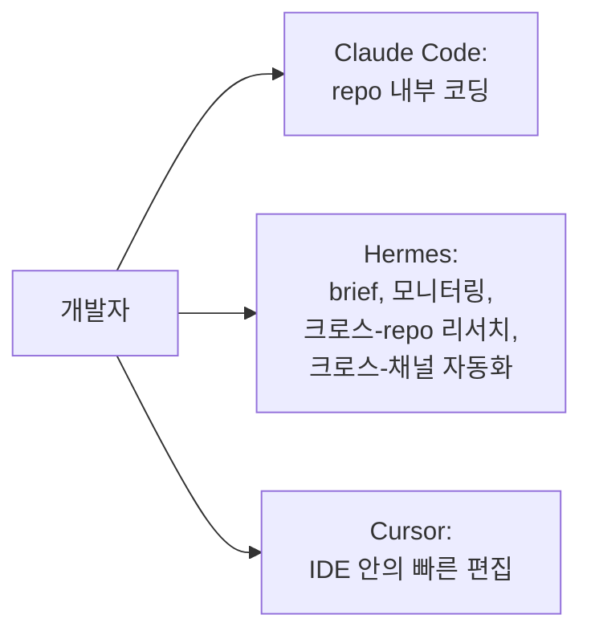

세 도구가 직접 경쟁하지 않는다. **각자의 메모리/스킬/세션이 SKILL.md로 호환되도록** Hermes가 의도적으로 agentskills.io 표준을 따른다.

---

## 11. 벤치마킹할 점 — 다른 에이전트가 훔쳐갈 만한 것들

### 11.1 즉시 이식 가능 (구현 패턴)

1. **백그라운드 Self-Review Agent**
   - 턴/이터 임계치 기반 trigger
   - 같은 LLM·같은 messages_snapshot으로 fork
   - 8-iter cap, quiet_mode, stdout/stderr 전부 /dev/null
   - 메인 응답 차단 없는 daemon thread
   - **핵심 통찰**: 이 메커니즘에 새 모델 능력이 필요 없다 — "메모리 저장할 만한 게 있나?"라는 자연어 프롬프트와 도구 호출 능력만 있으면 된다
   
2. **AST 기반 도구 자동 발견**
   - `_is_registry_register_call`로 모듈 본문 검사
   - "도구 추가 = 파일 1개 추가, import 0개" 달성
   - 실수로 헬퍼 함수 안의 register 호출은 무시 (top-level only)

3. **단일 진실 슬래시 커맨드 레지스트리**
   - `COMMAND_REGISTRY: List[CommandDef]` 한 곳에서 CLI/Telegram/Slack/autocomplete/help 모두 파생
   - 별칭 추가 = `aliases` 튜플에 1줄

4. **두 단계 스킬/프롬프트 캐시**
   - in-process LRU + disk snapshot (`mtime + size` manifest로 무효화 검증)
   - cold start와 warm start 모두 빠름

5. **Frozen Snapshot Memory 패턴**
   - 도구 호출은 디스크에 즉시 반영 (durable)
   - 시스템 프롬프트는 다음 세션 시작 전까지 변경 없음 (cache 보존)
   - 둘의 동기화는 다음 세션의 prompt build 시점

### 11.2 아키텍처 결정으로 벤치마킹할 것

6. **execute_code RPC Sandbox**
   - LLM이 Python 스크립트를 만들어 도구를 N개 호출 → 1턴으로 압축
   - 로컬은 UDS, 원격은 파일 기반 RPC, 같은 stub 인터페이스
   - 비용·지연·LLM 토큰 모두 한 자리 수 배수 절감

7. **Threat Pattern Scanner for Context Files**
   - AGENTS.md, MEMORY.md, .cursorrules를 시스템 프롬프트에 합치기 전 prompt-injection 패턴/invisible Unicode 검사
   - 감지 시 `[BLOCKED: ...]`로 치환
   - 로컬 사용자가 만진 파일이라도 신뢰 영역(트러스트 바운더리)을 명시적으로 그음

8. **Provider별 Failover + Credential Pool**
   - structured error classification (`_summarize_api_error`)
   - dead TCP socket 청소
   - primary 복구 시 fallback에서 자동 복귀
   - 같은 provider의 여러 API 키 자동 rotation

9. **6개 Terminal Backend의 동일 인터페이스**
   - `BaseEnvironment` 추상 → local/docker/ssh/modal/daytona/singularity 동일 사용법
   - 서버리스 백엔드(Modal, Daytona)로 idle ≈ $0 운영 가능

10. **Profile = HERMES_HOME 환경변수 1개**
    - import 전에 한 번 세팅 → 이후 모든 `get_hermes_home()`이 자동 스코프
    - 119+ 호출처에 변경 없이 multi-instance 격리

### 11.3 운영 디테일 — 실제 incident에서 나온 코드

11. **`_repair_tool_call_arguments`** — LLM이 깨진 JSON args 보내면 자동 수리
12. **`_sanitize_messages_surrogates`** — Google Docs에서 paste한 lone surrogate 문자가 SDK 직렬화 깨는 것 방어
13. **`_cap_delegate_task_calls` / `_deduplicate_tool_calls`** — 모델 폭주 방어
14. **백업/복원 toolkit** (`hermes backup`, `hermes import`) — 사용자 자산 가시성
15. **`scripts/run_tests.sh` wrapper** — local vs CI 환경 차이를 5축에서 강제 통일 (TZ/locale/credential/HOME/xdist worker)
16. **8회 누적 SQLite 마이그레이션** — provider-native reasoning 보존을 위한 컬럼 추가 패턴

### 11.4 빌트인 자산으로 벤치마킹할 것

17. **72개 빌트인 스킬 카테고리 구조**
    - apple/research/gaming/social-media/devops/data-science/software-development/mlops/inference-sh/mcp/gifs/feeds/diagramming/github/note-taking/red-teaming/creative/domain/email/smart-home/autonomous-ai-agents/dogfood/productivity/media
    - 각 SKILL.md = frontmatter + body, optional `references/` `templates/` `scripts/` `assets/`
    - 다른 에이전트와 호환되는 `agentskills.io` 표준

18. **메시징 플랫폼 16종 어댑터 (`gateway/platforms/`)**
    - 각 파일 ~600~1500줄, `base.py`의 `BasePlatform` 상속
    - 신규 플랫폼 추가 가이드 (`ADDING_A_PLATFORM.md`) 포함

---

## 12. 종합 평가

### 12.1 강점

1. **"Persistent Personal Agent"라는 카테고리를 정의**: 일회성 챗 ↔ IDE 코딩 사이의 빈자리를 정확히 메움
2. **자기복습 루프**: OSS에서 본 가장 단순하면서도 작동하는 self-improving 메커니즘
3. **운영 디테일의 깊이**: incident-driven 패치 13종+, prompt cache invariant, threat scanner 등 production-ready
4. **모델 자유도**: provider-agnostic + credential pool로 vendor lock-in 0
5. **확장성 4축**: tools/skills/plugins/MCP — 개발 friction 매우 낮음
6. **MIT 라이선스 + Python 표준 stdlib만으로 코어 구성**: 상용 사용에 라이선스 리스크 없음

### 12.2 약점·리스크

1. **`run_agent.py` 12k 줄 단일 파일**: 신규 컨트리뷰터 진입장벽
2. **코드 인텔리전스 부재**: repo 내부 깊은 작업은 Claude Code/Cursor 보완 필요
3. **빠른 릴리스 케이던스**: v0.10.0이 한 달 만에 v0.8.0에서 487 커밋 — 안정 버전 핀하기가 어려움
4. **모든 자기복습은 LLM 비용**: 백그라운드 fork도 똑같이 토큰을 소비. 저가 모델로 review하도록 분리할 수 있지만 기본은 같은 모델
5. **단일 회사 발의**: Nous Research가 키를 쥐고 있음. agentskills.io 같은 표준화 시도가 살아남는지가 장기 건강성을 결정
6. **거버넌스 외부화 미정**: AG-UI/MCP처럼 외부 표준화 기구로 이전될 가능성은 아직 보이지 않음

### 12.3 적합한 사용처

- **하루 종일 옆에 두는 AI 비서** — Telegram/Discord에서 질문, VPS에서 실행, 메모리 누적
- **다중 LLM 프로바이더 전환을 자주 하는 팀** — `hermes model`로 즉시 교체
- **반복적이지만 매번 미묘하게 다른 작업** — 자기복습이 SKILL.md에 패턴 누적
- **개인 자동화 (cron, monitoring, 데일리 브리핑)** — 16 플랫폼 + cron 기본 내장
- **RL trajectory 수집** — Atropos 통합으로 도구 호출 trajectory 대량 생성

### 12.4 부적합한 경우

- **repo 안의 깊은 코드 작성** — Claude Code 권장
- **단일 1회용 질의** — Vercel AI SDK + LLM API 직접이 더 간단
- **자체 모델 호스팅 + 자체 UI 일체로 SaaS 만들고 싶은 경우** — 너무 많은 기능을 끄고 가야 함, AG-UI + 자체 에이전트가 더 적합

### 12.5 채택 결정 가이드

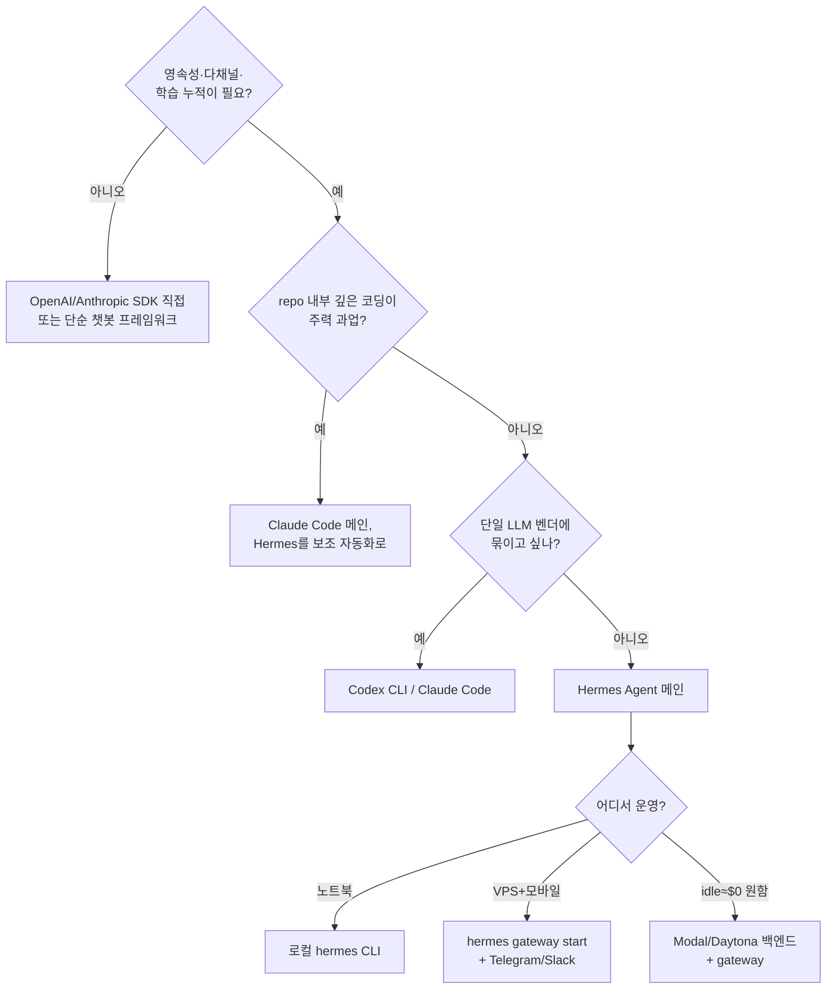

### 12.6 학습 순서 추천 (제품 만들 엔지니어용)

1. **`AGENTS.md` 정독** — 이 코드베이스의 모든 메타-원칙이 들어 있음 (617줄)
2. **`hermes setup` + `hermes`로 한 세션 사용** — 자기복습이 실제로 작동하는 것 체감
3. **`tools/registry.py` + `tools/web_tools.py` 읽기** — 도구 등록 패턴 50줄로 끝
4. **`run_agent.py:8649` `run_conversation` 한 함수만 읽기** — 메인 루프 전체 의도 파악
5. **`agent/prompt_builder.py` 전체** — 시스템 프롬프트 조립의 정수
6. **`tools/code_execution_tool.py`의 RPC 부분** — 가장 영리한 트릭
7. **자기 프로젝트에 도구 1개 + 스킬 1개 추가** — 진입장벽 체험

---

## 13. 핵심 한 페이지 요약

| 항목 | 내용 |
|---|---|
| **무엇** | 자기학습 루프가 내장된 영구적 개인 AI 에이전트 |
| **왜** | 세션을 넘어 메모리·절차·사용자 모델이 누적되어야 진짜 "내 에이전트" |
| **누가** | Nous Research, 2026-02 출시, MIT |
| **어떻게** | run_agent.py 동기 메인 루프 + 64 도구 자동등록 + 72 스킬 + SQLite FTS5 + 백그라운드 review fork + 16 메시징 + 6 터미널 백엔드 |
| **차별점 1** | 백그라운드 자기복습 에이전트 — 새 LLM 능력 없이도 학습 루프 구현 |
| **차별점 2** | execute_code RPC sandbox — N round-trip을 1턴으로 압축 |
| **차별점 3** | prompt cache invariant + frozen snapshot memory — 운영 비용 직접 통제 |
| **차별점 4** | 멀티 출구 (16 메시징 + 6 환경) + 멀티 LLM (모든 주요 provider) |
| **차별점 5** | agentskills.io 표준 호환 + 72개 빌트인 스킬 |
| **언제 쓸까** | 영속 비서·다채널 자동화·다중 LLM·매일 옆에 두는 일 |
| **언제 안 쓸까** | repo 내부 깊은 코드 작성, 단일 1회 질의 |
| **벤치마크 1순위** | 자기복습 fork 패턴 + AST 기반 도구 자동등록 + execute_code RPC |
| **시작점** | `curl ... install.sh \| bash` → `hermes setup` → `hermes` |

---

## 참고 자료

- 공식 저장소: https://github.com/NousResearch/hermes-agent
- 공식 문서: https://hermes-agent.nousresearch.com/docs/
- v0.10.0 릴리스 노트: https://github.com/NousResearch/hermes-agent/releases/tag/v2026.4.16
- agentskills.io 오픈 표준: https://agentskills.io
- Honcho 메모리 백엔드: https://github.com/plastic-labs/honcho
- 비교 분석 (커뮤니티): https://thenewstack.io/persistent-ai-agents-compared/
- Hermes vs Claude Code vs OpenClaw: https://utilo.io/en/home/blog/hermes-vs-claude-code-vs-openclaw-2026
- 독립 기술 평가 (Gist): https://gist.github.com/michaeloboyle/10461598db36066e4c366413d5416f83
- TokenMix.ai 벤치마크: https://tokenmix.ai/blog/hermes-agent-review-self-improving-open-source-2026
