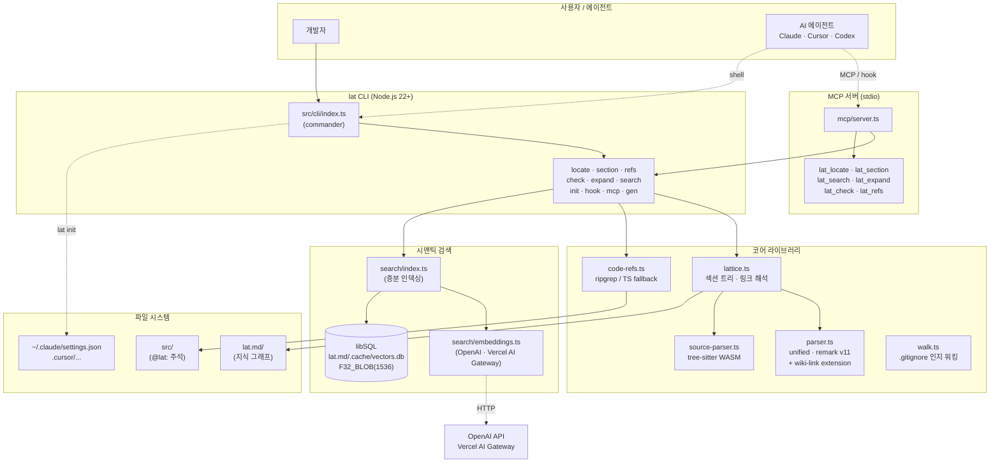
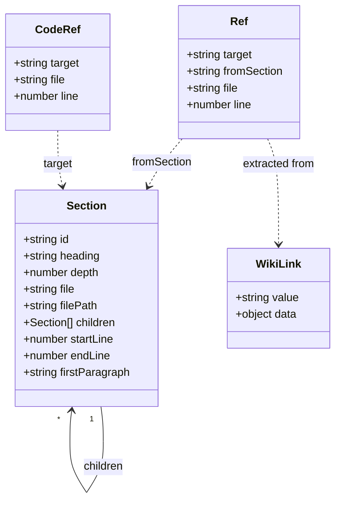
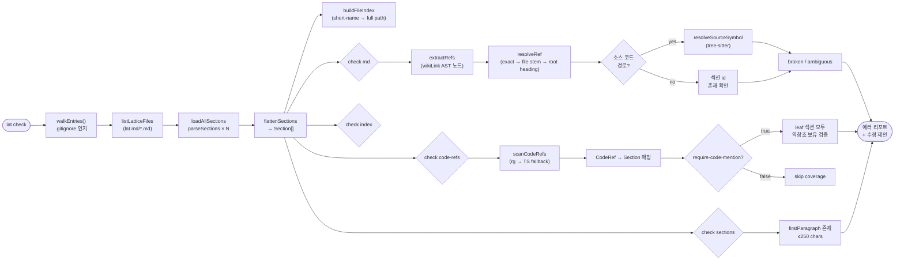
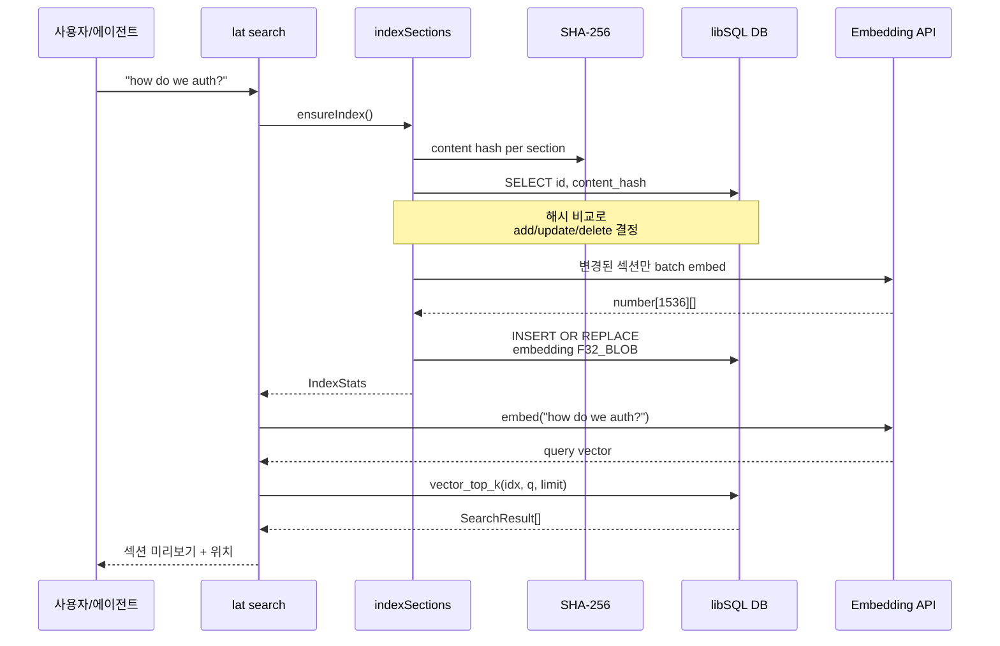
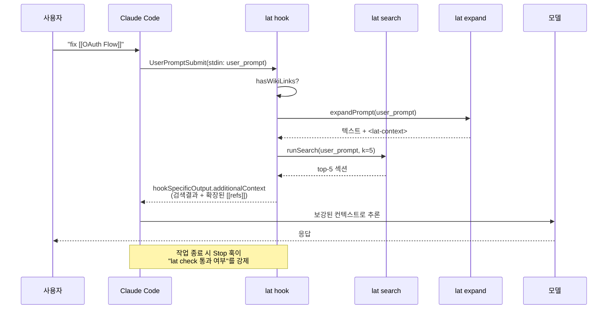
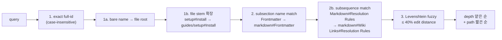
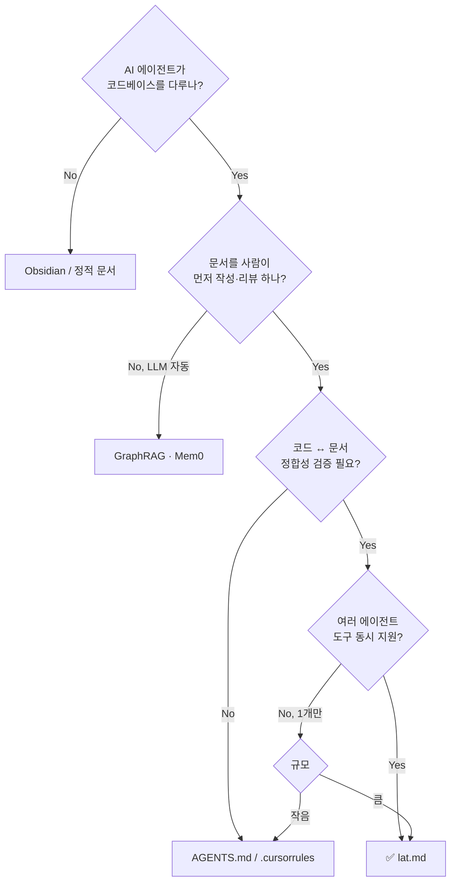

# lat.md — 코드베이스를 위한 마크다운 지식 그래프

> **분석 대상**: [github.com/1st1/lat.md](https://github.com/1st1/lat.md) v0.11.0
> **저자**: Yury Selivanov (`1st1`) — asyncio·EdgeDB 창시자
> **라이선스**: MIT
> **npm**: [`lat.md`](https://www.npmjs.com/package/lat.md)
> **언어**: TypeScript 96.3% (ESM, Node.js 22+)
> **참고 문헌**: [PyTorch KR 소개글](https://discuss.pytorch.kr/t/lat-md-agent-lattice-ai/10095), `_repos/lat.md/` 로컬 클론

---

## 1. 프로젝트 개요

**lat.md(Lattice Markdown, "Agent Lattice")** 는 코드베이스의 도메인 지식과 설계 의사결정을 *마크다운으로 표현된 지식 그래프*로 관리하는 **CLI 도구이자 워크플로우**다. `AGENTS.md` 같은 단일 평탄 파일 방식이 프로젝트 규모와 함께 확장되지 않는다는 문제의식에서 출발했고, AI 코딩 에이전트가 코드를 grep으로 헤매거나 누락된 컨텍스트를 환각으로 채우지 않도록 **"먼저 검색 가능한 정형 컨텍스트"** 를 제공한다.

### 해결하려는 문제

- **`AGENTS.md`/`CLAUDE.md`/`.cursor/rules` 단일 파일의 스케일 한계** — 프로젝트가 커지면 한 파일에 다 못 담는다.
- **설계 의사결정의 문서 유실** — 왜 그렇게 짰는지가 PR 코멘트·Slack 스레드에 갇혀 사라진다.
- **에이전트 환각** — 컨텍스트가 없는 영역에서 LLM은 그럴듯한 거짓을 만든다.
- **세션 간 컨텍스트 단절** — 한 세션에서 쌓은 추론이 다음 세션에서 사라진다.
- **테스트 명세–구현 추적 부재** — "어떤 테스트가 어떤 스펙을 검증하는가"가 코드 어디에도 표시되지 않는다.

### 핵심 아이디어 — "양방향 그래프"

```
lat.md/ 디렉터리   ←  [[wiki links]]  →   lat.md/ 디렉터리
       ↓                                          ↑
[[src/auth.ts#validateToken]]            // @lat: [[auth#OAuth Flow]]
       ↓                                          ↑
       └─────────── 소스 코드 ───────────────────┘
```

세 종류의 링크가 *지식 그래프*를 형성한다:

1. **섹션 → 섹션**: `[[file#Heading#Sub]]` — Obsidian 스타일 위키 링크
2. **섹션 → 코드 심볼**: `[[src/auth.ts#validateToken]]` — tree-sitter로 심볼 존재 검증
3. **코드 → 섹션**: `// @lat: [[section-id]]` (Python은 `#`) — 구현이 어떤 개념을 실현하는지 역참조

`lat check`가 이 세 방향의 정합성을 한꺼번에 강제하므로, *문서가 코드에 뒤처지지 않는다*. PR 리뷰는 "lat.md/ 변경분을 먼저 본 뒤 코드 diff를 본다"는 흐름이 가능해진다.

---

## 2. 핵심 특징 및 차별점

| 특징 | 상세 | 차별 포인트 |
|---|---|---|
| **그래프형 문서 구조** | 위키 링크로 연결된 다수의 작은 `.md` 파일 | "한 파일짜리 AGENTS.md"의 자연스러운 확장 |
| **소스 심볼 직접 참조** | `[[src/x.ts#fn]]` → tree-sitter가 실제 정의 존재 검증 | 단순 텍스트 링크 검증이 아닌 **AST 수준 검증** |
| **`@lat:` 역참조 강제** | `require-code-mention: true` 프론트매터로 leaf 섹션 → 코드 매핑 의무화 | 테스트 스펙 ↔ 테스트 코드의 **기계적 추적성** |
| **시맨틱 검색** | OpenAI `text-embedding-3-small` (1536d) → libSQL 벡터 인덱스 | 외부 인프라 없이 **로컬 파일 DB**(libSQL/SQLite)로 동작 |
| **MCP 서버 내장** | `lat mcp`로 stdio MCP 서버 기동, 6개 툴 노출 | Claude Code·Cursor·Codex 등 MCP 클라이언트 즉시 연동 |
| **에이전트 훅 자동 설치** | `lat init`이 `~/.claude/settings.json`·Cursor 설정에 hook 등록 | "에이전트가 매 턴 lat을 호출하도록" 자동 강제 |
| **CLI ↔ MCP 코드 공유** | 동일 `*Command(ctx, ...)` 함수가 양쪽에서 호출됨 | "CLI도 MCP도 둘 다 쓸 만한" 단일 코어 |
| **단일 파일 트리에 종속 없음** | `lat.md/` 디렉터리 + 사이드카 `.cache/vectors.db` | 기존 코드베이스에 *비침투적으로* 부착 |

### 다른 도구와의 결정적 차이

- **Obsidian**: 위키 링크 문법은 비슷하지만, 코드 심볼 검증·역참조 강제·MCP 통합·에이전트 훅이 없음 → "사람용 노트" vs. "에이전트용 컨텍스트 인프라"
- **Cursor `.cursorrules` / `AGENTS.md`**: 평탄 파일 1개. lat은 다수 파일의 *링크된 그래프*를 강제 검증
- **Roo Memory / Mem0**: LLM이 쓰고 LLM이 읽는 비정형 메모리. lat은 *사람이 읽고 PR로 리뷰 가능한 마크다운*이 1차 자료
- **dbt-docs / Sphinx**: 문서 생성 도구. lat은 *문서가 곧 소스*이고 정합성 검증이 핵심

---

## 3. 아키텍처 분석

### 3.1 전체 시스템 구조



### 3.2 데이터 모델 — Section · Ref

`src/lattice.ts`가 정의하는 핵심 타입:



- **Section id**는 `file#H1#H2#H3...` 형태의 계층적 경로. 예: `lat.md/tests/search#Search Tests#RAG Replay Tests`
- **firstParagraph**(≤250자)는 모든 섹션에 강제되는 "요약" — `lat search`/RAG 컨텍스트의 1차 재료
- **Ref**는 마크다운 → 마크다운/코드 링크, **CodeRef**는 코드 → 마크다운 역링크

### 3.3 lat check 검증 파이프라인



### 3.4 시맨틱 검색 데이터 플로우



### 3.5 에이전트 통합 흐름 — UserPromptSubmit 훅

`lat init` 실행 시 `~/.claude/settings.json`에 hook을 심어, *모든* 사용자 프롬프트가 제출되기 전에 `lat hook claude UserPromptSubmit`이 호출된다.



---

## 4. 기술 스택

### 런타임·언어
- **Node.js 22+** (ESM-only, `"type": "module"`)
- **TypeScript 5.7** (strict, `tsc --noEmit`이 테스트의 일부)
- **pnpm 10.30** 단일 지원

### 핵심 의존성

| 패키지 | 용도 |
|---|---|
| `commander@14` | CLI 명령 정의 |
| `unified` + `remark-parse@11` + `remark-stringify@11` | 마크다운 파싱·재출력 |
| `remark-frontmatter@5` | YAML 프론트매터 |
| `mdast-util-from-markdown` / `mdast-util-to-markdown` | 자체 wiki-link micromark 확장 |
| `unist-util-visit` | AST 순회 |
| `web-tree-sitter@0.26` + `@repomix/tree-sitter-wasms` | TS/JS/Py/Rust/Go/C 심볼 파싱 (WASM) |
| `@libsql/client@0.17` | 로컬 SQLite + 벡터 인덱스 (`F32_BLOB`, `vector_top_k`) |
| `@modelcontextprotocol/sdk@1.27` | MCP stdio 서버 |
| `zod@4.3` | MCP 툴 입력 스키마 |
| `ignore-walk@8` | `.gitignore`-aware 파일 워킹 |
| `@folder/xdg@4` | XDG 기반 설정 파일 위치 |

### 외부 서비스 (선택적)
- **OpenAI Embeddings** (`sk-...`, `text-embedding-3-small`, 1536d)
- **Vercel AI Gateway** (`vck_...`, 동일 모델 프록시)
- Anthropic 키는 임베딩 모델 부재로 명시적 거부

### 검색 성능 최적화
- `@lat:` 주석 스캔은 **ripgrep**(`rg`) 우선 사용, 미설치 시 순수 TS 폴백
- 인덱싱은 **콘텐츠 해시 비교**로 증분 처리(`add/update/remove/unchanged`)

---

## 5. 핵심 코드 분석

### 5.1 디렉터리 구조

```
src/
├── cli/                    # 명령별 진입점 (CLI ↔ MCP 공유)
│   ├── index.ts            # commander 진입점 (254 lines)
│   ├── init.ts             # 스캐폴딩 + 에이전트 hook 설치 (1462 lines)
│   ├── check.ts            # 정합성 검증 (644 lines)
│   ├── section.ts          # 섹션 상세 + ref 통계 (358 lines)
│   ├── refs.ts             # 역참조 조회 (327 lines)
│   ├── search.ts           # 인덱싱 + RAG (164 lines)
│   ├── expand.ts           # [[ref]] 인라인 확장 (124 lines)
│   ├── hook.ts             # Claude/Cursor 훅 핸들러 (354 lines)
│   ├── locate.ts           # 섹션 검색 출력
│   └── gen.ts              # AGENTS.md / cursor-rules.md 템플릿 생성
├── extensions/wiki-link/   # 자체 micromark/mdast 확장
├── mcp/server.ts           # MCP stdio 서버 (100 lines)
├── search/
│   ├── index.ts            # 증분 인덱싱 (100 lines)
│   ├── embeddings.ts       # batch embed (40 lines)
│   ├── provider.ts         # OpenAI/Vercel 키 prefix 감지 (52 lines)
│   ├── db.ts               # libSQL 스키마 (47 lines)
│   └── search.ts           # vector_top_k 조회
├── lattice.ts              # 섹션 트리 + ref 해석 (673 lines) — 핵심
├── source-parser.ts        # tree-sitter 심볼 추출 (995 lines) — 핵심
├── code-refs.ts            # @lat: 스캔 (273 lines)
├── parser.ts               # unified pipeline
├── walk.ts                 # .gitignore-aware 워킹
├── config.ts               # XDG 기반 설정 + LAT_LLM_KEY 해석
└── context.ts              # Styler / CmdContext / CmdResult 추상
```

총 약 6,700 LoC — 단일 인물이 유지하기에 적정한 규모.

### 5.2 설계 결정 — "shared core, thin wrappers"

CLI 명령과 MCP 툴은 **동일한 `*Command(ctx, ...)` 함수**를 호출한다. 양쪽은 다음만 다르다:

```ts
// CLI: src/cli/index.ts:handleResult
function handleResult(result: CmdResult): void {
  if (result.isError) { console.error(result.output); process.exit(1); }
  if (result.output) console.log(result.output);
}

// MCP: src/mcp/server.ts:toMcp
function toMcp(result: CmdResult) {
  const content = [{ type: 'text', text: result.output }];
  return result.isError ? { content, isError: true } : { content };
}
```

`CmdContext`는 `latDir`·`projectRoot`·`styler`(chalk vs plain)·`mode`만 들고 다닌다. 결과는 항상 `{ output, isError? }`. 비즈니스 로직(`getSection`, `findRefs`, `runSearch`)은 구조화된 데이터를 반환하는 별도 레이어로 분리되어 있어 양 진입점이 같은 데이터를 다른 포맷으로 렌더링할 수 있다.

### 5.3 5단계 fuzzy 매칭 (`findSections`)

`lat locate`·`lat expand`가 쓰는 관용적(lenient) 검색은 다음 우선순위로 매치를 누적한다:



대비되는 **엄격(strict) 해석** `resolveRef`는 `lat check`·`lat refs`에서 쓰이고, 작성된 링크가 일의적이지 않으면 에러로 처리한다 (수정 제안 포함).

### 5.4 tree-sitter 심볼 해석 (`source-parser.ts`)

- WASM 그래머는 lazy load (`Map<ext, Language>` 캐시)
- 지원 확장자: `.ts .tsx .js .jsx .py .rs .go .c .h`
- 언어별 quirks 처리:
  - **TS**: `export_statement` 언래핑, `interface_declaration` 별도 처리
  - **Python**: 데코레이터로 감싼 def/class 투과 처리 — `# @lat:`이 데코와 def 사이에 와도 인식
  - **Rust**: `impl Trait for Type { fn method() }` 메서드 해석
  - **Go**: 리시버 타입으로 메서드 매핑
  - **C**: `#ifndef` include guard 투과, 익명 union 내부 필드, `typedef enum` 멤버 노출

### 5.5 walk.ts — 일관된 파일 워킹

모든 파일 시스템 워킹은 `walkEntries()` 단일 함수를 통과한다. `ignore-walk` 위에 `.gitignore` + `.git/` + dotfile 필터링. *결과를 캐시하지 않는다* — MCP 서버처럼 장기 프로세스에서도 재워킹하도록 의도.

### 5.6 init의 자동 hook 설치 (`init.ts` 1462 LoC)

`lat init`은 단순 디렉터리 스캐폴딩이 아니라 **에이전트 자동 통합기**다:

- `~/.claude/settings.json`에 `UserPromptSubmit`·`Stop` 훅 등록
- `.cursor/`에 룰 파일 + stop hook 설치
- Claude Code Skills, opencode 플러그인, pi-extension 등 별도 통합 템플릿
- 기존 hook 중 lat이 심은 것만 식별해서 갈아끼움 (`isLatHookEntry`)
- 멱등성: 재실행해도 안전

이게 lat이 단순한 문서 도구가 아니라 **"에이전트 워크플로우 인프라"** 인 이유다.

---

## 6. API 및 인터페이스

### 6.1 CLI 명령 요약

| 명령 | 용도 | 어디서 쓰이나 |
|---|---|---|
| `lat init [dir]` | 스캐폴딩 + 에이전트 훅 설치 | 1회 셋업 |
| `lat check [md\|code-refs\|index\|sections]` | 모든 링크·역참조·인덱스·leading paragraph 검증 | pre-commit, CI, 에이전트 작업 종료 시 |
| `lat locate <q>` | 5단계 fuzzy로 섹션 찾기 | 사람·에이전트 탐색 |
| `lat section <id>` | 섹션 내용 + outgoing/incoming refs + 코드 스니펫 | 상세 보기 |
| `lat refs <q> [--scope=md\|code\|md+code]` | 역참조 조회 | "이 섹션을 누가 인용하나" |
| `lat search <q> [--limit=N] [--reindex]` | 시맨틱 검색 (RAG) | LLM API 키 필요 |
| `lat expand <text>` | `[[refs]]` 인라인 확장 + `<lat-context>` 블록 추가 | 에이전트 프롬프트 확장 |
| `lat mcp` | stdio MCP 서버 기동 | IDE/에이전트 연동 |
| `lat hook <agent> <event>` | 훅 이벤트 핸들러 (직접 호출 X) | Claude/Cursor가 자동 호출 |
| `lat gen <agents.md\|claude.md\|cursor-rules.md>` | 템플릿 stdout 출력 | 커스텀 설치 |
| `lat config` | 설정 파일 경로 표시 | 디버깅 |

### 6.2 MCP 툴 (6개)

`src/mcp/server.ts`가 stdio transport로 노출:

```
lat_locate(query)            → 섹션 매치
lat_section(query)           → 섹션 본문 + refs
lat_search(query, limit?)    → 시맨틱 top-k
lat_expand(text)             → [[ref]] 확장 + <lat-context>
lat_check()                  → 정합성 보고서
lat_refs(query, scope?)      → 역참조
```

Zod로 입력 스키마 정의 → MCP 클라이언트 자동 검증.

### 6.3 마크다운 문법 확장 (`lat.md/markdown.md` 명세)

- **위키 링크**: `[[target]]` / `[[target|alias]]` — Obsidian 호환
- **소스 코드 링크**: `[[src/x.ts#fn]]`, `[[src/x.ts#Class#method]]`, `[[src/x.h#Struct#field]]`
- **프론트매터**:
  ```yaml
  ---
  lat:
    require-code-mention: true
  ---
  ```
- **leading paragraph 강제**: 모든 섹션은 H 직후 1문장 이상, ≤250자
- **단축 경로 허용**: 파일명이 고유하면 디렉터리 생략 가능 (`[[search#X]]` → `lat.md/tests/search#X`)

### 6.4 환경 변수

| 변수 | 우선순위 | 용도 |
|---|---|---|
| `LAT_LLM_KEY` | 1 | 임베딩 키 직접 값 |
| `LAT_LLM_KEY_FILE` | 2 | 키가 들어있는 파일 경로 |
| `LAT_LLM_KEY_HELPER` | 3 | 키를 출력하는 쉘 명령 (10초 타임아웃) |
| 설정 파일 | 4 | XDG 기반 경로, `lat init`이 작성 |
| `_LAT_DISABLE_RG` | — | 테스트용 rg 폴백 강제 |

키 prefix로 프로바이더 자동 감지: `sk-...` → OpenAI, `vck_...` → Vercel, `sk-ant-...` → 명시적 거부.

---

## 7. 확장성 및 플러그인

### 7.1 에이전트 통합 매트릭스

| 에이전트 | 통합 방식 | 설치 위치 |
|---|---|---|
| **Claude Code** | hooks (`UserPromptSubmit`·`Stop`) + AGENTS.md/CLAUDE.md | `~/.claude/settings.json`, 프로젝트 루트 |
| **Cursor** | rules + stop hook | `.cursor/rules/` |
| **opencode** | `templates/opencode-plugin.ts` | 프로젝트 내 plugin |
| **pi (?)** | `templates/pi-extension.ts` | 별도 |
| **임의 MCP 클라이언트** | `lat mcp` stdio | MCP 표준 |
| **Claude Skills** | `templates/cursor-rules.md`와 유사한 skill 템플릿 | Skill 시스템 |

새 에이전트 추가 = `templates/` 디렉터리에 템플릿 + `init.ts`에 설치 분기.

### 7.2 언어 확장

소스 심볼 파싱은 `src/source-parser.ts`의 `grammarMap`이 단일 진실의 원천이다:

```ts
const grammarMap: Record<string, string> = {
  '.ts': 'tree-sitter-typescript.wasm',
  '.py': 'tree-sitter-python.wasm',
  '.rs': 'tree-sitter-rust.wasm',
  // ...
};
```

새 언어 추가 = WASM 그래머 등록 + 언어별 `extract*Symbols` 구현. (실제로는 each language has quirks — Python decorators, C anonymous unions 등 — 그래서 단순 매핑 이상의 작업이 필요.)

### 7.3 위키 링크 확장 자체가 가능

`src/extensions/wiki-link/`는 자체 micromark 토크나이저 + mdast 직렬화기다. 서드파티 패키지(`mdast-util-wiki-link`, `@portaljs/remark-wiki-link`)가 remark v11과 호환 깨졌기 때문에 in-house로 작성된 것. *모듈 augmentation으로 mdast의 RootContentMap·PhrasingContentMap·micromark의 TokenTypeMap·to-markdown의 ConstructNameMap에 wikiLink 노드를 정식 등록*하는 방식이라, 확장도 같은 패턴을 따르면 된다.

---

## 8. 성능 특성

### 8.1 알려진 최적화

- **증분 인덱싱**: 콘텐츠 SHA-256 해시 비교로 unchanged 섹션은 임베딩 호출 생략
- **임베딩 batch**: `MAX_BATCH = 2048` 청크 단위 fetch
- **ripgrep 우선**: 대규모 코드베이스에서 `@lat:` 스캔이 1자릿수 ms 수준으로 떨어짐
- **tree-sitter lazy load**: 참조된 파일만 파싱 (선스캔 없음), Language 객체 캐시
- **벡터 인덱스**: libSQL `vector_top_k`로 ANN, SQLite 단일 파일

### 8.2 제약

- **검색에 외부 API 호출 필수** — air-gapped 환경에서는 `lat search` 불가, `lat locate`로만 운영해야 함
- **임베딩 모델 OpenAI 호환에 한정** — Anthropic 명시 거부, 로컬 임베딩 미지원 (현재 버전)
- **MCP 서버는 워킹 캐시 없음** — 매 호출마다 디스크 재스캔. 큰 그래프에서는 부담될 수 있음
- **위키 링크 후보 모호성** — 동일 파일명이 여러 디렉터리에 존재하면 short ref 금지

### 8.3 스케일 가이드

| 그래프 규모 | 권장 |
|---|---|
| < 50 섹션 | 단일 `lat.md/` 평탄 구조로 충분 |
| 50~500 섹션 | 도메인별 디렉터리 분리, 시맨틱 검색 권장 |
| 500+ 섹션 | reindex 시간 대비 — `lat search --reindex`를 CI 배치로 분리 고려 |

---

## 9. 배포 및 운영

### 9.1 설치

```bash
npm install -g lat.md       # 글로벌 (권장)
npx lat.md@latest init      # 또는 1회용
```

### 9.2 초기 셋업 (lat init)

`lat init`는 인터랙티브 셋업이며 다음을 수행:

1. `lat.md/` 디렉터리 생성 (`templates/`에서 복사)
2. 검출된 에이전트에 대해 hook 설치 여부 prompt
3. LLM 키 설정 (직접 값/파일/helper 중 선택)
4. `AGENTS.md`/`CLAUDE.md`/`.cursor/rules` 등 컨벤션 파일 생성 또는 갱신
5. `lat init` 메타 버전을 `lat.md/.cache/init-version`에 기록 (재실행 시 안전한 마이그레이션)

### 9.3 CI 통합

`.github/workflows/lat-check.yaml`이 레퍼런스 구현:

```yaml
- run: npx lat.md@latest check
```

비제로 종료 코드 = 링크 정합성 실패. pre-commit hook도 같은 패턴.

### 9.4 디스크 사용

- `lat.md/` 자체: 수십 KB ~ 수 MB (마크다운)
- `lat.md/.cache/vectors.db`: 섹션 1개당 ~6KB (1536 × 4 bytes + 메타) — 1000개 섹션 ≈ 6MB

---

## 10. 경쟁·비교 분석

| 도구 | 카테고리 | lat.md 대비 |
|---|---|---|
| **AGENTS.md / CLAUDE.md** | 평탄 컨텍스트 파일 | lat이 직접적으로 대체하려는 대상. 그래프 vs 단일 파일 |
| **Obsidian** | PKM 노트 도구 | 위키 링크 문법은 호환, but 코드 검증·MCP·훅 없음 |
| **Mem0 / OpenMemory** | LLM 메모리 SaaS/OSS | 비정형, LLM-only 읽기. lat은 인간 리뷰 가능한 PR 자료 |
| **dbt-docs / Sphinx / Docusaurus** | 정적 문서 생성 | lat은 *문서 ↔ 코드 정합성 검증* 그 자체. 사이트 생성은 부차 |
| **Cursor `.cursorrules`** | 에이전트 시스템 프롬프트 | 단일 파일 + 정적. lat은 동적 검색·확장 |
| **Sourcegraph Cody / Continue** | 코드 검색·컨텍스트 | 코드 의미 검색에 집중. lat은 *사람이 쓴 정형 설명*이 1차 |
| **GraphRAG (MS) / LightRAG** | LLM이 만든 KG | LLM 추출 그래프 vs 사람 작성 그래프. lat은 후자 — 신뢰성·검증성 우선 |
| **Knip / ts-prune** | 데드 코드 검출 | 정적 분석 + 메타 그래프 점근이지만 도메인 지식 ✗ |

### 결정 매트릭스



---

## 11. 종합 평가

### 11.1 강점

1. **개념적으로 명료** — "마크다운 + 위키 링크 + `@lat:` 주석 + check 명령"이 전부. 새 메타 포맷 학습 부담 ✗
2. **소스 심볼까지 검증** — tree-sitter 6개 언어 지원. 단순 텍스트 매칭이 아닌 *AST 수준 보증*
3. **에이전트-네이티브 설계** — hook 자동 설치, MCP 서버, 프롬프트 확장이 처음부터 1급 시민
4. **코드 공유 패턴** — CLI/MCP 단일 코어. 동일 기능을 두 번 짜지 않음
5. **점진적 도입 가능** — `lat init` 한 번이면 기존 코드 그대로, lat.md/ 디렉터리만 추가
6. **저자 신뢰성** — Yury Selivanov(asyncio·EdgeDB). 코드 품질·아키텍처 감각이 일정 수준 보장됨

### 11.2 약점 / 리스크

1. **임베딩 키 의존** — `lat search`가 가장 강력한 기능인데 OpenAI 호환 키 없으면 무력화. 로컬 모델 옵션 부재(2026-05 기준)
2. **사람이 문서를 써야 함** — "에이전트가 자동으로 lat.md/를 채워줌"이 약속되지만 결국 사람이 1차 작성·리뷰. *lat의 가치는 팀의 문서 문화에 비례*
3. **에코시스템 작음** — 1.5k stars, 단일 인물 메인테이너. 호환 도구·플러그인 풀이 얇음
4. **단일 파일 진실 vs 분산 진실의 긴장** — 코드와 lat.md/가 동시에 바뀌어야 하는 부담. `lat check`가 강제하지만 작업량은 증가
5. **다국어 코드 한계** — Kotlin·Java·Swift·Ruby 등 미지원. 동적 확장이 그래머 WASM에 묶여 있음
6. **MCP 서버 캐싱 없음** — 큰 리포에서 매 호출 디스크 재스캔. 빈번한 search/check 호출 시 IO 부담

### 11.3 적합 사례

- **AI 에이전트(Claude Code, Cursor 등)로 주로 일하는 팀의 중간 규모 코드베이스 (수만 ~ 수십만 LoC)**
- **도메인 지식이 풍부한 백엔드** — 회계, 결제, 보험, 의료 등 "왜 이렇게 짰는지"가 비싼 영역
- **여러 에이전트 도구를 병행하는 멀티-IDE 환경** — 단일 진실로 통합 가능
- **테스트 스펙 추적성이 규제·감사로 요구되는 프로젝트** — `require-code-mention`이 정확히 그 용도
- **신규 입사자 온보딩 문서를 *읽고 쓰는 PR 흐름*으로 운영하려는 팀**

### 11.4 부적합 사례

- **단일 인물 사이드 프로젝트** — overhead가 가치를 초과할 가능성
- **에이전트 안 쓰는 팀** — lat 가치의 70%가 에이전트 통합 측면. 사람만 쓸 거면 Obsidian + linter로 충분
- **air-gapped 환경** — 시맨틱 검색 없이는 핵심 가치의 절반 상실
- **다이내믹·메타프로그래밍 헤비 코드** — tree-sitter가 못 푸는 매크로/decorator 마법은 검증이 약함

### 11.5 엔지니어 관점 인사이트

1. **"문서를 코드처럼 lint한다"는 발상의 명료한 구현** — `lat check`를 pre-commit/CI에 묶는 순간 문서가 코드와 같은 라이프사이클 안으로 들어온다. 이게 가장 큰 *workflow* 가치다.

2. **MCP + CLI 양립 패턴은 일반화 가능** — `*Command(ctx) → CmdResult` 라는 작은 추상이 두 진입점을 통합한다. 다른 에이전트 도구를 만들 때 모방할 가치가 있다.

3. **"에이전트가 grep 대신 검색"이 핵심 디자인 가설** — 이게 사실이려면 *임베딩 검색이 grep보다 빠르고 정확*해야 한다. 작은 그래프에서는 의문이지만 수천 섹션 규모에서는 압도적이다.

4. **tree-sitter WASM의 영리한 활용** — 별도 LSP나 컴파일러 의존 없이 6개 언어 심볼 해석. 단점은 매크로/제네릭/메타 등 동적 케이스 한계.

5. **`init.ts`가 1462 LoC인 이유** — 단순 init이 아니라 *멱등 + 에이전트 자동 통합 + 마이그레이션*까지 한다. 실제 도구 채택의 진짜 마찰은 "셋업 자동화"라는 통찰을 코드량으로 보여준다.

6. **마크다운에 베팅한 것이 영리한 선택** — JSON/YAML 메타 포맷이 아닌 마크다운이라서 GitHub PR diff에서 그대로 리뷰 가능. *LLM이 작성하고 사람이 검토하는* 양방향 인터페이스로 가장 적합한 포맷.

---

## 부록 A — 빠른 시작 예시

```bash
# 1) 설치 + 초기화
npm i -g lat.md
cd my-project
lat init                   # → 인터랙티브 prompt, hook/key 설치

# 2) 첫 섹션 작성
cat > lat.md/auth.md <<'EOF'
# Auth

Token-based authentication using JWT.

## OAuth Flow

Standard authorization code flow with PKCE.
EOF

# 3) 코드에 @lat 주석 부착
# src/auth.ts:
#   // @lat: [[auth#OAuth Flow]]
#   export function validateToken(...) { ... }

# 4) 검증 + 검색
lat check                  # → 통과
lat search "how do we auth?"  # → 시맨틱 매치

# 5) 에이전트 사용 (Claude Code 예시)
#    UserPromptSubmit 훅이 자동으로 lat search/expand 결과를 컨텍스트에 주입
```

## 부록 B — 핵심 파일 인덱스

| 파일 | LoC | 역할 |
|---|---|---|
| `src/cli/init.ts` | 1462 | 에이전트 hook 자동 설치, 멱등 셋업 |
| `src/source-parser.ts` | 995 | tree-sitter 심볼 해석 (TS/JS/Py/Rust/Go/C) |
| `src/lattice.ts` | 673 | 섹션 트리, 5단계 fuzzy 매칭, ref 해석 |
| `src/cli/check.ts` | 644 | md/code-refs/index/sections 검증 |
| `src/cli/section.ts` | 358 | 섹션 상세 + outgoing/incoming refs |
| `src/cli/hook.ts` | 354 | Claude/Cursor 훅 핸들러 |
| `src/cli/refs.ts` | 327 | 역참조 조회 |
| `src/code-refs.ts` | 273 | `@lat:` 스캔 (rg / TS fallback) |
| `src/cli/search.ts` | 164 | 인덱싱 + RAG 출력 |
| `src/cli/expand.ts` | 124 | `[[ref]]` 인라인 확장 + `<lat-context>` |
| `src/mcp/server.ts` | 100 | MCP stdio 서버 (6 tools) |
| `src/search/index.ts` | 100 | 콘텐츠 해시 기반 증분 인덱싱 |
