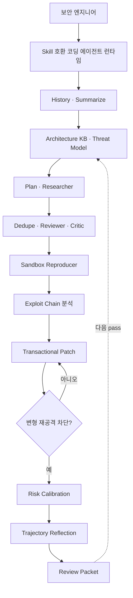
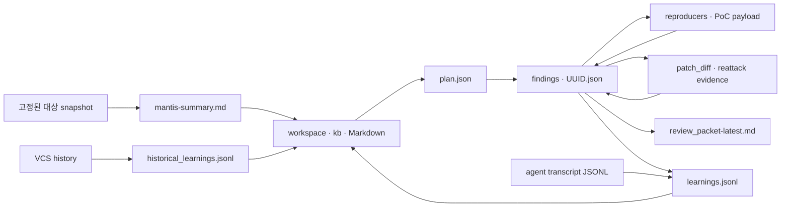
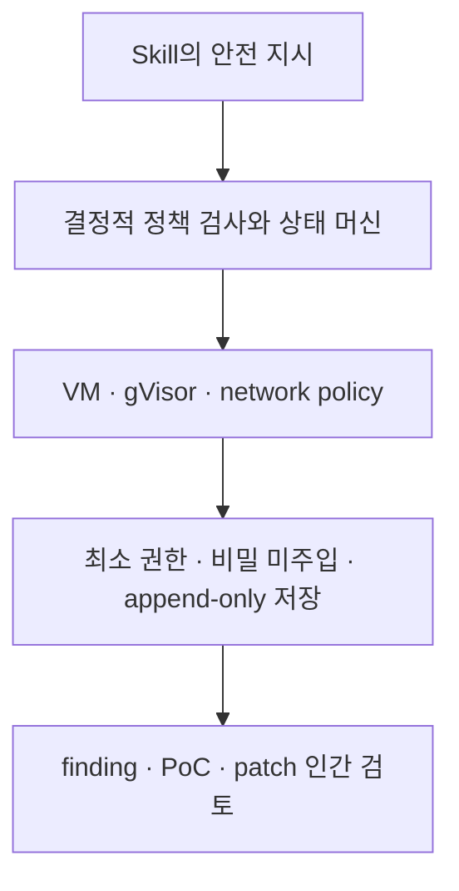
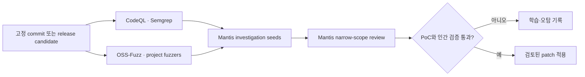

# Google Mantis 사용법·아키텍처·활용 분석

> 분석 대상: [`google/mantis`](https://github.com/google/mantis)  
> 기준 리비전: [`ea1633d7a9e0dcf4907b90d917aaab1350a4d0f5`](https://github.com/google/mantis/tree/ea1633d7a9e0dcf4907b90d917aaab1350a4d0f5) (`main`, 2026-07-16 PDT 커밋)  
> 조사일: 2026-07-17  
> 라이선스: Apache-2.0  
> 주의: `TIGER-AI-Lab/Mantis`의 멀티이미지 LMM 연구 프로젝트와는 이름만 같고 전혀 다른 프로젝트다.

## 1. 한눈에 보는 결론

Google Mantis는 **보안 스캐너 실행파일이나 별도 AI 모델이 아니다.** 코딩 에이전트가 소스 저장소를 대상으로 다음 작업을 순차 수행하도록 만든 **17개 Agent Skill 프롬프트 모듈과 JSON Schema 기반 상태 계약**이다.

- 핵심 목적: 위협 모델링 → 취약점 후보 발굴 → 중복 제거 → 독립 검증 → 운영 환경 도달 가능성 판정 → 격리된 PoC 재현 → 패치 → 우회 재공격 → 위험도 산정 → 보고서 생성을 하나의 보안 리뷰 하네스로 연결한다.
- 배포 형태: Python 패키지, 서버, 컨테이너 이미지가 아니라 `SKILL.md` 디렉터리 모음이다. 실제 추론·파일 탐색·명령 실행·서브에이전트 생성은 Gemini CLI, Antigravity CLI 또는 다른 Skill 호환 코딩 에이전트가 담당한다.
- 가장 큰 차별점: 단순히 “의심스러운 코드”를 찾는 데서 끝나지 않고, 후보를 여러 번 부정적으로 검증하고 샌드박스에서 재현한 뒤 패치를 다시 공격하는 **증거 중심 리뷰 수명주기**를 프롬프트와 파일 계약으로 명시한다.
- 가장 중요한 한계: 실행 엔진과 결정적 오케스트레이터가 번들되어 있지 않다. 탐색 품질, 커버리지, 재현 성공률은 사용하는 모델·에이전트 런타임·도구·프로젝트 빌드 가능성에 크게 좌우된다.
- 현재 판단: 개인 또는 보안 엔지니어가 **좁은 범위의 대화형 보안 리뷰 실험**을 시작하기에는 유용하다. 조직의 릴리스 게이트로 곧바로 넣기에는 아직 참조 설계 성격이 강하며, 먼저 결정적 하네스·스키마 검증·강제 샌드박스·인간 승인 계층을 보강해야 한다.

한 문장으로 표현하면 다음과 같다.

> Mantis는 “AI가 보안 리뷰를 어떻게 수행해야 하는가”를 모듈화한 실행 가능한 플레이북이지, 자체 분석 엔진을 가진 완제품 SAST가 아니다.

## 2. 해결하려는 문제

### 2.1 기존 AI 코드 리뷰의 단절

코딩 에이전트에게 한 번에 “취약점을 찾아서 고쳐 달라”고 하면 보통 다음 문제가 생긴다.

- 저장소 전체 구조와 실제 외부 입력 경계를 충분히 파악하지 못한다.
- 한 에이전트의 최초 추론이 이후 검증까지 편향시킨다.
- 동일한 취약점을 여러 표현으로 중복 보고한다.
- 테스트 전용·디버그 전용 코드나 실제로 도달 불가능한 경로를 운영 취약점으로 과대평가한다.
- 컴파일되지 않거나 내부 불변식을 깨는 인위적 PoC를 “재현 성공”으로 판단한다.
- 패치가 최초 PoC만 막고 변형 공격에는 그대로 취약할 수 있다.
- 여러 번 실행할 때 이전의 오판과 성공 전략을 기억하지 못한다.

Mantis는 이 문제를 하나의 거대한 프롬프트 대신 **역할이 분리된 단계, 디스크 기반 공유 상태, 단계별 입출력 계약**으로 해결하려 한다. 각 단계는 이전 결과를 읽되 독립적인 관점으로 다시 평가한다.

### 2.2 정적 분석과 동적 증거 사이의 간극

규칙 기반 SAST는 반복 가능성과 대규모 커버리지에 강하지만, 프로젝트 고유의 비즈니스 로직·권한 모델·복합 공격 경로를 모델링하려면 별도 규칙과 데이터 흐름 모델이 필요하다. 반대로 순수 LLM 리뷰는 유연하지만 환각과 비결정성이 크다.

Mantis의 설계 의도는 다음 두 특성을 결합하는 데 있다.

1. LLM이 아키텍처·신뢰 경계·호출 관계·복합 조건을 문맥적으로 해석한다.
2. 결과를 JSON 상태와 실제 PoC 출력, 패치 diff, 재공격 결과로 점차 구체화한다.

## 3. 프로젝트 구성과 성숙도

분석 리비전의 저장소는 총 5,721줄이며, 핵심 파일은 모두 Markdown과 JSON이다. 애플리케이션 소스코드나 고정된 오케스트레이터 구현은 없다.

```text
google/mantis/
├── README.md
├── README_AGENTS.md
├── schema.json
├── mantis-history/SKILL.md
├── mantis-summarize/SKILL.md
├── mantis-architecture/SKILL.md
├── mantis-threat-model/SKILL.md
├── mantis-plan/SKILL.md
├── mantis-researcher/SKILL.md
├── mantis-dedupe/SKILL.md
├── mantis-review/SKILL.md
├── mantis-critic/SKILL.md
├── mantis-reproduce/SKILL.md
├── mantis-chain/SKILL.md
├── mantis-patch/SKILL.md
├── mantis-calibrate/
│   ├── SKILL.md
│   └── references/calibration_rules.md
├── mantis-reflect/SKILL.md
├── mantis-report/SKILL.md
├── mantis-meta-agent/SKILL.md
└── mantis-pipeline-adapter/SKILL.md
```

17개 Skill 중 15개는 실제 리뷰 파이프라인 단계이고, 나머지 2개는 전체 반복을 감독하는 `mantis-meta-agent`와 사용자 환경에 맞는 결정적 하네스를 설계하는 `mantis-pipeline-adapter`다.

성숙도는 보수적으로 평가해야 한다.

- 최초 공개 커밋은 2026-06-15이고 분석 시점까지 약 한 달의 이력만 있다.
- 분석 리비전에는 Git tag나 정식 release가 없다.
- 저장소 스스로 “공식 지원 Google 제품이 아니며 데모 목적이고 운영 환경용이 아니다”라고 명시한다.
- 공개된 정량 벤치마크, 지원 언어별 탐지율, 오탐률, 재현 성공률 데이터가 없다.
- 최근 커밋 대부분이 스키마·프롬프트 계약·안전 가드 정교화에 집중되어 있어 인터페이스가 빠르게 변하는 초기 단계다.

따라서 특정 커밋을 고정하고 로컬 수정본을 버전 관리하는 방식이 적절하다.

## 4. 빠르게 시작하는 방법

### 4.1 절대 먼저 해야 할 안전 준비

Mantis는 에이전트가 만든 코드를 실행하고 대상 소스를 임시 수정할 수 있다. 운영 자격 증명, 사내망 접근권, 개인 데이터가 있는 개발 노트북에서 무인 모드로 실행하면 안 된다.

권장 최소 경계는 다음과 같다.

- 전용 Linux VM 또는 폐기 가능한 격리 환경
- 대상 저장소의 읽기 가능한 고정 snapshot
- Docker와 가능하면 gVisor `runsc`
- PoC 컨테이너의 외부 네트워크 차단
- 호스트의 클라우드 자격 증명·SSH 키·패키지 레지스트리 토큰 미마운트
- 대상 소스와 `workspace/` 이외 파일 쓰기 차단
- 첫 실행은 자동 승인 옵션 없이 인간 승인 모드

gVisor는 userspace application kernel과 OCI runtime `runsc`를 제공해 컨테이너와 호스트 커널 사이에 추가 격리 계층을 둔다. 공식 문서는 Docker runtime으로 `runsc`를 등록한 뒤 `docker run --runtime=runsc`로 실행하는 방법을 설명한다. [gVisor 개요](https://gvisor.dev/docs/), [Docker Quick Start](https://gvisor.dev/docs/user_guide/quick_start/docker/)

### 4.2 Skill 설치

대상 프로젝트의 루트에서 Skill 호환 코딩 에이전트가 읽을 수 있도록 설치한다.

```bash
npx skills add google/mantis
```

또는 Mantis 저장소를 직접 clone한 다음, 사용하는 에이전트의 로컬 또는 전역 Skill 디렉터리에 17개 `mantis-*` 폴더를 배치할 수 있다. 정확한 Skill 설치 위치와 slash command 노출 방식은 에이전트 제품마다 다르다.

Mantis가 사용하는 Agent Skills 형식은 `SKILL.md`의 YAML front matter에 `name`과 `description`을 두고, 본문에 실행 절차를 작성하는 공개 형식이다. 호환 런타임은 먼저 이름과 설명만 탐색하고 필요할 때 전체 Skill을 로드할 수 있다. [Agent Skills 사양](https://agentskills.io/specification)

### 4.3 첫 실행 전 상태 디렉터리 준비

현재 `mantis-architecture` 계약은 `workspace/learnings.jsonl`이 존재해야 한다고 명시한다. 첫 수동 실행에서는 빈 inbox를 만들어 두는 편이 안전하다.

```bash
mkdir -p workspace
touch workspace/learnings.jsonl
```

`workspace/`는 Mantis가 생성하는 KB, 계획, 발견 항목, PoC, 보고서, 실행 이력을 저장한다. 민감한 취약점 정보와 PoC가 남으므로 별도 보관 정책을 적용하고 일반 산출물처럼 공개 저장소에 커밋하지 않는 것이 좋다.

### 4.4 초보자에게 권장하는 수동 실행

처음부터 무인 전체 루프를 돌리지 말고, 하나의 고위험 컴포넌트만 범위로 잡은 뒤 slash command를 순차 실행한다.

```text
/mantis-history          # 선택: 과거 보안 수정 패턴 추출
/mantis-summarize        # 선택: 대형 저장소 디렉터리 요약
/mantis-architecture     # Markdown KB 생성
/mantis-threat-model     # 신뢰 경계·공격자 모델 생성
/mantis-plan             # 리뷰 대상과 질문 생성
/mantis-researcher       # 취약점 후보 발굴
/mantis-dedupe           # 중복 통합
/mantis-review           # 코드 근거로 오탐 제거
/mantis-critic           # 운영 build에서 실제 도달 가능한지 판정
/mantis-reproduce        # 격리 환경에서 PoC 실행
/mantis-chain            # 개별 취약점의 조합 가능성 분석
/mantis-patch            # 임시 공간에서 패치·재공격·rollback
/mantis-calibrate        # 위험 점수와 우선순위 계산
/mantis-reflect          # 실행 궤적에서 다음 pass 학습 추출
/mantis-report           # 사람이 읽는 리뷰 패킷 생성
```

실제 도입에서는 `mantis-plan`이 생성한 `workspace/plan.json`을 사람이 먼저 확인하는 것이 좋다. 처음에는 다음처럼 범위를 좁힌 지시를 에이전트에 함께 준다.

```text
이번 pass는 src/auth와 api/admin만 대상으로 한다.
외부 비인증 사용자에서 관리자 권한으로 이어지는 경로만 조사한다.
DoS와 보안 헤더 누락은 제외한다.
재현 코드는 반드시 runsc 컨테이너에서 --network none으로 실행하고,
모든 shell 명령은 실행 전에 승인을 요청한다.
```

### 4.5 산출물 읽는 순서

실행 후에는 다음 파일을 확인한다.

| 산출물 | 의미 | 사람이 확인할 포인트 |
|---|---|---|
| `workspace/kb/THREAT_MODEL.md` | 공격자, 신뢰 경계, 중요 자산 | 실제 배포 구조와 맞는가 |
| `workspace/plan.json` | 이번 pass의 조사 질문·파일 | 범위가 과도하거나 누락되지 않았는가 |
| `workspace/findings/<uuid>.json` | 발견부터 패치까지 누적되는 단일 취약점 상태 | 코드 경로, PoC 출력, 운영 도달성 |
| `workspace/reproducers/` | PoC·crash payload | 외부 통신·호스트 접근이 없는가 |
| `workspace/learnings.jsonl` | 오판·성공 전략 inbox | 다음 pass에 잘못된 가정이 고착되지 않는가 |
| `workspace/report/review_packet-latest.md` | 최종 리뷰 문서 | 재현 증거와 위험 등급이 일치하는가 |

`patch_diff`는 원본 소스에 영구 적용된 결과가 아니다. `mantis-patch`는 shadow directory 또는 백업 파일에서 패치를 시험하고 원본을 rollback한 뒤 검증된 diff만 finding에 보관하도록 설계되어 있다. 사람이 diff를 검토하고 별도로 적용·커밋해야 한다.

## 5. 실행 모드

| 모드 | 실행 방식 | 적합한 상황 | 평가 |
|---|---|---|---|
| 대화형 수동 | 각 Skill을 하나씩 호출하고 명령마다 승인 | 첫 도입, 좁은 컴포넌트 감사 | 가장 권장 |
| Meta-Agent | `/mantis-meta-agent`가 서브에이전트를 순서대로 호출하고 pass 반복 | 격리된 연구 환경의 장시간 탐색 | 실험적 |
| 결정적 하네스 | 코드가 상태 전이·검증·sandbox 실행을 강제하고 LLM은 판단 작업만 담당 | 조직 내 반복 실행, 릴리스 전 보안 게이트 | 장기적으로 권장 |
| 무인 GCE | 격리 VM에서 자동 승인과 연속 loop | 성숙한 보안팀의 제한된 연구 환경 | 높은 구축·운영 부담 |

Mantis 문서 자체도 운영급 사용에서는 LLM에게 제어 흐름을 맡기기보다 Python, Bash, Rust 또는 Agent SDK로 결정적 오케스트레이터를 작성하라고 권한다. Google ADK의 순차 워크플로처럼 상위 제어 흐름은 모델이 아니라 코드가 고정된 순서로 서브에이전트를 실행하게 만들 수 있다. [ADK Sequential workflow](https://adk.dev/agents/workflow-agents/sequential-agents/)

## 6. 전체 아키텍처

### 6.1 제어 흐름



이 흐름의 특징은 발견과 검증을 같은 에이전트의 단일 판단으로 끝내지 않는다는 점이다. Reviewer는 “모든 finding이 기본적으로 오탐”이라고 가정하고 최초 Researcher의 설명을 무시한 채 코드를 다시 읽는다. Critic은 release build 도달성, 디버그 전용 코드, allocator padding 같은 운영 조건을 다시 검증한다. Reproducer는 실제 출력으로 증명하고, Patcher는 패치 후 새 Reproducer에게 우회 변형을 찾게 한다.

### 6.2 상태·데이터 흐름



공유 상태는 데이터베이스가 아니라 파일시스템이다. 주요 단위는 다음과 같다.

- `workspace/.mantis_state.json`: pass 번호, 시간, Git·Mercurial·multi-VCS snapshot 정보
- `workspace/plan.json`: investigation 목록, 대상 파일, KB 참조
- `workspace/findings/<uuid>.json`: 하나의 취약점이 단계별로 확장되는 핵심 aggregate
- `workspace/learnings.jsonl`: 오탐·패치·도구 실패 등 다음 pass용 inbox
- `workspace/archive/`: 이전 pass finding, 처리된 learning, 재현 시도 횟수
- `workspace/kb/`: architecture, entity, CWE·bug class, threat model을 연결한 Markdown 지식 베이스

이 구조는 사람이 읽고 고치기 쉽고 어떤 에이전트 런타임에도 이식하기 쉽다. 반면 다중 worker의 동시 수정, 원자적 상태 전이, 대규모 질의에는 취약하므로 고부하 환경에서는 DB 기반 state store로 교체하는 편이 낫다.

## 7. 단계별 내부 동작

| 단계 | 핵심 알고리즘·정책 | 주요 입출력 |
|---|---|---|
| History | commit message 선필터 후 관련 diff만 분석, revision cache로 중복 방지 | VCS → `historical_learnings.jsonl` |
| Summarize | 디렉터리 bottom-up post-order, 자식은 원문 대신 요약만 부모에 전달하는 map-reduce | 소스 → 디렉터리별 `mantis-summary.md` |
| Architecture | 코드 구조와 learning inbox를 entity·취약점 문서로 합성, 성공 후 inbox archive | JSONL·소스 → Markdown KB |
| Threat Model | KB에 정의된 entity만 바탕으로 신뢰 경계, 공격자, 자산, 배포 의도 작성 | KB → `THREAT_MODEL.md` |
| Plan | 첫 pass 전체 매핑과 이후 pass 변화·학습 기반 계획을 구분, 관련 KB 경로를 pointer로 삽입 | KB·summary → `plan.json` |
| Researcher | 빠른 전 파일 triage 후 hotspot deep-dive, 복잡한 파일은 parallel trajectory 허용 | plan·소스 → raw finding JSON |
| Dedupe | title·code path 유사도로 현재·과거 pass 중복 판정, soft-delete와 transaction log | finding 집합 → canonical finding |
| Reviewer | 12개 negative constraint를 모두 평가하고 오탐 우선으로 재검증 | finding·소스 → validity·checklist |
| Critic | release build 도달성, padding, debug·sample 여부, 환경 통제를 재평가 | finding·threat model → production viability |
| Reproducer | public API와 프로젝트 불변식을 지키는 PoC를 격리 실행, 결과와 명령 저장 | viable finding → PoC·실행 증거 |
| Chain | finding A의 postcondition이 B의 precondition을 만족하는지 조합 행렬 탐색 | validated findings·KB → super finding |
| Patch | shadow copy 또는 file backup에서 최소 수정, 최초 PoC와 새 변형 공격으로 검증 후 rollback | reproduced finding → verified diff |
| Calibrate | `(Impact + Likelihood) × Context Multiplier`, 27개 sanity cap 적용 | 전체 증거 → 0.1~10 점수·priority |
| Reflect | transcript 전체를 넣지 않고 tool error·포기·성공 패턴만 필터링해 학습 추출 | execution logs → learning JSONL |
| Report | 재현되었거나 증거가 있는 finding만 선별, 낮은 우선순위는 부록으로 분리 | calibrated findings → Markdown packet |

### 7.1 Knowledge Base와 장기 기억

Mantis의 기억은 벡터 DB나 임베딩 검색이 아니다. 다음 세 층을 사용한다.

1. `mantis-summary.md`: 저장소의 공간적 계층을 요약한 단기 탐색 지도
2. `workspace/kb/*.md`: 컴포넌트·데이터 흐름·취약점 클래스를 사람이 읽을 수 있게 연결한 영속 지식
3. `historical_learnings.jsonl`과 `learnings.jsonl`: 과거 커밋 및 에이전트 실행에서 얻은 구조화된 사건 기록

Planner는 긴 내용을 다시 생성하지 않고 관련 KB 파일 경로를 `kb_references`로 넣는다. Researcher가 해당 조사만 수행할 때 참조 문서를 읽는 방식이라 컨텍스트 비용을 줄인다. 이는 Agent Skills의 progressive disclosure와 유사한 pointer 기반 컨텍스트 주입이다.

### 7.2 두 단계 탐색과 다중 에이전트

Researcher는 대형 저장소에서 다음 파동을 권장한다.

- Wave 1: 빠르고 저렴한 모델이 파일별 `potentially_flawed` 여부만 분류
- Wave 2: 후보 파일에 강한 추론 모델을 투입해 깊게 감사
- 복잡한 파일: 서로 다른 프롬프트나 모델로 같은 파일을 동시에 분석하고 Dedupe가 결과를 합침

장점은 강한 모델의 토큰을 hotspot에 집중하는 것이다. 단점은 Wave 1의 거짓 음성이 Wave 2의 커버리지를 제한할 수 있다는 점이다. 따라서 보안상 중요한 외부 경계는 triage 결과와 무관하게 deep-dive 대상으로 강제하는 것이 좋다.

### 7.3 독립 검증과 negative filter

Reviewer의 12개 제약은 Mantis의 오탐 억제 핵심이다. 대표적으로 다음 후보를 제거한다.

- 가상의 잘못된 API 사용에만 의존하는 문제
- 보안 헤더나 방어적 검사 누락 같은 hygiene 이슈
- 현실적으로 자동 재현할 수 없는 조건
- 안전한 표준 라이브러리를 억지로 취약하다고 해석한 결과
- 실제 파일·함수·라인이 존재하지 않는 환각
- 전역 allocator padding 계약 안에 완전히 포함되는 SIMD 접근

반대로 단순히 `test`, `mock`, `experimental` 경로라는 이유만으로 버리지 않고 실제 production target 포함 여부를 추적한다. Critic에서 저장소 전체가 sample인지, 특정 경로가 release에서 compile-out되는지를 별도로 판정한다.

이 방식은 규칙 기반 정적 분석의 negative query가 아니라 **LLM에게 적용시키는 평가 rubric**이다. 따라서 checklist가 모두 채워졌다고 해서 평가가 결정적이라는 뜻은 아니다.

### 7.4 PoC 재현과 sandbox

Reproducer는 finding을 다음 네 상태로 분류한다.

- `reproduced`: 기능 우회, sanitizer 오류, SIGSEGV 등 실제 증거 확보
- `failed_to_reproduce`: 실행했지만 문제를 일으키지 못함
- `statically_confirmed`: 환경 제약으로 실행 불가하나 정적으로 명백함
- `not_attempted`: 인프라 오류·시간 초과 등으로 실행 자체를 못 함

메모리 오류는 ASan·UBSan 로그, SIGSEGV 139, SIGABRT 134 같은 출력으로 판단한다. 권한·비즈니스 로직 오류는 비인가 요청의 HTTP 200이나 금지 동작 성공 같은 기능적 assertion으로 증명한다.

중요한 안전 정책은 다음과 같다.

- PoC는 `workspace/reproducers/`에만 기록한다.
- 대상 내부 private function을 비정상 buffer로 직접 호출해 전역 불변식을 우회한 crash는 성공으로 인정하지 않는다.
- 생성한 코드는 호스트에서 직접 실행하지 않는다.
- 재현 횟수 cache는 별도 lock file, `fcntl.flock`, 임시 파일과 `os.replace`로 원자 갱신한다.

다만 이는 Skill의 **지시 사항**이지 강제 보안 경계가 아니다. 런타임이 호스트 shell 권한을 주거나 에이전트가 지시를 누락하면 우회될 수 있다. 결정적 harness가 모든 실행 요청을 검사해 VM 또는 `runsc`로만 라우팅해야 한다.

### 7.5 패치, rollback, 재공격

Patcher는 Git branch나 stash에 의존하지 않고 VCS 비종속 트랜잭션을 사용한다.

- Option A: 고유 임시 디렉터리에 대상 트리를 복사해 수정·빌드·검증하고 마지막에 삭제
- Option B: 수정 파일만 UUID suffix로 백업하고 workspace edit lock을 잡은 상태에서 작업 후 원복
- Option C: namespace, container volume 등 동일한 불변식을 만족하는 별도 격리

필수 불변식은 원본 오염 없음, 동시성 안전, 예외 시 rollback이다. 최초 PoC가 막혔다고 바로 성공 처리하지 않고 fresh-context Reproducer가 같은 root cause의 변형 입력으로 다시 공격한다.

최종 상태는 다음과 같다.

- `VERIFIED_SECURE`: 원래 PoC 차단 + 변형 재공격 실패
- `MITIGATION_PROPOSED`: 소스가 없는 binary·firmware 등에 운영 완화책만 제안
- `VERIFICATION_INCOMPLETE`: 최초 검증은 통과했지만 재공격 인프라가 실패
- `VERIFICATION_FAILED`: 패치 후에도 재현되거나 우회됨
- `ERROR`: 상태 또는 파일 처리 오류

### 7.6 위험도 계산

기본 식은 다음과 같다.

```text
Hazard = (Impact 1~5 + Likelihood 1~5) × Context Multiplier
Mantis Risk Score = min(Hazard, 10.0)
```

Context에는 외부 노출 1.0, 내부 0.8, privileged zone 0.5, 사용자 상호작용 0.7 배수, sample 0.4 배수, 조건부 운영 가능 0.7 배수 등이 반영된다. 이후 27개 sanity rule이 공격자의 기존 권한 대비 **추가로 얻는 능력**이 작은 finding을 cap한다.

최종 priority는 `CRITICAL 8.0~10.0`, `HIGH 6.0~7.9`, `MEDIUM 3.0~5.9`, `LOW 0.1~2.9`다. CRITICAL은 원칙적으로 무권한·무상호작용 RCE 또는 동등한 전체 손실에 제한한다. 평판·사용자 반응을 의미하는 Outrage는 설명에는 포함하지만 숫자에는 더하지 않는다.

이 점수는 CVSS 구현이 아니며 Mantis 고유의 우선순위 rubric이다. 기존 조직 위험 모델과 숫자를 직접 동일시하지 말고 변환 계층을 두는 편이 안전하다.

## 8. 기반 기술

### 8.1 Agent Skills

각 모듈은 다음 형태다.

```yaml
---
name: mantis-review
description: >-
  Independently reviews findings and filters out false positives.
  Use when consolidated findings need validation against the actual source code.
  Don't use for reproducing crashes or patching code.
---
```

YAML metadata는 Skill 탐색과 activation에 쓰이고 Markdown 본문은 역할, 입출력 계약, precondition, idempotency, 실행 절차를 정의한다. 모델 fine-tuning이나 별도 학습 없이 절차 지식을 컨텍스트에 주입하는 방식이다.

### 8.2 JSON Schema Draft 2020-12

[`schema.json`](https://github.com/google/mantis/blob/ea1633d7a9e0dcf4907b90d917aaab1350a4d0f5/schema.json)은 다음 계약을 `$defs`로 정의한다.

- finding
- plan
- learning entry
- orchestrator state
- dedupe transaction log
- reproduction attempt cache
- execution transcript entry

Finding에는 UUID, code path, 공격자 위치, 필요 권한, validity, production viability, reproduction, patch, re-attack, calibration, history가 누적된다. 조건부 schema는 예를 들어 `repro_status=reproduced`일 때 PoC 경로·명령·출력을 요구하고, `patch_status=VERIFIED_SECURE`일 때 `reattack_status=failed_to_bypass`를 요구한다.

중요한 구현 주의점이 있다. 이 파일의 root는 여러 schema를 담은 catalog이며 실제 finding을 검증할 때는 문서가 지시하는 대로 `#/$defs/finding`을 명시적으로 선택해야 한다. root 전체에 finding JSON을 그대로 넣어 검증하면 의도한 제약이 적용되지 않는다.

### 8.3 파일시스템 상태와 event history

Finding JSON은 현재 상태 snapshot이면서 `history[]`에 각 단계의 action, pass number, timestamp를 추가한다. JSONL learning과 transaction log는 append-oriented event 기록에 가깝다. 완전한 event sourcing은 아니지만, 다음 pass가 이전 오판과 처리 이력을 재사용할 수 있게 한다.

### 8.4 다중 모델·다중 에이전트 라우팅

저비용 모델은 triage와 dedupe, 고성능 reasoning 모델은 reproducer와 patcher에 배치하는 계층형 모델 선택을 권한다. Mantis 자체는 특정 Gemini 모델이나 API에 결합하지 않는다. Gemini CLI·Antigravity CLI 사용 경험을 언급하지만 Google ADK, Antigravity SDK 또는 다른 Agent Skills 호환 런타임으로 이식할 수 있다.

### 8.5 MCP 확장

`mantis-pipeline-adapter`는 특수 환경을 Custom MCP server로 감싸는 패턴을 제안한다.

- VM snapshot 생성·복구와 PoC 실행
- 물리 장비의 USB·serial 조작
- firmware emulator·Ghidra·radare2 호출
- 사내 bug tracker나 알림 시스템 연결

핵심은 LLM이 임의 shell을 조립하게 두기보다 `run_reproducer(finding_id, payload)`처럼 제한된 고수준 도구만 노출하는 것이다.

### 8.6 지시 기반 안전과 인프라 기반 안전의 분리

Mantis에는 `--network none`, shadow copy, lock, rollback, GCE VPC-SC, 최소 권한 IAM 같은 방어가 자세히 적혀 있다. 그러나 저장소 안에는 이를 강제하는 코드가 없다. 따라서 실제 안전 수준은 아래 계층으로 나뉜다.



Prompt는 마지막 보루가 아니라 가장 약한 가이드 계층으로 취급해야 한다.

## 9. 활용 방법과 유즈케이스

### 9.1 웹 서비스의 인증·인가 경계 감사

적합도가 가장 높은 사례 중 하나다.

- Threat Model이 gateway, session, tenant, admin boundary를 정의한다.
- Planner가 외부 입력에서 authorization decision까지의 호출 경로를 선택한다.
- Researcher가 IDOR, confused deputy, tenant boundary bypass, 상태 전이 오류를 찾는다.
- Reproducer가 비인가 요청이 성공하는지 기능 테스트로 확인한다.
- Chain이 정보 노출 + 권한 우회 같은 조합을 검토한다.

CodeQL이나 Semgrep 규칙으로 표현하기 어려운 프로젝트 고유 비즈니스 로직에 Mantis를 보완적으로 적용할 수 있다.

### 9.2 C·C++ parser와 codec의 release 전 집중 감사

- 외부 입력 parser·decoder·allocator 경로를 고정 범위로 지정한다.
- public API와 모든 call site의 size contract를 추적한다.
- ASan·UBSan build 안에서 crash payload를 재현한다.
- allocator padding을 우회한 인위적 direct-call harness는 제외한다.
- 최소 bounds check 패치를 shadow tree에서 시험하고 변형 payload로 재공격한다.

다만 coverage-guided fuzzing 자체가 없으므로 OSS-Fuzz·libFuzzer corpus와 sanitizer 결과를 Mantis에 입력하는 조합이 더 좋다.

### 9.3 IaC와 Kubernetes 권한 경계

Mantis 문서는 소스코드 외에도 Terraform, Kubernetes RBAC, cloud permission을 명시적으로 대상으로 삼는다.

- 외부 workload → service account → cloud API 권한 상승 경로
- admission·controller 신뢰 가정
- 공개 endpoint와 내부 control plane의 혼동
- 잘못된 default와 특정 비기본 설정에서만 가능한 공격 구분

PoC 단계는 실제 운영 클러스터가 아니라 폐기 가능한 격리 cluster나 정책 simulator로 교체해야 한다.

### 9.4 firmware·binary gray-box 리뷰

소스가 없을 때 `unblob`, Ghidra, radare2, angr, objdump, QEMU, Unicorn 같은 도구로 구조와 entry point를 탐색하도록 Skill을 조정할 수 있다. 재현은 emulator 또는 물리 testbed에서 수행하고, patch 단계는 binary를 직접 수정하지 않고 `MITIGATION_PROPOSED`를 출력한다.

이식성은 높지만 Mantis가 이 도구들을 번들하거나 자동 구성하지는 않는다. 실제 성능은 custom tool/MCP 통합 품질에 달려 있다.

### 9.5 ML·데이터 파이프라인

- 학습 데이터 ingress와 provenance 경계
- Pickle·모델 artifact 역직렬화
- notebook에서 production job으로 넘어가는 신뢰 경계
- model registry·object store 권한
- training pipeline의 dependency·supply-chain 입력

일반 SAST가 놓치기 쉬운 데이터 흐름과 배포 가정을 KB와 Threat Model로 명시할 수 있다는 점이 장점이다.

### 9.6 과거 취약점 회귀 탐색

History 단계가 과거 security fix commit을 선별해 관련 파일, 취약점 패턴, 수정 방식을 JSONL로 남긴다. 이후 Architecture와 Planner가 이를 사용해 “같은 bug class가 인접 모듈 또는 재작성된 코드에 다시 나타났는가”를 조사할 수 있다.

Dedupe는 이전 pass의 동일 finding을 건너뛰지만 VCS 역사상의 취약점과는 일부러 dedupe하지 않는다. 과거 버그가 재도입된 regression을 놓치지 않기 위한 설계다.

### 9.7 아직 부적합한 사례

- 수천 저장소를 일관된 규칙으로 매일 스캔해야 하는 조직 단위 SAST 대체
- 개발자 노트북에서 자동 승인한 무인 PoC 실행
- 최신 commit이 계속 바뀌는 저장소의 continuous incremental scan
- 법적·규제 보고에 바로 사용할 완전 자동 취약점 판정
- 외부 오픈소스 프로젝트에 검증 없이 finding을 대량 제출하는 작업
- 재현 환경이나 build 방법이 전혀 없는 대규모 monorepo의 즉시 full scan

## 10. 경쟁·비교 분석

Mantis는 전통 SAST, fuzzing, 완성형 Cyber Reasoning System과 범주가 다르다. 대체 관계보다 조합 관계로 보는 것이 정확하다.

| 도구 | 핵심 엔진 | 강점 | Mantis와의 관계 |
|---|---|---|---|
| Google Mantis | LLM Agent Skills + 파일 상태 계약 | 위협 모델, 비즈니스 로직, 독립 검증, PoC→패치→재공격 연결 | 상위 리뷰 오케스트레이션·플레이북 |
| GitHub CodeQL | 코드를 DB로 변환하고 query를 실행하는 semantic static analysis | 반복 가능성, code flow, CI 통합, 지원 언어의 대규모 스캔 | CodeQL alert를 Mantis의 조사 seed·증거로 사용 |
| Semgrep | 규칙 기반 SAST와 AI 보조 분석 | 빠른 개발 피드백, 커스텀 규칙, SCA·secret 연계 | 알려진 패턴은 Semgrep, 복합 문맥은 Mantis |
| OSS-Fuzz | coverage-guided fuzzing + sanitizer + 분산 실행 | 장기 연속 실행, crash 탐색, corpus 축적 | crash·coverage를 Mantis Reproducer와 Patcher에 공급 |
| Trail of Bits Buttercup | OSS-Fuzz 기반 fuzzing + program model + multi-agent patcher + 실제 orchestrator | C·Java OSS-Fuzz target의 자동 탐색·수정, 배포 가능한 CRS | 더 무겁지만 실행 엔진이 포함된 직접 비교 대상 |
| Google Big Sleep | LLM 기반 취약점 연구 agent | 실제 복잡한 취약점 연구 가능성을 입증한 연구 시스템 | 생태계 맥락상 유사하지만 Mantis의 공개 runtime은 아님 |

CodeQL은 코드를 데이터베이스로 만들고 query로 분석하는 명시적 엔진이며 지원 언어와 CI 실행 모델이 정의되어 있다. [GitHub CodeQL 공식 문서](https://docs.github.com/en/code-security/concepts/code-scanning/codeql/codeql-code-scanning)

OSS-Fuzz는 libFuzzer, AFL++, Honggfuzz, Centipede와 sanitizer를 분산 실행하는 지속 fuzzing 서비스다. Mantis에는 coverage feedback loop나 fuzzer가 없으므로 특히 memory-safety target에서는 함께 사용하는 것이 바람직하다. [OSS-Fuzz 공식 문서](https://google.github.io/oss-fuzz/)

Buttercup은 orchestrator, seed generator, fuzzer, program model, multi-agent patcher를 실제 코드와 배포 구성으로 제공한다. 대신 OSS-Fuzz-compatible C·Java 프로젝트 중심이고 시스템 요구량이 크다. Mantis는 훨씬 가볍고 stack-agnostic하지만 필요한 실행 기반을 사용자가 직접 조립해야 한다. [Buttercup 저장소](https://github.com/trailofbits/buttercup)

Google Project Zero와 DeepMind의 Big Sleep은 SQLite의 실제 stack buffer underflow를 찾았지만, 당시 팀도 target-specific fuzzer가 최소한 동등하게 효과적일 수 있다고 밝혔다. 이는 LLM 보안 에이전트를 fuzzing의 대체재가 아니라 보완재로 보는 근거다. [Project Zero — From Naptime to Big Sleep](https://googleprojectzero.blogspot.com/2024/11/from-naptime-to-big-sleep.html)

## 11. 장점과 단점

### 11.1 장점

- 특정 언어·빌드 시스템에 고정되지 않은 portable prompt architecture
- 아키텍처와 신뢰 경계를 먼저 만들어 비즈니스 로직 분석의 문맥을 강화
- UUID finding과 단계별 history로 발견부터 보고까지 provenance 유지
- Reviewer, Critic, Reproducer가 서로 다른 실패 모드를 걸러내는 defense-in-depth
- 실제 PoC와 patch bypass attempt를 요구하는 증거 중심 설계
- Markdown KB와 JSON/JSONL이라 사람이 감사·수정하기 쉬움
- large repo를 위한 bottom-up summary, KB pointer, wave-based model routing
- binary, firmware, RTL, IaC, ML pipeline까지 확장 가능한 target-agnostic 지침
- Apache-2.0으로 조직별 threat model·calibration·Skill 수정이 용이

### 11.2 단점과 리스크

- **강제 실행 엔진 부재:** sandbox, lock, schema validation, rollback이 코드가 아니라 주로 프롬프트 지시다.
- **비결정적 커버리지:** 같은 snapshot과 같은 모델이어도 pass마다 결과가 달라질 수 있다.
- **완성된 설치 경험 부재:** Skill을 설치해도 Docker image, build adapter, transcript collector, report portal이 생기지 않는다.
- **파일 state store의 한계:** 여러 agent가 동시에 같은 finding을 고치면 race와 partial update 위험이 있다. 일부 경로에만 lock과 atomic replace가 정의되어 있다.
- **초기화 마찰:** Architecture는 `workspace/learnings.jsonl`을 precondition으로 요구하지만 Meta-Agent 초기화 절차에는 이를 명시적으로 생성하는 단계가 보이지 않는다.
- **정적 snapshot 전제:** 실행 중 대상 코드가 바뀌면 line reference, PoC, patch가 서로 다른 버전을 가리킬 수 있다.
- **Skill supply-chain 위험:** 설치한 `SKILL.md` 자체가 에이전트에게 shell·파일 작업을 지시하므로 커밋 고정과 코드 리뷰가 필요하다.
- **PoC 안전 위험:** 악성 코드와 저장소 내 prompt injection이 에이전트 행동을 바꿀 수 있다.
- **exploit chain 한계:** 구성 finding은 재현하지만 chain 전체 end-to-end PoC는 자동 생성·실행하지 않는다.
- **독자 위험 점수:** CVSS와 호환되지 않으며 27개 cap은 조직의 threat model에 맞게 조정해야 한다.
- **벤치마크 부재:** “몇 개를 찾고 얼마나 오탐을 줄이는가”를 판단할 공개 데이터가 없다.
- **초기 프로젝트:** release/tag와 장기 호환성 약속이 없고 문서상 production 용도가 아니다.

## 12. 실무 도입 권장안

### 12.1 권장 조합



Mantis 단독 full scan보다 기존 분석기의 신호를 `plan.json` investigation seed로 넣는 편이 비용과 커버리지 모두 낫다.

### 12.2 1차 파일럿

1. 외부 입력 경계가 명확한 컴포넌트 하나를 선택한다. 예: 이미지 parser, auth middleware, admin API.
2. tag 또는 commit SHA로 대상 snapshot을 고정한다.
3. CodeQL·Semgrep·기존 fuzzer 결과와 과거 보안 fix를 입력 자료로 준비한다.
4. 전용 VM에서 수동 모드로 Architecture → Threat Model → Plan까지만 실행한다.
5. 사람이 plan을 10~30개 고위험 조사로 축소한다.
6. Researcher부터 Report까지 실행하되 shell과 write를 매번 승인한다.
7. `reproduced` finding만 보안 엔지니어가 독립 재현한다.
8. `patch_diff`는 별도 branch에 사람이 적용하고 전체 회귀 검사를 수행한다.
9. 오탐 유형과 도구 실패를 Skill·Threat Model·calibration override에 반영한다.

### 12.3 조직용 하네스에서 반드시 코드로 강제할 것

- 단계 상태 머신과 허용 전이
- `schema.json#/$defs/...` 기반 모든 JSON·JSONL validation
- finding 단위 optimistic lock 또는 DB transaction
- 대상 commit hash 불일치 시 즉시 중단
- 모든 PoC·build·patch 검증을 VM 또는 gVisor에 라우팅
- 외부 네트워크 deny-by-default와 제한된 read-only mount
- 시간·CPU·메모리·디스크 quota
- secrets와 home directory 미마운트
- transcript, tool call, 모델·프롬프트 버전 감사 로그
- finding·PoC·patch의 인간 승인 gate
- CodeQL/Semgrep/SARIF와 bug tracker의 결정적 adapter

Google SAIF도 agent 시스템의 prompt injection, 데이터 유출, 최소 권한, VPC Service Controls 같은 방어를 강조한다. Mantis 무인 배포 시 이 계층을 Skill 지시가 아니라 인프라 정책으로 구현해야 한다. [Google Secure AI Framework](https://cloud.google.com/use-cases/secure-ai-framework)

## 13. 핵심 소스코드 읽기 지도

이 프로젝트는 실행 코드보다 계약과 프롬프트가 곧 구현이다. 아래 순서로 읽으면 설계 의도를 빠르게 파악할 수 있다.

| 파일 | 볼 내용 |
|---|---|
| [`README.md`](https://github.com/google/mantis/blob/ea1633d7a9e0dcf4907b90d917aaab1350a4d0f5/README.md) | 설치, 수동 파이프라인, 안전 경고 |
| [`README_AGENTS.md`](https://github.com/google/mantis/blob/ea1633d7a9e0dcf4907b90d917aaab1350a4d0f5/README_AGENTS.md) | 전체 단계, 상태 흐름, 결정적 하네스, 무인 GCE 설계 |
| [`schema.json`](https://github.com/google/mantis/blob/ea1633d7a9e0dcf4907b90d917aaab1350a4d0f5/schema.json) | finding 상태 머신과 단계 간 계약 |
| [`mantis-researcher/SKILL.md`](https://github.com/google/mantis/blob/ea1633d7a9e0dcf4907b90d917aaab1350a4d0f5/mantis-researcher/SKILL.md) | 두 단계 탐색과 finding 생성 |
| [`mantis-review/SKILL.md`](https://github.com/google/mantis/blob/ea1633d7a9e0dcf4907b90d917aaab1350a4d0f5/mantis-review/SKILL.md) | 12개 오탐 억제 규칙 |
| [`mantis-reproduce/SKILL.md`](https://github.com/google/mantis/blob/ea1633d7a9e0dcf4907b90d917aaab1350a4d0f5/mantis-reproduce/SKILL.md) | sandbox, PoC 판정, retry cache |
| [`mantis-patch/SKILL.md`](https://github.com/google/mantis/blob/ea1633d7a9e0dcf4907b90d917aaab1350a4d0f5/mantis-patch/SKILL.md) | shadow patch, rollback, variant re-attack |
| [`mantis-calibrate/SKILL.md`](https://github.com/google/mantis/blob/ea1633d7a9e0dcf4907b90d917aaab1350a4d0f5/mantis-calibrate/SKILL.md) | 위험 점수와 context multiplier |
| [`calibration_rules.md`](https://github.com/google/mantis/blob/ea1633d7a9e0dcf4907b90d917aaab1350a4d0f5/mantis-calibrate/references/calibration_rules.md) | 27개 sanity cap 상세 |
| [`mantis-meta-agent/SKILL.md`](https://github.com/google/mantis/blob/ea1633d7a9e0dcf4907b90d917aaab1350a4d0f5/mantis-meta-agent/SKILL.md) | pass 반복, archive, 서브에이전트 감독 |
| [`mantis-pipeline-adapter/SKILL.md`](https://github.com/google/mantis/blob/ea1633d7a9e0dcf4907b90d917aaab1350a4d0f5/mantis-pipeline-adapter/SKILL.md) | DB·UUID·MCP를 이용한 운영 하네스 확장 |

## 14. 종합 평가

### 잘 맞는 팀

- 이미 CodeQL·Semgrep·fuzzing을 사용하고 있으나 비즈니스 로직과 복합 공격 경로를 더 깊게 보고 싶은 팀
- Agent Skills를 조직 표준에 맞게 수정할 보안 엔지니어가 있는 팀
- PoC를 실행할 폐기 가능한 VM·sandbox와 build 환경을 제공할 수 있는 팀
- 결과를 자동 신고하지 않고 사람이 재현·triage할 프로세스가 있는 팀

### 잘 맞지 않는 팀

- 설치 한 번으로 결정적이고 지원되는 상용 SAST 경험을 기대하는 팀
- 에이전트 실행 권한을 제한하거나 감사할 인프라가 없는 팀
- LLM 비용·모델 편차·오탐 학습을 운영할 담당자가 없는 팀
- 수시로 바뀌는 저장소를 동일 run 안에서 계속 추적해야 하는 팀

### 최종 판단

Mantis의 가장 가치 있는 부분은 특정 취약점 탐지 알고리즘이 아니라 **보안 에이전트 업무를 검증 가능한 단계로 분해한 설계**다. KB와 threat model로 문맥을 만들고, finding을 UUID 단위로 진화시키며, 독립 reviewer·critic·reproducer를 거쳐, patch를 fresh agent가 다시 공격하게 하는 흐름은 사내 보안 리뷰 에이전트를 설계할 때 좋은 출발점이다.

반면 저장소 자체만으로는 안전하고 반복 가능한 취약점 탐지 서비스가 되지 않는다. 현재 형태는 “보안 리뷰 Skill reference kit”로 평가하는 것이 정확하다. 실무에서는 **결정적 오케스트레이터 + 기존 SAST/fuzzer + 강제 sandbox + 인간 검증**을 결합할 때 가장 효과적이다.

## 참고 자료

- [Google Mantis 저장소](https://github.com/google/mantis)
- [Agent Skills Specification](https://agentskills.io/specification)
- [Google ADK Sequential workflow](https://adk.dev/agents/workflow-agents/sequential-agents/)
- [Google Secure AI Framework](https://cloud.google.com/use-cases/secure-ai-framework)
- [gVisor documentation](https://gvisor.dev/docs/)
- [GitHub CodeQL code scanning](https://docs.github.com/en/code-security/concepts/code-scanning/codeql/codeql-code-scanning)
- [OSS-Fuzz documentation](https://google.github.io/oss-fuzz/)
- [Trail of Bits Buttercup](https://github.com/trailofbits/buttercup)
- [Google Project Zero — From Naptime to Big Sleep](https://googleprojectzero.blogspot.com/2024/11/from-naptime-to-big-sleep.html)
