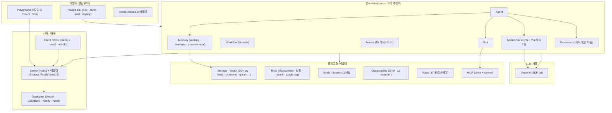
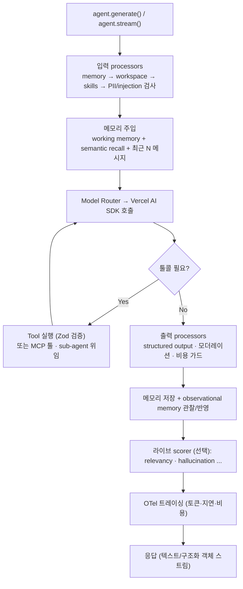
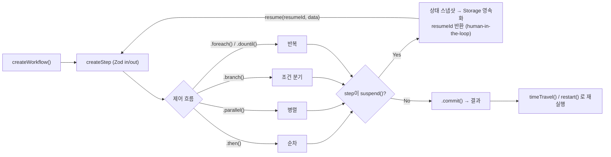
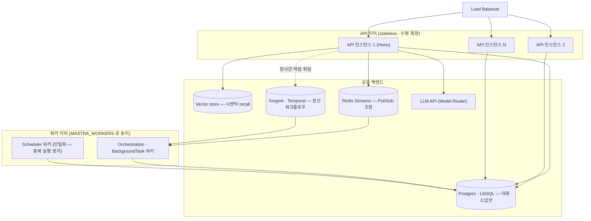
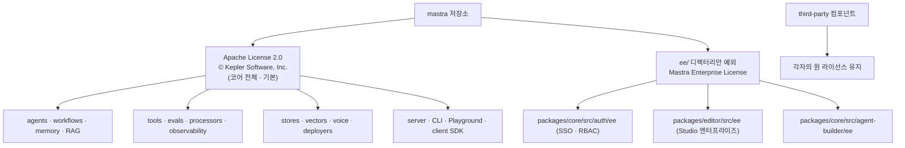

# Mastra 심층 분석 — TypeScript-first 풀스택 AI 에이전트 프레임워크

> **대상**: https://github.com/mastra-ai/mastra
> **분석 버전**: v1.x (`@mastra/core` 1.38.x, commit `d8a79af`, 2026-06)
> **핵심 정의**: 에이전트·워크플로우·메모리·RAG·평가·관측을 한 번에 묶은 **배터리 포함(batteries-included) TypeScript 에이전트 프레임워크**. LLM 호출은 Vercel AI SDK에 위임하고, 그 위에 프로덕션 운영 계층을 얹었다
> **라이선스**: **Apache-2.0** (코어 전체) + `ee/` 디렉터리만 **Mastra Enterprise License**(프로덕션 시 상용 계약 필요) — © Kepler Software, Inc.
> **개발사/배경**: Gatsby(웹 프레임워크) 창업팀 — Sam Bhagwat·Abhi Aiyer. 2024-10 출시, 2026-01 v1.0, GitHub 22k+ stars
> **주요 언어**: TypeScript (pnpm + Turborepo 모노레포, ~90 패키지)

> ⚠️ 라이선스 부분은 법률 자문이 아닙니다. 상용화 전 LICENSE 원문 확인을 권합니다.

---

## 1. 프로젝트 개요

### 1.1 해결하려는 문제

LLM 에이전트 생태계는 Python(LangChain·LangGraph·CrewAI)에 편중돼 있다. 그러나 **실무 웹 서비스·API의 상당수는 이미 TypeScript/JavaScript** 다. 에이전트 기능 하나 붙이려고 Python으로 컨텍스트 스위칭하는 것은 불필요한 마찰이다.

Mastra의 명제는 **"Python trains, TypeScript ships"** — 모델 학습은 Python이 하더라도, **제품 배포는 TypeScript가 한다**. 풀스택 개발자가 쓰던 언어·툴체인·배포 패턴(Vercel·Cloudflare·Node) 그대로 에이전트를 만들게 한다.

### 1.2 차별 포인트: 배터리 포함 + Vercel AI SDK 위임

Mastra는 두 가지 설계 결정으로 차별화한다:

1. **LLM 호출은 직접 만들지 않는다** — 모델 추론·툴콜·스트리밍은 경량 **Vercel AI SDK**(`ai` 패키지)에 위임. Mastra는 그 위에 *에이전트 루프·메모리·워크플로우·평가·관측·배포* 같은 프로덕션 계층만 얹는다.
2. **필요한 것을 다 묶어 제공** — 에이전트, 워크플로우(durable suspend/resume), 메모리(working/semantic/observational), RAG, 평가(scorers), 가드레일(processors), 관측(OTel), 배포(deployer), 로컬 개발 스튜디오(Playground)까지 한 패키지군에.

> 비교 한 줄: LangGraph가 "저수준 상태머신 런타임", Vercel AI SDK가 "UI-친화 경량 SDK"라면, **Mastra는 "LangChain이 처음부터 그랬어야 할 모습"** 을 노린 TypeScript 통합 프레임워크다.

---

## 2. 핵심 특징 및 철학

| 철학/특징 | 내용 |
|-----------|------|
| **TypeScript-first** | 클래스 상속 체인 없이 async/await + **Zod 스키마** 중심의 함수형 조합. 타입 안전한 툴/워크플로우 I/O |
| **모델 라우터** | `"openai/gpt-4"` 형식 문자열로 **3000+ 모델 / 94+ 프로바이더** 라우팅. 게이트웨이(Mastra·Netlify·models.dev) 추상화 |
| **Durable 워크플로우** | `.then()/.parallel()/.branch()/.dountil()/.foreach()` DSL + **suspend/resume**(human-in-the-loop, 상태 스냅샷 영속화) |
| **3층 메모리** | working memory(구조화 상태 템플릿) · semantic recall(벡터 검색) · **observational memory**(Actor-Observer-Reflector 3-에이전트 압축) |
| **프로덕션 가드레일** | PII 탐지·프롬프트 인젝션 차단·모더레이션·토큰/비용 제한 등 22종 입출력 processor |
| **평가 내장** | LLM-judge(13종) + 규칙/통계(7종) scorer를 라이브/오프라인으로 |
| **관측 표준** | OpenTelemetry 기반 AI 트레이싱 + Langfuse·Datadog·LangSmith·Braintrust 등 12 exporter |
| **로컬 스튜디오** | `mastra dev`로 브라우저 Playground(에이전트/워크플로우 시각 테스트, 메모리 브라우저, 트레이스) |
| **서버리스 친화** | Vercel·Cloudflare Workers·Netlify 배포 (LangGraph Platform이 못 하는 영역) |

---

## 3. 아키텍처 분석

### 3.1 전체 구조 (모노레포 계층)



### 3.2 에이전트 실행 흐름



### 3.3 워크플로우 엔진 (durable)



핵심: 워크플로우는 step DAG이며 각 step 결과·suspend 데이터가 Storage에 스냅샷으로 저장된다. 결제 승인·사람 검토처럼 **장시간 대기 후 재개**가 1급 기능이다.

---

## 4. 기술 스택

| 레이어 | 기술 |
|--------|------|
| **언어/런타임** | TypeScript 6.x, Node.js, ESM. Zod 4.x 스키마 전반 사용 |
| **LLM** | Vercel AI SDK(`ai`) v5/v6 — 모델 추론·툴콜·스트리밍 위임 |
| **모노레포** | pnpm workspaces + **Turborepo**, tsup/esbuild(패키지), Rollup(번들), Vite(Playground) |
| **서버** | **Hono** 4.x + 어댑터(Express·Fastify·Koa·NestJS), `openapi-fetch` 클라이언트 |
| **스토리지** | pg(+pgvector)·libsql·mysql·mssql·mongodb·duckdb·cloudflare-d1·spanner·convex·couchbase 등 |
| **벡터** | pgvector·pinecone·qdrant·chroma·weaviate·lance·astra·opensearch·turbopuffer·s3vectors·vectorize |
| **배포** | Vercel·Cloudflare Workers·Netlify·Node (+ Mastra Cloud 매니지드) |
| **관측** | OpenTelemetry, Langfuse·Datadog·LangSmith·Braintrust·Laminar·Sentry·Arize·PostHog |
| **워크플로우 백엔드** | 기본 내장 + Inngest·Temporal 어댑터 |
| **MCP** | `@modelcontextprotocol/sdk` (client + server 양방향) |

---

## 5. 핵심 코드 분석

### 5.1 Mastra 레지스트리 (`packages/core/src/mastra/index.ts`)

중앙 **의존성 주입 허브**. agents·workflows·tools·storage·vectors·memory·scorers·processors·logger·observability를 등록 순서(Tools→Processors→Memory→Vectors→Workflows→Agents)대로 와이어링한다. `getAgent()`/`getWorkflow()` 등 접근자, 백그라운드 워커(Orchestration·Scheduler), 코드 선언형 스케줄을 Storage에 동기화하는 기능 포함. `DynamicArgument<T>`(함수형 설정)로 요청별 멀티테넌시 지원.

### 5.2 Agent (`packages/core/src/agent/agent.ts`)

```typescript
new Agent({
  id, name,
  instructions,                       // string | (ctx) => string
  model: "openai/gpt-4",              // 또는 [fallback1, fallback2]
  tools, memory, voice,
  agents,                             // sub-agent 위임
  scorers,                            // 평가
  inputProcessors, outputProcessors,  // 가드레일
})
```

`generate()`(요청-응답)와 `stream()`(실시간) 두 진입점. 내부적으로 모델 스펙 버전을 보고 `MastraLLMV1`(AI SDK v4 호환) 또는 `MastraLLMVNext`(v5/v6) 코드패스를 고른다. 입력 processor → 메모리 주입 → LLM 툴콜 루프(Vercel AI SDK) → 출력 processor → 메모리 저장 순. 구조화 출력은 `structuredOutput: { schema: z.object(...) }`.

### 5.3 Tool (`packages/core/src/tools/tool.ts`)

`createTool({ id, description, inputSchema, outputSchema, execute })`. Zod(또는 StandardSchema) 입출력 검증, **suspend/resumeSchema**(툴 레벨 일시정지), `requireApproval`(승인 게이트), MCP 메타데이터. 실행 컨텍스트는 호출원(agent vs workflow)을 정규화해 `context.agent`/`context.workflow`로 노출. 검증 실패 시 throw가 아니라 `ValidationError`를 반환해 에이전트가 복구 가능.

### 5.4 Workflow (`packages/core/src/workflows/workflow.ts`)

`createWorkflow().then().parallel().branch().dountil().foreach().commit()` 체인 DSL. step은 명시 정의/agent/tool/processor를 모두 받는다(다형성). `run()`/`stream()`/`timeTravel()`/`restart()` 실행. **suspend/resume**으로 durable 실행 — step이 `suspend(data)`하면 상태를 Storage에 저장하고 `resumeId`를 반환, 외부 이벤트(웹훅 등)로 `resume()`.

### 5.5 Model Router (`packages/core/src/llm/model/router.ts`)

`"provider/modelId"`를 파싱해 게이트웨이(MastraGateway·NetlifyGateway·ModelsDevGateway)로 API 키 해석 → 모델 인스턴스화. AI SDK v5(`LanguageModelV2`)/v6(`LanguageModelV3`) 듀얼 지원, OpenAI WebSocket 스트리밍, 커스텀 URL(로컬 Ollama 등) 지원. WeakMap 캐시로 모델 인스턴스 재사용.

### 5.6 Memory (`packages/memory/`)

- **Working Memory**: 리소스/스레드 범위로 마크다운 템플릿(또는 Zod 스키마) 상태를 에이전트가 갱신·영속화.
- **Semantic Recall**: 과거 메시지를 임베딩해 벡터 검색(기본 topK=4, messageRange로 주변 맥락 확장, thread/resource 범위).
- **Observational Memory**: Actor(본 에이전트)·Observer(관찰 추출)·Reflector(관찰 압축) **3-에이전트** 구조로 긴 대화를 자동 압축. 토큰 임계 초과 시 비동기 버퍼링 후 active로 스왑. (자동 30k 토큰 압축이 기본값)

### 5.7 RAG (`packages/rag/`)

`MDocument.fromText/HTML/Markdown/JSON()` → `chunk({ strategy })`. 청킹 전략: recursive·character·token·markdown·html·json·latex·sentence·**semantic-markdown**. 메타데이터 추출(title·summary·questions·keywords·schema), `createVectorQueryTool()`(임베딩→벡터검색→rerank), Cohere/agent 기반 rerank, **graph-rag** 툴까지. → 본 레포 [청킹 OSS 가이드](../../ai-infrastructure/chunking/chunking-oss-guide.md)와 연결.

### 5.8 Processors (가드레일, `packages/core/src/processors/`)

입력: PIIDetector(이메일·카드·SSN·API키…), PromptInjectionDetector, ModerationProcessor, TokenLimiter, UnicodeNormalizer, SystemPromptScrubber. 출력: CostGuard(비용 상한), StructuredOutput, ToolCallFilter, ResponseCache. **TripWire** 패턴으로 위반 시 조기 중단(+선택적 retry).

### 5.9 Evals (`packages/evals/`)

`createScorer({ preprocess, analyze, generateScore, generateReason })` 파이프라인. LLM-judge 13종(answer-relevancy·faithfulness·hallucination·toxicity·bias·context-precision·tool-call-accuracy·trajectory…) + 규칙/통계 7종(completeness·keyword-coverage·content-similarity…). 라이브(실행 중) / 오프라인(`runEvals()` 배치) 두 모드.

---

## 6. API 및 인터페이스

- **HTTP 서버** (`packages/server/`, Hono): 에이전트·워크플로우·메모리·툴·대화·MCP·관측·voice 라우트를 자동 노출. 권한 자동 도출(`POST /agents/:id/generate` → `agents:execute`).
- **서버 어댑터** (`server-adapters/`): Express·Fastify·Koa·NestJS·Hono에 임베드.
- **Client SDK** (`client-sdks/`): `@mastra/client-js`(타입 안전 openapi-fetch), `@mastra/react`(useAgent 훅), `@mastra/ai-sdk`(Vercel AI SDK 연동), A2A(agent-to-agent).
- **MCP** (`packages/mcp/`): Mastra가 **MCP 클라이언트**(외부 MCP 서버를 툴로 소비)이자 **MCP 서버**(에이전트/워크플로우를 MCP 리소스로 노출, SSE/streamable HTTP).
- **CLI**: `mastra dev`(핫리로드+Playground), `build`, `start`, `deploy`, `init`.

---

## 7. 확장성 및 플러그인

| 확장 포인트 | 방식 |
|-------------|------|
| **LLM 프로바이더** | 모델 라우터 게이트웨이 — 94+ 프로바이더, 커스텀 URL(Ollama 등) |
| **스토리지/벡터** | `MastraStorage`/`MastraVector` 추상 클래스 구현 (20+ 어댑터, 도메인별 합성 `MastraCompositeStore`) |
| **툴** | `createTool` + MCP 임포트 + sub-agent |
| **Processor** | `BaseProcessor` 상속, 입력/출력/스트림/에러 단계별 훅 |
| **Scorer** | `createScorer` 커스텀 평가 |
| **Observability** | OTel exporter 추가, 브리지(Datadog·Sentry) |
| **Voice** | `MastraVoice` 구현 (17 프로바이더, 실시간 speech-to-speech 포함) |
| **배포 타깃** | `deployer` 구현 (Vercel·CF·Netlify·Node) |
| **워크플로우 백엔드** | 기본 내장 ↔ Inngest·Temporal |

---

## 8. 성능·운영 특성

- **서버리스 네이티브**: Vercel·Cloudflare Workers 배포 가능 — LangGraph Platform의 약점을 정확히 공략.
- **단일 `.mjs` 번들**: `mastra build`가 esbuild+Rollup로 트리셰이킹된 단일 진입점 생성.
- **durable 실행**: 워크플로우/에이전트 상태를 Storage 스냅샷으로 → 장애 복구·재개·time-travel.
- **자동 컨텍스트 압축**: observational memory가 ~30k 토큰에서 무설정 자동 압축(장점이자, 설정 안 하면 긴 대화에서 조용히 동작하는 점 인지 필요).
- **관측 1급**: 토큰·지연·비용을 span으로 캡처, OTel 표준.
- **제약**: 모노레포 ~90 패키지로 학습 표면이 넓다. Vercel AI SDK에 종속(LLM 계층 통제권은 AI SDK에). 비교적 신생(2024-10 출시)이라 LangGraph 대비 대규모 프로덕션 레퍼런스는 적음.

### 8.1 프로덕션 Scale-out 아키텍처

**결론: 수평 확장(scale-out)을 전제로 설계됐다 — 단 기본값(in-process)을 분산 백엔드로 교체해야 한다.** 대화·메모리·워크플로우 상태를 전부 외부 스토리지로 밀어내므로 **API 서버 인스턴스 자체는 무상태(stateless)** 이고, 로드밸런서 뒤에 N개를 띄울 수 있다. 멀티 인스턴스를 가능케 하는 이음새(seam)는 셋이다.

| 이음새 | 기본값(단일 프로세스) | 분산 교체 |
|--------|----------------------|-----------|
| **스토리지** | in-memory / 파일(`.mastra-storage/`) | Postgres·LibSQL 등 공유 DB |
| **PubSub(인스턴스 간 조정)** | `EventEmitterPubSub`(in-process) | **`RedisStreamsPubSub`**(`pubsub/redis-streams`) · `GoogleCloudPubSub` |
| **워커 티어** | API 프로세스에 합쳐짐 | `MASTRA_WORKERS` 로 분리 — Orchestration·Scheduler·BackgroundTask 워커를 별도 인스턴스로 |

대량의 장시간 작업(긴 에이전트 루프·다단계 워크플로우)은 외부 durable 실행 엔진과 연동한다 — **`workflows/inngest`(Inngest)** · **`workflows/temporal`(Temporal)** 가 분산 큐·재시도·동시성 제한·내구 실행을 담당해 워크플로우 실행을 API 서버와 독립적으로 스케일한다. 기본 내장 엔진 + suspend/resume(상태 스냅샷)만으로도 중단된 작업을 어느 인스턴스든 이어받을 수 있다(상태가 DB에 있으므로).



서버리스(Vercel·Cloudflare deployer)는 요청당 자동 확장되며, 긴 에이전트 루프는 suspend/resume(또는 Inngest)로 함수 타임아웃을 회피한다.

**실제 병목은 Mastra가 아니라 공유 자원**인 경우가 많다:

| 자원 | 고려사항 |
|------|----------|
| **DB(Postgres)** | 커넥션 풀·PgBouncer·읽기 복제 — 모든 인스턴스가 공유하는 1차 병목 |
| **벡터 스토어** | 고동시성이면 pgvector보다 매니지드(Pinecone·Turbopuffer) 고려 |
| **LLM 프로바이더** | rate limit·동시성이 실제 처리량 천장 — Model Router 폴백/게이트웨이 활용 |
| **SSE 스트리밍** | 활성 채팅 1개당 커넥션 1개 → 인스턴스 수로 사이징 |
| **PubSub·스케줄러** | 분산 pubsub 필수 + 스케줄러 단일화로 크론 중복 실행 방지 |

> 요약: stateless API 티어 + Redis Streams 분산 PubSub + 워커 티어 분리 + Inngest/Temporal 워크플로우 백엔드 + 외부 DB/벡터 — 이 조합이면 수많은 동시 사용자의 에이전트 대화·다중 작업을 수평 확장으로 수용할 수 있다. *기본값(in-memory·EventEmitter)은 단일 프로세스용*이라는 점만 프로덕션에서 반드시 교체한다.

---

## 9. 라이선스 분석 — 프로덕션 사용 가능한가? ✅ (조건부)

> **결론: 코어 프레임워크는 Apache-2.0 이므로 프로덕션·상용·B2C 모두 자유롭게 사용 가능합니다. 단 `ee/` 디렉터리(엔터프라이즈 인증/SSO/RBAC·일부 Studio 기능)만 프로덕션 시 Kepler와의 상용 계약이 필요합니다.**

### 9.1 라이선스 구조 (repo LICENSE.md 원문 기준)



- **루트 `LICENSE.md`**: "`ee/`라는 이름의 디렉터리에 있는 모든 콘텐츠를 제외한 나머지는 **Apache License 2.0**." © 2025 Kepler Software, Inc.
- **모든 25개 핵심 패키지** `package.json`이 `"license": "Apache-2.0"` 선언.
- **`ee/LICENSE` (Mastra Enterprise Edition License, © 2026 Kepler)**: 해당 소프트웨어는 **Kepler와 서면 계약이 있어야만 프로덕션 사용 가능**. 내부 개발·테스트·스테이징은 무료, 단 복사·배포·판매 금지. *"production"* = 자기 시스템에서의 개발·테스트를 넘어서는 모든 사용.
- ee/ 실제 코드가 있는 곳은 단 3곳: `packages/core/src/auth/ee`(인증/SSO/RBAC, 21파일), `packages/editor/src/ee`(Studio 에디터, 13파일), `packages/core/src/agent-builder/ee`(14파일).
- **이력**: 과거 **Elastic License 2.0(ELv2)** 이었다가 2025년 **Apache-2.0으로 재라이선스**(`mastra.ai/blog/apache-license`) — 상용 사용에 훨씬 유리해진 변화.

### 9.2 프로덕션 판단

| 사용 범위 | 라이선스 | 프로덕션 |
|-----------|----------|----------|
| 에이전트·워크플로우·메모리·RAG·툴·평가·관측·배포·스토어·voice·서버·CLI | **Apache-2.0** | ✅ **자유** (상용·B2C·SaaS·수정·재배포 OK, 로열티 없음) |
| 엔터프라이즈 인증(SSO/RBAC, `auth/ee`), Studio 엔터프라이즈 기능, agent-builder ee | **Mastra Enterprise License** | ⚠️ 프로덕션 시 **Kepler 상용 계약 필요** (개발/테스트는 무료) |

**핵심 포인트**:
- Apache-2.0 코어만으로 완전한 프로덕션 에이전트 서비스 구축 가능. 인증은 **직접 구현하거나 오픈 `auth/` 어댑터를 쓰면** ee/ 회피.
- 주의(오픈코어 동일 패키지 특성): `@mastra/core`를 npm 설치하면 ee/ 파일도 패키지에 **포함되어 배포**되지만, 라이선스는 *그 특정 ee 기능의 프로덕션 사용*만 제한한다 — 일반 코어 기능 사용은 Apache-2.0 그대로다. **엔터프라이즈 SSO/RBAC 기능을 프로덕션에서 호출하지만 않으면** 문제없음.
- Apache-2.0 의무는 가벼움: LICENSE/NOTICE 포함·저작권 고지 유지 정도(소스 공개 의무 없음).
- 주요 의존성(Vercel AI SDK=Apache-2.0, Hono=MIT, Zod=MIT)도 모두 퍼미시브 — 코어에 GPL/AGPL 전이 우려 없음.

---

## 10. 경쟁·비교 분석

| 항목 | **Mastra** | LangGraph(.js) | Vercel AI SDK | LangChain.js |
|------|-----------|----------------|---------------|--------------|
| 포지셔닝 | TS 풀스택 통합 프레임워크 | 저수준 상태머신 런타임 | 경량 UI-친화 SDK | 범용 LLM 라이브러리 |
| 언어 | **TypeScript-first** | Python 우선(+JS) | TypeScript | Python 우선(+JS) |
| 메모리 | **내장**(working·semantic·observational) | 체크포인트(영속화, 시맨틱X) | 수동 | 수동 |
| 워크플로우 | DSL + durable suspend/resume | 그래프(노드/엣지) 강력 | 약함 | 약함 |
| 서버리스 | ✅ Vercel·CF·Netlify | ❌ Platform 서버리스 미지원 | ✅ 최적 | 제한적 |
| 평가·관측 | **내장**(scorer·OTel) | LangSmith(성숙) | 외부 | LangSmith |
| 라이선스 | **Apache-2.0**(+ee) | MIT | Apache-2.0 | MIT |
| 성숙도 | 신생, 빠른 성장(2024-10~) | 대규모 프로덕션(Uber·Klarna…) | 매우 성숙(UI) | 가장 큼 |

**요지**: TypeScript 팀이 **메모리·워크플로우·평가·관측까지 한 번에** 원하고 서버리스로 배포한다면 Mastra가 현재 가장 강력한 선택. 단순 "툴 달린 챗"이면 Vercel AI SDK로 충분하고, Python·초대규모 프로덕션·복잡한 멀티에이전트는 LangGraph가 우위. 본 레포 인접 분석: [Agno](../agno/agno-analysis-report.md)(Python 에이전트), [OpenCode](../../ai-coding-tools/opencode/analysis.md), [에이전트 메모리 비교](../memory-comparison/에이전트_메모리_시스템_비교분석.md).

---

## 11. 종합 평가

### 강점
- **TypeScript 풀스택 통합의 완성도**: 에이전트·워크플로우·메모리·RAG·평가·가드레일·관측·배포·로컬 스튜디오까지 일관된 Zod 기반 API로. TS 팀의 마찰을 크게 줄임.
- **프로덕션 지향**: durable suspend/resume, OTel 트레이싱, 비용/PII/인젝션 가드레일, 20+ 스토리지 어댑터 — "데모"가 아니라 "운영"을 전제로 설계.
- **서버리스 네이티브**: Vercel·Cloudflare 배포는 경쟁 프레임워크의 약점을 정확히 공략.
- **라이선스 우호적**: 코어 Apache-2.0(ELv2에서 전환) — 상용/B2C에 안전.
- **Vercel AI SDK 위임**: LLM 계층을 직접 안 만들어 모델 최신성·프로바이더 폭을 SDK 생태계에 위임.

### 약점 / 리스크
- **넓은 학습 표면**: ~90 패키지 모노레포. 모든 기능을 이해하려면 시간이 든다.
- **신생도**: 2024-10 출시, 대규모 프로덕션 레퍼런스가 LangGraph만큼 두텁지 않음(다만 v1.0 도달·빠른 성장).
- **Vercel AI SDK 종속**: LLM 계층의 통제권이 외부 SDK에 있음(장점이자 결합 리스크).
- **오픈코어 경계**: ee/ 기능(엔터프라이즈 SSO/RBAC)을 프로덕션에 쓰려면 유료. 경계를 인지하고 설계해야 함.
- **observational memory 자동성**: 무설정 자동 압축은 편하지만, 동작을 모르면 긴 대화에서 의외의 컨텍스트 손실 가능.

### 적합 / 부적합
- **적합**: TypeScript/Next.js 스택의 팀, 서버리스(Vercel·CF) 배포, 메모리·워크플로우·평가가 동시에 필요한 프로덕션 에이전트/챗봇, 빠른 출시가 중요한 풀스택 팀.
- **부적합**: Python ML 파이프라인과 깊게 엮인 조직, 초대규모·검증된 레퍼런스가 필수인 보수적 환경(→ LangGraph), "툴 달린 단순 챗"만 필요한 경우(→ Vercel AI SDK 단독).

### 엔지니어 관점 인사이트
Mastra의 베팅은 **"에이전트 인프라의 사용자는 ML 연구자가 아니라 풀스택 웹 개발자"** 라는 관찰이다. Gatsby 팀답게 *프레임워크의 DX*(스캐폴딩·로컬 스튜디오·타입 안전·서버리스 배포)를 1급으로 두고, LLM 추론이라는 빠르게 변하는 부분은 Vercel AI SDK에 위임해 *변하지 않는 운영 계층*(메모리·워크플로우·평가·관측)에 집중했다. Apache-2.0 재라이선스 + ee/ 오픈코어는 "채택은 최대한 열고 수익은 엔터프라이즈 인증/Studio에서"라는 전형적이고 건전한 OSS 상업화 경로다. **프로덕션 라이선스 측면에서는 코어가 Apache-2.0이라 안심하고 채택 가능**하며, 다만 엔터프라이즈 인증 경계만 설계 시 의식하면 된다.
