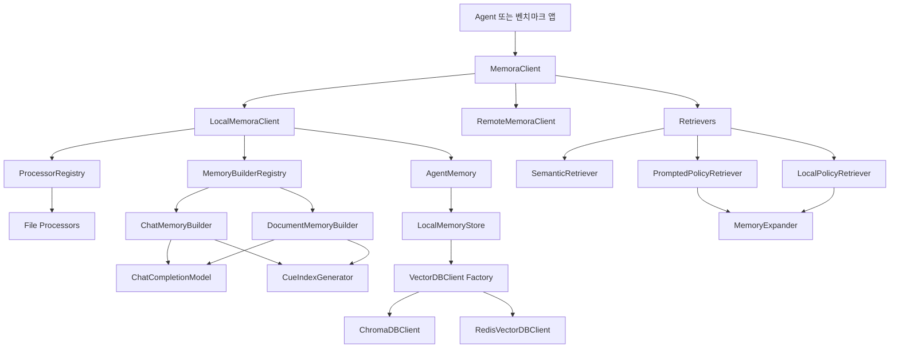
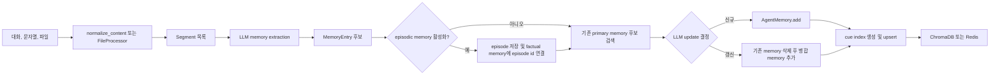
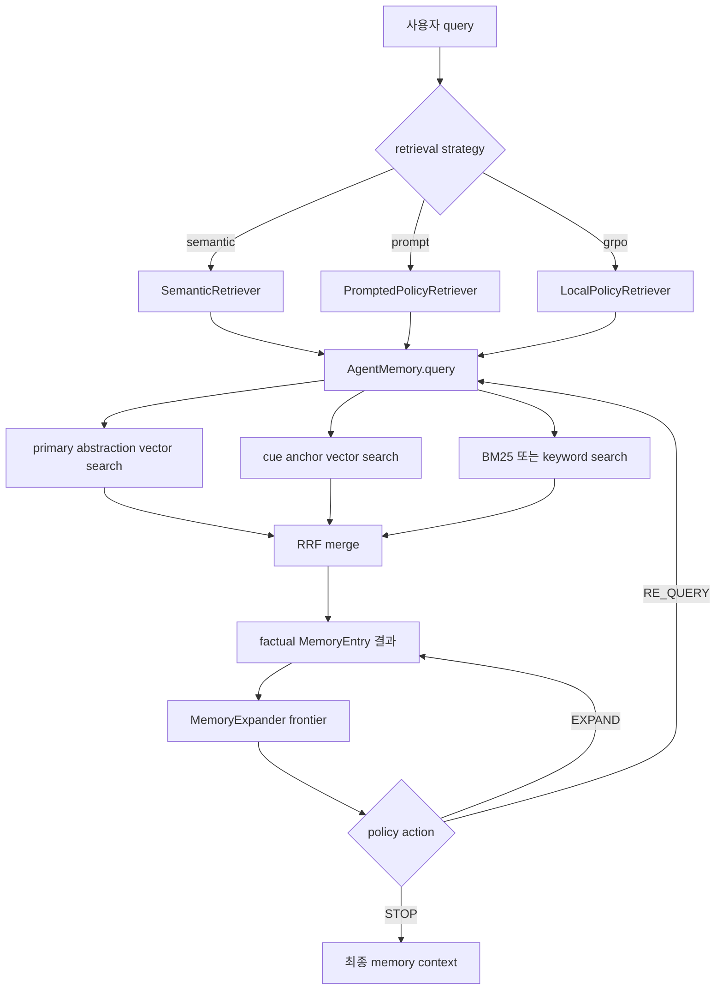

# microsoft/Memora 코드 레벨 분석

## 0. 분석 기준

- 대상 저장소: <https://github.com/microsoft/Memora>
- 로컬 분석 위치: `.repos/Memora`
- 분석 커밋: `dec3f8f` (`2026-06-16`, `Initial commit`)
- 웹 기준일: `2026-07-06`
- 논문: [Memora: A Harmonic Memory Representation Balancing Abstraction and Specificity](https://arxiv.org/abs/2602.03315)

Memora는 에이전트 장기 기억을 위해 원문 수준의 구체 정보와 검색 가능한 추상 표현을 분리하는 Python 연구용 프레임워크다. 저장되는 핵심 정보는 `MemoryEntry.value`에 보존하고, 검색 및 갱신의 대표 키는 `MemoryEntry.index`에 둔다. 여기에 여러 개의 `cue_indices`를 붙여 primary abstraction 하나로만 접근할 때 놓치는 관점들을 추가 검색 경로로 제공한다.

코드베이스 규모는 Python 파일 90개, 약 22.4k 라인이다. `src/memora` 라이브러리 코드가 약 15.9k 라인, `app/locomo`와 `app/longmemeval` 실험 코드가 약 6.4k 라인이다.

## 1. 프로젝트 개요

### Problem Statement

기존 에이전트 메모리 구현은 보통 두 극단 중 하나로 치우친다.

- 원문 로그나 chunk를 그대로 벡터 검색한다. 세부 정보는 남지만 노이즈와 중복이 커지고, 장기 대화에서 multi-hop 추론이 약하다.
- 요약, entity, graph node 등 고수준 표현으로 압축한다. 검색 효율은 좋아지지만 숫자, 조건, 맥락, 업데이트 이력 같은 세부 정보가 손실된다.

Memora의 문제의식은 "추상화와 구체성의 균형"이다. 논문은 이를 harmonic memory representation이라고 부르며, primary abstraction과 cue anchor를 검색 가능한 scaffolding으로 쓰고, 실제 memory value는 압축하지 않은 구체 정보로 보존하는 방식을 제안한다.

### 용도

Memora는 다음 상황에 적합하다.

- 멀티 세션 대화에서 사용자의 선호, 사건, 계획, 관계, 변경 이력을 기억해야 하는 agent
- 단순 vector RAG보다 강한 구조화가 필요하지만, full knowledge graph 구축 비용과 스키마 경직성은 피하고 싶은 agent memory
- LoCoMo, LongMemEval 같은 장기 메모리 벤치마크 재현과 retrieval policy 실험
- ChromaDB 또는 Redis 기반 로컬/자체 호스팅 메모리 저장소 실험

반대로 지금 코드 상태는 production-ready SDK라기보다 논문 구현과 실험 코드에 가깝다. 설치 메타데이터 누락, 일부 미구현 remote API, 타입/필터 불일치 가능성이 존재한다.

## 2. 핵심 특징 및 차별점

### Harmonic Memory Representation

Memora의 memory entry는 세 층으로 구성된다.

| 구성 | 구현 필드 | 역할 | 인덱싱 여부 |
|---|---|---|---|
| Memory value | `MemoryEntry.value` | 구체 정보, 원문에 가까운 사실 또는 절차 | 직접 문서 값으로 저장되지만 검색 document는 주로 index |
| Primary abstraction | `MemoryEntry.index` | 기억의 canonical key, 갱신과 dedup 단위 | 벡터 검색 대상 |
| Cue anchors | `MemoryEntry.cue_indices`, 별도 cue entry의 `linked_memory` | 다른 관점의 semantic hook, 관련 memory 연결 | 벡터 검색 대상 |

중요한 구현 포인트는 cue anchor도 별도 `MemoryEntry`처럼 ChromaDB/Redis에 저장하지만 `linked_memory`가 비어 있지 않으면 cue entry로 간주한다는 점이다. cue 검색 결과는 실제 답변 컨텍스트로 반환되지 않고, `linked_memory`가 가리키는 primary memory로 해석된다.

### Memory Lifecycle

1. 입력 대화나 문서를 segment로 나눈다.
2. LLM이 factual/procedural memory 후보를 추출한다.
3. 기존 primary memory와 유사도를 검색한다.
4. LLM이 add/update 여부와 merge 결과를 결정한다.
5. cue index를 생성하고 primary memory와 연결한다.
6. query 시 primary/cue/BM25 검색 결과를 RRF로 병합한다.
7. prompt policy 또는 local policy가 필요하면 frontier 확장과 재검색을 반복한다.

### 경쟁 접근 대비 차별점

- RAG 대비: raw chunk가 아니라 primary abstraction과 cue anchor를 검색 대상으로 사용한다.
- flat memory store 대비: cue anchor가 many-to-many 연결을 만들며, policy retriever가 이를 탐색한다.
- graph memory 대비: 명시적 node/edge schema 없이 implicit graph를 만든다. 구축은 가볍지만 graph query의 엄밀성은 약하다.
- Mem0류 fact memory 대비: primary abstraction 단위의 update와 cue 기반 expansion을 더 전면에 둔다.

## 3. 아키텍처 분석

### 전체 구조



### Memory Ingestion 흐름



### Retrieval 흐름



### 핵심 데이터 모델

`src/memora/core/memory_entry.py`의 `MemoryEntry`가 모든 계층의 공통 DTO다.

| 필드 | 의미 |
|---|---|
| `index` | primary abstraction 또는 cue anchor 텍스트 |
| `value` | 실제 memory content |
| `original_text` | episodic memory 원문 보존용 |
| `history` | update 전후 값 이력 |
| `memory_type` | `factual`, `procedural`, `episodic` 등 |
| `episodic_memory_ids` | factual memory가 참조하는 episode id 목록 |
| `score` | 검색 유사도 또는 RRF/BM25 점수 |
| `timestamp` | 사건/대화 시각 |
| `creation_time` | 메모리 생성 batch 시각 |
| `linked_memory` | cue entry가 연결하는 primary index 목록 |
| `cue_indices` | primary memory가 가진 cue anchor 목록 |
| `image_urls` | multimodal 입력에서 추출된 image URL |

`is_cue_index()`는 `linked_memory != ""` 여부만 본다. 따라서 primary memory와 cue memory가 같은 collection에 섞여 저장된다.

## 4. 기술 스택

| 영역 | 사용 기술 |
|---|---|
| 언어 | Python 3.10 이상 안내, README badge는 3.12 |
| 설정 | Hydra, OmegaConf |
| LLM | Azure OpenAI, OpenAI API, 일부 Hugging Face local model |
| Embedding | Azure OpenAI/OpenAI `text-embedding-3-small` 기본 |
| Vector store | ChromaDB 기본, Redis Stack 선택 |
| 검색 보조 | BM25 (`rank-bm25`), keyword search, RRF |
| 구조화 출력 | Pydantic 모델 기반 OpenAI parse API |
| 문서 처리 | markdownify, python-docx, openpyxl, python-pptx, pdfplumber |
| RL policy | PyTorch, Transformers, PEFT LoRA, bitsandbytes |
| 실험 | LoCoMo, LongMemEval, tqdm, Jinja2 |
| 브라우저 | ChromaDB 직접 탐색 CLI |

주의할 점은 `requirements.txt`에 `omegaconf`, `pdfplumber`, `openpyxl`, `python-pptx`, `jinja2`, `tqdm`, `importlib_metadata` 등이 빠져 있거나 간접 의존성에 기대는 부분이 있다는 점이다. 또한 루트에 `pyproject.toml`, `setup.py`, `setup.cfg`가 없어서 README의 `pip install -e .` 안내는 현재 커밋 기준으로 그대로 동작하기 어렵다.

## 5. 핵심 코드 분석

### Public API: `MemoraClient`

파일: `src/memora/memora_client.py`

`MemoraClient`는 local/remote를 숨기는 facade다.

- `MemoraClient(cfg, user_id)`면 `LocalMemoraClient`를 사용한다.
- `MemoraClient(api_key=...)`면 `RemoteMemoraClient`를 사용한다.
- 주요 API는 `add`, `add_file`, `query`, `advance_query`, `list_memories`, `get`, `delete`, `count`, `clear`, `delete_all`이다.

`advance_query()`는 `query_type`에 따라 retriever를 선택한다.

| `query_type` | 구현 |
|---|---|
| `semantic` | `SemanticRetriever` |
| `prompt` | `PromptedPolicyRetriever` |
| `grpo` | `LocalPolicyRetriever`와 LoRA checkpoint |

Remote path는 `add`와 `query`만 HTTP 호출로 구현되어 있고, `get`, `delete`, `count`, `clear`, `delete_all`은 `NotImplementedError`다.

### Local Orchestration: `LocalMemoraClient`

파일: `src/memora/core/local_client.py`

역할:

- `AgentMemory` 생성
- `ChatCompletionModel` 생성
- `MemoryBuilderRegistry`에 builder 등록
- `ProcessorRegistry`로 파일 segment 처리
- `add()`에서 입력을 `Segment`로 만들고 builder에 위임

등록된 builder:

| 입력 타입 | builder |
|---|---|
| `chat`, `default` | `ChatMemoryBuilder` |
| `markdown`, `doc` | `DocumentMemoryBuilder` |

`_get_memory_builder()`에는 `excel -> table`, `powerpoint -> ppt`, `html -> html` 같은 매핑이 있지만 registry에는 해당 builder가 등록되어 있지 않다. 이 타입으로 `add_file()`을 호출하면 registry lookup 실패 가능성이 있다.

### Core Memory Facade: `AgentMemory`

파일: `src/memora/core/memory.py`

`AgentMemory`는 저장소와 검색 전략의 중간 계층이다.

주요 책임:

- `QueryMode`에 따라 primary, cue, both 검색 제어
- cue entry 검색 결과를 primary memory로 resolve
- similarity threshold (`query_score_threshold`) 적용
- hybrid search 실행
- RRF 병합
- LLM filtering 선택 적용
- primary/cue 삭제 시 링크 정합성 유지

`QueryMode`:

| 모드 | 동작 |
|---|---|
| `ORIGINAL` | 특별한 필터 없이 검색 |
| `PRIMARY_ONLY` | `linked_memory == ""`이고 `memory_type == "factual"`인 primary만 검색 |
| `CUE_ONLY` | `linked_memory != ""`인 cue만 검색 |
| `BOTH` | primary와 cue를 분리 검색하고 RRF로 병합 |

Hybrid search는 BM25 또는 keyword search를 사용하고, primary/cue/hybrid 결과를 weighted RRF로 병합한다. 기본 weight는 primary 2.0, cue 1.0, hybrid 1.0이다.

### Storage: `LocalMemoryStore`

파일: `src/memora/core/local_memory_store.py`

저장 방식:

- record id는 `sha256(index)`로 결정한다.
- vector DB에는 `documents=[index]`를 저장한다. 즉 embedding 검색 대상은 memory value가 아니라 primary/cue index다.
- memory value와 기타 필드는 metadata에 들어간다.
- user별 collection 이름은 `{collection_name}_{user_alias}`다.
- user별 `RLock`으로 동시 접근을 보호한다.

설계상 장점:

- 같은 index의 upsert가 결정적이다.
- 검색 대상이 짧은 abstraction이므로 embedding 비용과 노이즈가 줄어든다.
- primary와 cue를 같은 collection에 저장해 구현이 단순하다.

설계상 한계:

- value 자체의 semantic search는 직접 수행하지 않는다. index/cue 품질이 낮으면 recall이 크게 떨어진다.
- cue와 primary를 같은 collection에 섞어 저장하므로 필터/metadata 정합성이 중요하다.
- `keyword_search()`는 반환 위치가 루프 내부에 있어 첫 매칭만 반환하거나 매칭이 없을 때 `None`을 반환할 수 있는 버그가 보인다.

### Vector DB Abstraction

파일:

- `src/memora/db_clients/base.py`
- `src/memora/db_clients/chromadb_client.py`
- `src/memora/db_clients/redis_client.py`
- `src/memora/db_clients/factory.py`

`create_vector_db_client(cfg)`는 `cfg.memory.db_type`에 따라 ChromaDB 또는 Redis를 선택한다. 기본은 ChromaDB다.

ChromaDB 구현은 `chromadb.PersistentClient`를 persist path별 singleton cache로 관리하고, embedding function으로 `BaseEmbeddingModel`을 붙인다.

Redis 구현은 Redis Stack JSON/Search를 직접 사용한다. JSON document에 embedding list와 metadata를 저장하고, RediSearch vector field와 TAG field를 생성한다. ChromaDB의 `where` 형태 일부를 Redis filter expression으로 변환한다.

### Memory Builder

파일:

- `src/memora/builder/memory_builder.py`
- `src/memora/builder/chat_memory_builder.py`
- `src/memora/builder/document_memory_builder.py`
- `src/memora/core/cue_index_generator.py`

`MemoryBuilder.build()`가 ingestion의 핵심이다.

1. `normalize_content()`로 입력 정규화
2. metadata 생성
3. episodic memory가 켜져 있으면 episode 저장
4. LLM으로 memory entry 추출
5. cue index batch 생성
6. 각 entry별 upsert 처리

`upsert_memory_entry()`의 갱신 로직:

- 동일 index가 이미 있으면 duplicate로 간주하고 스킵한다.
- 동일 index가 없으면 `entry.index`로 primary memory 후보를 검색한다.
- similarity가 `update_score_threshold` 이상인 후보를 LLM에 전달한다.
- LLM이 update를 선택하면 기존 primary memory를 삭제하고 병합된 entry를 새로 추가한다.
- update 시 history, image URL, episodic id를 병합한다.

Chat builder는 factual memory를 추출하고 강제로 `entry.memory_type = "factual"`로 정규화한다. Document builder는 factual/procedural memory를 추출하지만 type 정규화가 없다. 프롬프트는 `Factual`, `Procedural` 대문자 출력을 유도하는데, retriever는 `memory_type == "factual"`을 필터로 쓰므로 문서 메모리가 검색에서 빠질 가능성이 있다.

또 하나의 구현 불일치가 있다. `normalize_content()`는 문자열 입력도 `{"text": "..."} `형태로 반환한다. Chat/Document builder는 multimodal이 아닌 경우에도 이 dict를 그대로 프롬프트의 `{content}` 또는 `{segment_content}`에 넣는다. 결과적으로 LLM 입력에 `{'text': '...'}` 표현이 들어갈 수 있다. LLM이 이해할 수는 있지만 의도한 순수 텍스트 입력은 아니다.

### Cue Index

파일: `src/memora/core/cue_index_generator.py`

`CueIndexGenerator`는 memory index/value 목록을 한 번의 LLM call로 받아 0-3개 또는 1-3개 cue를 생성한다. 실제 호출은 `PROMPT_CUE_GENERATION`을 사용한다.

생성된 cue는 primary memory의 `cue_indices`에 `||`로 직렬화되고, 동시에 별도 cue entry로 upsert된다.

cue entry metadata 예:

```python
{
    "linked_memory": "Primary Memory A||Primary Memory B"
}
```

이 방식은 implicit graph를 구현한다. cue anchor가 graph edge 또는 hyperedge처럼 동작하며, 같은 cue를 공유하는 primary memory들이 retrieval frontier로 연결된다.

### Query Generator와 Memory Filter

파일:

- `src/memora/core/query_generator.py`
- `src/memora/core/memory_filter.py`

`QueryGenerator`는 두 역할을 한다.

- `generate_queries()`로 query paraphrase 또는 retrieval intent query를 만든다.
- `extract_keywords()`로 keyword search용 phrase를 만든다.

`MemoryFilter`는 검색 결과를 LLM으로 1-3점 scoring하고 2점 이상만 유지한다. 기본 설정에서는 꺼져 있다.

### Retrievers

파일:

- `src/memora/retriever/semantic_retriever.py`
- `src/memora/retriever/prompted_policy_retriever.py`
- `src/memora/retriever/local_policy_retriever.py`
- `src/memora/core/memory_expander.py`
- `src/memora/retriever/policy_utils.py`

`SemanticRetriever`는 단순히 `AgentMemory.query()`를 호출한다. cue index가 켜져 있으면 `QueryMode.BOTH`, 아니면 `PRIMARY_ONLY`를 사용한다.

`PromptedPolicyRetriever`는 초기 검색 후 policy loop를 돈다.

1. `INIT_RETRIEVE`: query로 initial memory set을 가져온다.
2. `MemoryExpander.build_frontier()`: memory의 cue index를 따라 frontier를 만든다.
3. LLM policy가 `STOP`, `EXPAND`, `RE_QUERY` 중 하나를 고른다.
4. `EXPAND`: frontier에서 선택된 memory를 working set에 추가한다.
5. `RE_QUERY`: 새 query로 다시 검색하고 working set과 합친다.
6. 최대 step 또는 `STOP`에서 종료한다.

`LocalPolicyRetriever`는 같은 loop를 Qwen 계열 local model로 수행한다. `checkpoint_path`가 있으면 PEFT LoRA checkpoint를 로드해 GRPO 학습 policy로 추론한다.

`MemoryExpander`는 primary memory의 `cue_indices`를 읽고, 각 cue entry의 `linked_memory`를 따라 연결된 primary memory를 frontier에 넣는다. `enable_relaxed_frontier`가 켜지면 cue끼리 유사도 검색을 추가로 수행해 frontier를 확장한다.

## 6. API 및 인터페이스

### 기본 사용

```python
from memora.memora_client import MemoraClient

client = MemoraClient(cfg=cfg, user_id="demo_user")
client.add("Alice is moving to Seattle for a new job.", type="doc")

results = client.query("Where is Alice moving?", top_k=5)
advanced = client.advance_query("Where is Alice moving?", query_type="prompt", top_k=5)
```

### 주요 API 표

| API | 설명 | 반환 |
|---|---|---|
| `add(text, type, metadata)` | 텍스트/대화 memory 생성 | `List[MemoryEntry]` |
| `add_file(file_path, metadata)` | 파일을 segment로 나눠 memory 생성 | `List[MemoryEntry]` |
| `query(context, top_k, ...)` | semantic/cue/hybrid 검색 | `List[MemoryEntry]` |
| `advance_query(context, query_type)` | retriever strategy 기반 검색 | `List[MemoryEntry]` |
| `list_memories(limit)` | collection 내 memory 나열 | `List[MemoryEntry]` |
| `get(key)` | index로 단일 memory 조회 | `MemoryEntry` 또는 `None` |
| `delete(key)` | primary 또는 cue memory 삭제 | `None` |
| `clear()` | 사용자 collection 삭제 후 재생성 | `None` |

### CLI

`src/memora/cli.py`와 `src/memora/browser`는 ChromaDB memory store를 탐색하는 browser CLI를 제공한다.

예:

```bash
memora browser /path/to/memory_store --stats
memora browser /path/to/memory_store --search "incident management"
```

다만 현재 저장소에는 package entry point 메타데이터가 없어 `memora` 명령이 자동 설치되지 않는다. `PYTHONPATH=src python -m memora.browser ...` 방식이 더 현실적이다.

## 7. 확장성 및 플러그인 포인트

### Memory Builder 확장

`MemoryBuilderRegistry`에 새 builder를 등록하면 입력 타입별 memory extraction을 바꿀 수 있다.

필요 구현:

- `generate_memory_entries()`
- `generate_episodic_memory()`

현재 registry에는 `chat`, `default`, `markdown`, `doc`만 등록되어 있다. Excel/PPT/HTML/JSON/YAML 등을 진짜 지원하려면 해당 builder 등록이 필요하다.

### File Processor 확장

`ProcessorRegistry.register()`로 새 `FileProcessor`를 추가할 수 있다.

현재 기본 processor:

- Markdown
- Text
- Word
- Excel/CSV
- PowerPoint
- PDF

파일 processor는 segment와 metadata만 만든다. 실제 memory extraction은 builder가 수행한다.

### Vector Store 확장

`VectorDBClient` 인터페이스를 구현하고 `factory.py`에 분기 추가하면 다른 vector DB를 붙일 수 있다.

필수 메서드:

- `get_or_create_collection`
- `upsert`
- `query`
- `get`
- `delete`
- `count`
- `delete_collection`

### Retriever 확장

`BaseMemoryRetriever.retrieve()`를 구현하면 새로운 retrieval strategy를 추가할 수 있다. `MemoraClient.advance_query()`에 `query_type` 분기를 추가하면 public API로 노출된다.

### Policy 학습 확장

`src/memora/rl` 아래에는 GRPO 학습용 구성 요소가 있다.

- `policy.py`: policy state/output interface
- `policy_qwen.py`: Qwen + LoRA policy
- `trajectory_collector.py`: query별 trajectory sampling
- `trajectory_scorer.py`: groundedness, redundancy, cost 기반 reward
- `grpo_trainer.py`: group-relative advantage와 LoRA update
- `collect_trajectories.py`: trajectory 수집 CLI

이 레이어는 실험용 성격이 강하며 GPU, Transformers, PEFT, bitsandbytes 의존성이 있다.

## 8. 성능 특성

### 논문 및 README 기준

논문은 LoCoMo와 LongMemEval에서 Memora가 full-context 및 여러 memory baseline보다 높은 성능을 보이고, full-context 대비 token consumption을 크게 줄인다고 주장한다. 논문 본문에는 LoCoMo overall LLM judge 기준 Memora prompted policy가 0.863, LongMemEval 평균 87.4%로 보고되어 있다.

이 수치는 특정 모델, dataset split, prompt, 평가 judge에 의존한다. 코드의 `app/locomo`와 `app/longmemeval`은 해당 벤치마크 재현을 위한 runner를 포함한다.

### 구현상 성능 설계

| 영역 | 설계 |
|---|---|
| Embedding 비용 | value 전체가 아니라 primary/cue index를 embedding |
| Retrieval recall | primary + cue + BM25 결과를 병합 |
| Multi-hop | cue 기반 frontier expansion과 policy action |
| 중복 억제 | primary abstraction 유사도와 LLM update decision |
| 동시성 | user별 RLock, benchmark 앱의 ThreadPoolExecutor |
| 캐싱 | Chroma PersistentClient path별 cache, local policy model global cache, embedding LRU 일부 |

### 병목

- memory build는 LLM extraction, cue generation, update decision에 의존하므로 비용이 크다.
- cue index 품질이 retrieval 품질을 좌우한다.
- prompted policy는 검색 loop마다 LLM call이 추가된다.
- local GRPO policy는 큰 Qwen 모델 로딩과 GPU 메모리가 필요하다.
- ChromaDB를 user별 collection으로 나누므로 사용자가 많거나 question별 collection을 만드는 LongMemEval에서는 file descriptor와 collection 관리 이슈가 생길 수 있다. LongMemEval search code는 LRU client eviction으로 이를 완화한다.

## 9. 배포 및 운영

### 설치 상태

README는 다음을 안내한다.

```bash
git clone https://github.com/microsoft/Memora
cd Memora
pip install -e .
```

하지만 현재 커밋에는 `pyproject.toml`, `setup.py`, `setup.cfg`가 없다. 따라서 editable install과 CLI entry point는 바로 성립하지 않는다. 실사용하려면 임시로 다음처럼 실행하거나 packaging metadata를 추가해야 한다.

```bash
export PYTHONPATH=/path/to/Memora/src
python quickstart.py
```

### 설정

Hydra config는 benchmark 앱 아래에 있다.

- `app/locomo/conf/config.yaml`
- `app/longmemeval/conf/config.yaml`

주요 설정:

- `openai.api_type`: `azure` 또는 `openai`
- `openai.llm_api_base`, `openai.embedding_api_base`
- `memory.persist_path`
- `memory.collection_name`
- `memory.enable_cue_index`
- `memory.enable_hybrid_search`
- `memory.enable_episodic_memory`
- `retrieval.strategy`: `semantic`, `prompt`, `grpo`

### 배포 형태

현재 실질적인 배포 형태는 세 가지다.

1. 로컬 Python 라이브러리: ChromaDB persist path 기반
2. Redis Stack 기반 vector store: `memory.db_type=redis`
3. remote client: `/api/v1/memory/add`, `/api/v1/memory/query`를 호출하는 skeleton

FastAPI와 uvicorn이 requirements에 있지만, 실제 remote server implementation은 코드에서 확인되지 않는다. `HttpMemoryStore`도 주석상 "externalization이 필요할 때 재활성화" 성격이며 `AgentMemory`는 현재 `LocalMemoryStore`를 직접 사용한다.

## 10. 경쟁 및 비교 분석

| 프로젝트 | 핵심 접근 | Memora 대비 강점 | Memora 대비 약점 |
|---|---|---|---|
| Mem0 | 대화에서 salient memory를 추출, update/delete lifecycle 제공, hosted/open-source 모두 지향 | SDK/제품 완성도, integration 생태계, user memory use case에 강함 | cue anchor 기반 implicit graph와 policy-guided traversal은 Memora 쪽이 더 연구적으로 명시적 |
| LangMem | LangGraph storage와 결합한 long-term memory primitive, prompt optimization 포함 | LangGraph agent와 자연스럽게 통합, framework primitive로 사용하기 좋음 | Memora처럼 primary/cue/value 3층 표현을 강제하지 않음 |
| Zep/Graphiti | temporal knowledge graph 기반 context graph | 시간성, 관계성, production governance, graph retrieval에 강함 | graph 구축/운영 복잡도와 스키마/엔티티 추출 품질 의존성이 큼 |
| GraphRAG | 문서 corpus에서 knowledge graph와 community summary를 구축 | 대규모 문서 전역 질문과 global reasoning에 강함 | agent 개인 메모리의 지속 업데이트와 대화 단위 lifecycle에는 무거움 |
| Naive RAG | chunk embedding과 top-k 검색 | 구현 단순, 기존 vector DB 생태계 활용 쉬움 | 장기 대화에서 중복, fragmentation, multi-hop retrieval 한계 |
| Full context | 모든 history를 prompt에 투입 | 구현상 retrieval miss가 없음 | context/token 비용 폭증, long-context reasoning 품질 불안정 |

Memora의 포지션은 "graph를 명시적으로 만들지 않고도 graph-like traversal을 제공하는 structured memory"에 가깝다. primary abstraction은 concept node처럼, cue anchor는 relation/hyperedge처럼 작동하지만, 실제 데이터 구조는 vector store metadata와 문자열 링크다.

## 11. 장점

- 표현 모델이 명확하다. value, primary abstraction, cue anchor의 역할 분리가 코드에 직접 반영되어 있다.
- 기존 agent에 붙이기 쉬운 facade API가 있다.
- ChromaDB/Redis abstraction이 있어 storage 교체 지점이 분리되어 있다.
- update decision, cue generation, query generation, filtering이 모두 별도 컴포넌트로 나뉘어 실험하기 쉽다.
- policy-guided retrieval이 구현되어 단순 top-k 검색보다 multi-hop 질문에 대응할 구조가 있다.
- LoCoMo와 LongMemEval runner가 포함되어 논문 실험을 재현하거나 변형하기 쉽다.
- episodic memory와 factual memory를 연결해 세부 사실과 대화 맥락을 동시에 제공할 수 있다.

## 12. 단점 및 리스크

### 구현 완성도

- packaging metadata가 없어 README의 `pip install -e .`가 현재 커밋 기준 불완전하다.
- `RemoteMemoraClient`는 일부 API만 구현되어 있다.
- `HttpMemoryStore`는 존재하지만 core path에서 사용되지 않는다.
- registry mapping과 실제 builder 등록이 맞지 않아 `excel`, `powerpoint`, `html`, `json`, `yaml` 파일 ingestion이 실패할 수 있다.

### 데이터 정합성

- cue link가 `||` 문자열 직렬화에 의존한다. escaping, rename, partial update에 취약하다.
- primary와 cue가 같은 collection에 섞여 있어 metadata filter 오류가 검색 품질에 직접 영향을 준다.
- document builder의 `memory_type` 대소문자가 retriever filter와 불일치할 수 있다.
- `normalize_content()` 반환 타입과 builder prompt 입력이 맞지 않는다.

### 검색 품질 의존성

- value를 직접 embedding하지 않으므로 primary/cue 생성 품질이 낮으면 recall이 낮아진다.
- update decision은 LLM 판단에 의존한다. 잘못 merge하면 memory contamination이 생길 수 있다.
- prompted policy는 LLM JSON 출력 파싱에 의존하고, 실패 시 STOP으로 fallback한다.

### 코드 품질

- 중복 import와 debug `print()`가 많다.
- `keyword_search()` 반환 indentation bug가 보인다.
- `merge_memory()`는 `MemoryEntry`에 없는 `user_id` 속성을 참조한다. 현재 호출 경로는 확인되지 않지만 latent bug다.
- requirements와 실제 import 목록이 맞지 않는다.
- 일부 class/function docstring이 현재 구현과 어긋난다.

## 13. 엔지니어 관점 종합 평가

Memora는 "에이전트 메모리의 표현 구조"를 연구하기에 좋은 코드베이스다. 특히 primary abstraction과 cue anchor를 별도 검색 surface로 두고, cue를 통해 implicit memory graph를 구성하는 설계는 단순 RAG와 fact store 사이의 실용적인 절충안이다.

다만 현재 저장소는 초기 공개 커밋 성격이 강하다. SDK로 바로 채택하기보다는 다음 순서의 정리가 필요하다.

1. `pyproject.toml` 추가 및 requirements 정리
2. `normalize_content()`와 builder 입력 타입 정리
3. `memory_type` canonicalization 추가
4. registry mapping과 builder 등록 일치
5. cue/primary link를 문자열이 아닌 list metadata 또는 별도 edge collection으로 정규화
6. hybrid search bug 수정
7. remote server와 client contract 확정

이 정리가 끝나면 Memora는 agent memory 실험 프레임워크로 꽤 강력하다. 특히 "검색 가능한 것은 추상화하고, 답변에 필요한 것은 구체적으로 보존한다"는 설계 원칙은 장기 대화 메모리, 개인화 agent, multi-session assistant에 적용 가치가 있다.

## 14. 핵심 파일 지도

| 경로 | 역할 |
|---|---|
| `src/memora/memora_client.py` | public facade |
| `src/memora/core/local_client.py` | local client orchestration |
| `src/memora/core/memory.py` | query, add/delete, primary/cue/hybrid 병합 |
| `src/memora/core/memory_entry.py` | 공통 memory DTO |
| `src/memora/core/local_memory_store.py` | user별 collection, upsert/query/BM25 |
| `src/memora/db_clients/chromadb_client.py` | ChromaDB backend |
| `src/memora/db_clients/redis_client.py` | Redis Stack backend |
| `src/memora/builder/memory_builder.py` | LLM extraction, update decision, history |
| `src/memora/builder/chat_memory_builder.py` | conversation factual/episodic memory |
| `src/memora/builder/document_memory_builder.py` | document factual/procedural memory |
| `src/memora/core/cue_index_generator.py` | cue anchor 생성 |
| `src/memora/core/query_generator.py` | query rewrite, keyword extraction |
| `src/memora/retriever/semantic_retriever.py` | semantic retrieval |
| `src/memora/retriever/prompted_policy_retriever.py` | LLM policy retrieval |
| `src/memora/retriever/local_policy_retriever.py` | local Qwen/LoRA policy retrieval |
| `src/memora/core/memory_expander.py` | cue 기반 frontier expansion |
| `src/memora/rl/*` | GRPO trajectory collection/scoring/training |
| `src/memora/processors/*` | 파일별 segment 생성 |
| `src/memora/browser/*` | ChromaDB memory browser |
| `app/locomo/*` | LoCoMo benchmark runner |
| `app/longmemeval/*` | LongMemEval benchmark runner |

## 15. 참고 자료

- Microsoft Memora GitHub: <https://github.com/microsoft/Memora>
- Memora paper: <https://arxiv.org/abs/2602.03315>
- LoCoMo benchmark paper: <https://arxiv.org/abs/2402.17753>
- LongMemEval benchmark paper: <https://arxiv.org/abs/2410.10813>
- Mem0 docs: <https://docs.mem0.ai/introduction>
- LangMem docs: <https://langchain-ai.github.io/langmem/>
- Zep/Graphiti repository: <https://github.com/getzep/graphiti>
- Microsoft GraphRAG docs: <https://microsoft.github.io/graphrag/>
