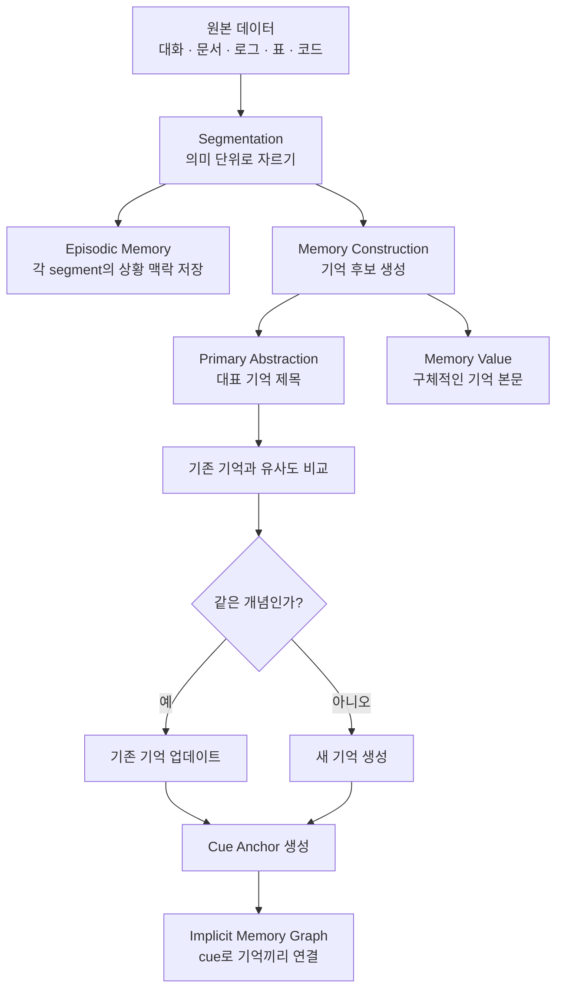
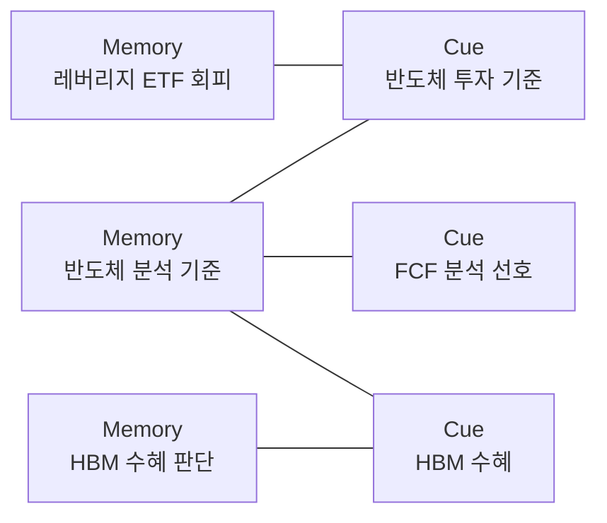
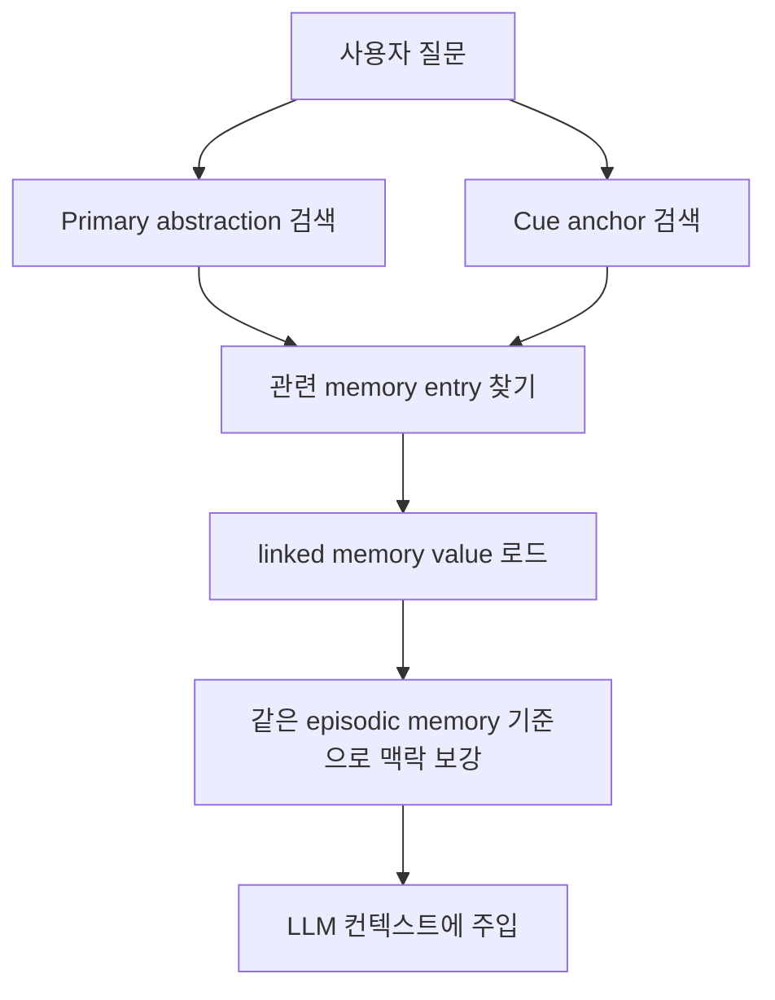

# Memora 논문 기반 기억 처리 흐름 설명

[Memora.pdf](/Users/cleave-sangyun/Downloads/Memora.pdf)를 기준으로 보면, Memora의 핵심은 **기억의 내용(value)** 과 **기억을 찾기 위한 접근 경로(primary abstraction, cue anchor)** 를 분리하는 것입니다.

쉽게 말하면:

```text
value = 실제로 기억해야 할 내용
primary abstraction = 그 기억의 대표 제목
cue anchor = 그 기억을 떠올리게 하는 보조 검색 단서
episodic memory = 그 기억이 나온 대화/상황 맥락
```

## 전체 흐름




## 1. 텍스트가 들어오면 먼저 segment로 나눈다

Memora는 원본 텍스트를 바로 통째로 저장하지 않습니다. 먼저 의미 단위로 자릅니다.

예를 들어 이런 대화가 들어왔다고 하겠습니다.

```text
사용자: 나는 SOXL 같은 레버리지 ETF는 별로야.
사용자: 반도체 투자 볼 때는 재고 사이클이랑 FCF를 같이 봐야 한다고 생각해.
사용자: 삼성전자보다 SK하이닉스가 HBM 수혜는 더 직접적이라고 봐.
```

이건 하나의 주제가 이어지는 대화이므로 하나의 segment가 될 수 있습니다.

```text
Segment:
"사용자가 반도체 투자 기준, 레버리지 ETF 회피, HBM 수혜 판단에 대해 말했다."
```

문서라면 heading, section, paragraph 같은 구조를 활용하고, 대화라면 주제 전환, 시간 간격, 발화 흐름을 보고 나눕니다.

## 2. segment마다 episodic memory를 만든다

`episodic memory`는 "이 기억들이 어떤 상황에서 나온 것인가"를 보존합니다.

예:

```json
{
  "episodic_index": "반도체 ETF와 HBM 투자 기준 논의",
  "episodic_value": "사용자는 반도체 투자에서 재고 사이클과 FCF를 중시한다고 말했고, 레버리지 ETF를 피하며 SK하이닉스의 HBM 수혜를 긍정적으로 보았다."
}
```

이건 개별 사실보다 더 넓은 맥락입니다. 나중에 여러 기억이 검색됐을 때, 같은 episodic memory에서 나온 기억들을 묶어 보여주면 LLM이 "이 사람이 어떤 흐름에서 이 말을 했는지" 이해하기 쉽습니다.

## 3. segment에서 memory entry를 만든다

하나의 segment는 여러 개의 memory entry로 쪼개질 수 있습니다.

각 memory entry는 기본적으로 이렇게 생겼습니다.

```text
Memory Entry = primary abstraction + memory value + cue anchors
```

예:

```json
{
  "primary_abstraction": "사용자 레버리지 ETF 회피",
  "memory_value": "사용자는 SOXL 같은 레버리지 ETF를 선호하지 않는다.",
  "cue_anchors": [
    "SOXL 회피",
    "레버리지 ETF 위험",
    "고변동성 ETF 회피"
  ],
  "episodic_memory": "반도체 ETF와 HBM 투자 기준 논의"
}
```

또 다른 memory entry:

```json
{
  "primary_abstraction": "사용자 반도체 분석 기준",
  "memory_value": "사용자는 반도체 투자 분석 시 재고 사이클과 FCF를 중요하게 본다.",
  "cue_anchors": [
    "반도체 재고 사이클",
    "FCF 분석 선호",
    "반도체 투자 기준"
  ]
}
```

여기서 중요한 점은 `memory_value`가 가장 구체적인 실제 기억이라는 것입니다. 반면 `primary_abstraction`과 `cue_anchors`는 이 기억을 찾기 위한 검색 표면입니다.

## 4. 기존 기억을 업데이트할지 새로 만들지 판단한다

Memora는 새 기억을 무조건 append하지 않습니다. 먼저 새 memory의 `primary abstraction`을 기존 기억들의 primary abstraction과 비교합니다.

```text
새 primary abstraction
→ 기존 primary abstraction들과 embedding similarity 계산
→ threshold 이상 후보 추림
→ LLM이 "같은 개념인가?" 판단
```

예를 들어 기존 기억이 있습니다.

```json
{
  "primary_abstraction": "사용자 레버리지 ETF 회피",
  "memory_value": "사용자는 SOXL 같은 레버리지 ETF를 선호하지 않는다."
}
```

나중에 사용자가 말합니다.

```text
TQQQ도 너무 변동성이 커서 별로야.
```

새 후보는 이렇게 나올 수 있습니다.

```json
{
  "primary_abstraction": "사용자 TQQQ 회피",
  "memory_value": "사용자는 TQQQ도 변동성이 커서 선호하지 않는다."
}
```

Memora는 이걸 완전히 새 기억으로 만들기보다, 기존 `사용자 레버리지 ETF 회피`와 같은 개념인지 판단합니다. 같다고 판단되면 업데이트합니다.

```json
{
  "primary_abstraction": "사용자 레버리지 ETF 회피",
  "memory_value": "사용자는 SOXL, TQQQ 같은 레버리지 ETF를 변동성이 크다는 이유로 선호하지 않는다.",
  "cue_anchors": [
    "SOXL 회피",
    "TQQQ 회피",
    "레버리지 ETF 위험",
    "고변동성 ETF 회피"
  ]
}
```

이게 Memora가 말하는 **fragmentation 방지**입니다. 비슷한 기억이 여러 조각으로 흩어지지 않고, 하나의 안정적인 기억으로 커집니다.

## 5. cue anchor는 기억을 찾는 보조 진입점이다

`primary abstraction`은 대표 제목입니다. 하지만 대표 제목 하나만으로는 모든 질문을 잡기 어렵습니다.

예를 들어 primary abstraction이:

```text
사용자 반도체 분석 기준
```

이라고만 되어 있으면, 사용자가 나중에 이렇게 물었을 때 매칭이 약할 수 있습니다.

```text
HBM 쪽 볼 때 FCF도 봐야 하나?
```

그래서 cue anchor를 둡니다.

```text
반도체 재고 사이클
FCF 분석 선호
HBM 수혜 판단
반도체 투자 기준
```

Cue는 일반 keyword와 비슷하지만, 단어 하나가 아니라 **짧은 의미 구문**입니다.

```text
나쁜 cue: FCF
좋은 cue: 반도체 FCF 분석
```

논문에서는 cue를 `[Main Entity] + [Key Aspect]` 형태로 만들라고 합니다. 그래야 너무 일반적인 단어가 아니라 실제 기억과 연결되는 검색 단서가 됩니다.

## 6. cue들이 implicit memory graph를 만든다

Memora는 Neo4j 같은 명시적 graph DB를 반드시 만들지는 않습니다. 대신 cue가 여러 기억을 연결하면서 암묵적인 그래프가 생깁니다.



이 구조 덕분에 "반도체 ETF"로 시작한 검색이 `FCF`, `HBM`, `재고 사이클` 같은 주변 기억으로 확장될 수 있습니다.

## 7. 검색할 때는 value를 바로 찾는 게 아니라 index/cue를 먼저 찾는다

Memora의 검색은 기본적으로 이렇게 진행됩니다.



예를 들어 사용자가 묻습니다.

```text
반도체 ETF 추천해줘.
```

검색 표면에서는 이런 것들이 걸립니다.

```text
Cue: 반도체 투자 기준
Cue: 반도체 FCF 분석
Cue: 레버리지 ETF 위험
Primary: 사용자 반도체 분석 기준
Primary: 사용자 레버리지 ETF 회피
```

그 결과 실제로 LLM에게 제공되는 기억은 이런 식입니다.

```text
사용자 메모리:
- 사용자는 SOXL, TQQQ 같은 레버리지 ETF를 변동성이 크다는 이유로 선호하지 않는다.
- 사용자는 반도체 투자 분석 시 재고 사이클과 FCF를 중요하게 본다.
- 사용자는 SK하이닉스가 삼성전자보다 HBM 수혜가 더 직접적이라고 본 적이 있다.
```

그러면 에이전트는 단순히 "SOXL, SOXX, SMH가 있습니다"라고 답하지 않고:

```text
- SOXL은 레버리지 ETF라 사용자 성향상 제외 또는 주의
- SMH/SOXX 중심 비교
- 비교 기준은 HBM 노출도, 재고 사이클, FCF
```

처럼 개인화된 답변을 만들 수 있습니다.

## 8. Policy-guided retrieval은 한 번의 검색으로 끝내지 않는다

일반 RAG는 보통 top-k 검색 한 번으로 끝납니다.

```text
query → top-k chunks → answer
```

Memora는 더 복잡한 질문에 대해 retrieval을 순차 의사결정으로 봅니다.

상태는 네 가지입니다.

```text
현재 query
지금까지 찾은 working set
확장 가능한 frontier
남은 budget
```

행동은 세 가지입니다.

| 행동 | 의미 |
|---|---|
| `REFINE` 또는 `RE-QUERY` | 질문을 다시 표현해서 다른 방향으로 검색 |
| `EXPAND` | cue/frontier를 따라 관련 기억으로 확장 |
| `STOP` | 충분하다고 보고 검색 종료 |

예:

```text
질문: "내 성향 기준으로 반도체 ETF 괜찮은 것 골라줘"

Step 1:
- "반도체 ETF"로 검색
- 반도체 분석 기준 memory 발견

Step 2:
- cue "레버리지 ETF 위험"으로 확장
- 레버리지 ETF 회피 memory 발견

Step 3:
- cue "HBM 수혜"로 확장
- SK하이닉스/HBM 판단 memory 발견

Step 4:
- STOP
```

이렇게 하면 단순 top-k 검색으로는 못 잡는 관련 기억들을 단계적으로 모읍니다.

## 9. 최종적으로 저장되는 구조를 단순화하면

```json
{
  "memory_id": "m_001",
  "primary_abstraction": "사용자 반도체 분석 기준",
  "memory_value": "사용자는 반도체 투자 분석 시 재고 사이클과 FCF를 중요하게 본다.",
  "cue_anchors": [
    "반도체 재고 사이클",
    "FCF 분석 선호",
    "반도체 투자 기준"
  ],
  "episodic_memory_id": "e_001",
  "history": [
    {
      "time": "2026-07-09",
      "value": "사용자는 반도체 투자에서 재고 사이클을 중요하게 본다고 말했다."
    }
  ]
}
```

그리고 cue 쪽은 개념적으로 이렇게 연결됩니다.

```json
{
  "cue": "FCF 분석 선호",
  "linked_memories": ["m_001", "m_017"]
}
```

즉 cue는 단독 기억이 아니라, 관련 memory들을 가리키는 검색 앵커입니다.

## 핵심 요약

Memora의 저장/검색 방식은 다음 한 문장으로 정리할 수 있습니다.

```text
구체적인 기억은 value에 보존하고, 검색은 primary abstraction과 cue anchor로 수행하며, cue가 기억들 사이의 암묵적 그래프를 만든다.
```

일반 RAG와 비교하면:

| 항목 | 일반 RAG | Memora |
|---|---|---|
| 저장 단위 | chunk | memory entry |
| 검색 대상 | chunk 본문 embedding | primary abstraction + cue anchor |
| 세부 정보 | chunk 안에 있음 | memory value에 보존 |
| 중복 처리 | 약함 | primary abstraction 기준 update |
| multi-hop | 별도 graph 필요 | cue 기반 implicit graph |
| 맥락 보존 | 주변 chunk 의존 | episodic memory로 보존 |

그래서 Memora는 "문서를 검색하는 RAG"라기보다는, **에이전트가 장기간 쌓인 경험과 사용자 맥락을 구조화해서 기억하고 다시 꺼내 쓰는 방식**에 가깝습니다.
