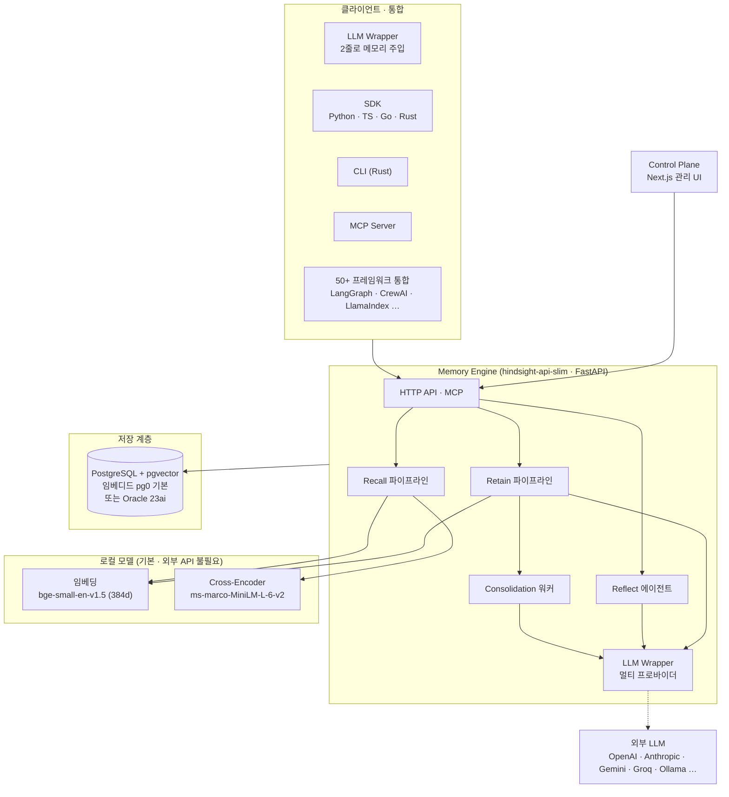
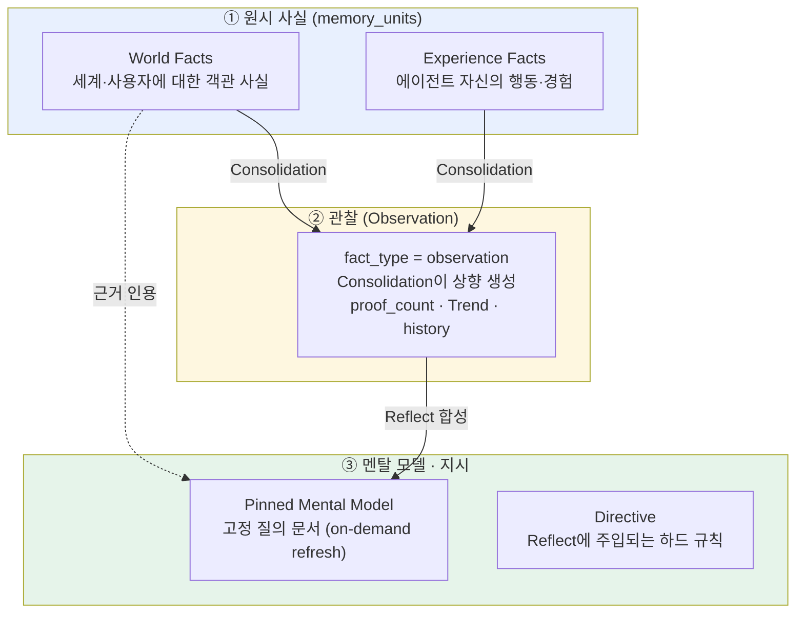
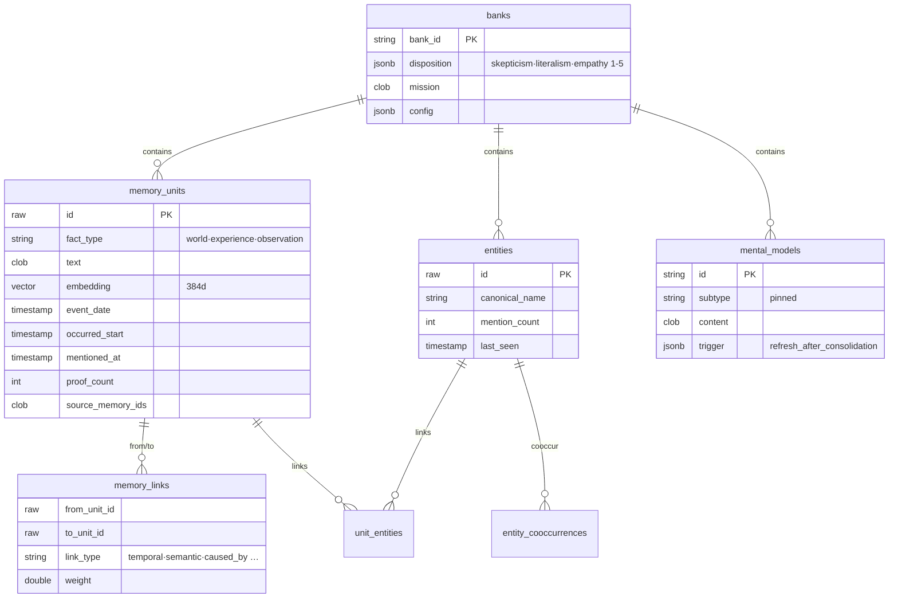
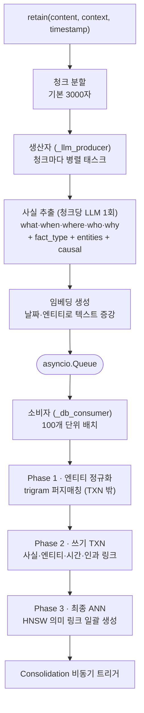
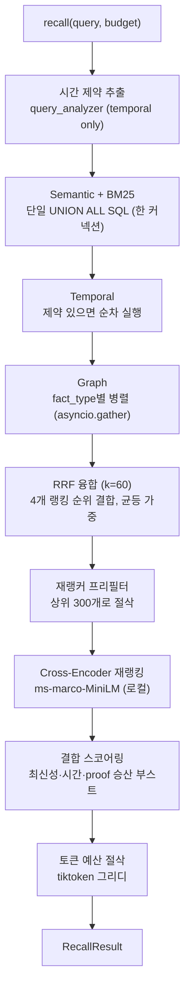
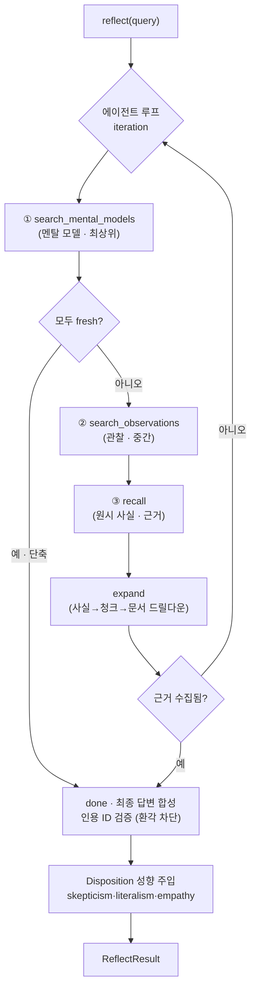

# Hindsight 에이전트 메모리 시스템 분석 보고서

> 분석 대상: [vectorize-io/hindsight](https://github.com/vectorize-io/hindsight)
> 분석 방식: 소스코드 단위 분석 (`hindsight-api-slim/hindsight_api/engine/`)
> 작성일: 2026-07-18

---

## 1. 프로젝트 개요

**Hindsight™**는 Vectorize.io가 만든 오픈소스 **에이전트 메모리 시스템**이다. 슬로건은 *"Agent Memory That Learns"* — 대부분의 메모리 시스템이 "대화 기록을 잘 기억(remember)하는 것"에 집중하는 반면, Hindsight는 **"기억을 넘어 학습(learn)하는 에이전트"**를 목표로 한다. 인간의 기억 구조를 모방한 **바이오미메틱(biomimetic) 데이터 구조**로 메모리를 조직하고, 단순 RAG나 지식 그래프의 한계를 극복하는 것을 표방한다.

- **GitHub**: https://github.com/vectorize-io/hindsight
- **조직**: Vectorize.io
- **라이선스**: MIT
- **논문**: *"Hindsight is 20/20: Building Agent Memory that Retains, Recalls, and Reflects"* ([arXiv:2512.12818](https://arxiv.org/abs/2512.12818))
- **핵심 스택**: FastAPI(Python) + PostgreSQL(pgvector) / Oracle 23ai, Next.js 관리 UI
- **배포 형태**: 셀프호스트(Docker/pip/임베디드 DB) / 클라우드 / MCP

### 1.1 해결하려는 문제 (Problem Statement)

| 기존 방식 | 한계 | Hindsight의 접근 |
|-----------|------|------------------|
| **벡터 RAG** | 청크 단순 유사도 검색, 시간·인과 추론 불가 | 사실을 엔티티·시간·인과로 구조화 + 4-전략 검색 |
| **지식 그래프** | 관계 추출 비용, 스키마 경직 | LLM 사실 추출 + 자동 엔티티 정규화 그래프 |
| **대화 기록 저장** | "기억"만 하고 "이해"는 못함 | **Reflect**로 관찰(observation)·멘탈 모델 형성 |
| **정적 메모리** | 새 정보로 믿음을 갱신 못함 | Consolidation으로 믿음을 지속 통합·갱신 |

### 1.2 성능 지표 (LongMemEval 벤치마크)

Hindsight는 장기 대화 메모리 벤치마크 **LongMemEval**에서 SOTA급 정확도를 보고한다. Virginia Tech Sanghani Center와 Washington Post가 독립 재현했다고 명시한다.

| 시스템 | LongMemEval 정확도 | 비고 |
|--------|-------------------:|------|
| **Hindsight** | **~91.4% (최신 보고 94.6%)** | 8,192 토큰 검색 예산 기준 |
| Zep (Graphiti) | 90.2% | ~4,408 토큰 예산 |
| Mem0 | 상대적 하위 | temporal 서브태스크 ~49% |

> ⚠️ Hindsight의 91.4%는 **8,192 토큰 검색 예산**에서 측정된 값으로, Zep(90.2% / ~4,408 토큰)의 약 2배 컨텍스트를 사용한다. 절대 정확도는 높지만 그만큼 더 많은 컨텍스트를 소비한다는 점을 함께 봐야 한다. (출처: 웹 벤치마크 비교, 2026-01)

---

## 2. 핵심 특징 및 차별점

| 기능 | 설명 |
|------|------|
| **바이오미메틱 3계층** | World(세계 사실) · Experience(에이전트 경험) · Mental Model(학습된 이해) |
| **3대 연산** | Retain(저장) · Recall(검색) · Reflect(성찰) |
| **Learn, not just remember** | Reflect/Consolidation으로 원시 사실에서 관찰과 믿음을 능동 형성 |
| **4-전략 검색** | Semantic + BM25 + Graph + Temporal → RRF 융합 → cross-encoder 재랭킹 |
| **시간·인과 인식 그래프** | 엔티티·시간(24h)·인과(caused_by) 링크로 다중 세션 추론 |
| **Disposition(성향)** | skepticism·literalism·empathy(1~5) 성향이 Reflect 응답을 조율 |
| **믿음 갱신** | proof_count와 Trend(강화/약화)로 관찰의 신뢰를 시간에 따라 갱신 |
| **로컬 우선 자립성** | 임베딩·재랭커가 로컬 모델 기본 → **외부 API는 LLM만 필요** |
| **압도적 통합 생태계** | 50+ 프레임워크 통합, MCP, LLM Wrapper(2줄), Python/TS/Go/Rust SDK |

### 2.1 가장 중요한 차별점 — "Retain / Recall / Reflect"

Hindsight의 정체성은 세 연산의 삼분법이다. 특히 **Reflect**가 다른 메모리 시스템과의 결정적 차이다. Retain은 저장, Recall은 검색이지만, **Reflect는 저장된 기억을 도구로 삼아 반복 추론하며 새로운 관찰·통찰을 합성**한다. 여기에 인간 기억의 "정보 통합(consolidation)" 과정을 백그라운드 잡으로 구현해, 원시 사실이 시간이 지나며 구조화된 믿음(observation)과 멘탈 모델로 승화된다.

---

## 3. 아키텍처 분석

### 3.1 전체 시스템 구조 (모노레포)

Hindsight는 대형 폴리글랏 모노레포다. 핵심 메모리 엔진은 Python(FastAPI)의 `hindsight-api-slim`에 있고, 관리 UI는 Next.js다.



**스택 요약**

| 계층 | 기술 |
|------|------|
| 메모리 엔진 | Python / FastAPI (`hindsight-api-slim`) |
| 관리 UI | Next.js 16 (`hindsight-control-plane`) |
| CLI | Rust |
| 저장소 | PostgreSQL + pgvector (**임베디드 pg0 기본**) 또는 Oracle 23ai |
| 임베딩 | 로컬 sentence-transformers `bge-small-en-v1.5`(384d) 기본 / TEI · OpenAI · ZeroEntropy |
| 재랭커 | 로컬 cross-encoder `ms-marco-MiniLM-L-6-v2` 기본 / TEI · Cohere · Jina … |
| LLM | OpenAI · Anthropic · Gemini · Groq · Ollama · LMStudio · MiniMax · DeepSeek · z.ai · VertexAI · Atlas … |

> **자립성 포인트**: 임베딩·재랭킹이 로컬 모델 기본이라 **외부 API 의존은 LLM 하나뿐**이다. Ollama/LMStudio를 쓰면 완전 로컬 실행도 가능하다. 이는 임베딩 API가 필수인 Memobase와 대비되는 배포 특성이다.

### 3.2 핵심 개념 모델 — 3계층 지식 구조

Hindsight의 심장은 "원시 사실 → 관찰 → 멘탈 모델"의 **상향식(bottom-up) 지식 계층**이다. Reflect의 검색 우선순위도 이 계층을 그대로 따른다(**멘탈 모델 > 관찰 > 원시 사실**).



| 지식 객체 | 저장 위치 | 생성 방식 | 역할 |
|-----------|-----------|-----------|------|
| **World Fact** | `memory_units` (fact_type=world) | Retain LLM 추출 | 세계·사용자에 대한 객관 사실 |
| **Experience Fact** | `memory_units` (fact_type=experience) | Retain LLM 추출 | 에이전트 자신이 수행한 행동·경험 |
| **Observation** | `memory_units` (fact_type=observation) | **Consolidation** 자동 상향 생성 | 여러 사실을 통합한 "믿음" (근거·추세 보유) |
| **Mental Model** | `mental_models` (subtype=pinned) | 사용자 정의 질의 + Reflect 합성 | 고정 질문에 대한 캐시된 이해 문서 |
| **Directive** | `directives` | 사용자 정의 | Reflect 프롬프트에 주입되는 하드 규칙 |

### 3.3 데이터 모델 (핵심 테이블)



핵심 설계 포인트:
- **Bank = 격리된 메모리 저장소** (한 사용자/에이전트의 "뇌"). Bank 간 데이터 누수 금지.
- **memory_units**가 원시 사실·관찰을 모두 담고 `fact_type`으로 구분. 시간 필드가 3종(`event_date`, `occurred_start/end`, `mentioned_at`)으로 사건 시점·언급 시점을 분리.
- **memory_links** 링크 타입: `temporal`, `semantic`, `entity`, `causes`, `caused_by`, `enables`, `prevents` — 시간·의미·**인과** 관계를 모두 표현.
- **entity 간 링크는 별도 저장하지 않고** `unit_entities` 셀프조인으로 그래프 UI에 온디맨드 파생.
- 모순·무효화된 사실은 `invalidated_memory_units` **콜드 아카이브**로 이동해 검색 핫패스에서 배제.

---

## 4. 핵심 코드 분석

### 4.1 Retain 파이프라인 — 스트리밍 생산자·소비자

Retain은 원시 콘텐츠를 청크로 쪼개 **청크마다 LLM 사실 추출을 병렬 실행**하는 스트리밍 파이프라인이다 (`retain/orchestrator.py::retain_batch`).



**핵심 설계 결정**:
- **청크당 LLM 1회**로 사실을 추출하고 모든 청크가 동시 실행(최대 32 동시). 엔티티·시간·인과·fact_type이 단일 추출 호출에서 함께 나온다 (별도 LLM 호출 없음).
- **World vs Experience 분류**: LLM은 `{world, assistant}`를 방출하고 코드가 `assistant → experience`로 매핑. "사용자가 대화 중 말한 선호·규칙도 world"라는 규칙으로 화자 귀속을 명확히 한다.
- **엔티티 정규화**: LLM이 뽑은 엔티티를 trigram(`pg_trgm`) 또는 `SequenceMatcher`로 퍼지 매칭. 이름 유사도(0.5) + 공동출현(0.3) + 시간 근접(0.2)으로 스코어링, **임계 0.6** 이상이면 기존 엔티티 재사용, 아니면 신규 생성.
- **링크 생성**: `temporal`(24h 윈도, 근접도 가중치 `max(0.3, 1-Δh/24)`), `semantic`(HNSW ANN, 코사인 ≥ 0.7), `caused_by`(가중치 1.0, 각 사실이 앞선 사실 최대 2개 참조).
- **임베딩 증강**: 저장 텍스트는 원문 그대로 두되, **임베딩용 텍스트에만** 날짜·엔티티를 덧붙여(`"{fact} (happened in {date}) [entities]"`) 시간·엔티티 검색 정확도를 높인다.
- **믿음 신뢰도는 사실 단계에서 부여하지 않는다** — confidence는 링크 가중치·엔티티 매칭 스코어로만 존재하고, "믿음"은 Consolidation 단계의 관찰로 넘어간다.

### 4.2 Recall 파이프라인 — 단계적 4-전략 + RRF + 재랭킹

Recall은 4가지 검색 전략을 결합한다. 다만 완전한 4-way 동시 실행이 아니라 **DB 커넥션 예산에 맞춘 단계적(staged) 설계**다 (`search/retrieval.py::retrieve_all_fact_types_parallel`).



**핵심 설계 결정**:
- **Query 분석은 시간 제약 추출 전용** — 의도 분류·질의시 엔티티 추출은 하지 않는다. (엔티티는 Retain 시점에 이미 그래프로 구조화되어 있어 검색 때 암묵 활용)
- **Semantic + BM25는 하나의 `UNION ALL` SQL**로 처리해 fact_type별 부분 HNSW 인덱스와 자체 `ORDER BY/LIMIT`를 유지. HNSW 근사 오차 보정을 위해 5배 오버페치.
- **RRF 융합**: `score(d) = Σ 1/(k + rank(d))`, **k=60**, 4개 전략 균등 가중. 특정 전략 우선순위는 `recall_boost`로 옵트인.
- **Cross-Encoder 재랭킹**: 로컬 `ms-marco-MiniLM-L-6-v2` 기본, 로짓을 sigmoid로 정규화. 재랭킹 후 최신성(±20%)·시간근접(±20%)·proof_count(±10%)를 **승산 부스트**로 결합.
- **Graph 검색 = 1-hop 링크 확장** (엔티티 공유 + 의미 kNN + 인과 링크의 수렴 증거를 가산), **Temporal 검색 = 다중 hop BFS 확산**(최대 5회 반복, 인과 링크에 2.0× 부스트).
- **토큰 절삭**: `tiktoken cl100k_base`로 그리디 누적, 예산 초과 시 하드 스톱.

### 4.3 Reflect — 에이전틱 도구 호출 루프

Reflect는 저장된 기억을 도구로 삼는 **에이전틱 네이티브 툴콜링 루프**다 (`reflect/agent.py::run_reflect_agent`). **읽기 전용**이며 아무것도 저장하지 않는다.



**핵심 설계 결정**:
- **강제 계층 하강**: 초기 반복에서 `tool_choice`를 멘탈모델 → 관찰 → 원시사실 순으로 강제해, 약한 LLM도 반드시 지식 계층을 내려가게 한다. 멘탈 모델이 모두 신선하면 즉시 단축.
- **환각 차단**: `done`이 인용한 ID 중 실제 수집된 `available_*_ids`에 있는 것만 결과에 남긴다. LLM이 지어낸 인용은 폐기.
- **온도 0.9** — Reflect는 "사고(thinking)" 단계라 창의적 온도, Retain(0.1)·Consolidation(0.0)과 대비.
- **Disposition 주입**: 성향(skepticism/literalism/empathy, 1~5)은 알고리즘 가중치가 아니라 **프롬프트에 평문으로 주입**되어 LLM이 해석. Recall에는 영향 없고 Reflect에만 작용.
- **시간 우선 규칙**: 프롬프트가 "가장 최신 `mentioned_at`이 권위 있음, 나중 진술이 이전을 대체(supersede)"를 명시해 모순 믿음을 읽기 시점에 해소.

### 4.4 Consolidation — 사실을 "믿음(관찰)"으로 통합

Consolidation은 원시 사실을 `fact_type='observation'` 관찰로 통합하는 백그라운드 잡이다 (`consolidation/consolidator.py`). **이것이 "learn, not just remember"의 실체다.**

**언제 실행되나 (3중 트리거)**:
1. **Retain 직후** — fire-and-forget 비동기 트리거(retain을 블록하지 않음)
2. **Reconcile 스윕** — `MaintenanceLoop`가 5분(`consolidation_reconcile_interval_seconds=300`)마다 미통합 사실이 있는 bank 재큐잉
3. **자기 재큐잉** — 라운드당 최대치 초과 시 스스로 재제출

**어떻게 통합하나**:
- 배치 내 각 사실에 대해 관련 기존 관찰을 병렬 recall(중복 방지 위해 `interleave` 융합 사용).
- N개 사실 + 풀링된 관찰을 **단일 LLM 호출**에 넣어 `{creates, updates, deletes}` 구조화 액션 생성 → deletes → updates → creates 순차 실행.
- **정책: "UPDATE OVER CREATE"** — 새 사실을 기존 관찰의 증거로 병합하는 것을 신규 생성보다 선호. "많은 source 사실을 가진 하나의 정규 관찰"이 이상적.
- **"NO COMPUTATION"** — 카운트에 대한 산술·연역 금지, 사용자가 명시한 값만 갱신.
- **3중 중복 제거**: ① 프롬프트 레벨(UPDATE 선호) ② 정확 텍스트 일치 가드 ③ 의미 중복(임계 `0.97`, PG 전용) — 최근접 관찰을 LLM이 1:1 병합/유지 판정.

**믿음 갱신 (confidence)**:
- 과거엔 `fact_type='opinion'` + `confidence_score`(0~1) 컬럼이 있었으나 **마이그레이션으로 제거**됨. 지금 신뢰는 세 가지로 표현:
  - **`proof_count`** — 관찰을 뒷받침하는 distinct source 사실 수 (증거량)
  - **`Trend`** — 최근(30d) vs 과거(90d) 증거 밀도로 `STABLE/STRENGTHENING/WEAKENING/NEW/STALE` 계산
  - **LLM 표면화** — Reflect 프롬프트가 "데이터가 지지하지 않는 confidence를 지어내지 말라"고 지시
- UPDATE 시 `source_memory_ids` 확장, `proof_count` 재계산, 시간 필드 집계(`occurred_start=LEAST`, `occurred_end=GREATEST`), `observation_history`에 이전 상태 스냅샷(감사 추적).

### 4.5 멘탈 모델의 무드리프트(no-drift) 갱신 — 구조화 델타

주목할 엔지니어링 디테일: 고정 멘탈 모델을 갱신할 때 **LLM에게 문서 전체 재작성을 시키지 않는다.** 문서를 타입드 `StructuredDocument`(섹션/블록의 순서 리스트)로 유지하고, LLM은 **델타 연산**(`append_block`, `replace_block`, `remove_section` 등 8종)만 방출한다. `apply_operations`가 언급되지 않은 섹션은 물리적으로 그대로 복사하므로 **"산문 드리프트가 구조적으로 불가능"**하다.

> 근거 인용: *"LLM의 본질은 다음 토큰을 생성하는 것이지 토큰을 그대로 복사하는 것이 아니다 — 따라서 '변경되지 않은 내용을 보존하라'는 지시는 근본적으로 soft constraint일 뿐이다."*

---

## 5. 기술 스택 및 설정

### 5.1 주요 설정·기본값

| 파라미터 | 기본값 | 의미 |
|----------|--------|------|
| `retain_chunk_size` | 3000자 | 사실 추출 청크 크기 |
| `retain_chunk_batch_size` | 100 | DB 쓰기 배치 |
| LLM temperature (retain / reflect / consolidation) | 0.1 / 0.9 / 0.0 | 연산별 온도 분리 |
| `recall_budget` (low/mid/high) | 100 / 300 / 1000 | 검색 후보 예산 |
| RRF `k` | 60 | 융합 상수 |
| `reranker_max_candidates` | 300 | cross-encoder 프리필터 |
| `consolidation_reconcile_interval` | 300s | 재통합 스윕 주기 |
| `consolidation_dedup_threshold` | 0.97 | 관찰 의미 중복 임계 |
| 임베딩 모델 | `bge-small-en-v1.5` (384d) | 로컬 기본 |
| 재랭커 모델 | `ms-marco-MiniLM-L-6-v2` | 로컬 기본 |

- **멀티 LLM 전략**: `failover` / `round-robin`을 지원하고, 연산별(`RETAIN_/REFLECT_/CONSOLIDATION_`)로 다른 LLM을 배정 가능.
- **컨텍스트 캐싱**: Retain/Consolidation 시스템 프롬프트를 bank-무관하게 설계해 캐시 프리픽스를 재사용.

### 5.2 API 및 인터페이스

- **3대 코어 API**: `retain` / `recall` / `reflect` (bank 단위)
- **관리 API**: banks(disposition·mission), entities(+graph), mental-models(CRUD·refresh·clear·history), directives, documents, tags, observations, consolidation, config, webhooks
- **LLM Wrapper**: 기존 LLM 클라이언트를 감싸 2줄로 자동 메모리 저장·검색
- **MCP 서버**: `api/mcp.py`
- **SDK**: Python / TypeScript / Go / Rust + Rust CLI
- **50+ 프레임워크 통합**: LangGraph, CrewAI, LlamaIndex, Pydantic AI, AG2, Vercel AI SDK, Claude Code, Cursor, n8n 등

```python
from hindsight_client import Hindsight
client = Hindsight(base_url="http://localhost:8888")

client.retain(bank_id="my-bank", content="Alice works at Google as a software engineer")
client.recall(bank_id="my-bank", query="What does Alice do?")
client.reflect(bank_id="my-bank", query="What should I know about Alice?")
```

---

## 6. 종합 평가

### 6.1 강점

1. **"학습하는 메모리"의 실질적 구현** — Reflect(에이전틱 추론) + Consolidation(믿음 통합)으로 단순 검색을 넘어 관찰·멘탈 모델을 능동 형성한다. 대부분의 경쟁자가 없는 계층이다.
2. **시간·인과 추론** — 엔티티·시간(24h)·인과(caused_by) 링크와 다중 hop BFS로 LongMemEval temporal에서 강세.
3. **검색 품질** — 4-전략 + RRF + cross-encoder 재랭킹 + 승산 부스트의 정교한 파이프라인.
4. **로컬 우선 자립성** — 임베딩·재랭커가 로컬 기본, 임베디드 pg0 DB 기본 → 외부 API는 LLM 하나. Ollama와 조합 시 완전 로컬.
5. **믿음의 감사 가능성** — 관찰은 정확 인용·proof_count·Trend·history를 보유해 "왜 이렇게 믿는지" 추적 가능.
6. **압도적 통합 생태계 + 멀티 DB(Postgres/Oracle) + 멀티 LLM 전략** — 엔터프라이즈 지향.

### 6.2 약점 및 리스크

1. **높은 계산 비용** — 청크당 LLM 추출 + Consolidation LLM + Reflect 에이전틱 루프. Memobase의 "고정 3회" 같은 비용 예측성이 없고, retain당 LLM 호출이 콘텐츠 크기에 비례한다.
2. **컨텍스트 예산 트레이드오프** — SOTA 정확도(91.4%)가 8,192 토큰 예산에서 나온 값으로, 동급 경쟁자보다 컨텍스트를 많이 쓴다.
3. **시스템 복잡도** — 62k+ LOC 엔진, 3계층 지식 객체(관찰/멘탈모델/지시), 다수 백그라운드 잡. 운영·디버깅 난도가 높다.
4. **온라인 지연** — Reflect는 에이전틱 루프라 다수 LLM 왕복이 필요해 "실시간 응답"에는 무겁다 (Recall은 상대적으로 빠름).
5. **일부 기능 PG 전용** — 의미 중복 제거·temporal BFS 등이 Oracle에서 축소.

### 6.3 적합 / 부적합 사례

| 상황 | 적합도 | 이유 |
|------|--------|------|
| 자율 태스크 수행 에이전트 ("AI 직원") | ✅ 매우 적합 | 경험 학습 + 믿음 형성 + 성향 |
| 시간·인과 추론이 중요한 장기 메모리 | ✅ 매우 적합 | 시간·인과 그래프 + temporal SOTA |
| 피드백으로 행동을 바꾸는 에이전트 | ✅ 적합 | Reflect + Consolidation 믿음 갱신 |
| 엔터프라이즈(멀티 LLM/DB, 프라이버시) | ✅ 적합 | 로컬 자립성 + Oracle/멀티프로바이더 |
| 단순 대화 기록 개인화 챗봇 | ⚠️ 과함 | README도 "n8n 같은 단순 워크플로우엔 오버킬" |
| 비용·지연 극도 민감 서비스 | ⚠️ 부적합 | 에이전틱·통합 비용 예측 어려움 |

### 6.4 엔지니어 관점 인사이트

Hindsight의 본질은 **"메모리를 저장·검색 문제에서 학습·믿음 형성 문제로 확장"**한 것이다. Retain(구조화 저장) → Recall(정교한 검색) → **Reflect/Consolidation(능동 학습)**의 삼단 구조가 핵심이며, 특히 "원시 사실 → 관찰 → 멘탈 모델"의 상향식 통합과 proof_count·Trend 기반 믿음 갱신이 다른 시스템과의 결정적 차이다. 트레이드오프는 명확하다 — **비용·복잡도·컨텍스트 소비를 감수**하는 대신 **학습 능력·시간/인과 추론·검색 품질**을 얻는다. 자율적으로 일하며 피드백으로 성장해야 하는 에이전트라면 이 트레이드오프는 정당하지만, 단순 개인화 챗봇에는 과하다.

---

## 7. 생태계 컨텍스트

- **포지셔닝**: Zep(Graphiti)·Mem0와 함께 "서버형·그래프형" 에이전트 메모리 진영의 최상위. LongMemEval에서 Zep과 근소 경쟁.
- **논문 기반**: arXiv 2512.12818로 방법론이 공개됨. 벤치마크가 제3자(Virginia Tech, WaPo) 재현 주장.
- **엔터프라이즈 채택**: Fortune 500 프로덕션 사용 및 스타트업 확산을 명시.
- **비교 문서**: 본 저장소의 [Hindsight vs Memobase 비교](./hindsight-vs-memobase.md), [에이전트 메모리 시스템 비교분석](./에이전트_메모리_시스템_비교분석.md), [Memobase 분석](./Memobase_analysis.md), [mem0 분석](./mem0_analysis.md) 참고.

---

## 참고 자료

- GitHub: https://github.com/vectorize-io/hindsight
- 논문: [Hindsight is 20/20 (arXiv:2512.12818)](https://arxiv.org/abs/2512.12818)
- 문서: https://hindsight.vectorize.io
- [Vectorize 벤치마크 (94.6% 메모리 정확도)](https://vectorize.io/benchmarks)
- [AI Agent Memory Systems in 2026 비교 (Dev Genius)](https://blog.devgenius.io/ai-agent-memory-systems-in-2026-mem0-zep-hindsight-memvid-and-everything-in-between-compared-96e35b818da8)
- [Zep vs Vectorize Hindsight (Zep 관점)](https://www.getzep.com/vectorize-hindsight-alternative/)

---

*작성일: 2026-07-18 · 소스코드 기준 분석 (hindsight `main` 브랜치, control-plane v0.8.4)*
