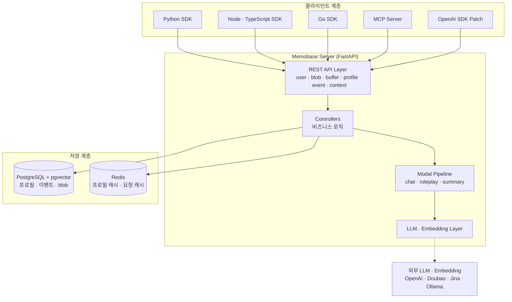
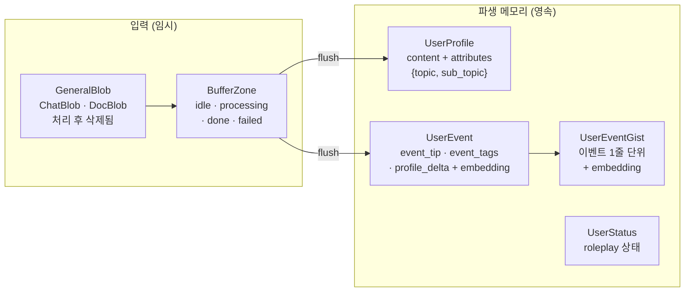
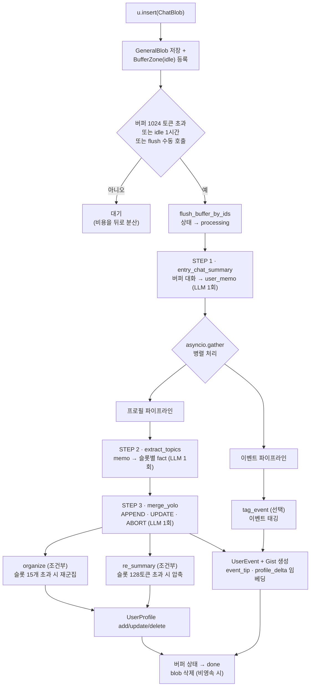
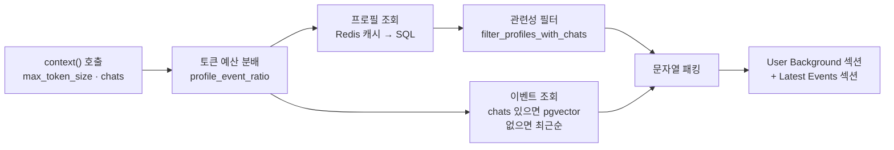
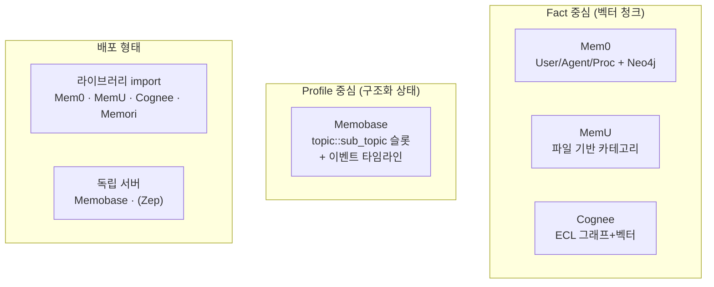

# Memobase 에이전트 메모리 시스템 분석 보고서

> 분석 대상: [memodb-io/memobase](https://github.com/memodb-io/memobase)
> 분석 방식: 소스코드 단위 분석 (`src/server/api/memobase_server/`)
> 작성일: 2026-07-18

---

## 1. 프로젝트 개요

**Memobase**는 LLM 애플리케이션에 장기 사용자 메모리를 제공하는 **"사용자 프로필(User Profile) 기반" 메모리 시스템**이다. 대부분의 에이전트 메모리 시스템이 개별 "사실(fact)"을 벡터로 저장하고 검색하는 데 초점을 맞추는 것과 달리, Memobase는 **각 사용자마다 구조화된 프로필과 이벤트 타임라인을 지속적으로 갱신**하는 방식으로 접근한다. 이는 ChatGPT의 메모리 시스템과 유사한 설계 철학이다.

- **GitHub**: https://github.com/memodb-io/memobase
- **조직**: memodb-io (Memobase.io)
- **라이선스**: Apache 2.0
- **언어**: Python (서버), Python/TypeScript/Go (클라이언트 SDK)
- **인프라**: FastAPI + PostgreSQL(pgvector) + Redis
- **배포 형태**: 셀프호스트(Docker) / 클라우드 / MCP 서버

### 1.1 해결하려는 문제 (Problem Statement)

기존 RAG 기반 메모리 시스템은 다음과 같은 트레이드오프에 시달린다.

| 문제 | 기존 방식의 한계 | Memobase의 접근 |
|------|-----------------|-----------------|
| **LLM 비용** | 매 턴마다 fact 추출 → 검색 → 판단(agentic) | 사용자별 **버퍼(buffer)**에 대화를 모아 배치 처리, 실행당 LLM 호출 **고정 3회** |
| **온라인 지연시간** | 검색 시점에 임베딩·재랭킹 등 전처리 필요 | 프로필/이벤트가 **항상 준비**되어 있어 SQL 몇 번으로 조회 → **100ms 미만** |
| **메모리 통제 불가** | 무엇이 저장될지 예측 어려움 | **프로필 슬롯(topic/sub_topic) 스키마**를 사전 정의·설정 가능 |
| **시간 추론 취약** | 개별 fact는 "언제"를 표현하기 어려움 | **이벤트 타임라인 + gist 임베딩**으로 시간 질의 대응 |

### 1.2 핵심 성능 지표 (LOCOMO 벤치마크)

Memobase는 RAG/검색 전용 설계가 아님에도 LOCOMO 벤치마크(LLM Judge Score)에서 SOTA를 기록한다. 특히 **Temporal(시간 추론)** 카테고리에서 압도적이다.

| Method | Single-Hop | Multi-Hop | Open Domain | **Temporal** | Overall |
|--------|-----------:|----------:|------------:|-------------:|--------:|
| Mem0 | 67.13 | 51.15 | 72.93 | 55.51 | 66.88 |
| Mem0-Graph | 65.71 | 47.19 | 75.71 | 58.13 | 68.44 |
| LangMem | 62.23 | 47.92 | 71.12 | 23.43 | 58.10 |
| Zep | 61.70 | 41.35 | 76.60 | 49.31 | 65.99 |
| OpenAI Memory | 63.79 | 42.92 | 62.29 | 21.71 | 52.90 |
| **Memobase (v0.0.37)** | **70.92** | 46.88 | **77.17** | **85.05** | **75.78** |

> 출처: `docs/experiments/locomo-benchmark/README.md` (Mem0 논문 arXiv:2504.19413의 수치를 함께 인용). Temporal 85.05%는 이벤트 타임라인 + fine-grained event gist(v0.0.37 도입)의 효과다.

---

## 2. 핵심 특징 및 차별점

| 기능 | 설명 |
|------|------|
| **User Profile 중심** | fact 청크가 아니라 `topic::sub_topic → content` 형태의 **구조화된 프로필**을 유지·진화 |
| **Buffer & Batch 처리** | 대화를 hot path에서 즉시 처리하지 않고 버퍼에 모아 flush 시점에 일괄 처리 |
| **고정 3회 LLM 호출** | v0.0.40에서 실행당 LLM 호출을 3~10회 → **고정 3회**로 축소, 토큰 비용 40~50% 절감 |
| **Controllable Memory** | 프로필 스키마(슬롯)를 YAML 설정으로 정의·덮어쓰기, strict/validate 모드 지원 |
| **Time-aware Memory** | 프로필과 별도로 **이벤트 타임라인**을 기록, event gist 단위 임베딩 검색 |
| **Blob 임시성** | 입력 데이터(blob)는 처리 후 기본적으로 **삭제**됨 (프라이버시 친화) |
| **Server 아키텍처** | 라이브러리가 아닌 **독립 서버**(FastAPI) — 다국어 SDK + MCP로 통합 |
| **No Agent 설계** | 시스템 내부에 자율 에이전트를 두지 않는 **결정론적 워크플로우** (비용 예측성) |
| **Roleplay 지원** | proactive topic/interest 감지 등 가상 컴패니언 시나리오 전용 모듈 |

### 2.1 가장 중요한 차별점 — "Agent가 아니라 User를 기억한다"

Memobase의 README 첫 문장은 **"Memory for User, not Agent"** 이다. 즉 에이전트의 실행 이력·절차적 기억(Mem0의 procedural memory)이 아니라, **대화 상대인 인간 사용자의 지속적 상태(프로필 + 사건)**를 모델링하는 데 집중한다. 이 관점 차이가 저장 모델·검색 전략·비용 구조 전반을 규정한다.

---

## 3. 아키텍처 분석

### 3.1 전체 시스템 구조

Memobase는 라이브러리로 임포트하는 다른 시스템들과 달리, **클라이언트-서버 분리형** 아키텍처다.



**스택 요약**

| 계층 | 기술 |
|------|------|
| API 서버 | FastAPI (uvicorn) |
| 관계형 저장소 | PostgreSQL 17 (pgvector 확장) |
| 캐시 | Redis 7.4 (프로필 캐시 TTL 20분, 요청 캐시) |
| LLM | OpenAI 호환 API (`gpt-4o-mini` 기본), Doubao 캐시 스타일 지원 |
| Embedding | OpenAI `text-embedding-3-small`(1536d) / Jina / Ollama / LMStudio |
| 배포 | Docker Compose (db + redis + api 3-tier) |

### 3.2 핵심 개념 모델 — Blob · Profile · Event

Memobase의 데이터 모델은 세 가지 핵심 엔티티로 구성된다.



| 엔티티 | 역할 | 특징 |
|--------|------|------|
| **GeneralBlob** | 원본 입력 (대화/문서) | `persistent_chat_blobs=False`면 처리 후 삭제 → 원본은 저장 안 함 |
| **BufferZone** | flush 대기 큐 | `idle → processing → done/failed` 상태 머신 |
| **UserProfile** | 구조화된 사용자 프로필 슬롯 | `content`(TEXT) + `attributes`(JSONB: topic/sub_topic/update_hits) |
| **UserEvent** | 사건 타임라인 항목 | `event_tip`(요약 memo) + `event_tags` + `profile_delta` + 벡터 |
| **UserEventGist** | 이벤트를 잘게 쪼갠 검색 단위 | 각 gist(불릿 1줄)마다 개별 임베딩 → 정밀 시간 검색 |
| **UserStatus** | 롤플레이 플롯/관심도 상태 | 컴패니언 시나리오용 |

> 모든 테이블은 `(id, project_id)` 복합 PK로 **멀티테넌시(project)** 를 강제하며, `project` 테이블은 read-only(트리거로 insert/delete/update 차단, `profile_config`만 예외)로 설계되어 있다.

### 3.3 데이터 흐름 — 삽입에서 flush까지 (핵심)

Memobase의 심장부는 `insert` → `buffer` → `flush` → `process_blobs` 파이프라인이다. **hot path에서 메모이제이션을 하지 않는다**는 것이 핵심 설계 결정이다.



**고정 3회 LLM 호출의 정체** (`controllers/modal/chat/__init__.py`):

1. `entry_chat_summary` — 버퍼의 원시 대화를 사용자 관점의 markdown memo로 요약
2. `extract_topics` — memo에서 `topic::sub_topic::memo` 형식의 fact 추출
3. `merge_or_valid_new_memos` — 추출된 fact를 기존 프로필과 병합 판단

`organize`(슬롯 과다 시 재군집), `re_summary`(슬롯 과대 시 압축), `tag_event`(이벤트 태그 설정 시)는 **조건부**로만 추가 호출된다. 즉 정상 경로는 항상 3회로 고정되어 비용이 예측 가능하다.

---

## 4. 핵심 코드 분석

### 4.1 프로필 슬롯 스키마 (topic/sub_topic taxonomy)

Memobase의 프로필은 사전 정의된 **슬롯 스키마**를 따른다. 기본값은 `prompts/user_profile_topics.py`에 8개 topic으로 정의되어 있다.

```python
CANDIDATE_PROFILE_TOPICS = [
    UserProfileTopic("basic_info",
        sub_topics=["Name", {"name":"Age","description":"integer"},
                    "Gender", "birth_date", "nationality",
                    "ethnicity", "language_spoken"]),
    UserProfileTopic("contact_info", sub_topics=["email","phone","city","country"]),
    UserProfileTopic("education",    sub_topics=["school","degree","major"]),
    UserProfileTopic("demographics", sub_topics=["marital_status","number_of_children","household_income"]),
    UserProfileTopic("work",         sub_topics=["company","title","working_industry","previous_projects","work_skills"]),
    UserProfileTopic("interest",     sub_topics=["books","movies","music","foods","sports"]),
    UserProfileTopic("psychological",sub_topics=["personality","values","beliefs","motivations","goals"]),
    UserProfileTopic("life_event",   sub_topics=["marriage","relocation","retirement"]),
]
```

이 스키마는 프로젝트 설정(`config.yaml`의 `overwrite_user_profiles`/`additional_user_profiles`)으로 **완전히 커스터마이징**할 수 있다. 교육용/컴패니언/어시스턴트 등 시나리오별 예시가 `example_config/`에 제공된다. 이것이 **"Controllable Memory"** 의 실체다.

### 4.2 추출 프롬프트 — 심리학자 페르소나 + 함의 추론

`prompts/extract_profile.py`의 시스템 프롬프트는 "professional psychologist" 역할을 부여하고, **명시된 정보뿐 아니라 함의(implied)를 추론**하도록 지시한다.

```
You are a professional psychologist.
... extract the important profiles of user in structured format.
You will not only extract the information that's explicitly stated,
but also infer what's implied from the conversation.
```

출력 형식은 JSON이 아니라 **탭(`::`) 구분 markdown 리스트**다 (파싱 안정성·토큰 절약).

```
[POSSIBLE TOPICS THINKING...]
---
- basic_info::name::melinda
- work::title::software engineer
```

특기할 점: `strict_mode`가 켜지면 사전 정의된 슬롯 외 topic 생성을 금지하고, 이전에 쓰던 topic을 재사용하도록 "User Before Topics"를 함께 넣어 **일관성**을 유지한다. 또한 "today/yesterday 같은 상대 날짜 금지, 구체 날짜로 변환" 규칙으로 시간 정합성을 확보한다.

### 4.3 병합 로직 — APPEND / UPDATE / ABORT (merge_yolo)

Memobase의 병합은 Mem0의 `ADD/UPDATE/DELETE/NONE`과 다른 **3-액션 모델**이다 (`prompts/merge_profile_yolo.py`).

| 액션 | 의미 | 코드 처리 |
|------|------|----------|
| **APPEND** | 새 정보를 직접 추가 | 기존 슬롯 있으면 `content + ";" + new`, 없으면 신규 add |
| **UPDATE** | 기존 memo를 재작성(충돌 해소) | 슬롯 `content`를 LLM이 재작성한 값으로 교체, `update_hits += 1` |
| **ABORT** | 무가치/중복/토픽 불일치 → 폐기 | 무시 |

핵심 설계: **명시적 DELETE 액션이 없다.** 모순되는 정보(예: "중간고사 준비" → "기말고사 준비")는 별도 삭제가 아니라 **UPDATE 프롬프트 안에서 LLM이 오래된 내용을 제거하며 재작성**하는 방식으로 처리된다.

```python
# merge_yolo.py — UPDATE 시 update_hits 카운터 증가
if ContanstTable.update_hits not in runtime_profile.attributes:
    runtime_profile.attributes[ContanstTable.update_hits] = 1
else:
    runtime_profile.attributes[ContanstTable.update_hits] += 1
```

또한 `profile_validate_mode=False`이면서 사전 정의 슬롯도 아니고 기존 프로필도 없는 fact는 **LLM 검증을 건너뛰고 바로 add** 하여 호출을 아낀다.

### 4.4 프로필 자기 정리 — organize (재군집) & re_summary (압축)

프로필이 무한히 커지는 것을 막는 **자기 압축(self-pruning)** 메커니즘이 두 가지 있다.

```python
# organize.py — 한 topic의 sub_topic이 15개 초과 시 LLM으로 재군집
for topic, group in topic_groups.items():
    if len(group) > CONFIG.max_profile_subtopics:  # 15
        need_to_organize_topics[topic] = group
# → 재군집 후 개수를 max//2 + 1 (=8) 이하로 강제 축소
reorganized_profiles = reorganized_profiles[: CONFIG.max_profile_subtopics // 2 + 1]
```

```python
# summary.py — 슬롯 content가 128토큰 초과 시 요약 압축
if len(get_encoded_tokens(content)) <= CONFIG.max_pre_profile_token_size:  # 128
    return Promise.resolve(None)  # 압축 불필요
# 초과 시 LLM 요약 → 64토큰(max//2)으로 truncate
```

이 두 장치 덕분에 프로필은 항상 **컴팩트한 상태**로 유지되고, 이것이 컨텍스트 패킹 시 낮은 토큰 비용과 낮은 지연시간으로 직결된다.

### 4.5 이벤트 타임라인 & Gist — 시간 추론의 비결

flush 때마다 `UserEvent` 하나가 생성된다. `event_tip`(=요약 memo)을 **줄 단위로 쪼개 각 gist마다 개별 임베딩**을 만든다 (`controllers/event.py::append_user_event`).

```python
event_gists = validated_event.event_tip.split("\n")
event_gists = [l.strip() for l in event_gists if l.strip().startswith("-")]
# 각 gist를 개별 임베딩 → UserEventGist 테이블에 저장
```

검색 시 pgvector 코사인 유사도로 gist를 정밀 검색한다 (`event_gist.py::search_user_event_gists`).

```python
similarity_expr = 1 - UserEventGist.embedding.cosine_distance(query_embedding)
stmt = select(UserEventGist, similarity_expr.label("similarity")).where(
    UserEventGist.created_at > time_cutoff,          # 시간 윈도우 (기본 21일)
    similarity_expr > similarity_threshold,          # 유사도 임계
).order_by(desc("similarity")).limit(topk)
```

**이벤트=시간·사건, 프로필=상태**로 역할을 분리한 것이 LOCOMO Temporal 85%의 핵심이다. 프로필만으로는 "언제"를 답하기 어렵기 때문이다.

### 4.6 컨텍스트 패킹 — 프롬프트에 바로 꽂는 문자열

`context()` API는 프로필 + 이벤트를 하나의 문자열로 패킹한다 (`controllers/context.py`).



- **토큰 예산 분배**: `profile_event_ratio`로 프로필/이벤트 몫을 나눔
- **관련성 필터**: 최근 대화가 있으면 프로필을 대화 연관도로 1차 필터링 (`filter_profiles_with_chats`)
- **프로필 조회는 Redis 캐시 우선** (TTL 20분) → 대부분 SQL조차 안 타고 100ms 미만
- **커스텀 프롬프트 템플릿** 주입 가능 (`customize_context_prompt`)

출력 예시:
```
# Memory
## User Background:
- basic_info::name: Gus
- interest::foods: Mexican cuisine
## Latest Events:
- User is planning a trip to Tokyo [mentioned 2026/03/01]
```

### 4.7 롤플레이 모듈 (Proactive Companion)

`controllers/modal/roleplay/`는 가상 컴패니언 시나리오 전용이다. `detect_interest`로 사용자의 관심 이탈을 감지하고, 이탈 시 `predict_new_topics`로 대화를 능동적으로 이끌 새 주제를 예측한다. 상태는 `UserStatus` 테이블(`roleplay_plot_status`)에 저장된다. 이는 다른 메모리 시스템에는 거의 없는 응용 특화 기능이다.

---

## 5. 기술 스택 및 설정

### 5.1 주요 설정 파라미터 (`env.py::Config`)

| 파라미터 | 기본값 | 의미 |
|----------|--------|------|
| `max_chat_blob_buffer_token_size` | 1024 | 버퍼 자동 flush 임계 토큰 |
| `buffer_flush_interval` | 3600s | idle flush 간격 (1시간) |
| `max_chat_blob_buffer_process_token_size` | 16384 | 한 번에 처리할 최대 버퍼 토큰 |
| `max_profile_subtopics` | 15 | topic당 sub_topic 상한 (초과 시 organize) |
| `max_pre_profile_token_size` | 128 | 슬롯 content 상한 (초과 시 re_summary) |
| `cache_user_profiles_ttl` | 1200s | Redis 프로필 캐시 TTL (20분) |
| `best_llm_model` | `gpt-4o-mini` | 기본 LLM |
| `thinking_llm_model` | `o4-mini` | 추론 특화 작업용 |
| `embedding_model` | `text-embedding-3-small` | 이벤트 임베딩 (1536d) |
| `llm_tab_separator` | `::` | 프롬프트 출력 구분자 |
| `profile_strict_mode` | False | 사전 정의 슬롯 외 생성 금지 |
| `profile_validate_mode` | True | 모든 fact를 merge 검증 통과 |
| `persistent_chat_blobs` | False | 원본 대화 blob 영속 여부 |

설정은 `config.yaml`(파일) 또는 `MEMOBASE_*` 환경변수로 주입되며, 프로젝트별로 `ProfileConfig` YAML 문자열을 DB에 저장해 **테넌트별 스키마 오버라이드**가 가능하다.

### 5.2 API 및 인터페이스

- **REST API**: FastAPI 기반. `user`/`blob`/`buffer`/`profile`/`event`/`context`/`roleplay`/`project` 라우터로 구성
- **Python SDK**: `MemoBaseClient`, `ChatBlob` — `insert()`/`flush()`/`profile()`/`context()`
- **다국어 SDK**: TypeScript(npm/jsr), Go(pkg.go.dev)
- **MCP 서버**: `src/mcp` — Model Context Protocol로 노출
- **OpenAI SDK Patch**: `memobase/patch/openai.py` — 기존 OpenAI 호출을 감싸 자동 메모리 주입

```python
from memobase import MemoBaseClient, ChatBlob

client = MemoBaseClient(project_url=URL, api_key=TOKEN)
uid = client.add_user()
u = client.get_user(uid)
u.insert(ChatBlob(messages=[{"role":"user","content":"Hello, I'm Gus"}]))
u.flush(sync=True)                       # 버퍼 → 메모리 반영
print(u.profile())                       # 구조화된 프로필
print(u.context(max_token_size=500))     # 프롬프트용 문자열
```

---

## 6. 경쟁·비교 분석

### 6.1 아키텍처 패러다임 비교

Memobase는 이 저장소의 다른 메모리 시스템과 **근본적으로 다른 축**에 위치한다. 대부분이 "라이브러리 + 벡터 fact 저장소"인 반면, Memobase는 "**서버 + 구조화 프로필**"이다.



### 6.2 핵심 축 비교표

| 측면 | **Memobase** | Mem0 | MemU | Memori | Cognee |
|------|-------------|------|------|--------|--------|
| **메모리 단위** | 구조화 프로필 슬롯 + 이벤트 | fact 청크 | 카테고리별 memo | 시맨틱 트리플 | 지식 그래프 노드 |
| **저장 패러다임** | 상태(state) 갱신 | fact 누적/검색 | 파일 병합 | KG 누적 | 그래프+벡터 |
| **배포** | **독립 서버 (Docker)** | 라이브러리 | 라이브러리 | 라이브러리 | 라이브러리 |
| **주 저장소** | Postgres+pgvector+Redis | 20+ 벡터DB / Neo4j | JSON 파일 / FAISS | 인메모리 / NetworkX | Qdrant / Neo4j / PG |
| **비용 최적화** | **버퍼 배치 + 고정 3 LLM** | 병렬 처리 | - | 제로 레이턴시 | - |
| **온라인 지연** | **100ms 미만 (SQL)** | 벡터검색 | 벡터검색 | 인메모리 | 그래프+벡터 |
| **그래프** | 없음 | Neo4j/Kuzu/Memgraph | 없음 | NetworkX | Neo4j/FalkorDB |
| **시간 추론** | **이벤트 타임라인 + gist (SOTA)** | 타임스탬프 | 생성시간 | valid_from/to | temporal cognify |
| **메모리 통제** | **슬롯 스키마 설정** | 프롬프트 | 카테고리 | - | 온톨로지 |
| **원본 보존** | 기본 삭제 (프라이버시) | 저장 | 저장 | 저장 | 저장 |

### 6.3 갱신 로직 비교

| 시스템 | 액션 모델 | 모순 처리 | 크기 제어 |
|--------|-----------|-----------|-----------|
| **Memobase** | APPEND / UPDATE / ABORT | UPDATE 내 LLM 재작성 | organize 재군집 + re_summary 압축 |
| **Mem0** | ADD / UPDATE / DELETE / NONE | 명시적 DELETE | 없음 |
| **MemU** | 자동 병합 | 카테고리 요약 | 카테고리 요약 |
| **OpenMemory** | salience 조정 | SimHash 중복 감지 | 3계층 Decay |

Memobase의 자기 압축(organize/re_summary)은 다른 시스템에 드문, **프로필을 작게 유지하기 위한 능동적 재구성** 장치라는 점이 특징적이다.

### 6.4 강점/약점 매트릭스

```
             비용효율   지연시간   시간추론   통제성    확장성   그래프추론
Memobase     ●●●●●     ●●●●●     ●●●●●     ●●●●●    ●●●○○    ○○○○○
Mem0         ●●●○○     ●●●○○     ●●●○○     ●●○○○    ●●●●●    ●●●●○
MemU         ●●●○○     ●●●○○     ●●○○○     ●●●○○    ●●○○○    ○○○○○
Memori       ●●●●○     ●●●●●     ●●●○○     ●●○○○    ●●○○○    ●●●○○
Cognee       ●●○○○     ●●●○○     ●●●●○     ●●○○○    ●●●●●    ●●●●●

● = 강점, ○ = 약점
```

---

## 7. 종합 평가

### 7.1 강점

1. **비용 예측성** — 버퍼 배치 + 고정 3회 LLM 호출로, 대화량 대비 비용이 선형·예측 가능하다. "agent가 없는" 결정론적 워크플로우가 이를 뒷받침한다.
2. **낮은 온라인 지연** — 프로필/이벤트가 항상 준비되어 있어 조회는 SQL + Redis 캐시로 100ms 미만. 검색 시점 전처리가 없다.
3. **시간 추론 SOTA** — 프로필(상태)과 이벤트(사건)를 분리하고 gist 단위 임베딩을 도입해 LOCOMO Temporal 85%를 달성.
4. **통제 가능한 메모리** — 프로필 슬롯 스키마를 설정으로 정의/제한할 수 있어, 무엇이 저장될지 예측·감사할 수 있다. B2B 제품에서 특히 유용.
5. **프라이버시 친화** — 원본 대화 blob을 기본 삭제하고 파생 프로필만 남긴다.
6. **프로덕션 지향** — FastAPI/Postgres/Redis, 멀티테넌시(project), 빌링/텔레메트리, 다국어 SDK + MCP까지 갖춘 완성형 서버.

### 7.2 약점 및 리스크

1. **그래프 추론 부재** — 엔티티 간 명시적 관계(knowledge graph)를 다루지 않는다. 복잡한 다중 홉 관계 추론(Multi-Hop 46.88%로 상대적 약세)이 필요하면 Mem0-Graph/Cognee가 유리.
2. **인프라 부담** — 라이브러리로 임포트하는 경쟁자와 달리 Postgres+Redis+API 서버를 운영해야 한다. 프로토타이핑 진입장벽이 높다 (단, 클라우드 무료 티어 제공).
3. **flush 지연 모델의 함의** — hot path를 피한 대가로, flush 전에는 최신 대화가 메모리에 반영되지 않는다. 실시간 반영이 필요하면 `sync=True` 강제 flush로 비용/지연이 올라간다.
4. **버퍼 동시성** — 코드 주석(`# FIXME: parallel calling will cause duplicated flush`)에서 병렬 flush 시 중복 처리 가능성을 스스로 지적하고 있다.
5. **프로필 스키마 사전 정의 의존** — 스키마 밖의 자유로운 fact 저장에는 상대적으로 경직적(strict_mode에서 특히).

### 7.3 적합 / 부적합 사례

| 상황 | 적합도 | 이유 |
|------|--------|------|
| 장기 사용자 개인화 챗봇 / 컴패니언 | ✅ 매우 적합 | 프로필 진화 + 롤플레이 모듈 |
| 사용자 분석·트래킹 (선호/행동) | ✅ 매우 적합 | 구조화 프로필을 필터링해 분석 |
| 대화량 많고 비용 민감한 프로덕션 | ✅ 적합 | 버퍼 배치로 토큰 40~50% 절감 |
| 시간·이벤트 질의가 중요한 서비스 | ✅ 적합 | 이벤트 타임라인 + gist 검색 |
| 복잡한 지식 그래프 추론 (Multi-Hop) | ⚠️ 부적합 | 그래프 추론 미지원 |
| 서버 운영 없이 라이브러리로 쓰고 싶음 | ⚠️ 부적합 | 서버 배포 필요 (or 클라우드) |
| 에이전트의 절차적 기억(도구 실행 이력) | ⚠️ 부적합 | "User" 중심, agent 기억은 범위 밖 |

### 7.4 엔지니어 관점 인사이트

Memobase는 **"메모리를 검색 문제가 아니라 상태 관리 문제로 재정의"** 한 시스템이다. 대부분의 RAG 메모리가 "많이 저장하고 잘 검색하자"에 집중할 때, Memobase는 "**작고 구조화된 상태를 항상 최신으로 유지하자**"를 택했다. 이 선택은 세 가지 엔지니어링 이점으로 귀결된다.

- **비용**: 버퍼 배치 + 고정 호출 → 예측 가능한 토큰 지출
- **지연**: 항상 준비된 프로필 → 검색 전처리 제거
- **통제**: 스키마 정의 → 무엇이 저장되는지 감사 가능

트레이드오프는 명확하다. **표현력(자유 fact·그래프 관계)을 일부 포기**하고 **운영 복잡도(서버)를 감수**하는 대신, **비용·지연·통제·시간추론**을 얻는다. "AI 제품에서 사용자를 기억해 개인화·분석·타게팅한다"는 명확한 유스케이스라면 이 트레이드오프는 매우 합리적이다. 반대로 범용 지식 그래프 추론이나 에이전트 절차 기억이 목표라면 Mem0/Cognee 계열이 더 맞다.

---

## 8. 생태계 컨텍스트

- **포지셔닝**: ChatGPT식 프로필 메모리를 오픈소스로 재현 + 벤치마크로 검증한 계열. Zep과 함께 "서버형" 메모리 진영에 속한다.
- **후속 프로젝트**: 조직(memodb-io)은 에이전트에 경험(experience)을 부여하는 컨텍스트 데이터 플랫폼 **Acontext**로 확장 중이다.
- **주변 도구**: Memobase-Playground(풀스택 챗봇 템플릿), Memobase-Inspector(프로젝트 관측 UI) 등 운영 도구 생태계를 함께 제공.
- **비교 문서**: 본 저장소의 [에이전트 메모리 시스템 비교분석](./에이전트_메모리_시스템_비교분석.md), [mem0_analysis](./mem0_analysis.md), [Memori_analysis](./Memori_analysis.md), [Cognee_analysis](./Cognee_analysis.md) 참고.

---

## 참고 자료

- GitHub: https://github.com/memodb-io/memobase
- LOCOMO 벤치마크: `docs/experiments/locomo-benchmark/README.md`
- 문서: https://docs.memobase.io/
- [AI Agent Memory Systems in 2026 비교 (Dev Genius)](https://blog.devgenius.io/ai-agent-memory-systems-in-2026-mem0-zep-hindsight-memvid-and-everything-in-between-compared-96e35b818da8)
- [Profile-Based AI Memory: Memobase Hits 85% on LOCOMO Temporal Reasoning](https://www.memobase.io/blog/ai-memory-benchmark)
- [Mem0: State of AI Agent Memory 2026](https://mem0.ai/blog/state-of-ai-agent-memory-2026)

---

*작성일: 2026-07-18 · 소스코드 기준 분석 (memobase `main` 브랜치)*
