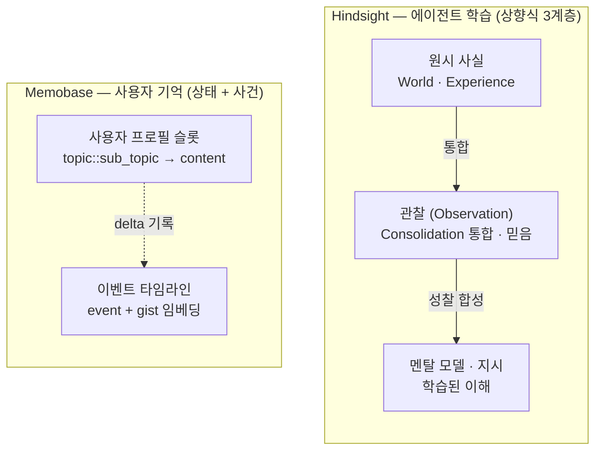
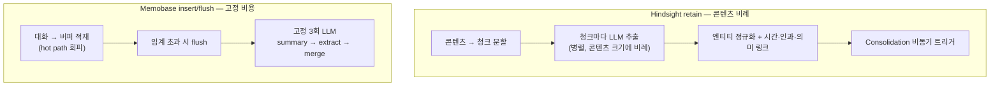
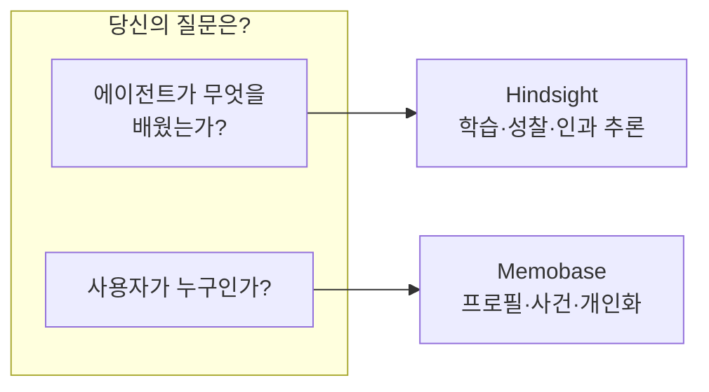

# Hindsight vs Memobase — 에이전트 메모리 시스템 심층 비교

> 비교 대상: [vectorize-io/hindsight](https://github.com/vectorize-io/hindsight) · [memodb-io/memobase](https://github.com/memodb-io/memobase)
> 개별 분석: [Hindsight 분석](./Hindsight_analysis.md) · [Memobase 분석](./Memobase_analysis.md)
> 작성일: 2026-07-18

---

## 1. 왜 이 둘을 비교하는가

Hindsight와 Memobase는 표면적으로 비슷하다 — 둘 다 **독립 서버형** 메모리 시스템이고, PostgreSQL+pgvector를 쓰며, MCP와 다국어 SDK를 제공하고, LOCOMO/LongMemEval 벤치마크에서 SOTA를 주장한다. 라이브러리로 임포트하는 Mem0·MemU·Cognee와 달리 둘 다 "인프라"로서의 메모리를 지향한다.

하지만 **철학이 정반대**다. 이 한 줄이 두 시스템의 모든 설계 차이를 규정한다:

> **Hindsight는 에이전트가 "학습(learn)"하게 하고, Memobase는 사용자를 "기억(remember)"한다.**

- **Hindsight**: "Agent Memory That **Learns**" — 에이전트의 경험을 축적하고, 성찰(reflect)로 관찰과 믿음을 형성하며, 시간에 따라 이해를 갱신한다. 주체는 **에이전트**.
- **Memobase**: "Memory for **User**, not Agent" — 대화 상대인 인간 사용자의 지속적 프로필과 사건 타임라인을 유지한다. 주체는 **사용자**.

---

## 2. 핵심 차이 한눈에

| 축 | **Hindsight** | **Memobase** |
|----|--------------|--------------|
| **철학** | 에이전트가 학습 (learn) | 사용자를 기억 (remember) |
| **기억 주체** | 에이전트 (World·Experience) | 사용자 (Profile·Event) |
| **메모리 모델** | 바이오미메틱 3계층 사실→관찰→멘탈모델 | 구조화 프로필 슬롯 + 이벤트 타임라인 |
| **저장 단위** | `memory_units` (fact) + 그래프 링크 | `user_profiles` 슬롯 + `user_events` |
| **핵심 연산** | Retain · Recall · **Reflect** | insert · flush · profile · **context** |
| **"학습" 계층** | ✅ Reflect + Consolidation (관찰·믿음 형성) | ❌ 없음 (프로필 갱신·요약만) |
| **그래프** | ✅ 엔티티·시간·**인과** 링크 | ❌ (프로필 구조에 암묵) |
| **검색 전략** | 4-전략 + RRF + cross-encoder 재랭킹 | SQL 프로필 + pgvector event gist |
| **Retain 비용** | 청크당 LLM (콘텐츠 비례, 가변) | **버퍼 배치, 고정 3회 LLM** |
| **믿음 갱신** | proof_count + Trend(강화/약화) | APPEND · UPDATE · ABORT |
| **자립성** | 로컬 임베딩·재랭커 → **LLM만 외부** | **임베딩 API 필수** |
| **저장소** | PG+pgvector(임베디드 pg0) / Oracle 23ai | PG+pgvector + **Redis 캐시** |
| **온라인 지연** | Recall 준수, Reflect 무거움 | **100ms 미만** (프로필 상시 준비) |
| **주 벤치마크** | LongMemEval ~91.4% | LOCOMO 75.78% (temporal 85%) |
| **통합 생태계** | **50+ 프레임워크 통합** | MCP + OpenAI patch 중심 |
| **DB 백엔드** | PostgreSQL / **Oracle 23ai** | PostgreSQL |
| **라이선스** | MIT | Apache 2.0 |

---

## 3. 철학과 메모리 모델 비교

두 시스템의 근본 차이는 "무엇을 기억 단위로 삼는가"에서 출발한다.

| 관점 | Hindsight | Memobase |
|------|-----------|----------|
| **기억 형태** | 사실(fact)의 그래프 + 통합된 관찰 | 슬롯 채워진 프로필 + 사건 목록 |
| **시간 표현** | 사실마다 `event_date/occurred/mentioned` + 시간 링크 | 프로필=상태, `user_events`=사건 |
| **관계 표현** | 엔티티·의미·인과 링크 (명시적 그래프) | 프로필 구조에 암묵 (그래프 없음) |
| **"이해"의 위치** | 관찰·멘탈 모델 (시스템이 능동 형성) | 없음 (LLM이 context를 받아 해석) |

**핵심**: Hindsight는 사실을 **잘게 쪼개 그래프로 구조화**하고 이를 통합·성찰해 상위 지식을 만든다. Memobase는 대화를 **요약해 프로필 슬롯을 갱신**하고 사건을 타임라인에 기록한다. 전자는 "지식 축적·학습", 후자는 "상태 최신화".

---

## 4. Retain(저장) 비교 — 비용 구조가 갈린다

| 관점 | Hindsight | Memobase |
|------|-----------|----------|
| **처리 시점** | retain 시 즉시 스트리밍 (async 옵션) | 버퍼에 모아 flush 시 배치 |
| **LLM 호출 수** | **청크당 1회** (콘텐츠 크기 비례) | **고정 3회** (예측 가능) |
| **비용 특성** | 가변, 문서가 크면 많은 호출 | 선형·예측 가능 (토큰 40~50% 절감 주장) |
| **추출 산출물** | what/when/where/who/why + 엔티티 + 인과 | topic::sub_topic::memo 슬롯 |
| **정규화** | 엔티티 퍼지매칭(임계 0.6) | 슬롯 병합(APPEND/UPDATE/ABORT) |
| **원본 보존** | 문서/청크 저장 옵션 | **기본 삭제** (프라이버시) |

**트레이드오프**: Memobase는 "hot path를 피하고 고정 3회"로 **비용 예측성**을 얻지만, flush 전엔 최신 대화가 반영되지 않는다. Hindsight는 **즉시·정밀 구조화**하지만 콘텐츠가 크면 LLM 비용이 비례해 늘고, 대신 그래프·인과라는 풍부한 검색 기반을 확보한다.

---

## 5. Recall(검색) 비교

| 관점 | Hindsight | Memobase |
|------|-----------|----------|
| **프로필/상태 조회** | (프로필 개념 없음) | SQL + Redis 캐시 → 100ms 미만 |
| **검색 전략** | Semantic + BM25 + Graph + Temporal | pgvector event gist + 프로필 관련성 필터 |
| **융합** | RRF (k=60) 균등 가중 | 토큰 예산 분배 (profile_event_ratio) |
| **재랭킹** | Cross-Encoder(로컬 ms-marco) + 승산 부스트 | 없음 (관련성 필터) |
| **그래프 탐색** | 1-hop 링크 확장 + temporal 다중 hop BFS | 없음 |
| **질의 분석** | 시간 제약 추출 | 최근 대화 임베딩 검색 |
| **출력** | 재랭킹된 사실/관찰/멘탈모델 | User Background + Latest Events 문자열 |

**핵심**: Memobase는 "**항상 준비된 프로필**을 SQL로 즉시 조회"해 검색 전처리가 거의 없다(저지연). Hindsight는 "**매 질의마다 4-전략 검색 + 재랭킹**"으로 정확도를 극대화하지만 그만큼 검색 파이프라인이 무겁다. 둘 다 이벤트/사실 임베딩엔 pgvector 코사인을 쓴다.

---

## 6. "학습" 계층 — 가장 큰 격차

여기가 두 시스템이 가장 크게 갈리는 지점이다.

| 관점 | Hindsight | Memobase |
|------|-----------|----------|
| **능동 학습** | ✅ Reflect(에이전틱 추론) + Consolidation(믿음 통합) | ❌ 없음 |
| **믿음 형성** | 관찰(observation) 상향 생성, proof_count·Trend | 프로필 슬롯 갱신 |
| **자기 정리** | 의미 중복 제거(0.97), UPDATE-over-CREATE | organize(재군집), re_summary(압축) |
| **성향/개성** | Disposition(skepticism/literalism/empathy 1~5) | 없음 (프로필 스키마 통제) |
| **모순 처리** | 최신 mentioned_at 우선 + 무효화 아카이브 | UPDATE 내 LLM 재작성 |
| **온디맨드 추론** | ✅ reflect() — 질문에 대해 깊이 사고·합성 | ❌ (context 문자열 반환만) |

**핵심**: Memobase의 organize/re_summary는 "프로필을 작게 유지하는 정리"에 가깝고, Hindsight의 Reflect/Consolidation은 "사실에서 **새로운 지식과 믿음을 만들어내는 학습**"이다. Memobase에는 이에 대응하는 "성찰/통합" 계층이 없다. 반대로 Memobase의 **프로필 슬롯 스키마 사전 정의**(Controllable Memory)에 정확히 대응하는 기능은 Hindsight에 없다 — Hindsight는 Directive(하드 규칙)와 Disposition(성향)으로 다르게 통제한다.

---

## 7. 배포·운영·자립성 비교

| 관점 | Hindsight | Memobase |
|------|-----------|----------|
| **서버 스택** | FastAPI + PG(pgvector) / Oracle 23ai | FastAPI + PG(pgvector) + Redis |
| **임베디드 실행** | ✅ 임베디드 pg0 (서버리스 파이썬) | ❌ (PG/Redis 필요) |
| **임베딩** | 로컬 모델 기본 (외부 API 불필요) | **임베딩 API 필수** (OpenAI/Jina/Ollama) |
| **재랭커** | 로컬 cross-encoder 기본 | 없음 |
| **완전 로컬** | ✅ Ollama + 로컬 임베딩·재랭커 | 부분 (임베딩 프로바이더 필요) |
| **DB 백엔드** | PostgreSQL / Oracle | PostgreSQL |
| **멀티 LLM** | failover/round-robin, 연산별 배정 | 단일 (Doubao 캐시 스타일) |
| **통합** | 50+ 프레임워크 + LLM Wrapper + MCP | MCP + OpenAI SDK patch |
| **SDK** | Python · TS · Go · Rust + CLI | Python · TS · Go |

**핵심**: Hindsight는 **로컬 자립성**(외부 의존이 LLM 하나, 임베디드 DB)과 **엔터프라이즈 지향**(Oracle, 멀티 LLM 전략, 50+ 통합)이 두드러진다. Memobase는 임베딩 API가 필요하지만 **Redis 캐시로 초저지연**을 확보하고 배포 단순성을 지향한다.

---

## 8. 벤치마크 — 직접 비교는 주의

| 시스템 | 벤치마크 | 점수 | 비고 |
|--------|----------|------|------|
| **Hindsight** | LongMemEval | ~91.4% (최신 94.6%) | 8,192 토큰 예산 |
| **Memobase** | LOCOMO (LLM Judge) | 75.78% (temporal 85.05%) | v0.0.37 |

> ⚠️ **직접 비교 불가**: 두 시스템은 서로 다른 벤치마크(LongMemEval vs LOCOMO)를 대표 지표로 보고하며, 측정 방식·토큰 예산·평가 프롬프트가 다르다. 각자 자기 강점 벤치마크에서 SOTA를 주장하는 상황이므로, **숫자를 1:1로 비교하는 것은 부적절**하다. 공통점은 둘 다 **temporal(시간 추론)에서 특히 강하다**는 것 — Hindsight는 시간·인과 그래프로, Memobase는 이벤트 타임라인+gist 임베딩으로 각기 다른 방식으로 달성한다.

---

## 9. 선택 가이드

### 9.1 사용 사례별 추천

| 상황 | 추천 | 이유 |
|------|------|------|
| 자율 태스크 수행 "AI 직원" | **Hindsight** | 경험 학습 + 믿음 형성 + 성향 |
| 피드백으로 성장하는 에이전트 | **Hindsight** | Reflect + Consolidation |
| 시간·인과 다중 hop 추론 | **Hindsight** | 명시적 인과 그래프 |
| 완전 로컬/온프레미스(프라이버시) | **Hindsight** | 로컬 임베딩·재랭커 + 임베디드 DB |
| 엔터프라이즈(Oracle/멀티 LLM) | **Hindsight** | Oracle 23ai + 멀티 프로바이더 |
| 사용자 개인화 챗봇 | **Memobase** | 프로필 진화 + 롤플레이 |
| 사용자 분석·트래킹(선호/행동) | **Memobase** | 구조화 프로필 필터링 |
| 대화량 많고 비용 민감 | **Memobase** | 고정 3회 LLM, 토큰 절감 |
| 초저지연 온라인 조회 | **Memobase** | 프로필 상시 준비 + Redis |
| 무엇이 저장될지 통제·감사 | **Memobase** | 프로필 슬롯 스키마 사전 정의 |
| 빠른 프로토타이핑(단순 챗봇) | **Memobase** | Hindsight는 "오버킬" (README 자평) |

### 9.2 한 문장 요약

- **Hindsight를 골라라** — 에이전트가 스스로 학습하고, 시간·인과를 추론하고, 피드백으로 성장해야 할 때. 비용·복잡도를 감수하고 "학습하는 메모리"를 얻는다.
- **Memobase를 골라라** — 사용자를 기억해 개인화·분석·타게팅하고, 비용·지연을 예측 가능하게 통제해야 할 때. 표현력·학습을 일부 포기하고 "예측 가능한 사용자 메모리"를 얻는다.

---

## 10. 종합 — 대립이 아니라 다른 문제를 푼다

Hindsight와 Memobase는 경쟁 제품처럼 보이지만, 사실 **서로 다른 문제를 푼다.**

- **Hindsight**의 질문: *"내 에이전트가 지금까지 무엇을 배웠고, 무엇을 믿으며, 어떻게 성장했는가?"*
- **Memobase**의 질문: *"이 사용자는 누구이고, 무엇을 선호하며, 언제 무슨 일이 있었는가?"*

두 관점 모두 유효하다. 자율 에이전트를 만든다면 Hindsight의 학습 계층이, 사용자 대면 제품을 만든다면 Memobase의 프로필·비용 효율이 각각 더 잘 맞는다. 실제로 **둘을 함께** 쓰는 것도 가능하다 — 사용자 상태는 Memobase로 저렴하게 유지하고, 에이전트의 경험 학습은 Hindsight로 축적하는 조합이다.

---

## 참고 자료

- [Hindsight 개별 분석](./Hindsight_analysis.md) · [Memobase 개별 분석](./Memobase_analysis.md)
- [에이전트 메모리 시스템 종합 비교](./에이전트_메모리_시스템_비교분석.md)
- Hindsight: https://github.com/vectorize-io/hindsight · [arXiv:2512.12818](https://arxiv.org/abs/2512.12818)
- Memobase: https://github.com/memodb-io/memobase · https://docs.memobase.io
- [AI Agent Memory Systems in 2026 비교 (Dev Genius)](https://blog.devgenius.io/ai-agent-memory-systems-in-2026-mem0-zep-hindsight-memvid-and-everything-in-between-compared-96e35b818da8)

---

*작성일: 2026-07-18 · 양측 소스코드 기준 비교 분석*
