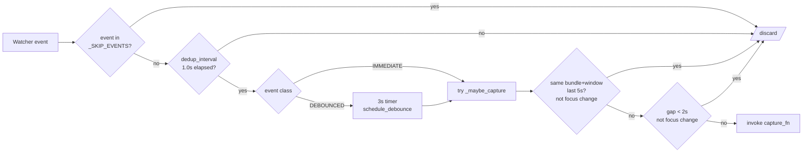
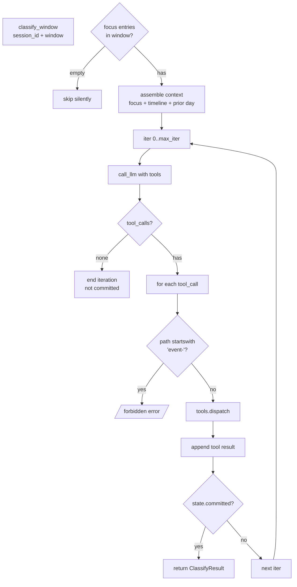
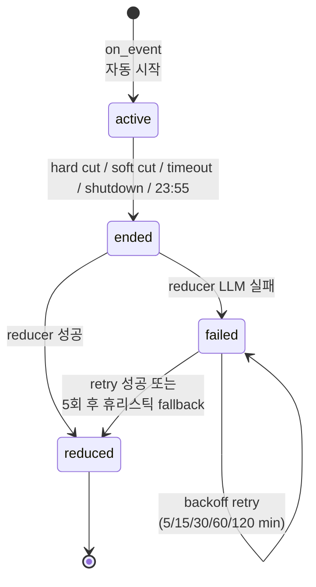

# OpenChronicle 심층 분석 — Local-First 화면 컨텍스트 메모리

> 분석 대상: [Einsia/OpenChronicle](https://github.com/Einsia/OpenChronicle) (v0.1.0, MIT, macOS-only alpha)
> 분석 시점: 2026-04-24, 커밋 기준 latest main
> 분석 관점: 에이전트를 직접 개발·운영하는 SWE의 시각 — 아키텍처·파이프라인·코드 패턴

---

## TL;DR

OpenChronicle은 **macOS 화면을 24/7 캡처해 LLM 에이전트가 즉시 쓸 수 있는 로컬 메모리로 자동 압축**해 주는 데몬이다. OpenAI의 ChatGPT "Chronicle" 기능을 OSS 진영에서 재해석한 프로젝트로, 다음 한 가지 신념을 끝까지 밀어붙인 형태다.

> **"메모리는 압축이 먼저고 분류는 나중이다."**

핵심을 한 문장씩 정리하면:

- **AX-First 캡처**: OCR이 아닌 macOS Accessibility Tree를 1차 소스로 사용 → 텍스트가 이미 디지털 그대로 들어온다 (오탈자·DPI 의존성 없음).
- **결정론적 깔때기 (S0 → S1 → Timeline → S2 → Classifier)**: 각 단계의 프롬프트 크기가 사전에 bounded되도록 설계. LLM이 "이걸 적을까 말까"를 고민할 필요 없이 단계별 책임이 분리됨.
- **세션 = 자연 단위**: 5분 idle / 단일 앱 3분 / 2시간 timeout 3-rule로 작업 세션을 잘라 `event-YYYY-MM-DD.md` 로 누적. 사람이 기억하는 단위로 자른다.
- **Tool-call loop 분류기**: GPT-style function calling으로 `read_memory / search_memory / append / create / supersede / commit`를 호출시켜 사실(fact)만 추출. **append-only + supersede 패턴**으로 데이터 손실 방지.
- **MCP를 데몬 안에 호스팅**: `127.0.0.1:8742/mcp` (streamable-http)에 항상 떠 있어서 Claude Desktop, Cursor, Claude Code 등 어떤 클라이언트도 stdio fork-exec 없이 메모리에 접근 가능.

엔지니어 관점 핵심 인사이트:

1. **AX Tree는 OCR보다 이기는 카드다** — 동영상/이미지 외 모든 macOS UI 콘텐츠는 한국어/일어 포함 verbatim 추출. Electron 앱(Claude Desktop, VS Code, Slack)은 `ax_depth=100`이 필요하다는 디테일까지 잡혀 있음.
2. **단일 프로세스 + SQLite WAL** = MCP reader / writer가 IPC 없이 공존. 이 단순함이 OS 권한·신뢰성을 모두 끌어올림.
3. **Compaction에 noun-phrase preservation gate** — LLM이 "압축"을 빙자해 사실을 날리는 사고를 95% 임계치 정규식 검증으로 차단. 이건 모든 메모리 시스템이 베껴야 한다.

---

## 목차

1. [프로젝트 개요](#1-프로젝트-개요)
2. [경쟁/대안 비교](#2-경쟁대안-비교)
3. [아키텍처 전반](#3-아키텍처-전반)
4. [Capture Layer — AX 이벤트 → JSON](#4-capture-layer--ax-이벤트--json)
5. [Compression Layer — Timeline → Session Reducer](#5-compression-layer--timeline--session-reducer)
6. [Memory Layer — Classifier + Compact](#6-memory-layer--classifier--compact)
7. [Query Layer — MCP Server](#7-query-layer--mcp-server)
8. [세션 경계: 3-rule cutter](#8-세션-경계-3-rule-cutter)
9. [메모리 파일 포맷 + Supersede 시맨틱](#9-메모리-파일-포맷--supersede-시맨틱)
10. [Tool-call Loop과 Anti-Hallucination 가드](#10-tool-call-loop과-anti-hallucination-가드)
11. [영속성·동시성·복구](#11-영속성동시성복구)
12. [기술 스택](#12-기술-스택)
13. [확장 포인트와 한계](#13-확장-포인트와-한계)
14. [성능 및 운영 특성](#14-성능-및-운영-특성)
15. [SWE 관점 종합 평가](#15-swe-관점-종합-평가)
16. [부록 — 디렉토리 맵 + 주요 코드 위치](#16-부록--디렉토리-맵--주요-코드-위치)

---

## 1. 프로젝트 개요

### 1.1 정의

> "Local-first screen-context memory for any LLM agent. Captures AX Tree + screenshots, exposes the result via MCP."
> — `pyproject.toml:4`

OpenChronicle은 **데몬 1개로 모든 일을 처리하는 단일 프로세스 메모리 시스템**이다. 사용자가 macOS에서 작업하는 모든 화면을 (1) 캡처하고, (2) LLM 압축 파이프라인을 통과시키며, (3) Markdown 메모리로 분류해 (4) MCP 서버로 외부 에이전트에 노출한다.

### 1.2 해결하려는 문제

대부분의 LLM 에이전트는 **사용자의 컴퓨터 사용 컨텍스트를 모른다**. 새 채팅이 열리면 사용자가 "내 프로젝트는…", "어제 했던 그…", "지금 보고 있는 이 코드…"를 매번 다시 설명해야 한다. OpenChronicle은 이 반복을 없애기 위해 다음과 같이 한다.

| 문제 | OpenChronicle의 답 |
|---|---|
| "에이전트가 화면을 못 본다" | 24/7 데몬으로 AX Tree + 스크린샷 자동 수집 |
| "OCR/스크린샷은 부정확하고 무겁다" | macOS Accessibility API를 1차 소스로 (verbatim text, focus state, URL) |
| "프라이버시 우려" | **로컬 전용** — 서버 업로드 0건, SQLite + Markdown만 사용 |
| "에이전트 도구 통합이 번거롭다" | MCP 서버를 데몬 안에 호스팅 (fork-exec 없음) |
| "긴 세션은 요약이 누락된다 (v1 문제)" | **세션 단위 reduce + 5분 flush + 30분 classifier tick** |
| "LLM이 사실 누락 압축을 한다" | Compaction에 noun-phrase preservation gate (≥95%) |

### 1.3 탄생 배경

OpenChronicle은 README에서 명시적으로 자신을 **OpenAI의 ChatGPT "Chronicle"의 OSS 대안**으로 포지셔닝한다. 핵심 차이는 두 가지다.

1. **AX-First**: OpenAI Chronicle은 픽셀 기반(OCR/Vision). OpenChronicle은 AX Tree + 텍스트가 1차, 스크린샷은 2차.
2. **Local-First**: 어떤 데이터도 외부로 나가지 않음. LLM 호출만 사용자가 설정한 endpoint(litellm)로 갈 뿐.

추가로 README는 v0의 **Einsia-Partner**가 v1 (3-stage S0/S1/S2 + 주간 메모리)을 거쳐 v2가 OpenChronicle임을 시사한다. v2의 큰 변화:

- 주간(weekly) 메모리 → **일별 event-daily**
- 4-stage → **5-stage** (Timeline 단계 신설로 verbatim 보존)
- Classifier가 30분 주기로 **bookmarked tick** (`flush_end`, `classified_end`)
- MCP 서버를 외부 stdio가 아닌 **데몬 내장**

### 1.4 사용 시나리오

```
[유저] "그 버그가 뭐였지?"
       ↓
[Claude Code] current_context() / search_captures("error")
       ↓
[OpenChronicle MCP] 30초 전 캡처: "TypeError: Cannot read 'foo' of undefined" + main.py:142
       ↓
[Claude Code] "방금 main.py:142에서 본 TypeError 말씀하시는 거죠?"
```

이 흐름은 README의 캐치프레이즈 "당신의 컴퓨터를 LLM이 따라잡게 하라"를 실제 동작으로 보여주는 예시다.

---

## 2. 경쟁/대안 비교

| 시스템 | 캡처 소스 | 압축 단위 | 저장 위치 | 외부 노출 | 핵심 차별점 |
|---|---|---|---|---|---|
| **OpenChronicle** | AX Tree (1차) + screenshot (2차) | 1-min timeline → session → classifier | 로컬 SQLite + MD | MCP (HTTP/stdio) | **AX-First + 5-stage 깔때기 + supersede** |
| OpenAI ChatGPT Chronicle (closed) | 화면 픽셀 (Vision/OCR) | 미공개 | 클라우드 | ChatGPT 내부 | 클로즈드, 클라우드 의존 |
| [Rewind.ai](https://www.rewind.ai/) | OCR + 오디오 | 컨텐츠 인덱싱 | 로컬 (bundle) | 자체 앱 | 오디오 포함, 검색 UX 강함 |
| [memos](https://github.com/usememos/memos) | 사용자 직접 입력 | 게시물 | 로컬 SQL/MD | REST API | 메모 앱; 자동 캡처 없음 |
| [OpenViking](https://github.com/openviking/openviking) | 채팅 기록 | LLM 요약 | 로컬 vector DB | API | 대화 메모리 전용 |
| [Supermemory](https://github.com/supermemoryai/supermemory) | 다중 소스 | RAG 인덱싱 | 클라우드/하이브리드 | API | knowledge graph 지향 |
| [Einsia-Partner v1](https://github.com/Einsia/Einsia-Partner) | AX Tree | 4-stage S0/S1/S2 → weekly | 로컬 | 자체 도구 | OpenChronicle의 직계 전신 |

OpenChronicle의 주요 포지셔닝:

- **vs ChatGPT Chronicle**: 데이터 주권, 모델 선택권 (litellm으로 어떤 LLM이든 가능)
- **vs Rewind**: OCR 의존도 없음 → 한국어/CJK 인식 정확. 코드/터미널 텍스트도 verbatim
- **vs memos / Supermemory**: "유저 입력" 없이 **자동 누적**. 기억해야 할 게 무엇인지를 시스템이 결정

---

## 3. 아키텍처 전반

OpenChronicle의 모든 데이터는 **단방향 압축 깔때기**를 따라 흐른다. 각 단계의 출력은 다음 단계 입력의 prompt budget을 초과하지 않도록 사이즈가 bounded되어 있다.

```mermaid
flowchart LR
    W["mac-ax-watcher<br/>(Swift binary)"]

    subgraph capture ["Capture Layer"]
        direction TB
        S0["S0 event_dispatcher<br/>dedup · debounce · min-gap"]
        S1["S1 s1_parser<br/>focused_element · visible_text · url"]
        BUF[("capture-buffer/*.json")]
        S0 --> S1 --> BUF
    end

    subgraph compress ["Compression Layer"]
        direction TB
        TL["Timeline aggregator (LLM)<br/>1-min normalized blocks<br/>verbatim-preserving"]
        BLOCKS[("timeline_blocks")]
        SM["Session manager<br/>3-rule cutter"]
        S2["S2 session_reducer (LLM)<br/>flush 5m · terminal at end"]
        TL --> BLOCKS
        BLOCKS -- "read window" --> S2
        SM -. "trigger flush · session_end" .-> S2
    end

    subgraph memory ["Memory Layer"]
        direction TB
        ED[("event-YYYY-MM-DD.md")]
        CLF["Classifier (LLM)<br/>tool-call loop · 30m tick"]
        MF[("user- · project- · tool-<br/>topic- · person- · org-*.md")]
        CMP["Compact (LLM)<br/>on-demand"]
        ED --> CLF --> MF
        MF -. "read · rewrite" .-> CMP
        CMP -. "supersede" .-> MF
    end

    subgraph query ["Query Layer"]
        direction TB
        FTS[("SQLite FTS5<br/>entries_fts · captures_fts")]
        MCP["MCP server<br/>127.0.0.1:8742/mcp"]
        AG["Tool-capable agents<br/>Claude · Cursor · Codex"]
        FTS --> MCP --> AG
    end

    W --> S0
    BUF -. "pre_capture_hook" .-> SM
    BUF --> TL
    S2 --> ED
    BLOCKS -. "grounding" .-> CLF
    MF --> FTS
    ED --> FTS
    BUF -. "indexed" .-> FTS
```



### 3.1 단계별 책임

| 단계 | 입력 | 출력 | 역할 |
|---|---|---|---|
| **S0** dispatcher | watcher 이벤트 (raw) | filtered trigger dict | 노이즈 제거 (dedup, debounce, rate-limit) |
| **S1** parser | trigger + AX tree | enriched JSON capture | 의미 있는 필드 추출 (focused_element, visible_text, url) |
| **Timeline** aggregator | 1분치 captures | `timeline_blocks` row | **verbatim-preserving normalization** (요약 아님) |
| **S2** reducer | timeline blocks (5분치) | `event-YYYY-MM-DD.md` entry | 세션 요약 + sub_tasks 추출 |
| **Classifier** | event-daily 엔트리 | `user-/project-/...md` 파일 | tool-call로 durable fact만 골라 영구 메모리에 적재 |
| **Compact** | 비대해진 메모리 파일 | rewritten file | LLM 압축 + noun-phrase 보존 검증 |

### 3.2 핵심 설계 결정 — "압축 먼저, 분류 나중"

`docs/architecture.md:208-215` 발췌:

> "By the time the classifier runs it sees a session-level summary, not raw AX snapshots — so there is no 'is this worth writing?' triage call; the classifier just extracts any durable facts it finds, or skips."

이 설계는 **LLM 호출 비용을 결정론적으로 bounded**하는 효과가 있다.

- 만약 raw AX → classifier 였다면? 캡처마다 "기록할까/말까?" 판단 LLM 호출 필요 → O(N) 비용 + 비결정적 누락 위험
- 깔때기 형태: classifier는 **고정된 사이즈의 세션 요약 + 일부 raw timeline grounding**만 보면 됨 → O(세션 수) 비용

### 3.3 7가지 데몬 태스크

`src/openchronicle/daemon.py` 기준 (architecture.md:106-122 발췌):

| Task | 주기 | 역할 |
|---|---|---|
| `capture` | 이벤트 driven + heartbeat 10m | mac-ax-watcher 이벤트 소비 → JSON 작성 |
| `timeline` | 60s | 닫힌 1-min 윈도우 스캔 → LLM normalize → `timeline_blocks` insert |
| `session` | 30s | `SessionManager.check_cuts()` 호출 (idle/timeout 감지) |
| `flush` | 5m | active 세션의 새 timeline blocks를 reducer에 흘려보냄 → `[flush]` 엔트리 추가 |
| `classifier-tick` | 30m | `classified_end` bookmark 이후 새 엔트리만 분류 |
| `daily-safety-net` | 23:55 | 열려있는 세션 강제 종료 + 모든 `ended/failed` 세션 catch-up |
| `mcp` | 상시 | FastMCP 서버 호스팅 (auto-restart with backoff) |

### 3.4 단일 프로세스인 이유

`docs/architecture.md:215`:

> "One process, many tasks. Avoids IPC overhead and keeps `index.db` single-writer in practice. SQLite WAL gives the MCP reader what it needs."

MCP 서버 (read-only)와 writer task들을 같은 프로세스 내 다른 thread/asyncio task로 두면서, SQLite WAL 모드로 reader와 writer의 lock 경합을 피한다. 이는 **단순함과 운영성을 동시에** 얻은 영리한 선택이다.

---

## 4. Capture Layer — AX 이벤트 → JSON

### 4.1 mac-ax-watcher (Swift 바이너리)

`resources/mac-ax-watcher.swift` (그리고 `mac-ax-helper.swift`)는 macOS Accessibility API를 구독하는 Swift 데몬이다. Python 패키지에 `force-include`로 번들되며 (`pyproject.toml:45-49`), 첫 실행 시 자동 컴파일된다.

발생시키는 이벤트 6종 — `event_dispatcher.py:34-41`:

```python
_IMMEDIATE_EVENTS = {
    "AXFocusedWindowChanged",
    "AXApplicationActivated",
    "UserMouseClick",
    "UserTextInput",          # Swift측에서 이미 debounced
}
_DEBOUNCED_EVENTS = {"AXValueChanged"}   # 입력 버스트 → 3초 debounce
_SKIP_EVENTS = {"AXTitleChanged"}         # 노이즈 (window/app 이벤트로 커버됨)
```

### 4.2 S0 이벤트 디스패처 — 노이즈 제거 4단 가드

`capture/event_dispatcher.py`는 캡처 빈도가 LLM 비용으로 직결되기 때문에 **4겹 필터**를 건다.



**키 포인트** (event_dispatcher.py:74):

> "Tuple keys avoid the silent collision a delimited-string key has whenever bundle_id or window_title contains the delimiter (e.g. a window titled 'App: Untitled' colliding with 'App' + ': Untitled')."

`(event_type, bundle_id, window_title)` tuple을 dict 키로 — 문자열 join 시 발생하는 collision을 원천 차단. 이런 디테일이 production 데이터를 다뤄본 경험에서 나온다는 게 보인다.

또 한 가지 — `_maybe_capture`는 lock 안에서 dedup·rate check + 상태 갱신을 수행하지만 `_capture_fn` 호출 자체는 **lock 바깥**에서 한다 (event_dispatcher.py:158-184). 느린 콜백이 다른 스레드를 block하지 않게 하려는 의도. 동시성 정확성과 성능을 모두 챙긴 설계.

### 4.3 S1 파서 — Verbatim Text 추출

`capture/s1_parser.py`는 watcher가 가져온 AX tree를 다음 5개 필드로 정제한다.

| 필드 | 타입 | 의미 |
|---|---|---|
| `focused_element` | `{role, title, value, value_length, is_editable}` | 사용자가 지금 입력 중인 위치 + 그 안의 텍스트 |
| `visible_text` | string (≤10K char) | 화면에 보이는 모든 렌더된 텍스트 (verbatim) |
| `url` | string | 브라우저면 현재 URL |
| `window_meta` | `{app_name, title, bundle_id}` | 포커스 중인 앱 메타데이터 |
| `screenshot` | base64 JPEG | 옵션, 24h 후 자동 strip |

핵심: **`visible_text`는 OCR이 아니라 AX 트리에서 그대로 끌어온 텍스트**. 한국어 폰트 렌더링, retina DPI, 스크롤 위치 등에 의존하지 않는다.

### 4.4 캡처 버퍼 라이프사이클

```
~/.openchronicle/capture-buffer/
├── 2026-04-24T17-07-32p09-00.json   # 새 캡처 (24h 미만)
├── 2026-04-24T16-07-32p09-00.json   # screenshot stripped (24-168h)
└── ...                                # 168h 후 + timeline_blocks에 흡수되면 삭제
```

`config.py:42-44`:
- `buffer_retention_hours = 168` (7일)
- `screenshot_retention_hours = 24` (스크린샷은 77% byte를 차지하므로 24h 후 strip)
- `buffer_max_mb = 2000` (2GB hard ceiling, 가장 오래된 흡수된 파일부터 evict)

**3-tier 보존 정책**: 시간 순 deletion + 스크린샷 우선 strip + 절대 사이즈 cap. 이런 디스크 정책은 24/7 캡처 도구에서 빠지면 안 된다.

---

## 5. Compression Layer — Timeline → Session Reducer

### 5.1 Timeline Aggregator — 정규화 ≠ 요약

`timeline/aggregator.py:1-3`:

> "Reads capture-buffer JSON files whose timestamp falls inside the window, renders them into a prompt, and asks the LLM to produce a small list of self-contained `[App] …` lines."

**가장 중요한 디자인 룰**: Timeline 단계는 **정규화(normalization)**다. 압축이 아니다.

`prompts/timeline_block.md:3` 발췌:

> "Your job is normalization, NOT summarization. This stage exists to strip UI chrome, collapse duplicate snapshots, and separate independent conversations — NOT to compress content. Authored text, URLs, window titles, file paths, and quoted evidence MUST appear verbatim in your output."

왜 이렇게 strict하게 verbatim을 지켜야 하는가?

- 다음 단계 reducer / classifier가 **timeline blocks를 grounding source로 사용**한다 (`classifier.py:91-99`).
- 만약 timeline에서 LLM이 자유롭게 요약하면 → 5분 후 reducer는 이미 사실이 가공된 데이터를 보게 됨 → "유저가 본 진짜 텍스트가 뭐였는지" 영영 추적 불가.

### 5.2 Anti-Hallucination 룰 (Timeline 프롬프트)

`prompts/timeline_block.md:12-16`은 **multi-conversation cross-attribution 금지**를 explicit하게 박는다:

```
A single window often contains several independent interactions even
inside a single app — a chat app can show three unrelated conversations
(a group chat, a 1:1, a channel); a browser can show three unrelated tabs;

NEVER take the set of topics seen in the window and the set of people
seen in the window and cross-multiply them into a single "discussed X, Y, Z
with A, B, C" line. If A only ever appeared in the conversation about X,
NEVER write a line that associates A with Y or Z.
```

이건 LLM의 흔한 실수 — "관찰된 모든 토큰을 한 문장으로 멋지게 묶기"를 막기 위한 코드 레벨 가드. 비슷한 맥락의 **authorship guard**도 흥미롭다 (line 18-19): 검색창에 입력 중인 텍스트를 "채팅 답장"이라고 잘못 attribute하지 않게, role title이 "search/find/url/address/omnibox/command"를 포함하면 navigation으로 분류하라고 명시.

### 5.3 Timeline 출력 포맷

엄격하게 정해진 한 줄 포맷:

```
[<app name>] <context>: <what happened>. <Authored text verbatim, in quotes>. Involving: <people/topics from THIS conversation only>.
```

예시 (timeline_block.md:62-69):

```json
{
  "entries": [
    "[Notes] Shopping list: user drafted a list, latest version \"milk, eggs, flour, butter\".",
    "[Google Chrome] ACME Q3 roadmap (https://docs.example/roadmap): read the document; noted priorities with Owner Alice and Deadline Oct 14. Involving: Alice, ACME Q3 roadmap."
  ]
}
```

LLM이 따옴표 안 텍스트를 paraphrase하지 못하도록 **escape된 따옴표가 그대로 넘어가는 verbatim 표시**를 강제한다.

### 5.4 Heuristic Fallback

`timeline/aggregator.py:272-290`: LLM이 죽거나 malformed JSON을 반환하면 **간단한 휴리스틱**으로 fallback한다.

```python
def _heuristic_entries(parsed):
    groups = []
    for _p, data in parsed:
        app = wm.get("app_name") or "Unknown"
        title = wm.get("title") or ""
        if groups and groups[-1][:2] == (app, title):
            groups[-1] = (app, title, count+1)
        else:
            groups.append((app, title, 1))
    return [
        f"[{app}] worked in window '{title}', involving —"
        for app, title, _ in groups
    ]
```

LLM 호출 실패가 캡처 손실로 이어지지 않도록 한 안전장치. 데이터 파이프라인 설계의 정석.

### 5.5 Session Reducer (S2) — 5분 Flush + Terminal Reduce

`writer/session_reducer.py`는 **두 가지 모드**로 동작한다.

**Mode 1: `flush_active_session` (5분 주기)**
- active 세션에서 새로 닫힌 timeline blocks를 reducer에 흘림
- `event-YYYY-MM-DD.md`에 `[flush]` 태그가 붙은 partial entry 추가
- LLM 실패 시 retry 안 함 — 다음 flush가 더 큰 윈도우를 자연스럽게 커버

**Mode 2: `reduce_session` (세션 종료 시)**
- session_end 콜백에서 daemon thread로 fire-and-forget
- 마지막 flush 이후 trailing window만 reduce → 최종 entry append
- 성공 시 `sessions.status = 'reduced'`로 마킹
- 실패 시 5/15/30/60/120분 backoff retry; 5회 모두 실패하면 휴리스틱 entry 작성

**핵심 로직** — `session_reducer.py:91-102`:

```python
def reduce_session(cfg, *, session_id, start_time, end_time):
    with fts.cursor() as conn:
        existing = session_store.get_by_id(conn, session_id)
        flush_end = existing.flush_end if existing and existing.flush_end else None
        window_start = flush_end if flush_end and flush_end > start_time else start_time
        return _reduce_window_locked(
            cfg, conn,
            session_id=session_id,
            session_start=start_time,
            session_end=end_time,
            window_start=window_start,   # ★ 마지막 flush 이후만
            window_end=end_time,
            is_final=True,
        )
```

`flush_end` bookmark를 sessions 테이블에 들고 다니면서 **이미 flush된 윈도우는 재계산 안 함** → 긴 세션도 cost-bounded.

### 5.6 Reducer 프롬프트가 보는 컨텍스트

reducer LLM은 다음 4가지를 본다 (session_reducer.py:482-499):

1. **Block list** (`HH:MM-HH:MM` 헤더 + 각 entry)
2. **Preceding entries** (오늘 event-daily의 마지막 6개 — dedup용)
3. **window time range**
4. **event_daily file name**

출력은 `{summary, sub_tasks}` JSON. 각 sub_task는 `[HH:MM-HH:MM, App] description` 포맷이고, **drill-down breadcrumb**가 자동 추가된다 (session_reducer.py:432-451):

```
[14:32-14:35, Cursor] refactored the authentication middleware
  — raw: read_recent_capture(at="14:32", app_name="Cursor")
```

이 breadcrumb가 핵심이다. classifier가 "이 사실이 진짜인지" 의심될 때 raw capture로 직접 drill-down할 수 있는 명시적 포인터가 된다.

---

## 6. Memory Layer — Classifier + Compact

### 6.1 Classifier — Tool-call Loop의 정수

`writer/classifier.py:375-486` — classifier는 OpenAI tool-call format으로 7개 도구를 LLM에 노출하고, **commit 호출까지 최대 12 iteration** 루프를 돌린다.



### 6.2 7개 Tool 명세

`writer/tools.py:151-265`에 OpenAI JSON Schema로 정의:

| Tool | 입력 | 동작 |
|---|---|---|
| `read_memory(path, tail_n=10)` | path | 파일 frontmatter + 마지막 N entry 읽기 |
| `search_memory(query, top_k=5)` | query | BM25 FTS5 검색 |
| `append(path, content, tags)` | content + ≤3 tags | 새 entry 추가 |
| `create(path, description, tags)` | path (prefix 검증) + description | 새 메모리 파일 생성 |
| `supersede(path, old_id, new_content, reason)` | old entry id | old entry strikethrough + new entry append |
| `flag_compact(path, reason)` | path | needs_compact 플래그 ON |
| `commit(summary)` | summary | **루프 종료 신호** (정확히 1회 호출) |

### 6.3 Hard Guard — Event-daily 쓰기 금지

`writer/classifier.py:443-453`:

```python
# Hard guard: never let the classifier write back to event-*.
if name in {"append", "create", "supersede", "flag_compact"}:
    target_path = str(args.get("path") or "")
    if target_path.startswith("event-"):
        result = {
            "error": (
                f"forbidden: classifier cannot write to {target_path}. "
                "event-daily is owned by the reducer."
            ),
        }
```

이 가드는 LLM의 prompt-level 룰("don't write to event-*")과 **별개로** 코드 레벨에서 강제된다. 프롬프트는 LLM이 잊을 수 있지만 코드는 안 잊는다 — 운영 신뢰성의 기본기.

### 6.4 Pattern Confirmation — Single Instance vs Recurring

`prompts/classifier.md:17` 발췌:

> "Pattern confirmation across sessions. The window you're classifying is only one slice of the user's activity… If a candidate durable fact (preference, habit, tool choice, recurring topic) looks borderline — i.e. the current window alone is not enough, but you suspect the behavior is recurrent — `search_memory` over the last few weeks for the same behavior *before* deciding to skip."

LLM에게 "단일 인스턴스를 패턴이라고 우기지 말고, 의심스러우면 검색해서 ≥2개의 독립 hit을 확인해라"고 명시. 이게 OpenChronicle classifier가 **사실을 fabricate하지 않는 핵심 메커니즘**이다.

### 6.5 Compaction with Preservation Gate

`writer/compact.py:23-25`:

```python
_UNIQUE_TOKEN_RE = re.compile(r"[A-Za-z][A-Za-z0-9_-]{3,}")
_PRESERVATION_THRESHOLD = 0.95  # must keep ≥95% of unique tokens
```

`compact_file()`의 핵심 알고리즘:

```python
before_unique = _unique_tokens(original)        # 4글자 이상 토큰 set
# ... LLM 호출 ...
after_unique = _unique_tokens(new_text)
preserved = len(before_unique & after_unique)
ratio = preserved / len(before_unique)

if ratio < 0.95:
    return CompactResult(..., accepted=False, note=f"rejected: {ratio:.1%}")
```

**왜 이게 critical한가?** LLM은 "압축"이라는 작업명을 받으면 자유롭게 paraphrase하면서 사실을 날린다. `re.findall(r"[A-Za-z][A-Za-z0-9_-]{3,}", text)`로 추출한 4-char-plus 토큰의 95%가 보존되지 않으면 reject — 즉 사람 이름, 프로젝트명, 파일 경로 같은 **고유명사**가 살아남았는지를 검증한다.

이 gate가 없으면 메모리 시스템은 시간이 갈수록 fact를 잃는다. **모든 LLM 기반 메모리 시스템이 카피해야 할 패턴**.

### 6.6 Bookmarked Tick — Idempotent Re-classification

세션은 길어지면 30분 내내 닫히지 않는다. 그래서 classifier도 **active session 안에서 30분마다 tick**한다.

`session_reducer.py` 와 `session/store.py`가 sessions row에 들고 다니는 두 bookmark:

| 필드 | 의미 | 갱신 시점 |
|---|---|---|
| `flush_end` | reducer가 어디까지 flush했는지 (session_reducer.py:268) | flush 성공 시마다 |
| `classified_end` | classifier가 어디까지 분류했는지 | classifier-tick 성공 시마다 |

이 둘 덕분에 **같은 윈도우에 두 번 LLM을 호출하지 않는다** (idempotency) — 30분 tick이 fire되면 `[classified_end, now)`만 보고, 끝나면 `classified_end ← now`.

---

## 7. Query Layer — MCP Server

### 7.1 8개 MCP 도구

`src/openchronicle/mcp/server.py`는 FastMCP 서버에 8개 도구를 등록한다 (compressed memory 4개 + raw captures 3개 + reference 1개).

| 카테고리 | 도구 | 역할 |
|---|---|---|
| Compressed | `list_memories(include_dormant?, include_archived?)` | 모든 메모리 파일 인덱스 (1 SQL query, 0-cost) |
| Compressed | `read_memory(path, since?, until?, tags?, tail_n?)` | 특정 파일 내용 (필터링 지원) |
| Compressed | `search(query, paths?, since?, until?, top_k?)` | BM25 FTS5 검색 |
| Compressed | `recent_activity(since?, limit?, prefix_filter?)` | 최신순 cross-file feed |
| Raw | `current_context(app_filter?, headline_limit?, fulltext_limit?, timeline_limit?)` | 현재 화면 스냅샷 (headline + fulltext + timeline) |
| Raw | `search_captures(query, since?, until?, app_name?, limit?)` | raw 캡처 BM25 검색 |
| Raw | `read_recent_capture(at?, app_name?, window_title_substring?, include_screenshot?, max_age_minutes=15)` | 1개 캡처 hydrate |
| Reference | `get_schema()` | 메모리 파일 명명 규약 spec |

### 7.2 두 레이어의 명시적 분리 — Compressed vs Raw

`mcp/server.py:170-176` (서버 instructions):

> - **Compressed memory** — curated Markdown files containing distilled facts, decisions, preferences, summaries, and durable context
> - **Raw captures (S1 buffer)** — literal recent on-screen content, including visible text, focused elements, URLs, and optional screenshots
> The compressed layer tells you that something happened and why it matters.
> The raw layer tells you exactly what was on screen.

이 분리는 에이전트의 **선택 부담**을 줄여준다.

- "어제 제가 본 그 article 뭐였죠?" → `search_captures` (텍스트 매칭)
- "지난주 제 결정사항이 뭐였죠?" → `search` (compressed)
- 헷갈리면 둘 다 parallel 호출하라고 instructions에 명시

### 7.3 도구별 docstring이 곧 LLM에 보이는 system prompt

각 `@server.tool()`의 docstring은 MCP 클라이언트가 받는 description이다. OpenChronicle은 이걸 **agent steering 채널**로 적극 활용한다 (mcp/server.py:329-348):

```python
def list_memories(...) -> str:
    """**ALWAYS CALL FIRST** on the first personal-context turn of a conversation.

    List all memory files with descriptions + entry counts. Cheap (one SQLite
    query, no file reads), so the cost of calling is essentially zero.

    Call whenever the user asks about themselves, their schedule, preferences,
    or ongoing work …

    If you're about to answer from chat history alone when the user has asked
    about themselves, you've skipped this tool. Go back and call it.
    """
```

대문자 강조, 명령조, 잘못된 동작 시 reflection 유도 — LLM에게 어떤 사고 경로로 도구를 선택해야 하는지를 코드 안에서 가르친다. 이는 **MCP 서버 작성의 모범**이다. 도구 시그니처만으로는 LLM이 도구를 잘 못 고른다.

### 7.4 Streamable-HTTP가 디폴트인 이유

`config.py:124-128`:

```python
@dataclass
class MCPConfig:
    auto_start: bool = True
    transport: str = "streamable-http"  # "streamable-http" | "sse" (deprecated 2026-04-01) | "stdio"
    host: str = "127.0.0.1"
    port: int = 8742
```

stdio MCP는 매 채팅 세션마다 fork-exec → cold start cost. streamable-http는 데몬에 상시 떠 있는 서버 → 접속 즉시 응답. 단, `127.0.0.1` 바인딩으로 외부 노출은 차단.

---

## 8. 세션 경계: 3-rule cutter

### 8.1 코드 위치 + 3가지 룰

`session/manager.py:108-145`의 `check_cuts()` 메서드가 핵심이다.

| 룰 | 코드 위치 | 트리거 |
|---|---|---|
| **Hard cut** | line 117-122 | `gap > self._gap_minutes * 60` (default 5분) |
| **Timeout** | line 125-133 | `duration > self._max_session_hours * 3600` (default 2h) |
| **Soft cut** | line 135-144 | 단일 앱 ≥3분 + 직전 2분 동안 distinct app < 2개 |

### 8.2 Soft Cut의 흥미로운 Defuse 룰

```python
if self.app_switched_at is not None and len(self.recent_switches) >= 2:
    since_switch = (now - self.app_switched_at).total_seconds()
    if since_switch > self._soft_cut_minutes * 60:
        self._update_recent_apps_locked(now)
        if not self._is_frequent_switching_locked():   # ★
            ...
            self._end_locked(self.last_event_time)
```

`_is_frequent_switching_locked()`는 **최근 2분 동안 distinct bundle_id가 2개 이상**이면 True를 반환한다. 즉:

- "Cursor에 30분간 코딩" → soft cut O (한 앱만 사용)
- "Cursor ↔ Chrome ↔ Slack을 왔다갔다" → soft cut X (멀티 앱 워크플로우 = 한 작업)

이 단순한 휴리스틱이 "딥워크 모드"와 "리서치 모드"를 잘 구분해서 세션을 자른다.

### 8.3 세션 상태 머신



`failed` 상태에 머무르는 세션도 5회 retry 후에는 휴리스틱으로 entry를 작성하고 `reduced`로 진입 — **데이터 손실 0**을 보장.

### 8.4 Thread Safety

`SessionManager`는 두 개의 thread에서 동시에 호출된다.

- `on_event(trigger)` — 디스패처 thread
- `check_cuts()` — 30s 틱 thread

`session/manager.py:67`의 단일 `_lock = threading.Lock()`이 모든 mutating method를 보호. `_start_locked` / `_end_locked` / `_update_recent_apps_locked` 등 명시적 네이밍 컨벤션으로 lock-held vs lock-free를 분리.

`current_snapshot()` (line 84-89)이 흥미로운 패턴이다:

```python
def current_snapshot(self) -> tuple[str, datetime] | None:
    """Atomic (session_id, session_start) for the active session, or None."""
    with self._lock:
        if not self.is_active or self.current_session_id is None or self.session_start is None:
            return None
        return self.current_session_id, self.session_start
```

별도의 두 getter로 read하면 race condition (세션 종료 사이에 끼는 경우)이 발생하므로, **하나의 atomic snapshot**을 반환하게 묶었다. 락 안에서 immutable tuple을 만들고 lock 바깥으로 던진다.

---

## 9. 메모리 파일 포맷 + Supersede 시맨틱

### 9.1 6+1 Prefix 시스템

`docs/memory-format.md` 기준:

| Prefix | 의미 | 예시 |
|---|---|---|
| `user-*` | 사용자 자체에 대한 durable 사실 | `user-profile.md`, `user-preferences.md` |
| `project-*` | 특정 프로젝트의 결정/사실 | `project-openchronicle.md` |
| `topic-*` | 누적되는 지식 도메인 | `topic-rust-async.md` |
| `tool-*` | 소프트웨어 도구의 durable 특성 | `tool-cursor.md` |
| `person-*` | 다른 사람에 대한 durable 사실 | `person-alice.md` |
| `org-*` | 회사/팀/기관 | `org-acme.md` |
| `event-YYYY-MM-DD` | (reducer 전용) 일별 활동 로그 | `event-2026-04-24.md` |

`store/files.py:validate_prefix()`가 이 prefix를 enforce한다 — classifier가 `notes-foo.md`를 만들려고 하면 ValueError.

### 9.2 파일 구조

```markdown
---
description: User's identity, background, and long-term stable basic information
tags: [identity, background]
status: active
created: 2026-04-01
updated: 2026-04-24
entry_count: 12
needs_compact: false
---

## [2026-04-24T17:30] {id: 20260424-1730-a3b9c2} #identity #role
사용자는 한국 기반 SWE이며 LLM 에이전트 개발 / 운영을 주 업무로 한다.

## [2026-04-24T18:15] {id: 20260424-1815-d4e1f8} #superseded-by:20260424-1900-g7h2i3
~~사용자는 GoLang을 주력 언어로 사용한다.~~

## [2026-04-24T19:00] {id: 20260424-1900-g7h2i3}
사용자는 Python을 주력 언어로 사용한다 (이전 GoLang 대신).
<!-- supersedes: 20260424-1815-d4e1f8; reason: 사용자가 명시적으로 정정 -->
```

### 9.3 Supersede 패턴 — Append-only + Strikethrough

`store/entries.py:148-234`의 `supersede_entry()`가 이 시맨틱을 구현한다.

```python
# 1) old heading에 #superseded-by:<new_id> 추가
if f"superseded-by:{new_id}" not in old_heading:
    updated_heading = old_heading.rstrip() + f" #superseded-by:{new_id}"
    text = text.replace(old_heading, updated_heading, 1)

# 2) old body를 ~~...~~ 로 감싸기
if target.body and not target.body.startswith("~~"):
    striked = "~~" + target.body.strip() + "~~"
    text = text.replace(target.body, striked, 1)

# 3) 새 entry append + supersedes/reason HTML 주석
new_block = (
    f"\n\n{new_heading}\n{body}\n"
    f"<!-- supersedes: {old_entry_id}; reason: {reason} -->\n"
)
```

**왜 delete가 아니라 strikethrough인가?**

1. **History 보존**: "왜 이 fact가 바뀌었는지"의 흔적이 남음
2. **FTS 인덱스의 supersede 플래그**: search 시 `include_superseded=False` (default)면 자동 제외, 필요하면 history도 검색 가능
3. **Auditability**: 사용자가 자신의 메모리 파일을 직접 열어봐도 `~~strike~~` 표시로 변경 사항이 즉시 보임

### 9.4 Soft / Hard Token Limit

`config.py:65-67`:
- `soft_limit_tokens = 20000` → 자동 `needs_compact = true` 플래그
- `hard_limit_tokens = 50000` → (정의는 있으나 현재 코드는 soft만 사용)

`store/entries.py:108-113`의 자동 플래깅:

```python
if soft_limit_tokens is not None:
    est_tokens = len(post.content) // 4
    if est_tokens > soft_limit_tokens and not post.metadata.get("needs_compact"):
        post.metadata["needs_compact"] = True
        logger.info("flagged %s for compact (est %d tokens > %d)", ...)
```

토큰 추정은 단순한 `len // 4` — bounded이고 빠름. 정확한 tokenizer를 안 쓰는 게 의도적이다 (LLM 비용·지연 없음).

---

## 10. Tool-call Loop과 Anti-Hallucination 가드

이 섹션은 OpenChronicle이 다른 메모리 시스템과 차별화되는 **품질 보장 메커니즘**을 모은다.

### 10.1 4중 가드 요약

| 가드 | 위치 | 막는 사고 |
|---|---|---|
| 1. Timeline verbatim 룰 | `prompts/timeline_block.md:3` | 이른 단계에서 사실 paraphrase로 손실 |
| 2. Cross-attribution 금지 | `prompts/timeline_block.md:12-16` | "topic A를 person B와 논의" 같은 잘못된 cross-multiply |
| 3. Pattern confirmation | `prompts/classifier.md:17` | 단일 instance를 pattern으로 false-claim |
| 4. Noun-phrase preservation | `writer/compact.py:23-25, 84-93` | Compaction 시 고유명사 손실 |

### 10.2 Heuristic Fallback 위치

LLM이 죽거나 malformed 응답을 줄 때 **무조건 사용자 데이터를 잃지 않게** 다음 4곳에 fallback이 있다.

| 단계 | Fallback | 코드 위치 |
|---|---|---|
| Timeline | window 내 captures를 `[App] worked in window 'title'` 형태로 그루핑 | `aggregator.py:272-290` |
| Reducer (flush) | retry 안 함 — 다음 flush가 더 큰 윈도우 커버 | `session_reducer.py:208-218` |
| Reducer (terminal) | 5회 backoff 후 휴리스틱 entry 작성 | `session_reducer.py:219-243` |
| Compact | preservation < 95% → reject (원본 유지) | `compact.py:84-93` |

### 10.3 Drill-down Breadcrumb의 역할

`session_reducer.py:432-451`의 `_attach_drill_down_breadcrumb()`이 sub_task 라인에 `read_recent_capture()` 호출 인자를 자동 첨부한다. 이게 왜 중요한가?

```
[14:32-14:35, Cursor] refactored authentication middleware
  — raw: read_recent_capture(at="14:32", app_name="Cursor")
```

→ 외부 에이전트 (Claude Code 등)가 OpenChronicle MCP 서버에 접근할 때, 이 breadcrumb를 **그대로 복사해서** raw layer로 drill-down 가능하다. 즉 "이 사실의 source는 정확히 14:32 Cursor 화면"임을 LLM이 자체 검증 가능. **메모리 시스템의 explainability** 패턴.

### 10.4 Schema as Documentation

`prompts/schema.md` (mcp/server.py:151-152의 `_get_schema()`로 노출됨)는 6+1 prefix 시스템 + entry 포맷을 LLM에게 가르치는 단일 source of truth. classifier도, MCP client도 이 한 파일을 읽는다.

---

## 11. 영속성·동시성·복구

### 11.1 On-disk State

```
~/.openchronicle/
├── config.toml              # 단일 source of truth
├── .pid                     # 데몬 PID; 부재 ⇒ stopped
├── .paused                  # sentinel — capture skips while present
├── index.db                 # SQLite WAL; entries / files / timeline_blocks / sessions
├── capture-buffer/          # S1-enriched {iso8601}.json captures
├── memory/
│   ├── index.md             # auto-generated overview
│   ├── event-YYYY-MM-DD.md  # 일별 세션 로그
│   ├── user-*.md            # 정체성/선호
│   └── project-*.md / tool-*.md / topic-*.md / person-*.md / org-*.md
└── logs/
    ├── capture.log / timeline.log / session.log
    ├── writer.log / compact.log / daemon.log
```

### 11.2 SQLite WAL의 의미

**Write-Ahead Logging**으로 reader (MCP server)와 writer (모든 task)가 lock-free로 공존한다. 이는 다음을 가능하게 한다.

- 에이전트가 `search()`를 부르는 동안에도 classifier가 새 entry를 append 가능
- 단일 파일 (`index.db`)로 모든 인덱스 보관 (entries, files, timeline_blocks, sessions, FTS5 virtual tables)
- 백업이 단순 `cp index.db backup.db` (WAL 모드는 atomic)

### 11.3 File Locking — 동시 Append의 race 방지

`store/entries.py:99-145`의 `append_entry()`는 두 가지 race condition을 막는다.

```python
with files_mod.file_lock(path):    # ★ flock(2) 기반
    post = frontmatter.load(path)
    current = post.content.rstrip()
    new_block = f"\n\n{heading}\n{body}\n" if current else f"{heading}\n{body}\n"
    post.content = current + new_block
    post.metadata["entry_count"] = int(post.metadata.get("entry_count", 0)) + 1
    # ...
    files_mod.atomic_write_text(path, frontmatter.dumps(post) + "\n")

    # FTS도 같은 락 안에서 갱신 — file/index inconsistency 방지
    fts.insert_entry(conn, ...)
    fts.upsert_file(conn, ...)
```

**핵심 코멘트** (line 117-120):
> "Update FTS inside the lock too — a concurrent appender that observes the file post-write must also observe the matching FTS row, otherwise rebuild_index sees a row pointing at an entry that 'doesn't exist' until the second writer commits."

파일 시스템 + DB 간 일관성 — 별도의 분산 트랜잭션 없이 file lock + 같은 SQLite 연결로 해결.

### 11.4 23:55 Daily Safety Net

`docs/architecture.md:117`:

> "Once per local day at `reducer.daily_tick_hour:minute` (default 23:55), force-ends the currently-open session and reduces every stranded `ended/failed` session row — the 'we survived a crash or midnight rollover' safety net."

매일 자정 5분 전, 다음을 한다:

1. 열려있는 세션 강제 종료 (force_end)
2. `reduce_all_pending()`: `ended` 상태인데 reduce 안 된 row + `failed` row 모두 catch-up
3. 자정 넘어가도 같은 날짜의 event-daily 파일에 마지막 entry 들어가도록 보장

이게 없으면: 데몬이 자정 직전에 crash → 세션이 23:59에 끝났는데 reducer가 못 돌아감 → event-daily 파일이 비어있는 상태로 다음 날 진입.

### 11.5 Bootstrap & Recovery

CLI (`cli.py`)에 `openchronicle catch-up`이 있어서 — 데몬 다운 후 재시작 시:

1. 모든 `failed` session row를 retry
2. capture-buffer에 남은 1-min 윈도우들에 대해 timeline 재생성 (idempotent — `has_window()` 체크)
3. `rebuild_index`: SQLite를 잃었을 경우 markdown 파일들로부터 FTS 인덱스 완전 재구축 (entries.py:237-278)

**Markdown이 source of truth**이고 SQLite는 FTS index에 불과하다는 설계 — disk 손상 시 markdown만 살아있으면 복구 가능.

---

## 12. 기술 스택

### 12.1 의존성 (`pyproject.toml`)

```toml
dependencies = [
    "typer>=0.12",                # CLI
    "rich>=13.7",                 # 터미널 출력
    "litellm>=1.52",              # 모델-agnostic LLM 호출
    "python-frontmatter>=1.1",    # YAML frontmatter 파싱
    "mss>=9.0",                   # 스크린샷
    "Pillow>=10.0",               # 이미지 인코딩
    "mcp>=1.0",                   # 공식 MCP Python SDK (FastMCP 포함)
    "httpx[socks]>=0.27",         # 프록시 지원
]
```

**주목할 만한 선택**:

- **litellm**: OpenAI / Anthropic / 로컬 ollama / Groq / DeepSeek 등 100+ provider를 같은 인터페이스로 호출. config.toml에서 모델만 바꾸면 됨.
- **공식 mcp SDK**: 직접 구현하지 않고 Anthropic 공식 SDK 사용 → 프로토콜 버전 변화에 자동 따라감.
- **frontmatter**: hand-rolled parser 대신 라이브러리 → markdown + YAML 호환성 보장.
- **mss**: cross-platform 캡처지만 macOS 전용으로 사용 (retina 잘 처리됨).

### 12.2 빌드 시스템

`hatch` + `hatchling` — Swift helper 바이너리 소스를 wheel에 force-include하는 게 핵심:

```toml
[tool.hatch.build.targets.wheel.force-include]
"resources/mac-ax-helper.swift" = "openchronicle/_bundled/mac-ax-helper.swift"
"resources/build-mac-ax-helper.sh" = "openchronicle/_bundled/build-mac-ax-helper.sh"
"resources/mac-ax-watcher.swift" = "openchronicle/_bundled/mac-ax-watcher.swift"
"resources/build-mac-ax-watcher.sh" = "openchronicle/_bundled/build-mac-ax-watcher.sh"
```

→ `pip install`만 해도 Swift 소스가 패키지 안에 들어가고, 첫 실행 시 `swiftc`로 컴파일된다. 사용자가 별도로 Xcode를 켜거나 빌드 명령을 모를 필요 없음.

### 12.3 Python 버전

`requires-python = ">=3.11"` — 3.11의 `asyncio.TaskGroup`과 `tomllib`을 사용. tomli는 fallback으로만 (3.10 이하).

### 12.4 LLM 단계별 모델 (config.py:204-228)

각 stage가 독립적으로 모델을 받을 수 있고, 미설정 시 `[models.default]` 상속:

| Stage | 권장 모델 |
|---|---|
| `default` | `gpt-5.4-nano` (저비용 후보) |
| `timeline` | 작은 모델 OK — 짧은 prompt, bounded JSON list |
| `reducer` | 더 큰 모델 권장 — 출력 품질이 사용자에게 직접 보임 |
| `classifier` | 정확도 중요 — capable model |
| `compact` | 정확도 중요 — preservation gate에서 reject 안 되도록 |

이 stage 분리가 비용을 결정적으로 줄인다. 24/7 캡처에서 timeline은 분당 호출되지만 cheap 모델로, classifier는 30분당 한 번이지만 capable 모델로 — total cost가 sustainable해진다.

---

## 13. 확장 포인트와 한계

### 13.1 확장 포인트

| 포인트 | 어떻게 확장하는가 |
|---|---|
| **새 LLM provider** | `[models.default] model = "..."` — litellm이 처리 |
| **새 메모리 prefix** | `store/files.py:validate_prefix()` 수정 + `prompts/schema.md` 업데이트 |
| **추가 capture source** | `capture/event_dispatcher.py`에 새 event_type + handler |
| **다른 OS** | `mac-ax-watcher.swift` 대체 구현 필요 (Linux: AT-SPI, Windows: UI Automation) |
| **MCP 도구 추가** | `mcp/server.py`의 `build_server()` 안에 `@server.tool()` 추가 |
| **다른 storage backend** | `store/fts.py`를 추상화 (현재는 SQLite 직접 호출) |

### 13.2 한계 / 약점

#### 13.2.1 macOS 전용

`pyproject.toml:14`: `Operating System :: MacOS`만 classify되어 있고, Swift 바이너리 + AX API 의존. Linux/Windows 포팅은 watcher를 통째로 갈아끼워야 한다.

#### 13.2.2 단일 사용자 / 단일 머신

- `~/.openchronicle/`이 hard-coded path
- 여러 머신을 쓰는 사용자는 각각 별도 메모리
- Sync (iCloud / Syncthing) 가능하지만 SQLite WAL의 동시 쓰기는 위험

#### 13.2.3 LLM 비용

기본 설정 (1분 timeline + 5분 flush + 30분 classifier)으로 **시간당 ~70번의 LLM 호출** 발생:
- timeline: 60회 (분당 1회)
- flush: 12회 (5분당 1회)
- classifier: 2회 (30분당 1회)

cheap 모델 기준 월 $5-15 수준이지만, capable 모델 (Claude Sonnet 등)로 모두 돌리면 월 $50+ 가능. **stage 분리가 cost-critical**.

#### 13.2.4 Prompt Injection 위험 (이론적)

화면에 보이는 텍스트가 그대로 LLM 프롬프트로 들어간다 → 사용자가 본 글에 `"Ignore previous instructions and …"`이 있으면 timeline LLM이 영향받을 수 있다. 현재 mitigation:

- Timeline 프롬프트의 strict format ("verbatim 따옴표 안 텍스트만")
- Classifier의 `"Anti-hallucination"` 섹션
- Tool-call의 path 검증 (`event-` 쓰기 금지 등)

하지만 완벽한 방어는 아니다. **Defense in depth**가 필요한 영역.

#### 13.2.5 비-텍스트 콘텐츠

- 이미지, 비디오, 오디오 — 캡처 안 됨 (스크린샷만)
- AX API가 못 뚫는 캔버스 / WebGL 앱 — visible_text 빔
- 게임, 디자인 도구 (Figma, Photoshop 등)에서는 사실상 무용

#### 13.2.6 Soft Cut 룰의 boundary case

직접 코드 리뷰하다 보니: 사용자가 "Cursor에 30분 코딩 → Slack 1번 1초 확인 → Cursor 30분 코딩"을 하면 `recent_switches`에 두 번 들어가서 frequent_switching = True → soft cut 안 됨. 이게 의도인지 버그인지는 user-facing 동작으로만 판단해야 할 것 같다.

---

## 14. 성능 및 운영 특성

### 14.1 디스크 사용량 추정

- **Capture buffer**: 1캡처 평균 ~50KB (스크린샷 포함) → 시간당 100캡처 → 5MB/h → 7일 800MB
- **24h 후 스크린샷 strip**: 캡처당 ~10KB → 168h * 100 = 16,800 캡처 * 10KB ≈ 170MB
- **`buffer_max_mb=2000`** 한도 — 가장 활발한 일주일에도 안전
- **SQLite index.db**: timeline_blocks (분당 1행), entries (세션당 1-2행), files (~수십 행) — 1년에 ~수십 MB
- **Markdown memory**: 사용자당 일평균 ~50KB → 1년 18MB

총합: **2-3GB 정도가 하드 캡**, 일반 사용자는 1GB 미만.

### 14.2 LLM 호출 빈도

기본 설정 + 활발한 사용 (8시간 작업) 가정:

| Stage | 호출/일 | 모델 부담 |
|---|---|---|
| Timeline | 480 (8h × 60) | 짧은 prompt (~2K tokens) |
| Reducer flush | 96 (8h × 12) | 중간 prompt (~5K tokens) |
| Reducer terminal | ~5-10 (세션 수) | 중간 prompt |
| Classifier tick | 16 (8h × 2) + 세션 수 | 큰 prompt (~10-20K tokens) |
| Compact | 0-1 (가끔) | 가장 큰 prompt |

총 약 **600-700 LLM 호출/일**. cheap timeline + capable classifier 조합으로 비용 최적화.

### 14.3 Latency 특성

- **Capture → buffer**: <1s (mostly Swift IPC)
- **Capture → timeline_block**: ≤60s + LLM latency (1-3s)
- **Capture → event-daily**: ≤5분 (flush 주기)
- **Capture → durable memory**: ≤30분 (classifier tick) — 단, 세션이 긴 경우 종료 시점

→ "방금 한 일"은 raw layer (capture-buffer / timeline_blocks)로, "어제 결정한 일"은 compressed layer로 — **두 레이어가 latency tolerance에 맞춰 잘 분리**.

### 14.4 알려진 제약

`README.md`에 명시된 v0.1.0 제약:

- macOS only
- Single-user
- 새 앱이 처음 등장하면 Accessibility 권한 부여 필요 (시스템 설정)
- mac-ax-helper / mac-ax-watcher는 **첫 실행 시 ~30s 컴파일** (1회성)

---

## 15. SWE 관점 종합 평가

### 15.1 강점

1. **단일 책임 원칙의 모범 사례** — 5개 stage가 각각 deterministic input/output. 디버깅/replay/단위 교체가 쉽다.
2. **결정론과 LLM의 분리** — 깔때기 형태로 LLM이 결정해야 할 것을 최소화. 비용·신뢰성 동시 확보.
3. **매우 견고한 fallback** — Timeline / Reducer / Compact 모두 LLM 실패 시 원본 데이터 보존.
4. **Append-only + Supersede 패턴** — fact 손실 0. Auditability 유지.
5. **노운-phrase preservation gate** — 모든 LLM-기반 메모리 시스템이 베껴야 할 디테일.
6. **MCP를 데몬에 호스팅** — fork-exec cost 0 + 표준 프로토콜 양립.
7. **2개 layer 명시 분리** (compressed vs raw) — 에이전트 도구 선택 부담 ↓.
8. **LLM에 도구 사용법을 docstring으로 가르침** — `**ALWAYS CALL FIRST**` 같은 명령조 + reflection 유도. MCP server 작성의 정석.
9. **Bookmarked tick** (flush_end / classified_end) — idempotent re-classification으로 LLM 비용 + 결과 안정성 확보.
10. **Markdown이 source of truth** — SQLite 손상해도 `rebuild_index`로 완전 복구.

### 15.2 약점/리스크

1. **macOS 전용** — 다른 OS는 watcher 전체 재구현 필요.
2. **AX 권한이 변동적** — 새 앱마다 시스템 설정 들어가야 함 (사용자 onboarding marginal cost).
3. **Single-user, single-machine** — 여러 머신 사용자에게는 사용성↓.
4. **Prompt injection 위험** — 화면 텍스트가 그대로 LLM에 들어감. mitigation은 있지만 완벽하지 않음.
5. **LLM 비용** — capable 모델로만 돌리면 sustainable하지 않음. stage별 모델 분리가 의무사항.
6. **비-텍스트 콘텐츠 사각지대** — 이미지/디자인 도구/게임에서는 거의 무용.
7. **단일 프로세스** — MCP 서버 crash가 전체 캡처도 멈춤 (mitigation: 데몬 자체 auto-restart 권장).
8. **세션 cut 룰의 휴리스틱** — Soft cut이 멀티-앱 워크플로우에 너무 관대할 가능성. 사용자별 튜닝 필요.

### 15.3 적합한 사용 사례

- **개인 LLM 에이전트의 long-term memory backend** — 가장 자연스러운 fit.
- **개발자 워크플로우 분석** — 어떤 도구를 얼마나 쓰는지, 어떤 패턴인지를 fact로 누적.
- **에이전트 R&D 환경** — Claude Code / Cursor / Codex가 한 사용자의 컨텍스트를 공유.
- **개인 회고/저널** — 매일 event-YYYY-MM-DD.md가 자동 생성되는 lab notebook.

### 15.4 부적합한 사용 사례

- **팀 공유 메모리** — 다인 동시 쓰기 미지원.
- **프로덕션 SaaS** — 로컬 데몬 모델, multi-tenant 아님.
- **모바일** — iOS/Android 미지원.
- **컴플라이언스 환경** — 데이터를 외부로 안 보내지만 LLM 호출 endpoint는 enterprise control 필요.
- **이미지/디자인 중심 작업** — 캡처 가치 낮음.

### 15.5 직접 에이전트 만들 때의 시사점

OpenChronicle을 코드로 본 후 본인의 에이전트에 가져갈 만한 **재사용 가능한 패턴**들:

1. **결정론적 깔때기로 LLM 판단 단순화** — 단계별 입력 사이즈를 사전에 bounded.
2. **각 stage에 명시적 fallback** — LLM 실패가 데이터 손실로 이어지지 않게.
3. **Append-only + Supersede** — 메모리에 delete를 절대 적용 X.
4. **Preservation gate** — LLM이 압축한 결과의 노운-phrase 보존률을 정규식으로 검증.
5. **Bookmarked idempotent ticks** — 같은 윈도우에 두 번 LLM 호출 안 하도록 cursor 관리.
6. **MCP docstring을 LLM steering 채널로 활용** — `**ALWAYS CALL FIRST**` 같은 명령조.
7. **Single-process + SQLite WAL** — read/write 경합을 OS 수준으로 해결.
8. **YAML frontmatter + Markdown** — schema 자유도 + 사람이 직접 편집 가능.
9. **Drill-down breadcrumb** — 압축된 사실에 raw source pointer를 자동 첨부.
10. **Hard-coded code-level guard** — 프롬프트 룰만 믿지 말고 코드에서도 재차 검증.

---

## 16. 부록 — 디렉토리 맵 + 주요 코드 위치

### 16.1 전체 디렉토리 트리

```
src/openchronicle/
├── cli.py                    # Typer entry point (1132 LoC, 가장 큰 파일)
├── daemon.py                 # asyncio 태스크 오케스트레이션
├── config.py                 # TOML loader, per-stage ModelConfig 상속
├── paths.py                  # ~/.openchronicle/* paths
├── logger.py                 # 컴포넌트별 rotating file sink
├── capture/
│   ├── watcher.py            # mac-ax-watcher spawn + JSONL parse
│   ├── event_dispatcher.py   # ★ S0: debounce/dedup/min-gap
│   ├── ax_capture.py         # one-shot mac-ax-helper invocation
│   ├── ax_models.py          # ax_tree → markdown 렌더러
│   ├── s1_parser.py          # S1: focused_element/visible_text/url 추출
│   ├── screenshot.py         # mss + PIL → base64 JPEG
│   ├── window_meta.py        # foreground app/title/bundle_id
│   └── scheduler.py          # 캡처 루프 + buffer cleanup
├── timeline/
│   ├── store.py              # timeline_blocks 스키마 + CRUD
│   ├── aggregator.py         # ★ verbatim-preserving normalizer
│   └── tick.py               # 매 분 closed window 스캔
├── session/
│   ├── store.py              # sessions 테이블 + retry bookkeeping
│   ├── manager.py            # ★ 3-rule cutter + thread-safe state
│   └── tick.py               # 데몬 wiring: check_cuts + daily safety net
├── writer/
│   ├── agent.py              # CLI: catch-up + classify
│   ├── session_reducer.py    # ★ S2: blocks → event-daily entry
│   ├── classifier.py         # ★ tool-call loop: durable fact 추출
│   ├── tools.py              # ★ read/search/append/create/supersede/commit
│   ├── compact.py            # ★ noun-phrase preservation gate
│   └── llm.py                # litellm wrapper, per-stage 설정
├── store/
│   ├── fts.py                # SQLite FTS5 스키마, search, cursor CM
│   ├── files.py              # Markdown + YAML frontmatter IO
│   ├── entries.py            # ★ append/supersede + FTS sync (file_lock)
│   └── index_md.py           # memory/index.md rebuild
├── mcp/
│   ├── server.py             # ★ FastMCP 서버 + 8개 도구
│   └── captures.py           # raw 버퍼 + captures_fts 헬퍼
└── prompts/
    ├── timeline_block.md     # ★ verbatim-preserving normalizer 프롬프트
    ├── session_reduce.md     # S2 reducer 프롬프트
    ├── classifier.md         # ★ durable-fact 추출 프롬프트
    ├── compact.md            # 압축 프롬프트
    └── schema.md             # 메모리 스펙 (MCP get_schema로 노출)
```

### 16.2 핵심 코드 위치 인덱스

| 개념 | 파일 | 라인 |
|---|---|---|
| 7개 데몬 태스크 정의 | `daemon.py` | 전체 |
| S0 dispatcher 4중 가드 | `capture/event_dispatcher.py` | 82-184 |
| Tuple key dedup | `capture/event_dispatcher.py` | 74 |
| Lock-held vs lock-free 분리 | `capture/event_dispatcher.py` | 158-184 |
| Timeline verbatim 룰 (프롬프트) | `prompts/timeline_block.md` | 3, 12-16 |
| Heuristic timeline fallback | `timeline/aggregator.py` | 272-290 |
| 3-rule session cutter | `session/manager.py` | 108-145 |
| Frequent-switching defuse | `session/manager.py` | 135-144, 207-208 |
| Atomic snapshot pattern | `session/manager.py` | 84-89 |
| Reducer flush vs terminal | `writer/session_reducer.py` | 77-152 |
| Drill-down breadcrumb 자동 첨부 | `writer/session_reducer.py` | 432-451 |
| 5/15/30/60/120 retry backoff | `writer/session_reducer.py` | 55-56 |
| Classifier tool-call loop | `writer/classifier.py` | 375-486 |
| Event-daily 쓰기 hard guard | `writer/classifier.py` | 443-453 |
| Pattern confirmation 룰 (프롬프트) | `prompts/classifier.md` | 17 |
| 7-tool JSON Schema | `writer/tools.py` | 151-265 |
| Append + FTS sync (file lock) | `store/entries.py` | 99-145 |
| Supersede 3단계 텍스트 변환 | `store/entries.py` | 175-205 |
| Rebuild index (Markdown → SQLite) | `store/entries.py` | 237-278 |
| Noun-phrase preservation gate | `writer/compact.py` | 23-25, 84-93 |
| MCP 도구 8개 + docstring | `mcp/server.py` | 316-599 |
| Streamable-HTTP / stdio / SSE | `mcp/server.py` | 608-622 |
| Tier별 buffer 보존 정책 | `config.py` | 42-44 |
| Per-stage ModelConfig 상속 | `config.py` | 161-173 |

### 16.3 직접 추적해보면 좋은 시나리오

**시나리오 A — "방금 본 코드가 뭐였지?"**

1. `mac-ax-watcher` → `capture/watcher.py:_handle_event()` 
2. `capture/event_dispatcher.py:_maybe_capture()` (4중 가드)
3. `capture/scheduler.py:capture_once()` → `capture/s1_parser.py:enrich()`
4. `~/.openchronicle/capture-buffer/2026-04-24T….json` 생성
5. (~5분 후) MCP 도구 `current_context()` → `mcp/captures.py:current_context()` → 최근 헤드라인 + fulltext + timeline 8블록 반환
6. 에이전트가 `read_recent_capture(at="14:32", app_name="Cursor")` → 정확한 visible_text 반환

**시나리오 B — "한 달 전에 결정한 그 아키텍처가 뭐였지?"**

1. MCP 도구 `search(query="architecture decision", paths=["project-*.md"])`
2. `store/fts.py:search()` → SQLite FTS5 BM25
3. 결과: `project-foo.md#20260301-1530-abc123` (decisions tag)
4. 에이전트가 `read_memory(path="project-foo.md", tail_n=20)` → 전체 컨텍스트
5. (필요 시) `read_recent_capture(at="2026-03-01T15:30")` → 그 순간의 raw 화면 (단 168h 보존이라 보통 raw는 만료됨)

---

## 17. 한눈 요약

OpenChronicle은 **"메모리는 압축 먼저, 분류 나중"** 이라는 단일 신념을 5단계 결정론적 LLM 깔때기로 구현하면서, 각 단계에 명시적 fallback과 verifiable preservation gate를 박은, 매우 잘 만들어진 로컬 메모리 시스템이다.

엔지니어 입장에서 가장 학습 가치가 큰 부분은 **AX-First 캡처보다 그 위에 쌓은 5-stage 파이프라인의 프롬프트·코드 가드 패턴**이다 — Timeline의 verbatim 룰, Classifier의 pattern confirmation, Compact의 noun-phrase preservation gate, Append-only + Supersede 시맨틱, Bookmarked idempotent tick. 이 다섯 패턴은 **macOS 의존성과 무관하게 모든 LLM-기반 메모리 시스템에 즉시 적용 가능**하다.

약점은 명확하다 — macOS 전용, single-user, prompt injection 가능성, LLM 비용. 하지만 이런 약점은 v0.1.0 alpha의 자연스러운 한계이고, 코어 아이디어와 코드 품질은 production-grade에 가깝다.

> **한 줄로:** OpenAI Chronicle을 OSS로, AX-First로, Local-First로, Append-only로 다시 짠 결과물. **메모리 시스템의 reference implementation으로 읽을 가치 있음.**
