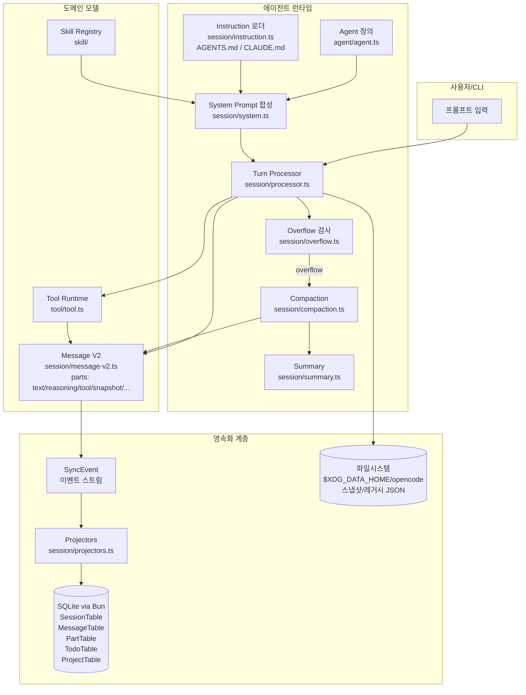
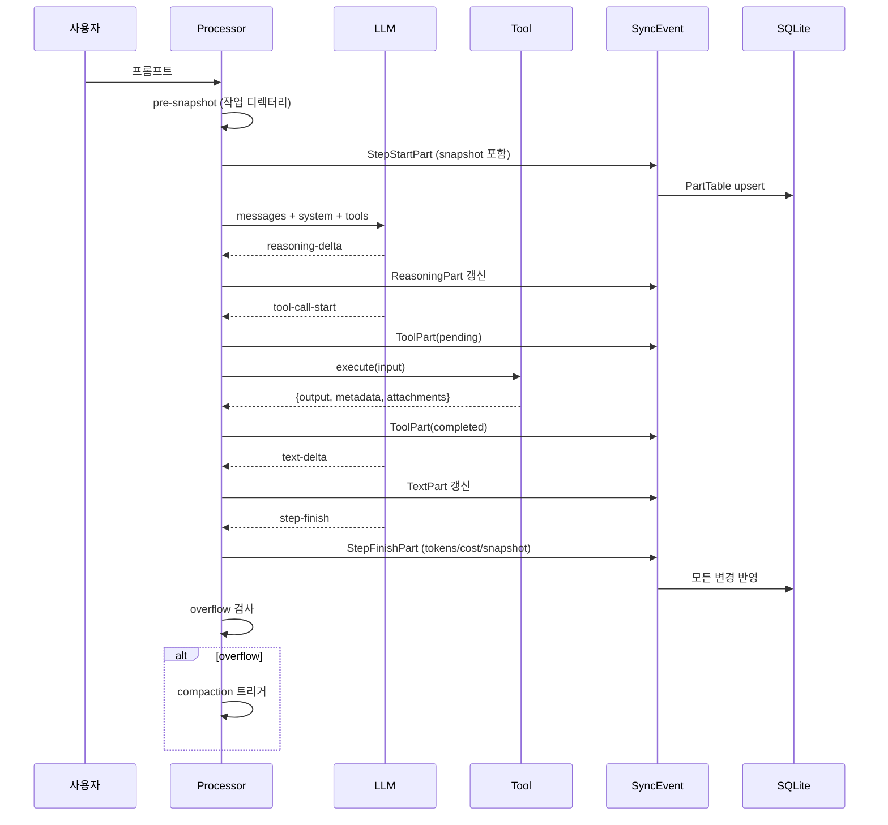
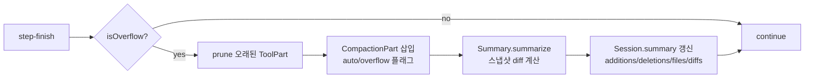

# OpenCode 메모리 아키텍처 분석

> 분석 대상: [anomalyco/opencode](https://github.com/anomalyco/opencode)
> 분석 범위: `packages/opencode/src/` (세션, 스토리지, 에이전트, 컨텍스트 관리)
> 관점: 에이전트가 "기억하고, 정리하고, 필요할 때 꺼내쓰는" 전 과정

---

## 1. 프로젝트 개요

OpenCode는 터미널 기반 코딩 에이전트(Claude Code 계열의 오픈소스 대안)다. 본 문서는 OpenCode 자체의 기능 소개가 아니라 **에이전트 메모리 서브시스템**에 초점을 맞춘다. 즉,

- 대화/도구 호출 결과를 어떻게 영속화하는가
- 컨텍스트 윈도우 한계를 어떻게 우회하는가 (compaction/overflow)
- 시스템 프롬프트와 외부 지침 파일(AGENTS.md 등)을 어떻게 합성하는가
- 에이전트의 사고 흐름(reasoning, tool call, snapshot)이 어떤 데이터 구조로 메모리에 남는가

핵심 키워드: **이벤트 소싱(event sourcing) + SQLite 영속화 + 부분(Part) 기반 메시지 모델 + 자동 compaction**.

---

## 2. 전체 아키텍처



---

## 3. 저장 계층 (Storage)

### 3.1 백엔드: SQLite + Drizzle ORM (Bun 런타임)

- 위치: `storage/db.ts`, `storage/db.bun.ts`
- DB 파일: `$XDG_DATA_HOME/opencode/opencode.db` (채널별 변형 가능) — `storage/db.ts:31-36`
- 옵션 (`db.ts:90-94`):
  - **WAL 모드** — 동시 읽기 처리량 확보
  - `synchronous=NORMAL` — 내구성과 속도 균형
  - **외래키 제약 활성화** — 메시지/Part의 cascading delete 보장
  - `cache_size = 64MB`

### 3.2 핵심 테이블

| 테이블 | 위치 | 키/인덱스 | 역할 |
|---|---|---|---|
| `SessionTable` | `session/session.sql.ts:14-44` | PK: `session_id` | 세션 메타데이터: title, directory, project_id, parent_id, version, summary(additions/deletions/files), share URL, permission, revert state, archived 등 |
| `MessageTable` | `session/session.sql.ts:46-58` | PK: `message_id`, IDX `(session_id, time_created, id)` | 메시지 헤더(role/model/tokens/error)를 JSON 컬럼으로 저장 |
| `PartTable` | `session/session.sql.ts:60-76` | PK: `part_id`, IDX `(message_id, id)`, `(session_id)` | 메시지의 모든 "조각"(텍스트, 도구 호출, 스냅샷 등)을 JSON으로 저장 |
| `TodoTable` | `session/session.sql.ts:78-95` | 복합키 `(session_id, position)` | 세션별 할 일 목록(상태/우선순위/순서) |
| `ProjectTable` | `project/project.sql.ts:1-16` | PK: `id` | 워크트리 경로, VCS 종류, 샌드박스 목록, 시작 명령 등 |

> 모든 테이블은 외래키로 cascading delete가 걸려 있어 세션을 지우면 메시지/Part/Todo가 자동 정리된다.

### 3.3 파일시스템 레이아웃

```
$XDG_DATA_HOME/opencode/
├── opencode.db                # 메인 SQLite
├── log/                       # 런타임 로그
└── storage/                   # (레거시) JSON 마이그레이션 소스
    ├── project/{projectID}.json
    ├── session/{projectID}/{sessionID}.json
    ├── message/{sessionID}/{messageID}.json
    └── part/{partID}/{index}.json
```

- `storage/json-migration.ts`, `storage/storage.ts:85-216`에 **2단계 마이그레이션** 로직이 있다. 구버전 JSON 디렉터리를 발견하면 SQLite로 자동 흡수한다.
- `Global.Path` (`global/index.ts:1-54`):
  - `data` → `$XDG_DATA_HOME/opencode`
  - `log`, `cache`, `config`, `state`, `bin` 분리
  - `CACHE_VERSION` 변경 시 캐시 자동 무효화

### 3.4 프로젝트 바인딩

- `project/instance.ts:35-80` — 디렉터리별 인스턴스 캐시. 세션은 항상 특정 프로젝트(`worktree`)에 묶이며, 디렉터리 단위로 격리된다.
- 즉, **메모리는 글로벌이 아니라 (프로젝트 × 세션) 좌표로 분할**된다.

---

## 4. 메시지 모델 — Part 기반 구조

OpenCode의 핵심 설계 결정은 **메시지 = 메타데이터(Info) + 순서 있는 Part 배열**이라는 것이다 (`session/message-v2.ts`). 일반적인 `{role, content}` 단순 모델 대신, 한 어시스턴트 턴 안에서 일어나는 모든 사건을 타입별 Part로 쪼개어 저장한다.

### 4.1 Message Info (`message-v2.ts:26-58`)

```ts
{
  role: "user" | "assistant",
  model: { providerID, modelID },
  tokens: { total, input, output, reasoning, cache: { read, write } },
  error?: APIError,
  parentID?: MessageID  // 분기/스레드용
}
```

토큰 회계가 5분류(input/output/reasoning/cache-read/cache-write)로 매우 정밀하게 기록된다. 이는 뒤에 나올 **overflow 판정**과 비용 계산의 근거가 된다.

### 4.2 Part 종류 (discriminated union)

| Part 타입 | 위치 | 의미 |
|---|---|---|
| `TextPart` | `message-v2.ts:110` | LLM이 출력한 일반 텍스트. `synthetic` 플래그로 사용자 입력과 구분 |
| `ReasoningPart` | `message-v2.ts:127` | extended thinking / reasoning 토큰 출력 |
| `ToolPart` | `message-v2.ts:341` | 도구 호출. `state`가 pending → running → completed/error로 전이 |
| `SnapshotPart` | `message-v2.ts:93` | 작업 디렉터리 git 스냅샷 해시 |
| `PatchPart` | `message-v2.ts:101` | 변경된 파일 목록과 커밋 해시 |
| `StepStartPart` / `StepFinishPart` | `message-v2.ts:245-271` | 한 "step"의 시작/끝. step-finish는 토큰/비용/stop reason 포함 |
| `AgentPart` | `message-v2.ts:192` | 서브 에이전트 호출 추적 |
| `CompactionPart` | `message-v2.ts:207` | **컨텍스트 압축이 일어난 지점 마커** (`auto`, `overflow` 플래그) |
| `FilePart` | `message-v2.ts:181` | 파일/이미지 등 첨부물 (`source`로 file/symbol/resource 구분) |
| `RetryPart` | `message-v2.ts:233` | 재시도 발생 기록 |

### 4.3 왜 Part 모델인가

- **사고 흐름의 전수 보존**: reasoning, tool call, 결과, 스냅샷, step 경계가 모두 같은 시간축 위에 정렬된다. 디버깅/리플레이/포크가 자연스럽다.
- **선택적 가지치기**: compaction 시 "오래된 ToolPart의 출력만" 비우는 식의 부분 삭제가 가능하다. 텍스트 메시지는 살리고 거대한 도구 출력만 잘라내는 것.
- **이벤트 소싱과의 정합**: 각 Part는 곧 하나의 sync event로 매핑된다.

---

## 5. 이벤트 소싱과 데이터 흐름

### 5.1 두 개의 이벤트 레이어

1. **SyncEvent** — 영속 이벤트 스트림. `EventTable`에 기록되고 시작 시 리플레이된다. 버전드 타입(`versionedType("session.created", 1)`)으로 마이그레이션 안전.
2. **BusEvent** — 인메모리 pub/sub. UI 갱신 등 즉시성이 필요한 곳에서만 사용, 영속화하지 않는다.

### 5.2 Projector 패턴 (`session/projectors.ts:64-103`)

이벤트는 직접 DB를 건드리지 않고 **projector**를 통해 테이블에 반영된다.

```ts
SyncEvent.project(Session.Event.Updated, (db, data) => {
  db.update(SessionTable)
    .set(toPartialRow(data.info))
    .where(eq(SessionTable.id, data.sessionID))
    .run()
})

SyncEvent.project(MessageV2.Event.Updated, ...)      // → MessageTable upsert
SyncEvent.project(MessageV2.Event.PartUpdated, ...)  // → PartTable upsert
```

이로써 다음이 보장된다:

- **단일 진실 원천**: DB는 이벤트의 투영(projection)이며, 새 projector를 추가하면 동일 이벤트로 새로운 인덱스/뷰를 만들 수 있다.
- **재구성 가능성**: DB가 깨져도 이벤트 스트림에서 다시 빌드 가능.

### 5.3 한 턴(turn)의 데이터 흐름



---

## 6. 시스템 프롬프트와 지침 합성

세션이 LLM에 보내는 "현재 컨텍스트"는 다음 4가지를 합쳐 만든다.

### 6.1 모델별 베이스 프롬프트 (`session/system.ts:20-34`)

```ts
function provider(model) {
  if (gpt-4|o1|o3)   return [PROMPT_BEAST]
  if (gpt-codex)     return [PROMPT_CODEX]
  if (gpt)           return [PROMPT_GPT]
  if (gemini)        return [PROMPT_GEMINI]
  if (claude)        return [PROMPT_ANTHROPIC]
  if (trinity)       return [PROMPT_TRINITY]
  if (kimi)          return [PROMPT_KIMI]
  return [PROMPT_DEFAULT]
}
```

같은 코딩 에이전트라도 모델별로 톤/포맷이 다른 프롬프트가 들어간다 (`agent/prompt/` 디렉터리).

### 6.2 환경 컨텍스트 (`system.ts:36-61`)

- 모델 ID, 프로바이더
- working directory, git worktree 루트
- 플랫폼, 현재 날짜
- (옵션) git tree 구조

### 6.3 Instruction 파일 로딩 (`session/instruction.ts:54-100`)

- **프로젝트 단위**: `AGENTS.md`, `CLAUDE.md`, `CONTEXT.md`
- **글로벌 단위**: `$OPENCODE_CONFIG`, `~/.claude/CLAUDE.md`
- **중복 방지** (`instruction.ts:77-84`): 이미 첨부된 파일은 다시 넣지 않음
- **동적 컨텍스트**: 직전 턴들에서 `read` 도구로 로드한 파일 경로(`metadata.loaded`)를 추출해 자동 첨부 후보로 활용 (`instruction.ts:37-52`)

### 6.4 Skill 첨부 (`system.ts:63-75` + `skill/`)

- `.claude/skills/**/SKILL.md`, `.agents/skills/**/SKILL.md`, 글로벌 스킬 디렉터리를 스캔
- 프론트매터(name, description) 파싱 → 캐시
- 에이전트별 권한 룰로 필터링한 뒤 시스템 프롬프트에 verbose 형태로 첨부, 도구 설명에는 concise 형태로 노출

---

## 7. 컨텍스트 윈도우 관리 — Overflow & Compaction

OpenCode 메모리 시스템에서 **가장 흥미로운 부분**이다.

### 7.1 Overflow 판정 (`session/overflow.ts:1-22`)

```ts
function isOverflow({ cfg, tokens, model }) {
  const count = tokens.total
              || tokens.input + tokens.output + tokens.cache.read + tokens.cache.write
  const reserved = cfg.compaction?.reserved
                 ?? Math.min(20_000, model.limit.maxOutput)
  const usable = model.limit.input - reserved
  return count >= usable
}
```

- 모델의 input limit에서 출력 여유분(reserved)을 뺀 값이 임계치
- step-finish 이후 매번 검사한다

### 7.2 Compaction 정책 (`session/compaction.ts:35-37`)

```
PRUNE_MINIMUM = 20_000   // 이 이하로는 굳이 자르지 않음
PRUNE_PROTECT = 40_000   // 최근 도구 호출 보호 영역
PROTECTED_TOOLS = ["skill"]  // 절대 자르지 않는 도구
```

**Pruning 알고리즘** (개념):

1. 메시지/Part를 **뒤에서 앞으로** 순회
2. 누적 토큰이 `PRUNE_PROTECT`에 도달할 때까지는 건드리지 않음
3. 그 이전 영역의 ToolPart 출력을 빈 placeholder로 교체 (텍스트는 보존)
4. `skill` 도구는 예외로 그대로 둠 — 사용 가능한 능력에 대한 메모리 손실 방지

### 7.3 Compaction Process (`session/compaction.ts:84-150+`)



- `CompactionPart`가 메시지 스트림에 마커로 남기 때문에, 나중에 "이 지점에서 컨텍스트가 압축됐다"는 사실 자체가 사고 흐름의 일부로 보존된다.
- `summary.ts:68-100`의 `computeDiff`는 첫 `StepStartPart`의 스냅샷과 마지막 `StepFinishPart` 스냅샷을 비교해 파일 변경 통계와 diff를 추출 → `Session.summary`에 저장 → revert 기능의 근거가 된다.

### 7.4 Revert와의 연결

- `Session.summary.diffs`에 step별 diff가 누적
- 사용자가 특정 메시지로 revert하면 그 시점 이후의 diff를 역적용
- 즉 **메모리(Part 스트림) ↔ 파일시스템 상태**가 스냅샷-diff 쌍으로 양방향 동기화된다

---

## 8. 도구(Tool) 출력의 메모리화

### 8.1 Tool Context (`tool/tool.ts:16-27`)

도구가 실행될 때 받는 컨텍스트:

```ts
type Context = {
  sessionID, messageID, agent, abort,
  callID?: string,
  messages: MessageV2.WithParts[],   // 전체 대화 이력에 직접 접근 가능
  metadata(input): void,             // 결과에 메타데이터 부착
  ask(permission): Promise<void>     // 권한 요청
}
```

도구가 **현재 세션의 전체 메시지 스트림에 직접 접근**할 수 있다는 점이 중요하다. 즉 도구도 일종의 메모리 소비자/생산자가 된다.

### 8.2 Tool 결과 저장 (`tool/tool.ts:34-95`)

```ts
execute(): Promise<{
  title: string,
  metadata: M,           // 예: truncated, outputPath, loaded[]
  output: string,
  attachments?: FilePart[]
}>
```

- 결과는 `ToolPart.state.output` (completed)에 저장 → PartTable에 영속화
- **출력이 너무 크면** 디스크 파일로 잘라내고 `metadata.outputPath`만 남김 (`tool/tool.ts:83-95`)
- `read` 도구는 `metadata.loaded`에 읽은 경로 배열을 남겨, 이후 instruction loader가 이를 활용

이 구조 덕분에:

- 거대한 grep/read 출력이 SQLite row를 폭파시키지 않음
- compaction 시에는 메타데이터만 남기고 출력은 placeholder로 교체 가능

---

## 9. 메시지 검색·재구성·포크

### 9.1 메시지 로딩 (`session/index.ts:595-600`)

```ts
Session.messages = (input) => {
  if (input.limit) return MessageV2.page({sessionID, limit}).items
  return Array.from(MessageV2.stream(sessionID)).reverse()
}
```

내부적으로:

```sql
SELECT * FROM message
WHERE session_id = ?
ORDER BY time_created DESC, id DESC
-- 각 message에 대해
SELECT * FROM part WHERE message_id = ?
```

→ `MessageV2.WithParts = { info, parts[] }` 형태로 조립.

### 9.2 포크 (`session/index.ts:511-546`)

특정 messageID까지의 메시지를 자식 세션으로 복제. 새 ID를 부여하고 모든 Part를 클론한다. `parentID`로 계보가 유지된다 → **대화 트리** 구조 가능.

### 9.3 ID 체계

- Session ID: `SessionID.descending()` — 시간 역순으로 정렬되는 ID (최신이 항상 위)
- Message ID: ascending — 한 세션 안에서는 시간 순서대로

이 비대칭이 "세션 목록은 최신순, 메시지는 시간순"이라는 UX를 인덱스만으로 제공한다.

---

## 10. 사고 흐름과 메모리의 연계 (한 턴의 생명주기)

`session/processor.ts`의 흐름을 정리하면:

1. **create** (`processor.ts:86-102`)
   - LLM 호출 전에 작업 디렉터리 스냅샷 캡처 (도구 부작용과 분리하기 위해)
   - `toolcalls` 맵, `reasoning` 맵, part 누적기 초기화

2. **handleEvent** (`processor.ts:111-`) — 스트림 이벤트 핸들러
   - `start` → 세션 busy 마킹
   - `reasoning-start/delta/end` → ReasoningPart 갱신
   - `tool-call-start` → ToolPart(pending) 생성
   - `tool-result` → ToolPart 상태 전이 + output 저장
   - `text-delta` → TextPart 누적
   - `step-finish` → StepFinishPart 확정 (토큰/비용/스냅샷)

3. **턴 종료 후 처리** — overflow 검사 → 필요 시 compaction → 다음 턴

요점은, **에이전트의 사고(reasoning)와 행동(tool call)과 결과(snapshot)가 같은 1차 시민 데이터**라는 것이다. 텍스트만 저장하는 단순 챗봇과 달리, OpenCode의 메모리는 "에이전트가 무엇을 생각했고, 무엇을 했고, 그 결과 파일시스템이 어떻게 변했는지"를 모두 포함한다.

---

## 11. 메모리 좌표와 스코프 요약

| 스코프 | 보관 위치 | 용도 |
|---|---|---|
| 글로벌 | `$XDG_CONFIG_HOME/opencode`, `~/.claude/CLAUDE.md` | 사용자 전역 지침, 글로벌 스킬 |
| 프로젝트 | `ProjectTable` + `worktree/AGENTS.md`·`CLAUDE.md`·`CONTEXT.md` | 프로젝트 규칙, 워크트리 메타 |
| 세션 | `SessionTable` + `MessageTable` + `PartTable` + `TodoTable` | 대화 이력, 도구 호출, 스냅샷, 할 일 |
| 턴(step) | `StepStart/StepFinishPart` + 스냅샷 | 토큰·비용 회계, revert 단위 |
| 도구 호출 | `ToolPart.state` | 입력/출력/메타데이터, 큰 출력은 디스크 |
| 압축 마커 | `CompactionPart` | 어디서 컨텍스트가 잘렸는지 영구 기록 |

---

## 12. 종합 평가 — 엔지니어 관점 인사이트

### 12.1 잘 설계된 점

1. **Part 기반 메시지 모델**이 모든 것을 가능하게 한다. reasoning/tool/snapshot/compaction 모두를 1차 시민으로 다룰 수 있어 부분 가지치기, 리플레이, 포크가 자연스럽다.
2. **이벤트 소싱 + projector**: DB는 파생물이라 새 인덱스를 추가하기 쉽고, 스키마 마이그레이션도 이벤트 버저닝으로 안전하다.
3. **스냅샷-diff 쌍으로 메모리와 파일시스템을 묶음**: revert와 compaction이 같은 인프라를 공유한다.
4. **토큰을 5분류로 분리 회계**: cache hit까지 추적하므로 overflow 판정이 정밀하다.
5. **거대 도구 출력의 디스크 오프로딩**: PartTable이 비대해지지 않는다.
6. **Instruction의 dedupe + 동적 첨부**: 이미 본 파일을 다시 넣지 않고, 사용자가 읽은 파일은 다음 턴에서 자동 후보가 된다.

### 12.2 약점 / 리스크

1. **SQLite 단일 파일** — 멀티 머신/팀 공유에는 부적합. Share URL은 별개 메커니즘.
2. **Compaction이 ToolPart 출력 위주의 가지치기** — 텍스트가 본질적으로 비대한 대화에는 효과가 제한적일 수 있음. 요약(summary)은 diff 기반이라 코드 변경이 없는 토론형 세션에는 약함.
3. **Skill 보호 같은 휴리스틱**이 코드에 하드코딩되어 있어 모델/에이전트 특성에 따라 튜닝 여지가 큼.
4. **이벤트 스트림의 무한 성장** — 리플레이 비용이 누적될 가능성. 스냅샷/체크포인트 전략이 명시적이지 않다.

### 12.3 한 줄 요약

> OpenCode의 메모리는 **"이벤트 소싱된 Part 스트림 + SQLite projection + 스냅샷 기반 파일시스템 동기화 + 토큰 회계 기반 자동 compaction"** 으로 구성된, 코딩 에이전트에 최적화된 영속 컨텍스트 시스템이다.

---

## 부록 A. 주요 파일 인덱스

| 파일 | 역할 |
|---|---|
| `storage/db.ts`, `db.bun.ts` | SQLite 연결, PRAGMA 설정 |
| `storage/schema.ts`, `schema.sql.ts` | 스키마 정의 |
| `storage/storage.ts`, `json-migration.ts` | 레거시 JSON → SQLite 마이그레이션 |
| `session/session.sql.ts` | Session/Message/Part/Todo 테이블 |
| `session/message-v2.ts` | 메시지/Part 도메인 모델 |
| `session/index.ts` | 세션 생성/로드/포크/메시지 페이지네이션 |
| `session/processor.ts` | 한 턴의 LLM 스트림 이벤트 처리 |
| `session/overflow.ts` | 오버플로우 판정 |
| `session/compaction.ts` | Compaction 알고리즘 |
| `session/summary.ts` | 스냅샷 diff 기반 요약 |
| `session/system.ts` | 시스템 프롬프트 합성 |
| `session/instruction.ts` | AGENTS.md/CLAUDE.md 등 지침 로딩 |
| `session/projectors.ts` | 이벤트 → DB projection |
| `session/todo.ts` | Todo 목록 메모리 |
| `agent/agent.ts`, `agent/prompt/` | 에이전트 정의와 모델별 베이스 프롬프트 |
| `tool/tool.ts` | 도구 실행 컨텍스트와 결과 스키마 |
| `skill/` | SKILL.md 기반 능력 레지스트리 |
| `project/instance.ts`, `project.sql.ts` | 프로젝트 인스턴스/테이블 |
| `global/index.ts` | XDG 경로 |
