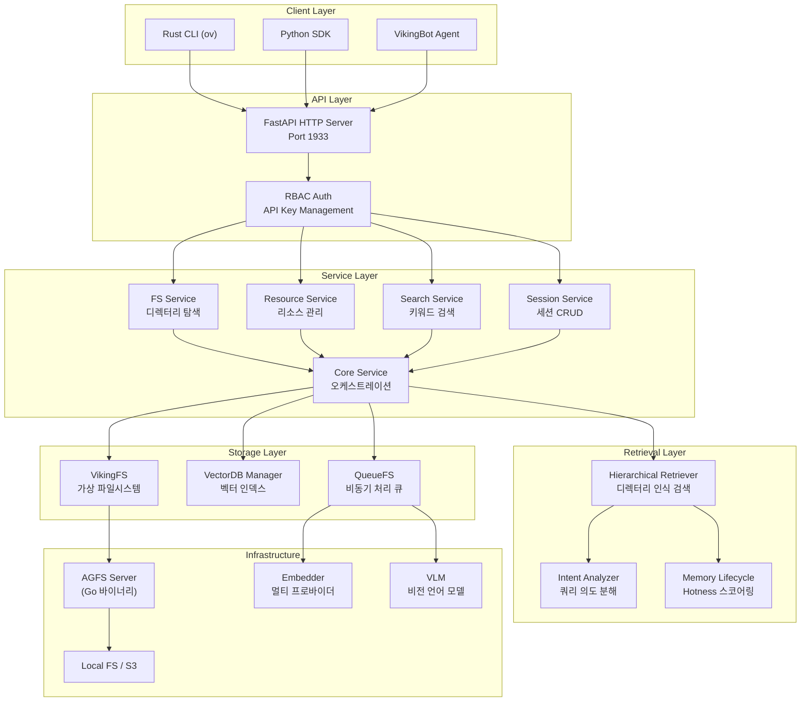
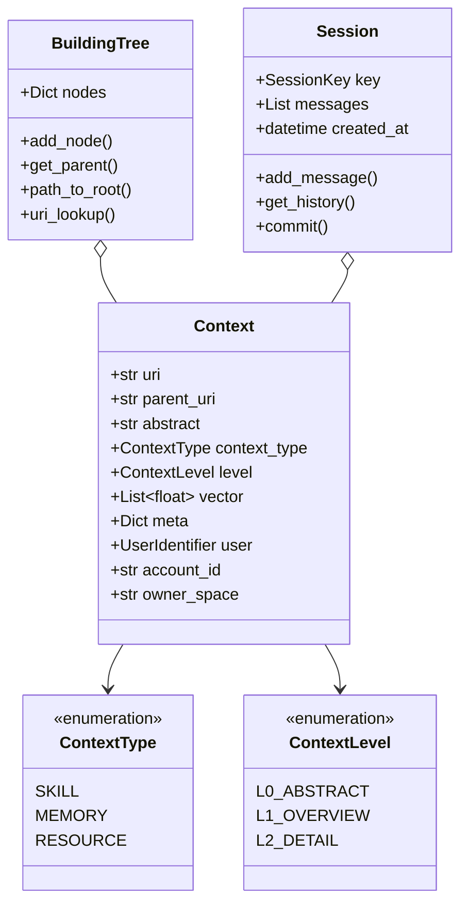
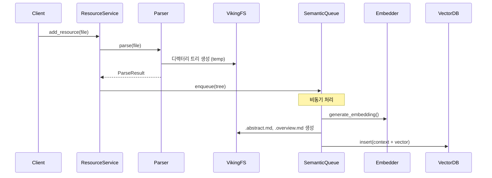
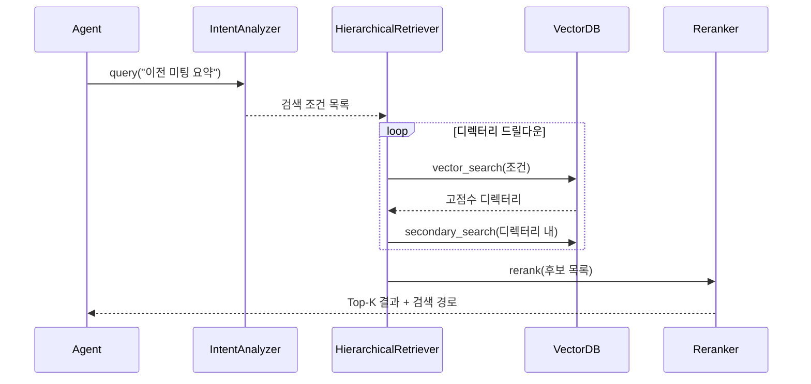
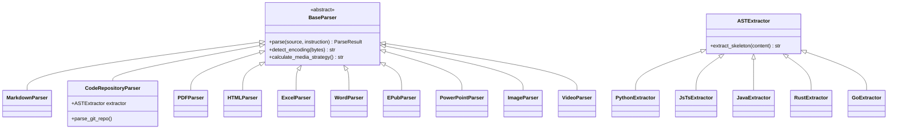
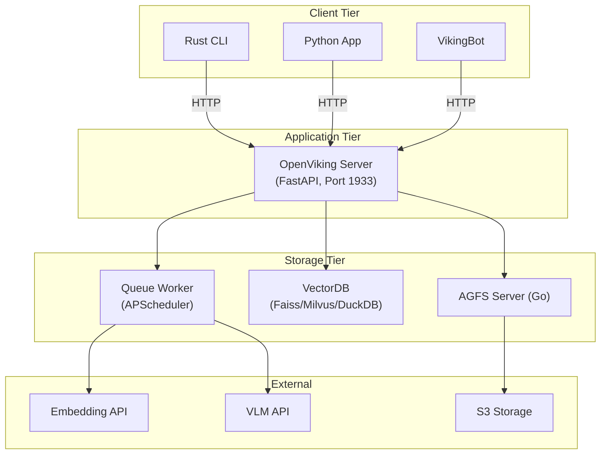

# OpenViking - AI Agent 컨텍스트 데이터베이스 심층 기술 분석

> **프로젝트**: [volcengine/OpenViking](https://github.com/volcengine/OpenViking)
> **분석일**: 2026-03-26
> **라이선스**: Apache 2.0
> **개발사**: Volcengine (ByteDance 클라우드 사업부)

---

## 1. 프로젝트 개요

### 핵심 정의

OpenViking은 **AI Agent 전용 오픈소스 컨텍스트 데이터베이스**다. Agent가 필요로 하는 세 가지 유형의 컨텍스트 — **메모리(Memory)**, **리소스(Resource)**, **스킬(Skill)** — 을 **파일시스템 패러다임**으로 통합 관리하며, 계층적 컨텍스트 전달과 자기 진화(Self-Evolving)를 지원한다.

### 해결하려는 문제

| 문제 | 설명 |
|------|------|
| **컨텍스트 파편화** | Agent의 메모리, 문서, 스킬이 코드, 벡터DB, 파일 등에 산재 |
| **컨텍스트 폭발** | 장시간 실행 에이전트의 대규모 컨텍스트 축적으로 비용 증가 |
| **검색 효과성 한계** | 평면적 벡터 검색만으로는 정확한 컨텍스트 위치 지정 불가 |
| **불투명한 컨텍스트 체인** | RAG 검색 경로를 관찰·디버깅하기 어려움 |
| **제한된 메모리 진화** | Agent가 세션 간 학습 내용을 자동으로 축적·개선하지 못함 |

### 탄생 배경

ByteDance의 Volcengine 팀은 2025년 말 **MineContext** 프로젝트에서 능동적 AI 애플리케이션 패턴을 실험한 후, 2026년 초 글로벌 AI Agent 생태계를 위한 새로운 컨텍스트 데이터베이스 아키텍처로 OpenViking을 오픈소스로 공개했다.

---

## 2. 핵심 특징 및 차별점

### 파일시스템 패러다임 (AGFS)

기존 RAG 시스템이 청크를 평면적으로 저장하는 것과 달리, OpenViking은 모든 컨텍스트를 **가상 파일시스템**(viking:// 프로토콜)으로 매핑한다. Agent는 `ls`, `find`, `tree` 같은 파일시스템 명령으로 컨텍스트를 탐색·검색·조작할 수 있다.

```
viking://
├── resources/           # 외부 리소스: 저장소, 문서, 웹페이지
├── user/               # 사용자 도메인: 선호도, 엔티티, 이벤트
└── agent/              # 에이전트 도메인: 스킬, 학습 패턴
```

### 3단계 컨텍스트 계층 (L0/L1/L2)

컨텐츠를 자동으로 계층화하여 **토큰 소비를 극적으로 절감**한다.

| 레벨 | 크기 | 용도 | 파일 |
|------|------|------|------|
| **L0 (Abstract)** | ~100 토큰 | 한 문장 요약, 빠른 관련성 판단 | `.abstract.md` |
| **L1 (Overview)** | ~2K 토큰 | 핵심 정보·구조, 계획 단계 사용 | `.overview.md` |
| **L2 (Detail)** | 전체 원문 | 필요 시에만 온디맨드 로딩 | 실제 파일 |

### 계층적 검색 (Hierarchical Retrieval)

평면 벡터 검색이 아닌 **디렉터리 인식 재귀적 검색**을 수행한다:

1. 의도 분석 → 복합 검색 조건 분해
2. 벡터 검색 → 고점수 디렉터리 위치 지정
3. 해당 디렉터리 내 2차 검색
4. 하위 디렉터리로 재귀 드릴다운
5. 리랭커를 통한 재정렬
6. Hotness 가중치 기반 스코어 집계

### 자기 진화 메모리

세션 종료 시 자동으로 대화 내용에서 **사용자 선호도**, **에이전트 학습 패턴**을 추출하여 메모리로 저장한다. 중복 제거(deduplication)와 아카이빙도 자동 수행된다.

### 주요 차별화 포인트

- **통합 네임스페이스**: 스킬/메모리/리소스를 단일 URI 체계로 관리
- **다중 프로바이더 지원**: Volcengine, OpenAI, Jina, LiteLLM 등 임베딩·VLM 교체 가능
- **MCP 통합**: MCP 서버 기능 제공으로 Claude Desktop 등과 연동
- **VikingBot**: 내장 에이전트 프레임워크로 Telegram, Slack, Feishu 등 멀티채널 지원

---

## 3. 아키텍처 분석

### 전체 시스템 구조



### 핵심 개념 모델



### 데이터 흐름 (Write Path)



### 데이터 흐름 (Read Path / Query)



---

## 4. 기술 스택

### 언어 및 프레임워크

| 영역 | 기술 | 용도 |
|------|------|------|
| **코어 백엔드** | Python 3.10+ | 핵심 비즈니스 로직, 서비스 계층 |
| **CLI** | Rust (clap, tokio, ratatui) | 고성능 CLI 클라이언트, TUI |
| **파일시스템** | Go (AGFS Server) | 분산 파일시스템 바이너리 |
| **웹 서버** | FastAPI + Uvicorn | HTTP REST API |
| **비동기** | asyncio | 전체 I/O 비동기 처리 |

### 주요 의존성

| 카테고리 | 라이브러리 |
|----------|-----------|
| **코드 파싱** | tree-sitter (Python, JS/TS, Java, C++, Rust, Go, C#) |
| **문서 파싱** | pdfplumber, readabilipy, markdownify, python-docx, openpyxl |
| **임베딩** | Volcengine SDK, openai, litellm, jina, voyage |
| **암호화** | cryptography (AES-256-GCM), argon2-cffi |
| **설정** | Pydantic, PyYAML |
| **스케줄링** | APScheduler |
| **해싱** | xxhash |

### 빌드 시스템

- **Python**: setuptools + pyproject.toml (PEP 517/518), setuptools-scm
- **Rust**: Cargo workspace
- **C++ 확장**: CMake
- **패키지 관리**: uv (빠른 Python 패키지 매니저)
- **컨테이너**: Docker 멀티스테이지 빌드 (Go + Rust + Python)

---

## 5. 핵심 코드 분석

### 5.1 모듈 구조

```
openviking/
├── core/                   # 핵심 데이터 모델
│   ├── context.py          # Context 객체 정의 (URI, 타입, 레벨, 벡터)
│   ├── building_tree.py    # 트리 구조 관리 및 순회
│   ├── directories.py      # 프리셋 디렉터리 초기화
│   ├── mcp_converter.py    # MCP tool → Skill 변환
│   └── skill_loader.py     # SKILL.md 파일 파싱
├── storage/                # 저장소 추상화
│   ├── viking_fs.py        # AGFS 위의 가상 파일시스템
│   ├── viking_vector_index_backend.py  # 벡터 인덱스 (Dense/Sparse/Hybrid)
│   ├── vikingdb_manager.py # VectorDB + Queue 통합
│   ├── queuefs/            # 비동기 임베딩/시맨틱 처리 큐
│   └── local_fs.py         # 로컬 파일시스템 연산
├── service/                # 서비스 오케스트레이션
│   ├── core.py             # 메인 서비스 라이프사이클
│   ├── fs_service.py       # 디렉터리 탐색, L0/L1 검색
│   ├── search_service.py   # 키워드 검색 (grep)
│   ├── resource_service.py # 리소스 업로드/처리/인덱싱
│   └── session_service.py  # 세션 CRUD
├── retrieve/               # 검색 엔진
│   ├── hierarchical_retriever.py  # 디렉터리 인식 재귀 검색
│   ├── intent_analyzer.py  # 쿼리 의도 분해
│   └── memory_lifecycle.py # Hotness 스코어링, 신선도 추적
├── parse/                  # 문서 파싱 파이프라인
│   └── parsers/            # 20+ 파서 플러그인
├── session/                # 세션 관리
│   ├── session.py          # 세션 상태, 메시지 추적
│   ├── compressor.py       # 세션 컨텍스트 압축
│   ├── memory_extractor.py # 세션에서 메모리 추출
│   └── memory_deduplicator.py  # 중복 메모리 제거
├── crypto/                 # 암호화 모듈
│   ├── encryptor.py        # Envelope Encryption (AES-256-GCM)
│   └── providers.py        # Root Key Provider (Local/Vault/KMS)
├── models/                 # ML 모델 통합
│   ├── vlm/                # VLM 백엔드 (OpenAI, LiteLLM, Volcengine)
│   └── embedder/           # 임베더 (다중 프로바이더)
└── server/                 # HTTP API + 인증
```

### 5.2 VikingBot 에이전트 프레임워크

```
bot/vikingbot/
├── agent/
│   ├── loop.py             # 메인 에이전트 루프 (sense → think → act)
│   ├── tools/              # 15+ 빌트인 도구
│   │   ├── ov_file.py      # OpenViking 컨텍스트 도구 (7개)
│   │   ├── web.py          # HTTP 요청
│   │   ├── websearch/      # Brave, Tavily, DuckDuckGo
│   │   ├── shell.py        # 명령어 실행
│   │   ├── image.py        # 이미지 생성/분석
│   │   └── cron.py         # 태스크 스케줄링
│   └── skills.py           # 스킬 로더
├── channels/               # 9+ 채널 통합
│   ├── telegram.py
│   ├── slack.py
│   ├── feishu.py
│   ├── discord.py
│   ├── qq.py
│   └── email.py
├── bus/
│   └── queue.py            # Message Bus (비동기 큐 기반)
├── sandbox/                # 코드 실행 격리
│   ├── backends/
│   │   ├── direct.py       # 직접 실행 (격리 없음)
│   │   ├── srt.py          # Sandbox Runtime (컨테이너)
│   │   └── opensandbox.py  # 외부 샌드박스 서비스
│   └── manager.py
└── config/                 # 설정 스키마 및 로더
```

### 5.3 핵심 설계 패턴

| 패턴 | 적용 위치 | 목적 |
|------|----------|------|
| **Singleton** | AsyncOpenViking, AGFS, VikingFS | 전역 상태, 단일 인스턴스 |
| **Strategy** | 파서, VLM 백엔드, 임베더 | 알고리즘 교체 |
| **Factory** | ParserRegistry, ToolFactory | 객체 생성 추상화 |
| **Observer** | MessageBus, QueueObserver | 이벤트 기반 처리 |
| **Template Method** | BaseParser, BaseChannel, Tool | 재사용 + 확장 |
| **Registry** | ToolRegistry, SkillLoader | 동적 컴포넌트 조회 |
| **Proxy** | VikingDBManagerProxy | 요청 범위 접근 |
| **Adapter** | LiteLLM provider | 서드파티 통합 |

### 5.4 Envelope Encryption 구현

```
Root Key (KMS/Vault/로컬 파일, 32바이트)
    ↓ HKDF (Salt: "openviking-kek-salt-v1")
Account Key (계정별 파생, 32바이트)
    ↓ AES-GCM으로 File Key 암호화
File Key (파일별 랜덤, 32바이트)
    ↓ AES-GCM으로 데이터 암호화
Ciphertext

파일 포맷: [MAGIC:OVE1(4)] [VERSION(1)] [PROVIDER_TYPE(1)]
           [encrypted_file_key] [key_iv(12)] [data_iv(12)] [ciphertext]
```

3개의 Root Key Provider 지원:
- **LocalFileProvider**: `~/.openviking/key/root.key` 파일 기반
- **VaultProvider**: HashiCorp Vault KV 엔진
- **VolcengineKMSProvider**: 클라우드 KMS

API 키 해싱에는 **Argon2id** (메모리 19MiB, 병렬도 1, 반복 2)를 사용한다.

### 5.5 파서 시스템



**Markdown 파서 핵심 알고리즘**:
- 헤딩 기반 계층 분할 (H1-H6), 소규모 섹션 병합 (< 800 토큰), 대규모 섹션 분할 (단락 단위)
- 토큰 추정: `len(text.split()) × 1.3`

**코드 파서**:
- tree-sitter 기반 7개 언어 AST 구조 추출 (함수/클래스 정의, import, 타입 시그니처)
- 미지원 언어는 LLM 폴백

**미디어 처리 전략**:
- `image_count / line_count > 0.3` → 전체 페이지 VLM 처리
- 이미지 존재 → 개별 이미지 추출
- 텍스트만 → 텍스트 전용

---

## 6. API 및 인터페이스

### REST API (FastAPI, 포트 1933)

| 경로 | 메서드 | 기능 |
|------|--------|------|
| `/api/v1/resources/` | POST | 리소스 업로드 |
| `/api/v1/resources/temp_upload` | POST | 임시 파일 업로드 |
| `/api/v1/fs/ls` | GET | 디렉터리 목록 |
| `/api/v1/fs/tree` | GET | 트리 구조 조회 |
| `/api/v1/search/` | POST | 시맨틱 + 키워드 검색 |
| `/api/v1/sessions/` | GET/POST | 세션 CRUD |
| `/api/v1/sessions/{id}/commit` | POST | 세션 커밋 (메모리 추출) |

### Python SDK

```python
# 임베디드 모드 (Async)
from openviking import AsyncOpenViking

ov = AsyncOpenViking(config_path="~/.openviking/ov.conf")
await ov.initialize()

session = await ov.session("my-session")
await ov.add_resource("/path/to/doc.pdf", target_uri="viking://resources/docs")
results = await ov.search("이전 미팅 요약", top_k=5)
await ov.commit_session(session)
```

### Rust CLI

```bash
ov add-resource ./docs/ --to viking://resources/project
ov search "authentication flow" --limit 10
ov fs ls viking://agent/skills/
ov chat "my-session" "프로젝트 아키텍처 설명해줘"
```

### MCP 서버

`mcp_converter.py`가 MCP tool 정의를 Skill 포맷으로 변환하여 Claude Desktop 등과 상호운용한다.

---

## 7. 확장성 및 플러그인

### 확장 포인트

| 확장 포인트 | 패턴 | 방법 |
|-------------|------|------|
| **파서** | Strategy + Factory | `BaseParser` 상속, `supported_extensions` 정의 |
| **임베더** | Strategy | `BaseEmbedder` 상속 |
| **VLM 백엔드** | Strategy | `VLMBase` 상속 |
| **채널** | Template Method | `BaseChannel` 상속, `start/stop/send` 구현 |
| **도구** | Registry | `Tool` ABC 상속, `ToolRegistry`에 등록 |
| **Root Key Provider** | Strategy | `RootKeyProvider` 상속 |
| **샌드박스** | Strategy | `SandboxBackend` 상속 |

### 스킬 시스템

YAML 프론트매터 + Markdown 바디의 `.md` 파일로 구성되며, 점진적 로딩을 지원한다 (요약 목록 → 전체 내용 → LLM 프롬프트 주입).

---

## 8. 성능 특성

### 시간 복잡도

| 연산 | 복잡도 | 비고 |
|------|--------|------|
| 리소스 추가 | O(n) | n = 파일 크기 |
| 컨텍스트 검색 | O(log m) | m = 인덱싱된 컨텍스트 (벡터DB) |
| 파일 암호화 | O(n) | n = 평문 크기 |
| Markdown 파싱 | O(n) | 선형 스캔 + 정규식 |
| AST 추출 | O(n) | tree-sitter 파싱 |

### L0/L1/L2 토큰 절감 효과

전체 문서(L2)를 항상 로딩하는 대신 L0(~100 토큰)으로 관련성을 먼저 판단하고, 필요 시 L1(~2K 토큰)으로 확장, 최종적으로 L2를 로딩한다. 대규모 지식베이스에서 **토큰 비용을 대폭 절감**한다.

### 알려진 제약사항

- Message Bus 큐 크기 무제한 — 대규모 트래픽 시 메모리 압력 발생 가능
- Tool Registry 선형 탐색 O(n) — 도구 수 과다 시 성능 영향
- 멀티테넌시 기능 개발 중 (RBAC + 계정 격리 설계 완료, 구현 진행 중)

---

## 9. 배포 및 운영

### 실행 모드

| 모드 | 설명 | 사용 사례 |
|------|------|----------|
| **Embedded** | `AsyncOpenViking` / `SyncOpenViking` 라이브러리 | 애플리케이션 내장 |
| **Server** | `openviking-server` HTTP 데몬 (포트 1933) | 독립 서비스 |
| **Docker** | 멀티스테이지 빌드 (Go + Rust + Python) | 컨테이너 배포 |

### 배포 토폴로지



### 설정 (`~/.openviking/ov.conf`)

```json
{
  "storage": {"workspace": "/path/to/data"},
  "embedding": {
    "dense": {"provider": "openai", "model": "text-embedding-3-large", "dimension": 1536}
  },
  "vlm": {"provider": "openai", "model": "gpt-4"},
  "server": {"host": "0.0.0.0", "port": 1933},
  "bot": {"channels": [...]}
}
```

---

## 10. 경쟁·비교 분석

| 항목 | **OpenViking** | **Mem0** | **Zep** | **LangGraph Memory** |
|------|:---:|:---:|:---:|:---:|
| **컨텍스트 타입** | Memory + Resource + Skill 통합 | Memory 중심 | Memory + Document | Memory (State) |
| **저장 패러다임** | 가상 파일시스템 (AGFS) | 그래프 DB + 벡터 | PostgreSQL + 벡터 | 체크포인트 기반 |
| **컨텍스트 계층화** | L0/L1/L2 3단계 | 없음 | 요약만 | 없음 |
| **검색 방식** | 계층적 디렉터리 인식 검색 | 벡터 + 그래프 | 벡터 + 키워드 | 상태 키 조회 |
| **자기 진화** | 자동 메모리 추출·중복제거 | 자동 메모리 관리 | 수동/반자동 | 수동 |
| **에이전트 프레임워크** | VikingBot 내장 | 없음 | 없음 | LangGraph |
| **멀티채널** | 9+ (Telegram, Slack, Feishu 등) | 없음 | 없음 | 없음 |
| **파일 파싱** | 20+ 포맷 내장 | 제한적 | 제한적 | 없음 |
| **MCP 지원** | 내장 | 없음 | 없음 | 없음 |
| **암호화** | Envelope Encryption (AES-256-GCM) | 없음 | 없음 | 없음 |
| **언어** | Python + Rust + Go | Python | Python | Python |

---

## 11. 종합 평가

### 강점

1. **파일시스템 메타포의 직관성**: Agent가 `ls`, `find`, `tree` 같은 익숙한 연산으로 컨텍스트를 탐색할 수 있어, 기존 RAG의 블랙박스 검색 대비 **관찰 가능성과 디버깅 용이성**이 크게 향상된다.

2. **L0/L1/L2 계층화**: 토큰 경제성을 혁신적으로 개선한다. 대규모 지식베이스에서도 L0로 빠르게 필터링 후 필요한 깊이까지만 로딩하므로, **비용 대비 정확도 트레이드오프**를 효과적으로 관리한다.

3. **올인원 아키텍처**: 컨텍스트 DB + 에이전트 프레임워크 + 멀티채널 + 파싱 파이프라인을 단일 프로젝트로 제공하여, Agent 시스템 구축 시 **통합 비용을 크게 절감**한다.

4. **엔터프라이즈 보안**: Envelope Encryption, RBAC, 멀티테넌시 설계로 **기업 환경 적용**에 적합하다.

5. **다중 언어 구현**: Python(유연성) + Rust(CLI 성능) + Go(파일시스템 성능)로 적재적소에 기술을 배치했다.

### 약점 및 리스크

1. **복잡성**: 단순 RAG 대비 학습 곡선이 높다. AGFS, VikingFS, VectorDB, Queue 등 운영 컴포넌트가 많다.

2. **Volcengine 의존성**: ByteDance 생태계에 편향된 통합이 존재하며, 타 프로바이더 사용 시에도 관련 코드가 남아 있다.

3. **초기 단계**: 2026년 초 공개된 프로젝트로 멀티테넌시, 분산 환경 등의 기능이 아직 개발 중이다.

4. **AGFS 운영 오버헤드**: Go 바이너리인 AGFS 서버를 별도로 관리해야 하므로 인프라 복잡도가 증가한다.

### 적합·부적합 사례

**적합**:
- 대규모 문서 기반 Agent 시스템 (리서치, 지원, 지식 관리)
- 멀티채널 Agent 봇 운영
- 장기 메모리 관리와 자기 진화가 필요한 Agent
- 엔터프라이즈 보안 요구사항이 있는 시스템

**부적합**:
- 단순 Q&A 챗봇 (오버엔지니어링)
- 실시간 스트리밍이 핵심인 시스템
- 인프라 관리 인력이 부족한 소규모 팀

### 엔지니어 관점 인사이트

OpenViking의 핵심 아이디어인 **"컨텍스트를 파일시스템으로 모델링"**은 단순하지만 강력하다. 개발자에게 파일시스템은 가장 익숙한 추상화 계층이며, 이를 Agent 컨텍스트에 적용함으로써 기존 도구와 사고 모델을 그대로 활용할 수 있다.

특히 **L0/L1/L2 3단계 계층화**는 LLM 기반 시스템의 가장 큰 비용 요인인 토큰 소비를 구조적으로 해결하는 접근이다. 기존 RAG 시스템이 청크 크기 조절이라는 일차원적 방법에 의존하는 것과 대비된다.

다만, 올인원 아키텍처의 장점이 곧 단점이기도 하다. 이미 LangChain이나 LlamaIndex 기반 파이프라인이 있는 팀에서는 OpenViking 전체를 채택하기보다, **L0/L1/L2 계층화**나 **계층적 검색** 아이디어를 차용하여 기존 시스템에 적용하는 것이 현실적일 수 있다.

---

## 참고 자료

- [OpenViking GitHub Repository](https://github.com/volcengine/OpenViking)
- [OpenViking 공식 사이트](https://openviking.ai/)
- [DeepWiki - OpenViking 분석](https://deepwiki.com/volcengine/OpenViking)
- [MarkTechPost - OpenViking 소개](https://www.marktechpost.com/2026/03/15/meet-openviking-an-open-source-context-database-that-brings-filesystem-based-memory-and-retrieval-to-ai-agent-systems-like-openclaw/)
- [ToolMesh - ByteDance OpenViking 오픈소스](https://www.toolmesh.ai/news/bytedance-volcengine-open-sources-openviking-ai-agents)
