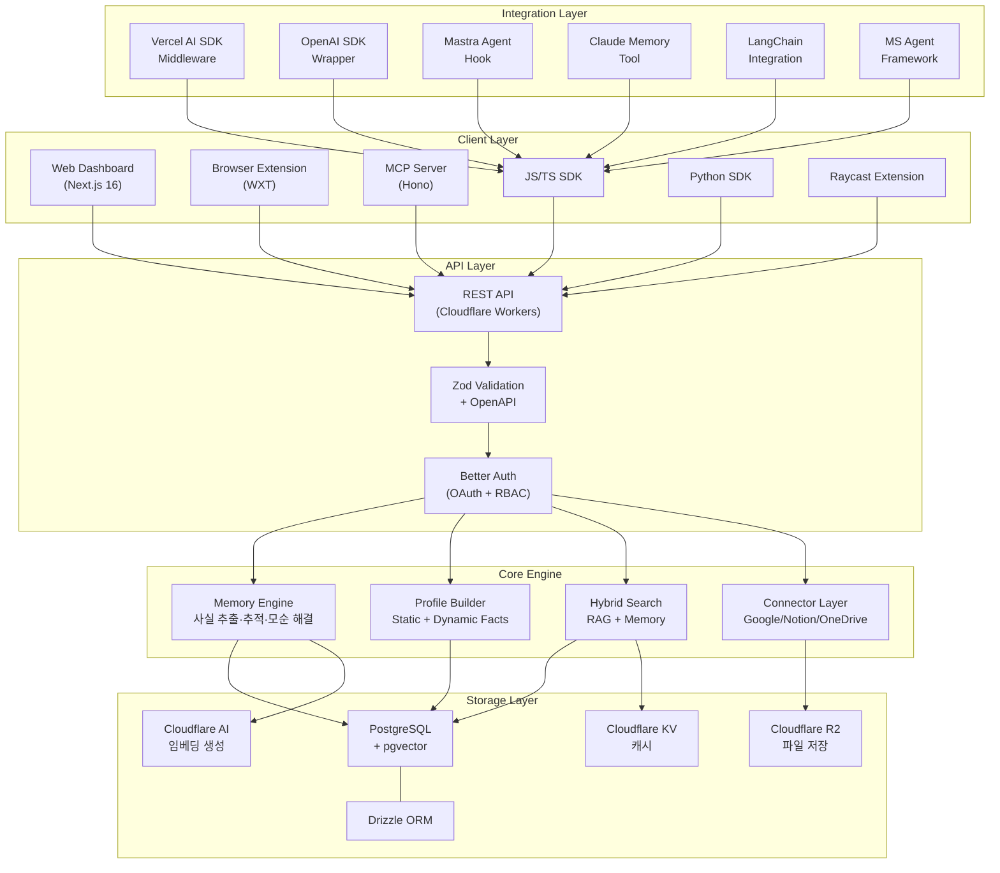
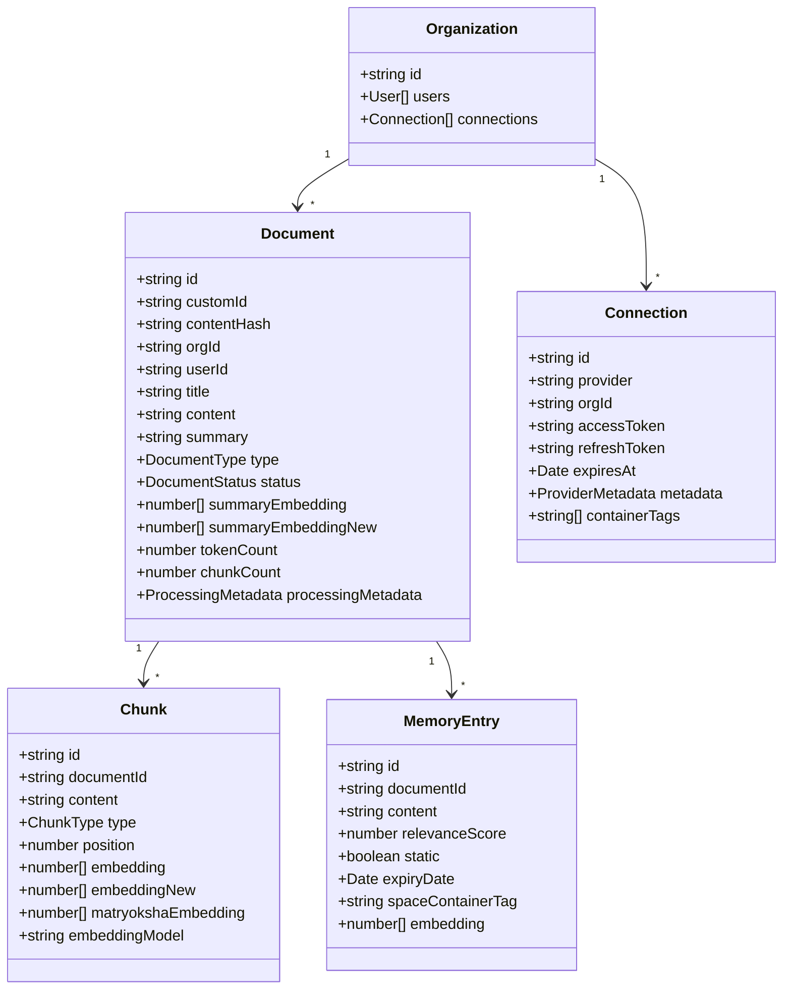
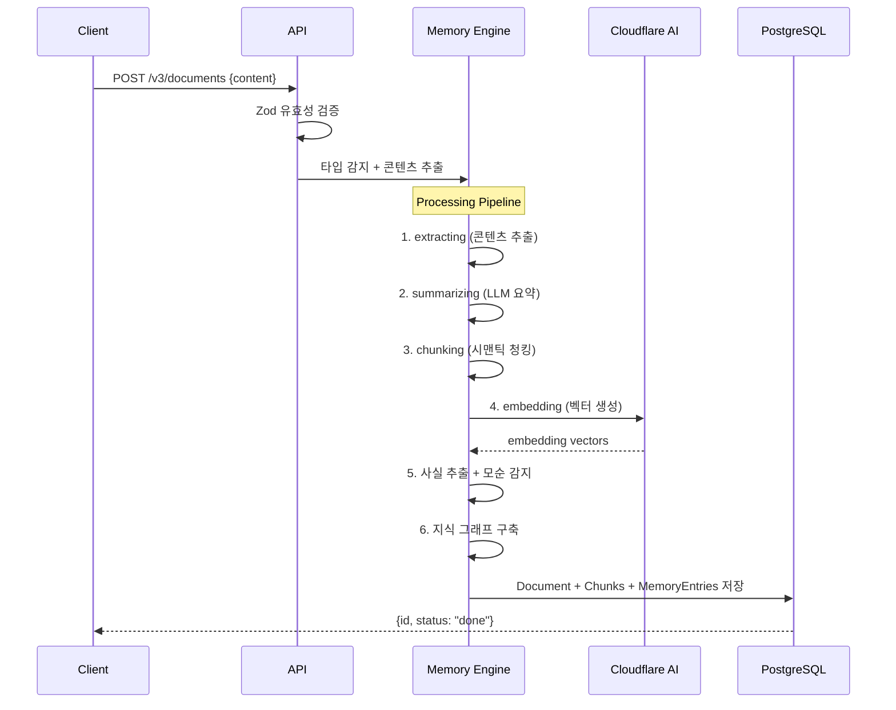
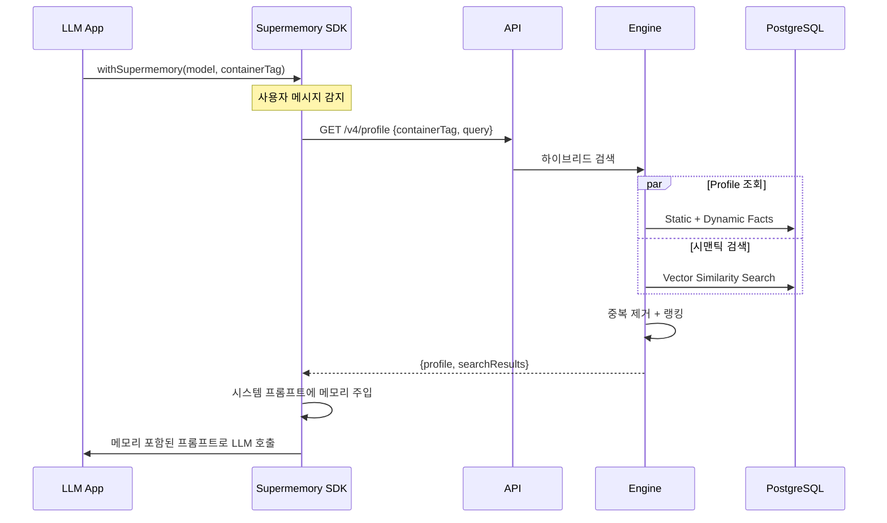
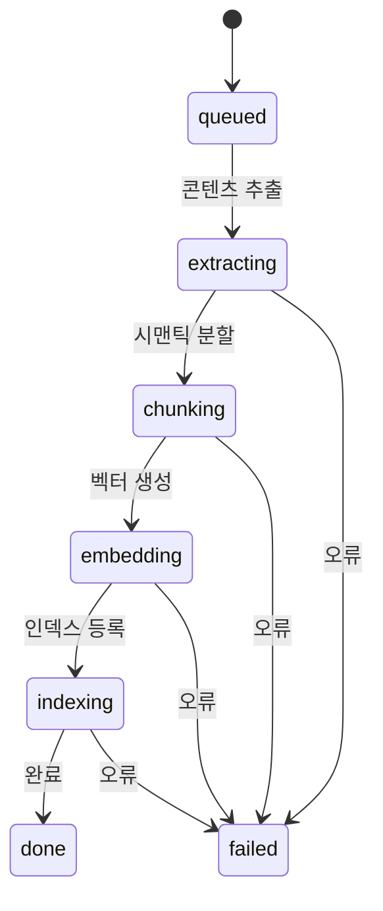
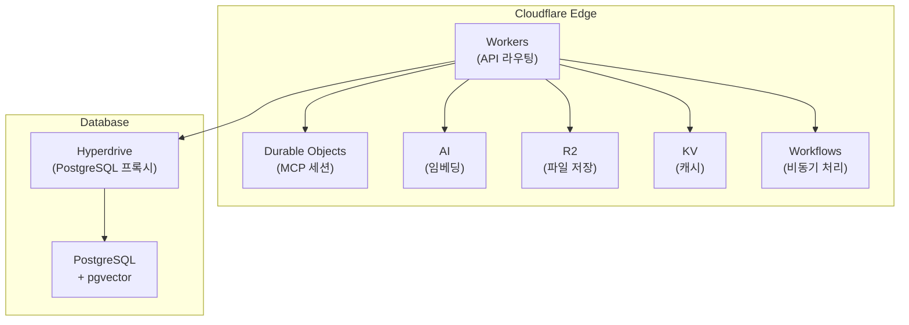

# Supermemory - AI 메모리 레이어 심층 기술 분석

> **프로젝트**: [supermemoryai/supermemory](https://github.com/supermemoryai/supermemory)
> **분석일**: 2026-03-26
> **라이선스**: Apache 2.0
> **개발사**: Supermemory Inc. (창업자 Dhravya Shah)

---

## 1. 프로젝트 개요

### 핵심 정의

Supermemory는 **AI 애플리케이션을 위한 범용 메모리 레이어**다. LLM에 무한 컨텍스트를 제공하여, 세션 간 사용자 선호도·대화 이력·지식을 지속적으로 기억하고 진화시키는 **메모리 엔진 + API 서비스**를 제공한다. LongMemEval, LoCoMo, ConvoMem 3대 벤치마크에서 모두 **1위**를 기록했다.

### 해결하려는 문제

| 문제 | 설명 |
|------|------|
| **세션 간 망각** | LLM이 대화가 끝나면 모든 컨텍스트를 잊음 |
| **사실 모순** | "서울에 살아요" → "샌프란시스코로 이사했어요"를 처리할 수 없음 |
| **메모리 파편화** | 사용자 정보가 앱·서비스별로 산재 |
| **비효율적 RAG** | 단순 벡터 검색은 사용자 프로필·시간 맥락을 반영하지 못함 |
| **통합 비용** | AI 프레임워크마다 메모리 구현을 별도로 작성해야 함 |

### 탄생 배경

19세 개발자 Dhravya Shah가 Google의 Jeff Dean, Cloudflare CTO Dane Knecht 등으로부터 **$2.6M 시드 투자**를 유치하여 설립했다. 처음에는 오픈소스 "세컨드 브레인" 프로젝트로 시작하여, 현재는 AI 앱을 위한 **범용 메모리 API 서비스**로 발전했다.

---

## 2. 핵심 특징 및 차별점

### 메모리 엔진

단순 저장·검색이 아닌 **지능형 메모리 관리**를 수행한다:

- **사실 추출(Extract)**: 대화에서 사용자에 관한 사실을 자동 추출
- **변화 추적(Track)**: 시간에 따른 사실 변화를 감지·업데이트
- **모순 해결(Resolve)**: "서울 거주" → "SF 이사"를 자동 처리
- **자동 망각(Forget)**: 만료 기한 기반 메모리 소멸

### 사용자 프로필 시스템

메모리에서 자동으로 **사용자 프로필**을 구성한다:

| 구분 | 설명 | 예시 |
|------|------|------|
| **Static Facts** | 영구적 사실 | "이름은 김철수", "Python 선호" |
| **Dynamic Facts** | 최근 맥락 (7~30일) | "최근 React 프로젝트 작업 중" |

프로필 조회 응답 시간은 **~50ms**로, 실시간 LLM 호출에 삽입 가능하다.

### 하이브리드 검색

**RAG + Memory**를 단일 쿼리로 결합한다:

| 모드 | 동작 | 사용 사례 |
|------|------|----------|
| `profile` | 사용자 프로필만 반환 | 개인화된 응답 |
| `query` | 시맨틱 검색 결과만 반환 | 지식 검색 |
| `full` | 프로필 + 검색 결합 (기본값) | 완전한 컨텍스트 |

### 커넥터 시스템

외부 서비스의 데이터를 실시간 동기화한다:
- **Google Drive**: OAuth + Webhook 기반 문서 동기화
- **Gmail**: 이메일 컨텍스트 수집
- **Notion**: 워크스페이스 페이지 동기화
- **OneDrive**: Delta 동기화 + Webhook 구독

### 멀티모달 처리

- **PDF**: OCR 기반 텍스트 추출
- **이미지**: 비전 모델 분석
- **비디오**: 자동 전사(transcription)
- **코드**: AST 인식 청킹

### 주요 차별화 포인트

- **벤치마크 1위**: LongMemEval 81.6%, LoCoMo, ConvoMem 모두 최고 성능
- **프레임워크 무관**: Vercel AI SDK, OpenAI, LangChain, Mastra, Claude, Microsoft Agent Framework 모두 지원
- **MCP 서버 내장**: Claude Desktop, Cursor, Windsurf 등과 즉시 연동
- **50ms 프로필 조회**: 실시간 LLM 호출에 삽입 가능한 초저지연
- **지식 그래프 시각화**: D3.js 기반 메모리 관계 그래프

---

## 3. 아키텍처 분석

### 전체 시스템 구조



### 핵심 개념 모델



### 데이터 흐름 (메모리 저장)



### 데이터 흐름 (메모리 검색)



---

## 4. 기술 스택

### 언어 및 프레임워크

| 영역 | 기술 | 용도 |
|------|------|------|
| **런타임** | Cloudflare Workers + Durable Objects | 서버리스 엣지 컴퓨팅 |
| **언어** | TypeScript 5.8 | 전체 스택 |
| **웹 앱** | Next.js 16 + React 19 | 대시보드 UI |
| **API 프레임워크** | Hono | Workers/MCP 라우팅 |
| **패키지 매니저** | Bun 1.3.4 | 빠른 빌드·설치 |
| **빌드** | Turborepo | 모노레포 빌드 오케스트레이션 |
| **Python** | Python 3.10+ | Agent Framework SDK |

### 주요 의존성

| 카테고리 | 라이브러리 |
|----------|-----------|
| **ORM** | Drizzle ORM 0.44 |
| **유효성 검증** | Zod 3.25+ (+ zod-openapi) |
| **인증** | Better Auth 1.3.3 (OAuth + RBAC) |
| **UI** | Radix UI, Vanilla Extract |
| **상태 관리** | Zustand, React Query |
| **시각화** | D3.js (force-graph), Canvas API |
| **코드 품질** | Biome (lint + format) |
| **애니메이션** | Framer Motion |
| **AI** | Vercel AI SDK, OpenAI SDK, LiteLLM |

### 인프라

- **데이터베이스**: PostgreSQL + pgvector (Hyperdrive 프록시)
- **임베딩**: Cloudflare AI (cf-turbo) + OpenAI
- **파일 저장**: Cloudflare R2
- **캐시**: Cloudflare KV
- **세션**: Durable Objects (SQLite 내장)
- **비동기 처리**: Cloudflare Workflows

---

## 5. 핵심 코드 분석

### 5.1 모노레포 구조

```
supermemory/
├── apps/
│   ├── web/                    # Next.js 대시보드
│   ├── mcp/                    # MCP 서버 (Hono + Durable Objects)
│   ├── browser-extension/      # WXT 기반 브라우저 확장
│   └── raycast-extension/      # Raycast CLI 확장
├── packages/
│   ├── tools/                  # 프레임워크 통합 SDK
│   │   ├── src/vercel/         # Vercel AI SDK 래퍼
│   │   ├── src/openai/         # OpenAI SDK 래퍼
│   │   ├── src/mastra/         # Mastra Agent 훅
│   │   └── src/shared/         # 공통 타입·프롬프트 빌더
│   ├── ai-sdk/                 # Vercel AI SDK 유틸리티
│   ├── memory-graph/           # D3.js 지식 그래프 시각화
│   ├── validation/             # Zod 스키마 (전체 데이터 모델)
│   ├── lib/                    # 공유 라이브러리 (API 클라이언트, 인증, 유사도)
│   ├── agent-framework-python/ # Python Agent Framework SDK
│   ├── openai-python/          # Python OpenAI SDK 래퍼
│   └── pipecat-python/         # Python Pipecat 통합
```

### 5.2 Dual-Model 임베딩 전략

가장 주목할 만한 설계 결정 중 하나다. 임베딩 모델 업그레이드를 **무중단**으로 수행하기 위해, 모든 Chunk와 Document에 **두 가지 임베딩 벡터**를 동시에 유지한다:

```typescript
// Chunk 스키마
{
  embedding: number[] | null,       // 기존 모델 임베딩
  embeddingModel: string,           // 기존 모델 이름
  embeddingNew: number[] | null,    // 새 모델 임베딩
  embeddingNewModel: string,        // 새 모델 이름
  matryokshaEmbedding: number[],    // 대체 임베딩 프로바이더
}
```

검색 시 `embeddingNew`가 존재하면 우선 사용하고, 없으면 `embedding`으로 폴백한다. 이를 통해 점진적 재인덱싱이 가능하다.

### 5.3 코사인 유사도 최적화

```typescript
// 정규화된 단위 벡터에서 코사인 유사도 = 내적
cosineSimilarity(vectorA: number[], vectorB: number[]): number {
  let dotProduct = 0;
  for (let i = 0; i < vectorA.length; i++) {
    dotProduct += vectorA[i] * vectorB[i];
  }
  return dotProduct;  // 정규화 벡터이므로 magnitude 계산 불필요
}
```

임베딩 모델이 이미 정규화된 단위 벡터를 출력하므로, **내적만으로 코사인 유사도를 계산**하는 최적화를 적용했다.

### 5.4 미들웨어 주입 패턴

모든 AI 프레임워크 통합의 핵심 패턴이다:

```
사용자 메시지 → 메모리 검색 → 프롬프트 주입 → LLM 호출 → 응답 저장
```

**Vercel AI SDK 예시**:

```typescript
const modelWithMemory = withSupermemory(openai("gpt-4"), "user_123", {
  mode: "full",         // profile + query
  addMemory: "always",  // 대화 자동 저장
});
// model.doGenerate() 래핑 → 전/후 처리
```

프롬프트 주입 기본 템플릿:

```
# User Supermemories:
## Stable Preferences
- [정적 사실 1]
- [정적 사실 2]
## Recent Activity
- [동적 사실 1]
Search Results:
- [검색 결과 1]
```

### 5.5 MCP 서버 구현

`McpAgent`를 상속한 Hono 기반 MCP 서버로, Cloudflare Durable Objects 위에서 세션 상태를 유지한다:

**등록된 도구**:

| 도구 | 입력 | 기능 |
|------|------|------|
| `memory` | `{content, action, containerTag}` | 메모리 저장/삭제 |
| `recall` | `{query, includeProfile, containerTag}` | 메모리 검색 + 프로필 |
| `context` | `{includeRecent, containerTag}` | 사용자 컨텍스트 주입 |
| `whoAmI` | `{}` | 현재 사용자 정보 |
| `listProjects` | `{refresh}` | 프로젝트(Container Tag) 목록 |
| `memory-graph` | `{containerTag}` | 메모리 그래프 시각화 |

**등록된 리소스**:
- `supermemory://profile` — 사용자 프로필 스냅샷
- `supermemory://projects` — 프로젝트 목록

### 5.6 Container Tag 시스템

멀티테넌시를 **Container Tag**라는 논리적 스코프로 관리한다:

```
Container Tag = userId | projectId | userId-orgId
```

- 같은 데이터베이스에서 Container Tag 기반 쿼리 필터링
- Projects = Container Tag의 사용자 친화적 별칭
- 모든 API 호출에 `containerTag` 파라미터로 스코프 지정

### 5.7 문서 처리 파이프라인



각 단계별 타이밍·상태·오류를 `ProcessingMetadata`로 추적한다.

### 5.8 지식 그래프 시각화

D3.js Force Simulation + Canvas 렌더링으로 메모리 관계를 시각화한다:

**Force 설정**:
```typescript
{
  alphaDecay: 0.02,        // 감속률
  velocityDecay: 0.4,      // 마찰
  linkDistance: 40,         // 스프링 길이
  chargeStrength: -100,    // 반발력
  collisionRadius: { document: 20, memory: 12 }
}
```

**노드 타입**: `document` (소스 문서), `memory` (추출된 사실)
**엣지 타입**: `doc-doc` (문서 유사도), `doc-memory` (문서-메모리), `version` (버전)

### 5.9 설계 패턴 요약

| 패턴 | 적용 위치 | 목적 |
|------|----------|------|
| **Middleware Injection** | 모든 AI SDK 래퍼 | 프레임워크 무관 메모리 주입 |
| **Dual-Model Embedding** | Chunk·Document 스키마 | 무중단 임베딩 모델 업그레이드 |
| **Container Tag Scoping** | API 전체 | 유연한 멀티테넌시 |
| **Controlled/Uncontrolled** | Memory Graph 컴포넌트 | 독립형/제어형 모두 지원 |
| **Lazy Initialization** | D3 Force 시뮬레이션 | 노드 위치 캐싱 (렌더 간 보존) |
| **Soft Expiry** | MemoryEntry | 감사 추적 보존 + 자동 망각 |
| **Processing Pipeline** | Document 상태 머신 | 단계별 실패 진단 |
| **Retry with Backoff** | API 클라이언트 | 3회 재시도, 선형 딜레이 |

---

## 6. API 및 인터페이스

### REST API

**Base URL**: `https://api.supermemory.ai/v3`

| 엔드포인트 | 메서드 | 기능 |
|-----------|--------|------|
| `/documents` | POST | 메모리/문서 추가 |
| `/documents/:id` | GET | 단일 메모리 조회 |
| `/documents/list` | POST | 페이지네이션 목록 |
| `/documents/bulk` | DELETE | 일괄 삭제 |
| `/search` | POST | 하이브리드 검색 |
| `/v4/profile` | GET | 사용자 프로필 (50ms) |
| `/projects` | GET/POST | 프로젝트 관리 |
| `/connections` | GET/POST | 외부 서비스 연결 |
| `/settings` | GET/PATCH | 메모리 추출 설정 |

### SDK (TypeScript)

```typescript
import { Supermemory } from "supermemory";

const client = new Supermemory({ apiKey: "sm_..." });

// 메모리 추가
await client.add({ content: "사용자가 Python을 선호합니다", containerTag: "user_123" });

// 프로필 + 검색
const { profile, searchResults } = await client.profile({ containerTag: "user_123" });

// AI SDK 미들웨어
import { withSupermemory } from "@supermemory/tools/ai-sdk";
const model = withSupermemory(openai("gpt-4"), "user_123");
```

### SDK (Python)

```python
from supermemory import Supermemory

client = Supermemory(api_key="sm_...")
client.add(content="...", container_tag="user_123")
results = client.search(query="...", container_tag="user_123")
```

---

## 7. 확장성 및 플러그인

### 프레임워크 통합 (빌트인)

| 프레임워크 | 파일 | 통합 방식 |
|-----------|------|----------|
| **Vercel AI SDK** | `tools/src/vercel/` | `model.doGenerate()` 래핑 |
| **OpenAI SDK** | `tools/src/openai/` | 클라이언트 메서드 래핑 |
| **Mastra** | `tools/src/mastra/` | Agent 훅 |
| **Claude** | `tools/src/claude-memory/` | 메모리 도구 |
| **LangChain** | `tools/src/ai-sdk.ts` | 도구 정의 |
| **MS Agent Framework** | `agent-framework-python/` | ChatMiddleware |

### 커스터마이징 포인트

1. **프롬프트 템플릿**: `promptTemplate?: (data: MemoryPromptData) => string`
2. **로거**: 커스텀 로거 인터페이스 주입
3. **검색 모드**: `profile` / `query` / `full`
4. **메모리 저장 정책**: `addMemory: "always" | "never"`
5. **Container Tag**: 자유로운 스코프 설계

---

## 8. 성능 특성

### 벤치마크 결과

| 벤치마크 | 점수 | 순위 |
|----------|------|------|
| **LongMemEval** | 81.6% → ~99% | 1위 |
| **LoCoMo** | - | 1위 |
| **ConvoMem** | - | 1위 |

### 응답 시간

| 연산 | 지연 시간 |
|------|----------|
| 프로필 조회 | ~50ms |
| 메모리 검색 | <200ms |
| 그래프 뷰포트 (200노드) | <500ms |

### 최적화 기법

- **정규화 벡터 → 내적 = 코사인 유사도** (magnitude 계산 제거)
- **pgvector ANN 검색**: O(log n) 근사 최근접 이웃
- **Canvas 렌더링**: SVG 대비 대규모 노드 렌더링 성능 우수
- **D3 Force 사전 안정화**: 50틱 사전 계산 후 애니메이션
- **메모리 중복 제거**: 서브스트링 매칭으로 프롬프트 오버헤드 절감

---

## 9. 배포 및 운영

### 배포 아키텍처



**전체 서버리스 아키텍처**로, Cloudflare Workers 위에서 실행된다:
- Workers: 요청 라우팅, 인증, API 처리
- Durable Objects: MCP 세션 상태 + SQLite
- Hyperdrive: PostgreSQL 연결 풀링
- R2: 파일 저장
- KV: 캐시
- AI: 임베딩 생성
- Workflows: 비동기 문서 처리

### 커넥터 동기화

외부 서비스(Google Drive, Notion, OneDrive)는 **4시간 간격 크론**으로 자동 동기화되며, Webhook을 통한 실시간 업데이트도 지원한다.

---

## 10. 경쟁·비교 분석

| 항목 | **Supermemory** | **Mem0** | **Zep** | **OpenViking** |
|------|:---:|:---:|:---:|:---:|
| **핵심 모델** | 메모리 엔진 + API 서비스 | 그래프 메모리 | 대화 메모리 | 컨텍스트 파일시스템 |
| **사실 추출** | 자동 (모순 해결 포함) | 자동 | 수동/반자동 | 세션 기반 추출 |
| **사용자 프로필** | Static + Dynamic 자동 구성 | 없음 | 없음 | 없음 |
| **검색 방식** | 하이브리드 (RAG + Memory) | 벡터 + 그래프 | 벡터 + 키워드 | 계층적 디렉터리 검색 |
| **프레임워크 통합** | 6+ SDK (JS/TS + Python) | Python 중심 | Python 중심 | Python + Rust CLI |
| **MCP 서버** | 내장 (6+ 도구) | 없음 | 없음 | 내장 |
| **커넥터** | Google Drive, Notion, OneDrive | 없음 | 없음 | 없음 |
| **시각화** | D3.js 지식 그래프 | 없음 | 없음 | 없음 |
| **인프라** | Cloudflare (서버리스) | 자체 호스팅 | 자체 호스팅 | AGFS + FastAPI |
| **벤치마크** | 3대 벤치마크 1위 | 미공개 | 미공개 | 미공개 |
| **멀티모달** | PDF, 이미지, 비디오, 코드 | 제한적 | 제한적 | 20+ 포맷 |
| **자동 망각** | 만료 기한 기반 | 없음 | 없음 | 아카이빙 |

---

## 11. 종합 평가

### 강점

1. **최고 수준의 메모리 성능**: LongMemEval, LoCoMo, ConvoMem 3대 벤치마크 모두 1위. 단순 저장·검색이 아닌 **사실 추출·모순 해결·자동 망각**을 포함한 지능형 메모리 관리가 핵심 경쟁력이다.

2. **프레임워크 무관 통합**: Vercel AI SDK, OpenAI, LangChain, Mastra, Claude, MS Agent Framework 등 **거의 모든 주요 AI 프레임워크**에 미들웨어 패턴으로 즉시 통합 가능하다. 개발자 경험(DX)이 뛰어나다.

3. **50ms 프로필 조회**: Static/Dynamic Facts로 구성된 사용자 프로필을 초저지연으로 제공하여, **실시간 LLM 호출 파이프라인**에 삽입해도 체감 지연이 없다.

4. **서버리스 아키텍처**: Cloudflare Workers 기반으로 **인프라 관리 부담 없이** 글로벌 엣지 배포가 가능하다. 스케일링이 자동이다.

5. **Dual-Model 임베딩**: 무중단 모델 업그레이드가 가능한 독창적 설계로, 프로덕션 환경에서의 운영 안정성이 높다.

### 약점 및 리스크

1. **Cloudflare 벤더 락인**: Workers, Durable Objects, R2, KV, Hyperdrive 등 Cloudflare 생태계에 깊이 의존한다. 타 클라우드로의 마이그레이션이 어렵다.

2. **관리형 서비스 의존**: 코어 메모리 엔진의 상세 구현이 API 뒤에 숨어 있어, **자체 호스팅이나 커스터마이징**이 제한적이다. 오픈소스이지만 실질적으로는 SaaS 의존도가 높다.

3. **제한된 자체 호스팅**: Cloudflare 인프라 없이 로컬에서 완전히 실행하기 어렵다. 온프레미스 배포 요구사항이 있는 기업에는 부적합할 수 있다.

4. **데이터 모델 복잡성**: Document, Chunk, MemoryEntry, Connection 등 다층 데이터 모델이 복잡하며, 커스텀 스키마 확장이 쉽지 않다.

### 적합·부적합 사례

**적합**:
- AI 앱에 **빠르게 메모리 기능을 추가**하고 싶은 개발자/팀
- 멀티 프레임워크 환경에서 **통합 메모리 레이어**가 필요한 경우
- 인프라 관리 없이 **서버리스 메모리 서비스**를 원하는 경우
- MCP 기반 AI 도구(Claude, Cursor)에 **개인화 기능**을 추가하려는 경우

**부적합**:
- 완전한 **자체 호스팅/온프레미스** 배포가 필요한 엔터프라이즈
- Cloudflare 외 **다른 클라우드에서만** 운영 가능한 환경
- 메모리 엔진 내부를 **깊이 커스터마이징**해야 하는 고급 사용 사례
- 파일시스템·문서 관리가 메모리보다 중요한 경우 (→ OpenViking 추천)

### 엔지니어 관점 인사이트

Supermemory의 가장 큰 기여는 **"AI 메모리를 인프라 계층으로 추상화"**한 것이다. 기존에는 각 앱이 자체 메모리 구현을 만들어야 했지만, Supermemory는 이를 **API 한 줄로 해결**한다.

미들웨어 주입 패턴이 특히 인상적이다. `withSupermemory(model, userId)` 한 줄로 기존 AI SDK 코드에 메모리를 추가할 수 있다. 이는 **CORS 미들웨어나 로깅 미들웨어**처럼 메모리를 횡단 관심사(cross-cutting concern)로 취급하는 발상의 전환이다.

다만, OpenViking과 비교하면 **접근 철학이 다르다**. OpenViking은 "모든 것을 파일시스템으로" 모델링하여 Agent에게 구조적 탐색 능력을 부여하고, Supermemory는 "메모리를 API 서비스로" 추상화하여 개발자 통합 비용을 최소화한다. 전자는 Agent의 자율성, 후자는 개발자 경험에 초점을 둔 설계다.

---

## 참고 자료

- [Supermemory GitHub Repository](https://github.com/supermemoryai/supermemory)
- [Supermemory 공식 사이트](https://supermemory.ai/)
- [Memory Engine 아키텍처 블로그](https://supermemory.ai/blog/memory-engine/)
- [DeepWiki - Supermemory 분석](https://deepwiki.com/supermemoryai/supermemory/1-overview)
- [TechCrunch - Supermemory $2.6M 시드 라운드](https://techcrunch.com/2025/10/06/a-19-year-old-nabs-backing-from-google-execs-for-his-ai-memory-startup-supermemory/)
- [TechKV - Supermemory 자금 조달](https://techkv.com/supermemory-ai-memory-api-funding/)
