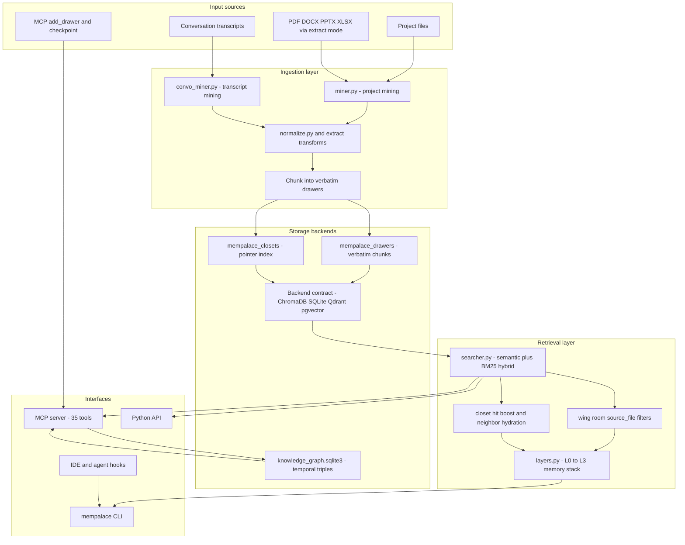
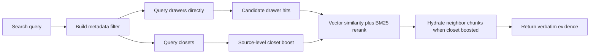

# MemPalace 코드 레벨 분석

> 분석 대상: [MemPalace/mempalace](https://github.com/MemPalace/mempalace)  
> 기준 커밋: `c00e8dc` (`develop`, 2026-07-06)  
> 패키지 버전: `3.5.0` (`pyproject.toml`)  
> 분석일: 2026-07-08  
> 로컬 소스: `.repos/mempalace/`  
> 방법: 공개 저장소 clone, 핵심 Python 모듈 추적, 공식 문서/벤치마크/정정 기록 확인

## 결론 요약

MemPalace의 가장 큰 차별점은 "LLM이 무엇을 기억할지 판단해서 요약/추출한 뒤 저장"하지 않고, **원문을 verbatim drawer로 보존한 뒤 로컬 임베딩 검색과 metadata scope로 찾아오는 구조**라는 점이다. Mem0, Cognee, Graphiti/Zep, Supermemory 계열이 대체로 `extract -> structure -> update memory` 쪽이라면, MemPalace는 `store raw -> index -> retrieve evidence` 쪽에 가깝다.

공간 은유인 `wing -> room -> hall -> closet -> drawer`는 제품 이해에는 유용하지만, 코드 레벨에서 핵심 검색 성능을 만드는 새로운 알고리즘은 아니다. 공식 문서와 프로젝트의 정정 기록도 현재는 이를 명확히 인정한다. `wing`과 `room`은 벡터 DB metadata filter이고, `closet`은 원문 drawer를 가리키는 짧은 pointer index다. 따라서 MemPalace를 평가할 때는 "기억 궁전"이라는 은유보다 **verbatim-first, local-first, deterministic write path, low wake-up cost, MCP/tooling integration**을 중심으로 보는 편이 정확하다.

## 다른 에이전트 메모리 OSS와 뭐가 다른가

| 축 | MemPalace | Mem0 | Cognee | Graphiti/Zep | Supermemory | agentmemory |
|---|---|---|---|---|---|---|
| 저장 철학 | 원문 chunk를 거의 그대로 저장 | 대화에서 fact/preference 추출 | 문서를 KG/벡터/관계형 구조로 변환 | temporal context graph의 entity/fact/episode | 중요한 fact/profile/memory를 추출 | hook observation을 LLM 압축 후 memory화 |
| write path | 핵심 경로는 LLM 불필요 | 보통 LLM 추출/업데이트 판단 필요 | LLM 기반 graph extraction 중심 | LLM 기반 episode to graph extraction 중심 | API/engine 내부 추출 중심 | LLM compression 중심 |
| 검색 단위 | drawer 원문 + closet pointer + metadata filter | memory item/fact | chunk, graph node/edge, completion | fact edge, node, episode, hybrid graph search | memory/profile/document | BM25 + vector + graph stream |
| 그래프 역할 | 선택적 SQLite KG, hallway/tunnel navigation | Graph memory 선택 | 핵심 구조 | 핵심 구조 | memory graph/product feature | 코드/파일/개념 graph |
| 운영 모델 | 로컬 우선, ChromaDB 기본 | OSS SDK + managed service | self-hosted KG 플랫폼 | Graphiti OSS core + Zep managed | app/API/MCP + local binary | 로컬 server/worker |
| 강한 사용처 | 개인/프로젝트/코딩 세션의 원문 회수 | 개인화 에이전트 memory API | 조직 지식/문서 KG | 시간성 있는 엔터프라이즈 context graph | 다양한 AI 도구 공통 memory | 코딩 에이전트 자동 관찰 memory |
| 약한 지점 | 원문 저장량, 의미 구조화 자동화 제한 | 추출 누락 시 원문 맥락 손실 | 파이프라인/인프라 무거움 | graph DB/LLM 의존도 높음 | 핵심 engine 공개 범위 제한 | LLM 압축 품질/비용 의존 |

한 줄로 정리하면, **MemPalace는 메모리 "정제 엔진"보다 검색 가능한 로컬 원문 아카이브에 가깝고, 다른 시스템들은 대체로 memory fact/graph/profile을 생성하는 context engineering 플랫폼에 가깝다.**

## 1. 프로젝트 개요

MemPalace는 LLM/에이전트가 세션이 바뀌거나 context compaction이 일어나도 과거 대화와 프로젝트 결정을 다시 찾을 수 있게 하는 로컬 장기 메모리 시스템이다. CLI, Python API, MCP server, coding-tool hook/plugin을 제공하며, 기본 저장소는 ChromaDB다. 최신 코드에는 `sqlite_exact`, `qdrant`, `pgvector` backend도 포함되어 있고 backend registry entry point로 외부 backend 확장이 가능하다.

### 해결하려는 문제

1. **세션 간 맥락 손실**: Claude Code, Codex, Cursor 같은 도구는 장기 대화/작업 맥락을 자동 보존하지 않거나 compaction 시 세부사항이 날아간다.
2. **요약/추출 기반 memory의 정보 손실**: "PostgreSQL을 선호한다" 같은 fact만 남기면 그 결정을 만든 trade-off, 반대안, 맥락을 잃는다.
3. **도구별 메모리 파편화**: 각 AI 도구의 내장 memory는 서로 공유되지 않는다.
4. **긴 컨텍스트 비용**: 전체 히스토리를 매번 prompt에 넣으면 비용과 latency가 커지고 retrieval focus가 약해진다.

## 2. 핵심 특징 및 차별점

### Verbatim-first storage

`mempalace/miner.py`의 docstring부터 "Stores verbatim chunks as drawers. No summaries. Ever."라고 못박는다. 실제 저장도 `_build_drawer_metadata()`가 `wing`, `room`, `source_file`, `chunk_index`, `filed_at`, `hall`, `entities` 같은 metadata를 붙인 뒤 `collection.upsert(documents=batch_docs, ids=batch_ids, metadatas=batch_metas)`로 원문 chunk를 저장한다.

이 접근의 장점은 기억 추출 단계에서 놓친 정보가 없어지는 문제를 피한다는 것이다. 반대로 원문을 그대로 저장하므로 storage가 커지고, 개인정보/민감정보를 외부 backend로 보내면 위험이 그대로 커진다.

### Local-first, zero-LLM core path

핵심 `mine -> embed -> search` 경로는 API key 없이 동작한다. 기본은 ChromaDB와 로컬 ONNX 임베딩이며, 신규 설치는 onboarding에서 `embeddinggemma-300m` ONNX를 권장한다. `minilm`도 유지된다. LLM rerank, LLM refine, document extraction 등은 선택적 확장이다.

### Palace hierarchy는 operational scope

공식 concept 문서의 현재 설명처럼 `wing`과 `room`은 query-time metadata filter다. `hall`은 관련 기억의 conceptual category, `tunnel`은 wing 간 navigation edge, `closet`은 drawer pointer index다. 독립 연구 논문도 MemPalace의 headline retrieval 성능은 spatial metaphor 자체보다 verbatim storage와 ChromaDB embedding baseline이 주된 원인이라고 평가한다.

### 4-layer memory stack

`mempalace/layers.py`는 `Layer0` identity file, `Layer1` essential story, `Layer2` wing/room filtered recall, `Layer3` full semantic search를 제공한다. 공식 문서는 typical wake-up을 L0+L1 기준 약 600-900 tokens로 설명한다. 이 구조는 긴 history 전체를 prompt에 넣지 않고 startup context를 bounded하게 유지하려는 설계다.

### MCP와 coding-agent hooks

`mempalace/mcp_server.py`는 35개 MCP tool을 `TOOLS` dict로 노출한다. read/write/search/drawer CRUD/KG/navigation/diary/hook settings/reconnect 계열을 포함한다. README와 changelog 기준으로 Claude Code, Codex, Cursor, Antigravity 등 coding-agent surface를 직접 겨냥한다.

## 3. 아키텍처 분석

### 전체 구조



### 데이터 모델

MemPalace의 기본 memory unit은 `drawer`다. drawer는 ChromaDB collection record로 저장되며, document에는 원문 chunk, metadata에는 palace location과 provenance가 들어간다.

| 필드 | 역할 |
|---|---|
| `wing` | 사람/프로젝트/주제 단위 top-level scope |
| `room` | wing 내부 topic/aspect |
| `source_file` | 원본 파일 또는 transcript path |
| `chunk_index` | source 내 chunk 순서 |
| `added_by` | miner, mcp, hook 등 작성 주체 |
| `filed_at` | 저장 시각 |
| `line_start`, `line_end` | virtual line locator |
| `content_date` | filename/frontmatter/content/mtime 기반 추출일 |
| `hall` | facts/events/discoveries/preferences/advice 등 conceptual category |
| `entities` | regex/known-system 기반 entity metadata |

`closet`은 원문이 아니라 pointer line이다. 예시는 `topic|entities|date:line-range|->drawer_id` 형태이며, `build_closet_lines()`가 source content 앞부분을 스캔해 topic/entity/quote를 추출한다. 검색 시 closet은 drawer를 대체하지 않고, drawer direct search의 ranking signal로 쓰인다.

### 검색 흐름



`searcher.py`에서 중요한 결정은 "drawer query is the floor"라는 주석이다. 즉 closet이 약하거나 없더라도 direct drawer search가 기본 경로로 항상 실행된다. 이후 closet hit가 같은 `source_file`에 있으면 rank-based boost를 부여하고, BM25를 섞어 lexical match를 살린다. `candidate_strategy="union"`을 쓰면 backend의 `lexical_search` 후보까지 합칠 수 있다.

### Knowledge graph와 navigation graph

`knowledge_graph.py`는 SQLite에 `entities`와 `triples` 테이블을 만든다. triple은 `subject`, `predicate`, `object`, `valid_from`, `valid_to`, `source_closet`, `source_file`, `source_drawer_id`를 가진다. `invalidate()`와 `kg_supersede` 계열 tool로 temporal validity를 다룰 수 있다.

다만 Graphiti/Zep처럼 모든 episode에서 자동으로 entity/fact graph를 구성하는 core pipeline과는 다르다. MemPalace의 KG는 MCP/CLI tool을 통한 fact add/query/invalidate 성격이 강하고, 자동 navigation은 `palace_graph.py`, `hallways.py`, `dynamics.py`의 room/entity co-occurrence, tunnel, decay/potentiation이 맡는다.

## 4. 기술 스택

| 영역 | 기술 |
|---|---|
| 언어/런타임 | Python 3.9+ |
| 패키징 | `pyproject.toml`, Hatchling, `uv`, `pipx` 권장 |
| 기본 vector backend | ChromaDB `>=1.5.4,<2` |
| 추가 backend | `sqlite_exact`, Qdrant REST, Postgres `pgvector` |
| 임베딩 | ChromaDB MiniLM compatible EF, `embeddinggemma-300m` ONNX, ONNX Runtime |
| 로컬 저장 | ChromaDB SQLite/HNSW, KG SQLite WAL |
| MCP | JSON-RPC over stdio 기본, opt-in HTTP transport |
| 문서 extraction | optional `markitdown`, `striprtf` |
| 다국어 | `huggingface_hub`, `tokenizers`, `numpy`, embeddinggemma path |
| 배포 | CLI, Docker, Docker Compose, plugin/hook packages |

## 5. 핵심 코드 분석

### Backend contract

`mempalace/backends/base.py`는 `BaseBackend`, `BaseCollection`, `PalaceRef`, `QueryResult`, `GetResult`를 정의한다. 기존 Chroma dict shape에서 typed result로 옮기는 중이며, `lexical_search`, `facet_counts`, `run_maintenance`, `effective_embedder_identity` 같은 optional capability가 있다.

`mempalace/backends/registry.py`는 `mempalace.backends` entry point group을 통해 backend를 발견한다. in-tree backend는 `chroma`, `qdrant`, `sqlite_exact`, `pgvector`다. 이 구조 덕분에 MemPalace는 ChromaDB project로만 묶이지 않고 storage substrate를 바꿀 수 있다.

### Miner

`mempalace/miner.py`는 project file ingest의 중심이다.

- `.gitignore`와 `SKIP_DIRS`/`SKIP_FILENAMES`를 반영해 corpus를 스캔한다.
- 텍스트 파일을 chunk로 나누고, 너무 큰 파일이나 chunk cap을 넘는 파일은 skip한다.
- 각 chunk를 deterministic drawer id로 저장한다.
- `source_file` 단위 lock으로 concurrent mine 중복/교차 쓰기를 막는다.
- source가 변경되면 기존 drawer와 closet을 purge 후 재삽입한다.
- `line_start`, `line_end`, `content_date`, `hall`, `entities` metadata를 만든다.

### Conversation miner

`mempalace/convo_miner.py`는 Claude Code, ChatGPT, Slack, plain text 등 transcript를 대상으로 한다. quote marker가 있으면 user turn과 AI response를 exchange pair로 묶고, 없으면 paragraph/line group fallback을 사용한다. 대화 memory에서는 "무슨 파일의 어느 chunk인가"보다 "어떤 exchange인가"가 중요하므로 project miner와 chunking 기준이 다르다.

### Searcher

`mempalace/searcher.py`는 MemPalace의 실질 retrieval engine이다.

- `_bm25_scores()`로 후보 set 내부 lexical discriminative signal을 계산한다.
- `_distance_to_similarity()`로 backend metric별 distance를 similarity로 바꾼다.
- `build_where_filter()`로 `wing`, `room`, `source_file` scope를 만든다.
- `search_memories()`는 drawer direct search를 baseline으로 실행하고 closet hit를 ranking boost로 추가한다.
- HNSW/vector path가 깨진 경우 ChromaDB SQLite FTS5/BM25 fallback 경로가 있다.

이 설계는 "공간 구조가 retrieval을 대신한다"가 아니라 "semantic search + lexical rerank + metadata scope + pointer boost"에 가깝다.

### Memory stack

`mempalace/layers.py`의 `MemoryStack`은 prompt budget 관점의 API다.

- `Layer0`: `~/.mempalace/identity.txt`의 self concept.
- `Layer1`: 중요도/최근성 기준 상위 drawer를 compact story로 구성.
- `Layer2`: wing/room filter 기반 on-demand recall.
- `Layer3`: full semantic search.

이 구조는 long-context brute force보다 실용적이다. 다만 `Layer1`의 quality는 metadata의 `importance`, `emotional_weight`, `weight` 존재 여부에 영향을 받는다. 일반 file mine만으로 항상 정교한 story가 생기는 것은 아니다.

### MCP server

`mempalace/mcp_server.py`는 read/write/KG/navigation/diary/hook tool을 모두 노출한다. 특징적인 tool은 다음과 같다.

| Tool | 역할 |
|---|---|
| `mempalace_search` | semantic search, wing/room/source_file/max_distance |
| `mempalace_add_drawer` | 원문 content를 drawer로 저장 |
| `mempalace_checkpoint` | 여러 drawer 저장과 diary write를 한 번에 처리 |
| `mempalace_mine` | CLI mine을 MCP tool로 실행 |
| `mempalace_get_drawer` | drawer id로 원문과 metadata 조회 |
| `mempalace_kg_add/query/invalidate/supersede` | temporal KG fact 관리 |
| `mempalace_traverse/find_tunnels/follow_tunnels` | palace graph navigation |
| `mempalace_diary_write/read` | agent별 diary |

MCP stdio 보호 코드도 눈에 띈다. stdout은 JSON-RPC만 흘러야 하므로 heavy import 전에 stdout을 stderr로 돌리고, 실제 protocol loop에서 복원한다. ChromaDB/ONNXRuntime 같은 dependency가 stdout에 banner를 뿌려 MCP framing을 깨는 문제를 방지하기 위한 조치다.

## 6. API 및 인터페이스

### CLI

README 기준 기본 흐름은 다음과 같다.

```bash
uv tool install mempalace
mempalace init ~/projects/myapp
mempalace mine ~/projects/myapp
mempalace search "why did we switch to GraphQL"
mempalace wake-up
```

`mempalace mine --mode convos`, `--mode extract`, `--backend qdrant`, `--backend pgvector` 같은 확장이 존재한다.

### Python API

`MemoryStack`이 가장 간단한 read API다.

```python
from mempalace.layers import MemoryStack

stack = MemoryStack()
startup_context = stack.wake_up()
auth_context = stack.recall(wing="myapp", room="auth")
deep_hits = stack.search("pricing change")
```

### MCP

MCP는 MemPalace가 coding agent ecosystem에 들어가는 핵심 surface다. Claude Code/Codex/Cursor 같은 도구가 `mempalace_search`, `mempalace_checkpoint`, `mempalace_mine` 등을 호출해 session memory를 읽고 쓸 수 있다.

## 7. 확장성 및 플러그인

### Storage backend

backend contract는 비교적 잘 분리되어 있다. `BaseCollection`은 `add`, `upsert`, `query`, `get`, `delete`, `count`를 필수로 요구하고, optional capability로 lexical search와 maintenance를 둔다. backend별 artifact detection과 mismatch guard도 있어 같은 palace directory에 여러 backend artifact가 섞이는 위험을 막는다.

### Source adapter

`pyproject.toml`에는 `mempalace.sources` entry point group이 있지만, 코어가 아직 first-party adapter를 등록하지는 않는다. 주석상 `miner.py`와 `convo_miner.py`가 `BaseSourceAdapter`로 이동하는 후속 PR을 염두에 둔 구조다. 현재는 project/convo/extract mode가 in-tree 구현이다.

### MCP/tool/plugin surface

`.codex-plugin`, `.claude-plugin`, `.cursor-plugin`, `.antigravity-plugin`, hook scripts가 repo에 포함되어 있다. 즉 단순 library가 아니라 coding-agent runtime에 바로 붙이기 위한 distribution artifact까지 제공한다.

## 8. 성능 특성

공식 README와 benchmark 문서는 다음 수치를 제시한다.

| Benchmark | Mode | Metric | Score | 비고 |
|---|---|---|---|---|
| LongMemEval | raw semantic search | R@5 retrieval recall | 96.6% | LLM 없음 |
| LongMemEval | hybrid v4 held-out | R@5 retrieval recall | 98.4% | 50 dev tuning, 450 held-out |
| LongMemEval | hybrid v4 + LLM rerank | R@5 | 99% 이상 | public headline에서 100% claim은 내림 |
| LoCoMo | raw session top-10 | R@10 | 60.3% | LLM 없음 |
| LoCoMo | hybrid v5 top-10 | R@10 | 88.9% | LLM 없음 |
| ConvoMem | all categories | avg recall | 92.9% | category별 50 |
| MemBench | all categories | R@5 | 80.3% | 8,500 items |

중요한 caveat가 있다. MemPalace 프로젝트는 2026-04-14 정정 기록에서 **retrieval recall과 end-to-end QA accuracy를 같은 표에 넣는 것은 category error**라고 명시했다. 따라서 Mem0, Mastra, Supermemory, Zep의 published QA accuracy와 MemPalace의 R@5 retrieval recall을 숫자만 놓고 직접 비교하면 안 된다.

엔지니어 관점에서 더 중요한 성능 특성은 다음이다.

- write path가 deterministic하고 LLM을 부르지 않아 비용과 latency가 작다.
- raw text를 저장하므로 extraction miss가 없지만 index/storage는 커진다.
- ChromaDB/HNSW corruption, stale segment, backend lock 문제가 실제 운영 이슈로 많이 다뤄졌고 repair/fallback 코드가 누적되어 있다.
- 신규 multilingual path는 300MB급 ONNX model lazy download가 있어 첫 사용 latency와 disk footprint가 있다.
- external backend를 쓰면 verbatim drawer text가 그대로 외부 store에 저장된다.

## 9. 배포 및 운영

### 설치

- 권장: `uv tool install mempalace`
- 대안: `pipx install mempalace`
- library import가 필요하면 virtualenv 안에서 `pip install mempalace`
- Docker로 MCP server/CLI 실행 가능

### 저장 위치

기본 palace는 `~/.mempalace/palace` 계열 config를 사용한다. KG는 SQLite 파일이며, ChromaDB는 palace directory 아래 `chroma.sqlite3`와 HNSW segment를 둔다. Qdrant/pgvector를 선택하면 marker file을 써서 잘못된 server/namespace를 열지 않도록 guard한다.

### 운영 리스크

- 원문 저장 방식이므로 data minimization이 약하다. 외부 backend와 backup 정책을 신중히 다뤄야 한다.
- 여러 writer가 같은 palace를 동시에 쓰면 HNSW/SQLite handle 문제가 생길 수 있어 daemon, lock, peer writer refusal 코드가 중요하다.
- embedding model을 바꾸면 vector space가 달라져 re-embed/repair가 필요하다.
- hook 기반 autosave는 host tool의 transcript format 변화에 취약하다.

## 10. 경쟁 및 비교 분석

### Mem0와 비교

Mem0는 memory layer API로 user/session/agent memory를 관리하고, 대화에서 fact를 추출해 ADD/UPDATE/DELETE/NONE 판단을 내리는 방향이다. Graph memory와 hybrid search도 제공한다. MemPalace와의 핵심 차이는 write-time LLM extraction 여부다.

- Mem0가 강한 곳: product personalization, managed API, memory lifecycle operation, token 절감.
- MemPalace가 강한 곳: 원문 증거 보존, offline/local-first, API key 없는 baseline, source-visible CLI/MCP engine.
- 선택 기준: "사용자 선호/fact를 정제해 앱에 주입"이면 Mem0, "세션/프로젝트 원문을 나중에 정확히 회수"가 목적이면 MemPalace.

### Cognee와 비교

Cognee는 ECL(Extract, Cognify, Load) pipeline으로 문서/데이터를 self-hosted knowledge graph와 vector index로 바꾸는 AI memory platform이다. 데이터 소스 다양성, ontology, graph reasoning, multimodal/enterprise knowledge 쪽이 강하다.

- Cognee가 강한 곳: 조직 지식 graph, ontology-grounded retrieval, pipeline customization.
- MemPalace가 강한 곳: 가벼운 개인/프로젝트 memory, coding-agent transcript 보존, zero-LLM baseline.
- 선택 기준: "문서를 지식 그래프로 구조화"하려면 Cognee, "대화와 작업 원문을 잃지 않기"라면 MemPalace.

### Graphiti/Zep와 비교

Graphiti는 temporal context graph engine이다. entity, fact edge, episode provenance, validity window, ontology, graph DB backend가 중심이다. Zep는 이를 production managed context infrastructure로 제공한다.

- Graphiti/Zep가 강한 곳: 시간에 따라 바뀌는 사실, contradiction/invalidation, historical query, enterprise scale.
- MemPalace가 강한 곳: single-user/local storage, raw evidence, low setup, MCP tool count와 coding-agent integration.
- 선택 기준: "정확한 temporal fact graph"가 목적이면 Graphiti/Zep, "로컬 원문 memory와 검색"이면 MemPalace.

### Supermemory와 비교

Supermemory는 app, browser extension, MCP, SDK, hosted/local binary를 통해 여러 AI 도구에 공통 memory를 제공한다. 공개 repo는 integration layer와 API contract가 강하고, 핵심 hosted engine의 상세 구현은 완전히 열려 있지 않은 부분이 있다.

- Supermemory가 강한 곳: 사용자 앱 경험, hosted API, profile/search/context tool, 다양한 AI tool에 memory를 쉽게 연결.
- MemPalace가 강한 곳: core engine 코드 가시성, 원문 저장/검색 경로, 로컬 파일 mining.
- 선택 기준: "설치해서 여러 assistant에 memory를 붙이기"면 Supermemory, "로컬에서 내부 동작을 보고 조정하기"면 MemPalace.

### agentmemory와 비교

agentmemory는 코딩 에이전트 hook을 중심으로 raw observation을 자동 캡처하고, LLM 압축과 BM25/vector/graph hybrid search를 수행한다. 코딩 에이전트 관찰에는 MemPalace보다 더 공격적인 lifecycle capture와 multi-agent server 모델을 가진다.

- agentmemory가 강한 곳: hook 자동 관찰, coding-specific memory lifecycle, graph/BM25/vector fusion, REST/stream/viewer.
- MemPalace가 강한 곳: 단순한 원문 보존, API key 없는 write path, ChromaDB 기반 쉬운 로컬 시작.
- 선택 기준: "코딩 에이전트 활동을 자동 관찰/압축"하려면 agentmemory, "대화와 프로젝트 텍스트를 원문 그대로 저장"하려면 MemPalace.

## 11. 종합 평가

### 강점

- **원문 증거를 버리지 않는다.** extraction memory가 놓치는 주변 맥락을 보존한다.
- **로컬 우선이다.** core path는 API key가 필요 없고, 외부 전송은 backend 선택으로 명시된다.
- **MCP/tooling이 실전적이다.** Claude/Codex/Cursor류 coding workflow를 직접 겨냥한다.
- **backend seam이 있다.** ChromaDB lock/HNSW 문제를 겪으면서도 Chroma 종속을 줄이는 방향으로 진화했다.
- **정정 기록이 솔직하다.** benchmark 과장, metric mismatch, "palace boost" 오해를 공식적으로 내렸다.

### 약점과 리스크

- **공간 은유가 성능 moat는 아니다.** wing/room은 metadata filter이고, retrieval 품질은 임베딩, BM25, raw storage, 후보 전략이 좌우한다.
- **원문 저장은 privacy와 storage 비용을 키운다.** 외부 backend 사용 시 verbatim text가 그대로 나간다.
- **KG는 Graphiti급 자동 graph engine이 아니다.** temporal triple tool은 유용하지만, 모든 ingest를 자동 fact graph로 바꾸는 architecture는 아니다.
- **closet extraction은 heuristic이다.** regex/entity frequency 기반 pointer index라 복잡한 narrative나 긴 파일 후반부를 놓칠 수 있다.
- **ChromaDB 운영 이슈의 흔적이 많다.** repair/fallback이 풍부하다는 것은 실전 hardening이기도 하지만, 동시에 local vector DB 운영의 복잡성을 보여준다.

### 적합한 사용 사례

- Claude Code/Codex/Cursor 작업 세션을 장기적으로 보존하고 검색하고 싶을 때
- 프로젝트별 의사결정, 버그 해결 과정, 설계 trade-off 원문을 다시 찾아야 할 때
- managed memory API보다 local-first/open-source engine을 선호할 때
- "요약된 fact"보다 "당시 대화/문서의 실제 문장"이 중요한 경우

### 부적합한 사용 사례

- 대규모 multi-tenant enterprise memory platform
- 자동 ontology/knowledge graph construction이 핵심인 서비스
- 개인정보를 최소화해 정제된 profile memory만 저장해야 하는 제품
- end-to-end QA accuracy benchmark를 바로 최적화해야 하는 RAG service

## 참고 소스

- GitHub: [MemPalace/mempalace](https://github.com/MemPalace/mempalace)
- 공식 문서: [The Palace](https://mempalaceofficial.com/concepts/the-palace.html), [Memory Stack](https://mempalaceofficial.com/concepts/memory-stack.html), [MCP Tools](https://mempalaceofficial.com/reference/mcp-tools.html)
- 독립 분석 논문: [Spatial Metaphors for LLM Memory: A Critical Analysis of the MemPalace Architecture](https://arxiv.org/abs/2604.21284)
- 비교 대상: [mem0ai/mem0](https://github.com/mem0ai/mem0), [topoteretes/cognee](https://github.com/topoteretes/cognee), [getzep/graphiti](https://github.com/getzep/graphiti), [supermemoryai/supermemory](https://github.com/supermemoryai/supermemory), [rohitg00/agentmemory](https://github.com/rohitg00/agentmemory)
