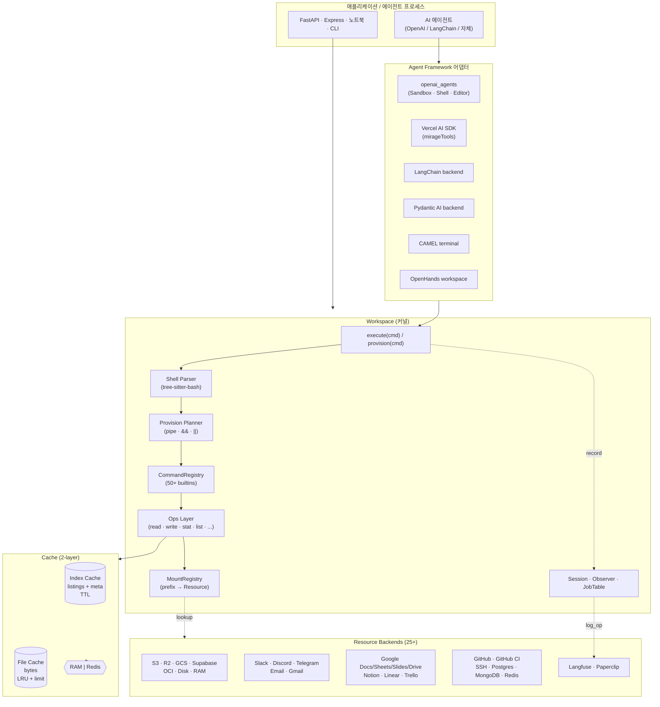
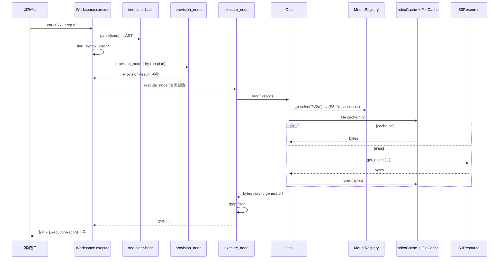
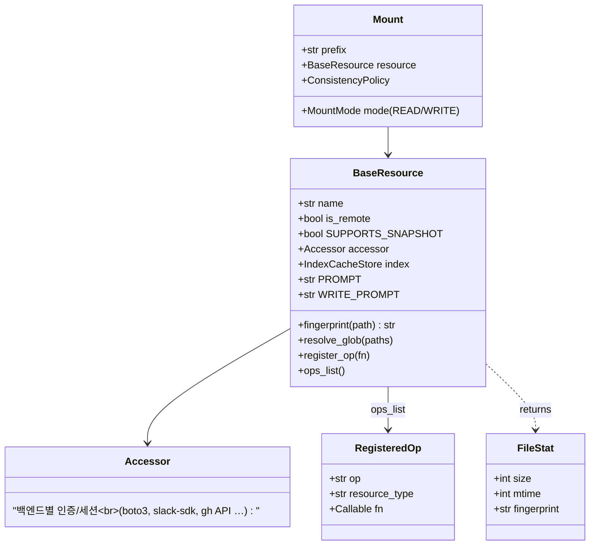
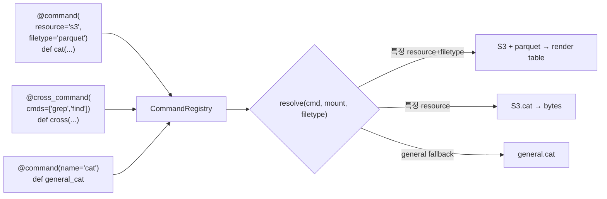
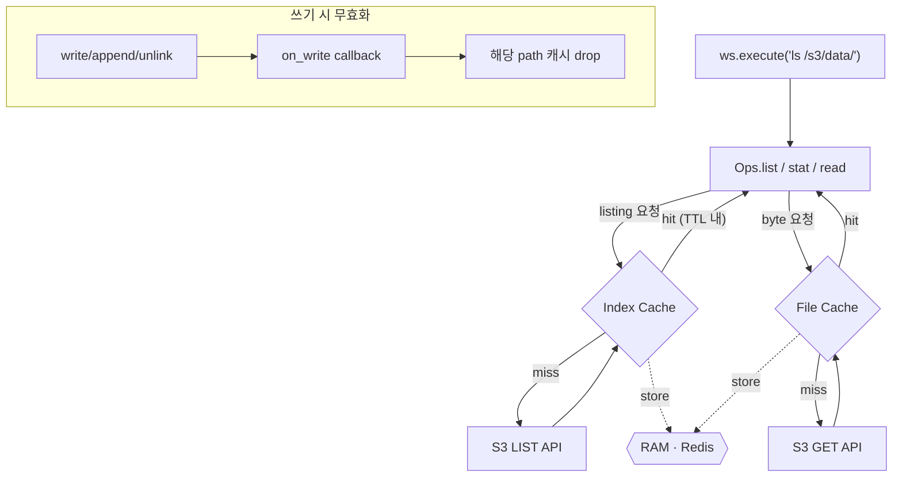
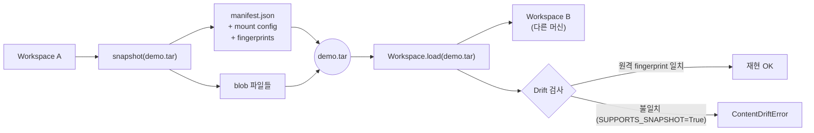
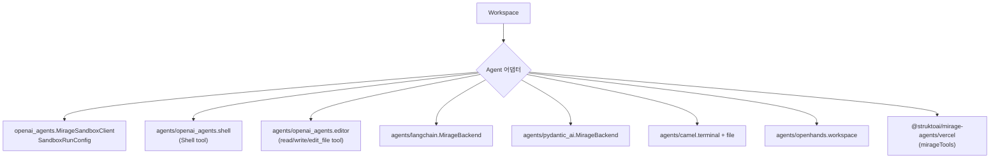
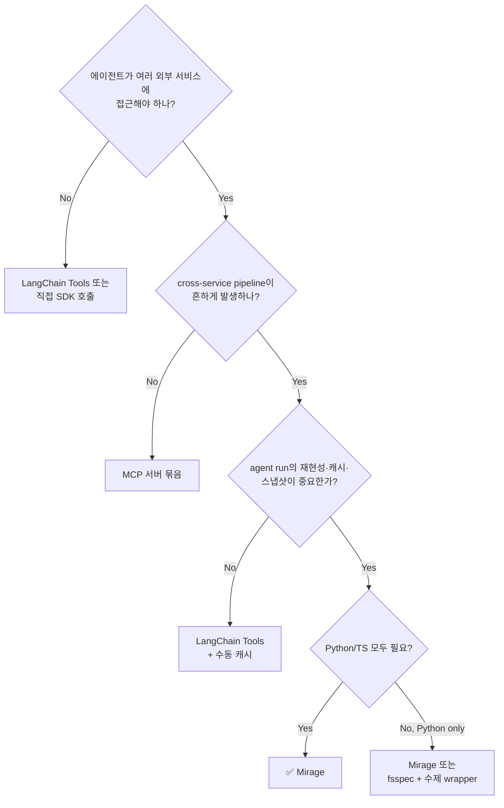

# Mirage — AI 에이전트를 위한 통합 가상 파일시스템 (Strukto.AI)

> **분석 대상**: [github.com/strukto-ai/mirage](https://github.com/strukto-ai/mirage) v0.0.2-alpha (2026-05-06 공개)
> **저자**: Zecheng Zhang (`zecheng@strukto.ai`), Strukto.AI
> **라이선스**: Apache-2.0
> **언어**: Python 3.12+ / TypeScript 모노레포 (`mirage-ai` on PyPI, `@struktoai/mirage-*` on npm)
> **공식 문서**: [docs.mirage.strukto.ai](https://docs.mirage.strukto.ai)
> **참고**: AgentCrunch 기사, OSSInsight 통계, 로컬 클론 `_repos/mirage/`

---

## 1. 프로젝트 개요

**Mirage** 는 S3·Slack·GitHub·Gmail·Postgres·SSH 등 25+ 이종 백엔드를 **하나의 가상 파일트리**로 마운트해, AI 에이전트가 *bash 같은 셸 명령*만으로 모든 서비스를 read/write/pipe 할 수 있게 하는 라이브러리다. Python·TypeScript SDK가 같은 추상을 제공하고, FUSE는 *선택적*이며 기본은 **in-process 가상 파일시스템(VFS)** 으로 동작한다.

### 해결하려는 문제

현재 AI 에이전트가 외부 서비스에 접근하는 일반적 방식은 **N개의 SDK + M개의 MCP 서버**다. 이로 인해:

- 각 서비스마다 *다른* 도구 이름·인자·반환 형식 → LLM이 도구 카탈로그를 매번 학습
- 서비스 간 파이프라인(예: "Slack에서 키워드 찾아 → S3 로그와 cross-reference → Notion에 기록")은 *수동 stitching* 필요
- 로컬 파일·캐시·재현성 부재 — 결과를 재실행하려면 모든 API 호출을 다시 함
- MCP 도구별 prompt overhead → 컨텍스트 윈도우 낭비

Mirage의 가설은 **"LLM이 가장 잘 아는 도구 = bash + Unix coreutils"** 이므로, 모든 백엔드를 `/s3/`, `/slack/`, `/github/` 같은 마운트 포인트로 노출하면 *제로 학습 곡선*으로 멀티 백엔드 워크플로우가 된다.

### 핵심 디자인 결정

1. **마운트 = SDK가 아님**: 실제 FUSE 마운트가 아니라 *프로세스 내* 가상 트리. agent runtime이 `ws.execute("ls /s3/data/")`를 호출하면 in-process로 라우팅됨
2. **bash 파서로 tree-sitter-bash 사용**: `/bin/bash` 서브프로세스 X. AST 기반 in-process 인터프리터
3. **Async-native**: 모든 I/O가 `aiofiles`/`aioboto3`/`redis.asyncio` 기반, 파이프라인이 async generator
4. **2-layer 캐시 기본 탑재**: 모든 Workspace에 RAM 캐시(512MB) + 10분 TTL 인덱스 캐시
5. **포터블 워크스페이스**: `ws.snapshot("demo.tar")` → tar로 복제·이동·재현 가능 (fingerprint 기반 drift 검출 포함)

---

## 2. 핵심 특징 및 차별점

| 차원 | Mirage의 선택 | 일반적인 대안 |
|---|---|---|
| 인터페이스 추상화 | **파일시스템 + bash** | SDK / MCP 툴 카탈로그 |
| 실행 위치 | **In-process VFS** (선택적 FUSE) | 별도 데몬·컨테이너 |
| 캐싱 | **2-layer (RAM + Redis 옵션)** 기본 탑재 | 보통 부재, 수동 구현 |
| 재현성 | **Snapshot tar + drift 검사** | 보통 부재 |
| 에이전트 통합 | **6개 프레임워크 어댑터 동봉** | 사용자가 직접 작성 |
| 멀티 백엔드 파이프 | `cat /s3/x \| grep y \| tee /github/issue.md` | 다중 API 호출 수동 조립 |
| 파일 포맷 인지 | Parquet/PDF/CSV 등 **filetype별 cat 오버라이드** | 보통 raw bytes |

### 결정적 차별점

- **MCP vs Mirage**: MCP는 각 서비스가 *자기만의 도구*를 노출하지만, Mirage는 *모든 서비스를 같은 도구*(cat·grep·ls·find·cp·mv·wc·jq·...)로 묶는다. LLM은 cross-service pipeline을 한 명령으로 표현할 수 있다.
- **LangChain Tools vs Mirage**: LangChain의 tool 추상은 결국 N개의 함수다. Mirage는 *하나의 파일시스템*으로 같은 일을 한다.
- **FUSE-only VFS (sshfs·s3fs·rclone mount)와의 차이**: Mirage는 **에이전트가 호출하는 in-process 코드**가 1차 인터페이스이고, FUSE는 *부가 기능*이다. 즉 OS 마운트 권한·드라이버 의존이 없다.

---

## 3. 아키텍처 분석

### 3.1 전체 시스템 구조



### 3.2 명령 실행 흐름 — `ws.execute("cat /s3/x | grep y")`



### 3.3 Resource 추상 모델

각 백엔드는 `BaseResource`를 상속하고 op들을 데코레이터로 등록한다.



`Ops`가 `_resolve(path)`로 mount prefix를 매칭(긴 prefix 우선 정렬)해 적절한 Resource로 dispatch한다. `assert_mount_allowed`로 세션별 mount 제한도 강제 가능.

### 3.4 명령 등록 & 디스패치



이 다단계 디스패치 덕에 `cat /s3/events/2026-05-06.parquet | jq .user` 같은 *백엔드+포맷 인지* 명령이 자연스럽게 동작한다.

### 3.5 캐시 계층



- **RAM 캐시**: 단일 프로세스, zero-config, 기본 512MB
- **Redis 캐시**: 멀티 워커·서버리스에서 공유. `RedisFileCacheStore`, `RedisIndexCacheStore`
- **쓰기 무효화**: `on_write` 콜백으로 일관성 유지 (`ConsistencyPolicy.LAZY` 기본, `STRICT`도 가능)

### 3.6 Snapshot / Drift



`SUPPORTS_SNAPSHOT=True` Resource(예: ETag/commit SHA를 제공하는 백엔드)는 *replay 시 drift 검출*까지 한다. 그렇지 않은 Resource(예: Slack 메시지처럼 timestamp 외 안정 fingerprint가 어려운 것)는 live-only로 다룬다.

---

## 4. 기술 스택

### Python (`mirage-ai`)

| 영역 | 의존성 |
|---|---|
| 런타임 | Python ≥ **3.12**, asyncio 기반 |
| Shell 파싱 | `tree-sitter` + `tree-sitter-bash` |
| HTTP | `httpx`, `aiohttp` |
| 파일 I/O | `aiofiles` |
| CLI | `typer` |
| 서버 | `fastapi`, `uvicorn[standard]` (mirage daemon) |
| FUSE | `mfusepy` (선택) |
| 데이터 변환 | `orjson`, `pyyaml`, `numpy`, `jq` |
| PDF/Image | `pypdfium2`, `pillow` |
| Auth | `pyjwt[crypto]` |

**옵션 extras (모든 백엔드 별도 설치)**:
- 스토리지: `aioboto3` (S3/R2/GCS/OCI)
- SSH: `asyncssh`, `paramiko`
- MongoDB: `motor`
- Postgres: `asyncpg`
- Redis: `redis[hiredis]`
- Email: `aioimaplib`, `aiosmtplib`
- Parquet: `pandas`, `pyarrow`
- Audio: `av`, `sherpa-onnx`, `tinytag`

**Agent extras**: `anthropic`, `openai`(+`openai-agents`), `pydantic-ai-slim`, `langfuse`

> **주의**: `camel` extra는 `openai`와 충돌 — `uv sync --all-extras --no-extra camel` 사용 (CLAUDE.md 명시).

### TypeScript (`@struktoai/mirage-*`)

Node ≥ 20. 모노레포 구조:

| 패키지 | 용도 |
|---|---|
| `mirage-core` | 런타임 무관 primitives |
| `mirage-node` | Node 서버/CLI 용 |
| `mirage-browser` | 브라우저/에지 런타임 |
| `mirage-cli` | 글로벌 `mirage` CLI |
| `mirage-server` | 데몬 서버 |
| `mirage-agents` | 프레임워크 어댑터 (Vercel AI SDK, OpenAI, …) |

---

## 5. 핵심 코드 분석

### 5.1 디렉터리 구조 (`python/mirage/`)

```
mirage/
├── workspace/              # 커널: Workspace, Runner, Session, History
│   ├── workspace.py        # ★ 메인 클래스 (마운트 · 캐시 · execute)
│   ├── runner.py           # WorkspaceRunner: 자체 스레드+loop로 격리
│   ├── provision/          # 명령 dry-run/계획 (pipe · &&/|| · redirect)
│   ├── snapshot/           # tar I/O + manifest + drift
│   ├── mount/              # MountRegistry, Mount
│   ├── session/            # 세션·에이전트 추적
│   └── fuse.py             # FUSE 매니저 (선택)
├── shell/                  # ★ tree-sitter-bash 파서 + barrier + job_table
├── resource/               # 25+ 백엔드 (S3·Slack·GH·...)
│   ├── base.py             # BaseResource
│   ├── registry.py         # 등록·로딩
│   ├── filetype.py         # 확장자→타입 매핑
│   └── <backend>/          # 각 백엔드 구현
├── accessor/               # 백엔드별 클라이언트/세션 추상
├── core/                   # 백엔드별 저수준 (S3 SDK 래핑 등)
├── commands/               # ★ 50+ 빌트인 명령
│   ├── registry.py
│   ├── resolve.py          # (cmd, resource, filetype) → 함수
│   └── builtin/            # cat·grep·find·jq·cp·mv·...
├── ops/                    # ★ Op 디스패치 (read · write · stat · list)
│   ├── ops.py
│   ├── registry.py
│   └── <backend>/          # 백엔드별 ops
├── cache/
│   ├── file/               # RAM/Redis File cache
│   └── index/              # RAM/Redis Index cache
├── io/                     # IOResult, 스트리밍
├── observe/                # OpRecord, Observer, /.sessions 로그
├── agents/                 # ★ 프레임워크 어댑터
│   ├── openai_agents/      # Sandbox · Shell · Editor · Runner
│   ├── langchain/          # backend · converter · prompt
│   ├── pydantic_ai/
│   ├── camel/              # terminal · file (camel/openai 충돌!)
│   └── openhands/          # workspace · terminal
├── bridge/                 # MCP 등 외부 프로토콜 브리지
├── runtime/                # session context, mount guard
├── server/                 # FastAPI 기반 daemon
├── cli/                    # typer 기반 CLI
├── provision/              # ProvisionResult 타입
├── vfp/                    # Virtual File Protocol (?)
└── utils/
```

### 5.2 핵심 패턴 — Workspace 한 줄로 다 끝

```python
ws = Workspace({
    "/data":  RAMResource(),
    "/s3":    S3Resource(S3Config(bucket="my-bucket")),
    "/slack": SlackResource(SlackConfig()),
    "/docs":  GDocsResource(GDocsConfig()),
})
await ws.execute("cp /s3/report.csv /data/report.csv")
```

내부적으로:

1. `MountRegistry`에 `(prefix → Resource)` 등록 (긴 prefix 우선 정렬)
2. `RAMFileCacheStore`(또는 Redis) 단일 인스턴스가 모든 마운트 캐시
3. `Ops(self._registry.ops_mounts(), on_write=invalidate)` 가 op 디스패치 테이블 구축
4. `JobTable` (백그라운드 잡), `BarrierPolicy` (동시성 가드), `Observer` (감사 로깅) 셋업
5. `execute(cmd)` → tree-sitter 파싱 → provision 계획 → execute_node 실행

### 5.3 `WorkspaceRunner` — 외부 이벤트 루프와의 격리

`workspace/runner.py`는 흥미로운 패턴이다: 호스트 앱(FastAPI 등)이 이미 자신의 asyncio loop를 갖고 있을 때, Workspace에 *자체 스레드+자체 loop*를 부여한다.

```python
runner = WorkspaceRunner(ws)
result = await runner.call(runner.ws.execute("ls /"))  # 다른 loop에서 안전
```

→ 슬로우/블로킹 호출이 호스트 loop를 멈추게 하지 않고, 같은 프로세스에 여러 Workspace를 둬도 서로 간섭하지 않는다.

### 5.4 Shell 파서 — *진짜 bash가 아님*

`shell/parse.py`는 `tree-sitter-bash` AST만 만든다. `_BASH_KEYWORDS`, `_STRUCTURAL_TOKENS` 화이트리스트로 *실제 구조적 오류*만 잡고, `; & |` 같은 단독 separator는 무시 → bash 너그러움을 흉내낸다.

지원하는 것:
- 파이프 `|`, 연결자 `&&`/`||`
- 리다이렉트 `>`, `>>`, `<`
- 글롭 `*`, `?`, `[...]`
- 변수 확장 (제한적)
- 백그라운드 `&` (JobTable 통해)

지원 안 하는 것:
- 함수 정의, `for/while/case` 등 제어 흐름 (구문은 인식하지만 실행은 제한)
- subshell `( ... )` 깊이
- 환경 변수 완전 호환

> 이는 "LLM이 친숙한 일부 bash"만 골라 안전하게 실행한다는 의도적 트레이드오프다.

### 5.5 캐시 — `RAMFileCacheStore` & `RAMIndexCacheStore`

- **FileCache**: LRU + `cache_limit`(기본 `512MB`). `max_drain_bytes`로 한 번에 드레인할 양 제한
- **IndexCache**: TTL 기반(기본 10분). 디렉터리 listing/stat 결과 저장
- **Redis 변형**: `key_prefix`로 네임스페이스, `8GB` 등 byte string limit 가능
- **무효화**: `on_write_by_path` 콜백이 쓰기 op마다 호출됨

### 5.6 Snapshot — Resource 종류별 다른 의미

`SUPPORTS_SNAPSHOT` 클래스 변수가 *fingerprint 안정성* 신호다:

| Resource | SUPPORTS_SNAPSHOT | 이유 |
|---|---|---|
| Disk, RAM, Git(commit) | True | 안정적 hash/SHA |
| S3, R2, GCS | True | ETag |
| Slack, Discord, Telegram | False | 메시지 mutate 가능, fingerprint 불안정 |
| Postgres, MongoDB | (구현별) | rev/timestamp 가능 시 True |

False인 Resource는 snapshot에는 들어가지만 *load 시 live-only*로 다뤄진다.

### 5.7 Agent 어댑터 — 동일 Workspace를 6개 프레임워크에 노출



전형적 구조는 두 종류:
1. **Sandbox/Terminal**: 임의 bash 명령을 실행하게 해주는 단일 tool
2. **개별 tool 세트**: `read_file`/`write_file`/`edit_file`/`list_files`/`execute` 같은 분리된 tool 묶음

`agents/prompts.py`의 `MIRAGE_SYSTEM_PROMPT`가 *LLM에게 Mirage의 능력을 설명하는 텍스트*를 제공한다 — "cat on .parquet returns formatted table", "grep works natively on CSV/JSON/Parquet" 등 *모델이 행동을 바꾸도록 유도하는 힌트*가 들어 있다.

---

## 6. 주요 컴포넌트 정리

| 컴포넌트 | 책임 | 위치 |
|---|---|---|
| **Workspace** | 마운트·캐시·execute의 주요 진입점 | `workspace/workspace.py` |
| **MountRegistry** | prefix → Resource 매핑, 정렬 | `workspace/mount/` |
| **Resource** | 백엔드 추상; `read/write/stat/list` 등 op 노출 | `resource/<backend>/` |
| **Accessor** | 백엔드 인증/세션 (boto3 client 등) | `accessor/` |
| **Ops** | path → mount → op 디스패치, 캐시 통합 | `ops/ops.py` |
| **CommandRegistry** | (cmd, resource, filetype) → 함수 해석 | `commands/registry.py` |
| **Builtin commands** | cat·grep·ls·find·cp·mv·wc·jq·... 50+ | `commands/builtin/` |
| **Shell parser** | tree-sitter-bash AST + syntax error 탐지 | `shell/parse.py` |
| **Provision planner** | dry-run 계획 (pipe/connection/redirect) | `workspace/provision/` |
| **Cache (Index/File)** | listing TTL 캐시 + bytes LRU 캐시 | `cache/` |
| **Snapshot/Drift** | tar I/O + fingerprint 기반 drift 검출 | `workspace/snapshot/` |
| **Observer** | `/.sessions` 마운트에 op 로그 기록 | `observe/` |
| **JobTable** | 백그라운드 잡 (`&`), 동시성 추적 | `shell/job_table.py` |
| **WorkspaceRunner** | 자체 스레드/loop로 워크스페이스 격리 | `workspace/runner.py` |
| **FuseManager** | FUSE 마운트 활성화 (선택) | `workspace/fuse.py` |
| **CLI (`mirage`)** | typer 기반, workspace/execute/snapshot/load | `cli/` |
| **Server (daemon)** | FastAPI 기반 HTTP daemon | `server/` |
| **Agent adapters** | OpenAI/LangChain/Pydantic/CAMEL/OpenHands/Vercel | `agents/` |

---

## 7. 장점

### 7.1 인터페이스 측면
1. **단일 abstraction → 컨텍스트 절약** — N×M개 tool 정의 대신 *마운트 트리* 하나만 LLM에 설명
2. **LLM의 사전지식 재사용** — bash·Unix coreutils는 모든 모델이 가장 많이 학습한 영역
3. **cross-service pipeline 자연스러움** — `grep alert /slack/*.json /github/issues/*.md | tee /linear/triage.md` 한 줄
4. **포맷 인지 명령** — Parquet/PDF/CSV에 *raw bytes 대신 의미 있는 출력*을 reverse-mapping

### 7.2 운영 측면
5. **2-layer 캐시 무료** — 반복 호출이 자동으로 빨라짐; Redis로 공유도 trivial
6. **Snapshot/Replay로 재현성** — agent run 결과를 tar로 저장하고 다른 머신에서 똑같이 재생
7. **In-process 기본** — FUSE 권한, OS 마운트 드라이버, 컨테이너 없이 즉시 사용
8. **WorkspaceRunner 격리** — 호스트 앱 loop와 분리되어 슬로우 호출이 메인 서비스를 멈추지 않음
9. **세션·Observer로 감사** — 모든 op이 `OpRecord`로 기록, `/.sessions` 마운트로 *자기 로그를 자기가 읽음* 가능

### 7.3 생태계 측면
10. **6개 에이전트 프레임워크 어댑터 동봉** — OpenAI Agents/LangChain/Pydantic AI/CAMEL/OpenHands/Vercel AI SDK
11. **Python + TypeScript 동시 지원** — 백엔드(FastAPI), 노드, 브라우저, CLI 모두 커버
12. **25+ 백엔드 표준화** — S3·GCS·R2·OCI/Slack·Discord·Telegram/GH·Linear·Notion/Google Workspace 전부
13. **Apache-2.0** — 상용 채택 부담 없음

---

## 8. 단점 / 리스크

### 8.1 성숙도
1. **0.0.2-alpha** — production-readiness 미보증, breaking change 잦을 가능성. CLAUDE.md에 *"No need to consider backward compatibility"* 명시
2. **공개된 지 ~2주 (2026-05-06)** — 운영 사례·트러블슈팅 자료 부족
3. **단일 회사(Strukto.AI) 주도** — 메인테이너 수, 거버넌스 모델 불투명

### 8.2 기술적
4. **bash subset만 지원** — 함수·복잡한 제어흐름·subshell·환경변수 풀 호환 X. 에이전트가 *실제 bash인 줄 알고* 작성한 스크립트가 일부 실패할 수 있음
5. **camel/openai extras 충돌** — `uv sync --all-extras` 그대로 안 됨, `--no-extra camel` 필요
6. **무거운 의존성** — 모든 백엔드를 켜면 boto3, asyncpg, motor, paramiko, pyarrow, pypdfium2, av, sherpa-onnx까지 깔림
7. **Python 3.12+ / Node 20+** 강제 — 레거시 환경 적용 어려움
8. **tree-sitter 파싱 비용** — 대량 명령 처리 시 AST 빌드 오버헤드 (벤치마크 미공개)
9. **drift 검출 한계** — 메시지 기반 백엔드(Slack 등)는 `SUPPORTS_SNAPSHOT=False`라 *원격 변화 감지 불가*. snapshot replay의 의미가 백엔드별로 다름
10. **캐시 일관성 정책 제한** — `ConsistencyPolicy.LAZY` 기본, write-through 외에 *다중 writer*에 대한 invalidation은 사용자가 챙겨야 함

### 8.3 보안·거버넌스
11. **광범위한 권한 표면** — 한 Workspace에 25개 백엔드를 마운트하면 *에이전트가 사실상 모든 회사 시스템에 RWX*. RBAC/least-privilege는 사용자 책임
12. **prompt injection 표면 확대** — Slack 메시지/Notion 페이지가 `/s3/script.sh`를 `cat`해서 그대로 LLM 컨텍스트에 들어옴. 신뢰 경계 약함
13. **Observer 로그가 동일 Workspace 안** — `/.sessions` 마운트도 결국 같은 mount tree → 에이전트가 *자기 감사 로그를 수정* 가능. 별도 mount로 분리 필요
14. **에이전트가 `rm -rf /` 비슷한 일을 할 수 있는 잠재력** — write mount + bash 추상의 자연스러운 부작용. MountMode + assert_mount_allowed가 보호 장치지만 *명시적 잠금이 필수*

### 8.4 추상 누수
15. **모든 백엔드가 "파일"은 아님** — Slack 채널, Linear 이슈, Postgres 테이블을 파일로 모델링하는 건 *유용한 metaphor*지만 일부 의미는 깨짐 (트랜잭션·실시간 push·partial update)
16. **`grep` on Postgres = ?** — 어떤 op가 정확히 무엇으로 매핑되는지가 백엔드 문서에 의존. 동작 모호한 cases 존재

---

## 9. 활용 시나리오 (Use Cases)

### 9.1 멀티-소스 RAG / 트리아지 봇

```python
# 사용자 prompt: "최근 1주일간 'p99 latency' 이슈 정리해줘"
ws = Workspace({
    "/slack":   SlackResource(...),
    "/linear":  LinearResource(...),
    "/gh":      GitHubResource(...),
    "/notion":  NotionResource(...),
})
await agent.run("""
  grep -rl 'p99 latency' /slack/incidents /gh/repos/*/issues |
    head -20 |
    xargs cat |
    summarize > /notion/reports/$(date +%F).md
""")
```

→ 4개 시스템 cross-search를 *한 줄*로. MCP라면 도구 4개+조립 코드 필요.

### 9.2 데이터 파이프라인 에이전트

```ts
const ws = new Workspace({
  '/s3':    new S3Resource({ bucket: 'events' }),
  '/local': new RAMResource(),
  '/db':    new PostgresResource({...}),
})
await ws.execute('cat /s3/events/2026-05-*.parquet | jq .user | sort | uniq -c | sort -rn | head -100 > /local/top-users.json')
await ws.execute('cp /local/top-users.json /db/analytics/top_users.json')
```

→ S3 Parquet → 집계 → Postgres 적재. 1 회 실행, 캐시 덕에 2회차는 0 네트워크.

### 9.3 코딩 에이전트 백엔드 (Claude Code / Codex 통합)

`mirage daemon`을 띄우고 에이전트가 daemon HTTP API로 통신. 코드 작업이 *실제 디스크 외에도* `/gh/<org>/<repo>/`, `/linear/issues/`, `/slack/eng/` 같은 마운트에 접근 가능 → "이슈 보고 → 코드 짜고 → PR 만들고 → Slack에 공유"가 하나의 셸 컨텍스트.

### 9.4 회의록·문서 생산성 자동화

```python
ws = Workspace({
    "/zoom":   PaperclipResource(...),   # 회의 음성/녹음
    "/gdocs":  GDocsResource(...),
    "/email":  GmailResource(...),
})
await ws.execute("transcribe /zoom/meetings/2026-05-20.mp4 > /gdocs/meetings/2026-05-20.md")
await ws.execute("summarize /gdocs/meetings/2026-05-20.md | tee /email/drafts/recap.eml")
```

(파일타입 인지 명령 `transcribe`는 audio extras 필요.)

### 9.5 데이터 거버넌스 / 감사 에이전트

```python
# 모든 op이 자동으로 /.sessions 에 기록됨
ws = Workspace({
    "/prod-s3": (S3Resource(...), MountMode.READ),
    "/audit":   DiskResource("/var/log/audit"),
}, observe=DiskResource("/var/log/mirage-audit"))

# 에이전트가 무엇을 읽었는지 사후 검토
await ws.execute("grep 'read /prod-s3' /.sessions/*.jsonl > /audit/today.log")
```

`MountMode.READ`로 *write 금지* 강제, Observer로 *모든 op 로그*.

### 9.6 재현 가능한 에이전트 평가

```bash
mirage workspace create eval-base.yaml --id baseline
mirage execute --workspace_id baseline --command "<agent task>"
mirage workspace snapshot baseline run-001.tar

# 다른 머신에서 동일 상태로 재생
mirage workspace load run-001.tar --id replay-001
```

→ "이 에이전트가 어떤 환경에서 어떻게 실패했나"를 *완전히 재현*. fingerprint drift 검사로 *원격 데이터 변화*도 잡힘.

### 9.7 브라우저 임베드 (Vercel AI SDK)

```ts
import { mirageTools } from '@struktoai/mirage-agents/vercel'
// 브라우저에서 RAMResource + 사용자 GH 토큰으로 마운트
const ws = new Workspace({ '/gh': new GitHubResource({ token }) })
// 챗 UI에서 generateText({ tools: mirageTools(ws) })
```

→ 클라이언트사이드 에이전트가 *서버 없이* 사용자의 GitHub와 직접 상호작용.

### 9.8 어울리지 않는 사례 (안티 패턴)

- **고부하 트랜잭션 시스템** — Mirage는 *agent UX 추상*이지 OLTP 미들웨어가 아님
- **실시간 push가 핵심인 워크플로우** — 파일시스템은 polling 모델
- **multi-tenant SaaS의 사용자 격리** — Workspace 단위 격리는 강하나 *동일 Workspace 안의 마운트 간 권한 분리*는 mount-level 권한에 의존
- **air-gapped 강제 환경** — 외부 API 호출이 본질이라 의미 없음

---

## 10. 경쟁·비교 분석

| 도구 | 추상 | 백엔드 통합 방식 | 캐시 | Snapshot | 비고 |
|---|---|---|---|---|---|
| **Mirage** | VFS + bash | 25+ Resource (Apache-2.0) | RAM/Redis 2-layer | tar + drift | in-process |
| **MCP (Anthropic)** | 도구 카탈로그 | N개의 MCP 서버 | 각자 | ✗ | 표준 프로토콜 |
| **LangChain Tools** | 함수 카탈로그 | tool 별 작성 | ✗ | ✗ | 가장 많은 통합 |
| **OpenAI Agents SDK Sandbox** | sandbox bash | sandbox-provider 의존 | 외부 | ✗ | Mirage가 *이걸 제공* |
| **rclone mount / s3fs** | 진짜 FUSE | 스토리지만 | 일부 | ✗ | LLM 통합 X |
| **fsspec (Python)** | 파일시스템 추상 | 광범위 | 일부 | ✗ | 에이전트 어댑터 X |
| **dbt + Airbyte** | ETL | 커넥터 풍부 | ✗ | ✗ | 다른 카테고리 (데이터 통합) |
| **Toolhouse / Composio / Arcade** | 호스티드 도구 카탈로그 | SaaS | 일부 | ✗ | 호스팅 의존 |
| **OpenAgents (XLang)** | 셸+코드 에이전트 | 일부 | ✗ | ✗ | 학술 프로토타입 성격 |

### 결정 매트릭스



---

## 11. 종합 평가

### 11.1 강점 요약

1. **개념적 명료성** — "파일시스템 + bash"라는 우주에서 가장 보편적 추상을 LLM 컨텍스트에 그대로 가져옴
2. **풍부한 백엔드** — 출시 시점에 이미 25+ 통합, 6개 에이전트 프레임워크 어댑터
3. **운영 친화 기능 기본 탑재** — 캐시·스냅샷·세션·감사 로깅이 0-config로 동작
4. **2언어 동시 지원 + 브라우저까지** — 서버·클라이언트 에이전트 모두 커버
5. **WorkspaceRunner의 깔끔한 격리** — 호스트 loop와 분리된 자체 loop는 production embedding에 유리

### 11.2 약점 요약

1. **알파 버전, breaking change 가능성** — 채택 전 버전 고정 + 모니터링 필요
2. **bash subset의 함정** — *실제 bash와 동작 차이*가 LLM 결과를 망칠 수 있음. 문서화·prompt 가이드 중요
3. **보안 모델이 사용자 책임** — 25개 백엔드 + 셸 추상의 폭발적 권한. mount mode·세션 가드 *반드시* 명시적으로 설정
4. **drift 검출의 의미가 백엔드별로 다름** — Slack/메시지 시스템은 SUPPORTS_SNAPSHOT=False라 *replay의 의미가 약함*
5. **extras 충돌 (camel↔openai)** — 설치 UX 거칠음

### 11.3 적합 / 부적합

**적합한 팀/프로젝트**:
- 멀티-소스 RAG, 트리아지 봇, 운영 자동화처럼 *여러 SaaS를 가로지르는* 에이전트
- 에이전트 평가·재현성을 중시하는 R&D 조직
- Python·TS 동시 지원이 필요한 풀스택 팀
- Claude Code / OpenAI Codex 같은 코딩 에이전트의 *툴 확장 백엔드*

**부적합**:
- 단일 서비스만 다루는 단순 에이전트 (overhead 무의미)
- 실시간 push·트랜잭션이 핵심인 시스템
- 보안·컴플라이언스 부담이 크고 *셸 자유도*가 부담스러운 환경 (대안: 좁은 MCP 도구 묶음)
- production-급 안정성을 *지금* 요구하는 미션 크리티컬 환경 (alpha)

### 11.4 엔지니어 관점 인사이트

1. **"파일시스템 + bash" 추상의 베팅이 영리하다** — LLM이 가장 잘 아는 인터페이스가 곧 가장 적은 prompt overhead. 같은 발상의 다른 구현(`@e2b/code-interpreter`, OpenAgents)이 있지만, Mirage는 *백엔드 다양성*에 베팅했다.

2. **MCP를 대체하기보다 *상위*에 위치** — Mirage 안에서 `bridge/`가 MCP를 노출할 수 있다. 결국 *내부는 통합, 외부는 MCP 호환*이 자연스러운 진화 방향.

3. **`SUPPORTS_SNAPSHOT` 같은 작은 플래그가 큰 결정을 인코딩** — *어떤 백엔드가 replay 가능한가*를 클래스 수준에서 표명하게 만든 것은 좋은 디자인. 비슷한 패턴을 *agent observability* 영역에 일반화하면 유용할 듯.

4. **shell parser를 tree-sitter로 둔 것은 양날의 검** — 보안과 결정론은 얻지만, 사용자(LLM)는 *진짜 bash인 줄 안다*. 모델이 사용 못 하는 문법은 prompt에 명시해야 환각 줄어듦.

5. **Resource×Filetype × Command 디스패치 매트릭스** — `cat`이 S3+parquet에서 다른 일을 하는 것은 *백엔드별 confusing*하지 않으면서 *유용한 동작 변경*을 가능케 한다. 다른 시스템에 적용 가능한 일반 패턴.

6. **WorkspaceRunner 패턴은 라이브러리에 일반화 가치 있음** — "외부 loop와 격리된 내부 loop"는 FastAPI에 embed하는 어떤 비동기 라이브러리에도 유용.

7. **0.0.2-alpha 답지 않게 모듈 분리가 깔끔하다** — `ops/`, `commands/`, `cache/`, `resource/`, `agents/`, `accessor/`가 *작은 책임 단위*로 잘 쪼개져 있다. 25+ 백엔드를 4명 정도가 빠르게 추가할 수 있는 구조.

---

## 부록 A — 빠른 시작 한 페이지

```bash
# Python
pip install mirage-ai[s3,slack]
python - <<'PY'
import asyncio
from mirage import Workspace
from mirage.resource.ram import RAMResource
from mirage.resource.s3 import S3Resource, S3Config

async def main():
    ws = Workspace({
        "/": RAMResource(),
        "/s3": S3Resource(S3Config(bucket="my-bucket")),
    })
    await ws.execute("ls /s3/")
    await ws.execute("cp /s3/data.csv /local.csv")
    ws.snapshot("demo.tar")

asyncio.run(main())
PY
```

```bash
# CLI
mirage workspace create ws.yaml --id demo
mirage execute --workspace_id demo --command "grep alert /slack/*.json | wc -l"
mirage workspace snapshot demo demo.tar
```

```bash
# TypeScript (Node)
npm i @struktoai/mirage-node
```

```ts
import { Workspace, S3Resource, SlackResource } from '@struktoai/mirage-node'
const ws = new Workspace({
  '/s3':    new S3Resource({ bucket: 'my-bucket' }),
  '/slack': new SlackResource({}),
})
await ws.execute('grep alert /slack/general/*.json | wc -l')
```

## 부록 B — 핵심 파일 인덱스 (Python)

| 파일 | 역할 |
|---|---|
| `mirage/workspace/workspace.py` | 메인 `Workspace` 클래스 |
| `mirage/workspace/runner.py` | 격리 loop `WorkspaceRunner` |
| `mirage/workspace/provision/` | dry-run 계획 (pipe·&&·||·redirect) |
| `mirage/workspace/snapshot/` | tar I/O + drift 검출 |
| `mirage/shell/parse.py` | tree-sitter-bash 파서 |
| `mirage/ops/ops.py` | path → mount → op 디스패처 |
| `mirage/resource/base.py` | `BaseResource` 추상 |
| `mirage/commands/registry.py` | command 등록 (`@command`, `@cross_command`) |
| `mirage/commands/resolve.py` | `(cmd, resource, filetype)` → 함수 |
| `mirage/cache/file/`, `mirage/cache/index/` | 2-layer 캐시 구현 |
| `mirage/agents/openai_agents/sandbox.py` | OpenAI Agents SDK 어댑터 |
| `mirage/agents/langchain/backend.py` | LangChain 어댑터 |
| `mirage/agents/prompts.py` | LLM 시스템 프롬프트 (`MIRAGE_SYSTEM_PROMPT`) |
| `mirage/observe/observer.py` | `/.sessions` op 로깅 |
| `mirage/server/` | FastAPI daemon |
| `mirage/cli/` | typer CLI |

---

**참고 자료**:
- [GitHub: strukto-ai/mirage](https://github.com/strukto-ai/mirage)
- [공식 문서](https://docs.mirage.strukto.ai)
- [Strukto.AI 홈](https://www.strukto.ai/mirage)
- [AgentCrunch 기사](https://agentcrunch.ai/article/strukto-ai-mirage-filesystem)
- [OSSInsight 분석](https://ossinsight.io/analyze/strukto-ai/mirage)
