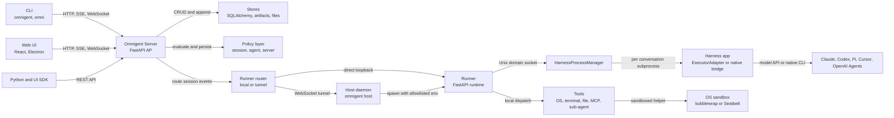
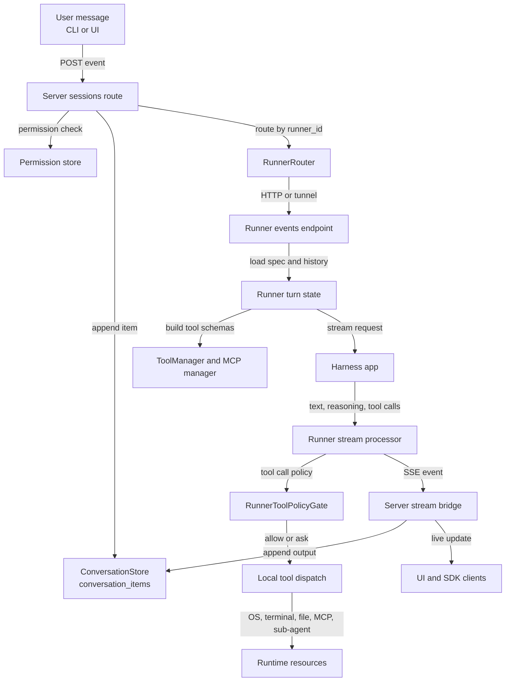
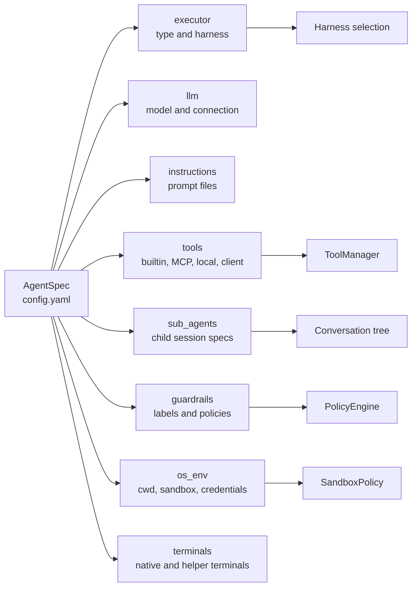
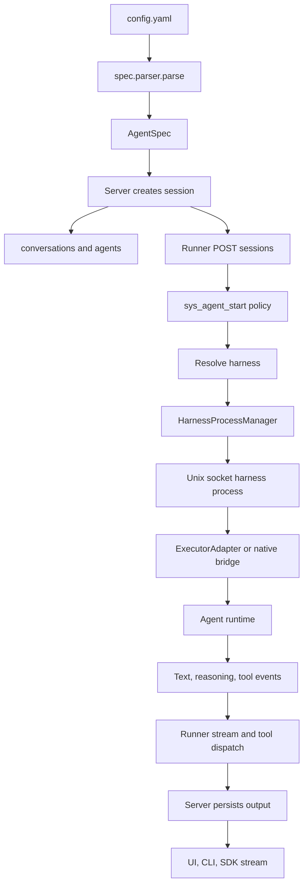

# Omnigent 코드 레벨 아키텍처 분석

## 분석 기준

- 대상 저장소: [omnigent-ai/omnigent](https://github.com/omnigent-ai/omnigent)
- 로컬 분석 경로: `.repos/omnigent`
- 분석 커밋: `f98e8a34fa5070e291b44ed063ec2633a4ea1be8` (`2026-06-19`)
- 보조 공식 자료:
  - [Omnigent GitHub README](https://github.com/omnigent-ai/omnigent)
  - [Omnigent 공식 사이트](https://omnigent.ai/)
  - [Databricks Blog: Introducing Omnigent](https://www.databricks.com/blog/introducing-omnigent-meta-harness-combine-control-and-share-your-agents)

이 문서는 테스트 전략이나 CI 세부사항이 아니라, 엔지니어 관점에서 Omnigent가 무엇을 해결하려는지, 어떤 구조로 구현되어 있는지, 코드 레벨의 핵심 설계가 무엇인지에 집중한다.

## 1. 프로젝트 개요

Omnigent는 Claude Code, Codex, Cursor, Pi, OpenAI Agents SDK 같은 서로 다른 에이전트 실행 환경을 하나의 상위 제어면으로 묶는 오픈소스 "meta-harness"다. 단일 LLM 에이전트 프레임워크라기보다, 여러 하네스와 네이티브 코딩 에이전트를 같은 세션, 정책, 도구, UI, 원격 실행 모델 위에서 다루기 위한 런타임 계층에 가깝다.

공식 설명의 핵심은 다음 문제의식이다.

- 에이전트 하네스마다 입력, 출력, 도구 호출, 승인, 세션 기록, UI가 다르다.
- 여러 에이전트를 함께 쓰려면 사용자가 수동으로 복사, 붙여넣기, 비교, 감독해야 한다.
- 로컬/원격 실행, 샌드박스, 비용 정책, 협업, 세션 공유를 각 하네스마다 따로 구현하기 어렵다.

Omnigent의 접근은 "에이전트를 직접 대체"하는 것이 아니라, 기존 하네스를 감싸는 공통 서버와 러너를 만들고 그 위에 정책, 세션, 스토어, Web UI, CLI, 호스트 연결을 얹는 것이다.

## 2. 핵심 특징 및 차별점

### 공통 세션 API

서버 라우터는 `POST /v1/sessions`, `POST /v1/sessions/{id}/events`, 세션 조회, 업데이트, 스트림, 정책, 파일, 터미널 API를 제공한다. 세션 라우터 구현은 `omnigent/server/routes/sessions.py`에 있고, 라우터 팩토리는 `create_sessions_router()`에서 만들어진다.

중요한 점은 입력 이벤트를 러너로 넘기기 전에 AP 서버가 `conversation_items`에 먼저 기록한다는 점이다. 파일 상단 주석과 `_forward_event_to_runner()` 구현은 "persist-before-forward"를 핵심 불변식으로 둔다. 이는 UI, 재시작 복구, 권한, 정책 평가가 같은 세션 히스토리를 바라보도록 만든다.

### 다중 하네스 추상화

`omnigent/runtime/harnesses/__init__.py`의 `_HARNESS_MODULES`는 하네스 이름을 실제 구현 모듈로 매핑한다.

- `claude-sdk`, `claude`
- `claude-native`
- `codex`
- `codex-native`
- `pi`, `pi-native`
- `openai-agents`
- `cursor`, `cursor-native`
- `antigravity`

대부분의 비네이티브 하네스는 `omnigent/runtime/harnesses/_executor_adapter.py`를 통해 `Executor` 인터페이스로 감싸진다. 네이티브 하네스는 Claude Code, Codex, Pi, Cursor 같은 외부 TUI/CLI 프로세스와 tmux, WebSocket, transcript forwarder, MCP bridge를 조합해 붙인다.

### 정책과 샌드박스

Omnigent는 정책을 단순한 UI 옵션으로 두지 않는다. `PolicyEngine`은 세션 정책, 에이전트 스펙 정책, 서버 기본 정책을 합성하고 `ALLOW`, `DENY`, `ASK` 판정을 반환한다. 도구 호출은 러너 쪽에서도 `RunnerToolPolicyGate`를 통해 function-type 정책을 재평가한다.

OS 도구는 `OSEnvironment` 추상화 뒤에 놓이며, 샌드박스는 Linux의 bubblewrap, macOS의 Seatbelt를 백엔드로 등록한다. 기본 환경변수 전달도 allowlist 방식으로 설계되어 있어 에이전트 도구 실행 시 호스트의 민감한 환경변수가 그대로 노출되지 않게 한다.

### 멀티 에이전트와 하네스 조합

`AgentSpec`는 `sub_agents`를 포함할 수 있고, 예제 `examples/polly/config.yaml`은 Claude SDK 기반 "brain"이 Claude Code, Codex, Pi를 하위 에이전트로 부르는 구조를 보여준다. 즉 Omnigent의 멀티 에이전트 모델은 "한 프레임워크 안의 worker 클래스"가 아니라, 서로 다른 하네스 기반 세션을 상위 세션 트리로 묶는 방식이다.

### 협업과 원격 실행

서버는 세션 권한, 공개 읽기, 사용자 계정, 호스트 등록, WebSocket 기반 host tunnel을 제공한다. `omnigent host`는 사용자의 머신 또는 관리형 샌드박스를 서버에 붙이고, 서버가 특정 세션의 러너를 해당 호스트에서 실행하도록 지시한다.

## 3. 저장소 구조

```text
omnigent/
├── ap-web/                       # React, Vite, Electron 기반 UI
├── deploy/                       # Docker, Kubernetes, Modal, Daytona, Fly 등 배포 템플릿
├── docs/                         # Agent YAML, policies, design 문서
├── examples/                     # Polly, Debby 등 agent config 예제
├── omnigent/
│   ├── cli.py                    # click 기반 CLI 진입점
│   ├── server/                   # FastAPI AP 서버와 REST, WebSocket 라우트
│   ├── runner/                   # 하네스 실행, 도구 디스패치, 세션 리소스
│   ├── runtime/                  # 하네스 프로세스, 정책 엔진, 파일 시스템, 터미널 런타임
│   ├── inner/                    # executor, sandbox, 각 하네스 adapter 구현
│   ├── spec/                     # AgentSpec dataclass와 YAML parser
│   ├── tools/                    # builtin tool, MCP, local tool 관리
│   ├── policies/                 # built-in policy와 policy type
│   ├── stores/                   # SQLAlchemy 기반 store 구현
│   ├── db/                       # ORM model, migration
│   ├── host/                     # host daemon, runner launch, worktree 관리
│   ├── terminals/                # terminal registry와 native wrapper 보조 구조
│   └── sandbox/                  # public sandbox backend re-export
├── sdks/
│   ├── python-client/
│   └── ui/
└── tests/
```

패키지 메타데이터는 `pyproject.toml`에 있으며, Python `>=3.12`를 요구한다. CLI 엔트리 포인트는 `omnigent = "omnigent.cli:main"`와 `omni = "omnigent.cli:main"`이다. 주요 의존성은 FastAPI, uvicorn, httpx, pydantic, SQLAlchemy, Alembic, pexpect, pyte, OpenTelemetry, `claude-agent-sdk`, `openai-agents` 등이다.

## 4. 전체 아키텍처



가장 중요한 경계는 세 개다.

1. **AP 서버 경계**: 인증, 권한, 세션 스토어, 정책 저장, UI 스트림, host registry를 담당한다.
2. **Runner 경계**: 실제 하네스 실행, 도구 디스패치, 터미널/파일시스템 리소스, MCP 실행, native wrapper를 담당한다.
3. **Harness 경계**: 특정 에이전트 SDK 또는 CLI를 Omnigent 이벤트 스트림으로 변환한다.

이 분리는 "협업 가능한 서버"와 "사용자 워크스페이스에서 위험한 코드를 실행하는 런타임"을 분리하려는 의도가 강하다. 서버는 세션 상태와 정책을 보관하고, 러너는 실제 실행과 도구 접근을 담당한다.

## 5. CLI와 로컬 서버

`omnigent/cli.py`는 Click 기반의 큰 단일 CLI 모듈이다. 주요 명령은 다음과 같다.

- `omnigent server`: 서버 start, stop, status
- `omnigent run`: agent config를 실행
- `omnigent claude`, `omnigent codex`, `omnigent pi`, `omnigent cursor`: 네이티브 wrapper 진입점
- `omnigent host`: 현재 머신을 Omnigent 서버에 host로 연결
- `omnigent setup`, `login`, `config`: 초기 설정과 인증

로컬 서버 생명주기는 `omnigent/host/local_server.py`로 분리되어 있다. `omnigent run` 같은 명령이 서버 URL 없이 실행되면, CLI는 일회성 서버를 띄우는 대신 백그라운드 로컬 서버를 재사용한다. 이 서버는 `~/.omnigent/local_server.pid`와 signature sidecar로 관리된다.

설계상 CLI가 모든 실행을 직접 처리하지 않고, 로컬 서버와 러너를 통해 같은 API 경로를 쓰게 만든다. 덕분에 CLI, Web UI, SDK가 같은 세션 모델을 공유한다.

## 6. AP 서버 구조

서버 앱 팩토리는 `omnigent/server/app.py`의 `create_app()`이다. 이 함수는 다음 의존성을 조립한다.

- `AgentStore`
- `FileStore`
- `ConversationStore`
- `ArtifactStore`
- `PolicyStore`
- `PermissionStore`
- `HostStore`
- `HarnessProcessManager`
- `RunnerRouter`
- `TunnelRegistry`
- `SessionResourceRegistry`

서버가 부팅될 때 built-in agent도 등록한다. 코드상으로 Claude native, Codex native, Pi native, Cursor native, Debby, Polly 같은 agent가 seed된다. UI가 빌드되어 있으면 정적 파일로 mount한다.

핵심 라우트는 `omnigent/server/routes/sessions.py`에 집중되어 있다.

- `POST /v1/sessions`: 기존 agent 또는 multipart agent bundle로 세션 생성
- `GET /v1/sessions`, `GET /v1/sessions/{id}`: 세션 목록과 단일 조회
- `PATCH /v1/sessions/{id}`: title, label, model override, reasoning effort, plan mode, archive, runner binding 등 변경
- `POST /v1/sessions/{id}/events`: 사용자 메시지, 승인, interrupt 등 이벤트 전달
- `GET /v1/sessions/{id}/items`: 세션 item 조회
- session policy, default policy, MCP proxy, terminal attach, comments, files 관련 라우트

서버의 특징은 세션 이벤트를 "먼저 저장하고 나중에 전달"하는 것이다. `_forward_event_to_runner()`는 AP가 item을 저장한 뒤 runner에 `persisted_item_id`를 포함해 이벤트를 보낸다. 반대로 Claude native, Codex native 같은 네이티브 terminal 세션은 외부 런타임 transcript가 뒤늦게 mirror되기 때문에 AP가 사용자 입력을 중복 저장하지 않도록 별도 경로 `_dispatch_session_event_to_runner()`를 둔다.

## 7. Runner 구조

러너 앱 팩토리는 `omnigent/runner/app.py`의 `create_runner_app()`이다. 러너는 실제 실행 상태를 많이 들고 있다.

- `_session_spec_cache`: 세션별 AgentSpec 캐시
- `_session_snapshot_cache`: 세션 snapshot 캐시
- `_active_turns`: 실행 중인 turn 상태
- `_session_message_buffers`: turn 중 추가 메시지 버퍼
- `_session_event_queues`: SSE event queue
- `_session_histories`: runner-local history
- `_session_inboxes`: async/sub-agent inbox
- terminal ensure lock: Claude, Codex, Pi, Cursor, REPL native terminal 생성 제어

러너의 주요 엔드포인트는 다음과 같다.

- `POST /v1/sessions`: 세션에 대한 spec resolve, 정책 사전 평가, 하네스 spawn, native terminal auto-create
- `GET /v1/sessions/{id}/stream`: SSE 스트림
- `POST /v1/sessions/{id}/events`: message, interrupt, approval, effort/model change, compaction, cost approval 처리
- `/resources`, `/resources/environments`, `/resources/terminals`: 파일시스템, OS shell, terminal attach 리소스
- `/mcp/execute`: MCP tool proxy 실행
- `/skills/resolve`: skill resolution

turn 실행의 중심은 `_run_turn_bg()`와 `_run_turn_bg_setup_and_stream()`이다. 이 경로에서 러너는 AgentSpec을 다시 resolve하고, agent switch나 harness override를 반영하고, `ToolManager`와 `ProxyMcpManager`로 tool schema를 구성하고, 최종적으로 `_stream_message_to_harness()`를 통해 하네스에 메시지를 보낸다.

메시지 처리에서 중요한 설계는 "turn 중 메시지"를 구분한다는 점이다.

- 실행 중인 turn이 없으면 새 turn을 시작한다.
- 실행 중인 turn이 있으면 메시지를 버퍼링한다.
- 일부 비네이티브 하네스는 mid-turn injection을 지원한다.
- 네이티브 하네스는 transcript 동기화 문제 때문에 한 번에 하나씩 drain한다.

## 8. 세션 이벤트 흐름



이 흐름에서 AP 서버와 러너의 역할이 명확하게 나뉜다. AP 서버는 권한과 영속 상태의 소유자이고, 러너는 실행과 리소스 접근의 소유자다. 하네스는 특정 LLM/agent 런타임을 공통 이벤트 모델로 변환하는 플러그인처럼 동작한다.

## 9. 하네스 프로세스와 Executor 추상화

`omnigent/runtime/harnesses/process_manager.py`의 `HarnessProcessManager`는 conversation 단위로 하네스 subprocess를 관리한다. 하네스는 `python -m omnigent.runtime.harnesses._runner`로 실행되며, AP/runner와 같은 프로세스 안에서 import되어 실행되지 않는다.

핵심 구현 포인트는 다음과 같다.

- conversation별 Unix domain socket을 `/tmp/omnigent/<ap-id>/conv-<conversation>.sock` 아래에 만든다.
- socket directory는 `0700`, socket은 `0600` 권한을 사용한다.
- 하네스 subprocess는 parent PID watchdog을 사용해 부모 종료 시 함께 정리된다.
- idle reaper와 orphan sweep이 있어 오래 유휴 상태인 하네스를 정리한다.
- SIGTERM 후 SIGKILL fallback을 둔다.

하네스 프로세스의 실제 entrypoint는 `omnigent/runtime/harnesses/_runner.py`다. 이 모듈은 하네스 이름을 `_HARNESS_MODULES`에서 찾아 module을 import하고, 해당 모듈의 `create_app()`으로 FastAPI 앱을 만든 뒤 UDS로 uvicorn을 띄운다.

비네이티브 하네스는 `Executor` 인터페이스를 통해 정규화된다.

- `omnigent/inner/executor.py`: `Executor`, `TextChunk`, `ReasoningChunk`, `ToolCallRequest`, `ToolCallComplete`, `TurnComplete`, `ExecutorError` 등 공통 이벤트 모델
- `omnigent/runtime/harnesses/_executor_adapter.py`: `Executor` 이벤트를 Omnigent SSE와 tool dispatch protocol로 변환
- `omnigent/inner/claude_sdk_harness.py`, `codex_harness.py`, `pi_harness.py`, `openai_agents_sdk_harness.py`, `cursor_harness.py`: provider별 adapter

네이티브 하네스는 SDK 호출보다 프로세스 bridge에 가깝다. 예를 들어 `claude-native`와 `codex-native` 경로는 native TUI, tmux, wrapper labels, transcript forwarder, MCP bridge 설정을 조합한다.

## 10. AgentSpec와 YAML 모델

에이전트 정의 모델은 `omnigent/spec/types.py`의 `AgentSpec` dataclass다. 주요 필드는 다음과 같다.

- `name`, `description`
- `llm`
- `interaction`
- `tools`
- `params`
- `instructions`
- `skills`, `skills_filter`
- `mcp_servers`
- `local_tools`
- `sub_agents`
- `executor`
- `compaction`
- `guardrails`
- `async_enabled`
- `os_env`
- `terminals`
- `timers`
- `spawn`

parser는 `omnigent/spec/parser.py`의 `parse()`에 있다. `config.yaml`을 읽고, executor, tools, compaction, guardrails, os_env, terminal, instructions, bundled skills, MCP server, local tools, sub-agent를 resolve한다. YAML 1.2에 맞게 `on:` 같은 policy key가 불리언으로 해석되지 않도록 bool resolver도 조정한다.



예제 `examples/polly/config.yaml`은 Omnigent의 설계 의도를 잘 보여준다. 상위 brain은 Claude SDK 하네스를 쓰고, 하위 에이전트로 Claude Code, Codex, Pi를 호출한다. 이 구조에서는 각 하위 에이전트가 별도 conversation으로 실행되고, parent/root conversation 관계가 DB에 저장된다.

## 11. 도구와 리소스 실행

도구 등록은 `omnigent/tools/manager.py`의 `ToolManager`가 담당한다. 이 매니저는 skill tool, builtin tool, sub-agent tool, agent management tool, OS env tool, terminal tool, local tool, client tool, async inbox tool, timer tool, comment tool, policy tool을 등록한다.

실제 실행 분기는 `omnigent/runner/tool_dispatch.py`에 있다. 이 파일은 tool category를 정적으로 나누고, 일부 도구는 runner-local로 실행하며, 일부는 AP 서버 REST API로 되돌려 보낸다.

주요 분류는 다음과 같다.

| 분류 | 예시 | 실행 위치 |
|---|---|---|
| OS env tools | `sys_os_read`, `sys_os_write`, `sys_os_edit`, `sys_os_shell` | Runner local `OSEnvironment` |
| File tools | upload, download, list files | AP 서버 file API |
| Terminal tools | launch, send, read, list, close | Runner local terminal registry |
| Async inbox | `sys_call_async`, `sys_read_inbox`, cancel | Runner local queues |
| Sub-agent tools | `sys_session_send`, create/list/peek/close | AP session API와 runner state |
| Web tools | `web_search`, `web_fetch` | runner local 또는 sub-agent |
| MCP tools | spec-defined MCP tools | Runner MCP manager, AP policy proxy |
| Skill tools | `load_skill`, `read_skill_file` | runner local |
| Comment tools | list/update comments | AP comments API |

MCP 도구는 특히 중요한 경로다. 도구 실행 자체는 runner가 하지만, 정책 평가는 AP 서버와 연동된다. 이로 인해 서버가 세션 정책과 승인 UI를 소유하면서도, 실제 MCP 서버 접근은 workspace에 가까운 runner에서 수행할 수 있다.

## 12. 정책 아키텍처

정책 계층은 `omnigent/runtime/policies/engine.py`, `omnigent/runtime/policies/builder.py`, `omnigent/runner/policy.py`, `omnigent/policies/`에 걸쳐 있다.

`build_policy_engine()`은 한 workflow 실행에 대한 `PolicyEngine`을 만든다. 정책 로딩 순서는 다음과 같다.

1. 세션 정책
2. 에이전트 스펙 정책
3. 서버 기본 정책
4. `sys_add_policy` 실행 전 사용자 승인을 요구하는 내부 정책

서브에이전트 conversation은 root conversation의 세션 정책을 상속한다. 따라서 부모 세션에서 추가한 정책이 child session에도 적용된다. 비용 정책도 root conversation 기준으로 누적 비용을 읽어, 하위 에이전트가 별도 conversation이더라도 같은 session tree 예산 아래에서 제어된다.

`PolicyEngine.evaluate()`는 각 phase에서 정책을 순서대로 평가한다.

- `DENY`: 즉시 short-circuit
- `ASK`: 보류하되 이후 정책이 `DENY`할 수 있으므로 계속 평가
- `ALLOW`: 다음 정책으로 진행
- label write와 session state update는 verdict에 따라 적용 시점이 달라진다.

러너 쪽의 `RunnerToolPolicyGate`는 function-type policy 중 `TOOL_CALL`, `TOOL_RESULT`에 걸리는 정책을 별도로 실행한다. 이유는 MCP dispatch가 runner로 이동했기 때문이다. label policy와 prompt policy는 server-side 상태나 LLM classifier가 필요하므로 AP 서버가 담당한다.

정책 구조의 장점은 세 가지다.

- 정책이 단일 하네스에 묶이지 않는다.
- 세션 공유/협업 환경에서도 서버가 승인과 권한을 소유한다.
- 도구 실행 위치가 runner여도 정책은 server와 runner 양쪽에서 일관되게 적용될 수 있다.

## 13. 샌드박스와 OS 환경

OS 도구는 `omnigent/inner/os_env.py`의 `OSEnvironment` 추상화 뒤에 있다. 파일 읽기, 쓰기, 편집, shell 실행은 직접 실행되지 않고 helper process transport를 통한다.

샌드박스 핵심 모델은 `omnigent/inner/sandbox.py`의 `SandboxPolicy`다. 주요 필드는 다음과 같다.

- `backend_type`: `linux_bwrap`, `darwin_seatbelt`, `none`
- `read_roots`
- `write_roots`, `write_files`
- `allow_network`
- `cwd_allow_hidden`
- `env_passthrough`
- `spawn_env_allowlist`
- `egress_relay_port`, `egress_socket_path`
- `deny_unix_socket_paths`
- `credential_proxy`

환경변수 전달은 보안적으로 중요한 설계다. `build_helper_env()`는 sandbox가 active일 때 기본 allowlist와 spec의 `env_passthrough`만 넘긴다. 기본 allowlist에는 `PATH`, `HOME`, `USER`, `SHELL`, locale, terminal 관련 변수 정도만 포함된다. `AWS_*`, `GITHUB_TOKEN`, `OPENAI_API_KEY`, `ANTHROPIC_API_KEY`, `DATABRICKS_TOKEN`, `KUBECONFIG`, `SSH_AUTH_SOCK` 같은 민감한 값은 기본적으로 제외된다.

Linux와 macOS 백엔드는 다음 wrapper로 노출된다.

- `omnigent/sandbox/bwrap.py`: `linux_bwrap`
- `omnigent/sandbox/seatbelt.py`: `darwin_seatbelt`

이 구조는 "LLM이 호출한 OS 도구"와 "러너/서버 control plane"을 분리하려는 의도가 강하다. 특히 `deny_unix_socket_paths`는 sandbox 안에서 control-plane Unix socket으로 되돌아가는 경로를 막기 위한 장치다.

## 14. Host와 원격 실행

`omnigent/host/connect.py`는 `omnigent host`의 main loop다. Host는 서버와 WebSocket으로 연결하고, 서버가 보내는 frame을 받아 runner subprocess를 실행한다.

주요 frame은 다음 계열이다.

- `host.hello`
- `host.launch_runner`
- `host.stop_runner`
- `host.runner_exited`
- `host.list_dir`, `host.stat`, `host.create_dir`
- `host.create_worktree`, `host.remove_worktree`

runner subprocess 환경은 `_RUNNER_ENV_ALLOWLIST`로 제한된다. 이 allowlist는 PATH, HOME, locale, TLS trust store, Omnigent config/data selector, auth mode selector 등 운영에 필요한 값만 통과시키고, 일반적인 secret-bearing env는 넘기지 않는다.

`deploy/`에는 Modal, Daytona, Islo, Docker, Kubernetes, Fly, Render, Railway, Hugging Face Spaces 등 다양한 실행 타깃이 있다. 코드상으로는 host abstraction과 tunnel registry가 있어, 로컬 머신과 관리형 sandbox host를 같은 "runner launch target"으로 다룰 수 있게 되어 있다.

## 15. 영속화 모델

DB 모델은 `omnigent/db/db_models.py`에 있다. 핵심 테이블은 다음과 같다.

| 테이블 | 역할 |
|---|---|
| `agents` | 등록된 agent bundle과 session-scoped agent |
| `conversations` | 세션, sub-agent 세션, runner/host binding, model override, workspace |
| `conversation_items` | message, function call, tool output, reasoning item |
| `conversation_labels` | policy label state |
| `session_permissions` | 세션 공유 권한 |
| `files` | 업로드 파일 메타데이터 |
| `comments` | 리뷰/코멘트 anchor |
| `policies` | session-scoped 또는 server-wide policy |
| `hosts` | 연결된 host와 관리형 sandbox host |
| `user_daily_cost` | 사용자별 일 단위 LLM 비용 누적 |

스토어 구현은 `omnigent/stores/` 아래에 분리되어 있다. `ConversationStore`의 SQLAlchemy 구현은 conversation 생성, item append, label upsert, session usage, full-text search, child session 조회를 담당한다.

특히 `conversations` 테이블에는 `parent_conversation_id`와 `root_conversation_id`가 모두 있다. 이는 sub-agent tree를 효율적으로 조회하고, parent session policy와 비용 상태를 child session에 적용하기 위한 설계다.

## 16. Web UI와 SDK

`ap-web/`는 React/Vite 기반 Web UI이며 Electron desktop shell도 포함한다. 서버는 빌드된 UI를 정적 파일로 mount할 수 있다. UI는 세션 목록, 세션 스트림, 터미널 attach, comments, files, policies, host 선택 같은 AP 서버 기능을 소비한다.

`sdks/python-client`와 `sdks/ui`는 외부 앱이나 플러그인이 Omnigent API를 호출하고 세션 UI를 임베드하기 위한 계층이다. 이 구조는 Omnigent를 "앱 하나"가 아니라 agent control plane으로 배치하려는 방향과 맞다.

## 17. 코드 레벨 핵심 구조 요약



코드상 Omnigent는 다음 레이어로 이해하는 것이 가장 쉽다.

1. **Spec layer**: `config.yaml`을 `AgentSpec`으로 변환한다.
2. **AP layer**: 세션, 권한, 정책, host, 파일, artifact를 소유한다.
3. **Runner layer**: turn 실행, 하네스 호출, 도구 실행, 리소스 관리를 맡는다.
4. **Harness layer**: 특정 에이전트 런타임을 공통 이벤트 모델로 어댑트한다.
5. **Sandbox/tool layer**: OS, terminal, MCP, file, sub-agent tool을 실제로 실행한다.
6. **UI/SDK layer**: 같은 AP API를 통해 협업과 관찰 기능을 제공한다.

## 18. 경쟁 및 비교 관점

| 비교 대상 | Omnigent와의 차이 |
|---|---|
| Claude Code, Codex CLI, Cursor Agent | 개별 coding agent runtime이다. Omnigent는 이들을 감싸고 조합하는 상위 control plane이다. |
| LangGraph, CrewAI, AutoGen | 에이전트 workflow framework에 가깝다. Omnigent는 기존 CLI/SDK 하네스를 공통 세션, 정책, UI, sandbox 아래에서 실행하는 meta-harness 성격이 강하다. |
| OpenHands, Aider, OpenDevin 계열 | 자체 coding agent 경험과 runtime이 중심이다. Omnigent는 여러 외부 하네스를 교체/혼합하고 협업 서버를 제공하는 쪽에 초점이 있다. |
| MCP client/host 구현체 | MCP 도구 연결만 제공하는 것이 아니라, 세션 저장, 정책, 승인지점, host runner, multi-agent dispatch까지 포함한다. |

기술적으로 가장 가까운 축은 "agent orchestration framework"와 "coding agent control plane"의 중간이다. 단순 workflow graph보다 하네스 호환성과 네이티브 에이전트 감싸기에 더 많은 코드가 있고, 단일 coding agent보다 서버/러너/정책/호스트 계층이 더 강조된다.

## 19. 장점과 리스크

### 장점

- 다양한 agent harness를 하나의 세션 API와 UI로 묶는다.
- 하네스 subprocess, runner, AP 서버 경계가 분리되어 실행 책임이 명확하다.
- 정책이 세션, 에이전트 스펙, 서버 기본값으로 계층화되어 있다.
- native CLI agent를 단순 wrapper가 아니라 terminal, transcript, MCP bridge와 함께 통합한다.
- sub-agent를 별도 conversation tree로 모델링해 히스토리, 권한, 비용, 정책을 추적할 수 있다.
- OS sandbox와 env allowlist 설계가 코드 레벨에서 명확하다.

### 약점 및 리스크

- `runner/app.py`와 `server/routes/sessions.py`가 매우 크다. 기능은 풍부하지만 변경 영향 범위를 파악하기 어렵다.
- native harness 통합은 tmux, transcript forwarder, 외부 CLI 상태에 강하게 의존해 플랫폼별 edge case가 많을 수 있다.
- 정책 평가가 server-side와 runner-side로 나뉘므로, 어떤 policy type이 어디서 실행되는지 이해하지 못하면 운영상 오해가 생길 수 있다.
- 하네스별 model override, mid-turn injection, approval, compaction 지원 수준이 달라진다.
- 프로젝트가 alpha 성격이라 API와 내부 구조가 빠르게 바뀔 가능성이 높다.

## 20. 엔지니어 관점 종합 평가

Omnigent의 핵심 가치는 "새 에이전트 프레임워크"가 아니라 "이미 존재하는 강한 에이전트 하네스들을 함께 운영하기 위한 제어면"에 있다. 코드 구조도 이 방향을 반영한다. `AgentSpec`과 `ToolManager`는 에이전트 정의와 도구 표면을 표준화하고, AP 서버는 세션과 정책을 영속화하며, runner는 실제 실행과 리소스 접근을 담당하고, 하네스 프로세스는 provider별 런타임을 격리한다.

특히 흥미로운 설계는 다음 세 가지다.

- **persist-before-forward 세션 모델**: 사용자 입력과 런타임 이벤트를 서버 상태로 먼저 정규화해 UI, 재시작, 협업, 권한이 같은 소스를 보게 한다.
- **conversation tree 기반 sub-agent 모델**: 멀티 에이전트를 단순 in-memory task가 아니라 추적 가능한 세션 트리로 만든다.
- **정책과 sandbox의 control-plane화**: LLM 도구 실행을 하네스 내부 재량에 맡기지 않고, server와 runner 사이의 경계에서 평가하고 제한한다.

따라서 Omnigent는 여러 코딩 에이전트와 agent SDK를 실제 팀 환경에서 조합하고, 세션 공유, 정책, 비용, 원격 실행, sandbox까지 한 번에 통제하려는 경우에 적합하다. 반대로 단일 agent loop를 빠르게 임베드하려는 용도라면 구조가 무겁고, LangGraph 같은 workflow framework가 더 단순할 수 있다.

