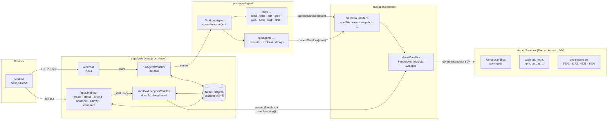
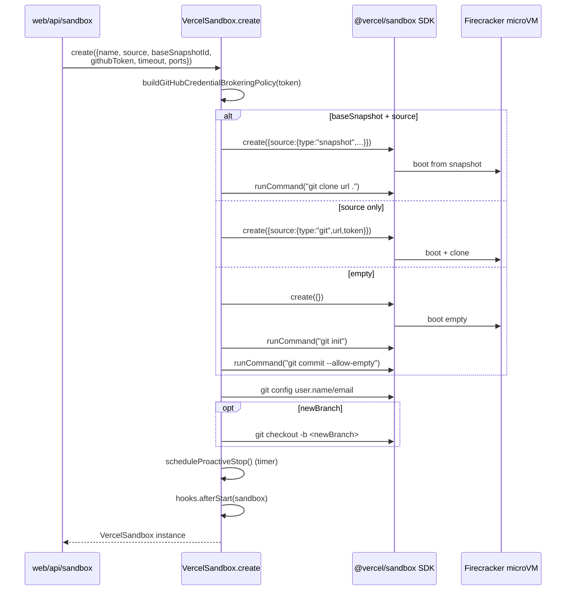
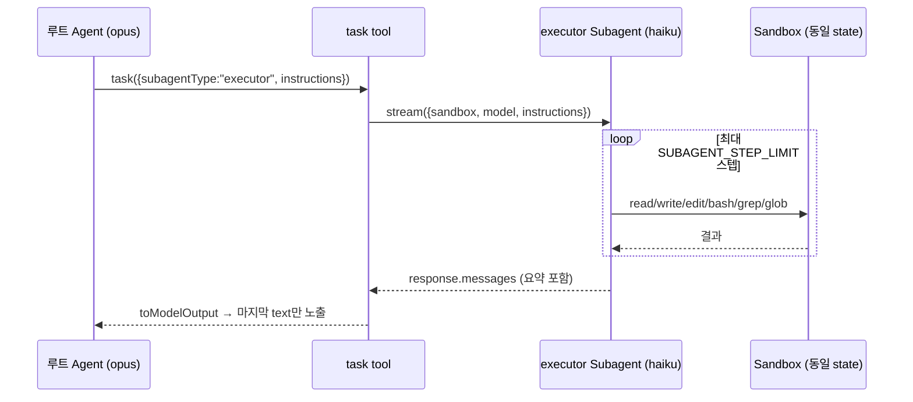
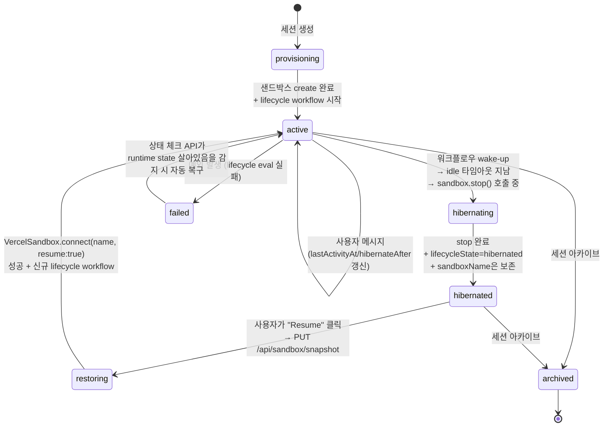
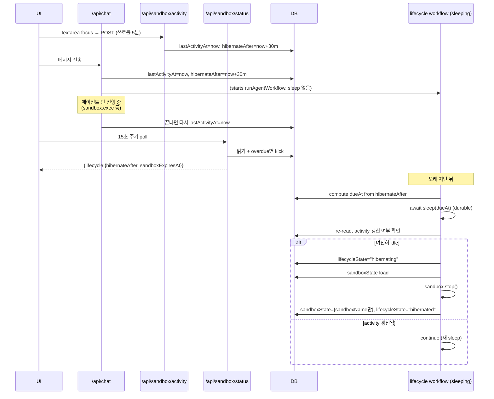
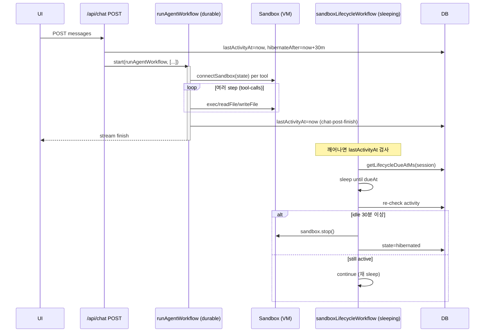
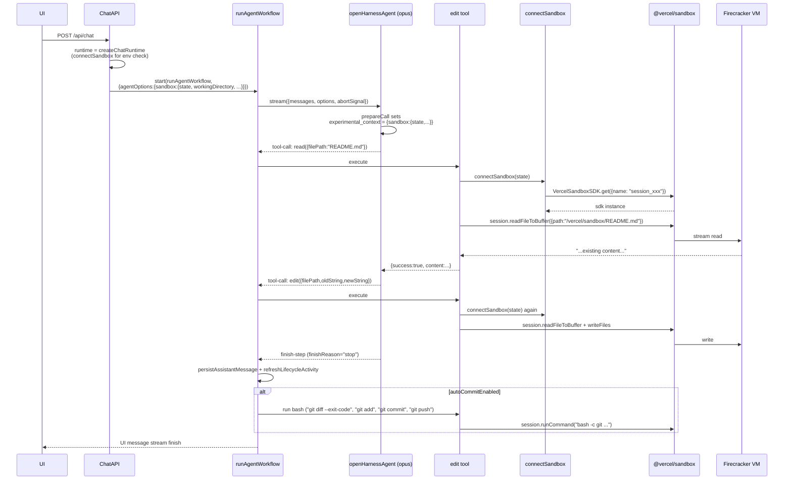

# Open Agents — 코드 레벨 심층 분석

**대상 저장소**: [vercel-labs/open-agents](https://github.com/vercel-labs/open-agents)
**분석 시점**: 2026-04-17 (main 브랜치 기준 clone)
**분석 초점**: 에이전트가 샌드박스를 사용·통신하는 방식, 샌드박스 기반 기술, 라이프사이클

이 저장소는 Vercel이 공개한 "백그라운드 코딩 에이전트 레퍼런스 앱"이다. 웹 UI → 에이전트 → 클라우드 샌드박스로 이어지는 3계층 구조이며, 에이전트가 어떻게 격리된 실행 환경(샌드박스)을 소유·조작하고, 그 환경이 어떤 라이프사이클로 관리되는지를 **코드 한 곳에서 완결되게** 보여주는 몇 안 되는 오픈소스다.

---

## 1. 프로젝트 개요

### 1.1 무엇을 푸는가

사용자가 "이 리포의 X 기능을 고쳐줘"라고 프롬프트를 치면, 서버가:

1. **Vercel Sandbox**(Firecracker microVM)를 하나 띄우고
2. GitHub 리포를 clone한 뒤
3. **에이전트**(`ToolLoopAgent`)가 그 VM의 파일/쉘을 **도구 호출**로 조작해 변경을 만들고
4. 자동으로 commit/push/PR까지 수행하고
5. VM은 사용자 idle 시 **hibernate**(snapshot + stop)되어 비용을 아끼다가, 다시 요청이 오면 **resume**된다.

즉 "에이전트를 클라우드에 상주시키는데, VM을 항상 깨워두지는 않는다"가 핵심 목표다.

### 1.2 탄생 배경과 핵심 아키텍처 결정

README 원문 인용:

> **The agent is not the sandbox** — The agent does not run inside the VM. It runs outside the sandbox and interacts with it through tools like file reads, edits, search, and shell commands.

이 결정은 아래 4가지 설계 귀결을 만든다:

| 결정 | 귀결 |
|---|---|
| 에이전트가 VM 밖에 있음 | VM이 꺼져 있어도 에이전트 워크플로우는 DB/durable workflow 기반으로 재개 가능 |
| 에이전트-샌드박스가 프로세스적으로 분리 | 서로 다른 timeout/lifecycle 가짐 (에이전트 turn vs VM idle) |
| 모델/프로바이더/샌드박스 구현 독립 | 모델 교체, 샌드박스 백엔드 교체가 각각 가능 |
| VM은 '실행 환경'에 국한 | VM이 컨트롤 플레인이 되지 않음 (상태·정책은 모두 DB+워크플로우에 있음) |

---

## 2. 전체 계층 구조



워크스페이스 구조(실제 폴더):

```
apps/
  web/                Next.js(웹 UI + API + 워크플로우 정의)
packages/
  agent/              에이전트/도구/서브에이전트
  sandbox/            샌드박스 추상화 + Vercel 구현체
  shared/             공용 유틸
```

---

## 3. 샌드박스 — 구현 기술과 구조

### 3.1 무엇으로 만들어져 있는가

`packages/sandbox/package.json`에서 단일 의존성 확인:

```json
"dependencies": {
  "@vercel/sandbox": "2.0.0-beta.11"
}
```

그리고 `packages/sandbox/vercel/sandbox.ts:161`에 명시:

> *Vercel Sandbox implementation using the @vercel/sandbox SDK. **Runs code in isolated Firecracker MicroVMs**.*

정리하면:

- **격리 기술**: AWS Firecracker 기반 microVM (Vercel Sandbox가 그 위에 올라간 관리형 서비스)
- **기본 리소스**: `vcpus = 4`, 각 vCPU당 2048MB 메모리 (`packages/sandbox/vercel/config.ts`)
- **런타임**: 기본 `node22` (옵션: `node24`, `python3.13`)
- **기본 작업 디렉토리**: `/vercel/sandbox`
- **기본 노출 포트**: `3000, 5173, 4321, 8000` (Next.js/Vite/Astro/code-server)
- **베이스 스냅샷**: 환경변수 `VERCEL_SANDBOX_BASE_SNAPSHOT_ID` 또는 `snap_EjsphVxi07bFKrfojljJdIS41KHT` — `bun + jq + agent-browser + chromium + code-server`가 미리 설치되어 있음
- **SDK 타임아웃 한도**: 5시간 (`MAX_SDK_TIMEOUT_MS = 18_000_000`)

### 3.2 Sandbox 추상화 인터페이스

`packages/sandbox/interface.ts`에서 정의한 `Sandbox` 인터페이스가 에이전트와 VM 사이 **유일한 계약**이다:

```ts
export interface Sandbox {
  readonly type: SandboxType;               // "cloud"
  readonly workingDirectory: string;
  readonly env?: Record<string, string>;
  readonly currentBranch?: string;
  readonly hooks?: SandboxHooks;
  readonly environmentDetails?: string;     // 시스템 프롬프트에 박히는 런타임 설명
  readonly host?: string;
  readonly expiresAt?: number;
  readonly timeout?: number;

  readFile(path, encoding): Promise<string>;
  writeFile(path, content, encoding): Promise<void>;
  stat(path): Promise<SandboxStats>;
  access(path): Promise<void>;
  mkdir(path, options?): Promise<void>;
  readdir(path, opts): Promise<Dirent[]>;
  exec(command, cwd, timeoutMs, options?): Promise<ExecResult>;
  execDetached?(command, cwd): Promise<{ commandId: string }>;
  domain?(port): string;                    // 공개 preview URL

  stop(): Promise<void>;
  extendTimeout?(additionalMs): Promise<{ expiresAt: number }>;
  snapshot?(): Promise<SnapshotResult>;
  getState?(): unknown;                     // DB에 저장할 직렬화 상태
}
```

그리고 `SandboxHooks` — 라이프사이클 훅:

```ts
export interface SandboxHooks {
  afterStart?:        (sandbox) => Promise<void>;  // 준비 후 초기화 (credentials 등)
  beforeStop?:        (sandbox) => Promise<void>;  // 종료 전 커밋/정리
  onTimeout?:         (sandbox) => Promise<void>;  // 하드 타임아웃 임박
  onTimeoutExtended?: (sandbox, additionalMs) => Promise<void>;
}
```

이 `Sandbox` 인터페이스는 `readonly type: "cloud"` 외에는 provider-specific한 필드가 없다. factory 쪽에서 타입 디스크리미네이터로 `{ type: "vercel" } & VercelState`를 읽어 적절한 구현체로 디스패치한다 — 현재는 `vercel` 하나지만 교체 가능한 설계.

### 3.3 VercelSandbox 구현

`packages/sandbox/vercel/sandbox.ts`가 이 분석의 핵심 파일이다. 주요 구성 요소:

#### (a) 생성(create) — Firecracker VM 부트스트랩

```ts
static async create(config: VercelSandboxConfig = {}): Promise<VercelSandbox> {
  const { name, source, restoreSnapshotId, gitUser, env, githubToken,
          vcpus = 4, timeout = 300_000, runtime = "node22",
          ports, baseSnapshotId, persistent = true, snapshotExpiration,
          hooks, skipGitWorkspaceBootstrap = false } = config;

  const effectiveTimeout   = Math.min(timeout, MAX_PROACTIVE_TIMEOUT_MS);
  const sdkTimeout         = effectiveTimeout + TIMEOUT_BUFFER_MS; // +30s (beforeStop용)

  const createBaseConfig = {
    ...(name ? { name } : {}),
    resources: { vcpus },
    timeout: sdkTimeout,
    runtime,
    persistent,
    networkPolicy: buildGitHubCredentialBrokeringPolicy(githubToken),
    ...(ports && { ports }),
    ...(snapshotExpiration !== undefined && { snapshotExpiration }),
  };

  // 소스 분기: 스냅샷 복원 / baseSnapshot 기반 / git URL / 빈 sandbox
  let sdk: VercelSandboxSDK;
  if (restoreSnapshotId) {
    sdk = await VercelSandboxSDK.create({ ...createBaseConfig,
      source: { type: "snapshot", snapshotId: restoreSnapshotId } });
  } else if (baseSnapshotId) {
    sdk = await VercelSandboxSDK.create({ ...createBaseConfig,
      source: { type: "snapshot", snapshotId: baseSnapshotId } });
  } else if (source) {
    sdk = await VercelSandboxSDK.create({ ...createBaseConfig,
      source: source.token
        ? { type: "git", url: source.url,
            username: "x-access-token", password: source.token,
            ...(source.branch && { revision: source.branch }) }
        : { type: "git", url: source.url, ... } });
  } else {
    sdk = await VercelSandboxSDK.create(createBaseConfig);
  }

  // baseSnapshot + source 조합이면 생성 후 별도로 git clone 실행
  if (source && baseSnapshotId) {
    await sdk.runCommand({ cmd: "git",
      args: ["clone", ...(branch ? ["--branch", branch] : []), cloneUrl, "."],
      cwd: workingDirectory });
  }

  // 빈 sandbox면 git init + initial commit (diff HEAD 동작 보장)
  if (!source && !restoreSnapshotId && !skipGitWorkspaceBootstrap) {
    await sdk.runCommand({ cmd: "git", args: ["init"], ... });
  }
  if (gitUser) { /* git config user.name/email */ }
  if (source?.newBranch) { /* git checkout -b */ }

  const startTime = Date.now();
  const sandbox = new VercelSandbox(sdk, sdk.currentSession(), sdk.name, ...,
                                    effectiveTimeout, startTime, ports);

  if (hooks?.afterStart) await hooks.afterStart(sandbox);
  return sandbox;
}
```

부트 시퀀스를 다이어그램으로:



#### (b) 재연결(connect) — 기존 persistent sandbox에 붙기

```ts
static async connect(sandboxName: string, options = {}): Promise<VercelSandbox> {
  const sdk = await VercelSandboxSDK.get({
    name: sandboxName,
    resume: options.resume ?? false,
  });
  await syncGitHubCredentialBrokering(sdk, options.githubToken);
  const session = sdk.currentSession();

  const remainingTimeout =
    options.remainingTimeout ??
    getRemainingTimeoutFromSession(session) ??
    (isStoppedSessionStatus(session.status) ? undefined : DEFAULT_RECONNECT_TIMEOUT_MS);

  const sandbox = new VercelSandbox(sdk, session, sandboxName, ...);
  if (options.hooks?.afterStart) await options.hooks.afterStart(sandbox);
  return sandbox;
}
```

핵심 포인트:

- **Named persistent sandbox** 개념: `sandboxName`으로 VM을 재호출 가능 (앱 계층에서 `session_<sessionId>` 네이밍 규칙을 씀 — `apps/web/lib/sandbox/utils.ts:26`).
- `resume: false`일 때는 **기존 VM에 probe만** 하고, 이미 stopped면 runtime을 안 돌린다. `resume: true`일 때 Vercel SDK가 snapshot에서 VM을 되살린다.
- 재연결 시에도 GitHub credential brokering(후술)이 다시 동기화된다.

#### (c) 네트워크 정책 — "credential brokering"

토큰을 VM 내부로 **주입하지 않고**, VM에서 나가는 특정 도메인 트래픽에 대해 네트워크 레이어에서 Authorization 헤더를 **프록시 주입**한다:

```ts
function buildGitHubCredentialBrokeringPolicy(token?: string) {
  const basicAuthToken = Buffer.from(`x-access-token:${token}`).toString("base64");
  return {
    allow: {
      "api.github.com":      [{ transform: [{ headers: { Authorization: `Bearer ${token}` } }] }],
      "uploads.github.com":  [{ transform: [{ headers: { Authorization: `Bearer ${token}` } }] }],
      "codeload.github.com": [{ transform: [{ headers: { Authorization: `Bearer ${token}` } }] }],
      "github.com":          [{ transform: [{ headers: { Authorization: `Basic ${basicAuthToken}` } }] }],
      "*": [],  // 그 외 모든 호스트는 허용하되 헤더 주입 없음
    },
  };
}
```

이 정책은 `VercelSandboxSDK.create({ networkPolicy })`로 생성 시점에, reconnect 시에는 `sdk.updateNetworkPolicy()`로 갱신된다. 에이전트가 sandbox 안에서 `curl https://api.github.com/repos/.../pulls` 같은 요청을 날리면, 토큰을 코드에 박지 않아도 자동으로 인증이 붙는다. **이 토큰은 VM 안에서 grep으로도 검출되지 않는다** — 이것이 "sandbox를 탈취당해도 토큰이 샐 위험을 최소화"한 보안 설계다.

#### (d) 파일 I/O — SDK의 네이티브 스트리밍 메서드 사용

```ts
async readFile(path: string, _encoding: "utf-8"): Promise<string> {
  const buffer = await this.session.readFileToBuffer({ path });
  if (buffer === null) throw new Error(`Failed to read file: ${path}`);
  return buffer.toString("utf-8");
}

async writeFile(path, content, _encoding): Promise<void> {
  const parentDir = path.substring(0, path.lastIndexOf("/"));
  if (parentDir) await this.mkdir(parentDir, { recursive: true });
  await this.session.writeFiles([{ path, content: Buffer.from(content, "utf-8") }]);
}
```

주석에 명확히 의도가 적혀 있음: `cat`이나 `runCommand + base64`로 대체하면 **명령 출력/인자 크기 한도**에 걸리므로, SDK 내부가 스트리밍 처리해주는 `readFileToBuffer`/`writeFiles`를 쓴다.

#### (e) 명령 실행 — `exec` / `execDetached`

```ts
async exec(command, cwd, timeoutMs, options?) {
  const timeoutSignal = AbortSignal.timeout(timeoutMs);
  const signal = options?.signal ? AbortSignal.any([timeoutSignal, options.signal]) : timeoutSignal;

  const result = await this.session.runCommand({
    cmd: "bash",
    args: ["-c", `cd "${cwd}" && ${command}`],
    env: this.getCommandEnv(),   // user env + SANDBOX_HOST / SANDBOX_URL_<port> 주입
    signal,
  });

  let stdout = await result.stdout();
  let truncated = false;
  if (stdout.length > MAX_OUTPUT_LENGTH /* 50_000 */) {
    stdout = stdout.slice(0, MAX_OUTPUT_LENGTH);
    truncated = true;
  }
  return { success: result.exitCode === 0, exitCode, stdout, stderr: "", truncated };
}
```

- **Timeout**: `AbortSignal.timeout(timeoutMs)` + 외부 `AbortSignal`을 `AbortSignal.any()`로 합성. 에이전트의 bash 도구는 120s(`TIMEOUT_MS = 120_000`)를 쓴다.
- **stdout 잘림**: 50KB 하드 캡. `truncated: true` 플래그로 에이전트에게 알려줌.
- **stderr**: Vercel SDK는 stdout/stderr를 합친다고 표시하고, stderr 필드는 빈 문자열로 반환.
- **preview URL 자동 주입**: `SANDBOX_HOST`, `SANDBOX_URL_3000`, `SANDBOX_URL_5173` 등 환경변수가 모든 명령에 실시간 주입되어, 에이전트가 시작한 dev server URL을 쉽게 참조할 수 있다.

`execDetached`는 백그라운드 프로세스(dev server 등)용:

```ts
async execDetached(command, cwd): Promise<{ commandId: string }> {
  const result = await this.session.runCommand({
    cmd: "bash", args: ["-c", `cd "${cwd}" && ${command}`],
    env: this.getCommandEnv(), detached: true,
  });

  // 2초 동안 빠른 실패를 감지(포트 점유 실패 등)
  const quickProbe = await Promise.race([
    result.wait({ signal: abortController.signal }).then(...),
    new Promise(r => setTimeout(() => { abort; r({kind:"timeout"}) }, 2_000)),
  ]);

  if (quickProbe.kind === "timeout") return { commandId: result.cmdId };
  if (quickProbe.finished.exitCode !== 0) throw new Error(`Background command exited with ${code}. stderr:\n${...}`);
  return { commandId: result.cmdId };
}
```

### 3.4 snapshot / stop / extendTimeout

```ts
async snapshot(): Promise<SnapshotResult> {
  const snapshot = await this.session.snapshot(); // 이 호출이 VM을 자동으로 stop시킴
  this.isStopped = true;
  this._expiresAt = undefined;
  if (this.timeoutTimer) clearTimeout(this.timeoutTimer);
  return { snapshotId: snapshot.snapshotId };
}

async stop(): Promise<void> {
  if (this.isStopped) return;              // idempotent
  this.isStopped = true;
  this._expiresAt = undefined;
  if (this.timeoutTimer) clearTimeout(this.timeoutTimer);
  if (this.hooks?.beforeStop) await this.hooks.beforeStop(this);  // 실패해도 계속 진행
  await this.sdk.stop();
}

async extendTimeout(additionalMs: number): Promise<{ expiresAt: number }> {
  await this.session.extendTimeout(additionalMs);
  this._expiresAt += additionalMs;
  this.rescheduleProactiveStop();
  if (this.hooks?.onTimeoutExtended) await this.hooks.onTimeoutExtended(this, additionalMs);
  return { expiresAt: this._expiresAt };
}
```

**중요한 구현 사항**:

1. `snapshot()`은 VM을 자동으로 stop시킨다 — 그래서 Open Agents의 hibernate 전략은 "snapshot + stop을 한 번의 API 호출로"가 아니라 **"sdk.stop()만 해도 persistent sandbox가 자동으로 스냅샷을 유지"**하는 Vercel Sandbox의 persistent 모드를 활용한다 (후술).
2. `stop()`은 idempotent. `beforeStop` 훅 예외를 삼켜서 stop을 반드시 완료.
3. `scheduleProactiveStop()`은 **stop을 자동으로 하지 않는다** — 단지 `onTimeout` 훅을 호출하고 클라이언트가 직접 `stop()`하도록 맡긴다. SDK 자체 타임아웃이 최후의 안전망.

### 3.5 상태 직렬화 — `getState()`와 `VercelState`

VM 연결 정보는 DB에 **최소한으로**만 저장된다:

```ts
// packages/sandbox/vercel/state.ts
export interface VercelState {
  source?: Source;             // 새로 만들 때만. 재연결시 불필요
  sandboxName?: string;        // persistent sandbox 이름 (재연결/재개 키)
  sandboxId?: string;          // 레거시 호환
  snapshotId?: string;         // 레거시 migration 경로
  expiresAt?: number;          // 현재 세션의 만료 timestamp
}
```

그리고 factory:

```ts
export type SandboxState = { type: "vercel" } & VercelState;

export async function connectSandbox(configOrState, legacyOptions?): Promise<Sandbox> {
  // "state"만 있으면 VercelSandbox.create/connect 중 하나로 디스패치
  // sandboxName이 있으면 connect, 없으면 create
}
```

이 `SandboxState`만 DB의 `sessions.sandboxState` 컬럼에 JSON으로 저장된다. 에이전트가 도구를 호출할 때마다 이 작은 state를 가지고 `connectSandbox()`를 해서 SDK 객체를 **매번 재구성**하는 것이 이 아키텍처의 중요한 트릭이다 (다음 절).

---

## 4. 에이전트가 샌드박스와 통신하는 방식

### 4.1 핵심 통찰 — "sandbox 객체는 전달하지 않는다, state만 전달한다"

에이전트 자체는 `ToolLoopAgent` (AI SDK) 기반이고, 도구들은 execute 함수 안에서 sandbox에 접근한다. 그런데 sandbox 핸들을 **객체 그대로** 던지지 않고, 최소 `state`만 context로 흘려 보낸다:

```ts
// packages/agent/open-harness-agent.ts
export interface AgentSandboxContext {
  state: SandboxState;                 // 직렬화 가능한 상태
  workingDirectory: string;
  currentBranch?: string;
  environmentDetails?: string;
}

export const openHarnessAgent = new ToolLoopAgent({
  model: defaultModel,
  instructions: buildSystemPrompt({}),
  tools: { todo_write, read, write, edit, grep, glob, bash, task,
           ask_user_question, skill, web_fetch },
  ...
  prepareCall: ({ options, ...settings }) => {
    const sandbox = options.sandbox;   // { state, workingDirectory, ... }
    return {
      ...settings,
      experimental_context: { sandbox, skills, model: callModel, subagentModel },
    };
  },
});
```

도구 execute 시점:

```ts
// packages/agent/tools/utils.ts
export async function getSandbox(experimental_context, toolName?): Promise<Sandbox> {
  const context = isAgentContext(experimental_context) ? experimental_context : undefined;
  if (!context?.sandbox) throw new Error(...);
  return connectSandbox(context.sandbox.state);   // 매번 reconnect!
}
```

즉 **도구 호출마다 `VercelSandboxSDK.get({ name })` → 새 `VercelSandbox` 인스턴스**가 만들어진다. 이것이 이 프로젝트의 독특한 선택인데, 결과적으로:

- **Durable workflow-friendly**: 워크플로우 스텝이 서버리스 재기동을 거치거나 deploy를 건너도, 다음 도구 실행 때 state에서 재연결할 수 있다. 에이전트 루프 중간에 직렬화할 때 sandbox 객체 자체를 저장할 필요가 없다.
- **다소 무거움**: 매 호출마다 SDK `get()` + session lookup이 생기지만, 이는 Vercel edge-network 기반이라 일반적으로 빠르다.
- **문제 지점**: 매 호출마다 SDK를 다시 가져오므로 connection pooling이나 상태 캐시가 복잡해진다. 대신 trivially stateless한 호출 모델이 된다.

### 4.2 도구 카탈로그

루트 에이전트가 붙이는 도구는 11개 (`packages/agent/open-harness-agent.ts:65`):

| 도구 | 수행 동작 | 샌드박스 호출 |
|---|---|---|
| `read` | 파일 읽기 (줄단위, offset/limit) | `sandbox.readFile(path, "utf-8")` + `sandbox.stat` |
| `write` | 새 파일 생성 | `sandbox.writeFile(path, content, "utf-8")` |
| `edit` | 기존 파일 문자열 치환 | `sandbox.readFile` → JS 문자열 치환 → `sandbox.writeFile` |
| `grep` | ripgrep 기반 검색 | `sandbox.exec("rg ...", ...)` |
| `glob` | 파일 패턴 매칭 | `sandbox.exec("find ..." / "bash glob ...")` |
| `bash` | 쉘 명령 실행 | `sandbox.exec(cmd, cwd, 120_000)` 또는 `sandbox.execDetached` |
| `todo_write` | 내부 작업 목록 업데이트 (agent state only) | — |
| `task` | 서브에이전트 위임 | (서브에이전트도 동일 sandbox context 사용) |
| `skill` | skills(markdown-playbook)를 동적으로 로드 | `sandbox.readFile` (skills 디렉토리) |
| `ask_user_question` | 사용자에게 질문 (사람-in-the-loop) | — |
| `web_fetch` | URL 가져오기 | HTTP fetch (sandbox 외부) |

`bashTool`의 핵심 execute (`packages/agent/tools/bash.ts:101`):

```ts
execute: async ({ command, cwd, detached }, { experimental_context, abortSignal }) => {
  const sandbox = await getSandbox(experimental_context, "bash");
  const workingDir = cwd
    ? (path.isAbsolute(cwd) ? cwd : path.resolve(sandbox.workingDirectory, cwd))
    : sandbox.workingDirectory;

  if (detached) {
    const { commandId } = await sandbox.execDetached(command, workingDir);
    return { success: true, exitCode: null, stdout: `Process started (ID: ${commandId})`, ... };
  }

  const result = await sandbox.exec(command, workingDir, 120_000, { signal: abortSignal });
  return { success, exitCode, stdout, stderr, ...(truncated && { truncated: true }) };
}
```

- dangerous 패턴(`rm -rf`)은 `needsApproval`로 승인 요청 → UI가 approval-requested 상태로 흘러감.
- 기본 cwd는 sandbox working directory(`/vercel/sandbox`). 도구가 `cd` 체이닝하지 않도록 시스템 프롬프트에서 반복해서 강제한다.
- `abortSignal`이 바로 전파되므로, 사용자가 workflow cancel 누르면 sandbox 커맨드도 즉시 중단된다.

### 4.3 서브에이전트 — `task` 도구로 위임

`packages/agent/subagents/registry.ts`:

```ts
export const SUBAGENT_REGISTRY = {
  explorer: { agent: explorerSubagent, ... "read-only codebase exploration" },
  executor: { agent: executorSubagent, ... "implementation work" },
  design:   { agent: designSubagent,   ... "frontend design" },
};
```

각 서브에이전트는 **독립된 `ToolLoopAgent`** 이며, 도구 세트가 다르다 (예: explorer는 write 제외). 루트 에이전트가 `task` 도구를 호출하면:

```ts
// packages/agent/tools/task.ts
execute: async function* ({ subagentType, task, instructions },
                          { experimental_context, abortSignal }) {
  const sandboxContext = getSandboxContext(experimental_context, "task");
  const model          = getSubagentModel(experimental_context, "task");
  const subagent       = SUBAGENT_REGISTRY[subagentType].agent;

  const result = await subagent.stream({
    prompt: "Complete this task and provide a summary of what you accomplished.",
    options: {
      task, instructions,
      sandbox: sandboxContext.sandbox,   // 같은 state 전달
      model,
    },
    abortSignal,
  });

  // fullStream을 loop 돌면서 pending toolCall, finish-step 등을 generator로 yield
  // 마지막에 final: response.messages 반환
}
```

**구조적 포인트**:

- 서브에이전트가 **같은 sandbox state를 공유**한다 → 부모 에이전트가 만든 파일을 바로 읽을 수 있음.
- 서브에이전트의 내부 tool-call은 부모 대화 context에 **보이지 않고**, 마지막 요약 메시지만 `toModelOutput`에서 뽑혀 부모 모델 입력이 된다. 이것이 "compression"으로 작동 — 긴 탐색 흔적을 부모 context에서 제거.
- 서브에이전트는 최대 스텝 수 제한(`SUBAGENT_STEP_LIMIT`)을 가지며 fire-and-forget.
- executor subagent(`packages/agent/subagents/executor.ts`)는 기본 모델로 `anthropic/claude-haiku-4.5`를 쓴다 — 저비용/고속 모델로 구현 작업을, 루트 에이전트는 `claude-opus-4.6`으로 오케스트레이션.

다이어그램:



### 4.4 에이전트 실행을 싸고 있는 "durable workflow"

에이전트의 toolLoop 자체는 `webAgent.stream({ messages, options, abortSignal })`로 한 턴씩 돌지만, **이를 감싸는 외부 루프**는 Vercel의 Workflow SDK로 내구화되어 있다:

```ts
// apps/web/app/workflows/chat.ts:451
export async function runAgentWorkflow(options: Options) {
  "use workflow";              // ← Vercel Workflow 지시어: durable execution

  const writable = getWritable<UIMessageChunk>();
  ...
  for (let step = 0; options.maxSteps === undefined || step < options.maxSteps; step++) {
    const result = await runAgentStep(...);  // "use step"
    ...
    if (finishReason !== "tool-calls") break;     // finalize
    if (toolInteractionPending) break;            // approval 대기
  }
  ...
}

const runAgentStep = async (...) => {
  "use step";    // ← 이 함수는 개별 "스텝"으로 저장되어 재실행 가능

  const { webAgent } = await import("@/app/config");
  const abortController = new AbortController();
  const stopMonitor = startStopMonitor(workflowRunId, abortController);

  const result = await webAgent.stream({
    messages, options: agentOptions, abortSignal: abortController.signal,
  });

  for await (const part of result.toUIMessageStream(...)) {
    const writer = writable.getWriter();
    await writer.write(part);
    writer.releaseLock();
  }
  ...
};
```

- `"use workflow"` / `"use step"`는 Workflow SDK의 컴파일러 지시어. workflow는 전체 run이 DB에 영속되고, step은 결과 체크포인트.
- `startStopMonitor`: 150ms 주기로 `run.status`를 폴링, `cancelled`면 abort → sandbox 명령까지 즉시 중단.
- Chat 진입 시 `sessions.activeStreamId`에 `runId`를 `compareAndSet`으로 claim → **한 세션에 한 에이전트 턴**만 (중복 요청은 기존 스트림에 reconnect).
- 스텝 하나 안에서 여러 tool-call이 일어나고, 각 tool은 내부적으로 `connectSandbox(state)` → `@vercel/sandbox` API 호출.

즉 에이전트는 VM 안에서 동작하는 코드가 아니고, **Next.js 서버리스 함수 안에서 tool-loop을 돌리며 Vercel Sandbox API로 VM을 원격 조작하는** 것이다.

---

## 5. 샌드박스 라이프사이클

이것이 이 레포의 가장 공들여 만든 부분이다. `apps/web/SANDBOX-LIFECYCLE.md` + `lib/sandbox/lifecycle*.ts` + `app/workflows/sandbox-lifecycle.ts`를 묶어 분석한다.

### 5.1 상태머신



DB 컬럼 (`sessions`):

- `sandboxState` (JSON): `{type:"vercel", sandboxName, expiresAt?}`
- `lifecycleState`: `provisioning|active|hibernating|hibernated|restoring|archived|failed`
- `lastActivityAt`, `hibernateAfter`, `sandboxExpiresAt` (Date)
- `lifecycleRunId` (str, lease용), `lifecycleVersion` (int, 충돌 감지), `lifecycleError`

### 5.2 두 개의 타임아웃

`apps/web/lib/sandbox/config.ts`:

```ts
export const DEFAULT_SANDBOX_TIMEOUT_MS     = 5 * 60 * 60 * 1000;   // 5 hours (Vercel VM 하드 한도)
export const EXTEND_TIMEOUT_DURATION_MS     = 20 * 60 * 1000;       // 20 min (수동 연장 단위)
export const SANDBOX_INACTIVITY_TIMEOUT_MS  = 30 * 60 * 1000;       // 30 min (아이들 hibernate 창)
export const SANDBOX_EXPIRES_BUFFER_MS      = 10 * 1000;            // 10s 버퍼
export const SANDBOX_LIFECYCLE_STALE_RUN_GRACE_MS = 2 * 60 * 1000;  // 워크플로우 lease stale 임계
export const SANDBOX_LIFECYCLE_MIN_SLEEP_MS       = 5 * 1000;       // workflow sleep 최소
```

- **Hard timeout (5h)**: Vercel SDK가 VM을 강제 종료하는 상한. `VercelSandbox.create`가 이 값 + 30s 버퍼를 SDK에 넣고, 내부 `scheduleProactiveStop()`이 버퍼 전에 `onTimeout` 훅 실행.
- **Inactivity timeout (30min)**: 앱 레벨 정책. Idle 30분 지나면 durable workflow가 VM을 `stop()`시킨다 (= hibernate).
- 둘 중 먼저 도래하는 쪽이 hibernate를 트리거.

### 5.3 Durable lifecycle workflow

`apps/web/app/workflows/sandbox-lifecycle.ts`:

```ts
export async function sandboxLifecycleWorkflow(sessionId, reason, runId) {
  "use workflow";

  while (true) {
    const decision = await computeLifecycleWakeDecision(sessionId, runId);
    if (!decision.shouldContinue || decision.wakeAtMs === undefined) {
      await clearLifecycleRunIdIfOwned(sessionId, runId);
      return { skipped: true, reason: decision.reason ?? "no-decision" };
    }

    const wakeAtMs = Math.max(decision.wakeAtMs, Date.now() + SANDBOX_LIFECYCLE_MIN_SLEEP_MS);

    await sleep(new Date(wakeAtMs));   // ← 핵심: durable sleep

    const evaluation = await runLifecycleEvaluation(sessionId, reason);

    // not-due-yet (activity가 sleep 중 갱신됨) → loop 돌며 재계산
    if (evaluation.action === "skipped" &&
        (evaluation.reason === "not-due-yet" ||
         evaluation.reason === "active-workflow" ||
         evaluation.reason === "snapshot-already-in-progress")) {
      continue;
    }

    await clearLifecycleRunIdIfOwned(sessionId, runId);
    return { skipped: false, evaluation };
  }
}
```

핵심 개념:

1. **Durable sleep**: `workflow/sleep`은 서버리스 cold start나 배포 롤아웃을 건너 뛰어도 깨어난다 (state machine이 DB에 있으므로). 이게 없으면 setTimeout으로는 5시간 기다리는 것이 불가능.
2. **Lease (`runId`)**: 여러 kick 요청이 와도 `lifecycleRunId` 컬럼에 자기 `runId`를 먼저 세팅한 워크플로우 **한 개만** 살아남는다. 다른 runId는 `claimLifecycleLease`에서 탈락해 조용히 종료.
3. **Not-due-yet 재루프**: 자고 일어났더니 사용자가 메시지를 보내서 `hibernateAfter`가 늘어난 경우 → 그냥 `continue`해서 다시 계산. 워크플로우는 **새로 시작하지 않고** 같은 run이 여러 번 sleep 한다.
4. **하이버네이트 실제 수행** (`evaluateSandboxLifecycle` in `lifecycle.ts:170`):
   ```ts
   await updateSession(sessionId, { lifecycleState: "hibernating", ... });
   const sandbox = await connectSandbox(sandboxState);
   if (await hasActiveStreamForSession(sessionId)) { /* race check, restore active */ }
   // 한 번 더 DB 재조회 → activity가 최근에 갱신되었다면 또 back off
   await sandbox.stop();
   await updateSession(sessionId, {
     sandboxState: clearSandboxState(sandboxState),  // runtime 제거, sandboxName은 유지
     ...buildHibernatedLifecycleUpdate(),
   });
   ```

### 5.4 이벤트 → 워크플로우 Kick

`kickSandboxLifecycleWorkflow`를 호출하는 모든 지점(`apps/web/lib/sandbox/lifecycle-kick.ts`):

| 이벤트 | 소스 | reason |
|---|---|---|
| 샌드박스 생성 | `POST /api/sandbox` | `sandbox-created` |
| 수동 타임아웃 연장 | `POST /api/sandbox/extend` | `timeout-extended` |
| 스냅샷 resume | `PUT /api/sandbox/snapshot` | `snapshot-restored` |
| 상태 폴링이 overdue 감지 | `GET /api/sandbox/status` | `status-check-overdue` |

Kick 로직:

```ts
export function kickSandboxLifecycleWorkflow(input) {
  const run = async () => {
    const session = await getSessionById(input.sessionId);
    if (!session) return;

    // stale lease 청소: 5분 이상 overdue된 active lifecycleRunId는 release
    if (isLifecycleRunStale(session)) {
      await updateSession(input.sessionId, { lifecycleRunId: null });
    }
    if (!shouldStartLifecycle(sessionForStart)) return;  // 이미 run 중, archive, 등

    const runId = createLifecycleRunId();
    if (!(await claimSessionLifecycleRunId(input.sessionId, runId))) return;

    await startLifecycleRun(input.sessionId, input.reason, runId);  // workflow SDK로 start
  };
  void run();
}

async function startLifecycleRun(sessionId, reason, runId) {
  try {
    const run = await start(sandboxLifecycleWorkflow, [sessionId, reason, runId]);
  } catch (error) {
    // dev 환경 등 workflow SDK unavailable → inline fallback
    const fallbackResult = await evaluateSandboxLifecycle(sessionId, reason);
  }
}
```

**인라인 폴백**이 중요한 설계 포인트. Workflow SDK가 없는 로컬 dev에서도 동일한 `evaluateSandboxLifecycle`을 그냥 `await`해서 돌리므로, prod/dev 로직이 한 개만 존재.

### 5.5 Activity 갱신 흐름



활동 갱신 정책 (SANDBOX-LIFECYCLE.md):

- **갱신 O**: 채팅 시작 시, 채팅 완료 시, 샌드박스 생성/연장/복원 시, textarea focus 시(5분 쓰로틀)
- **갱신 X**: reconnect probe, status polling (← 매 페이지 로드가 idle timer를 리셋해버리면 hibernate 기회가 사라짐)

### 5.6 스냅샷/재개 전략 — "Named persistent sandbox"

Open Agents는 Vercel Sandbox의 **persistent mode**를 활용한다:

```ts
// apps/web/app/api/sandbox/route.ts POST
const sandboxName = sessionId ? `session_${sessionId}` : undefined;
const sandbox = await connectSandbox({
  state: { type: "vercel", ...(sandboxName ? { sandboxName } : {}), source },
  options: {
    timeout: DEFAULT_SANDBOX_TIMEOUT_MS,    // 5h
    ports: DEFAULT_SANDBOX_PORTS,
    baseSnapshotId: DEFAULT_SANDBOX_BASE_SNAPSHOT_ID,
    persistent: !!sandboxName,              // ★
    resume: !!sandboxName,
    createIfMissing: !!sandboxName,
  },
});
```

`persistent: true`일 때 `VercelSandboxSDK`는 `sdk.stop()` 시에 내부적으로 스냅샷을 저장해두었다가, 같은 `name`으로 `.get({ resume: true })`하면 파일 시스템 상태가 복원된다. Open Agents는 이 위에 **추가 snapshot URL 관리를 하지 않고**(레거시 `snapshotUrl`은 legacy 경로에만 남음), 단순히 "sandboxName이 있으면 resume 가능"이라는 규칙으로 DB를 관리한다.

Resume 경로 (`PUT /api/sandbox/snapshot`):

```ts
const sandbox = persistentSandboxName
  ? await connectSandbox(
      { type: "vercel", sandboxName: persistentSandboxName },
      { timeout: DEFAULT_SANDBOX_TIMEOUT_MS, ports: DEFAULT_SANDBOX_PORTS, resume: true },
    )
  : await restoreLegacySnapshot();   // 구버전 경로

// 새로 받은 expiresAt을 state에 반영
const newState = sandbox.getState?.();
await updateSession(sessionId, {
  sandboxState: newState,
  ...buildActiveLifecycleUpdate(newState),   // lastActivityAt=now, hibernateAfter=now+30m, sandboxExpiresAt=...
});
kickSandboxLifecycleWorkflow({ sessionId, reason: "snapshot-restored" });
```

### 5.7 에이전트 run과 라이프사이클의 상호작용

한 채팅 요청이 들어올 때 워크플로우 2개가 함께 움직인다:



**두 워크플로우가 서로를 얼마나 아는지**:

- Chat workflow는 lifecycle workflow를 직접 호출하지 않는다. 대신 `lastActivityAt`/`hibernateAfter`만 갱신.
- Lifecycle workflow는 `hasActiveStreamForSession(sessionId)`로 채팅이 진행 중인지 확인 → 살아있으면 hibernate 포기하고 `active`로 복귀.
- 한 세션에 **chat run은 항상 최대 1개** (compareAndSet on `chat.activeStreamId`), **lifecycle run도 항상 최대 1개** (compareAndSet on `session.lifecycleRunId`).

---

## 6. 기술 스택

| 레이어 | 선택 |
|---|---|
| 런타임 | **Bun** (node 호환, 로컬/CI 모두) |
| 모노레포 | Turborepo + bun workspaces |
| 웹 | Next.js 15 App Router, React 19 |
| 에이전트 프레임워크 | [AI SDK `ai` v5](https://sdk.vercel.ai) — `ToolLoopAgent`, `tool()`, `stream()`, `toUIMessageStream` |
| 모델 게이트웨이 | `@ai-sdk/gateway` (Vercel AI Gateway) — 기본 `anthropic/claude-opus-4.6`, 서브에이전트 `claude-haiku-4.5` |
| 도구 스키마 | Zod |
| 샌드박스 | **`@vercel/sandbox` v2 (Firecracker microVM)** |
| 워크플로우 | **`workflow` SDK (Vercel Workflows)** — durable `"use workflow"`/`"use step"` |
| DB | Neon Postgres + Drizzle ORM (브랜치별 isolation) |
| Auth | Vercel OAuth + GitHub App user-auth flow |
| 선택적 캐시 | Upstash Redis/KV (skills 메타 캐시, falls back to in-memory) |
| 린트/포맷 | Ultracite (oxlint + oxfmt) |

---

## 7. 핵심 코드 분석 — 통신 한 사이클 추적

사용자가 "README 마지막에 한 줄 추가해줘"라고 말했을 때:



이 한 턴을 이루는 코드 경로 요약:

- **Chat route**: `apps/web/app/api/chat/route.ts` — 세션 소유권 검증, `sandboxState` 로드, workflow start
- **Workflow**: `apps/web/app/workflows/chat.ts` — `runAgentStep` 안에서 `webAgent.stream()` + stop monitor
- **Agent**: `packages/agent/open-harness-agent.ts` — `prepareCall`에서 context에 sandbox 주입
- **Tool**: `packages/agent/tools/*.ts` — 모두 `getSandbox(context) → connectSandbox(state)` 경로
- **Factory**: `packages/sandbox/factory.ts` → `packages/sandbox/vercel/connect.ts` — sandboxName 유무로 create/connect 분기
- **Impl**: `packages/sandbox/vercel/sandbox.ts` — 실제 `@vercel/sandbox` SDK 호출
- **Lifecycle**: 백그라운드에서 `sandboxLifecycleWorkflow`가 sleep/평가/hibernate 사이클 돌림

---

## 8. 확장성 및 교체 포인트

### 8.1 다른 샌드박스 백엔드로 교체

`packages/sandbox/index.ts`에서 export되는 것:

```ts
export { connectSandbox, type SandboxState, type SandboxStatus } from "./factory";
export type { Sandbox, SandboxHooks, ExecResult, SnapshotResult } from "./interface";
```

`Sandbox` 인터페이스만 구현하면 된다. 예를 들어 E2B, Modal, Daytona, 혹은 로컬 Docker 컨테이너로 교체하려면:

1. `packages/sandbox/<provider>/impl.ts`에 `Sandbox`를 구현하는 클래스 추가
2. `packages/sandbox/<provider>/state.ts`에 state 타입 추가
3. `factory.ts`의 `SandboxState` union에 `{ type: "<provider>" } & <Provider>State` 합치기
4. `connectSandbox`에 디스패치 분기 추가

이후 도구 코드는 그대로. 네트워크 credential brokering처럼 provider 특유 기능을 쓰면 해당 provider 전용으로 축소될 수 있다.

### 8.2 도구 추가

`packages/agent/tools/`에 `tool({ inputSchema, execute })` 포맷으로 파일 추가 후 `open-harness-agent.ts`의 `tools` 객체에 등록. 승인 플로우(`needsApproval`)도 선언형으로 지원.

### 8.3 서브에이전트 추가

`packages/agent/subagents/<name>.ts`에 새 `ToolLoopAgent` 정의 + `registry.ts`에 등록.

### 8.4 skills

`packages/agent/skills/` — sandbox working directory(+ global skill 디렉토리)에 있는 `.md` playbook들을 discovery하고, `skill` 도구로 동적 로드. Skills는 sandbox에 설치되어 `/vercel/sandbox/.skills/` 등에 둔다.

### 8.5 베이스 스냅샷 커스터마이즈

`scripts/`에는 `sandbox:snapshot-base`라는 커맨드가 있고, `packages/sandbox/vercel/snapshot-refresh.ts`에 `refreshBaseSnapshot()` 헬퍼가 있다. 사용자가 자신의 도구체인(예: `pnpm`, `deno`)을 포함한 base snapshot을 직접 구축하고 `VERCEL_SANDBOX_BASE_SNAPSHOT_ID` 환경변수로 지정 가능.

---

## 9. 성능·운영 특성

- **샌드박스 부트**: 기본 baseSnapshot 기반이라 기본값에서 cold start가 수십 초 이내. 큰 리포 clone은 `baseSnapshot + git clone .` 2단계가 별도로 돈다.
- **도구 호출 오버헤드**: 도구마다 `VercelSandboxSDK.get({ name })` — 이미 열린 VM이면 세션 메타 조회만 하므로 저렴하지만, 완전 stateless 아님.
- **durable workflow cold start**: 자고 일어나는 lifecycle workflow는 DB에서 상태 로드 후 재개 → 몇 백 ms 지연 가능. `SANDBOX_LIFECYCLE_MIN_SLEEP_MS = 5_000`으로 tight loop 방지.
- **Output truncation**: bash 단일 호출당 stdout 50KB 컷. 테스트/빌드 로그가 길면 `tail`로 잘라내는 운영 패턴 필요.
- **동시성**: 한 세션에 chat run 최대 1, lifecycle run 최대 1. 세션이 많아지면 각자 independent하므로 horizontally scale.
- **스냅샷 비용**: persistent mode는 Vercel 측에서 자동 snapshot을 유지 — 생성된 스냅샷은 `snapshotExpiration` 옵션으로 만료 관리(기본은 명시 없음, `0`이면 무제한).

---

## 10. 경쟁·비교 대상

| 프로젝트 | 실행 환경 | 에이전트 위치 | 라이프사이클 관리 | 비교 |
|---|---|---|---|---|
| **Open Agents** | Vercel Sandbox (Firecracker microVM) | 외부 (Vercel workflow) | durable workflow + persistent sandbox | 에이전트↔VM 분리가 핵심 |
| OpenAI Codex Cloud | 전용 agent VM (비공개) | 외부 (OpenAI 서비스) | 블랙박스 | 유사 모델이나 self-host 불가 |
| Devin (Cognition) | 전용 VM | 외부 | 블랙박스 | 상용 SaaS |
| **Claude Code** | 로컬 사용자 머신 | 로컬 프로세스 | — | 샌드박스 없음, 사용자 권한으로 직접 실행 |
| Cursor Background Agent | 클라우드 VM (비공개) | 외부 | 자체 | 유사 UX, 비공개 |
| **aider** | 로컬 | 로컬 | — | 터미널 기반, VM 없음 |
| [E2B](https://e2b.dev) | Firecracker microVM (자체 인프라) | 사용자 코드가 붙임 | provider가 제공 | Open Agents와 유사한 Sandbox SDK 포지션. Open Agents는 Vercel 호스팅 |
| [Daytona](https://daytona.io) | gVisor 기반 VM | 외부 | 자체 | 유사 목적 |
| E2B Desktop / Modal Sandbox | 각자 microVM | 외부 | provider | Sandbox SDK 선택지 중 하나 |
| OpenCode | 로컬 | 로컬 | — | 개인 CLI 도구 |
| Smol-developer / GPT-Engineer | 로컬 | 로컬 | — | 프로토타입 |

**구조적 포지셔닝**:

- "backend coding agent"를 self-host 가능한 레퍼런스로 공개한 사례 중 **가장 완결된 라이프사이클 구현**. durable workflow + persistent sandbox + hibernate 전략까지 갖춘 형태는 공개된 OSS로는 이 프로젝트가 두드러짐.
- Sandbox SDK 자체는 E2B, Daytona 등과 포지션이 겹치지만, Open Agents는 그걸 소비하는 **앱 레이어**를 함께 공개한 것.

---

## 11. 종합 평가

### 11.1 강점

1. **샌드박스 라이프사이클 설계가 실용적**: durable workflow sleep + lease + 5가지 kick 이벤트 + inline fallback. 공부용으로 훌륭한 교재.
2. **에이전트-VM 분리가 깔끔**: state만 전달해서 tool마다 reconnect하는 모델이 direct하면서도 서버리스/durable 세계에 잘 맞음.
3. **Credential brokering**이 교과서적: VM 탈취를 상정하고 토큰을 네트워크 레이어에 격리. 다른 SaaS 코딩 에이전트들이 어떻게 이 문제를 풀어야 하는지 하나의 명확한 답을 제시.
4. **인터페이스 최소화**: `Sandbox`가 정말 최소한의 파일시스템 + 쉘 + 라이프사이클 표면만 노출 → 다른 provider로 실제로 교체 가능.
5. **서브에이전트 압축**: 탐색용 run의 노이즈를 부모 context에서 제거하는 전형적 패턴이 토이가 아닌 프로덕션 구현으로 들어 있음.

### 11.2 약점·리스크

1. **`@vercel/sandbox` v2 beta에 고정**: `2.0.0-beta.11`에 묶여 있어 API breaking change 위험. 네트워크 정책 API(`updateNetworkPolicy`)도 검사 후 fallback 처리.
2. **Vercel 인프라에 밀접**: `workflow` SDK, Vercel Sandbox, Vercel AI Gateway 모두 Vercel 런타임에 최적. self-host 시 대체재가 명확하지 않다(특히 durable workflow). README도 Vercel 배포를 권장.
3. **도구마다 reconnect의 비용**: `VercelSandboxSDK.get({ name })`이 실제로 얼마나 싼지에 의존. 매우 많은 tool-call이 일어나는 긴 턴에서 네트워크 오버헤드 누적 가능.
4. **stdout 50KB 하드 컷**: 커다란 테스트/빌드 출력이 잘리면 에이전트 판단이 흔들릴 수 있음 (`truncated:true` 힌트만 전달).
5. **stderr 공백**: exec 결과의 stderr가 항상 빈 문자열(SDK가 합친다고 표시). 에이전트가 실패 원인을 정확히 파악하기 어려운 경우 있음.
6. **스냅샷 크기·비용 불투명**: persistent mode의 auto snapshot 용량 과금은 provider 측에 의존. hibernate 세션이 많아지면 비용 관리 전략 필요.
7. **tests & ci는 분석에서 제외했지만**, 샌드박스 mock이 꽤 커서(`sandbox.test.ts` 688줄) 실제 교체 시 재작성 부담 있음.

### 11.3 엔지니어 관점 인사이트

1. **"에이전트는 샌드박스가 아니다"는 프레임** 이 가장 중요한 교훈. 이 분리는 단순히 보안/격리 이유가 아니라, **durable execution + hibernate**을 가능하게 만드는 구조적 전제다. 에이전트를 VM 내부 프로세스로 모델링했다면 lifecycle을 이 품질로 만들 수 없었을 것.
2. **상태는 작게, 계산은 stateless하게**: `SandboxState`가 `{type, sandboxName, expiresAt?}` 정도로만 DB에 저장되고, 나머지는 provider side에 맡긴다. 이 최소성 덕에 workflow resume과 multi-device UX가 자연스럽다.
3. **Lease-based concurrency**: `lifecycleRunId`, `chat.activeStreamId` 둘 다 compareAndSet으로 single-writer를 강제. 분산 환경에서 중복 워크플로우를 막는 표준 패턴을 그대로 사용.
4. **네트워크 계층 credential brokering**: 다른 오픈소스 코딩 에이전트들이 "API 키를 env로 주입"하는 방식을 쓰는 것과 비교하면, 이 프로젝트는 **"VM 안에는 토큰이 없다"**는 원칙을 지킨다. 이 패턴이 어떻게 구현 가능한지를 매우 구체적으로 보여줌.
5. **레퍼런스로 사용하기 좋은 파일 목록**:
   - `packages/sandbox/vercel/sandbox.ts` — sandbox 래핑
   - `apps/web/app/workflows/sandbox-lifecycle.ts` + `lib/sandbox/lifecycle.ts` — durable hibernate
   - `packages/agent/open-harness-agent.ts` + `tools/utils.ts` — state 기반 sandbox 주입
   - `packages/agent/tools/task.ts` + `subagents/executor.ts` — 서브에이전트 위임

### 11.4 적합/부적합

- **적합**: Vercel 위에서 돌리는 multi-tenant 코딩 에이전트 SaaS/내부 도구. 긴 idle 주기를 두고 되살려야 하는 백그라운드 에이전트. 샌드박스 인터페이스를 설계해야 하는 프로젝트의 레퍼런스.
- **부적합**: 오프라인/로컬 전용 coding agent(= Claude Code/aider 포지션). 100% 자체 호스팅하면서 Vercel에 의존하기 싫은 경우(workflow SDK·Sandbox·Gateway 교체 전부 필요).

---

## 부록 A — 디렉토리 지도

```
_repos/open-agents/
├── apps/web/                           # Next.js 앱
│   ├── app/
│   │   ├── api/
│   │   │   ├── chat/route.ts           # 채팅 workflow 시작
│   │   │   └── sandbox/
│   │   │       ├── route.ts            # POST(create) / DELETE(stop)
│   │   │       ├── status/route.ts     # 15s poll
│   │   │       ├── activity/route.ts   # focus 이벤트
│   │   │       ├── extend/route.ts     # 20분 연장
│   │   │       ├── snapshot/route.ts   # POST(pause) / PUT(resume)
│   │   │       └── reconnect/route.ts  # probe
│   │   └── workflows/
│   │       ├── chat.ts                 # runAgentWorkflow (agent turn)
│   │       └── sandbox-lifecycle.ts    # sleep-based hibernate
│   ├── lib/sandbox/
│   │   ├── config.ts                   # 타임아웃 상수, base snapshot ID
│   │   ├── lifecycle.ts                # evaluateSandboxLifecycle
│   │   ├── lifecycle-kick.ts           # workflow kick + inline fallback
│   │   └── utils.ts                    # state 분류 헬퍼
│   └── SANDBOX-LIFECYCLE.md            # 공식 라이프사이클 문서
└── packages/
    ├── agent/
    │   ├── open-harness-agent.ts       # 루트 ToolLoopAgent
    │   ├── tools/                      # read/write/edit/grep/glob/bash/task/…
    │   ├── subagents/                  # executor/explorer/design
    │   ├── skills/                     # skills discovery/loader
    │   └── system-prompt.ts
    └── sandbox/
        ├── interface.ts                # Sandbox / SandboxHooks 정의
        ├── factory.ts                  # connectSandbox(state, options)
        ├── types.ts                    # Source, SandboxStatus
        └── vercel/
            ├── config.ts               # VercelSandboxConfig
            ├── state.ts                # VercelState (직렬화 state)
            ├── connect.ts              # connectVercel 디스패치
            ├── sandbox.ts              # VercelSandbox 클래스 (핵심 1143줄)
            └── snapshot-refresh.ts     # base snapshot rebuild 헬퍼
```

## 부록 B — 주요 환경변수

| 변수 | 용도 |
|---|---|
| `POSTGRES_URL` | Neon DB (세션 state/lifecycle 영속화) |
| `JWE_SECRET`, `ENCRYPTION_KEY` | 세션·토큰 암호화 |
| `NEXT_PUBLIC_VERCEL_APP_CLIENT_ID`, `VERCEL_APP_CLIENT_SECRET` | Vercel OAuth |
| `NEXT_PUBLIC_GITHUB_CLIENT_ID`, `GITHUB_CLIENT_SECRET`, `GITHUB_APP_ID`, `GITHUB_APP_PRIVATE_KEY`, `NEXT_PUBLIC_GITHUB_APP_SLUG`, `GITHUB_WEBHOOK_SECRET` | GitHub App user-auth + webhook |
| `VERCEL_SANDBOX_BASE_SNAPSHOT_ID` | 커스텀 베이스 스냅샷 사용 |
| `REDIS_URL` / `KV_URL` | skills 메타 캐시(optional) |
| `ELEVENLABS_API_KEY` | 음성 입력 전사(optional) |
