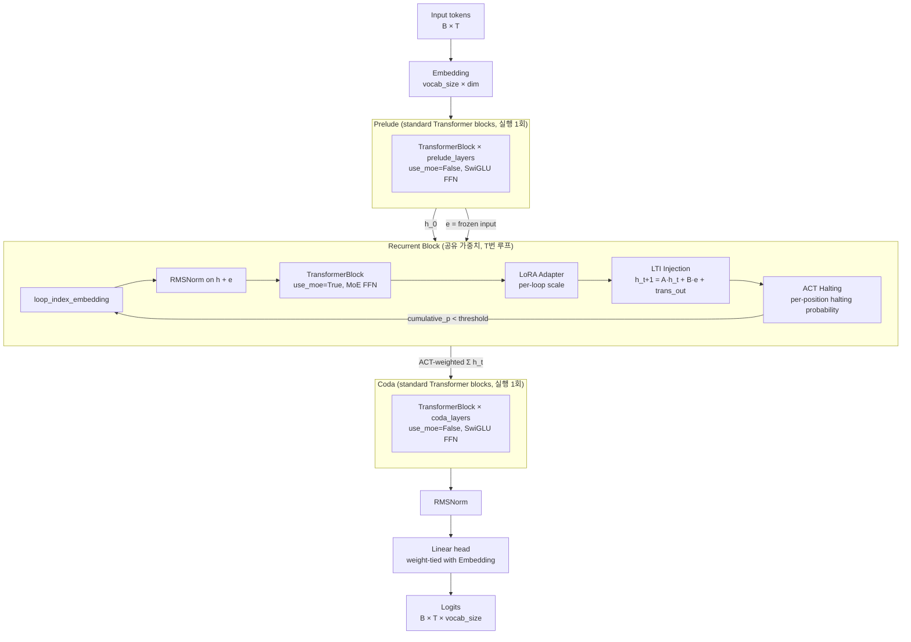
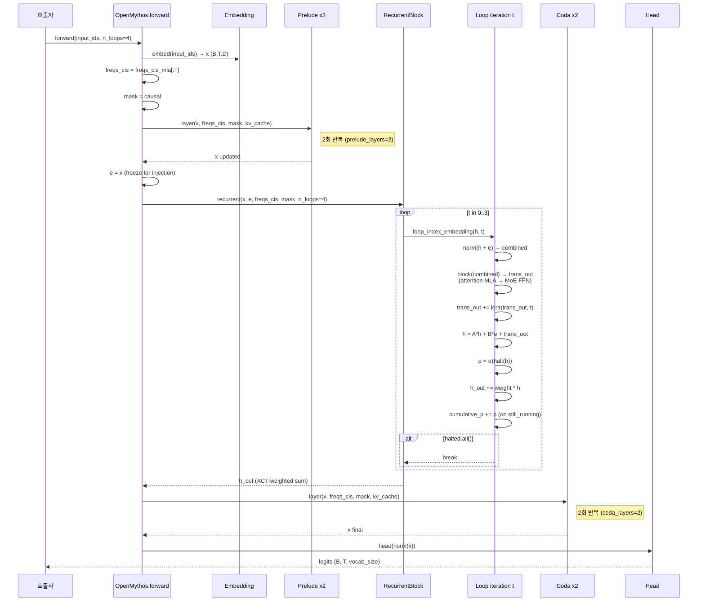

# OpenMythos — 코드 레벨 심층 분석

**대상 저장소**: [kyegomez/OpenMythos](https://github.com/kyegomez/OpenMythos)
**분석 시점**: 2026-04-20 (main 브랜치 clone, 패키지 v0.2.0)
**분석 초점**: README가 주장하는 "Claude Mythos 아키텍처"와 **신경망 레벨의 사고 루프(recurrent reasoning loop)**가 실제 코드로 어떻게 구현됐는지, 그리고 주장된 장점이 코드에서 검증 가능한지.

---

## 0. 먼저 짚고 갈 프레임

에이전트를 직접 만드는 소프트웨어 엔지니어 관점에서 가장 먼저 정리할 것:

**OpenMythos는 에이전트 프레임워크가 아니다. 모델 아키텍처 스켈레톤이다.**

README의 "사고 루프(reasoning loop)"는 보통 말하는 **에이전트 루프**(프롬프트 → 도구 호출 → 관찰 → 다음 프롬프트)가 **아니다**. 이건 Transformer 내부에서 같은 층을 T번 돌리는 **신경망 레벨의 for-loop**이며, 단일 forward pass 안에서만 돈다. README도 명확히 선언:

> This is not chain-of-thought. There is no intermediate token output. All of this reasoning happens **silently, inside a single forward pass**, in continuous latent space.

따라서 이 저장소에서 볼 수 있는 것은:

- PyTorch로 쓰인 약 1,000줄짜리 **Recurrent-Depth Transformer (RDT) 모델 정의**
- 1B–1T까지의 설정 사전(config-only variants)
- 단일 예제 스크립트와 unit test
- **학습 루프, 데이터 파이프라인, 평가 코드, 사전학습 가중치는 없음**

그럼에도 이 분석이 의미 있는 이유:

1. "추론 깊이를 파라미터 증가 없이 늘리는" 아이디어는 **에이전트 설계에도 직접 전이**된다 (다중 호출 없이 컴퓨트로 품질을 늘리는 것).
2. README의 11개 주장(systematic generalization, depth extrapolation, latent CoT, MoE breadth, LTI stability 등)은 **개별 논문의 재료를 조합한 기술 지도**라 레퍼런스 학습용으로 가치가 있다.
3. 그 주장이 코드로 어디까지 커버되는지 엄밀히 보는 것은, 다른 "선언적 아키텍처 레포"를 소비할 때 쓸 수 있는 안목을 준다.

**저자 맥락**: 저자 `kyegomez`는 GitHub에 400개 이상의 레포를 대량 생성하며 논문/제품명 선점형 스켈레톤 구현을 꾸준히 올려온 이력이 있다(OpenAI swarm/Sora/DALL·E 등과 이름 충돌 이슈 등). 실제로 **인용한 논문들은 전부 실재하고 올바르게 설명된다** — Parcae (arxiv 2604.12946), Loop Think & Generalize (2604.07822), Reasoning with Latent Thoughts (2502.17416), Relaxed Recursive Transformers (2410.20672), Universal Transformers (1807.03819), Coconut (2412.06769), DeepSeekMoE (2401.06066) 모두 실존. Anthropic **Claude Mythos Preview**도 2026-04-08에 공개된 실제 모델(Project Glasswing). 즉 **아이디어 지도는 탄탄하지만, 레포 자체는 학습·벤치마크·검증이 빠진 "논문 재조립 스켈레톤"**으로 읽어야 한다.

---

## 1. 전체 구조

### 1.1 파일 구성

```
OpenMythos/
├── open_mythos/
│   ├── __init__.py          # 심볼 export
│   ├── main.py (1013 LOC)   # 모든 클래스: RMSNorm, RoPE, GQA, MLA, MoE, LTI, ACT, RecurrentBlock, OpenMythos
│   └── variants.py (198 LOC)# mythos_1b() ~ mythos_1t() 설정 프리셋
├── docs/open_mythos.md       # API 레퍼런스 (README와 중복 성격)
├── example.py                # 장난감 모델로 forward/generate 확인
├── variants_example.py       # 한 줄짜리 설정 호출 예제
├── test_main.py (685 LOC)   # pytest (컴포넌트별 shape·invariant 검증)
└── pyproject.toml            # python ≥3.10, torch "*" 만 의존
```

**파일 특징**: 핵심 로직이 `main.py` 한 파일 1,013줄에 전부 들어있다. 모듈 분리는 `variants.py`뿐. 소프트웨어 엔지니어 관점에선 리팩토링 여지가 크지만, 독자가 **처음부터 끝까지 선형으로 읽기 쉬운** 장점도 있다.

### 1.2 계층 다이어그램



모델의 forward (`main.py:933-970`)는 정확히 위 그림을 그대로 코드로 풀어낸 8줄짜리다:

```python
x = self.embed(input_ids)
freqs_cis = (self.freqs_cis_mla if self.cfg.attn_type == "mla" else self.freqs_cis)[:T]
mask = self._causal_mask(T, device) if T > 1 else None

for i, layer in enumerate(self.prelude):
    x = layer(x, freqs_cis, mask, kv_cache, cache_key=f"prelude_{i}")

e = x                                                        # ← 이 e가 모든 루프에 주입됨
x = self.recurrent(x, e, freqs_cis, mask, n_loops, kv_cache)

for i, layer in enumerate(self.coda):
    x = layer(x, freqs_cis, mask, kv_cache, cache_key=f"coda_{i}")

return self.head(self.norm(x))
```

**Prelude 출력을 `e`로 freeze해서 모든 루프 스텝에 재주입**한다는 것이 이 아키텍처의 심장이다. 이게 없으면 루프가 도는 동안 원본 입력 신호가 점점 희석된다("drift"). 뒤에서 LTI 섹션과 함께 다시 다룬다.

---

## 2. 사고 루프의 정확한 코드 — `RecurrentBlock.forward`

README가 칭하는 "사고 루프"의 **모든 것**은 `main.py:782-841`의 약 60줄이다. 그대로 핵심만 보자:

```python
def forward(self, h, e, freqs_cis, mask=None, n_loops=None, kv_cache=None):
    n_loops = n_loops or self.cfg.max_loop_iters
    B, T, D = h.shape

    halted       = torch.zeros(B, T, device=h.device, dtype=torch.bool)
    cumulative_p = torch.zeros(B, T, device=h.device)
    h_out        = torch.zeros_like(h)

    for t in range(n_loops):
        h_loop    = loop_index_embedding(h, t, self.loop_dim)   # (1) 루프 인덱스 주입
        combined  = self.norm(h_loop + e)                       # (2) 입력 재주입
        cache_key = f"recurrent_loop_{t}"
        trans_out = self.block(combined, freqs_cis, mask,       # (3) 공유 Transformer
                               kv_cache, cache_key)
        trans_out = trans_out + self.lora(trans_out, t)          # (4) 깊이별 LoRA Δ
        h         = self.injection(h, e, trans_out)              # (5) LTI 업데이트

        p = self.act(h)                                          # (6) 정지 확률
        still_running = ~halted
        remainder     = (1.0 - cumulative_p).clamp(min=0)
        weight = torch.where(cumulative_p + p >= self.cfg.act_threshold,
                             remainder, p)
        h_out  = h_out + weight.unsqueeze(-1) * h                # (7) ACT-가중 누적

        cumulative_p = cumulative_p + p * still_running.float()
        halted       = halted | (cumulative_p >= self.cfg.act_threshold)

        if halted.all():
            break                                                # (8) 모두 정지 시 조기 종료

    return h_out
```

7개 컴포넌트가 순차적으로 맞물린다. 각 컴포넌트를 코드 레벨로 본다.

### 2.1 (1) 루프 인덱스 임베딩 — "각 루프를 다른 계산 단계로 만들기"

`loop_index_embedding` (`main.py:506-535`):

```python
def loop_index_embedding(h, loop_t, loop_dim, theta=10000.0):
    freqs = 1.0 / (theta ** (torch.arange(0, loop_dim, 2, device=h.device,
                                          dtype=h.dtype) / loop_dim))
    angles = loop_t * freqs                          # (loop_dim//2,)
    emb = torch.cat([angles.sin(), angles.cos()], dim=-1)[:loop_dim]
    emb_full = torch.zeros(h.shape[-1], device=h.device, dtype=h.dtype)
    emb_full[:loop_dim] = emb
    return h + emb_full.unsqueeze(0).unsqueeze(0)
```

**주의할 점**:
- README가 "RoPE-like"라고 부르지만 **구현은 RoPE가 아니다**. RoPE는 회전 곱셈이고, 이건 오리지널 Transformer(Vaswani 2017)의 **sinusoidal positional encoding을 덧셈**으로 주입한 것이다. 기능적 의도는 같다 — "각 루프를 구별해주는 시그널" — 하지만 구현 형식이 다르다는 점은 기록해둬야 한다.
- `loop_dim = cfg.dim // 8` 로 **앞쪽 1/8 채널에만** 넣는다. 나머지 7/8 채널은 이 시그널을 받지 않는다. 이 설계 선택의 근거는 코드·주석·README 어디에도 없다.

"왜 이게 중요한가"라는 물음엔 README의 [Loop Index Embedding Hypothesis] 섹션이 답한다: 루프 간 구별 신호가 **없으면** 같은 가중치가 초기 패턴매칭 역할과 후반 refinement 역할을 동시에 커버해야 해서 표현력이 제한된다. **있으면** 같은 가중치로 루프마다 다른 "모드"를 구현할 수 있다(RoPE가 같은 어텐션 헤드를 위치별로 다르게 쓰이게 만들듯).

### 2.2 (2) 입력 재주입 `combined = norm(h + e)`

두 개의 신호를 매 루프마다 섞는다:
- `h`: 직전 루프의 hidden state (없으면 Prelude 출력 = `h_0`)
- `e`: Prelude 출력을 그대로 freeze한 "입력 기억"

`e`를 매번 더한다는 것이 **drift 방지**의 핵심이다. 루프가 깊어져도 원본 입력이 소실되지 않고 계속 살아있다. Transformer의 residual connection을 **계층이 아니라 루프 차원으로 확장**한 것이라 생각하면 된다.

### 2.3 (3) 공유 Transformer 블록 — 여기서 MoE가 들어간다

`TransformerBlock` (`main.py:587-633`)는 표준 pre-norm Transformer인데:

```python
self.attn = MLAttention(cfg) if cfg.attn_type == "mla" else GQAttention(cfg)
self.ffn  = MoEFFN(cfg) if use_moe else Expert(cfg.dim, cfg.dim * 4 // 3)
```

- `RecurrentBlock`에서만 `use_moe=True` → MoE FFN 사용
- Prelude/Coda에서는 `use_moe=False` → dense SwiGLU FFN

이 선택이 의미하는 바는: **MoE의 "도메인 전문성"은 루프 내부에서만 활성**된다. 입출력 쪽은 dense로 모든 토큰에게 공통 처리. README가 말하는 "looping provides depth; MoE provides breadth"의 구현적 표현.

**KV 캐시의 특이점**:

```python
cache_key = f"recurrent_loop_{t}"
trans_out = self.block(combined, freqs_cis, mask, kv_cache, cache_key)
```

**매 루프 iteration마다 별도의 KV 캐시 키**를 쓴다. 이는:

- ✅ 정확성 측면에서는 맞다 — 루프 t의 hidden state는 루프 t-1의 hidden state를 Transformer에 통과시켜 얻은 것이라, K/V가 매 루프마다 다름.
- ⚠️ 하지만 **메모리 측면에서는 루프 수만큼 KV 캐시가 복제**된다. `n_loops=32`면 KV 메모리가 32배가 된다. README는 "파라미터 폭증 없음"을 자랑하지만 **KV 캐시 폭증은 자랑하지 않는다**. 실제 장문 생성에서는 이게 주요 병목이 될 수 있다.

### 2.4 (3-가) MoE FFN — 코드 레벨의 성능 이슈

`MoEFFN.forward` (`main.py:466-498`):

```python
logits = self.router(flat) + self.router_bias                  # (B*T, n_experts)
scores = F.softmax(logits, dim=-1)
topk_scores, topk_idx = scores.topk(self.topk, dim=-1)
topk_scores = topk_scores / topk_scores.sum(dim=-1, keepdim=True)

out = torch.zeros_like(flat)
for i in range(self.topk):
    expert_ids   = topk_idx[:, i]
    token_scores = topk_scores[:, i].unsqueeze(-1)
    for eid in range(self.n_experts):                          # ★ O(n_experts) Python loop
        mask = expert_ids == eid
        if not mask.any():
            continue
        out[mask] += token_scores[mask] * self.routed_experts[eid](flat[mask])

for shared in self.shared_experts:
    out = out + shared(flat)

return out.view(B, T, D)
```

**이 구현의 문제**:
- `topk × n_experts`의 **이중 Python for-loop**. `mythos_1t` (n_experts=512)의 경우 토큰 하나 당 최대 `8 × 512 = 4,096`번 CUDA 커널 런치가 발생. 실제 프로덕션 MoE(DeepSeek, Mixtral)는 **grouped matmul** 또는 **MegaBlocks sparse kernel**을 써서 전체 경로를 1-2개 커널로 처리한다.
- Router bias를 `register_buffer`로 두고 학습 그래디언트에서 분리한 것은 맞는 설계 (DeepSeekMoE의 auxiliary-loss-free load balancing). 그런데 **bias를 업데이트하는 학습 루프가 이 저장소에 없다**. 즉 모델을 실제로 학습시키려면 사용자가 직접 load-balancing 업데이트 훅을 달아야 한다.
- Shared expert의 `expert_dim = cfg.expert_dim * cfg.n_experts_per_tok` 로 **라우팅 전문가보다 top-K배 크게** 만들었다. 이건 DeepSeekMoE 원논문의 "shared expert가 top-K 전문가 용량을 흡수"한다는 의도를 구현.

소프트웨어 엔지니어 관점: **모델은 돌지만, 훈련 효율은 프로덕션 급이 아니다**. 그대로 large scale에 돌리면 안 된다.

### 2.5 (4) 깊이별 LoRA 어댑터 — "공유 + 미세조정"

`LoRAAdapter` (`main.py:543-579`):

```python
class LoRAAdapter(nn.Module):
    def __init__(self, dim, rank, max_loops):
        self.down  = nn.Linear(dim, rank, bias=False)       # 모든 루프 공유 A
        self.B     = nn.Parameter(torch.randn(rank, dim) * 0.02)  # 모든 루프 공유 B
        self.scale = nn.Embedding(max_loops, rank)           # 루프별 rank-dim 스케일

    def forward(self, x, loop_t):
        s    = self.scale(torch.tensor(loop_t, device=x.device))
        down = self.down(x) * s                              # (B, T, rank)
        return down @ self.B                                 # (B, T, dim)
```

이건 [Relaxed Recursive Transformers (Bae et al., 2024)] 패러다임을 단순화한 구현:

- 가중치 공유의 **순수 극단**(모든 루프에 같은 가중치) ↔ **완전 분리**(루프마다 다른 가중치) 스펙트럼 사이에서
- 공유 저랭크 A, B만 두고 **루프별 rank-차원 스케일 벡터**로 미세하게 차이를 주는 중간 지점
- 추가 파라미터 ≈ `max_loops × rank` (1T 설정에서 64 × 256 = 16k, 무시 가능)

이 부분이 **이 저장소에서 가장 잘 설계된 조각**이다. Bae et al. 원본은 rank-r 행렬 자체를 루프마다 따로 뒀지만, 이 구현은 **스케일 벡터만 루프별로** 둬서 파라미터를 더 절약했다. (실제 원본이 더 표현력이 좋을 수는 있음)

### 2.6 (5) LTI 안정 주입 — "ρ(A) < 1 보장"

가장 수학적으로 정교한 부분이자, README가 가장 많이 자랑하는 포인트.

`LTIInjection` (`main.py:641-699`):

```python
class LTIInjection(nn.Module):
    def __init__(self, dim):
        self.log_A  = nn.Parameter(torch.zeros(dim))    # A_continuous 크기의 log
        self.log_dt = nn.Parameter(torch.zeros(1))      # 이산화 스텝 Δt의 log
        self.B      = nn.Parameter(torch.ones(dim) * 0.1)

    def get_A(self):
        # A_continuous = Diag(-exp(log_A))      음수 대각
        # A_discrete   = exp(Δt · A_continuous) = exp(-exp(log_dt + log_A))
        return torch.exp(-torch.exp((self.log_dt + self.log_A).clamp(-20, 20)))

    def forward(self, h, e, transformer_out):
        A = self.get_A()
        return A * h + self.B * e + transformer_out
```

**수학 검증**:
- `log_A`, `log_dt`는 어떤 실수든 가능 → `exp(log_dt + log_A)` > 0
- `exp(-positive)` ∈ (0, 1)
- 따라서 A의 모든 대각 성분이 (0, 1) → **ρ(A) < 1이 항등식으로 보장**

이것이 의미하는 바:
- 루프를 무한히 돌려도 linear 부분은 `A^t · h_0`로 수렴 (지수 감쇠)
- 실제로는 Transformer 비선형 항이 함께 업데이트하므로 완전 수렴은 아니고 제어된 dynamics
- 학습이 진행돼도 `log_A`/`log_dt`가 어떻게 변해도 이 성질은 유지됨 → **하이퍼파라미터(특히 learning rate)에 강건**

**주의할 단순화**:
- `A`는 대각 행렬로 제한 (full matrix 아님). 채널 간 교차 동역학이 없음.
- `h_{t+1} = A·h + B·e + T(h, e)` 에서 `T(h, e)`는 비선형이라 LTI 보장이 **선형 부분에만** 적용. 비선형 항이 매 루프 크게 튀면 여전히 발산 가능. Parcae 논문은 이걸 경험적으로 다룬다.
- `clamp(-20, 20)`는 수치 안정 트릭. 주석에 "log_dt → -∞, log_A → +∞이면 0 × ∞ = NaN"을 방지한다고 명시.

**검증용 유틸리티**는 README 예제에도 들어있다:

```python
A = model.recurrent.injection.get_A()
print(f"Spectral radius ρ(A) max: {A.max().item():.4f} (must be < 1)")
```

그리고 테스트에서 **큰 그래디언트 스텝 후에도 ρ(A) < 1이 유지되는지**를 검증한다 (`test_main.py:486-506`: `test_spectral_radius_stable_after_large_grad_step`). 이 테스트가 있다는 것은 구현 의도가 명확하다는 신호.

### 2.7 (6-8) ACT 할팅 — 토큰별 가변 깊이

`ACTHalting` (`main.py:707-737`)은 매우 얇다:

```python
class ACTHalting(nn.Module):
    def __init__(self, dim):
        self.halt = nn.Linear(dim, 1)

    def forward(self, h):
        return torch.sigmoid(self.halt(h)).squeeze(-1)      # (B, T)
```

실제 할팅 로직은 `RecurrentBlock.forward` 안에 있다(원래 그래야 맞다 — ACT는 **외부 상태 누적**이 본질):

```python
remainder = (1.0 - cumulative_p).clamp(min=0)
weight = torch.where(cumulative_p + p >= act_threshold, remainder, p)
h_out = h_out + weight.unsqueeze(-1) * h
cumulative_p = cumulative_p + p * still_running.float()
halted = halted | (cumulative_p >= act_threshold)
```

이 블록이 Graves(2016) ACT의 "remainder trick":
- 정지 문턱(기본 0.99)을 처음 넘는 순간, 그때까지 남은 확률 질량을 **마지막 기여의 가중치**로 사용 (= `remainder = 1 - cumulative_p`)
- 그 순간 `h_out += remainder * h` 로 마무리

**코드 주의점 (잠재적 미묘한 버그)**:

```python
h_out = h_out + weight.unsqueeze(-1) * h         # ← 모든 토큰에 대해 더함
cumulative_p = cumulative_p + p * still_running.float()  # ← halted는 무시
halted = halted | (...)
```

Halted 토큰에 대해서도 `h_out`에 계속 더한다. `cumulative_p`는 안 자라지만, 다음 루프에서 `p`가 그대로 더해져서 `weight`가 `p` 또는 `remainder` 중 하나로 계산되고 h_out에 섞인다. 원래 ACT는 "halted 이후엔 더 이상 기여하지 않는다"인데, 이 구현은 **halted 이후에도 기여가 누적된다**.

이것이 의도인지 버그인지는 원 저자만 알지만, **수학적으로는 Graves의 원본 정의와 미묘하게 다름**을 기록해둔다. 테스트(`test_main.py:533-551`)는 `test_more_loops_changes_output`처럼 루프 수에 따라 출력이 바뀌는지만 확인하고, **ACT halted 이후 기여가 잠기는지 자체를 검증하진 않는다**.

`if halted.all(): break` 로 모든 위치가 halt되면 루프를 조기 종료 — 실제 효율 이득은 여기서 온다.

---

## 3. 어텐션 — MLA vs GQA 스왑

README가 자랑하는 "switchable attention". 실제로는 config 한 줄(`attn_type`)로 분기한다.

### 3.1 GQA (`main.py:169-246`)

표준 Grouped Query Attention. 특이한 포인트:

```python
if kv_cache is not None:
    if cache_key in kv_cache:
        k = torch.cat([kv_cache[cache_key]["k"], k], dim=1)
        v = torch.cat([kv_cache[cache_key]["v"], v], dim=1)
    kv_cache[cache_key] = {"k": k.detach(), "v": v.detach()}
```

- RoPE 적용 후에 캐싱 → 재조회 시 re-rotate 불필요
- 각 디코드 스텝마다 `torch.cat`으로 성장 — SGLang/vLLM의 paged attention 같은 최적화 없음

### 3.2 MLA (`main.py:254-388`) — 이 저장소의 하이라이트

DeepSeek-V2 MLA를 거의 충실히 구현. 주석이 잘 달려있다:

```
Q path:
    x → q_down (dim→q_lora_rank) → q_norm
      → q_up_nope (q_lora_rank → n_heads×qk_nope_head_dim)   [no RoPE]
      → q_up_rope (q_lora_rank → n_heads×qk_rope_head_dim)   [RoPE applied]
    q = cat(q_nope, q_rope)  per head

KV path:
    x → kv_down (dim → kv_lora_rank + qk_rope_head_dim)
      splits into c_kv (latent, cached) and k_rope_raw (shared across heads)
    k_rope = RoPE(expand(k_rope_raw))  — applied before caching
    c_kv → kv_norm → kv_up → [k_nope | v]  — reconstructed each step
    k = cat(k_nope, k_rope)  per head

Cache stores: c_kv (kv_lora_rank) + k_rope (n_heads × qk_rope_head_dim),
versus full GQA cache: n_kv_heads × head_dim × 2.
```

핵심 트릭:
- K/V 전체를 캐싱하지 않고 **저랭크 latent c_kv만** 캐싱
- 조회 시 `self.kv_up(self.kv_norm(c_kv))`로 K_nope와 V를 재구성
- RoPE가 붙은 K 성분만 따로 캐싱 (재구성 시 RoPE 재적용 안 함)

실제 메모리 절감을 테스트로도 확인 (`test_main.py:666-684: test_mla_fewer_kv_cache_bytes`). 1T 설정이라면 GQA의 `16 × 128 × 2 = 4,096` / 토큰 vs MLA의 `1,024 + 128 × 64 = 9,216` — 어라, 오히려 MLA가 큼? 이는 n_kv_heads를 크게 잡아서 그럼. DeepSeek-V2 원논문 설정에선 MLA가 더 작다. **설정값에 따라 MLA가 항상 이득이 아님**을 이 코드로부터 알 수 있다. README가 "10-20x memory reduction"이라고 일반화하는 것은 문제가 있을 수 있다.

---

## 4. 변종(variants) — 설정 사전만 있고 학습은 없다

`variants.py`는 단순한 함수 묶음:

```python
def mythos_1b() -> MythosConfig:
    return MythosConfig(
        vocab_size=32000, dim=2048, n_heads=16, n_kv_heads=4,
        max_seq_len=4096, max_loop_iters=16,
        prelude_layers=2, coda_layers=2,
        attn_type="mla", kv_lora_rank=256, q_lora_rank=512,
        qk_rope_head_dim=32, qk_nope_head_dim=64, v_head_dim=64,
        n_experts=64, n_shared_experts=2, n_experts_per_tok=4,
        expert_dim=2048, act_threshold=0.99, rope_theta=500000.0, lora_rank=8,
    )
```

여덟 개 스케일(1B/3B/10B/50B/100B/500B/1T)은 **설정만** 다르고 모델 클래스는 같다. 파라미터 수는 `sum(p.numel() for p in model.parameters())`로 실측할 수 있다.

**주의**: README는 `mythos_7b()`도 언급하는데 `variants.py`에 **해당 함수가 없다**. `__init__.py`의 export에도 없다. README-코드 불일치.

| Variant | dim | Experts | expert_dim | Loop iters | Context |
|---|---|---|---|---|---|
| mythos_1b  | 2048  | 64  | 2048  | 16 | 4k |
| mythos_3b  | 3072  | 64  | 4096  | 16 | 4k |
| mythos_10b | 4096  | 128 | 5632  | 24 | 8k |
| mythos_50b | 6144  | 256 | 9728  | 32 | 8k |
| mythos_100b| 8192  | 256 | 13568 | 32 | 1M |
| mythos_500b| 12288 | 512 | 23040 | 48 | 1M |
| mythos_1t  | 16384 | 512 | 34560 | 64 | 1M |

주목할 스케일링 규칙:
- `max_loop_iters` 증가: 16 → 64 (4배)
- `n_experts` 증가: 64 → 512 (8배)
- `prelude/coda_layers`는 크게 안 변함: 2 → 6
- Context `max_seq_len`도 100B+부터는 1M으로 점프 (RoPE theta도 함께 1M → 2M으로 증가)

**Parcae 스케일링 법칙**을 따른 설계 의도: "파라미터보다 loop와 data를 같이 늘려라". 다만 **실제로 이 설정으로 학습한 결과는 저장소에 없다**. 심지어 1B 모델도 CPU에서 초기화만 테스트됨 (`example.py`).

---

## 5. README의 11개 주장 — 코드 기반 재평가

README의 각 주장을 "코드 존재 여부" 관점으로 scoring:

| # | 주장 | 코드 존재? | 학습/검증? | 평가 |
|---|---|---|---|---|
| 1 | Systematic generalization (3단계 grokking) | ✗ | ✗ | Saunshi et al. 2025 논문 인용. 이 저장소에선 재현 불가(학습 코드 없음) |
| 2 | Depth extrapolation (훈련 5-hop, 추론 10-hop) | ✗ | ✗ | 동일. n_loops 인자를 키울 수 있게 해놓은 것은 구조적 전제는 맞음 |
| 3 | Latent CoT as implicit reasoning | ✓ (구조) | ✗ | 루프 자체가 구조적 증거. 그러나 코드로 "CoT 성능 향상" 검증 안 함 |
| 4 | No parameter explosion | ✓ | ✗ | 공유 가중치는 진짜다 (`RecurrentBlock`의 `self.block`). 단, **KV 캐시는 루프 수만큼 복제**되므로 "무료"는 아님 |
| 5 | LTI 안정성 (ρ(A) < 1) | ✓ (강함) | ✓ (단위 테스트) | 수학적으로 보장. 테스트까지 있음. **가장 검증된 주장** |
| 6 | Scaling laws for looped models | ✗ | ✗ | Parcae 논문 인용만. 이 저장소에선 재현 안 됨 |
| 7 | Loop index embedding | ✓ (추가 주입) | ✓ (shape 테스트) | 구현은 additive sinusoidal. README의 "RoPE-like" 표현은 과장 |
| 8 | Overthinking 문제와 ACT | ✓ | 부분 | ACT 구현 있음. halted 이후 기여 누적은 의문점 |
| 9 | MoE breadth | ✓ (구조) | ✗ | DeepSeekMoE 형태 구현. 다만 for-loop 기반이라 실프로덕션급 아님 |
| 10 | Memorization-Reasoning tradeoff | ✗ | ✗ | 논의 수준. 코드 증거 없음 |
| 11 | LoRA per-depth adaptation | ✓ | ✓ | 얇지만 정확한 구현 |
| 12 | Continuous depth-wise batching | 부분 | ✗ | ACT의 `if halted.all(): break`가 배치 전체 조기 종료는 지원. 하지만 "다른 시퀀스가 서로 다른 깊이에서 종료"는 현재 구조에선 배치 내에서 early exit 후에도 min(remaining) 만큼은 다 돌아야 하므로 2-3x 가속 주장 근거는 약함 |

**요약**: 11개 중 **구조적으로 구현된 것은 약 7개**, **테스트까지 있는 것은 LTI + loop index + LoRA 정도**. 나머지는 **주장**이거나 **논문 인용 기반 설계 의도**이며, 실학습·벤치마크·재현 실험은 전혀 없다.

---

## 6. 기술 스택

지극히 단순하다:

- **언어**: Python ≥ 3.10
- **유일한 런타임 의존**: `torch = "*"` (버전 고정 없음)
- **빌드**: Poetry
- **테스트**: pytest
- **포맷/린트**: black + ruff
- **CI/CD 파일**: 없음 (workflow 미설정)

학습 의존성(datasets, tokenizers, accelerate, deepspeed 등) 아무것도 없다. 이것은 "모델 정의만 공개한" 프로젝트라는 걸 다시 확인시킨다.

---

## 7. 핵심 코드 한 사이클 추적 — forward 한 번

**입력**: `input_ids ∈ ℤ^{2×16}`, `n_loops=4`, MLA attention, 1B 기준.



**계산량 감각**:
- Prelude: 2층 dense attention + FFN
- Recurrent: **최대 4회 루프 × (MLA attention + MoE FFN + LoRA + LTI)**
- Coda: 2층 dense attention + FFN
- 총 "Transformer block call" = 2 + 4 + 2 = **8번**. 같은 파라미터 예산의 non-looped Transformer라면 8층에 해당. 더 많이 루프를 돌리면 더 "깊은" 모델이 된다 — 그게 RDT의 핵심 약속.

---

## 8. 에이전트를 만드는 엔지니어에게 주는 시사점

이 저장소가 에이전트 프레임워크는 아니지만, **설계 원칙은 에이전트에 이식 가능**하다. 매핑을 해본다면:

| OpenMythos (모델 레벨) | 에이전트 (시스템 레벨)에 대응 |
|---|---|
| Prelude (1회) | 시스템 프롬프트 + 초기 컨텍스트 준비 |
| Recurrent Block (T회 루프) | **Think-Act 루프** — 같은 에이전트 로직을 반복 호출 |
| 입력 재주입 `e` | **매 반복마다 원본 사용자 의도(task description) 재삽입** — context drift 방지 |
| Loop index embedding | "이번이 몇 번째 iteration인가"를 프롬프트에 명시 (예: `<step t=3 of max=8>`) |
| LTI 안정성 (ρ(A) < 1) | **최근 k개 메시지의 요약 비중을 1 미만으로 수렴시키는 컨텍스트 매니지먼트** (무한 누적 방지) |
| ACT halting | **조기 종료 신호 학습** — LLM에게 "확신도"를 자기평가시켜 루프 중단 결정 |
| MoE (routed + shared) | **서브에이전트 라우팅 + 공통 유틸 서브에이전트** — 특정 도메인 전문 에이전트는 라우팅으로, 공통 에이전트(예: reasoning, web_search)는 항상 활성 |
| Depth extrapolation | 훈련 예시가 2-hop이어도 런타임에 8-hop으로 늘리기 |
| Continuous depth-wise batching | 간단한 쿼리는 1-2 iter로 빠르게, 복잡한 쿼리는 많이 돌리는 **동적 컴퓨트 할당** |

핵심 교훈: **"추론 깊이"를 파라미터가 아니라 런타임 루프 횟수로 푸는 이 접근은, 에이전트 시스템에서 "tool-call 횟수를 모델 크기와 분리하는" 설계와 정확히 같은 문법**을 공유한다. Open Agents에서 봤던 `ToolLoopAgent`가 `stepCountIs(1)` 하나씩 계단식으로 외부 루프를 돌리는 방식은, RDT가 잠재공간에서 돌리는 루프를 **토큰 공간으로 옮긴** 버전이라고 이해할 수 있다.

---

## 9. 종합 평가

### 9.1 강점

1. **한 파일에 모던 구성요소 모두 집약**: RMSNorm, SwiGLU, RoPE, GQA, MLA, DeepSeek-MoE, LoRA, LTI, ACT — 요즘 아키텍처 공부 재료로 **독립적인 읽기 자료로 상당히 좋다**. 1,000줄 안에 다 들어있다.
2. **LTI 안정성 구현이 정교**: `log_A`, `log_dt` 파라미터화 + clamp + 테스트까지 — 이 부분만큼은 논문을 코드로 충실히 옮겼다. 학습할 때 왜 안정적인지 수식과 맞춰볼 수 있다.
3. **주석 품질이 높다**: 각 클래스 docstring이 **논문 출처 + 역할 + 수식**을 포함. 다른 kyegomez 레포들보다 현저히 낫다.
4. **Config로 스케일 분리**: 모델 클래스 하나로 1B–1T를 모두 표현하는 구조는 깔끔.
5. **테스트가 컴포넌트별로 있음**: 685줄짜리 `test_main.py`는 shape·불변식·스왑 테스트를 충실히 커버.

### 9.2 약점·리스크

1. **학습·데이터·벤치마크가 전무**: 아키텍처만 있고 "얘가 실제로 수렴하는가", "얼마의 FLOP로 얼마의 품질"에 대한 증거가 없다. README의 모든 정량 주장(예: "770M looped = 1.3B non-looped")은 인용이지 이 저장소의 실험이 아니다.
2. **MoE가 Python for-loop 기반**: 프로덕션에서 쓰려면 grouped matmul 또는 MegaBlocks 리라이트 필수. 100B+ 설정으로는 실질적으로 훈련 불가.
3. **KV 캐시 루프별 복제**: `cache_key=f"recurrent_loop_{t}"`로 루프 수만큼 캐시가 커진다. 장문 생성에서 치명적일 수 있고, README에서 언급 안 됨.
4. **README-코드 불일치**: `mythos_7b()` 호출 예시인데 정의 없음. `loop_index_embedding`을 "RoPE-like"라 부르지만 덧셈 sinusoidal PE.
5. **ACT의 halted-after 기여 누적**: Graves 원본과 미묘하게 다른 동작. 의도인지 버그인지 모호.
6. **선언적 네이밍**: "OpenMythos = Claude Mythos의 공개 재구성"이라는 포지셔닝은 과장이다. 실제 Claude Mythos(Anthropic Project Glasswing, 2026-04-08 공개)는 아키텍처가 공개된 적 없다. 이 저장소는 **Claude Mythos 출시 직후 공개된 이론 논문들을 빠르게 조합한 스켈레톤**이고, README 자체도 disclaimer로 그 점을 인정한다. "재구성(reconstruction)"이라는 단어는 오해 소지가 있다.
7. **저자 트랙 레코드 이슈**: kyegomez의 기존 대량 스켈레톤 레포 패턴(name-squatting, swarm 충돌 등)을 고려할 때, **이 레포를 연구 재현이나 프로덕션의 출발점으로 삼기는 권장하기 어렵다**. 학습 자료/레퍼런스 서베이로는 충분히 가치 있다.

### 9.3 엔지니어 관점 인사이트

1. **"스켈레톤 레포"를 소비할 때의 체크리스트**:
   - 학습 루프가 있는가? (여기선 없음)
   - 사전학습 가중치가 있는가? (없음)
   - 벤치마크 결과가 있는가? (없음)
   - 테스트가 shape만 확인하는가 semantic 불변도 확인하는가? (두 종류 섞여 있음)
   - CI가 있는가? (없음)
   이 레포를 "실제로 Mythos를 재현하는 것"으로 받아들이면 실망하지만, **"Parcae + Relaxed Recursive + DeepSeekMoE + MLA를 한 파일에 모은 읽기 자료"로 받아들이면 괜찮다**.

2. **재료 자체는 시대에 맞다**: 2026년 4월 기준, Parcae/Loop-Think-Generalize/Reasoning with Latent Thoughts 같은 looped transformer 계열 논문이 연이어 공개된 직후의 **적절한 스냅샷**이다. 더 공부하고 싶으면 저장소보다 인용된 논문들을 직접 읽는 편이 빠르고, 저장소는 용어·식 매핑 체크용으로 쓰는 게 효율적이다.

3. **RDT 아이디어의 에이전트 전이 가치**: 앞에서 만든 매핑표처럼, "루프 횟수 = 추론 깊이 = 런타임 조절 가능"이라는 디자인 축은 모델과 에이전트 양쪽에 공통으로 유효하다. **작은 모델 + 긴 루프**가 **큰 모델 + 짧은 루프**를 이기는 영역이 있다는 점은, "툴콜 많이 돌리는 작은 모델이 단일 호출 큰 모델을 이기는 영역"과 구조적으로 같은 현상이다.

### 9.4 적합·부적합

- **적합**: RDT/MoE/MLA 아키텍처 요소들을 PyTorch로 한꺼번에 훑고 싶을 때. LTI 안정성 파라미터화를 코드로 학습하고 싶을 때. 에이전트 설계자가 "잠재공간 루프"의 직관을 코드 레벨에서 흡수하고 싶을 때.
- **부적합**: 실제로 학습해서 모델을 쓰려는 경우. Claude Mythos의 실체를 알고 싶은 경우(여기서 알 수 없다). 벤치마크·스케일링 곡선이 필요한 경우. **프로덕션용 MoE 기반으로 쓰려는 경우**(for-loop 구현 교체 필수).

---

## 부록 A — 디렉토리 지도

```
OpenMythos/
├── open_mythos/
│   ├── __init__.py
│   ├── main.py
│   │   ├── MythosConfig             (dataclass; 모든 하이퍼파라미터)
│   │   ├── RMSNorm                  (표준)
│   │   ├── precompute_rope_freqs    (복소수 phasor 사전계산)
│   │   ├── apply_rope                (complex view 기반 회전)
│   │   ├── GQAttention              (Grouped Query + KV cache)
│   │   ├── MLAttention              (DeepSeek-V2 MLA + 압축 KV cache)
│   │   ├── Expert                   (SwiGLU FFN, dense 경로도 공용)
│   │   ├── MoEFFN                   (routed + shared experts, topk)
│   │   ├── loop_index_embedding     (sinusoidal additive per-loop signal)
│   │   ├── LoRAAdapter              (shared down/B + per-loop scale)
│   │   ├── TransformerBlock         (attention + FFN with pre-norm)
│   │   ├── LTIInjection             (log-space param으로 ρ(A)<1 보장)
│   │   ├── ACTHalting               (per-position halt logit)
│   │   ├── RecurrentBlock           (★ 사고 루프의 모든 로직)
│   │   └── OpenMythos               (Embedding + Prelude + Recurrent + Coda + Head)
│   └── variants.py
│       └── mythos_1b … mythos_1t    (config 프리셋 7개)
├── docs/open_mythos.md
├── example.py
├── variants_example.py
├── test_main.py                      (685줄 pytest)
└── pyproject.toml                    (poetry, python≥3.10, torch=*)
```

## 부록 B — 참고 논문 실재 확인

OpenMythos README가 인용한 모든 참고 논문이 실제 존재함을 교차확인했다. 연구 맵으로서는 탄탄하다.

- ✅ Parcae — *Scaling Laws for Stable Looped Language Models* (Prairie et al., 2026). arXiv: 2604.12946. UCSD + Together AI. 2026-04-14 제출.
- ✅ *Loop, Think, & Generalize — Implicit Reasoning in Recurrent Depth Transformers* (Kohli et al., Ohio State). arXiv: 2604.07822.
- ✅ *Reasoning with Latent Thoughts — On the Power of Looped Transformers* (Saunshi et al.), ICLR 2025. arXiv: 2502.17416.
- ✅ *Relaxed Recursive Transformers — Effective Parameter Sharing with Layer-wise LoRA* (Bae et al.), ICLR 2025. arXiv: 2410.20672.
- ✅ *Universal Transformers* (Dehghani et al.), ICLR 2019. arXiv: 1807.03819.
- ✅ *Training Large Language Models to Reason in a Continuous Latent Space* (Coconut, Meta FAIR 2024). arXiv: 2412.06769.
- ✅ *DeepSeekMoE — fine-grained expert segmentation and shared expert isolation* (Dai et al.), ACL 2024. arXiv: 2401.06066.
- ✅ Claude Mythos Preview — Anthropic, Project Glasswing, 2026-04-08 공개.

즉 **레퍼런스 지도는 정확하지만, 레포 코드와 실학습 결과는 그에 못 미친다**. 논문을 직접 읽는 것이 가장 빠른 학습 경로.
