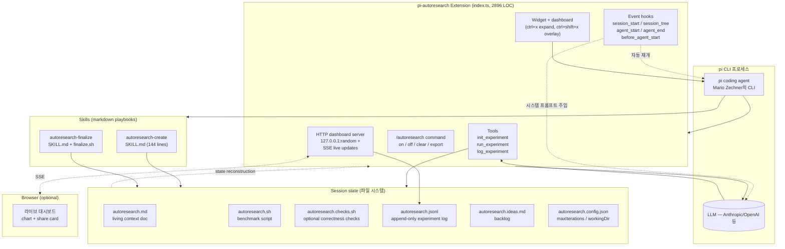

# pi-autoresearch — 코드 레벨 심층 분석

**대상 저장소**: [davebcn87/pi-autoresearch](https://github.com/davebcn87/pi-autoresearch)
**분석 시점**: 2026-04-20 (main 브랜치 clone, 패키지 v1.0.0)
**분석 초점**: 에이전트가 "자율 실험 루프(autonomous experiment loop)"를 돌리도록 만드는 실제 코드 구조 — 사고 루프가 어떤 이벤트·state·툴로 엮이는지, 리드미가 주장하는 장점이 코드와 얼마나 일치하는지.

---

## 0. 한 줄 요약과 프레임

**pi-autoresearch는 "자율 최적화 루프"를 돌리는 pi CLI 에이전트용 확장팩이다.**

```
사용자 → 목표 + 벤치마크 명령 → 에이전트가 무한 루프로
         (코드 수정 → 벤치마크 실행 → 개선되면 keep/auto-commit,
          아니면 discard/auto-revert) → Ctrl-C 전까지 계속
```

이 레포가 해결하려는 문제는 **"LLM 에이전트에게 '하룻밤 동안 혼자 최적화하라'고 시키려면 무엇이 필요한가"** 이다. 답으로 제시된 구성요소는 3가지:

- **Extension** (2,896줄 TypeScript, 하나의 파일): 에이전트가 쓸 3개 툴(`init_experiment`, `run_experiment`, `log_experiment`) + 위젯·대시보드·키보드 단축키 + 시스템 프롬프트 주입 + 자동 재개 루프
- **autoresearch-create 스킬** (144줄 SKILL.md): 사용자에게 목표/명령/메트릭을 물어 세션 파일(`autoresearch.md`, `autoresearch.sh`)을 작성하고 첫 루프를 시작
- **autoresearch-finalize 스킬** (SKILL.md + 442줄 bash): 실험 브랜치를 "논리적 변경 단위 독립 브랜치"들로 깔끔히 정리

영감 원천은 [`karpathy/autoresearch`](https://github.com/karpathy/autoresearch)다. 카르파시의 원본은 **nanoGPT 훈련의 `val_bpb` 한 가지 메트릭**을 밤새 최적화하는 단일 도메인 프로젝트. pi-autoresearch는 그 아이디어를 **도메인 무관**(any command, any metric)으로 일반화한 것이다.

### 0.1 "사고 루프"의 정의

에이전트를 직접 만드는 엔지니어 관점에서, 이 프로젝트가 쓰는 "사고 루프"는 OpenMythos 같은 잠재공간 루프가 아니고, Open Agents 같은 "툴콜 한 턴" 범위도 아니다. **하나의 루프 iteration = "에이전트가 파일을 고치고, 벤치마크를 돌리고, 결과를 로그한 뒤 git에 반영하거나 되돌리는 하나의 cycle"**.

```
             ┌─────────────────────────────────────────┐
             │  (반복)                                  │
             ▼                                          │
  edit files                                            │
    │                                                   │
    ▼                                                   │
  run_experiment(command) ──[METRIC parsing]──▶         │
    │    │                                              │
    │    └─[optional]──▶ autoresearch.checks.sh         │
    ▼                                                   │
  log_experiment(metric, status, asi, …)                │
    │                                                   │
    ├─ status="keep"   → git add -A; git commit         │
    ├─ status="discard"/"crash"/"checks_failed"         │
    │                  → git checkout -- .; git clean   │
    │                    (autoresearch.* 파일만 보존)   │
    └─ 항상 → autoresearch.jsonl에 append ──────────────┘
```

이 루프를 **네버-스탑**으로 만드는 것이 이 저장소의 실질적인 일이다. 코드 레벨에서 "네버-스탑"은 시스템 프롬프트 주입 + agent_end 이벤트에서의 자동 메시지 재주입 + 컨텍스트 예산 감시 + 파일 기반 상태 복구 네 가지가 맞물려 구현된다.

---

## 1. 전체 구조

### 1.1 파일·폴더 지도

```
pi-autoresearch/
├── extensions/
│   └── pi-autoresearch/
│       └── index.ts                 (2,896 LOC — 모든 런타임 로직)
├── skills/
│   ├── autoresearch-create/
│   │   └── SKILL.md                 (세션 부트스트랩 플레이북)
│   └── autoresearch-finalize/
│       ├── SKILL.md                 (브랜치 정리 플레이북)
│       └── finalize.sh              (442 LOC, 실제 git 조작)
├── tests/
│   └── finalize_test.sh             (1,034 LOC bash 단위 테스트)
├── assets/
│   ├── template.html                (1,447 LOC — 로컬 대시보드 HTML)
│   └── logo.webp
├── package.json                     (pi-package 선언)
├── pnpm-lock.yaml / package-lock.json
└── README.md
```

두 가지 눈에 띄는 점:

- **모든 런타임 로직이 단일 파일 2,896줄**. 리팩토링 여지가 크지만, 확장 한 개가 전체 도메인을 다루므로 "한 파일로 끝"이라는 명확한 의도가 있다.
- **스킬은 docs가 아니라 실행 가능 플레이북**. `SKILL.md`는 에이전트(pi)가 직접 읽고 따라하는 markdown-level "프로그램"이며, `finalize.sh`는 그 플레이북 안에서 호출되는 실제 도구.

### 1.2 계층 다이어그램



핵심 원칙 한 줄: **extension은 도메인 무관 인프라, skill은 도메인 지식**. 이 분리가 코드 구조에서 깔끔하게 드러난다.

---

## 2. 사고 루프 — 코드로 본 autonomous loop

### 2.1 루프의 4개 기둥

루프가 돌기 위해 함께 맞물려야 하는 4가지:

1. **시스템 프롬프트 주입** — "NEVER STOP" 규칙이 매 턴 들어감
2. **자동 재개** — 에이전트가 턴을 마치면 자동으로 "계속 돌려"라는 메시지를 재주입
3. **컨텍스트 예산 감시** — 다음 iteration이 컨텍스트 창을 넘길 듯하면 안전하게 종료
4. **파일 기반 상태 복구** — 세션이 끊어져도 jsonl/md에서 모든 상태가 재구성됨

각각을 코드로 본다.

### 2.2 (기둥 1) 시스템 프롬프트 주입 — `before_agent_start`

매 턴이 시작되기 직전, pi가 시스템 프롬프트를 만들어 LLM에 보내기 직전에 확장이 끼어든다 (`index.ts:1377-1415`):

```ts
pi.on("before_agent_start", async (event, ctx) => {
  const runtime = getRuntime(ctx);
  if (!runtime.autoresearchMode) return;

  const workDir   = resolveWorkDir(ctx.cwd);
  const mdPath    = path.join(workDir, "autoresearch.md");
  const ideasPath = path.join(workDir, "autoresearch.ideas.md");
  const hasIdeas  = fs.existsSync(ideasPath);
  const checksPath= path.join(workDir, "autoresearch.checks.sh");
  const hasChecks = fs.existsSync(checksPath);

  let extra =
    "\n\n## Autoresearch Mode (ACTIVE)" +
    "\nYou are in autoresearch mode. Optimize the primary metric through an autonomous experiment loop." +
    "\nUse init_experiment, run_experiment, and log_experiment tools. NEVER STOP until interrupted." +
    `\nExperiment rules: ${mdPath} — read this file at the start of every session and after compaction.` +
    "\nWrite promising but deferred optimizations as bullet points to autoresearch.ideas.md — don't let good ideas get lost." +
    `\n${BENCHMARK_GUARDRAIL}` +
    "\nIf the user sends a follow-on message while an experiment is running, finish the current run_experiment + log_experiment cycle first, then address their message in the next iteration.";

  if (hasChecks) extra += "\n\n## Backpressure Checks (ACTIVE) …";
  if (hasIdeas)  extra += `\n\n💡 Ideas backlog exists at ${ideasPath} …`;

  return { systemPrompt: event.systemPrompt + extra };
});
```

중요 포인트:

- **파일 내용을 프롬프트에 넣지 않고 경로만 넘긴다**. 주석에 명시되어 있다: *"Only a short pointer — no file content, fully cache-safe."* 즉, md 파일이 커져도 시스템 프롬프트 크기는 상수 → Anthropic 프롬프트 캐시 히트가 깨지지 않음. 실제로 긴 세션에서 비용 절감에 직접적인 영향을 주는 설계 결정.
- **`BENCHMARK_GUARDRAIL`**: `"Be careful not to overfit to the benchmarks and do not cheat on the benchmarks."` — 짧지만 강력한 한 줄. 자율 에이전트가 "벤치마크를 교묘히 회피해서 수치만 좋게 만드는" 흔한 실패 모드를 명시적으로 금지.
- **`checks.sh`가 있을 때만 별도 섹션 추가**. 조건부 프롬프트. 이 덕에 필요 없는 도메인에서는 프롬프트를 불리지 않음.

### 2.3 (기둥 2) 자동 재개 — `agent_end` 이벤트

에이전트가 한 턴을 마치면 pi는 `agent_end` 이벤트를 쏜다. 확장이 이를 가로채 **자동으로 사용자 메시지를 대신 넣는다** (`index.ts:1336-1373`):

```ts
pi.on("agent_end", async (_event, ctx) => {
  const runtime = getRuntime(ctx);
  runtime.runningExperiment = null;
  if (overlayTui) overlayTui.requestRender();

  if (!runtime.autoresearchMode) return;
  if (runtime.experimentsThisSession === 0) return;    // 수동 중단 존중

  // 5분에 한 번으로 rate-limit
  const now = Date.now();
  if (now - runtime.lastAutoResumeTime < 5 * 60 * 1000) return;
  runtime.lastAutoResumeTime = now;

  if (runtime.autoResumeTurns >= MAX_AUTORESUME_TURNS /* 20 */) {
    ctx.ui.notify(`Autoresearch auto-resume limit reached …`, "info");
    return;
  }

  const hasIdeas = fs.existsSync(path.join(resolveWorkDir(ctx.cwd), "autoresearch.ideas.md"));
  let resumeMsg = "Autoresearch loop ended (likely context limit). Resume the experiment loop — read autoresearch.md and git log for context.";
  if (hasIdeas) resumeMsg += " Check autoresearch.ideas.md for promising paths to explore. Prune stale/tried ideas.";
  resumeMsg += ` ${BENCHMARK_GUARDRAIL}`;

  runtime.autoResumeTurns++;
  pi.sendUserMessage(resumeMsg);
});
```

**세 가지 안전장치가 맞물린다**:

| 제한 | 값 | 이유 |
|---|---|---|
| `MAX_AUTORESUME_TURNS` | 20 | 무한 자기호출을 끊는 상한 |
| Rate limit | 5분 | 빠른 실패 반복으로 토큰 폭주 방지 |
| `experimentsThisSession === 0` 가드 | — | 사용자가 수동으로 세션을 끝냈다면 재개 안 함 |

이 네 줄이 없으면 어떤 일이 생기는지 상상하기 쉽다: pi 세션이 수동 중단되자마자 5초 안에 다시 자동 시작 → 또 중단 → 또 시작의 무한 루프. 이 로직은 "자율 + 안전"의 균형을 맞추는 실무 교과서.

### 2.4 (기둥 3) 컨텍스트 예산 감시

루프를 돌리면 필연적으로 컨텍스트가 찬다. `run_experiment`는 매번 호출되기 직전 다음 iteration의 토큰 비용을 **예측**하고 들어갈 자리가 없으면 스스로 멈춘다 (`index.ts:357-395, 1593-1601`):

```ts
const CONTEXT_SAFETY_MARGIN = 1.2;  // 20% 버퍼 — 무거운 iter 대비

function estimateTokensPerIteration(history: number[]): number {
  const mean   = history.reduce((a, b) => a + b, 0) / history.length;
  const sorted = [...history].sort((a, b) => a - b);
  const median = sorted[Math.floor(sorted.length / 2)];
  // max(mean, median): outlier-heavy는 mean이, skewed는 median이 크다
  // 둘 중 큰 쪽으로 보수적 예측
  return Math.max(mean, median);
}

function hasRoomForNextIteration(history, current, contextWindow): boolean {
  if (history.length < 1) return true;
  const projected = current + estimateTokensPerIteration(history) * CONTEXT_SAFETY_MARGIN;
  return projected <= contextWindow;
}

// run_experiment 안에서:
advanceIterationTracking(runtime, ctx);
if (isContextExhausted(runtime, ctx)) {
  runtime.autoresearchMode = false;
  ctx.abort();
  return {
    content: [{ type: "text",
      text: "🛑 Context window almost full. Start a new pi session to continue — all progress is saved."
    }],
    details: {},
  };
}
```

토큰 히스토리는 **실제로 완료된 iteration들의 소모 토큰**을 `autoresearch.jsonl`에도 저장해, 세션을 재시작해도 예측 기반이 유지된다(`index.ts:1091-1093`). 이것이 기둥 4와 맞물리는 지점.

**왜 mean과 median의 max인가?** 주석이 분명하다: outlier-heavy(한두 번 긴 실행이 있으면) mean이 부풀고, skewed(대부분 짧지만 가끔 김)면 median이 부풀기 때문에 **둘 중 큰 쪽 = 보수적 상한**. 아주 작은 디테일이지만, 이런 결정들이 "하룻밤 자율 실행"을 현실로 만든다.

### 2.5 (기둥 4) 파일 기반 상태 복구 — `reconstructState`

세션이 종료되거나 컨텍스트가 꽉 차거나 사용자가 pi를 껐다 켜도, 확장이 **`autoresearch.jsonl` 한 파일에서 전체 state를 다시 그린다** (`index.ts:1032-1155`):

```ts
const reconstructState = (ctx: ExtensionContext) => {
  const runtime = getRuntime(ctx);
  // 모든 runtime 필드 초기화
  runtime.lastRunChecks = null;
  runtime.lastRunDuration = null;
  runtime.runningExperiment = null;
  runtime.iterationTokenHistory = [];
  runtime.state = createExperimentState();

  const workDir = resolveWorkDir(ctx.cwd);
  const jsonlPath = path.join(workDir, "autoresearch.jsonl");

  if (fs.existsSync(jsonlPath)) {
    let segment = 0;
    const lines = fs.readFileSync(jsonlPath, "utf-8").trim().split("\n").filter(Boolean);
    for (const line of lines) {
      const entry = JSON.parse(line);

      // config 헤더 — 새 세그먼트 시작
      if (entry.type === "config") {
        if (entry.name)        state.name = entry.name;
        if (entry.metricName)  state.metricName = entry.metricName;
        // ...
        if (state.results.length > 0) {
          segment++;
          state.secondaryMetrics = [];   // 세그먼트마다 리셋
        }
        state.currentSegment = segment;
        continue;
      }

      // experiment 결과
      state.results.push({
        commit: entry.commit ?? "",
        metric: entry.metric ?? 0,
        status: entry.status ?? "keep",
        segment,
        confidence: entry.confidence ?? null,
        iterationTokens: entry.iterationTokens ?? null,
        asi: entry.asi ?? undefined,
        // ...
      });

      if (typeof iterationTokens === "number" && iterationTokens > 0) {
        runtime.iterationTokenHistory.push(iterationTokens);   // 토큰 히스토리 복구
      }
    }
  }

  // 자동으로 autoresearch 모드 ON — jsonl이 있으면 "진행 중"이라고 간주
  runtime.autoresearchMode = fs.existsSync(jsonlPath);
  updateWidget(ctx);
};
```

이 함수가 `session_start`, `session_tree` 이벤트에 바인딩돼 있어 **pi를 어떻게 재시작하든 자동 호출**된다 (`index.ts:1319-1320`). 결과적으로 유저 경험은:

- "pi 세션 껐다 켰다" → 자동으로 실험 state 복원, 위젯 뜸
- "컨텍스트 꽉 참" → 확장이 `ctx.abort()` + 안내 메시지 → 사용자 새 세션 → state 복원
- "autoresearch.md를 git으로 clone한 fresh repo" → jsonl이 따라왔다면 그대로 이어서 돌아감

**세그먼트(segment) 개념**이 흥미롭다. `init_experiment`를 다시 호출하면 `currentSegment++`가 되고, 이후 집계·대시보드·confidence score는 **현재 세그먼트 값들만** 쓴다. 이는 "같은 세션에서 목표를 바꿨을 때 과거 베이스라인이 오염시키지 않는" 자연스러운 경계가 된다.

### 2.6 Keep / Discard의 실제 git 동작

루프의 핵심 행동 — `log_experiment`가 status별로 git을 어떻게 조작하는지 (`index.ts:2231-2302`):

```ts
// --- keep인 경우: 자동 커밋 ---
if (params.status === "keep") {
  const resultData = {
    status: params.status,
    [state.metricName || "metric"]: params.metric,
    ...secondaryMetrics,
  };
  const commitMsg = `${params.description}\n\nResult: ${JSON.stringify(resultData)}`;

  const execOpts = { cwd: workDir, timeout: 10000 };
  await pi.exec("git", ["add", "-A"], execOpts);

  const diff = await pi.exec("git", ["diff", "--cached", "--quiet"], execOpts);
  if (diff.code === 0) {
    text += `\n📝 Git: nothing to commit (working tree clean)`;
  } else {
    const gitResult = await pi.exec("git", ["commit", "-m", commitMsg], execOpts);
    // 커밋이 성공하면 확장이 결과 객체의 commit 필드를 새 SHA로 교체
    if (gitResult.code === 0) {
      const sha = await pi.exec("git", ["rev-parse", "--short=7", "HEAD"], ...);
      experiment.commit = sha.stdout.trim();
    }
  }
}

// --- 항상 jsonl에 append ---
const jsonlEntry = { run: state.results.length, ...experiment };
fs.appendFileSync(jsonlPath, JSON.stringify(jsonlEntry) + "\n");

// --- discard/crash/checks_failed: 작업 디렉토리 복원, 단 autoresearch.* 보존 ---
if (params.status !== "keep") {
  const protectedFiles = [
    "autoresearch.jsonl", "autoresearch.md", "autoresearch.ideas.md",
    "autoresearch.sh", "autoresearch.checks.sh"
  ];
  const stageCmd = protectedFiles
    .map((f) => `git add "${path.join(workDir, f)}" 2>/dev/null || true`)
    .join("; ");
  await pi.exec("bash", ["-c",
    `${stageCmd}; git checkout -- .; git clean -fd 2>/dev/null`
  ], { cwd: workDir, timeout: 10000 });
}
```

**설계 포인트**:

- **autoresearch.* 파일을 먼저 `git add`해서 staging으로 옮긴 뒤** `git checkout -- .; git clean -fd`를 실행. 이 패턴은 "staging에 있는 건 `checkout -- .`가 건드리지 않는다"는 git 동작을 이용해, **자기 자신의 상태 파일은 지키면서 나머지 변경은 날린다**. 흔하지 않은 트릭이지만 정확하다.
- 커밋 메시지에 `Result: {...}` JSON trailer를 박아두는 게 `autoresearch-finalize`에서 메트릭 재추출 단서가 됨.
- `git commit -m` 하나로 끝 — **부모 커밋이 자동으로 이어지므로 each keep = linear history**. 브랜치가 지저분해지는 대신, finalize 스킬이 나중에 정리함.

위험 지점 하나: `git checkout -- .; git clean -fd`는 **autoresearch 파일 목록에 없는 unstaged 사용자 변경을 모두 날린다**. 사용자가 autoresearch 세션이 도는 동안 WIP edit을 같이 하고 있으면 조용히 사라질 수 있다. 스킬 프롬프트에는 "auto-reverts code changes"라고 써 있지만, **실제로는 "변경된 모든 파일"**이다. 현실에서는 전용 브랜치에서 돌리므로 이 가정이 보통 성립하지만, 기록해둘 만한 트랩.

### 2.7 run_experiment 내부 — 출력 크기 관리

벤치마크 스크립트의 stdout/stderr가 아주 길어지는 경우(ML 학습 로그 등)가 현실. 이 툴은 **세 종류의 보존**을 병행한다 (`index.ts:1617-1772, 1809-1820`):

```
┌──────────────────────────────────────────────────────────────┐
│                   실시간 stdout/stderr 스트림                 │
└──────────────────────────────────────────────────────────────┘
              │            │                       │
              ▼            ▼                       ▼
       rolling buffer   temp file            cached text
       (2 × 50 KB,      (전체, spill)        (generation 기반
        UTF-8 경계                             버퍼→문자열 변환
        고려)                                   캐시)
              │
              ├─ 1초마다 onUpdate → TUI에 tail 업데이트
              │
              ├─ 명령 완료 후:
              │   • LLM 응답:  마지막 10줄 / 4 KB  (EXPERIMENT_MAX_*)
              │   • 대시보드:  마지막 DEFAULT_MAX_LINES / MAX_BYTES
              │   • 전체 로그: temp 파일 경로 제공
              │
              └─ 동시에 METRIC line 파서가 output 전체를 훑어
                 `METRIC name=value` 패턴 추출
```

특히 주목할 몇 가지 코드 디테일:

- **UTF-8 safe truncation**: rolling buffer를 넘을 때 그냥 head를 자르면 multi-byte 문자 경계를 갈라 `U+FFFD`가 나타난다. 이 구현은 **첫 생존 청크를 newline 경계까지 밀어**(`indexOf(0x0a)`) 잘라낸다 — 한 줄 단위 보존.
- **명시적 `killTree`**: `spawn`을 `detached: true`로 하고, 타임아웃이나 abort 시 `process.kill(-pid, SIGTERM)`로 **프로세스 그룹 전체**를 죽인다. 자식 프로세스가 남아 있지 않도록. 이 한 줄이 없으면 장시간 루프에서 좀비 프로세스가 쌓인다.
- **`METRIC name=value` 파싱 정규식**: `^METRIC\s+([\w.µ]+)=(\S+)\s*$` + `DENIED_METRIC_NAMES = {__proto__, constructor, prototype}` — prototype pollution 방지까지 신경씀.
- **`isAutoresearchShCommand` 가드**: `autoresearch.sh`가 존재하면 그걸 감싸는 명령만 허용. 구현은 env vars(`FOO=bar`), wrappers(`env`, `time`, `nice`, `nohup`)를 스트리핑한 뒤 코어가 `autoresearch.sh` 변종인지 regex로 확인. **"evil.py; autoresearch.sh" 같은 체이닝 회피를 막는다**(주석에 명시). 에이전트가 벤치마크 명령을 임의로 바꾸지 못하도록.

### 2.8 Confidence score — MAD 기반 노이즈 바닥

3개 이상의 실험이 쌓이면 **신뢰도 점수**를 계산해 위젯과 프롬프트 힌트에 노출한다 (`index.ts:397-448`):

```ts
function sortedMedian(values: number[]): number { /* 표준 중앙값 */ }

function computeConfidence(
  results, segment, direction
): number | null {
  const cur = currentResults(results, segment).filter((r) => r.metric > 0);
  if (cur.length < 3) return null;

  const values     = cur.map((r) => r.metric);
  const median     = sortedMedian(values);
  const deviations = values.map((v) => Math.abs(v - median));
  const mad        = sortedMedian(deviations);            // Median Absolute Deviation

  if (mad === 0) return null;  // 모두 같으면 노이즈 정의 불가

  const baseline = findBaselineMetric(results, segment);  // 첫 run

  // 현재 세그먼트에서 kept 중 최고
  let bestKept: number | null = null;
  for (const r of cur) {
    if (r.status === "keep" && r.metric > 0) {
      if (bestKept === null || isBetter(r.metric, bestKept, direction)) bestKept = r.metric;
    }
  }
  if (bestKept === null || bestKept === baseline) return null;

  return Math.abs(bestKept - baseline) / mad;
}
```

- **왜 MAD인가**: 평균·표준편차는 outlier에 흔들리지만, MAD는 robust (breakdown point 50%). ML 학습처럼 가끔 튀는 값이 있는 도메인에서 정확한 선택.
- **≥ 2.0× = 초록(likely real), 1.0–2.0× = 노랑, < 1.0× = 빨강(노이즈 수준)**. 위젯·로그·프롬프트에 그대로 노출.
- **advisory only — 자동 discard 안 함**. 프롬프트 가이드라인에는 "<1.0×면 재실행을 고려"만 권고. 이 절제가 좋음. 자동화가 강압적으로 돌면 자율 루프의 신뢰가 깎임.

---

## 3. 부가 기능 — 이해를 돕는 보조 시스템

### 3.1 3개의 UI 채널

| 채널 | 코드 | 특징 |
|---|---|---|
| Inline 위젯 | `updateWidget`(1157–) | 에디터 위 한 줄 상태바 |
| TUI 확장 대시보드 | Ctrl+X 토글, 같은 widget API | 인라인 테이블, 최근 N행 |
| Fullscreen overlay | Ctrl+Shift+X | 전체 화면 스크롤, `↑/↓/j/k/g/G`, spinner 표시 |
| 웹 대시보드 | `exportDashboard`(2785–) | 로컬 HTTP 서버 + SSE, chart + share card |

웹 대시보드의 기술 선택이 깔끔하다:

- `createServer` + 포트 `0` (OS가 할당) + `127.0.0.1` 바인딩 → 외부 노출 ZERO
- 파일 서빙은 `"/"` → HTML, `"/autoresearch.jsonl"` → 원본 로그 두 경로만. 나머지 404.
- `"/events"`는 SSE 엔드포인트. `broadcastDashboardUpdate`가 `init_experiment`/`log_experiment` 때 `event: jsonl-updated`를 모든 연결된 클라이언트에 push → 브라우저가 jsonl을 다시 fetch해서 차트 갱신.
- **assets/template.html 한 파일**이 대시보드의 전부(1,447 lines). 서버는 static server + SSE만, 차트 렌더링은 클라이언트에서 (pure HTML/JS). 빌드 파이프라인 없음.

### 3.2 `finalize.sh` — 실험 브랜치 → 리뷰 가능한 브랜치들

442줄 bash가 하는 일(`skills/autoresearch-finalize/finalize.sh`):

```mermaid
flowchart TB
    Start[사용자가 groups.json 작성<br/>- base: merge-base<br/>- groups[]: 논리적 묶음]
    Parse[parse_groups<br/>Node.js로 JSON → flat files]
    Pre[preflight<br/>- feature branch 확인<br/>- commit 존재 확인<br/>- group 간 파일 겹침 검사<br/>- 브랜치명 중복 검사]
    Create[create_branches<br/>각 group마다:<br/>checkout BASE<br/>checkout -b autoresearch/GOAL/NN-slug<br/>group의 파일만 last_commit에서 체크아웃<br/>commit]
    Verify[verify_branches<br/>- union == FINAL_TREE<br/>- session artifact 없음<br/>- empty commit 없음<br/>- metric 힌트 있음]
    Summary[print_summary<br/>cleanup 명령 안내<br/>ideas backlog 표시]

    Start --> Parse --> Pre --> Create --> Verify --> Summary
    Pre -- fail --> Exit1[cleanup + exit]
    Create -- 예외 --> Rollback[rollback: branch -D,<br/>원 브랜치 복귀, stash pop]
```

몇 가지 눈여겨볼 bash 테크닉:

- **jq 대신 Node**: `parse_groups`가 사용자 환경의 jq 설치를 요구하지 않도록, "Node는 어차피 확장에서 쓰니까 의존 추가 없음"이라는 이유로 JSON 파싱을 Node에 위임. 생태계 맞춤 설계.
- **파일 겹침 방지**: `assert_no_overlapping_files`가 그룹 간 파일 공유를 금지. 이유 = **"각 브랜치는 merge-base에서 독립 생성 → 겹치면 순서와 무관하게 병합 안 됨"**. 이 제약을 코드로 강제해 "독립 PR" 약속을 지킨다.
- **세션 아티팩트 필터링**: `is_session_file`이 basename으로 `autoresearch.*`를 판별. 서브디렉토리(`libs/polaris/autoresearch.jsonl`)에서 돌아도 PR 브랜치에는 절대 실리지 않음.
- **Rollback trap**: `trap rollback_on_failure EXIT`를 `create_branches` 시작 전에 걸고, 성공 직후 `trap - EXIT`으로 해제. Verify 실패는 의도적으로 롤백하지 않음("사용자가 수동 검사할 수 있게").

### 3.3 1,034줄 bash 테스트

`tests/finalize_test.sh`에는 실제 임시 git repo를 만들어 시나리오를 돌리는 검증이 들어 있다. 이는 **"실험 자동화 도구를 또 다른 자동화 도구로 테스트한다"**는 재귀적 일관성. finalize.sh가 복잡하고 파괴적이라 이 수준의 자체 검증은 합리적.

---

## 4. 기술 스택

| 영역 | 선택 |
|---|---|
| 호스트 에이전트 | [**pi**](https://pi.dev/) by Mario Zechner ([badlogic/pi-mono](https://github.com/badlogic/pi-mono), MIT) — 확장·스킬 primitive를 제공하는 미니멀 CLI 코딩 에이전트 |
| 언어 | TypeScript (ES modules), bash (finalize/tests) |
| 런타임 의존 | `@mariozechner/pi-ai`, `@mariozechner/pi-coding-agent`, `@mariozechner/pi-tui`, `@sinclair/typebox` |
| 툴 스키마 | TypeBox (`Type.Object`, `Type.Number`, `StringEnum`) |
| 패키지 매니저 | pnpm + npm (둘 다 lock 존재) |
| 빌드 | 없음 (pi가 extension TypeScript를 직접 실행) |
| UI | pi-tui(TUI 렌더링) + 순수 HTML/JS (웹 대시보드, 번들러 없음) |
| IPC | Node HTTP + SSE (웹 대시보드) |
| Persistence | JSONL append + markdown |
| VCS | git CLI (`pi.exec("git", ...)`) |

**pi 자체의 설계 가치관**이 드러나는 부분:

- pi는 sub-agent, plan mode, permission popup 같은 "옵니언한 기능"을 의도적으로 **안 만들고** 대신 primitives(extensions, skills, packages)만 제공 — pi-autoresearch는 그 primitive로 **자율 실험 루프**를 조립한 좋은 예시.
- `pi.registerTool`, `pi.registerCommand`, `pi.on(eventName, handler)`, `pi.sendUserMessage`, `pi.exec(cmd, args)` — 이 다섯 개 API 패밀리만 잘 쓰면 풍부한 자율 행동이 만들어진다.

---

## 5. README의 주장 vs 코드 검증

README는 12가지 정도의 구체적 주장을 한다. 각각을 코드 기반으로 평가:

| # | 주장 | 코드 근거 | 평가 |
|---|---|---|---|
| 1 | "Survives restarts" | `reconstructState` + `session_start`/`session_tree` hook | ✅ 정확 |
| 2 | "Survives context resets" | `before_agent_start`가 md 경로 주입, `autoresearch.md` 유도 | ✅ 정확 |
| 3 | "Human readable jsonl" | `fs.appendFileSync(jsonlPath, JSON.stringify(...))` | ✅ 정확 |
| 4 | "Branch-aware" | workDir/sessionId 별 `runtimeStore` + `session_{sessionId}` 네이밍 없음, 대신 **jsonl이 브랜치별 파일이라 자연스럽게 분리** | ✅ 정확(기전은 다름) |
| 5 | "keep auto-commits" | `log_experiment` → `git add -A && git commit -m` | ✅ 정확 |
| 6 | "discard/crash/checks_failed auto-reverts" | protected staging → `git checkout -- .; git clean -fd` | ⚠️ 정확하지만 **autoresearch 외 unstaged 변경 모두 날림**. 전용 브랜치 가정 필요 |
| 7 | "autoresearch files preserved" | protected file list staging 트릭 | ✅ 정확 |
| 8 | "Confidence via MAD" | `computeConfidence` 구현 | ✅ 정확하고 robust |
| 9 | "Advisory only — never auto-discards" | confidence는 text 힌트만, 자동 상태 전환 없음 | ✅ 정확 |
| 10 | "Never stop" | system prompt 주입 + agent_end 자동 재개 + 20회 상한 | ✅ 정확 (+ 합리적 상한) |
| 11 | "maxIterations cap" | `readMaxExperiments` + `run_experiment`/`log_experiment`에서 block | ✅ 정확 |
| 12 | "Live browser dashboard with SSE" | 127.0.0.1 서버 + `event: jsonl-updated` SSE | ✅ 정확 |
| 13 | "One extension serves unlimited domains" | extension에 도메인 로직 없음, 모든 도메인 지식은 스킬+md+sh | ✅ 정확 |

**READMES 중에서 드문 수준의 "써 있는 대로 구현된" 프로젝트**이다. 과장이나 미구현 주장이 눈에 띄지 않는다.

유일하게 조심할 부분은 6번 — "auto-reverts code changes" 문구는 맞지만, 리뷰하는 사람이 "실험 중인 파일만 롤백"으로 오해하기 쉽다. 실제로는 **변경된 모든 비(非)autoresearch 파일**이다. 전용 브랜치 가정이 묵시적으로 깔려 있다.

---

## 6. 에이전트를 만드는 엔지니어를 위한 디자인 교훈

이 레포를 "자율 장시간 에이전트를 만들 때 참고할 레퍼런스"로 소화할 때, 다음 패턴들이 일반화 가능:

### 6.1 "state 파일이 메모리다" 패턴

| 문제 | pi-autoresearch 해법 | 일반화 |
|---|---|---|
| 세션이 끊어지면 진행 상황이 소실 | `autoresearch.jsonl` (append-only) + `autoresearch.md` (living context) | **에이전트의 모든 휘발성 state를 "재구성 가능한 파일"로 투영**. runtime은 캐시. |
| 컨텍스트가 꽉 차 compaction | md 파일만 시스템 프롬프트에 경로로 걸고, agent가 스스로 읽기 | **컨텍스트 내부 상태 ≠ 장기 메모리**. 장기 메모리는 파일, 프롬프트는 포인터만. |
| 같은 목표로 재시작 | `reconstructState`가 jsonl을 순차 재생해 runtime 복원 | **이벤트 소싱(event sourcing) 패턴**. 최종 state는 append-only log의 접음(fold). |

### 6.2 "자동 재개 + 안전장치 세트" 패턴

- 한 번의 자동 재개는 편리, 무한 자동 재개는 위험 → 3종 세이프티(횟수 상한 + 레이트 리미트 + 유저 수동 중단 존중).
- 에이전트의 각 자율 단계마다 "예산 검사 → 실행 → 예산 기록" 삼중 훅. pi-autoresearch의 `advanceIterationTracking` + `isContextExhausted` 패턴 그대로.

### 6.3 "프롬프트 캐시를 깨지 말라" 패턴

- `before_agent_start`가 md **내용 대신 경로**를 주입. 캐시 히트 유지.
- BENCHMARK_GUARDRAIL처럼 자주 바뀌지 않는 제약은 문자열 상수로 고정.
- 매 턴 달라지는 것은 메시지 스레드에서만 표현.

### 6.4 "자율 작업의 3-파일 모양" 패턴

| 역할 | 파일 | 이유 |
|---|---|---|
| 목적·제약·현황 | `autoresearch.md` | 사람 읽기 좋고 agent의 자기 이해 기반 |
| 실행 논리 | `autoresearch.sh` | 결정론적 실행을 쉘 스크립트로 외재화 |
| 결과 스트림 | `autoresearch.jsonl` | append-only, 분석/재생 가능 |
| (선택) 품질 게이트 | `autoresearch.checks.sh` | 주된 메트릭과 **독립**적인 옆길 검증 |

이 모양은 도메인을 바꿔도 그대로 유용하다: UI 최적화, 테스트 수정 봇, API 퍼포먼스 튜너 등 어디든 이식 가능.

### 6.5 "측정 가능한 전부를 측정하라" 패턴

- Primary metric + secondary metrics + **ASI**(free-form 진단) + iterationTokens + confidence 5가지를 매 실험마다 jsonl에 저장.
- 실패(discard/crash)일수록 ASI를 풍부하게 쓰라는 프롬프트 규칙 — *"Annotate failures and crashes heavily ... If you don't capture what you tried and why it failed, future iterations will waste time re-discovering the same dead ends."*
- 이 ASI가 결국 에이전트의 **조직 학습 메모리**. 장시간 루프에서 무의미한 재시도를 가장 효과적으로 막는 기전.

### 6.6 "Extension = 인프라, Skill = 도메인 지식" 분리

READMES가 한 번 더 강조하는 그림:

```
┌──────────────────────┐     ┌──────────────────────────┐
│  Extension (global)  │     │  Skill (per-domain)       │
│  run_experiment      │◄────│  command: pnpm test       │
│  log_experiment      │     │  metric: seconds (lower)  │
│  widget + dashboard  │     │  scope: vitest configs    │
│                      │     │  ideas: pool, parallel…   │
└──────────────────────┘     └──────────────────────────┘
```

에이전트 시스템 설계 시, **재사용 가능한 런타임 기능은 코드로 상주**시키고, **도메인 전문 지식은 markdown 플레이북**으로 옮기는 전략은 일반적 가치가 있다. 툴 추가/수정이 빌드·배포·심사 없이 가능해지고, non-eng 사용자가 skill만 수정해 시스템을 확장할 수 있다.

---

## 7. 종합 평가

### 7.1 강점

1. **써 있는 대로 구현된 프로젝트**. README의 12개 주장이 거의 전부 코드로 뒷받침된다. 특히 auto-resume, context budgeting, MAD confidence, staged-protection revert 같은 디테일이 문서와 코드에 모두 있다.
2. **자율 장시간 작업의 실무 교과서**. 세이프티(상한/레이트리밋), 메모리(파일로 투영), 비용 감시(토큰 예측), 실패 친화적 로깅(ASI) — 자율 에이전트의 현실적 덕목이 모두 구현돼 있다.
3. **인프라와 도메인 지식의 깔끔한 분리**. Extension 하나로 무한한 도메인을 커버. 다른 프로젝트가 참고하기 좋다.
4. **자체 테스트가 있는 bash**. finalize.sh처럼 파괴적 도구는 1,034줄 bash 테스트로 리그레션을 막는다. 철학이 일관됨.
5. **프롬프트 캐시를 배려한 주입**. 파일 내용 대신 경로만 시스템 프롬프트에 들어가 cache-safe.
6. **저비용 운영 고려**. maxIterations, auto-stop-on-context-exhausted, rate-limit이 모두 **토큰 예산 관리**에 기여.

### 7.2 약점·리스크

1. **단일 파일 2,896줄 extension**. 섹션 헤더 주석으로 분리돼 있어 읽을 수는 있지만, 유닛 테스트·리팩토링·코드 리뷰가 어려워진다. `runDetails`/`logDetails`/`widget`/`dashboard server` 정도는 별 파일로 쪼개면 수명 연장.
2. **파괴적 git 명령의 가정**. `git checkout -- .; git clean -fd`가 "실험 전용 브랜치"를 전제. 사용자가 실수로 main에서 돌리거나 WIP edit을 섞으면 작업 분실. 방어벽 한 겹이 더 있으면 좋다(예: HEAD가 autoresearch 브랜치 prefix인지 검증).
3. **`pi.exec` 비동기 에러 핸들링이 얇다**. 일부 경로에서 git 실패는 `text +=` 경고만 남고 계속 진행. 예: commit이 실패했는데 jsonl에는 "keep"이 기록돼 재구성 state가 커밋 histroy와 어긋날 수 있음.
4. **벤치마크 cheating 위험의 구조적 방어는 부족**. `BENCHMARK_GUARDRAIL`은 한 줄짜리 프롬프트 경고뿐. 에이전트가 `autoresearch.sh` 자체를 수정해 통계 조작하는 시나리오를 코드 레벨로는 막지 않는다. (md 파일에 "Off Limits" 섹션이 있지만 이는 agent의 준수에 의존) 스킬 프롬프트에 명시되어 있긴 하나, MD 기반 제약만으로는 한계.
5. **프로세스 출력 크기 관리의 경계 케이스**. 50KB 롤링 버퍼 + temp file spill이 일반 케이스엔 충분하지만, `METRIC` 라인 파싱은 **전체 output**을 대상으로 하므로 GB 단위 스트림이 오면 메모리 압박 있음. 현 구현은 이걸 가드하지 않음.
6. **대시보드 HTML이 vendored**. 1,447줄의 template.html이 assets에 그대로. 변경 이력은 git에만 기록되고, UI 전용 CI/테스트는 없음. 최소한의 스냅샷 테스트가 있으면 좋다.
7. **컨텍스트 예산 추정이 단순**. max(mean, median)·1.2는 좋은 출발점이지만, iteration마다 복잡도가 크게 다른 경우(간단 실험 10초 vs ML 학습 5분) **분산**이 반영되지 않아 과소 예측 가능.
8. **에러 리커버리가 사용자 개입 없이 되진 않음**. "컨텍스트 꽉 찼으니 새 세션 시작하세요" 메시지 후 사람이 손으로 pi를 재시작해야 한다. 진정한 headless 자동화는 아님.

### 7.3 엔지니어 관점 인사이트

1. **"루프를 돌리는 것"은 모델이 아니라 시스템이다**. LLM은 한 턴씩 찍지만, 네버-스탑을 만드는 건 프롬프트 주입, 이벤트 핸들러, 컨텍스트 모니터링, 파일 state, git 조작이라는 **시스템 레벨 장치들**이다. 여기서 배울 수 있는 핵심.
2. **Append-only 로그는 가장 단순한 에이전트 메모리 모델**. DB도 벡터스토어도 필요 없다. jsonl에 줄 추가 + 재시작 시 한 번에 읽기. 복잡도 ↓, 디버깅 ↑, 신뢰도 ↑.
3. **"안전한 네버-스탑"의 3대 구성요소**: 횟수 상한, 시간 레이트리밋, 사용자 중단 존중. 이 셋 없이 자율성만 강화하면 재앙이다.
4. **MD 플레이북 = "코드로 쓰기엔 과한 정책"의 좋은 통**. 단일 줄 규칙("loop forever", "annotate failures")은 md가 맞다. 이걸 코드로 옮기면 수정 비용이 올라가고 agent가 스스로 업데이트할 수 없어진다.
5. **RAG 없이도 충분히 많은 문제가 풀린다**. 이 레포는 vector retrieval·embedding·검색·요약 어느 것도 쓰지 않는다. **"md 파일을 system prompt에 경로로 걸고 agent가 read 툴로 직접 읽기"** 만으로 context 문제 대부분이 해결됨. 오버엔지니어링 경계.

### 7.4 적합·부적합

- **적합**: 반복 가능한 벤치마크가 있는 최적화 작업(테스트 속도, 번들 사이즈, 빌드 타임, ML 학습 val loss, Lighthouse 점수). 사람이 없는 동안 많은 실험을 돌리고 싶을 때. pi CLI를 이미 쓰고 있을 때.
- **부적합**: 벤치마크가 없는 창의 작업(디자인, 글쓰기, 코드 리뷰). 사용자 개입이 자주 필요한 작업. 온라인 서비스 상태를 건드리는 실험(API 요금 폭주 위험 등). pi가 아닌 에이전트(예: Claude Code)를 쓰는 경우 — 확장을 이식하려면 동등한 primitive가 필요함.

---

## 부록 A — 3개 툴 한 눈에

| 툴 | 입력 | 하는 일 | 기록 |
|---|---|---|---|
| `init_experiment` | name, metric_name, metric_unit, direction | 세션 config 헤더를 jsonl에 append, 세그먼트 경계 생성 | `{"type":"config", ...}` 라인 |
| `run_experiment` | command, timeout_seconds, checks_timeout_seconds | command 실행 + 타이밍 + stdout 캡처 + METRIC 파싱 + (옵션) checks.sh | (jsonl 기록 없음 — log_experiment에서 합쳐 기록) |
| `log_experiment` | commit, metric, status, description, metrics, force, asi | ExperimentResult 생성, state 업데이트, git keep/revert, jsonl append, 위젯·대시보드 업데이트 | experiment 결과 라인 (전체 상태 반영) |

## 부록 B — 이벤트 훅 6개

| 이벤트 | 동작 |
|---|---|
| `session_start` | `reconstructState(ctx)` |
| `session_tree` | `reconstructState(ctx)` |
| `session_before_switch` | `clearOverlay()` |
| `session_shutdown` | `clearSessionUi(ctx)` + `runtimeStore.clear()` + `stopDashboardServer()` |
| `agent_start` | `runtime.experimentsThisSession = 0` (턴별 카운터 리셋) |
| `agent_end` | 자동 재개 로직 (5분 rate-limit + 20회 상한 + experimentsThisSession 가드) |
| `before_agent_start` | autoresearch 모드면 시스템 프롬프트에 경로·규칙 주입 (cache-safe) |

## 부록 C — 세션 파일 구성

| 파일 | 필수 | 생성 주체 | 역할 |
|---|---|---|---|
| `autoresearch.md` | 권장 | autoresearch-create 스킬 | goal, files in scope, constraints, 시도 기록 |
| `autoresearch.sh` | 권장 | autoresearch-create 스킬 | 벤치마크 스크립트, `METRIC name=value` 출력 |
| `autoresearch.jsonl` | **필수** | extension | append-only 결과 로그, state 재구성 소스 |
| `autoresearch.checks.sh` | 선택 | 사용자/스킬 | 주 메트릭과 독립적인 correctness gate |
| `autoresearch.ideas.md` | 선택 | 에이전트 | backlog (장기 아이디어) |
| `autoresearch.config.json` | 선택 | 사용자 | maxIterations, workingDir |

## 부록 D — 참고 링크

- [karpathy/autoresearch](https://github.com/karpathy/autoresearch) — 영감 원천. nanoGPT 훈련 5분씩, 12회/시간, 하룻밤에 ~100개 실험, val_bpb 최적화.
- [pi](https://pi.dev/) / [badlogic/pi-mono](https://github.com/badlogic/pi-mono) — Mario Zechner의 미니멀 CLI 코딩 에이전트.
