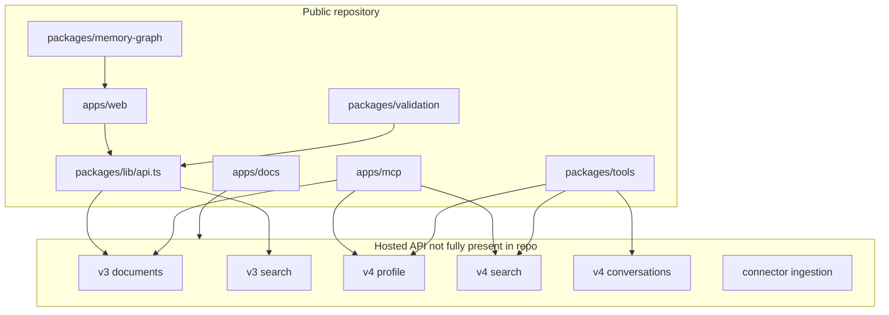
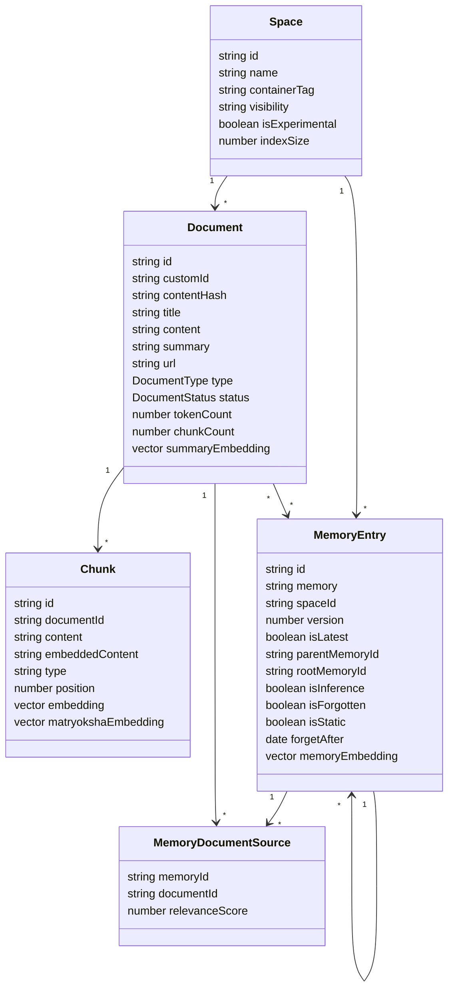
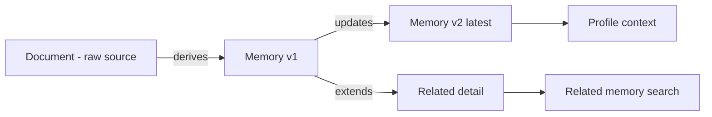

# Supermemory 아키텍처와 데이터 모델

## 모노레포 구조

Supermemory 공개 저장소는 hosted API 자체보다 그 API를 사용하는 제품 표면과 integration layer가 중심이다.

```text
.repos/supermemory/
├── apps/
│   ├── docs/        # 공식 문서와 API 개념 설명
│   ├── mcp/         # Cloudflare Workers 기반 MCP 서버
│   └── web/         # Next.js 웹 앱
├── packages/
│   ├── ai-sdk/      # AI SDK tool helper
│   ├── lib/         # typed API client and shared utilities
│   ├── memory-graph/# React canvas memory graph component
│   ├── tools/       # Vercel, OpenAI, Mastra, VoltAgent integrations
│   └── validation/  # Zod schemas for DB and API contracts
└── package.json     # Bun workspace and Turbo scripts
```

루트 `package.json`은 Bun workspace와 Turbo 기반 monorepo를 정의한다. Node runtime은 `>=20`이고, 주요 공통 의존성은 `ai`, `zod`, `drizzle-orm`, `hono-openapi`, `cloudflare`, `wrangler`, `pg`, `postgres`다.

## 공개 코드와 호스티드 API 경계



`packages/lib/api.ts`의 `$fetch`는 기본 base URL을 `https://api.supermemory.ai/v3`로 잡는다. 웹 앱은 이 typed fetch client를 통해 hosted API를 호출한다. MCP 서버도 local DB를 직접 보지 않고, API key와 OAuth token을 main API로 검증한 뒤 hosted API를 호출한다.

즉 공개 저장소에서 확인 가능한 것은 다음이다.

- API request and response shape
- document, chunk, memory, space 같은 데이터 모델
- SDK wrapper가 언제 어떤 API를 호출하는지
- MCP tool이 어떤 API call로 변환되는지
- graph UI가 API response를 어떻게 node and edge로 바꾸는지

확인할 수 없는 것은 hosted API 내부의 실제 parser, embedder, vector index, reranker, memory extractor 구현이다.

## 핵심 도메인 모델

`packages/validation/schemas.ts`는 Supermemory의 내부 데이터 모델을 가장 직접적으로 보여준다.



### Document

`Document`는 원본 입력을 대표한다. 타입은 `text`, `pdf`, `tweet`, `google_doc`, `google_slide`, `google_sheet`, `image`, `video`, `notion_doc`, `webpage`, `onedrive`로 정의되어 있다. 상태는 `queued`, `extracting`, `chunking`, `embedding`, `indexing`, `done`, `failed`를 가진다.

중요 필드:

| 필드 | 의미 |
|---|---|
| `contentHash` | 중복 입력 감지 또는 idempotency에 사용될 수 있는 content fingerprint |
| `summary` | document-level retrieval 또는 memory extraction의 압축 표현 |
| `processingMetadata` | 단계별 처리 시간, 에러, chunking strategy, token count |
| `summaryEmbedding` | 문서 요약 단위 검색용 embedding |
| `summaryEmbeddingNew` | embedding migration 또는 새 index 전환을 위한 병행 필드 |

### Chunk

`Chunk`는 검색과 인덱싱의 실제 단위다. `content`와 `embeddedContent`가 분리되어 있어 사용자에게 보여줄 텍스트와 embedding에 넣는 텍스트를 다르게 구성할 수 있다.

중요 필드:

| 필드 | 의미 |
|---|---|
| `position` | 문서 내 chunk 순서 |
| `embedding` and `embeddingNew` | 기존 embedding과 새 embedding 병행 저장 |
| `matryokshaEmbedding` | dimension truncation 또는 multi-resolution retrieval을 암시하는 필드 |
| `metadata` | section, page, source 같은 검색 필터 확장 지점 |

### MemoryEntry

`MemoryEntry`는 agent context로 직접 쓰이는 semantic unit이다. 문서 chunk와 달리 "사용자에 대해 기억해야 할 사실, 선호, episode" 형태에 가깝다.

중요 필드:

| 필드 | 의미 |
|---|---|
| `memory` | 실제 memory text |
| `version`, `isLatest` | 업데이트된 memory 중 최신 여부 |
| `parentMemoryId`, `rootMemoryId` | version chain 구성 |
| `memoryRelations` | `updates`, `extends`, `derives` relation target map |
| `sourceCount` | 몇 개 source document에서 유래했는지 |
| `isInference` | 원문에서 직접 추출된 fact가 아니라 추론된 memory인지 |
| `isStatic` | stable profile에 들어갈 수 있는 오래 유지되는 fact인지 |
| `isForgotten`, `forgetAfter`, `forgetReason` | forgetting and contradiction 처리 결과 |

### Space and containerTag

`Space`는 API 상에서 `containerTag`로 많이 노출된다. SDK들은 기본값으로 `sm_project_default`를 사용하거나, `projectId`를 `sm_project_${projectId}`로 변환한다.

`containerTag`는 multi-tenant memory partition에 가깝다. 사용자, 프로젝트, 앱, thread 단위로 memory namespace를 나누는 핵심 키로 동작한다.

## Memory relation 모델

공식 graph memory 문서는 Supermemory의 relation을 traditional entity relation graph가 아니라 "fact 위에 fact를 쌓는 memory graph"로 설명한다. 공개 schema 기준 relation type은 세 가지다.

| relation | 의미 |
|---|---|
| `derives` | memory가 특정 source document 또는 prior memory에서 파생됨 |
| `updates` | 기존 memory를 최신 정보로 대체하거나 갱신함 |
| `extends` | 기존 memory를 보완하지만 대체하지 않음 |



이 모델의 장점은 대화형 agent memory에 맞게 "최신 값"과 "보조 정보"를 구분할 수 있다는 점이다. 예를 들어 "사용자는 Python을 선호한다"가 "사용자는 TypeScript를 선호한다"로 바뀌면 `updates` relation과 `isLatest`로 최신 값을 표현할 수 있다. 반면 "사용자는 Python을 데이터 분석에 사용한다"는 `extends`로 연결해 둘 수 있다.

## API surface

`packages/lib/api.ts`는 웹 앱에서 사용하는 v3 API client를 정의한다.

| endpoint | 공개 contract의 역할 |
|---|---|
| `@post/documents` | text or URL document ingestion |
| `@post/documents/list` | document list 조회 |
| `@post/documents/documents` | memoryEntries가 포함된 document 조회 |
| `@post/documents/documents/by-ids` | 특정 document id 기반 graph data 조회 |
| `@get/documents/processing` | processing status 조회 |
| `@post/search` | v3 document search |
| `@get/projects` | containerTag project list |
| `@patch/projects/:id/settings` | containerTag settings update |

`packages/tools`와 MCP 서버는 typed fetch client 대신 `supermemory` SDK 또는 직접 `fetch`로 v4 API를 호출한다.

| endpoint | 사용처 | 역할 |
|---|---|---|
| `/v4/profile` | tools, MCP | static and dynamic profile retrieval |
| `/v4/search` | VoltAgent, MCP, SDK client | memory search and hybrid search |
| `/v4/conversations` | Vercel, Mastra, VoltAgent, OpenAI | model 대화 저장 후 memory extraction |
| `/v3/session` | MCP auth | API key 검증 |
| `/v3/mcp/session-with-key` | MCP auth | OAuth token을 API key session으로 교환 |

## Contract drift 포인트

공개 repo를 코드 단위로 보면 몇 가지 drift가 있다.

| 위치 | 관찰 |
|---|---|
| `ConnectionProviderEnum` | validation schema에는 `notion`, `google-drive`, `onedrive`만 있다. typed API client와 docs에는 `granola`, `gmail`, `github`, `web-crawler`, `s3`도 보인다. |
| search v4 schema | docs와 VoltAgent option에는 `searchMode`가 있지만 일부 validation schema에는 없다. |
| include option | VoltAgent type에는 `forgottenMemories`, `chunks` 같은 option이 남아 있는데 docs에서는 일부가 deprecated 또는 다른 명칭으로 설명된다. |
| OpenAI middleware API key | 일부 profile search helper가 option API key가 아니라 `process.env.SUPERMEMORY_API_KEY`를 직접 읽는다. |

이런 drift는 SDK 사용자에게 compile-time contract와 runtime API contract가 다르게 보일 수 있는 지점이다.

## 엔지니어 관점 평가

Supermemory의 공개 코드에서 가장 강한 부분은 "memory engine을 애플리케이션에 붙이는 표면"이다. 모델 호출 전 memory retrieval, system prompt injection, 호출 후 conversation persistence까지 integration code가 실제로 구현되어 있고, MCP와 graph UI까지 같은 모델을 공유한다.

반대로 core engine 구현이 공개되어 있지 않기 때문에 self-hosted RAG engine을 코드 레벨로 수정하거나 benchmark하려는 사용자에게는 정보가 부족하다. 이 프로젝트를 분석할 때는 "open-source memory engine"이라기보다 "hosted memory API를 중심으로 한 open integration platform"으로 보는 것이 정확하다.
