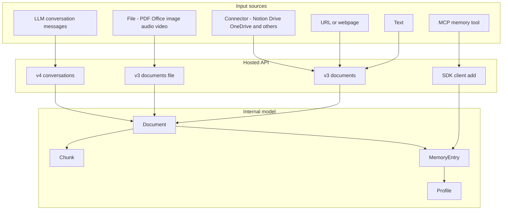
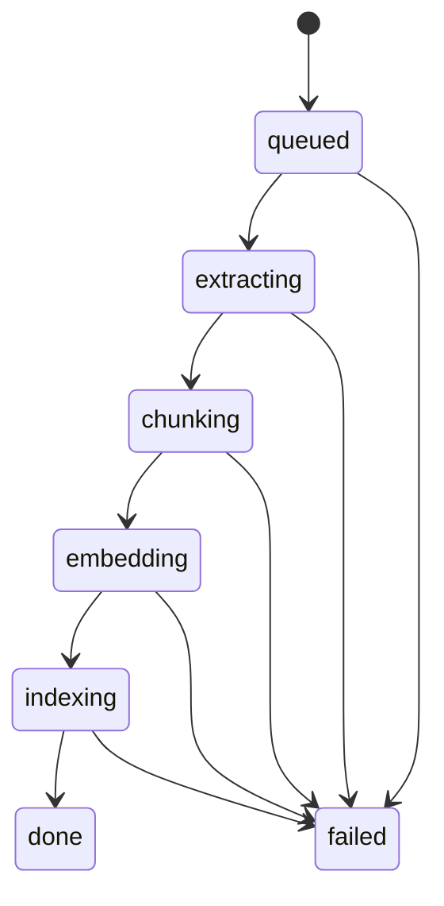
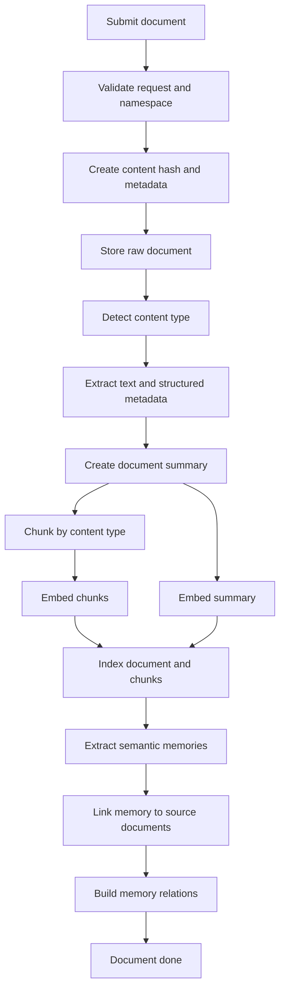
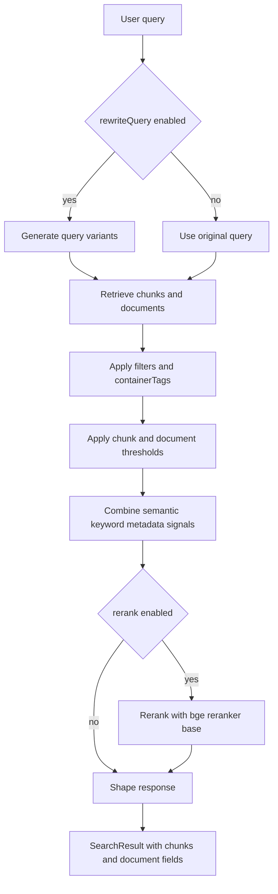
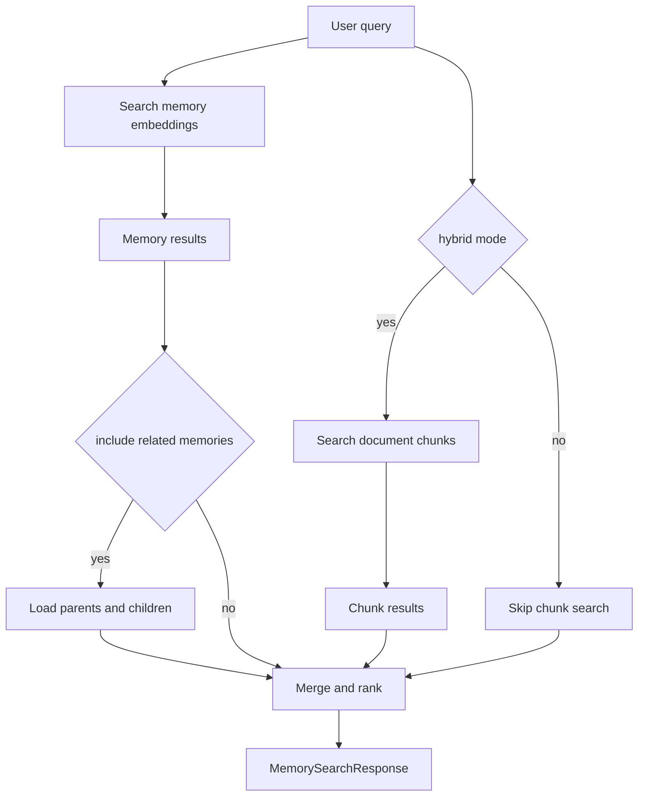
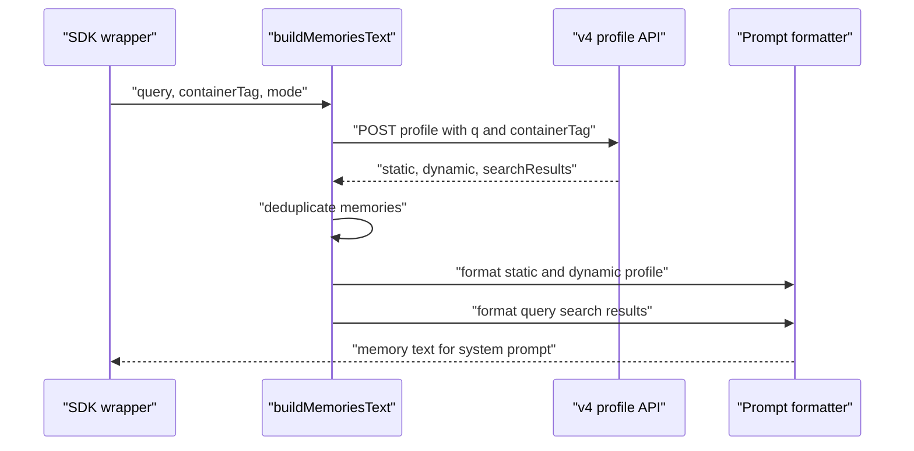
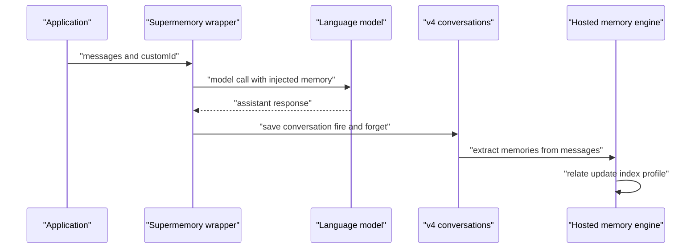

# Ingestion, Search, Profile 처리 흐름

## 공개 코드 기준 분석 범위

Supermemory의 ingestion engine은 hosted API 내부에 있다. 공개 저장소에서는 실제 extractor, chunker, embedder, vector index 구현을 직접 볼 수 없다. 대신 다음 코드와 문서에서 처리 순서를 확인할 수 있다.

| 근거 | 확인 가능한 것 |
|---|---|
| `packages/validation/schemas.ts` | document, chunk, memory, status, processing metadata |
| `packages/validation/api.ts` | search request and response contract |
| `packages/lib/api.ts` | 웹 앱이 호출하는 v3 endpoint |
| `packages/tools/src/shared/memory-client.ts` | profile API 호출과 prompt 포맷 |
| `apps/mcp/src/client.ts` | MCP에서 memory create, search, profile, forget을 호출하는 방식 |
| `apps/docs/concepts/*.mdx` | hosted engine의 의도된 pipeline 설명 |

## 입력 경로

Supermemory는 여러 입력을 결국 `Document` 또는 `Conversation`으로 정규화한다.

입력 경로는 네 가지로 나뉜다.

| 경로 | 공개 코드 위치 | 설명 |
|---|---|---|
| Direct document ingestion | `packages/lib/api.ts`, docs | `POST /v3/documents` 또는 file upload로 원본을 넣는다. |
| Connector ingestion | docs and API client | Google Drive, Notion, OneDrive 등 외부 source를 document로 가져온다. |
| Conversation ingestion | `packages/tools`, `/v4/conversations` | 모델 호출 후 user and assistant messages를 저장하고 memory로 추출한다. |
| Direct memory save | `apps/mcp/src/client.ts`, `packages/tools/src/openai/tools.ts` | 사용자가 명시적으로 memory text를 저장한다. |

## Document 처리 상태

`DocumentStatusEnum`은 ingestion pipeline을 상태 기계로 드러낸다.

| 상태 | 의미 |
|---|---|
| `queued` | 입력이 접수되었고 비동기 처리 대기 중 |
| `extracting` | 파일, URL, connector source에서 text와 metadata 추출 |
| `chunking` | content type에 맞는 chunk 생성 |
| `embedding` | document summary와 chunk embedding 생성 |
| `indexing` | 검색 가능한 index에 반영 |
| `done` | 검색과 memory 생성에 사용 가능한 상태 |
| `failed` | 처리 중 오류 발생 |

`ProcessingMetadataSchema`에는 `startedAt`, `completedAt`, `duration`, `error`, `finalStatus`, `chunkingStrategy`, `tokenCount`, `steps`가 포함된다. 이는 hosted pipeline이 각 단계별 처리 기록을 남기도록 설계되었음을 보여준다.

## Ingestion pipeline 상세

공식 문서와 schema를 합치면 document ingestion은 다음 순서로 동작한다.

### 1. Request validation and namespace 결정

입력은 `containerTag` 또는 legacy `containerTags`로 namespace를 지정한다. SDK 공통 helper는 `projectId`가 있으면 `sm_project_${projectId}`로 바꾸고, 아무 값도 없으면 `sm_project_default`를 사용한다.

이 namespace는 검색, profile, graph view, MCP tool 전체에서 같은 partition key로 반복 사용된다.

### 2. Raw document 저장

`DocumentSchema`는 원본 저장에 필요한 필드를 가진다.

- `title`, `content`, `url`, `source`, `type`
- `metadata`, `raw`, `ogImage`
- `contentHash`, `customId`
- `tokenCount`, `wordCount`, `chunkCount`, `averageChunkSize`

`contentHash`와 `customId`는 중복 방지와 외부 시스템 idempotency를 위한 필드로 해석할 수 있다.

### 3. Content extraction

문서에 따르면 지원하는 입력은 text, URL, PDF, Office 문서, Google Workspace 문서, code, markdown, image, audio, video, JSON, CSV 등이다. 이 단계에서 hosted engine은 source별 extractor를 선택한다.

공개 코드에서 실제 extractor 구현은 없지만, `DocumentTypeEnum`과 docs의 content type 설명을 보면 처리 방식은 다음처럼 나뉜다.

| 타입 | 추정 처리 |
|---|---|
| text and markdown | 그대로 text normalization |
| URL and webpage | HTML fetch, main content extraction, metadata extraction |
| PDF and Office | file parser로 text and structure 추출 |
| image | OCR and visual description |
| audio and video | transcription and topic segmentation |
| code | AST-aware chunking |
| connector docs | provider metadata와 원본 URL 보존 |

### 4. Chunking

`ChunkSchema`는 chunk가 `content`, `embeddedContent`, `type`, `position`, `metadata`를 가진다고 정의한다. 중요한 점은 user-visible `content`와 embedding input인 `embeddedContent`가 분리되어 있다는 것이다.

문서에 따르면 code chunking은 `supermemoryai/code-chunk` 기반 AST boundary를 사용한다. 즉 paragraph length만으로 자르는 naive chunking이 아니라, content type별 chunking strategy가 존재한다.

### 5. Embedding and index migration

`Document`와 `Chunk`, `MemoryEntry` 모두 기존 embedding과 새 embedding 필드를 함께 가진다.

| 모델 | 기존 필드 | 새 필드 |
|---|---|---|
| `Document` | `summaryEmbedding`, `summaryEmbeddingModel` | `summaryEmbeddingNew`, `summaryEmbeddingModelNew` |
| `Chunk` | `embedding`, `embeddingModel` | `embeddingNew`, `embeddingNewModel` |
| `MemoryEntry` | `memoryEmbedding`, `memoryEmbeddingModel` | `memoryEmbeddingNew`, `memoryEmbeddingNewModel` |

이 구조는 embedding model migration을 중단 없이 수행하기 위한 dual-write 또는 backfill 전략을 암시한다. `matryokshaEmbedding` 필드는 dimension을 줄여가며 검색할 수 있는 Matryoshka representation을 고려한 설계로 보인다.

### 6. Memory extraction

문서 검색을 위한 chunk와 별도로 `MemoryEntry`가 생성된다. memory는 문서의 단순 snippet이 아니라 agent context에 들어갈 semantic fact다.

생성된 memory는 source document와 `MemoryDocumentSource`로 연결된다.

- `sourceRelevanceScore`
- `sourceMetadata`
- `sourceAddedAt`

이 source link는 memory graph와 search result에서 "어떤 문서에서 이 memory가 나왔는지"를 보여주는 근거가 된다.

### 7. Relation and forgetting

`MemoryEntry`에는 `memoryRelations`, `parentMemoryId`, `rootMemoryId`, `version`, `isLatest`, `isForgotten`, `forgetAfter`, `forgetReason`이 있다.

관계 생성의 목표는 다음이다.

- 새 memory가 기존 memory를 갱신하면 `updates` 관계와 version chain 생성
- 기존 memory를 보완하면 `extends` 관계 생성
- source document에서 나온 fact이면 `derives` 관계 생성
- 시간 만료나 모순 해결 대상이면 forgetting metadata 설정

## `/v3/search` 문서 검색

`SearchRequestSchema`는 document and chunk search를 정의한다.

| 옵션 | 기본값 | 의미 |
|---|---:|---|
| `q` | required | 사용자 query |
| `containerTags` | optional | 검색 namespace |
| `limit` | `10`, max `100` | 반환 document 수 |
| `chunkThreshold` | `0` | chunk relevance threshold |
| `documentThreshold` | `0` | document relevance threshold |
| `includeFullDocs` | `false` | document content 포함 여부 |
| `includeSummary` | `false` | summary 포함 여부 |
| `onlyMatchingChunks` | `true` | matching chunk만 반환 |
| `rerank` | `false` | reranker 적용 |
| `rewriteQuery` | `false` | query rewriting 적용 |

검색 response는 document-level result와 chunk-level result를 함께 반환한다.

- `documentId`
- `score`
- `chunks[]` with `content`, `isRelevant`, `score`
- `metadata`
- optional `summary`, `content`
- `title`, `type`, timestamps

문서의 response schema는 score가 semantic similarity뿐 아니라 keyword matching and metadata relevance도 반영한다고 설명한다.

## `/v4/search` 메모리 검색

`Searchv4RequestSchema`는 memory search를 정의한다. `/v3/search`가 document and chunk 중심이라면 `/v4/search`는 agent memory 중심이다.

| 옵션 | 기본값 | 의미 |
|---|---:|---|
| `q` | required | query |
| `containerTag` | optional | 단일 namespace |
| `threshold` | `0.6` | memory similarity threshold |
| `limit` | max `100` | result count |
| `include.documents` | optional | source document 포함 |
| `include.summaries` | optional | summary 포함 |
| `include.relatedMemories` | optional | parent and child memory 포함 |
| `rerank` | optional | rerank |
| `rewriteQuery` | optional | query rewrite |

문서와 VoltAgent integration에는 `searchMode`가 추가로 등장한다.

- `memories`: memory만 검색
- `hybrid`: memory와 chunk를 함께 검색하고 dedupe
- `documents`: 일부 SDK option에 남아 있는 document search mode

다만 일부 validation schema에는 `searchMode`가 반영되어 있지 않아 contract drift로 봐야 한다.

`MemorySearchResult`는 memory 본문뿐 아니라 context를 포함한다.

- `context.parents[]`
- `context.children[]`
- relation type
- version
- metadata
- source documents option

이 구조 때문에 LLM prompt에 단일 fact만 넣지 않고, "이 fact가 무엇을 업데이트했는지" 또는 "어떤 관련 memory가 있는지"까지 넣을 수 있다.

## `/v4/profile` 사용자 프로필

`/v4/profile`은 SDK wrapper에서 가장 자주 쓰이는 API다. `packages/tools/src/shared/memory-client.ts`의 `buildMemoriesText`는 다음 순서로 동작한다.

`mode`에 따라 prompt 내용이 달라진다.

| mode | 포함 내용 |
|---|---|
| `profile` | static and dynamic profile |
| `query` | recent query에 맞는 search results |
| `full` | profile and query search results |

`deduplicateMemories`는 exact trimmed string 기준으로 중복을 제거한다. priority는 `Static Profile`, `Dynamic Profile`, `Search Results` 순서다. 즉 같은 memory text가 여러 경로에서 나오면 stable profile이 우선한다.

## Conversation 저장과 memory 생성

LLM wrapper들은 model call 이후 대화를 `/v4/conversations`로 저장한다. 이 저장은 다음 호출의 memory search and profile에 반영될 수 있다.

Vercel AI SDK, Mastra, VoltAgent wrapper는 conversation save error를 대부분 log 후 삼킨다. 이는 user-facing model latency를 줄이는 설계지만, 저장 완료를 호출 응답에서 보장하지 않는다.

## 주요 로직 요약

| 로직 | 코드 위치 | 동작 |
|---|---|---|
| containerTag fallback | `packages/tools/src/tools-shared.ts` | `projectId`를 `sm_project_${id}`로 변환하거나 default tag 사용 |
| profile retrieval | `packages/tools/src/shared/memory-client.ts` | `/v4/profile` 호출 후 prompt text 생성 |
| memory dedupe | `packages/tools/src/tools-shared.ts` | static, dynamic, search result 순서로 exact string dedupe |
| OpenAI function tools | `packages/tools/src/openai/tools.ts` | search, add, profile, document list, delete, forget tool schema와 executor 제공 |
| MCP search | `apps/mcp/src/client.ts` | `/v4/search`를 hybrid mode로 호출하고 memory and chunk 결과를 normalize |
| MCP forget fallback | `apps/mcp/src/client.ts` | exact forget 실패 시 semantic search threshold `0.85`로 memory id를 찾아 forget |

## 엔지니어 관점 인사이트

Supermemory의 processing model은 "RAG pipeline plus profile memory"에 가깝다. document ingestion은 raw document를 chunk and embedding index로 만들고, 별도로 semantic memory를 추출한다. search API는 document retrieval과 memory retrieval을 분리해 제공한다. profile API는 SDK wrapper가 바로 prompt에 넣을 수 있게 static and dynamic memory를 compact하게 반환한다.

이 설계는 agent application에 붙이기 쉽지만, hosted engine 내부가 공개되어 있지 않아 chunking, reranking, memory extraction quality를 코드로 검증하거나 교체하기는 어렵다. 따라서 self-hosted retrieval framework가 아니라 managed memory layer로 평가하는 것이 적절하다.
