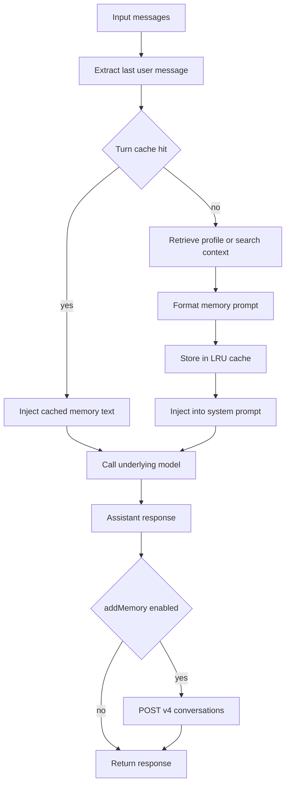
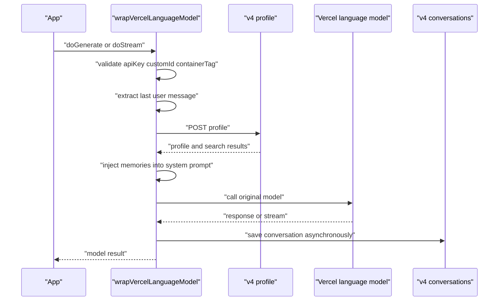
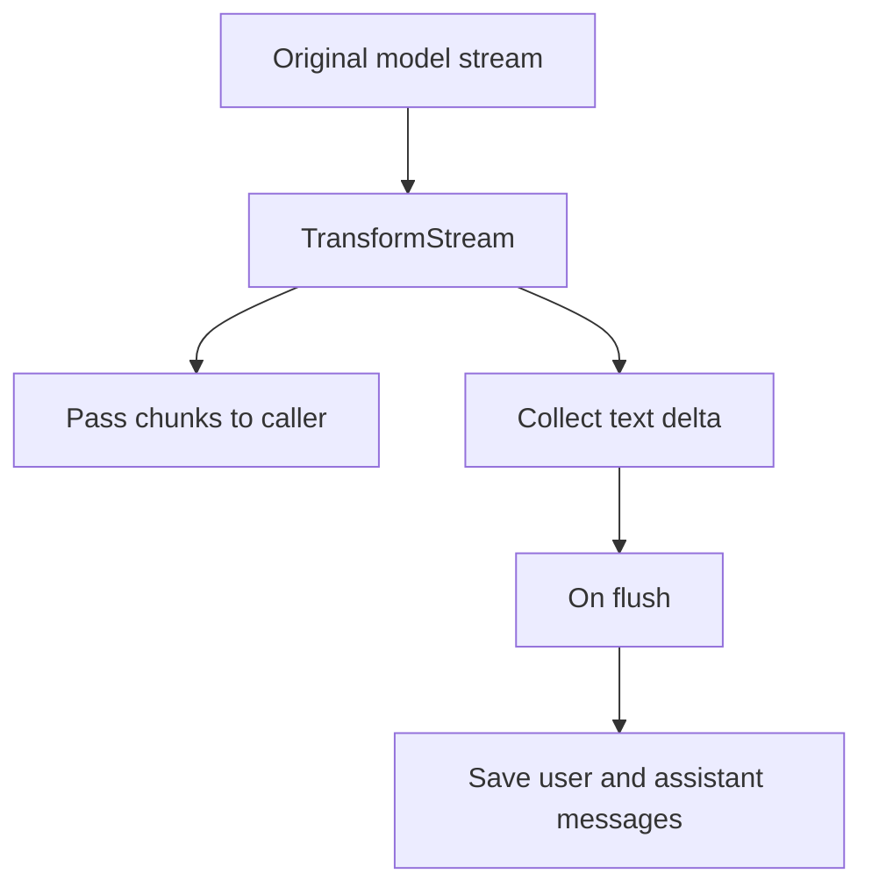
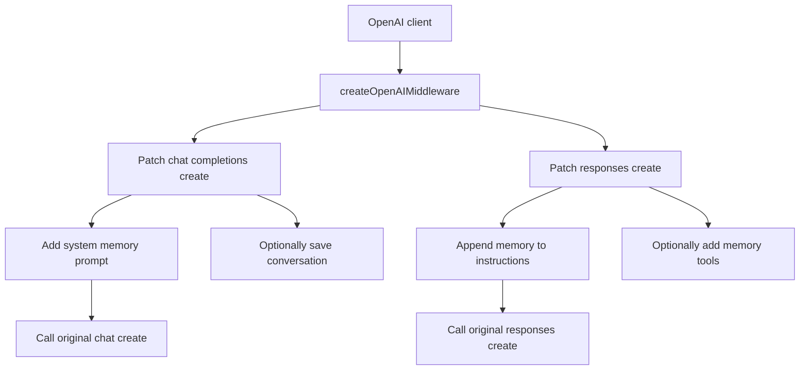
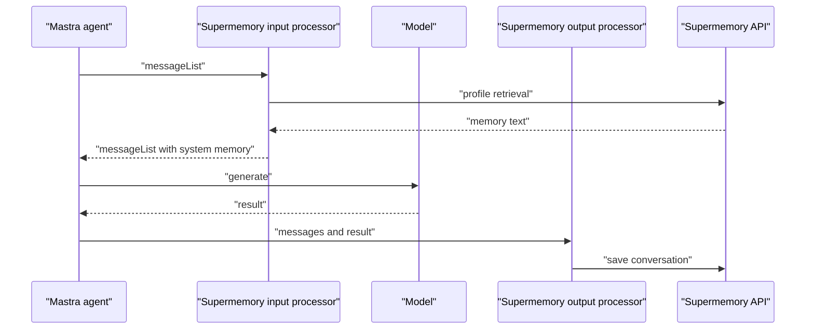
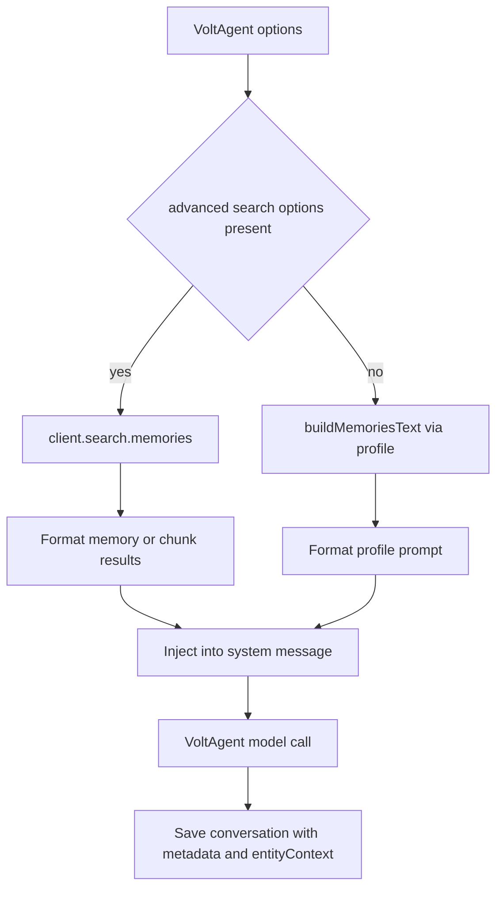
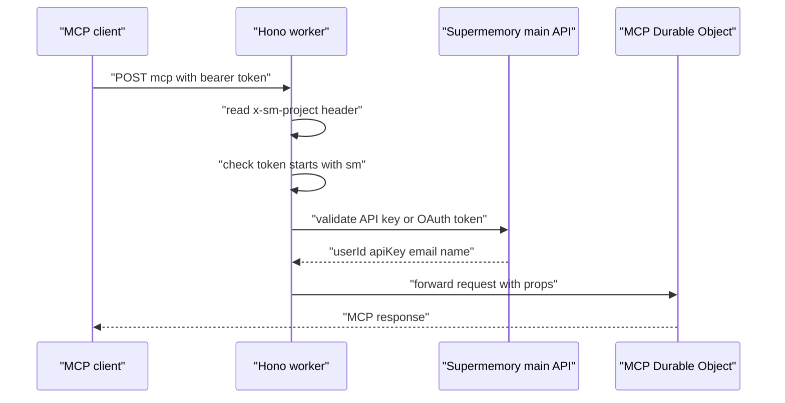
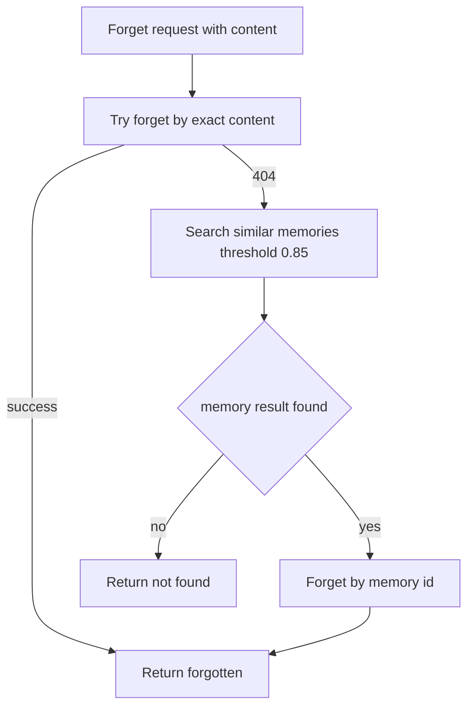

# SDK와 MCP Integration 코드 흐름

## Integration layer의 역할

Supermemory 공개 코드에서 가장 구체적인 부분은 LLM 호출 전후에 memory를 연결하는 integration layer다. 핵심 패턴은 반복된다.

1. 마지막 user message를 찾는다.
2. `customId`, `containerTag`, `mode`로 cache key를 만든다.
3. `/v4/profile` 또는 `/v4/search`로 관련 memory를 가져온다.
4. memory text를 system prompt에 append 또는 prepend한다.
5. 원래 model call을 실행한다.
6. 응답 이후 conversation을 `/v4/conversations`에 저장한다.



## 공통 helper

### `buildMemoriesText`

`packages/tools/src/shared/memory-client.ts`의 `buildMemoriesText`가 wrapper들의 공통 retrieval 로직이다.

처리 순서:

1. `supermemoryProfileSearch`로 `/v4/profile` 호출
2. response의 `profile.static`, `profile.dynamic`, `searchResults`를 수집
3. `deduplicateMemories`로 exact string 중복 제거
4. `mode`에 따라 profile block과 query search block 구성
5. `promptTemplate` 또는 기본 template에 삽입

기본 prompt template은 매우 단순하다.

```text
User Supermemories:
${data.userMemories}
${data.generalSearchMemories}
```

이 단순함이 의도된 장점이다. integration package는 memory retrieval and persistence만 담당하고, 실제 application-specific prompt engineering은 `promptTemplate`로 열어둔다.

### LRU turn cache

`packages/tools/src/shared/cache.ts`의 `MemoryCache`는 최대 100개 entry를 가진다. key는 다음 조합이다.

```text
containerTag:threadId:mode:normalizedLastUserMessage
```

같은 turn에서 streaming, retry, middleware 재진입이 발생해도 같은 memory retrieval을 반복하지 않기 위한 장치다.

## Vercel AI SDK wrapper

`packages/tools/src/vercel/index.ts`의 `wrapVercelLanguageModel`은 Vercel AI SDK language model object를 `Proxy`로 감싼다. 핵심은 `doGenerate`와 `doStream`만 가로채고 나머지 property는 원본 model을 그대로 노출하는 방식이다.



### `doGenerate`

`doGenerate` 처리 흐름:

1. `transformParamsWithMemory`로 prompt params 변환
2. memory retrieval 실패 시 `skipMemoryOnError`가 true면 원본 params로 계속 진행
3. 원본 model의 `doGenerate` 호출
4. assistant response text 추출
5. `addMemory`가 `always`이고 새 user turn이면 `saveMemoryAfterResponse` 실행

`saveMemoryAfterResponse`는 awaited되지 않는다. 내부에서 error를 catch하기 때문에 model call 결과를 지연시키지 않는다.

### `doStream`

streaming 처리 흐름은 generate와 거의 같지만, `TransformStream`으로 `text-delta` chunk를 모아 마지막 `flush` 시 conversation을 저장한다.



이 구조는 streaming UX를 유지하면서 최종 assistant text만 memory ingestion에 넘기기 위한 설계다.

## OpenAI middleware

`packages/tools/src/openai/middleware.ts`는 Vercel wrapper와 다르게 OpenAI client method를 직접 monkey patch한다.

가로채는 method:

- `openai.chat.completions.create`
- `openai.responses.create`



### Chat Completions 흐름

1. `messages`에서 마지막 user message 추출
2. `addMemory`가 켜져 있으면 conversation save task 생성
3. profile memory prompt 추가 task 생성
4. 두 task를 `Promise.all`로 병렬 수행
5. system prompt가 포함된 messages로 원래 `create` 호출

### Responses API 흐름

Responses API에서는 memory text를 `instructions`에 붙인다. `addMemory` 옵션이 켜져 있으면 memory 관련 function tool도 함께 추가한다.

OpenAI integration에는 별도 tool schema도 있다.

| tool | 역할 |
|---|---|
| `searchMemories` | document or memory 검색 |
| `addMemory` | 직접 memory 저장 |
| `getProfile` | profile 조회 |
| `documentList` | document 목록 |
| `documentDelete` | document 삭제 |
| `documentAdd` | document 추가 |
| `memoryForget` | memory id 또는 content 기반 forget |

### 주의할 점

OpenAI middleware 일부 helper는 option으로 받은 API key보다 `process.env.SUPERMEMORY_API_KEY`를 직접 참조한다. 서버 환경에서 env var를 표준으로 쓰는 경우에는 문제 없지만, multi-tenant runtime에서 request별 API key를 바꾸려는 경우에는 Vercel wrapper보다 제약이 크다.

## Mastra integration

Mastra integration은 model wrapper가 아니라 processor 조합으로 구현된다.

| processor | 코드 위치 | 역할 |
|---|---|---|
| `SupermemoryInputProcessor` | `packages/tools/src/mastra/processor.ts` | model 입력 전 memory prompt를 `messageList.addSystem`으로 추가 |
| `SupermemoryOutputProcessor` | `packages/tools/src/mastra/processor.ts` | model 출력 후 conversation 저장 |

`packages/tools/src/mastra/wrapper.ts`의 `withSupermemory`는 기존 agent option을 복사한 뒤 input processor는 앞에 붙이고, output processor는 뒤에 붙인다.



Mastra는 runtime context에서 thread id를 읽어 construction-time `customId`보다 우선한다. 따라서 thread-aware agent에서 memory namespace를 더 자연스럽게 맞출 수 있다.

## VoltAgent integration

VoltAgent integration은 가장 많은 search option을 노출한다.

주요 option:

- `threshold`
- `limit`
- `rerank`
- `rewriteQuery`
- `filters`
- `include`
- `searchMode`
- `entityContext`

`packages/tools/src/voltagent/middleware.ts`의 `enhanceMessagesWithMemories`는 advanced search option이 있으면 `/v4/profile`이 아니라 `client.search.memories`를 직접 호출한다.



VoltAgent wrapper는 `memory` result와 `chunk` result를 모두 처리한다. `memory` 필드가 있으면 memory text로, `chunk` 필드가 있으면 chunk content로 포맷한다. 이는 docs의 hybrid search mode와 맞물린다.

## AI SDK tool package

`packages/ai-sdk/src/tools.ts`의 `supermemoryTools`는 middleware가 아니라 model tool definition을 만든다.

- `searchMemories`: `client.search.execute` 호출
- `addMemory`: `client.add` 호출

이 패키지는 `packages/tools`보다 단순한 형태다. 모델이 tool calling을 지원하고, memory 검색과 저장을 model decision에 맡기고 싶을 때 적합하다.

## MCP 서버

MCP 서버는 `apps/mcp`에 있으며 Cloudflare Workers와 Durable Objects로 구현되어 있다.

### HTTP and auth flow



`apps/mcp/src/index.ts`는 token이 `sm_`로 시작하면 API key로 보고 `/v3/session`을 호출한다. 그렇지 않으면 OAuth token으로 보고 `/v3/mcp/session-with-key`를 호출한다. 검증 성공 후 user id와 API key를 Durable Object execution context에 넣는다.

### MCP tools and resources

`apps/mcp/src/server.ts`의 `SupermemoryMCP.init`은 다음 tool과 resource를 등록한다.

| 이름 | 종류 | 역할 |
|---|---|---|
| `memory` | tool | memory save or forget |
| `recall` | tool | query 기반 memory recall |
| `listProjects` | tool | containerTag project 목록 |
| `whoAmI` | tool | 현재 인증된 사용자와 project 확인 |
| `memory-graph` | app tool | 초기 graph document page 반환 |
| `fetch-graph-data` | app-only tool | graph pagination |
| `supermemory://profile` | resource | stable and dynamic profile |
| `supermemory://projects` | resource | cached project list |
| `context` | prompt | LLM에 넣을 memory context prompt |

### MCP client logic

`apps/mcp/src/client.ts`의 `SupermemoryClient`는 hosted API를 감싸는 thin client다.

| 메서드 | 동작 |
|---|---|
| `createMemory` | `client.add`로 memory 저장, metadata에 `sm_source: mcp` 추가 |
| `search` | `/v4/search`를 `searchMode: hybrid`로 호출하고 결과를 memory or chunk로 normalize |
| `getProfile` | `/v4/profile` 호출 후 static, dynamic, searchResults normalize |
| `getProjects` | `/v3/projects` 직접 fetch |
| `getDocuments` | `/v3/documents/documents` 직접 fetch |
| `forgetMemory` | exact content forget 실패 시 semantic search로 id를 찾아 forget |

`forgetMemory`의 fallback은 흥미롭다.



chunk result는 source text일 뿐 memory id가 없으므로 forget 대상에서 제외된다.

## Integration 비교

| Integration | Hook 방식 | Retrieval | Persistence | 특징 |
|---|---|---|---|---|
| Vercel AI SDK | model proxy | `/v4/profile` | async `/v4/conversations` | streaming delta 수집, timeout 지원 |
| OpenAI | client method patch | `/v4/profile` | parallel save task | Chat and Responses API 모두 지원 |
| Mastra | input and output processor | `/v4/profile` | output processor | thread id context 우선 |
| VoltAgent | message middleware | `/v4/profile` or `/v4/search` | async conversation save | advanced search option 가장 많음 |
| MCP | tool server | `/v4/profile` and `/v4/search` | direct memory add | Claude Desktop류 MCP client에 적합 |
| AI SDK tools | tool definitions | model tool call | model tool call | 모델이 memory 사용 여부를 결정 |

## 엔지니어 관점 인사이트

Supermemory의 SDK 설계는 "모델 호출을 막지 않는 memory layer"에 초점이 있다. memory retrieval은 호출 전 동기적으로 필요하지만 timeout과 cache를 둔다. conversation 저장은 대부분 fire-and-forget이다. 이 선택은 latency에는 유리하지만, strong consistency를 기대하는 workflow에는 맞지 않는다.

또한 integration마다 추상화 수준이 다르다. Vercel and Mastra는 middleware로 자동 주입하고, AI SDK tools는 모델의 tool choice에 맡기며, MCP는 user-facing tool로 노출한다. 같은 hosted memory engine을 여러 agent runtime에 맞춰 다른 control point에 붙인 구조다.
