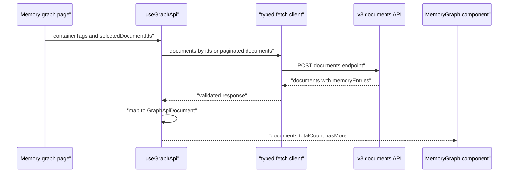
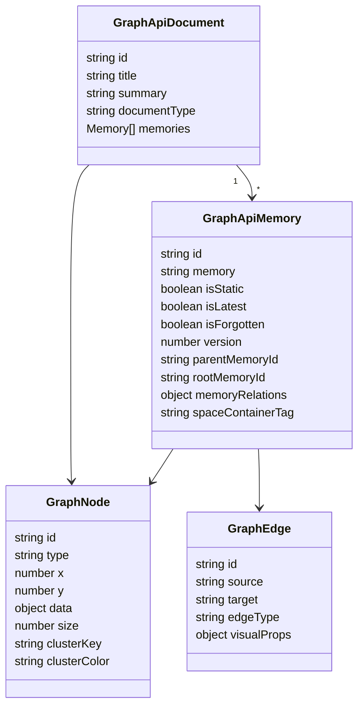
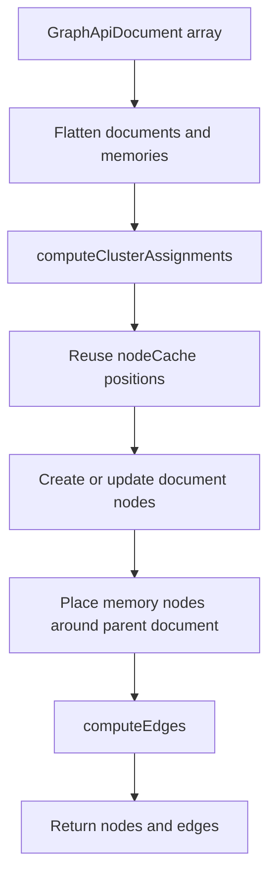
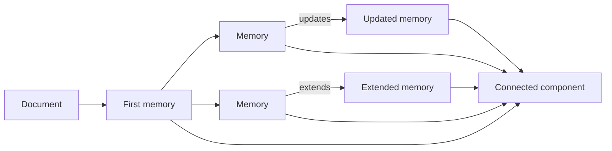
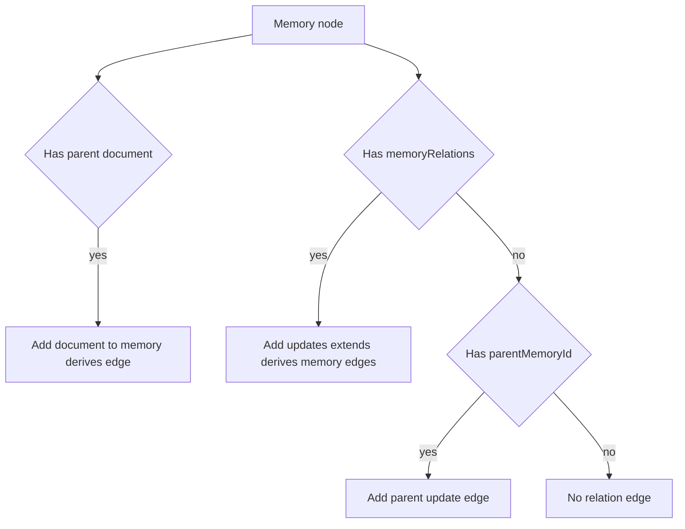
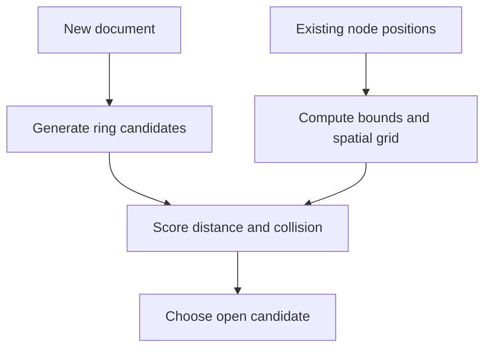
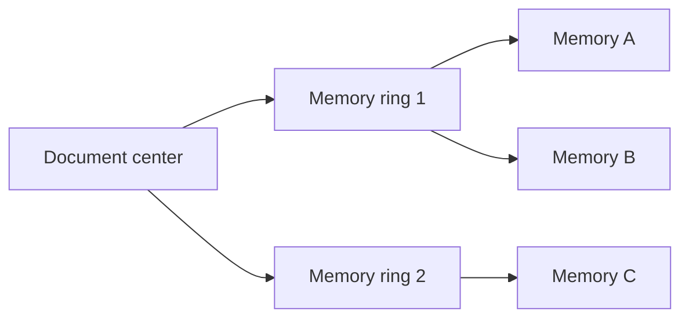
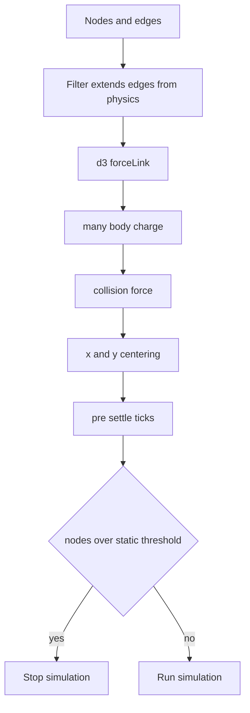
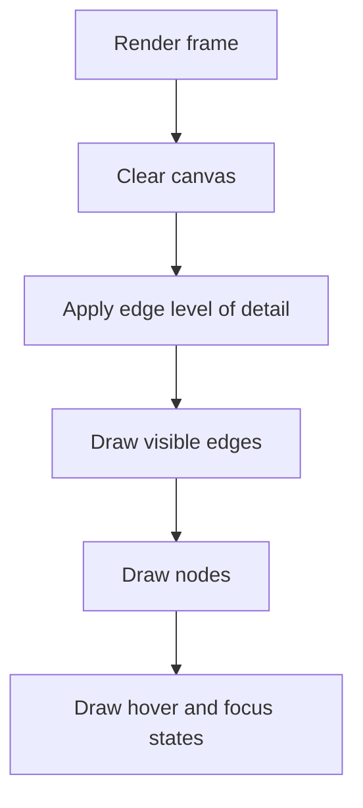

# Memory Graph 시각화 코드 분석

## 역할

`packages/memory-graph`는 Supermemory의 `Document`와 `MemoryEntry`를 graph로 보여주는 React component package다. 단순한 chart wrapper가 아니라 다음을 직접 구현한다.

- API response를 graph node and edge로 변환
- document cluster와 memory orbit 배치
- memory relation edge 생성
- `d3-force` 기반 force simulation
- Canvas 2D renderer
- zoom level과 graph density에 따른 level of detail
- spatial index 기반 hit testing
- version chain 탐색

웹 앱에서는 `apps/web/components/memory-graph/hooks/use-graph-api.ts`가 API 데이터를 가져와 `packages/memory-graph`에 전달한다.

## 데이터 로딩 흐름

`useGraphApi`의 특징:

| 항목 | 동작 |
|---|---|
| page size | `500` documents |
| selected ids | ids가 있으면 `@post/documents/documents/by-ids` 호출 |
| general list | ids가 없으면 `@post/documents/documents` 호출 |
| namespace | `containerTags`로 필터링 |
| auto pagination | `hasMore`이고 `maxNodes`에 도달하지 않았으면 다음 page fetch |
| mapping | `memoryEntries`를 `GraphApiMemory`로 변환 |

`toGraphDocument`는 `memoryEntries` 중 `spaceContainerTag`가 현재 containerTags와 맞지 않는 항목을 걸러낸다. 이는 document 하나가 여러 space의 memory와 연결될 수 있음을 암시한다.

## Graph 데이터 모델

`packages/memory-graph/src/types.ts`는 graph package 전용 타입을 정의한다.

Graph node는 `document`와 `memory` 두 종류다. Edge는 크게 두 종류로 만들어진다.

- document to memory: source document에서 memory가 파생되었음을 표현하는 `derives`
- memory to memory: `updates`, `extends`, `derives` relation 또는 legacy `parentMemoryId` fallback

## Graph 변환 파이프라인

`packages/memory-graph/src/hooks/use-graph-data.ts`의 `useGraphData`가 API 데이터를 graph representation으로 바꾼다.

### Cluster assignment

`computeClusterAssignments`는 memory들을 connected component로 묶는다.

처리 순서:

1. 같은 document 안의 memory들을 adjacency로 연결한다.
2. 첫 memory를 hub처럼 사용해 같은 document의 다른 memory와 연결한다.
3. `memoryRelations`와 `parentMemoryId` fallback을 이용해 memory 간 adjacency를 추가한다.
4. BFS로 connected component를 찾는다.
5. component에 cluster key와 color를 부여한다.

이 방식은 document 단위 cluster와 relation 단위 cluster를 섞는다. document 하나에서 나온 memory들은 기본적으로 가까운 cluster가 되고, 다른 document에서 나온 memory라도 relation이 있으면 같은 component로 묶일 수 있다.

### Edge 생성

`computeEdges`는 두 가지 edge를 만든다.

시각 속성은 relation type별로 달라진다.

| edge type | opacity | thickness | 의미 |
|---|---:|---:|---|
| `updates` | 높음 | 두꺼움 | version or replacement relation |
| `derives` | 중간 | 보통 | source lineage |
| `extends` | 낮음 | 얇음 | contextual relatedness |

`extends`는 force simulation에서 제외되고 visual-only edge로 취급된다. 너무 약한 관계가 layout을 과하게 흔드는 것을 막기 위한 선택이다.

## Layout 알고리즘

### Document placement

document node는 golden angle 기반 spiral로 배치된다. 새 page를 append할 때는 기존 bounds 주변에 ring candidate를 만들고, spatial grid로 충돌이 적은 위치를 고른다.

이 구조는 pagination으로 graph가 커질 때 기존 node 위치가 갑자기 재배치되는 문제를 줄인다. `nodeCache`를 보존해 이미 보이는 node의 위치를 유지하는 것도 같은 목적이다.

### Memory orbit

memory node는 parent document 주변 orbit에 배치된다.

`getMemoryOrbitOffset`의 핵심 아이디어:

- base radius는 document 주변의 memory orbit
- ring capacity는 circumference와 memory spacing으로 계산
- memory index가 capacity를 넘으면 바깥 ring으로 이동
- golden angle과 hash phase를 섞어 겹침을 줄임

## Force simulation

`packages/memory-graph/src/canvas/simulation.ts`는 `d3-force`를 사용한다.

설정 요약:

| force | 목적 |
|---|---|
| `forceLink` | document-memory와 update relation을 적당한 거리로 유지 |
| `forceManyBody` | node끼리 밀어내 graph가 뭉치지 않게 함 |
| `forceCollide` | document와 memory node 크기 기반 충돌 방지 |
| `forceX`, `forceY` | 전체 graph를 중심으로 당김 |

`FORCE_CONFIG`의 특징:

- document-memory distance는 parent document의 memory 수에 따라 커진다.
- version relation은 더 강한 link strength를 가진다.
- 초기 렌더 전 `preSettleTicks` 만큼 simulation을 미리 돌린다.
- node 수가 `6000`개를 넘으면 static graph로 전환해 simulation을 멈춘다.

## Canvas renderer

`packages/memory-graph/src/canvas/renderer.ts`는 Canvas 2D로 edge와 node를 직접 그린다. SVG가 아니라 Canvas를 쓰는 이유는 node and edge 수가 많아질 때 DOM 기반 rendering이 부담되기 때문이다.

렌더링 순서:

1. canvas clear
2. edge drawing
3. node drawing
4. hover, focus, selection style 적용

Level of detail는 edge 수가 많을 때 특히 중요하다.

| 조건 | 최적화 |
|---|---|
| zoom이 낮음 | relation edge opacity and width 감소 |
| relation edge가 너무 많음 | hash stride로 일부 edge만 sample |
| dense graph | 작은 derives edge 생략 |
| hovered or focused node | 관련 edge는 더 강하게 표시 |

## Hit testing and interaction

`packages/memory-graph/src/canvas/hit-test.ts`는 grid 기반 `SpatialIndex`를 구현한다. 매 frame 모든 node를 선형 탐색하면 graph가 커질수록 hover latency가 커지기 때문에, node를 cell 단위로 나누고 주변 cell만 검사한다.

Hit test 차이:

- document node: square hit area
- memory node: circle hit area

`input-handler.ts`는 다음 interaction을 처리한다.

| interaction | 동작 |
|---|---|
| mouse drag on node | node `fx`, `fy`를 설정해 drag 고정 |
| canvas drag | pan |
| wheel | zoom |
| touch | pan and pinch style interaction |
| double click | zoom |
| pan inertia | drag velocity로 자연스러운 이동 |

## Version chain

`packages/memory-graph/src/canvas/version-chain.ts`의 `VersionChainIndex`는 memory update chain을 빠르게 찾기 위한 index다.

처리 방식:

1. memory id map 생성
2. parent to children map 생성
3. 특정 memory에서 `parentMemoryId`를 따라 root까지 역방향 이동
4. root에서 child를 따라 forward chain 구성
5. version number를 monotonic하게 정규화
6. chain 길이가 2 이상이면 반환

이 기능은 graph에서 최신 memory 하나만 보는 대신 어떤 정보가 어떻게 바뀌었는지 추적하는 데 필요하다.

## 주요 코드 흐름 요약

| 단계 | 코드 위치 | 주요 로직 |
|---|---|---|
| API fetch | `apps/web/components/memory-graph/hooks/use-graph-api.ts` | paginated document fetch, selected ids fetch, memoryEntries mapping |
| graph transform | `packages/memory-graph/src/hooks/use-graph-data.ts` | cluster assignment, node cache, document placement, memory orbit, edge creation |
| physics | `packages/memory-graph/src/canvas/simulation.ts` | d3-force setup, link filtering, pre-settle, dense graph static mode |
| rendering | `packages/memory-graph/src/canvas/renderer.ts` | Canvas draw loop, edge LOD, hover and focus style |
| interaction | `packages/memory-graph/src/canvas/input-handler.ts` | drag, pan, zoom, touch, inertia |
| hit test | `packages/memory-graph/src/canvas/hit-test.ts` | grid spatial index and shape-specific hit test |
| version chain | `packages/memory-graph/src/canvas/version-chain.ts` | parent-child memory chain reconstruction |

## 성능 특성

Memory graph는 large graph를 염두에 둔 최적화가 많다.

- API pagination은 500 documents 단위다.
- 기존 node position을 cache해 pagination append 시 layout shift를 줄인다.
- Canvas renderer를 사용해 DOM node 수를 늘리지 않는다.
- `SpatialIndex`로 hit testing cost를 줄인다.
- zoom and density 기반 LOD로 edge rendering cost를 줄인다.
- node 수가 6000을 넘으면 simulation을 멈추는 static mode가 있다.

이 설계는 수천 개 node까지 interactive visualization을 유지하려는 방향이다. 다만 relation edge sampling은 전체 관계를 항상 완전하게 보여주지 않을 수 있다. 따라서 탐색 UI에서는 hover and focus 상태로 관련 edge를 강조하는 방식이 중요하다.

## 엔지니어 관점 평가

`memory-graph` 패키지는 Supermemory 데이터 모델을 이해하는 데 중요한 코드다. hosted API 내부는 공개되어 있지 않지만, graph package는 `Document`, `MemoryEntry`, `memoryRelations`, `parentMemoryId`, `isLatest`, `isForgotten` 같은 필드가 실제 제품 UI에서 어떻게 쓰이는지 보여준다.

특히 `extends`를 layout force에서 제외하고 visual relation으로만 그리는 점, document cluster와 relation component를 섞는 점, version chain을 별도 index로 관리하는 점은 단순한 "검색 결과 시각화"가 아니라 memory graph의 의미론을 UI에 반영하려는 설계다.
