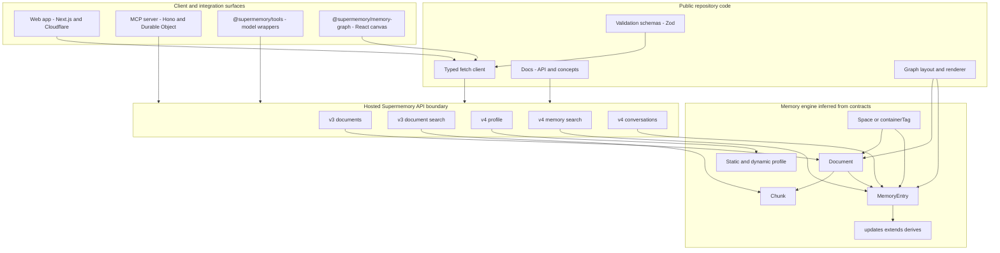

# Supermemory 코드 레벨 분석

> 분석 대상: [supermemoryai/supermemory](https://github.com/supermemoryai/supermemory)  
> 기준 커밋: `94a1e30`  
> 분석일: 2026-06-12  
> 로컬 소스: `.repos/supermemory/`  
> 방법: 공개 저장소 clone, 패키지별 소스코드 추적, 공식 문서 및 npm 공개 패키지 확인

## 분석 범위와 전제

Supermemory는 "AI 에이전트를 위한 장기 기억과 컨텍스트 엔진"을 목표로 하는 프로젝트다. 공개 저장소에는 Next.js 웹 앱, MCP 서버, SDK 도구 패키지, 타입 검증 스키마, 문서, 메모리 그래프 시각화 컴포넌트가 포함되어 있다.

중요한 경계가 있다. 실제 호스티드 API의 서버 구현, 즉 `/v3/documents`, `/v3/search`, `/v4/profile`, `/v4/search`, `/v4/conversations` 내부의 문서 추출, 청킹, 임베딩, 인덱싱, 그래프 메모리 생성 로직은 공개 저장소에 완전한 형태로 포함되어 있지 않다. 따라서 이 분석은 다음 공개 근거를 조합한다.

- `packages/validation`의 API 및 데이터 모델 스키마
- `packages/lib/api.ts`의 typed fetch 클라이언트
- `packages/tools`의 Vercel AI SDK, OpenAI, Mastra, VoltAgent 연동 코드
- `apps/mcp`의 Cloudflare Workers 기반 MCP 서버
- `packages/memory-graph`와 `apps/web/components/memory-graph`의 그래프 데이터 변환 및 렌더링 코드
- `apps/docs`의 공식 개념 문서와 API 문서

## 문서 구성

| 문서 | 내용 |
|---|---|
| [01-architecture-data-model.md](01-architecture-data-model.md) | 모노레포 구조, 기술 스택, 공개 API 경계, 핵심 데이터 모델 |
| [02-ingestion-search-profile.md](02-ingestion-search-profile.md) | 문서 수집, 처리 상태, 검색, 프로필 생성이 어떤 순서로 동작하는지 |
| [03-sdk-mcp-integrations.md](03-sdk-mcp-integrations.md) | Vercel AI SDK, OpenAI, Mastra, VoltAgent, MCP 서버의 코드 레벨 흐름 |
| [04-memory-graph-visualization.md](04-memory-graph-visualization.md) | 메모리 그래프 시각화 패키지의 데이터 변환, 레이아웃, 렌더링, 상호작용 |

## 전체 구조 요약

## 핵심 처리 순서

Supermemory의 공개 계약을 기준으로 보면 데이터는 크게 네 가지 경로로 흐른다.

| 경로 | 입력 | 주요 처리 | 출력 |
|---|---|---|---|
| 문서 수집 | text, URL, file, connector | validation, extraction, chunking, embedding, indexing, memory creation | `Document`, `Chunk`, `MemoryEntry` |
| 문서 검색 | query, filters, threshold | query rewrite 옵션, vector search, keyword or metadata relevance, rerank 옵션 | document result와 matching chunks |
| 메모리 검색 | query, containerTag, include 옵션 | memory similarity search, related memory expansion, optional hybrid chunk merge | memory result, parents, children, source documents |
| LLM 컨텍스트 주입 | model call messages | last user query 추출, `/v4/profile` 또는 `/v4/search`, prompt injection, conversation save | augmented system prompt, later memory ingestion |

```mermaid
flowchart LR
  Input["User content or conversation"] --> Normalize["Normalize to document or messages"]
  Normalize --> Store["Store raw document or conversation"]
  Store --> Extract["Extract text and metadata"]
  Extract --> Chunk["Chunk by content type"]
  Chunk --> Embed["Embed chunks and summaries"]
  Embed --> Index["Index for retrieval"]
  Index --> Memories["Create semantic memories"]
  Memories --> Relations["Attach relations - updates extends derives"]
  Relations --> Profile["Serve profile and search context"]
  Profile --> Model["Inject into model prompt"]
  Model --> Conversation["Save new conversation"]
  Conversation --> Memories
```

## 문제 정의

LLM 애플리케이션에서 "컨텍스트"는 보통 세 가지 문제를 만든다.

- 매번 필요한 사용자 정보와 과거 대화를 프롬프트에 수동으로 넣기 어렵다.
- 일반 RAG는 문서 조각 검색에는 강하지만, 사용자 선호, 장기 사실, 시간에 따른 갱신 관계를 표현하기 어렵다.
- 여러 프레임워크와 모델 SDK마다 메모리 주입 방식이 달라 애플리케이션 코드에 반복 구현이 생긴다.

Supermemory의 설계 목표는 이 문제를 `Document`, `Chunk`, `MemoryEntry`, `Space` 모델로 나누고, 문서 검색과 그래프 메모리 검색을 별도 API로 제공하며, 주요 LLM SDK 앞단에 middleware 형태로 붙이는 것이다.

## 핵심 특징

- 문서와 메모리를 분리한다. 문서는 원본 입력과 검색 가능한 chunk의 근거이고, 메모리는 에이전트가 바로 사용할 수 있는 semantic unit이다.
- `/v3/search`는 document and chunk search, `/v4/search`는 memory search, `/v4/profile`은 user profile context에 가깝다.
- `updates`, `extends`, `derives` 관계를 통해 memory versioning과 source lineage를 표현한다.
- SDK wrapper는 모델 호출 직전에 메모리를 system prompt에 주입하고, 응답 이후 대화를 `/v4/conversations`로 비동기 저장한다.
- MCP 서버는 API key 또는 OAuth token을 검증한 뒤 `memory`, `recall`, `context`, graph 관련 tool과 resource를 제공한다.
- 메모리 그래프 UI는 API 결과를 document node와 memory node로 변환하고, relation edge와 force simulation으로 시각화한다.

## 기술 스택

| 영역 | 주요 기술 |
|---|---|
| Monorepo | Bun `1.3.6`, Turbo, TypeScript `5.8.x` |
| Web | Next.js `16`, React `19`, OpenNext Cloudflare, TanStack Query |
| API client and schemas | Zod, typed fetch, generated SDK style contracts |
| LLM SDK integration | Vercel AI SDK, OpenAI SDK, Mastra, VoltAgent |
| MCP | Hono, Cloudflare Workers, Durable Objects, MCP SDK |
| Visualization | React, Canvas 2D, `d3-force`, custom spatial index |
| Docs | Fumadocs, MDX |

## 경쟁 및 비교

| 프로젝트 | 중심 모델 | Supermemory와의 차이 |
|---|---|---|
| Mem0 | agent memory service and SDK | Supermemory는 document RAG와 memory profile API를 함께 노출하고, `containerTag` 중심 분리를 강조한다. |
| Zep | conversational memory graph | 둘 다 memory graph를 지향하지만, Supermemory 공개 repo는 SDK wrapper와 MCP, graph UI가 더 두드러진다. |
| Graphiti | temporal knowledge graph | Graphiti는 시간성 있는 entity relation graph가 중심이고, Supermemory 문서는 fact-on-fact memory relation을 강조한다. |
| LightRAG | graph based RAG pipeline | LightRAG는 local retrieval pipeline 구현이 공개되어 있고, Supermemory는 hosted API boundary와 integration layer가 중심이다. |
| OpenMemory and OpenViking | open memory store | Supermemory는 managed API, connectors, SDK middleware surface가 더 넓다. |

## 장점과 한계

장점:

- 모델 SDK 앞단에 붙이는 integration code가 구체적이다. Vercel AI SDK, OpenAI, Mastra, VoltAgent 모두 last user message 추출, memory retrieval, prompt injection, conversation persistence 흐름이 구현되어 있다.
- 데이터 모델이 문서, chunk, memory, relation, profile로 비교적 명확하게 나뉜다.
- MCP 서버가 API key와 OAuth를 모두 지원하며, Cloudflare Durable Object를 통해 MCP session state를 관리한다.
- memory graph 패키지는 단순 wrapper가 아니라 pagination, relation edge, force layout, hit test, level of detail까지 직접 구현한다.

한계와 리스크:

- 핵심 hosted API engine 구현은 공개 repo에 없기 때문에 추출, 청킹, 임베딩, memory extraction의 실제 알고리즘은 문서와 스키마 기반으로만 확인할 수 있다.
- 일부 contract drift가 보인다. 예를 들어 validation schema의 connection provider enum과 typed API client의 provider 목록이 다르고, 검색 문서 및 VoltAgent option에는 `searchMode`가 있지만 일부 validation schema에는 명시되지 않는다.
- OpenAI middleware 일부 경로는 option의 API key보다 `process.env.SUPERMEMORY_API_KEY`에 직접 의존한다.
- conversation save는 latency를 줄이기 위해 비동기로 fire-and-forget 처리되는 경우가 많아, 저장 완료 보장은 호출 응답과 분리된다.

## 참고 소스

- GitHub: [supermemoryai/supermemory](https://github.com/supermemoryai/supermemory)
- 공식 소개 문서: [supermemory.ai/docs/intro](https://supermemory.ai/docs/intro)
- User profiles: [supermemory.ai/docs/user-profiles](https://supermemory.ai/docs/user-profiles)
- MCP 문서: [supermemory.ai/docs/supermemory-mcp/mcp](https://supermemory.ai/docs/supermemory-mcp/mcp)
- npm `@supermemory/tools`: [npmjs.com/package/@supermemory/tools](https://www.npmjs.com/package/@supermemory/tools)
