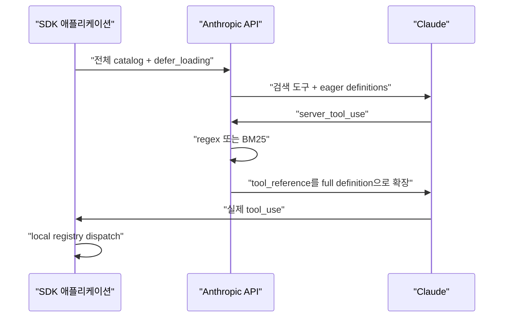
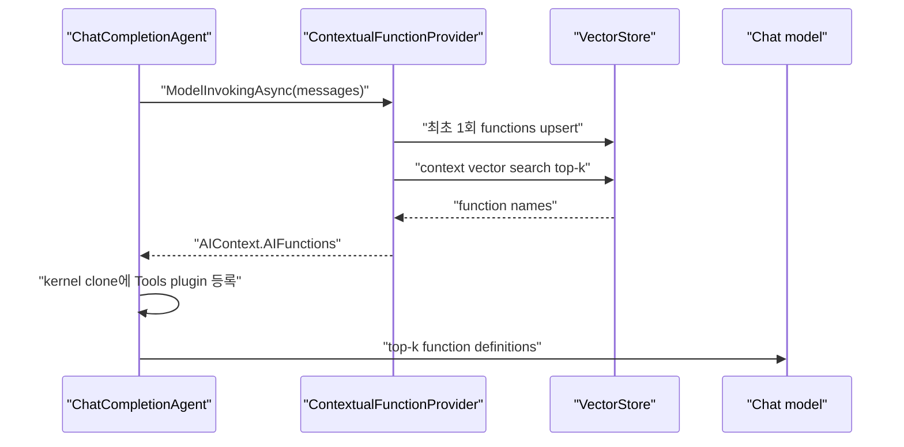
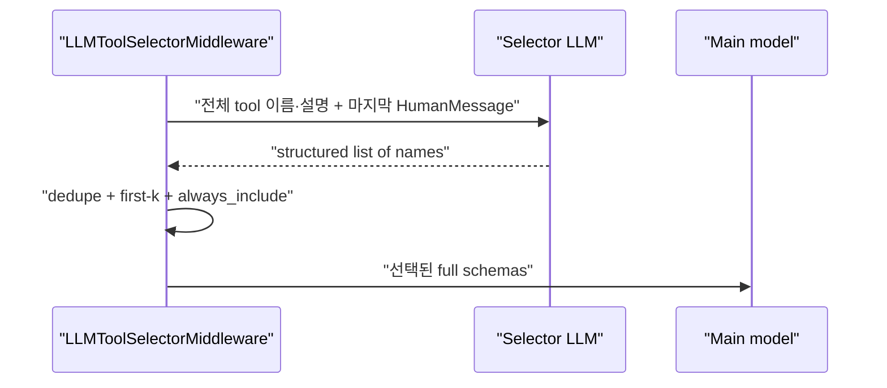
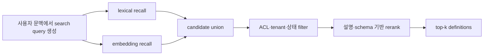

# Tool Search 프레임워크 코드 레벨 분석

> 조사 기준일: 2026-09-14<br>
> 분석 대상: Codex, OpenAI Agents SDK, Anthropic Python SDK, Pydantic AI, LangChain·LangGraph, Google ADK, LlamaIndex, Semantic Kernel<br>
> 상위 개념과 provider 기능 비교는 [Tool Search 기술 지형도](tool-search-landscape.md)를 먼저 참고한다.

## 1. 분석 목표와 방법

이 문서는 API 사용 예제를 비교하는 데서 멈추지 않고 다음 질문을 실제 소스 코드에서 추적한다.

1. 전체 도구는 어디에 등록되고, 모델에 보이는 도구와 어떻게 분리되는가.
2. 검색 문서는 어떤 필드로 구성되고 어떤 알고리즘으로 랭킹되는가.
3. 검색은 주 모델 호출 전, 모델의 도구 호출 중, provider 내부 중 언제 일어나는가.
4. 검색 결과의 이름이 완전한 schema와 실제 executor로 어떻게 연결되는가.
5. 발견 상태를 다음 턴과 다른 provider로 어떻게 재생하는가.
6. prompt cache, strict schema, 권한 검사가 어느 계층에 놓이는가.

모든 오픈소스 프로젝트는 `.repos/` 아래에 clone하고 아래 commit에 checkout해 분석했다. GitHub 링크도 같은 commit을 가리키므로 이후 main branch가 바뀌어도 근거를 재현할 수 있다.

| 프로젝트 | 분석 커밋 | 구현 언어 | 주된 방식 |
|---|---|---|---|
| Codex | [`3abbf9f`](https://github.com/openai/codex/tree/3abbf9fe2c6b6910e9de61f6a0c5bb468f74b5c8) | Rust | 로컬 BM25 + OpenAI client-executed search |
| OpenAI Agents SDK | [`fbf59a4`](https://github.com/openai/openai-agents-python/tree/fbf59a40e9da5adb88d370fefaeaae0478376d4a) | Python | Responses hosted search adapter |
| Anthropic Python SDK | [`eb21a43`](https://github.com/anthropics/anthropic-sdk-python/tree/eb21a4352015686c30f5759e8c2f02d70f5371e2) | Python | native type·history·runner adapter |
| Pydantic AI | [`5cbacfc`](https://github.com/pydantic/pydantic-ai/tree/5cbacfc8f86d653baa0ca2e31970cbf4f0fcec95) | Python | provider-native + portable local fallback |
| LangChain | [`15b5f57`](https://github.com/langchain-ai/langchain/tree/15b5f57b3d78071be7cf9d7acf71aa8264b2f191) | Python | 보조 LLM selector + provider middleware |
| LangGraph | [`e539ac1`](https://github.com/langchain-ai/langgraph/tree/e539ac122f4126f6dd850581c1494948cf620e31) | Python | 전체 실행 registry와 graph state |
| langgraph-bigtool | [`0bb7f92`](https://github.com/langchain-ai/langgraph-bigtool/tree/0bb7f9227d349afa4d4207c6630e800658c80894) | Python | 모델 주도 vector retrieval + 누적 공개 |
| Google ADK Python | [`460715b`](https://github.com/google/adk-python/tree/460715b6c62c8e9ab00931c502381ee0364e39b6) | Python | callback 기반 request-time filtering |
| LlamaIndex | [`7169bcd`](https://github.com/run-llama/llama_index/tree/7169bcd0dca2e16aecc8e0247f34e50079d9c0d5) | Python | Tool metadata object retrieval |
| Semantic Kernel | [`ca40aa7`](https://github.com/microsoft/semantic-kernel/tree/ca40aa7226531d28a721d0ca0e451d0aaf86dafc) | C# | embedding 기반 contextual selection |

코드가 보여 주는 공통 파이프라인은 다음과 같다.

```mermaid
flowchart LR
    C["전체 catalog"] --> R["runtime registry"]
    R --> P["policy와 exposure 계산"]
    P --> I["검색 index 또는 provider deferred catalog"]
    I --> Q["검색 질의"]
    Q --> K["top-k identity"]
    K --> D["완전한 tool definition"]
    D --> M["주 모델 context"]
    M --> F["function call"]
    F --> V["schema와 local validation"]
    V --> X["같은 registry의 executor"]
```



프레임워크별 차이는 `Q`를 누가 언제 만들고, `K → D`를 어떤 프로토콜로 기록하는지에 집중된다.

## 2. Codex: 로컬 BM25와 client-executed Tool Search

### 2.1 설계 개요

Codex는 OpenAI Responses API의 client-executed `tool_search`를 실제 제품 런타임에 구현한 사례다. MCP와 동적 도구는 로컬 `ToolRegistry`에 계속 등록해 두고, 모델 노출 방식만 `Direct`, `Deferred`, `CodeMode`로 분리한다. 모델은 `tool_search`를 호출하고, Codex가 로컬 BM25로 검색한 완전한 namespace 정의를 `tool_search_output(execution="client")`로 반환한다.

이 구조의 핵심은 **숨김과 제거의 분리**다. Deferred 도구는 모델 입력에서는 보이지 않지만 registry에 남아 있으므로 발견 후 실제 호출을 같은 runtime object로 dispatch할 수 있다.

### 2.2 exposure 계산과 검색 도구 등록

[`ToolExposures`와 `ToolExposure`](https://github.com/openai/codex/blob/3abbf9fe2c6b6910e9de61f6a0c5bb468f74b5c8/codex-rs/tools/src/tool_executor.rs#L14-L120)는 도구의 model-facing surface를 bit flag와 enum으로 표현한다. 도구 자체의 실행 가능성과 모델 가시성을 하나의 bool로 합치지 않은 점이 중요하다.

[`spec_plan.rs`](https://github.com/openai/codex/blob/3abbf9fe2c6b6910e9de61f6a0c5bb468f74b5c8/codex-rs/core/src/tools/spec_plan.rs#L225-L253)는 모델과 설정에 따라 namespace 도구의 exposure를 바꾼다. [`search_tool_enabled`](https://github.com/openai/codex/blob/3abbf9fe2c6b6910e9de61f6a0c5bb468f74b5c8/codex-rs/core/src/tools/spec_plan.rs#L629-L631)가 모델의 `supports_search_tool` capability와 namespace 활성화를 결합하고, [`finalize_tool_router`](https://github.com/openai/codex/blob/3abbf9fe2c6b6910e9de61f6a0c5bb468f74b5c8/codex-rs/core/src/tools/spec_plan.rs#L352-L407)가 실제 deferred 후보를 확인해 `ToolSearchHandler`를 등록한다. 검색을 지원하지 않는 모델에는 deferred surface를 만들지 않는 방식으로 capability mismatch를 방지한다.

### 2.3 검색 문서 생성

[`ToolSearchInfo::from_tool_spec`](https://github.com/openai/codex/blob/3abbf9fe2c6b6910e9de61f6a0c5bb468f74b5c8/codex-rs/tools/src/tool_search.rs#L23-L85)는 function과 freeform tool을 기본 namespace로 감싸고 `defer_loading=true`를 설정한다. Namespace 도구는 내부 function 전체를 deferred로 바꾼다. 출력 schema는 검색 결과용 정의에서 제거한다.

[`default_tool_search_text`](https://github.com/openai/codex/blob/3abbf9fe2c6b6910e9de61f6a0c5bb468f74b5c8/codex-rs/tools/src/tool_search.rs#L87-L156)가 인덱싱하는 필드는 다음과 같다.

- namespace 이름과 설명
- function 이름과 underscore를 공백으로 바꾼 이름
- function 설명
- JSON Schema의 property 이름과 description
- 중첩 `items`와 `anyOf` 내부의 이름·설명
- freeform tool의 syntax 설명

즉 `calendar_create_event`라는 이름뿐 아니라 `attendees`, `start_time` 같은 인자 단서로도 도구를 찾을 수 있다. 반면 enum 값, default, required 관계, output schema는 검색 corpus에 들어가지 않는다.

### 2.4 BM25 인덱스와 캐시

[`ToolSearchHandler::new`](https://github.com/openai/codex/blob/3abbf9fe2c6b6910e9de61f6a0c5bb468f74b5c8/codex-rs/core/src/tools/handlers/tool_search.rs#L132-L166)는 각 검색 문자열을 `bm25::Document`로 만들고 English tokenizer를 쓰는 `SearchEngine`을 한 번 구축한다. 기본 결과 제한은 [`TOOL_SEARCH_DEFAULT_LIMIT = 8`](https://github.com/openai/codex/blob/3abbf9fe2c6b6910e9de61f6a0c5bb468f74b5c8/codex-rs/tools/src/tool_discovery.rs#L1-L7)이다.

[`ToolSearchHandlerCache`](https://github.com/openai/codex/blob/3abbf9fe2c6b6910e9de61f6a0c5bb468f74b5c8/codex-rs/core/src/tools/handlers/tool_search.rs#L35-L130)는 매 턴 BM25를 다시 만들지 않는다.

- immutable runtime은 `Weak::ptr_eq`로 identity를 비교한다.
- dynamic runtime은 현재 `ToolSearchInfo` 값을 비교한다.
- source listing 설정이나 후보가 달라질 때만 handler를 재구축한다.

이 선택은 도구 카탈로그가 대부분 고정이고 일부 MCP metadata만 바뀌는 런타임에 적합하다. 다만 English tokenizer를 고정했기 때문에 한글 질의와 한글 metadata의 형태소 처리는 lexical match에 의존한다.

### 2.5 검색 호출과 namespace 병합

[`handle_call`](https://github.com/openai/codex/blob/3abbf9fe2c6b6910e9de61f6a0c5bb468f74b5c8/codex-rs/core/src/tools/handlers/tool_search.rs#L190-L227)은 빈 query와 0 limit를 거절한다. [`search`](https://github.com/openai/codex/blob/3abbf9fe2c6b6910e9de61f6a0c5bb468f74b5c8/codex-rs/core/src/tools/handlers/tool_search.rs#L232-L255)는 BM25 top-k의 document ID를 원래 `ToolSearchEntry`로 역매핑한 뒤 같은 namespace의 결과를 `coalesce_loadable_tool_specs`로 합친다.

```text
query
  → BM25 top 8 entries
  → entry.output의 LoadableToolSpec
  → 동일 namespace 병합
  → ToolSearchOutput.tools
```

검색기는 개별 function을 랭킹하지만 출력은 namespace 단위로 합쳐질 수 있다. 같은 namespace에서 여러 함수가 맞으면 wrapper 정의 하나에 모아 보내 중복 namespace metadata를 줄인다.

### 2.6 Responses wire format과 실제 dispatch

[`ToolSearchOutput::to_response_item`](https://github.com/openai/codex/blob/3abbf9fe2c6b6910e9de61f6a0c5bb468f74b5c8/codex-rs/core/src/tools/context.rs#L193-L231)은 검색 결과를 `execution: "client"`인 Responses input item으로 직렬화하고 원래 `call_id`를 유지한다. [`router.rs`](https://github.com/openai/codex/blob/3abbf9fe2c6b6910e9de61f6a0c5bb468f74b5c8/codex-rs/core/src/tools/router.rs#L185-L281)는 tool search가 보일 때만 deferred tool을 reachable로 판단하고 `ToolSearchCall`을 로컬 payload로 파싱한다.

[`responses_api.rs`](https://github.com/openai/codex/blob/3abbf9fe2c6b6910e9de61f6a0c5bb468f74b5c8/codex-rs/tools/src/responses_api.rs#L49-L118)는 function과 namespace를 loadable spec으로 표현하고 namespace 결과를 병합한다. MCP plugin schema가 직렬화 기준 8,000 bytes를 넘으면 [`parameters`를 열린 object로 축약](https://github.com/openai/codex/blob/3abbf9fe2c6b6910e9de61f6a0c5bb468f74b5c8/codex-rs/tools/src/responses_api.rs#L13-L165)한다. 이는 context 폭증을 막지만 모델이 세부 인자 구조를 덜 알게 되는 품질 손실을 만든다.

또한 Codex의 generic·MCP 변환은 현재 `strict: false`를 설정한다. 따라서 이 경로에서는 provider constrained decoding보다 로컬 parsing과 handler validation이 마지막 방어선이다. Tool search 성공이 strict argument guarantee를 뜻하지 않는 구체 사례다.

### 2.7 평가

**강점**

- provider client-executed 프로토콜과 로컬 registry를 끝까지 연결한다.
- 검색 대상은 현재 등록·허용된 deferred runtime으로 한정된다.
- 인자 이름과 설명까지 검색해 단순 이름 검색보다 recall이 좋다.
- immutable catalog에서 BM25 index를 재사용한다.
- namespace coalescing으로 반환 정의의 중복을 줄인다.

**제약**

- English BM25, 고정 기본 top-8, lexical metadata 품질에 민감하다.
- 유사어와 다국어를 위한 embedding 또는 hybrid rerank가 없다.
- 큰 MCP schema 축약은 실제 call의 인자 선택 품질을 낮출 수 있다.
- 검색은 권한 부여가 아니므로 executor에서 authorization을 재검사해야 한다.

### 2.8 Codex SDK와 runtime의 경계

Codex SDK 자체가 BM25나 deferred catalog를 구현하는 것은 아니다. TypeScript [`Codex`](https://github.com/openai/codex/blob/3abbf9fe2c6b6910e9de61f6a0c5bb468f74b5c8/sdk/typescript/src/codex.ts#L7-L38)는 thread를 만들고 재개하는 facade이고, [`CodexExec.run`](https://github.com/openai/codex/blob/3abbf9fe2c6b6910e9de61f6a0c5bb468f74b5c8/sdk/typescript/src/exec.ts#L65-L103)은 Codex CLI의 `exec` process를 시작한다. SDK 사용자가 보는 tool search 동작은 이 child runtime의 `codex-rs` 경로에서 나온다. 따라서 SDK API 표면만 읽으면 tool discovery의 실제 ranking·cache·exposure 정책을 알 수 없고 runtime source까지 내려가야 한다.

## 3. OpenAI Agents SDK: native search를 Responses run loop에 연결

이 절의 SDK 코드는 OpenAI Responses API가 정의한 hosted·client-executed Tool Search protocol을 기준으로 해석했다.[^1]

### 3.1 도구 모델과 정합성 검사

[`FunctionTool`](https://github.com/openai/openai-agents-python/blob/fbf59a40e9da5adb88d370fefaeaae0478376d4a/src/agents/tool.py#L448-L518)은 JSON Schema, 실행 callback, `strict_json_schema`, `defer_loading`, namespace metadata를 함께 가진다. Decorator의 기본값은 [`strict_mode=True`, `defer_loading=False`](https://github.com/openai/openai-agents-python/blob/fbf59a40e9da5adb88d370fefaeaae0478376d4a/src/agents/tool.py#L2546-L2623)이며 strict일 때 schema를 provider 호환 형태로 정규화한다.

[`ToolSearchTool`](https://github.com/openai/openai-agents-python/blob/fbf59a40e9da5adb88d370fefaeaae0478376d4a/src/agents/tool.py#L1599-L1613)은 server·client execution 설정과 client search argument schema를 나타낸다. [`tool_namespace`](https://github.com/openai/openai-agents-python/blob/fbf59a40e9da5adb88d370fefaeaae0478376d4a/src/agents/tool.py#L1643-L1666)는 여러 `FunctionTool`을 Responses namespace로 묶는다.

요청 전에 [`validate_responses_tool_search_configuration`](https://github.com/openai/openai-agents-python/blob/fbf59a40e9da5adb88d370fefaeaae0478376d4a/src/agents/tool.py#L1742-L1767)이 다음 불변조건을 확인한다.

- deferred function, 명시 namespace function, deferred Hosted MCP 중 하나가 searchable surface여야 한다.
- deferred surface가 있으면 `ToolSearchTool`이 있어야 한다.
- `ToolSearchTool`은 최대 하나다.
- 검색 도구만 있고 검색 대상이 없는 구성도 거절한다.

구성 오류를 모델 호출 뒤의 애매한 실패로 넘기지 않고 SDK 경계에서 막는 설계다.

### 3.2 wire 변환

[`openai_responses.py`](https://github.com/openai/openai-agents-python/blob/fbf59a40e9da5adb88d370fefaeaae0478376d4a/src/agents/models/openai_responses.py#L2035-L2145)는 namespace가 같은 함수들을 `type: "namespace"` 하나로 묶고, 각 function에 `parameters`, `strict`, 필요하면 `defer_loading`을 직렬화한다. [`ToolSearchTool` 변환](https://github.com/openai/openai-agents-python/blob/fbf59a40e9da5adb88d370fefaeaae0478376d4a/src/agents/models/openai_responses.py#L2270-L2278)은 hosted 또는 client 설정을 Responses schema로 투영한다.

SDK는 모델 호출마다 현재 전체 도구를 변환해 [`responses.create`](https://github.com/openai/openai-agents-python/blob/fbf59a40e9da5adb88d370fefaeaae0478376d4a/src/agents/models/openai_responses.py#L829-L1042)에 보낸다. Hosted search는 클라이언트에서 catalog payload를 없애는 기능이 아니라 server가 모델에게 노출할 definition을 늦추는 기능이라는 점이 코드에서도 확인된다.

개별 deferred function은 초기 context에서도 이름과 설명이 노출되고 parameter schema가 주로 지연된다. Namespace와 MCP는 처음에 wrapper 이름과 설명만 보이므로 내부 함수가 많은 catalog에서 더 큰 절감과 격리를 제공한다. 이 차이 때문에 SDK의 namespace coalescing은 단순한 이름 정리가 아니라 context 축소 단위의 선택이다.[^1]

Chat Completions에는 동일 프로토콜이 없기 때문에 [`chatcmpl_converter.py`](https://github.com/openai/openai-agents-python/blob/fbf59a40e9da5adb88d370fefaeaae0478376d4a/src/agents/models/chatcmpl_converter.py#L1017-L1037)가 Tool Search와 Responses 전용 도구를 명시적으로 거절한다.

### 3.3 tool choice와 아직 로드되지 않은 도구

[`tool choice 변환`](https://github.com/openai/openai-agents-python/blob/fbf59a40e9da5adb88d370fefaeaae0478376d4a/src/agents/models/openai_responses.py#L1847-L1942)은 discovery state와 choice constraint를 결합한다.

- hosted `tool_search` 자체를 특정 named tool처럼 강제할 수 없고 `auto` 또는 `required`를 사용한다.
- bare namespace와 namespace 내부 이름을 잘못 강제하는 구성을 거절한다.
- 아직 발견되지 않은 deferred-only function은 named forcing 대상이 될 수 없다.

이는 tool choice가 “등록된 모든 도구”가 아니라 **현재 callable한 도구**에 적용된다는 의미다.

### 3.4 응답 처리와 run loop

[`turn_resolution.py`](https://github.com/openai/openai-agents-python/blob/fbf59a40e9da5adb88d370fefaeaae0478376d4a/src/agents/run_internal/turn_resolution.py#L3015-L3046)는 hosted `tool_search_call`과 `tool_search_output`을 각각 `RunItem`으로 보존한다. [`items.py`](https://github.com/openai/openai-agents-python/blob/fbf59a40e9da5adb88d370fefaeaae0478376d4a/src/agents/items.py#L179-L219)의 `to_input_item()`이 원형을 다음 모델 입력으로 재생한다. 검색만 하고 실제 함수 호출 없이 응답이 끝났으면 run loop는 [`NextStepRunAgain`](https://github.com/openai/openai-agents-python/blob/fbf59a40e9da5adb88d370fefaeaae0478376d4a/src/agents/run_internal/turn_resolution.py#L952-L1098)으로 한 번 더 모델을 호출한다.

실제 function call은 모든 로컬 도구를 대상으로 만든 [`namespace-aware lookup`](https://github.com/openai/openai-agents-python/blob/fbf59a40e9da5adb88d370fefaeaae0478376d4a/src/agents/run_internal/turn_resolution.py#L2684-L2731)에서 찾는다. Turn resolver는 [`allowed_callers`를 확인한 뒤 실행 대상으로 큐잉](https://github.com/openai/openai-agents-python/blob/fbf59a40e9da5adb88d370fefaeaae0478376d4a/src/agents/run_internal/turn_resolution.py#L3338-L3421)하고, executor가 [`on_invoke_tool` callback을 호출](https://github.com/openai/openai-agents-python/blob/fbf59a40e9da5adb88d370fefaeaae0478376d4a/src/agents/tool.py#L2207-L2228)한다. Definition visibility와 execution registry가 분리돼 있다.

### 3.5 중요한 한계: client search는 자동 실행하지 않음

Responses protocol은 `execution="client"`를 지원하고 `ToolSearchTool` 타입도 이를 표현한다. 그러나 표준 Runner는 [`execution="client"`인 `tool_search_call`을 만나면 `ModelBehaviorError`](https://github.com/openai/openai-agents-python/blob/fbf59a40e9da5adb88d370fefaeaae0478376d4a/src/agents/run_internal/turn_resolution.py#L3015-L3030)를 내고 raw Responses API 또는 수동 loop를 사용하라고 안내한다. 즉 SDK가 **표현할 수 있는 것**과 SDK Runner가 **자동 오케스트레이션하는 것**의 범위가 다르다.

Hosted inventory가 충분하면 SDK Runner가 적합하다. 사용자별 ACL index나 외부 vector store를 검색하려면 raw Responses loop를 직접 구현하거나 Codex처럼 별도 runtime handler가 필요하다.

### 3.6 strict와 권한

`FunctionTool`의 기본 strict schema와 `defer_loading`은 같은 definition에 함께 직렬화된다. 검색은 schema를 언제 보여 줄지 결정하고, strict는 실제 function-call arguments 생성에 적용된다. `allowed_callers`, `needs_approval`, input guardrail, handler authorization은 다시 별도다. SDK가 이 세 상태를 다른 필드와 경로로 유지한다는 점이 “tool constraint”를 하나의 기능으로 부르면 안 되는 코드 수준 근거다.

## 4. Anthropic Python SDK: 검색 엔진이 아닌 protocol adapter

### 4.1 SDK에 BM25 구현은 없다

Anthropic Python SDK는 native regex·BM25를 로컬에서 실행하지 않는다. [`ToolSearchToolRegex20251119Param`](https://github.com/anthropics/anthropic-sdk-python/blob/eb21a4352015686c30f5759e8c2f02d70f5371e2/src/anthropic/types/tool_search_tool_regex_20251119_param.py#L11-L34)과 [`ToolSearchToolBm25_20251119Param`](https://github.com/anthropics/anthropic-sdk-python/blob/eb21a4352015686c30f5759e8c2f02d70f5371e2/src/anthropic/types/tool_search_tool_bm25_20251119_param.py#L11-L34)은 versioned server-tool type을 모델링한다. [`ToolUnionParam`](https://github.com/anthropics/anthropic-sdk-python/blob/eb21a4352015686c30f5759e8c2f02d70f5371e2/src/anthropic/types/tool_union_param.py#L25-L52)이 이 타입을 일반 client tool과 함께 요청 union에 포함한다.

일반 [`ToolParam`](https://github.com/anthropics/anthropic-sdk-python/blob/eb21a4352015686c30f5759e8c2f02d70f5371e2/src/anthropic/types/tool_param.py#L31-L82)은 `defer_loading`과 `strict`를 독립 필드로 둔다. SDK decorator도 [`defer`와 `strict`를 wire dict에 복사](https://github.com/anthropics/anthropic-sdk-python/blob/eb21a4352015686c30f5759e8c2f02d70f5371e2/src/anthropic/lib/tools/_beta_functions.py#L145-L207)할 뿐 검색 알고리즘에 관여하지 않는다.

### 4.2 결과는 symbolic reference

응답 타입은 다음 세 층이다.

- [`ToolReferenceBlock`](https://github.com/anthropics/anthropic-sdk-python/blob/eb21a4352015686c30f5759e8c2f02d70f5371e2/src/anthropic/types/tool_reference_block.py#L8-L11): 발견된 도구 이름
- [`ToolSearchToolSearchResultBlock`](https://github.com/anthropics/anthropic-sdk-python/blob/eb21a4352015686c30f5759e8c2f02d70f5371e2/src/anthropic/types/tool_search_tool_search_result_block.py#L10-L13): reference 배열
- [`ToolSearchToolResultBlock`](https://github.com/anthropics/anthropic-sdk-python/blob/eb21a4352015686c30f5759e8c2f02d70f5371e2/src/anthropic/types/tool_search_tool_result_block.py#L10-L18): server search 결과 envelope

OpenAI의 `tool_search_output`이 완전한 definition을 담는 것과 달리 Anthropic 결과는 top-level `tools`에 이미 선언된 이름을 가리킨다. API server가 reference를 원래 정의로 확장한다.

Custom embedding search도 같은 확장 경로를 재사용한다. 앱은 일반 search tool의 `tool_result.content`에 [`ToolReferenceBlockParam`](https://github.com/anthropics/anthropic-sdk-python/blob/eb21a4352015686c30f5759e8c2f02d70f5371e2/src/anthropic/types/tool_reference_block_param.py#L11-L18)을 넣는다. 이 이름은 top-level catalog에 이미 있어야 한다. 따라서 custom search가 임의의 새 schema를 즉석에서 등록하는 통로는 아니다.

### 4.3 Tool Runner의 책임 경계

[`messages.py`](https://github.com/anthropics/anthropic-sdk-python/blob/eb21a4352015686c30f5759e8c2f02d70f5371e2/src/anthropic/resources/beta/messages/messages.py#L1507-L1565)의 Tool Runner 요청은 runnable tool과 raw definition을 모두 Messages API로 전송한다. Server search call은 Anthropic이 처리한다. [`_beta_runner.py`](https://github.com/anthropics/anthropic-sdk-python/blob/eb21a4352015686c30f5759e8c2f02d70f5371e2/src/anthropic/lib/tools/_beta_runner.py#L202-L315)는 최종 `tool_use`만 로컬 registry에서 찾아 실행한다.



### 4.4 strict 결합과 한계

Anthropic은 처음부터 전체 toolset의 grammar를 컴파일하므로 deferred definition을 발견할 때 strict grammar를 다시 만들지 않는다. 공식 제한은 요청당 strict tools 최대 20개이며, grammar cache는 최대 24시간 유지될 수 있다.[^2][^14] Tool search는 최대 10,000개의 deferred catalog를 다루지만 strict limit은 별도이므로, 대규모 catalog 전체에 strict를 켜는 조합은 provider limit을 먼저 확인해야 한다.

SDK 관점에서의 장점은 protocol fidelity다. 검색 블록, reference, strict field를 손실 없이 타입으로 보존한다. 반면 provider lock-in을 감추거나 다른 provider용 fallback search를 제공하지 않는다. 이식성이 필요하면 Pydantic AI나 LangChain 같은 상위 프레임워크가 추가로 필요하다.

## 5. Semantic Kernel: 모델 호출 전에 embedding으로 top-k 선택

### 5.1 ContextualFunctionProvider

Semantic Kernel의 [`ContextualFunctionProvider`](https://github.com/microsoft/semantic-kernel/blob/ca40aa7226531d28a721d0ca0e451d0aaf86dafc/dotnet/src/SemanticKernel.Core/Functions/ContextualSelection/ContextualFunctionProvider.cs#L16-L91)는 함수 이름과 설명을 vectorize해 관련 함수를 찾는 RAG component다. `[Experimental("SKEXP0130")]`로 표시돼 있고 현재 .NET 구현이다.[^3]

첫 `ModelInvokingAsync`에서만 [`FunctionStore.SaveAsync`](https://github.com/microsoft/semantic-kernel/blob/ca40aa7226531d28a721d0ca0e451d0aaf86dafc/dotnet/src/SemanticKernel.Core/Functions/ContextualSelection/ContextualFunctionProvider.cs#L94-L114)를 호출해 전체 함수를 vector store에 넣는다. 이후에는 최근 메시지와 현재 입력을 합친 문자열을 query로 사용한다. 기본 context는 현재 새 메시지와 설정된 최근 메시지 수이며, callback으로 별도 embedding source를 만들 수 있다.

### 5.2 FunctionStore

[`FunctionStore` constructor](https://github.com/microsoft/semantic-kernel/blob/ca40aa7226531d28a721d0ca0e451d0aaf86dafc/dotnet/src/SemanticKernel.Core/Functions/ContextualSelection/FunctionStore.cs#L39-L69)는 string `Name`을 key로 하고 `Embedding`을 vector property로 가진 dynamic collection을 만든다. 기본 임베딩 원문은 [`Function name: ..., description: ...`](https://github.com/microsoft/semantic-kernel/blob/ca40aa7226531d28a721d0ca0e451d0aaf86dafc/dotnet/src/SemanticKernel.Core/Functions/ContextualSelection/FunctionStore.cs#L124-L144)이며 callback으로 바꿀 수 있다.

[`SearchAsync`](https://github.com/microsoft/semantic-kernel/blob/ca40aa7226531d28a721d0ca0e451d0aaf86dafc/dotnet/src/SemanticKernel.Core/Functions/ContextualSelection/FunctionStore.cs#L100-L117)는 vector collection에서 지정된 `maxNumberOfFunctions`만큼 찾고, 결과 record의 Name을 `_functionByName` dictionary로 역매핑해 원래 `AIFunction`을 반환한다.

### 5.3 주 모델에 주입하는 지점

[`ChatCompletionAgent.InvokeAsync`](https://github.com/microsoft/semantic-kernel/blob/ca40aa7226531d28a721d0ca0e451d0aaf86dafc/dotnet/src/Agents/Core/ChatCompletionAgent.cs#L76-L114)는 다음 순서로 동작한다.

1. `UseImmutableKernel`이면 kernel을 clone한다.
2. thread의 모든 `AIContextProvider`에서 `ModelInvokingAsync`를 실행한다.
3. 반환된 `AIContext.AIFunctions`가 있는데 immutable mode가 아니면 오류를 낸다.
4. 검색된 함수들을 임시 `Tools` plugin으로 clone kernel에 등록한다.
5. 그 kernel로 한 번의 chat completion을 실행한다.

이는 모델이 “검색해야겠다”고 판단하는 JIT search가 아니다. 프레임워크가 매 주 모델 호출 전에 context를 embedding하고 top-k schema만 tools에 넣는 **pre-retrieval**이다.



### 5.4 평가

**강점**

- 특정 provider의 native search 지원 여부와 무관하다.
- semantic similarity로 이름이 다른 도구도 찾을 수 있다.
- 주 모델은 검색 도구를 따로 호출하지 않아 model round trip이 하나 줄어든다.
- context 생성과 function embedding source를 모두 교체할 수 있다.

**제약**

- embedding 호출과 vector store 비용이 생긴다.
- 외부 vector store를 쓰면 catalog 동기화와 collection lifetime을 호출자가 관리해야 한다.
- 매 요청 top-k tools 배열이 달라져 provider cache prefix가 무효화될 수 있다.
- 모델이 스스로 query를 다듬어 재검색하는 native loop가 없다.
- top-k false negative가 발생하면 모델은 빠진 도구의 존재를 알 수 없다.
- mutable kernel에 임시 함수를 섞지 않기 위해 `UseImmutableKernel=true`가 필요하다.

## 6. 나머지 프레임워크

이 절에서는 provider-native와 framework-local 방식을 모두 지원하거나, callback과 retriever로 동일 문제를 푸는 프레임워크를 분석한다.

### 6.1 Google ADK: 요청 직전 동적 Toolset 필터링

#### 일반 tool search보다 넓은 extension point

ADK의 [`ToolUnion`](https://github.com/google/adk-python/blob/460715b6c62c8e9ab00931c502381ee0364e39b6/src/google/adk/agents/llm_agent.py#L142-L150)은 callable, `BaseTool`, `BaseToolset`을 받는다. 현재 저장소에는 일반 catalog용 `tool_search`나 `defer_loading`을 provider-native wire로 투영하는 구현이 없다. 대신 [`BaseToolset`](https://github.com/google/adk-python/blob/460715b6c62c8e9ab00931c502381ee0364e39b6/src/google/adk/tools/base_toolset.py#L43-L119)의 async `get_tools(readonly_context)`가 요청별 후보를 만드는 공개 extension point다.[^4]

`tool_filter`는 이름 목록 또는 `ToolPredicate(tool, readonly_context) -> bool`이다. Context에는 최초 사용자 content, invocation ID, agent name, read-only session state, user ID가 있다. Predicate는 synchronous이므로 DB·embedding 같은 I/O가 필요하면 custom `get_tools`를 구현해야 한다. 주의할 점은 base class가 filter를 자동 적용하지 않고 `_is_tool_selected()` helper만 제공한다는 것이다. Custom toolset은 이 helper를 직접 호출해야 한다.

[`get_tools_with_prefix`](https://github.com/google/adk-python/blob/460715b6c62c8e9ab00931c502381ee0364e39b6/src/google/adk/tools/base_toolset.py#L121-L189)는 resolved list를 `invocation_id` 단위로 캐시한다. 한 invocation 안에서 여러 model step이 있어도 보통 `get_tools`와 predicate를 다시 실행하지 않는다. Session state가 같은 invocation 중간에 바뀌어도 일반 toolset의 후보는 그대로일 수 있다는 뜻이다.

#### 모델 요청 생성과 dispatch map

[`base_llm_flow.py`](https://github.com/google/adk-python/blob/460715b6c62c8e9ab00931c502381ee0364e39b6/src/google/adk/flows/llm_flows/base_llm_flow.py#L203-L289)는 각 모델 step 전에 인증을 해소하고 모든 tool union을 `asyncio.gather`로 resolve한다. 선택된 tool의 `process_llm_request`를 차례로 실행한 뒤 [`LlmRequest.append_tools`](https://github.com/google/adk-python/blob/460715b6c62c8e9ab00931c502381ee0364e39b6/src/google/adk/models/llm_request.py#L287-L325)가 `GenerateContentConfig.tools[].function_declarations`를 만든다.

동시에 `tools_dict[name] = tool`을 만들어 실행 dispatch에 사용한다. 같은 이름이 중복되면 declaration은 둘 다 광고될 수 있지만 dict에서는 뒤 도구가 앞 도구를 덮는다. 따라서 custom retriever가 반환하는 이름의 uniqueness를 호출자가 보장해야 한다.

이 방식은 다음 성질을 가진다.

- 검색·필터는 주 모델 호출 전에 완료된다.
- 선택된 subset의 full schema는 Gemini 요청에 모두 실린다.
- 모델이 도구 catalog를 직접 검색하거나 검색 query를 수정하지 않는다.
- tools 배열이 달라질 수 있어 native append-only discovery의 cache 이점은 없다.

#### MCP catalog

[`McpToolset`](https://github.com/google/adk-python/blob/460715b6c62c8e9ab00931c502381ee0364e39b6/src/google/adk/tools/mcp_tool/mcp_toolset.py#L115-L228)은 tool filter, name prefix, raw list TTL cache를 제공한다. 실제 [`get_tools`](https://github.com/google/adk-python/blob/460715b6c62c8e9ab00931c502381ee0364e39b6/src/google/adk/tools/mcp_tool/mcp_toolset.py#L482-L551)는 다음 순서다.

```text
MCP session.list_tools 전체 조회
  → raw list TTL cache
  → 각 항목을 MCPTool로 변환
  → exact list 또는 predicate filter
  → 이름 정렬
  → 모델에 function declarations 추가
```

이름 정렬은 provider context cache의 prefix 안정성을 높인다. 그러나 filter 전에 MCP server의 전체 catalog를 조회하므로 모델 context는 줄여도 MCP listing 비용은 먼저 든다. TTL cache는 session·header identity key를 사용하며 최대 64개의 LRU entry를 갖는다. `notifications/tools/list_changed`를 구독하지 않아 TTL 동안 server 변경을 놓칠 수 있다.

#### SkillToolset은 제한된 staged loading

ADK 안에서 native tool search와 가장 비슷한 흐름은 [`SkillToolset`](https://github.com/google/adk-python/blob/460715b6c62c8e9ab00931c502381ee0364e39b6/src/google/adk/tools/skill_toolset.py#L1319-L1515)이다. 작은 core surface에 [`SearchSkillsTool`과 `LoadSkillTool`](https://github.com/google/adk-python/blob/460715b6c62c8e9ab00931c502381ee0364e39b6/src/google/adk/tools/skill_toolset.py#L240-L388), `list_skills`, resource·script 도구를 노출한다. 모델이 `load_skill`을 호출하면 instruction을 반환하고 session state에 활성 skill을 기록한다. 다음 model step에서 skill metadata의 `adk_additional_tools` 이름을 미리 제공된 tool pool에서 해소해 schema를 추가한다.

[`SkillToolset`](https://github.com/google/adk-python/blob/460715b6c62c8e9ab00931c502381ee0364e39b6/src/google/adk/tools/skill_toolset.py#L1383-L1515)은 mid-turn activation을 반영하기 위해 일반 invocation cache를 끈다. 그러나 이것은 임의의 MCP tool catalog 검색이 아니다. 애플리케이션이 skill과 추가 도구 이름의 매핑을 미리 작성해야 하며 `search → load → 다음 LLM step`이 필요하다.

#### HEAD의 RemoteMcpServer

최신 소스에는 [`RemoteMcpServer`](https://github.com/google/adk-python/blob/460715b6c62c8e9ab00931c502381ee0364e39b6/src/google/adk/tools/_remote_mcp_server.py#L34-L68)가 있다. Managed Agent가 원격 MCP spec을 Interactions backend로 넘기고 서버가 연결·실행하는 경로다. [`allowed_tools`는 이름 목록으로 그대로 변환](https://github.com/google/adk-python/blob/460715b6c62c8e9ab00931c502381ee0364e39b6/src/google/adk/models/interactions_utils.py#L568-L586)될 뿐 검색 또는 deferred algorithm은 노출되지 않는다. 공개 Managed Agents 문서는 아직 MCP 미지원을 설명하므로, 이 항목은 release contract가 아니라 **HEAD의 선행 구현**으로 봐야 한다.[^5]

### 6.2 LlamaIndex: 도구를 ObjectIndex에 넣는 application-side RAG

#### Tool → TextNode → VectorStoreIndex

LlamaIndex의 표준 대규모 catalog 해법은 provider-native search가 아니라 `ObjectIndex[BaseTool]`이다. [`ObjectIndex.from_objects`](https://github.com/run-llama/llama_index/blob/7169bcd0dca2e16aecc8e0247f34e50079d9c0d5/llama-index-core/llama_index/core/objects/base.py#L82-L160)는 tool list에 `SimpleToolNodeMapping`을 자동 선택하고 기본 `VectorStoreIndex`를 만든다.[^6]

[`SimpleToolNodeMapping`](https://github.com/run-llama/llama_index/blob/7169bcd0dca2e16aecc8e0247f34e50079d9c0d5/llama-index-core/llama_index/core/objects/tool_node_mapping.py#L15-L96)은 각 도구를 다음 내용의 `TextNode`로 바꾼다.

```text
Tool name: <name>
Tool description: <description>
[fn_schema가 있을 때] Tool schema: <Pydantic model_json_schema>
```

Codex와 Semantic Kernel이 주로 이름·설명을 검색하는 것과 달리 LlamaIndex는 `fn_schema`가 있는 도구라면 전체 input schema도 embedding text에 추가한다. 인자 enum과 중첩 구조가 semantic signal이 될 수 있지만 index 크기와 embedding 비용도 늘어난다. 이름을 key로 쓰는 in-memory dict는 중복 이름을 last-write-wins로 처리한다.

[`ObjectRetriever.retrieve`](https://github.com/run-llama/llama_index/blob/7169bcd0dca2e16aecc8e0247f34e50079d9c0d5/llama-index-core/llama_index/core/objects/base.py#L25-L79)는 underlying node retriever를 호출하고 optional postprocessor를 거친 뒤 node metadata의 name으로 원래 tool 객체를 복원한다. 기본 [`VectorIndexRetriever`](https://github.com/run-llama/llama_index/blob/7169bcd0dca2e16aecc8e0247f34e50079d9c0d5/llama-index-core/llama_index/core/indices/vector_store/retrievers/retriever.py#L24-L144)의 `similarity_top_k`는 2이고 query result cache는 없다.

#### 현재 workflow agent의 호출 경로

과거 `AgentRunner`와 `AgentWorker` 계열은 deprecated 상태이고, 현재 분석한 코드에서는 `BaseWorkflowAgent`, `FunctionAgent`, `ReActAgent`, `AgentWorkflow`가 중심이다.[^7]

[`BaseWorkflowAgent`](https://github.com/run-llama/llama_index/blob/7169bcd0dca2e16aecc8e0247f34e50079d9c0d5/llama-index-core/llama_index/core/agent/workflow/base_agent.py#L87-L108)는 static `tools`와 optional `tool_retriever`를 함께 받을 수 있다. 코드상 [`static tools 뒤에 retrieved tools를 append`](https://github.com/run-llama/llama_index/blob/7169bcd0dca2e16aecc8e0247f34e50079d9c0d5/llama-index-core/llama_index/core/agent/workflow/base_agent.py#L273-L282)하며 deduplicate하지 않는다. Run 시작 때 원래 user text를 context store에 저장하고, [`각 LLM iteration마다 같은 원래 text로 get_tools`](https://github.com/run-llama/llama_index/blob/7169bcd0dca2e16aecc8e0247f34e50079d9c0d5/llama-index-core/llama_index/core/agent/workflow/base_agent.py#L383-L480)한다. 중간 tool result나 scratchpad로 retrieval query를 갱신하지 않는다.

[`FunctionAgent`](https://github.com/run-llama/llama_index/blob/7169bcd0dca2e16aecc8e0247f34e50079d9c0d5/llama-index-core/llama_index/core/agent/workflow/function_agent.py#L19-L146)는 subset을 그대로 `llm.achat_with_tools`에 넘긴다. OpenAI Responses adapter도 [`각 tool을 ordinary type:function으로 직렬화`](https://github.com/run-llama/llama_index/blob/7169bcd0dca2e16aecc8e0247f34e50079d9c0d5/llama-index-integrations/llms/llama-index-llms-openai/llama_index/llms/openai/responses.py#L870-L913)하며 `tool_search`나 `defer_loading`은 사용하지 않는다. Google adapter도 선택된 tool을 모두 function declaration으로 보내고 mode와 `allowed_function_names`만 설정한다.

`ReActAgent`는 native function schema 대신 선택된 top-k의 이름, 설명, schema string을 system prompt에 렌더링한다. 검색 단계는 같지만 tool representation만 다르다.

#### 실행 시 재검색이라는 특이점

모델이 tool 이름을 고른 뒤 [`call_tool` step](https://github.com/run-llama/llama_index/blob/7169bcd0dca2e16aecc8e0247f34e50079d9c0d5/llama-index-core/llama_index/core/agent/workflow/base_agent.py#L624-L659)은 그 이름으로 retriever를 다시 호출하고 name map을 만들어 실행 대상을 찾는다. Vector retriever를 그대로 쓰면 보통 다음 두 검색이 생긴다.

```text
LLM step: original user query → vector search top-k → schemas 노출
tool step: selected tool name → vector search top-k → executor 복원
```

Custom retriever가 비결정적이거나 top-k가 너무 작으면 방금 모델에게 보여 준 tool을 실행 단계의 두 번째 검색에서 놓칠 수 있다. 모델 요청 때 사용한 tool object map을 step state에 보존하면 이 위험과 중복 embedding 호출을 줄일 수 있지만 현재 기본 경로는 재검색한다.

#### 상태와 보안 제약

- `ObjectRetriever`의 top-k는 relevance일 뿐 authorization이 아니다. 허용된 도구만 index에 넣거나 postprocessor에서 ACL을 먼저 적용해야 한다.
- static·retrieved tool과 중복 이름을 agent가 일반적으로 검사하지 않는다.
- `SimpleToolNodeMapping`은 callable object를 memory에 보관하고 자체 persistence를 지원하지 않는다. Index를 저장해도 재시작 시 mapping을 다시 만들어야 한다.
- catalog update는 `insert_object` 중심이고 delete·update·reindex lifecycle은 애플리케이션 책임이다.
- MCP integration은 `list_tools`를 eager materialize한 뒤 optional exact-name allowlist를 적용한다. ObjectIndex와 자동 결합되지는 않는다.

이름에 search가 들어가는 [`LoadAndSearchToolSpec`](https://github.com/run-llama/llama_index/blob/7169bcd0dca2e16aecc8e0247f34e50079d9c0d5/llama-index-core/llama_index/core/tools/tool_spec/load_and_search/base.py#L20-L156)은 tool catalog discovery가 아니다. 큰 **tool output data**를 index에 적재하고 별도 reader tool로 검색하는 wrapper다.

#### 평가

LlamaIndex 방식은 이미 가진 index, embedding, postprocessor 생태계를 그대로 재사용한다는 장점이 있다. Provider와 무관하고 full schema까지 검색 signal에 넣을 수 있다. 대신 query마다 embedding과 vector search를 수행하고, top-k schema 배열이 바뀌며, discovery history라는 일급 상태가 없다. 따라서 native search의 append-only cache와 모델 주도 재검색은 얻지 못한다.

### 6.3 Pydantic AI

Pydantic AI는 조사 대상 중 provider 차이를 가장 적극적으로 추상화한다. 하나의 `ToolSearch` capability가 실행 모델에 따라 다음 세 wire mode로 바뀐다.[^8]

1. Anthropic·OpenAI의 server-executed native search
2. 사용자 callable을 Anthropic reference 또는 OpenAI `execution="client"`로 운반하는 client-executed native search
3. 그 밖의 모델에서 일반 `search_tools` function을 쓰는 local fallback

#### capability와 자동 주입

[`ToolSearch`](https://github.com/pydantic/pydantic-ai/blob/5cbacfc8f86d653baa0ca2e31970cbf4f0fcec95/pydantic_ai_slim/pydantic_ai/capabilities/_tool_search.py#L35-L143)는 strategy, 최대 결과 수, 검색 도구 설명을 받는다. Agent는 [`ToolSearch capability를 자동 등록`](https://github.com/pydantic/pydantic-ai/blob/5cbacfc8f86d653baa0ca2e31970cbf4f0fcec95/pydantic_ai_slim/pydantic_ai/agent/__init__.py#L4343-L4377)하지만 deferred tool이 없으면 검색 surface가 wire에 나타나지 않아 실행 비용이 없다.

Strategy resolution은 [`_tool_search.py`](https://github.com/pydantic/pydantic-ai/blob/5cbacfc8f86d653baa0ca2e31970cbf4f0fcec95/pydantic_ai_slim/pydantic_ai/capabilities/_tool_search.py#L147-L222)에 구현돼 있다.

| 설정 | 실제 검색 | 지원하지 않는 provider |
|---|---|---|
| `None` | provider native 우선, 없으면 local keyword | local fallback |
| `'keywords'` | Pydantic AI의 lexical search | native client surface가 있으면 그 protocol로 운반 |
| callable | 사용자 sync·async search | native client surface 또는 일반 function fallback |
| `'bm25'`, `'regex'` | Anthropic server search | 조용한 대체 없이 오류 |

`'bm25'`와 `'regex'`를 OpenAI나 Gemini에서 임의의 local 알고리즘으로 바꾸지 않는 것은 의미 보존에 유리하다. 반면 `None`은 portability를 우선한다.

#### ToolSearchToolset과 안정된 author intent

[`ToolSearchToolset.get_tools`](https://github.com/pydantic/pydantic-ai/blob/5cbacfc8f86d653baa0ca2e31970cbf4f0fcec95/pydantic_ai_slim/pydantic_ai/toolsets/_tool_search.py#L283-L430)는 wrapped toolset을 다음처럼 나눈다.

- `defer_loading=False`: 처음부터 visible
- deferred이지만 on-demand capability 소유: capability loader가 관리하므로 search corpus에서 제외
- 독립 deferred tool: `with_native='tool_search'`로 corpus membership 표시

Local fallback의 `search_tools` definition은 모든 도구가 발견된 뒤에도 toolset에 남겨 둔다. 다음 턴에 갑자기 function definition을 제거하면 prefix가 바뀌기 때문이다. Provider가 native search를 지원하면 `unless_native='tool_search'`가 adapter에게 local function을 wire에서 제거하라고 지시한다.

이 설계는 두 상태를 명확히 분리한다.

```text
defer_loading       = 개발자가 작성한 고정 의도
tool_visibility     = 현재 요청의 visible · deferred · withheld · via_history
```

[`resolve_request_tools`](https://github.com/pydantic/pydantic-ai/blob/5cbacfc8f86d653baa0ca2e31970cbf4f0fcec95/pydantic_ai_slim/pydantic_ai/models/__init__.py#L1873-L1997)는 provider profile, native capability, 발견 history를 보고 각 definition의 현재 visibility를 한 번 결정한다. Provider가 native를 지원하지 않으면 `with_native`를 제거해 짝이 없는 `defer_loading` flag가 API로 나가지 않게 한다.

#### local keyword 알고리즘

Local `search_tools` schema는 [`queries: list[str]`](https://github.com/pydantic/pydantic-ai/blob/5cbacfc8f86d653baa0ca2e31970cbf4f0fcec95/pydantic_ai_slim/pydantic_ai/toolsets/_tool_search.py#L147-L193)이며 description별로 schema와 validator를 memoize한다. 검색 corpus에는 완전한 `ToolDefinition`을 보관하지만 기본 알고리즘이 읽는 필드는 이름과 설명이다.

[`_run_keywords_search`](https://github.com/pydantic/pydantic-ai/blob/5cbacfc8f86d653baa0ca2e31970cbf4f0fcec95/pydantic_ai_slim/pydantic_ai/toolsets/_tool_search.py#L439-L491)의 계산은 단순하다.

```text
query_terms = lowercase 영숫자 token의 합집합
tool_terms  = tool name과 description token의 집합
score       = |query_terms ∩ tool_terms|
sort key    = (아직 발견되지 않았는가, score) 내림차순
```

“미발견 여부”가 1차 key이므로 이미 보이는 도구가 `max_results` 자리를 차지해 새 도구를 밀어내지 않는다. 동점은 원래 corpus 순서를 유지한다. 한글은 `[a-z0-9]+` tokenizer에 잡히지 않으므로 기본 local strategy가 사실상 영문 metadata를 요구한다.

미묘하게도 명시적 `strategy='keywords'`는 public `keywords_search_fn`을 callable 경로로 사용해 미발견 우선 보정을 거치지 않는다. 같은 “keywords” 이름이라도 `None`의 local fallback과 정렬이 완전히 같지 않다.

사용자 callable은 `(ctx, queries, full ToolDefinition corpus) -> names`다. [`반환 목록의 앞 max_results를 먼저 자르고 known name만 남기므로`](https://github.com/pydantic/pydantic-ai/blob/5cbacfc8f86d653baa0ca2e31970cbf4f0fcec95/pydantic_ai_slim/pydantic_ai/toolsets/_tool_search.py#L493-L514), 앞부분에 unknown name이 많으면 뒤의 유효 결과를 보충하지 않는다. Duplicate도 별도 제거하지 않는다. Blank query는 `ModelRetry`, zero match는 정상 empty result다.

#### history가 discovery state의 source of truth

[`parse_discovered_tools`](https://github.com/pydantic/pydantic-ai/blob/5cbacfc8f86d653baa0ca2e31970cbf4f0fcec95/pydantic_ai_slim/pydantic_ai/toolsets/_tool_search.py#L196-L259)는 [`discovered_tool_names_in_order`](https://github.com/pydantic/pydantic-ai/blob/5cbacfc8f86d653baa0ca2e31970cbf4f0fcec95/pydantic_ai_slim/pydantic_ai/toolsets/_tool_search.py#L224-L259)가 first-appearance order로 복원한 이름을 실행 가시성 검사에 쓰는 `set`으로 바꾼다. 순서가 필요한 provider wire rendering은 ordered helper를 직접 사용한다. 두 함수는 다음 typed part를 읽는다.

- `ToolSearchReturnPart`
- `NativeToolSearchReturnPart`
- `ToolAvailabilityDeltaPart`
- 이전 버전의 metadata sideband

Compaction boundary 앞의 discovery는 버리고 현재 모델이 실제 볼 수 있는 post-compaction window만 읽는다. [`_agent_graph.py`](https://github.com/pydantic/pydantic-ai/blob/5cbacfc8f86d653baa0ca2e31970cbf4f0fcec95/pydantic_ai_slim/pydantic_ai/_agent_graph.py#L2566-L2572)가 각 step 전에 set을 갱신한다. History processor가 이 evidence를 제거하면 도구는 다시 hidden이 되고 재검색할 수 있다.

이 state representation 덕분에 provider를 중간에 바꿔도 discovery의 의미를 보존할 수 있다. 같은 native history는 원형으로 재생하고, 다른 provider로 갈 때는 framework-local typed part를 목표 wire shape로 다시 렌더링한다.

#### provider adapter

OpenAI adapter는 [`ToolSearchTool`을 server 또는 client execution으로 변환](https://github.com/pydantic/pydantic-ai/blob/5cbacfc8f86d653baa0ca2e31970cbf4f0fcec95/pydantic_ai_slim/pydantic_ai/models/openai.py#L3115-L3178)한다. History 기반 app-driven reveal은 [`additional_tools`](https://github.com/pydantic/pydantic-ai/blob/5cbacfc8f86d653baa0ca2e31970cbf4f0fcec95/pydantic_ai_slim/pydantic_ai/models/openai.py#L3310-L3411) input item으로 만들 수 있다. Anthropic adapter는 [`BM25·regex server tool 또는 custom path`](https://github.com/pydantic/pydantic-ai/blob/5cbacfc8f86d653baa0ca2e31970cbf4f0fcec95/pydantic_ai_slim/pydantic_ai/models/anthropic.py#L1780-L1900)를 선택하고 tool definition에 [`defer_loading`](https://github.com/pydantic/pydantic-ai/blob/5cbacfc8f86d653baa0ca2e31970cbf4f0fcec95/pydantic_ai_slim/pydantic_ai/models/anthropic.py#L2911-L2930)을 붙인다.

Gemini adapter에는 동등한 `ToolSearchTool` 변환이 없으므로 local function을 사용한다. 발견된 schema를 다음 요청의 function declarations에 추가하면 tool block이 바뀌어 cache가 무효화될 수 있다.

#### PrepareTools와 deterministic filtering

검색이 필요 없는 ACL·tenant routing은 [`PrepareTools`](https://github.com/pydantic/pydantic-ai/blob/5cbacfc8f86d653baa0ca2e31970cbf4f0fcec95/pydantic_ai_slim/pydantic_ai/capabilities/prepare_tools.py#L13-L44), [`FilteredToolset`](https://github.com/pydantic/pydantic-ai/blob/5cbacfc8f86d653baa0ca2e31970cbf4f0fcec95/pydantic_ai_slim/pydantic_ai/toolsets/filtered.py#L13-L32), [`PreparedToolset`](https://github.com/pydantic/pydantic-ai/blob/5cbacfc8f86d653baa0ca2e31970cbf4f0fcec95/pydantic_ai_slim/pydantic_ai/toolsets/prepared.py#L14-L41)로 처리할 수 있다. PreparedToolset은 정의의 추가나 rename을 허용하지 않고, 반환 subset으로 모델 schema와 execution lookup을 함께 바꾼다. 가시성만 줄이고 executor registry가 남는 native search와 다른 경계다.

#### local validation과 provider strict

일반 [`Tool(fn)`](https://github.com/pydantic/pydantic-ai/blob/5cbacfc8f86d653baa0ca2e31970cbf4f0fcec95/pydantic_ai_slim/pydantic_ai/tools.py#L296-L515)은 signature에서 JSON Schema와 pydantic-core validator를 만든다. 실행 전 [`ToolManager`](https://github.com/pydantic/pydantic-ai/blob/5cbacfc8f86d653baa0ca2e31970cbf4f0fcec95/pydantic_ai_slim/pydantic_ai/tool_manager.py#L312-L434)가 문자열이면 `validate_json`, dict면 `validate_python`을 호출하고 custom validator를 이어서 실행한다. Validation failure와 `ModelRetry`는 [`RetryPromptPart`](https://github.com/pydantic/pydantic-ai/blob/5cbacfc8f86d653baa0ca2e31970cbf4f0fcec95/pydantic_ai_slim/pydantic_ai/tool_manager.py#L268-L272)가 되어 다음 모델 턴에서 새 인자를 생성하게 한다.

예외는 `Tool.from_schema(...)`다. 임의 JSON Schema를 local pydantic validator로 컴파일하지 않고 `any_schema()`를 써서 local JSON Schema validation을 건너뛴다. 이 API에서는 custom args validator나 실행 함수가 검증을 맡아야 한다.

`ToolDefinition.strict`는 provider constrained generation 설정이다. OpenAI·Anthropic은 tool별 strict를 표현하고, Google은 request-wide `VALIDATED`로 매핑된다. Google adapter에서는 strict false 도구 하나가 섞이면 전체 요청이 AUTO가 될 수 있다. Provider strict와 local Pydantic validation은 중복되는 방어선이며 어느 쪽도 권한을 대신하지 않는다.

#### 평가

**강점**

- native, client-native, local fallback을 한 capability로 통합한다.
- discovery state가 typed history이므로 provider 전환과 저장·재생이 가능하다.
- author intent와 요청별 visibility를 분리해 schema 순서를 안정화한다.
- local validation과 model retry가 provider support와 독립적이다.

**제약**

- 기본 local tokenizer와 ranking이 단순하고 영문 중심이다.
- local reveal은 tools 배열을 바꿔 prompt cache를 깬다.
- callable 결과의 unknown·duplicate 처리와 잘라내기 순서에 주의해야 한다.
- History processor와 compaction 정책이 discovery state에 영향을 준다.
- 모든 reachable tool은 여전히 agent나 toolset에 미리 등록돼 있어야 한다.

### 6.4 LangChain·LangGraph

LangChain 생태계에는 이름이 비슷하지만 실행 위치가 다른 세 해법이 공존한다.

1. `LLMToolSelectorMiddleware`: 주 모델 호출 전에 보조 LLM으로 후보를 줄인다.
2. `ProviderToolSearchMiddleware`: OpenAI·Anthropic native search 설정을 전달한다.
3. `langgraph-bigtool`: 모델이 retrieval tool을 호출하고 graph state에 발견 도구를 누적한다.

#### A. LLMToolSelectorMiddleware

[`_create_tool_selection_response`](https://github.com/langchain-ai/langchain/blob/15b5f57b3d78071be7cf9d7acf71aa8264b2f191/libs/langchain_v1/langchain/agents/middleware/tool_selection.py#L65-L96)는 모든 `BaseTool`에 대해 `Literal[tool.name]`과 description annotation으로 structured-output schema를 만든다. 보조 selector는 전체 argument schema 대신 모든 후보의 **이름과 설명**을 본다.[^9]

[`_prepare_selection_request`](https://github.com/langchain-ai/langchain/blob/15b5f57b3d78071be7cf9d7acf71aa8264b2f191/libs/langchain_v1/langchain/agents/middleware/tool_selection.py#L225-L296)는 다음처럼 입력을 줄인다.

- `BaseTool`만 선택 후보로 사용한다.
- provider-native dict tool은 selector에서 제외하고 최종 요청에 항상 보존한다.
- `always_include` 도구는 후보와 max cap에서 분리한다.
- 대화 전체 대신 마지막 `HumanMessage` 하나만 selector에게 보낸다.

Selector는 `system + last human`으로 별도 모델 호출을 한다. [`_process_selection_response`](https://github.com/langchain-ai/langchain/blob/15b5f57b3d78071be7cf9d7acf71aa8264b2f191/libs/langchain_v1/langchain/agents/middleware/tool_selection.py#L298-L353)가 unknown name을 거절하고 중복을 제거하며 selector 출력의 앞 `max_tools`를 취한다. 하지만 최종 tool list는 원래 registry를 순회해 구성하므로 주 모델에 보이는 순서는 relevance 순이 아니라 원래 등록 순서다.

응답 shape가 잘못됐을 때만 [`max_retries`와 fallback 정책](https://github.com/langchain-ai/langchain/blob/15b5f57b3d78071be7cf9d7acf71aa8264b2f191/libs/langchain_v1/langchain/agents/middleware/tool_selection.py#L383-L515)을 적용한다. 정상 list 안에 unknown name이 있으면 즉시 오류다. Selector call은 internal metadata가 붙고 [`InternalCallTransformer`](https://github.com/langchain-ai/langchain/blob/15b5f57b3d78071be7cf9d7acf71aa8264b2f191/libs/langchain_v1/langchain/agents/middleware/internal_call_transformer.py#L1-L108)가 사용자 stream의 message와 raw event log에서 숨긴다.

마지막으로 immutable [`ModelRequest.override(tools=...)`](https://github.com/langchain-ai/langchain/blob/15b5f57b3d78071be7cf9d7acf71aa8264b2f191/libs/langchain_v1/langchain/agents/middleware/types.py#L203-L269)를 만들고 factory가 바로 이 subset을 [`model.bind_tools(final_tools)`](https://github.com/langchain-ai/langchain/blob/15b5f57b3d78071be7cf9d7acf71aa8264b2f191/libs/langchain_v1/langchain/agents/factory.py#L1298-L1439)에 넘긴다.



선택 결과 cache는 없으며 main model이 다시 호출될 때마다 selector도 다시 호출된다. Provider 중립이라는 장점과 함께 extra model latency, `O(N)` 이름·설명 입력, 최신 human message만 보는 context loss, 매번 달라지는 tools prefix라는 비용이 생긴다.

#### B. ProviderToolSearchMiddleware

[`provider_tool_search.py`](https://github.com/langchain-ai/langchain/blob/15b5f57b3d78071be7cf9d7acf71aa8264b2f191/libs/langchain_v1/langchain/agents/middleware/provider_tool_search.py#L40-L54)의 native registry는 Anthropic BM25 server tool과 OpenAI `{"type":"tool_search"}` 두 개뿐이다.[^10]

[`_prepare_request`](https://github.com/langchain-ai/langchain/blob/15b5f57b3d78071be7cf9d7acf71aa8264b2f191/libs/langchain_v1/langchain/agents/middleware/provider_tool_search.py#L57-L154)는 searchable name이 registry에 있는지 검사하고 `BaseTool.model_copy`로 `extras.defer_loading=True`를 설정한 뒤 native search dict를 tools 끝에 붙인다. Provider를 알아낼 수 없거나 지원하지 않으면 `ValueError`이며 local fallback은 없다. Dict-form tool은 이 middleware의 defer 대상이 아니다.

LangChain 자체의 ranking, discovery set, search cache는 없다. OpenAI adapter는 [`extras.defer_loading`을 wire definition으로 복사](https://github.com/langchain-ai/langchain/blob/15b5f57b3d78071be7cf9d7acf71aa8264b2f191/libs/partners/openai/langchain_openai/chat_models/base.py#L2459-L2470)하고, [`tool_search_call`·`tool_search_output` input block](https://github.com/langchain-ai/langchain/blob/15b5f57b3d78071be7cf9d7acf71aa8264b2f191/libs/partners/openai/langchain_openai/chat_models/base.py#L4900-L4916)과 [response content block](https://github.com/langchain-ai/langchain/blob/15b5f57b3d78071be7cf9d7acf71aa8264b2f191/libs/partners/openai/langchain_openai/chat_models/base.py#L5137-L5153)을 history로 보존한다. Anthropic adapter도 [`extras`의 provider tool definition을 통과](https://github.com/langchain-ai/langchain/blob/15b5f57b3d78071be7cf9d7acf71aa8264b2f191/libs/partners/anthropic/langchain_anthropic/chat_models.py#L2850-L2884)시키고 [`tool_reference`·`tool_search_tool_result` history block](https://github.com/langchain-ai/langchain/blob/15b5f57b3d78071be7cf9d7acf71aa8264b2f191/libs/partners/anthropic/langchain_anthropic/chat_models.py#L685-L725)을 보존한다.

이 middleware는 얇다는 점이 장점이다. Provider의 append-only cache와 검색 품질을 그대로 쓴다. 반면 provider version, native tool name, history block semantics에 직접 결합되고 지원하지 않는 모델을 위한 fallback은 애플리케이션이 따로 구성해야 한다.

#### C. langgraph-bigtool

`langgraph-bigtool`은 작은 `retrieve_tools(query)` function 하나를 먼저 모델에게 보여 주고, 검색된 도구를 다음 graph iteration부터 누적 공개한다.[^11]

[`selected_tool_ids` reducer](https://github.com/langchain-ai/langgraph-bigtool/blob/0bb7f9227d349afa4d4207c6630e800658c80894/langgraph_bigtool/graph.py#L16-L22)는 기존 ID 뒤에 새 ID만 붙인다. [`call_model`](https://github.com/langchain-ai/langgraph-bigtool/blob/0bb7f9227d349afa4d4207c6630e800658c80894/langgraph_bigtool/graph.py#L45-L99)은 state의 ID를 registry object로 바꾸고 매 턴 `[retrieve_tools, *selected_tools]`를 다시 bind한다.

기본 검색 함수는 [`Store.search`](https://github.com/langchain-ai/langgraph-bigtool/blob/0bb7f9227d349afa4d4207c6630e800658c80894/langgraph_bigtool/tools.py#L14-L50)에 query, per-search `limit`, metadata filter를 넘긴다. LangGraph `InMemoryStore`는 metadata filter 뒤에 query embedding과 저장 vector의 cosine similarity를 계산한다. 한 item에 여러 vector가 있으면 최대 similarity를 사용하며 query 결과 cache는 없다.[^12]

실행 [`ToolNode`](https://github.com/langchain-ai/langgraph-bigtool/blob/0bb7f9227d349afa4d4207c6630e800658c80894/langgraph_bigtool/graph.py#L99-L178)는 전체 registry를 보유하지만 모델은 누적 selected subset만 본다. Registry와 Store ID가 어긋나면 [`tool_registry[result]`](https://github.com/langchain-ai/langgraph-bigtool/blob/0bb7f9227d349afa4d4207c6630e800658c80894/langgraph_bigtool/graph.py#L25-L42)에서 `KeyError`가 난다.

`limit`은 한 번의 검색 결과 수이지 global visible-tool cap이 아니다. Eviction이 없어 여러 번 검색하면 schema가 결국 다시 커질 수 있다. 반대로 한 번 발견한 도구가 계속 보이므로 같은 run 안의 재검색 비용과 잊힘을 줄인다. Checkpointer를 붙이면 selected IDs를 thread state로 지속할 수 있지만 `compile(store=store)`만으로 자동 영속되는 것은 아니다.

#### ToolNode validation과 retry

LangGraph [`ToolNode`](https://github.com/langchain-ai/langgraph/blob/e539ac122f4126f6dd850581c1494948cf620e31/libs/prebuilt/langgraph/prebuilt/tool_node.py#L622-L791)는 전체 execution registry와 state·store injection metadata를 미리 만든다. 실행 전 trusted state와 store argument를 주입한 후 BaseTool을 호출한다. Sync와 async 실행 경로는 각각 [`ValidationError`를 `ToolInvocationError`로 바꾸고 처리된 오류를 `ToolMessage`로 반환](https://github.com/langchain-ai/langgraph/blob/e539ac122f4126f6dd850581c1494948cf620e31/libs/prebuilt/langgraph/prebuilt/tool_node.py#L922-L1012)하며 [동일한 변환을 async 호출에도 적용](https://github.com/langchain-ai/langgraph/blob/e539ac122f4126f6dd850581c1494948cf620e31/libs/prebuilt/langgraph/prebuilt/tool_node.py#L1069-L1159)한다. 이 메시지를 본 다음 LLM turn이 새 인자를 만들 수 있다.[^13]

LangChain `BaseTool`의 Pydantic `args_schema`는 [`model_validate` 또는 `parse_obj`](https://github.com/langchain-ai/langchain/blob/15b5f57b3d78071be7cf9d7acf71aa8264b2f191/libs/core/langchain_core/tools/base.py#L778-L905)로 local validation한다. 그러나 raw dict JSON Schema는 그대로 통과해 SDK 쪽 JSON Schema validation을 하지 않는다.

`ToolRetryMiddleware`는 다른 기능이다. Handler exception에 대해 같은 args를 즉시 재실행하는 transient retry다. Validation error가 ToolNode 안에서 `ToolMessage`로 변환되면 기본 조합에서는 이 retry middleware까지 exception으로 올라오지 않는다.

Provider strict도 별도다. `ChatOpenAI.bind_tools(..., strict=True)`는 schema를 재귀적으로 required와 `additionalProperties:false` 형태로 바꾸고 provider constrained generation을 요청한다. `create_agent`가 모든 일반 도구에 자동으로 strict를 켜는 것은 아니다.

#### 평가

| 방식 | 가장 큰 장점 | 가장 큰 비용 |
|---|---|---|
| LLM selector | Provider 중립이고 바로 top-k schema만 보냄 | 매 model step에 보조 LLM 호출 |
| Provider middleware | 얇고 native cache를 활용 | OpenAI·Anthropic 한정, fallback 없음 |
| langgraph-bigtool | 실제 vector index와 전체 execution registry 분리 | 추가 agent turn과 누적 schema 증가 |
| custom `wrap_model_call` | ACL·router·retriever를 완전히 통제 | discovery state와 실행 정합성을 직접 구현 |

## 7. 횡단 비교

### 7.1 검색 시점과 상태 소유자

| 구현 | 검색 시점 | Query 생성 | 검색 상태의 source of truth | 모델이 보는 초기 표면 |
|---|---|---|---|---|
| OpenAI hosted | provider 내부 | 주 모델 | Responses search history | eager tool + namespace·MCP 설명 |
| Anthropic native | provider 내부 | 주 모델 | `tool_reference` history | search tool + eager definitions |
| Codex | agent loop 중 | 주 모델 | Responses history + local registry | local `tool_search` + direct tools |
| OpenAI Agents SDK | provider 내부 | 주 모델 | `RunItem`으로 보존한 Responses output | hosted search + eager tools |
| Pydantic AI | provider 또는 agent loop | 주 모델 | provider-neutral typed history | native surface 또는 `search_tools` |
| LangChain selector | 주 모델 요청 전 | 보조 LLM | 상태 없음 | 매번 새 top-k definitions |
| LangChain provider middleware | provider 내부 | 주 모델 | provider history | native search + eager tools |
| langgraph-bigtool | agent loop 중 | 주 모델 | graph `selected_tool_ids` | `retrieve_tools` 하나 |
| Semantic Kernel | 주 모델 요청 전 | framework context | provider instance + vector store | top-k definitions |
| Google ADK | 주 모델 요청 전 | app callback | invocation-scoped resolved list | filtered definitions |
| LlamaIndex | 매 workflow model step 전 | 원 사용자 text | ObjectIndex와 in-memory mapping | top-k definitions |

### 7.2 검색 corpus와 algorithm

| 구현 | 인덱싱하는 정보 | 기본 알고리즘 | 기본 k·limit | 결과 cache |
|---|---|---|---|---|
| Anthropic | 이름·설명·인자 이름·설명 | BM25 또는 regex | 5 | provider 관리 |
| OpenAI hosted | provider 비공개 | provider 비공개 | 공개 고정값 없음 | provider 관리 |
| Codex | 이름·설명·인자 이름·설명·중첩 schema 설명 | English BM25 | 8 | catalog identity 기반 engine cache |
| Pydantic local | 이름·설명 | 고유 token overlap | capability 설정 | 검색 결과 cache 없음 |
| LangChain selector | 이름·설명 | 보조 LLM structured output | `max_tools` | 없음 |
| langgraph-bigtool | Store에 넣은 metadata text | embedding cosine | per-search `limit=2` | query cache 없음 |
| Semantic Kernel | 기본 이름·설명, callback 교체 가능 | vector similarity | 생성자 설정 | 함수 vector는 저장, query cache 없음 |
| LlamaIndex | 이름·설명·전체 JSON Schema | vector similarity | 기본 2 | query cache 없음 |
| Google ADK | custom toolset이 결정 | 사용자 구현 또는 exact predicate | 사용자 설정 | invocation list와 MCP TTL cache |

### 7.3 정의 주입과 cache

| 구현 | 발견 후 schema가 나타나는 방식 | Prefix cache 영향 |
|---|---|---|
| OpenAI native | `tool_search_output` 또는 `additional_tools`를 history 끝에 추가 | 유리 |
| Anthropic native | `tool_reference`를 history 끝에 추가하고 server가 확장 | 유리 |
| Pydantic native | 위 provider 형식으로 변환 | 유리 |
| Pydantic local | 다음 요청의 tools 배열에 visible definition 추가 | 불리 |
| LangChain selector | 매 요청 tools 배열을 top-k로 교체 | 불리할 수 있음 |
| langgraph-bigtool | selected tools를 매 iteration 누적 bind | 발견 때마다 prefix 변경 |
| Semantic Kernel | clone kernel에 매 요청 top-k plugin 등록 | top-k 변화 시 불리 |
| Google ADK | function declarations를 요청 직전에 재생성 | subset 변화 시 불리 |
| LlamaIndex | 검색된 tools를 ordinary function으로 전달 | subset 변화 시 불리 |

Native search의 cache 우위는 검색 알고리즘 때문이 아니다. **도구 정의가 append-only history로 이동하는 provider protocol**에서 나온다. 동일한 BM25를 요청 전에 실행해 tools 배열을 바꾸면 같은 cache 이점을 얻지 못한다.

### 7.4 실행 registry와 발견 registry

안전한 구현은 세 집합을 분리한다.

```text
registered_tools  ⊇  policy_allowed_tools  ⊇  model_visible_tools
```

- Codex, OpenAI Agents SDK, LangGraph ToolNode는 전체 local executor registry를 유지한다.
- Semantic Kernel과 Pydantic PreparedToolset은 요청용 kernel·toolset을 함께 줄인다.
- LlamaIndex는 ObjectIndex의 name mapping을 실행 시 다시 조회한다.
- ADK는 현재 resolved tools로 `tools_dict`를 만든다.

검색 결과의 이름이 executor에 존재한다는 검사는 필요하지만 충분하지 않다. 현재 principal과 resource에 대한 authorization을 실행 직전 다시 확인해야 한다. LangGraph Store ID drift, LlamaIndex duplicate name, ADK last-write-wins, Pydantic callable unknown name 처리처럼 identity mismatch가 framework마다 다른 실패로 나타난다.

### 7.5 schema constraint와 local validation

| 계층 | OpenAI Agents SDK | Pydantic AI | LangChain·LangGraph | ADK·Gemini | LlamaIndex | Semantic Kernel |
|---|---|---|---|---|---|---|
| Provider strict | FunctionTool 기본 strict | ToolDefinition별, Google은 request-wide | 명시적 `bind_tools(strict=True)` | Gemini VALIDATED | LLM adapter 설정 | connector 설정 |
| Local parsing | JSON load + callback schema | pydantic-core | Pydantic BaseTool | Python signature·tool implementation | Pydantic ToolMetadata | .NET argument binding |
| 모델 재생성 | run loop error 처리 | `RetryPromptPart` | error `ToolMessage` | event·error 반환에 따라 loop | tool error를 agent가 관찰 | invocation error 경로 |
| 실행 권한 | allowed callers·approval 별도 | hook·tool logic 별도 | middleware·ToolNode 별도 | callback·tool logic 별도 | custom retriever·tool logic | filter·function logic 별도 |

Strict는 discovery miss를 고치지 못하고 retrieval은 invalid arguments를 고치지 못한다. 두 기능을 독립적으로 측정해야 한다.

## 8. 설계 인사이트와 권장 구현

### 8.1 closed catalog와 open catalog를 구분한다

Provider hosted search와 Anthropic custom reference는 기본적으로 요청에 전체 catalog가 선언된 closed world다. OpenAI client-executed search는 신뢰한 새 definition도 반환할 수 있어 더 열린 world를 만들 수 있다. Framework-local retriever도 registry에 없는 실행 코드를 검색 결과로 즉석 생성하는 것이 아니라, 보통 기존 registry의 identity를 복원한다.

진짜 open catalog가 필요하면 다음 중 하나를 선택해야 한다.

- 검색 결과 schema를 검증하고 executor binding을 동적으로 등록하는 명시적 control plane
- 고정된 `search`와 `execute(tool_id, args)` 두 도구
- 고정된 `run_code` 안에서 SDK client를 통해 catalog를 탐색하는 code mode

마지막 두 방식은 function schema prefix를 안정화하지만, 샌드박스와 실행 정책이 더 중요해진다.

### 8.2 hybrid retrieval은 framework 위에서 구현한다

현재 기본 구현은 Codex의 BM25, Pydantic의 token overlap, Semantic Kernel·LlamaIndex의 vector search처럼 한 종류의 검색기에 치우쳐 있다. 실제 catalog에는 다음 pipeline이 더 안정적이다.



ACL은 성능 최적화가 아니라 trust boundary이므로 최종 rerank 전후에만 두지 말고 index 후보 생성 이전에도 적용해야 한다. 실행 때 다시 검사한다.

### 8.3 discovery state를 event로 저장한다

Pydantic AI와 provider-native protocol에서 얻을 수 있는 가장 큰 교훈은 발견 상태를 mutable set 하나가 아니라 history event로 저장하는 것이다.

```text
ToolSearchRequested(query, call_id)
ToolDefinitionsRevealed(tool_ids, version_hashes)
ToolCallRequested(tool_id, args)
ToolCallValidated(tool_id, principal, policy_version)
```

이 이벤트가 있으면 compaction, provider 전환, replay에서 “왜 이 도구가 지금 callable한가”를 복원할 수 있다. Definition version hash를 함께 두면 catalog가 바뀐 뒤 오래된 history가 다른 schema를 의도치 않게 활성화하는 것을 막을 수 있다.

### 8.4 top-k를 고정 숫자로만 보지 않는다

Codex 8, Anthropic 기본 5, LlamaIndex 기본 2처럼 고정 cap은 단순하지만 query 난이도를 반영하지 않는다. 다음 정책이 더 낫다.

- score threshold와 최소·최대 k를 함께 사용한다.
- 점수 차이가 작으면 category를 먼저 좁혀 재검색한다.
- empty·low-confidence 결과에는 다른 query나 semantic fallback을 허용한다.
- 이미 발견된 도구는 새 후보 뒤에 배치하되 필요하면 다시 반환한다.
- 한 번에 너무 많은 schema를 로드하기보다 검색 반복 횟수 상한을 둔다.

### 8.5 비교 평가를 계층별로 한다

최종 task success만 보면 어디서 실패했는지 알 수 없다. 평가 dataset에는 정답 tool ID, 허용된 tool set, 올바른 argument constraints를 따로 기록하고 다음을 측정한다.

1. 권한 필터 뒤 candidate recall
2. search recall@k
3. visible set 안의 tool selection accuracy
4. provider strict failure와 local validation failure
5. retry 후 회복률
6. definition input tokens와 cache read tokens
7. 검색 포함 end-to-end latency

## 9. 종합 평가

코드 수준에서 tool search는 하나의 기능이 아니라 네 가지 설계 계열로 나뉜다.

- **Provider-native append-only discovery**: OpenAI, Anthropic, 이를 연결하는 OpenAI Agents SDK와 LangChain middleware
- **Portable protocol translation**: Pydantic AI
- **Pre-request selection**: Semantic Kernel, LlamaIndex, Google ADK, LangChain LLM selector
- **Agent-visible local retrieval**: Codex client search와 langgraph-bigtool

Native 방식은 context와 cache에 가장 유리하지만 provider와 wire format에 결합된다. Pre-request 방식은 어느 모델에서나 쓸 수 있고 추가 주 모델 검색 턴을 피하지만 top-k miss를 모델이 스스로 회복하기 어렵다. Agent-visible retrieval은 모델이 query를 바꿔가며 탐색할 수 있지만 tool round trip과 발견 상태 관리가 필요하다. Pydantic AI는 이 차이를 typed history와 provider profile로 가장 넓게 흡수하고, Codex는 client-executed OpenAI protocol을 실제 MCP registry와 로컬 BM25까지 연결한 가장 구체적인 구현이다.

`native tool constraint`라는 단일 표현으로 이들을 묶으면 설계 판단이 흐려진다. 구현과 문서에서는 **provider-native discovery**, **tool choice restriction**, **strict schema-constrained generation**, **local validation**, **execution authorization**을 각각 명시해야 한다.

## Sources

[^1]: OpenAI, [Tool search](https://developers.openai.com/api/docs/guides/tools-tool-search), accessed 2026-09-14.
[^2]: Anthropic, [Tool search tool](https://platform.claude.com/docs/en/agents-and-tools/tool-use/tool-search-tool) and [Strict tool use](https://platform.claude.com/docs/en/agents-and-tools/tool-use/strict-tool-use), accessed 2026-09-14.
[^3]: Microsoft, [Contextual Function Selection with Agents](https://learn.microsoft.com/en-us/semantic-kernel/frameworks/agent/agent-contextual-function-selection), accessed 2026-09-14.
[^4]: Google, [ADK custom tools — Toolsets](https://adk.dev/tools-custom/#toolsets-grouping-and-dynamically-providing-tools), accessed 2026-09-14.
[^5]: Google, [ADK Managed Agents](https://adk.dev/agents/managed-agents/), accessed 2026-09-14. The published documentation and repository HEAD differ for remote MCP support.
[^6]: LlamaIndex, [Retrieval-Augmented Agents](https://developers.llamaindex.ai/python/examples/agent/openai_agent_retrieval/), accessed 2026-09-14.
[^7]: LlamaIndex, [Deprecated terms](https://developers.llamaindex.ai/python/framework/changes/deprecated_terms/), accessed 2026-09-14.
[^8]: Pydantic, [Advanced Tool Features — Tool Search](https://pydantic.dev/docs/ai/tools-toolsets/tools-advanced/#tool-search), accessed 2026-09-14.
[^9]: LangChain, [LLM tool selector middleware](https://docs.langchain.com/oss/python/langchain/middleware/built-in#llm-tool-selector), accessed 2026-09-14.
[^10]: LangChain, [Provider tool search middleware](https://docs.langchain.com/oss/python/langchain/middleware/built-in#provider-tool-search), accessed 2026-09-14.
[^11]: LangChain AI, [langgraph-bigtool](https://github.com/langchain-ai/langgraph-bigtool/blob/0bb7f9227d349afa4d4207c6630e800658c80894/README.md), accessed 2026-09-14.
[^12]: LangGraph, [InMemoryStore vector search](https://github.com/langchain-ai/langgraph/blob/e539ac122f4126f6dd850581c1494948cf620e31/libs/checkpoint/langgraph/store/memory/__init__.py#L136-L362), accessed 2026-09-14.
[^13]: LangGraph, [ToolNode](https://github.com/langchain-ai/langgraph/blob/e539ac122f4126f6dd850581c1494948cf620e31/libs/prebuilt/langgraph/prebuilt/tool_node.py#L622-L791), accessed 2026-09-14.
[^14]: Anthropic, [Structured outputs — Schema complexity limits](https://platform.claude.com/docs/en/build-with-claude/structured-outputs#schema-complexity-limits), accessed 2026-09-14.
