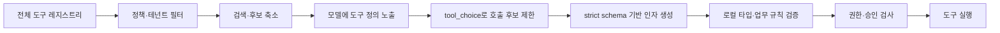
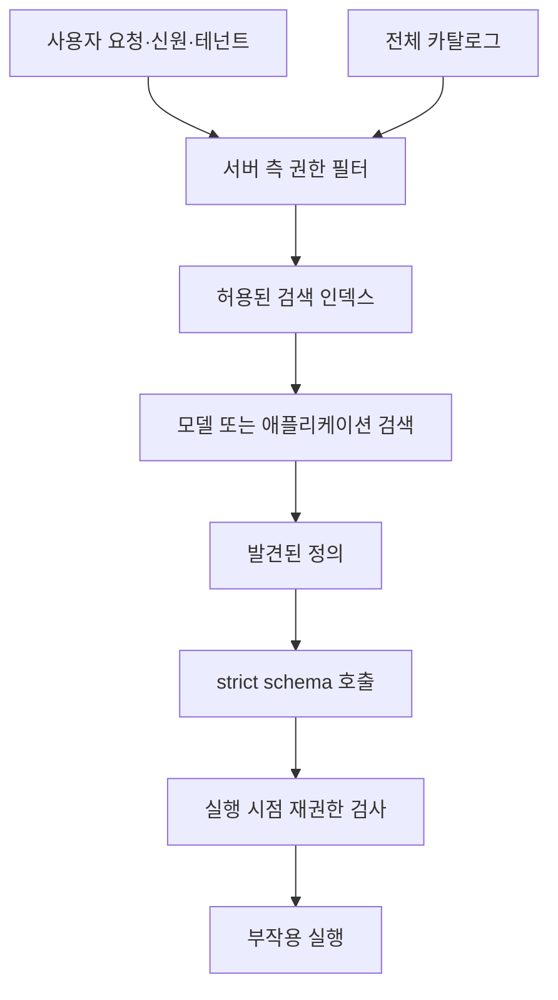
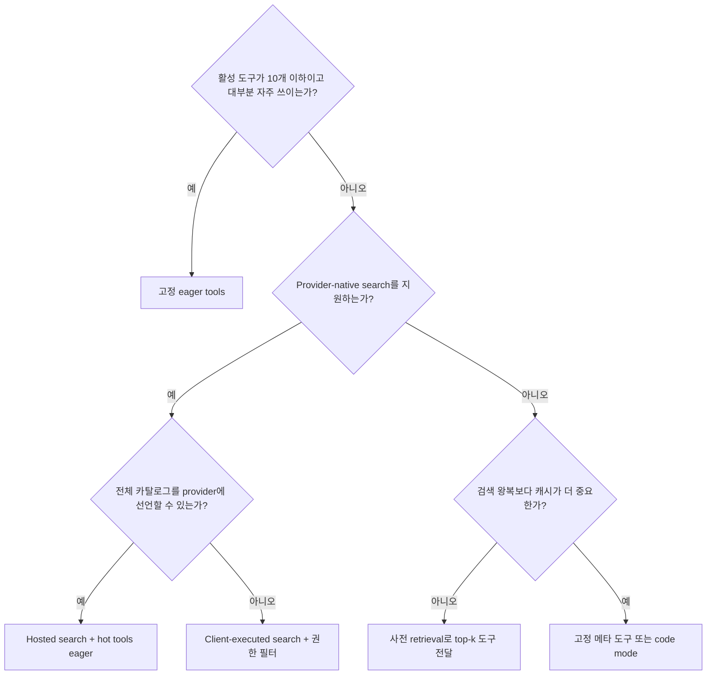

# Tool Search 기술 지형도

> 조사 기준일: 2026-09-14<br>
> 범위: OpenAI, Anthropic, Google Gemini의 모델·API 기능과 주요 에이전트 프레임워크의 대규모 도구 카탈로그 처리 방식<br>
> 코드 구현은 별도 문서인 [프레임워크 코드 레벨 분석](framework-code-analysis.md)에서 다룬다.

## 1. 핵심 결론

에이전트에 도구가 많을 때 생기는 문제는 단순히 JSON Schema가 길어지는 데 그치지 않는다. 매 요청마다 사용하지 않을 도구 정의까지 입력 토큰을 차지하고, 비슷한 도구 사이에서 모델의 선택 정확도가 떨어지며, 도구 배열이 바뀔 때 프롬프트 캐시가 무효화된다. 도구 실행 권한과 테넌트별 가용성까지 섞이면 모델에 보여 줄 수 있는 후보 집합 자체도 요청마다 달라진다.

이 문제를 푸는 방법은 네 계층으로 구분해야 한다.

1. **검색과 지연 로딩**은 모델이 아직 보지 못한 도구를 찾아 정의를 문맥에 추가한다.
2. **도구 선택 제약**은 현재 보이는 도구 중 호출 가능한 부분집합이나 호출 의무를 지정한다.
3. **스키마 제약 생성**은 모델이 만든 인자가 JSON Schema를 따르도록 디코딩 단계에서 제한한다.
4. **실행 전 검증과 권한 검사**는 형식상 올바른 호출이 실제로 허용되고 의미상 유효한지 애플리케이션에서 확인한다.

따라서 질문에서 말한 “LLM Provider가 input parameter 스키마를 검사해 주는 기능”은 보통 **strict tool use**, **strict function calling**, **schema adherence**, **constrained decoding**으로 부른다. 이것은 넓은 의미의 tool constraint에 들어갈 수 있지만, **tool search와는 다른 기능**이다. Tool search는 “무슨 도구가 있는가”를 해결하고 strict mode는 “선택한 도구의 인자를 어떤 형태로 생성할 것인가”를 해결한다.

현재 공급자 구현은 크게 둘로 갈린다.

- **OpenAI와 Anthropic**은 지연된 정의를 대화 뒤쪽에 추가하는 provider-native tool search를 제공한다. 검색 기록과 새 정의가 append-only로 쌓이므로 프롬프트 앞부분을 안정적으로 유지할 수 있다.[^1][^2]
- **Gemini**는 function calling, 허용 도구 집합, schema adherence는 제공하지만, 검색 결과로 숨겨 둔 정의를 대화 중에 해제하는 동등한 native primitive는 현재 공식 API에 없다. 그래서 Google ADK나 범용 프레임워크가 요청 전에 도구를 줄이거나 일반 함수 도구로 검색을 흉내 내야 한다.[^3][^4]

## 2. 문제 정의

### 2.1 입력 토큰 비용

일반적인 function calling 요청은 각 도구의 이름, 설명, 매개변수 이름, 타입, enum, 중첩 객체를 모두 모델 입력에 넣는다. 도구 수를 `N`, 평균 직렬화 길이를 `S`, 대화 턴 수를 `T`라고 하면 캐시가 없을 때 정의 비용은 대략 `O(N × S × T)`이다. 실제 비용은 토크나이저와 캐시 정책에 좌우되지만, 도구를 한 번도 호출하지 않아도 정의 비용은 발생한다.

Anthropic은 GitHub, Slack, Sentry, Grafana, Splunk를 함께 연결한 예에서 도구 정의만 약 55k 토큰이 될 수 있고, 30~50개를 넘기면 선택 정확도가 저하된다고 설명한다. Tool search로 실제 필요한 3~5개만 로드하면 정의 토큰을 85% 이상 줄일 수 있다는 수치도 제시한다. 이 값은 Anthropic의 대표 구성에 대한 벤더 측 관측이며 모든 워크로드의 보장값은 아니다.[^2]

Google도 Gemini function-calling 가이드에서 활성 도구 집합을 최대 10~20개로 유지하라고 권장한다.[^3]

### 2.2 선택 공간과 혼동

도구가 많아지면 다음 오류가 늘어난다.

- 기능이 겹치는 도구 중 잘못된 것을 고른다.
- 도구 이름은 맞지만 인자 의미가 다른 유사 API를 혼동한다.
- 실제로는 답변만 하면 되는데 도구를 호출하거나, 반대로 필요한 호출을 생략한다.
- 검색용 메타 도구와 실행 도구를 혼동한다.

후보 수를 줄이면 선택 문제는 쉬워지지만, 올바른 도구를 후보에서 빼는 **retrieval false negative**가 새 실패 모드로 생긴다. Tool search 품질은 일반 RAG처럼 recall과 precision의 균형 문제다.

### 2.3 캐시와 동적 가용성

대부분의 provider prompt cache는 입력의 긴 공통 prefix를 재사용한다. 도구 배열이 앞쪽에 직렬화되는 API에서는 후보를 매 요청마다 잘라 보내면 배열의 내용과 순서가 바뀌어 캐시가 깨질 수 있다. Native tool search는 숨겨 둔 도구의 발견 기록과 정의를 대화 끝에 추가해 이 문제를 완화한다.[^1][^4]

한편 사용자 권한, 설치된 플러그인, 현재 프로젝트, OAuth 연결 여부처럼 후보가 실행 시점에 정해지는 시스템은 provider가 전체 카탈로그를 미리 알 수 없다. 이때는 클라이언트가 검색을 실행하고 검색 결과의 정의만 provider 프로토콜로 되돌려 주는 방식이 필요하다.

## 3. 용어를 분리해서 보기

| 계층 | 질문 | 대표 기능 | 실패 시 결과 |
|---|---|---|---|
| 등록 | 런타임이 어떤 도구를 알고 있는가 | tool registry, MCP `tools/list`, plugin catalog | 검색도 실행도 불가능 |
| 가시성·발견 | 이번 시점에 모델이 어떤 정의를 보는가 | tool search, deferred loading, retrieval middleware | 적절한 도구를 찾지 못함 |
| 선택 제약 | 보이는 도구 중 무엇을 호출할 수 있는가 | `tool_choice`, `allowed_tools`, `allowed_function_names` | 금지한 후보 선택 또는 호출 생략 |
| 인자 생성 제약 | 호출 JSON이 스키마에 맞는가 | `strict: true`, strict tool use, VALIDATED mode | 필드 누락·타입 오류·추가 필드 |
| 로컬 검증 | 파싱된 값이 애플리케이션 타입·규칙에 맞는가 | Pydantic validation, JSON Schema validator, retry | 모델 재시도 또는 실행 거절 |
| 권한·정책 | 이 주체가 이 작업을 실행해도 되는가 | authz, tenant filter, approval, sandbox | 보안 위반 가능성 |
| 실행 | 외부 시스템에 부작용을 일으킬 것인가 | executor, MCP client, SDK callback | API·네트워크·업무 오류 |

이 계층들은 서로 대체하지 않는다. 예를 들어 `strict: true`는 `customer_id`가 문자열이라는 사실은 보장할 수 있지만, 그 고객을 현재 사용자가 열람할 권한이 있는지는 보장하지 않는다. 검색 결과에 도구가 포함됐다는 사실도 호출 권한을 뜻하지 않는다.



## 4. Tool search란 무엇인가

Tool search는 대규모 카탈로그 전체를 항상 모델 문맥에 넣지 않고, 필요한 순간에 일부 도구의 완전한 정의를 **발견하고 활성화하는 프로토콜**이다. 핵심은 단순한 랭킹 함수보다 다음 상태 전이에 있다.

```text
registered ── policy allowed ── searchable ── discovered ── callable ── executed
```

검색 엔진은 BM25, regex, keyword overlap, embedding, 작은 LLM 분류기 중 무엇이든 될 수 있다. 그러나 검색 결과가 단순 텍스트 설명으로 끝나면 모델이 새 도구를 표준 function call로 호출할 수 없다. 따라서 완전한 도구 정의를 안전하게 주입하고, 이후 턴에서 가용 상태를 복원하며, 실제 executor와 같은 도구 ID로 라우팅하는 프로토콜이 함께 필요하다.

### 4.1 주요 구현 유형

| 유형 | 검색 시점 | 검색 주체 | 모델 추가 호출 | 캐시 특성 | 대표 구현 |
|---|---|---|---|---|---|
| Eager loading | 요청 전 | 없음 | 없음 | 도구 배열이 고정이면 좋음 | 기본 function calling |
| 사전 필터링 | 주 모델 요청 전 | 애플리케이션·retriever·보조 LLM | 보조 모델을 쓰면 1회 | 후보 배열 변경 시 불리 | Semantic Kernel, LangChain selector, ADK plugin filter |
| 일반 메타 도구 | 에이전트 루프 중 | 클라이언트 | 보통 검색 턴 1회 | 새 도구를 배열에 넣으면 불리 | 범용 로컬 fallback |
| Provider hosted search | 에이전트 루프 중 | provider | 검색 동작 1회 | append-only에 유리 | OpenAI hosted, Anthropic BM25·regex |
| Provider client-executed search | 에이전트 루프 중 | 애플리케이션 | 검색 동작 1회 | provider-native history면 유리 | OpenAI `execution=client`, Anthropic custom references |
| 단일 코드 실행 표면 | 코드 실행 중 | 샌드박스 내부 | 코드 작성·실행 호출 | 도구 schema가 하나라 안정적 | programmatic tool calling, CodeMode |

### 4.2 hosted와 client-executed의 차이

Hosted search는 요청을 만들 때 전체 검색 대상이 이미 정해져 있고 provider에 보낼 수 있을 때 단순하다. Client-executed search는 검색 인덱스가 사내에 있거나 사용자·프로젝트 상태를 반영해야 할 때 적합하다.

두 경우 모두 다음 불변조건을 지켜야 한다.

- 검색 대상은 권한 필터를 통과한 도구여야 한다.
- 반환한 이름과 실제 executor의 ID가 동일해야 한다.
- 발견된 정의와 검색 기록이 다음 턴에서 재현돼야 한다.
- 검색 결과 수가 너무 작아 recall을 잃지 않도록 재검색 경로가 있어야 한다.
- 도구 정의 자체를 신뢰할 수 없는 외부 입력으로 취급해야 한다.

## 5. 공급자별 native 접근

### 5.1 OpenAI Responses API

OpenAI 방식은 `tools`에 `{"type":"tool_search"}`를 추가하고, 뒤로 미룰 function이나 MCP에 `defer_loading: true`를 표시한다. 가능한 경우 개별 함수보다 namespace나 MCP server 단위로 검색 표면을 구성하도록 권장한다.[^1]

Responses API에서 이 primitive는 현재 `gpt-5.4` 이상 모델에 한해 지원된다. 따라서 프레임워크가 `defer_loading` 필드를 표현할 수 있더라도 실제 사용 가능 여부는 선택한 모델의 capability에 달려 있다.[^1]

지연의 단위에 따라 초기 노출량이 다르다. 개별 deferred function은 이름과 설명이 처음부터 보이고 parameter schema만 주로 지연된다. Namespace나 MCP server는 wrapper의 이름과 설명만 먼저 보이고 내부 함수 이름·설명·schema는 검색될 때 로드된다. OpenAI는 token efficiency와 선택 품질을 위해 namespace당 함수를 10개 미만으로 유지하라고 권장한다.[^1]

검색 모드는 두 가지다.

- **Hosted**: 처음 요청에 선언한 deferred functions, namespaces, MCP servers를 OpenAI가 검색한다. 응답에는 `tool_search_call`, `tool_search_output`, 이후 실제 `function_call`이 이어진다.
- **Client-executed**: `tool_search`에 `execution: "client"`와 검색 인자 스키마를 지정한다. 모델이 `tool_search_call`을 내면 애플리케이션이 검색하고 같은 `call_id`를 가진 `tool_search_output`에 완전한 정의를 반환한다. 처음 `tools` 배열에 없던 신뢰된 도구를 반환하는 고급 패턴도 지원한다.[^1]

발견된 도구는 문맥 끝에 추가되므로 공통 prefix 캐시를 유지하기 쉽다. 검색 흐름 밖에서 특정 위치에 도구를 추가하려면 developer 역할의 `additional_tools` input item을 쓸 수 있다.[^1]

OpenAI Agents API는 일반 함수는 명시적으로 지연시키지만, 지원되는 모델·provider에서 MCP와 plugin tools를 자동으로 deferred discovery에 연결한다. 반면 **OpenAI Agents SDK**는 provider wire format과 에이전트 실행 루프를 감싸는 프레임워크다. SDK의 tool search 지원 범위와 변환 코드는 별도 분석 문서에서 확인한다.[^1][^5]

### 5.2 Anthropic Messages API

Anthropic은 두 개의 server tool을 제공한다.[^2]

- `tool_search_tool_regex_20251119`: Claude가 최대 200자의 Python regex를 생성하고 대소문자 구분 없이 검색한다.
- `tool_search_tool_bm25_20251119`: Claude가 최대 500자의 자연어 질의를 생성하고 BM25로 검색한다.

개발자는 모든 정의를 매 요청의 `tools` 배열에 보내되 지연 대상에 `defer_loading: true`를 붙인다. deferred 정의는 Claude의 초기 system-prompt prefix에서 제외된다. 검색 결과는 `server_tool_use`와 `tool_search_tool_result` 안의 `tool_reference`로 기록되고, API가 이를 완전한 정의로 확장한 뒤 Claude가 일반 `tool_use`를 만든다. 기본 결과 수는 5개이며 요청한 `limit`은 1~10,000 범위다. 지연 도구는 요청당 최대 10,000개다.[^2]

직접 embedding 검색을 쓰고 싶으면 일반 custom search tool의 `tool_result`에 `tool_reference` block을 반환할 수 있다. 이 경우에도 참조 대상의 완전한 정의는 최상위 `tools`에 있어야 한다. 발견 기록을 assistant history에 그대로 보존해야 이후 턴에서 도구를 재사용할 수 있다.[^2]

Anthropic strict tool use는 전체 toolset에서 grammar를 만들기 때문에 deferred loading과 함께 쓸 때 발견마다 grammar를 다시 컴파일하지 않는다고 명시한다. 즉 “정의의 모델 가시성”과 “호출 인자의 문법 제약”을 내부적으로 분리한다.[^2][^6]

### 5.3 Google Gemini API

Gemini는 function declaration과 호출 정책을 제공한다. 현재 Interactions API에서는 `generation_config.tool_choice`로 다음 모드를 지정한다.[^3]

- `auto`: 텍스트 응답과 함수 호출을 모델이 선택한다.
- `any`: 함수 호출을 강제한다.
- `none`: 함수 호출을 막는다.
- `validated`: 호출할 경우 함수 스키마 준수를 보장한다.
- `generation_config.tool_choice.allowed_tools = {mode, tools}`: 현재 선언된 함수 중 허용할 이름 집합과 `auto`·`any` 모드를 함께 지정한다.

이 기능은 **검색이 아니다**. 모델이 아직 보지 못한 대규모 카탈로그를 검색하거나, 검색 결과의 정의를 append-only history로 해제하는 wire primitive가 공식 Gemini API에는 없다. Pydantic AI도 같은 이유로 Gemini에서는 로컬 `search_tools` fallback이 새 정의를 tools 배열에 추가하며, 이 변경이 tool block 이후의 캐시 prefix를 무효화한다고 설명한다.[^4]

Google ADK는 이 빈자리를 framework 레이어에서 메운다. `BaseToolset.get_tools()`와 tool predicate로 invocation context에 맞는 도구 목록을 요청 시점에 만들 수 있고, 별도의 function·skill toolset을 검색 인터페이스로 구성할 수도 있다. 그러나 native discovery event가 없으므로 애플리케이션과 프레임워크가 발견 상태와 provider 변환을 책임져야 한다.[^7]

## 6. Native tool constraint를 정확히 정의하기

“native tool constraint”는 세 가지 뜻으로 혼용될 수 있어 제품 문서에 그대로 쓰기보다 구체 기능명을 쓰는 편이 안전하다.

### 6.1 후보 제약: tool choice

현재 모델에 전달된 도구 중 호출 가능한 집합이나 호출 횟수를 제약한다.

| 공급자 | 대표 설정 | 할 수 있는 일 |
|---|---|---|
| OpenAI | `tool_choice`; 부분집합은 `{type: "allowed_tools", mode, tools}`; `parallel_tool_calls` | 자동·필수·특정 함수·부분집합·병렬 여부 |
| Anthropic | `tool_choice` | 자동·아무 도구·특정 도구, 병렬 호출 제어 |
| Gemini | `generation_config.tool_choice`; 부분집합은 `allowed_tools.{mode,tools}` | auto·any·none·validated와 이름 부분집합 |

이 방식은 전체 `tools` 배열을 유지한 채 이름만 제한할 수 있으면 prompt cache에 유리하다. provider가 부분집합 제약을 지원하지 않아 프레임워크가 배열을 잘라 보내면 캐시가 깨질 수 있다.[^4]

### 6.2 인자 제약: strict schema adherence

OpenAI `strict: true`는 Structured Outputs를 이용해 생성된 함수 인자가 스키마를 따르도록 한다. 각 object에 `additionalProperties: false`가 필요하고 모든 property를 `required`에 넣어야 하며, 선택 필드는 nullable type으로 표현한다. 비호환 strict schema는 요청 단계에서 거절된다.[^8]

Anthropic `strict: true`도 constrained decoding으로 tool input의 schema adherence를 보장한다. Schema 자체가 지원되는 부분집합인지 provider가 먼저 검증하며, 실행 전 업무 검증은 여전히 애플리케이션 책임이다.[^6]

Gemini의 `validated` 모드는 함수 스키마 준수를 보장한다. 공식 가이드는 그 이후에도 실행 전 function call validation을 권장한다.[^3]

strict 기능을 “provider가 결과 JSON을 만든 뒤 검사한다”고만 이해하면 부정확하다. provider에 따라 사전 schema 검증, grammar compile, constrained sampling이 함께 쓰인다. 결과가 형식에 맞는다는 보장은 다음 항목을 보장하지 않는다.

- 문자열에 존재하지 않는 고객 ID가 들어가지 않았는가
- 시작일이 종료일보다 빠른가
- 현재 사용자가 이 계정에 접근할 수 있는가
- 호출이 멱등한가
- 결제·삭제에 사용자 승인이 필요한가

### 6.3 로컬 검증과 retry

Pydantic AI 같은 프레임워크는 provider strict 여부와 별개로 JSON을 Python 타입으로 검증하고, 실패를 `RetryPromptPart`로 모델에 되돌려 재생성을 요청한다.[^4] LangChain, Google ADK, LlamaIndex, Semantic Kernel도 각자의 tool adapter나 함수 호출 경계에서 인자를 역직렬화한다. 이 계층은 provider가 strict를 지원하지 않는 모델에도 적용할 수 있지만, 잘못된 출력을 먼저 생성한 뒤 재시도하므로 토큰과 지연이 추가된다.

## 7. 주요 프레임워크의 접근 지도

| 프레임워크·런타임 | 기본 축소 방식 | 모델이 검색 결정을 하는가 | 검색 알고리즘 | provider-native 연동 | 핵심 특성 |
|---|---|---:|---|---|---|
| Codex | deferred registry + client tool search | 예 | 로컬 BM25 | OpenAI `tool_search_output` | MCP·plugin을 namespace로 묶고 executor registry는 유지 |
| OpenAI Agents SDK | hosted search adapter + client wire type | 예 | provider 또는 사용자 구현 | OpenAI Responses | hosted search는 run loop 통합, client search는 수동 loop 필요 |
| Pydantic AI | deferred toolset + 자동 capability | 예 | native BM25·regex, keyword, callable | OpenAI·Anthropic | provider별 wire shape와 발견 history를 상호 변환 |
| LangChain·LangGraph | selector middleware 또는 provider middleware | 둘 다 가능 | 보조 LLM structured output 또는 provider | OpenAI·Anthropic | 요청 전 선택과 native JIT discovery를 별도 middleware로 제공 |
| Semantic Kernel | 요청 전 contextual selection | 아니오 | embedding vector search | 공급자 중립 | 최근 메시지로 top-k 함수를 골라 임시 kernel에 등록 |
| Google ADK | toolset 기반 request-time filter | 보통 아니오 | 사용자 구현 | Gemini의 native discovery 없음 | 도구 가용성을 invocation context·정책과 함께 제어 |
| LlamaIndex | object retriever + workflow agent | 구현에 따라 다름 | vector·keyword 등 retriever | 주로 framework-local | Tool metadata를 index하고 질의별 후보를 주 모델에 전달 |

두 가지 구현을 혼동하면 안 된다.

- LangChain의 **LLMToolSelectorMiddleware**는 작은 보조 LLM이 structured output으로 도구 이름을 고른 뒤 주 모델의 `tools`를 줄이는 사전 선택 방식이다.
- **ProviderToolSearchMiddleware**는 도구에 `defer_loading`을 붙여 OpenAI·Anthropic의 server-side search를 사용하는 native 방식이다.[^9]

## 8. 성능과 품질의 트레이드오프

### 8.1 비용 모델

Tool search의 총 비용은 다음 네 항의 합으로 볼 수 있다.

```text
총비용 = 초기 노출 정의 토큰
       + 검색 질의·결과 토큰
       + 발견된 정의 토큰
       + 추가 검색 왕복 지연
```

모든 턴에서 대부분의 도구를 쓰는 작은 hot set은 eager loading이 더 싸다. 긴 tail에서 매 작업마다 몇 개만 쓰는 환경일수록 지연 로딩의 이득이 크다. 흔히 쓰는 3~5개는 eager로 두고 나머지를 deferred로 두는 혼합 설계가 실용적이다.[^2]

### 8.2 lexical search와 semantic search

| 관점 | BM25·keyword·regex | embedding·보조 LLM |
|---|---|---|
| 지연 | 낮음 | embedding API나 모델 호출이 추가될 수 있음 |
| 비용 | 낮음 | 상대적으로 높음 |
| 설명 품질 의존성 | 키워드와 명명 규칙에 매우 큼 | 표현이 달라도 의미가 가까우면 찾기 쉬움 |
| 디버깅 | 점수와 match term을 설명하기 쉬움 | 근거가 덜 직관적일 수 있음 |
| 다국어 | tokenizer 설정에 민감 | 다국어 embedding이면 유리 |
| 최신성 | 문서 갱신만 하면 됨 | 카탈로그 변경 시 재임베딩·동기화 필요 |

정확도는 검색기만의 문제가 아니다. `github_search_issues`, `slack_post_message`처럼 일관된 prefix와 사용자 표현을 반영한 description이 있어야 lexical search도 안정적이다. 인자 이름·설명까지 인덱싱하면 “고객 ID로 주문 찾기”처럼 도구 설명에 직접 없는 단서도 잡을 수 있다. Anthropic native search와 Codex 로컬 BM25가 이 방식을 쓴다.[^2]

### 8.3 캐시

가장 안정적인 순서는 다음과 같다.

1. 고정된 eager 도구와 검색 표면을 prefix에 둔다.
2. 검색 결과와 정의를 history 뒤에 append한다.
3. 발견 상태를 history에서 복원한다.
4. 도구의 이름·설명·순서를 실행 중에 불필요하게 바꾸지 않는다.

사전 필터링은 검색 왕복을 없앨 수 있지만, 매 요청의 tools 배열이 달라지는 provider에서는 cache hit를 희생할 수 있다. 반대로 native search는 별도 검색 단계가 생기지만 prefix를 따뜻하게 유지한다. 실제 선택은 입력 토큰, cached token, 검색 횟수, end-to-end latency를 함께 측정해야 한다.

### 8.4 보안 경계

Tool search는 authorization 시스템이 아니다. 안전한 순서는 권한 필터를 먼저 적용한 뒤 그 결과만 검색 인덱스에 넣는 것이다.



실행 시점에 권한을 다시 검사해야 하는 이유는 검색과 실행 사이에 정책이나 자원 상태가 바뀔 수 있기 때문이다. 또한 client-executed search가 처음 요청에 없던 정의를 추가할 수 있는 경우, 반환 schema의 출처와 executor binding을 allowlist로 검증해야 한다.[^1]

## 9. 선택 가이드



실무 기본안은 다음과 같다.

- **10개 이하의 고정 도구**: eager loading과 provider strict mode로 시작한다.
- **10~50개의 혼합 도구**: hot set은 eager, long tail은 deferred로 둔다.
- **수백~수천 개의 테넌트 공용 카탈로그**: 권한 필터 뒤의 client-executed search를 사용한다.
- **의미가 비슷하고 명칭이 불규칙한 도구**: embedding retriever나 보조 LLM selector를 BM25와 hybrid로 결합한다.
- **매우 동적인 열린 카탈로그**: 모델에 계속 새로운 function schema를 넣기보다 고정된 `search`·`execute` 또는 sandbox `run_code` 표면을 고려한다.

## 10. 구현 시 필요한 관측 지표

운영 QA가 아니라 설계 비교를 위해 최소한 다음 값을 측정해야 한다.

| 지표 | 의미 |
|---|---|
| catalog size와 serialized schema tokens | 문제의 실제 크기 |
| search recall@k | 정답 도구가 후보에 포함되는가 |
| tool selection accuracy | 후보 중 모델이 정답을 고르는가 |
| unnecessary search rate | 이미 보이는 도구가 있는데 검색하는가 |
| repeat search rate | 같은 목적의 검색을 되풀이하는가 |
| discovered definition tokens | 지연 로딩 후 실제 지불한 정의 비용 |
| cache read·write tokens | 후보 변화가 cache에 미치는 영향 |
| tool-call schema failure rate | strict와 로컬 validation의 효과 |
| end-to-end latency | 검색 단계가 추가한 실제 지연 |

`recall@k`와 최종 성공률을 분리해야 한다. 정답이 검색 결과에 없었다면 retriever 문제이고, 있었는데 다른 도구를 골랐다면 model selection 또는 도구 설명 문제다. 인자는 스키마에 맞았지만 실행이 실패했다면 의미 검증이나 외부 API 문제다.

## 11. 종합 평가

OpenAI와 Anthropic의 native tool search는 도구 가시성 변화를 provider 프로토콜의 일급 이벤트로 만든다는 점이 핵심이다. 단순히 검색 결과 이름을 텍스트로 돌려주는 것보다 history 재생, definition activation, prompt caching을 함께 해결한다. OpenAI는 hosted와 client-executed를 명시적으로 분리하고 namespace·MCP 단위 구성을 강조한다. Anthropic은 regex와 BM25라는 구체 검색기를 제공하며 custom `tool_reference`로 확장한다.

Gemini의 native 강점은 function calling mode와 schema adherence, 이름 기반 allowed set에 있다. 대규모 catalog discovery는 현재 애플리케이션이나 ADK가 담당해야 한다. 이 차이는 “Gemini가 도구 제약을 지원하지 않는다”는 뜻이 아니라, **선택·인자 제약은 지원하지만 지연된 정의를 발견하는 프로토콜은 제공하지 않는다**는 뜻이다.

프레임워크는 이 provider 차이를 세 방식으로 흡수한다. Pydantic AI는 native와 local wire shape를 번역하고, LangChain은 pre-selector와 provider middleware를 따로 제공한다. Semantic Kernel과 LlamaIndex는 일반 retrieval 문제로 모델링하며, Google ADK는 callback과 plugin 경계에서 요청별 도구 집합을 만든다. Codex는 OpenAI client-executed 프로토콜 위에 로컬 BM25, MCP namespace, executor registry를 결합한 구체 사례다. 이 구현들의 실제 코드 경로와 상태 전이는 [프레임워크 코드 레벨 분석](framework-code-analysis.md)에 정리한다.

## Sources

[^1]: OpenAI, [Tool search](https://developers.openai.com/api/docs/guides/tools-tool-search), accessed 2026-09-14.
[^2]: Anthropic, [Tool search tool](https://platform.claude.com/docs/en/agents-and-tools/tool-use/tool-search-tool), accessed 2026-09-14.
[^3]: Google, [Function calling with the Gemini API](https://ai.google.dev/gemini-api/docs/function-calling), accessed 2026-09-14.
[^4]: Pydantic, [Advanced Tool Features — Tool Search](https://pydantic.dev/docs/ai/tools-toolsets/tools-advanced/#tool-search), accessed 2026-09-14.
[^5]: OpenAI, [OpenAI Agents SDK — Tools](https://openai.github.io/openai-agents-python/tools/), accessed 2026-09-14.
[^6]: Anthropic, [Strict tool use](https://platform.claude.com/docs/en/agents-and-tools/tool-use/strict-tool-use), accessed 2026-09-14.
[^7]: Google, [ADK custom tools — Toolsets](https://adk.dev/tools-custom/#toolsets-grouping-and-dynamically-providing-tools), accessed 2026-09-14.
[^8]: OpenAI, [Function calling — Strict mode](https://developers.openai.com/api/docs/guides/function-calling#strict-mode), accessed 2026-09-14.
[^9]: LangChain, [Prebuilt middleware — LLM tool selector and provider tool search](https://docs.langchain.com/oss/python/langchain/middleware/built-in), accessed 2026-09-14.
