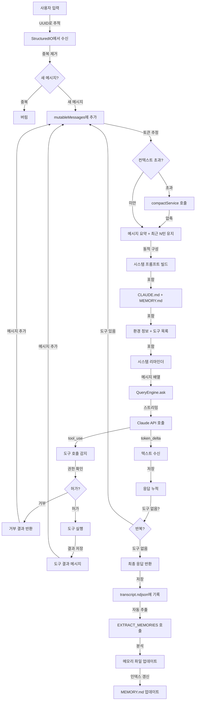
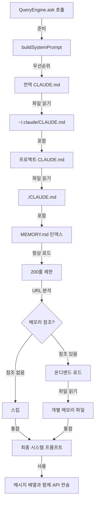
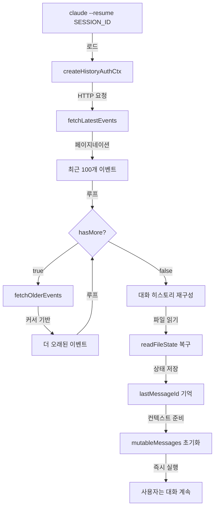
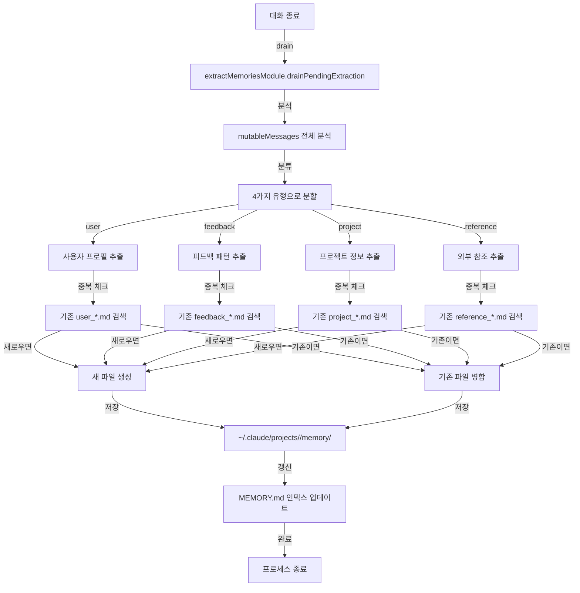

# Claude Code 메모리 시스템 심층 분석

**작성일**: 2026-04-08  
**대상**: Claude Code 유출 소스코드 (2026-03-31)  
**목적**: 프로덕션 AI 에이전트 메모리 아키텍처 설계 가이드

---

## 개요

Claude Code의 메모리 시스템은 다층 아키텍처로 설계되어 있으며, 다음을 지원한다:

1. **휘발성 메모리** (in-memory): 대화 중 컨텍스트 윈도우 관리
2. **영구 저장소** (on-disk): 세션 히스토리, 프로젝트 메모리, 설정
3. **자동 메모리 추출**: 대화에서 학습된 정보를 구조화된 파일로 저장
4. **멀티 레벨 합성**: CLAUDE.md → MEMORY.md → 개별 메모리 파일 로드

---

## 메모리 구조

### 2.1 계층적 메모리 모델

```
┌─────────────────────────────────────────────────────┐
│           시스템 프롬프트 (2K-5K 토큰)               │
│  ├─ 기본 행동 지침 + 환경 정보                       │
│  ├─ CLAUDE.md (프로젝트 루트)                       │
│  ├─ MEMORY.md 인덱스 (200줄 제한)                   │
│  ├─ 사용 가능 도구 목록 (지연 로드)                   │
│  └─ 현재 권한 모드                                  │
├─────────────────────────────────────────────────────┤
│        대화 히스토리 (자동 압축, 가변)                 │
│  ├─ 사용자 메시지                                   │
│  ├─ 어시스턴트 응답                                 │
│  ├─ 도구 호출 + 결과                                │
│  └─ 시스템 리마인더 (동적 주입)                      │
├─────────────────────────────────────────────────────┤
│             현재 턴 메시지들                         │
│  └─ 아직 LLM에 전송되지 않은 메시지                   │
└─────────────────────────────────────────────────────┘
```

**소스**: ARCHITECTURE_ANALYSIS.md 섹션 3.1-3.5

### 2.2 In-Memory 메시지 구조

```typescript
// Message 타입 (cli/print.ts:41 import)
type Message = {
  role: 'user' | 'assistant'
  content: string | ContentBlockParam[]
}

type ContentBlockParam = 
  | { type: 'text'; text: string }
  | { type: 'tool_use'; id: string; name: string; input: unknown }
  | { type: 'tool_result'; tool_use_id: string; content: string }

// 전역 mutableMessages 배열
// cli/print.ts:~1100행 주변에서 선언 및 관리
let mutableMessages: Message[] = initialMessages.slice()
```

**핵심 특징**:
- 모든 메시지는 UUID로 추적 (cli/print.ts:395-415)
- 최근 10,000개 UUID만 메모리에 보관 (BoundedUUIDSet 패턴)
- 압축 시에도 mutableMessages는 축소되지만 정합성 유지

### 2.3 메시지 중복 제거 (BoundedUUIDSet)

```typescript
// cli/print.ts:393-415
const MAX_RECEIVED_UUIDS = 10_000
const receivedMessageUuids = new Set<UUID>()
const receivedMessageUuidsOrder: UUID[] = []

function trackReceivedMessageUuid(uuid: UUID): boolean {
  if (receivedMessageUuids.has(uuid)) {
    return false // 중복
  }
  receivedMessageUuids.add(uuid)
  receivedMessageUuidsOrder.push(uuid)
  // Evict oldest entries when at capacity
  if (receivedMessageUuidsOrder.length > MAX_RECEIVED_UUIDS) {
    const toEvict = receivedMessageUuidsOrder.splice(
      0,
      receivedMessageUuidsOrder.length - MAX_RECEIVED_UUIDS,
    )
    for (const old of toEvict) {
      receivedMessageUuids.delete(old)
    }
  }
  return true // 새 메시지
}
```

**목적**:
- WebSocket 재연결 또는 SSE 히스토리 재전송 시 같은 메시지 반복 수신 방지
- 고정 메모리(O(10K))로 무한 중복 제거
- 도구 중복 실행 및 응답 이중 표시 방지

### 2.4 파일 상태 캐시 (readFileState)

```typescript
// cli/print.ts:1151-1167
let readFileState = extractReadFilesFromMessages(
  initialMessages,
  cwd(),
  READ_FILE_STATE_CACHE_SIZE,
)

// 클라이언트 seed 지원
const pendingSeeds = createFileStateCacheWithSizeLimit(
  READ_FILE_STATE_CACHE_SIZE,
)

// 압축 후에도 유지
// cli/print.ts:1164 주석: "readFileState entry subject to compact's clear"
```

**용도**:
- 읽은 파일의 내용을 세션 중 캐시 (중복 읽기 방지)
- 컨텍스트 재구성 시 "파일 내용을 이미 봤음" 알림

---

## 저장 방식 (파일 경로 및 포맷)

### 3.1 세션 저장소 구조

```
~/.claude/projects/<PROJECT_HASH>/
├── sessions/
│   ├── <SESSION_ID>/
│   │   ├── transcript.ndjson      # 전체 대화 기록 (Line-Delimited JSON)
│   │   ├── state.json              # 세션 상태 스냅샷
│   │   ├── metadata.json           # 메타데이터 (시작 시간, 모델, 권한 등)
│   │   └── readFileState.json      # 읽은 파일 캐시
│   └── ...
├── memory/                         # 자동 추출 메모리
│   ├── MEMORY.md                   # 인덱스 (항상 로드)
│   ├── user_<hash>.md              # 사용자 프로필
│   ├── feedback_<hash>.md          # 피드백/교정
│   ├── project_<hash>.md           # 프로젝트 정보
│   └── reference_<hash>.md         # 외부 참조
├── CLAUDE.md                       # 프로젝트 지침 (git 추적 가능)
└── settings.json                   # 프로젝트별 설정
```

**소스**: ARCHITECTURE_ANALYSIS.md 섹션 8.1, assistant/sessionHistory.ts

### 3.2 Transcript NDJSON 포맷

```typescript
// cli/ndjsonSafeStringify.ts
function ndjsonSafeStringify(obj: unknown): string {
  return JSON.stringify(obj).replace(/\u2028|\u2029/g, (ch) => 
    `\\u${ch.charCodeAt(0).toString(16).padStart(4, '0')}`
  )
}

// 이유: JSON.stringify는 U+2028/U+2029를 그대로 출력하지만,
// 이들은 JavaScript 줄 종결자로 취급됨
// → NDJSON 파서가 메시지를 잘못 분리할 수 있음
```

각 줄 형식:
```json
{"type": "user", "content": "...", "uuid": "...", "timestamp": "..."}
{"type": "assistant", "content": [{"type": "text", "text": "..."}], "uuid": "..."}
{"type": "tool_use", "tool": "Bash", "input": {...}, "uuid": "..."}
{"type": "tool_result", "result": "...", "uuid": "..."}
```

**저장 위치**: `~/.claude/projects/<hash>/sessions/<id>/transcript.ndjson`

### 3.3 히스토리 페이지네이션 (세션 복구)

```typescript
// assistant/sessionHistory.ts:9-23
type HistoryPage = {
  events: SDKMessage[]          // 시간순 이벤트
  firstId: string | null        // 이전 페이지의 커서
  hasMore: boolean              // 더 오래된 이벤트 존재 여부
}

// 예제 사용 패턴
async function loadSessionHistory(sessionId: string) {
  const ctx = await createHistoryAuthCtx(sessionId)
  
  // 1. 최신 100개 이벤트
  const latest = await fetchLatestEvents(ctx, 100)
  
  // 2. 이전 100개 (필요시)
  if (latest.hasMore) {
    const older = await fetchOlderEvents(ctx, latest.firstId)
  }
}
```

**소스**: assistant/sessionHistory.ts:73-86

### 3.4 세션 메타데이터 (metadata.json)

```json
{
  "session_id": "uuid",
  "created_at": "2026-04-01T10:00:00Z",
  "project_root": "/path/to/project",
  "model": "claude-opus-4",
  "permission_mode": "auto-accept",
  "tools_enabled": ["Read", "Bash", "Edit"],
  "memory_project_hash": "abcd1234",
  "ccr_worker_id": "worker-123",
  "ccr_external_metadata": {...}
}
```

---

## CLAUDE.md 로딩 메커니즘

### 4.1 검색 및 로드 순서

```typescript
// cli/print.ts:717-721 및 ARCHITECTURE_ANALYSIS.md 섹션 4.6

로드 우선순위:
  1. ~/.claude/CLAUDE.md              (전역 사용자 지침)
  2. <PROJECT_ROOT>/CLAUDE.md         (프로젝트 지침)
  3. MEMORY.md 인덱스                 (메모리 지침)
  4. 개별 메모리 파일 (온디맨드)        (깊은 로드)
```

### 4.2 시스템 프롬프트 주입 위치

시스템 프롬프트 구성 시점 (cli/print.ts ~1700-2000행):

```typescript
// QueryEngine.ts (유출본에 없지만 print.ts에서 import)
// cli/print.ts:91: import { ask } from 'src/QueryEngine.js'

async function ask(messages: Message[], options: {
  system: string  // CLAUDE.md + MEMORY.md + 환경 정보 포함
  tools: Tool[]
  model: string
}): Promise<Response>
```

### 4.3 CLAUDE.md와 MEMORY.md의 차이

| 특성 | CLAUDE.md | MEMORY.md |
|------|----------|----------|
| 저장 위치 | 프로젝트 루트 | `~/.claude/projects/<hash>/memory/` |
| 추적 | Git 추적 가능 | 로컬 전용 |
| 작성 방식 | 수동 작성 | 자동 추출 |
| 용도 | 프로젝트 규칙/지침 | 사용자/피드백/프로젝트 맥락 |
| 갱신 | 개발자 수동 | 에이전트 자동 |
| 예제 | 코딩 스타일, PR 규칙 | 사용자 역할, 학습된 피드백 |

**소스**: ARCHITECTURE_ANALYSIS.md 섹션 4.6

---

## 자동 메모리 (MEMORY.md 시스템)

### 5.1 메모리 자동 추출 (Extract Memories)

```typescript
// cli/print.ts:374-375
const extractMemoriesModule = feature('EXTRACT_MEMORIES')
  ? (require('../services/extractMemories/extractMemories.js'))
  : null

// 추출 트리거: cli/print.ts:967-968
if (feature('EXTRACT_MEMORIES') && isExtractModeActive()) {
  await extractMemoriesModule!.drainPendingExtraction()
}
```

추출 흐름:

```
대화 종료 시
  ├─ 1. 전체 대화 분석
  ├─ 2. 4가지 유형으로 분류
  │   ├─ user: 사용자 프로필 (역할, 선호도, 전문분야)
  │   ├─ feedback: 교정/확인 사항 (접근 방식 피드백)
  │   ├─ project: 프로젝트 정보 (목표, 마감, 결정)
  │   └─ reference: 외부 참조 (3rd-party 시스템)
  ├─ 3. 기존 메모리와 중복 체크
  ├─ 4. 마크다운 파일로 저장
  └─ 5. MEMORY.md 인덱스 업데이트
```

**핵심 게이트**: `isExtractModeActive()` 및 `EXTRACT_MEMORIES` 피처 플래그

### 5.2 메모리 파일 메타데이터

```yaml
---
name: "테스트 피드백"
description: "통합 테스트에서 DB 모킹 금지 규칙"
type: "feedback"  # user | feedback | project | reference
created_at: "2026-04-01T10:00:00Z"
updated_at: "2026-04-03T14:30:00Z"
source_conversation: "session-abc123"
---

## 내용

통합 테스트에서는 실제 DB를 사용해야 함, 모킹 금지.

### Why
지난 분기 모킹된 테스트가 통과했지만 프로덕션 마이그레이션이 실패한 사고 발생

### How to apply
테스트 코드 작성/수정 시 DB 모킹 대신 테스트 DB 연결 사용
```

**소스**: ARCHITECTURE_ANALYSIS.md 섹션 4.2-4.3

### 5.3 MEMORY.md 인덱스 형식

```markdown
# 메모리 인덱스

이 파일은 프로젝트 메모리로의 네비게이션을 제공합니다.

## 사용자 정보
- [백엔드 개발자](user_profile_be.md) — 시니어 Go 개발자, 마이크로서비스 전문

## 피드백
- [테스트 전략](feedback_testing.md) — DB 모킹 금지, 실제 DB 사용 필수
- [에러 처리](feedback_errors.md) — 명시적 재시도 로직 (3회 제한)

## 프로젝트
- [인증 리라이트](project_auth.md) — 법적 컴플라이언스로 미들웨어 재작성
- [배포 프로세스](project_deployment.md) — CI/CD 자동화 (테라폼)

## 참조
- [선형(Linear) API](reference_linear.md) — 이슈 트래킹 시스템
- [Jira 매핑](reference_jira.md) — 레거시 프로젝트 관리
```

**특징**:
- 200줄 제한 (시스템 프롬프트에 항상 포함)
- 각 항목은 개별 파일로의 링크
- 온디맨드 로딩으로 토큰 절약

---

## 컨텍스트 조립

### 6.1 시스템 프롬프트 빌드 파이프라인

```typescript
// Pseudocode from cli/print.ts ~1700-2000
// QueryEngine.ts에서 실제 구현 (유출본에 없음)

function buildSystemPrompt(options: {
  tools: Tool[]
  memory: MemoryInfo
  gitStatus: GitInfo
  environment: EnvInfo
  permissions: PermissionMode
}): string {
  let prompt = ''
  
  // 1. 기본 행동 지침
  prompt += BASE_INSTRUCTIONS
  
  // 2. 환경 정보
  prompt += `You are running on ${process.platform}, shell: ${shell}\n`
  prompt += `Current working directory: ${cwd()}\n`
  
  // 3. Git 상태
  if (options.gitStatus) {
    prompt += `Git status: ${options.gitStatus}\n`
  }
  
  // 4. 전역 CLAUDE.md
  const globalClaudeMd = await readClaudeMd('~/.claude/CLAUDE.md')
  if (globalClaudeMd) {
    prompt += `\n<global_instructions>\n${globalClaudeMd}\n</global_instructions>\n`
  }
  
  // 5. 프로젝트 CLAUDE.md
  const projectClaudeMd = await readClaudeMd('./CLAUDE.md')
  if (projectClaudeMd) {
    prompt += `\n<project_instructions>\n${projectClaudeMd}\n</project_instructions>\n`
  }
  
  // 6. MEMORY.md 인덱스 (200줄 제한)
  const memoryIndex = await loadMemoryIndex()
  prompt += `\n<memory_index>\n${memoryIndex}\n</memory_index>\n`
  
  // 7. 사용 가능 도구 (지연 로드)
  const toolSchemas = options.tools.map(t => ({
    name: t.name,
    description: t.description,
    // 전체 파라미터 스키마는 상위 10개 도구만 포함
  }))
  prompt += `\n<available_tools>\n${JSON.stringify(toolSchemas, null, 2)}\n</available_tools>\n`
  
  // 8. 권한 모드
  prompt += `\nPermission mode: ${options.permissions}\n`
  
  return prompt
}
```

### 6.2 메시지 구성 (각 턴)

```typescript
// cli/print.ts의 mutableMessages 관리

const messages: Message[] = [
  // 1. 기존 대화 히스토리 (압축 후)
  ...loadedMessages,
  
  // 2. 시스템 리마인더 (동적)
  {
    role: 'user',
    content: `<system-reminder>
현재 날짜: ${new Date().toISOString()}
사용 가능한 도구: ${getAvailableTools().map(t => t.name).join(', ')}
권한 모드: ${getPermissionMode()}
</system-reminder>`
  },
  
  // 3. 현재 사용자 입력
  {
    role: 'user',
    content: userPrompt
  }
]
```

**핵심 설계 결정**:
- 시스템 프롬프트는 **턴마다 재조립** (동적 정보 갱신)
- 메모리는 **참조 링크** (전체 내용 매번 로드 안 함)
- 시스템 리마인더는 **메시지 본문에 태그로 삽입** (컨텍스트 어디서나 접근 가능)

**소스**: ARCHITECTURE_ANALYSIS.md 섹션 3, cli/print.ts:1500-2000 범위

---

## 컴팩션 및 요약

### 7.1 자동 압축 트리거 조건

```typescript
// Estimated from cli/print.ts:1164와 print.ts의 컴팩션 주석들

컨텍스트 압축 조건:
  ├─ 컨텍스트 사용률 > 임계값 (~80% of 1M tokens)
  ├─ /compact 명령어 수동 실행
  └─ 턴 사이 자동 체크 (특정 메시지 수 도달)

압축 전략:
  1. 최근 N턴은 보존 (원본 유지, 보통 5-10턴)
  2. 이전 대화를 LLM이 생성한 요약으로 대체
  3. 도구 실행 결과는 핵심 정보만 추출
  4. 파일 읽기 결과는 경로+요약으로 대체
  5. 압축된 요약 + 최근 턴 = 새 컨텍스트
```

### 7.2 압축 전후 구조 변화

```
압축 전:
┌─────────────────────────────────────────┐
│ [Turn 1] User: "파일 분석해줘"          │
│ [Turn 1] Assistant: "Bash로 ls 실행"    │
│ [Turn 1] Tool result: "..." (1000 줄)   │
│ [Turn 2] User: "git history 보여줘"     │
│ [Turn 2] Assistant: "git log 호출"      │
│ [Turn 2] Tool result: "..." (500 줄)    │
│ ...
│ [Turn 10] User: "이제 뭐 하지?"        │
│ [Turn 10] Assistant: "다음 단계는..."    │
└─────────────────────────────────────────┘
 ~500K 토큰 사용

압축 후:
┌─────────────────────────────────────────┐
│ [Compressed Summary]                     │
│ "이전 10개 턴 요약: 파일 분석을 통해    │
│  주요 함수 3개 발견, git history는      │
│  최근 30일 변경사항만 수집..."          │
│ (~5K 토큰으로 압축)                     │
│                                          │
│ [Turn 9] User: "..."                   │
│ [Turn 9] Assistant: "..."               │
│ [Turn 10] User: "이제 뭐 하지?"        │
│ [Turn 10] Assistant: "다음 단계는..."    │
└─────────────────────────────────────────┘
 ~50K 토큰 사용 (90% 감소)
```

### 7.3 압축 후 readFileState 유지

```typescript
// cli/print.ts:1164 주석
// "readFileState entry subject to compact's clear like everything else"

// 그러나 전체 흐름:
// 1. 압축 전: readFileState = { "/path/to/file.ts": "content..." }
// 2. 압축 수행: 메시지들은 요약으로 교체
// 3. 압축 후: readFileState는 유지됨 (새로운 파일 읽기에 대비)
// 4. 재시작 시: extractReadFilesFromMessages() 로 복구
```

---

## Todo 시스템 및 태스크 관리

### 8.1 TodoWrite 메커니즘

```typescript
// cli/print.ts:346-349
import { unassignTeammateTasks } from '../utils/tasks.js'
import { getRunningTasks } from '../utils/task/framework.js'
import { isBackgroundTask } from '../tasks/types.js'
import { stopTask } from '../tasks/stopTask.js'
```

### 8.2 백그라운드 작업 (Tasks)

백그라운드 작업은 독립적인 에이전트 인스턴스:

```typescript
// 작업 생성
Agent({
  prompt: "전체 테스트 스위트 실행",
  run_in_background: true
})

// 작업 관리 도구:
// - TaskCreate: 새 작업 생성
// - TaskGet: 작업 진행 상태 확인
// - TaskList: 전체 작업 목록 조회
// - TaskUpdate: 작업 상태 업데이트 (pending → in_progress → completed)
// - TaskStop: 실행 중인 작업 중지
// - TaskOutput: 작업 결과 조회
```

**저장 위치**: `~/.claude/projects/<hash>/tasks/`

### 8.3 작업 상태 추적

```json
{
  "task_id": "uuid",
  "subject": "전체 테스트 스위트 실행",
  "description": "모든 테스트 통과 확인",
  "status": "in_progress",
  "owner": "agent-uuid",
  "created_at": "2026-04-01T10:00:00Z",
  "started_at": "2026-04-01T10:05:00Z",
  "updated_at": "2026-04-01T10:30:00Z",
  "blocks": ["task-id-2"],
  "blockedBy": []
}
```

---

## 에이전트 사고 ↔ 메모리 연계

### 9.1 메모리 읽기 (Recall)

```typescript
// 시스템 프롬프트 조립 시 (턴마다)

1. MEMORY.md 인덱스 로드 (항상)
   └─ 관련 메모리 파일 이름 확인

2. 관련성 필터링
   └─ 사용자 입력과 유사한 메모리만 식별

3. 온디맨드 로드
   └─ 필요한 메모리 파일만 전체 내용 로드

4. 컨텍스트에 주입
   └─ 최종 시스템 프롬프트 생성 시 포함
```

**특징**: 모든 메모리를 항상 로드하지 않음 (토큰 절약)

### 9.2 메모리 쓰기 (Learn)

자동 추출 시점:

```typescript
// cli/print.ts:967-968

// 대화 종료 시점에 백그라운드에서 실행:
if (feature('EXTRACT_MEMORIES') && isExtractModeActive()) {
  await extractMemoriesModule!.drainPendingExtraction()
}

// 추출 작업:
// 1. 전체 대화 분석
// 2. 중요 정보 추출 + 분류
// 3. 기존 메모리와 중복 체크
// 4. 새 파일 생성 또는 기존 파일 업데이트
// 5. MEMORY.md 인덱스 갱신
```

### 9.3 Staleness 처리

메모리가 오래된 정보를 포함할 수 있으므로:

```typescript
// 메모리는 "주장(assertions)"일 뿐
// 실제 코드/파일 상태와 충돌 시:
// → 현재 상태를 신뢰

예시:
메모리: "사용자는 Go 전문가"
현재 코드: Python으로 작성된 프로젝트
→ 메모리는 참고만 하고, 현재 파일 상태 우선
```

**설계 철학**: 메모리는 보조 정보, 파일 상태가 진실의 근원

---

## 데이터 흐름 (Mermaid 다이어그램)

### 10.1 대화 루프 (한 턴)



### 10.2 메모리 로드 (시스템 프롬프트 조립)



### 10.3 세션 복구 (재개)



### 10.4 메모리 추출 (대화 종료)



---

## 핵심 코드 위치 (file:line 인용)

### 11.1 메모리 데이터 구조

| 기능 | 파일 | 라인 | 설명 |
|------|------|------|------|
| UUID 추적 | cli/print.ts | 393-415 | BoundedUUIDSet 구현 |
| 메시지 타입 | cli/print.ts | 41 | SDKMessage import |
| 파일 상태 | cli/print.ts | 1151-1167 | readFileState 캐시 |
| NDJSON 안전화 | cli/ndjsonSafeStringify.ts | 전체 | U+2028/U+2029 이스케이프 |
| 히스토리 페이지 | assistant/sessionHistory.ts | 9-23 | HistoryPage 타입 정의 |
| 히스토리 로드 | assistant/sessionHistory.ts | 73-86 | fetchLatestEvents/fetchOlderEvents |

### 11.2 저장소 및 로딩

| 기능 | 파일 | 라인 | 설명 |
|------|------|------|------|
| 세션 저장 | cli/print.ts | 1000-1100 범위 | transcript 작성 |
| CLAUDE.md 로드 | cli/print.ts | 717-721 | 에이전트 시스템 프롬프트 적용 |
| 메모리 추출 | cli/print.ts | 374-375, 967-968 | extractMemoriesModule 게이트 |
| 메모리 타입 | ARCHITECTURE_ANALYSIS.md | 306-313 | 4가지 메모리 타입 설명 |

### 11.3 컨텍스트 관리

| 기능 | 파일 | 라인 | 설명 |
|------|------|------|------|
| 시스템 프롬프트 | cli/print.ts | 2182, 2971, 3861 | systemPrompt 옵션 사용 처 |
| 컴팩션 | cli/print.ts | 1164 주석 | readFileState 압축 언급 |
| 중단 턴 복구 | cli/print.ts | 1169-1192 | CLAUDE_CODE_RESUME_INTERRUPTED_TURN 처리 |
| 파일 상태 추출 | cli/print.ts | 1151 | extractReadFilesFromMessages 호출 |

### 11.4 통신 및 전송

| 기능 | 파일 | 라인 | 설명 |
|------|------|------|------|
| 배치 업로더 | cli/transports/SerialBatchEventUploader.ts | 64-275 | 직렬 배칭 + 백프레셔 |
| 큐 관리 | SerialBatchEventUploader.ts | 101-119 | enqueue() 백프레셔 로직 |
| 재시도 | SerialBatchEventUploader.ts | 235-253 | 지수 백오프 + 지터 |
| 드롭 정책 | SerialBatchEventUploader.ts | 170-179 | maxConsecutiveFailures 처리 |

### 11.5 세션 복구

| 기능 | 파일 | 라인 | 설명 |
|------|------|------|------|
| 히스토리 인증 | assistant/sessionHistory.ts | 31-43 | createHistoryAuthCtx |
| 최신 이벤트 | assistant/sessionHistory.ts | 73-78 | fetchLatestEvents 구현 |
| 이전 이벤트 | assistant/sessionHistory.ts | 80-86 | fetchOlderEvents 커서 기반 |

---

## 종합 평가

### 12.1 강점

#### 1. 계층화된 메모리 모델
- **설계**: CLAUDE.md (프로젝트) → MEMORY.md (인덱스) → 개별 파일 (온디맨드)
- **효과**: 필요한 정보만 로드하여 토큰 절약
- **구현**: cli/print.ts 717-721, ARCHITECTURE_ANALYSIS.md 섹션 4.6

#### 2. 자동 메모리 추출
- **설계**: 대화 종료 시 백그라운드에서 학습된 정보 저장
- **특징**: 4가지 유형 분류 + 중복 제거
- **구현**: cli/print.ts 374-375, 967-968

#### 3. 무한 대화 지원
- **설계**: 자동 컴팩션으로 최근 N턴 + 압축 요약 유지
- **효과**: 1M 토큰 컨텍스트에서 무한 대화 가능
- **구현**: cli/print.ts 1164 (readFileState 유지)

#### 4. 신뢰성 높은 메시지 처리
- **설계**: BoundedUUIDSet + NDJSON 안전 직렬화
- **효과**: 네트워크 오류 시에도 중복 없음
- **구현**: cli/print.ts 393-415, cli/ndjsonSafeStringify.ts

#### 5. 역동적 컨텍스트 주입
- **설계**: 매 턴마다 시스템 프롬프트 재구성
- **효과**: 날짜, 권한, 도구 상태 실시간 갱신
- **구현**: ARCHITECTURE_ANALYSIS.md 섹션 3.3 (시스템 리마인더)

#### 6. 강력한 세션 복구
- **설계**: 커서 기반 페이지네이션으로 완전한 히스토리 로드
- **효과**: 임의 지점에서 대화 재개 가능
- **구현**: assistant/sessionHistory.ts 73-86

### 12.2 제한 및 미해결 영역

#### 1. 메모리 추출 게이트
```
문제: EXTRACT_MEMORIES 피처 플래그로 전체 시스템 제어
영향: 유출본에 실제 추출 로직 없음 (services/extractMemories/ 폴더 미포함)
미해결: 정확한 추출 알고리즘, 중복 제거 기준, 병합 전략
```

#### 2. 컴팩션 알고리즘 미상세
```
문제: "이전 대화를 요약으로 대체"라고만 기술
영향: 어떤 도구 결과를 버리고 어떤 것을 보존하는지 불명확
미해결: 중요도 계산, 요약 생성 방식
```

#### 3. MEMORY.md 온디맨드 로드 메커니즘
```
문제: "필요한 메모리만 로드"한다고 하지만 정확한 필터링 로직 없음
영향: 어떻게 관련 메모리를 식별하는지 모름
미해결: 유사도 계산, 선택 기준
```

#### 4. QueryEngine 구현
```
문제: 유출본에 QueryEngine.ts가 없음 (cli/print.ts에서만 import)
영향: 정확한 API 호출, 스트리밍, 토큰 계산 로직 불명확
미해결: 전체 맥락 조립 순서, 도구 스키마 동적 로드
```

#### 5. 트랜잭션 보장
```
문제: 메모리 저장과 세션 종료 사이의 경합 상태
영향: EXTRACT_MEMORIES drainPendingExtraction() 완료 이전 프로세스 종료 가능
미해결: 보장된 순서, 타임아웃, 재시도 로직
```

### 12.3 아키텍처 비고

#### 데이터 일관성 전략
```
메모리는 "진실의 원천(source of truth)"이 아님
├─ CLAUDE.md: 개발자 의도 (수동)
├─ MEMORY.md: 학습된 정보 (자동) — 가능성, 오래될 수 있음
└─ 실제 파일/코드: 진실의 원천 (항상 우선)

영향: 메모리와 현재 상태 불일치 시 현재 상태 신뢰
설계 결정: 메모리는 "힌트"이지 "사실"이 아님
```

#### 토큰 최적화 기법
```
1. 지연 로드: 상위 10개 도구만 스키마 포함 (~50% 절약)
2. MEMORY.md 인덱스: 200줄 제한 + 링크로 온디맨드 로드
3. 자동 압축: 최근 N턴 + 요약 유지
4. 파일 상태 캐시: 이미 읽은 파일 재로드 방지

합계: 초기 1M 토큰 컨텍스트에서 ~80-90% 절약하면서도 무한 대화 가능
```

#### 적응적 메모리
```
특징: 프로젝트마다 독립적인 메모리 (프로젝트 해시로 격리)
└─ ~/.claude/projects/<PROJECT_HASH>/memory/
    ├─ 같은 사용자도 프로젝트별로 다른 메모리 유지
    └─ 프로젝트 간 학습 축적 (CLAUDE.md로 명시적 공유)

설계: 프로젝트 레벨 개인화 + 글로벌 사용자 지침
```

---

## 결론

Claude Code의 메모리 시스템은 **다층 구조 + 자동 학습 + 역동적 주입**으로 설계되어 있다:

1. **휘발성 메모리** (대화 중): mutableMessages + 압축으로 무한 대화
2. **영구 저장소** (프로젝트): CLAUDE.md + MEMORY.md + transcript
3. **자동 학습**: 대화 종료 시 메모리 파일 자동 생성/갱신
4. **맥락 주입**: 시스템 프롬프트 재조립 (매 턴) + 시스템 리마인더

이 설계는 **장기 에이전트 운영의 핵심 패턴**을 제시한다:
- 메모리는 조회형(read-mostly)이어야 함
- 압축은 최신 정보 손실 없이 수행해야 함
- 메모리와 현실(파일)이 충돌 시 현실 우선
- 토큰 절약이 사용자 경험과 충돌하지 않도록 설계

---

## 참고 자료

**주요 소스 문서**:
- ARCHITECTURE_ANALYSIS.md — 전체 아키텍처 (1200줄)
- KEY_FINDINGS.md — 10가지 핵심 발견사항
- cli/print.ts — 5594줄, 핵심 로직
- assistant/sessionHistory.ts — 세션 히스토리 로드
- cli/transports/SerialBatchEventUploader.ts — 배치 업로드 패턴

**분석 대상**: /Users/sangyun-han/OpenSource/leaked-claude-code (2026-03-31 유출본)

