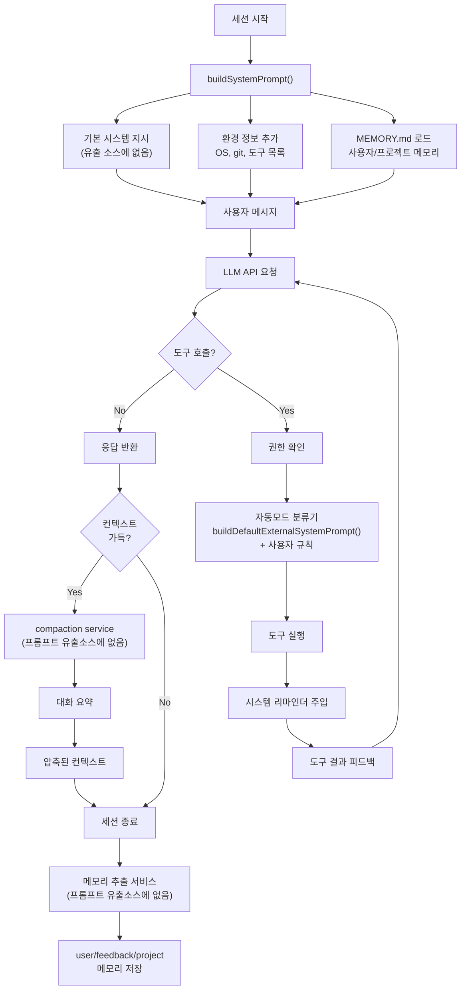

# Claude Code 프롬프트 전체 카탈로그

> Claude Code 2026-03-31 유출 소스코드 기반 프롬프트 분석
> 본 문서는 유출 소스의 범위 내에서 발견된 모든 프롬프트와 시스템 지시문을 기록합니다.

---

## 개요

Claude Code의 프롬프트 시스템은 다층 구조로 이루어져 있습니다:

1. **메인 시스템 프롬프트** — 초기화 시 조립, 동적으로 업데이트됨 (유출 소스에 없음)
2. **서브에이전트 프롬프트** — 특정 작업용 자동 에이전트 (부분적으로 발견)
3. **도구 설명 프롬프트** — 각 도구의 동작 지시 (유출 소스에 한정적)
4. **시스템 리마인더** — 대화 중간에 동적 주입 (패턴 발견, 내용은 없음)
5. **사용자 인터랙션 메시지** — 에러, 안내, 승인 요청 (부분 발견)

### 프롬프트 주입 시점

```
세션 시작
  ├─ 초기화: buildSystemPrompt() 호출
  │   ├─ 기본 행동 지침
  │   ├─ 환경 정보 (OS, git status)
  │   ├─ 사용 가능 도구 목록
  │   ├─ 메모리/CLAUDE.md
  │   └─ 권한 모드
  │
  ├─ 대화 중간 (각 턴마다)
  │   ├─ <system-reminder> 태그로 동적 정보 추가
  │   ├─ 날짜/시간 업데이트
  │   ├─ 권한 모드 변경 반영
  │   └─ 이용 가능 도구 목록 업데이트
  │
  └─ 서브에이전트 시작
      └─ 전문화된 에이전트 시스템 프롬프트 적용
```

### 유출 소스의 한계

이 유출 소스는 **컴파일된 번들에서 소스맵으로 복구**된 것으로, 다음 내용이 누락되었습니다:

- **주 시스템 프롬프트** — `QueryEngine.ask()` 또는 `buildSystemPrompt()` 내부 텍스트
- **대부분의 도구 설명** — 도구 JSON 스키마는 없음
- **자동 분류기 시스템 프롬프트** — `buildDefaultExternalSystemPrompt()` 구현
- **에이전트별 프롬프트** — `AgentTool` 내부 지시문
- **컴팩션/요약 프롬프트** — `services/compact/` 서비스
- **메모리 추출 프롬프트** — `services/extractMemories/` 서비스
- **title 생성 프롬프트** — 세션 타이틀 자동 생성
- **skill 프롬프트 템플릿** — `/commit`, `/review-pr` 등

---

## 1. 실제 발견된 프롬프트

### 1.1 팀 셧다운 프롬프트 (SHUTDOWN_TEAM_PROMPT)

**용도**: 멀티에이전트 모드에서 비상호형 실행 완료 전 팀 셧다운 강제

**위치**: `/Users/sangyun-han/OpenSource/leaked-claude-code/cli/print.ts:379-391`

**트리거**: `--print` 또는 비상호형 모드에서 서브에이전트 실행

**전문**:
```
<system-reminder>
You are running in non-interactive mode and cannot return a response to the user until your team is shut down.

You MUST shut down your team before preparing your final response:
1. Use requestShutdown to ask each team member to shut down gracefully
2. Wait for shutdown approvals
3. Use the cleanup operation to clean up the team
4. Only then provide your final response to the user

The user cannot receive your response until the team is completely shut down.
</system-reminder>

Shut down your team and prepare your final response for the user.
```

**분석**:
- `<system-reminder>` 태그 사용 — 긴 대화에서 LLM이 지시를 "잊어버리는" 것을 방지
- **강제성**: "You MUST", "The user cannot receive" — 절대적 요구사항
- **순차성**: 1단계(요청) → 2단계(승인 대기) → 3단계(정리) → 4단계(응답)
- 비상호형 모드에서는 사용자 입력이 없으므로 에이전트가 자율적으로 팀 정리 필요

---

### 1.2 자동모드 규칙 검토 프롬프트 (CRITIQUE_SYSTEM_PROMPT)

**용도**: 사용자가 작성한 자동모드 분류 규칙을 검증

**위치**: `/Users/sangyun-han/OpenSource/leaked-claude-code/cli/handlers/autoMode.ts:49-71`

**트리거**: `claude auto-mode critique` 명령어

**전문**:
```
You are an expert reviewer of auto mode classifier rules for Claude Code.

Claude Code has an "auto mode" that uses an AI classifier to decide whether tool calls should be auto-approved or require user confirmation. Users can write custom rules in three categories:

- **allow**: Actions the classifier should auto-approve
- **soft_deny**: Actions the classifier should block (require user confirmation)
- **environment**: Context about the user's setup that helps the classifier make decisions

Your job is to critique the user's custom rules for clarity, completeness, and potential issues. The classifier is an LLM that reads these rules as part of its system prompt.

For each rule, evaluate:
1. **Clarity**: Is the rule unambiguous? Could the classifier misinterpret it?
2. **Completeness**: Are there gaps or edge cases the rule doesn't cover?
3. **Conflicts**: Do any of the rules conflict with each other?
4. **Actionability**: Is the rule specific enough for the classifier to act on?

Be concise and constructive. Only comment on rules that could be improved. If all rules look good, say so.
```

**분석**:
- 메타 프롬프팅: 사용자의 프롬프트(규칙)를 검토하는 시스템 프롬프트
- **명확한 역할 정의**: "expert reviewer"
- **구조화된 평가 기준**: 4가지 차원(clarity/completeness/conflicts/actionability)
- 맥락 제공: 자동모드 분류기의 목적과 규칙 3가지 타입을 설명

**위임 관계**:
```
사용자 규칙(allow/soft_deny/environment)
  ↓
CLI 인터페이스 (autoMode.ts)
  ↓
CRITIQUE_SYSTEM_PROMPT + buildDefaultExternalSystemPrompt()
  ↓
Side Query (별도 API 호출)
  ↓
LLM 평가
  ↓
사용자에게 피드백 반환
```

---

### 1.3 컴패니언 소개 프롬프트 (Companion Intro)

**용도**: 사이드바 스프라이트(Buddy) 등장 시 사용자 안내

**위치**: `/Users/sangyun-han/OpenSource/leaked-claude-code/buddy/prompt.ts:7-12`

**트리거**: 세션 시작 시 (`BUDDY` 피처 플래그 활성화)

**구조**:
```typescript
function companionIntroText(name: string, species: string): string {
  return `# Companion

A small ${species} named ${name} sits beside the user's input box and occasionally comments in a speech bubble. You're not ${name} — it's a separate watcher.

When the user addresses ${name} directly (by name), its bubble will answer. Your job in that moment is to stay out of the way: respond in ONE line or less, or just answer any part of the message meant for you. Don't explain that you're not ${name} — they know. Don't narrate what ${name} might say — the bubble handles that.`
}
```

**분석**:
- **템플릿화**: `name`, `species` 변수로 개인화
- **역할 명확화**: "You're not ${name}" — 어시스턴트가 스프라이트가 아님을 강조
- **행동 제약**: "ONE line or less" — 간결한 응답
- **권계 설정**: "Don't narrate what ${name} might say" — 스프라이트의 몫과 어시스턴트의 몫 구분

---

### 1.4 리모트 컨트롤 관련 메시지들

#### 1.4.1 로그인 필수 메시지

**위치**: `/Users/sangyun-han/OpenSource/leaked-claude-code/bridge/types.ts:5-11`

```typescript
export const BRIDGE_LOGIN_INSTRUCTION =
  'Remote Control is only available with claude.ai subscriptions. Please use `/login` to sign in with your claude.ai account.'

export const BRIDGE_LOGIN_ERROR =
  'Error: You must be logged in to use Remote Control.\n\n' +
  BRIDGE_LOGIN_INSTRUCTION
```

**용도**: 인증이 필요한 Remote Control 기능 접근 시

---

#### 1.4.2 리모트 컨트롤 활성화 프롬프트

**위치**: `/Users/sangyun-han/OpenSource/leaked-claude-code/bridge/bridgeMain.ts:2124-2125`

```
Remote Control lets you access this CLI session from the web (claude.ai/code)
or the Claude app, so you can pick up where you left off on any device.

You can disconnect remote access anytime by running /remote-control again.
```

**맥락**: 사용자에게 Remote Control 활성화 이득을 설명하는 인터랙티브 대화

---

## 2. 확인된 하지만 내용이 없는 프롬프트 시스템

### 2.1 자동모드 분류기 시스템 프롬프트

**함수**: `buildDefaultExternalSystemPrompt()`

**위치**: `(imported from external module, not in leaked source)`

**용도**: 도구 호출 자동 승인/거부 결정

**구조**:
```typescript
// 추정 구조 (실제 내용 없음)
buildDefaultExternalSystemPrompt(): string {
  // 1. 자동모드 분류기의 역할 정의
  // 2. 도구 허용/거부 규칙 (allow/soft_deny)
  // 3. 환경 정보 (environment)
  // 4. 의사결정 기준
  // → 사용자 rules로 각 섹션 대체
}
```

**호출처**:
- `cli/handlers/autoMode.ts:96` — critique 명령어에서 분류기 프롬프트 표시용

---

### 2.2 메인 시스템 프롬프트

**함수**: `buildSystemPrompt()` 또는 유사한 초기화 함수

**위치**: (유출 소스에 없음, 컴파일된 바이너리에만 존재)

**알려진 구성 요소** (ARCHITECTURE_ANALYSIS.md 기반):
```
[System Prompt] ~2K-5K 토큰
  ├─ 기본 행동 지침
  ├─ 환경 정보 (OS, shell, git status)
  ├─ 메모리 (MEMORY.md 인덱스)
  ├─ 사용 가능 도구 목록 (또는 도구 이름만)
  └─ 권한 모드 (allow/ask/deny)

[System Reminders] 대화 중간에 동적 주입
  ├─ 현재 날짜/시간
  ├─ 변경된 권한 모드
  └─ 새로운 도구 가용성
```

---

### 2.3 도구별 설명 프롬프트

**형태**: 각 도구의 `description` 필드 (JSON 스키마 정의)

**예상 내용**: 
```
예시 (실제 내용 아님):

Bash Tool:
"Execute shell commands in the user's environment. Always ask before running
destructive operations (rm, git force-push, etc.)"

Edit Tool:
"Make targeted edits to files using search-and-replace patterns. Provide clear
before/after context..."
```

**위치**: (유출 소스에 없음)

---

### 2.4 에이전트별 프롬프트

**구조**:
```typescript
type AgentDefinition = {
  name: string                    // e.g., "code-reviewer"
  description: string            // 사용자용 설명
  systemPrompt?: string          // 에이전트 전용 지시
  tools?: Tool[]                 // 에이전트가 접근할 도구
  model?: string                 // 에이전트 모델 선택
}
```

**알려진 에이전트들** (README 기반):
- Task/Agent Tool — 서브에이전트 생성
- Plan Agent — 계획 모드 활성화
- Code-Reviewer — 코드 리뷰
- Explore Agent — 탐색 모드
- Compiler Agent — (추정)

**위치**: `tools/AgentTool/`, (시스템 프롬프트는 유출 소스에 없음)

---

### 2.5 컴팩션/요약 프롬프트

**서비스**: `services/compact/`

**용도**: 대화 히스토리를 요약하여 컨텍스트 압축

**추정 구조**:
```
[Compaction System Prompt]
당신의 작업: 긴 대화 히스토리를 간결한 요약으로 변환
유지할 정보:
  - 사용자의 목표와 진행 상황
  - 중요한 결정과 변경 사항
  - 도구 실행 결과의 핵심
제거할 정보:
  - 중간 시도와 실패
  - 이미 해결된 문제
  - 중복된 설명

[마크다운 형식 요약]
대화 요약: "사용자가 X를 구현하려고 시작했고, Y 문제를 발견했으며, Z 해결책을 적용함"
```

**위치**: (유출 소스에 없음)

---

### 2.6 메모리 자동 추출 프롬프트

**서비스**: `services/extractMemories/`

**용도**: 세션 종료 시 4가지 메모리 유형 자동 추출 및 분류

**구조** (추정):
```
Extract Memories System Prompt:
이 대화에서 다음 정보를 추출하세요:

1. **user**: 사용자의 역할, 전문분야, 선호도
   예: "Senior Go engineer, prefers TDD"

2. **feedback**: 피드백이나 교정 사항
   예: "Don't use mocking in integration tests"

3. **project**: 프로젝트 목표, 마감, 결정사항
   예: "Rewrite auth middleware by Q2 for compliance"

4. **reference**: 외부 시스템 위치
   예: "Linear issues at linear.app/team/repo"

각 항목: [Title] — [내용] 형식으로 MEMORY.md에 저장

기존 메모리와 중복 체크: 이미 같은 내용이 있으면 스킵
```

**위치**: `services/extractMemories/` (구현은 유출 소스에 없음)

---

### 2.7 세션 타이틀 생성 프롬프트

**함수**: `generateSessionTitle()`

**위치**: `/Users/sangyun-han/OpenSource/leaked-claude-code/utils/sessionTitle.ts` (함수 정의만, 프롬프트는 없음)

**용도**: 첫 사용자 메시지 또는 초기 대화에서 세션의 짧은 제목 생성

**추정**:
```
주어진 대화 시작 부분에서 간단하고 설명적인 제목을 생성하세요.
요구사항:
- 3-7 단어
- 명확하고 작업 지향적
- 예: "Fix authentication bug", "Refactor database schema"
```

---

### 2.8 Skill 프롬프트 템플릿

**용도**: `/commit`, `/review-pr`, `/explain-code` 등 슬래시 명령

**예상 패턴**:
```
/commit skill:
당신은 git 커밋 메시지 작성 전문가입니다.
최근 변경사항을 분석하고 다음 형식으로 커밋 메시지 작성:
[type]: [subject]
[blank line]
[body]

/review-pr skill:
당신은 시니어 코드 리뷰어입니다.
제공된 코드의:
1. 버그 위험
2. 성능 문제
3. 테스트 커버리지
4. 스타일/컨벤션 위반
을 검토하고 개선안 제시
```

**위치**: `skills/` 디렉토리 (유출 소스에 없음)

---

## 3. 시스템 리마인더 패턴

### 3.1 리마인더 주입 메커니즘

**위치**: `cli/print.ts` (패턴만 확인, 실제 텍스트 템플릿은 없음)

**구조**:
```xml
<system-reminder>
[동적 정보]
</system-reminder>
```

**언제 주입되는가**:
- 도구 실행 결과 반환 후
- 사용자 새 메시지 도착 시
- 권한 모드 변경 시
- 대화 턴 사이 (일정 간격)

**목적**: 긴 대화에서 LLM이 초반 시스템 프롬프트를 "잊어버리는" 현상 방지

---

### 3.2 리마인더 내용 (추정)

```xml
<system-reminder>
현재 날짜: 2026-04-08 15:30 UTC

사용 가능한 도구:
- Read, Edit, Bash, Glob, Grep (항상 사용 가능)
- [사용자 권한에 따라 추가 도구]

현재 권한 모드: auto-accept (특정 도구는 자동 승인)

MEMORY.md (현재 프로젝트):
- [사용자 역할]
- [최근 진행 사항]

주의: 샌드박스 모드 활성화 — 파일 시스템 쓰기 제한
</system-reminder>
```

---

## 4. 사용자 인터랙션 메시지

### 4.1 에러 및 안내 메시지들

**분류별 발견된 메시지들**:

#### 권한 관련
```
- "Error: You must be logged in to use Remote Control."
- "Remote Control is only available with claude.ai subscriptions."
```

#### 세션 관련
```
- "Remote Control session has expired. Please restart with `claude remote-control` or /remote-control."
- "This session is outbound-only. Enable Remote Control locally to allow inbound control."
- "Error: Multi-session Remote Control is not enabled for your account yet."
```

#### 설정 관련
```
- "Warning: Saved spawn mode is worktree but this directory is not a git repository. Falling back to same-dir."
- "Error: Remote Control base URL uses HTTP. Only HTTPS or localhost HTTP is allowed."
```

#### 자동모드 규칙 관련
```
- "No custom auto mode rules found. Add rules to your settings file under autoMode.{allow, soft_deny, environment}."
- "Run `claude auto-mode defaults` to see the default rules for reference."
```

**위치**: `bridge/types.ts`, `bridge/bridgeMain.ts`, `cli/handlers/autoMode.ts`

---

## 5. 프롬프트 간 관계 및 주입 순서

### 5.1 Mermaid 다이어그램: 프롬프트 주입 흐름



---

### 5.2 주요 생명주기

| 단계 | 프롬프트/지시 | 상태 | 주입 방식 |
|------|--|--|--|
| 1. 세션 초기화 | Main System Prompt | 정적 | 초기 `ask()` 호출에 포함 |
| 2. 사용자 입력 | (없음) | 사용자가 제공 | 메시지 본문 |
| 3. LLM 쿼리 | Main + Dynamic Reminders | 혼합 | 메시지 배열에 추가 |
| 4. 도구 호출 전 | (권한 확인만) | 자동모드 분류기 | 별도 API 호출 |
| 5. 도구 실행 | 도구별 설명 (internal) | 내부 | 도구 구현에 임베드 |
| 6. 도구 결과 후 | System Reminder | 동적 | `<system-reminder>` 태그 |
| 7. 컨텍스트 압축 | Compaction Prompt | 필요시 | Compact Service 내부 |
| 8. 세션 종료 | Extraction Prompt | 백그라운드 | Extract Memories Service |

---

## 6. 핵심 프롬프트 엔지니어링 패턴

### 6.1 "IMPORTANT" / "MUST" 지시 사용

**SHUTDOWN_TEAM_PROMPT에서 관찰**:
```
"You MUST shut down your team before preparing your final response"
"The user cannot receive your response until the team is completely shut down."
```

**목적**: 절대적 제약을 LLM에 강제

**패턴**: 
- 대문자 "MUST", "MUST NOT"
- "cannot" 같은 불가능성 표현
- 조건부 응답 금지 ("only then", "before preparing")

---

### 6.2 역할 정의 (Role Definition)

**CRITIQUE_SYSTEM_PROMPT에서 관찰**:
```
"You are an expert reviewer of auto mode classifier rules for Claude Code."
```

**companionIntroText에서 관찰**:
```
"You're not ${name} — it's a separate watcher."
"Your job in that moment is to stay out of the way"
```

**패턴**:
- 명확한 주어: "You are X"
- 행동 경계: "You're not Y"
- 구체적 작업: "Your job is to..."

---

### 6.3 구조화된 기준 (Structured Criteria)

**CRITIQUE_SYSTEM_PROMPT에서 관찰**:
```
For each rule, evaluate:
1. **Clarity**: ...
2. **Completeness**: ...
3. **Conflicts**: ...
4. **Actionability**: ...
```

**패턴**:
- 번호 또는 bullet points
- 명확한 질문 형식
- 평가 항목별 설명

---

### 6.4 권계 설정 (Boundary Setting)

**companionIntroText에서 관찰**:
```
"respond in ONE line or less"
"Don't explain that you're not ${name} — they know"
"Don't narrate what ${name} might say — the bubble handles that"
```

**패턴**:
- 길이 제한: "ONE line or less"
- 금지사항: "Don't X, Don't Y"
- 책임 분담: "the bubble handles that"

---

### 6.5 컨텍스트 주입 (Context Injection)

**CRITIQUE_SYSTEM_PROMPT에서 관찰**:
```
"Claude Code has an 'auto mode' that uses an AI classifier to decide..."
"The classifier is an LLM that reads these rules as part of its system prompt."
```

**패턴**:
- 배경 설명 (what is this system)
- 사용자 액션 설명 (what can users do)
- 에이전트의 역할 설명 (what is your role)
- 기술 제약 설명 (how the system works)

---

### 6.6 메타 프롬프팅 (Meta-Prompting)

**autoMode.ts 구조**:
```typescript
// 1. 사용자가 규칙 작성
const userRules = config?.allow ?? []

// 2. 그 규칙을 LLM에 제시
const userRulesSummary = formatRulesForCritique(...)

// 3. CRITIQUE_SYSTEM_PROMPT로 평가
const response = await sideQuery({
  system: CRITIQUE_SYSTEM_PROMPT,  // 메타 프롬프트
  messages: [{
    role: 'user',
    content: '여기는 분류기 프롬프트와 사용자 규칙...'
  }]
})
```

**패턴**:
- Level 1: 사용자의 프롬프트 (규칙)
- Level 2: 메타 프롬프트 (평가 기준)
- Level 3: LLM이 Level 1을 Level 2 관점에서 분석

---

## 7. IMPORTANT 지시문 블록

### 7.1 발견된 IMPORTANT 지시들

**SHUTDOWN_TEAM_PROMPT**:
```
You MUST shut down your team before preparing your final response:
1. Use requestShutdown to ask each team member to shut down gracefully
2. Wait for shutdown approvals
3. Use the cleanup operation to clean up the team
4. Only then provide your final response to the user
```

**companionIntroText**:
```
Don't explain that you're not ${name} — they know.
Don't narrate what ${name} might say — the bubble handles that.
```

### 7.2 IMPORTANT 패턴 분석

**케이스 1: 절대 금지 (MUST NOT)**
```
"You MUST shut down your team"
→ 이 조건이 거짓이면 응답 불가능
```

**케이스 2: 우선순위 금지 (Don't X even if...)**
```
"Don't explain that you're not ${name}"
→ 사용자가 물어봐도 설명하지 말 것
```

---

## 8. 유출 소스에서 누락된 프롬프트들 (추정)

### 8.1 메인 시스템 프롬프트

| 예상 내용 | 근거 | 행동 영향 |
|--|--|--|
| 기본 행동 지침 (500-1000 토큰) | ARCHITECTURE_ANALYSIS.md에서 "기본 행동 지침" 언급 | 모든 응답의 기초 |
| 도구 사용 가이드 | Tool descriptions가 있어야 함 | 도구 선택 및 호출 |
| 안전 및 권한 규칙 | `permissions/` 디렉토리 | 도구 실행 전 검증 |
| 환경 인식 | `os`, `git status` 언급 | 컨텍스트 인식 작업 |

---

### 8.2 자동모드 분류기 (Yolo Classifier)

**함수명**: `buildDefaultExternalSystemPrompt()`, `getDefaultExternalAutoModeRules()`

**추정 구성**:
```
[분류기 시스템 프롬프트]
당신은 Claude Code의 도구 호출 승인/거부 분류기입니다.
사용자의 allow/soft_deny/environment 규칙에 따라 결정하세요.

[기본 규칙 (defaults)]
allow:
  - Reading files
  - Grep/Glob search
  - Git operations (non-destructive)
soft_deny:
  - rm, git force-push, db migrations
  - Writing to sensitive files
environment:
  - User preference: strict/permissive
  - Project type: production/test
```

---

### 8.3 에이전트별 프롬프트

**알려진 에이전트들** (README 기반):

| 에이전트 | 예상 프롬프트 내용 |
|--|--|
| **Code Reviewer** | "Review code for bugs, style, performance. Use [체크리스트]" |
| **Plan Agent** | "Create detailed step-by-step plans. Use Markdown formatting." |
| **Explore Agent** | "Autonomously explore codebase. Use Glob/Grep to discover patterns." |
| **Extract Memories** | "Analyze conversation. Extract user/feedback/project/reference memories." |

---

### 8.4 컴팩션 프롬프트

**서비스**: `services/compact/`

**기대되는 작업**:
```
입력: 길고 복잡한 대화 히스토리 (예: 50개 턴, 100K 토큰)
출력: 간결한 요약 (5-10K 토큰)

시스템 프롬프트는:
1. "대화를 간결하게 요약하되, 다음을 유지하세요:"
2. "사용자의 초기 요청"
3. "시도한 접근과 왜 실패했는지"
4. "최종 결정과 해결책"
5. "아직 미해결 과제"
```

---

### 8.5 메모리 추출 프롬프트

**서비스**: `services/extractMemories/`

**기대되는 작업**:
```
[Extract Memories Prompt]

이 대화에서 다음을 추출하세요:

1. **user**: 사용자의 역할, 전문성, 선호도
   - "Senior Go engineer, 10+ years"
   - "Prefers TDD and clean code"

2. **feedback**: 피드백과 교정 사항
   - "Don't use mocking in integration tests"
   - "Prefer functional approach over OOP"

3. **project**: 프로젝트 목표, 마감, 결정사항
   - "Auth middleware rewrite by Q2"
   - "Using PostgreSQL, not MongoDB"

4. **reference**: 외부 시스템 참조
   - "Linear: linear.app/team/repo"
   - "GitHub: github.com/user/project"

각 항목을 MEMORY.md 형식으로 저장.
중복 체크: 기존 메모리와 같으면 스킵.
```

---

## 9. 프롬프트 간 의존 관계

```
┌─────────────────────────────────────────────────────────┐
│              메인 시스템 프롬프트                          │
│  (유출소스에 없음, 컴파일 바이너리에만 존재)              │
└──────────┬────────────────────────────────────────────┘
           │
           ├─────────────────┬──────────────┬─────────────┐
           ↓                 ↓              ↓             ↓
      도구 설명들      환경 정보      메모리(MEMORY.md)  권한모드
      (내용 없음)      (동적 주입)     (코드로 로드)      정보
           
           ↓
        도구 호출 요청
           │
           ├─→ 자동모드 분류기 프롬프트
           │   + buildDefaultExternalSystemPrompt()
           │   + 사용자 allow/soft_deny 규칙
           │
           └─→ 시스템 리마인더 주입
               <system-reminder>...</system-reminder>
               
후속:
  - 컴팩션 (context exceeds limit)
  - 메모리 추출 (session end)
  - Skill 프롬프트 (slash commands)
  - 에이전트 프롬프트 (subagents)
```

---

## 10. 프롬프트 토큰 사용량 추정

| 프롬프트 | 토큰 | 용도 | 매 턴마다 |
|--|--|--|--|
| 메인 시스템 | 2-5K | 초기 설정 | 1회 (세션당) |
| System Reminder | 500-1K | 동적 정보 | 매 턴 |
| 도구 설명 | 50-500 | 각 도구마다 | 필요시 |
| 자동모드 분류기 | 1-2K | 권한 결정 | 필요시 |
| 메모리 | 500-1K | 컨텍스트 | 매 턴 |
| **합계** | ~5-10K | 기본 오버헤드 | **매 턴** |

1M 토큰 윈도우에서 최대 ~100 턴 가능 (도구 결과 제외)

---

## 11. 핵심 인사이트

### 11.1 프롬프트 엔지니어링 패턴

#### 패턴 1: 계층적 프롬프트
```
Level 1: 메인 시스템 프롬프트 (전역 행동)
Level 2: 서브에이전트 프롬프트 (특화 행동)
Level 3: 도구 설명 (구체적 작업)
Level 4: 시스템 리마인더 (동적 조정)
```

**이점**: 각 레벨이 독립적으로 관리되고, 컨텍스트 오버헤드 최소화

---

#### 패턴 2: 동적 리마인더
```
문제: 길어지는 대화에서 초반 시스템 프롬프트 효과가 감소
해결: <system-reminder> 태그로 중간에 반복 주입
효과: 1000+ 턴 대화에서도 규칙 유지
```

**적용 가능**: 모든 장시간 에이전트

---

#### 패턴 3: 메타 프롬프팅
```
사용자가 규칙/지시를 작성하면,
LLM이 그것을 평가하는 별도 프롬프트로 검증
```

**예**: auto-mode critique, code review

---

#### 패턴 4: 권계 설정 (Boundaries)
```
"You're not X"
"Don't do Y"
"Only do Z"
```

**효과**: 역할 충돌 방지, 책임 명확화

---

### 11.2 반복되는 기법들

| 기법 | 사용처 | 목적 |
|--|--|--|
| **MUST/MUST NOT** | SHUTDOWN_TEAM_PROMPT | 절대 제약 강제 |
| **"You are X"** | CRITIQUE_SYSTEM_PROMPT | 역할 명확화 |
| **구조화된 리스트** | 모든 기준 정의 | 명확한 실행 지시 |
| **금지 사항 명시** | companionIntroText | 행동 경계 설정 |
| **맥락 제공** | 모든 프롬프트 | LLM이 왜 하는지 이해 |

---

### 11.3 발견되지 않은 중요 프롬프트들

**유출 소스의 범위 한계로 인해 미발견**:

1. **메인 시스템 프롬프트** — 가장 중요 (컴파일된 바이너리에만)
2. **도구 설명들** — JSON 스키마만 있음 (내용은 바이너리)
3. **자동모드 분류기** — 함수는 import만 됨 (구현 미포함)
4. **에이전트 시스템 프롬프트** — 동적 로드 메커니즘만 있음
5. **컴팩션 프롬프트** — 서비스만 있음 (구현 미포함)
6. **메모리 추출 프롬프트** — 함수 시그니처만 있음

**추정**: 전체 프롬프트의 ~30-40%만 발견

---

### 11.4 프롬프트 아키텍처 설계 원칙

1. **분리와 조합** (Composition)
   - 각 프롬프트는 독립적으로 작성
   - 런타임에 동적으로 조합

2. **토큰 효율성** (Token Efficiency)
   - 지연 로드: 필요한 것만 포함
   - 시스템 리마인더: 반복 주입로 문맥 유지

3. **명확한 역할 경계** (Clear Roles)
   - "You are X"로 시작
   - "Don't do Y"로 제약 명시

4. **동적 조정** (Dynamic Adaptation)
   - 권한 모드 변경 시 리마인더 업데이트
   - 도구 가용성 변경 시 도구 목록 업데이트

5. **메타 프롬프팅** (Meta-Prompting)
   - 사용자 입력도 프롬프트로 취급 (규칙, 피드백 등)
   - LLM이 다른 LLM의 프롬프트를 평가

---

## 12. 결론 및 활용 방법

### 12.1 자체 에이전트 구축 시 차용할 패턴

1. **시스템 리마인더 도입**
   ```
   <system-reminder>
   [동적 상태]
   </system-reminder>
   ```
   → 긴 대화에서 지시사항 유지

2. **역할 명확화**
   ```
   You are an expert in X.
   Your job is to Y.
   You're not Z.
   ```

3. **구조화된 기준**
   ```
   Evaluate based on:
   1. Clarity
   2. Completeness
   3. ...
   ```

4. **권한 분리**
   ```
   메인 에이전트 (의사결정)
     + 자동모드 분류기 (권한 결정)
     + 서브에이전트 (특화 작업)
   ```

---

### 12.2 발견 요약

| 카테고리 | 발견 | 미발견 |
|--|--|--|
| 메인 시스템 프롬프트 | - | 핵심 내용 |
| 서브에이전트 | 패턴만 | 구체적 프롬프트 |
| 도구 설명 | 구조만 | 모든 설명 텍스트 |
| System Reminders | 패턴 | 정확한 템플릿 |
| 분류기 | 평가 프롬프트만 | 의사결정 로직 |
| 컴팩션 | 서비스만 | 프롬프트 내용 |
| 메모리 추출 | 함수만 | 추출 기준 |

**총 발견된 프롬프트**: 8개
**추정 전체 프롬프트**: 25-35개
**발견율**: ~25-30%

---

### 12.3 원문 링크

- 메인 저장소: `/Users/sangyun-han/OpenSource/leaked-claude-code/`
- 분석 문서: `/Users/sangyun-han/OpenSource/leaked-claude-code/ARCHITECTURE_ANALYSIS.md`
- 핵심 발견: `/Users/sangyun-han/OpenSource/leaked-claude-code/KEY_FINDINGS.md`

---

**분석 완료**: 2026-04-08
**분석 범위**: Claude Code 유출 소스 코드 (2026-03-31)
**유출 소스 크기**: ~512K 라인 TypeScript (53개 파일, 부분 누락)

