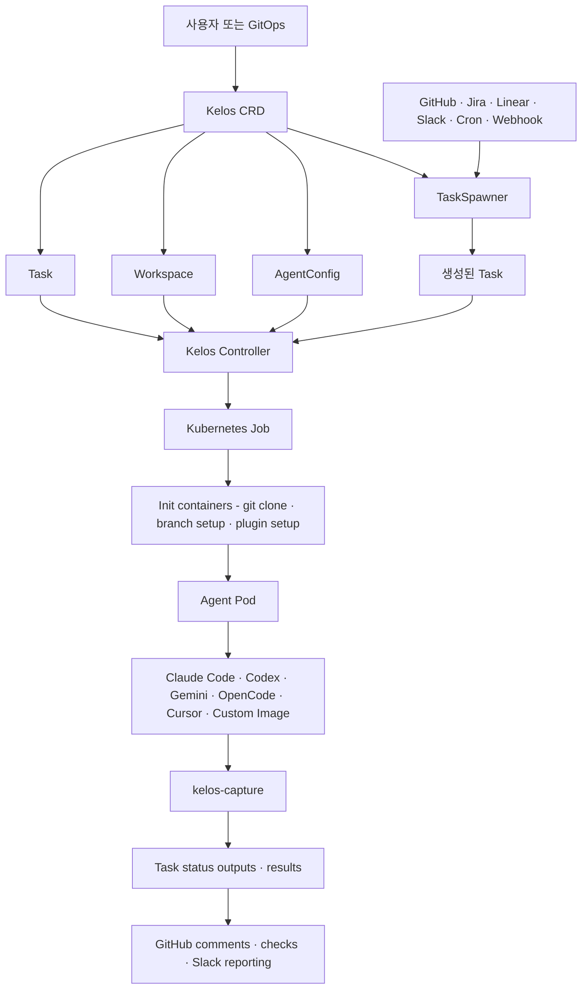

# Kelos 분석 - Kubernetes 기반 AI 코딩 에이전트 오케스트레이션

## 한 줄 요약

Kelos는 Claude Code, OpenAI Codex, Gemini, OpenCode, Cursor 같은 AI 코딩 에이전트를 Kubernetes Job으로 실행하고, GitHub Issue/PR/Webhook, Jira, Linear, Slack, Cron 같은 외부 이벤트를 에이전트 작업으로 연결하는 Kubernetes-native 오케스트레이션 프레임워크다.

- 분석 기준: `kelos-dev/kelos` `main`, commit `bf623397b132ca9b763b3850f9d556d948a87323`, tag `v0.42.0`, 2026-06-26
- 원본: [github.com/kelos-dev/kelos](https://github.com/kelos-dev/kelos)
- 핵심 문서: [README](https://github.com/kelos-dev/kelos/blob/bf623397b132ca9b763b3850f9d556d948a87323/README.md), [Reference](https://github.com/kelos-dev/kelos/blob/bf623397b132ca9b763b3850f9d556d948a87323/docs/reference.md), [Agent Image Interface](https://github.com/kelos-dev/kelos/blob/bf623397b132ca9b763b3850f9d556d948a87323/docs/agent-image-interface.md)

## 프로젝트 개요

Kelos가 해결하려는 문제는 "AI 코딩 에이전트를 개인 로컬 CLI가 아니라 팀/조직 단위의 백그라운드 개발 워커로 운영하는 것"이다. 일반적으로 Codex나 Claude Code 같은 도구는 개발자가 터미널에서 직접 실행하지만, Kelos는 이를 Kubernetes 리소스로 선언하고 컨트롤러가 실행/상태/결과를 관리하게 만든다.

주요 사용 목적은 다음과 같다.

- GitHub Issue에 `bug` 라벨이 붙으면 에이전트가 repo를 clone하고 수정 브랜치/PR을 생성
- PR이 열리거나 리뷰 코멘트가 달리면 에이전트가 자동 리뷰 또는 수정 작업 수행
- Cron으로 정기적인 코드 정리, dependency 업데이트, 문서 갱신 수행
- Sentry, Jira, Linear, Slack 같은 외부 이벤트를 webhook 또는 source polling으로 받아 에이전트 Task 생성
- 여러 에이전트 작업을 `dependsOn`으로 연결해 설계 -> 구현 -> 리뷰 같은 파이프라인 구성

## 핵심 특징 및 차별점

Kelos의 핵심 추상화는 네 가지 CRD다.

| 리소스 | 용도 | 코드 기준 |
|---|---|---|
| `Task` | 단일 에이전트 실행 단위. prompt, agent type, credentials, model, workspace, branch, dependency, pod override를 포함 | [`api/v1alpha2/task_types.go`](https://github.com/kelos-dev/kelos/blob/bf623397b132ca9b763b3850f9d556d948a87323/api/v1alpha2/task_types.go) |
| `Workspace` | 에이전트가 작업할 git repository, ref, auth, 추가 remote, 주입 파일, setup command 정의 | [`api/v1alpha2/workspace_types.go`](https://github.com/kelos-dev/kelos/blob/bf623397b132ca9b763b3850f9d556d948a87323/api/v1alpha2/workspace_types.go) |
| `AgentConfig` | 에이전트 지침, plugin/skill, skills.sh 패키지, MCP 서버 설정을 재사용 가능한 단위로 정의 | [`api/v1alpha2/agentconfig_types.go`](https://github.com/kelos-dev/kelos/blob/bf623397b132ca9b763b3850f9d556d948a87323/api/v1alpha2/agentconfig_types.go) |
| `TaskSpawner` | GitHub/Jira/Linear/Slack/Cron/Webhook 등 외부 트리거를 감지해 Task 자동 생성 | [`api/v1alpha2/taskspawner_types.go`](https://github.com/kelos-dev/kelos/blob/bf623397b132ca9b763b3850f9d556d948a87323/api/v1alpha2/taskspawner_types.go) |

차별점은 "코딩 에이전트 실행"보다 "코딩 에이전트 운영"에 초점이 있다는 점이다. Kubernetes Job/Pod, CRD status, Secret, Helm chart, RBAC, GitHub App token refresh, branch mutex, output capture를 결합해 에이전트를 인프라 리소스처럼 다룬다.

## 아키텍처 분석

실행 흐름은 다음과 같다.

1. 사용자가 직접 `Task`를 만들거나 `TaskSpawner`가 외부 이벤트를 보고 `Task`를 만든다.
2. `TaskReconciler`가 dependency, branch lock, workspace, AgentConfig를 확인한다.
3. `JobBuilder`가 Kubernetes Job을 만든다.
4. init container가 repository clone, branch checkout, workspace file injection, plugin setup을 수행한다.
5. main container가 `/kelos_entrypoint.sh`를 통해 실제 에이전트 CLI를 실행한다.
6. `kelos-capture`가 branch, commit, PR URL, token usage 등을 로그 marker로 출력한다.
7. controller가 Pod log를 읽어 `Task.status.outputs`와 `Task.status.results`에 구조화한다.

## 기술 스택

| 영역 | 사용 기술 |
|---|---|
| 언어 | Go 1.25 |
| Kubernetes | CRD, controller-runtime, client-go, batch Job, CronJob, Secret, RBAC |
| 배포 | Helm chart, `kelos install`, GHCR 이미지 |
| CLI | Cobra 기반 `kelos` CLI |
| 에이전트 이미지 | `claude-code/`, `codex/`, `gemini/`, `opencode/`, `cursor/` Dockerfile 및 entrypoint |
| 통합 | GitHub API, GitHub App auth, Jira, Linear webhook, generic webhook, Slack Socket Mode |
| 확장 | custom agent image interface, AgentConfig plugins/skills, MCP servers |

## 핵심 코드 분석

`internal/controller/task_controller.go`는 Task lifecycle의 중심이다. Task가 생기면 Job 존재 여부를 확인하고, 의존 Task가 성공했는지 확인하며, 같은 workspace/branch에 대해 동시 실행을 제한한다. GitHub App 기반 workspace에서는 장시간 실행 중 token expiry를 피하기 위해 per-task Secret을 갱신한다.

`internal/controller/job_builder.go`는 Task spec을 실제 Kubernetes Job/Pod spec으로 변환한다. 여기서 기본 에이전트 이미지(`ghcr.io/kelos-dev/codex:latest` 등), credential env var, git clone init container, plugin volume, MCP 설정, workspace mount, `KELOS_*` 환경변수가 구성된다.

`internal/taskbuilder/builder.go`는 TaskSpawner가 외부 work item을 Task로 바꿀 때 prompt/branch/metadata template을 렌더링한다. 즉 TaskSpawner의 역할은 "이벤트 수집 + 템플릿 기반 Task 생성"이고, 실제 실행은 Task controller가 맡는다.

`internal/capture/`와 `cmd/kelos-capture`는 agent stdout을 그대로 전달하면서 branch, PR, commit, token usage를 후처리한다. 이 덕분에 에이전트 결과를 Kubernetes status와 후속 dependency prompt에서 사용할 수 있다.

## API 및 인터페이스

Kelos는 두 가지 인터페이스를 제공한다.

첫째, Kubernetes YAML 인터페이스다. 예를 들어 `Task`는 `spec.type`, `spec.prompt`, `spec.credentials`, `spec.workspaceRef`, `spec.agentConfigRefs`, `spec.dependsOn`, `spec.branch`를 통해 에이전트 실행을 선언한다. `TaskSpawner`는 `spec.when`으로 GitHub Issues, GitHub PRs, Cron, Jira, GitHub Webhook, Linear Webhook, Generic Webhook, Slack 중 하나를 선택하고 `taskTemplate`으로 생성할 Task 모양을 정의한다.

둘째, CLI 인터페이스다. `kelos run`, `kelos create`, `kelos get`, `kelos logs`, `kelos suspend/resume`, `kelos install` 같은 명령으로 CRD 생성과 controller 설치를 단순화한다.

커스텀 에이전트 이미지는 `/kelos_entrypoint.sh` 실행 파일, 첫 번째 인자 prompt, UID `61100`, `/workspace/repo` working directory, `KELOS_MODEL`, `KELOS_EFFORT`, `KELOS_AGENT_TYPE`, `KELOS_PLUGIN_DIR`, `KELOS_MCP_SERVERS` 같은 환경변수 계약을 구현하면 된다.

## 확장성 및 플러그인

확장 포인트는 세 가지다.

- 에이전트 확장: `spec.type` 기본값은 Claude Code, Codex, Gemini, OpenCode, Cursor지만 `spec.image`로 custom image를 지정할 수 있다.
- 지식/도구 확장: `AgentConfig`에 instructions, inline plugin skills, sub-agents, skills.sh 패키지, MCP server를 묶을 수 있다.
- workflow 확장: `TaskSpawner`의 generic webhook은 임의 JSON payload를 JSONPath field mapping과 filter로 Task template에 연결한다.

## 성능 및 운영 특성

Kelos는 Kubernetes를 실행 스케줄러로 사용하므로 병렬성은 클러스터 capacity, API provider quota, `TaskSpawner.maxConcurrency`, Pod resource request/limit에 의해 제한된다. Task는 기본적으로 독립 Job/Pod로 실행되고 workspace는 ephemeral volume에 clone된다. `ttlSecondsAfterFinished`로 완료된 Task 정리를 자동화할 수 있다.

운영상 중요한 제약은 다음과 같다.

- Kubernetes cluster 1.28+와 cert-manager가 필요하다.
- 에이전트 실행은 API key/OAuth/GitHub token 같은 Secret 관리가 전제다.
- Generic webhook 예제는 네트워크 레벨 접근 제한을 요구한다.
- 동일 branch에 대한 동시 작업은 lock으로 제한되지만, 에이전트가 만든 코드의 semantic conflict까지 해결해주는 것은 아니다.

## 경쟁 및 비교

| 비교 대상 | Kelos와의 차이 |
|---|---|
| Claude Code/Codex/Gemini CLI 직접 사용 | Kelos는 CLI 자체가 아니라 이 CLI들을 Kubernetes Job으로 실행하고 workflow trigger/status/reporting을 제공한다. |
| GitHub Actions에서 에이전트 CLI 실행 | Actions는 CI workflow에 강하지만, Kelos는 CRD 기반 long-running controller, TaskSpawner, branch lock, Kubernetes resource scheduling에 초점이 있다. |
| Jenkins/Argo Workflows/Tekton | 범용 workflow engine은 더 넓은 파이프라인 제어를 제공하지만, Kelos는 AI coding agent의 credential, workspace, plugin, output capture에 특화되어 있다. |
| OpenHands/OpenDevin류 self-hosted coding agent | Kelos는 자체 IDE/agent UX보다 기존 CLI agent를 Kubernetes 운영 단위로 래핑하는 쪽에 가깝다. |
| Kagent 같은 Kubernetes AI agent | Kagent는 Kubernetes 운영/진단 에이전트 성격이 강하고, Kelos는 software development workflow 자동화와 repo 변경/PR 생성에 초점이 있다. |

## 종합 평가

Kelos는 "AI 코딩 에이전트를 조직의 개발 자동화 인프라에 넣고 싶을 때" 적합하다. 특히 GitHub Issue/PR 기반 자동 수정, PR 리뷰 봇, 정기 maintenance 작업, incident/webhook 기반 코드 수정 같은 use case에 맞다.

강점은 Kubernetes-native 선언형 모델, 여러 agent CLI 지원, Git workspace 준비, AgentConfig/MCP/skill 주입, TaskSpawner 기반 이벤트 연동, 결과 capture가 한 프레임워크 안에 결합되어 있다는 점이다.

약점과 리스크는 Kubernetes/cert-manager/Secret/GitHub App 등 운영 복잡도가 크다는 점이다. 개인 개발자가 단발성으로 에이전트를 쓰려는 목적이라면 과하다. 반대로 여러 repo와 여러 에이전트 작업을 병렬/반복/감사 가능한 방식으로 돌려야 하는 팀에는 CLI 직접 실행보다 구조적 이점이 크다.
