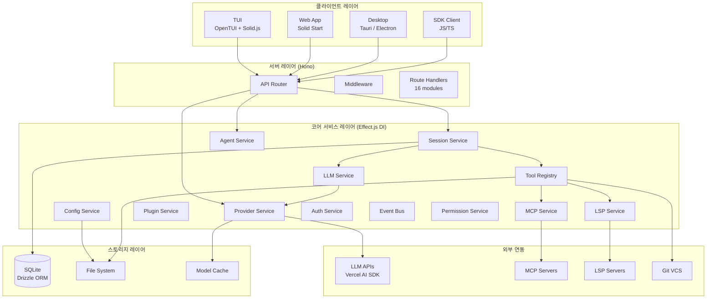
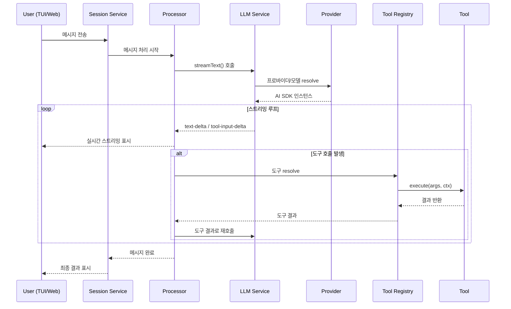
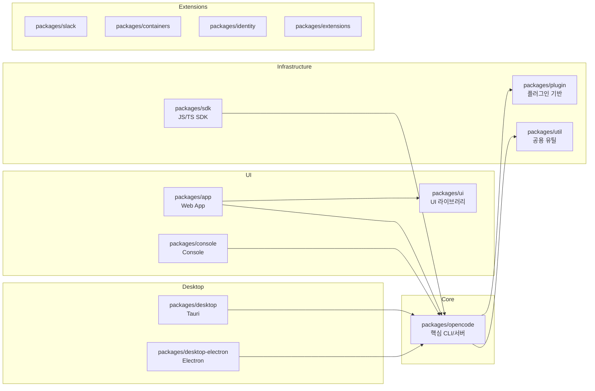
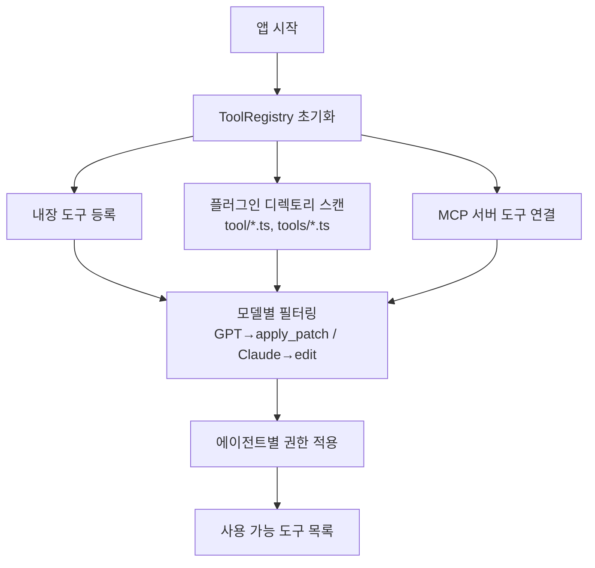
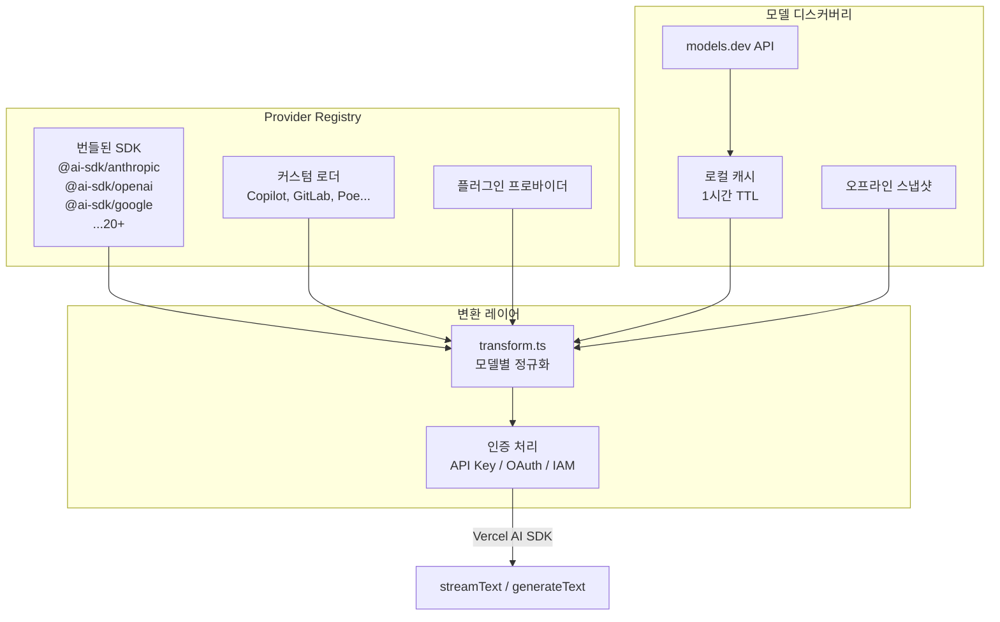
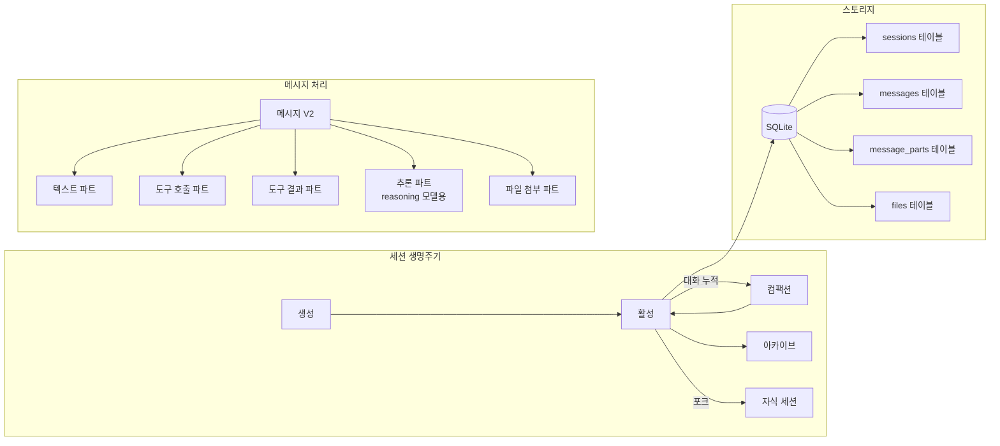
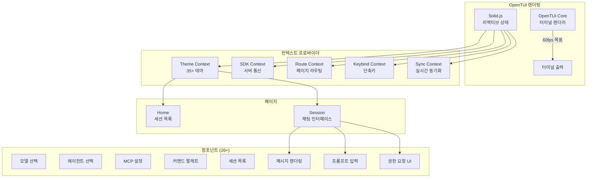
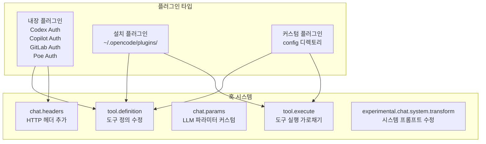

# OpenCode 심층 기술 분석

## 1. 프로젝트 개요

**OpenCode**는 터미널 환경에서 동작하는 오픈소스 AI 코딩 에이전트다. Neovim 사용자들과 terminal.shop 개발팀이 만들었으며, 다양한 LLM 프로바이더(Claude, GPT, Gemini, 로컬 모델 등)를 통합하여 코드 생성, 편집, 분석을 자동화한다.

- **GitHub**: https://github.com/anomalyco/opencode
- **문서**: https://opencode.ai/docs/
- **버전**: 1.3.9 (2026년 3월 기준)
- **라이선스**: MIT

### 해결하려는 문제

- LLM 기반 코딩 에이전트를 **프로바이더/모델 독립적**으로 사용
- 터미널 중심 워크플로우에서 벗어나지 않고 AI 코딩 지원
- Claude Code, Cursor 등 상용 에이전트의 오픈소스 대안 제공
- 커스텀 도구, 플러그인, MCP 서버를 통한 확장성

### 배포 형태

| 형태 | 설명 |
|------|------|
| CLI (TUI) | 터미널 UI - 핵심 인터페이스 |
| Web App | Solid Start 기반 브라우저 UI |
| Desktop (Tauri) | 네이티브 데스크톱 앱 |
| Desktop (Electron) | Electron 기반 데스크톱 앱 |
| SDK | JS/TS SDK로 프로그래밍 통합 |

---

## 2. 핵심 특징 및 차별점

### 주요 기능

1. **멀티 프로바이더/모델 지원**: 20+ 프로바이더, 45+ 모델 (Anthropic, OpenAI, Google, AWS Bedrock, Azure, Ollama 등)
2. **에이전트 시스템**: `build` (개발용 풀 액세스), `plan` (분석용 읽기전용), `general` (서브에이전트)
3. **30+ 내장 도구**: 파일 I/O, bash 실행, 코드 검색, 웹 검색, LSP 통합 등
4. **MCP (Model Context Protocol)**: stdio/SSE/HTTP 트랜스포트 지원
5. **LSP 통합**: TypeScript, Python, Go, Rust 등 언어서버 연동
6. **플러그인 시스템**: 커스텀 도구, 인증, 훅 확장
7. **세션 관리**: SQLite 기반 대화 이력, 컴팩션, 스냅샷

### 기존 대안 대비 차별화

| 비교 항목 | OpenCode | Claude Code | Cursor |
|----------|----------|-------------|--------|
| 오픈소스 | O (MIT) | X | X |
| 프로바이더 독립 | O (20+ 프로바이더) | Anthropic 전용 | 일부 지원 |
| 터미널 네이티브 | O | O | X (IDE) |
| 플러그인/커스텀 도구 | O | 제한적 | X |
| MCP 지원 | O | O | O |
| 데스크톱 앱 | O (Tauri + Electron) | X | O |
| 로컬 모델 (Ollama) | O | X | X |

---

## 3. 아키텍처 분석

### 3.1 전체 시스템 구조



### 3.2 에이전트-도구 실행 흐름



### 3.3 모노레포 패키지 구조



---

## 4. 기술 스택

| 영역 | 기술 |
|------|------|
| **언어** | TypeScript 5.8.2 |
| **런타임** | Bun 1.3.11 (Node.js 호환) |
| **빌드/모노레포** | Turbo (turborepo) |
| **LLM 통합** | Vercel AI SDK v6 |
| **서버** | Hono (HTTP) |
| **TUI 프레임워크** | OpenTUI (자체 개발) + Solid.js |
| **Web UI** | Solid Start + Tailwind CSS |
| **데스크톱** | Tauri / Electron |
| **DB/ORM** | SQLite + Drizzle ORM |
| **DI/FP** | Effect.js (타입 안전 의존성 주입) |
| **스키마 검증** | Zod |
| **파일 감시** | Chokidar 4.0 |
| **코드 검색** | ripgrep 통합 |
| **VCS** | Git 연동 |

---

## 5. 핵심 코드 분석

### 5.1 디렉토리 구조 (`packages/opencode/src/`)

```
src/
├── agent/           # 에이전트 정의 (build, plan, general)
├── bus/             # 이벤트 버스 (pub/sub)
├── cli/cmd/         # CLI 커맨드 (30+ 명령)
│   └── tui/         # TUI 컴포넌트 (OpenTUI + Solid.js)
│       ├── component/   # UI 컴포넌트 (26+)
│       ├── context/     # 상태 관리 컨텍스트
│       ├── routes/      # 페이지 라우트
│       └── ui/          # 저수준 UI 프리미티브
├── command/         # 커맨드 추상화
├── config/          # 설정 시스템 (JSONC 기반)
├── effect/          # Effect.js DI 유틸
├── file/            # 파일시스템 추상화, 감시, ripgrep
├── lsp/             # LSP 클라이언트/서버
├── mcp/             # MCP 프로토콜 클라이언트
├── permission/      # 권한 시스템 (allow/deny/ask)
├── plugin/          # 플러그인 로더/레지스트리
├── project/         # 프로젝트/워크스페이스 관리
├── provider/        # LLM 프로바이더 통합 (20+)
├── server/          # HTTP 서버 (Hono)
│   └── routes/      # API 라우트 (16 모듈)
├── session/         # 세션/대화 관리
├── snapshot/        # 파일 변경 스냅샷/diff
├── storage/         # DB 스토리지 (SQLite + Drizzle)
├── tool/            # 도구 시스템 (30+)
└── util/            # 유틸리티
```

### 5.2 Effect.js 서비스 패턴 (핵심 아키텍처 패턴)

OpenCode의 모든 주요 서비스는 **Effect.js**를 사용한 타입 안전 DI(의존성 주입) 패턴을 따른다:

```typescript
// 서비스 정의
export class SessionService extends ServiceMap.Service<SessionService, Interface>() {}

// 레이어 (구현체)
export const layer = Layer.effect(
  SessionService,
  Effect.gen(function* () {
    const config = yield* Config.Service;
    const db = yield* Storage.Service;
    // ... 의존성 주입
    return SessionService.of({
      create: (...) => ...,
      list: (...) => ...,
      get: (...) => ...,
    });
  })
);
```

이 패턴의 장점:
- **컴파일 타임 의존성 검증**: 필요한 서비스가 누락되면 타입 에러
- **테스트 용이**: 레이어를 교체하여 모킹
- **합성 가능**: 서비스 레이어를 조합하여 앱 구성
- **리소스 관리**: Effect의 acquire/release로 생명주기 관리

### 5.3 에이전트 시스템

에이전트는 **권한 규칙셋**과 **도구 접근 범위**가 다른 LLM 페르소나다:

| 에이전트 | 모드 | 파일 쓰기 | Bash 실행 | 용도 |
|---------|------|----------|----------|------|
| `build` | primary | O | O | 개발 (기본값) |
| `plan` | primary | X (deny) | ask | 분석/탐색 |
| `general` | subagent | 설정 가능 | 설정 가능 | 복잡한 검색 |

에이전트 설정 스키마 (Zod):
```typescript
{
  name: string,
  model?: ModelID,          // 에이전트별 모델 지정
  temperature?: number,
  topP?: number,
  permission?: Ruleset,     // allow/deny/ask 규칙
  mode: "subagent" | "primary" | "all"
}
```

### 5.4 도구(Tool) 시스템

#### 도구 인터페이스

```typescript
interface Tool.Def {
  description: string;
  parameters: ZodSchema;          // Zod 기반 파라미터 검증
  execute(args, ctx): Promise<{
    title: string;
    metadata: Record<string, any>;
    output: string;
    attachments?: Attachment[];
  }>;
  formatValidationError?(error): string;
}

interface Tool.Context {
  sessionID: string;
  messageID: string;
  callID: string;
  messages: Message[];            // 대화 이력
  ask(question): Promise<string>; // 사용자 권한 요청
  metadata(key, value): void;
  abort: AbortSignal;
}
```

#### 내장 도구 목록

| 카테고리 | 도구 | 설명 |
|---------|------|------|
| **파일** | `read`, `write`, `edit`, `glob`, `grep`, `ls` | 파일 CRUD 및 검색 |
| **실행** | `bash` | 셸 명령 실행 (권한 제어) |
| **패치** | `apply_patch`, `multiedit` | diff 적용, 다중 파일 편집 |
| **검색** | `codesearch`, `websearch`, `webfetch` | 코드/웹 검색 |
| **AI 메타** | `question`, `skill`, `task`, `todowrite` | 사용자 상호작용 |
| **계획** | `plan` | 계획 모드 진입/퇴출 |
| **LSP** | `lsp` | 심볼 검색, 정의 이동 (실험적) |
| **배치** | `batch` | 다중 도구 일괄 실행 (실험적) |

#### 도구 등록 흐름



### 5.5 프로바이더 시스템

#### 프로바이더 초기화 아키텍처



#### 프로바이더별 특수 처리

- **Anthropic**: 인터리브드 씽킹, 도구 스트리밍 베타 헤더
- **OpenAI**: GPT-5+ → Responses API / 이전 모델 → Chat API 자동 분기
- **AWS Bedrock**: 리전별 모델 ID 프리픽싱, 크로스리전 추론 프로파일, IAM 크레덴셜 체인
- **Google Vertex AI**: 프로젝트/로케이션 설정, Google Auth 라이브러리 연동
- **Azure**: 리소스네임 기반 엔드포인트 해석
- **Mistral**: 도구 ID 스크러빙 (특수문자 제거)
- **GitHub Copilot**: OAuth 플로우 + Responses API 분기
- **GitLab**: AI Gateway 헤더, 워크플로우 모델 자동 감지

### 5.6 세션/대화 관리



핵심 기능:
- **컴팩션**: 토큰 절약을 위한 대화 이력 압축
- **스냅샷**: 파일 변경 이력 추적 (additions/deletions/diffs)
- **포크**: 세션 분기 (parent/child 관계)
- **공유**: 세션 URL 공유
- **되돌리기**: 버전 기반 히스토리 복원

### 5.7 TUI 아키텍처



### 5.8 권한(Permission) 시스템

```typescript
// 규칙 기반 접근 제어
type Strategy = "allow" | "deny" | "ask";

interface PermissionRule {
  pattern: string;       // 파일 패턴 (glob)
  strategy: Strategy;
}

interface Ruleset {
  fileRead: Rule[];
  fileWrite: Rule[];
  bash: Rule[];
  externalDirectory: Rule[];
  environmentFiles: Rule[];
}
```

에이전트별로 다른 권한 규칙이 적용되어, `plan` 에이전트는 파일 쓰기가 차단되고 `build` 에이전트는 풀 액세스를 가진다.

### 5.9 플러그인 시스템



---

## 6. API 및 인터페이스

### HTTP API (Hono 기반)

16개 라우트 모듈로 구성된 REST/JSON-RPC API:

| 엔드포인트 | 기능 |
|-----------|------|
| Session | 세션 CRUD, 포크, 공유 |
| Message | 메시지 스트리밍 (JSON-RPC) |
| Project | 프로젝트 관리 |
| Provider | 프로바이더/모델 목록 |
| Agent | 에이전트 설정 |
| MCP | MCP 서버 관리 |
| LSP | LSP 서버 연동 |
| Auth | 인증 관리 |
| Health | 헬스체크 |

### CLI 커맨드 (Yargs)

```bash
opencode                    # TUI 실행 (기본)
opencode run <prompt>       # 에이전트 비대화형 실행
opencode serve              # API 서버만 실행
opencode web                # 웹 서버 실행
opencode attach             # 기존 세션 연결
opencode session list       # 세션 목록
opencode models             # 모델 목록
opencode providers          # 프로바이더 설정
opencode mcp                # MCP 서버 관리
opencode agent              # 에이전트 관리
opencode github / pr        # GitHub 연동
opencode export / import    # 세션 내보내기/가져오기
opencode plugin             # 플러그인 관리
```

### SDK (JS/TS)

`packages/sdk/js`에서 제공하는 프로그래밍 API로, OpenCode 서버와 통신하여 세션 관리, 메시지 전송, 이벤트 구독 등을 수행한다.

---

## 7. 확장성 및 플러그인

### 커스텀 도구 추가

설정 디렉토리(`~/.opencode/` 또는 `.opencode/`)에 `tool/*.ts` 파일을 생성:

```typescript
// .opencode/tool/my-tool.ts
export default {
  name: "my_tool",
  description: "커스텀 도구 설명",
  parameters: z.object({ query: z.string() }),
  async execute(args, ctx) {
    return { title: "결과", output: "...", metadata: {} };
  }
};
```

### MCP 서버 연동

`config.jsonc`에서 MCP 서버 설정:
```jsonc
{
  "mcp": {
    "my-server": {
      "command": "node",
      "args": ["./mcp-server.js"],
      "transport": "stdio"
    }
  }
}
```

### 커스텀 에이전트

```jsonc
{
  "agents": {
    "review": {
      "model": "anthropic/claude-sonnet-4-20250514",
      "temperature": 0.3,
      "permission": {
        "fileWrite": [{ "pattern": "**", "strategy": "deny" }],
        "bash": [{ "pattern": "**", "strategy": "deny" }]
      }
    }
  }
}
```

### 플러그인 훅

```typescript
// 플러그인에서 도구 정의 수정
hooks: {
  "tool.definition": (tool) => {
    if (tool.name === "bash") {
      tool.description += "\n추가 지침...";
    }
    return tool;
  },
  "chat.params": (params) => {
    params.temperature = 0.5;
    return params;
  }
}
```

---

## 8. 성능 특성

### 스트리밍

- Vercel AI SDK의 `streamText`를 사용하여 토큰 단위 스트리밍
- TUI는 60fps 목표 렌더링
- JSON-RPC 기반 양방향 스트리밍

### 세션 컴팩션

긴 대화에서 토큰 소비를 줄이기 위해 자동 컴팩션 수행. 이전 메시지를 요약하여 컨텍스트 윈도우 최적화.

### 코드 검색

ripgrep 통합으로 대규모 코드베이스에서 빠른 텍스트 검색. `.gitignore` 자동 존중.

### 모델 캐시

`models.dev` API에서 가져온 모델 메타데이터를 로컬 캐시 (1시간 TTL). 오프라인 시 스냅샷 폴백.

### 알려진 제약사항

- TUI 렌더링은 터미널 에뮬레이터 성능에 의존
- SQLite 단일 프로세스 접근 (동시 세션 시 flock 필요)
- 대형 파일 출력 시 자동 truncation 적용

---

## 9. 배포 및 운영

### 설치

```bash
# npm
npm install -g opencode

# brew
brew install opencode

# Bun (개발)
bun install
bun run dev
```

### 설정 파일 계층

```
우선순위 (높음 → 낮음):
1. 프로젝트: .opencode/config.jsonc
2. 사용자:   ~/.opencode/config.jsonc
3. 시스템:   $OPENCODE_MANAGED_CONFIG_DIR/config.jsonc
```

### 데이터 저장 위치

```
~/.opencode/
├── config.jsonc        # 사용자 설정
├── tui.jsonc           # TUI 설정
├── data.db             # SQLite 데이터베이스
├── plugins/            # 설치된 플러그인
└── cache/              # 모델 캐시
```

### 개발 명령

```bash
bun run dev             # TUI 개발 모드
bun run build           # 프로덕션 빌드
bun run typecheck       # 타입 체크
bun test --timeout 30000 # 테스트
```

---

## 10. 경쟁/비교 분석

| 항목 | OpenCode | Claude Code | Aider | Cline (VS Code) |
|------|----------|-------------|-------|------------------|
| **오픈소스** | MIT | X | Apache 2.0 | Apache 2.0 |
| **언어** | TypeScript | TypeScript | Python | TypeScript |
| **프로바이더** | 20+ | Anthropic 전용 | 다수 | 다수 |
| **인터페이스** | TUI + Web + Desktop | TUI | CLI | VS Code 확장 |
| **DI 프레임워크** | Effect.js | 없음 | 없음 | 없음 |
| **UI 프레임워크** | OpenTUI (Solid.js) | Ink (React) | 없음 | React |
| **MCP 지원** | O | O | O | O |
| **LSP 통합** | O (실험적) | X | X | X |
| **플러그인** | O (훅 기반) | 제한적 | X | O |
| **로컬 모델** | O (Ollama) | X | O | O |
| **세션 관리** | SQLite | 파일 기반 | Git 기반 | 없음 |
| **데스크톱 앱** | O (Tauri/Electron) | X | X | VS Code 내장 |

---

## 11. 종합 평가

### 강점

1. **진정한 멀티 프로바이더**: Vercel AI SDK 기반으로 20+ 프로바이더를 일관된 인터페이스로 통합. 로컬 모델(Ollama) 포함.
2. **견고한 아키텍처**: Effect.js 기반 DI로 타입 안전하고 합성 가능한 서비스 구조. 대규모 코드베이스에서도 유지보수 용이.
3. **확장성**: 플러그인 훅, 커스텀 도구, MCP, LSP 등 다층 확장 포인트 제공.
4. **멀티 인터페이스**: 동일 코어에서 TUI, Web, Desktop 세 가지 프론트엔드 지원.
5. **에이전트 권한 모델**: 에이전트별 세밀한 권한 제어 (allow/deny/ask)로 안전한 자동화.

### 약점 및 리스크

1. **Effect.js 학습 곡선**: Effect.js는 강력하지만 진입장벽이 높음. 커스터마이징 시 이 패턴을 이해해야 함.
2. **Bun 의존성**: Bun 런타임 의존으로 일부 환경에서 호환성 이슈 가능 (Node.js 폴백 존재).
3. **OpenTUI 자체 개발 프레임워크**: TUI 프레임워크가 자체 개발이므로, 문서나 커뮤니티 지원이 제한적.
4. **복잡한 모노레포 구조**: 13+ 패키지의 모노레포로, 초기 이해 비용이 높음.
5. **LSP/배치 등 실험적 기능**: 일부 핵심 기능이 아직 실험적 단계.

### 커스터마이징 관점 포인트

커스텀 사용 시 집중해야 할 영역:

| 커스텀 대상 | 진입점 | 난이도 |
|-----------|--------|--------|
| 커스텀 도구 추가 | `tool/*.ts` 파일 생성 | 낮음 |
| MCP 서버 연동 | `config.jsonc` 설정 | 낮음 |
| 커스텀 에이전트 | `config.jsonc` agents 섹션 | 낮음 |
| 시스템 프롬프트 | `config.jsonc` instructions | 낮음 |
| 플러그인 훅 | Plugin API | 중간 |
| 새 프로바이더 | `provider.ts` 커스텀 로더 | 중간 |
| TUI 컴포넌트 수정 | `tui/component/` | 높음 (OpenTUI 이해 필요) |
| 코어 서비스 수정 | Effect.js 서비스 레이어 | 높음 (Effect.js 이해 필요) |

### 엔지니어 관점 인사이트

1. **가장 빠른 커스터마이징**: `config.jsonc`만으로 에이전트, 도구 권한, 프로바이더, MCP, 시스템 프롬프트를 모두 설정 가능. 코드 수정 없이 상당히 다양한 커스텀이 가능.
2. **도구 확장이 핵심 가치**: `Tool.Def` 인터페이스가 깔끔하여 커스텀 도구 개발이 쉽다. Zod 스키마로 파라미터 검증, `execute()` 함수로 로직 구현.
3. **프로바이더 추가는 Vercel AI SDK 의존**: 새 프로바이더를 추가하려면 Vercel AI SDK 호환 패키지가 필요하거나, OpenAI 호환 API 엔드포인트를 사용.
4. **Effect.js가 진입장벽**: 코어 로직을 수정하려면 Effect.js의 Service, Layer, Effect.gen 패턴을 이해해야 한다. FP(함수형 프로그래밍) 경험이 없으면 학습 시간이 필요.

Sources:
- [OpenCode GitHub](https://github.com/anomalyco/opencode)
- [OpenCode Documentation](https://opencode.ai/docs/)
- [OpenCode - YUV.AI Blog](https://yuv.ai/blog/opencode-the-open-source-ai-coding-agent-that-works-with-any-model)
