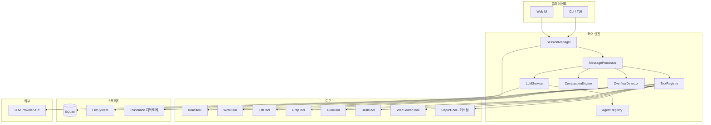
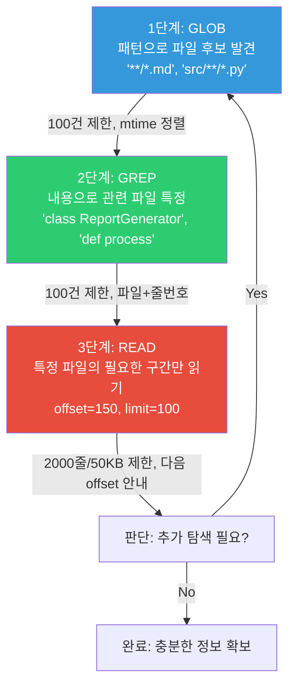
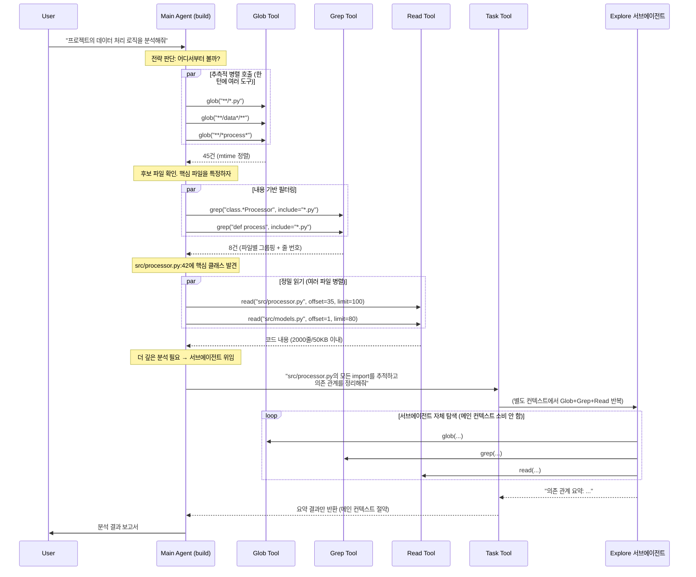

# OpenCode Python 구현 통합 명세서 — 마크다운 보고서 AI 에디터

> 이 문서는 OpenCode(TypeScript)의 핵심 에이전트 메커니즘을 Python으로 재구현하기 위한 통합 기술 명세다.
> 마크다운 보고서 편집에 특화된 에이전트를 목표로 하되, OpenCode의 컨텍스트 관리, 도구 시스템, 세션 관리 아키텍처를 그대로 가져간다.

---

## 목차

1. [전체 아키텍처](#1-전체-아키텍처)
2. [데이터 모델](#2-데이터-모델)
3. [파일 탐색 전략 — 에이전트의 "눈"](#3-파일-탐색-전략--에이전트의-눈)
4. [도구 시스템 구현](#4-도구-시스템-구현)
5. [컨텍스트 관리 엔진](#5-컨텍스트-관리-엔진)
6. [메시지 프로세서 & 에이전트 루프](#6-메시지-프로세서--에이전트-루프)
7. [LLM 서비스 & Provider 추상화](#7-llm-서비스--provider-추상화)
8. [스트리밍 응답 처리](#8-스트리밍-응답-처리)
9. [에이전트 시스템](#9-에이전트-시스템)
10. [세션 관리](#10-세션-관리)
11. [핵심 상수 총정리](#11-핵심-상수-총정리)
12. [초기화 및 실행](#12-초기화-및-실행)
13. [OpenCode 원본 소스코드 참조](#13-opencode-원본-소스코드-참조)
14. [Python 구현 설계안 & 구현 우선순위](#14-python-구현-설계안--구현-우선순위)
15. [부록: OpenCode 소스 파일 참조표](#15-부록-opencode-소스-파일-참조표)

---

## 1. 전체 아키텍처

### 1.1 시스템 개요



### 1.2 핵심 설계 원칙

| 원칙 | 설명 |
|------|------|
| **계층형 컨텍스트 방어** | 도구 레벨 → Truncation → Pruning → Overflow 감지 → Compaction 순서로, 비용이 낮은 처리를 먼저 적용 |
| **부분 읽기(Partial Read)** | 파일을 전체 로드하지 않고 스트림/오프셋 기반으로 필요한 부분만 읽기 |
| **도구 출력 제한** | 모든 도구 출력에 일관된 크기 제한 적용 (2000줄/50KB) |
| **소프트 삭제** | Pruning 시 데이터를 DB에서 삭제하지 않고 플래그만 설정 |
| **스트리밍 우선** | 모든 LLM 응답은 스트리밍으로 처리, 실시간 토큰/비용 추적 |
| **지연 로딩** | 대화 기록은 커서 기반 페이지네이션으로 50개씩 로드 |
| **이벤트 기반** | 세션/메시지 변경은 이벤트로 전파, UI 실시간 갱신 |

### 1.3 Python 기술 스택 (권장)

| 영역 | 권장 라이브러리 | OpenCode 대응 |
|------|----------------|--------------|
| LLM 통합 | `litellm` 또는 `openai` SDK | Vercel AI SDK |
| DB/ORM | `sqlalchemy` + `aiosqlite` | Drizzle ORM + SQLite |
| 스키마 검증 | `pydantic` v2 | Zod |
| CLI/TUI | `textual` 또는 `rich` + `click` | OpenTUI + Solid.js |
| 파일 감시 | `watchdog` | Chokidar |
| 코드 검색 | `subprocess`로 `ripgrep` 호출 | ripgrep 통합 |
| 설정 | `pydantic-settings` + TOML/JSON | JSONC config |
| 비동기 | `asyncio` | Effect.js |
| 웹서버 | `FastAPI` | Hono |
| 이벤트 버스 | `blinker` 또는 커스텀 pub/sub | Effect PubSub |

---

## 2. 데이터 모델

### 2.1 DB 스키마 (SQLAlchemy 기준)

```python
"""
models.py — 전체 DB 스키마
OpenCode의 Drizzle ORM 스키마를 Python SQLAlchemy로 1:1 변환
"""
from sqlalchemy import (
    Column, String, Integer, Float, Text, ForeignKey,
    Index, UniqueConstraint, create_engine, JSON
)
from sqlalchemy.orm import declarative_base, relationship
import time
import ulid  # ID 생성용

Base = declarative_base()


def generate_id(prefix: str = "") -> str:
    """ULID 기반 정렬 가능한 ID 생성 (OpenCode의 ascending ID 패턴)"""
    return f"{prefix}_{ulid.new().str}" if prefix else ulid.new().str


class Project(Base):
    """프로젝트 (보고서 작업 공간) 메타데이터"""
    __tablename__ = "project"

    id = Column(String, primary_key=True, default=lambda: generate_id("proj"))
    worktree = Column(String, nullable=False)    # 프로젝트 루트 경로
    name = Column(String)
    vcs = Column(String)                          # "git" 또는 None

    time_created = Column(Integer, nullable=False, default=lambda: int(time.time() * 1000))
    time_updated = Column(Integer, nullable=False, default=lambda: int(time.time() * 1000),
                          onupdate=lambda: int(time.time() * 1000))

    sessions = relationship("Session", back_populates="project", cascade="all, delete-orphan")


class Session(Base):
    """대화 세션 — 하나의 보고서 작성/편집 작업 단위"""
    __tablename__ = "session"

    id = Column(String, primary_key=True, default=lambda: generate_id("sess"))
    project_id = Column(String, ForeignKey("project.id", ondelete="CASCADE"), nullable=False)
    parent_id = Column(String, ForeignKey("session.id"), nullable=True)  # 포크용 자기참조

    slug = Column(String, nullable=False)
    directory = Column(String, nullable=False)
    title = Column(String, nullable=False)
    version = Column(String, nullable=False, default="1")

    # 보고서 변경 요약
    summary_additions = Column(Integer)
    summary_deletions = Column(Integer)
    summary_files = Column(Integer)
    summary_diffs = Column(JSON)     # List[FileDiff]

    # 권한 규칙 (JSON으로 저장)
    permission = Column(JSON)        # PermissionRuleset

    time_created = Column(Integer, nullable=False, default=lambda: int(time.time() * 1000))
    time_updated = Column(Integer, nullable=False, default=lambda: int(time.time() * 1000))
    time_compacting = Column(Integer)  # 컴팩션 진행 중 타임스탬프
    time_archived = Column(Integer)

    project = relationship("Project", back_populates="sessions")
    messages = relationship("Message", back_populates="session", cascade="all, delete-orphan")

    __table_args__ = (
        Index("session_project_idx", "project_id"),
        Index("session_parent_idx", "parent_id"),
    )


class Message(Base):
    """메시지 — user 또는 assistant 단위"""
    __tablename__ = "message"

    id = Column(String, primary_key=True, default=lambda: generate_id("msg"))
    session_id = Column(String, ForeignKey("session.id", ondelete="CASCADE"), nullable=False)

    # 메시지 메타데이터 전체를 JSON으로 저장 (OpenCode 패턴)
    data = Column(JSON, nullable=False)
    # data 구조:
    # {
    #     "role": "user" | "assistant",
    #     "agent": "build" | "plan" | ...,
    #     "model": {"provider_id": "...", "model_id": "..."},
    #     "cost": 0.0,
    #     "tokens": {"input": 0, "output": 0, "reasoning": 0,
    #                "cache": {"read": 0, "write": 0}},
    #     "summary": false,      # compaction 요약 메시지인지
    #     "finish": "completed" | "error" | None,
    #     "error": {...} | None,
    # }

    time_created = Column(Integer, nullable=False, default=lambda: int(time.time() * 1000))
    time_updated = Column(Integer, nullable=False, default=lambda: int(time.time() * 1000))

    session = relationship("Session", back_populates="messages")
    parts = relationship("Part", back_populates="message", cascade="all, delete-orphan")

    __table_args__ = (
        Index("message_session_time_id_idx", "session_id", "time_created", "id"),
    )


class Part(Base):
    """메시지 파트 — 텍스트, 도구 호출, 도구 결과, 추론 등"""
    __tablename__ = "part"

    id = Column(String, primary_key=True, default=lambda: generate_id("part"))
    message_id = Column(String, ForeignKey("message.id", ondelete="CASCADE"), nullable=False)
    session_id = Column(String, nullable=False)  # 비정규화 — JOIN 없이 세션별 조회

    # 파트 데이터 전체를 JSON으로 저장
    data = Column(JSON, nullable=False)
    # data 구조 (type에 따라 다름):
    #
    # type="text":
    #   {"type": "text", "text": "...", "synthetic": false, "ignored": false,
    #    "metadata": {...}}
    #
    # type="tool":
    #   {"type": "tool", "tool": "read", "call_id": "...", "args": {...},
    #    "state": {
    #        "status": "pending" | "running" | "completed" | "error",
    #        "output": "...",
    #        "title": "...",
    #        "metadata": {...},
    #        "time": {"start": ..., "end": ..., "compacted": ... | None}
    #    }}
    #
    # type="reasoning":
    #   {"type": "reasoning", "text": "...", "time": {"start": ..., "end": ...}}
    #
    # type="file":
    #   {"type": "file", "mime": "...", "filename": "...", "url": "data:..."}
    #
    # type="step-finish":
    #   {"type": "step-finish",
    #    "tokens": {"input": .., "output": .., "reasoning": ..,
    #               "cache": {"read": .., "write": ..}},
    #    "cost": 0.0,
    #    "finish": "completed"}
    #
    # type="compaction":
    #   {"type": "compaction", "auto": true, "overflow": false}

    time_created = Column(Integer, nullable=False, default=lambda: int(time.time() * 1000))
    time_updated = Column(Integer, nullable=False, default=lambda: int(time.time() * 1000))

    message = relationship("Message", back_populates="parts")

    __table_args__ = (
        Index("part_message_id_idx", "message_id", "id"),
        Index("part_session_idx", "session_id"),
    )
```

### 2.2 Pydantic 모델 (런타임 데이터)

```python
"""
schemas.py — 런타임 데이터 모델
"""
from pydantic import BaseModel, Field
from typing import Optional, Literal, Any
from enum import Enum


# ── 토큰/비용 ──

class CacheTokens(BaseModel):
    read: int = 0
    write: int = 0

class TokenUsage(BaseModel):
    input: int = 0
    output: int = 0
    reasoning: int = 0
    cache: CacheTokens = Field(default_factory=CacheTokens)
    total: Optional[int] = None

    @property
    def computed_total(self) -> int:
        if self.total is not None:
            return self.total
        return self.input + self.output + self.cache.read + self.cache.write


# ── 메시지 ──

class MessageRole(str, Enum):
    USER = "user"
    ASSISTANT = "assistant"

class ModelRef(BaseModel):
    provider_id: str
    model_id: str

class MessageInfo(BaseModel):
    role: MessageRole
    agent: str = "build"
    model: ModelRef
    cost: float = 0.0
    tokens: TokenUsage = Field(default_factory=TokenUsage)
    summary: bool = False               # compaction 요약 여부
    finish: Optional[str] = None        # "completed" | "error"
    error: Optional[dict] = None
    variant: Optional[str] = None
    format: Optional[str] = None        # "text" | "json_schema"
    system: Optional[str] = None        # 커스텀 시스템 프롬프트


# ── 파트 ──

class ToolTime(BaseModel):
    start: Optional[float] = None
    end: Optional[float] = None
    compacted: Optional[float] = None   # pruning 시 설정됨

class ToolState(BaseModel):
    status: Literal["pending", "running", "completed", "error"] = "pending"
    input: dict = Field(default_factory=dict)
    output: str = ""
    title: str = ""
    metadata: dict = Field(default_factory=dict)
    time: ToolTime = Field(default_factory=ToolTime)
    attachments: list = Field(default_factory=list)  # 이미지/PDF 등

class TextPart(BaseModel):
    type: Literal["text"] = "text"
    text: str
    synthetic: bool = False              # AI가 생성한 플레이스홀더
    ignored: bool = False                # 모델 입력에서 제외
    metadata: Optional[dict] = None      # 프로바이더별 메타데이터

class ToolPart(BaseModel):
    type: Literal["tool"] = "tool"
    tool: str                            # 도구 이름
    call_id: str                         # 도구 호출 ID
    args: dict = Field(default_factory=dict)
    state: ToolState = Field(default_factory=ToolState)

class ReasoningPart(BaseModel):
    """Claude의 Extended Thinking"""
    type: Literal["reasoning"] = "reasoning"
    text: str = ""
    time: Optional[ToolTime] = None

class FilePart(BaseModel):
    """이미지, PDF 등 첨부"""
    type: Literal["file"] = "file"
    mime: str                            # "image/png", "application/pdf" 등
    filename: Optional[str] = None
    url: str                             # data: URL (base64 인코딩)

class CompactionPart(BaseModel):
    type: Literal["compaction"] = "compaction"
    auto: bool = True
    overflow: bool = False

class StepFinishPart(BaseModel):
    type: Literal["step-finish"] = "step-finish"
    tokens: TokenUsage
    cost: float = 0.0
    finish: str = "completed"

# Union 타입
PartData = TextPart | ToolPart | ReasoningPart | FilePart | CompactionPart | StepFinishPart


# ── 에이전트 ──

class PermissionStrategy(str, Enum):
    ALLOW = "allow"
    DENY = "deny"
    ASK = "ask"

class PermissionRule(BaseModel):
    pattern: str                         # glob 패턴
    strategy: PermissionStrategy

class PermissionRuleset(BaseModel):
    file_read: list[PermissionRule] = Field(default_factory=list)
    file_write: list[PermissionRule] = Field(default_factory=list)
    bash: list[PermissionRule] = Field(default_factory=list)
    external_directory: list[PermissionRule] = Field(default_factory=list)

class AgentConfig(BaseModel):
    name: str
    model: Optional[ModelRef] = None
    temperature: Optional[float] = None
    top_p: Optional[float] = None
    permission: PermissionRuleset = Field(default_factory=PermissionRuleset)
    mode: Literal["primary", "subagent"] = "primary"
    hidden: bool = False                 # compaction, title, summary 에이전트는 숨김
    system_prompt: str = ""
    steps: Optional[int] = None          # 최대 실행 스텝 수


# ── 설정 ──

class CompactionConfig(BaseModel):
    auto: bool = True
    prune: bool = True
    reserved: Optional[int] = None       # 기본 20_000 토큰

class ModelLimits(BaseModel):
    """모델의 토큰 한계"""
    context: int             # 전체 컨텍스트 윈도우 (예: 200_000)
    max_output: int          # 최대 출력 토큰 (예: 8_192)
    input_limit: int = 0     # 명시적 입력 한도 (0이면 context - max_output 사용)

class ModelCost(BaseModel):
    input: float                 # 입력 토큰당 가격 (per 1M tokens)
    output: float
    cache_read: float = 0.0
    cache_write: float = 0.0
    experimental_over_200k: Optional["ModelCost"] = None

class Config(BaseModel):
    providers: dict[str, dict] = Field(default_factory=dict)
    agents: dict[str, AgentConfig] = Field(default_factory=dict)
    compaction: CompactionConfig = Field(default_factory=CompactionConfig)
    experimental: dict = Field(default_factory=dict)


# ── 도구 결과 ──

class ToolResult(BaseModel):
    title: str = ""
    output: str = ""
    metadata: dict = Field(default_factory=dict)
    error: Optional[str] = None
    attachments: list[FilePart] = Field(default_factory=list)
```

### 2.3 모델 메시지 변환

내부 메시지 → LLM API 호출용 메시지 변환 시 핵심 로직:

```python
async def to_model_messages(
    messages: list[dict],  # [{"info": MessageInfo, "parts": [PartData, ...]}]
    model: dict,
    strip_media: bool = False
) -> list[dict]:
    """내부 메시지를 LLM API 형식으로 변환"""
    result = []

    for msg in messages:
        role = msg["info"]["role"]

        if role == "user":
            parts = []
            for part in msg["parts"]:
                if part.get("type") == "text" and not part.get("ignored"):
                    parts.append({"type": "text", "text": part["text"]})
                elif part.get("type") == "file":
                    if strip_media:
                        parts.append({"type": "text",
                                      "text": f"[Attached {part['mime']}: {part.get('filename', 'file')}]"})
                    else:
                        parts.append({"type": "image_url", "url": part["url"]})
                elif part.get("type") == "compaction":
                    parts.append({"type": "text", "text": "What did we do so far?"})
            if parts:
                result.append({"role": "user", "content": parts})

        elif role == "assistant":
            text = ""
            tool_calls = []
            tool_results = []

            for part in msg["parts"]:
                if part.get("type") == "text":
                    text += part.get("text", "")

                elif part.get("type") == "tool":
                    state = part.get("state", {})
                    # ★ 핵심: Pruning된 도구 출력은 플레이스홀더로 교체
                    output = state.get("output", "")
                    if state.get("time", {}).get("compacted"):
                        output = "[Old tool result content cleared]"

                    tool_calls.append({
                        "id": part.get("call_id"),
                        "type": "function",
                        "function": {
                            "name": part["tool"],
                            "arguments": json.dumps(part.get("args", {})),
                        },
                    })
                    tool_results.append({
                        "role": "tool",
                        "tool_call_id": part.get("call_id"),
                        "content": output,
                    })

            if text or tool_calls:
                assistant_msg = {"role": "assistant"}
                if text:
                    assistant_msg["content"] = text
                if tool_calls:
                    assistant_msg["tool_calls"] = tool_calls
                result.append(assistant_msg)

            result.extend(tool_results)

    return result
```

### 2.4 메시지 로딩 — 커서 기반 페이지네이션

대화 기록은 한번에 전부 로드하지 않고, 50개씩 커서 기반으로 스트리밍한다:

```python
async def stream_messages(session_id: str, limit: int | None = None):
    """커서 기반 페이지네이션으로 메시지 로드"""
    BATCH_SIZE = 50
    cursor = None
    count = 0

    while True:
        query = (
            select(MessageTable)
            .where(MessageTable.session_id == session_id)
            .order_by(MessageTable.time_created.asc(), MessageTable.id.asc())
            .limit(BATCH_SIZE)
        )
        if cursor:
            query = query.where(
                or_(
                    MessageTable.time_created > cursor.time_created,
                    and_(
                        MessageTable.time_created == cursor.time_created,
                        MessageTable.id > cursor.id
                    )
                )
            )

        rows = await db.execute(query)
        if not rows:
            break

        for row in rows:
            parts = await load_parts(row.id)
            yield {"info": row.data, "parts": [p.data for p in parts]}
            count += 1
            if limit and count >= limit:
                return

        cursor = rows[-1]
        if len(rows) < BATCH_SIZE:
            break
```

---

## 3. 파일 탐색 전략 — 에이전트의 "눈"

이 섹션이 OpenCode 에이전트의 핵심이다. 에이전트가 어떻게 프로젝트를 파악하고, 필요한 정보를 찾고, 컨텍스트를 낭비하지 않는지를 결정하는 것은 **도구의 구현 코드가 아니라 도구의 description(LLM에게 보내는 프롬프트)** 이다.

### 3.1 핵심 통찰: 도구 description이 곧 전략이다

OpenCode의 각 도구는 `.txt` 파일에 description을 가지고 있고, 이것이 LLM의 시스템 프롬프트에 포함된다. 에이전트는 이 description을 읽고 **어떤 도구를 어떤 순서로 써야 하는지** 스스로 판단한다.

```
도구 description (.txt)  →  LLM 시스템 프롬프트에 포함  →  에이전트가 전략 학습
```

따라서 Python 재구현 시 **도구의 description 문구가 코드만큼 중요하다.**

### 3.2 3단계 깔때기: Glob → Grep → Read

에이전트가 파일을 찾는 과정은 넓은 범위에서 좁은 범위로 좁혀가는 **깔때기(funnel)** 구조다.



### 3.3 Glob — 1단계: 파일 후보 발견

#### OpenCode 원본 description (`glob.txt` 전문)

```
- Fast file pattern matching tool that works with any codebase size
- Supports glob patterns like "**/*.js" or "src/**/*.ts"
- Returns matching file paths sorted by modification time
- Use this tool when you need to find files by name patterns
- When you are doing an open-ended search that may require multiple rounds of
  globbing and grepping, use the Task tool instead
- You have the capability to call multiple tools in a single response. It is
  always better to speculatively perform multiple searches as a batch that are
  potentially useful.
```

#### 이 description이 유도하는 에이전트 행동

| 문구 | 유도하는 행동 |
|------|-------------|
| "sorted by modification time" | 최근 수정된 파일이 먼저 → 에이전트가 가장 관련 높은 파일부터 봄 |
| "find files by name patterns" | 내용이 아닌 **이름**으로 먼저 후보를 좁히라는 지침 |
| "multiple rounds of globbing and grepping → use Task tool" | 탐색이 복잡하면 서브에이전트에 위임하여 메인 에이전트 컨텍스트 절약 |
| "call multiple tools in a single response... speculatively perform multiple searches as a batch" | **추측적 병렬 호출** — 한 턴에 여러 패턴을 동시 검색 |

마지막 줄이 특히 중요하다. 에이전트가 `glob("**/*.md")`, `glob("**/*.rst")`, `glob("docs/**/*")`를 한 번에 병렬 호출하도록 유도한다.

### 3.4 Grep — 2단계: 내용으로 관련 파일 특정

#### OpenCode 원본 description (`grep.txt` 전문)

```
- Fast content search tool that works with any codebase size
- Searches file contents using regular expressions
- Supports full regex syntax (eg. "log.*Error", "function\s+\w+", etc.)
- Filter files by pattern with the include parameter (eg. "*.js", "*.{ts,tsx}")
- Returns file paths and line numbers with at least one match sorted by
  modification time
- Use this tool when you need to find files containing specific patterns
- If you need to identify/count the number of matches within files, use the
  Bash tool with `rg` (ripgrep) directly. Do NOT use `grep`.
- When you are doing an open-ended search that may require multiple rounds of
  globbing and grepping, use the Task tool instead
```

핵심은 **include 파라미터**다. `grep(pattern="class Report", include="*.py")`처럼 파일 타입을 먼저 좁히면 검색 범위가 대폭 줄어든다.

**파일별 그룹핑이 중요한 이유:** LLM이 "이 파일의 42번째 줄에 관련 코드가 있구나" → `read(file_path, offset=35, limit=50)` 같은 **정밀 읽기 판단**을 할 수 있게 된다.

### 3.5 Read — 3단계: 정밀 읽기

#### OpenCode 원본 description (`read.txt` 전문)

```
Read a file or directory from the local filesystem. If the path does not exist,
an error is returned.

Usage:
- The filePath parameter should be an absolute path.
- By default, this tool returns up to 2000 lines from the start of the file.
- The offset parameter is the line number to start from (1-indexed).
- To read later sections, call this tool again with a larger offset.
- Use the grep tool to find specific content in large files or files with long lines.
- If you are unsure of the correct file path, use the glob tool to look up
  filenames by glob pattern.
- Contents are returned with each line prefixed by its line number as
  `<line>: <content>`.
- Any line longer than 2000 characters is truncated.
- Call this tool in parallel when you know there are multiple files you want to read.
- Avoid tiny repeated slices (30 line chunks). If you need more context, read
  a larger window.
- This tool can read image files and PDFs and return them as file attachments.
```

**순환 안내(circular guidance)** 가 핵심 설계다:
```
Read description: "경로가 불확실하면 Glob을 써라"
Glob description: "파일을 찾을 때 써라"
Grep description: "큰 파일에서 위치를 찾을 때 써라"
Read description: "Grep으로 찾은 줄 번호를 offset으로 써라"
```

이 순환 구조가 에이전트를 자연스럽게 Glob → Grep → Read 깔때기로 유도한다.

### 3.6 Bash — 파일 탐색 금지 구역

#### OpenCode 원본 description (`bash.txt` 핵심 발췌)

```
IMPORTANT: This tool is for terminal operations like git, npm, docker, etc.
DO NOT use it for file operations (reading, writing, editing, searching,
finding files) - use the specialized tools for this instead.

Avoid using Bash with the `find`, `grep`, `cat`, `head`, `tail`, `sed`,
`awk`, or `echo` commands, unless explicitly instructed.
Instead, always prefer using the dedicated tools:
  - File search: Use Glob (NOT find or ls)
  - Content search: Use Grep (NOT grep or rg)
  - Read files: Use Read (NOT cat/head/tail)
  - Edit files: Use Edit (NOT sed/awk)
  - Write files: Use Write (NOT echo >/cat <<EOF)
```

**모든 파일 관련 작업을 전용 도구로 강제 유도한다.** 이것이 중요한 이유:
- `cat`은 파일 전체를 읽어 context에 넣음 → 토큰 낭비
- `find`는 .gitignore를 무시하고 전체 탐색 → node_modules 등 불필요한 결과
- `grep`(시스템 명령)은 ripgrep보다 느리고 출력 포맷이 일관되지 않음

### 3.7 Task (서브에이전트 위임) — 컨텍스트 보존의 핵심

#### OpenCode 원본 description (`task.txt` 핵심 발췌)

```
Launch a new agent to handle complex, multistep tasks autonomously.

When NOT to use the Task tool:
- If you want to read a specific file path, use the Read or Glob tool instead
- If you are searching for a specific class definition like "class Foo",
  use the Glob tool instead
- If you are searching for code within a specific file or set of 2-3 files,
  use the Read tool instead

Usage notes:
1. Launch multiple agents concurrently whenever possible, to maximize
   performance; to do that, use a single message with multiple tool uses
2. Each agent invocation starts with a fresh context...
3. Clearly tell the agent whether you expect it to write code or just to
   do research (search, file reads, web fetches, etc.)
```

**"When NOT to use" 섹션이 핵심이다.** 간단한 탐색은 직접 하고, 복잡한 탐색만 서브에이전트에 위임:

| 상황 | 행동 |
|------|------|
| 특정 파일 1개 읽기 | → Read 직접 호출 (Task 사용 X) |
| 클래스 정의 찾기 | → Glob 직접 호출 (Task 사용 X) |
| 2-3개 파일 내 검색 | → Read 직접 호출 (Task 사용 X) |
| 여러 라운드의 glob+grep 필요 | → Task로 explore 에이전트에 위임 |
| Truncation된 대용량 출력 분석 | → Task로 서브에이전트가 Read(offset) + Grep |

서브에이전트는 **자체 컨텍스트**를 가지므로 대용량 탐색을 해도 메인 에이전트의 컨텍스트를 소비하지 않는다.

### 3.8 전체 전략 흐름도



### 3.9 Python 구현 — 도구 description 설계

Python으로 재구현할 때 가장 중요한 파일은 각 도구의 description 문자열이다:

```python
"""
tool/descriptions.py — 도구 description (LLM에 전달되는 프롬프트)

★ 이 파일의 문구가 에이전트의 파일 탐색 능력을 결정한다.
"""

GLOB_DESCRIPTION = """Fast file pattern matching tool that works with any project size.
- Supports glob patterns like "**/*.md", "reports/**/*.py", "data/**/*.csv"
- Returns matching file paths sorted by modification time (most recent first)
- Use this tool when you need to find files by name or extension patterns
- Results are limited to 100 files. Use a more specific path or pattern to narrow down.
- You can call multiple tools in a single response. It is always better to speculatively
  perform multiple searches as a batch. For example, search for "**/*.md" and "**/*.rst"
  simultaneously rather than sequentially.
- When you need multiple rounds of searching, use the Task tool to delegate to an
  explore sub-agent instead of consuming your own context."""

GREP_DESCRIPTION = """Fast content search tool using regular expressions.
- Searches file contents with full regex syntax (e.g. "# .*Results", "def process")
- Filter files by pattern with include parameter (e.g. "*.md", "*.{py,yaml}")
- Returns file paths, line numbers, and matching text sorted by modification time
- Results are limited to 100 matches. Use include to narrow the search scope first.
- Use this AFTER glob to narrow down by content within discovered files.
- The line numbers in results can be used directly as the offset parameter in the Read tool.
- When you need multiple rounds of searching, use the Task tool to delegate."""

READ_DESCRIPTION = """Read a file or directory from the local filesystem.
- Returns up to 2000 lines or 50KB per call (whichever limit is reached first)
- Use the offset parameter (1-indexed) to read specific sections. To read later
  sections, call again with a larger offset.
- Use the grep tool to find specific content in large files first, then read the
  relevant section using offset from grep's line numbers.
- If you are unsure of the correct file path, use the glob tool to find it first.
- Call this tool in parallel when you know there are multiple files to read.
- Avoid tiny repeated slices (30 line chunks). If you need more context, read a
  larger window (200-500 lines) at once.
- Contents include line numbers: '42: line content here'"""

BASH_DESCRIPTION = """Execute shell commands for terminal operations (git, pip, etc).
IMPORTANT: DO NOT use for file operations. Use specialized tools instead:
- File search: Use Glob (NOT find or ls)
- Content search: Use Grep (NOT grep or rg)
- Read files: Use Read (NOT cat/head/tail)
- Edit files: Use Edit (NOT sed/awk)
- Write files: Use Write (NOT echo)
These dedicated tools respect .gitignore, limit output size, and provide structured
results. Using bash for file ops wastes context and produces uncontrolled output."""

TASK_DESCRIPTION = """Launch a sub-agent to handle complex, multi-step tasks autonomously.
The sub-agent has its own context window, so large searches don't consume yours.

When NOT to use Task:
- Reading a specific file → use Read directly
- Finding a file by name → use Glob directly
- Searching 2-3 known files → use Read directly

When to use Task:
- Open-ended exploration requiring multiple rounds of glob + grep + read
- Analyzing truncated output (saved to disk by truncation service)
- Parallel investigation of multiple independent topics

Usage notes:
- Launch multiple agents concurrently for independent tasks
- Clearly specify whether the agent should just research or also write files
- Each agent starts fresh unless you provide task_id to resume"""
```

### 3.10 구현 체크리스트

| # | 항목 | 중요도 | 구현 방법 |
|---|------|--------|----------|
| 1 | **Glob 결과 mtime 정렬** | 필수 | `os.stat().st_mtime` 내림차순 |
| 2 | **Grep 결과를 파일별 그룹핑 + 줄 번호** | 필수 | `rg -nH --field-match-separator=\|` 파싱 |
| 3 | **Read의 offset/limit 페이지네이션** | 필수 | 스트리밍 읽기 + 다음 offset 안내 |
| 4 | **Bash에서 파일 명령 금지 안내** | 필수 | description에 명시적 금지 문구 |
| 5 | **병렬 도구 호출 유도** | 높음 | description에 "call multiple tools in a single response" 명시 |
| 6 | **서브에이전트 위임 판단** | 높음 | Task description에 "When NOT to use" 섹션 |
| 7 | **100건 결과 제한 (Glob/Grep)** | 필수 | 100건 초과 시 "more specific pattern" 안내 |
| 8 | **Truncation 후 안내 메시지** | 필수 | "Use Grep/Read(offset) to explore" 안내 |
| 9 | **Explore 에이전트 읽기 전용** | 높음 | 파일 수정 권한 없는 서브에이전트 |
| 10 | **.gitignore 존중** | 높음 | ripgrep이 자동 처리, Python에서도 동일 |

---

## 4. 도구 시스템 구현

### 4.1 도구 인터페이스

```python
"""
tool/base.py — 도구 기본 인터페이스
"""
from abc import ABC, abstractmethod
from pydantic import BaseModel
from typing import Optional, Any
from schemas import ToolResult


class ToolContext:
    """도구 실행 컨텍스트 — 모든 도구에 전달"""
    def __init__(
        self,
        session_id: str,
        message_id: str,
        call_id: str,
        messages: list[dict],           # 대화 이력 (LLM 메시지 포맷)
        abort_signal: Optional[Any] = None,
    ):
        self.session_id = session_id
        self.message_id = message_id
        self.call_id = call_id
        self.messages = messages
        self.abort_signal = abort_signal
        self._metadata: dict = {}

    def add_metadata(self, key: str, value: Any):
        self._metadata[key] = value

    async def ask_permission(self, question: str) -> bool:
        """사용자에게 권한 확인 요청 (TUI/Web에서 구현)"""
        raise NotImplementedError


class BaseTool(ABC):
    """모든 도구의 기본 클래스"""
    name: str
    description: str
    parameters_schema: dict              # JSON Schema (LLM에 전달)

    @abstractmethod
    async def execute(self, args: dict, ctx: ToolContext) -> ToolResult:
        """도구 실행 — 반드시 ToolResult 반환"""
        ...
```

### 4.2 Read 도구 — 부분 읽기 구현

```python
"""
tool/read.py — 파일 부분 읽기 도구

핵심 설계:
- 파일을 전체 로드하지 않고 스트림으로 줄 단위 읽기
- 이중 제한: 2000줄 OR 50KB 중 먼저 도달하는 쪽에서 중단
- offset/limit으로 페이지네이션
- 줄당 2000자 초과 시 잘림
"""
import os
import aiofiles
from tool.base import BaseTool, ToolContext
from schemas import ToolResult

# ── 상수 (OpenCode read.ts 기준) ──
DEFAULT_READ_LIMIT = 2000        # 한 번에 최대 줄 수
MAX_LINE_LENGTH = 2000           # 줄당 최대 문자 수
MAX_BYTES = 50 * 1024            # 한 번에 최대 바이트 (50KB)


class ReadTool(BaseTool):
    name = "read"
    description = READ_DESCRIPTION  # 3.9절 참조

    parameters_schema = {
        "type": "object",
        "properties": {
            "file_path": {"type": "string", "description": "읽을 파일 또는 디렉토리의 절대 경로"},
            "offset": {"type": "integer", "description": "읽기 시작 줄 번호 (1-indexed, 기본값 1)"},
            "limit": {"type": "integer", "description": "읽을 최대 줄 수 (기본값 2000)"},
        },
        "required": ["file_path"]
    }

    async def execute(self, args: dict, ctx: ToolContext) -> ToolResult:
        file_path: str = args["file_path"]
        offset: int = args.get("offset", 1)
        limit: int = args.get("limit", DEFAULT_READ_LIMIT)

        if offset < 1:
            return ToolResult(error="offset must be >= 1")
        if not os.path.exists(file_path):
            return ToolResult(error=f"File not found: {file_path}")
        if os.path.isdir(file_path):
            return await self._read_directory(file_path, offset, limit)

        return await self._read_file(file_path, offset, limit)

    async def _read_file(self, path: str, offset: int, limit: int) -> ToolResult:
        """
        파일을 줄 단위 스트리밍으로 읽기.

        동작 원리:
        1. aiofiles로 파일을 열고 한 줄씩 읽음 (전체 로드 X)
        2. offset 이전 줄은 건너뜀 (메모리에 쌓지 않음)
        3. 두 가지 제한 중 하나라도 도달하면 중단:
           - limit(2000)줄 수집 완료 → continue로 줄 수만 카운팅
           - MAX_BYTES(50KB) 도달 → break로 즉시 파일 읽기 중단
        4. 줄당 MAX_LINE_LENGTH(2000자) 초과 시 잘림
        """
        start = offset - 1
        raw_lines: list[str] = []
        total_bytes = 0
        line_count = 0
        truncated_by_bytes = False
        has_more_lines = False

        async with aiofiles.open(path, mode='r', encoding='utf-8', errors='replace') as f:
            async for text in f:
                text = text.rstrip('\n').rstrip('\r')
                line_count += 1

                if line_count <= start:
                    continue

                if len(raw_lines) >= limit:
                    has_more_lines = True
                    continue

                if len(text) > MAX_LINE_LENGTH:
                    text = text[:MAX_LINE_LENGTH] + f"... (line truncated to {MAX_LINE_LENGTH} chars)"

                line_bytes = len(text.encode('utf-8')) + (1 if raw_lines else 0)
                if total_bytes + line_bytes > MAX_BYTES:
                    truncated_by_bytes = True
                    has_more_lines = True
                    break

                raw_lines.append(text)
                total_bytes += line_bytes

        # 출력 포맷: 줄 번호 + offset 안내
        numbered = [f"{i + offset}: {line}" for i, line in enumerate(raw_lines)]
        last_read_line = offset + len(raw_lines) - 1
        next_offset = last_read_line + 1
        truncated = has_more_lines or truncated_by_bytes

        output = "\n".join(numbered)

        if truncated_by_bytes:
            output += (f"\n\n(Output capped at {MAX_BYTES // 1024} KB. "
                       f"Showing lines {offset}-{last_read_line}. "
                       f"Use offset={next_offset} to continue.)")
        elif has_more_lines:
            output += (f"\n\n(Showing lines {offset}-{last_read_line} of {line_count}. "
                       f"Use offset={next_offset} to continue.)")
        else:
            output += f"\n\n(End of file - total {line_count} lines)"

        return ToolResult(
            title=os.path.basename(path),
            output=output,
            metadata={"truncated": truncated, "next_offset": next_offset if truncated else None,
                       "total_lines": line_count},
        )

    async def _read_directory(self, path: str, offset: int, limit: int) -> ToolResult:
        entries = sorted(os.listdir(path))
        entries = [e + "/" if os.path.isdir(os.path.join(path, e)) else e for e in entries]
        start = offset - 1
        sliced = entries[start:start + limit]
        truncated = (start + len(sliced)) < len(entries)
        output = "\n".join(sliced)
        if truncated:
            output += f"\n\n(Showing {len(sliced)} of {len(entries)} entries. Use offset={offset + len(sliced)} to continue.)"
        return ToolResult(title=os.path.basename(path), output=output, metadata={"truncated": truncated})
```

### 4.3 Edit, Write, Grep, Glob, Bash 도구

```python
class EditTool(BaseTool):
    """파일 내 문자열 치환 (OpenCode의 edit.ts 대응)"""
    name = "edit"
    description = """기존 파일에서 old_string을 new_string으로 치환합니다.
old_string은 파일 내에서 유일해야 합니다. 유일하지 않으면 더 많은 컨텍스트를 포함하세요."""

    parameters_schema = {
        "type": "object",
        "properties": {
            "file_path": {"type": "string"}, "old_string": {"type": "string"},
            "new_string": {"type": "string"},
        },
        "required": ["file_path", "old_string", "new_string"]
    }

    async def execute(self, args: dict, ctx: ToolContext) -> ToolResult:
        path, old, new = args["file_path"], args["old_string"], args["new_string"]
        try:
            with open(path, "r", encoding="utf-8") as f:
                content = f.read()
        except FileNotFoundError:
            return ToolResult(error=f"File not found: {path}")

        count = content.count(old)
        if count == 0:
            return ToolResult(error=f"old_string not found in {path}")
        if count > 1:
            return ToolResult(error=f"old_string found {count} times. Must be unique.")

        with open(path, "w", encoding="utf-8") as f:
            f.write(content.replace(old, new, 1))
        return ToolResult(title=f"Edited {path}", output=f"Replaced 1 occurrence in {path}")


class WriteTool(BaseTool):
    name = "write"
    description = "새 파일을 생성하거나 기존 파일을 완전히 덮어씁니다."
    parameters_schema = {
        "type": "object",
        "properties": {"file_path": {"type": "string"}, "content": {"type": "string"}},
        "required": ["file_path", "content"]
    }

    async def execute(self, args: dict, ctx: ToolContext) -> ToolResult:
        import os
        path, content = args["file_path"], args["content"]
        os.makedirs(os.path.dirname(path), exist_ok=True)
        with open(path, "w", encoding="utf-8") as f:
            f.write(content)
        return ToolResult(title=f"Created {path}", output=f"Wrote {content.count(chr(10)) + 1} lines to {path}")


class GrepTool(BaseTool):
    name = "grep"
    description = GREP_DESCRIPTION
    parameters_schema = {
        "type": "object",
        "properties": {
            "pattern": {"type": "string"}, "path": {"type": "string"},
            "include": {"type": "string", "description": "파일 패턴 필터 (예: '*.md')"},
        },
        "required": ["pattern"]
    }
    MAX_MATCHES = 100

    async def execute(self, args: dict, ctx: ToolContext) -> ToolResult:
        import subprocess, json
        cmd = ["rg", "--json", "-m", str(self.MAX_MATCHES)]
        if args.get("include"):
            cmd.extend(["--glob", args["include"]])
        cmd.append(args["pattern"])
        cmd.append(args.get("path", "."))

        try:
            proc = subprocess.run(cmd, capture_output=True, text=True, timeout=30)
        except FileNotFoundError:
            return ToolResult(error="ripgrep(rg) not found.")
        except subprocess.TimeoutExpired:
            return ToolResult(error="Search timed out (30s)")

        matches = []
        for line in (proc.stdout.strip().split("\n") if proc.stdout.strip() else []):
            try:
                data = json.loads(line)
                if data.get("type") == "match":
                    path = data["data"]["path"]["text"]
                    line_num = data["data"]["line_number"]
                    text = data["data"]["lines"]["text"].rstrip()
                    if len(text) > 2000:
                        text = text[:2000] + "..."
                    matches.append(f"{path}:{line_num}: {text}")
            except (json.JSONDecodeError, KeyError):
                continue

        total = len(matches)
        truncated = total >= self.MAX_MATCHES
        output = "\n".join(matches[:self.MAX_MATCHES])
        if truncated:
            output += f"\n\n(Results truncated: showing {self.MAX_MATCHES} of {total}+ matches)"
        return ToolResult(title=f"grep: {args['pattern']}", output=output or "No matches found.",
                          metadata={"match_count": total, "truncated": truncated})


class GlobTool(BaseTool):
    name = "glob"
    description = GLOB_DESCRIPTION
    parameters_schema = {
        "type": "object",
        "properties": {"pattern": {"type": "string"}, "path": {"type": "string"}},
        "required": ["pattern"]
    }
    MAX_RESULTS = 100

    async def execute(self, args: dict, ctx: ToolContext) -> ToolResult:
        import glob as glob_mod, os
        base = args.get("path", ".")
        pattern = args["pattern"]
        full_pattern = f"{base}/{pattern}" if not pattern.startswith("/") else pattern

        # mtime 정렬 (최근 수정 우선)
        results = sorted(
            glob_mod.glob(full_pattern, recursive=True),
            key=lambda f: os.stat(f).st_mtime if os.path.exists(f) else 0,
            reverse=True
        )
        total = len(results)
        truncated = total > self.MAX_RESULTS
        output = "\n".join(results[:self.MAX_RESULTS])
        if truncated:
            output += f"\n\n(Showing first {self.MAX_RESULTS} of {total} results)"
        return ToolResult(title=f"glob: {pattern}", output=output or "No files found.",
                          metadata={"total": total, "truncated": truncated})


class BashTool(BaseTool):
    name = "bash"
    description = BASH_DESCRIPTION
    parameters_schema = {
        "type": "object",
        "properties": {"command": {"type": "string"}, "timeout": {"type": "integer"}},
        "required": ["command"]
    }
    DEFAULT_TIMEOUT = 120

    async def execute(self, args: dict, ctx: ToolContext) -> ToolResult:
        import asyncio
        cmd = args["command"]
        timeout = args.get("timeout", self.DEFAULT_TIMEOUT)
        try:
            proc = await asyncio.create_subprocess_shell(
                cmd, stdout=asyncio.subprocess.PIPE, stderr=asyncio.subprocess.PIPE)
            stdout, stderr = await asyncio.wait_for(proc.communicate(), timeout=timeout)
        except asyncio.TimeoutError:
            return ToolResult(error=f"Command timed out ({timeout}s): {cmd}")

        output = stdout.decode("utf-8", errors="replace")
        if stderr:
            output += f"\n\nSTDERR:\n{stderr.decode('utf-8', errors='replace')}"
        return ToolResult(title=cmd[:50], output=output, metadata={"exit_code": proc.returncode})
```

### 4.4 Truncation 서비스

```python
"""
tool/truncation.py — 도구 출력 Truncation 서비스

모든 도구 출력은 이 서비스를 거침.
한도 초과 시 전체 출력을 디스크에 저장하고, 미리보기 + 안내만 LLM에 반환.
"""
import os, time
from pathlib import Path
from dataclasses import dataclass
from typing import Optional

MAX_LINES = 2000
MAX_BYTES = 50 * 1024
RETENTION_DAYS = 7
TRUNCATION_DIR = Path.home() / ".report-editor" / "truncation"


@dataclass
class TruncationResult:
    content: str
    truncated: bool
    output_path: Optional[str] = None


class TruncationService:
    def __init__(self, truncation_dir: Path = TRUNCATION_DIR):
        self.dir = truncation_dir
        self.dir.mkdir(parents=True, exist_ok=True)

    def truncate(self, text: str, max_lines: int = MAX_LINES, max_bytes: int = MAX_BYTES,
                 direction: str = "head", has_task_tool: bool = False) -> TruncationResult:
        lines = text.split("\n")
        total_bytes = len(text.encode("utf-8"))

        if len(lines) <= max_lines and total_bytes <= max_bytes:
            return TruncationResult(content=text, truncated=False)

        # 자르기
        kept, byte_count, hit_bytes = [], 0, False
        source = lines if direction == "head" else reversed(list(enumerate(lines)))

        if direction == "head":
            for i, line in enumerate(lines):
                if i >= max_lines: break
                line_size = len(line.encode("utf-8")) + (1 if i > 0 else 0)
                if byte_count + line_size > max_bytes:
                    hit_bytes = True; break
                kept.append(line); byte_count += line_size
        else:
            for i in range(len(lines) - 1, -1, -1):
                if len(kept) >= max_lines: break
                line_size = len(lines[i].encode("utf-8")) + (1 if kept else 0)
                if byte_count + line_size > max_bytes:
                    hit_bytes = True; break
                kept.insert(0, lines[i]); byte_count += line_size

        removed = total_bytes - byte_count if hit_bytes else len(lines) - len(kept)
        unit = "bytes" if hit_bytes else "lines"
        preview = "\n".join(kept)

        filepath = self.dir / f"tool_{int(time.time() * 1000)}"
        filepath.write_text(text, encoding="utf-8")

        if has_task_tool:
            hint = (f"Full output saved to: {filepath}\n"
                    f"Use Task tool to delegate Grep/Read(offset/limit) exploration to a sub-agent.")
        else:
            hint = (f"Full output saved to: {filepath}\n"
                    f"Use Grep to search or Read with offset/limit to explore specific sections.")

        content = (f"{preview}\n\n...{removed} {unit} truncated...\n\n{hint}" if direction == "head"
                   else f"...{removed} {unit} truncated...\n\n{hint}\n\n{preview}")
        return TruncationResult(content=content, truncated=True, output_path=str(filepath))

    def cleanup(self):
        cutoff = time.time() - (RETENTION_DAYS * 86400)
        for f in self.dir.iterdir():
            if f.is_file() and f.name.startswith("tool_") and f.stat().st_mtime < cutoff:
                f.unlink(missing_ok=True)
```

### 4.5 도구 레지스트리

```python
"""
tool/registry.py — 도구 등록, 권한 확인, 실행, 출력 truncation 통합 관리
"""
import fnmatch, json
from typing import Optional
from tool.base import BaseTool, ToolContext
from tool.truncation import TruncationService
from schemas import ToolResult, PermissionRuleset, PermissionStrategy


class ToolRegistry:
    def __init__(self, truncation: TruncationService):
        self._tools: dict[str, BaseTool] = {}
        self._truncation = truncation

    def register(self, tool: BaseTool):
        self._tools[tool.name] = tool

    def get_tools_for_agent(self, agent_permission: PermissionRuleset) -> dict[str, BaseTool]:
        available = {}
        for name, tool in self._tools.items():
            if not self._is_denied(name, agent_permission):
                available[name] = tool
        return available

    def _is_denied(self, tool_name: str, ruleset: PermissionRuleset) -> bool:
        category_map = {"write": ruleset.file_write, "edit": ruleset.file_write,
                        "bash": ruleset.bash, "read": ruleset.file_read}
        rules = category_map.get(tool_name, [])
        return any(fnmatch.fnmatch(tool_name, r.pattern) and r.strategy == PermissionStrategy.DENY
                   for r in rules)

    async def execute(self, tool_name: str, args: dict, ctx: ToolContext,
                      has_task_tool: bool = False) -> ToolResult:
        tool = self._tools.get(tool_name)
        if not tool:
            return ToolResult(error=f"Unknown tool: {tool_name}")

        try:
            result = await tool.execute(args, ctx)
        except Exception as e:
            return ToolResult(error=str(e))

        # 자동 truncation (도구가 자체 처리하지 않은 경우)
        if result.output and result.metadata.get("truncated") is None:
            trunc = self._truncation.truncate(result.output, has_task_tool=has_task_tool)
            result.output = trunc.content
            if trunc.truncated:
                result.metadata["truncated"] = True
                result.metadata["output_path"] = trunc.output_path

        return result

    def to_llm_tools(self, agent_permission: PermissionRuleset) -> list[dict]:
        tools = self.get_tools_for_agent(agent_permission)
        return [{"type": "function", "function": {"name": t.name, "description": t.description,
                 "parameters": t.parameters_schema}} for t in tools.values()]
```

---

## 5. 컨텍스트 관리 엔진

### 5.1 토큰 추정

```python
CHARS_PER_TOKEN = 4    # OpenCode token.ts 기준 (한글은 2로 조정 권장)

def estimate_tokens(text: str) -> int:
    return max(0, round(len(text) / CHARS_PER_TOKEN))

def estimate_tokens_precise(text: str, model: str = "gpt-4") -> int:
    """정확한 토큰 수 계산 (tiktoken 사용, 선택적)"""
    try:
        import tiktoken
        return len(tiktoken.encoding_for_model(model).encode(text))
    except ImportError:
        return estimate_tokens(text)
```

### 5.2 Overflow 감지

```python
COMPACTION_BUFFER = 20_000

def is_overflow(tokens: TokenUsage, model: ModelLimits, config: CompactionConfig) -> bool:
    if not config.auto or model.context == 0:
        return False

    count = tokens.computed_total
    reserved = config.reserved or min(COMPACTION_BUFFER, model.max_output)

    usable = (model.input_limit - reserved) if model.input_limit > 0 else (model.context - model.max_output)
    return count >= usable
```

### 5.3 Pruning 엔진

```python
"""
session/pruning.py — 오래된 도구 출력 정리

대화가 길어지면 과거 도구 결과가 컨텍스트를 잡아먹음.
최근 이력을 보호하면서 오래된 도구 출력을 "[cleared]"로 교체.
"""
PRUNE_MINIMUM = 20_000
PRUNE_PROTECT = 40_000
PRUNE_PROTECTED_TOOLS = ["skill"]
CLEARED_MESSAGE = "[Old tool result content cleared]"


class PruningEngine:
    """
    Pruning 알고리즘 (OpenCode compaction.ts prune() 직역):

    1. 메시지를 역순으로 순회
    2. 최근 2턴(user 메시지 기준)은 건너뜀
    3. PRUNE_PROTECT(40K) 토큰 범위 내 도구 출력은 보호
    4. 범위 밖 도구 출력을 수집
    5. 수집된 양이 PRUNE_MINIMUM(20K) 이상이면 실제로 prune
    6. prune된 파트는 state.time.compacted에 타임스탬프 기록 (소프트 삭제)
    """

    def prune(self, messages: list[dict], prune_enabled: bool = True) -> list[dict]:
        if not prune_enabled:
            return messages

        total_tokens = 0
        pruned_tokens = 0
        to_prune: list[dict] = []
        user_turns = 0

        for msg_idx in range(len(messages) - 1, -1, -1):
            msg = messages[msg_idx]

            if msg["info"].get("role") == "user":
                user_turns += 1
            if user_turns < 2:
                continue

            # 요약 메시지를 만나면 중단 (이전 compaction 경계)
            if msg["info"].get("role") == "assistant" and msg["info"].get("summary"):
                break

            for part_idx in range(len(msg["parts"]) - 1, -1, -1):
                part = msg["parts"][part_idx]
                if part.get("type") != "tool" or part.get("state", {}).get("status") != "completed":
                    continue
                if part.get("tool") in PRUNE_PROTECTED_TOOLS:
                    continue
                if part.get("state", {}).get("time", {}).get("compacted"):
                    break

                estimate = estimate_tokens(part.get("state", {}).get("output", ""))
                total_tokens += estimate

                if total_tokens > PRUNE_PROTECT:
                    pruned_tokens += estimate
                    to_prune.append(part)

        if pruned_tokens > PRUNE_MINIMUM:
            for part in to_prune:
                part["state"]["time"]["compacted"] = int(time.time() * 1000)

        return messages

    @staticmethod
    def apply_to_model_messages(messages: list[dict]) -> list[dict]:
        """compacted된 도구 출력을 "[cleared]"로 교체한 LLM용 복사본 생성"""
        import copy
        result = copy.deepcopy(messages)
        for msg in result:
            for part in msg.get("parts", []):
                if (part.get("type") == "tool"
                    and part.get("state", {}).get("time", {}).get("compacted")):
                    part["state"]["output"] = CLEARED_MESSAGE
        return result
```

### 5.4 Compaction 엔진

```python
"""
session/compaction.py — 세션 컴팩션 (대화 요약)
"""
COMPACTION_PROMPT = """Provide a detailed prompt for continuing our conversation above.
Focus on information that would be helpful for continuing the conversation, including what we did, what we're doing, which files we're working on, and what we're going to do next.
The summary that you construct will be used so that another agent can read it and continue the work.
Do not call any tools. Respond only with the summary text.

When constructing the summary, try to stick to this template:
---
## Goal

[What goal(s) is the user trying to accomplish?]

## Instructions

- [What important instructions did the user give you that are relevant]
- [If there is a plan or spec, include information about it so next agent can continue using it]

## Discoveries

[What notable things were learned during this conversation that would be useful for the next agent to know when continuing the work]

## Accomplished

[What work has been completed, what work is still in progress, and what work is left?]

## Relevant files / directories

[Construct a structured list of relevant files that have been read, edited, or created that pertain to the task at hand. If all the files in a directory are relevant, include the path to the directory.]
---"""

CONTINUE_MESSAGE = ("Continue if you have next steps, or stop and ask for "
                    "clarification if you are unsure how to proceed.")


class CompactionEngine:
    def __init__(self, config: CompactionConfig, pruning: PruningEngine, llm_service):
        self.config = config
        self.pruning = pruning
        self.llm = llm_service

    def check_overflow(self, tokens: TokenUsage, model: ModelLimits) -> bool:
        return is_overflow(tokens, model, self.config)

    async def compact(self, session_id: str, messages: list[dict],
                      model: ModelLimits, model_ref: dict) -> str:
        # 1단계: Pruning
        if self.config.prune:
            messages = self.pruning.prune(messages, prune_enabled=True)

        # 2단계: LLM 요약 생성
        model_messages = PruningEngine.apply_to_model_messages(messages)
        stripped = self._strip_media(model_messages)
        summary_messages = stripped + [{"role": "user", "content": COMPACTION_PROMPT}]

        try:
            summary_text = await self.llm.generate(
                messages=summary_messages, model=model_ref, tools=[], temperature=0.3)
        except Exception:
            return "stop"

        # 3단계: 요약 메시지 생성 (DB에 저장, summary=True)
        # 4단계: Replay 또는 Continue 메시지
        return "continue"

    def filter_compacted(self, messages: list[dict]) -> list[dict]:
        """Compaction 경계 이후 메시지만 반환"""
        result = []
        for i in range(len(messages) - 1, -1, -1):
            msg = messages[i]
            result.insert(0, msg)
            if (msg["info"].get("role") == "assistant" and msg["info"].get("summary")
                and msg["info"].get("finish") == "completed" and not msg["info"].get("error")):
                break
            if msg["info"].get("role") == "user":
                if any(p.get("type") == "compaction" for p in msg.get("parts", [])):
                    break
        return result

    @staticmethod
    def _strip_media(messages: list[dict]) -> list[dict]:
        import copy
        result = copy.deepcopy(messages)
        for msg in result:
            for part in msg.get("parts", []):
                if part.get("type") == "file":
                    part.update({"type": "text", "text": f"[Attached {part.get('mime')}: {part.get('filename', 'file')}]"})
        return result
```

### 5.5 Compaction 후 메시지 구조

```
[컴팩션 전]
User: "파일 분석해줘"
Assistant: (도구 호출 20번, 텍스트 응답 10개)
User: "리팩토링 해줘"
Assistant: (도구 호출 15번, 텍스트 응답 5개)
User: "테스트 작성해줘"
... (컨텍스트 꽉 참)

[컴팩션 후]
User: "What did we do so far?"     ← CompactionPart가 이 텍스트 생성
Assistant: (요약)                   ← summary=True, 이전 전체 내용 요약
  "## Goal
   사용자가 코드 리팩토링과 테스트 작성을 요청함
   ## Accomplished
   - file_a.py 분석 완료
   - 클래스 구조 리팩토링 완료
   ## Relevant Files
   - file_a.py: 메인 로직
   - test_a.py: 테스트 파일"
User: "테스트 작성해줘"             ← 마지막 사용자 메시지 재전송
Assistant: (새로운 응답 시작)
```

---

## 6. 메시지 프로세서 & 에이전트 루프

### 6.1 핵심 처리 루프

```python
"""
session/processor.py — 메시지 처리 루프
"""
DOOM_LOOP_THRESHOLD = 3
MAX_OUTPUT_TOKENS = 32_000


class MessageProcessor:
    """
    동작 흐름:
    1. 사용자 메시지 + 이력을 LLM에 전달
    2. LLM이 텍스트 생성 또는 도구 호출
    3. 도구 호출이면 → 도구 실행 → 결과를 이력에 추가 → 1로 돌아감
    4. 텍스트 생성이면 → 완료
    5. 매 스텝 후 overflow 체크 → overflow면 compaction
    """

    def __init__(self, llm_service, tool_registry: ToolRegistry,
                 compaction: CompactionEngine, model_limits: ModelLimits):
        self.llm = llm_service
        self.tools = tool_registry
        self.compaction = compaction
        self.model_limits = model_limits
        self._recent_tool_calls: list[dict] = []

    async def process(self, session_id: str, messages: list[dict],
                      agent_config: dict, model_ref: dict, tools: list[dict]):
        accumulated_tokens = TokenUsage()
        needs_compaction = False

        while True:
            stream = self.llm.stream(
                messages=messages, model=model_ref, tools=tools,
                temperature=agent_config.get("temperature"),
                max_output_tokens=min(MAX_OUTPUT_TOKENS, self.model_limits.max_output),
            )

            tool_calls = []
            text_content = ""

            async for event in stream:
                event_type = event.get("type")

                if event_type == "text-delta":
                    text_content += event["text"]
                    yield event

                elif event_type == "tool-call":
                    tool_calls.append(event)
                    yield event

                elif event_type == "finish-step":
                    step_tokens = event.get("usage", {})
                    accumulated_tokens.input += step_tokens.get("input", 0)
                    accumulated_tokens.output += step_tokens.get("output", 0)
                    yield {"type": "step-finish", "tokens": accumulated_tokens.model_dump()}

                    if self.compaction.check_overflow(accumulated_tokens, self.model_limits):
                        needs_compaction = True
                        break

            # Compaction 필요
            if needs_compaction:
                yield {"type": "compaction-start"}
                result = await self.compaction.compact(
                    session_id=session_id, messages=messages,
                    model=self.model_limits, model_ref=model_ref)
                yield {"type": "compaction-end", "result": result}
                if result == "stop": return
                messages = self.compaction.filter_compacted(messages)
                needs_compaction = False
                continue

            # 도구 호출이 없으면 완료
            if not tool_calls:
                yield {"type": "complete", "text": text_content}
                return

            # Doom Loop 감지
            if self._detect_doom_loop(tool_calls):
                yield {"type": "doom-loop", "message": "동일한 도구 호출이 3회 반복되었습니다."}
                return

            # 도구 실행
            for tc in tool_calls:
                yield {"type": "tool-executing", "tool": tc["name"]}
                ctx = ToolContext(session_id=session_id, message_id="",
                                 call_id=tc.get("call_id", ""), messages=messages)
                result = await self.tools.execute(tool_name=tc["name"], args=tc.get("args", {}), ctx=ctx)
                yield {"type": "tool-result", "tool": tc["name"], "result": result.model_dump()}

                messages.append({"role": "assistant", "content": None,
                    "tool_calls": [{"id": tc["call_id"], "function": {"name": tc["name"], "arguments": tc["args"]}}]})
                messages.append({"role": "tool", "tool_call_id": tc["call_id"], "content": result.output})

    def _detect_doom_loop(self, tool_calls: list[dict]) -> bool:
        self._recent_tool_calls.append(tool_calls)
        if len(self._recent_tool_calls) > DOOM_LOOP_THRESHOLD:
            self._recent_tool_calls.pop(0)
        if len(self._recent_tool_calls) < DOOM_LOOP_THRESHOLD:
            return False
        first = self._recent_tool_calls[0]
        return all(
            len(a) == len(b) and all(x.get("name") == y.get("name") and x.get("args") == y.get("args")
                                     for x, y in zip(a, b))
            for a, b in zip([first] * (DOOM_LOOP_THRESHOLD - 1), self._recent_tool_calls[1:])
        )
```

---

## 7. LLM 서비스 & Provider 추상화

### 7.1 litellm 기반 멀티 프로바이더

```python
"""
llm/service.py — litellm으로 OpenCode의 Vercel AI SDK와 유사한 멀티 프로바이더 지원
"""
import litellm
from typing import AsyncIterator, Optional


class LLMService:
    def __init__(self, api_keys: dict[str, str] = None):
        if api_keys:
            for provider, key in api_keys.items():
                litellm.api_key = key

    async def stream(self, messages: list[dict], model: dict,
                     tools: list[dict] = None, temperature: Optional[float] = None,
                     max_output_tokens: int = 32_000) -> AsyncIterator[dict]:
        model_str = f"{model['provider_id']}/{model['model_id']}"
        kwargs = {"model": model_str, "messages": messages, "stream": True, "max_tokens": max_output_tokens}
        if temperature is not None: kwargs["temperature"] = temperature
        if tools: kwargs["tools"] = tools

        response = await litellm.acompletion(**kwargs)
        async for chunk in response:
            delta = chunk.choices[0].delta if chunk.choices else None
            if not delta: continue
            if delta.content:
                yield {"type": "text-delta", "text": delta.content}
            if delta.tool_calls:
                for tc in delta.tool_calls:
                    if tc.function:
                        yield {"type": "tool-call", "call_id": tc.id,
                               "name": tc.function.name, "args": tc.function.arguments}
            if chunk.choices[0].finish_reason:
                usage = getattr(chunk, "usage", None)
                if usage:
                    yield {"type": "finish-step",
                           "usage": {"input": usage.prompt_tokens or 0, "output": usage.completion_tokens or 0},
                           "finish_reason": chunk.choices[0].finish_reason}

    async def generate(self, messages: list[dict], model: dict,
                       tools: list[dict] = None, temperature: float = 0.3) -> str:
        model_str = f"{model['provider_id']}/{model['model_id']}"
        kwargs = {"model": model_str, "messages": messages, "temperature": temperature}
        if tools: kwargs["tools"] = tools
        response = await litellm.acompletion(**kwargs)
        return response.choices[0].message.content
```

### 7.2 Provider별 메시지 변환

```python
class ProviderTransform:
    @staticmethod
    def normalize_messages(messages: list[dict], model: dict) -> list[dict]:
        """Anthropic: 빈 메시지 제거, tool_call ID 정규화"""
        if model.get("provider_id") == "anthropic":
            import re
            messages = [m for m in messages if m.get("content")]
            for msg in messages:
                if isinstance(msg.get("content"), list):
                    for part in msg["content"]:
                        if part.get("id"):
                            part["id"] = re.sub(r'[^a-zA-Z0-9_-]', '_', part["id"])
        return messages

    @staticmethod
    def apply_caching(messages: list[dict], model: dict) -> list[dict]:
        """프롬프트 캐싱 힌트 — 시스템 처음 2개 + 대화 마지막 2개"""
        system_msgs = [m for m in messages if m["role"] == "system"][:2]
        final_msgs = [m for m in messages if m["role"] != "system"][-2:]
        cache_options = {
            "anthropic": {"cache_control": {"type": "ephemeral"}},
            "bedrock": {"cache_point": {"type": "default"}},
        }
        for msg in set(system_msgs + final_msgs):
            msg["provider_options"] = cache_options.get(model.get("provider_id"), {})
        return messages

    @staticmethod
    def max_output_tokens(model: ModelLimits) -> int:
        return min(model.max_output, MAX_OUTPUT_TOKENS)
```

### 7.3 비용 계산

```python
def get_usage(model_cost: ModelCost, usage: dict, metadata: dict = None):
    """LLM 응답의 사용량 파싱 + 비용 계산 (Decimal 정밀도)"""
    from decimal import Decimal

    input_tokens = usage.get("input_tokens", 0)
    output_tokens = usage.get("output_tokens", 0)
    reasoning_tokens = usage.get("reasoning_tokens", 0)
    cache_read = usage.get("cache_read_input_tokens", 0)
    cache_write = 0
    if metadata:
        cache_write = (metadata.get("anthropic", {}).get("cacheCreationInputTokens", 0)
                       or metadata.get("bedrock", {}).get("usage", {}).get("cacheWriteInputTokens", 0))

    cost_info = model_cost
    if cost_info.experimental_over_200k and input_tokens + cache_read > 200_000:
        cost_info = cost_info.experimental_over_200k

    cost = float(
        Decimal(str(input_tokens)) * Decimal(str(cost_info.input)) / Decimal("1000000")
        + Decimal(str(output_tokens)) * Decimal(str(cost_info.output)) / Decimal("1000000")
        + Decimal(str(cache_read)) * Decimal(str(cost_info.cache_read or 0)) / Decimal("1000000")
        + Decimal(str(cache_write)) * Decimal(str(cost_info.cache_write or 0)) / Decimal("1000000")
        + Decimal(str(reasoning_tokens)) * Decimal(str(cost_info.output)) / Decimal("1000000")
    )

    return {"tokens": TokenUsage(
        total=usage.get("total_tokens", 0),
        input=input_tokens - cache_read - cache_write,
        output=output_tokens, reasoning=reasoning_tokens,
        cache=CacheTokens(read=cache_read, write=cache_write),
    ), "cost": cost}
```

---

## 8. 스트리밍 응답 처리

### 8.1 스트림 이벤트 타입

```python
from dataclasses import dataclass, field
from typing import Any

@dataclass
class TextDeltaEvent:
    type: str = "text-delta"
    text: str = ""

@dataclass
class ReasoningDeltaEvent:
    type: str = "reasoning-delta"
    id: str = ""
    text: str = ""

@dataclass
class ToolCallEvent:
    type: str = "tool-call"
    tool_call_id: str = ""
    tool_name: str = ""
    input: Any = None

@dataclass
class FinishEvent:
    type: str = "finish"
    finish_reason: str = ""
    usage: dict = field(default_factory=dict)

@dataclass
class ErrorEvent:
    type: str = "error"
    error: Exception = None

StreamEvent = TextDeltaEvent | ReasoningDeltaEvent | ToolCallEvent | FinishEvent | ErrorEvent
```

---

## 9. 에이전트 시스템

```python
"""
agent/registry.py — 보고서 에디터용 에이전트 사전 정의
에이전트 = LLM 페르소나 + 권한 규칙 + 시스템 프롬프트
"""

BUILD_AGENT = AgentConfig(
    name="build", mode="primary", temperature=0.3,
    permission=PermissionRuleset(
        file_read=[PermissionRule(pattern="*", strategy=PermissionStrategy.ALLOW)],
        file_write=[PermissionRule(pattern="*", strategy=PermissionStrategy.ALLOW)],
        bash=[PermissionRule(pattern="*", strategy=PermissionStrategy.ASK)],
    ),
    system_prompt="""You are a report writing assistant. You help users create and edit markdown reports.
You have full access to read and write files. Use the tools provided to:
- Read reference materials and data files
- Write and edit markdown report files
- Search for relevant information
- Execute commands when needed for data processing
Always write reports in well-structured markdown with proper headings, lists, and code blocks.
When editing existing reports, use the edit tool for precise modifications.""",
)

PLAN_AGENT = AgentConfig(
    name="plan", mode="primary", temperature=0.2,
    permission=PermissionRuleset(
        file_read=[PermissionRule(pattern="*", strategy=PermissionStrategy.ALLOW)],
        file_write=[PermissionRule(pattern="**", strategy=PermissionStrategy.DENY)],
        bash=[PermissionRule(pattern="**", strategy=PermissionStrategy.DENY)],
    ),
    system_prompt="""You are a report planning assistant. READ-ONLY access.
Analyze materials, suggest outlines, review existing reports.""",
)

RESEARCH_AGENT = AgentConfig(
    name="research", mode="subagent", temperature=0.1,
    permission=PermissionRuleset(
        file_read=[PermissionRule(pattern="*", strategy=PermissionStrategy.ALLOW)],
        file_write=[PermissionRule(pattern="**", strategy=PermissionStrategy.DENY)],
        bash=[PermissionRule(pattern="**", strategy=PermissionStrategy.DENY)],
    ),
    system_prompt="""You are a research sub-agent. Search files and extract information.
Use grep and read tools efficiently with offset/limit to conserve context.""",
)


class AgentRegistry:
    def __init__(self):
        self._agents = {"build": BUILD_AGENT, "plan": PLAN_AGENT, "research": RESEARCH_AGENT}

    def get(self, name: str) -> AgentConfig:
        return self._agents[name]

    def register(self, config: AgentConfig):
        self._agents[config.name] = config

    def default_agent(self) -> AgentConfig:
        return self._agents["build"]
```

---

## 10. 세션 관리

```python
"""
session/manager.py — 세션 CRUD 및 메시지 관리
"""
from sqlalchemy.orm import Session as DBSession
from models import Session, Message, Part, generate_id
import json


class SessionManager:
    def __init__(self, db_session: DBSession):
        self.db = db_session

    def create_session(self, project_id: str, title: str, directory: str) -> Session:
        session = Session(project_id=project_id, slug=title.lower().replace(" ", "-")[:50],
                          title=title, directory=directory, version="1")
        self.db.add(session)
        self.db.commit()
        return session

    def get_messages(self, session_id: str) -> list[dict]:
        messages = (self.db.query(Message).filter(Message.session_id == session_id)
                    .order_by(Message.time_created).all())
        result = []
        for msg in messages:
            parts = (self.db.query(Part).filter(Part.message_id == msg.id)
                     .order_by(Part.time_created).all())
            result.append({"info": msg.data, "parts": [p.data for p in parts]})
        return result

    def save_message(self, session_id: str, info: dict) -> Message:
        msg = Message(session_id=session_id, data=info)
        self.db.add(msg); self.db.commit()
        return msg

    def save_part(self, message_id: str, session_id: str, data: dict) -> Part:
        part = Part(message_id=message_id, session_id=session_id, data=data)
        self.db.add(part); self.db.commit()
        return part

    def update_part(self, part_id: str, data: dict):
        part = self.db.query(Part).filter(Part.id == part_id).first()
        if part:
            part.data = data; self.db.commit()

    def to_llm_messages(self, session_id: str) -> list[dict]:
        """DB 메시지를 LLM API 포맷으로 변환 (compacted 출력은 "[cleared]"로 교체)"""
        messages = self.get_messages(session_id)
        return to_model_messages(messages, {})  # 2.3절의 함수 사용
```

---

## 11. 핵심 상수 총정리

```python
"""
constants.py — OpenCode에서 가져온 모든 핵심 상수
"""

# ── 파일 읽기 (tool/read.ts) ──
READ_DEFAULT_LIMIT = 2000
READ_MAX_LINE_LENGTH = 2000
READ_MAX_BYTES = 50 * 1024            # 50KB

# ── 검색 결과 (tool/grep.ts, tool/glob.ts) ──
GREP_MAX_MATCHES = 100
GLOB_MAX_RESULTS = 100

# ── Truncation (tool/truncate.ts) ──
TRUNCATE_MAX_LINES = 2000
TRUNCATE_MAX_BYTES = 50 * 1024        # 50KB
TRUNCATE_RETENTION_DAYS = 7

# ── Bash (tool/bash.ts) ──
BASH_DEFAULT_TIMEOUT = 120            # 초
BASH_MAX_METADATA_LENGTH = 30_000

# ── 토큰 추정 (util/token.ts) ──
CHARS_PER_TOKEN = 4

# ── Pruning (session/compaction.ts) ──
PRUNE_MINIMUM = 20_000
PRUNE_PROTECT = 40_000
PRUNE_PROTECTED_TOOLS = ["skill"]

# ── Overflow (session/overflow.ts) ──
COMPACTION_BUFFER = 20_000

# ── LLM 출력 (provider/transform.ts) ──
OUTPUT_TOKEN_MAX = 32_000

# ── Doom Loop (session/processor.ts) ──
DOOM_LOOP_THRESHOLD = 3

# ── DB ──
SQLITE_PRAGMAS = {
    "journal_mode": "WAL",
    "synchronous": "NORMAL",
    "busy_timeout": 5000,
    "cache_size": -64000,             # 64MB
    "foreign_keys": "ON",
}
```

---

## 12. 초기화 및 실행

```python
"""
main.py — 앱 초기화 및 실행 진입점
"""
import asyncio
from sqlalchemy import create_engine, event
from sqlalchemy.orm import sessionmaker
from pathlib import Path
from models import Base
from constants import SQLITE_PRAGMAS


def create_app():
    # 1. DB 초기화
    data_dir = Path.home() / ".report-editor"
    data_dir.mkdir(exist_ok=True)
    engine = create_engine(f"sqlite:///{data_dir / 'editor.db'}")

    @event.listens_for(engine, "connect")
    def set_sqlite_pragma(dbapi_conn, connection_record):
        cursor = dbapi_conn.cursor()
        for key, value in SQLITE_PRAGMAS.items():
            cursor.execute(f"PRAGMA {key} = {value}")
        cursor.close()

    Base.metadata.create_all(engine)
    DBSession = sessionmaker(bind=engine)

    # 2. 서비스 초기화
    from tool.truncation import TruncationService
    from tool.registry import ToolRegistry
    truncation = TruncationService(data_dir / "truncation")
    tool_registry = ToolRegistry(truncation)

    # 도구 등록
    from tool.read import ReadTool
    from tool.report import EditTool, WriteTool, GrepTool, GlobTool, BashTool
    for tool in [ReadTool(), EditTool(), WriteTool(), GrepTool(), GlobTool(), BashTool()]:
        tool_registry.register(tool)

    from llm.service import LLMService
    from session.pruning import PruningEngine
    from session.compaction import CompactionEngine
    from agent.registry import AgentRegistry
    from schemas import CompactionConfig

    llm_service = LLMService()
    compaction = CompactionEngine(CompactionConfig(), PruningEngine(), llm_service)

    return {"db_session_factory": DBSession, "tool_registry": tool_registry,
            "llm_service": llm_service, "compaction": compaction, "agent_registry": AgentRegistry()}


async def run_session(app, user_input: str, model_ref: dict):
    from session.processor import MessageProcessor
    from session.overflow import ModelLimits

    agent = app["agent_registry"].default_agent()
    model_limits = ModelLimits(context=200_000, max_output=8_192)

    processor = MessageProcessor(
        llm_service=app["llm_service"], tool_registry=app["tool_registry"],
        compaction=app["compaction"], model_limits=model_limits)

    messages = [{"role": "system", "content": agent.system_prompt},
                {"role": "user", "content": user_input}]
    tools = app["tool_registry"].to_llm_tools(agent.permission)

    async for event in processor.process(
        session_id="test-session", messages=messages,
        agent_config=agent.model_dump(), model_ref=model_ref, tools=tools):
        t = event["type"]
        if t == "text-delta": print(event["text"], end="", flush=True)
        elif t == "tool-executing": print(f"\n[Tool] {event['tool']}")
        elif t == "tool-result": print(f"  Done: {event['result'].get('title', '')}")
        elif t == "compaction-start": print("\n[Compacting session...]")
        elif t == "doom-loop": print(f"\n[Warning] {event['message']}")
        elif t == "complete": print("\n")


if __name__ == "__main__":
    app = create_app()
    asyncio.run(run_session(
        app,
        user_input="현재 디렉토리의 파일을 분석하고 기술 보고서를 작성해줘.",
        model_ref={"provider_id": "anthropic", "model_id": "claude-sonnet-4-20250514"},
    ))
```

---

## 13. OpenCode 원본 소스코드 참조

Python 구현 시 참조해야 할 OpenCode TypeScript 핵심 코드를 원본 그대로 첨부한다.

### 13.1 파일 부분 읽기 — `tool/read.ts`

```typescript
const DEFAULT_READ_LIMIT = 2000
const MAX_LINE_LENGTH = 2000
const MAX_LINE_SUFFIX = `... (line truncated to ${MAX_LINE_LENGTH} chars)`
const MAX_BYTES = 50 * 1024

const stream = createReadStream(filepath, { encoding: "utf8" })
const rl = createInterface({ input: stream, crlfDelay: Infinity })

const limit = params.limit ?? DEFAULT_READ_LIMIT
const offset = params.offset ?? 1
const start = offset - 1
const raw: string[] = []
let bytes = 0, lines = 0, truncatedByBytes = false, hasMoreLines = false

try {
  for await (const text of rl) {
    lines += 1
    if (lines <= start) continue        // offset 이전 스킵
    if (raw.length >= limit) {
      hasMoreLines = true
      continue                           // 줄 수 카운팅은 계속
    }

    const line = text.length > MAX_LINE_LENGTH
      ? text.substring(0, MAX_LINE_LENGTH) + MAX_LINE_SUFFIX : text

    const size = Buffer.byteLength(line, "utf-8") + (raw.length > 0 ? 1 : 0)
    if (bytes + size > MAX_BYTES) {
      truncatedByBytes = true; hasMoreLines = true
      break                              // 50KB 도달 시 즉시 중단
    }
    raw.push(line); bytes += size
  }
} finally { rl.close(); stream.destroy() }
```

### 13.2 Overflow 감지 — `session/overflow.ts` (전체)

```typescript
const COMPACTION_BUFFER = 20_000

export function isOverflow(input: {
  cfg: Config.Info; tokens: MessageV2.Assistant["tokens"]; model: Provider.Model
}) {
  if (input.cfg.compaction?.auto === false) return false
  const context = input.model.limit.context
  if (context === 0) return false

  const count = input.tokens.total ||
    input.tokens.input + input.tokens.output + input.tokens.cache.read + input.tokens.cache.write

  const reserved = input.cfg.compaction?.reserved ??
    Math.min(COMPACTION_BUFFER, ProviderTransform.maxOutputTokens(input.model))

  const usable = input.model.limit.input
    ? input.model.limit.input - reserved
    : context - ProviderTransform.maxOutputTokens(input.model)

  return count >= usable
}
```

### 13.3 Pruning — `session/compaction.ts`

```typescript
export const PRUNE_MINIMUM = 20_000
export const PRUNE_PROTECT = 40_000
const PRUNE_PROTECTED_TOOLS = ["skill"]

const prune = function* (input: { sessionID: SessionID }) {
  const msgs = yield* session.messages({ sessionID: input.sessionID })
  let total = 0, pruned = 0
  const toPrune: MessageV2.ToolPart[] = []
  let turns = 0

  loop: for (let msgIndex = msgs.length - 1; msgIndex >= 0; msgIndex--) {
    const msg = msgs[msgIndex]
    if (msg.info.role === "user") turns++
    if (turns < 2) continue
    if (msg.info.role === "assistant" && msg.info.summary) break loop

    for (let partIndex = msg.parts.length - 1; partIndex >= 0; partIndex--) {
      const part = msg.parts[partIndex]
      if (part.type === "tool" && part.state.status === "completed") {
        if (PRUNE_PROTECTED_TOOLS.includes(part.tool)) continue
        if (part.state.time.compacted) break loop

        const estimate = Token.estimate(part.state.output)
        total += estimate
        if (total > PRUNE_PROTECT) {
          pruned += estimate; toPrune.push(part)
        }
      }
    }
  }

  if (pruned > PRUNE_MINIMUM) {
    for (const part of toPrune) {
      part.state.time.compacted = Date.now()  // 소프트 삭제
      yield* session.updatePart(part)
    }
  }
}
```

### 13.4 비용 계산 — `session/index.ts`

```typescript
export const getUsage = (input: {
  model: Provider.Model; usage: LanguageModelV2Usage; metadata?: ProviderMetadata
}) => {
  const inputTokens = safe(input.usage.inputTokens ?? 0)
  const outputTokens = safe(input.usage.outputTokens ?? 0)
  const reasoningTokens = safe(input.usage.reasoningTokens ?? 0)
  const cacheReadInputTokens = safe(input.usage.cachedInputTokens ?? 0)
  const cacheWriteInputTokens = safe(
    input.metadata?.["anthropic"]?.["cacheCreationInputTokens"] ??
    input.metadata?.["bedrock"]?.["usage"]?.["cacheWriteInputTokens"] ?? 0
  )

  // AI SDK v6: inputTokens가 이미 캐시 토큰을 포함하므로 빼줌
  const adjustedInputTokens = safe(inputTokens - cacheReadInputTokens - cacheWriteInputTokens)

  const costInfo = input.model.cost?.experimentalOver200K &&
    tokens.input + tokens.cache.read > 200_000
      ? input.model.cost.experimentalOver200K : input.model.cost

  return {
    cost: new Decimal(0)
      .add(new Decimal(tokens.input).mul(costInfo?.input ?? 0).div(1_000_000))
      .add(new Decimal(tokens.output).mul(costInfo?.output ?? 0).div(1_000_000))
      .add(new Decimal(tokens.cache.read).mul(costInfo?.cache?.read ?? 0).div(1_000_000))
      .add(new Decimal(tokens.cache.write).mul(costInfo?.cache?.write ?? 0).div(1_000_000))
      .add(new Decimal(tokens.reasoning).mul(costInfo?.output ?? 0).div(1_000_000))
      .toNumber(),
    tokens,
  }
}
```

---

## 14. Python 구현 설계안 & 구현 우선순위

### 14.1 프로젝트 구조

```
report-editor/
├── pyproject.toml
├── src/
│   └── report_editor/
│       ├── __init__.py
│       ├── main.py                  # CLI 진입점
│       ├── constants.py             # 핵심 상수 총정리
│       ├── agent/
│       │   ├── __init__.py
│       │   ├── agent.py             # 에이전트 정의 및 루프
│       │   ├── registry.py          # 에이전트 레지스트리
│       │   └── prompt.py            # 시스템 프롬프트 생성
│       ├── session/
│       │   ├── __init__.py
│       │   ├── manager.py           # 세션 CRUD
│       │   ├── message.py           # 메시지 데이터 구조
│       │   ├── processor.py         # 스트림 이벤트 처리
│       │   ├── compaction.py        # Compaction 엔진
│       │   ├── pruning.py           # Pruning 엔진
│       │   └── overflow.py          # 오버플로 감지
│       ├── tool/
│       │   ├── __init__.py
│       │   ├── base.py              # 도구 기본 인터페이스
│       │   ├── registry.py          # 도구 등록/필터링/실행
│       │   ├── truncation.py        # 출력 Truncation 서비스
│       │   ├── descriptions.py      # 도구 description (★ 핵심)
│       │   ├── read.py
│       │   ├── write.py
│       │   ├── edit.py
│       │   ├── glob_tool.py
│       │   ├── grep.py
│       │   ├── bash.py
│       │   ├── webfetch.py
│       │   ├── question.py
│       │   ├── task.py
│       │   └── report/              # 보고서 전용 도구
│       │       ├── read_section.py
│       │       ├── extract_toc.py
│       │       ├── validate.py
│       │       └── insert_table.py
│       ├── llm/
│       │   ├── __init__.py
│       │   └── service.py           # litellm 기반 멀티 프로바이더
│       ├── provider/
│       │   ├── __init__.py
│       │   └── transform.py         # 메시지 변환, 캐싱 힌트
│       ├── storage/
│       │   ├── __init__.py
│       │   ├── models.py            # SQLAlchemy ORM
│       │   └── schemas.py           # Pydantic 런타임 모델
│       ├── permission/
│       │   ├── __init__.py
│       │   └── permission.py
│       └── config/
│           ├── __init__.py
│           └── config.py
└── tests/
```

### 14.2 핵심 의존성

```toml
[project]
dependencies = [
    "litellm>=1.40.0",          # 멀티 프로바이더 LLM
    "anthropic>=0.40.0",         # Anthropic SDK (직접 사용 시)
    "openai>=1.50.0",           # OpenAI SDK (직접 사용 시)
    "pydantic>=2.0",            # 데이터 검증
    "sqlalchemy>=2.0",          # ORM
    "aiosqlite>=0.20.0",        # 비동기 SQLite
    "aiofiles>=24.0",           # 비동기 파일 I/O
    "rich>=13.0",               # 터미널 UI
    "click>=8.0",               # CLI 프레임워크
    "httpx>=0.27.0",            # HTTP 클라이언트
    "python-ulid>=2.0",         # 정렬 가능한 ID 생성
]
```

### 14.3 구현 우선순위

| 단계 | 컴포넌트 | 설명 |
|------|----------|------|
| **Phase 1** | Storage + Session + Message | SQLAlchemy ORM, SQLite, 세션/메시지 CRUD |
| **Phase 2** | LLM Service + Streaming | litellm 기반 멀티 프로바이더 스트리밍 |
| **Phase 3** | Tool System + Descriptions | read, write, edit, glob, grep, bash + description 문자열 |
| **Phase 4** | Truncation Service | 도구 출력 자동 제한 + 디스크 저장 |
| **Phase 5** | Agent Loop + Processor | MessageProcessor, 도구 실행 루프, Doom Loop 감지 |
| **Phase 6** | Pruning + Compaction | 컨텍스트 윈도우 관리 핵심 |
| **Phase 7** | Agent Registry | build/plan/research 에이전트 사전 정의 |
| **Phase 8** | Report Tools | 보고서 전용 도구 (read_section, extract_toc, validate) |
| **Phase 9** | Permission + TUI | 권한 시스템 + 터미널 UI |

---

## 15. 보충: 원본 TypeScript 코드 & 대체 Provider 구현

이 섹션은 원본 문서들에서 고유했던 상세 내용을 보충한다.

### 15.1 OpenCode Glob 원본 구현 — 정렬과 제한

```typescript
// glob.ts — 핵심 부분

const limit = 100                    // 최대 100건
const files = []
let truncated = false

for await (const file of Ripgrep.files({
  cwd: search,
  glob: [params.pattern],
  signal: ctx.abort,
})) {
  if (files.length >= limit) {
    truncated = true
    break                             // 100건 넘으면 즉시 중단
  }
  const full = path.resolve(search, file)
  const stats = Filesystem.stat(full)?.mtime.getTime() ?? 0
  files.push({ path: full, mtime: stats })
}

// ★ 최근 수정된 파일이 먼저 오도록 정렬
files.sort((a, b) => b.mtime - a.mtime)
```

**Python 구현 포인트:**
- ripgrep의 `--files` 모드로 `.gitignore`를 자동 존중하면서 파일 목록 확보
- `os.stat().st_mtime`으로 수정 시간 정렬
- 100건 제한 후 `break`로 즉시 중단

### 15.2 OpenCode Grep 원본 구현 — 정렬과 그룹핑

```typescript
// grep.ts — 핵심 부분

// ripgrep 호출 — include 패턴으로 파일 타입 사전 필터링
const args = ["-nH", "--hidden", "--no-messages",
              "--field-match-separator=|", "--regexp", params.pattern]
if (params.include) {
  args.push("--glob", params.include)      // ★ 파일 타입 필터
}

// 결과를 mtime으로 정렬 — 최근 수정 파일 우선
matches.sort((a, b) => b.modTime - a.modTime)

// 100건 제한
const limit = 100
const truncated = matches.length > limit
const finalMatches = truncated ? matches.slice(0, limit) : matches

// ★ 출력 포맷: 파일별 그룹핑 + 줄 번호
// /path/to/file.py:
//   Line 42: class ReportGenerator:
//   Line 78: def generate_report(self):
let currentFile = ""
for (const match of finalMatches) {
  if (currentFile !== match.path) {
    currentFile = match.path
    outputLines.push(`${match.path}:`)       // 파일 경로 헤더
  }
  outputLines.push(`  Line ${match.lineNum}: ${truncatedLineText}`)  // 줄 번호 + 내용
}
```

### 15.3 OpenCode Truncation 원본 — `tool/truncate.ts`

```typescript
export namespace Truncate {
  export const MAX_LINES = 2000
  export const MAX_BYTES = 50 * 1024

  export function* output(text: string, options: Options = {}, agent?: Agent.Info) {
    const maxLines = options.maxLines ?? MAX_LINES
    const maxBytes = options.maxBytes ?? MAX_BYTES
    const direction = options.direction ?? "head"
    const lines = text.split("\n")
    const totalBytes = Buffer.byteLength(text, "utf-8")

    // 한도 이내 → 그대로 반환
    if (lines.length <= maxLines && totalBytes <= maxBytes) {
      return { content: text, truncated: false } as const
    }

    // 한도 초과 → 자르기 (head 또는 tail 방향)
    const out: string[] = []
    let bytes = 0
    let hitBytes = false

    if (direction === "head") {
      for (let i = 0; i < lines.length && i < maxLines; i++) {
        const size = Buffer.byteLength(lines[i], "utf-8") + (i > 0 ? 1 : 0)
        if (bytes + size > maxBytes) { hitBytes = true; break }
        out.push(lines[i])
        bytes += size
      }
    }

    // 전체 출력을 디스크에 저장
    const file = path.join(TRUNCATION_DIR, ToolID.ascending())
    yield* fs.writeFileString(file, text)

    // ★ 서브에이전트 위임 안내 (Task 도구 권한 여부에 따라 분기)
    const hint = hasTaskTool(agent)
      ? `Full output saved to: ${file}\nUse the Task tool to have explore agent process this file...`
      : `Full output saved to: ${file}\nUse Grep to search the full content or Read with offset/limit...`

    return {
      content: direction === "head"
        ? `${preview}\n\n...${removed} ${unit} truncated...\n\n${hint}`
        : `...${removed} ${unit} truncated...\n\n${hint}\n\n${preview}`,
      truncated: true,
      outputPath: file,
    }
  }
}
```

**핵심 설계 의도:**
- `hasTaskTool(agent)`: 에이전트가 Task 도구(서브에이전트 위임)를 쓸 수 있으면 "직접 읽지 말고 서브에이전트에 시켜라"고 안내
- Truncation 파일은 7일 후 자동 삭제 (1시간 간격 cleanup)

### 15.4 OpenCode 도구 레지스트리 원본 — `tool/registry.ts`

```typescript
export namespace ToolRegistry {
  // ── 플러그인/커스텀 도구를 Truncation과 통합 ──
  function fromPlugin(id: string, def: ToolDefinition): Tool.Info {
    return {
      id,
      init: async (initCtx) => ({
        parameters: z.object(def.args),
        description: def.description,
        execute: async (args, toolCtx) => {
          const result = await def.execute(args, pluginCtx)
          // ★ 모든 플러그인 도구 출력도 Truncate를 거침
          const out = await Truncate.output(result, {}, initCtx?.agent)
          return {
            title: "",
            output: out.truncated ? out.content : result,
            metadata: { truncated: out.truncated, outputPath: out.truncated ? out.outputPath : undefined },
          }
        },
      }),
    }
  }

  // ── 모델별 도구 필터링 ──
  // GPT 모델 → apply_patch 사용, Claude → edit/write 사용
  const filtered = allTools.filter((tool) => {
    const usePatch = model.modelID.includes("gpt-")
      && !model.modelID.includes("oss")
      && !model.modelID.includes("gpt-4")
    if (tool.id === "apply_patch") return usePatch
    if (tool.id === "edit" || tool.id === "write") return !usePatch
    return true
  })

  // ── 도구 정의를 플러그인 훅으로 수정 가능 ──
  const output = { description: next.description, parameters: next.parameters }
  yield* plugin.trigger("tool.definition", { toolID: tool.id }, output)
}
```

**Python 구현 포인트:**
- 모든 커스텀/플러그인 도구 출력도 반드시 `TruncationService.truncate()`를 통과
- 모델 ID에 따라 도구 세트가 달라짐 (GPT는 patch, Claude는 edit/write)

### 15.5 OpenCode Processor 원본 — `session/processor.ts`

```typescript
export namespace SessionProcessor {
  const DOOM_LOOP_THRESHOLD = 3

  interface ProcessorContext {
    toolcalls: Record<string, MessageV2.ToolPart>
    shouldBreak: boolean
    blocked: boolean
    needsCompaction: boolean
    currentText: MessageV2.TextPart | undefined
    reasoningMap: Record<string, MessageV2.ReasoningPart>
  }

  const handleEvent = function* (value: StreamEvent) {
    switch (value.type) {
      // 도구 호출 시작 — DB에 pending 상태로 저장
      case "tool-input-start":
        ctx.toolcalls[value.id] = yield* session.updatePart({
          type: "tool", tool: value.toolName, callID: value.id,
          state: { status: "pending", input: {}, raw: "" },
        })
        return

      // 도구 실행 시작 — running 상태로 업데이트 + Doom Loop 감지
      case "tool-call": {
        ctx.toolcalls[value.toolCallId] = yield* session.updatePart({
          ...match,
          state: { status: "running", input: value.input, time: { start: Date.now() } },
        })

        // ★ Doom Loop 감지
        const parts = yield* MessageV2.parts(ctx.assistantMessage.id)
        const recentParts = parts.slice(-DOOM_LOOP_THRESHOLD)
        if (
          recentParts.length === DOOM_LOOP_THRESHOLD &&
          recentParts.every(
            (part) => part.type === "tool" && part.tool === value.toolName &&
              JSON.stringify(part.state.input) === JSON.stringify(value.input),
          )
        ) {
          yield* permission.ask({ permission: "doom_loop", ... })
        }
        return
      }

      // 도구 실행 완료
      case "tool-result": {
        yield* session.updatePart({
          ...match,
          state: {
            status: "completed",
            output: value.output.output,      // ★ 이미 truncation 된 결과
            metadata: value.output.metadata,
            time: { start: match.state.time.start, end: Date.now() },
          },
        })
        return
      }

      // LLM 스텝 완료 — 토큰/비용 계산 + Overflow 체크
      case "finish-step": {
        const usage = Session.getUsage({
          model: ctx.model, usage: value.usage, metadata: value.providerMetadata,
        })
        ctx.assistantMessage.cost += usage.cost
        ctx.assistantMessage.tokens = usage.tokens

        // ★ Overflow 체크 — 매 스텝마다
        if (isOverflow({ cfg, tokens: usage.tokens, model: ctx.model })) {
          ctx.needsCompaction = true
        }
        return
      }
    }
  }

  const process = function* (streamInput: LLM.StreamInput) {
    ctx.needsCompaction = false
    yield* stream.pipe(
      Stream.tap((event) => handleEvent(event)),
      Stream.takeUntil(() => ctx.needsCompaction),   // ★ overflow 시 스트림 중단
      Stream.runDrain,
    )
    if (ctx.needsCompaction) return "compact"
    if (ctx.blocked || ctx.assistantMessage.error) return "stop"
    return "continue"
  }
}
```

**Python 구현 포인트:**
- `Stream.takeUntil(() => ctx.needsCompaction)` → Python: `async for` 안에서 `if needs_compaction: break`
- Doom Loop은 최근 3개 도구 호출의 name + input JSON을 비교
- `finish-step`마다 `isOverflow()` 호출이 핵심 체크포인트

### 15.6 Explore 에이전트 — 파일 탐색 전문가

#### OpenCode 원본 시스템 프롬프트 (`explore.txt` 전문)

```
You are a file search specialist. You excel at thoroughly navigating and
exploring codebases.

Your strengths:
- Rapidly finding files using glob patterns
- Searching code and text with powerful regex patterns
- Reading and analyzing file contents

Guidelines:
- Use Glob for broad file pattern matching
- Use Grep for searching file contents with regex
- Use Read when you know the specific file path you need to read
- Adapt your search approach based on the thoroughness level specified
- Return file paths as absolute paths in your final response
- Do not create any files, or run bash commands that modify the user's
  system state in any way
```

이 에이전트가 **읽기 전용**으로 설계된 이유: 파일을 수정하면 안 되므로 탐색에만 집중할 수 있고, 권한 확인 오버헤드도 없다.

### 15.7 대체 Provider 구현 — SDK 직접 사용 (litellm 없이)

litellm 대신 각 Provider SDK를 직접 사용하는 구현:

```python
from abc import ABC, abstractmethod
from typing import AsyncIterator

class LLMProvider(ABC):
    """LLM 프로바이더 추상 클래스"""

    @abstractmethod
    async def stream(
        self,
        messages: list[dict],
        tools: list[dict],
        model: str,
        temperature: float = 0.0,
        max_tokens: int = 32000,
        abort_signal: asyncio.Event | None = None,
    ) -> AsyncIterator[StreamEvent]:
        ...

class AnthropicProvider(LLMProvider):
    async def stream(self, **kwargs) -> AsyncIterator[StreamEvent]:
        import anthropic
        client = anthropic.AsyncAnthropic()
        async with client.messages.stream(
            model=kwargs["model"],
            messages=kwargs["messages"],
            tools=kwargs["tools"],
            max_tokens=kwargs["max_tokens"],
            temperature=kwargs["temperature"],
        ) as stream:
            async for event in stream:
                yield self._convert_event(event)

    def _convert_event(self, event) -> StreamEvent:
        """Anthropic SDK 이벤트를 내부 StreamEvent로 변환"""
        # content_block_delta → TextDeltaEvent
        # tool_use → ToolCallEvent
        # message_delta → FinishEvent (usage 포함)
        ...

class OpenAIProvider(LLMProvider):
    async def stream(self, **kwargs) -> AsyncIterator[StreamEvent]:
        import openai
        client = openai.AsyncOpenAI()
        response = await client.chat.completions.create(
            model=kwargs["model"],
            messages=kwargs["messages"],
            tools=kwargs["tools"],
            max_tokens=kwargs["max_tokens"],
            temperature=kwargs["temperature"],
            stream=True,
        )
        async for chunk in response:
            yield self._convert_event(chunk)

    def _convert_event(self, chunk) -> StreamEvent:
        """OpenAI SDK 청크를 내부 StreamEvent로 변환"""
        # delta.content → TextDeltaEvent
        # delta.tool_calls → ToolCallEvent
        # finish_reason + usage → FinishEvent
        ...
```

### 15.8 Python match/case 기반 SessionProcessor (대안 구현)

GUIDE 문서에서 제안한 Python 3.10+ match/case 문법 기반의 더 관용적인 프로세서:

```python
class SessionProcessor:
    """Python match/case 문법으로 구현한 스트림 이벤트 프로세서"""

    def __init__(self, session: SessionService, tools: ToolRegistry):
        self.session = session
        self.tools = tools
        self.current_text: TextPart | None = None
        self.reasoning_map: dict[str, ReasoningPart] = {}
        self.needs_compaction = False

    async def process(
        self,
        stream: AsyncIterator[StreamEvent],
        assistant_msg: AssistantMessage,
        model: Model,
    ) -> ProcessResult:
        async for event in stream:
            match event:
                case TextDeltaEvent(text=text):
                    if not self.current_text:
                        self.current_text = TextPart(
                            time=PartTime(start=time.time()),
                        )
                        await self.session.add_part(assistant_msg.id, self.current_text)
                    self.current_text.text += text
                    # 델타 업데이트: 전체 파트 직렬화 대신 텍스트만 추가
                    await self.session.update_part_delta(self.current_text.id, text)

                case ReasoningDeltaEvent(id=rid, text=text):
                    if rid not in self.reasoning_map:
                        part = ReasoningPart(time=PartTime(start=time.time()))
                        self.reasoning_map[rid] = part
                        await self.session.add_part(assistant_msg.id, part)
                    self.reasoning_map[rid].text += text

                case ToolCallEvent() as tc:
                    # Doom Loop 확인
                    if self._check_doom_loop(tc):
                        await self._ask_user_permission("doom_loop")

                    # 도구 파트 생성 (running 상태)
                    tool_part = ToolPart(
                        call_id=tc.tool_call_id,
                        tool=tc.tool_name,
                        state=ToolState(status="running", input=tc.input,
                                       time=ToolTime(start=time.time())),
                    )
                    await self.session.add_part(assistant_msg.id, tool_part)

                    # 도구 실행
                    result = await self.tools.execute(
                        tc.tool_name, tc.input,
                        ToolContext(session_id=assistant_msg.session_id,
                                   message_id=assistant_msg.id,
                                   call_id=tc.tool_call_id,
                                   messages=[])
                    )

                    # completed 상태로 갱신
                    tool_part.state = ToolState(
                        status="completed",
                        input=tc.input,
                        output=result.output,
                        title=result.title,
                        metadata=result.metadata,
                        time=ToolTime(start=tool_part.state.time.start, end=time.time()),
                    )
                    await self.session.update_part(tool_part)

                case FinishEvent(usage=usage):
                    u = get_usage(model.cost, usage)
                    assistant_msg.cost += u["cost"]
                    assistant_msg.tokens = u["tokens"]
                    await self.session.update_message(assistant_msg)

                    # ★ 매 스텝마다 overflow 체크
                    if is_overflow(u["tokens"], model.limits, self.config):
                        self.needs_compaction = True

                case ErrorEvent(error=err):
                    # 에러 처리 — 로깅 후 중단
                    assistant_msg.error = {"type": "stream_error", "message": str(err)}
                    await self.session.update_message(assistant_msg)
                    break

        return ProcessResult(
            action="compact" if self.needs_compaction else "done"
        )
```

### 15.9 보고서 에디터 전용 도구 — 추가 설계

```python
# 보고서 전용 Read 설정
REPORT_READ_LIMIT = 500       # 보고서는 500줄 단위로
REPORT_MAX_BYTES = 30 * 1024  # 30KB
SECTION_DELIMITER = r'^#{1,3}\s'  # 마크다운 헤딩 기준 섹션 분할

async def read_report_section(
    file_path: str,
    section: str | None = None,  # 특정 섹션만 읽기
    offset: int = 1,
    limit: int = REPORT_READ_LIMIT,
) -> ReadResult:
    """마크다운 보고서를 섹션 단위로 읽기"""
    if section:
        # 헤딩 기준으로 해당 섹션만 추출
        return await read_section_by_heading(file_path, section)
    return await read_file(file_path, offset, limit)
```

보고서 에디터용 도구 목록 (추가):

```python
REPORT_TOOLS = {
    "read_section": ReadSectionTool,     # 마크다운 섹션 단위 읽기
    "extract_toc": ExtractTocTool,       # 보고서 목차(TOC) 추출
    "validate_report": ValidateReportTool,  # 마크다운 검증 (문법, 링크, 이미지)
    "insert_table": InsertTableTool,     # 표/차트 데이터 삽입
}
```

### 15.10 보고서 에디터 전용 시스템 프롬프트

```python
REPORT_SYSTEM_PROMPT = """
You are a report editing assistant. You help users create, edit, and improve
Markdown-based reports.

# Available Tools
- read: Read file contents with pagination (offset/limit)
- write: Write or overwrite entire files
- edit: Replace specific strings in files (old_string → new_string)
- glob: Find files by pattern
- grep: Search file contents with regex
- bash: Execute shell commands
- read_section: Read a specific section of a Markdown report by heading
- extract_toc: Extract table of contents from a Markdown file
- validate_report: Check Markdown syntax, broken links, missing images
- insert_table: Insert formatted tables from data

# Guidelines
- Always read a file before editing it
- Use read_section for targeted edits in large reports
- Prefer edit over write for small changes
- Validate reports after major edits
- Keep Markdown formatting consistent
- When reading large files, use offset/limit to read in chunks
"""
```

---

## 16. 부록: OpenCode 소스 파일 참조표

| 컴포넌트 | 파일 경로 |
|----------|-----------|
| 에이전트 정의 | `packages/opencode/src/agent/agent.ts` |
| 세션 관리 | `packages/opencode/src/session/index.ts` |
| 메시지 구조 | `packages/opencode/src/session/message-v2.ts` |
| 컴팩션 | `packages/opencode/src/session/compaction.ts` |
| 오버플로 감지 | `packages/opencode/src/session/overflow.ts` |
| 스트림 처리 | `packages/opencode/src/session/processor.ts` |
| LLM 통합 | `packages/opencode/src/session/llm.ts` |
| 도구 베이스 | `packages/opencode/src/tool/tool.ts` |
| 도구 Truncation | `packages/opencode/src/tool/truncate.ts` |
| 파일 읽기 | `packages/opencode/src/tool/read.ts` |
| 파일 편집 | `packages/opencode/src/tool/edit.ts` |
| Grep | `packages/opencode/src/tool/grep.ts` |
| Glob | `packages/opencode/src/tool/glob.ts` |
| Bash | `packages/opencode/src/tool/bash.ts` |
| Provider 추상화 | `packages/opencode/src/provider/provider.ts` |
| Provider 변환 | `packages/opencode/src/provider/transform.ts` |
| DB 스키마 | `packages/opencode/src/session/session.sql.ts` |
| 토큰 추정 | `packages/opencode/src/util/token.ts` |
| 설정 | `packages/opencode/src/config/config.ts` |
| 권한 | `packages/opencode/src/permission/index.ts` |
