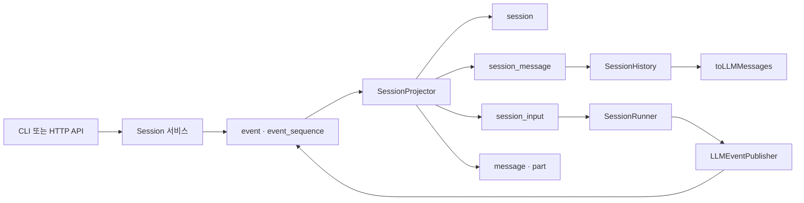
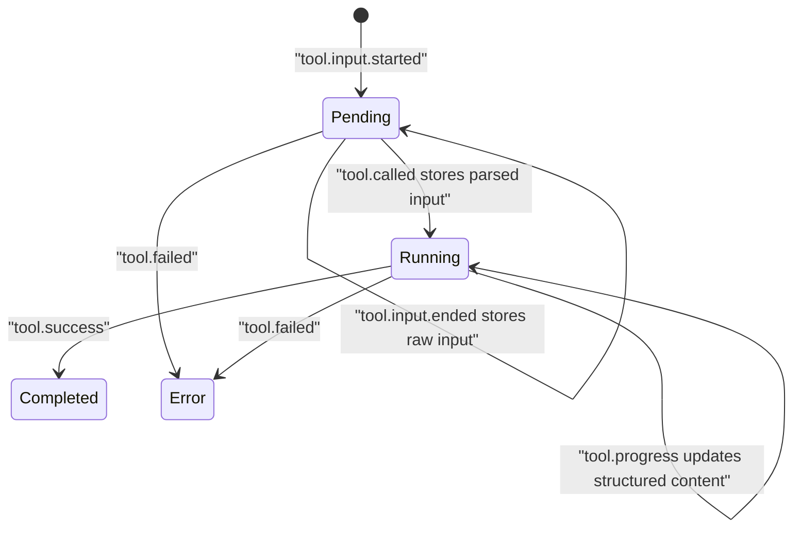
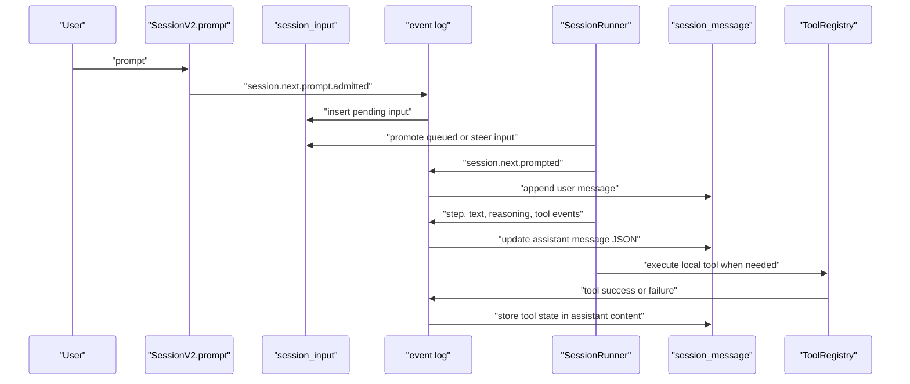

# OpenCode SQLite 세션 저장소 코드 분석

> 대상 저장소: [anomalyco/opencode](https://github.com/anomalyco/opencode)  
> 분석 기준: `dev` 브랜치 `077deb9d821e48d9612dea33b448b98b9444961c` (2026-06-26)  
> 로컬 clone: `.repos/opencode` (`.gitignore`의 `.repos/` 규칙으로 origin 업로드 제외)

## 1. 결론 요약

OpenCode는 로컬 SQLite에 세션 정보를 저장한다. 다만 최신 코드 기준으로는 대화 내역 저장 방식이 두 계층으로 나뉜다.

| 계층 | 주 테이블 | 현재 역할 |
|---|---|---|
| V2 세션 저장소 | `session`, `session_message`, `session_input`, `session_context_epoch`, `event`, `event_sequence` | 새 protocol/server 경로의 canonical 세션 저장소. 대화 메시지와 도구 호출은 `session_message.data` JSON에 투영된다. |
| Legacy V1 호환 저장소 | `message`, `part` | 기존 `packages/opencode/src/session` 경로의 메시지-파트 모델. 도구 호출은 `part.data`의 `type: "tool"` 파트로 저장된다. |

핵심은 **도구 호출 전용 테이블이 따로 없다는 점**이다. V2에서는 `session_message`의 assistant 메시지 JSON 내부 `content[]`에 `type: "tool"` 항목으로 저장되고, V1 legacy에서는 `part` 테이블의 JSON 내부 `type: "tool"` 파트로 저장된다.

## 2. DB 파일 위치와 초기화

SQLite 파일은 `Global.Path.data` 아래에 생성된다. `Global.Path.data`는 `xdg-basedir`의 data 경로에 `opencode`를 붙인 값이다. macOS라면 일반적으로 `~/Library/Application Support/opencode` 계열이고, Linux라면 `$XDG_DATA_HOME/opencode` 또는 `~/.local/share/opencode` 계열이다.

DB 파일명 결정 로직은 다음과 같다.

| 조건 | DB 경로 |
|---|---|
| `OPENCODE_DB=:memory:` | in-memory |
| `OPENCODE_DB`가 절대경로 | 해당 경로 |
| `OPENCODE_DB`가 상대경로 | `Global.Path.data/<OPENCODE_DB>` |
| release 채널이 `latest`, `beta`, `prod` 또는 `OPENCODE_DISABLE_CHANNEL_DB` 설정 | `Global.Path.data/opencode.db` |
| 그 외 채널 | `Global.Path.data/opencode-<channel>.db` |

DB layer는 시작 시 WAL과 foreign key를 켜고 migration을 적용한다.

```ts
PRAGMA journal_mode = WAL
PRAGMA synchronous = NORMAL
PRAGMA busy_timeout = 5000
PRAGMA cache_size = -64000
PRAGMA foreign_keys = ON
```

코드 근거:

- `Global.Path.data`: [packages/core/src/global.ts](https://github.com/anomalyco/opencode/blob/077deb9d821e48d9612dea33b448b98b9444961c/packages/core/src/global.ts#L10-L24)
- DB 파일명: [packages/core/src/database/database.ts](https://github.com/anomalyco/opencode/blob/077deb9d821e48d9612dea33b448b98b9444961c/packages/core/src/database/database.ts#L43-L55)
- SQLite PRAGMA와 migration 적용: [packages/core/src/database/database.ts](https://github.com/anomalyco/opencode/blob/077deb9d821e48d9612dea33b448b98b9444961c/packages/core/src/database/database.ts#L22-L36)

## 3. 전체 저장 구조



V2 경로는 event sourcing + projection 구조다.

1. 세션 생성, 사용자 입력, 모델 응답, 도구 호출, compaction, revert 같은 변화가 durable event로 `event`에 기록된다.
2. `SessionProjector`가 이벤트를 받아 조회용 테이블인 `session`, `session_message`, `session_input`, `session_context_epoch`에 반영한다.
3. UI/API는 `session_message`를 페이지네이션해서 읽고, runner는 `SessionHistory`로 active context를 재구성한다.

코드 근거:

- event log 테이블: [packages/core/src/event/sql.ts](https://github.com/anomalyco/opencode/blob/077deb9d821e48d9612dea33b448b98b9444961c/packages/core/src/event/sql.ts#L4-L25)
- projector의 `session_message` insert/update: [packages/core/src/session/projector.ts](https://github.com/anomalyco/opencode/blob/077deb9d821e48d9612dea33b448b98b9444961c/packages/core/src/session/projector.ts#L112-L209)
- projector 이벤트 구독 목록: [packages/core/src/session/projector.ts](https://github.com/anomalyco/opencode/blob/077deb9d821e48d9612dea33b448b98b9444961c/packages/core/src/session/projector.ts#L211-L459)

## 4. 실제 SQLite DDL 기준 테이블 스키마

아래 스키마는 `packages/core/src/database/schema.gen.ts`의 신규 DB 생성 DDL과 `packages/core/src/session/sql.ts`의 Drizzle 모델을 함께 확인한 것이다.

### 4.1 `session`

세션의 헤더와 집계 메타데이터를 저장한다. 대화 본문은 이 테이블에 없다.

| 컬럼 | 타입 | 설명 |
|---|---|---|
| `id` | `text primary key` | `ses_...` 형태 세션 ID |
| `project_id` | `text not null` | `project.id` FK |
| `workspace_id` | `text` | workspace 소유 세션이면 설정 |
| `parent_id` | `text` | fork 또는 child session parent |
| `slug` | `text not null` | UI용 slug |
| `directory` | `text not null` | 세션 실행 디렉터리 |
| `path` | `text` | 프로젝트 root 대비 상대 경로 |
| `title` | `text not null` | 세션 제목 |
| `version` | `text not null` | 생성 당시 OpenCode 버전 |
| `share_url` | `text` | 공유 URL |
| `summary_additions`, `summary_deletions`, `summary_files` | `integer` | diff summary 집계 |
| `summary_diffs` | `text` JSON | 파일 diff summary |
| `metadata` | `text` JSON | 사용자/API가 붙이는 세션 metadata |
| `cost` | `real default 0 not null` | 누적 비용 |
| `tokens_input`, `tokens_output`, `tokens_reasoning`, `tokens_cache_read`, `tokens_cache_write` | `integer default 0 not null` | 누적 토큰 |
| `revert` | `text` JSON | staged revert 상태 |
| `permission` | `text` JSON | 세션 permission ruleset |
| `agent` | `text` | 현재 agent ID |
| `model` | `text` JSON | `{ id, providerID, variant? }` |
| `time_created`, `time_updated` | `integer not null` | epoch millis |
| `time_compacting`, `time_archived` | `integer` | compaction/archive 시각 |

인덱스:

- `session_project_idx(project_id)`
- `session_workspace_idx(workspace_id)`
- `session_parent_idx(parent_id)`

코드 근거: [packages/core/src/session/sql.ts](https://github.com/anomalyco/opencode/blob/077deb9d821e48d9612dea33b448b98b9444961c/packages/core/src/session/sql.ts#L22-L66), [schema.gen.ts](https://github.com/anomalyco/opencode/blob/077deb9d821e48d9612dea33b448b98b9444961c/packages/core/src/database/schema.gen.ts#L182-L213)

### 4.2 `session_message`

V2 대화 타임라인의 핵심 테이블이다. message row 하나가 user, assistant, system, shell, compaction 등을 표현한다.

| 컬럼 | 타입 | 설명 |
|---|---|---|
| `id` | `text primary key` | `msg_...` 형태 메시지 ID |
| `session_id` | `text not null` | `session.id` FK, cascade delete |
| `type` | `text not null` | `user`, `assistant`, `system`, `shell`, `synthetic`, `compaction`, `agent-switched`, `model-switched` |
| `seq` | `integer not null` | session aggregate event sequence. timeline ordering 기준 |
| `time_created`, `time_updated` | `integer not null` | epoch millis |
| `data` | `text not null` JSON | `id`, `type`을 제외한 encoded `SessionMessage.Message` |

인덱스:

- unique `session_message_session_seq_idx(session_id, seq)`
- `session_message_session_type_seq_idx(session_id, type, seq)`
- `session_message_session_time_created_id_idx(session_id, time_created, id)`
- `session_message_time_created_idx(time_created)`

`data` JSON shape는 메시지 타입별로 달라진다.

| `type` | 주요 JSON 필드 |
|---|---|
| `user` | `metadata`, `time`, `text`, `files`, `agents` |
| `assistant` | `metadata`, `time`, `agent`, `model`, `content[]`, `snapshot`, `finish`, `cost`, `tokens`, `error` |
| `system` | `time`, `text` |
| `shell` | `metadata`, `time`, `callID`, `command`, `output` |
| `synthetic` | `sessionID`, `time`, `text` |
| `compaction` | `metadata`, `time`, `reason`, `summary`, `recent` |
| `agent-switched` | `metadata`, `time`, `agent` |
| `model-switched` | `metadata`, `time`, `model` |

코드 근거: [packages/core/src/session/sql.ts](https://github.com/anomalyco/opencode/blob/077deb9d821e48d9612dea33b448b98b9444961c/packages/core/src/session/sql.ts#L119-L138), [packages/schema/src/session-message.ts](https://github.com/anomalyco/opencode/blob/077deb9d821e48d9612dea33b448b98b9444961c/packages/schema/src/session-message.ts#L24-L209)

### 4.3 `session_message` 안의 도구 호출 JSON

V2에서 tool call은 `session_message.type = 'assistant'` row의 `data.content[]` 배열에 저장된다.

Assistant tool part shape:

| JSON path | 설명 |
|---|---|
| `content[].type` | 항상 `"tool"` |
| `content[].id` | provider/tool call ID |
| `content[].name` | tool 이름. 예: `read`, `bash`, `edit`, `webfetch` |
| `content[].provider.executed` | provider-hosted tool이면 `true`, local tool이면 보통 `false` |
| `content[].provider.metadata` | tool call 시 provider metadata |
| `content[].provider.resultMetadata` | tool result 시 provider metadata |
| `content[].state.status` | `pending`, `running`, `completed`, `error` |
| `content[].state.input` | parsed input 또는 pending raw JSON string |
| `content[].state.structured` | tool output의 structured channel |
| `content[].state.content` | tool output content array |
| `content[].state.outputPaths` | tool이 만든 파일 경로 |
| `content[].state.result` | provider-executed tool의 호환 result 또는 실패 result |
| `content[].state.error` | 실패 시 `{ type: "unknown", message }` |
| `content[].time.created`, `ran`, `completed`, `pruned` | tool lifecycle timestamp |

상태 전이는 이벤트 투영으로 이뤄진다.



코드 근거:

- tool schema: [packages/schema/src/session-message.ts](https://github.com/anomalyco/opencode/blob/077deb9d821e48d9612dea33b448b98b9444961c/packages/schema/src/session-message.ts#L81-L138)
- LLM event를 durable session event로 변환: [publish-llm-event.ts](https://github.com/anomalyco/opencode/blob/077deb9d821e48d9612dea33b448b98b9444961c/packages/core/src/session/runner/publish-llm-event.ts#L165-L408)
- durable event를 assistant JSON에 반영: [message-updater.ts](https://github.com/anomalyco/opencode/blob/077deb9d821e48d9612dea33b448b98b9444961c/packages/core/src/session/message-updater.ts#L249-L342)

### 4.4 `session_input`

V2의 durable input inbox다. 사용자 prompt가 즉시 대화 메시지로 들어가는 것이 아니라 먼저 admit되고, runner가 promote할 때 `session_message`의 user message로 투영된다.

| 컬럼 | 타입 | 설명 |
|---|---|---|
| `id` | `text primary key` | 최종 user message ID와 동일 |
| `session_id` | `text not null` | `session.id` FK |
| `prompt` | `text not null` JSON | prompt text, files, agents 등 |
| `delivery` | `text not null` | `steer` 또는 `queue` |
| `admitted_seq` | `integer not null` | input admission event sequence |
| `promoted_seq` | `integer` | 실제 prompted event sequence. `null`이면 pending |
| `time_created` | `integer not null` | epoch millis |

인덱스:

- `session_input_session_pending_delivery_seq_idx(session_id, promoted_seq, delivery, admitted_seq)`
- unique `session_input_session_admitted_seq_idx(session_id, admitted_seq)`
- unique `session_input_session_promoted_seq_idx(session_id, promoted_seq)`

코드 근거: [packages/core/src/session/sql.ts](https://github.com/anomalyco/opencode/blob/077deb9d821e48d9612dea33b448b98b9444961c/packages/core/src/session/sql.ts#L140-L166), [packages/core/src/session/input.ts](https://github.com/anomalyco/opencode/blob/077deb9d821e48d9612dea33b448b98b9444961c/packages/core/src/session/input.ts#L83-L160)

### 4.5 `session_context_epoch`

system context의 baseline과 snapshot을 저장한다. runner는 baseline sequence 이후의 system message만 다시 포함하는 방식으로 context를 재구성한다.

| 컬럼 | 타입 | 설명 |
|---|---|---|
| `session_id` | `text primary key` | `session.id` FK |
| `baseline` | `text not null` | 모델에 넣을 system baseline 문자열 |
| `snapshot` | `text not null` JSON | system context snapshot |
| `baseline_seq` | `integer not null` | baseline이 만들어진 event sequence |

코드 근거: [packages/core/src/session/sql.ts](https://github.com/anomalyco/opencode/blob/077deb9d821e48d9612dea33b448b98b9444961c/packages/core/src/session/sql.ts#L168-L176), [packages/core/src/session/history.ts](https://github.com/anomalyco/opencode/blob/077deb9d821e48d9612dea33b448b98b9444961c/packages/core/src/session/history.ts#L24-L99)

### 4.6 `event_sequence`, `event`

durable event log다. `aggregate_id`가 사실상 session ID이고, `seq`가 같은 session 내 ordering key다.

`event_sequence`

| 컬럼 | 타입 | 설명 |
|---|---|---|
| `aggregate_id` | `text primary key` | session aggregate ID |
| `seq` | `integer not null` | 최신 sequence |
| `owner_id` | `text` | sync 또는 ownership 관련 필드 |

`event`

| 컬럼 | 타입 | 설명 |
|---|---|---|
| `id` | `text primary key` | event ID |
| `aggregate_id` | `text not null` | `event_sequence.aggregate_id` FK |
| `seq` | `integer not null` | aggregate-local sequence |
| `type` | `text not null` | versioned event type |
| `data` | `text not null` JSON | event payload |

인덱스:

- unique `event_aggregate_seq_idx(aggregate_id, seq)`
- `event_aggregate_type_seq_idx(aggregate_id, type, seq)`

코드 근거: [packages/core/src/event/sql.ts](https://github.com/anomalyco/opencode/blob/077deb9d821e48d9612dea33b448b98b9444961c/packages/core/src/event/sql.ts#L4-L25)

### 4.7 Legacy `message`, `part`

기존 세션 서비스는 message header와 part body를 분리한다.

`message`

| 컬럼 | 타입 | 설명 |
|---|---|---|
| `id` | `text primary key` | V1 `msg_...` |
| `session_id` | `text not null` | `session.id` FK |
| `time_created`, `time_updated` | `integer not null` | epoch millis |
| `data` | `text not null` JSON | `id`, `sessionID`을 제외한 V1 `Info` |

`part`

| 컬럼 | 타입 | 설명 |
|---|---|---|
| `id` | `text primary key` | `prt_...` |
| `message_id` | `text not null` | `message.id` FK |
| `session_id` | `text not null` | denormalized session ID |
| `time_created`, `time_updated` | `integer not null` | epoch millis |
| `data` | `text not null` JSON | `id`, `messageID`, `sessionID`을 제외한 V1 `Part` |

V1 tool call은 `part.data`에 저장된다.

| JSON path | 설명 |
|---|---|
| `type` | `"tool"` |
| `callID` | provider call ID |
| `tool` | tool 이름 |
| `state.status` | `pending`, `running`, `completed`, `error` |
| `state.input` | tool input |
| `state.output` | completed output 문자열 |
| `state.metadata` | tool metadata |
| `state.attachments` | completed tool attachments |
| `metadata` | part-level metadata |

코드 근거:

- table model: [packages/core/src/session/sql.ts](https://github.com/anomalyco/opencode/blob/077deb9d821e48d9612dea33b448b98b9444961c/packages/core/src/session/sql.ts#L68-L98)
- V1 tool part schema: [packages/schema/src/v1/session.ts](https://github.com/anomalyco/opencode/blob/077deb9d821e48d9612dea33b448b98b9444961c/packages/schema/src/v1/session.ts#L259-L325)
- V1 message/part hydration: [packages/opencode/src/session/message-v2.ts](https://github.com/anomalyco/opencode/blob/077deb9d821e48d9612dea33b448b98b9444961c/packages/opencode/src/session/message-v2.ts#L82-L125)

### 4.8 `todo`

TodoWrite 도구의 세션별 작업 목록을 저장한다.

| 컬럼 | 타입 | 설명 |
|---|---|---|
| `session_id` | `text not null` | `session.id` FK |
| `content` | `text not null` | todo 내용 |
| `status` | `text not null` | 상태 |
| `priority` | `text not null` | 우선순위 |
| `position` | `integer not null` | session 내 ordering |
| `time_created`, `time_updated` | `integer not null` | epoch millis |

primary key는 `(session_id, position)`이다. 코드 근거: [packages/core/src/session/sql.ts](https://github.com/anomalyco/opencode/blob/077deb9d821e48d9612dea33b448b98b9444961c/packages/core/src/session/sql.ts#L100-L117)

## 5. V2 대화 저장 흐름



세부 흐름:

1. `SessionV2.prompt()`는 `SessionInput.admit()`을 호출해서 `session.next.prompt.admitted` durable event를 발행한다. 이 event는 `session_input`에 pending input으로 투영된다.
2. runner는 pending input을 `session.next.prompted`로 promote한다. projector는 `session_input.promoted_seq`를 채우고 `session_message`에 user message를 추가한다.
3. provider stream은 `createLLMEventPublisher()`를 통해 `session.next.text.*`, `session.next.reasoning.*`, `session.next.tool.*`, `session.next.step.*` 이벤트로 변환된다.
4. projector는 이벤트를 assistant message JSON에 누적 반영한다. text/reasoning/tool part가 모두 `data.content[]`에 들어간다.
5. tool call이 local tool이면 `ToolRegistry`가 실행하고 결과를 다시 tool result event로 publish한다. provider-executed tool이면 provider result가 `state.result`에 더 강하게 보존된다.

코드 근거:

- prompt admission: [packages/core/src/session.ts](https://github.com/anomalyco/opencode/blob/077deb9d821e48d9612dea33b448b98b9444961c/packages/core/src/session.ts#L348-L365)
- prompt projection: [packages/core/src/session/projector.ts](https://github.com/anomalyco/opencode/blob/077deb9d821e48d9612dea33b448b98b9444961c/packages/core/src/session/projector.ts#L350-L375)
- publisher tool call/result 변환: [publish-llm-event.ts](https://github.com/anomalyco/opencode/blob/077deb9d821e48d9612dea33b448b98b9444961c/packages/core/src/session/runner/publish-llm-event.ts#L313-L408)
- assistant JSON 갱신: [message-updater.ts](https://github.com/anomalyco/opencode/blob/077deb9d821e48d9612dea33b448b98b9444961c/packages/core/src/session/message-updater.ts#L186-L342)

## 6. 읽기와 LLM context 재구성

V2 API의 메시지 페이지네이션은 `seq` 기준이다. cursor가 들어오면 cursor message의 `seq`를 찾고, 그보다 앞/뒤 row를 `asc` 또는 `desc`로 읽는다.

```sql
SELECT *
FROM session_message
WHERE session_id = ?
ORDER BY seq DESC
LIMIT 50;
```

`SessionHistory.load()`는 단순 전체 조회가 아니다.

- 마지막 `compaction` message가 있으면 그 이후 메시지를 우선 사용한다.
- `session_context_epoch.baseline_seq` 이전 system message는 제외한다.
- runner용 context는 row의 `seq`와 decoded message를 같이 반환해 compaction과 baseline 판단에 쓴다.

LLM 요청 직전에는 `toLLMMessages()`가 `SessionMessage.Message[]`를 provider-neutral `@opencode-ai/llm` 메시지로 변환한다. 특히 tool part는 다음처럼 변환된다.

| 저장된 메시지 | LLM 변환 |
|---|---|
| `assistant.content[].type = "tool"` | assistant tool call part |
| local tool result | 별도 tool result message로 분리 |
| provider-executed tool result | assistant content 안에 call과 result를 함께 포함 |
| `compaction` | `<conversation-checkpoint>` user message |
| `shell` | `Shell command: ...` user message |

코드 근거:

- V2 messages query: [packages/core/src/session.ts](https://github.com/anomalyco/opencode/blob/077deb9d821e48d9612dea33b448b98b9444961c/packages/core/src/session.ts#L300-L333)
- active context filter: [packages/core/src/session/history.ts](https://github.com/anomalyco/opencode/blob/077deb9d821e48d9612dea33b448b98b9444961c/packages/core/src/session/history.ts#L24-L99)
- LLM 변환: [packages/core/src/session/runner/to-llm-message.ts](https://github.com/anomalyco/opencode/blob/077deb9d821e48d9612dea33b448b98b9444961c/packages/core/src/session/runner/to-llm-message.ts#L21-L170)

## 7. Legacy 경로와 V2 경로의 차이

최신 저장소에는 두 HTTP surface가 함께 있다.

| 경로 | 코드 | 저장 모델 |
|---|---|---|
| 새 protocol/server | `packages/server/src/handlers/*`, `packages/protocol/src/groups/*` | `SessionV2`, `session_message` |
| 기존 instance HTTP API | `packages/opencode/src/server/routes/instance/httpapi/*` | legacy `Session`, `message` + `part` |

legacy `Session`은 `SessionV1.Event.MessageUpdated`와 `SessionV1.Event.PartUpdated`를 publish하고, projector가 이를 `message`와 `part`에 upsert한다. 메시지를 읽을 때는 `MessageV2.page()`가 `message`를 페이지 단위로 읽고, 관련 `part`를 `message_id`로 묶어 hydrate한다.

코드 근거:

- legacy message/part update: [packages/opencode/src/session/session.ts](https://github.com/anomalyco/opencode/blob/077deb9d821e48d9612dea33b448b98b9444961c/packages/opencode/src/session/session.ts#L634-L648)
- legacy message page/hydration: [packages/opencode/src/session/message-v2.ts](https://github.com/anomalyco/opencode/blob/077deb9d821e48d9612dea33b448b98b9444961c/packages/opencode/src/session/message-v2.ts#L430-L521)
- legacy session messages wrapper: [packages/opencode/src/session/session.ts](https://github.com/anomalyco/opencode/blob/077deb9d821e48d9612dea33b448b98b9444961c/packages/opencode/src/session/session.ts#L833-L856)

## 8. 로컬 DB 조사용 SQL

SQLite JSON1이 활성화되어 있으면 다음 쿼리로 주요 데이터를 확인할 수 있다.

### V2 세션 목록

```sql
SELECT
  id,
  title,
  directory,
  path,
  agent,
  json_extract(model, '$.providerID') AS provider_id,
  json_extract(model, '$.id') AS model_id,
  cost,
  tokens_input,
  tokens_output,
  time_created,
  time_updated
FROM session
ORDER BY time_updated DESC
LIMIT 20;
```

### V2 대화 메시지 타임라인

```sql
SELECT
  seq,
  id,
  type,
  json_extract(data, '$.time.created') AS message_time,
  CASE
    WHEN type = 'user' THEN json_extract(data, '$.text')
    WHEN type = 'assistant' THEN json_array_length(json_extract(data, '$.content'))
    WHEN type = 'system' THEN json_extract(data, '$.text')
    WHEN type = 'compaction' THEN json_extract(data, '$.summary')
    ELSE NULL
  END AS preview
FROM session_message
WHERE session_id = :session_id
ORDER BY seq ASC;
```

### V2 도구 호출 목록

```sql
SELECT
  sm.seq,
  sm.id AS assistant_message_id,
  json_extract(part.value, '$.id') AS call_id,
  json_extract(part.value, '$.name') AS tool_name,
  json_extract(part.value, '$.state.status') AS status,
  json_extract(part.value, '$.state.input') AS input,
  json_extract(part.value, '$.provider.executed') AS provider_executed,
  json_extract(part.value, '$.state.outputPaths') AS output_paths
FROM session_message AS sm,
     json_each(sm.data, '$.content') AS part
WHERE sm.session_id = :session_id
  AND sm.type = 'assistant'
  AND json_extract(part.value, '$.type') = 'tool'
ORDER BY sm.seq ASC;
```

### V2 durable event log

```sql
SELECT seq, type, data
FROM event
WHERE aggregate_id = :session_id
ORDER BY seq ASC;
```

### Pending input

```sql
SELECT id, delivery, admitted_seq, promoted_seq, time_created, prompt
FROM session_input
WHERE session_id = :session_id
ORDER BY admitted_seq ASC;
```

### Legacy 도구 호출 목록

```sql
SELECT
  p.id AS part_id,
  p.message_id,
  json_extract(p.data, '$.tool') AS tool_name,
  json_extract(p.data, '$.callID') AS call_id,
  json_extract(p.data, '$.state.status') AS status,
  json_extract(p.data, '$.state.input') AS input,
  json_extract(p.data, '$.state.output') AS output
FROM part AS p
WHERE p.session_id = :session_id
  AND json_extract(p.data, '$.type') = 'tool'
ORDER BY p.time_created ASC, p.id ASC;
```

## 9. 엔지니어 관점 평가

### 장점

- `event`와 projection table을 분리해 replay, SSE event subscription, future sync를 고려한 구조다.
- `session_message.seq`가 event sequence와 연결되어 cursor pagination과 revert boundary 계산이 안정적이다.
- tool lifecycle이 `pending` -> `running` -> `completed/error`로 명확하며, local tool과 provider-executed tool을 같은 assistant content 모델로 흡수한다.
- `session_input` inbox가 있어 active run 중 사용자의 steer input과 queued input을 분리할 수 있다.
- session aggregate에 cost/tokens를 denormalize해 session list에서 빠르게 표시할 수 있다.

### 약점과 주의점

- 핵심 payload 대부분이 `text` JSON이다. SQLite 레벨에서 tool name, status, metadata에 대한 typed column이나 generated index가 없으므로 ad hoc 분석 쿼리는 JSON scan 비용을 낸다.
- V2와 legacy V1 모델이 공존한다. 어떤 API surface를 분석하느냐에 따라 `session_message`와 `message/part` 중 읽어야 할 테이블이 달라진다.
- 일부 migration은 V2 projection state를 삭제하고 재구성하는 형태다. 과거 개발 채널 DB를 직접 분석할 때는 `migration` 적용 이력을 같이 봐야 한다.
- 도구 호출이 assistant message JSON 내부 배열에 들어가므로, “특정 도구가 호출된 모든 세션” 같은 전역 분석은 JSON1 쿼리 또는 별도 ETL이 필요하다.

### 비교 대상

| 도구 | 저장 모델 관점 비교 |
|---|---|
| Claude Code | 외부 공개 코드 기준으로 로컬 세션 파일과 프로세스 로그 중심 분석이 많다. OpenCode는 SQLite schema가 코드에 명확하다. |
| Aider | Git 중심 작업 로그와 chat history 파일 성격이 강하다. OpenCode는 tool lifecycle과 session metadata를 더 구조화한다. |
| Continue, Cursor 계열 | IDE state와 provider conversation이 섞이는 경우가 많다. OpenCode는 CLI/server session aggregate를 독립 DB로 둔다. |

## 10. 소스 레퍼런스

- Repository: [anomalyco/opencode](https://github.com/anomalyco/opencode)
- Drizzle session tables: [packages/core/src/session/sql.ts](https://github.com/anomalyco/opencode/blob/077deb9d821e48d9612dea33b448b98b9444961c/packages/core/src/session/sql.ts)
- Generated SQLite DDL: [packages/core/src/database/schema.gen.ts](https://github.com/anomalyco/opencode/blob/077deb9d821e48d9612dea33b448b98b9444961c/packages/core/src/database/schema.gen.ts)
- V2 message schema: [packages/schema/src/session-message.ts](https://github.com/anomalyco/opencode/blob/077deb9d821e48d9612dea33b448b98b9444961c/packages/schema/src/session-message.ts)
- Session projector: [packages/core/src/session/projector.ts](https://github.com/anomalyco/opencode/blob/077deb9d821e48d9612dea33b448b98b9444961c/packages/core/src/session/projector.ts)
- LLM event publisher: [packages/core/src/session/runner/publish-llm-event.ts](https://github.com/anomalyco/opencode/blob/077deb9d821e48d9612dea33b448b98b9444961c/packages/core/src/session/runner/publish-llm-event.ts)
- Session history and LLM conversion: [history.ts](https://github.com/anomalyco/opencode/blob/077deb9d821e48d9612dea33b448b98b9444961c/packages/core/src/session/history.ts), [to-llm-message.ts](https://github.com/anomalyco/opencode/blob/077deb9d821e48d9612dea33b448b98b9444961c/packages/core/src/session/runner/to-llm-message.ts)
- Legacy V1 schema: [packages/schema/src/v1/session.ts](https://github.com/anomalyco/opencode/blob/077deb9d821e48d9612dea33b448b98b9444961c/packages/schema/src/v1/session.ts)
