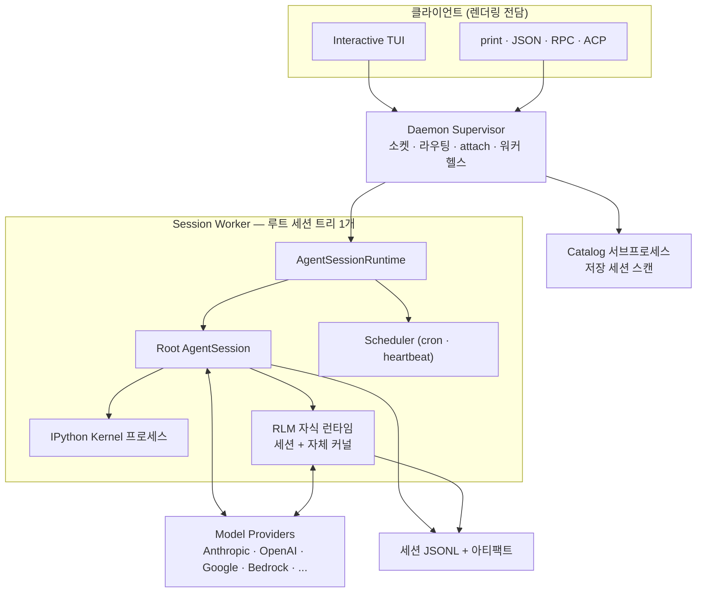
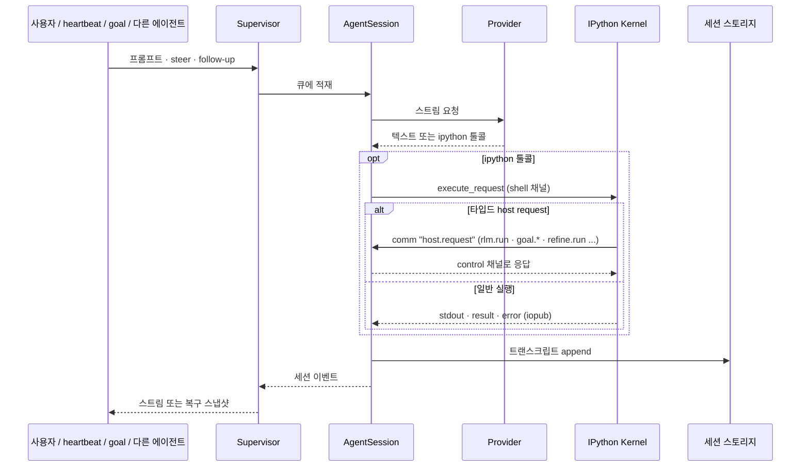
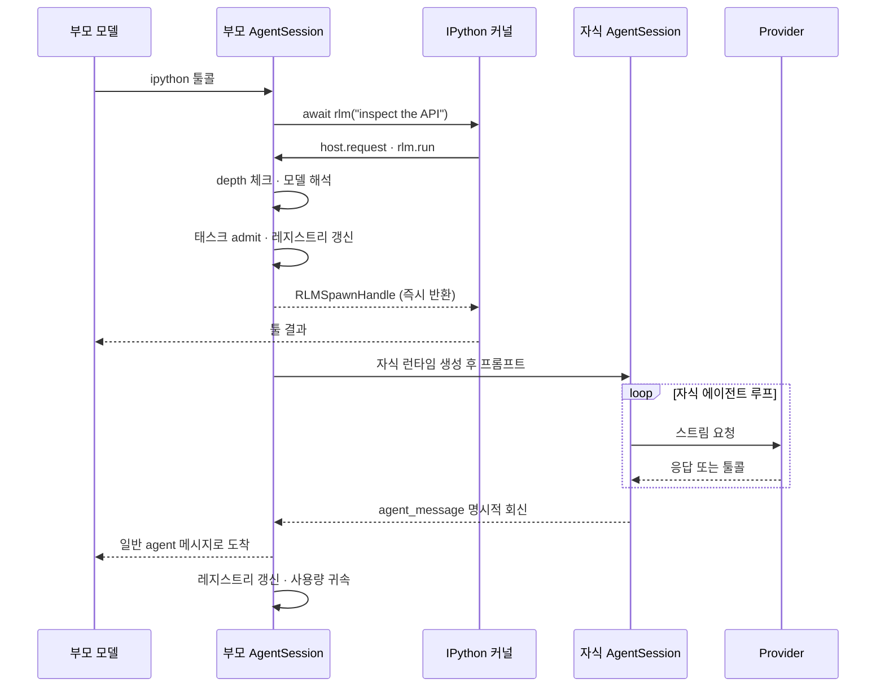
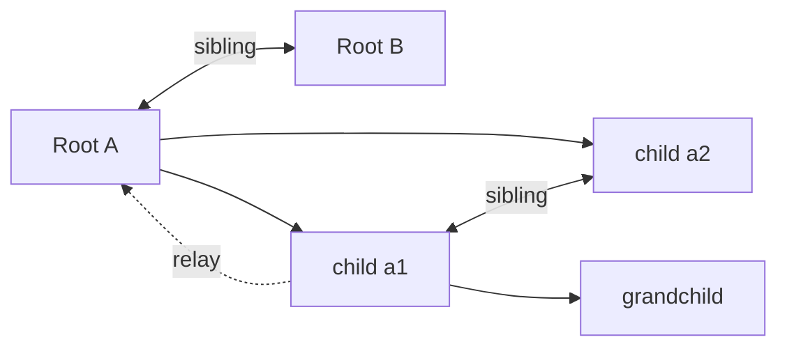

# Prime Agent 코드 레벨 분석

> **Prime Agent** — Prime Intellect가 2026-08-05에 공개한 self-improving RLM 하네스
> Repo: [PrimeIntellect-ai/prime-agent](https://github.com/PrimeIntellect-ai/prime-agent) · MIT · v0.8.1 (분석 시점 커밋 `5146337`, 2026-08-25)
> Paper: [arXiv:2608.23552](https://arxiv.org/abs/2608.23552)

관련 문서: **[자가발전(Continual Harness) 심층 분석](self-improvement.md)** ← 자기개선 메커니즘만 따로 다룬 문서

---

## 1. 프로젝트 개요

### 한 줄 정의

Prime Agent는 **"모델에게 툴 목록 대신 살아있는 IPython 커널 하나를 주고, 그 커널 안에서 파일·셸·서브에이전트·컨텍스트 관리를 전부 코드로 하게 만든"** 코딩/리서치 에이전트 하네스다. 여기에 **세션을 넘어 살아남는 편집 가능한 상태 계층(Continual Harness)** 을 붙여, 에이전트가 자기 스캐폴딩을 스스로 고쳐 쓰게 한다.

### 해결하려는 문제

| 기존 하네스의 한계 | Prime Agent의 대응 |
|---|---|
| 툴 스키마가 고정 → 새 능력마다 새 툴 정의 필요, 토큰 낭비 | 툴은 **단 하나(`ipython`)**. 나머지는 커널 안의 Python 함수 |
| 툴 결과가 전부 컨텍스트로 들어옴 → 대용량 출력이 컨텍스트를 태움 | **context-as-a-variable**: 결과를 Python 변수에 담고 필요한 조각만 출력 |
| 서브에이전트가 별도 툴/프로토콜 | `await rlm("sub-task")` — **함수 호출**이 곧 서브에이전트 |
| 프롬프트·스킬·메모리가 사람이 손으로 튜닝하는 정적 자산 | **Continual Harness**: 에이전트가 CRUD 가능한 durable state |
| 터미널 닫으면 세션 종료 | **데몬 백드 워커** — detach/reattach, 크래시 복구 |

### 탄생 배경

Prime Intellect는 분산 학습(INTELLECT 시리즈)·RL 인프라(`prime-rl`)·환경 허브(`verifiers`)를 만드는 회사다. 이들에게 하네스는 **"모델의 진짜 상한을 재는 측정 장비"** 다. 논문 표현대로 *harness limitation과 model limitation을 분리*하는 것이 목표다. 실제로 빌트인 스킬 중 하나가 `prime-intellect`(verifiers 환경 생성, 평가, Hosted Training 연동)이며, 이는 이 하네스가 **RL 환경/평가 루프를 돌리기 위한 도구**로도 설계되었음을 보여준다.

TUI와 에이전트 코어는 [`earendil-works/pi`](https://github.com/earendil-works/pi)를 포크·확장한 것이다(패키지 이름이 여전히 `@earendil-works/pi-coding-agent`).

---

## 2. 두 개의 핵심 추상

### 2.1 RLM (Recursive Language Model)

Alex Zhang(MIT)이 2025-10에 제안한 개념([arXiv:2512.24601](https://arxiv.org/abs/2512.24601))의 프로덕션 구현. 두 가지 축이 있다.

- **prompt-as-a-variable** — 컨텍스트를 "모델이 읽는 텍스트"가 아니라 "Python이 다루는 데이터"로 취급
- **programmatic tool/sub-agent calling (PTC)** — 툴 호출과 서브 LLM 호출이 전부 `await` 표현식

```python
# 기존 하네스: grep 툴 호출 → 결과 5000줄이 전부 컨텍스트로
# RLM: 결과는 변수에, 컨텍스트에는 요약만
hits = [p for p in Path(".").rglob("*.py") if "retry(" in p.read_text()]
print(len(hits), hits[:5])          # 컨텍스트에 들어가는 건 이 6줄뿐
reviewer = await rlm(f"{hits[0]} 의 재시도 로직 감사", name="retry-audit")
```

### 2.2 Continual Harness

프롬프트 노트·메모리·스킬 설명·서브에이전트 스펙을 **CRUD 가능한 durable state**로 만든 계층. `/refine`이 트래젝토리를 읽고 작은 증거 기반 편집을 가한다. → 상세는 [self-improvement.md](self-improvement.md).

---

## 3. 아키텍처 분석

### 3.1 프로세스 토폴로지



**설계 결정 3가지**

1. **클라이언트는 실행을 소유하지 않는다.** TUI는 렌더링·입력만. 터미널을 닫아도 워커는 계속 돈다.
2. **워커 1개 = 루트 세션 트리 1개.** 크래시 폭발 반경이 루트 하나로 제한된다. 250ms → 1s → 5s 재시도 후 3회 실패 시 failed 마킹.
3. **커널은 별도 프로세스.** 단, 문서가 명시하듯 이건 **라이프사이클 격리이지 보안 샌드박스가 아니다.** 워커와 동일한 OS 권한으로 모델 생성 Python을 실행한다.

### 3.2 프롬프트 실행 흐름



프롬프트 출처가 사람이든 heartbeat든 cron이든 goal 연속이든 autonomous 모드든 **세션 큐 이후 경로는 완전히 동일**하다. 이게 "long-running work"의 구조적 토대다.

### 3.3 왜 host request 응답이 control 채널인가 (핵심 설계 디테일)

```python
handle = await rlm("subtask")   # 셀 실행 중에 호스트 응답을 기다림
```

IPython 커널은 **shell 메시지를 직렬 처리**한다. 만약 호스트가 admission 응답을 shell 채널로 보내면:

- 실행 중인 `execute_request`는 응답이 와야 끝남
- 커널은 `execute_request`가 끝나야 그 응답을 처리함
- → **데드락**

그래서 Python shim이 `control_handlers`에 `comm_msg`/`comm_close`를 등록하고, 호스트는 **control 채널**로 응답한다. control 핸들러가 다른 스레드에서 돌 수 있으므로 future 해소는 `loop.call_soon_threadsafe()`로 한다.

```python
# prime-agent-runtime/src/rlm/__init__.py
def _install_control_comm_handlers() -> None:
    control_handlers.setdefault("comm_msg", comm_manager.comm_msg)
    control_handlers.setdefault("comm_close", comm_manager.comm_close)
```

이 한 가지가 "REPL 안에서 서브에이전트를 await한다"는 추상을 실제로 성립시키는 지점이다.

### 3.4 서브에이전트 위임 흐름



**중요한 비대칭**: `rlm()`은 **admission 시점에 즉시 반환**하고 자식의 답을 절대 반환하지 않는다. 결과는 오직 `agent_message` 회신이나 파일로만 온다.

이유는 명확하다 — 부모가 `await`로 자식 완료를 기다리면 턴이 열린 채 블록되고, 그 사이 부모는 아무 일도 못 한다. 시스템 프롬프트가 이를 강하게 못박는다:

> "Do not keep the turn open by polling with `time.sleep()` or shell `sleep`, and do not replace polling with a long blocking `await`."

`RLMSpawnHandle`은 `rlm_child_id`, `name`, `session_dir`, `model` 4개 필드만 담는다. 사용량/완료 데이터는 없다.

---

## 4. 기술 스택

| 레이어 | 기술 |
|---|---|
| 런타임 | Node.js ≥ 22.8, npm workspaces 모노레포, Bun(`bun build --compile`)으로 단일 바이너리 |
| 언어 | TypeScript 7 (`@typescript/native-preview` = tsgo) |
| 린트/포맷 | Biome 2.5 |
| 커널 | Python 3.11 + `ipykernel`, `uv` 관리 venv (`~/.prime/agent/kernel-venv`) |
| 커널 통신 | ZeroMQ + Jupyter wire protocol (shell / iopub / control), HMAC-SHA256 서명 |
| 커널 상태 직렬화 | `dill` (변수 단위 pickle) |
| Python 런타임 shim | `prime-agent-runtime` (`rlm` 패키지) — `ipykernel`, `mcp>=2`, `nest-asyncio`, `tyro` |
| 프로바이더 | Anthropic, OpenAI(Completions/Responses/Codex), Google(Gemini/Vertex), Bedrock, Azure, Mistral, Cloudflare, OpenRouter |
| 프로토콜 | 자체 daemon protocol v4 (JSONL), ACP(Agent Client Protocol), MCP |
| 배포 | `curl | sh` 인스톨러(SHA-256 검증), GitHub Releases 바이너리 |

### 코드 규모 (src 기준, 테스트 제외)

| 패키지 | LOC | 역할 |
|---|---:|---|
| `packages/coding-agent` | 121,422 | 하네스 본체 — 세션·커널·리파인먼트·데몬·모드 |
| `packages/ai` | 35,686 | 프로바이더 추상화·모델 카탈로그·MCP·OAuth |
| `packages/tui` | 14,635 | 터미널 UI 프리미티브 |
| `packages/agent` | 2,326 | 에이전트 루프 코어 |
| `prime-agent-runtime` | 2,226 | Python 커널 shim (`rlm`, harness, mcp) |

단일 파일 `agent-session.ts`가 **11,748줄**이다. 세션 라이프사이클, RLM 정책, 리파인먼트 오케스트레이션, 목표, 컴팩션, 자율 모드가 전부 여기 모여 있다 — 이 프로젝트의 가장 큰 구조적 부채.

---

## 5. 핵심 코드 분석

### 5.1 단일 툴: `ipython`

커널 부트스트랩 코드가 `rlm`과 설치된 Python 스킬을 네임스페이스에 심는다:

```python
# packages/coding-agent/src/core/tools/ipython.ts — RLM_BOOTSTRAP_BASE_CODE
import asyncio
import os as _prime_agent_os
_prime_agent_os.environ["NO_COLOR"] = "1"
get_ipython().colors = "nocolor"

import nest_asyncio as _prime_agent_nest_asyncio
_prime_agent_nest_asyncio.apply()

import rlm as _prime_agent_rlm_module
rlm = _prime_agent_rlm_module.rlm       # callable 객체
import rlm.mcp as mcp
mcp.install_shutdown_hook()
```

이후 스킬들이 `importlib`로 pre-import되어 `edit`, `goal`, `refine`, `compact`, `agent_message`, `agent_observe`, `websearch`, `rlm_heartbeat` 등이 전부 전역 이름이 된다.

`%%bash` 셀은 일회용 서브셸이지만 Python 상태와 `%cd`는 유지된다 — 시스템 프롬프트가 이 구분을 명시적으로 가르친다.

### 5.2 커널 상태 스냅샷 (`state-snapshot.ts`)

세션 재개 시 커널은 새로 뜬다. 그러면 모델은 있다고 믿는 변수를 잃는다. 그래서 **변수 단위 dill 직렬화**:

- 전체 페이로드 상한 **256 MiB**, 변수당 **16 MiB**
- 하나가 pickle 불가(열린 파일·소켓·GPU 텐서)여도 그것만 skip하고 사유 기록 — 전체 스냅샷은 살아남음
- 산출물: `session-artifacts/<id>/kernel-state.dill` + `kernel-state.json` 매니페스트
- 컴팩션 시에는 16 MiB 초과 변수를 **prune**(커널에서 제거)한다 → 시스템 프롬프트가 "대용량 원본은 디스크에 두라"고 안내하는 이유

### 5.3 컴팩션

```
발동 조건:  contextTokens > contextWindow - reserveTokens   (reserve 기본 16,384)
보존 구간:  최신 메시지에서 역방향으로 keepRecentTokens(기본 20,000)까지
```

절차: cut point 탐색 → 요약 대상 추출 → LLM 요약(이전 요약을 iterative context로 전달) → `CompactionEntry` append(`firstKeptEntryId` 기록) → 세션 리로드.

세션 파일은 **append-only JSONL**이고 엔트리가 `id`/`parentId`로 트리를 이룬다. 컴팩션·브랜치·포크가 전부 **한 파일 안에서 leaf 포인터 조작**으로 처리된다 — 전체 히스토리는 디스크에 그대로 남아 프로그램적으로 접근 가능하다.

핵심: **컴팩션이 커널 상태를 지우지 않는다.** 대화는 요약되어도 변수·함수·임포트는 그대로다. 이게 RLM 모델에서 컴팩션의 손실이 기존 하네스보다 작은 이유다.

### 5.4 부모 스코프 서브에이전트 레지스트리

```python
children = await rlm.list_subagents()
for c in children:
    print(c.session_name, c.status, c.active_session_id)
await agent_message.send("추가 확인 부탁", receiver_role="child", receiver_name=c.session_name)
await rlm.delete_subagent(children[0])
```

- 레지스트리는 **TypeScript 부모가 authoritative**로 관리 — 커널 재시작·컴팩션·부모 복원을 살아남는다
- 완료된 데몬 백드 자식도 부모 세션이 열려 있는 동안 계속 주소 지정 가능 → 같은 컨텍스트로 후속 턴을 이어감
- 삭제는 tombstone을 쓰고 메시징/관측에서 제거하지만 **디스크의 트랜스크립트는 지우지 않음**
- 기본 `RLM_MAX_DEPTH = 2` (루트 → 자식 → 손자, 손자는 더 못 낳음)

### 5.5 사용량 귀속

자식의 사용량/비용은 **비동기로 부모의 해당 assistant 턴에 폴딩**되고, `child_usage_attributed` 엔트리로 트랜스크립트에 영속화된다. 리로드 시 재적용된다.

context-tree 리포팅은 노드별 own usage를 보여줄 때 귀속된 자식 사용량을 **뺀다**. 결과적으로:
- 과금 총액은 늘어나되
- **부모 모델의 컨텍스트 윈도우 측정치는 부풀지 않는다**

### 5.6 에이전트 간 메시징



- 도달 범위는 **핵가족(parent · siblings · direct children)** 으로 제한. 루트끼리는 sibling
- 더 깊은 통신은 중간 자식을 통해 relay
- sender identity는 데몬이 세션에서 **유도**한다 — `from` 필드 스푸핑 불가
- 항상 **steering 전달**: 바쁜 대상도 실행 중에 메시지를 본다. `deliveryStatus`는 `delivered` 또는 `queued`

### 5.7 Long-running 기능군

| 기능 | 구현 |
|---|---|
| **Goal** | 영속 목표 + 토큰 예산. 상태/회계/연속 프롬프팅은 호스트, 커널은 `goal.get/create/complete` 씬 클라이언트 |
| **Heartbeat** | 사용자용 `/heartbeat`와 에이전트 소유 `rlm_heartbeat` 분리. 후자는 라벨·인터벌·`steer`/`follow_up` 전달모드 |
| **Schedule** | 세션별 `scheduled-jobs.json`. tick은 프롬프트 전달 **전에** claim·advance → 크래시가 불확실한 프롬프트를 재생하지 않음 |
| **Autonomous** | 기본 상한: continuations 3, turns 12, tokens 80k, 30분. `--autonomous-gate "npm run check"` 로 품질 게이트(재시도 3회, 5분 타임아웃). 게이트 실패 시 git worktree 스냅샷(status/diff/untracked hash) 보존 |

`autonomous`의 연속 프롬프트가 흥미롭다:

> "If you believe you are blocked, **prove it with host-observable evidence**, preserve that evidence, and keep looking for safe progress while budget remains. Do not end the session yourself; the verifier/evaluator decides completion."

문서도 정직하게 못박는다 — *"A passed gate checks only what that gate verifies; reaching a limit does not imply task success."*

---

## 6. API 및 인터페이스

### CLI

```bash
prime-agent                          # TUI
prime-agent agents                   # 실행중·유휴·저장 세션 브라우징
prime-agent attach <agent>           # 재접속
prime-agent --resume [path|id]
prime-agent status | doctor [--fix] | update | shutdown [--force]
prime-agent --autonomous --autonomous-gate "npm run check" --autonomous-max-turns 20 "task"
```

### 모드

| 모드 | 용도 |
|---|---|
| Interactive TUI | 기본 |
| print / piped stdin | 원샷 헤드리스 |
| JSON | 구조화 출력 |
| RPC | LF-구분 JSONL, EOF까지 프롬프트 수신 |
| ACP | Agent Client Protocol — 에디터 통합 |
| SDK | in-process `AgentSessionRuntime` (직렬화 불가한 extension factory 전달용) |

### 커널 Python API

```python
rlm(prompt, name=..., model=..., thinking=...)   # == rlm.run(...)
rlm.find_models(query="", limit=8)
rlm.list_subagents() / rlm.delete_subagent(sel)
rlm.host_request(type, payload)                  # 범용 호스트 브릿지
rlm.harness                                      # Continual Harness CRUD
mcp.list_tools(server) / mcp.call_tool(server, tool, args)
```

**알려지지 않은 옵션은 무시되지 않고 실패한다.** 모델 검색은 유효한 크레덴셜 범위로 한정되며, 정확한 셀렉터가 불가하면 **다른 모델로 조용히 폴백하지 않고 spawn 자체가 실패**한다. 이 "silent fallback 금지" 원칙이 코드 전반에 일관되게 적용되어 있다.

---

## 7. 확장성

### 7.1 스킬 — markdown + Python 백드

```
my-skill/
├── SKILL.md          # 필수: YAML frontmatter + 지시문
├── pyproject.toml    # 이게 있으면 Python 백드로 승격
└── src/my_skill/__init__.py
```

- [Agent Skills 표준](https://agentskills.io/specification) 준수 + Python 확장
- 시작 시 **name/description만** 시스템 프롬프트에 → progressive disclosure
- Python 백드 스킬은 커널 venv에 editable 설치 → `await my_skill(...)` 로 직접 호출
- `[project.scripts] word_count = "rlm.skill:cli"` 로 CLI도 자동 생성
- 로딩 우선순위: `--skill` > settings > project(`.prime/agent/skills/`, `.agents/skills/`) > global > package > built-in
- description이 비면 **조용히 로드되지 않음**

빌트인 13개: `agent-message`, `agent-observe`, `attach-image`, `compact`, `edit`, `goal`, `linear`, `notion`, `prime-intellect`, `refine`, `rlm-heartbeat`, `skill-creator`, `websearch`

### 7.2 Extension 훅

`session_before_refine`, `refine_complete`, `before_provider_request`, `after_provider_response`, `tool_call`, `session_compact`, `session_before_tree`, `context` 등 30여 개. 특히 `session_before_refine`은 **빌트인 리파인먼트 플래너를 통째로 교체**할 수 있다:

```ts
interface SessionBeforeRefineResult {
  skip?: boolean;              // 이번 라운드 건너뜀
  proposal?: RefinementProposal; // 플래너 대체 (apply 시 검증은 그대로)
}
```

### 7.3 MCP

두 경로가 있다:
- 커널의 `mcp` 객체 (`await mcp.list_tools("srv")` → `await mcp.call_tool(...)`)
- 네이티브 툴 네임스페이스가 아니라 **Python 객체로 노출** — RLM 철학의 일관된 적용

---

## 8. 성능 특성

### 자체 보고 벤치마크

| 벤치마크 | 모델 | 결과 |
|---|---|---|
| ARC-AGI-3 (RHAE Best@1) | Opus 5 | **95.5%** — 인간 전문가 baseline 95.4% 상회. 3회 런 95.0 / 95.2 / 95.5, Best@3 99.97%, 183/183 레벨 클리어 |
| ARC-AGI-3 (baseline 대비) | — | 30% → 95.5% |
| Long-context 스위트 (9개) | GLM-5.2 | Pi-mono 대비 8/9 우세 |
| Long-context 스위트 | Opus 5 | Claude Code 대비 6/9 우세 |
| Long-context 스위트 | GPT-5.6 Sol | Codex 대비 6/9 우세 |
| 기타 | — | EmulatorBench(Rust 에뮬레이터), PMPP-Hard(GPU 커널), Factorio(익스플로잇 자동화 발견), MazeBench(3D 공간추론) |

> ⚠️ **전부 벤더 자체 보고이며 외부 재현이 없다.** 특히 ARC-AGI-3는 "vendor-reported vs measured" 격차를 잡으려고 만든 벤치마크라서, 자체 보고 95.5%는 그 자체로 신중하게 봐야 한다. 다만 "이득이 벤치마크 특수적이지 않다(여러 모델·여러 벤치마크에서 자사 하네스 대비 개선)"는 주장은 검증 가능한 형태로 제시되어 있다.

### 스케일링 제약

- **커널 셀은 동시 실행 불가.** `KernelManager.execute()`는 직렬화된다. 커널 하나 = 네임스페이스 하나. 단 RLM 자식은 각자 comm과 런타임을 쓰므로 병렬 가능
- **RLM depth 기본 2** — 무한 재귀 방지
- 워커/세션/클라이언트 수에는 고정 상한 없음
- 컴팩션 시 16 MiB 초과 변수 prune
- `/refine` 출력 예산: `min(model.maxTokens, 32,000)`, auto-review는 4,096

---

## 9. 배포 및 운영

```bash
curl -fsSL https://app.primeintellect.ai/prime-agent/install.sh | sh
```

인스톨러(45KB 셸 스크립트)가 버전 릴리스를 받고 SHA-256을 검증한 뒤 `prime-agent` 커맨드를 설치하고 IPython 런타임을 준비한다.

### 커널 Python 해석 순서

1. `PRIME_AGENT_KERNEL_PYTHON` (단, `ipykernel` import 가능해야)
2. `~/.prime/agent/kernel-venv/bin/python` — `uv`로 부트스트랩
3. `~/.prime` 쓰기 불가 시 XDG 데이터 경로

부트스트랩 마커(`.bootstrap-version`, 스키마 v8)로 stale 환경을 감지하고, 락 파일로 동시 부트스트랩을 직렬화한다. 부트스트랩 후 `RUNTIME_READY_CHECK`가 `rlm`의 모든 필수 심볼(harness 메서드, `reference`/`scope` 필드, `global_` 파라미터)을 assert로 검증한다 — 버전 스큐를 조용히 넘기지 않는다.

### 디렉터리 레이아웃

```text
~/.prime/agent/
├── sessions/<root-session-id>.jsonl
├── session-artifacts/<root-session-id>/
│   ├── kernel-state.dill / kernel-state.json
│   ├── scheduled-jobs.json
│   ├── harness/harness_state.json        # 세션 로컬 하네스 상태
│   └── sub-xxxxxxxx/<child-session-id>.jsonl
├── harness/                              # 글로벌 하네스 상태 + refinements.jsonl
├── kernel-venv/
└── skills/
```

### 보안 경계 (문서가 명시적으로 경고)

> "Prime Agent executes model-generated Python and project commands with your user permissions. Its worker and kernel processes improve lifecycle isolation and recovery; they are **not** a security sandbox."

- 프로바이더 크레덴셜은 TypeScript 호스트가 소유. 모델 카탈로그는 메타데이터만 Python으로 넘어가고 **auth store는 넘어가지 않는다**
- Jupyter 프레임은 HMAC-SHA256 서명
- 워커 디스크립터·토큰은 owner-only 퍼미션
- 신뢰할 수 없는 리포/지시문은 외부 샌드박스에서 돌리라고 권고

---

## 10. 경쟁·비교 분석

### 10.1 아키텍처 비교

| 축 | Prime Agent | Claude Code | Codex CLI | OpenHands | OpenCode |
|---|---|---|---|---|---|
| 모델 인터페이스 | **단일 `ipython` 툴** | 다중 툴 스키마 (Read/Edit/Bash/Task/Grep...) | 다중 툴 + apply_patch | 다중 툴 + 브라우저 | 다중 툴 |
| 서브에이전트 | `await rlm(...)` — 함수 호출, admission 즉시 반환 | Task 툴, 결과를 리턴 | 제한적 | 마이크로에이전트 | 제한적 |
| 컨텍스트 관리 | **변수로 보유** + 컴팩션 | 파일 기반 + 요약 | 요약 | 요약 | 요약 |
| 상태 지속성 | 커널 dill 스냅샷 + JSONL 트리 + 하네스 상태 | 세션 파일 + CLAUDE.md | 세션 | 이벤트 스트림 | SQLite |
| 자기개선 | **`/refine` LLM 파이프라인 + CRUD 하네스** | `#` 메모리(수동), CLAUDE.md | 없음 | 없음 | 없음 |
| 백그라운드 실행 | **데몬 워커, detach/reattach** | 세션 재개 | 세션 재개 | 서버 모드 | 서버 모드 |
| 에이전트 간 통신 | **핵가족 범위 직접 메시징** | 없음(부모 경유) | 없음 | 없음 | 없음 |
| 스킬 | markdown + **Python 패키지(호출 가능)** | markdown Agent Skills | AGENTS.md | 마이크로에이전트 | markdown |
| 샌드박스 | ❌ 명시적으로 아님 | seatbelt/bwrap 옵션 | 샌드박스 있음 | **Docker 격리** | 옵션 |
| 라이선스 | MIT | 상용 | Apache-2.0 | MIT | MIT |

### 10.2 "단일 툴 vs 다중 툴" 트레이드오프

**단일 `ipython`의 이득**
- 새 능력 = 새 Python 함수. 툴 스키마 재정의·재학습 불필요
- 툴 결과를 조합·필터·변환하는 로직이 모델의 **코드**로 표현됨 (자연어 계획보다 정밀)
- 대용량 중간 결과가 컨텍스트를 태우지 않음
- 컴팩션 후에도 작업 상태(변수)가 살아남음

**대가**
- **모델 의존성이 크다.** 코드로 사고하지 못하는 모델은 오히려 손해. RLM 원논문도 math-python에서 성능 하락을 보고했고 "학습이 필요하다"고 결론
- 툴 스키마가 주던 **구조적 가드레일이 사라진다.** 잘못된 Python 한 줄이 파일을 지울 수 있고, 샌드박스가 없으니 방어선이 얇다
- 디버깅·감사 난이도 상승 — "무슨 툴을 몇 번 불렀나"가 아니라 "무슨 코드를 실행했나"를 봐야 함
- Python/IPython 부트스트랩이 필수 의존성 (Node만으로 안 됨)

### 10.3 이 리포지토리 내 관련 문서

- [Claude Code 아키텍처 분석](../claude-code/ARCHITECTURE_ANALYSIS.md) · [메모리 시스템](../claude-code/memory-system-analysis.md) — 다중 툴 + CLAUDE.md 방식과의 대비
- [OpenCode vs ClaudeCode vs OpenHarness](../../ai-agents/agent-loops/opencode-vs-claudecode-vs-openharness.md) — 에이전트 루프 비교
- [Agent Skills 아키텍처](../../ai-agents/skills/agentskills-architecture.md) — Prime Agent가 확장한 표준
- [OpenSpace](../../ai-agents/openspace/README.md) · [GenericAgent](../../ai-agents/generic-agent/GenericAgent_심층분석.md) — 자기진화 스킬 엔진 계열

---

## 11. 종합 평가

### 강점

1. **RLM 추상이 제품 수준으로 구현되어 있다.** 개념 증명이 아니라, control-채널 데드락 회피·comm 라이프사이클·dill 스냅샷·사용량 귀속까지 프로덕션 디테일이 채워져 있다.
2. **"조용한 실패"를 거부하는 일관된 태도.** 모델 폴백 금지, 알려지지 않은 옵션 거부, 부트스트랩 심볼 assert, `mtime` 기반 하네스 충돌 감지 — 에러를 삼키지 않는다.
3. **Long-running이 후처리가 아니라 1급 설계.** 데몬·goal·heartbeat·schedule·autonomous가 전부 동일한 세션 큐로 수렴한다.
4. **자기개선이 감사 가능하다.** 명시적·영속적·되돌릴 수 있는 편집. before/after 스냅샷과 refinement 히스토리가 남는다 ([상세](self-improvement.md)).
5. **문서 품질이 이례적으로 높다.** `docs/` 34개 문서에 mermaid 다이어그램, 실패 모드 표, 소유권 표가 정리되어 있다. AGENTS.md는 자기 코드베이스를 에이전트가 다루는 규칙까지 담고 있다.

### 약점 / 리스크

1. **보안 샌드박스가 없다.** 모델 생성 Python이 사용자 권한으로 돈다. 문서가 정직하게 경고하지만, 자율 모드와 결합하면 위험도가 급상승한다. Codex CLI(샌드박스)·OpenHands(Docker)와 대비되는 명확한 약점.
2. **벤치마크가 전부 자체 보고.** 특히 ARC-AGI-3 95.5%는 외부 재현이 없다.
3. **`agent-session.ts` 11,748줄.** 세션·RLM·리파인먼트·목표·컴팩션·자율모드가 한 클래스에 뭉쳐 있다. 리파인먼트 동시성 제어만 봐도 `_refineInFlight`, `_refinePlanInFlight`, `_serializedPlanInFlight`, `_autoRefineBranchVersion`, `_serializedPlanClaim` 등 상태 플래그가 난립한다.
4. **모델 상한에 걸린 설계.** 코드로 사고하는 능력이 약한 모델에서는 다중 툴 하네스보다 나쁠 수 있다. "미래 모델을 앞서 가정한 설계(anticipates future model capabilities)"라는 표현 자체가 이 리스크의 자인이다.
5. **운영 복잡도.** Node + Python + uv + ZeroMQ + 데몬 + 커널 프로세스. `prime-agent doctor --fix`가 필요한 이유가 있다.
6. **자기개선의 결과 검증이 없다.** `expectedOutcome`을 쓰지만 **자동으로 검증하지 않는다**. 잘못된 학습이 축적될 여지 ([상세](self-improvement.md#8-한계와-리스크)).

### 적합 / 부적합

**적합**
- 장시간·다단계 리서치, 대규모 리팩터링, 벤치마크/평가 하네스
- 대용량 컨텍스트(로그·데이터셋·모노레포) 분석 — context-as-variable의 이득이 가장 큰 영역
- RL 환경 개발, 에이전트 실험 인프라 (Prime Intellect 생태계와의 결합)
- 병렬 서브에이전트가 필요한 fan-out 작업

**부적합**
- 신뢰할 수 없는 코드베이스/지시문 (샌드박스 부재)
- 짧은 단발성 편집 — IPython 커널 부팅 오버헤드가 이득보다 큼
- 규제·감사 요건이 강한 환경 (자기수정 프롬프트 상태의 추적성은 있으나 승인 워크플로가 없음)
- 코드 생성 능력이 약한 소형 모델

### 엔지니어 관점 인사이트

> **가장 배울 만한 것 하나를 꼽으면 "context-as-a-variable"이다.**
> 대부분의 에이전트 하네스는 툴 출력을 즉시 컨텍스트로 밀어 넣고 나중에 요약으로 손실 복구를 시도한다. Prime Agent는 출력을 **주소 지정 가능한 데이터**로 유지하고, 모델이 필요한 조각만 컨텍스트로 승격시킨다. 요약은 손실이고 변수는 무손실이다 — 이 차이가 long-context 작업에서 결정적이다.
> 이 아이디어는 Prime Agent를 쓰지 않아도 이식 가능하다. 툴을 REPL 뒤에 두고, 결과를 변수에 담고, 모델에게 슬라이싱을 시켜라.

두 번째 인사이트는 **`rlm()`의 비동기 admission 계약**이다. "서브에이전트 호출이 결과를 리턴한다"는 직관적 설계가 사실은 부모의 턴을 인질로 잡는다. Prime Agent는 이를 거부하고 admission handle만 돌려준 뒤 결과는 메시지로 받는다. 액터 모델에 가깝고, fan-out 병렬성이 자연스럽게 나온다.

---

## 참고 자료

- [PrimeIntellect-ai/prime-agent](https://github.com/PrimeIntellect-ai/prime-agent) (MIT)
- [Prime Agent: A Self-Improving RLM Harness (arXiv:2608.23552)](https://arxiv.org/abs/2608.23552)
- [Prime Intellect 블로그 — Prime Agent](https://www.primeintellect.ai/blog/prime-agent)
- [Prime Intellect 블로그 — RLM](https://www.primeintellect.ai/blog/rlm)
- [Recursive Language Models (Alex Zhang, arXiv:2512.24601)](https://arxiv.org/abs/2512.24601)
- [earendil-works/pi](https://github.com/earendil-works/pi) — TUI/에이전트 코어 원본
- [Agent Skills 표준](https://agentskills.io/specification)
