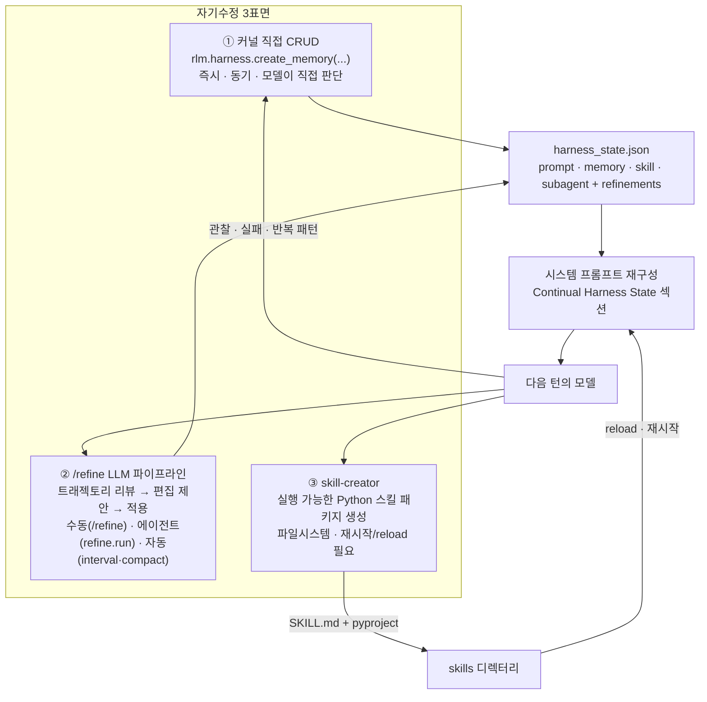
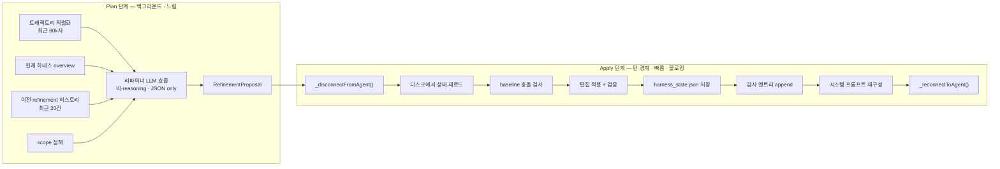
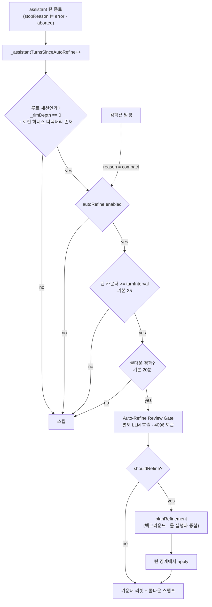

# Prime Agent 자가발전(Self-Improvement) 심층 분석

> 어떤 기술로, 어디까지, 어떻게 스스로를 고치는가 — Continual Harness와 `/refine` 파이프라인의 코드 레벨 해부
> 상위 문서: [Prime Agent 코드 레벨 분석](README.md)
> 분석 대상: v0.8.1 (`5146337`, 2026-08-25)

---

## 1. 먼저 경계부터 — "자가발전"이 아닌 것

마케팅 표현("self-improving")이 과대 해석되기 쉬우므로 코드가 실제로 허용하는 범위를 먼저 확정한다.

| 층위 | Prime Agent가 하는가 | 근거 |
|---|:---:|---|
| **모델 가중치 업데이트** | ❌ | 학습 코드 없음. 하네스는 순수 인퍼런스 클라이언트 |
| **자기 소스코드 수정** | ❌ | 리파이너 시스템 프롬프트: *"Never edit source files directly."* |
| **베이스 시스템 프롬프트 재작성** | ❌ | `validateEdit()`이 `id === "base_system_prompt"` 편집을 코드로 거부 |
| **보조 프롬프트 노트 CRUD** | ✅ | `kind: "prompt"` |
| **메모리 CRUD** | ✅ | `kind: "memory"` |
| **스킬 *설명/계약* CRUD** | ✅ | `kind: "skill"` (실행 코드가 아니라 라우팅 메타데이터) |
| **서브에이전트 스펙 CRUD** | ✅ | `kind: "subagent"` |
| **실행 가능한 새 스킬(Python 패키지) 생성** | △ | `skill-creator` 스킬로 가능하지만 파일 작성 + 사람 리뷰 경로 |

```ts
// packages/coding-agent/src/core/refinement/refinement.ts
function validateEdit(edit: RefinementEdit, computedId?: string): string | undefined {
	if (edit.kind === "prompt" && (edit.id === "base_system_prompt" || computedId === "base_system_prompt")) {
		return "base system prompt is not editable";
	}
	...
}
```

### 그래서 정확히 무엇인가

> **Prime Agent의 자가발전 = "베이스 프롬프트 주위의 스캐폴딩(보조 프롬프트·메모리·스킬 라우팅·서브에이전트 스펙)에 대한, 명시적이고(explicit) 영속적이며(persisted) 되돌릴 수 있는(reversible) 편집을, LLM이 자기 트래젝토리를 증거로 삼아 수행하는 것"**

즉 **아티팩트 레벨 자기수정(artifact-level self-modification)** 이다. 가중치(SEAL)도 아니고 소스코드(Darwin Gödel Machine)도 아니다. 그 중간 — 프롬프트 스캐폴딩 레이어를 CRUD 가능한 데이터로 승격시킨 것이 핵심 발명이다.

---

## 2. 세 개의 자기수정 표면



| | ① 커널 CRUD | ② `/refine` | ③ skill-creator |
|---|---|---|---|
| 주체 | 모델이 직접 코드로 | 별도 리파이너 LLM 호출 | 모델이 파일 작성 |
| 시점 | 셀 실행 중 즉시 | **턴 경계에서만** | 즉시(파일), 반영은 reload 후 |
| 산출물 | `harness_state.json` 엔트리 | 같은 파일 + 감사 로그 | Python 패키지 + `SKILL.md` |
| 되돌리기 | 수동 `delete_*` | **`/refine rollback <id>`** | git |
| `source` 필드 | `"agent"` | `"refine"` | — |
| 증거 요구 | 없음 | rationale·evidence·expectedOutcome 필수 | — |

---

## 3. 데이터 모델

### 3.1 `HarnessEntry`

```python
# prime-agent-runtime/src/rlm/harness.py
@dataclass
class HarnessEntry:
    id: str                                  # slug (title에서 자동 생성 가능)
    kind: HarnessKind                        # "prompt" | "memory" | "skill" | "subagent"
    title: str
    content: str
    path: str = "general"                    # 그룹핑 경로
    scope: HarnessScope = "local"            # "local" | "global"
    reference: dict = field(default_factory=dict)   # skill: {"type":"python","import":...,"callable":...}
    arguments: dict = field(default_factory=dict)   # skill: 입력 계약
    metadata: dict = field(default_factory=dict)
    source: str = "agent"                    # "agent" | "refine"
    created_at: str; updated_at: str
    version: int = 1                         # 업데이트마다 +1
```

### 3.2 `RefinementEvent` — 감사 기록

```python
@dataclass
class RefinementEvent:
    id: str          # refine_20260826T1230...
    trigger: str     # 요약 한 줄 (= proposal.summary)
    changes: list[str]   # ["create memory:always_check_git_status", ...]
    evidence: str    # = proposal.rationale
    outcome: str     # = proposal.expectedOutcome
    created_at: str
```

**증거 3종 세트(trigger / evidence / outcome)를 스키마 레벨에서 강제**하는 것이 이 설계의 특징이다. "왜 바꿨는지"와 "무엇이 나아져야 하는지"가 데이터로 남는다.

### 3.3 저장 위치와 스코프

```text
로컬(기본):  session-artifacts/<root-session-id>/harness/harness_state.json
글로벌:      ~/.prime/agent/harness/harness_state.json
             ~/.prime/agent/harness/refinements.jsonl    ← 글로벌 편집만 추가 감사 로그
```

로컬이 **기본값**인 것이 중요하다. 세션 진행 상황·임시 블로커·현재 런 조정 노트가 전역 상태를 오염시키지 않는다. 글로벌은 "안정적인 크로스 세션 교훈, 지속적 사용자 선호, 재사용 가능한 스킬/서브에이전트, 명시적으로 프로젝트를 지칭한 사실"로 제한된다.

시스템 프롬프트 렌더링 시 두 스토어가 병합되며(`mergeHarnessStates`), 로컬 리파인먼트 중 글로벌 엔트리는 **읽기 전용 컨텍스트**다:

> "During a local refinement, global entries are read-only context: never propose update or delete edits for them; create a local entry instead when a session-specific override is genuinely needed."

---

## 4. `/refine` 파이프라인 — 2단계 분리

가장 중요한 구조적 결정: **계획(plan)과 적용(apply)을 분리**했다.



### 왜 분리했나

주석이 직접 설명한다:

> *"Separated from `applyRefinementProposal` so callers can re-read the harness file immediately before applying — the LLM call here can take many seconds, during which the kernel or another session may write the shared `harness_state.json`."*

LLM 호출은 수 초~수십 초다. 그 사이:
- 커널이 `rlm.harness.create_memory(...)`로 같은 파일을 쓸 수 있고
- 다른 세션이 글로벌 스토어를 쓸 수 있다

계획 단계에서 읽은 스냅샷으로 그대로 덮어쓰면 **lost update**가 발생한다.

### 4.1 Plan 단계 입력 구성

```ts
const userPrompt = [
  `<current_harness_state>\n${overviewForPrompt(state)}\n</current_harness_state>`,
  `<refinement_history>\n${historyForPrompt(history)}\n</refinement_history>`,
  `<conversation>\n${conversationText}\n</conversation>`,   // 최근 80,000자
  `<scope_policy>\n${scopeInstruction}\n</scope_policy>`,
  options.instructions ? `<user_refine_instructions>...` : "",
  "Return only JSON edits. If no useful edit is justified, return an empty edits array with a rationale.",
].filter(Boolean).join("\n\n");
```

**"빈 edits 배열도 정당한 결과"** 라고 명시한 것이 중요하다. 리파이너가 억지로 뭔가를 만들어내도록 압박하지 않는다.

`historyForPrompt`는 이전 리파인먼트의 **적용/실패 여부와 expectedOutcome을 함께 보여준다**. 리파이너가 자기 과거 판단의 결과를 볼 수 있는 유일한 통로다:

```
[refine_2026...] rollbackOf=refine_2025... 요약
applied create memory:x, failed update skill:y
Expected outcome: ...
```

### 4.2 reasoning 강제 비활성화 (실전 버그 대응)

```ts
// /refine requires a parseable JSON object in the final text. Some reasoning-capable
// OpenAI-compatible models can spend the response on visible thinking and return no
// final text, which makes otherwise successful daemon /refine calls fail parsing.
void thinkingLevel;
```

`thinkingLevel` 인자를 받되 **의도적으로 무시**한다. reasoning 모델이 출력 예산을 thinking에 다 써서 최종 JSON이 안 나오는 실제 실패를 막기 위한 것. 프로덕션에서 얻은 교훈이 코드에 박제되어 있다.

출력 예산: `min(model.maxTokens, 32_000)`. 잘림 감지도 별도 구현:

```ts
function isIncompleteJson(candidate: string): boolean   // 미종료 문자열 / 미닫힘 괄호
const TRUNCATED_JSON_ERROR = "the model stopped before completing its JSON object...";
```

### 4.3 Apply 단계 — 충돌 감지

```ts
const baseline = cloneEntry(options.baselineState?.entries[edit.kind][id]);
if (options.baselineState &&
    !proposalModifiedKeys.has(entryKey) &&
    JSON.stringify(before) !== JSON.stringify(baseline)) {
  appliedEdits.push({ ...edit, id, before, applied: false,
                      error: "entry changed during refinement planning" });
  continue;
}
```

**낙관적 동시성 제어(optimistic concurrency control)** 다. 계획 시점 스냅샷(`baselineState`)과 적용 시점 디스크 상태(`before`)를 비교해서 다르면 **그 편집만 거부**한다. 전체 제안을 버리지 않고 편집 단위로 격리한다.

`proposalModifiedKeys`가 있는 이유: 같은 제안 안에서 앞선 편집이 이미 그 엔트리를 바꿨다면 그건 정상이므로 검사에서 제외.

### 4.4 Python 쪽 대칭 방어 — mtime 가드

```python
def _sync_from_disk(self) -> None:
    """Reload if another process rewrote the state file since we last touched it.

    The kernel keeps a long-lived HarnessState in memory while the host
    `/refine` command rewrites the same file from a separate process. Without
    this guard the next in-kernel save() would overwrite host edits with a
    stale snapshot.
    """
    if self._disk_mtime() != self._loaded_mtime:
        self.load()
```

모든 `create`/`update`/`delete`/`list`/`get`/`overview` 진입점이 이 함수를 먼저 호출한다. **호스트(TS)와 커널(Python) 양쪽이 각각 방어**하는 대칭 설계다.

---

## 5. 자동 리파인먼트 트리거

`/refine`을 사람이 치지 않아도 하네스가 스스로 발동한다. 여기가 "self-improving"의 실질이다.



### 5.1 게이트 상세

| 게이트 | 기본값 | 코드 |
|---|---|---|
| 루트 전용 | — | `_autoRefineAllowedForSession()`: `this._rlmDepth === 0 && this._localHarnessStateDir() !== undefined` |
| enabled | `true` | `settings.autoRefine.enabled` |
| 턴 인터벌 | **25 assistant 턴** | `settings.autoRefine.turnInterval` |
| 쿨다운 | **20분** | `settings.autoRefine.cooldownMs` |
| 컴팩션 트리거 | `true` | `settings.autoRefine.compact` |

**서브에이전트는 auto-refine을 하지 않는다.** `_rlmDepth === 0` 조건 때문에 루트만 자기 하네스를 자동으로 고친다. 자식들이 제각기 상태를 오염시키는 것을 구조적으로 막는다.

턴 카운터는 `stopReason`이 `error`/`aborted`가 아닐 때만 증가한다 — 실패한 턴이 리파인먼트를 앞당기지 않는다.

### 5.2 리뷰 게이트 — 2단계 LLM 판단

무조건 리파인하지 않는다. **먼저 값싼 판사 LLM에게 물어본다.**

```
You are Prime Agent's automatic /refine review gate.

Decide whether this checkpoint should run /refine. Auto /refine writes local continual
harness state by default, so approve when the trajectory contains evidence useful to
this session's future turns.
Reject one-off noise, unsupported hypotheses, and transient tool outputs. Ask for global
refinement only for durable cross-session lessons or explicitly project-qualified lessons
likely to be reused in future sessions.

Return JSON only:
{ "shouldRefine": true|false, "rationale": "...", "instructions": "..." }
```

입력은 최근 **40,000자** 트래젝토리(플랜 단계의 절반), 출력 예산은 **4,096 토큰**. 승인되면 `rationale`이 `instructions`로 변환되어 본 리파인먼트 호출에 전달된다.

즉 **자동 자기개선은 2회 LLM 호출**이다: 게이트(싼 것) → 플래너(비싼 것). 노이즈 필터를 앞에 둬서 25턴마다 무조건 32k 토큰을 태우는 것을 막는다.

### 5.3 백그라운드 계획 — 지연 은닉

serialized 모드(print/headless/autonomous)에서는 계획을 **assistant `message_end` 시점**에 시작한다:

```ts
// 주 스트림이 끝났고 툴은 아직 실행 중인 시점
if (assistantMsg.stopReason !== "error" && assistantMsg.stopReason !== "aborted") {
    this._assistantTurnsSinceAutoRefine++;
    this._maybeStartSerializedBackgroundPlan();
}
```

주석이 정확히 못박는다:

> *"Planning overlaps tool execution only — never another model request."*

툴이 도는 동안 리파인먼트 플래닝 LLM 호출을 병렬로 돌려서, `shouldStopAfterTurn` 경계에 도달했을 때는 제안이 이미 준비되어 있다. 적용은 밀리초 단위다. **사용자가 체감하는 지연이 apply 뿐**이 된다.

### 5.4 에이전트가 스스로 요청하는 경로

```python
await refine.status()          # {"pending": bool, "in_flight": bool}
await refine.run()
await refine.run("커밋 전 항상 git status 확인하라는 메모리 생성")
await refine.run("에러 핸들링 패턴을 글로벌 스킬로 승격", global_=True)
```

호스트 핸들러가 이를 **스케줄만** 한다:

```ts
case "refine.run": {
  if (!this.isStreaming) {
    return { scheduled: false, reason: "no active turn; refine can only be requested while a turn is running" };
  }
  this._pendingRequestedRefine = { instructions, global };
  return { scheduled: true,
           note: "Refinement runs when the current turn ends; the harness rebuilds the system prompt and resumes you automatically." };
}
```

> *"This prevents a deadlock that would occur if `refine()` awaited agent idle from within the active tool call."*

셀 실행 중에 리파인먼트를 동기 실행하면, 리파인먼트는 에이전트 idle을 기다리고 에이전트는 셀이 끝나기를 기다린다 → 데드락. 그래서 **리파인먼트는 절대 셀 중간에 돌지 않는다.**

명시적 `refine.run`은 **리뷰 게이트를 건너뛴다**(`skipReview=true`). 모델이 직접 판단했으니 다시 판사를 부르지 않는다.

---

## 6. 피드백 루프가 닫히는 지점

편집이 디스크에 저장되는 것만으로는 아무 일도 안 일어난다. **시스템 프롬프트를 다시 만들어야** 다음 턴의 모델이 그것을 본다.

```ts
// _applyRefine 마지막
result.harnessStatePath = saveHarnessState(targetHarnessStateDir, state);
if (targetScope === "global") appendGlobalRefinement(globalHarnessStateDir, result);
this.sessionManager.appendCustomEntry("prime-agent.refinement", result);   // 감사
this._recordRefinementOutcome(result);                                     // 대화에 결과 메시지
this._baseSystemPrompt = this._rebuildSystemPrompt(this.getActiveToolNames());  // ★ 루프 닫힘
this.agent.state.systemPrompt = this._baseSystemPrompt;
```

`formatHarnessStateForPrompt()`가 만드는 섹션이 시스템 프롬프트에 붙는다:

```text
# Continual Harness State

Local continual harness entries belong to this Prime Agent session. Global ... persist across sessions.
The continual harness entries below are compact summaries, not full descriptions.
Use them as routing/context hints; inspect or refine the underlying entry only when detail matters.

prompt: 2
- [local:always_run_check] ... (policy, v3): ...
memory: 5
- [global:user_prefers_uv] ... (preferences, v1): ...
skill: 1
- [global:release_audit] ... (general, v2) ref={"type":"python",...} args={...}: ...
subagent: 3 (invoke a spec by turning it into a concise task prompt and spawning with `await rlm('<task>')`)
- [local:api-reviewer] ... 

recent refinements: 7
- [refine_2026...] 반복 실패한 마이그레이션 명령: create memory:migration_cmd; outcome: ...
```

렌더링 상한: 종류당 **6개 엔트리**, 리파인먼트 **5개**, 콘텐츠 **180자** 요약. 초과분은 `+N more`로 표기한다.

### 요약 렌더링의 의도

프롬프트가 스스로 밝힌다:

> "The continual harness entries below are **compact summaries, not full descriptions**. Use them as routing/context hints; inspect or refine the underlying entry only when detail matters."

즉 시스템 프롬프트에는 **라우팅 힌트만** 넣고, 실제 내용이 필요하면 모델이 `rlm.harness.get(...)`으로 직접 조회한다. Agent Skills의 progressive disclosure와 같은 철학을 하네스 상태에 적용한 것.

서브에이전트 섹션이 특히 흥미롭다 — 렌더러가 **"태스크 형태의 명단(task-shaped roster)"** 으로 뽑는다. 코드 주석이 직접 밝힌다:

> *"Render subagent specs as a task-shaped roster the model can match against — the analogue of Claude Code's agent-type menu — rather than a bare count."*

Claude Code가 사람이 정의한 agent-type 메뉴를 보여준다면, Prime Agent는 **에이전트가 스스로 만든 서브에이전트 스펙 메뉴**를 보여준다. 이것이 위임 패턴의 자기학습이다.

---

## 7. 롤백

`/refine rollback <refinement-id>`

```ts
function rollbackProposal(target: RefinementResult): RefinementProposal {
	const edits: RefinementEdit[] = [];
	for (const edit of [...target.appliedEdits].reverse()) {   // 역순
		if (!edit.applied) continue;
		if (edit.before) {
			edits.push({ action: edit.after ? "update" : "create", kind: edit.kind, id: edit.id,
			             title: edit.before.title, content: edit.before.content, ... });
		} else if (edit.after) {
			edits.push({ action: "delete", kind: edit.kind, id: edit.id, ... });
		}
	}
	return { summary: `Rollback refinement ${target.id}`, ... };
}
```

`AppliedRefinementEdit`이 `before`/`after` 스냅샷을 **둘 다** 보관하기 때문에 가능하다. 롤백은 LLM을 호출하지 않는다 — 순수 결정론적 역연산이다.

롤백도 하나의 리파인먼트로 기록된다(`rollbackOf` 필드). 즉 **롤백의 롤백**도 가능하다.

스코프 추론이 정교하다:
```ts
if (rollbackTarget?.harnessStatePath) {
  baselineHarnessStateDir = dirname(rollbackTarget.harnessStatePath);
  baselineScope = resolve(baselineHarnessStateDir) === resolve(globalHarnessStateDir) ? "global" : "local";
}
```
`scope` 필드가 없던 레거시 레코드도 **기록된 경로를 신뢰**해서 올바른 스토어로 되돌린다.

---

## 8. 편집 검증 — 무엇이 거부되는가

```ts
function validateEdit(edit, computedId) {
  action ∈ {create, update, delete}                        // 아니면 거부
  kind   ∈ {prompt, memory, skill, subagent}               // 아니면 거부
  prompt + id == "base_system_prompt"                      → 거부
  action != create && !id                                  → 거부
  action != delete && (!title || !content)                 → 거부
  action != delete && kind == "skill":
      arguments 필수                                       // 빈 {}는 허용, undefined는 거부
      reference.type == "python" 필수
      reference.import 또는 reference.python_import 필수
      reference.callable 또는 reference.call_pattern 필수
}
```

추가로 적용 단계에서:
- `create`인데 이미 존재 → `"entry already exists"`
- `update`/`delete`인데 없음 → `"entry not found"`
- baseline 불일치 → `"entry changed during refinement planning"`

**실패한 편집은 제안 전체를 무효화하지 않는다.** `appliedEdits`에 `applied: false` + `error`로 기록되고 나머지는 적용된다. 부분 성공이 정상 경로다.

Python 쪽에도 동일 검증이 있다:
```python
def _validate_python_skill_reference(reference):
    if normalized.get("type") != "python": raise ValueError("skill reference.type must be 'python'")
    if not any(... for key in ("import", "python_import")): raise ValueError("skill reference requires a Python import")
    if not any(... for key in ("callable", "call_pattern")): raise ValueError("skill reference requires a callable or call_pattern")
```

### 왜 스킬에만 이렇게 엄격한가

메모리/프롬프트는 텍스트라 틀려도 프롬프트 오염 정도로 끝난다. 그러나 **스킬 엔트리는 모델이 실제로 호출할 API 계약**이다. `reference`와 `arguments` 없이 "이런 스킬이 있다"고만 적으면 모델이 존재하지 않는 함수를 호출하려 든다. 그래서 호출 가능성을 스키마로 강제한다.

리파이너 프롬프트도 같은 얘기를 반복한다:

> "Do not invent wrappers like `run_subagent(...)`." / "Do not invent non-native wrappers such as `call_skill(...)`."

이건 실제로 관찰된 실패 모드에 대한 대응으로 보인다 — 모델이 그럴듯한 헬퍼 이름을 지어내는 현상.

---

## 9. 동시성 제어 총정리

자기수정 시스템의 진짜 난이도는 "무엇을 배울까"가 아니라 **"배우는 동안 세상이 변한다"** 는 데 있다. 코드가 다루는 경합 상황들:

| 경합 | 방어 |
|---|---|
| 커널이 계획 중에 같은 파일 수정 | 적용 직전 재로드 + `baselineState` 비교 |
| 다른 프로세스가 파일 재작성 | Python `_sync_from_disk()` mtime 가드 |
| 계획 중 브랜치 전환 / 세션 분기 | `_autoRefineBranchVersion` 증가 → 완료된 계획도 경계에서 거부 |
| 동시 리파인먼트 요청 | `_refineInFlight` · `_refinePlanInFlight` · `_serializedPlanInFlight` 3중 in-flight 가드 + `while` 대기 |
| 백그라운드 계획을 두 곳에서 소비 | `_serializedPlanClaim` — 클레임 홀더의 **전체 처리 콜백**까지 대기 |
| 적용 중 에이전트 턴 진입 | `_disconnectFromAgent()` → 적용 → `_reconnectToAgent()` 크리티컬 섹션 |
| 세션 dispose 중 미완 리파인먼트 | dispose 전에 in-flight 드레인, 실패는 삼킴(dispose 블록 금지) |
| 상태 파일 손상 | `load()`가 `{}` 로 취급, 다음 `save()`가 깨끗이 재작성 |

```ts
// 브랜치 무효화 — 순서가 중요하다
private async _invalidatePendingAutoRefineForBranchChange(): Promise<void> {
	this._autoRefineReviewAbort?.abort();
	this._discardPendingAutoRefine({ cancelPostCompactionContinue: true });
	this._assistantTurnsSinceAutoRefine = 0;
	// Increment branch version BEFORE aborting/awaiting the serialized plan.
	// This invalidates the plan's branchVersion check at the boundary
	// so even if the plan completes, the boundary will reject it
	this._autoRefineBranchVersion++;
	this._refineAbortController?.abort();
	...
}
```

이 정도 방어가 필요하다는 사실 자체가 **"에이전트가 자기 상태를 실행 중에 고친다"** 는 아이디어의 실제 비용을 보여준다. 개념은 우아하지만 구현은 분산 시스템 문제다.

---

## 10. 실행 가능한 능력의 자기생성 — skill-creator

`/refine`은 스킬의 **설명과 계약**만 만든다. 실제 실행 코드는 `skill-creator`가 담당한다.

```
my-skill/
├── SKILL.md          # name + description → 시스템 프롬프트에 요약만
├── pyproject.toml    # 존재 여부가 Python 백드 여부를 결정
└── src/my_skill/__init__.py
```

- 스킬명의 하이픈이 언더스코어로 변환되어 import 이름이 됨 (`word-count` → `word_count`)
- 커널 venv에 editable 설치 → `await word_count("text", top=3)`
- `[project.scripts] word_count = "rlm.skill:cli"` 한 줄로 CLI도 자동 생성
- 4개 조건(`SKILL.md`, `pyproject.toml`, 유효한 import명, `src/<name>/__init__.py`) 중 하나라도 어긋나면 **조용히 markdown 스킬로 강등** (경고는 남김)

README가 정직하게 선을 긋는다:

> "`/refine` ... **does not replace packaging and reviewing new executable skills.**"

즉 **실행 코드 생성은 자동 루프 밖에 있다.** 자동 리파인먼트가 임의의 Python 패키지를 만들어 설치하는 일은 없다. 이건 안전 설계로 읽어야 한다 — 자기수정 루프가 실행 코드에 닿는 순간 위험도가 질적으로 달라지기 때문이다.

---

## 11. 확장점 — 플래너 자체를 교체하기

```ts
export interface SessionBeforeRefineResult {
	skip?: boolean;                 // 이번 라운드 건너뜀
	proposal?: RefinementProposal;  // 빌트인 플래너 대체 (apply 시 검증은 그대로)
}
```

`session_before_refine` 훅은 `trigger`(manual/auto), `instructions`, `scope`, `planningState`, `history`, `conversationText`를 전부 받는다. 이걸로:

- 회사 정책상 특정 종류 편집 금지 → `skip`
- 자체 규칙 엔진/작은 모델로 제안 생성 → `proposal`
- 사람 승인 게이트 삽입

이 훅이 있다는 것은 **"어떻게 배울지"를 사용자가 갈아끼울 수 있다**는 뜻이다. 자기개선 정책 자체가 플러그인이다.

---

## 12. 다른 자기개선 시스템과의 비교

```mermaid
flowchart LR
    subgraph L1["가중치 레벨"]
        seal["SEAL<br/>self-edit → SFT · RL"]
        rl["PRIME-RL 등<br/>정책 학습"]
    end
    subgraph L2["소스코드 레벨"]
        dgm["Darwin Godel Machine<br/>에이전트가 자기 코드 수정 + 아카이브"]
        adas["ADAS · Meta Agent Search<br/>에이전트 코드 탐색"]
    end
    subgraph L3["아티팩트 레벨"]
        pa["Prime Agent<br/>Continual Harness"]
        voy["Voyager<br/>스킬 라이브러리"]
        ace["ACE · Dynamic Cheatsheet<br/>진화하는 플레이북"]
    end
    subgraph L4["컨텍스트 레벨"]
        refl["Reflexion<br/>에피소드 내 언어적 피드백"]
        cc["Claude Code<br/>CLAUDE.md · # 메모리 (수동)"]
    end

    L4 -->|"영속성 획득"| L3
    L3 -->|"실행코드 수정"| L2
    L2 -->|"파라미터 수정"| L1
```



| 시스템 | 무엇을 수정 | 지속성 | 검증 | 되돌리기 |
|---|---|---|---|---|
| **Reflexion** | 에피소드 내 텍스트 메모리 | 태스크 단위 | 환경 보상 | — |
| **Voyager** | 실행 가능한 스킬 라이브러리(JS 코드) | 영속 | **자동 검증(게임 실행)** | — |
| **ADAS / DGM** | 에이전트 소스코드 | 영속 + 아카이브 | **벤치마크 점수** | 아카이브 분기 |
| **SEAL** | 모델 가중치 | 영속 | RL 리워드 | 체크포인트 |
| **Claude Code** | `CLAUDE.md`, `#` 메모리 | 영속 | 없음 | git |
| **Prime Agent** | 프롬프트 노트·메모리·스킬 계약·서브에이전트 스펙 | 영속(로컬/글로벌) | **없음(선언적 `expectedOutcome`만)** | **`/refine rollback`** |

### Prime Agent의 위치

- **Claude Code 대비**: 메모리 갱신이 **수동 트리거**(`#`)에서 **자동 LLM 파이프라인**으로. 그리고 대상이 텍스트 메모리 하나가 아니라 **4종 아티팩트(프롬프트/메모리/스킬/서브에이전트)** 로 확장됨. 롤백과 감사 로그가 있음.
- **Voyager 대비**: Voyager는 Minecraft라는 **자동 검증 환경**이 있어서 스킬이 "동작함"을 확인하고 라이브러리에 넣는다. Prime Agent는 코딩/리서치라는 **검증이 어려운 도메인**이라 그 루프가 없다 → 이것이 가장 큰 구조적 차이이자 약점.
- **DGM 대비**: DGM은 자기 코드를 고치고 벤치마크로 평가해 아카이브를 진화시킨다. Prime Agent는 **의도적으로 코드에 닿지 않는다.** 안전하지만 개선 상한도 낮다.
- **SEAL 대비**: 가중치를 안 건드리므로 개선이 **컨텍스트 윈도우 안에서만** 작동한다. 대신 즉시 반영되고 즉시 되돌릴 수 있다.

---

## 13. 한계와 리스크

### 13.1 결과 검증이 없다 — 가장 큰 구멍

`expectedOutcome`은 **문자열**이다. 그것이 실제로 달성됐는지 자동으로 확인하는 코드가 없다.

```
"expectedOutcome": "what should improve and how to validate it"
```

리파이너에게 "어떻게 검증할지 쓰라"고 요구하지만, 그 검증을 **실행하는 주체가 없다**. 다음 리파인먼트가 히스토리에서 이전 `expectedOutcome`을 보긴 하지만, 그 판단 역시 같은 LLM의 주관이다.

`HarnessState.plan_refinement()`가 제시하는 절차는 이상적이지만 강제되지 않는다:

```python
plan = [
    f"Diagnose the repeated failure or opportunity{target}: {observation}",
    "Update the smallest useful prompt note, memory item, skill, or subagent spec.",
    "Run the next action with the changed harness state, then record the outcome.",   # ← 자동화 없음
]
```

**결과**: 잘못된 교훈이 축적될 수 있고, 그것을 걸러낼 자동 메커니즘은 (a) 리뷰 게이트의 사전 필터, (b) 사람의 `/refine rollback` 뿐이다.

### 13.2 프롬프트 예산 잠식

하네스 엔트리가 쌓일수록 시스템 프롬프트가 길어진다. 상한(종류당 6개, 180자)이 있지만:
- 상한에 걸리면 `+N more`로 **잘린 엔트리는 모델에게 보이지 않는다**
- 즉 엔트리가 많아질수록 **정렬 순서(path → title → id)에 따라 결정되는 임의의 6개**만 노출된다
- 관련도 기반 선택(retrieval)이 아니다

장기 세션에서 "중요한 메모리가 알파벳 순서 때문에 안 보이는" 상황이 가능하다.

### 13.3 자기강화 루프 (self-reinforcement)

리파이너는 **자기가 만든 하네스 상태를 입력으로 받는다**(`<current_harness_state>`). 그리고 그 상태를 본 모델의 트래젝토리를 다시 입력으로 받는다.

```
harness state → 시스템 프롬프트 → 모델 행동 → 트래젝토리 → 리파이너 → harness state
```

편향이 자기확증될 수 있는 닫힌 루프다. 외부 신호(테스트 통과, 사용자 만족, 벤치마크 점수)가 이 루프에 들어오지 않는다.

`autonomous` 모드의 게이트(`npm run check`)가 유일한 외부 신호에 가깝지만, 그것은 리파인먼트 파이프라인과 **연결되어 있지 않다** — 게이트 실패가 자동으로 리파인먼트를 유발하지 않는다.

### 13.4 신뢰 경계

하네스 상태는 시스템 프롬프트에 들어간다. 따라서:
- 신뢰할 수 없는 리포에서 얻은 "교훈"이 글로벌 스토어에 들어가면 **이후 모든 세션에 영향**
- 프롬프트 인젝션이 하네스 엔트리로 영속화되면 **세션 재시작으로 지워지지 않는다**

로컬 기본값과 "글로벌은 안정적 크로스 세션 교훈만" 정책이 완화책이지만, 그 판단 주체가 LLM이다. 방어는 정책 프롬프트 수준이지 메커니즘 수준이 아니다.

### 13.5 비용

25턴마다 (리뷰 4k + 플래너 최대 32k) 출력 토큰 + 최대 80k자 입력. 백그라운드 실행으로 지연은 가려지지만 **과금은 가려지지 않는다**. `cooldownMs` 20분이 상한 역할을 한다.

---

## 14. 재현 가능한 설계 교훈

Prime Agent를 쓰지 않아도 가져갈 수 있는 것들:

1. **자기수정 상태를 프롬프트가 아니라 스키마로 만들어라.** `HarnessEntry`처럼 `kind`/`version`/`scope`/`source`/`before`/`after`가 있으면 롤백·감사·충돌 감지가 전부 가능해진다. 자유 텍스트 메모리 파일은 이 중 어느 것도 못 한다.

2. **계획과 적용을 분리하라.** LLM 호출은 느리다. 그 사이 세상이 변한다. 적용 직전에 상태를 다시 읽고 baseline과 비교하라.

3. **자기수정은 턴 경계에서만.** 실행 중간에 자기 프롬프트를 바꾸면 데드락 아니면 불일치다. 스케줄만 하고 경계에서 실행하라.

4. **판사를 앞에 세워라.** 무조건 리파인하지 말고, 값싼 게이트 LLM으로 "이 트래젝토리에 배울 게 있나"를 먼저 물어라. 노이즈 필터 한 겹이 비용과 품질을 동시에 잡는다.

5. **가장 작은 컴포넌트를 고쳐라.** 리파이너 프롬프트가 반복하는 원칙 — 반복되는 위임 역할 → 서브에이전트 스펙, 반복되는 절차 → 스킬, 지속적 사실 → 메모리, 좁은 행동 정책 → 프롬프트 addendum. 전체 재작성은 금지.

6. **베이스는 불변으로 두라.** 자기수정 표면과 불변 코어를 분리하면, 최악의 경우에도 하네스 상태 파일 하나를 지우면 원래 동작으로 복귀한다.

7. **그리고 — 검증 루프가 없으면 그것은 "학습"이 아니라 "축적"이다.** Prime Agent가 남긴 가장 큰 숙제이기도 하다. 자동 검증 신호(테스트 통과율, 게이트 결과, 태스크 성공률)를 `expectedOutcome`에 연결하는 것이 다음 단계다.

---

## 참고 자료

- [refinement.ts](https://github.com/PrimeIntellect-ai/prime-agent/blob/main/packages/coding-agent/src/core/refinement/refinement.ts) — 리파인먼트 파이프라인 전체
- [harness.py](https://github.com/PrimeIntellect-ai/prime-agent/blob/main/prime-agent-runtime/src/rlm/harness.py) — Python CRUD 스토어
- [agent-session.ts](https://github.com/PrimeIntellect-ai/prime-agent/blob/main/packages/coding-agent/src/core/agent-session.ts) — 트리거·동시성·적용 오케스트레이션
- [Continual Harness 논문 (arXiv:2605.09998)](https://arxiv.org/abs/2605.09998)
- [Prime Agent 논문 (arXiv:2608.23552)](https://arxiv.org/abs/2608.23552)
- 상위 문서: [Prime Agent 코드 레벨 분석](README.md)
