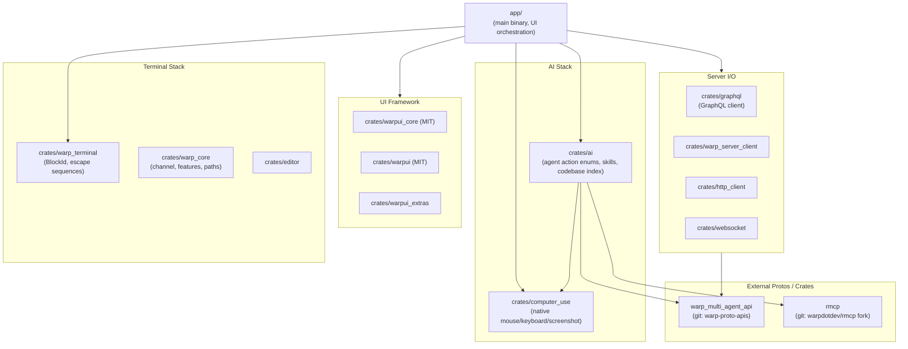
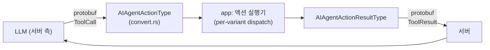
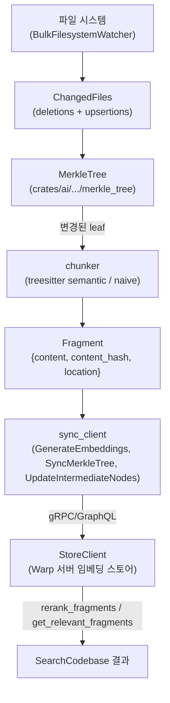
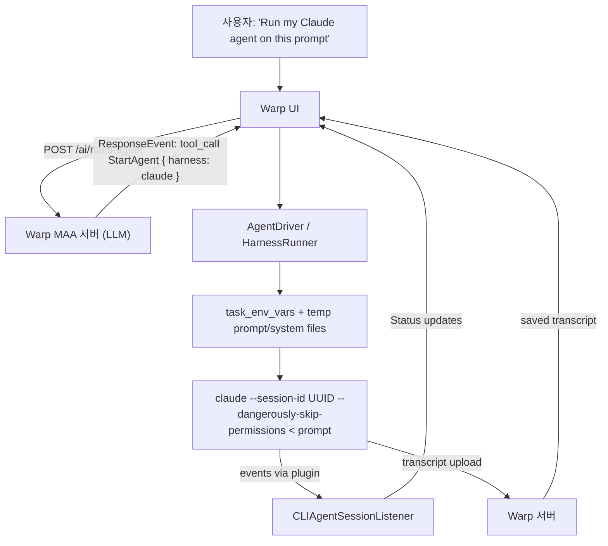
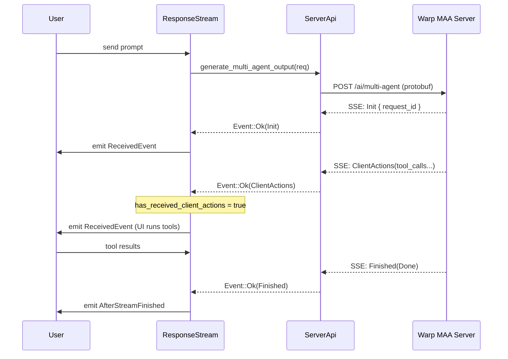

# Warp Terminal — 코드 레벨 아키텍처 심층 분석

> 분석 대상: [warpdotdev/warp](https://github.com/warpdotdev/warp) (오픈소스 클라이언트, 2026-04-29 시점 main)
> 라이선스: AGPL-3.0 (UI 프레임워크 `warpui_core`/`warpui`만 MIT)
> 분석 범위: Rust 워크스페이스(crate 65개) 전체 + 외부 의존성 `warp_multi_agent_api`, `rmcp`. **LLM·Agent 기능에 집중.**

---

## 목차

1. [프로젝트 개요](#1-프로젝트-개요)
2. [전체 아키텍처와 워크스페이스 구조](#2-전체-아키텍처와-워크스페이스-구조)
3. [LLM 호출 경로 — Multi-Agent API와 Server Bridge](#3-llm-호출-경로--multi-agent-api와-server-bridge)
4. [Agent 액션 모델 — 25개 툴의 enum 기반 dispatch](#4-agent-액션-모델--25개-툴의-enum-기반-dispatch)
5. [Skill 시스템 — 멀티 프로바이더 에이전트 지침](#5-skill-시스템--멀티-프로바이더-에이전트-지침)
6. [코드베이스 인덱스 — Merkle Tree + Tree-sitter + Voyage 임베딩](#6-코드베이스-인덱스--merkle-tree--tree-sitter--voyage-임베딩)
7. [MCP 통합 — rmcp 클라이언트와 멀티 프로바이더 설정](#7-mcp-통합--rmcp-클라이언트와-멀티-프로바이더-설정)
8. [Computer Use — 네이티브 마우스/키보드/스크린샷](#8-computer-use--네이티브-마우스키보드스크린샷)
9. [외부 CLI Agent Harness — Claude Code · Codex · Gemini](#9-외부-cli-agent-harness--claude-code--codex--gemini)
10. [Agent Mode 응답 처리 — SSE + Protobuf + Retry/Resume](#10-agent-mode-응답-처리--sse--protobuf--retryresume)
11. [Orchestration — Sub-agent 생성과 메시지 전송](#11-orchestration--sub-agent-생성과-메시지-전송)
12. [경쟁/비교 분석](#12-경쟁비교-분석)
13. [종합 평가와 엔지니어 인사이트](#13-종합-평가와-엔지니어-인사이트)

---

## 1. 프로젝트 개요

Warp는 Rust로 작성된 **agentic development environment(터미널 + 코딩 에이전트 통합 워크벤치)**다. README에 명시된 정체성은 다음과 같다.

> "Warp is an agentic development environment, born out of the terminal. Use Warp's built-in coding agent, or bring your own CLI agent (Claude Code, Codex, Gemini CLI, and others)."

해결하려는 문제는 셋이다.

1. **코딩 에이전트의 호스트 부재** — Claude Code, Gemini CLI, Codex 등 각 CLI 에이전트가 독립적으로 실행되며 터미널 UX·세션 관리·관측이 단편적이다. Warp는 이들을 한 터미널 안에서 **harness(외부 CLI 어댑터)** 로 통합한다.
2. **블록 기반 터미널의 LLM 친화성** — Warp 고유의 "블록(block) 단위 명령 단위" 터미널을 LLM 컨텍스트로 직접 매핑한다. 명령 출력·diff·파일 컨텍스트가 블록 형태로 구조화돼 있어 LLM 호출 시 그대로 직렬화된다.
3. **자체 코딩 에이전트(MAA)** — `warp_multi_agent_api` Protobuf 스키마로 정의된 자체 에이전트 모델("Multi-Agent API")을 OpenAI/Anthropic/Google/AWS Bedrock 멀티 LLM 백엔드로 운영한다. README의 "OpenAI is the founding sponsor … powered by GPT models" 언급이 이 자체 에이전트를 가리킨다.

오픈된 것은 **클라이언트 코드**이며, 실제 LLM 호출은 Warp가 운영하는 서버를 경유한다(섹션 3 참조). 즉 모델 추론·인덱스 임베딩·세션 영속화는 모두 **GraphQL/REST + SSE** 로 백엔드와 통신하는 구조다.

---

## 2. 전체 아키텍처와 워크스페이스 구조

### 2.1 워크스페이스 레이아웃

루트 `Cargo.toml`은 65개의 crate를 묶고 `app/`이 단일 바이너리(`warp`)를 산출한다.



핵심 관찰:

- **`crates/ai`** 가 LLM/Agent 도메인 로직의 중심이다. agent 액션·스킬·코드베이스 인덱스·LLM ID·API 키 관리가 모두 여기에 모여 있다.
- LLM 프로토콜 정의는 **외부 git 의존성** `warp_multi_agent_api`(Cargo.toml 307 행: `git = "https://github.com/warpdotdev/warp-proto-apis.git"`)로 분리돼 클라이언트·서버가 동일한 protobuf를 공유한다.
- MCP 클라이언트도 **자체 fork rmcp**(379 행)를 쓴다 — 표준 MCP rust SDK에 Warp 전용 패치를 얹은 것.
- UI 프레임워크 `warpui`/`warpui_core`만 MIT, **나머지는 AGPL-3.0**. 즉 UI는 다른 프로젝트가 가져다 써도 무방하고, AI/터미널 핵심은 AGPL 의무를 진다.

### 2.2 `crates/ai` 모듈 트리

```text
crates/ai/src
├── lib.rs                     # public module re-exports
├── llm_id.rs                  # 모델 식별자 (LLMId)
├── api_keys.rs                # 사용자 BYOK (Anthropic/OpenAI/Google/OpenRouter)
├── aws_credentials.rs         # AWS Bedrock 자격증명 (OIDC/STS)
├── document.rs                # AIDocumentId (planning 문서)
├── workspace.rs               # WorkspaceMetadata (저장된 인덱스 메타)
├── paths.rs                   # 스킬·인덱스 저장 경로
├── telemetry.rs               # AITelemetryEvent (싱크/리트라이벌 이벤트)
├── agent/                     # ★ 에이전트 액션 시스템
│   ├── mod.rs
│   ├── action/                # AIAgentActionType (25개 툴)
│   │   ├── mod.rs
│   │   └── convert.rs         # Multi-Agent API ToolCall ⇄ AIAgentAction
│   ├── action_result/         # AIAgentActionResultType (결과)
│   ├── citation.rs            # 인용 메타
│   ├── convert.rs             # 변환 에러 enum
│   └── file_locations.rs      # FileLocations (파일+라인 범위)
├── diff_validation/           # ParsedDiff (search/replace, V4A hunk)
├── gfm_table.rs               # GFM 테이블 파서 (LLM 응답 안 마크다운 표)
├── skills/                    # ★ 스킬 시스템
│   ├── mod.rs
│   ├── parser.rs              # SKILL.md frontmatter 파서
│   ├── parse_skill.rs         # ParsedSkill 구조체 + 검증
│   ├── skill_provider.rs      # 10개 스킬 프로바이더 (Warp/Claude/Codex/...)
│   ├── skill_reference.rs
│   ├── conversion.rs          # Multi-Agent API 변환
│   └── read_skills.rs         # 디렉터리 트리 순회로 스킬 수집
├── index/                     # ★ 코드베이스 인덱싱
│   ├── mod.rs
│   ├── locations.rs
│   ├── file_outline/          # tree-sitter 기반 심볼 아웃라인
│   └── full_source_code_embedding/   # Merkle tree + 임베딩 sync
│       ├── manager.rs         # CodebaseIndexManager (워치 + 큐)
│       ├── codebase_index.rs  # 단일 repo 인덱스 상태머신
│       ├── chunker.rs         # tree-sitter 의미 청킹
│       ├── chunker/{naive,semantic}.rs
│       ├── changed_files.rs   # 증분 변경 추적
│       ├── fragment_metadata.rs
│       ├── merkle_tree/       # Merkle tree (해시 일관성)
│       ├── snapshot.rs        # 디스크 영속화
│       ├── store_client.rs    # 임베딩 저장소 클라이언트 trait
│       ├── sync_client.rs     # 서버 동기화 (full/incremental)
│       └── priority_queue.rs  # repo 빌드 우선순위
└── project_context/           # 프로젝트 메타 모델
    ├── mod.rs
    └── model.rs
```

### 2.3 LLM/Agent 관련 다른 위치

`crates/ai`는 **데이터 모델·변환 로직**이고, 에이전트 실행 흐름은 `app/src/ai/`에 있다.

```text
app/src/ai/
├── agent/
│   ├── api.rs                       # RequestParams, ServerConversationToken
│   ├── api/impl.rs                  # generate_multi_agent_output (실제 호출)
│   ├── api/convert_to.rs            # Input → API 변환
│   ├── api/convert_from.rs          # API → Output 변환
│   ├── api/convert_conversation.rs  # 대화 직렬화
│   ├── conversation.rs              # AIConversation (3700 LOC, 핵심 상태머신)
│   ├── comment.rs
│   └── conversation_yaml.rs
├── agent_sdk/                       # Oz CLI(`warp` 바이너리의 agent CLI 모드)
│   ├── driver.rs                    # AgentDriver (CLI agent 실행 루프)
│   ├── driver/harness/              # Claude/Gemini harness 어댑터
│   │   ├── claude_code.rs
│   │   ├── gemini.rs
│   │   └── claude_transcript.rs     # Claude 세션 직렬화
│   ├── driver/cloud_provider.rs
│   ├── ambient.rs                   # 백그라운드 에이전트
│   └── retry.rs
├── ambient_agents/
│   ├── mod.rs                       # AmbientAgentTaskId
│   ├── task.rs                      # HarnessConfig, AgentConfigSnapshot
│   └── spawn.rs
├── agent_events/
│   └── driver.rs                    # AgentEventConsumer (서버 이벤트 폴링)
├── blocklist/                       # 안전·권한·자동실행 정책
│   ├── controller.rs
│   ├── controller/response_stream.rs
│   └── passive_suggestions/maa.rs
├── mcp/                             # MCP 서버 관리/통신
│   ├── mod.rs                       # MCPProvider (Warp/Claude/Codex/Agents)
│   ├── manager.rs / templatable_manager.rs
│   ├── reconnecting_peer.rs         # rmcp peer 재연결
│   └── parsing.rs
├── skills/                          # 사용자 환경에서 스킬 로딩
│   ├── skill_manager.rs
│   └── resolve_skill_spec.rs
└── llms.rs                          # LLMPreferences (모델 선택 UI 모델)
```

`crates/ai`는 직렬화 가능한 **순수 데이터/로직**이고, `app/src/ai`는 **`warpui` 의 ModelHandle/Entity** 가 붙은 런타임 모델이다. WASM 빌드(`serve-wasm`)에서도 `crates/ai`만 재사용된다.

---

## 3. LLM 호출 경로 — Multi-Agent API와 Server Bridge

### 3.1 핵심 사실: 클라이언트는 LLM을 직접 호출하지 않는다

오픈소스로 공개된 코드 어디에도 `anthropic`, `openai`, `google-generative-ai` 같은 LLM SDK 의존성이 없다. `Cargo.toml`을 grep하면 LLM 관련은 **prost(0.14)** 와 자체 protobuf `warp_multi_agent_api` 뿐이다.

```toml
# Cargo.toml:307
warp_multi_agent_api = { git = "https://github.com/warpdotdev/warp-proto-apis.git", rev = "78a78f21..." }
```

실제 호출은 `app/src/server/server_api.rs:1071`에 있다.

```rust
pub async fn generate_multi_agent_output(
    &self,
    request: &warp_multi_agent_api::Request,
) -> Result<AIOutputStream<warp_multi_agent_api::ResponseEvent>, Arc<AIApiError>>
{
    let url = format!(
        "{}/{}/{}",
        ChannelState::server_root_url(),       // 예: https://app.warp.dev
        if is_evals { "agent-mode-evals" } else { "ai" },
        if is_passive { "passive-suggestions" } else { "multi-agent" }
    );

    let request_builder = self.client.post(url)
        .proto(request)                        // protobuf body
        .prevent_sleep("Agent Mode request in-progress");

    let output_stream = request.eventsource().filter_map(|event| async {
        match event {
            Ok(reqwest_eventsource::Event::Message(msg)) => {
                let decoded = BASE64_URL_SAFE.decode(msg.data.trim_matches('"'))?;
                let action = warp_multi_agent_api::ResponseEvent::decode(decoded.as_slice());
                ...
            }
            ...
        }
    });
    Ok(output_stream.boxed())
}
```

요청은 **POST `/ai/multi-agent`**, 응답은 **Server-Sent Events**, 페이로드는 **base64로 감싼 protobuf `ResponseEvent`** 이다. Warp 백엔드가 OpenAI/Anthropic/Google/Bedrock을 호스팅하면서 클라이언트에는 단일 protobuf 스트림으로 정규화해 내려준다.

### 3.2 BYOK (Bring Your Own Key)

`crates/ai/src/api_keys.rs`는 사용자 LLM 키를 **운영체제 보안 저장소**(`secure_storage` crate, macOS Keychain/Windows Credential Manager 등)에 보관하고 요청 시 protobuf `request::settings::ApiKeys`로 함께 전송한다.

```rust
pub struct ApiKeys {
    pub google: Option<String>,
    pub anthropic: Option<String>,
    pub openai: Option<String>,
    pub open_router: Option<String>,
}

pub fn api_keys_for_request(...) -> Option<api::request::settings::ApiKeys> {
    ...
    Some(api::request::settings::ApiKeys {
        anthropic, openai, google, open_router,
        allow_use_of_warp_credits: false,
        aws_credentials,    // AwsCredentialsState::Loaded → AWS Bedrock
    })
}
```

즉 **BYOK 모드에서도 키는 Warp 서버를 경유**한다. 클라이언트 → Warp 서버 → 사용자 키로 LLM 직접 호출 → SSE로 응답 streaming. 키 자체는 secure storage에서 메모리로만 디코딩되고 디스크엔 평문 저장되지 않는다.

`AwsCredentialsRefreshStrategy`는 두 모드:

- `LocalChain` — `~/.aws/credentials`에서 갱신
- `OidcManaged { task_id, role_arn }` — STS `AssumeRoleWithWebIdentity`로 단기 자격 발급 (cloud agent에서 사용)

### 3.3 요청 파라미터 빌드

`app/src/ai/agent/api.rs:RequestParams`는 한 번의 LLM 턴에 들어가는 모든 컨텍스트를 모은다.

```rust
pub struct RequestParams {
    pub input: Vec<AIAgentInput>,
    pub conversation_token: Option<ServerConversationToken>,
    pub tasks: Vec<warp_multi_agent_api::Task>,
    pub session_context: SessionContext,
    pub model: LLMId,                    // 예: "claude-3-7-sonnet"
    pub coding_model: LLMId,
    pub cli_agent_model: LLMId,
    pub computer_use_model: LLMId,       // 모델별 분리: 일반 추론 / 코딩 / CLI 협업 / 컴퓨터 사용
    pub is_memory_enabled: bool,
    pub warp_drive_context_enabled: bool,
    pub mcp_context: Option<MCPContext>,
    pub planning_enabled: bool,
    pub api_keys: Option<api::request::settings::ApiKeys>,
    pub autonomy_level: api::AutonomyLevel,        // Supervised | Unsupervised
    pub isolation_level: api::IsolationLevel,      // None | Sandbox
    pub web_search_enabled: bool,
    pub computer_use_enabled: bool,
    pub ask_user_question_enabled: bool,
    pub research_agent_enabled: bool,
    pub orchestration_enabled: bool,
    pub supported_tools_override: Option<Vec<api::ToolType>>,
    pub parent_agent_id: Option<String>,           // sub-agent 시
    pub agent_name: Option<String>,                // "Agent 1"
}
```

`generate_multi_agent_output`(`app/src/ai/agent/api/impl.rs`)에서 이걸 실제 protobuf로 직렬화한다. 흥미로운 capability flag 들:

- `supports_parallel_tool_calls: true` — 한 턴에 여러 툴 동시 호출
- `supports_v4a_file_diffs` — V4A unified diff 포맷 사용 여부
- `supports_summarization_via_message_replacement` — 컨텍스트 압축
- `supports_orchestration_v2` — 새 sub-agent 모델
- `supports_bundled_skills` — Warp 기본 내장 스킬

### 3.4 지원 툴 동적 선택 (`get_supported_tools`)

세션 타입에 따라 protobuf의 `supported_tools` 리스트가 달라진다.

```rust
fn get_supported_tools(params: &RequestParams) -> Vec<api::ToolType> {
    let mut tools = vec![
        ToolType::Grep, ToolType::FileGlob, ToolType::FileGlobV2,
        ToolType::ReadMcpResource, ToolType::CallMcpTool,
        ToolType::InitProject, ToolType::OpenCodeReview,
        ToolType::RunShellCommand, ToolType::SuggestNewConversation,
        ToolType::Subagent,
        ToolType::WriteToLongRunningShellCommand, ToolType::ReadShellCommandOutput,
        ToolType::ReadDocuments, ToolType::CreateDocuments, ToolType::EditDocuments,
        ToolType::SuggestPrompt,
    ];

    match params.session_context.session_type() {
        None | Some(SessionType::Local) => {
            tools.extend(&[ToolType::ReadFiles, ToolType::ApplyFileDiffs, ToolType::SearchCodebase]);
        }
        Some(SessionType::WarpifiedRemote { host_id: Some(_) }) => {
            tools.extend(&[ToolType::ReadFiles, ToolType::ApplyFileDiffs]);
            // SearchCodebase 비활성: 원격 인덱스가 아직 미지원
        }
        ...
    }
    if FeatureFlag::AgentModeComputerUse.is_enabled() && params.computer_use_enabled {
        tools.extend(&[ToolType::UseComputer, ToolType::RequestComputerUse]);
    }
    if params.orchestration_enabled {
        tools.push(if FeatureFlag::OrchestrationV2.is_enabled() {
            ToolType::StartAgentV2
        } else {
            ToolType::StartAgent
        });
        tools.push(ToolType::SendMessageToAgent);
    }
    ...
}
```

**서버는 세션이 가진 능력만큼의 툴 셋을 LLM에게 노출**한다. 클라이언트가 SSH 원격이면 SearchCodebase가 빠지고, 컴퓨터 사용 권한이 없으면 UseComputer가 빠진다. 이 패턴 덕분에 단일 LLM 백엔드가 다양한 클라이언트 환경을 동일한 prompt 스킴으로 다룰 수 있다.

---

## 4. Agent 액션 모델 — 25개 툴의 enum 기반 dispatch

`crates/ai/src/agent/action/mod.rs`는 LLM이 호출할 수 있는 모든 툴을 단일 enum으로 정의한다.

### 4.1 `AIAgentActionType` (25 variants)

| 카테고리 | Variant | 설명 |
|---|---|---|
| **셸/PTY** | `RequestCommandOutput` | `command, is_read_only, is_risky, wait_until_completion, uses_pager, rationale, citations` |
| | `WriteToLongRunningShellCommand` | 실행 중인 long-running 명령에 stdin 주입 (Raw/Line/Block 모드) |
| | `ReadShellCommandOutput` | 블록 ID로 출력 회수 (즉시/N초 후/완료 시) |
| | `TransferShellCommandControlToUser` | 셸 제어권을 사용자에 양도 (대화형 진입) |
| **파일** | `ReadFiles(ReadFilesRequest)` | `Vec<FileLocations { name, lines: Vec<Range<usize>> }>` |
| | `RequestFileEdits` | `Vec<FileEdit::{Edit(ParsedDiff), Create, Delete}>` |
| | `Grep` / `FileGlob` / `FileGlobV2` | 검색 |
| | `UploadArtifact` | 파일을 대화 첨부물로 업로드 |
| **인덱스** | `SearchCodebase` | 임베딩 기반 시맨틱 검색 (섹션 6) |
| **MCP** | `CallMCPTool { server_id, name, input }` | rmcp 툴 호출 |
| | `ReadMCPResource` | MCP 리소스 읽기 |
| **에이전트 협업** | `StartAgent` / `StartAgentV2` | sub-agent 생성 (Local/Remote 실행 모드) |
| | `SendMessageToAgent { addresses, subject, message }` | 다른 에이전트에 메시지 |
| | `AskUserQuestion { questions }` | 객관식 질문 (`is_multiselect`, `supports_other`) |
| **문서** | `ReadDocuments` / `EditDocuments` / `CreateDocuments` | Planning 문서 (AIDocumentId) |
| | `FetchConversation { conversation_id }` | 다른 대화 컨텍스트 끌어오기 |
| **컴퓨터 사용** | `UseComputer(UseComputerRequest)` | `actions: Vec<computer_use::Action>` 일괄 실행 |
| | `RequestComputerUse` | 사용자에게 권한 요청 |
| **메타/UX** | `SuggestNewConversation` / `SuggestPrompt` | UI 제안 |
| | `InitProject` / `OpenCodeReview` | 프로젝트 초기화/리뷰 |
| | `InsertCodeReviewComments` | GitHub PR 댓글 삽입 |
| | `ReadSkill(ReadSkillRequest)` | 스킬 본문 읽기 |

각 variant는 LLM의 tool_call에서 변환된다 — `crates/ai/src/agent/action/convert.rs`에 `From<api::message::tool_call::*>` 구현이 모여있다.

### 4.2 dispatch 패턴

각 variant마다 세 가지 트레이트 메소드가 있다.

```rust
impl AIAgentActionType {
    pub fn cancelled_result(&self) -> AIAgentActionResultType { ... }
    pub fn user_friendly_name(&self) -> String { ... }
    // Display 구현으로 telemetry/log
}
```

`cancelled_result`는 LLM이 작업 중 사용자가 취소했을 때 동일한 enum에 `Cancelled` 변형을 가진 `AIAgentActionResultType`을 반환해 일관성을 유지한다.



### 4.3 `WriteToLongRunningShellCommand` 모드

장시간 실행되는 명령에 LLM이 stdin을 주입할 때의 정교함을 보여주는 코드.

```rust
pub enum AIAgentPtyWriteMode { Raw, Line, Block }

impl AIAgentPtyWriteMode {
    pub fn decorate_bytes(self, bytes: impl Into<Vec<u8>>, is_bracketed_paste_enabled: bool) -> Vec<u8> {
        match self {
            Self::Raw => bytes.into(),
            Self::Line => {
                let mut v = vec![C0::SOH];           // ^A: 줄 시작으로
                v.extend_from_slice(&bytes);
                #[cfg(target_os = "windows")]
                v.push(C0::CR);
                #[cfg(not(target_os = "windows"))]
                v.push(C0::LF);
                v
            }
            Self::Block => {
                if is_bracketed_paste_enabled {
                    BRACKETED_PASTE_START.iter().chain(bytes).chain(BRACKETED_PASTE_END.iter()).collect()
                } else { bytes }
            }
        }
    }
}
```

— 단순 stdin write가 아니라 **터미널 escape sequence를 의식한 모드별 입력**이다. Line 모드는 `^A` + LF로 readline 편집기 기준 한 줄 입력, Block 모드는 bracketed paste (`ESC[200~ ... ESC[201~`)로 paste임을 알린다.

---

## 5. Skill 시스템 — 멀티 프로바이더 에이전트 지침

### 5.1 스킬이란

스킬은 **프롬프트 템플릿이 담긴 markdown 파일**(`SKILL.md`)이다. front-matter에 `name`, `description`이 있고 본문은 LLM이 참조할 지침이다. Anthropic Skills 모델을 그대로 따른다.

```markdown
---
name: rust-test-runner
description: Run cargo nextest with the right flags for this workspace.
---

When the user asks to run tests, prefer `cargo nextest run` over `cargo test`.
Always pass `--no-fail-fast`. Exclude `command-signatures-v2` to avoid OOM.
```

### 5.2 멀티 프로바이더 통합 (`skills/skill_provider.rs`)

```rust
pub enum SkillProvider {
    Warp, Agents, Claude, Codex, Cursor, Gemini, Copilot, Droid, Github, OpenCode,
}

pub static SKILL_PROVIDER_DEFINITIONS: LazyLock<Vec<SkillProviderDefinition>> = LazyLock::new(|| vec![
    SkillProviderDefinition { provider: Agents,   skills_path: ".agents/skills".into() },
    SkillProviderDefinition { provider: Warp,     skills_path: ".warp/skills".into() },
    SkillProviderDefinition { provider: Claude,   skills_path: ".claude/skills".into() },
    SkillProviderDefinition { provider: Codex,    skills_path: ".codex/skills".into() },
    SkillProviderDefinition { provider: Cursor,   skills_path: ".cursor/skills".into() },
    SkillProviderDefinition { provider: Gemini,   skills_path: ".gemini/skills".into() },
    SkillProviderDefinition { provider: Copilot,  skills_path: ".copilot/skills".into() },
    SkillProviderDefinition { provider: Droid,    skills_path: ".factory/skills".into() },
    SkillProviderDefinition { provider: Github,   skills_path: ".github/skills".into() },
    SkillProviderDefinition { provider: OpenCode, skills_path: ".opencode/skills".into() },
]);

pub fn provider_rank(provider: SkillProvider) -> usize {
    SKILL_PROVIDER_DEFINITIONS.iter().position(|d| d.provider == provider).unwrap_or(usize::MAX)
}
```

리스트 순서가 곧 **우선순위**다. 같은 이름의 스킬이 여러 디렉터리에 있으면 위쪽이 이긴다. `get_provider_for_path`는 임의 경로의 스킬 파일을 보고 어느 provider 소속인지 역산한다.

스코프는 셋:

```rust
pub enum SkillScope { Home, Project, Bundled }
```

- `Home` — `~/.claude/skills/foo/SKILL.md`
- `Project` — `./repo/.claude/skills/foo/SKILL.md`
- `Bundled` — Warp 바이너리에 포함된 스킬 (project context 자동 적용)

### 5.3 Description fallback 알고리즘 (`parse_skill.rs`)

스킬 설명이 누락되거나 비었을 때 본문 첫 단락에서 자동 추출한다.

```rust
fn first_paragraph_from_markdown(markdown: &str) -> Option<String> {
    for block in BLOCK_SEPARATOR.split(markdown) {  // r"\n\s*\n"
        let paragraph: String = block.lines()
            .map(|line| line.trim())
            .filter(|line| !line.is_empty() && !line.starts_with('#'))
            .collect::<Vec<_>>()
            .join(" ");
        if !paragraph.trim().is_empty() {
            return Some(paragraph.trim().to_string());
        }
    }
    None
}

fn truncate_skill_description(description: &str) -> String {
    const MAX: usize = 512;
    if description.chars().count() <= MAX { return description.to_string(); }

    let truncated: String = description.chars().take(MAX).collect();
    // 1) 마지막 완성 문장에서 자른다
    let at_sentence = INCOMPLETE_SENTENCE.replace(&truncated, "").trim().to_string();
    if !at_sentence.is_empty() { return at_sentence; }
    // 2) 단어 경계
    truncated.rfind(char::is_whitespace).map(|p| truncated[..p].trim().to_string()).unwrap_or(truncated)
}
```

LLM에게 description은 **스킬을 trigger할지 결정하는 신호**라 제대로 자르는 게 중요하다. 문장 → 단어 → 잘림 순으로 graceful degrade.

### 5.4 ReadSkill 액션과 멀티 에이전트 협업

```rust
AIAgentActionType::ReadSkill(ReadSkillRequest { skill: SkillReference }) → ReadSkillResult::Success { content: FileContext }
```

LLM이 스킬 본문을 직접 읽도록 강제하는 툴. `ListSkills` 피처 플래그가 켜지면 시스템 프롬프트에 스킬 카탈로그(name + description만)가 들어가고, LLM은 trigger 조건을 보고 `ReadSkill`로 본문을 끌어온다. **"스킬 인덱스 → on-demand 본문 로딩"** 구조라 컨텍스트 비용이 본문 길이에 비례하지 않는다.

---

## 6. 코드베이스 인덱스 — Merkle Tree + Tree-sitter + Voyage 임베딩

`crates/ai/src/index/full_source_code_embedding/`은 **로컬 파일 시스템 변경을 추적하면서 서버에 임베딩을 동기화**하는 시스템이다. 4000줄 가까운 코드로 가장 정교한 모듈.

### 6.1 핵심 아이디어

> "두 개의 동일한 디렉터리는 동일한 Merkle 루트 해시를 가진다. 따라서 변경된 파일만 재청킹·재임베딩하면 된다."



### 6.2 Merkle 트리

`crates/ai/src/index/full_source_code_embedding/merkle_tree/tree.rs`:

```rust
/// 리프 = 파일의 코드 fragment (SHA-256), 부모 = 디렉터리 또는 파일.
/// /src (Hash: FooBarBuzzBazz)
/// ├── /src/foo.rs (Hash: Foo)
/// ├── /src/bar.rs (Hash: Bar)
/// └── /src/bazz (Hash: BuzzBazz)
///     └── /src/bazz/buzz.rs (Hash: Buzz)
pub(crate) struct MerkleTree { root: MerkleNode }
```

- `upsert_files(paths)` — 변경된 경로들의 노드를 갱신, 부모 해시를 bottom-up 재계산
- `remove_files(paths)` — 삭제된 경로 정리
- `nodes_from_mask(NodeMask)` — 변경된 경로의 NodeLens(lens 패턴)를 reverse-BFS로 회수 (자식 먼저)
- `from_serialized_tree(SerializedMerkleTree)` — 디스크 스냅샷에서 복원

서버 동기화는 자식 → 부모 순서로만 가능하기 때문에 BFS 결과를 reverse한다.

### 6.3 Chunker — tree-sitter 우선, naive fallback

```rust
const LINES_PER_CHUNK: usize = 200;
const AVG_CHAR_PER_LINE: usize = 60;
const MAX_BYTES_PER_CHUNK: usize = LINES_PER_CHUNK * AVG_CHAR_PER_LINE; // 12_000

pub fn chunk_code<'a>(code: &'a str, path: &'a Path) -> Vec<Fragment<'a>> {
    if let Some(fragments) = try_chunk_code_semantically(code, path) {
        return fragments;
    }
    naive::chunk_code(code, path, MAX_BYTES_PER_CHUNK, LINES_PER_CHUNK)
}

#[cfg(not(target_family = "wasm"))]
fn try_chunk_code_semantically<'a>(code: &'a str, path: &'a Path) -> Option<Vec<Fragment<'a>>> {
    let language = languages::language_by_filename(path)?;
    semantic::chunk_code(code, path, MAX_BYTES_PER_CHUNK, &language.grammar).ok()
}
```

`coalesce_fragments`가 tree-sitter가 만든 작은 단편(함수 시그니처만 따로 잘리는 등)을 역방향으로 합쳐 의미 단위를 회복한다. WASM 빌드에서는 tree-sitter 비용이 크므로 항상 naive로 폴백.

### 6.4 임베딩 모델 선택

```rust
pub enum EmbeddingConfig {
    OpenAiTextSmall3_256,   // OpenAI text-embedding-3-small (256 dim)
    VoyageCode3_512,        // Voyage code-3 (512 dim)
    Voyage3_5_Lite_512,
    Voyage3_5_512,          // ★ default
}
```

기본값이 **Voyage AI**의 `voyage-3.5` (512 dim)다. 코드 검색에 강점이 있는 모델로 알려진 선택지. 모델 결정은 서버가 `codebase_context_config()` 응답으로 클라이언트에 알린다 (`store_client.rs:62`).

### 6.5 동기화 작업 큐 (`sync_client.rs`)

```rust
pub enum SyncTask {
    GenerateEmbeddings(GenerateEmbeddingsTask),     // 새 fragment 임베딩 생성
    UpdateIntermediateNodes(UpdateIntermediateNodesTask), // 디렉터리 노드 갱신
    SyncMerkleTree(SyncMerkleTreeTask),             // 어떤 노드가 서버에 이미 있는지 확인
}

const SYNC_NODE_BATCH_SIZE: usize = 500;
const MIN_UPDATE_NODE_BATCH_SIZE: usize = 100;
const MAX_BATCH_CONTENT_BYTES: usize = 4_000_000;   // Cloud Armor 5MB 제한 - 직렬화 오버헤드
```

전체 동기화 절차:

1. **`full_sync`** — 루트부터 BFS로 서버에 "이 노드 해시 있어?" 묻고(`sync_merkle_tree`) 누락된 노드만 sync 큐에 push.
2. **`incremental_sync(updated_nodes)`** — 파일시스템 watcher 이벤트로 받은 변경 노드만 처리.
3. **`generate_embeddings`** — 변경된 leaf fragment의 content를 본문 4MB 이하 배치로 쪼개 server에 POST. Voyage/OpenAI 호출은 서버 책임.
4. **`update_intermediate_nodes`** — 부모 노드를 자식 해시 리스트와 함께 등록.

### 6.6 매니저 — 다중 repo + 우선순위 큐 (`manager.rs`)

```rust
pub struct CodebaseIndexManager {
    codebase_indices: HashMap<PathBuf, ModelHandle<CodebaseIndex>>,
    store_client: Arc<dyn StoreClient>,
    #[cfg(feature = "local_fs")]
    watcher: ModelHandle<BulkFilesystemWatcher>,
    build_queue: BuildQueue,
    max_indices: Option<usize>,
    max_files_repo_limit: usize,
    embedding_generation_batch_size: usize,
}

const REPO_WATCHER_DEBOUNCE_DURATION: Duration = Duration::from_secs(10);
const REPO_SNAPSHOT_PERSISTENCE_INTERVAL: Duration = Duration::from_secs(60 * 10);  // 10분마다 스냅샷
const REINDEX_INTERVAL: Duration = Duration::from_secs(20 * 60);                    // 20분마다 풀싱크
```

매니저는 여러 repo를 동시에 관리하면서:

- 디렉터리 워처 이벤트를 10초 디바운스 후 적용
- 활성 세션의 repo는 `Priority::ActiveSession`으로 우선 빌드
- 10분마다 디스크 스냅샷, 20분마다 incremental sync
- `ExceededMaxFileLimit` 에러 시 사용자가 한도를 늘리면 자동 재시도

지원하는 ignore 파일:

```rust
const SUPPORTED_IGNORES: [&str; 4] = [
    ".warpindexingignore",
    ".cursorignore",
    ".cursorindexingignore",
    ".codeiumignore",
];
```

— 같은 시장의 경쟁 도구들 ignore 파일을 그대로 인정해 마이그레이션 부담을 낮춘다.

### 6.7 검색 (`SearchCodebase` 액션)

LLM의 `SearchCodebase` 툴 호출이 들어오면 매니저는:

```rust
async fn rerank_fragments(&self, query: String, fragments: Vec<Fragment>) -> Result<Vec<Fragment>, Error>;
async fn get_relevant_fragments(
    &self,
    embedding_config: EmbeddingConfig,
    query: String,
    root_hash: NodeHash,
    repo_metadata: RepoMetadata,
) -> Result<Vec<ContentHash>, Error>;
```

서버가 **두 단계 검색**(임베딩 ANN + cross-encoder rerank)을 책임진다. 클라이언트는 `root_hash`를 보내 어느 시점의 트리에 대해 검색할지 명시 — **서버 인덱스가 클라이언트보다 뒤처지면 그 시점 결과를 받는다**(이때 `out_of_sync_delay` 이벤트가 emit돼 UI에 "Indexing..." 노출).

---

## 7. MCP 통합 — rmcp 클라이언트와 멀티 프로바이더 설정

### 7.1 rmcp fork

`Cargo.toml:379`:
```toml
rmcp = { git = "https://github.com/warpdotdev/rmcp.git", rev = "c0f65dc4..." }
```

표준 `modelcontextprotocol/rust-sdk`가 아니라 **Warp fork**다. fork 이유는 코드에서 직접 확인되지 않지만 reconnecting peer (`app/src/ai/mcp/reconnecting_peer.rs`) 같은 운영 기능이 패치되어 있을 것으로 추정.

### 7.2 4개 프로바이더 통합 (`app/src/ai/mcp/mod.rs`)

```rust
pub enum MCPProvider {
    Warp,     // ~/.warp/.mcp.json
    Claude,   // ~/.claude.json (Claude Code의 설정 파일)
    Codex,    // ~/.codex/config.toml
    Agents,   // ~/.agents/.mcp.json
}
```

기존 CLI 에이전트들의 MCP 설정 파일을 **그대로 인식**한다. Claude Code 사용자가 추가한 MCP 서버를 Warp에서도 별도 설정 없이 활용할 수 있다.

### 7.3 액션 변환

```rust
// crates/ai/src/agent/action/convert.rs
impl TryFrom<api::message::tool_call::CallMcpTool> for AIAgentActionType {
    type Error = ToolToAIAgentActionError;
    fn try_from(value: api::message::tool_call::CallMcpTool) -> Result<Self, Self::Error> {
        let args = value.args.ok_or(...)?;
        let input = prost_to_serde_json(prost_types::Value {
            kind: Some(prost_types::value::Kind::StructValue(args)),
        })?;
        let server_id = if FeatureFlag::MCPGroupedServerContext.is_enabled() {
            Uuid::parse_str(&value.server_id).ok()
        } else { None };
        Ok(AIAgentActionType::CallMCPTool { server_id, name: value.name, input })
    }
}
```

protobuf `Struct`를 `serde_json::Value`로 변환해 rmcp에 넘긴다. `MCPGroupedServerContext` 피처가 켜지면 multi-server 환경에서 서버 ID로 명시 라우팅, 꺼지면 name 기준 매칭.

### 7.4 결과 타입

```rust
pub enum CallMCPToolResult {
    Success { result: rmcp::model::CallToolResult },
    Error(String),
    Cancelled,
}
pub enum ReadMCPResourceResult {
    Success { resource_contents: Vec<rmcp::model::ResourceContents> },
    ...
}
```

— rmcp의 표준 타입을 그대로 사용. Warp가 따로 응답을 가공하지 않고 LLM에 그대로 forwarding.

---

## 8. Computer Use — 네이티브 마우스/키보드/스크린샷

`crates/computer_use`는 **Anthropic Claude Computer Use 패턴**을 OS 네이티브로 구현한다.

### 8.1 trait 추상화

```rust
#[async_trait]
pub trait Actor: Send + Sync + 'static {
    fn platform(&self) -> Option<Platform>;
    async fn perform_actions(&mut self, actions: &[Action], options: Options) -> Result<ActionResult, String>;
}

pub enum Platform { Mac, Windows, LinuxX11, LinuxWayland }
pub enum Action {
    Wait(Duration),
    MouseDown { button: MouseButton, at: Vector2I },
    MouseUp { button: MouseButton },
    MouseMove { to: Vector2I },
    MouseWheel { at: Vector2I, direction: ScrollDirection, distance: ScrollDistance },
    TypeText { text: String },
    KeyDown { key: Key },
    KeyUp { key: Key },
}
```

플랫폼별 구현은 `cfg_attr(macos, path = "mac/mod.rs")`로 컴파일 타임 분기:

- **mac**: `keyboard.rs`, `mouse.rs`, `screenshot.rs` (CGEvent / Quartz)
- **windows**: `keyboard.rs`, `mouse.rs`, `screenshot.rs`, `dpi.rs` (SendInput / DXGI)
- **linux**: `wayland/`, `x11/` 양쪽 지원, `keysym.rs` 따로

### 8.2 mac actor 본체

```rust
async fn perform_actions(&mut self, actions: &[Action], options: Options) -> Result<ActionResult, String> {
    for action in actions {
        match action {
            Action::Wait(duration) => Timer::after(*duration).await,
            Action::MouseDown { button, at } => {
                self.mouse.move_to(*at).await?;
                self.mouse.button_down(button)?;
            }
            Action::MouseMove { to } => self.mouse.move_to(*to).await?,
            Action::MouseWheel { at, direction, distance } => {
                self.mouse.move_to(*at).await?;
                self.mouse.scroll(direction, distance)?;
            }
            Action::TypeText { text } => self.keyboard.type_text(text)?,
            Action::KeyDown { key } => self.keyboard.key_down(key)?,
            Action::KeyUp { key } => self.keyboard.key_up(key)?,
            ...
        }
    }
    let screenshot = options.screenshot_params.map(screenshot::take).transpose()?;
    Ok(ActionResult { screenshot, cursor_position: Some(self.mouse.current_position()?) })
}
```

— action 리스트를 한 번의 비동기 batch로 실행하고 마지막에 스크린샷 1장 + 커서 좌표를 LLM에 반환. 이 묶음 단위가 `AIAgentActionType::UseComputer(UseComputerRequest { action_summary, actions, screenshot_params })`.

### 8.3 스크린샷 파라미터

```rust
pub struct ScreenshotParams {
    pub max_long_edge_px: Option<usize>,    // 긴 변 최대
    pub max_total_px: Option<usize>,        // 총 픽셀 한도
    pub region: Option<ScreenshotRegion>,    // 일부 영역만
}
```

LLM 컨텍스트 비용을 의식한 크기 제한이 명시적으로 들어있다. `validate()`로 좌표가 유효한지(top-left non-negative, bottom-right > top-left) 사전 체크.

### 8.4 권한 게이트

`computer_use_enabled` 플래그 결정 로직 (api.rs:266):

```rust
let computer_use_enabled = FeatureFlag::AgentModeComputerUse.is_enabled()
    && BlocklistAIPermissions::as_ref(app)
        .get_computer_use_setting(app, terminal_view_id)
        .is_enabled()
    && computer_use::is_supported_on_current_platform()
    && (FeatureFlag::LocalComputerUse.is_enabled() || is_ambient_agent);
```

4중 게이트: **글로벌 feature flag + 사용자 설정 + 플랫폼 지원 + (로컬용 별도 플래그 OR 백그라운드 에이전트)**. 백그라운드 에이전트는 사용자가 자리에 없을 때 돌아가니 별도 자격 부여.

`RequestComputerUse` 액션은 진짜 액션 실행 전 사용자 승인을 받는 용도. Approved 결과로 `screenshot, platform`을 돌려줘 LLM이 어떤 OS인지 인지하게 한다.

---

## 9. 외부 CLI Agent Harness — Claude Code · Codex · Gemini

Warp의 차별점 중 하나는 **외부 CLI 에이전트를 1급 시민으로 통합**한다는 점이다. 두 레이어:

### 9.1 레이어 1 — Plugin Manager (UI 알림 통합)

`app/src/terminal/cli_agent_sessions/plugin_manager/`는 외부 CLI에 **Warp notification plugin**을 자동/수동 설치해 권한 요청·툴 완료·작업 종료를 Warp 터미널에 신호로 보낸다.

```rust
#[async_trait]
pub(crate) trait CliAgentPluginManager: Send + Sync {
    fn minimum_plugin_version(&self) -> &'static str;
    fn can_auto_install(&self) -> bool;
    fn is_installed(&self) -> bool { false }
    fn needs_update(&self) -> bool { false }
    async fn install(&self) -> Result<(), PluginInstallError>;
    async fn update(&self) -> Result<(), PluginInstallError>;
    fn install_instructions(&self) -> &'static PluginInstructions;
    fn update_instructions(&self) -> &'static PluginInstructions;
    async fn install_platform_plugin(&self) -> Result<(), PluginInstallError> { Ok(()) }
}
```

지원 에이전트 (`mod.rs:plugin_manager_for_with_shell`):

| Agent | 자동 설치 | 메커니즘 |
|---|---|---|
| Claude Code | ✅ | `claude plugin marketplace add warpdotdev/claude-code-warp` + `claude plugin install warp@claude-code-warp` |
| OpenCode | (피처 플래그) | OpenCode 플러그인 |
| Codex | (피처 플래그) | OpenAI Codex 플러그인 |
| Gemini | (피처 플래그) | Gemini 플러그인 |

Claude의 경우(`claude.rs`):

```rust
const PLUGIN_KEY: &str = "warp@claude-code-warp";
const MARKETPLACE_REPO: &str = "warpdotdev/claude-code-warp";
const PLATFORM_PLUGIN_KEY: &str = "oz-harness-support@claude-code-warp";
const PLATFORM_MARKETPLACE_REPO: &str = "warpdotdev/claude-code-warp-internal";
const MINIMUM_PLUGIN_VERSION: &str = "2.0.0";
```

설치된 플러그인 검증은 `~/.claude/plugins/installed_plugins.json`을 직접 파싱한다.

### 9.2 이벤트 프로토콜 (`cli_agent_sessions/event/v1.rs`)

플러그인이 보내는 JSON 스키마:

```rust
struct RawEvent {
    v: Option<u32>,
    agent: Option<String>,
    event: String,         // "session_start" | "prompt_submit" | "tool_complete" | "stop"
                           // | "permission_request" | "permission_replied" | "question_asked" | "idle_prompt"
    session_id, cwd, project: Option<String>,
    query, response, transcript_path, summary, tool_name: Option<String>,
    tool_input: Option<serde_json::Value>,
    plugin_version: Option<String>,
}
```

이벤트가 들어오면 `CLIAgentSessionStatus`를 갱신:

```rust
pub enum CLIAgentSessionStatus {
    InProgress,
    Success,
    Blocked { message: Option<String> },   // permission_request, question_asked
}
```

UI는 `Blocked`일 때 풋터에 알림 + 시스템 알림 띄움.

### 9.3 레이어 2 — Agent SDK Harness (CLI 자동 실행)

Warp 자체의 `oz` CLI가 외부 CLI를 wrap해 cloud agent로 실행하는 경로. `app/src/ai/agent_sdk/driver/harness/`가 이 역할.

```rust
// crates/warp_cli/src/agent.rs
pub enum Harness {
    Oz,        // Warp 자체 MAA
    Claude,
    OpenCode,
    Gemini,
    Unknown,
}
```

trait `ThirdPartyHarness`:

```rust
#[async_trait]
pub(crate) trait ThirdPartyHarness: Send + Sync {
    fn harness(&self) -> Harness;
    fn cli_agent(&self) -> CLIAgent;
    fn install_docs_url(&self) -> Option<&'static str>;
    fn validate(&self) -> Result<(), AgentDriverError>;
    fn prepare_environment_config(&self, working_dir: &Path, system_prompt: Option<&str>,
                                   secrets: &HashMap<String, ManagedSecretValue>) -> Result<(), AgentDriverError>;
    async fn fetch_resume_payload(&self, conversation_id: &AIConversationId,
                                   harness_support_client: Arc<dyn HarnessSupportClient>)
                                   -> Result<Option<ResumePayload>, AgentDriverError>;
    fn build_runner(&self, prompt: &str, system_prompt: Option<&str>,
                    resumption_prompt: Option<&str>, working_dir: &Path,
                    task_id: Option<AmbientAgentTaskId>, server_api: Arc<ServerApi>,
                    terminal_driver: ModelHandle<TerminalDriver>,
                    resume: Option<ResumePayload>) -> Result<Box<dyn HarnessRunner>, AgentDriverError>;
}

pub(crate) trait HarnessRunner: Send + Sync {
    async fn start(&self, foreground: &ModelSpawner<AgentDriver>) -> Result<CommandHandle, AgentDriverError>;
    async fn save_conversation(&self, save_point: SavePoint, foreground: &ModelSpawner<AgentDriver>) -> Result<()>;
    async fn exit(&self, foreground: &ModelSpawner<AgentDriver>) -> Result<()>;
    async fn handle_session_update(&self, _foreground: &ModelSpawner<AgentDriver>) -> Result<()> { Ok(()) }
    async fn cleanup(&self, _foreground: &ModelSpawner<AgentDriver>) -> Result<()> { Ok(()) }
}
```

### 9.4 Claude harness 동작 (`harness/claude_code.rs`)

런처 명령:

```rust
fn claude_command(cli_name: &str, session_id: &Uuid, prompt_path: &str,
                  system_prompt_path: Option<&str>, resuming: bool) -> String {
    let flag = if resuming { "--resume" } else { "--session-id" };
    let mut cmd = format!("{cli_name} {flag} {session_id} --dangerously-skip-permissions");
    if let Some(sp_path) = system_prompt_path {
        let _ = write!(cmd, " --append-system-prompt-file '{sp_path}'");
    }
    format!("{cmd} < '{prompt_path}'")
}
```

핵심 디테일:

- prompt와 system_prompt는 **temp file**에 쓴 뒤 `<` 리다이렉션. 셸 quoting 이슈 회피.
- `--dangerously-skip-permissions` — 백그라운드/숨겨진 pane에서 권한 prompt가 매달리지 않도록 강제. **프로덕션에서는 plugin이 별도 권한 게이트를 제공**.
- 새 세션은 `--session-id <UUID>`, 재개는 `--resume <UUID>` — Claude Code 자체의 세션 식별자를 활용.

### 9.5 Resume 흐름

```rust
async fn fetch_resume_payload(&self, conversation_id: &AIConversationId,
                               harness_support_client: Arc<dyn HarnessSupportClient>)
                               -> Result<Option<ResumePayload>, AgentDriverError> {
    let bytes = harness_support_client.fetch_transcript().await
        .map_err(|err| {
            if format!("{err:#}").to_lowercase().contains("status 404") {
                AgentDriverError::ConversationResumeStateMissing { ... }
            } else {
                AgentDriverError::ConversationLoadFailed(...)
            }
        })?;
    let envelope: ClaudeTranscriptEnvelope = serde_json::from_slice(&bytes)?;
    Ok(Some(ResumePayload::Claude(ClaudeResumeInfo {
        conversation_id: *conversation_id,
        session_id: envelope.uuid,
        envelope,
    })))
}
```

Warp 서버가 Claude 트랜스크립트를 보관하고 있어 새 머신에서도 같은 conversation을 이어갈 수 있다.

### 9.6 환경 변수 주입 (`harness/mod.rs:task_env_vars_for_harness_name`)

```rust
const OZ_RUN_ID_ENV: &str = "OZ_RUN_ID";
const OZ_PARENT_RUN_ID_ENV: &str = "OZ_PARENT_RUN_ID";
const OZ_CLI_ENV: &str = "OZ_CLI";
const OZ_HARNESS_ENV: &str = "OZ_HARNESS";
const SERVER_ROOT_URL_OVERRIDE_ENV: &str = "WARP_SERVER_ROOT_URL";
const WS_SERVER_URL_OVERRIDE_ENV: &str = "WARP_WS_SERVER_URL";
const SESSION_SHARING_SERVER_URL_OVERRIDE_ENV: &str = "WARP_SESSION_SHARING_SERVER_URL";
const OZ_MESSAGE_LISTENER_MANAGED_EXTERNALLY_ENV: &str = "OZ_MESSAGE_LISTENER_MANAGED_EXTERNALLY";
```

Claude harness가 시작될 때:

- `OZ_RUN_ID` — 현재 task ID
- `OZ_PARENT_RUN_ID` — 부모 task (sub-agent일 때)
- `OZ_CLI` — `oz` 바이너리 경로 (Claude 안에서 sub-task 호출 시 사용)
- Claude이고 task가 있으면 `OZ_MESSAGE_LISTENER_MANAGED_EXTERNALLY=1` — 자체 message bridge로 부모와 IPC

릴리즈 채널이 아닐 때만(`channel().allows_server_url_overrides()`) 서버 URL override를 자식에 전달.

### 9.7 로컬 자식 harness 빠른 경로 (`pane_group/pane/local_harness_launch.rs`)

`StartAgent { execution_mode: Local { harness_type: Some("claude") }}` 같은 LLM 액션이 들어오면 메인 Warp가 hidden pane에서 `claude --session-id ... < prompt_file`을 띄운다.

```rust
pub(super) fn build_local_claude_child_command(prompt: &str) -> String {
    let session_id = Uuid::new_v4();
    let quoted_prompt = shell_quote(prompt);
    format!("claude --session-id {session_id} --dangerously-skip-permissions {quoted_prompt}")
}
pub(super) fn build_local_opencode_child_command(prompt: &str) -> String {
    let quoted_prompt = shell_quote(prompt);
    format!("opencode --prompt {quoted_prompt}")
}
```

`local_child_task_config(harness)`에서 Claude만 `HarnessConfig::from_harness_type(Harness::Claude)`로 `AgentConfigSnapshot`을 만들고 나머지는 `None`. 즉 **Claude만 task DB에 정식 등록**, OpenCode는 fire-and-forget 수준 통합.

### 9.8 통합 그림



— Warp의 자체 LLM이 외부 CLI 에이전트를 **다른 툴 하나로 호출**한다. LLM은 추상화된 `StartAgent` 툴만 알고, 클라이언트가 harness 디테일을 책임진다.

---

## 10. Agent Mode 응답 처리 — SSE + Protobuf + Retry/Resume

`app/src/ai/blocklist/controller/response_stream.rs`가 LLM 스트리밍 응답을 처리하는 상태머신이다.

### 10.1 ResponseStream 모델

```rust
pub struct ResponseStream {
    id: ResponseStreamId,
    params: api::RequestParams,
    retry_count: usize,
    cancellation_tx: Option<oneshot::Sender<()>>,
    has_received_client_actions: bool,
    can_attempt_resume_on_error: bool,
    should_resume_conversation_after_stream_finished: bool,
    current_request_id: Option<Uuid>,
    ...
}
```

`new()`가 곧장 `generate_multi_agent_output(server_api, params, cancellation_rx)`를 spawn하고 stream을 모델에 연결.

### 10.2 이벤트 타입

```rust
warp_multi_agent_api::response_event::Type::Init(StreamInit { request_id, ... })
warp_multi_agent_api::response_event::Type::ClientActions(...)
warp_multi_agent_api::response_event::Type::Finished(StreamFinished { reason, ... })
```

처리 로직:

```rust
fn handle_response_stream_event(&mut self, request_id: Uuid, event: api::Event, ctx: &mut ModelContext<Self>) {
    if self.current_request_id.is_none_or(|id| id != request_id) { return; }
    match &event {
        Ok(response_event) => match &response_event.r#type {
            Some(Type::Init(init)) => {
                self.ai_identifiers.server_output_id = Some(ServerOutputId::new(init.request_id.clone()));
            }
            Some(Type::ClientActions(_)) => {
                self.has_received_client_actions = true;
            }
            Some(Type::Finished(finished)) => { ... emit telemetry ... }
            _ => {}
        }
        Err(e) => { /* retry/resume 결정 */ }
    }
    ctx.emit(ResponseStreamEvent::ReceivedEvent(Consumable::new(event)));
}
```

### 10.3 retry vs resume 결정

핵심 invariant: **클라이언트 액션을 받기 전이면 retry, 받은 후에 에러나면 resume**. 이미 실행된 툴을 두 번 실행하지 않기 위해서다.

```rust
const MAX_RETRIES: usize = 3;

let should_retry = !self.has_received_client_actions
    && is_retryable
    && self.retry_count < MAX_RETRIES
    && is_online;

let should_attempt_resume = self.has_received_client_actions
    && is_retryable
    && self.can_attempt_resume_on_error;
```

retry는 같은 RequestParams를 다시 보내는 거고, resume은 stream이 끝난 뒤 `ResponseStreamEvent::AfterStreamFinished`를 거쳐 컨트롤러가 새 conversation 턴으로 재진입.

### 10.4 Cancellation

```rust
pub(super) fn cancel(&mut self, reason: CancellationReason, conversation_id: AIConversationId, ctx: &mut ModelContext<Self>) {
    self.current_request_id = None;
    let Some(cancellation_tx) = self.cancellation_tx.take() else { return };
    let _ = cancellation_tx.send(());
    ctx.emit(ResponseStreamEvent::AfterStreamFinished {
        cancellation: Some(StreamCancellation { reason, conversation_id }),
    });
}
```

`oneshot::Sender`를 떨어뜨려 spawn된 future를 일단 멈추고, `current_request_id`를 None으로 만들어 lagging event도 무시. 같은 ResponseStream 인스턴스에서 retry를 또 트리거하면 **새 UUID로 request_id를 갱신**해 이전 retry의 잔여 이벤트와 구분한다.

### 10.5 이벤트 흐름 다이어그램



---

## 11. Orchestration — Sub-agent 생성과 메시지 전송

`StartAgent` / `StartAgentV2` / `SendMessageToAgent` 툴이 멀티 에이전트 오케스트레이션의 entry point다.

### 11.1 실행 모드

```rust
pub enum StartAgentExecutionMode {
    Local {
        harness_type: Option<String>,    // None = legacy embedded child, Some = third-party harness
    },
    Remote {
        environment_id: String,
        skill_references: Vec<SkillReference>,
        model_id: String,
        computer_use_enabled: bool,
        worker_host: String,
        harness_type: String,
        title: String,
    },
}
```

- **Local + None** — Warp 자체 MAA 서브에이전트(같은 LLM, 동일 권한 컨텍스트)
- **Local + Some("claude" | "opencode")** — 사용자 머신에서 Claude/OpenCode CLI를 hidden pane에서 실행
- **Remote** — 클라우드 환경(Cloud Environments) `worker_host` 위에서 docker/sandbox로 실행, 모델·스킬·컴퓨터 사용 권한을 명시

### 11.2 Hidden child pane

```rust
// app/src/pane_group/child_agent.rs
pub(crate) fn create_hidden_child_agent_conversation(
    group: &mut PaneGroup,
    parent_pane_id: PaneId,
    name: String,
    parent_conversation_id: AIConversationId,
    env_vars: HashMap<OsString, OsString>,
    ctx: &mut ViewContext<PaneGroup>,
) -> Option<HiddenChildAgentConversation>
```

자식 pane은 **off-screen pane**으로 만들어져 사용자에게 노출되지 않는다. 부모의 AI execution profile/모델 설정을 그대로 전파(`propagate_parent_agent_settings`).

### 11.3 메시지 전달

`SendMessageToAgent { addresses: Vec<String>, subject, message }` — `addresses`는 보낸 측 협의로 결정되는 라우팅 주소(예: `"agent-1"`, `"parent"`). 실제 전달은 conversation.rs의 `Action::AddMessagesToTask`를 통해 task 큐로 들어가 다른 conversation의 다음 LLM 턴 컨텍스트가 된다.

### 11.4 `AskUserQuestion`

```rust
pub enum AskUserQuestionType {
    MultipleChoice {
        is_multiselect: bool,
        options: Vec<AskUserQuestionOption { label, recommended }>,
        supports_other: bool,
    },
}
pub struct AskUserQuestionItem { question_id, question, question_type }
```

LLM이 사용자에게 **번호 선택 형식의 질문**을 던지는 1급 툴. `numbered_option_count`는 옵션 수에 `supports_other`가 true면 +1을 더한다("기타: 직접 입력"). 자유서술이 아니라 선택지 기반인 점이 흥미로운 디자인 — "에이전트가 사용자를 막지 않게" 정형화한 인터럽션.

---

## 12. 경쟁/비교 분석

| 차원 | Warp | Cursor | Claude Code | OpenCode | Continue |
|---|---|---|---|---|---|
| 형태 | 터미널 + agentic IDE | VSCode fork | TUI/터미널 | TUI/터미널 | VSCode 확장 |
| 자체 에이전트 | ✅ MAA (Multi-Agent API) | ✅ Cursor agent | ✅ | ✅ | ✅ |
| 외부 CLI 에이전트 호스팅 | ✅ Claude/Codex/Gemini/OpenCode/Amp/Droid/Copilot/Pi/Auggie/Cursor | ❌ | — | — | ❌ |
| LLM 직접 호출 | ❌ (서버 경유) | ✅ + 서버 | ✅ Anthropic 직접 | ✅ 다중 | ✅ 다중 |
| BYOK | ✅ 서버 경유 | ✅ 직접 | ✅ | ✅ | ✅ |
| MCP | ✅ rmcp fork + 4개 provider 설정 인식 | ✅ | ✅ | ✅ | ✅ |
| 코드베이스 인덱스 | Merkle + Voyage 임베딩, 서버 동기화 | 자체 임베딩 | ❌ (대화 컨텍스트만) | tree-sitter | LanceDB 로컬 |
| Computer Use | ✅ mac/win/linux 네이티브 | ❌ | API 의존 (Anthropic) | ❌ | ❌ |
| Sub-agent 오케스트레이션 | ✅ Local + Remote (cloud env) | ✅ Background agents | Sub-agent | (제한적) | ❌ |
| Skill 시스템 | 10개 provider 디렉터리 통합 | rule files | ✅ Skills | AGENTS.md | rule files |
| 라이선스 | AGPL-3.0 (UI는 MIT) | 폐쇄 | 폐쇄 | MIT | Apache-2.0 |
| 언어 | Rust | TS + native | TS | Go | TS |

핵심 포지셔닝:

- **터미널 first** — Cursor가 IDE에 에이전트를 붙였다면 Warp는 터미널에 IDE 기능을 붙인다. 블록 단위 명령 모델이 LLM 컨텍스트와 자연스럽게 맞물린다.
- **외부 CLI 에이전트의 호스트** — 다른 어떤 도구도 Claude Code/Codex/Gemini를 동등한 1급으로 wrapper하지 않는다. 사용자가 어떤 에이전트를 좋아하든 Warp가 셸을 제공.
- **서버-주도 추상화** — 클라이언트는 LLM을 모른다. 모든 모델·키·인덱스가 서버에 있어 클라이언트는 protobuf 인터페이스만 지키면 됨. 단점은 서버 의존성, 장점은 모델 변경 시 재배포 불필요.

---

## 13. 종합 평가와 엔지니어 인사이트

### 13.1 강점

1. **enum 기반 액션 모델의 견고함** — 25개 툴이 단일 `AIAgentActionType` enum으로 모이고, `cancelled_result()` 같은 메소드로 모든 variant가 같은 lifecycle을 보장한다. 새 툴 추가 시 컴파일러가 누락된 match arm을 잡아준다(`WARP.md`의 "Exhaustive Matching" 코딩 가이드라인).
2. **Merkle tree 기반 코드베이스 인덱스** — 4MB 청크 한도, 4개 임베딩 모델 옵션, 우선순위 큐, 10초 디바운스, 10분 스냅샷, 20분 풀싱크 — 이 정도 운영 디테일은 임베딩 인프라 공급자에게도 참고할 만한 reference 구현이다. `.warpindexingignore`/`.cursorignore`/`.codeiumignore`까지 인정하는 마이그레이션 전략도 인상적.
3. **외부 CLI 통합의 분리된 두 레이어** — Plugin manager(이벤트만)와 Harness driver(완전 자동화)가 명확히 갈라져 있다. 사용자가 직접 띄운 `claude` 세션도, Warp가 백그라운드로 띄운 세션도 동일한 `CLIAgentSession` 모델로 추적된다.
4. **세션 상태 분류의 정교함** — `InProgress / Success / Blocked { message }` 세 상태로 모든 외부 에이전트 라이프사이클을 표현. `Blocked`일 때 자동으로 rich input editor가 열리는 등 UI 동작과 자연스럽게 결합.
5. **WASM 빌드 의식한 분리** — `crates/ai`가 `local_fs` feature flag로 WASM/네이티브 양쪽을 컴파일한다. tree-sitter 의미 청킹은 WASM에서 빠지고 naive로 폴백.

### 13.2 약점·리스크

1. **서버 의존성** — Warp 서버 없이는 LLM도 인덱스도 working하지 않는다. 진정한 "오픈소스 에이전트" 자체 호스팅은 불가능하며, 서버 경유 BYOK도 키 신뢰 모델에 부담을 더한다.
2. **외부 git deps의 비공개성** — `warp_multi_agent_api`(warp-proto-apis)와 `rmcp` fork의 정확한 protobuf 정의가 별도 repo에 있어 클라이언트만 봐서는 메시지 스키마를 완전히 재구성하기 어렵다. fork 이유도 코드에 명시되지 않았다.
3. **AGPL-3.0의 파급력** — UI(`warpui*`)만 MIT라 UI 프레임워크는 가져다 쓸 수 있지만 AI/터미널 코어 코드는 SaaS 서비스에 임베드 시 AGPL 의무를 진다. fork 친화적이지 않다.
4. **conversation.rs의 무게** — 단일 파일 3700줄. 상태머신 책임이 너무 한 곳에 쏠려 있어 신규 contributor가 바로 손대기 어려워 보인다.
5. **`--dangerously-skip-permissions`의 광범위 사용** — Claude harness가 hidden pane / cloud agent 시나리오에서 권한 승인을 건너뛴다. plugin 측 게이트가 있다지만 trust model 가정이 명시적이지 않다.

### 13.3 적합·부적합 사례

**적합**
- 터미널 CLI 작업이 많고 다양한 코딩 에이전트를 한 곳에서 다루고 싶은 개인 개발자
- macOS/Windows/Linux 데스크톱 환경에서 cloud-backed 에이전트 운영
- 외부 LLM provider를 BYOK로 묶어 single-pane으로 통합하고 싶은 팀

**부적합**
- 자체 호스팅된 LLM/오프라인 환경 (서버 의존)
- AGPL이 부담스러운 상용 fork
- AI 기능 없이 터미널만 쓰고 싶은 사용자 (AI/server 모듈이 깊게 결합되어 있어 빌드 시간만 가져감)

### 13.4 엔지니어 관점 인사이트

1. **"LLM 호출 추상화는 서버에 두는" 베팅** — Warp는 클라이언트에 어떤 LLM SDK도 두지 않고 protobuf 한 장으로 모델 다원성을 흡수한다. 모델 추가/교체가 클라이언트 릴리스를 트리거하지 않는다는 게 핵심 이점. 다만 서버를 운영해야 하는 비용이 있다.
2. **블록 = LLM 컨텍스트 단위** — Warp의 블록 모델이 처음부터 "LLM 친화 터미널"이었던 게 결과적으로 큰 이점이 됐다. `BlockId` 하나로 명령 + 출력 + diff + 메타가 묶여 LLM에 한 단위로 전달된다.
3. **외부 CLI 에이전트 = Tool + Plugin** — 단순 wrapper가 아니라 Plugin Manager(알림)와 Harness(실행)을 분리해서 **사용자가 직접 쓰는 CLI 세션과 LLM이 띄운 자동 세션을 동일하게 다룬다**. 다른 도구들이 흉내내기 어려운 통합 깊이.
4. **인덱스 동기화의 일관성 모델** — Merkle 루트 해시를 시점 식별자로 쓰고, 검색 시 클라이언트 루트 해시를 함께 보내 서버 인덱스가 뒤처졌으면 그 시점 결과를 받아 UI에 "Indexing..."을 띄운다. 분산 일관성을 단순화하는 영리한 설계.
5. **피처 플래그 + Channel** — `FeatureFlag::*.is_enabled()`가 코드 곳곳에 박혀 있다. dev/dogfood/preview/release 4단계 채널과 결합해 동일 바이너리에서 점진적 롤아웃이 가능. 단점은 dead branch가 늘어 코드를 어렵게 만들 수 있음.

---

## 부록 A — 주요 enum 한눈에

```rust
// 사용자 LLM 키
pub struct ApiKeys { pub google, anthropic, openai, open_router: Option<String> }

// AWS Bedrock 자격 증명
pub enum AwsCredentialsState { Missing, Loaded { credentials, ... }, ... }
pub enum AwsCredentialsRefreshStrategy {
    LocalChain,
    OidcManaged { task_id: Option<String>, role_arn: String },
}

// 임베딩 모델
pub enum EmbeddingConfig {
    OpenAiTextSmall3_256, VoyageCode3_512, Voyage3_5_Lite_512, Voyage3_5_512 (default),
}

// 외부 harness 종류
pub enum Harness { Oz, Claude, OpenCode, Gemini, Unknown }
pub enum HarnessKind { Oz, ThirdParty(Box<dyn ThirdPartyHarness>), Unsupported(Harness) }

// CLI 에이전트
pub enum CLIAgent { Claude, Gemini, Codex, Amp, Droid, OpenCode, Copilot, Pi, Auggie, CursorCli, Unknown }

// 스킬 프로바이더
pub enum SkillProvider { Warp, Agents, Claude, Codex, Cursor, Gemini, Copilot, Droid, Github, OpenCode }
pub enum SkillScope { Home, Project, Bundled }

// MCP 프로바이더
pub enum MCPProvider { Warp, Claude, Codex, Agents }

// 자율성 / 격리
pub enum AutonomyLevel { Supervised, Unsupervised }
pub enum IsolationLevel { None, Sandbox }

// CLI agent 세션 상태
pub enum CLIAgentSessionStatus { InProgress, Success, Blocked { message: Option<String> } }

// 컴퓨터 사용 액션
pub enum Action { Wait, MouseDown, MouseUp, MouseMove, MouseWheel, TypeText, KeyDown, KeyUp }
pub enum Platform { Mac, Windows, LinuxX11, LinuxWayland }
```

## 부록 B — 분석에 사용한 핵심 파일

| 영역 | 파일 |
|---|---|
| 워크스페이스 | `Cargo.toml`, `WARP.md`, `crates/ai/Cargo.toml` |
| Agent 액션 모델 | `crates/ai/src/agent/action/mod.rs` (826 LOC), `convert.rs` (734 LOC) |
| Action 결과 | `crates/ai/src/agent/action_result/mod.rs` (1357 LOC) |
| 스킬 | `crates/ai/src/skills/{mod,parse_skill,parser,skill_provider,read_skills}.rs` |
| 인덱스 | `crates/ai/src/index/full_source_code_embedding/{manager,codebase_index,sync_client,store_client,chunker,merkle_tree/tree}.rs` |
| 컴퓨터 사용 | `crates/computer_use/src/{lib,mac/mod}.rs` |
| LLM 요청 빌드 | `app/src/ai/agent/api.rs` (314 LOC), `api/impl.rs` (254 LOC) |
| 서버 통신 | `app/src/server/server_api.rs:1071-1163` |
| 응답 스트림 | `app/src/ai/blocklist/controller/response_stream.rs` (395 LOC) |
| Harness | `app/src/ai/agent_sdk/driver/harness/{mod,claude_code,gemini}.rs` |
| Plugin Manager | `app/src/terminal/cli_agent_sessions/plugin_manager/{mod,claude,codex,gemini,opencode}.rs` |
| Local child | `app/src/pane_group/{child_agent,pane/local_harness_launch}.rs` |
| API 키 | `crates/ai/src/api_keys.rs`, `aws_credentials.rs` |
| MCP | `app/src/ai/mcp/mod.rs`, `crates/ai/src/agent/action_result/mod.rs:1026-1068` |
